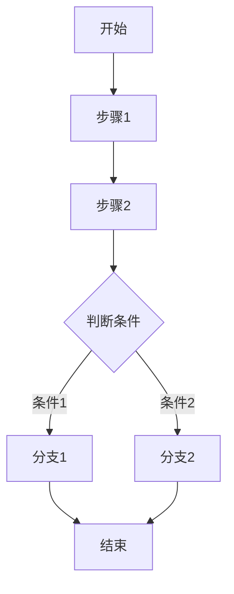

# \[产品名称]PRD文档模板

## 文档信息

| 项目   | 内容            |
| ---- | ------------- |
| 文档名称 | \[产品名称] PRD文档 |
| 版本号  | \[v1.0.0]        |
| 编写人  | \[姓名]         |
| 编写日期 | \[YYYY-MM-DD]    |
| 最后更新 | \[YYYY-MM-DD]    |

## 修订记录

| 版本     | 日期         | 修订人   | 修订内容 |
| ------ | ---------- | ----- | ---- |
| \[v1.0.0] | \[YYYY-MM-DD] | \[姓名] | \[初始版本] |

***

## 一、需求背景&目标

### [1.1] 业务需求描述

- \[为什么要做这个需求？解决什么业务问题？]

### [1.2] 用户痛点

- 用户痛点：\[用户面临什么问题？]
- 痛点影响：\[这个问题造成什么影响？]
- 解决价值：\[解决后能带来什么价值？]

### [1.3] 业务目标

- 核心目标：\[量化指标，如提升转化率X%]
- 业务收益：\[量化指标，如提升转化率X%]

***

## 二、用户与场景

### [2.2] 目标用户画像

- 描述核心用户群体的特征和需求

#### [2.2.1] 用户角色一：[角色名称，如：仓库管理员]

| 属性 | 描述 |
|------|------|
| **角色定义** | [一句话定义该角色，如：负责仓库日常出入库操作的一线员工] |
| **工作职责** | [列出2-3项核心职责] |
| **用户特征** | [年龄、职业、技术水平等] |
| **使用场景** | [在什么场景下使用] |
| **使用频率** | [每日/每周/偶尔] |
| **核心诉求** | [该角色最关心什么，如：操作快捷、减少出错] |
| **痛点问题** | [当前工作中遇到的问题] |

#### [2.2.2] 用户角色二：[角色名称，如：仓库主管]

- \[同上结构]

### [2.3] 应用场景（核心）

- 用"在什么情况下，用户想做什么，以达到什么目的"的句式描述

#### [2.3.1] 场景一：\[场景名称]

| 属性 | 描述 |
|------|------|
| **触发情境** | 在[什么情况/条件]下 |
| **用户行为** | [用户角色]想要[做什么操作] |
| **期望目的** | 以达到[什么目的/结果] |
| **当前痛点** | [现在有什么问题] |
| **解决方案** | [功能如何解决] |
| **前置条件** | [场景发生前需要满足的条件] |
| **后置结果** | [场景完成后的状态变化] |

**业务流程**：



**操作流程**：

1. [第一步操作及预期结果]
2. [第二步操作及预期结果]
3. [第三步操作及预期结果]
4. ...

#### [2.3.2] 场景二：\[场景名称]

- \[同上结构]

***

### [2.4] 业务价值

- 列出3-5个核心业务价值点

| [价值点1] | [具体说明] | [可衡量的指标，如：减少50%操作时间] |
| [价值点2] | [具体说明] | [可衡量的指标] |
| [价值点3] | [具体说明] | [可衡量的指标] |

## 三、详细功能描述

### [3.1] \[功能页面1名称]

#### [3.1.1] 功能描述

- **功能名称**：\[名称]
- **功能目标**：\[解决什么问题]
- **功能价值**：\[带来什么收益]

### [3.1.2] 页面图片

- \[页面截图]

#### [3.1.3] 业务流程


### [3.1.4] 角色权限设计

#### [3.1.4.1] 角色权限矩阵

| 权限项 | [角色1] | [角色2] | 系统管理员 |
|--------|---------|---------|-----------|
| [查看列表] | ✅ | ✅ | ✅ |
| [新增记录] | ✅ | ❌ | ✅ |
| [编辑记录] | ✅ | ❌ | ✅ |
| [删除记录] | ❌ | ❌ | ✅ |
| [审核操作] | ❌ | ✅ | ✅ |
| [导出数据] | ❌ | ✅ | ✅ |
| [系统配置] | ❌ | ❌ | ✅ |

#### [3.1.4.2] 数据权限规则 

| 角色 | 数据范围 | 说明 |
|------|---------|------|
| [角色1] | 本人创建的数据 | [只能查看和操作自己创建的记录] |
| [角色2] | 本部门数据 | [可查看本部门所有数据] |
| 系统管理员 | 全部数据 | [可查看和操作所有数据] |

### [3.1.5] 列表数据规范

#### [3.1.5.1] 数据获取方式

| 属性 | 描述 |
|------|------|
| **数据来源** | [表单名称/API接口，如：MES_chukudan] |
| **获取方式** | [实时查询/定时刷新/手动刷新] |
| **分页方式** | [前端分页/后端分页]，每页默认[20]条 |
| **加载策略** | [首次加载全部/懒加载/滚动加载] |

#### [3.1.5.2] 列表排序规则

| 优先级 | 排序字段 | 排序方式 | 说明 |
|--------|---------|---------|------|
| 1 | createTime | 降序(DESC) | 默认按创建时间倒序 |
| 2 | [字段名] | [升序/降序] | [排序说明] |
| 3 | [字段名] | [升序/降序] | [排序说明] |

**用户自定义排序**：[是否支持点击列头排序，支持哪些列]


#### [3.1.5.3] 列表字段定义

- 定义列表中显示的所有字段

| 序号 | 字段名称 | 数据类型 | 显示格式 | 数据来源 | 是否必填 | 规则 | 错误提示 |
|------|---------|---------|---------|---------|---------|---------|------|------|
| 1 | [单据编号] | String | 文本 | 系统生成 | 是 | 唯一标识，支持点击查看详情 |  |
| 2 | [单据日期] | Date | YYYY-MM-DD | 用户选择 | 是 | | 请选择日期 |   
| 3 | [状态] | Enum | 标签(Tag) | 业务计算 | 是 | 待提交/审核中/已完成 |  |
| 4 | [物料名称] | String | 文本 | 关联物料表 | 是 | 从MES_wuliao获取 |  |
| 5 | [数量] | Number | 整数 | 用户输入 | 是 | 大于0 | 请输入数量 |
| 6 | [仓库] | String | 文本 | 关联物料 | 是 | |  |
| 7 | [仓库名称] | String | 文本 | 关联仓库表 | 是 | |  |
| 8 | [创建人] | String | 文本 | 系统记录 | 是 | |  |
| 9 | [创建时间] | DateTime | YYYY-MM-DD HH:mm | 系统记录 | 是 | |  |
| 10 | [操作] | - | 按钮组 | - | - | 查看/编辑/删除 |

**字段数据源：**

- \[列出所有字段的数据源（上游、下游的业务数据链）]

**状态流转：**

| 当前状态 | 操作   | 下一状态 | 条件     |
| ---- | ---- | ---- | ------ |
| [待审核] | 审核通过 | 已通过  | 审核人确认  |
| [待审核] | 审核拒绝 | 已拒绝  | 填写拒绝原因 |

#### [3.1.5.4] 筛选条件

- 定义列表的搜索筛选条件

| 序号 | 筛选字段 | 字段标识 | 控件类型 | 查询方式 | 默认值 | 是否必填 | 备注 |
|------|---------|---------|---------|---------|--------|---------|------|
| 1 | [单据编号] | billCode | 输入框(Input) | 模糊匹配(like) | - | 否 | 支持部分匹配 |
| 2 | [单据日期] | billDate | 日期范围(DateRange) | 范围查询(between) | 近7天 | 否 | |
| 3 | [状态] | status | 下拉选择(Select) | 精确匹配(eq) | 全部 | 否 | 字典: BILL_STATUS |
| 4 | [仓库] | warehouseCode | 下拉选择(Select) | 精确匹配(eq) | - | 否 | 数据源: MES_cangku |
| 5 | [物料名称] | materialName | 输入框(Input) | 模糊匹配(like) | - | 否 | |

**筛选条件布局**：[一行显示几个筛选项，是否支持展开/收起]

***

### [3.1.6] 业务模块协同

#### [3.1.6.1] 上游模块依赖

- 本功能依赖哪些上游模块的数据或操作

| 上游模块 | 依赖类型 | 依赖说明 | 数据流向 |
|---------|---------|---------|---------|
| [模块名称] | 数据依赖 | [从该模块获取什么数据] | [模块A] → 本模块 |
| [模块名称] | 流程依赖 | [该模块的什么操作触发本模块] | [模块B] → 本模块 |

#### [3.1.6.2] 下游模块影响

- 本功能的操作会影响哪些下游模块

| 下游模块 | 影响类型 | 影响说明 | 数据流向 |
|---------|---------|---------|---------|
| [模块名称] | 数据更新 | [本模块操作后更新哪些数据] | 本模块 → [模块C] |
| [模块名称] | 流程触发 | [本模块完成后触发什么流程] | 本模块 → [模块D] |

#### [3.1.6.3]  模块协同流程图

```text
[上游模块A] ──数据──> [本模块] ──触发──> [下游模块C]
                        │
                        └──更新──> [下游模块D]
```

#### [3.1.6.4] 数据一致性规则
| 规则编号 | 规则描述 | 触发条件 | 处理方式 |
|---------|---------|---------|---------|
| DC1 | [数据一致性规则1] | [何时触发] | [同步更新/异步更新/事务回滚] |
| DC2 | [数据一致性规则2] | [何时触发] | [处理方式] |

***

### [3.1.7] 功能点详述

#### [3.1.7.1] 功能点一：[功能名称，如：登记入库]

##### [3.1.7.1.1] 功能描述

[一句话简要说明该功能的作用，如：用于登记物料入库信息，更新库存数量]

##### [3.1.7.1.2] 功能入口

| 属性 | 描述 |
|------|------|
| **入口位置** | [列表页工具栏/行操作按钮/菜单导航] |
| **入口形式** | [按钮/链接/图标] |
| **入口文案** | [按钮显示文字，如："新增入库"] |
| **显示条件** | [何时显示该入口，如：有新增权限时显示] |

##### [3.1.7.1.3] 业务规则

- 该功能的核心业务逻辑

| 规则编号 | 规则名称 | 规则描述 | 优先级 |
|---------|---------|---------|--------|
| BR1 | [规则名] | [详细描述规则逻辑] | 必须 |
| BR2 | [规则名] | [详细描述规则逻辑] | 必须 |
| BR3 | [规则名] | [详细描述规则逻辑] | 建议 |

**规则示例**：

- BR1_[库存校验]：出库数量不能超过当前库存数量，否则提示"库存不足，当前库存为XX"
- BR2_[状态流转]：只有"待提交"状态的单据可以编辑和删除
- BR3_[自动编号]：单据编号按规则"CK+年月日+4位流水号"自动生成

##### [3.1.7.1.4] 操作逻辑

- 对每个可交互元素的触发条件、行为、反馈进行说明

| 元素 | 类型 | 触发条件 | 行为描述 | 反馈方式 |
|------|------|---------|---------|---------|
| [新增]按钮 | 按钮(Button) | 点击 | 打开新增表单抽屉 | 抽屉从右侧滑出 |
| [保存]按钮 | 按钮(Button) | 点击 | 验证表单→提交数据→关闭抽屉→刷新列表 | Toast提示"保存成功" |
| [取消]按钮 | 按钮(Button) | 点击 | 关闭抽屉，不保存数据 | 如有修改，确认框提示 |
| [仓库]下拉 | 下拉(Select) | 选择变化 | 联动加载该仓库下的库位列表 | 库位下拉刷新 |
| [物料]输入 | 输入框(Input) | 失去焦点 | 校验物料编码是否存在 | 不存在时红色提示 |
| [数量]输入 | 数字框(Number) | 输入变化 | 实时计算金额=数量×单价 | 金额字段自动更新 |

##### [3.1.7.1.5] 表单字段

| 序号 | 字段名称 | 字段标识 | 控件类型 | 是否必填 | 验证规则 | 默认值 | 联动规则 |
|------|---------|---------|---------|---------|---------|--------|---------|
| 1 | [单据日期] | billDate | 日期(DatePicker) | 是 | 不能早于今天 | 当天 | - |
| 2 | [仓库] | warehouseCode | 下拉(Select) | 是 | - | - | 联动库位 |
| 3 | [库位] | positionCode | 下拉(Select) | 否 | - | - | 依赖仓库 |
| 4 | [物料编码] | materialCode | 输入(Input) | 是 | 必须存在于物料表 | - | 联动物料信息 |
| 5 | [物料名称] | materialName | 只读(Text) | - | - | - | 由物料编码带出 |
| 6 | [数量] | quantity | 数字(Number) | 是 | >0 | - | 联动金额计算 |
| 7 | [备注] | remark | 多行文本(TextArea) | 否 | 最多500字 | - | - |

#### [3.1.7.2] 功能点二：[功能名称]

- \[同上结构]

***

### [3.1.8] 数据模型设计

#### [3.1.8.1] 主实体：[实体名称]

**表单标识**：`MES_xxx`

##### [3.1.8.1.1] 字段定义

| 序号 | 字段名称 | 字段标识 | 数据类型 | 长度 | 是否必填 | 默认值 | 验证规则 | 备注 |
|------|---------|---------|---------|------|---------|--------|---------|------|
| 1 | [唯一标识] | _id | String | 32 | 系统 | UUID | - | 主键 |
| 2 | [单据编号] | billCode | String | 32 | 是 | 自动生成 | 唯一 | 业务主键 |
| 3 | [单据日期] | billDate | Date | - | 是 | 当天 | - | |
| 4 | [状态] | status | String | 20 | 是 | 待提交 | 枚举值 | 字典BILL_STATUS |
| 5 | [物料编码] | materialCode | String | 32 | 是 | - | 外键 | 关联MES_wuliao |
| 6 | [物料名称] | materialName | String | 100 | 是 | - | - | 冗余字段 |
| 7 | [数量] | quantity | Number | - | 是 | - | >0 | |
| 8 | [创建人] | createBy | String | 32 | 系统 | 当前用户 | - | |
| 9 | [创建时间] | createTime | DateTime | - | 系统 | 当前时间 | - | |
| 10 | [更新人] | updateBy | String | 32 | 系统 | 当前用户 | - | |
| 11 | [更新时间] | updateTime | DateTime | - | 系统 | 当前时间 | - | |

##### [3.1.8.1.2] 字段关联规则

| 源字段 | 目标字段 | 关联方式 | 说明 |
|--------|---------|---------|------|
| materialCode | materialName | 自动填充 | 选择物料后自动带出名称 |
| warehouseCode | warehouseName | 自动填充 | 选择仓库后自动带出名称 |
| quantity × unitPrice | amount | 自动计算 | 金额=数量×单价 |

#### [3.1.8.2] 关联实体

| 实体名称 | 表单标识 | 关联类型 | 关联字段 | 说明 |
|---------|---------|---------|---------|------|
| [物料] | MES_wuliao | 一对多 | materialCode | 物料基础数据 |
| [仓库] | MES_cangku | 一对多 | warehouseCode | 仓库基础数据 |
| [库位] | MES_cangwei | 一对多 | positionCode | 库位基础数据 |

***

### [3.1.9] UI界面设计

#### [3.1.9.1] 页面局部结构

**注意：以下页面结构，仅针对“表格”型页面！**

```text
页面根节点
├── KaiwuFlexDrawer（左侧详情抽屉-只读）
│   └── KaiwuFlexDetail（详情展示组件）
├── KaiwuFlexDialog（新增/编辑对话框）
│   └── KaiwuFlexForm（表单）
├── KaiwuFlexDialog（确认对话框）
└── KaiwuFlexLayout（主布局）
    ├── 搜索区域
    │   └── KaiwuFlexForm（筛选表单）
    ├── 工具栏
    │   └── 左侧按钮组（新增、下载模版、批量导入、批量导出、批量删除）
    └── KaiwuFlexTable2（数据列表）
        └── 操作列按钮（查看/编辑/删除）
```

#### [3.1.9.2] UI线框图

##### [3.1.9.2.1] 主列表页面

```text
┌─────────────────────────────────────────────────────────────────────────┐
│  搜索区域                                                                │
│  ┌──────────┐ ┌──────────┐ ┌────────────────┐  [搜索] [重置] [展开↓]   │
│  │ 单据编号  │ │ 状态 ▼   │ │ 单据日期 📅-📅 │                         │
│  └──────────┘ └──────────┘ └────────────────┘                          │
├─────────────────────────────────────────────────────────────────────────┤
│  工具栏                                                                  │
│  [+ 新增] 【下载模版】 [批量导入] [批量导出] [批量删除]                       │
├─────────────────────────────────────────────────────────────────────────┤
│  数据列表                                                                │
│  ┌──┬──────────┬──────────┬────────┬──────────┬──────────┬──────────┐  │
│  │☐ │ [单据编号]  │ [单据日期]  │ [状态]  │ [物料名称]  │ [数量]     │ 操作     │  │
│  ├──┼──────────┼──────────┼────────┼──────────┼──────────┼──────────┤  │
│  │☐ │ CK240101 │ 2024-01-01│ 待审核 │ 物料A    │ 100      │查看 编辑 │  │
│  │☐ │ CK240102 │ 2024-01-02│ 已完成 │ 物料B    │ 200      │查看      │  │
│  │☐ │ CK240103 │ 2024-01-03│ 待提交 │ 物料C    │ 50       │查看 编辑 删除│
│  └──┴──────────┴──────────┴────────┴──────────┴──────────┴──────────┘  │
│  共 186 条                    分页: [<] 1 2 3 ... 10 [>]    每页: [20条 ▼]│
└─────────────────────────────────────────────────────────────────────────┘
```

##### [3.1.9.2.2] 新增/编辑表单对话框

```text
┌────────────────────────────────────────────────────┐
│ 新增出库单                                      [X] │
├────────────────────────────────────────────────────┤
│                                                    │
│ 基本信息                                           │
│ ┌────────────────────────────────────────────────┐│
│ │ 单据日期: [2024-01-15     📅] *               ││
│ │ 仓    库: [请选择仓库     ▼] *               ││
│ │ 库    位: [请选择库位     ▼]                 ││
│ └────────────────────────────────────────────────┘│
│                                                    │
│ 物料信息                                           │
│ ┌────────────────────────────────────────────────┐│
│ │ 物料编码: [请输入物料编码    ] *  [🔍选择]    ││
│ │ 物料名称: [自动带出          ] (只读)        ││
│ │ 规格型号: [自动带出          ] (只读)        ││
│ │ 数    量: [请输入数量        ] *             ││
│ │ 单    位: [个                ] (只读)        ││
│ └────────────────────────────────────────────────┘│
│                                                    │
│ 其他信息                                           │
│ ┌────────────────────────────────────────────────┐│
│ │ 备    注: [                                  ]││
│ │           [                                  ]││
│ └────────────────────────────────────────────────┘│
│                                                    │
├────────────────────────────────────────────────────┤
│                         [取消]  [保存]             │
└────────────────────────────────────────────────────┘
```

##### [3.1.9.2.3] 详情页抽屉（左侧）

```text
┌─────────────────────────────────────────────────────────────────────────┐
│                                                                         │
│  ┌─────────────────────────────────────────────────────────────────┐   │
│  │ 单据详情                                              [X] 关闭   │   │
│  ├─────────────────────────────────────────────────────────────────┤   │
│  │                                                                 │   │
│  │ 基本信息                                                        │   │
│  │ ┌────────────────────────────────────────────────────────────┐ │   │
│  │ │ 单据编号: CK202401150001                                  │ │   │
│  │ │ 单据日期: 2024-01-15                                      │ │   │
│  │ │ 状    态: [待审核]                                        │ │   │
│  │ │ 仓    库: 原材料仓库                                      │ │   │
│  │ │ 库    位: A区1排1列                                       │ │   │
│  │ └────────────────────────────────────────────────────────────┘ │   │
│  │                                                                 │   │
│  │ 物料信息                                                        │   │
│  │ ┌────────────────────────────────────────────────────────────┐ │   │
│  │ │ 物料编码: WL001                                           │ │   │
│  │ │ 物料名称: 螺栓M8×30                                       │ │   │
│  │ │ 规格型号: 镀锌                                            │ │   │
│  │ │ 数    量: 100                                             │ │   │
│  │ │ 单    位: 个                                              │ │   │
│  │ └────────────────────────────────────────────────────────────┘ │   │
│  │                                                                 │   │
│  │ 其他信息                                                        │   │
│  │ ┌────────────────────────────────────────────────────────────┐ │   │
│  │ │ 备    注: 生产领用                                        │ │   │
│  │ │ 创建人: 张三                                              │ │   │
│  │ │ 创建时间: 2024-01-15 10:30:00                             │ │   │
│  │ │ 更新人: 张三                                              │ │   │
│  │ │ 更新时间: 2024-01-15 10:30:00                             │ │   │
│  │ └────────────────────────────────────────────────────────────┘ │   │
│  │                                                                 │   │
│  └─────────────────────────────────────────────────────────────────┘   │
│                                                                         │
└─────────────────────────────────────────────────────────────────────────┘
```

### [3.1.10] 边界与异常处理

#### [3.1.10.1] 网络异常

| 场景 | 检测方式 | 处理方式 | 用户提示 |
|------|---------|---------|---------|
| 请求超时 | 超时时间30s | 自动重试1次，失败后提示 | Toast: "网络超时，请稍后重试" |
| 断网 | navigator.onLine | 禁用提交按钮 | 全局提示: "网络已断开，请检查网络连接" |
| 服务器错误(5xx) | HTTP状态码 | 显示错误页面 | "服务器繁忙，请稍后重试" |
| 接口报错 | 业务错误码 | 显示具体错误信息 | 显示后端返回的错误消息 |

#### [3.1.10.2] 数据异常

| 场景 | 检测方式 | 处理方式 | 用户提示 |
|------|---------|---------|---------|
| 列表数据为空 | records.length === 0 | 显示空状态组件 | 图标+文字: "暂无数据" |
| 搜索无结果 | 有筛选条件但结果为空 | 显示空状态+重置按钮 | "未找到匹配数据，试试其他条件" |
| 详情数据不存在 | 接口返回404 | 返回列表页 | Toast: "数据不存在或已被删除" |
| 数据格式错误 | 前端解析异常 | 显示默认值或"-" | 控制台记录错误 |

#### [3.1.10.3] 权限异常

| 场景 | 检测方式 | 处理方式 | 用户提示 |
|------|---------|---------|---------|
| 无页面权限 | 路由守卫校验 | 跳转到403页面 | "您没有权限访问此页面" |
| 无操作权限 | 按钮权限校验 | 隐藏或禁用按钮 | 按钮禁用态，hover提示原因 |
| Token过期 | 401响应 | 跳转登录页 | "登录已过期，请重新登录" |
| 数据权限不足 | 业务校验 | 提示并阻止操作 | "您没有权限操作此数据" |

#### [3.1.10.4] 操作冲突

| 场景 | 检测方式 | 处理方式 | 用户提示 |
|------|---------|---------|---------|
| 并发编辑 | 乐观锁版本号 | 提示刷新后重试 | "数据已被他人修改，请刷新后重试" |
| 重复提交 | 按钮loading+防抖 | 禁用按钮直到请求完成 | 按钮显示loading状态 |
| 删除已使用数据 | 业务校验 | 阻止删除 | "该数据已被使用，无法删除" |
| 状态已变更 | 提交前校验状态 | 提示刷新 | "单据状态已变更，请刷新后操作" |

#### [3.1.10.5] 输入异常

| 场景 | 检测方式 | 处理方式 | 用户提示 |
|------|---------|---------|---------|
| 必填字段为空 | 表单验证 | 阻止提交，高亮字段 | 字段下方红字: "请输入XXX" |
| 格式不正确 | 正则校验 | 实时提示 | 字段下方红字: "格式不正确" |
| 超出范围 | 数值校验 | 阻止提交 | "数量必须在1-9999之间" |
| 特殊字符 | XSS过滤 | 自动过滤或提示 | "不能包含特殊字符" |

***

##### [3.2] \[功能页面2名称]

\[同上结构]

***

## 四、非功能性需求

### [4.1] 性能要求

| 指标 | 要求 | 说明 |
|------|------|------|
| 列表加载时间 | < 2秒 | 首屏数据加载完成 |
| 搜索响应时间 | < 1秒 | 点击搜索到结果展示 |
| 表单提交时间 | < 3秒 | 包含数据验证和保存 |
| 分页切换时间 | < 1秒 | 切换页码到数据展示 |
| 导出文件大小 | 单次最大10000条 | 超出需分批导出 |

### [4.2] 兼容性要求

| 类型 | 支持范围 |
|------|---------|
| 浏览器 | Chrome 80+, Firefox 75+, Safari 13+, Edge 80+ |
| 分辨率 | 最小支持 1280×720，推荐 1920×1080 |
| 设备 | PC端优先，平板可用 |

### [4.3] 安全要求

| 要求 | 说明 |
|------|------|
| XSS防护 | 所有用户输入进行转义处理 |
| CSRF防护 | 请求携带Token验证 |
| 敏感数据 | 密码等敏感字段不返回明文 |
| 操作日志 | 关键操作记录审计日志 |

***

## 五、测试要点

### [5.1] 功能测试

- [ ] 正常流程测试
- [ ] 异常流程测试
- [ ] 边界值测试
- [ ] 权限测试

### [5.2] 性能测试

- [ ] 负载测试
- [ ] 压力测试
- [ ] 稳定性测试

### [5.3] 安全测试

- [ ] 渗透测试
- [ ] 漏洞扫描
- [ ] 权限绕过测试

### [5.4] 兼容性测试

- [ ] 浏览器兼容性
- [ ] 移动端适配
- [ ] 分辨率适配

***

## 六、附录

### A. 相关文档

| 文档名称 | 链接/位置 | 说明 |
|---------|---------|------|
| UI设计稿 | [链接] | Figma/蓝湖设计稿 |
| 接口文档 | [链接] | API接口定义 |
| 数据字典 | [链接] | 字典数据定义 |

***