# 地大智慧工厂教学管理平台 - PRD需求文档

## 文档信息

| 项目 | 内容 |
|------|------|
| 文档名称 | 地大智慧工厂教学管理平台 PRD文档 |
| 版本号 | v1.0.0 |
| 编写人 | 孔维康 |
| 编写日期 | 2026-03-31 |

## 修订记录

| 版本 | 日期 | 修订人 | 修订内容 |
|------|------|--------|----------|
| v1.0.0 | 2026-03-31 | 孔维康 | 初始版本 |

---

## 1. 需求背景&目标

### 1.1 业务需求描述

地大智慧工厂教学管理平台是一个面向高校智能制造专业的综合性教学管理系统，旨在通过数字化手段提升教学管理效率，实现教务管理、教学资源管理、实训任务管理、考试管理、生产管理等业务的一体化管理。

### 1.2 用户痛点

- **教学资源分散**：视频教材、辅导教材、题库等资源分散存储，难以统一管理和共享
- **排课效率低**：手工排课工作量大，容易出现时间冲突
- **实训管理困难**：实训任务涉及设计、编程、工艺、加工、检测等多个环节，缺乏系统化管理
- **考试批阅繁琐**：传统纸质考试批阅效率低，缺乏自动批阅能力
- **刀具管理混乱**：实训过程中的刀具领用、归还、保养缺乏有效跟踪
- **数据孤岛**：各业务模块数据不互通，信息无法实时同步

### 1.3 业务目标

- **核心目标**：建立统一的教学资源管理平台，实现教学全流程数字化管理
- **业务收益**：
  - 教学资源利用率提升50%
  - 排课效率提升80%
  - 批阅效率提升60%（客观题自动批阅）
  - 刀具管理准确率达到99%

---

## 2. 功能概述

### 2.1 功能范围

**包含功能页面：**

**教务端：**
- 登录、部门管理、用户管理
- 视频教材库、辅导教材库、普通题目库、实训题目库、普通任务库、实训任务库、综合试卷库
- 教师管理、学生管理、上课时间段、课程管理、班级管理、教室管理、课程排课管理、课程表

**教师端：**
- 登录、部门管理、用户管理
- 首页概览、我的课程
- 普通任务、实训任务、综合试卷、普通任务批阅、实训任务批阅、综合试卷批阅、错题集库
- 视频教材、辅导教材、普通题目、实训题目
- 设备OEE、设备状态分析、设备稼动率监控、设备报警分析、报警分类表、综合报表、设备数据采集看板
- 项目模版管理、项目阶段管理、项目管理、项目任务管理、项目甘特图
- 刀具类型管理、刀具档案管理、刀具BOM、保养项、保养方案、刀具需求计划、备刀任务单、刀具保养管理
- 生产工单、排产策略管理

**学生端：**
- 登录、部门管理、用户管理、我的课程
- 我的普通任务、我的实训任务、我的综合考试、错题集、工艺管理
- 刀具需求计划、刀具管理、刀具补申领

### 2.2 用户画像（角色&使用场景）

#### 教务员
- **用户角色**：系统管理员
- **用户特征**：高校教务管理人员，熟悉教学管理流程，具备基础计算机操作能力
- **使用场景**：学期初维护基础数据、进行课程排课、查看教学资源
- **核心诉求**：高效管理教师、学生、课程等基础数据，合理安排课程

#### 教师
- **用户角色**：任课教师
- **用户特征**：高校专业教师，具备专业知识和教学经验
- **使用场景**：维护教学资源、发布任务/试卷、批阅作业、管理刀具需求
- **核心诉求**：便捷发布教学任务，高效批阅学生作业

#### 学生
- **用户角色**：学习者
- **用户特征**：高校在校学生，熟悉互联网产品使用
- **使用场景**：查看课程、完成任务、参加考试、管理刀具
- **核心诉求**：清晰获取任务，便捷完成任务，及时查看成绩

### 2.3 使用场景

**场景1：课程排课**
- 场景描述：学期初教务员需要为各专业课程安排任课教师、上课时间、上课地点
- 用户目标：高效完成课程排课，避免时间冲突
- 当前痛点：手工排课工作量大，容易出现时间冲突
- 解决方案：提供可视化排课界面，自动检测冲突

**场景2：普通任务发布与完成**
- 场景描述：教师需要发布课后作业，学生在线完成
- 用户目标：教师便捷发布，学生方便完成
- 当前痛点：传统纸质作业收集困难，批阅效率低
- 解决方案：在线发布任务，客观题自动批阅

**场景3：实训任务全流程**
- 场景描述：学生进行设计、编程、工艺、加工、检测等实训任务
- 用户目标：完整记录实训过程，获取实训数据
- 当前痛点：实训过程缺乏系统化管理
- 解决方案：提供五类实训任务的完整流程管理

**场景4：综合考试**
- 场景描述：教师需要组织综合考试，包含普通题目和实训题目，学生在线完成考试
- 用户目标：教师便捷组卷发布，学生公平考试，系统自动+人工批阅结合
- 当前痛点：综合考试组卷复杂，批阅工作量大，成绩统计困难
- 解决方案：支持从普通题目库和实训题目库选题组卷，客观题自动批阅，主观题教师批阅，自动生成成绩报告

**场景5：刀具管理**
- 场景描述：加工类实训需要领用、使用、归还刀具
- 用户目标：准确管理刀具流转
- 当前痛点：刀具领用归还缺乏有效跟踪
- 解决方案：与AGV对接的刀具全生命周期管理

**场景6：项目管理**
- 场景描述：教师需要创建和管理项目，设定项目阶段和任务，学生参与项目执行并跟踪进度
- 用户目标：教师便捷管理项目进度，学生清晰了解任务分工，实时跟踪项目执行情况
- 当前痛点：项目进度难以可视化跟踪，任务分工不明确，学生执行进度无法实时掌握
- 解决方案：支持项目模版管理、甘特图可视化展示项目进度、自动/手动创建项目任务、学生填写执行结果并更新任务状态

**场景7：APS智能排产**
- 场景描述：加工类任务发布后，系统根据设备状态、任务优先级、物料库存等约束条件进行智能排产，自动分配设备和生成刀具需求计划
- 用户目标：教师高效完成生产工单排产，优化设备利用率，确保任务按时完成
- 当前痛点：手工排产效率低，难以考虑多维度约束条件，设备利用率不高，排产冲突难以及时发现
- 解决方案：支持APS智能排产算法，自动检查物料库存、设备可用性等约束条件，支持优先级设置（P1-P5），支持设备更换和局部优化，排产后自动生成刀具需求计划和备刀任务单

---

## 3. 详细功能描述

### 3.1 模块分组说明

本文档按用户角色将功能模块分为三大组：

- **3.1 - 3.18**：教务端功能模块（18个）
- **3.19 - 3.56**：教师端功能模块（38个）
- **3.57 - 3.69**：学生端功能模块（13个）

---

<!-- 教务端功能模块开始 -->

## 3.2 教务端功能模块

### 3.2.1 登录模块

#### 3.2.2 功能描述
- **功能名称**：登录
- **功能目标**：详见系统设计文档
- **功能价值**：基础功能模块

#### 3.1.2 详细内容
> 该模块为系统基础功能模块，详细设计请参考系统设计文档或通用权限管理模块规范。

#### 3.1.3 验收标准
- [ ] 功能正常运行
- [ ] 符合安全规范

### 3.2 教务端-部门管理

#### 3.2.1 功能描述
- **功能名称**：部门管理
- **功能目标**：详见系统设计文档
- **功能价值**：基础功能模块

#### 3.2.2 详细内容
> 该模块为系统基础功能模块，详细设计请参考系统设计文档或通用权限管理模块规范。

#### 3.2.3 验收标准
- [ ] 功能正常运行
- [ ] 符合安全规范

### 3.3 教务端-用户管理

#### 3.3.1 功能描述
- **功能名称**：用户管理
- **功能目标**：详见系统设计文档
- **功能价值**：基础功能模块

#### 3.3.2 详细内容
> 该模块为系统基础功能模块，详细设计请参考系统设计文档或通用权限管理模块规范。

#### 3.3.3 验收标准
- [ ] 功能正常运行
- [ ] 符合安全规范

### 3.4 教务端-教师管理

#### 3.4.1 功能描述
- **功能名称**：教师管理
- **功能目标**：维护教师基础数据
- **功能价值**：建立教师档案，支持课程排课和任务发布

#### 3.4.2 页面图片
- [页面截图占位]

#### 3.4.3 业务流程

```mermaid
flowchart TD
    A[进入教师管理] --> B[展示教师列表]
    B --> C{选择操作}
    C -->|新增| D[填写教师信息]
    C -->|编辑| E[修改教师信息]
    C -->|删除| F[确认删除]
    C -->|批量导入| G[上传Excel文件]
    C -->|查询| H[输入查询条件]
    D --> I[保存]
    E --> I
    F --> J[删除成功]
    G --> K[解析Excel]
    K --> L[导入成功]
    I --> M{验证通过?}
    M -->|是| N[操作成功]
    M -->|否| O[显示错误提示]
    O --> C
```

#### 3.4.4 业务规则

**列表展示字段：**
| 字段名 | 说明 |
|--------|------|
| 教师姓名 | 教师姓名 |
| 工号 | 教师工号 |
| 性别 | 男/女 |
| 手机号 | 11位手机号 |
| 职称 | 教授/副教授/讲师/助教 |
| 部门 | 所属部门 |
| 创建人 | 创建人 |
| 创建时间 | 创建时间 |
| 操作 | 编辑/删除 |

**输入规则：**
| 字段名 | 类型 | 必填 | 规则 | 错误提示 |
|--------|------|------|------|----------|
| 教师姓名 | 字符串 | 是 | 2-20字符 | 请输入教师姓名 |
| 工号 | 字符串 | 是 | 2-20字符 | 请输入教师工号 |
| 性别 | 选择 | 是 | 男/女 | 请选择性别 |
| 手机号 | 字符串 | 是 | 11位手机号，唯一 | 手机号格式错误或已存在 |
| 职称 | 选择 | 否 | 教授/副教授/讲师/助教 | - |
| 部门 | 选择 | 是 | 选择已有的部门 | 请选择部门 |
| 备注 | 字符串 | 否 | 2-50字符 | - |

**字段数据源：**
- 职称：系统预设选项
- 性别：系统预设选项
- 部门：从组织架构里选择

**业务逻辑：**
1. 手机号全局唯一，不可重复
2. 维护后自动同步到用户管理（可用手机号+密码登录）
3. 支持按模板批量导入
4. 已排课的教师不可删除

**状态流转：**
| 当前状态 | 操作 | 下一状态 | 条件 |
|----------|------|----------|------|
| 正常 | 删除 | 已删除 | 未排课 |
| 正常 | 编辑 | 正常 | 保存成功 |

**权限模型：**
- 可见角色：教务员
- 可操作角色：教务员
- 数据权限：全部教师

**页面功能点说明：**
- 新增按钮：打开新增教师弹窗
- 编辑按钮：打开编辑教师弹窗
- 删除按钮：确认后删除（已排课时置灰）
- 批量导入：下载模板，上传Excel导入
- 导出：导出教师数据

**异常处理：**
- 手机号重复：提示"该手机号已存在"
- 已排课删除：提示"该教师已排课，无法删除"
- 导入格式错误：提示"Excel格式不正确，请下载模板"

**埋点设计：**
- 新增教师：event_teacher_add
- 编辑教师：event_teacher_edit
- 删除教师：event_teacher_delete
- 批量导入：event_teacher_import

#### 3.4.5 验收标准

**功能验收：**
- [ ] 支持新增教师
- [ ] 支持编辑教师
- [ ] 支持删除教师
- [ ] 支持批量导入
- [ ] 支持数据导出
- [ ] 自动同步到用户管理

**边界条件：**
- [ ] 手机号唯一性校验
- [ ] 已排课教师不可删除
- [ ] 批量导入格式校验

**性能要求：**
- [ ] 列表加载 < 1秒
- [ ] 批量导入支持1000条数据

---

### 3.5 教务端-学生管理

#### 3.5.1 功能描述
- **功能名称**：学生管理
- **功能目标**：维护学生基础数据
- **功能价值**：建立学生档案，支持课程排课和任务分配

#### 3.5.2 页面图片
- [页面截图占位]

#### 3.5.3 业务流程
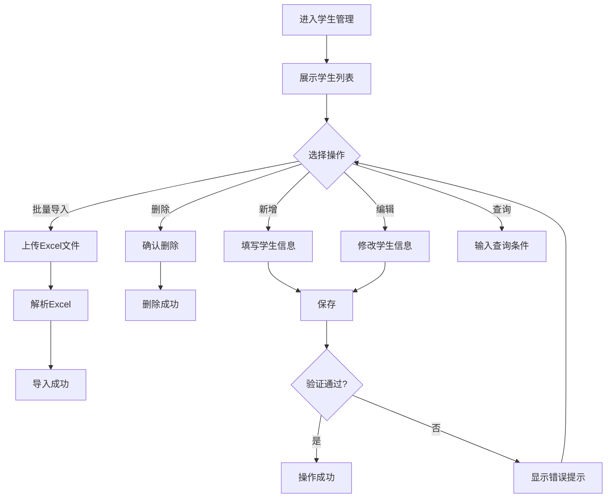
```mermaid
flowchart TD
    A[进入学生管理] --> B[展示学生列表]
    B --> C{选择操作}
    C -->|新增| D[填写学生信息]
    C -->|编辑| E[修改学生信息]
    C -->|删除| F[确认删除]
    C -->|批量导入| G[上传Excel文件]
    C -->|查询| H[输入查询条件]
    D --> I[保存]
    E --> I
    F --> J[删除成功]
    G --> K[解析Excel]
    K --> L[导入成功]
    I --> M{验证通过?}
    M -->|是| N[操作成功]
    M -->|否| O[显示错误提示]
    O --> C
```

#### 3.5.4 业务规则

**列表展示字段：**
| 字段名 | 说明 |
|--------|------|
| 学生姓名 | 学生姓名 |
| 学号 | 学生学号 |
| 性别 | 男/女 |
| 手机号 | 11位手机号 |
| 所属班级 | 所属班级 |
| 创建人 | 创建人 |
| 创建时间 | 创建时间 |
| 操作 | 编辑/删除 |

**输入规则：**
| 字段名 | 类型 | 必填 | 规则 | 错误提示 |
|--------|------|------|------|----------|
| 学生姓名 | 字符串 | 是 | 2-20字符 | 请输入学生姓名 |
| 学号 | 字符串 | 是 | 唯一 | 学号已存在 |
| 性别 | 选择 | 否 | 男/女 | - |
| 手机号 | 字符串 | 是 | 11位手机号，唯一 | 手机号格式错误或已存在 |
| 所属班级 | 选择 | 是 | 选择已有班级 | 请选择班级 |

**字段数据源：**
- 性别：系统预设选项
- 所属班级：班级管理页维护的数据

**业务逻辑：**
1. 手机号、学号全局唯一
2. 维护后自动同步到用户管理
3. 支持按模板批量导入
4. 已排课的学生不可删除

**状态流转：**
| 当前状态 | 操作 | 下一状态 | 条件 |
|----------|------|----------|------|
| 正常 | 删除 | 已删除 | 未排课 |
| 正常 | 编辑 | 正常 | 保存成功 |

**权限模型：**
- 可见角色：教务员
- 可操作角色：教务员
- 数据权限：全部学生

**页面功能点说明：**
- 新增按钮：打开新增学生弹窗
- 编辑按钮：打开编辑学生弹窗
- 删除按钮：确认后删除（已排课时置灰）
- 批量导入：下载模板，上传Excel导入

**异常处理：**
- 手机号/学号重复：提示"该手机号/学号已存在"
- 已排课删除：提示"该学生已排课，无法删除"

**埋点设计：**
- 新增学生：event_student_add
- 编辑学生：event_student_edit
- 删除学生：event_student_delete
- 批量导入：event_student_import

#### 3.5.5 验收标准

**功能验收：**
- [ ] 支持新增学生
- [ ] 支持编辑学生
- [ ] 支持删除学生
- [ ] 支持批量导入
- [ ] 自动同步到用户管理

**边界条件：**
- [ ] 手机号、学号唯一性校验
- [ ] 已排课学生不可删除

**性能要求：**
- [ ] 列表加载 < 1秒
- [ ] 支持10000个学生数据

---

### 3.6 教务端-视频教材库

#### 3.6.1 功能描述
- **功能名称**：视频教材库查看
- **功能目标**：查看教师端维护的视频教材资源
- **功能价值**：教务员可查看所有视频教材，便于教学管理和课程安排

#### 3.17.2 页面图片
- [页面截图占位]

#### 3.17.3 业务流程
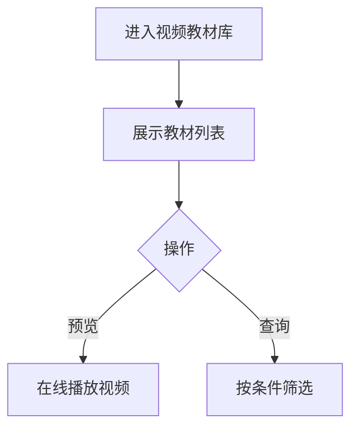
```mermaid
flowchart TD
    A[进入视频教材库] --> B[展示教材列表]
    B --> C{操作}
    C -->|预览| D[在线播放视频]
    C -->|查询| E[按条件筛选]
```

#### 3.17.4 业务规则

**数据说明：**
- 本页面数据从教师端-视频教材（**公用**）同步获取
- 教务端仅支持查看，不支持增删改操作
- **同步规则**：教师创建视频教材时，只有勾选"公用视频"选项的数据才会同步到本页面

**列表展示字段：**
| 字段名 | 说明 |
|--------|------|
| 教材名称 | 视频教材名称 |
| 视频文件 | 视频文件信息；点击支持以对话框方式播放 |
| 适用课程 | 关联课程 |
| 备注 | 教材备注信息 |
| 创建人 | 创建人 |
| 创建时间 | 创建时间 |
| 操作 | 播放/下载 |

**字段数据源：**
- 数据同步来源：教师端-视频教材（公用视频标签页）
- 同步方式：实时同步
- 同步条件：教师创建时勾选"公用"选项

**业务逻辑：**
1. 数据从教师端视频教材页面同步获取
2. **仅同步标记为"公用"的视频教材**（教师端"公用视频"标签页数据）
3. 教务端仅支持查看和预览
4. 支持按课程、关键词检索
5. 不支持任何编辑操作

**权限模型：**
- 可见角色：教务员
- 可操作角色：无（仅查看）
- 数据权限：全部视频教材（只读）

**页面功能点说明：**
- 预览按钮：打开视频播放器
- 查询条件：支持多条件组合筛选
- 无新增/编辑/删除按钮

#### 3.17.5 验收标准

**功能验收：**
- [ ] 数据从教师端同步显示
- [ ] 支持在线预览
- [ ] 支持条件检索
- [ ] 无编辑操作权限

**性能要求：**
- [ ] 列表加载 < 2秒
- [ ] 视频播放流畅

---

### 3.7 教务端-辅导教材库

#### 3.7.1 功能描述
- **功能名称**：辅导教材库查看
- **功能目标**：查看教师端维护的辅导教材资源
- **功能价值**：教务员可查看所有辅导教材，便于教学管理和课程安排

#### 3.18.2 页面图片
- [页面截图占位]

#### 3.18.3 业务流程
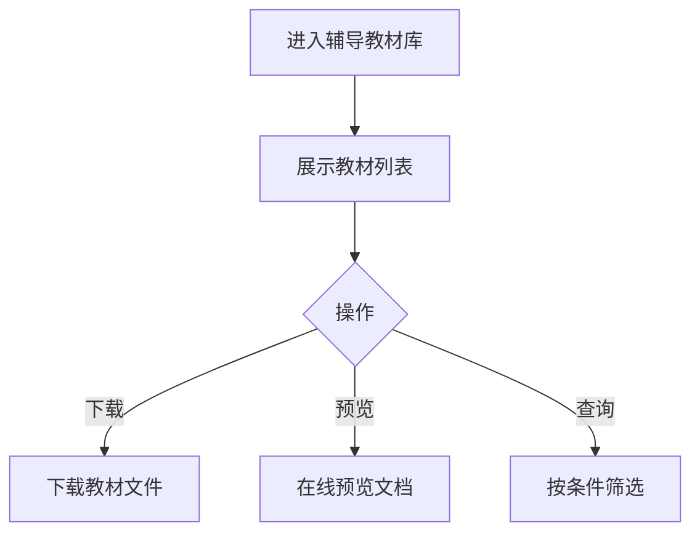
```mermaid
flowchart TD
    A[进入辅导教材库] --> B[展示教材列表]
    B --> C{操作}
    C -->|下载| D[下载教材文件]
    C -->|预览| E[在线预览文档]
    C -->|查询| F[按条件筛选]
```

#### 3.18.4 业务规则

**数据说明：**
- 本页面数据从教师端-辅导教材（**公用**）同步获取
- 教务端仅支持查看、下载、预览，不支持增删改操作
- **同步规则**：教师创建辅导教材时，只有勾选"公用辅导教材"选项的数据才会同步到本页面

**列表展示字段：**
| 字段名 | 说明 |
|--------|------|
| 教材名称 | 辅导教材名称 |
| 文档文件 | 文档文件信息；点击支持以对话框方式播放 |
| 适用课程 | 关联课程 |
| 备注 | 教材备注信息 |
| 创建人 | 上传教师 |
| 创建时间 | 上传时间 |
| 操作 | 预览/下载 |

**字段数据源：**
- 数据同步来源：教师端-辅导教材（公用辅导教材标签页）
- 同步方式：实时同步
- 同步条件：教师创建时勾选"公用"选项

**业务逻辑：**
1. 数据从教师端辅导教材页面同步获取
2. **仅同步标记为"公用"的辅导教材**（教师端"公用辅导教材"标签页数据）
3. 教务端支持查看、下载和预览
4. 支持按分类、关键词检索
5. 不支持任何编辑操作

**权限模型：**
- 可见角色：教务员
- 可操作角色：无（仅查看/下载/预览）
- 数据权限：全部辅导教材（只读）

**页面功能点说明：**
- 下载按钮：下载文档到本地
- 预览按钮：在线预览PDF文档
- 查询条件：支持多条件组合筛选
- 无新增/编辑/删除按钮

#### 3.18.5 验收标准

**功能验收：**
- [ ] 数据从教师端同步显示
- [ ] 支持PDF在线预览
- [ ] 支持文档下载
- [ ] 支持分类检索
- [ ] 无编辑操作权限

---

### 3.8 教务端-普通题目库

#### 3.8.1 功能描述
- **功能名称**：普通题目库查看
- **功能目标**：查看教师端维护的普通题目资源
- **功能价值**：教务员可查看所有普通题目，便于教学质量监控

#### 3.8.2 页面图片
- [页面截图占位]

#### 3.8.3 业务流程
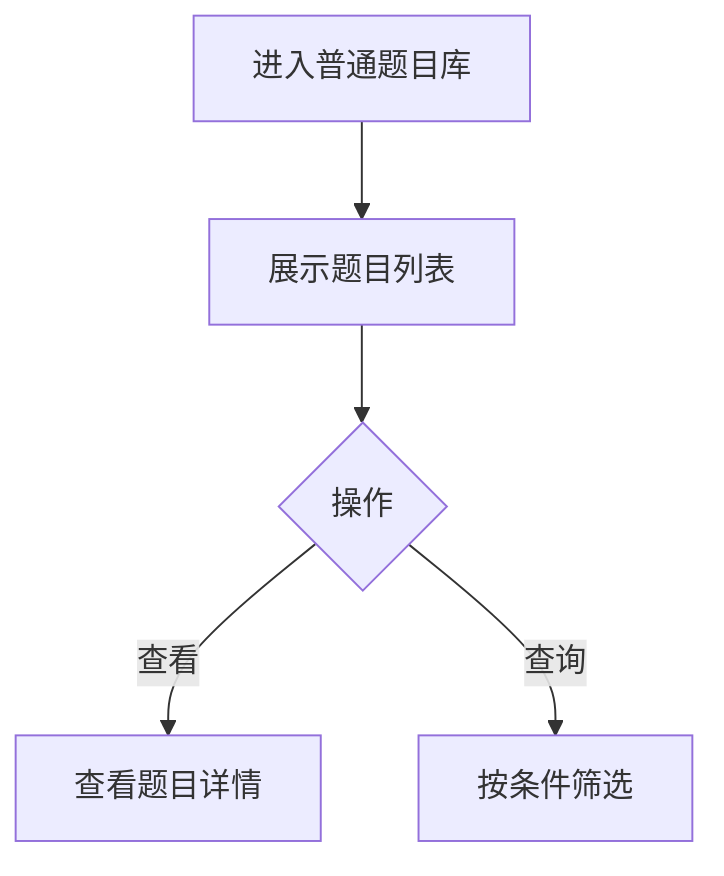
```mermaid
flowchart TD
    A[进入普通题目库] --> B[展示题目列表]
    B --> C{操作}
    C -->|查看| D[查看题目详情]
    C -->|查询| E[按条件筛选]
```

#### 3.8.4 业务规则

**数据说明：**
- 本页面数据从教师端-普通题目（**公用**）同步获取
- 教务端仅支持查看，不支持增删改操作
- **同步规则**：教师创建普通题目时，只有勾选"公用题目"选项的数据才会同步到本页面

**列表展示字段：**
| 字段名 | 说明 |
|--------|------|
| 题目名称 | 题目名称 |
| 适用课程 | 关联课程 |
| 题目类型 | 单选/多选/判断/填空/简答 |
| 难度 | 简单/中等/困难 |
| 创建人 | 创建教师 |
| 创建时间 | 创建时间 |
| 操作 | 查看/取消（仅待审批状态显示取消） |

**字段数据源：**
- 数据同步来源：教师端-普通题目（公用题目标签页）
- 同步方式：实时同步
- 同步条件：教师创建时勾选"公用"选项

**业务逻辑：**
1. 数据从教师端普通题目页面同步获取
2. **仅同步标记为"公用"的普通题目**（教师端"公用题目"标签页数据）
3. 教务端仅支持查看题目详情
4. 支持按题型、难度、知识点检索
5. 不支持任何编辑操作

**权限模型：**
- 可见角色：教务员
- 可操作角色：无（仅查看）
- 数据权限：全部普通题目（只读）

**页面功能点说明：**
- 查看按钮：查看题目详情
- 查询条件：支持多条件组合筛选
- 无新增/编辑/删除/导入/导出按钮

#### 3.8.5 验收标准

**功能验收：**
- [ ] 数据从教师端同步显示
- [ ] 支持查看题目详情
- [ ] 支持按条件检索
- [ ] 无编辑操作权限

---

### 3.9 教务端-实训题目库

#### 3.9.1 功能描述
- **功能名称**：实训题目库查看
- **功能目标**：查看教师端维护的实训题目资源
- **功能价值**：教务员可查看所有实训题目，便于教学质量监控

#### 3.9.2 页面图片
- [页面截图占位]

#### 3.9.3 业务流程
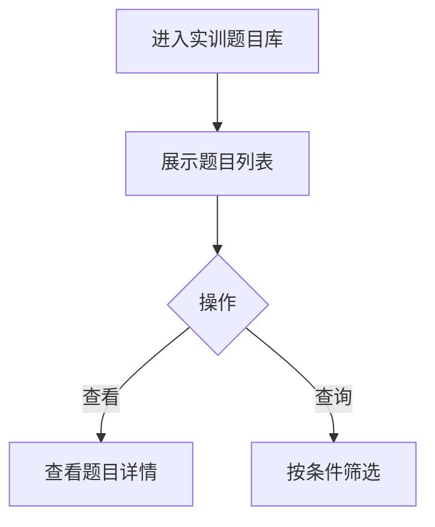
```mermaid
flowchart TD
    A[进入实训题目库] --> B[展示题目列表]
    B --> C{操作}
    C -->|查看| D[查看题目详情]
    C -->|查询| E[按条件筛选]
```

#### 3.9.4 业务规则

**数据说明：**
- 本页面数据从教师端-实训题目（**公用**）同步获取
- 教务端仅支持查看，不支持增删改操作
- **同步规则**：教师创建实训题目时，只有勾选"公用题目"选项的数据才会同步到本页面

**列表展示字段：**
| 字段名 | 说明 |
|--------|------|
| 题目名称 | 实训题目名称 |
| 适用课程 | 关联课程 |
| 实训类型 | 设计/编程/工艺/加工/检测 |
| 难度 | 简单/中等/困难 |
| 创建人 | 创建教师 |
| 创建时间 | 创建时间 |
| 操作 | 查看 |

**字段数据源：**
- 数据同步来源：教师端-实训题目（公用题目标签页）
- 同步方式：实时同步
- 同步条件：教师创建时勾选"公用"选项

**业务逻辑：**
1. 数据从教师端实训题目页面同步获取
2. **仅同步标记为"公用"的实训题目**（教师端"公用题目"标签页数据）
3. 教务端仅支持查看题目详情
4. 支持按实训类型、难度检索
4. 不支持任何编辑操作

**权限模型：**
- 可见角色：教务员
- 可操作角色：无（仅查看）
- 数据权限：全部实训题目（只读）

**页面功能点说明：**
- 查看按钮：查看题目详情
- 查询条件：支持多条件组合筛选
- 无新增/编辑/删除/导入按钮

#### 3.9.5 验收标准

**功能验收：**
- [ ] 数据从教师端同步显示
- [ ] 支持查看题目详情
- [ ] 支持按条件检索
- [ ] 无编辑操作权限

---

### 3.10 教务端-普通任务库

#### 3.10.1 功能描述
- **功能名称**：普通任务库查看
- **功能目标**：查看教师端维护的普通任务模板
- **功能价值**：教务员可查看所有普通任务模板，便于教学管理

#### 3.10.2 页面图片
- [页面截图占位]

#### 3.10.3 业务流程
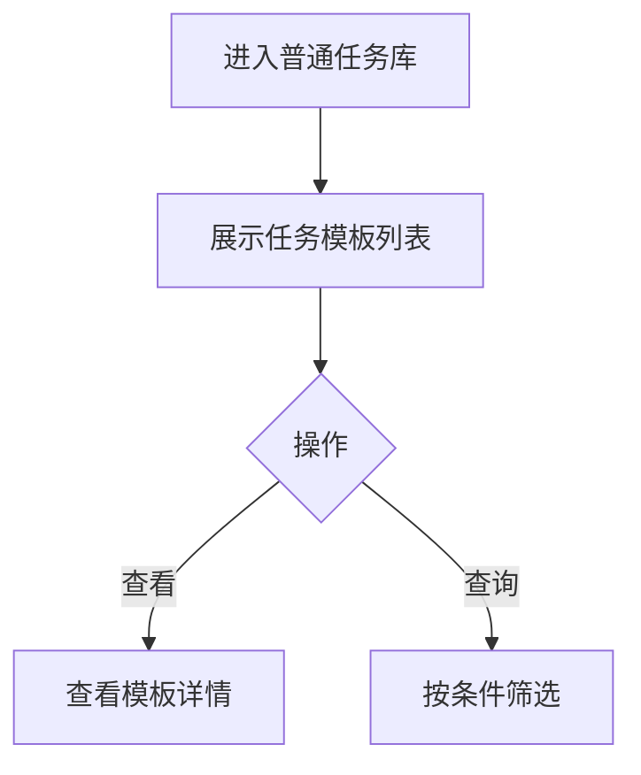
```mermaid
flowchart TD
    A[进入普通任务库] --> B[展示任务模板列表]
    B --> C{操作}
    C -->|查看| D[查看模板详情]
    C -->|查询| E[按条件筛选]
```

#### 3.10.4 业务规则

**数据说明：**
- 本页面数据从教师端-普通任务同步获取
- 教务端仅支持查看，不支持增删改操作

**列表展示字段：**
| 字段名 | 说明 |
|--------|------|
| 任务名称 | 任务名称 |
| 题目数量 | 包含题目数量 |
| 适用课程 | 关联课程 |
| 任课教师 | 关联任课教师 |
| 上课班级 | 查看；点击以对话框形式，表格列表方式展示对应班级学生数据 |
| 上课时间 | 查看；点击以对话框形式，表格列表方式展示对应的上课日期、上课时间段数据 |
| 上课教室 | 关联任务的上课教室 |
| 创建人 | 创建教师 |
| 创建时间 | 创建时间 |
| 操作 | 查看 |

**字段数据源：**
- 数据同步来源：教师端-普通任务
- 同步方式：实时同步

**业务逻辑：**
1. 数据从教师端普通任务页面同步获取
2. 教务端仅支持查看模板详情
3. 支持按任务类型检索
4. 不支持任何编辑操作

**权限模型：**
- 可见角色：教务员
- 可操作角色：无（仅查看）
- 数据权限：全部普通任务（只读）

**页面功能点说明：**
- 查看按钮：查看模板详情
- 查询条件：支持多条件组合筛选
- 无新增/编辑/删除按钮

#### 3.10.5 验收标准

**功能验收：**
- [ ] 数据从教师端同步显示
- [ ] 支持查看模板详情
- [ ] 支持按条件检索
- [ ] 无编辑操作权限

---

### 3.11 教务端-实训任务库

#### 3.11.1 功能描述
- **功能名称**：实训任务库查看
- **功能目标**：查看教师端维护的实训任务模板
- **功能价值**：教务员可查看所有实训任务模板，便于教学管理

#### 3.11.2 页面图片
- [页面截图占位]

#### 3.11.3 业务流程
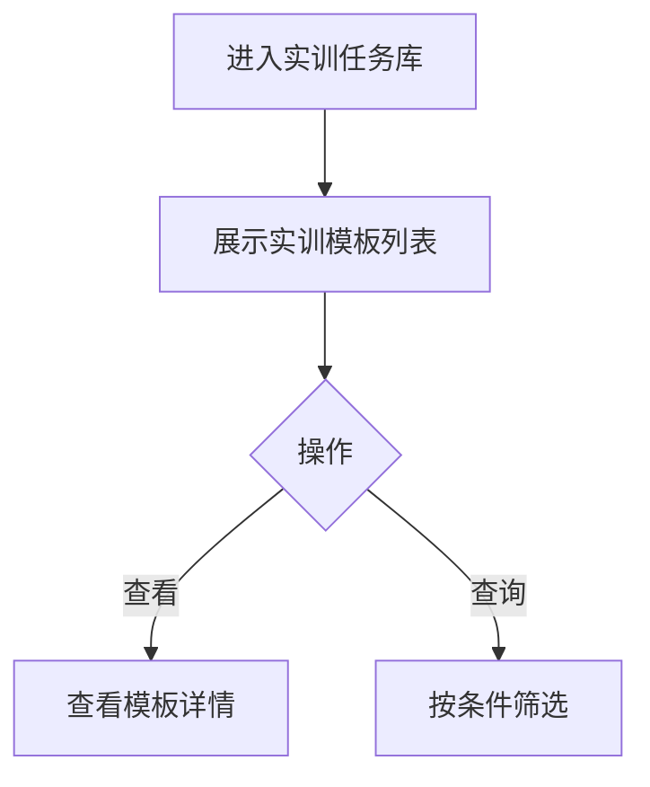
```mermaid
flowchart TD
    A[进入实训任务库] --> B[展示实训模板列表]
    B --> C{操作}
    C -->|查看| D[查看模板详情]
    C -->|查询| E[按条件筛选]
```

#### 3.11.4 业务规则

**数据说明：**
- 本页面数据从教师端-实训任务同步获取
- 教务端仅支持查看，不支持增删改操作

**列表展示字段：**
| 字段名 | 说明 |
|--------|------|
| 任务名称 | 任务名称 |
| 题目数量 | 包含题目数量 |
| 适用课程 | 关联课程 |
| 任课教师 | 关联任课教师 |
| 上课班级 | 查看；点击以对话框形式，表格列表方式展示对应班级学生数据 |
| 上课时间 | 查看；点击以对话框形式，表格列表方式展示对应的上课日期、上课时间段数据 |
| 上课教室 | 关联任务的上课教室 |
| 创建人 | 创建教师 |
| 创建时间 | 创建时间 |
| 操作 | 查看 |

**字段数据源：**
- 数据同步来源：教师端-实训任务
- 同步方式：实时同步

**业务逻辑：**
1. 数据从教师端实训任务页面同步获取
2. 教务端仅支持查看模板详情
3. 支持按实训类型检索
4. 不支持任何编辑操作

**权限模型：**
- 可见角色：教务员
- 可操作角色：无（仅查看）
- 数据权限：全部实训任务（只读）

**页面功能点说明：**
- 查看按钮：查看模板详情
- 查询条件：支持多条件组合筛选
- 无新增/编辑/删除按钮

#### 3.11.5 验收标准

**功能验收：**
- [ ] 数据从教师端同步显示
- [ ] 支持查看模板详情
- [ ] 支持按条件检索
- [ ] 无编辑操作权限

---

### 3.12 教务端-综合试卷库

#### 3.12.1 功能描述
- **功能名称**：综合试卷库查看
- **功能目标**：查看教师端维护的综合试卷
- **功能价值**：教务员可查看所有综合试卷，便于考试管理

#### 3.12.2 页面图片
- [页面截图占位]

#### 3.12.3 业务流程
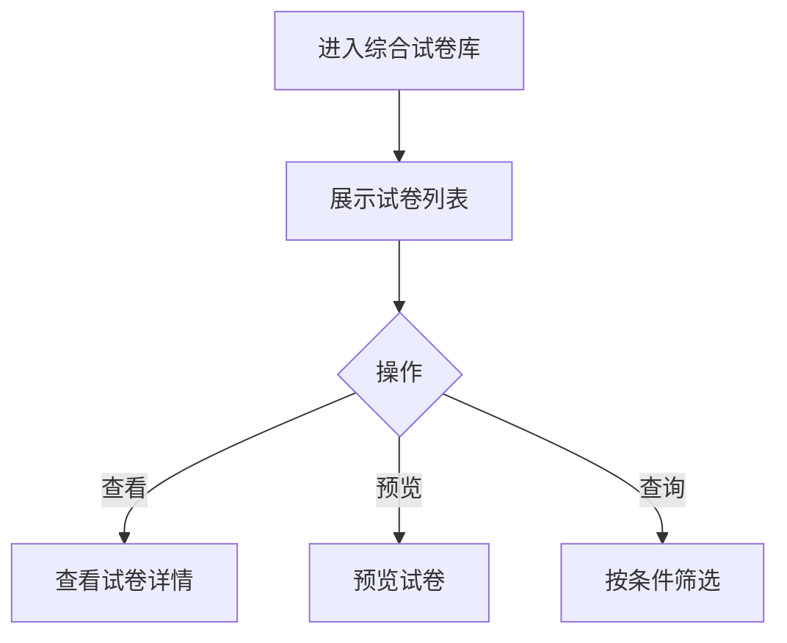
```mermaid
flowchart TD
    A[进入综合试卷库] --> B[展示试卷列表]
    B --> C{操作}
    C -->|查看| D[查看试卷详情]
    C -->|预览| E[预览试卷]
    C -->|查询| F[按条件筛选]
```

#### 3.12.4 业务规则

**数据说明：**
- 本页面数据从教师端-综合试卷同步获取
- 教务端仅支持查看和预览，不支持增删改操作

**列表展示字段：**
| 字段名 | 说明 |
|--------|------|
| 试卷名称 | 试卷名称 |
| 题目数量 | 包含题目数量 |
| 适用课程 | 关联课程 |
| 任课教师 | 关联任课教师 |
| 上课班级 | 查看；点击以对话框形式，表格列表方式展示对应班级学生数据 |
| 上课时间 | 查看；点击以对话框形式，表格列表方式展示对应的上课日期、上课时间段数据 |
| 上课教室 | 关联任务的上课教室 |
| 创建人 | 创建教师 |
| 创建时间 | 创建时间 |
| 操作 | 查看 |

**字段数据源：**
- 数据同步来源：教师端-综合试卷
- 同步方式：实时同步

**业务逻辑：**
1. 数据从教师端综合试卷页面同步获取
2. 教务端支持查看试卷详情和预览
3. 支持按试卷名称、创建人检索
4. 不支持任何编辑操作

**权限模型：**
- 可见角色：教务员
- 可操作角色：无（仅查看/预览）
- 数据权限：全部综合试卷（只读）

**页面功能点说明：**
- 查看按钮：查看试卷详情
- 预览按钮：预览试卷内容
- 查询条件：支持多条件组合筛选
- 无新增/编辑/删除按钮

#### 3.12.5 验收标准

**功能验收：**
- [ ] 数据从教师端同步显示
- [ ] 支持查看试卷详情
- [ ] 支持试卷预览
- [ ] 支持按条件检索
- [ ] 无编辑操作权限

---

### 3.13 教务端-上课时间段管理

#### 3.13.1 功能描述
- **功能名称**：上课时间段管理
- **功能目标**：维护学校上课时间段基础数据
- **功能价值**：为课程排课提供时间维度数据

#### 3.13.2 页面图片
- [页面截图占位]

#### 3.13.3 业务流程
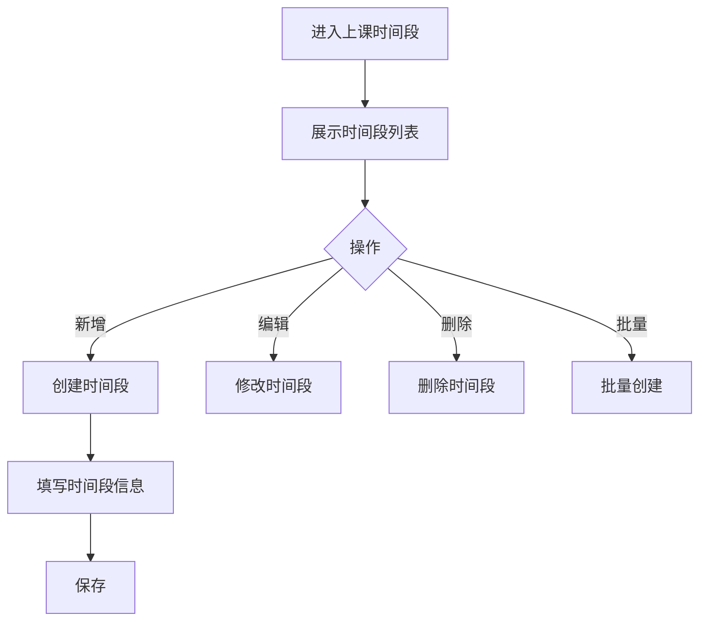
```mermaid
flowchart TD
    A[进入上课时间段] --> B[展示时间段列表]
    B --> C{操作}
    C -->|新增| D[创建时间段]
    C -->|编辑| E[修改时间段]
    C -->|删除| F[删除时间段]
    C -->|批量| G[批量创建]
    D --> H[填写时间段信息]
    H --> I[保存]
```

#### 3.13.4 业务规则

**列表展示字段：**
| 字段名 | 说明 |
|--------|------|
| 上课时间段 | 上课时间段 |
| 备注 | 备注信息 |
| 创建人 | 创建人 |
| 创建时间 | 创建时间 |
| 操作 | 编辑/删除 |

**输入规则：**
| 字段名 | 类型 | 必填 | 规则 | 错误提示 |
|--------|------|------|------|----------|
| 时间段名称 | 字符串 | 是 | 如"第1-2节" | 请输入时间段名称 |
| 开始时间 | 时间 | 是 | HH:MM格式 | 请选择开始时间 |
| 结束时间 | 时间 | 是 | HH:MM格式 | 请选择结束时间 |
| 备注 | 文本 | 否 | ≤500字符 | - |

**业务逻辑：**
1. 维护学校标准上课时间段
2. 支持批量创建（如一次性创建1-8节课）
3. 时间段被排课引用后不可删除

**约束规则：**
- 时间段不能重叠
- 被排课引用的时间段不能删除

**权限模型：**
- 可见角色：教务员
- 可操作角色：教务员
- 数据权限：全部时间段

#### 3.13.5 验收标准

**功能验收：**
- [ ] 支持创建时间段
- [ ] 支持批量创建
- [ ] 时间段冲突检测
- [ ] 引用检测（被引用不可删除）

---

### 3.14 教务端-课程管理

#### 3.14.1 功能描述
- **功能名称**：课程管理
- **功能目标**：维护学校课程基础数据
- **功能价值**：为排课和教学提供课程数据

#### 3.14.2 页面图片
- [页面截图占位]

#### 3.14.3 业务流程
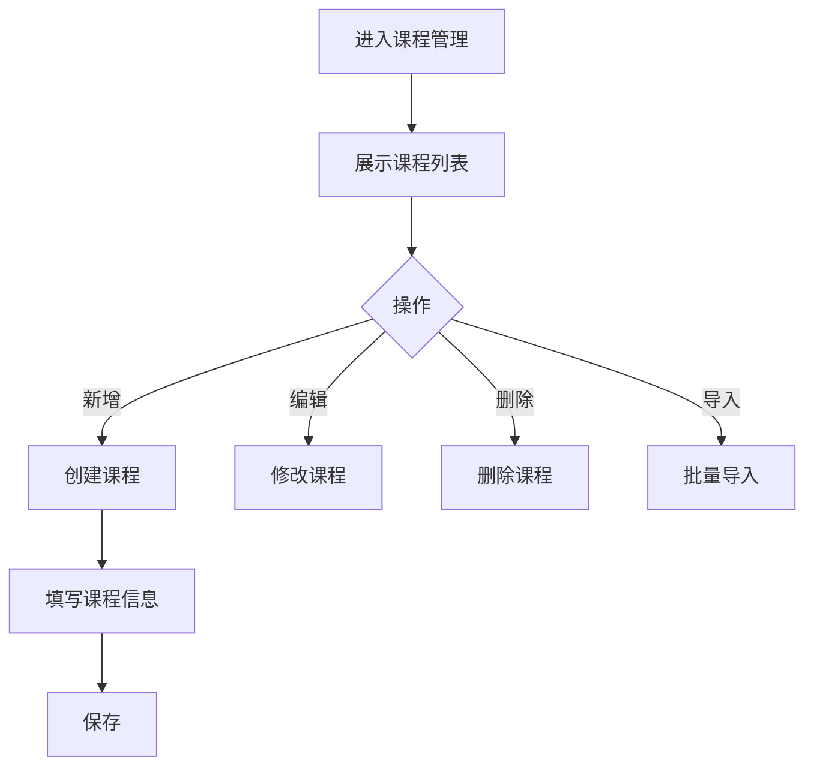
```mermaid
flowchart TD
    A[进入课程管理] --> B[展示课程列表]
    B --> C{操作}
    C -->|新增| D[创建课程]
    C -->|编辑| E[修改课程]
    C -->|删除| F[删除课程]
    C -->|导入| G[批量导入]
    D --> H[填写课程信息]
    H --> I[保存]
```

#### 3.14.4 业务规则

**列表展示字段：**
| 字段名 | 说明 |
|--------|------|
| 课程编号 | 课程编号 |
| 课程名称 | 课程名称 |
| 备注 | 备注 |
| 创建人 | 创建人 |
| 创建时间 | 创建时间 |
| 操作 | 编辑/删除 |

**输入规则：**
| 字段名 | 类型 | 必填 | 规则 | 错误提示 |
|--------|------|------|------|----------|
| 课程编码 | 字符串 | 是 | 唯一，如"CSE101" | 请输入课程编码 |
| 课程名称 | 字符串 | 是 | 2-50字符 | 请输入课程名称 |
| 备注 | 文本 | 否 | ≤500字符 | - |

**业务逻辑：**
1. 课程编码全局唯一
2. 支持批量导入课程
3. 被排课引用的课程不可删除

**约束规则：**
- 课程编码唯一
- 被排课引用的课程不可删除

**权限模型：**
- 可见角色：教务员、教师
- 可操作角色：教务员
- 数据权限：全部课程

#### 3.14.5 验收标准

**功能验收：**
- [ ] 支持课程CRUD
- [ ] 支持批量导入
- [ ] 编码唯一性校验
- [ ] 引用检测

---

### 3.15 教务端-班级管理

#### 3.15.1 功能描述
- **功能名称**：班级管理
- **功能目标**：维护学校班级基础数据
- **功能价值**：为学生管理和排课提供班级数据

#### 3.15.2 页面图片
- [页面截图占位]

#### 3.15.3 业务流程
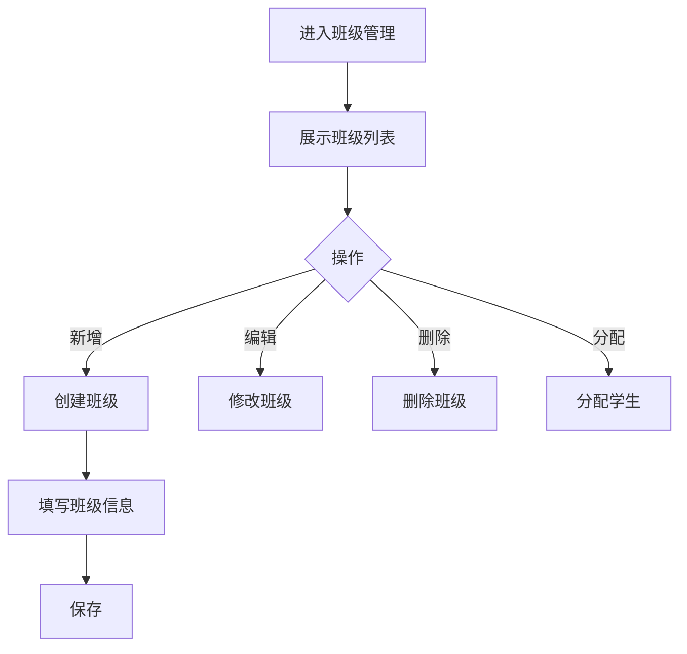
```mermaid
flowchart TD
    A[进入班级管理] --> B[展示班级列表]
    B --> C{操作}
    C -->|新增| D[创建班级]
    C -->|编辑| E[修改班级]
    C -->|删除| F[删除班级]
    C -->|分配| G[分配学生]
    D --> H[填写班级信息]
    H --> I[保存]
```

#### 3.15.4 业务规则

**列表展示字段：**
| 字段名 | 说明 |
|--------|------|
| 班级编号 | 班级编号 |
| 班级名称 | 班级名称 |
| 备注 | 备注 |
| 创建人 | 创建人 |
| 创建时间 | 创建时间 |
| 操作 | 编辑/删除 |

**输入规则：**
| 字段名 | 类型 | 必填 | 规则 | 错误提示 |
|--------|------|------|------|----------|
| 班级编码 | 字符串 | 是 | 唯一 | 请输入班级编码 |
| 班级名称 | 字符串 | 是 | 2-50字符 | 请输入班级名称 |
| 备注 | 文本 | 否 | ≤500字符 | - |

**业务逻辑：**
1. 班级编码全局唯一
2. 支持分配学生到班级
3. 支持查看班级学生列表
4. 被学生、排课引用的班级不可删除

**约束规则：**
- 班级编码唯一
- 被学生、排课引用的班级不可删除

**权限模型：**
- 可见角色：教务员
- 可操作角色：教务员
- 数据权限：全部班级

#### 3.15.5 验收标准

**功能验收：**
- [ ] 支持班级CRUD
- [ ] 支持分配学生
- [ ] 支持查看班级学生
- [ ] 引用检测

---

### 3.16 教务端-教室管理

#### 3.16.1 功能描述
- **功能名称**：教室管理
- **功能目标**：维护学校教室基础数据
- **功能价值**：为排课提供教室资源数据

#### 3.16.2 页面图片
- [页面截图占位]

#### 3.16.3 业务流程
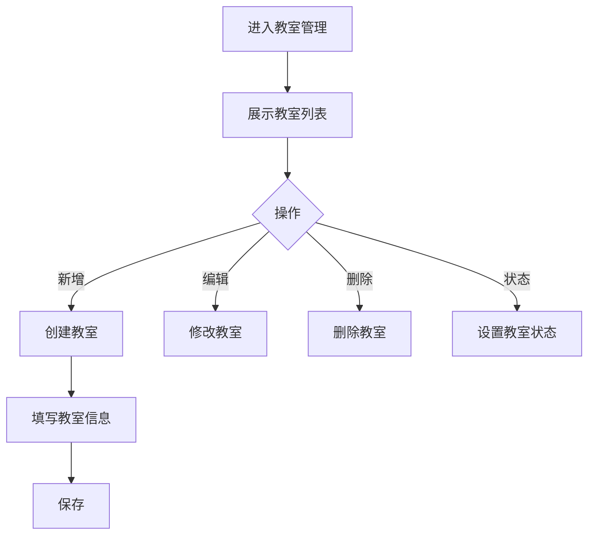
```mermaid
flowchart TD
    A[进入教室管理] --> B[展示教室列表]
    B --> C{操作}
    C -->|新增| D[创建教室]
    C -->|编辑| E[修改教室]
    C -->|删除| F[删除教室]
    C -->|状态| G[设置教室状态]
    D --> H[填写教室信息]
    H --> I[保存]
```

#### 3.16.4 业务规则

**列表展示字段：**
| 字段名 | 说明 |
|--------|------|
| 教室编号 | 教室编号 |
| 教室名称 | 教室名称 |
| 备注 | 备注 |
| 创建人 | 创建人 |
| 创建时间 | 创建时间 |
| 操作 | 编辑/删除 |

**输入规则：**
| 字段名 | 类型 | 必填 | 规则 | 错误提示 |
|--------|------|------|------|----------|
| 教室编码 | 字符串 | 是 | 唯一，如"A101" | 请输入教室编码 |
| 教室名称 | 字符串 | 是 | 2-50字符 | 请输入教室名称 |
| 备注 | 文本 | 否 | ≤500字符 | - |

**业务逻辑：**
1. 教室编码全局唯一
2. 支持设置教室状态（可用/维修中/停用）
3. 维修中/停用的教室不可排课
4. 被排课引用的教室不可删除

**约束规则：**
- 教室编码唯一
- 被排课引用的教室不可删除
- 维修中/停用教室不可用于排课

**权限模型：**
- 可见角色：教务员
- 可操作角色：教务员
- 数据权限：全部教室

#### 3.16.5 验收标准

**功能验收：**
- [ ] 支持教室CRUD
- [ ] 支持状态管理
- [ ] 容量校验
- [ ] 引用检测

---

### 3.17 教务端-课程排课管理

#### 3.17.1 功能描述
- **功能名称**：课程排课管理
- **功能目标**：为课程安排教师、时间、地点
- **功能价值**：实现智能化排课，避免时间冲突

#### 3.17.2 页面图片
- [页面截图占位]

#### 3.17.3 业务流程
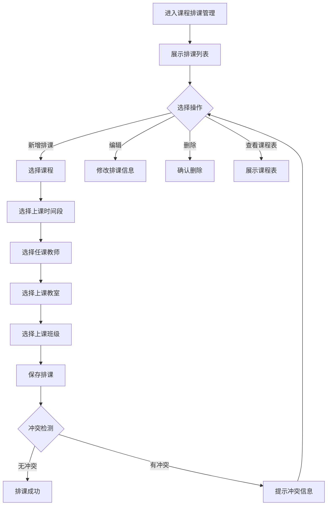
```mermaid
flowchart TD
    A[进入课程排课管理] --> B[展示排课列表]
    B --> C{选择操作}
    C -->|新增排课| D[选择课程]
    D --> E[选择上课时间段]
    E --> F[选择任课教师]
    F --> G[选择上课教室]
    G --> H[选择上课班级]
    H --> I[保存排课]
    C -->|编辑| J[修改排课信息]
    C -->|删除| K[确认删除]
    C -->|查看课程表| L[展示课程表]
    I --> M{冲突检测}
    M -->|无冲突| N[排课成功]
    M -->|有冲突| O[提示冲突信息]
    O --> C
```

#### 3.17.4 业务规则

**列表展示字段：**
| 字段名 | 说明 |
|--------|------|
| 课程名称 | 课程名称 |
| 任课教师 | 授课教师 |
| 上课班级 | 查看；点击以对话框形式，表格列表方式查看该班级的所有学生数据 |
| 上课日期 | 上课日期；若一门课程有多个上课日期，那么该门课程，就做多条数据方式展示 |
| 上课时间段 | 查看；点击以对话框形式，表格列表方式查看该课程的所有上课时间段数据（一门课程单上课日期可能会有多个上课时间段；此时合并一条数据展示） |
| 上课教室 | 教室 |
| 创建人 | 创建人 |
| 创建时间 | 创建时间 |
| 操作 | 编辑/删除 |

**输入规则：**
| 字段名 | 类型 | 必填 | 规则 | 错误提示 |
|--------|------|------|------|----------|
| 课程 | 选择 | 是 | 选择已有课程 | 请选择课程 |
| 任课教师 | 选择 | 是 | 选择已有教师 | 请选择教师 |
| 上课班级 | 选择 | 是 | 选择已有班级 | 请选择班级 |
| 上课日期 | 日期 | 是 | 未来日期 | 请选择上课日期 |
| 上课时间段 | 选择 | 是 | 选择已有时间段 | 请选择时间段 |
| 上课教室 | 选择 | 是 | 选择已有教室 | 请选择教室 |

**字段数据源：**
- 课程：课程管理页维护的数据
- 任课教师：教师管理页维护的数据
- 上课班级：班级管理页维护的数据
- 上课时间段：上课时间段页维护的数据
- 上课教室：教室管理页维护的数据

**业务逻辑：**
1. 自动检测冲突（教师时间冲突、教室时间冲突、班级时间冲突）
2. 已发布任务的排课不可编辑时间段
3. 支持按周/月视图查看课程表
4. 支持批量排课

**状态流转：**
| 当前状态 | 操作 | 下一状态 | 条件 |
|----------|------|----------|------|
| 未发布任务 | 编辑 | 已修改 | 保存成功 |
| 未发布任务 | 删除 | 已删除 | 确认删除 |
| 已发布任务 | 编辑 | 限制编辑 | 仅可编辑非时间段字段 |

**权限模型：**
- 可见角色：教务员
- 可操作角色：教务员
- 数据权限：全部排课数据

**页面功能点说明：**
- 新增排课：打开排课弹窗，选择各项信息
- 编辑：修改排课信息（已发布任务时限制编辑时间段）
- 删除：删除排课（已发布任务时置灰）
- 课程表：按周/月视图展示排课

**异常处理：**
- 时间冲突：提示"该时间段教师/教室/班级已被占用"
- 已发布任务编辑：提示"已发布任务，不可编辑时间段"
- 网络异常：提示"操作失败，请重试"

**埋点设计：**
- 新增排课：event_schedule_add
- 编辑排课：event_schedule_edit
- 删除排课：event_schedule_delete

#### 3.17.5 验收标准

**功能验收：**
- [ ] 支持新增排课
- [ ] 支持编辑排课
- [ ] 支持删除排课
- [ ] 支持冲突检测
- [ ] 支持课程表视图

**边界条件：**
- [ ] 教师时间冲突检测
- [ ] 教室时间冲突检测
- [ ] 班级时间冲突检测
- [ ] 已发布任务限制编辑

**性能要求：**
- [ ] 排课列表加载 < 1秒
- [ ] 冲突检测响应 < 500ms

---

### 3.18 教务端-课程表

#### 3.18.1 功能描述
- **功能名称**：课程表
- **功能目标**：按模板展示所有已排课的数据
- **功能价值**：直观展示课程安排

#### 3.18.2 页面图片
- [页面截图占位]

#### 3.18.3 业务流程
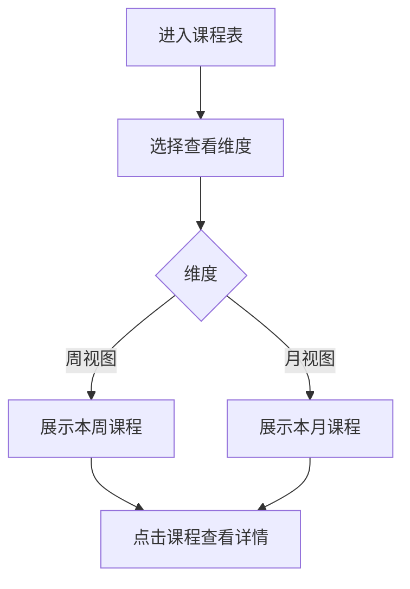
```mermaid
flowchart TD
    A[进入课程表] --> B[选择查看维度]
    B --> C{维度}
    C -->|周视图| D[展示本周课程]
    C -->|月视图| E[展示本月课程]
    D --> F[点击课程查看详情]
    E --> F
```

#### 3.18.4 业务规则

**列表展示字段：**
| 字段名 | 说明 |
|--------|------|
| 课程名称 | 课程名称 |
| 任课教师 | 授课教师 |
| 上课班级 | 上课班级 |
| 上课时间 | 上课时间 |
| 上课地点 | 教室 |
| 课程状态 | 未开始/进行中/已结束 |

**输入规则：**
- 无输入字段，纯展示页面

**字段数据源：**
- 课程数据：课程排课管理页的数据

**业务逻辑：**
1. 按模板展示所有已排课的数据
2. 支持周视图、月视图切换
3. 支持按班级、教师、教室筛选
4. 点击课程可查看详情

**课程表展示内容：**
- 课程名称
- 任课教师
- 上课班级
- 上课教室
- 上课时间段

**权限模型：**
- 可见角色：教务员
- 可操作角色：教务员
- 数据权限：全部排课数据

**页面功能点说明：**
- 周视图/月视图切换：切换展示维度
- 筛选条件：按班级、教师、教室筛选
- 课程卡片：展示课程信息
- 点击查看详情：查看课程详情

**异常处理：**
- 无排课：展示空状态"暂无排课数据"

**埋点设计：**
- 切换视图：event_schedule_view_switch
- 查看详情：event_schedule_detail_view

#### 3.18.5 验收标准

**功能验收：**
- [ ] 支持周视图展示
- [ ] 支持月视图展示
- [ ] 支持多维度筛选
- [ ] 支持查看课程详情

**性能要求：**
- [ ] 课程表加载 < 2秒
- [ ] 支持1000条排课数据

---

<!-- 教师端功能模块开始 -->

## 3.3 教师端功能模块

### 3.19 教师端-登录

#### 3.51.1 功能描述
- **功能名称**：教师登录
- **功能目标**：提供教师身份认证入口
- **功能价值**：保障教师账户安全，区分教师权限

#### 3.51.2 页面图片
- [页面截图占位]

#### 3.51.3 业务流程
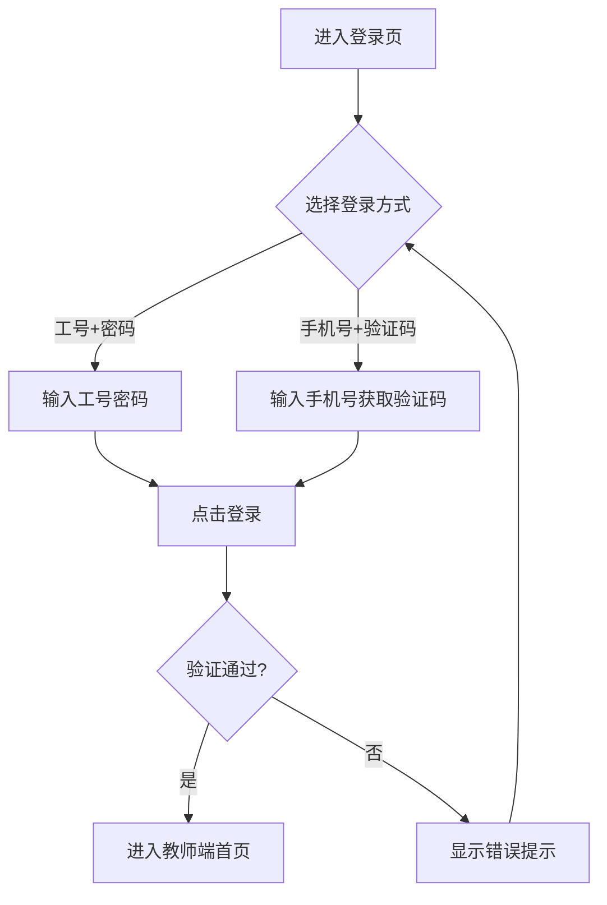
```mermaid
flowchart TD
    A[进入登录页] --> B{选择登录方式}
    B -->|工号+密码| C[输入工号密码]
    B -->|手机号+验证码| D[输入手机号获取验证码]
    C --> E[点击登录]
    D --> E
    E --> F{验证通过?}
    F -->|是| G[进入教师端首页]
    F -->|否| H[显示错误提示]
    H --> B
```

#### 3.51.4 业务规则

**列表展示字段：**
| 字段名 | 说明 |
|--------|------|
| 名称 | 名称 |
| 状态 | 状态 |
| 创建时间 | 创建时间 |
| 操作 | 编辑/删除/查看 |

**输入规则：**
| 字段名 | 类型 | 必填 | 规则 | 错误提示 |
|--------|------|------|------|----------|
| 工号/手机号 | 字符串 | 是 | 工号或11位手机号 | 请输入工号或手机号 |
| 密码 | 字符串 | 是 | 6-20位字符 | 密码长度6-20位 |
| 验证码 | 字符串 | 条件必填 | 6位数字 | 请输入6位验证码 |

**业务逻辑：**
1. 支持"工号+密码"和"手机号+验证码"两种登录方式
2. 验证码有效期5分钟
3. 连续登录失败5次后锁定账号30分钟
4. 首次登录需修改初始密码

**权限模型：**
- 可见角色：教师
- 角色校验：登录后校验角色为教师

#### 3.51.5 验收标准

**功能验收：**
- [ ] 支持工号密码登录
- [ ] 支持手机号验证码登录
- [ ] 登录失败锁定机制
- [ ] 角色校验

---

### 3.20 教师端-部门管理

#### 功能描述
- **功能名称**：部门管理
- **功能目标**：详见系统设计文档
- **功能价值**：基础功能模块

#### 详细内容
> 该模块为系统基础功能模块，详细设计请参考系统设计文档或通用权限管理模块规范。

#### 验收标准
- [ ] 功能正常运行
- [ ] 符合安全规范
### 3.21 教师端-用户管理

#### 功能描述
- **功能名称**：用户管理
- **功能目标**：详见系统设计文档
- **功能价值**：基础功能模块

#### 详细内容
> 该模块为系统基础功能模块，详细设计请参考系统设计文档或通用权限管理模块规范。

#### 验收标准
- [ ] 功能正常运行
- [ ] 符合安全规范

### 3.22 教师端-首页概览

#### 3.16.1 功能描述
- **功能名称**：首页概览
- **功能目标**：展示教师工作台的统计信息和快捷入口
- **功能价值**：帮助教师快速了解工作状态和待办事项

#### 3.16.2 页面图片
- [页面截图占位]

#### 3.16.3 业务流程
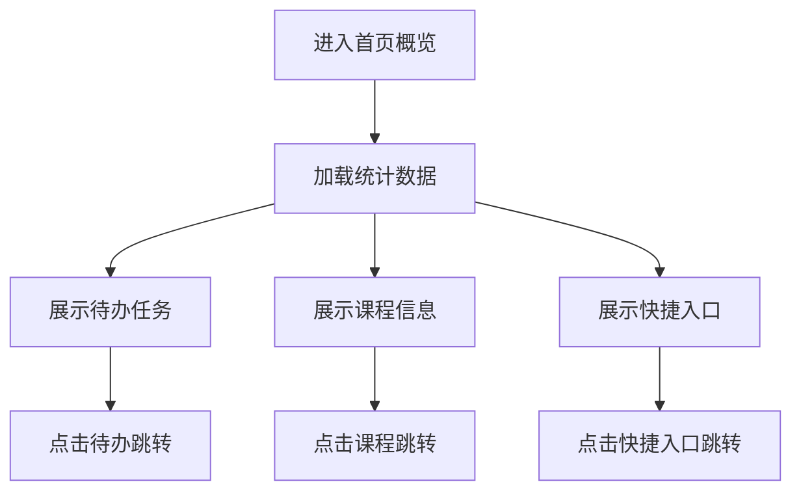
```mermaid
flowchart TD
    A[进入首页概览] --> B[加载统计数据]
    B --> C[展示待办任务]
    B --> D[展示课程信息]
    B --> E[展示快捷入口]
    C --> F[点击待办跳转]
    D --> G[点击课程跳转]
    E --> H[点击快捷入口跳转]
```

#### 3.16.4 业务规则

**输入规则：**
- 无输入字段，纯展示页面

**字段数据源：**
- 待办任务：普通任务批阅、实训任务批阅、综合试卷批阅的待批阅数据
- 课程信息：我的课程页的数据
- 统计数据：任务发布数、批阅完成数、学生人数等

**业务逻辑：**
1. 展示教师待批阅任务数量
2. 展示本周课程安排
3. 展示快捷入口（发布任务、批阅、查看报表等）
4. 展示通知公告

**状态流转：**
- 无状态流转，纯展示页面

**权限模型：**
- 可见角色：教师
- 可操作角色：教师
- 数据权限：仅自己的数据

**页面功能点说明：**
- 待办任务卡片：点击跳转对应批阅页面
- 课程卡片：点击跳转我的课程页面
- 快捷入口：快速跳转到常用功能
- 通知公告：展示系统通知

**异常处理：**
- 无数据：展示空状态或0
- 网络异常：提示"加载失败，请重试"

**埋点设计：**
- 页面访问：event_homepage_visit
- 快捷入口点击：event_homepage_shortcut_click

#### 3.16.5 验收标准

**功能验收：**
- [ ] 展示待批阅任务数量
- [ ] 展示本周课程安排
- [ ] 展示快捷入口
- [ ] 点击跳转正常

**性能要求：**
- [ ] 页面加载 < 2秒
- [ ] 数据实时更新

---

### 3.23 教师端-我的课程

#### 3.43.1 功能描述
- **功能名称**：我的课程
- **功能目标**：教师查看自己所授课程
- **功能价值**：方便教师管理自己的教学任务

#### 3.43.2 页面图片
- [页面截图占位]

#### 3.43.3 业务流程
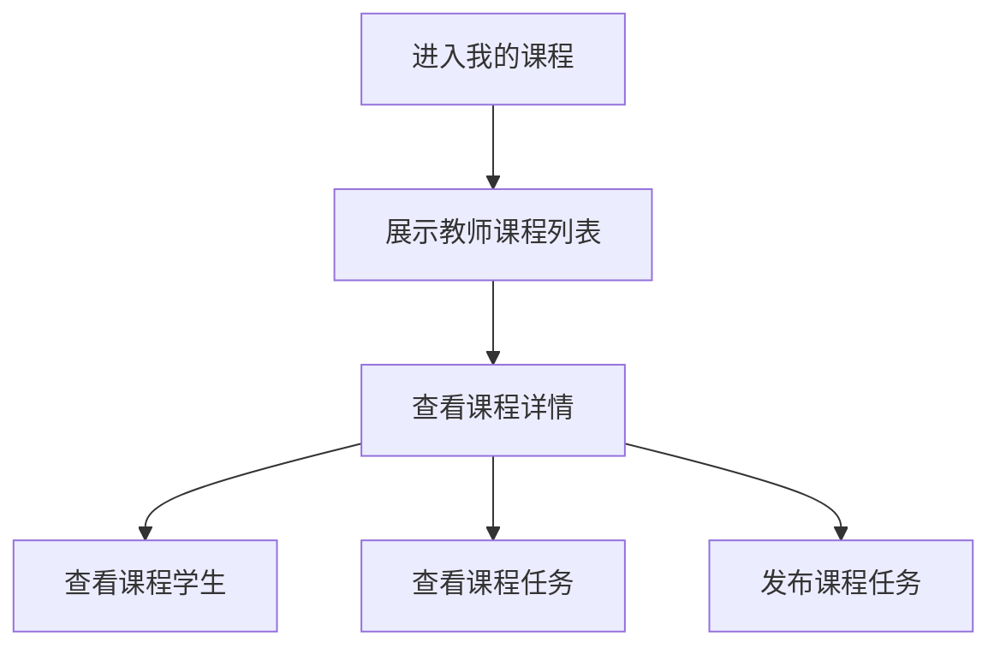
```mermaid
flowchart TD
    A[进入我的课程] --> B[展示教师课程列表]
    B --> C[查看课程详情]
    C --> D[查看课程学生]
    C --> E[查看课程任务]
    C --> F[发布课程任务]
```

#### 3.43.4 业务规则

**列表展示字段：**
| 字段名 | 说明 |
|--------|------|
| 课程名称 | 课程名称 |
| 任课教师 | 任课教师 |
| 上课班级 | 点击查看班级学生详情 |
| 上课时间 | 点击查看上课时间安排 |
| 上课教室 | 点击查看教室安排 |
| 创建人 | 创建人 |
| 创建时间 | 创建时间 |
| 操作 | 进入 |

**输入规则：**
- 无输入字段，纯展示页面

**字段数据源：**
- 课程数据：课程排课管理中该教师教授的课程

**业务逻辑：**
1. 展示当前登录教师的所有授课课程
2. 支持按条件筛选
3. 点击课程可查看：
   - 课程基本信息
   - 已维护的视频教材数据
   - 已维护的辅导教材数据

**权限模型：**
- 可见角色：教师
- 可操作角色：教师
- 数据权限：仅自己的授课课程

**页面功能点说明：**
- 课程卡片：展示课程概要信息
- 查看详情：进入课程详情页

**埋点设计：**
- 查看课程详情：event_course_detail_view
- 发布任务：event_course_task_create

#### 3.43.5 验收标准

**功能验收：**
- [ ] 展示教师所有课程
- [ ] 支持条件筛选
- [ ] 支持查看课程详情

---

### 3.24 教师端-普通任务

#### 3.18.1 功能描述
- **功能名称**：普通任务管理
- **功能目标**：创建和发布普通类型任务（单选、多选、判断、填空、简答）
- **功能价值**：实现课程作业的数字化管理

#### 3.18.2 页面图片
- [页面截图占位]

#### 3.18.3 业务流程
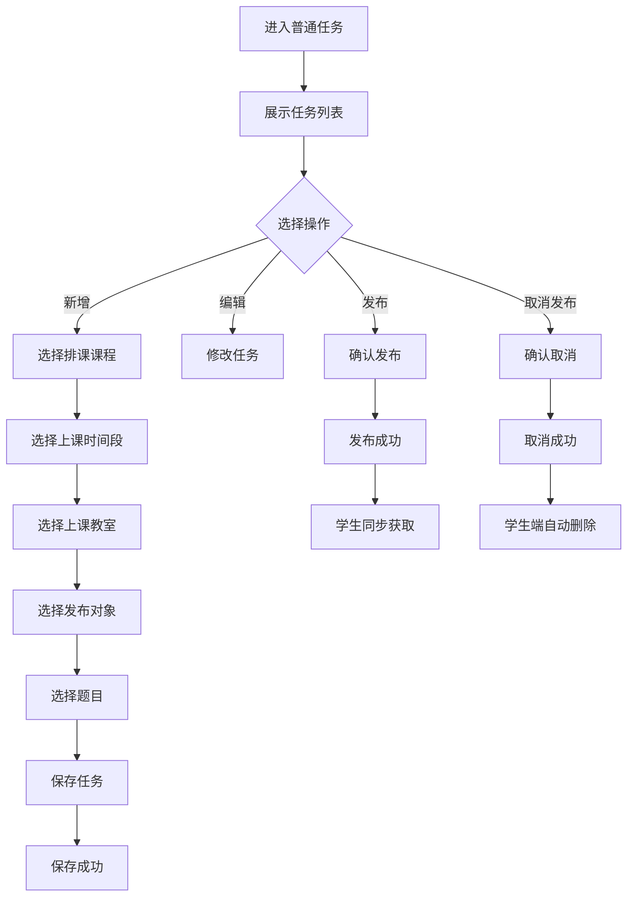
```mermaid
flowchart TD
    A[进入普通任务] --> B[展示任务列表]
    B --> C{选择操作}
    C -->|新增| D[选择排课课程]
    D --> E[选择上课时间段]
    E --> F[选择上课教室]
    F --> G[选择发布对象]
    G --> H[选择题目]
    H --> I[保存任务]
    C -->|编辑| J[修改任务]
    C -->|发布| K[确认发布]
    C -->|取消发布| L[确认取消]
    I --> M[保存成功]
    K --> N[发布成功]
    N --> O[学生同步获取]
    L --> P[取消成功]
    P --> Q[学生端自动删除]
```

#### 3.18.4 业务规则

**列表展示字段：**
| 字段名 | 说明 |
|--------|------|
| 任务名称 | 任务名称 |
| 所属课程 | 所属课程 |
| 上课班级 | 点击查看班级学生详情 |
| 上课时间 | 点击查看上课时间安排 |
| 上课教室 | 点击查看教室安排 |
| 发布状态 | 待发布/已发布 |
| 创建人 | 创建人 |
| 创建时间 | 创建时间 |
| 操作 | 编辑/发布/取消发布/删除 |

**输入规则：**
| 字段名 | 类型 | 必填 | 规则 | 错误提示 |
|--------|------|------|------|----------|
| 任务名称 | 字符串 | 是 | 2-50字符 | 请输入任务名称 |
| 所属课程 | 选择 | 是 | 选择已排课课程 | 请选择课程 |
| 上课日期 | 选择 | 是 | 选择排课日期 | 请选择日期 |
| 上课时间段 | 选择 | 是 | 选择排课时间段 | 请选择时间段 |
| 上课教室 | 选择 | 是 | 选择排课教室 | 请选择教室 |
| 发布对象 | 选择 | 是 | 选择班级/学生 | 请选择发布对象 |
| 题目 | 选择 | 是 | 选择普通题目、为题目设置分数 | 请选择题目、请设置分数 |

**字段数据源：**
- 所属课程：课程排课管理页维护的数据
- 上课日期：排课数据关联的日期
- 上课时间段：排课数据关联的时间段
- 上课教室：排课数据关联的教室
- 发布对象：排课班级及对应学生（可手动调整）
- 题目：普通题目页维护的数据

**业务逻辑：**
1. 仅可选择当前教师被排课的课程
2. 发布后学生自动同步获取任务
3. 取消发布后学生端自动删除任务
4. 有学生提交后禁止取消发布

**状态流转：**
| 当前状态 | 操作 | 下一状态 | 条件 |
|----------|------|----------|------|
| 草稿 | 发布 | 已发布 | 点击发布 |
| 已发布 | 取消发布 | 草稿 | 无学生提交 |
| 已发布 | 取消发布 | 禁止 | 有学生提交 |

**权限模型：**
- 可见角色：教师
- 可操作角色：教师
- 数据权限：仅自己创建的任务

**页面功能点说明：**
- 新增按钮：打开新增任务弹窗
- 编辑按钮：修改任务信息（发布后限制编辑）
- 发布按钮：发布后学生可见
- 取消发布按钮：发布后显示，取消后学生端删除

**异常处理：**
- 有学生提交取消：提示"已有学生提交任务，禁止取消发布"
- 未选择题目：提示"请选择题目"
- 网络异常：提示"操作失败，请重试"

**埋点设计：**
- 新增任务：event_task_add
- 发布任务：event_task_publish
- 取消发布：event_task_cancel

#### 3.18.5 验收标准

**功能验收：**
- [ ] 支持创建普通任务
- [ ] 支持编辑任务
- [ ] 支持发布任务
- [ ] 支持取消发布
- [ ] 发布后学生自动获取
- [ ] 取消后学生端自动删除

**边界条件：**
- [ ] 仅可选择自己被排课的课程
- [ ] 有学生提交后禁止取消
- [ ] 发布后限制编辑

**性能要求：**
- [ ] 任务列表加载 < 1秒
- [ ] 发布操作响应 < 500ms

---

### 3.25 教师端-实训任务

#### 3.8.1 功能描述
- **功能名称**：实训任务管理
- **功能目标**：创建和发布实训类型任务（设计、编程、工艺、加工、检测）
- **功能价值**：实现实训任务的数字化管理

#### 3.8.2 页面图片
- [页面截图占位]

#### 3.8.3 业务流程
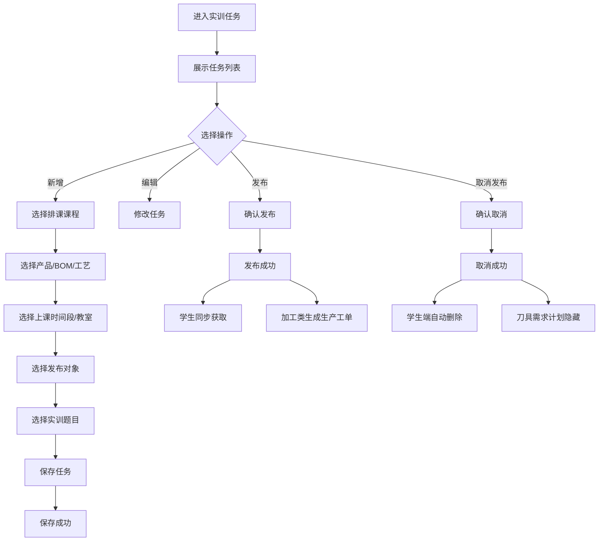
```mermaid
flowchart TD
    A[进入实训任务] --> B[展示任务列表]
    B --> C{选择操作}
    C -->|新增| D[选择排课课程]
    D --> E[选择产品/BOM/工艺]
    E --> F[选择上课时间段/教室]
    F --> G[选择发布对象]
    G --> H[选择实训题目]
    H --> I[保存任务]
    C -->|编辑| J[修改任务]
    C -->|发布| K[确认发布]
    C -->|取消发布| L[确认取消]
    I --> M[保存成功]
    K --> N[发布成功]
    N --> O[学生同步获取]
    N --> P[加工类生成生产工单]
    L --> Q[取消成功]
    Q --> R[学生端自动删除]
    Q --> S[刀具需求计划隐藏]
```

#### 3.8.4 业务规则

**列表展示字段：**
| 字段名 | 说明 |
|--------|------|
| 任务名称 | 任务名称 |
| 所属课程 | 所属课程 |
| 上课班级 | 点击查看班级学生详情 |
| 上课时间 | 点击查看考试时间安排 |
| 上课教室 | 点击查看考试地点 |
| 发布状态 | 待发布/已发布 |
| 创建人 | 创建人 |
| 创建时间 | 创建时间 |
| 操作 | 编辑/发布/取消发布/删除 |

**输入规则：**
| 字段名 | 类型 | 必填 | 规则 | 错误提示 |
|--------|------|------|------|----------|
| 任务名称 | 字符串 | 是 | 2-50字符 | 请输入任务名称 |
| 所属课程 | 选择 | 是 | 选择已排课课程 | 请选择课程 |
| 产品名称 | 选择 | 否 | 选择已有产品 | - |
| 规格型号 | 选择 | 否 | 选择产品规格 | - |
| BOM | 选择 | 是 | 选择产品BOM | 请选择BOM |
| 工艺 | 选择 | 是 | 选择产品工艺 | 请选择工艺 |
| 刀具BOM | 选择 | 是 | 选择刀具BOM | 请选择刀具BOM |
| 检测方案 | 选择 | 是 | 选择检测方案 | 请选择检测方案 |
| 上课日期 | 选择 | 是 | 选择排课日期 | 请选择日期 |
| 上课时间段 | 选择 | 是 | 选择排课时间段 | 请选择时间段 |
| 上课教室 | 选择 | 是 | 选择排课教室 | 请选择教室 |
| 发布对象 | 选择 | 是 | 选择班级/学生 | 请选择发布对象 |
| 题目 | 选择 | 是 | 选择实训题目、为题目设置分数 | 请选择题目、请设置分数 |

**字段数据源：**
- 所属课程：课程排课管理页维护的数据
- 产品名称：MES系统产品档案维护的数据
- BOM：MES系统BOM管理页维护的数据
- 工艺：MES系统工艺管理页维护的数据
- 刀具BOM：刀具BOM管理页维护的数据
- 检测方案：MES系统检测方案管理页维护的数据
- 上课日期：排课数据关联的日期
- 上课时间段：排课数据关联的时间段
- 上课教室：排课数据关联的教室
- 发布对象：排课班级关联的学生（可手动调整）
- 实训题目：实训题目页维护的数据

**业务逻辑：**
1. 加工类任务需关联BOM、工艺、刀具BOM，用于领料和生产、刀具管理
2. 检测类任务需关联质检方案
3. 加工类任务发布后自动生成生产工单
4. 取消发布后同时隐藏刀具需求计划数据
5. 有学生提交后禁止取消发布

**状态流转：**
| 当前状态 | 操作 | 下一状态 | 条件 |
|----------|------|----------|------|
| 草稿 | 发布 | 已发布 | 点击发布 |
| 已发布 | 取消发布 | 草稿 | 无学生提交 |
| 已发布 | 取消发布 | 禁止 | 有学生提交 |

**权限模型：**
- 可见角色：教师
- 可操作角色：教师
- 数据权限：仅自己创建的任务

**页面功能点说明：**
- 新增按钮：打开新增任务弹窗
- 编辑按钮：修改任务信息
- 发布按钮：发布后学生可见
- 取消发布按钮：发布后显示

**异常处理：**
- 有学生提交取消：提示"已有学生提交任务，禁止取消发布"
- 加工类未选BOM：提示"加工类任务需选择BOM"

**埋点设计：**
- 新增实训任务：event_practice_add
- 发布实训任务：event_practice_publish
- 取消发布：event_practice_cancel

#### 3.8.5 验收标准

**功能验收：**
- [ ] 支持创建实训任务
- [ ] 支持五类题目类型
- [ ] 支持编辑任务
- [ ] 支持发布任务
- [ ] 加工类任务生成生产工单
- [ ] 支持取消发布

**边界条件：**
- [ ] 加工类必须关联BOM/工艺
- [ ] 有学生提交后禁止取消
- [ ] 取消后隐藏刀具需求计划

**性能要求：**
- [ ] 任务列表加载 < 1秒
- [ ] 发布操作响应 < 500ms

---

### 3.26 教师端-综合试卷

#### 3.44.1 功能描述
- **功能名称**：综合试卷管理
- **功能目标**：教师创建和管理综合考试试卷
- **功能价值**：为综合考试提供试卷资源

#### 3.44.2 页面图片
- [页面截图占位]

#### 3.44.3 业务流程
```mermaid
flowchart TD
    A[进入综合试卷] --> B[展示试卷列表]
    B --> C{操作}
    C -->|组卷| D[创建试卷]
    C -->|编辑| E[修改试卷]
    C -->|删除| F[删除试卷]
    C -->|发布| G[发布考试]
    D --> H[填写试卷信息]
    H --> I[选择题目]
    I --> J[设置分值]
    J --> K[保存试卷]
```

#### 3.44.4 业务规则

**列表展示字段：**
| 字段名 | 说明 |
|--------|------|
| 任务名称 | 任务名称 |
| 所属课程 | 所属课程 |
| 上课班级 | 查看；点击以对话框形式，表格列表方式查看该班级的所有学生数据 |
| 上课时间 | 查看；点击以对话框形式，表格列表方式查看该门课程的所有上课日期及对应上课时间段数据 |
| 上课教室 | 查看；点击以对话框形式，表格列表方式查看该门课程的所有上课教室数据 |
| 发布状态 | 待发布/已发布 |
| 创建人 | 创建人 |
| 创建时间 | 创建时间 |
| 操作 | 编辑/发布/取消发布/删除 |

**输入规则：**
| 字段名 | 类型 | 必填 | 规则 | 错误提示 |
|--------|------|------|------|----------|
| 试卷名称 | 字符串 | 是 | 2-50字符 | 请输入试卷名称 |
| 排课课程 | 选择 | 是 | 选择已排课课程 | 请选择课程 |
| 上课日期 | 选择 | 是 | 选择排课日期 | 请选择日期 |
| 上课时间段 | 选择 | 是 | 选择排课时间段 | 请选择时间段 |
| 上课教室 | 选择 | 是 | 选择排课教室 | 请选择教室 |
| 发布对象 | 选择 | 是 | 选择班级/学生 | 请选择发布对象 |
| 题目 | 选择 | 是 | 选择普通、实训题目、为题目设置分数 | 请选择题目、请设置分数 |

**字段数据源：**
- 题目：普通题目库和实训题目库
- 适用课程：我的课程数据

**业务逻辑：**
1. 教师从普通、实训题目库选题组卷
2. 支持设置各题分值
3. 自动计算总分
4. 组卷完成后可发布为考试

**权限模型：**
- 可见角色：教师
- 可操作角色：教师
- 数据权限：自己创建的试卷

#### 3.44.5 验收标准

**功能验收：**
- [ ] 支持选题组卷
- [ ] 支持设置分值
- [ ] 支持发布考试
- [ ] 支持按条件检索

---

### 3.27 教师端-普通任务批阅

#### 3.9.1 功能描述
- **功能名称**：普通任务批阅
- **功能目标**：批阅学生提交的任务
- **功能价值**：实现任务批阅的数字化，支持自动批阅

#### 3.9.2 页面图片
- **第一级-任务列表页**：[页面截图占位]
- **第二级-学生批阅页**：[页面截图占位]

#### 3.9.3 业务流程
```mermaid
flowchart TD
    A[进入普通任务批阅] --> B[展示任务列表-第一级]
    B --> C[选择任务-点击批阅]
    C --> D[展示学生提交列表-第二级]
    D --> E{批阅状态}
    E -->|待批阅| F[进入批阅页面]
    E -->|已批阅| G[查看批阅结果]
    F --> H[查看学生答案]
    H --> I{题目类型}
    I -->|客观题| J[系统自动批阅]
    I -->|主观题| K[人工批阅打分]
    J --> L[保存批阅结果]
    K --> L
    L --> M[学生查看成绩]
```

#### 3.9.4 业务规则

**第一级-任务列表页-列表展示字段：**
| 字段名 | 说明 |
|--------|------|
| 任务名称 | 任务名称 |
| 所属课程 | 所属课程 |
| 上课班级 | 查看；点击以对话框形式，表格列表方式查看该班级的所有学生数据 |
| 上课时间 | 查看；点击以对话框形式，表格列表方式查看该门课程的所有上课日期及对应上课时间段数据 |
| 上课教室 | 查看；点击以对话框形式，表格列表方式查看该门课程的所有上课教室数据 |
| 提交/总数 | 提交人数/总人数 |
| 批阅进度 | 进度条方式展示（已批阅数/提交数） |
| 操作 | 查看/批阅 |

**第二级-学生批阅页-列表展示字段：**
| 字段名 | 说明 |
|--------|------|
| 学生姓名 | 学生姓名 |
| 学号 | 学号 |
| 提交时间 | 提交时间 |
| 客观题得分 | 系统自动批阅得分 |
| 主观题得分 | 人工批阅得分 |
| 总分 | 总分 |
| 批阅状态 | 待批阅/已批阅/部分批阅 |
| 操作 | 批阅/查看 |

**第二级-学生批阅页-批阅详情弹窗-输入规则：**
| 字段名 | 类型 | 必填 | 规则 | 错误提示 |
|--------|------|------|------|----------|
| 客观题得分 | 数字 | 否 | 系统自动计算 | - |
| 主观题得分 | 数字 | 是 | 0-主观题总分 | 请输入0-总分之间的分数 |
| 评语 | 字符串 | 否 | 500字符以内 | - |
| 批改标记 | 富文本 | 否 | 标注错误点 | - |

**字段数据源：**
- 任务数据：普通任务发布的数据
- 学生提交：学生提交的任务答案
- 正确答案：题目维护时的标准答案

**业务逻辑：**
1. **第一级-任务列表**：展示教师发布的所有普通任务及批阅进度
2. **第二级-学生批阅页**：展示选择任务的所有学生提交列表
3. 客观题（单选、多选、判断）系统自动批阅，显示在列表中
4. 主观题（填空、简答）需教师逐一批阅
5. 支持批量批阅和单个批阅
6. 批阅后学生可查看成绩
7. 取消发布的任务自动隐藏

**状态流转：**
| 当前状态 | 操作 | 下一状态 | 条件 |
|----------|------|----------|------|
| 待批阅 | 批阅 | 已批阅 | 保存批阅结果 |
| 已批阅 | 重新批阅 | 已批阅 | 修改批阅结果 |
| 部分批阅 | 继续批阅 | 已批阅 | 完成所有题目批阅 |

**权限模型：**
- 可见角色：教师
- 可操作角色：教师
- 数据权限：仅自己发布的任务

**页面功能点说明：**
**第一级-任务列表页：**
- 批阅按钮：点击进入第二级学生批阅页
- 进度条：展示批阅进度（已批阅数/提交数）
- 提交/总数：展示提交人数和总人数

**第二级-学生批阅页-功能点说明：**

**学生列表区：**
- 学生列表：展示所有提交的学生，支持按批阅状态筛选
- 学生切换：点击学生行切换当前批阅学生

**批阅弹窗区：**
- 题目导航：左侧展示题目列表，显示题号、题型、分值、批阅状态
- 题目切换：点击题目导航切换当前批阅题目，支持上一题/下一题按钮
- 题目内容区：展示题目内容、学生答案、标准答案
- 自动批阅：客观题系统自动计算得分
- 评分输入：主观题输入得分（0-题目分值）
- 评语输入：填写评语（500字符以内）
- 批改标记：富文本标注错误点
- 暂存按钮：暂存当前题目批阅结果（不提交）
- 提交批阅：提交当前学生所有题目的批阅结果
- 取消按钮：取消批阅，关闭弹窗

**批阅状态说明：**
- 待批阅：该题目尚未批阅
- 已批阅：该题目已批阅完成
- 部分批阅：该学生部分题目已批阅

**异常处理：**
- 未填写得分：提示"请输入得分"
- 得分超出范围：提示"得分不能超过题目分值"
- 未批阅完所有题目：提示"还有X道题目未批阅，确认提交？"
- 网络异常：提示"保存失败，请重试"

**埋点设计：**
- 进入任务列表：event_review_task_list
- 进入学生批阅页：event_review_student_list
- 开始批阅：event_review_start
- 保存批阅：event_review_save
- 批量批阅：event_review_batch
- 导出批阅：event_review_export

#### 3.9.5 验收标准

**功能验收：**
- [ ] 展示待批阅任务列表
- [ ] 支持查看学生答案
- [ ] 客观题自动批阅
- [ ] 主观题人工批阅
- [ ] 支持重新批阅
- [ ] 学生可查看成绩

**边界条件：**
- [ ] 仅批阅自己发布的任务
- [ ] 取消发布的任务自动隐藏
- [ ] 得分范围0-满分

**性能要求：**
- [ ] 列表加载 < 1秒
- [ ] 自动批阅响应 < 500ms

---

### 3.28 教师端-实训任务批阅

#### 3.45.1 功能描述
- **功能名称**：实训任务批阅
- **功能目标**：教师批阅学生提交的实训任务
- **功能价值**：完成实训任务的成绩评定

#### 3.45.2 页面图片
- **第一级-任务列表页**：[页面截图占位]
- **第二级-学生批阅页**：[页面截图占位]

#### 3.45.3 业务流程
```mermaid
flowchart TD
    A[进入实训任务批阅] --> B[展示任务列表-第一级]
    B --> C[选择任务-点击批阅]
    C --> D[展示学生提交列表-第二级]
    D --> E[选择学生]
    E --> F[查看提交内容]
    F --> G[评分]
    G --> H[填写评语]
    H --> I[提交成绩]
    I --> J[更新成绩]
```

#### 3.45.4 业务规则

**第一级-任务列表页-列表展示字段：**
| 字段名 | 说明 |
|--------|------|
| 任务名称 | 任务名称 |
| 所属课程 | 所属课程 |
| 上课班级 | 查看；点击以对话框形式，表格列表方式查看该班级的所有学生数据 |
| 上课时间 | 查看；点击以对话框形式，表格列表方式查看该门课程的所有上课日期及对应上课时间段数据 |
| 上课教室 | 查看；点击以对话框形式，表格列表方式查看该门课程的所有上课教室数据 |
| 提交/总数 | 提交人数/总人数 |
| 批阅进度 | 进度条方式展示（已批阅数/提交数） |
| 操作 | 查看/批阅 |

**第二级-学生批阅页-列表展示字段：**
| 字段名 | 说明 |
|--------|------|
| 学生姓名 | 学生姓名 |
| 学号 | 学号 |
| 提交时间 | 提交时间 |
| 得分 | 得分 |
| 批阅状态 | 待批阅/已批阅 |
| 操作 | 批阅/查看 |

**第二级-学生批阅页-批阅详情弹窗-输入规则：**
| 字段名 | 类型 | 必填 | 规则 | 错误提示 |
|--------|------|------|------|----------|
| 评分 | 数字 | 是 | 0-题目分值 | 请输入0-题目分值之间的分数 |
| 评语 | 文本 | 否 | ≤500字符 | - |
| 批改标记 | 富文本 | 否 | 标注错误点 | - |

**字段数据源：**
- 任务数据：教师发布的实训任务
- 学生提交：学生提交的实训成果

**业务逻辑：**
1. **第一级-任务列表**：展示教师发布的所有实训任务及批阅进度
2. **第二级-学生批阅页**：展示选择任务的所有学生提交列表
3. 支持按提交状态筛选（待批阅/已批阅）
4. 查看学生提交的设计/编程/工艺/加工/检测等成果
5. 根据评分标准进行评分
6. 支持填写评语和批改标记

**实训任务批阅内容：**
| 实训类型 | 批阅内容 |
|----------|----------|
| 设计类 | 设计图纸、设计说明 |
| 编程类 | 程序代码、仿真结果 |
| 工艺类 | 工艺方案、工艺参数 |
| 加工类 | 加工代码、加工结果 |
| 检测类 | 检测报告、检测数据 |

**状态流转：**
| 当前状态 | 操作 | 下一状态 | 条件 |
|----------|------|----------|------|
| 待批阅 | 批阅 | 已批阅 | 保存批阅结果 |
| 已批阅 | 重新批阅 | 已批阅 | 修改批阅结果 |

**权限模型：**
- 可见角色：教师
- 可操作角色：教师
- 数据权限：仅自己发布的任务

**页面功能点说明：**
**第一级-任务列表页：**
- 批阅按钮：点击进入第二级学生批阅页
- 进度条：展示批阅进度（已批阅数/提交数）
- 提交/总数：展示提交人数和总人数

**第二级-学生批阅页-功能点说明：**

**学生列表区：**
- 学生列表：展示所有提交的学生，支持按批阅状态筛选
- 学生切换：点击学生行切换当前批阅学生
- 成果预览：查看学生提交的实训成果（设计图纸/程序代码/工艺方案等）

**批阅弹窗区：**
- 题目导航：左侧展示题目列表，显示题号、题型、分值、批阅状态
- 题目切换：点击题目导航切换当前批阅题目，支持上一题/下一题按钮
- 题目内容区：展示题目内容、学生答案、标准答案
- 成果展示区：展示学生提交的实训成果（支持设计图纸预览、代码高亮显示等）
- 评分输入：输入分数（0-题目分值）
- 评语输入：填写评语（500字符以内）
- 批改标记：富文本标注错误点
- 暂存按钮：暂存当前题目批阅结果（不提交）
- 提交批阅：提交当前学生所有题目的批阅结果
- 取消按钮：取消批阅，关闭弹窗

**批阅状态说明：**
- 待批阅：该题目尚未批阅
- 已批阅：该题目已批阅完成
- 部分批阅：该学生部分题目已批阅

**异常处理：**
- 无提交：提示"暂无学生提交"
- 未填写得分：提示"请输入得分"
- 得分超出范围：提示"得分不能超过题目分值"
- 未批阅完所有题目：提示"还有X道题目未批阅，确认提交？"
- 网络异常：提示"保存失败，请重试"

**埋点设计：**
- 进入任务列表：event_practical_review_list
- 进入学生批阅页：event_practical_student_list
- 开始批阅：event_practical_review_start
- 保存批阅：event_practical_review_save
- 批量批阅：event_practical_review_batch
- 导出成绩：event_practical_export

#### 3.45.5 验收标准

**功能验收：**
- [ ] 展示待批阅任务
- [ ] 支持查看学生提交
- [ ] 支持评分和评语
- [ ] 支持批量批阅

---

### 3.29 教师端-综合试卷批阅

#### 3.46.1 功能描述
- **功能名称**：综合试卷批阅
- **功能目标**：教师批阅学生综合考试答卷
- **功能价值**：完成综合考试的成绩评定

#### 3.46.2 页面图片
- **第一级-考试列表页**：[页面截图占位]
- **第二级-学生答卷批阅页**：[页面截图占位]

#### 3.46.3 业务流程
```mermaid
flowchart TD
    A[进入综合试卷批阅] --> B[展示考试列表-第一级]
    B --> C[选择考试-点击批阅]
    C --> D[展示学生答卷列表-第二级]
    D --> E{批阅维度}
    E -->|按学生批阅| F[选择学生]
    E -->|按题目批阅| G[选择题目]
    F --> H{题目类型}
    G --> H
    H -->|客观题| I[系统已自动批阅-显示得分]
    H -->|主观题| J[教师人工批阅]
    J --> K[查看答案]
    K --> L[评分]
    L --> M[提交成绩]
    M --> N[更新总成绩]
```

#### 3.46.4 业务规则

**第一级-考试列表页-列表展示字段：**
| 字段名 | 说明 |
|--------|------|
| 试卷名称 | 试卷名称 |
| 所属课程 | 所属课程 |
| 上课班级 | 查看；点击以对话框形式，表格列表方式查看该班级的所有学生数据 |
| 上课时间 | 查看；点击以对话框形式，表格列表方式查看该门课程的所有上课日期及对应上课时间段数据 |
| 上课教室 | 查看；点击以对话框形式，表格列表方式查看该门课程的所有上课教室数据 |
| 提交/总数 | 提交人数/总人数 |
| 批阅进度 | 进度条方式展示（已批阅数/提交数） |
| 操作 | 查看/批阅 |

**第二级-学生答卷批阅页-列表展示字段（按学生维度）：**
| 字段名 | 说明 |
|--------|------|
| 学生姓名 | 学生姓名 |
| 学号 | 学号 |
| 提交时间 | 提交时间 |
| 客观题得分 | 系统自动批阅得分 |
| 主观题得分 | 人工批阅得分 |
| 总分 | 总分 |
| 批阅状态 | 待批阅/已批阅/部分批阅 |
| 操作 | 批阅/查看 |

**第二级-学生答卷批阅页-列表展示字段（按题目维度）：**
| 字段名 | 说明 |
|--------|------|
| 题号 | 题号 |
| 题目类型 | 单选/多选/判断/填空/简答/设计/编程/工艺/加工/检测 |
| 题目内容 | 题目内容摘要 |
| 分值 | 题目分值 |
| 已批阅数 | 已批阅学生数/提交学生数 |
| 批阅状态 | 待批阅/已批阅 |
| 操作 | 批阅（按题目批阅所有学生） |

**第二级-学生答卷批阅页-批阅详情弹窗-输入规则：**
| 字段名 | 类型 | 必填 | 规则 | 错误提示 |
|--------|------|------|------|----------|
| 客观题得分 | 数字 | 否 | 系统自动计算 | - |
| 主观题得分 | 数字 | 是 | 0-题目分值 | 请输入0-分值之间的分数 |
| 评语 | 字符串 | 否 | 500字符以内 | - |
| 批改标记 | 富文本 | 否 | 标注错误点 | - |

**字段数据源：**
- 考试数据：综合试卷发布的数据
- 学生答卷：学生提交的答卷
- 正确答案：题目维护时的标准答案

**业务逻辑：**
1. **第一级-考试列表**：展示教师发布的所有综合考试及批阅进度
2. **第二级-学生答卷批阅页**：展示选择考试的所有学生答卷列表
3. 支持两种批阅维度：
   - **按学生批阅**：逐个学生查看所有题目并评分
   - **按题目批阅**：按题目查看所有学生答案并评分
4. 客观题（单选、多选、判断）系统自动批阅，显示在列表中
5. 主观题（填空、简答、实训题）需教师逐一批阅
6. 支持批量批阅和单个批阅
7. 批阅完成后自动计算并更新总成绩
8. 学生可查看最终成绩和各题得分

**批阅维度说明：**
- **按学生批阅**：适合关注单个学生的整体表现
  - 查看该学生所有题目的答题情况
  - 逐题评分，可查看前后题目关联
- **按题目批阅**：适合统一评分标准
  - 查看所有学生同一题目的答案
  - 便于对比评分，保持标准一致

**状态流转：**
| 当前状态 | 操作 | 下一状态 | 条件 |
|----------|------|----------|------|
| 待批阅 | 批阅 | 已批阅 | 保存批阅结果 |
| 已批阅 | 重新批阅 | 已批阅 | 修改批阅结果 |
| 部分批阅 | 继续批阅 | 已批阅 | 完成所有题目批阅 |

**权限模型：**
- 可见角色：教师
- 可操作角色：教师
- 数据权限：仅自己发布的考试

**页面功能点说明：**
**第一级-考试列表页：**
- 批阅按钮：点击进入第二级学生答卷批阅页
- 进度条：展示批阅进度（已批阅数/提交数）
- 提交/总数：展示提交人数和总人数
- 考试时间：展示考试开始和结束时间

**第二级-学生答卷批阅页-功能点说明：**

**维度切换区：**
- 维度切换：切换"按学生批阅"和"按题目批阅"两种模式

**按学生批阅模式：**
- 学生列表：展示所有提交的学生，显示学生姓名、学号、提交时间、总分、批阅状态
- 学生切换：点击学生行切换当前批阅学生
- 批量批阅：支持批量设置得分

**按题目批阅模式：**
- 题目列表：展示所有题目，显示题号、题型、分值、已批阅数/提交数、批阅状态
- 题目切换：点击题目行切换当前批阅题目

**批阅弹窗区（两种模式共用）：**
- 题目导航：左侧展示题目列表，显示题号、题型、分值、批阅状态
- 题目切换：点击题目导航切换当前批阅题目，支持上一题/下一题按钮
- 题目内容区：展示题目内容、学生答案、标准答案
- 学生切换：支持在当前题目下切换不同学生（按题目批阅模式）
- 自动批阅：客观题系统自动计算得分
- 评分输入：主观题输入得分（0-题目分值）
- 评语输入：填写评语（500字符以内）
- 批改标记：富文本标注错误点
- 暂存按钮：暂存当前题目批阅结果（不提交）
- 提交批阅：提交当前学生所有题目的批阅结果（按学生模式）或提交当前题目所有学生的批阅结果（按题目模式）
- 取消按钮：取消批阅，关闭弹窗

**批阅状态说明：**
- 待批阅：该题目/学生尚未批阅
- 已批阅：该题目/学生已批阅完成
- 部分批阅：该学生部分题目已批阅（仅按学生模式）

**快捷操作：**
- 快捷键支持：Ctrl+S 暂存、Ctrl+Enter 提交批阅、方向键切换题目
- 批量提交：支持批量提交多个学生的批阅结果
- 导出按钮：导出批阅结果和成绩

**异常处理：**
- 未填写得分：提示"请输入得分"
- 得分超出范围：提示"得分不能超过题目分值"
- 未批阅完所有题目：提示"还有X道题目未批阅，确认提交？"
- 所有题目未批阅：提示"还有X道题目未批阅"
- 网络异常：提示"保存失败，请重试"

**埋点设计：**
- 进入考试列表：event_exam_review_list
- 进入学生批阅页：event_exam_student_list
- 切换批阅维度：event_exam_review_switch
- 开始批阅：event_exam_review_start
- 保存批阅：event_exam_review_save
- 批量批阅：event_exam_review_batch
- 导出成绩：event_exam_export

#### 3.46.5 验收标准

**功能验收：**
- [ ] 展示考试列表及批阅进度
- [ ] 支持两级页面结构
- [ ] 支持按学生/题目两种维度批阅
- [ ] 客观题显示自动评分
- [ ] 支持主观题人工批阅
- [ ] 支持批量批阅
- [ ] 批阅完成后自动计算总成绩
- [ ] 支持导出批阅结果
- [ ] 支持两种批阅维度

---

### 3.30 教师端-错题集库

#### 3.47.1 功能描述
- **功能名称**：错题集库
- **功能目标**：管理学生错题，支持错题分析
- **功能价值**：帮助教师了解学生薄弱知识点

#### 3.47.2 页面图片
- [页面截图占位]

#### 3.47.3 业务流程
```mermaid
flowchart TD
    A[进入错题集库] --> B[展示错题统计]
    B --> C[按题目查看]
    B --> D[按学生查看]
    B --> E[按知识点查看]
    C --> F[查看错误详情]
    D --> G[查看学生错题]
    E --> H[查看知识点掌握度]
```

#### 3.47.4 业务规则

**页面结构：**
- 维度切换区：切换"按题目查看"、"按学生查看"两种模式
- 列表展示区：根据选择的维度展示对应的数据列表
- 详情弹窗区：查看错题详情

**按题目查看-列表展示字段：**
| 字段名 | 说明 |
|--------|------|
| 题号 | 题目编号 |
| 题目内容 | 题目内容摘要 |
| 题目类型 | 单选/多选/判断/填空/简答/设计/编程/工艺/加工/检测 |
| 错误次数 | 答错次数 |
| 错误率 | 错误率百分比 |
| 关联学生数 | 答错的学生数量 |
| 操作 | 查看详情/查看学生列表 |

**按学生查看-列表展示字段：**
| 字段名 | 说明 |
|--------|------|
| 学生姓名 | 学生姓名 |
| 学号 | 学号 |
| 错题数量 | 错题总数 |
| 薄弱知识点 | 错误率最高的知识点 |
| 最近错题时间 | 最近一次答错时间 |
| 操作 | 查看详情/查看错题列表 |

**详情弹窗-展示内容：**
| 维度 | 展示内容 |
|------|----------|
| 按题目详情 | 题目完整内容、标准答案、错误学生列表、各学生答案对比 |
| 按学生详情 | 学生基本信息、错题列表、各题答题情况、薄弱知识点分析 |

**输入规则：**
- 无输入字段，纯展示页面
- 支持筛选条件：课程、时间段、题目类型

**字段数据源：**
- 错题数据：学生答题错误记录（自动收集）
- 题目数据：普通题目库和实训题目库
- 学生数据：学生管理模块

**业务逻辑：**
1. 自动收集学生答题错误数据（包括普通任务、实训任务、综合考试）
2. 实时统计各维度数据
3. 提供多维度查看：
   - 按题目查看：了解每道题的难易程度和错误分布
   - 按学生查看：了解每个学生的学习薄弱点
4. 支持查看详细错误信息和学生答案对比
5. 支持导出错题分析报告（PDF/Excel）
6. 数据权限：仅展示教师授课课程相关的错题数据

**权限模型：**
- 可见角色：教师
- 可操作角色：教师
- 数据权限：自己授课课程相关的错题数据

**页面功能点说明：**
**维度切换区：**
- 维度切换按钮：切换"按题目查看"、"按学生查看"
- 筛选条件：选择课程、时间段、题目类型
- 导出按钮：导出错题分析报告

**列表展示区：**
- 数据列表：展示对应维度的统计数据
- 排序功能：支持按错误率、错误次数等字段排序
- 点击查看：点击行查看详情

**详情弹窗区：**
- 详情展示：展示该维度下的详细数据
- 学生答案对比：按题目查看时，可对比各学生答案
- 关闭按钮：关闭弹窗

**异常处理：**
- 无数据：提示"暂无错题数据"
- 筛选无结果：提示"当前筛选条件下无数据，请调整筛选条件"
- 导出失败：提示"导出失败，请重试"

#### 3.47.5 验收标准

**功能验收：**
- [ ] 支持多维度统计
- [ ] 支持查看错题详情
- [ ] 支持导出分析报告

---

### 3.31 教师端-视频教材

#### 3.17.1 功能描述
- **功能名称**：视频教材管理
- **功能目标**：维护视频教材资源
- **功能价值**：建立视频教材库，支持教学使用

#### 3.17.2 页面图片
- [页面截图占位]

#### 3.17.3 业务流程
```mermaid
flowchart TD
    A[进入视频教材] --> B[展示视频列表]
    B --> C{选择操作}
    C -->|新增| D[上传视频]
    D --> E[填写视频信息]
    C -->|编辑| F[修改视频信息]
    C -->|删除| G[确认删除]
    C -->|查询| H[输入查询条件]
    E --> I[保存]
    F --> I
    G --> J[删除成功]
    I --> K{验证通过?}
    K -->|是| L[保存成功]
    K -->|否| M[显示错误提示]
    M --> C
```

#### 3.17.4 业务规则

**列表展示字段：**
| 字段名 | 说明 |
|--------|------|
| 教材名称 | 视频教材名称 |
| 视频文件 | 视频文件信息；点击支持预览播放 |
| 适用课程 | 关联课程 |
| 是否公用 | 是/否 |
| 创建人 | 创建人 |
| 创建时间 | 创建时间 |
| 操作 | 编辑/删除/预览 |

**输入规则：**
| 字段名 | 类型 | 必填 | 规则 | 错误提示 |
|--------|------|------|------|----------|
| 视频名称 | 字符串 | 是 | 2-100字符 | 请输入视频名称 |
| 视频文件 | 文件 | 是 | MP4格式，最大500MB | 请上传MP4格式视频 |
| 所属课程 | 选择 | 否 | 选择已有课程 | - |
| 是否公用 | 选择 | 是 | 是/否 | - |
| 视频描述 | 字符串 | 否 | 500字符以内 | - |

**字段数据源：**
- 所属课程：课程管理页维护的数据

**业务逻辑：**
1. 支持上传MP4格式视频，最大500MB
2. 设置"公用"后，教务端也可查看
3. 支持按课程、名称等条件查询
4. 支持视频在线预览

**状态流转：**
| 当前状态 | 操作 | 下一状态 | 条件 |
|----------|------|----------|------|
| 正常 | 编辑 | 正常 | 保存成功 |
| 正常 | 删除 | 已删除 | 确认删除 |

**权限模型：**
- 可见角色：教师
- 可操作角色：教师
- 数据权限：仅自己上传的视频（公用视频教务员也可查看）

**页面功能点说明：**
- 新增按钮：打开上传视频弹窗
- 编辑按钮：修改视频信息
- 删除按钮：删除视频
- 预览按钮：在线播放视频
- 下载按钮：下载视频文件

**异常处理：**
- 格式错误：提示"仅支持MP4格式"
- 大小超限：提示"视频大小不能超过500MB"
- 上传失败：提示"上传失败，请重试"

**埋点设计：**
- 上传视频：event_video_upload
- 预览视频：event_video_preview
- 下载视频：event_video_download

#### 3.17.5 验收标准

**功能验收：**
- [ ] 支持上传视频
- [ ] 支持编辑视频信息
- [ ] 支持删除视频
- [ ] 支持视频预览
- [ ] 支持设置公用

**边界条件：**
- [ ] 仅支持MP4格式
- [ ] 视频大小不超过500MB
- [ ] 设置公用后教务端可见

**性能要求：**
- [ ] 列表加载 < 1秒
- [ ] 视频上传支持断点续传

---

### 3.32 教师端-辅导教材

#### 3.18.1 功能描述
- **功能名称**：辅导教材管理
- **功能目标**：维护辅导教材资源
- **功能价值**：建立辅导教材库，支持学生学习

#### 3.18.2 页面图片
- [页面截图占位]

#### 3.18.3 业务流程
```mermaid
flowchart TD
    A[进入辅导教材] --> B[展示教材列表]
    B --> C{选择操作}
    C -->|新增| D[上传教材]
    D --> E[填写教材信息]
    C -->|编辑| F[修改教材信息]
    C -->|删除| G[确认删除]
    C -->|查询| H[输入查询条件]
    E --> I[保存]
    F --> I
    G --> J[删除成功]
    I --> K{验证通过?}
    K -->|是| L[保存成功]
    K -->|否| M[显示错误提示]
    M --> C
```

#### 3.18.4 业务规则

**列表展示字段：**
| 字段名 | 说明 |
|--------|------|
| 教材名称 | 辅导教材名称 |
| 教材文件 | 文档文件信息；点击支持下载/预览 |
| 适用课程 | 关联课程 |
| 教材描述 | 教材描述信息 |
| 是否公用 | 是/否 |
| 创建人 | 创建人 |
| 创建时间 | 创建时间 |
| 操作 | 编辑/删除/下载/预览 |

**输入规则：**
| 字段名 | 类型 | 必填 | 规则 | 错误提示 |
|--------|------|------|------|----------|
| 教材名称 | 字符串 | 是 | 2-100字符 | 请输入教材名称 |
| 教材文件 | 文件 | 是 | PDF/Word/PPT，最大100MB | 请上传支持的文件格式 |
| 所属课程 | 选择 | 否 | 选择已有课程 | - |
| 是否公用 | 选择 | 是 | 是/否 | - |
| 教材描述 | 字符串 | 否 | 500字符以内 | - |

**字段数据源：**
- 所属课程：课程管理页维护的数据

**业务逻辑：**
1. 支持上传PDF、Word、PPT格式文件，最大100MB
2. 设置"公用"后，教务端也可查看
3. 支持在线预览PDF文件
4. 支持按课程、名称等条件查询

**状态流转：**
| 当前状态 | 操作 | 下一状态 | 条件 |
|----------|------|----------|------|
| 正常 | 编辑 | 正常 | 保存成功 |
| 正常 | 删除 | 已删除 | 确认删除 |

**权限模型：**
- 可见角色：教师
- 可操作角色：教师
- 数据权限：仅自己上传的教材（公用教材教务员也可查看）

**页面功能点说明：**
- 新增按钮：打开上传教材弹窗
- 编辑按钮：修改教材信息
- 删除按钮：删除教材
- 预览按钮：在线预览PDF
- 下载按钮：下载教材文件

**异常处理：**
- 格式错误：提示"仅支持PDF、Word、PPT格式"
- 大小超限：提示"文件大小不能超过100MB"

**埋点设计：**
- 上传教材：event_material_upload
- 预览教材：event_material_preview
- 下载教材：event_material_download

#### 3.18.5 验收标准

**功能验收：**
- [ ] 支持上传教材
- [ ] 支持编辑教材信息
- [ ] 支持删除教材
- [ ] 支持PDF预览
- [ ] 支持设置公用

**边界条件：**
- [ ] 仅支持PDF、Word、PPT格式
- [ ] 文件大小不超过100MB

**性能要求：**
- [ ] 列表加载 < 1秒
- [ ] PDF预览响应 < 2秒

---

### 3.33 教师端-普通题目

#### 3.19.1 功能描述
- **功能名称**：普通题目管理
- **功能目标**：维护普通类型题目（单选、多选、判断、填空、简答）
- **功能价值**：建立题库，支持任务和试卷使用

#### 3.19.2 页面图片
- [页面截图占位]

#### 3.19.3 业务流程
```mermaid
flowchart TD
    A[进入普通题目] --> B[展示题目列表]
    B --> C{选择操作}
    C -->|新增| D[选择题目类型]
    D --> E[录入题目内容]
    E --> F[设置答案]
    F --> G[设置解析]
    C -->|编辑| H[修改题目]
    C -->|删除| I[确认删除]
    C -->|查询| J[输入查询条件]
    G --> K[保存]
    H --> K
    I --> L[删除成功]
    K --> M{验证通过?}
    M -->|是| N[保存成功]
    M -->|否| O[显示错误提示]
    O --> C
```

#### 3.19.4 业务规则

**列表展示字段：**
| 字段名 | 说明 |
|--------|------|
| 题目名称 | 题目内容摘要 |
| 题目类型 | 单选/多选/判断/填空/简答 |
| 适用课程 | 关联课程 |
| 难度 | 简单/中等/困难 |
| 是否公用 | 是/否 |
| 创建人 | 创建人 |
| 创建时间 | 创建时间 |
| 操作 | 编辑/删除/查看 |

**输入规则：**
| 字段名 | 类型 | 必填 | 规则 | 错误提示 |
|--------|------|------|------|----------|
| 题目类型 | 选择 | 是 | 单选/多选/判断/填空/简答 | 请选择题目类型 |
| 题目内容 | 富文本 | 是 | 非空 | 请输入题目内容 |
| 选项 | 数组 | 是 | 至少2个选项 | 请设置选项 |
| 正确答案 | 选择 | 是 | 选择正确选项 | 请设置正确答案 |
| 答案解析 | 富文本 | 否 | 支持图片 | - |
| 难度 | 选择 | 否 | 易/中/难 | - |
| 是否公用 | 选择 | 是 | 是/否 | - |

**字段数据源：**
- 无外部数据源

**业务逻辑：**
1. 支持五种题目类型
2. 单选题只有一个正确答案
3. 多选题有多个正确答案
4. 支持上传图片到题目内容和解析中
5. 设置"公用"后，其他教师也可使用

**状态流转：**
| 当前状态 | 操作 | 下一状态 | 条件 |
|----------|------|----------|------|
| 正常 | 编辑 | 正常 | 保存成功 |
| 正常 | 删除 | 已删除 | 确认删除 |

**权限模型：**
- 可见角色：教师
- 可操作角色：教师
- 数据权限：仅自己创建的题目（公用题目其他教师也可查看）

**页面功能点说明：**
- 新增按钮：打开新增题目弹窗
- 编辑按钮：修改题目
- 删除按钮：删除题目（已被使用时置灰）
- 预览按钮：预览题目效果

**异常处理：**
- 题目被使用：提示"该题目已被使用，无法删除"
- 选项少于2个：提示"至少设置2个选项"
- 未设置答案：提示"请设置正确答案"

**埋点设计：**
- 新增题目：event_question_add
- 编辑题目：event_question_edit
- 删除题目：event_question_delete

#### 3.19.5 验收标准

**功能验收：**
- [ ] 支持五种题目类型
- [ ] 支持录入题目内容
- [ ] 支持设置答案和解析
- [ ] 支持上传图片
- [ ] 支持设置难度
- [ ] 支持设置公用

**边界条件：**
- [ ] 单选题只能选一个正确答案
- [ ] 多选题至少选两个正确答案
- [ ] 已被使用的题目不能删除

**性能要求：**
- [ ] 列表加载 < 1秒
- [ ] 支持富文本编辑器

---

### 3.34 教师端-实训题目

#### 3.20.1 功能描述
- **功能名称**：实训题目管理
- **功能目标**：维护实训类型题目（设计、编程、工艺、加工、检测）
- **功能价值**：建立实训题库，支持实训任务使用

#### 3.20.2 页面图片
- [页面截图占位]

#### 3.20.3 业务流程
```mermaid
flowchart TD
    A[进入实训题目] --> B[展示题目列表]
    B --> C{选择操作}
    C -->|新增| D[选择题目类型]
    D --> E[录入题目内容]
    E --> F[设置题目要求]
    F --> G[上传参考答案]
    C -->|编辑| H[修改题目]
    C -->|删除| I[确认删除]
    C -->|查询| J[输入查询条件]
    G --> K[保存]
    H --> K
    I --> L[删除成功]
    K --> M{验证通过?}
    M -->|是| N[保存成功]
    M -->|否| O[显示错误提示]
    O --> C
```

#### 3.20.4 业务规则

**列表展示字段：**
| 字段名 | 说明 |
|--------|------|
| 题目名称 | 实训题目名称 |
| 实训类型 | 设计/编程/工艺/加工/检测 |
| 适用课程 | 关联课程 |
| 难度 | 简单/中等/困难 |
| 是否公用 | 是/否 |
| 创建人 | 创建人 |
| 创建时间 | 创建时间 |
| 操作 | 编辑/删除/查看 |

**输入规则：**
| 字段名 | 类型 | 必填 | 规则 | 错误提示 |
|--------|------|------|------|----------|
| 题目类型 | 选择 | 是 | 设计/编程/工艺/加工/检测 | 请选择题目类型 |
| 题目内容 | 富文本 | 是 | 非空 | 请输入题目内容 |
| 题目要求 | 富文本 | 是 | 非空 | 请输入题目要求 |
| 参考答案 | 文件/富文本 | 否 | 支持图片、文件 | - |
| 关联产品 | 选择 | 否 | 选择已有产品 | - |
| 是否公用 | 选择 | 是 | 是/否 | - |

**字段数据源：**
- 关联产品：产品档案维护的数据

**业务逻辑：**
1. 支持五种实训题目类型
2. 加工类题目需关联产品、BOM、工艺、刀具BOM
3. 支持上传图片、CAD文件等作为参考答案
4. 设置"公用"后，其他教师也可使用

**状态流转：**
| 当前状态 | 操作 | 下一状态 | 条件 |
|----------|------|----------|------|
| 正常 | 编辑 | 正常 | 保存成功 |
| 正常 | 删除 | 已删除 | 确认删除 |

**权限模型：**
- 可见角色：教师
- 可操作角色：教师
- 数据权限：仅自己创建的题目（公用题目其他教师也可查看）

**页面功能点说明：**
- 新增按钮：打开新增题目弹窗
- 编辑按钮：修改题目
- 删除按钮：删除题目（已被使用时置灰）
- 预览按钮：预览题目效果

**异常处理：**
- 题目被使用：提示"该题目已被使用，无法删除"
- 加工类未关联产品：提示"加工类题目需关联产品"

**埋点设计：**
- 新增实训题目：event_practiceq_add
- 编辑实训题目：event_practiceq_edit
- 删除实训题目：event_practiceq_delete

#### 3.20.5 验收标准

**功能验收：**
- [ ] 支持五种实训题目类型
- [ ] 支持录入题目内容和要求
- [ ] 支持上传参考答案
- [ ] 加工类支持关联产品
- [ ] 支持设置公用

**边界条件：**
- [ ] 加工类题目需关联产品
- [ ] 已被使用的题目不能删除

**性能要求：**
- [ ] 列表加载 < 1秒
- [ ] 支持文件上传

---

### 3.35 教师端-设备OEE

#### 3.54.1 功能描述
- **功能名称**：设备OEE分析
- **功能目标**：展示设备综合效率（OEE）分析报表
- **功能价值**：帮助教师了解设备使用效率，优化教学安排

#### 3.54.2 页面图片
- [页面截图占位]

#### 3.54.3 业务流程
```mermaid
flowchart TD
    A[进入设备OEE] --> B[选择查询条件]
    B --> C[选择设备]
    B --> D[选择时间范围]
    C --> E[生成OEE报表]
    D --> E
    E --> F[展示OEE指标]
    F --> G[展示趋势图表]
    F --> H[展示损失分析]
```

#### 3.54.4 业务规则

**列表展示字段：**
| 字段名 | 说明 |
|--------|------|
| 设备编号 | 设备编号 |
| 设备名称 | 设备名称 |
| 设备类型 | 设备类型 |
| OEE值 | 综合效率值 |
| 时间稼动率 | 时间稼动率 |
| 性能稼动率 | 性能稼动率 |
| 良品率 | 良品率 |
| 统计时间 | 统计时间 |
| 操作 | 查看详情 |

**输入规则：**
| 字段名 | 类型 | 必填 | 规则 | 错误提示 |
|--------|------|------|------|----------|
| 设备 | 选择 | 是 | 选择设备 | 请选择设备 |
| 时间范围 | 选择 | 是 | 日/周/月/自定义 | 请选择时间范围 |

**字段数据源：**
- 设备数据：设备档案数据
- OEE数据：设备运行数据采集

**业务逻辑：**
1. OEE计算公式：OEE = 时间稼动率 × 性能稼动率 × 良品率
2. 支持按设备、时间范围查询
3. 展示OEE指标及三个子指标
4. 展示OEE趋势图
5. 展示六大损失分析

**OEE指标说明：**
| 指标 | 说明 | 目标值 |
|------|------|--------|
| OEE | 设备综合效率 | ≥85% |
| 时间稼动率 | 实际运行时间/计划时间 | ≥90% |
| 性能稼动率 | 实际产量/理论产量 | ≥95% |
| 良品率 | 良品数/总产量 | ≥99% |

**展示图表：**
- OEE趋势图（折线图）
- 六大损失占比（饼图）
- 设备对比（柱状图）

**权限模型：**
- 可见角色：教师
- 可操作角色：教师
- 数据权限：全部设备数据

#### 3.54.5 验收标准

**功能验收：**
- [ ] 支持设备选择
- [ ] 支持时间范围选择
- [ ] 正确计算OEE指标
- [ ] 展示趋势图表
- [ ] 支持导出报表

---

### 3.36 教师端-设备状态分析

#### 3.55.1 功能描述
- **功能名称**：设备状态分析
- **功能目标**：分析设备运行状态分布和趋势
- **功能价值**：了解设备运行状况，发现异常趋势

#### 3.55.2 页面图片
- [页面截图占位]

#### 3.55.3 业务流程
```mermaid
flowchart TD
    A[进入设备状态分析] --> B[选择查询条件]
    B --> C[选择设备]
    B --> D[选择时间范围]
    C --> E[生成状态分析]
    D --> E
    E --> F[展示状态分布]
    E --> G[展示状态趋势]
```

#### 3.55.4 业务规则

**列表展示字段：**
| 字段名 | 说明 |
|--------|------|
| 报表名称 | 报表名称 |
| 报表类型 | 报表类型 |
| 统计周期 | 统计周期 |
| 生成时间 | 生成时间 |
| 操作 | 查看/导出 |

**输入规则：**
| 字段名 | 类型 | 必填 | 规则 | 错误提示 |
|--------|------|------|------|----------|
| 设备 | 选择 | 是 | 选择设备 | 请选择设备 |
| 时间范围 | 选择 | 是 | 日/周/月 | 请选择时间范围 |

**设备状态定义：**
| 状态 | 说明 | 颜色 |
|------|------|------|
| 运行 | 设备正常运行 | 绿色 |
| 待机 | 设备待机中 | 黄色 |
| 故障 | 设备故障停机 | 红色 |
| 离线 | 设备离线 | 灰色 |
| 维护 | 设备维护中 | 蓝色 |

**业务逻辑：**
1. 实时展示设备当前状态
2. 统计各状态时长和占比
3. 展示状态变化趋势
4. 支持多设备对比

**展示图表：**
- 状态分布饼图
- 状态趋势折线图
- 状态甘特图

**权限模型：**
- 可见角色：教师
- 可操作角色：教师
- 数据权限：全部设备数据

#### 3.55.5 验收标准

**功能验收：**
- [ ] 实时显示设备状态
- [ ] 统计状态时长
- [ ] 展示状态分布
- [ ] 展示状态趋势

---

### 3.37 教师端-设备稼动率监控

#### 3.56.1 功能描述
- **功能名称**：设备稼动率监控
- **功能目标**：实时监控设备稼动率指标
- **功能价值**：掌握设备实际使用情况

#### 3.56.2 页面图片
- [页面截图占位]

#### 3.56.3 业务流程
```mermaid
flowchart TD
    A[进入设备稼动率监控] --> B[展示设备列表]
    B --> C[查看单设备详情]
    C --> D[展示稼动率指标]
    D --> E[展示时间分析]
```

#### 3.56.4 业务规则

**列表展示字段：**
| 字段名 | 说明 |
|--------|------|
| 报表名称 | 报表名称 |
| 报表类型 | 报表类型 |
| 统计周期 | 统计周期 |
| 生成时间 | 生成时间 |
| 操作 | 查看/导出 |

**输入规则：**
- 查询条件：设备、时间范围

**稼动率指标：**
| 指标 | 计算公式 |
|------|----------|
| 时间稼动率 | 实际运行时间 / 计划生产时间 |
| 性能稼动率 | 实际产量 / 理论产量 |
| 设备稼动率 | 实际生产时间 / 日历时间 |

**业务逻辑：**
1. 实时计算设备稼动率
2. 展示设备稼动率排名
3. 展示稼动率趋势
4. 分析低稼动率原因

**展示内容：**
- 设备稼动率仪表盘
- 稼动率趋势图
- 设备稼动率排名
- 稼动率异常告警

**权限模型：**
- 可见角色：教师
- 可操作角色：教师
- 数据权限：全部设备数据

#### 3.56.5 验收标准

**功能验收：**
- [ ] 实时计算稼动率
- [ ] 展示稼动率排名
- [ ] 展示趋势图表
- [ ] 异常告警提示

---

### 3.38 教师端-设备报警分析

#### 3.57.1 功能描述
- **功能名称**：设备报警分析
- **功能目标**：分析设备报警记录和趋势
- **功能价值**：发现设备异常规律，预防故障

#### 3.57.2 页面图片
- [页面截图占位]

#### 3.57.3 业务流程
```mermaid
flowchart TD
    A[进入设备报警分析] --> B[选择查询条件]
    B --> C[选择设备]
    B --> D[选择时间范围]
    B --> E[选择报警类型]
    C --> F[生成报警分析]
    D --> F
    E --> F
    F --> G[展示报警统计]
    F --> H[展示报警趋势]
```

#### 3.57.4 业务规则

**列表展示字段：**
| 字段名 | 说明 |
|--------|------|
| 报表名称 | 报表名称 |
| 报表类型 | 报表类型 |
| 统计周期 | 统计周期 |
| 生成时间 | 生成时间 |
| 操作 | 查看/导出 |

**输入规则：**
| 字段名 | 类型 | 必填 | 规则 | 错误提示 |
|--------|------|------|------|----------|
| 设备 | 选择 | 否 | 选择设备，空表示全部 | - |
| 时间范围 | 选择 | 是 | 日/周/月 | 请选择时间范围 |
| 报警类型 | 选择 | 否 | 选择报警分类 | - |

**报警级别：**
| 级别 | 说明 | 颜色 |
|------|------|------|
| 紧急 | 需立即处理 | 红色 |
| 重要 | 需尽快处理 | 橙色 |
| 一般 | 常规报警 | 黄色 |
| 提示 | 信息提示 | 蓝色 |

**业务逻辑：**
1. 统计报警次数、频率
2. 分析报警类型分布
3. 展示报警趋势
4. 识别高频报警设备

**展示图表：**
- 报警类型分布（饼图）
- 报警趋势（折线图）
- 设备报警排名（柱状图）
- 报警列表

**权限模型：**
- 可见角色：教师
- 可操作角色：教师
- 数据权限：全部设备报警数据

#### 3.57.5 验收标准

**功能验收：**
- [ ] 支持多条件筛选
- [ ] 统计报警数据
- [ ] 展示报警趋势
- [ ] 识别高频报警

---

### 3.39 教师端-报警分类表

#### 3.58.1 功能描述
- **功能名称**：报警分类表
- **功能目标**：维护设备报警分类基础数据
- **功能价值**：规范报警类型，便于统计分析

#### 3.58.2 页面图片
- [页面截图占位]

#### 3.58.3 业务流程
```mermaid
flowchart TD
    A[进入报警分类表] --> B[展示报警分类列表]
    B --> C{操作}
    C -->|新增| D[创建报警分类]
    C -->|编辑| E[修改分类]
    C -->|删除| F[删除分类]
    D --> G[填写分类信息]
    G --> H[保存]
```

#### 3.58.4 业务规则

**列表展示字段：**
| 字段名 | 说明 |
|--------|------|
| 分类编码 | 分类编码 |
| 分类名称 | 分类名称 |
| 报警级别 | 紧急/重要/一般/提示 |
| 所属设备类型 | 所属设备类型 |
| 创建人 | 创建人 |
| 创建时间 | 创建时间 |
| 操作 | 编辑/删除 |

**输入规则：**
| 字段名 | 类型 | 必填 | 规则 | 错误提示 |
|--------|------|------|------|----------|
| 分类编码 | 字符串 | 是 | 唯一 | 请输入分类编码 |
| 分类名称 | 字符串 | 是 | 2-50字符 | 请输入分类名称 |
| 报警级别 | 选择 | 是 | 紧急/重要/一般/提示 | 请选择报警级别 |
| 处理建议 | 文本 | 否 | ≤500字符 | - |
| 所属设备类型 | 选择 | 否 | 选择设备类型 | - |

**业务逻辑：**
1. 维护报警分类基础数据
2. 定义报警级别和处理建议
3. 被报警记录引用的分类不可删除

**约束规则：**
- 分类编码唯一
- 被引用的分类不可删除

**权限模型：**
- 可见角色：教师
- 可操作角色：教师
- 数据权限：全部报警分类

#### 3.58.5 验收标准

**功能验收：**
- [ ] 支持分类CRUD
- [ ] 编码唯一性校验
- [ ] 引用检测

---

### 3.40 教师端-综合报表

#### 3.21.1 功能描述
- **功能名称**：综合报表
- **功能目标**：综合展示设备运行数据，支持自定义报表模板
- **功能价值**：帮助教师全面了解设备运行情况，支持教学决策

#### 3.21.2 页面图片
- [页面截图占位]

#### 3.21.3 业务流程
```mermaid
flowchart TD
    A[进入综合报表] --> B[选择报表模板]
    B --> C[设置查询条件]
    C --> D[生成报表]
    D --> E[展示报表数据]
    E --> F[导出报表]
    E --> G[保存自定义模板]
```

#### 3.21.4 业务规则

**列表展示字段：**
| 字段名 | 说明 |
|--------|------|
| 报表名称 | 报表名称 |
| 报表类型 | 生产指标/设备状态/任务进度/学生成绩 |
| 统计周期 | 日/周/月/自定义 |
| 生成时间 | 报表生成时间 |
| 状态 | 已生成/生成中/失败 |
| 操作 | 查看/导出/删除 |

**报表内容**

**3.21.4.1 生产指标报表**
| 指标名称 | 说明 | 单位 |
|----------|------|------|
| 计划产量 | 计划生产数量 | 件 |
| 实际产量 | 实际生产数量 | 件 |
| 合格产量 | 检验合格数量 | 件 |
| 合格率 | 合格产量/实际产量 | % |
| 达成率 | 实际产量/计划产量 | % |

**3.21.4.2 效率指标报表**
| 指标名称 | 说明 | 单位 |
|----------|------|------|
| 计划工时 | 计划生产时间 | 小时 |
| 实际工时 | 实际生产时间 | 小时 |
| 设备OEE | 设备综合效率 | % |
| 时间稼动率 | 实际运行时间/计划时间 | % |
| 性能稼动率 | 实际产量/理论产量 | % |

**3.21.4.3 质量指标报表**
| 指标名称 | 说明 | 单位 |
|----------|------|------|
| 检验批次 | 总检验批次 | 批次 |
| 合格批次 | 合格批次数量 | 批次 |
| 不合格批次 | 不合格批次数量 | 批次 |
| 一次合格率 | 一次合格批次/总批次 | % |
| 返工率 | 返工数量/总产量 | % |

**3.21.4.4 自定义报表模板**
- 支持选择指标组合
- 支持设置报表格式
- 支持保存为模板
- 支持模板共享

#### 3.21.5 业务规则

**输入规则：**
| 字段名 | 类型 | 必填 | 规则 | 错误提示 |
|--------|------|------|------|----------|
| 报表类型 | 选择 | 是 | 生产/效率/质量/综合 | 请选择报表类型 |
| 开始时间 | 日期时间 | 是 | 不能晚于结束时间 | 请选择开始时间 |
| 结束时间 | 日期时间 | 是 | 不能晚于当前时间 | 请选择结束时间 |
| 设备 | 多选 | 否 | 选择已有设备 | - |
| 报表模板 | 选择 | 否 | 选择已保存模板 | - |

**字段数据源：**
- 设备数据：设备档案管理
- 生产数据：生产工单、设备数采系统
- 质量数据：质量检测记录

**业务逻辑：**
1. 选择报表类型（生产/效率/质量/综合）
2. 设置查询条件（时间范围、设备等）
3. 系统自动计算各项指标
4. 支持图表和表格两种展示方式
5. 支持导出Excel/PDF
6. 支持保存为自定义模板

**报表计算公式：**
- 合格率 = 合格产量 ÷ 实际产量 × 100%
- 达成率 = 实际产量 ÷ 计划产量 × 100%
- OEE = 时间稼动率 × 性能稼动率 × 良品率

**权限模型：**
- 可见角色：教师
- 可操作角色：教师
- 数据权限：全部设备数据

**页面功能点说明：**
- 报表类型切换：切换不同报表类型
- 条件筛选：设置时间、设备等筛选条件
- 生成报表：根据条件生成报表
- 导出按钮：导出报表（Excel/PDF）
- 保存模板：保存当前设置为模板
- 图表切换：切换柱状图/折线图/饼图

**异常处理：**
- 无数据：展示"暂无数据"提示，建议调整查询条件
- 数据异常：标记异常数据，提供数据详情
- 导出失败：提示"导出失败，请重试"

**埋点设计：**
- 生成报表：event_report_generate
- 导出报表：event_report_export
- 保存模板：event_report_template_save

#### 3.21.6 验收标准

**功能验收：**
- [ ] 支持4种报表类型
- [ ] 支持自定义查询条件
- [ ] 支持图表展示
- [ ] 支持导出Excel/PDF
- [ ] 支持自定义模板

**性能要求：**
- [ ] 报表生成 < 3秒
- [ ] 数据导出 < 5秒

---

### 3.41 教师端-设备数据采集看板

#### 3.59.1 功能描述
- **功能名称**：设备数据采集看板
- **功能目标**：实时展示设备运行数据和状态
- **功能价值**：提供设备运行的实时监控视图

#### 3.59.2 页面图片
- [页面截图占位]

#### 3.59.3 业务流程
```mermaid
flowchart TD
    A[进入设备数据采集看板] --> B[展示设备总览]
    B --> C[选择设备]
    C --> D[展示实时数据]
    D --> E[展示运行参数]
    D --> F[展示状态指示]
```

#### 3.59.4 业务规则

**列表展示字段：**
| 字段名 | 说明 |
|--------|------|
| 项目名称 | 项目名称 |
| 项目类型 | 项目类型 |
| 负责人 | 负责人 |
| 开始时间 | 开始时间 |
| 结束时间 | 结束时间 |
| 状态 | 未开始/进行中/已完成/已延期 |
| 操作 | 编辑/查看/删除 |

**输入规则：**
- 筛选条件：设备类型、运行状态

**实时数据展示：**
| 数据项 | 说明 |
|--------|------|
| 设备状态 | 运行/待机/故障/离线 |
| 主轴转速 | 实时转速（rpm） |
| 进给速度 | 实时进给（mm/min） |
| 主轴负载 | 负载百分比 |
| 当前程序 | 运行中的程序号 |
| 加工计数 | 当日加工数量 |
| 运行时间 | 当日累计运行时间 |

**业务逻辑：**
1. 实时采集设备数据（通过MQTT/OPC UA等协议）
2. 展示设备实时状态和数据
3. 支持设备筛选和搜索
4. 异常状态高亮显示
5. 支持历史数据回放

**看板布局：**
- 顶部：设备状态统计卡片
- 中部：设备列表/网格视图
- 底部：实时报警滚动条

**权限模型：**
- 可见角色：教师
- 可操作角色：教师
- 数据权限：全部设备实时数据

#### 3.59.5 验收标准

**功能验收：**
- [ ] 实时数据刷新（≤5秒）
- [ ] 展示设备状态
- [ ] 展示运行参数
- [ ] 异常高亮提示
- [ ] 支持数据筛选

---

### 3.42 教师端-项目模版管理

#### 3.22.1 功能描述
- **功能名称**：项目模版管理
- **功能目标**：创建和管理项目模版，定义项目阶段
- **功能价值**：标准化项目结构，提高项目创建效率

#### 3.22.2 页面图片
- [页面截图占位]

#### 3.22.3 业务流程
```mermaid
flowchart TD
    A[进入项目模版管理] --> B[展示模版列表]
    B --> C{选择操作}
    C -->|新增| D[填写模版信息]
    D --> E[设定阶段]
    E --> F[保存模版]
    C -->|编辑| G[修改模版]
    C -->|删除| H[确认删除]
    C -->|查看| I[查看模版详情]
    F --> J[保存成功]
    G --> J
    H --> K[删除成功]
```

#### 3.22.4 业务规则

<!-- 使用任务类型字段已隐藏 -->

**列表展示字段：**
| 字段名 | 说明 |
|--------|------|
| 模版编码 | 模版编码 |
| 模版名称 | 模版名称 |
| 阶段数量 | 阶段数量 |
| 创建人 | 创建人 |
| 创建时间 | 创建时间 |
| 操作 | 编辑/查看/删除 |

**输入规则：**
| 字段名 | 类型 | 必填 | 规则 | 错误提示 |
|--------|------|------|------|----------|
| 模版编码 | 字符串 | 系统自动生成 | 格式：年+月+日+3位流水号，如：20260331001 | - |
| 模版名称 | 字符串 | 是 | 2-50字符 | 请输入模版名称 |
| 模版描述 | 文本 | 否 | ≤200字符 | - |
| 阶段名称 | 字符串 | 是 | 2-20字符 | 请输入阶段名称 |
| 阶段顺序 | 数字 | 是 | 正整数 | 请输入阶段顺序 |
| 阶段描述 | 文本 | 否 | ≤100字符 | - |
| 是否启用延期预警 | 开关 | 否 | 是/否 | - |
| 延期预警小时数 | 数字 | 条件必填 | 正整数，启用延期预警时必填，单位：小时 | 请输入延期预警小时数 |
| 是否启用提前预警 | 开关 | 否 | 是/否 | - |
| 提前预警小时数 | 数字 | 条件必填 | 正整数，启用提前预警时必填，单位：小时 | 请输入提前预警小时数 |

**系统默认模版：**
| 模版编码 | 模版名称 | 固定阶段 | 是否可删除 |
|----------|----------|----------|------------|
| 20260331001 | 普通任务 | 考试、批阅 | 否 |
| 20260331002 | 实训任务 | 考试、批阅 | 否 |
| 20260331003 | 综合考试 | 考试、批阅 | 否 |

**默认阶段（仅系统默认模版固定）：**
| 阶段名称 | 阶段顺序 | 是否可删除 |
|----------|----------|------------|
| 考试 | 1 | 否 |
| 批阅 | 2 | 否 |

**业务逻辑：**
1. 系统预置3个默认模版（普通任务、实训任务、综合考试），不可删除
2. 仅系统默认模版固定包含"考试"、"批阅"2个阶段，不可删除；用户可在默认模版基础上添加多个自定义阶段
3. 用户自定义模版完全自定义阶段，无固定阶段要求，可自由添加、编辑、删除阶段
4. 一个项目模版支持添加多个阶段，无数量上限
5. 模版编码按"年+月+日+3位流水号"规则自动生成，如：20260331001
6. 被项目引用的模版（含默认模版）不可删除
7. 每个阶段支持独立配置预警规则：
   - 延期预警：阶段截止前X小时开始预警
   - 提前预警：阶段开始前X小时开始预警
8. 所有阶段（包括默认模版的固定阶段和自定义阶段）都支持预警配置

**约束规则：**
- 默认模版不可删除、不可修改基本信息（仅可添加自定义阶段）
- 模版编码按"年+月+日+3位流水号"规则自动生成，不可手动修改
- 默认模版固定包含2个阶段（考试、批阅），不可删除
- 自定义模版阶段完全自定义，无固定阶段要求
- 一个模版支持添加多个阶段，无数量上限
- 被引用的模版不可删除
- 启用预警时必须设置对应小时数
- 延期预警小时数和提前预警小时数不能为0

**权限模型：**
- 可见角色：教师
- 可操作角色：教师
- 数据权限：自己创建的模版

**页面功能点说明：**
- 新增按钮：创建自定义项目模版（完全自定义阶段）
- 编辑按钮：
  - 默认模版：仅可添加自定义阶段，不可修改固定阶段（考试、批阅）
  - 自定义模版：可自由添加、编辑、删除所有阶段
- 删除按钮：删除未引用模版（默认模版不可删除）
- 阶段管理：
  - 添加阶段：为模版添加阶段，支持配置预警规则
  - 编辑阶段：修改阶段名称、描述、预警配置（默认模版的固定阶段不可编辑）
  - 删除阶段：删除阶段（默认模版的固定阶段不可删除）
- 复制按钮：复制现有模版（包括默认模版），生成新的自定义模版（复制后阶段可自由编辑）
- 预警配置：为所有阶段设置延期预警和提前预警规则（包括默认模版的固定阶段和自定义阶段）

**异常处理：**
- 阶段不足：提示"至少需要1个阶段"
- 被引用删除：提示"该模版已被项目引用，不可删除"
- 删除默认模版：提示"系统默认模版不可删除"
- 删除默认阶段：提示"默认阶段（考试、批阅）不可删除"
- 预警小时数未设置：提示"启用预警时必须设置预警小时数"
- 预警小时数为0：提示"预警小时数必须大于0"

**埋点设计：**
- 创建模版：event_project_template_create
- 删除模版：event_project_template_delete

#### 3.22.5 验收标准

**功能验收：**
- [ ] 支持模版CRUD
- [ ] 支持阶段管理
- [ ] 编码唯一性校验
- [ ] 引用检测

---

### 3.43 教师端-项目阶段管理

#### 3.23.1 功能描述
- **功能名称**：项目阶段管理
- **功能目标**：管理项目阶段基础数据，为项目模版、项目、任务提供阶段配置
- **功能价值**：标准化项目阶段结构，支持灵活的阶段配置和复用

#### 3.23.2 页面图片
- [页面截图占位]

#### 3.23.3 业务流程
```mermaid
flowchart TD
    A[进入项目阶段管理] --> B[展示阶段列表]
    B --> C{选择操作}
    C -->|新增| D[填写阶段信息]
    D --> E[设置预警配置]
    E --> F[保存阶段]
    C -->|编辑| G[修改阶段信息]
    C -->|删除| H[确认删除]
    C -->|查看| I[查看阶段详情]
    F --> J[保存成功]
    G --> J
    H --> K[删除成功]
```

#### 3.23.4 业务规则

**列表展示字段：**
| 字段名 | 说明 |
|--------|------|
| 阶段编码 | 阶段编码 |
| 阶段名称 | 阶段名称 |
| 延期预警 | 是否启用/预警小时数 |
| 提前预警 | 是否启用/预警小时数 |
| 创建人 | 创建人 |
| 创建时间 | 创建时间 |
| 操作 | 编辑/查看/删除 |

**输入规则：**
| 字段名 | 类型 | 必填 | 规则 | 错误提示 |
|--------|------|------|------|----------|
| 阶段编码 | 字符串 | 系统自动生成 | 格式：年+月+日+3位流水号，如：20260331001 | - |
| 阶段名称 | 字符串 | 是 | 2-50字符 | 请输入阶段名称 |
| 阶段描述 | 文本 | 否 | ≤200字符 | - |
| 是否启用延期预警 | 开关 | 否 | 是/否 | - |
| 延期预警小时数 | 数字 | 条件必填 | 正整数，启用延期预警时必填，单位：小时 | 请输入延期预警小时数 |
| 是否启用提前预警 | 开关 | 否 | 是/否 | - |
| 提前预警小时数 | 数字 | 条件必填 | 正整数，启用提前预警时必填，单位：小时 | 请输入提前预警小时数 |

**系统默认阶段：**
| 阶段编码 | 阶段名称 | 是否可删除 |
|----------|----------|------------|
| 20260331001 | 考试 | 否 |
| 20260331002 | 批阅 | 否 |

**业务逻辑：**
1. 阶段编码按"年+月+日+3位流水号"规则自动生成
2. 系统预置2个默认阶段（考试、批阅），不可删除
3. 支持手动创建自定义阶段，可编辑、删除
4. 每个阶段支持独立配置预警规则：
   - 延期预警：阶段截止前X小时开始预警
   - 提前预警：阶段开始前X小时开始预警
5. 阶段数据用途：
   - 创建项目模版时被关联获取
   - 创建项目时被关联获取
   - 创建任务时被关联

**约束规则：**
- 阶段编码按"年+月+日+3位流水号"规则自动生成，不可手动修改
- 默认阶段（考试、批阅）不可删除、不可修改基本信息
- 自定义阶段可自由编辑、删除

- 启用预警时必须设置对应小时数，且不能为0

**权限模型：**
- 可见角色：教师
- 可操作角色：教师
- 数据权限：自己创建的自定义阶段（默认阶段所有教师可见）

**页面功能点说明：**
- 新增按钮：创建自定义项目阶段
- 编辑按钮：
  - 默认阶段：仅可查看，不可编辑
  - 自定义阶段：可编辑阶段信息、预警配置
- 删除按钮：删除自定义阶段（默认阶段不可删除）
- 查看按钮：查看阶段详情

**异常处理：**
- 删除默认阶段：提示"默认阶段（考试、批阅）不可删除"
- 预警小时数未设置：提示"启用预警时必须设置预警小时数"
- 预警小时数为0：提示"预警小时数必须大于0"

**埋点设计：**
- 创建阶段：event_project_stage_create
- 编辑阶段：event_project_stage_edit
- 删除阶段：event_project_stage_delete

#### 3.23.5 验收标准

**功能验收：**
- [ ] 支持阶段CRUD
- [ ] 支持默认阶段和自定义阶段区分管理
- [ ] 支持预警配置
- [ ] 支持阶段数据被项目模版/项目/任务关联

---

### 3.44 教师端-项目管理

#### 3.61.1 功能描述
- **功能名称**：项目管理
- **功能目标**：管理教学项目生命周期
- **功能价值**：跟踪项目进度，管理项目资源

#### 3.61.2 页面图片
- [页面截图占位]

#### 3.61.3 业务流程
```mermaid
flowchart TD
    A[进入项目管理] --> B[展示项目列表]
    B --> C{选择操作}
    C -->|手动创建| D{是否选择项目模版?}
    D -->|是| E[选择项目模版]
    E --> F[拉取模版阶段配置]
    F --> G[填写项目信息]
    D -->|否| H[自定义添加项目阶段]
    H --> I[设置阶段排序]
    I --> G
    G --> J[设置时间范围]
    J --> K[保存项目]
    C -->|自动获取| L[任务发布后自动生成]
    C -->|编辑| M[修改项目]
    C -->|删除| N[删除项目]
    C -->|查看| O[查看项目详情]
    K --> P[保存成功]
    L --> P
```

#### 3.61.4 业务规则

**列表展示字段：**
| 字段名 | 说明 |
|--------|------|
| 项目编码 | 项目编码 |
| 项目名称 | 项目名称 |
| 项目类型 | 项目类型 |
| 负责人 | 负责人 |
| 开始时间 | 开始时间 |
| 结束时间 | 结束时间 |
| 状态 | 未开始/进行中/已完成 |
| 创建人 | 创建人 |
| 创建时间 | 创建时间 |
| 操作 | 编辑/查看/删除 |

**输入规则：**
| 字段名 | 类型 | 必填 | 规则 | 错误提示 |
|--------|------|------|------|----------|
| 项目名称 | 字符串 | 是 | 2-100字符 | 请输入项目名称 |
| 项目编码 | 字符串 | 系统自动生成 | 格式：年+月+日+3位流水号，如：20260331001 | - |
| 是否使用项目模版 | 开关 | 是 | 是/否；选择是则关联项目模版，选择否则自定义阶段 | - |
| 项目模版 | 选择 | 条件必填 | 选择项目模版管理页已配置的模版，自动拉取模版阶段配置；启用"使用项目模版"时必填 | 请选择项目模版 |
| 关联任务 | 选择 | 否 | 普通任务/实训任务/综合试卷/自定义项目阶段任务 | - |
| 开始时间 | 日期时间 | 是 | 不能晚于结束时间 | 请选择开始时间 |
| 结束时间 | 日期时间 | 是 | 不能早于开始时间 | 请选择结束时间 |
| 项目负责人 | 选择 | 是 | 默认当前任课教师，可选择其他教师 | - |
| 项目状态 | 选择 | 是 | 未开始/进行中/已完成/已取消 | - |
| 项目描述 | 富文本 | 否 | ≤1000字符 | - |

**字段数据源：**
- 项目模版：项目模版管理数据
- 关联任务：普通任务/实训任务/综合试卷数据、自定义项目、项目阶段的任务
- 项目负责人：教师管理数据，默认当前任课教师

**项目状态流转：**
| 当前状态 | 操作 | 下一状态 | 条件 |
|----------|------|----------|------|
| 未开始 | 开始 | 进行中 | 到达开始时间 |
| 进行中 | 完成 | 已完成 | 所有阶段完成 |
| 进行中 | 取消 | 已取消 | - |
| 未开始 | 取消 | 已取消 | - |

**业务逻辑：**
1. 项目编码按"年+月+日+3位流水号"规则自动生成，如：20260331001
2. 项目负责人默认当前任课教师
3. 支持手动创建项目，可选择是否使用项目模版：
   - 使用项目模版：选择模版后自动拉取模版阶段配置（包括阶段名称、预警配置等）
   - 不使用项目模版：自定义添加项目阶段，并为添加的阶段设置排序
4. 任务发布后自动同步生成项目数据：
   - 普通任务/实训任务/综合试卷发布后，系统自动生成对应项目
   - 自动生成的项目名称与对应任务/试卷名称一致
   - 自动生成的项目自动关联对应任务/试卷的发布时间作为项目时间
5. 项目状态随任务状态自动更新
6. 项目时间范围影响任务可见性
7. 项目里每个阶段任务都有开始时间、结束时间
8. 系统默认的"普通任务/实训任务/综合试卷"任务的开始时间、结束时间，默认按对应任务/试卷发布时选择的时间段自动填充

**约束规则：**
- 项目编码按"年+月+日+3位流水号"规则自动生成，不可手动修改
- 项目负责人默认当前任课教师
- 时间范围必须在任务有效期内
- 每个阶段任务必须设置开始时间和结束时间

**权限模型：**
- 可见角色：教师
- 可操作角色：教师
- 数据权限：自己创建或负责的项目

**页面功能点说明：**
- 新增按钮：手动创建项目
  - 选择使用项目模版：从项目模版管理页选择模版，自动拉取模版阶段配置
  - 选择不使用项目模版：自定义添加项目阶段，并为添加的阶段设置排序
- 编辑按钮：修改项目信息
- 删除按钮：删除未开始项目
- 开始按钮：将项目置为进行中
- 完成按钮：标记项目完成
- 详情按钮：查看项目详情和进度

**异常处理：**
- 时间冲突：提示"时间范围与关联任务冲突"
- 状态错误：提示"当前状态不可执行此操作"
- 阶段时间未设置：提示"请设置阶段任务的开始时间和结束时间"
- 未选择项目模版：提示"请选择项目模版或切换为自定义阶段模式"

**埋点设计：**
- 创建项目：event_project_create
- 完成项目：event_project_complete

#### 3.61.5 验收标准

**功能验收：**
- [ ] 支持项目CRUD
- [ ] 支持手动+自动创建
- [ ] 支持状态管理
- [ ] 支持项目详情查看

---

### 3.45 教师端-项目任务管理

#### 3.62.1 功能描述
- **功能名称**：项目任务管理
- **功能目标**：管理项目下的具体任务
- **功能价值**：细化项目进度跟踪

#### 3.62.2 页面图片
- [页面截图占位]

#### 3.62.3 业务流程
```mermaid
flowchart TD
    A[进入项目任务管理] --> B[选择项目]
    B --> C[展示项目任务列表]
    C --> D{选择操作}
    D -->|手动创建| E[选择阶段]
    E --> F[填写任务信息]
    F --> G[分配负责人]
    G --> H[保存任务]
    D -->|自动获取| I[任务发布后自动生成]
    D -->|编辑| J[修改任务]
    D -->|删除| K[删除任务]
    H --> L[保存成功]
    I --> L
```

#### 3.62.4 业务规则

**列表展示字段：**
| 字段名 | 说明 |
|--------|------|
| 任务编码 | 任务编码 |
| 任务名称 | 任务名称 |
| 所属项目 | 所属项目 |
| 所属阶段 | 任务所属阶段 |
| 负责人 | 负责人 |
| 计划开始 | 计划开始时间 |
| 计划结束 | 计划结束时间 |
| 进度 | 任务完成百分比 |
| 状态 | 未开始/进行中/已完成 |
| 创建人 | 创建人 |
| 创建时间 | 创建时间 |
| 操作 | 编辑/查看/删除 |

**输入规则：**
| 字段名 | 类型 | 必填 | 规则 | 错误提示 |
|--------|------|------|------|----------|
| 任务名称 | 字符串 | 是 | 2-100字符 | 请输入任务名称 |
| 所属项目 | 选择 | 是 | 选择已有项目 | 请选择所属项目 |
| 所属阶段 | 选择 | 是 | 选择项目阶段 | 请选择所属阶段 |
| 负责人 | 选择 | 是 | 选择教师或学生 | 请选择负责人 |
| 开始时间 | 日期时间 | 是 | 不能晚于结束时间 | 请选择开始时间 |
| 结束时间 | 日期时间 | 是 | 不能早于开始时间 | 请选择结束时间 |
| 任务状态 | 选择 | 是 | 未开始/进行中/已完成 | - |
| 任务描述 | 富文本 | 否 | ≤1000字符 | - |
| 优先级 | 选择 | 是 | P1/P2/P3/P4/P5 | 请选择优先级 |

**字段数据源：**
- 所属项目：项目管理数据
- 所属阶段：项目阶段管理数据（包含系统默认阶段和自定义阶段）
- 负责人：教师/学生数据

**任务状态流转：**
| 当前状态 | 操作 | 下一状态 | 条件 |
|----------|------|----------|------|
| 未开始 | 开始 | 进行中 | - |
| 进行中 | 完成 | 已完成 | - |
| 进行中 | 暂停 | 已暂停 | - |
| 已暂停 | 恢复 | 进行中 | - |

**业务逻辑：**
1. 支持手动创建项目任务，需选择所属项目和阶段
2. 普通任务/实训任务/综合试卷发布后，以学生为主体自动同步生成项目任务数据：
   - 例如：发布的普通任务A里有30名学生，则对应生成30个学生维度的项目任务数据
   - 每位学生对应的任务、试卷都会生成独立的项目任务记录
3. 项目任务状态随学生任务状态自动更新
4. 支持任务依赖关系设置
5. 任务编辑权限控制：
   - 手动创建的任务：支持编辑、删除
   - 普通任务/实训任务/综合试卷自动生成的任务：禁止编辑、删除，仅支持查看和状态切换

**权限模型：**
- 可见角色：教师
- 可操作角色：教师
- 数据权限：自己项目的任务

**页面功能点说明：**
- 项目筛选：按项目筛选任务
- 阶段筛选：按阶段筛选任务
- 新增按钮：创建新任务
- 编辑按钮：修改任务信息（仅手动创建的任务支持编辑，自动生成的任务不支持）
- 删除按钮：删除未开始任务（仅手动创建的任务支持删除，自动生成的任务不支持）
- 状态切换：更改任务状态（所有任务都支持）
- 查看按钮：查看任务详情（所有任务都支持）

**异常处理：**
- 时间冲突：提示"开始时间不能晚于结束时间"
- 依赖冲突：提示"存在依赖关系冲突"
- 编辑自动生成任务：提示"该任务由普通任务/实训任务/综合试卷自动生成，禁止编辑"
- 删除自动生成任务：提示"该任务由普通任务/实训任务/综合试卷自动生成，禁止删除"

**埋点设计：**
- 创建任务：event_project_task_create
- 完成任务：event_project_task_complete

#### 3.62.5 验收标准

**功能验收：**
- [ ] 支持任务CRUD
- [ ] 支持手动+自动创建
- [ ] 支持状态管理
- [ ] 支持依赖关系

---

### 3.46 教师端-项目甘特图

#### 3.63.1 功能描述
- **功能名称**：项目甘特图
- **功能目标**：可视化展示项目进度和时间安排
- **功能价值**：直观了解项目整体进度

#### 3.63.2 页面图片
- [页面截图占位]

#### 3.63.3 业务流程
```mermaid
flowchart TD
    A[进入项目甘特图] --> B[选择项目]
    B --> C[加载项目任务数据]
    C --> D[生成甘特图]
    D --> E[展示甘特图]
    E --> F[交互操作]
    F -->|缩放| G[调整时间轴]
    F -->|拖拽| H[调整任务时间]
    F -->|点击| I[查看任务详情]
    E --> J[导出甘特图]
```

#### 3.63.4 业务规则

**列表展示字段：**
| 字段名 | 说明 |
|--------|------|
| 任务名称 | 任务名称 |
| 所属阶段 | 任务所属阶段 |
| 负责人 | 任务负责人 |
| 计划开始 | 计划开始时间 |
| 计划结束 | 计划结束时间 |
| 实际开始 | 实际开始时间 |
| 实际结束 | 实际结束时间 |
| 进度 | 任务完成百分比 |
| 状态 | 未开始/进行中/已完成 |

**输入规则：**
| 字段名 | 类型 | 必填 | 规则 | 错误提示 |
|--------|------|------|------|----------|
| 项目 | 选择 | 是 | 选择已有项目 | 请选择项目 |
| 时间范围 | 选择 | 否 | 日/周/月/季度 | - |

**甘特图展示内容：**
| 元素 | 说明 |
|------|------|
| 任务条 | 展示任务时间跨度 |
| 里程碑 | 标记关键节点 |
| 依赖线 | 展示任务依赖关系 |
| 进度条 | 展示任务完成百分比 |
| 阶段分组 | 按阶段分组展示 |

**业务逻辑：**
1. 根据项目任务自动生成甘特图
2. 支持按时间轴缩放（日/周/月/季度视图）
3. 自适应时间维度：根据项目周期自动推荐最适合的时间维度
   - 项目周期≤7天：默认"日"视图
   - 7天<项目周期≤30天：默认"周"视图
   - 30天<项目周期≤90天：默认"月"视图
   - 项目周期>90天：默认"季度"视图
4. 时间维度记忆：记住用户上次选择的时间维度，下次进入同一项目时自动恢复
5. 支持拖拽调整任务时间
6. 支持点击任务查看详情
7. 支持导出甘特图为图片

**交互功能：**
- 缩放：放大/缩小时间轴
- 视图切换：切换日/周/月/季度视图
- 快捷导航：快速定位到"今天"/"本周"/"本月"/"项目开始"/"项目结束"
- 自适应视图：根据项目周期自动推荐最佳时间维度
- 拖拽：调整任务开始/结束时间
- 点击：查看任务详情
- 滚动：浏览不同时间段

**权限模型：**
- 可见角色：教师
- 可操作角色：教师
- 数据权限：自己的项目

**页面功能点说明：**
- 项目选择器：选择要查看的项目
- 视图切换：切换日/周/月/季度视图
- 自适应视图：根据项目周期自动推荐最佳时间维度，可手动调整
- 快捷导航：快速定位到"今天"/"本周"/"本月"/"项目开始"/"项目结束"
- 缩放控制：放大/缩小时间轴
- 导出按钮：导出甘特图为PNG/PDF
- 全屏按钮：全屏查看甘特图

**异常处理：**
- 无任务数据：提示"该项目暂无任务数据"
- 导出失败：提示"导出失败，请重试"

**埋点设计：**
- 查看甘特图：event_gantt_view
- 导出甘特图：event_gantt_export

#### 3.63.5 验收标准

**功能验收：**
- [ ] 支持甘特图展示
- [ ] 支持多时间维度视图（日/周/月/季度）
- [ ] 支持自适应时间维度（根据项目周期自动推荐）
- [ ] 支持时间维度记忆功能
- [ ] 支持快捷时间导航
- [ ] 支持交互操作
- [ ] 支持导出图片

**性能要求：**
- [ ] 甘特图加载 < 3秒
- [ ] 交互响应 < 1秒
- [ ] 支持100个项目数据

---

### 3.47 教师端-刀具类型管理

#### 3.64.1 功能描述
- **功能名称**：刀具类型管理
- **功能目标**：分类管理刀具类型（铣刀/钻头/车刀/丝锥等）
- **功能价值**：建立刀具分类体系

#### 3.23.2 页面图片
- [页面截图占位]

#### 3.23.3 业务流程
```mermaid
flowchart TD
    A[进入刀具类型管理] --> B[展示类型列表]
    B --> C{选择操作}
    C -->|新增| D[填写类型信息]
    D --> E[保存类型]
    C -->|编辑| F[修改类型]
    C -->|删除| G[确认删除]
    E --> H[保存成功]
    F --> H
    G --> I[删除成功]
```

#### 3.23.4 业务规则

**列表展示字段：**
| 字段名 | 说明 |
|--------|------|
| 类型编码 | 类型编码 |
| 类型名称 | 类型名称 |
| 父类型 | 父类型 |
| 创建人 | 创建人 |
| 创建时间 | 创建时间 |
| 操作 | 编辑/删除 |

**输入规则：**
| 字段名 | 类型 | 必填 | 规则 | 错误提示 |
|--------|------|------|------|----------|
| 类型编码 | 字符串 | 是 | 唯一，2-20字符 | 类型编码已存在 |
| 类型名称 | 字符串 | 是 | 2-50字符 | 请输入类型名称 |
| 父级类型 | 选择 | 否 | 选择已有类型 | - |
| 类型描述 | 文本 | 否 | ≤200字符 | - |
| 状态 | 选择 | 是 | 启用/停用 | 请选择状态 |

**业务逻辑：**
1. 支持树形结构管理刀具类型
2. 被使用的类型不可删除
3. 停用类型不可在档案中选择

**约束规则：**
- 类型编码唯一
- 被刀具档案引用的类型不可删除

**权限模型：**
- 可见角色：教师
- 可操作角色：教师
- 数据权限：全部类型

#### 3.23.5 验收标准

**功能验收：**
- [ ] 支持类型CRUD
- [ ] 支持树形结构
- [ ] 编码唯一性校验
- [ ] 引用检测

---

### 3.48 教师端-刀具档案管理

#### 3.65.1 功能描述
- **功能名称**：刀具档案管理
- **功能目标**：维护刀具基础档案数据
- **功能价值**：建立刀具档案库，支持库存管理

#### 3.64.2 页面图片
- [页面截图占位]

#### 3.64.3 业务流程
```mermaid
flowchart TD
    A[进入刀具档案管理] --> B[展示档案列表]
    B --> C{选择操作}
    C -->|新增| D[填写档案信息]
    D --> E[上传图片]
    E --> F[保存档案]
    C -->|编辑| G[修改档案]
    C -->|删除| H[确认删除]
    C -->|查看| I[查看详情]
    F --> J[保存成功]
    G --> J
    H --> K[删除成功]
```

#### 3.64.4 业务规则

**列表展示字段：**
| 字段名 | 说明 |
|--------|------|
| 刀具编码 | 刀具编码 |
| 刀具名称 | 刀具名称 |
| 刀具类型 | 刀具类型 |
| 规格型号 | 规格型号 |
| 库存数量 | 库存数量 |
| 状态 | 正常/预警/缺货 |
| 创建人 | 创建人 |
| 创建时间 | 创建时间 |
| 操作 | 编辑/查看/删除 |

**输入规则：**
| 字段名 | 类型 | 必填 | 规则 | 错误提示 |
|--------|------|------|------|----------|
| 刀具编码 | 字符串 | 是 | 唯一，2-30字符 | 刀具编码已存在 |
| 刀具名称 | 字符串 | 是 | 2-100字符 | 请输入刀具名称 |
| 刀具类型 | 选择 | 是 | 选择已有类型 | 请选择刀具类型 |
| 规格型号 | 字符串 | 是 | 非空 | 请输入规格型号 |
| 品牌 | 字符串 | 否 | 50字符以内 | - |
| 材质 | 字符串 | 否 | 50字符以内 | - |
| 库存数量 | 数字 | 是 | 非负整数 | 请输入库存数量 |
| 库存阈值 | 数字 | 是 | 非负整数 | 请输入库存阈值 |
| 存放位置 | 字符串 | 否 | 100字符以内 | - |
| 刀具图片 | 图片 | 否 | 支持JPG/PNG | - |
| 备注 | 文本 | 否 | ≤500字符 | - |

**字段数据源：**
- 刀具类型：刀具类型管理数据

**库存预警规则：**
- 库存数量 ≤ 库存阈值时，显示预警标识
- 库存数量为0时，显示缺货标识

**业务逻辑：**
1. 维护刀具基础档案数据
2. 支持库存阈值设定
3. 被使用的刀具不可删除
4. 支持图片上传

**约束规则：**
- 刀具编码唯一
- 被BOM引用的刀具不可删除

**权限模型：**
- 可见角色：教师
- 可操作角色：教师
- 数据权限：全部档案

**异常处理：**
- 编码重复：提示"刀具编码已存在"
- 被引用删除：提示"该刀具已被BOM引用，不可删除"

#### 3.64.5 验收标准

**功能验收：**
- [ ] 支持档案CRUD
- [ ] 支持库存阈值
- [ ] 支持图片上传
- [ ] 编码唯一性校验

---

### 3.49 教师端-刀具BOM管理

#### 3.66.1 功能描述
- **功能名称**：刀具BOM管理
- **功能目标**：维护产品工序与刀具的对应关系
- **功能价值**：建立工艺与刀具的关联

#### 3.65.2 页面图片
- [页面截图占位]

#### 3.65.3 业务流程
```mermaid
flowchart TD
    A[进入刀具BOM管理] --> B[展示BOM列表]
    B --> C{选择操作}
    C -->|新增| D[选择产品]
    D --> E[选择工序]
    E --> F[选择设备]
    F --> G[添加刀具]
    G --> H[保存BOM]
    C -->|编辑| I[修改BOM]
    C -->|删除| J[确认删除]
    C -->|查看| K[查看详情]
    H --> L[保存成功]
    I --> L
    J --> M[删除成功]
```

#### 3.65.4 业务规则

**列表展示字段：**
| 字段名 | 说明 |
|--------|------|
| BOM编码 | BOM编码 |
| BOM名称 | BOM名称 |
| 产品名称 | 产品名称 |
| 刀具种类数 | 刀具种类数 |
| 创建人 | 创建人 |
| 创建时间 | 创建时间 |
| 操作 | 编辑/查看/删除 |

**输入规则：**
| 字段名 | 类型 | 必填 | 规则 | 错误提示 |
|--------|------|------|------|----------|
| BOM编码 | 字符串 | 是 | 唯一 | BOM编码已存在 |
| BOM名称 | 字符串 | 是 | 2-100字符 | 请输入BOM名称 |
| 关联产品 | 选择 | 是 | 选择已有产品 | 请选择产品 |
| 工序 | 选择 | 是 | 选择已有工序 | 请选择工序 |
| 关联设备 | 选择 | 是 | 选择已有设备 | 请选择设备 |
| 所需刀具 | 多选 | 是 | 选择已有刀具 | 请选择刀具 |
| 刀具数量 | 数字 | 是 | 正整数 | 请输入刀具数量 |
| 备注 | 文本 | 否 | ≤500字符 | - |

**字段数据源：**
- 关联产品：产品管理数据
- 工序：工艺管理数据
- 关联设备：设备档案数据
- 所需刀具：刀具档案数据

**业务逻辑：**
1. 维护产品工序与刀具的对应关系
2. 一个工序可关联多个刀具
3. 被使用的BOM不可删除

**约束规则：**
- BOM编码唯一
- 被生产工单引用的BOM不可删除

**权限模型：**
- 可见角色：教师
- 可操作角色：教师
- 数据权限：全部BOM

#### 3.65.5 验收标准

**功能验收：**
- [ ] 支持BOM CRUD
- [ ] 支持多刀具关联
- [ ] 编码唯一性校验
- [ ] 引用检测

---

### 3.50 教师端-保养项管理

#### 3.67.1 功能描述
- **功能名称**：保养项管理
- **功能目标**：维护刀具保养项目基础数据
- **功能价值**：建立保养项目库

#### 3.66.2 页面图片
- [页面截图占位]

#### 3.66.3 业务流程
```mermaid
flowchart TD
    A[进入保养项管理] --> B[展示保养项列表]
    B --> C{选择操作}
    C -->|新增| D[填写保养项信息]
    D --> E[保存保养项]
    C -->|编辑| F[修改保养项]
    C -->|删除| G[确认删除]
    E --> H[保存成功]
    F --> H
    G --> I[删除成功]
```

#### 3.66.4 业务规则

**列表展示字段：**
| 字段名 | 说明 |
|--------|------|
| 保养项编码 | 保养项编码 |
| 保养项名称 | 保养项名称 |
| 保养周期 | 保养周期 |
| 创建人 | 创建人 |
| 创建时间 | 创建时间 |
| 操作 | 编辑/删除 |**输入规则：**
| 字段名 | 类型 | 必填 | 规则 | 错误提示 |
|--------|------|------|------|----------|
| 保养项编码 | 字符串 | 是 | 唯一 | 保养项编码已存在 |
| 保养项名称 | 字符串 | 是 | 2-100字符 | 请输入保养项名称 |
| 保养内容 | 富文本 | 是 | 详细描述保养操作 | 请输入保养内容 |
| 保养周期 | 数字 | 是 | 正整数（天） | 请输入保养周期 |
| 预计工时 | 数字 | 否 | 分钟 | - |
| 注意事项 | 文本 | 否 | ≤500字符 | - |
| 状态 | 选择 | 是 | 启用/停用 | 请选择状态 |

**业务逻辑：**
1. 维护保养项目基础数据
2. 被保养方案引用的保养项不可删除
3. 停用保养项不可在方案中选择

**约束规则：**
- 保养项编码唯一
- 被保养方案引用的保养项不可删除

**权限模型：**
- 可见角色：教师
- 可操作角色：教师
- 数据权限：全部保养项

#### 3.66.5 验收标准

**功能验收：**
- [ ] 支持保养项CRUD
- [ ] 编码唯一性校验
- [ ] 引用检测

---

### 3.51 教师端-保养方案管理

#### 3.68.1 功能描述
- **功能名称**：保养方案管理
- **功能目标**：基于刀具类型创建保养方案
- **功能价值**：标准化刀具保养流程

#### 3.67.2 页面图片
- [页面截图占位]

#### 3.67.3 业务流程
```mermaid
flowchart TD
    A[进入保养方案管理] --> B[展示方案列表]
    B --> C{选择操作}
    C -->|新增| D[填写方案信息]
    D --> E[选择保养项]
    E --> F[保存方案]
    C -->|编辑| G[修改方案]
    C -->|删除| H[确认删除]
    C -->|查看| I[查看详情]
    F --> J[保存成功]
    G --> J
    H --> K[删除成功]
```

#### 3.67.4 业务规则

**列表展示字段：**
| 字段名 | 说明 |
|--------|------|
| 方案编码 | 方案编码 |
| 方案名称 | 方案名称 |
| 适用刀具类型 | 适用刀具类型 |
| 保养项数量 | 保养项数量 |
| 创建人 | 创建人 |
| 创建时间 | 创建时间 |
| 操作 | 编辑/查看/删除 |**输入规则：**
| 字段名 | 类型 | 必填 | 规则 | 错误提示 |
|--------|------|------|------|----------|
| 方案编码 | 字符串 | 是 | 唯一 | 方案编码已存在 |
| 方案名称 | 字符串 | 是 | 2-100字符 | 请输入方案名称 |
| 适用刀具类型 | 多选 | 是 | 选择刀具类型 | 请选择刀具类型 |
| 保养项 | 多选 | 是 | 选择保养项 | 请选择保养项 |
| 方案描述 | 文本 | 否 | ≤500字符 | - |
| 状态 | 选择 | 是 | 启用/停用 | 请选择状态 |

**字段数据源：**
- 适用刀具类型：刀具类型管理数据
- 保养项：保养项管理数据

**业务逻辑：**
1. 基于刀具类型创建保养方案
2. 一个方案包含多个保养项
3. 被保养工单引用的方案不可删除

**约束规则：**
- 方案编码唯一
- 被保养工单引用的方案不可删除

**权限模型：**
- 可见角色：教师
- 可操作角色：教师
- 数据权限：全部方案

#### 3.67.5 验收标准

**功能验收：**
- [ ] 支持方案CRUD
- [ ] 支持多保养项关联
- [ ] 编码唯一性校验
- [ ] 引用检测

---

### 3.52 教师端-刀具需求计划

#### 3.52.1 功能描述
- **功能名称**：刀具需求计划
- **功能目标**：查看和管理加工类任务的刀具需求
- **功能价值**：实现刀具需求的数字化管理

#### 3.52.2 页面图片
- [页面截图占位]

#### 3.52.3 业务流程
```mermaid
flowchart TD
    A[进入刀具需求计划] --> B[展示刀具需求列表]
    B --> C{数据来源}
    C -->|实训任务发布| D[获取任务关联的刀具BOM]
    C -->|综合试卷发布| E[获取试卷关联的刀具BOM]
    D --> F[生产工单排产]
    E --> F
    G --> H[展示刀具需求]
    H --> I[查看详情]
    H --> J[导出需求计划]
```

#### 3.52.4 业务规则

**列表展示字段（一级-生产工单维度）：**
| 字段名 | 说明 |
|--------|------|
| 工单编码 | 生产工单编码 |
| 关联任务 | 关联实训任务/综合试卷 |
| 产品名称 | 产品名称 |
| 需求时间段 | 普通任务/综合试卷里的上课时间 |
| 刀具种类数 | 该工单需要的刀具种类数量 |
| 总需求数量 | 所有刀具需求数量合计 |
| 状态 | 待领用/部分领用/全部领用 |
| 创建时间 | 创建时间 |
| 操作 | 查看刀具清单/导出 |

**二级详情页-刀具需求清单（点击"查看刀具清单"后展示）：**
| 字段名 | 说明 |
|--------|------|
| 需求编码 | 需求编码 |
| 工序名称 | 工序名称 |
| 设备名称 | 设备名称 |
| 刀具名称 | 刀具名称 |
| 刀具类型 | 刀具类型 |
| 规格型号 | 规格型号 |
| 需求数量 | 需求数量 |
| 已领用数量 | 已领用数量 |
| 状态 | 待备刀/备刀中/已备刀/已配送/已签收 |

**输入规则：**
无

**字段数据源：**
- 生产工单：实训任务/综合试卷发布后自动生成
- 刀具BOM：实训任务/综合试卷关联的刀具BOM数据

**业务逻辑：**
1. 实训任务、综合试卷页会关联刀具BOM，加工类任务发布后自动生成生产工单
2. **生产工单APS排产后**，根据排产结果和关联的刀具BOM，自动生成刀具需求计划
3. 以"生产工单"为主体展示对应生产工单的刀具需求
3. 仅展示当前教师课程下的加工类任务刀具需求
4. 刀具默认状态"待领用"
5. 学生领用后状态变更为"已领用"
6. 取消发布的任务刀具需求自动隐藏

**状态流转：**
- 本页面仅展示状态，不涉及状态流转操作
- 状态变更在教师端备刀任务单页和学生端刀具管理页完成

**权限模型：**
- 可见角色：教师
- 可操作角色：教师
- 数据权限：仅自己课程下的刀具需求

**页面功能点说明：**
- 查看刀具清单：点击后展开/进入二级详情页，展示该生产工单的所有刀具需求列表
- 查看详情：查看单个刀具需求的详细信息（包含刀具档案、领用记录等）
- 导出按钮：导出刀具需求计划（支持按工单导出或全部导出）
- 筛选条件：按状态、课程、工单、产品等筛选

**查看页内容描述：**
**一级页面（生产工单列表）：**
- 展示所有生产工单的刀具需求汇总信息
- 每个工单显示刀具种类数和总需求数量
- 支持按工单维度筛选和导出

**二级详情页（单工单的刀具需求清单）：**
- 顶部显示工单基本信息：工单编码、关联任务、产品名称、工序信息
- 中部显示刀具需求统计：刀具种类数、总需求数量、已领用数量、待领用数量
- 底部列表展示该工单的所有刀具需求明细：
  - 刀具基本信息：名称、类型、规格型号
  - 需求信息：需求数量、已领用数量、剩余数量
  - 状态信息：当前状态（待领用/已领用/已归还/已报废）

**异常处理：**
- 无数据：展示空状态
- 网络异常：提示"加载失败，请重试"

**埋点设计：**
- 查看详情：event_toolplan_detail
- 导出计划：event_toolplan_export

#### 3.52.5 验收标准

**功能验收：**
- [ ] 生产工单APS排产后自动生成刀具需求
- [ ] 按生产工单展示刀具需求
- [ ] 按课程筛选数据
- [ ] 展示刀具状态
- [ ] 支持导出需求计划
- [ ] 取消发布任务自动隐藏

**边界条件：**
- [ ] 仅展示自己课程的刀具需求
- [ ] 实训任务/综合试卷关联刀具BOM后才生成需求

**性能要求：**
- [ ] 列表加载 < 1秒
- [ ] 数据实时同步

---

### 3.53 教师端-备刀任务单

#### 3.53.1 功能描述
- **功能名称**：备刀任务单
- **功能目标**：管理刀具的备刀、配送、归还流程
- **功能价值**：实现刀具流转的数字化管理，与AGV对接

#### 3.53.2 页面图片
- [页面截图占位]

#### 3.53.3 业务流程
```mermaid
flowchart TD
    A[生产工单排产下发] --> B[结合刀具BOM实时同步获取备刀数据]
    B --> C[自动生成备刀任务单]
    C --> D[进入备刀任务单列表]
    D --> E{仓库部门操作}
    E -->|线下备刀| F[完成线下备刀]
    F --> G[线上点击备刀完成确认]
    G --> H{教师操作}
    H -->|使用配送| I[确认配送]
    I --> J[AGV出库配送]
    J --> K[学生签收]
    H -->|归还配送| L[学生提交归还申请]
    L --> M[确认归还配送]
    M --> N[AGV入库配送]
    H -->|查看详情| O[查看任务详情]
    G --> P[更新备刀状态为已备刀]
    K --> Q[更新刀具状态为已签收]
    N --> R[更新归还状态为已归还]
```

#### 3.53.4 业务规则

**列表展示字段：**
| 字段名 | 说明 |
|--------|------|
| 任务单编码 | 备刀任务单编码 |
| 关联工单 | 关联生产工单 |
| 需求刀具 | 查看需求刀具清单 |
| 备刀数量 | 基于排产的生产工单结合刀具BOM生成的数量 |
| 需求时间段 | 普通任务/综合试卷里的上课时间 |
| 状态 | 待备刀/已备刀/配送中/已签收/归还中/已归还 |
| 创建人 | 创建人 |
| 创建时间 | 创建时间 |
| 操作 | 备刀完成/使用配送/归还配送/查看 |

**输入规则：**
| 字段名 | 类型 | 必填 | 规则 | 错误提示 |
|--------|------|------|------|----------|
| 备刀数量 | 数字 | 是 | 正整数 | 请输入备刀数量 |
| 备注 | 字符串 | 否 | 200字符以内 | - |

**字段数据源：**
- 刀具需求：生产工单排产下发后，结合关联的刀具BOM，实时同步获取各刀具及对应需备刀量数据
- 刀具档案：刀具档案管理页的数据

**业务逻辑：**
1. **生产工单APS排产后**，根据排产结果和关联的刀具BOM，自动生成备刀任务单
2. 备刀完成：仓库部门协同进行备刀管理，线下备刀完成后，线上点击"备刀完成"进行确认
3. 使用配送：
   - 功能点操作限制：必须备刀完成后的刀具才能进行配送
   - 配送（和AGV对接）（出库协同）：将刀具从仓库配送到学生工位
4. 归还配送：学生对刀具使用完成并提交归还申请后，教师端结合AGV进行配送回仓库（入库协同）

**状态流转：**
| 当前状态 | 操作 | 下一状态 | 条件 |
|----------|------|----------|------|
| 待备刀 | 备刀完成 | 已备刀 | 确认备刀 |
| 已备刀 | 使用配送 | 配送中 | 确认配送 |
| 配送中 | 学生签收 | 已签收 | 学生确认 |
| 已签收 | 归还配送 | 归还中 | 确认归还 |
| 归还中 | 仓库确认 | 已归还 | 仓库确认 |

**权限模型：**
- 可见角色：教师
- 可操作角色：教师、仓库管理员
- 数据权限：仅自己课程下的备刀任务

**页面功能点说明：**
- 备刀完成按钮：仓库部门协同进行备刀管理，线下备刀完成后，线上点击"备刀完成"进行确认
- 使用配送按钮：必须备刀完成后的刀具才能进行配送，触发AGV出库配送（出库协同）
- 归还配送按钮：学生对刀具使用完成并提交归还申请后，教师端结合AGV进行配送回仓库（入库协同）
- 查看详情：查看备刀任务详情

**异常处理：**
- 未备刀配送：提示"请先完成备刀"
- AGV故障：提示"AGV故障，请人工处理"

**埋点设计：**
- 备刀完成：event_toolprep_complete
- 使用配送：event_toolprep_delivery
- 归还配送：event_toolprep_return

#### 3.53.5 验收标准

**功能验收：**
- [ ] 自动生成备刀任务单
- [ ] 支持备刀完成确认
- [ ] 支持使用配送（AGV出库）
- [ ] 支持归还配送（AGV入库）
- [ ] 状态实时同步

**边界条件：**
- [ ] 必须备刀完成后才能配送
- [ ] 仅自己课程的备刀任务可操作

**性能要求：**
- [ ] 列表加载 < 1秒
- [ ] AGV指令响应 < 3秒

---

### 3.54 教师端-刀具保养工单

#### 3.71.1 功能描述
- **功能名称**：刀具保养工单
- **功能目标**：基于保养方案维护各刀具的保养结果
- **功能价值**：实现刀具保养的数字化管理，确保刀具按方案规范保养

#### 3.24.2 页面图片
- [页面截图占位]

#### 3.24.3 业务流程
```mermaid
flowchart TD
    A[进入刀具保养工单] --> B[展示工单列表]
    B --> C{选择操作}
    C -->|新增| D[选择刀具]
    D --> E[选择保养方案]
    E --> F[设定保养时间]
    F --> G[保存工单]
    C -->|编辑| H[修改工单]
    C -->|删除| I[确认删除]
    C -->|执行保养| J[填写保养结果]
    C -->|完成| K[确认完成]
    G --> L[保存成功]
    H --> L
    I --> M[删除成功]
    K --> N[更新状态]
```

#### 3.24.4 业务规则

**列表展示字段：**
| 字段名 | 说明 |
|--------|------|
| 工单编码 | 工单编码 |
| 刀具名称 | 刀具名称 |
| 保养方案 | 保养方案 |
| 计划保养日期 | 计划保养日期 |
| 状态 | 待保养/已保养 |
| 创建人 | 创建人 |
| 创建时间 | 创建时间 |
| 操作 | 查看/保养 |

**输入规则：**
| 字段名 | 类型 | 必填 | 规则 | 错误提示 |
|--------|------|------|------|----------|
| 保养工单号 | 字符串 | 是 | 系统自动生成 | - |
| 保养刀具 | 选择 | 是 | 选择已有刀具 | 请选择刀具 |
| 保养方案 | 选择 | 是 | 选择已有方案 | 请选择保养方案 |
| 计划保养时间 | 日期时间 | 是 | 不能早于当前时间 | 请选择计划时间 |
| 保养人 | 选择 | 否 | 选择系统用户 | - |
| 保养结果 | 选择 | 条件必填 | 合格/不合格 | 请选择保养结果 |
| 保养说明 | 文本 | 否 | ≤500字符 | - |
| 备注 | 文本 | 否 | ≤500字符 | - |

**字段数据源：**
- 保养刀具：刀具档案管理数据
- 保养方案：保养方案管理数据
- 保养人：用户管理数据

**工单状态流转：**
| 当前状态 | 操作 | 下一状态 | 条件 |
|----------|------|----------|------|
| 待保养 | 开始保养 | 保养中 | - |
| 保养中 | 完成 | 已完成 | 填写保养结果 |
| 待保养 | 取消 | 已取消 | - |

**业务逻辑：**
1. 基于保养方案管理页维护的保养方案，为各刀具创建保养工单
2. 选择刀具时自动关联适用的保养方案（根据刀具类型匹配）
3. 执行保养时按保养方案的要求逐项检查并记录保养结果
4. 支持按计划时间提醒保养
5. 保养不涉及出入库
6. 支持记录保养结果（合格/不合格）及保养说明

**权限模型：**
- 可见角色：教师
- 可操作角色：教师
- 数据权限：仅自己创建的保养工单

**页面功能点说明：**
- 新增按钮：打开新增保养工单弹窗，选择刀具后自动关联适用的保养方案
- 编辑按钮：修改保养工单（仅待保养状态可编辑）
- 删除按钮：删除保养工单（仅待保养状态可删除）
- 执行保养按钮：按保养方案要求逐项检查并记录保养结果
- 完成按钮：确认完成保养，记录保养结果（合格/不合格）

**异常处理：**
- 刀具不存在：提示"所选刀具不存在"
- 保养时间过期：提示"保养时间已过期"

**埋点设计：**
- 新增保养工单：event_toolmaint_add
- 完成保养：event_toolmaint_complete

#### 3.24.5 验收标准

**功能验收：**
- [ ] 支持基于保养方案创建保养工单
- [ ] 支持选择刀具后自动关联适用的保养方案
- [ ] 支持按保养方案要求执行保养并记录结果
- [ ] 支持编辑保养工单（仅待保养状态）
- [ ] 支持删除保养工单（仅待保养状态）
- [ ] 支持完成保养并记录保养结果
- [ ] 支持保养提醒

**性能要求：**
- [ ] 列表加载 < 1秒
- [ ] 保养提醒实时推送

---

### 3.55 教师端-生产工单

#### 3.72.1 功能描述
- **功能名称**：生产工单管理
- **功能目标**：基于APS智能排产算法管理加工类任务的生产工单
- **功能价值**：实现生产工单的数字化管理和智能化排产，优化设备利用率，缩短生产周期

#### 3.12.2 页面图片
- [页面截图占位]

#### 3.12.3 业务流程
```mermaid
flowchart TD
    A[加工类实训任务/综合试卷发布] --> B[自动生成生产工单]
    B --> C[进入生产工单列表]
    C --> D{教师操作}
    D -->|设置优先级| E[批量选择工单设置优先级]
    E --> F[P1/P2/P3/P4/P5优先级]
    F --> G[更新优先级]
    D -->|APS智能排产| H[选择待排产工单]
    H --> I[APS算法计算最优排产方案]
    I --> J{排产约束检查}
    J -->|设备可用| K[分配最优设备]
    J -->|设备不可用| L[标记排产失败原因]
    K --> M[生成排产结果]
    M --> N[生成备刀任务单]
    D -->|更换设备| O[选择新设备]
    O --> P[重新分配设备]
    D -->|查看详情| Q[查看工单详情]
    G --> R[更新优先级状态]
    N --> S[更新为已排产]
    P --> S
    L --> T[保留待排产状态]
```

#### 3.12.4 业务规则

**列表展示字段：**
| 字段名 | 说明 |
|--------|------|
| 工单编码 | 工单编码 |
| 关联任务 | 关联实训任务 |
| 产品名称 | 产品名称 |
| 生产数量 | 生产数量 |
| 优先级 | P1/P2/P3/P4/P5，未设置时显示"-" |
| 计划开始 | 计划开始时间 |
| 计划结束 | 计划结束时间 |
| 状态 | 待排产（未设优先级）/待排产（已设优先级）/已排产/生产中/已完成 |
| 创建人 | 创建人 |
| 创建时间 | 创建时间 |
| 操作 | 设置优先级/APS智能排产/更换设备/查看详情（根据状态动态显示） |

**输入规则：**
| 字段名 | 类型 | 必填 | 规则 | 错误提示 |
|--------|------|------|------|----------|
| 优先级 | 选择 | 是 | P1/P2/P3/P4/P5 | 请选择优先级 |
| 分配设备 | 选择 | 否 | 选择可用设备 | - |
| 备注 | 字符串 | 否 | 200字符以内 | - |

**字段数据源：**
- 工单数据：加工类任务发布后自动生成
- 设备数据：设备管理页维护的数据
- 排产策略：排产策略管理页维护的数据

**业务逻辑：**
1. 加工类实训任务/综合试卷发布后自动生成生产工单
2. **APS排产流程（必须先设定优先级）**：
   - **步骤1-设置优先级**：教师必须先为生产工单设置优先级（P1/P2/P3/P4/P5，P1为最高优先级）
   - **步骤2-选择工单**：仅可选择已设置优先级的待排产工单进行APS智能排产
   - **步骤3-触发APS**：选择工单后触发APS智能排产算法
3. APS智能排产核心逻辑：
   - **约束条件检查（硬性约束，必须满足）**：
     - 设备约束：设备状态（在线/离线）、设备类型与工序匹配、设备当前负载
     - 时间约束：任务截止时间（即学生上课时间）
     - 物料约束（自动检查）：
       - 原材料库存充足：检查产品BOM所需的原材料库存是否满足生产需求
       - 任一物料不满足，标记排产失败并提示具体缺失物料
     - 优先级约束：P1优先级任务优先分配最优设备，按P1→P5顺序分配
   - **排产策略应用**：
     - 设备效率优先：高效率设备优先分配
     - 负载均衡优先：低负载设备优先分配
     - 交付时间优先：紧急任务优先分配
   - **最优方案计算**：综合考虑约束条件和策略，计算最优排产方案
   - **设备分配**：为每个工单分配最优设备和计划时间
4. 排产成功后自动生成备刀任务单，触发刀具准备流程
5. 排产失败时标记失败原因（无可用设备/物料不足/时间冲突）
6. 已排产的工单禁止取消发布任务
7. 支持更换已分配设备（重新触发APS局部优化）

**状态流转：**
| 当前状态 | 操作 | 下一状态 | 条件 |
|----------|------|----------|------|
| 待排产（未设优先级） | 设置优先级 | 待排产（已设优先级） | 设置成功 |
| 待排产（已设优先级） | APS智能排产 | 已排产 | 分配设备成功 |
| 待排产（已设优先级） | APS智能排产 | 待排产（已设优先级） | 排产失败 |
| 已排产 | 更换设备 | 已排产 | 更换设备成功 |
| 已排产 | 学生端开始加工 | 生产中 | 学生点击开始加工 |
| 生产中 | 学生端完成加工 | 已完成 | 学生点击完成加工 |
| 待排产（未设优先级） | APS智能排产 | - | 禁止操作，提示先设置优先级 |
| 生产中 | 更换设备 | 生产中 | 更换设备成功 |
| 已完成 | 更换设备 | - | 禁止操作，提示已完成不可更换 |

**权限模型：**
- 可见角色：教师
- 可操作角色：教师
- 数据权限：仅自己课程下的工单

**页面功能点说明：**
- **批量设置优先级按钮**（表格左上方，一直显示）：
  - 批量选择工单设置优先级（P1/P2/P3/P4/P5，P1为最高优先级）
  - 仅可选择待排产状态的工单进行设置
  - 优先级影响APS排产顺序和资源分配
- **APS智能排产按钮**（表格左上方，一直显示）：
  - 仅可选择已设置优先级的待排产工单进行排产
  - 选择工单后触发APS智能排产算法
  - 系统自动检查设备、时间、物料等约束条件
  - 应用排产策略计算最优排产方案
  - 分配最优设备和计划时间
  - 排产成功后自动生成备刀任务单
  - 排产失败时标记失败原因
- 更换设备：对已排产/生产中状态的工单更换分配的设备，重新触发APS局部优化计算
  - **显示条件**：已排产、生产中状态显示
- 查看详情：查看工单详情（包含排产结果、设备信息、计划时间等）
  - **显示条件**：所有状态均显示

**行内操作按钮状态控制：**
| 工单状态 | 更换设备 | 查看详情 |
|----------|----------|----------|
| 待排产（未设优先级） | ❌ 隐藏 | ✅ 显示 |
| 待排产（已设优先级） | ❌ 隐藏 | ✅ 显示 |
| 已排产 | ✅ 显示 | ✅ 显示 |
| 生产中 | ✅ 显示 | ✅ 显示 |
| 已完成 | ❌ 隐藏 | ✅ 显示 |

**异常处理：**
- 未设置优先级：提示"请先为工单设置优先级后再进行APS智能排产"
- 无可用设备：标记"暂无可用设备，请检查设备状态或联系管理员"
- 设备类型不匹配：标记"当前无匹配工序的设备可用"
- 原材料不足：标记"原材料库存不足，缺失物料：[具体物料清单]，请补充库存"
- 时间冲突：标记"任务时间与设备可用时间冲突"
- 排产失败：提供失败原因详情，支持手动调整优先级后重新排产

**埋点设计：**
- 设置优先级：event_workorder_priority
- 智能排产：event_workorder_schedule
- 更换设备：event_workorder_change

#### 3.12.5 验收标准

**功能验收：**
- [ ] 自动生成生产工单
- [ ] 支持批量设置优先级
- [ ] 支持智能排产
- [ ] 支持更换设备
- [ ] 排产失败自动备注

**边界条件：**
- [ ] 已排产工单禁止取消发布
- [ ] 仅自己课程的工单可操作

**性能要求：**
- [ ] 列表加载 < 1秒
- [ ] 智能排产响应 < 3秒

---

### 3.56 教师端-排产策略管理

#### 3.73.1 功能描述
- **功能名称**：排产策略管理
- **功能目标**：维护智能排产的策略规则
- **功能价值**：实现智能化的生产排产

#### 3.25.2 页面图片
- [页面截图占位]

#### 3.25.3 业务流程
```mermaid
flowchart TD
    A[进入排产策略管理] --> B[展示策略列表]
    B --> C{选择操作}
    C -->|新增| D[填写策略名称]
    D --> E[配置条件规则]
    E --> F[设置优先级权重]
    F --> G[保存策略]
    C -->|编辑| H[修改策略]
    C -->|删除| I[确认删除]
    C -->|启用/禁用| J[切换状态]
    G --> K[保存成功]
    H --> K
    I --> L[删除成功]
    J --> M[状态更新]
```

#### 3.25.4 业务规则

**列表展示字段：**
| 字段名 | 说明 |
|--------|------|
| 策略编码 | 策略编码 |
| 策略名称 | 策略名称 |
| 条件规则 | 条件规则（设备效率优先/负载均衡优先/交付时间优先） |
| 当前使用 | 是/否；开关形式，仅支持1条策略作为当前使用 |
| 创建人 | 创建人 |
| 创建时间 | 创建时间 |
| 操作 | 编辑/删除/设为当前使用 |

**输入规则：**
| 字段名 | 类型 | 必填 | 规则 | 错误提示 |
|--------|------|------|------|----------|
| 策略名称 | 字符串 | 是 | 2-100字符 | 请输入策略名称 |
| 策略描述 | 字符串 | 否 | 500字符以内 | - |
| 条件规则 | 选择 | 是 | 设备效率优先/负载均衡优先/交付时间优先 | 请选择条件规则 |

**条件规则配置：**
- 设备效率优先：高效率设备优先分配
- 负载均衡优先：低负载设备优先分配
- 交付时间优先：紧急任务（P1/P2优先级）优先分配

**字段数据源：**
- 无外部数据源

**业务逻辑：**
1. 维护排产策略数据，为APS智能排产提供决策依据
2. 条件规则支持三种策略类型：
   - 设备效率优先：高效率设备优先分配，适用于追求生产效率的场景
   - 负载均衡优先：低负载设备优先分配，适用于平衡设备利用率的场景
   - 交付时间优先：紧急任务（P1/P2优先级）优先分配最优设备，适用于赶工期的场景
3. 仅支持1条策略作为当前使用，APS智能排产时根据当前使用的策略计算最优排产方案
4. 切换当前使用策略时，原当前使用策略自动变为非当前使用
5. 必须有一条策略作为当前使用，APS排产才能正常执行

**状态流转：**
| 当前状态 | 操作 | 下一状态 | 条件 |
|----------|------|----------|------|
| 非当前使用 | 设为当前使用 | 当前使用 | 点击设为当前使用，原当前使用策略变为非当前使用 |
| 当前使用 | 取消当前使用 | 非当前使用 | 点击取消当前使用（需先设置其他策略为当前使用） |

**权限模型：**
- 可见角色：教师
- 可操作角色：教师
- 数据权限：全部排产策略

**页面功能点说明：**
- 新增按钮：打开新增策略弹窗，配置策略名称、描述、条件规则
- 编辑按钮：修改策略信息
- 删除按钮：删除策略（当前使用中的策略不可删除）
- 设为当前使用按钮：将该策略设为当前使用（开关形式，仅1条策略可作为当前使用）
- 策略说明：查看各策略类型的适用场景说明

**异常处理：**
- 删除当前使用策略：提示"该策略为当前使用策略，请先切换其他策略为当前使用后再删除"
- 规则配置错误：提示"条件规则配置错误"
- 无当前使用策略：APS排产时提示"无当前使用的排产策略，请先设置一条策略为当前使用"

**埋点设计：**
- 新增策略：event_strategy_add
- 编辑策略：event_strategy_edit
- 启用策略：event_strategy_enable

#### 3.25.5 验收标准

**功能验收：**
- [ ] 支持创建排产策略
- [ ] 支持编辑排产策略
- [ ] 支持删除排产策略（当前使用中的策略不可删除）
- [ ] 支持设置当前使用策略（仅1条）
- [ ] 支持切换当前使用策略
- [ ] 支持选择条件规则

**边界条件：**
- [ ] 当前使用中的策略不能删除
- [ ] 必须有一条策略作为当前使用

**性能要求：**
- [ ] 列表加载 < 1秒
- [ ] 智能排产响应 < 3秒

---

<!-- 学生端功能模块开始 -->

## 3.4 学生端功能模块

### 3.57 学生端-登录

#### 功能描述
- **功能名称**：登录
- **功能目标**：详见系统设计文档
- **功能价值**：基础功能模块

#### 详细内容
> 该模块为系统基础功能模块，详细设计请参考系统设计文档或通用权限管理模块规范。

#### 验收标准
- [ ] 功能正常运行
- [ ] 符合安全规范
### 3.58 学生端-部门管理

#### 功能描述
- **功能名称**：部门管理
- **功能目标**：详见系统设计文档
- **功能价值**：基础功能模块

#### 详细内容
> 该模块为系统基础功能模块，详细设计请参考系统设计文档或通用权限管理模块规范。

#### 验收标准
- [ ] 功能正常运行
- [ ] 符合安全规范
### 3.59 学生端-用户管理

#### 功能描述
- **功能名称**：用户管理
- **功能目标**：详见系统设计文档
- **功能价值**：基础功能模块

#### 详细内容
> 该模块为系统基础功能模块，详细设计请参考系统设计文档或通用权限管理模块规范。

#### 验收标准
- [ ] 功能正常运行
- [ ] 符合安全规范

### 3.60 学生端-我的课程

#### 3.74.1 功能描述
- **功能名称**：我的课程
- **功能目标**：学生查看自己的课程表和课程信息
- **功能价值**：方便学生管理自己的学习

#### 3.48.2 页面图片
- [页面截图占位]

#### 3.48.3 业务流程
```mermaid
flowchart TD
    A[进入我的课程] --> B[展示学生课程表]
    B --> C[查看课程详情]
    C --> D[查看课程任务]
    C --> E[进入课程学习]
```

#### 3.48.4 业务规则

**列表展示字段（列表视图）：**
| 字段名 | 说明 |
|--------|------|
| 课程名称 | 课程名称 |
| 任课教师 | 教师姓名 |
| 上课时间 | 上课时间段 |
| 上课教室 | 教室名称 |
| 待完成任务 | 未完成任务数 |
| 操作 | 查看 |

**周视图展示：**
- 以日历周视图形式展示课程
- 横轴：星期一到星期日
- 纵轴：时间段（根据上课时间段配置）
- 课程卡片显示：课程名称、上课教室、任课教师
- 点击课程卡片可进入课程详情页

**输入规则：**
- 无输入字段，纯展示页面

**字段数据源：**
- 课程数据：学生所在班级的排课数据

**业务逻辑：**
1. 展示当前学生的所有课程
2. 支持两种视图切换展示：
   - 列表视图：以表格形式展示所有课程
   - 周视图：以日历形式展示本周课程安排
3. 默认展示周视图
4. 点击"查看"按钮（列表视图）或课程卡片（周视图）进入课程详情页

**查看页面内容描述：**
| 字段 | 说明 |
|------|------|
| 课程名称 | 课程名称 |
| 课程编码 | 课程编码 |
| 任课教师 | 教师姓名 |
| 教师联系方式 | 教师电话/邮箱 |
| 上课时间 | 上课时间段 |
| 上课教室 | 教室名称 |
| 视频教材 | 关联的视频教材列表，支持点击播放 |
| 辅导教材 | 关联的辅导教材列表，支持点击查看 |

**页面功能点说明：**
- 视图切换按钮：支持列表视图/周视图切换，默认展示周视图
- 查看按钮（列表视图）：点击进入课程详情页
- 课程卡片（周视图）：点击课程卡片进入课程详情页

**权限模型：**
- 可见角色：学生
- 可操作角色：学生
- 数据权限：仅自己的课程

#### 3.48.5 验收标准

**功能验收：**
- [ ] 展示学生课程表
- [ ] 支持周视图展示
- [ ] 支持查看课程详情

---

### 3.61 学生端-我的普通任务

#### 3.75.1 功能描述
- **功能名称**：我的普通任务
- **功能目标**：查看和完成教师发布的普通任务
- **功能价值**：学生在线完成任务，获取成绩

#### 3.13.2 页面图片
- [页面截图占位]

#### 3.13.3 业务流程
```mermaid
flowchart TD
    A[进入我的普通任务] --> B[展示任务列表]
    B --> C{任务状态}
    C -->|待完成| D[点击开始任务]
    C -->|已完成| E[查看成绩]
    D --> F[展示题目]
    F --> G[答题]
    G --> H{题目类型}
    H -->|单选/多选/判断| I[选择答案]
    H -->|填空| J[填写答案]
    H -->|简答| K[文字作答]
    I --> L[保存答案]
    J --> L
    K --> L
    L --> M[提交任务]
    M --> N[提交成功]
    N --> O[等待批阅]
```

#### 3.13.4 业务规则

**列表展示字段：**
| 字段名 | 说明 |
|--------|------|
| 任务名称 | 任务名称 |
| 所属课程 | 所属课程 |
| 发布教师 | 发布教师 |
| 上课时间 | 点击查看上课时间安排 |
| 上课教室 | 点击查看教室安排 |
| 完成状态 | 待完成/已完成 |
| 得分 | 得分 |
| 操作 | 开始任务/查看 |

**输入规则：**
| 字段名 | 类型 | 必填 | 规则 | 错误提示 |
|--------|------|------|------|----------|
| 单选题答案 | 选择 | 是 | 选择一个选项 | 请选择答案 |
| 多选题答案 | 选择 | 是 | 选择多个选项 | 请选择答案 |
| 填空题答案 | 字符串 | 是 | 非空 | 请填写答案 |
| 简答题答案 | 字符串 | 是 | 非空 | 请作答 |

**字段数据源：**
- 任务数据：教师端普通任务发布的数据
- 题目数据：普通题目页维护的数据

**业务逻辑：**
1. 教师发布后自动同步获取任务
2. 取消发布后自动删除任务
3. 支持暂存答案，稍后提交
4. 提交后等待教师批阅

**状态流转：**
| 当前状态 | 操作 | 下一状态 | 条件 |
|----------|------|----------|------|
| 待完成 | 开始任务 | 进行中 | 点击开始 |
| 进行中 | 暂存 | 进行中 | 保存答案 |
| 进行中 | 提交 | 已提交 | 提交任务 |
| 已提交 | 批阅完成 | 已完成 | 教师批阅 |

**权限模型：**
- 可见角色：学生
- 可操作角色：学生
- 数据权限：仅自己被分配的任务

**页面功能点说明：**
- 开始任务按钮：进入答题页面
- 暂存按钮：保存当前答案
- 提交按钮：提交任务
- 查看按钮：查看任务详情（包含题目、答案、批阅结果）

**查看页面内容描述：**
| 内容区域 | 说明 |
|----------|------|
| 任务基本信息 | 任务名称、所属课程、发布教师、截止时间、完成状态、得分 |
| 题目列表 | 所有题目内容、题型、分值 |
| 学生答案 | 学生提交的答案（仅已提交任务显示） |
| 批阅结果 | 每题得分、总分、评语、正确答案、解析（仅已批阅任务显示） |

**异常处理：**
- 未答完提交：提示"还有题目未作答，确认提交？"
- 网络异常：提示"保存失败，请重试"
- 任务已取消：提示"该任务已取消"

**埋点设计：**
- 开始任务：event_stutask_start
- 暂存答案：event_stutask_save
- 提交任务：event_stutask_submit

#### 3.13.5 验收标准

**功能验收：**
- [ ] 自动获取发布的任务
- [ ] 支持开始任务
- [ ] 支持各类题型答题
- [ ] 支持暂存答案
- [ ] 支持提交任务
- [ ] 取消发布的任务自动删除

**边界条件：**
- [ ] 仅展示自己被分配的任务
- [ ] 取消发布后自动删除
- [ ] 提交后不可修改

**性能要求：**
- [ ] 列表加载 < 1秒
- [ ] 答题页面加载 < 2秒

---

### 3.62 学生端-我的实训任务

#### 3.76.1 功能描述
- **功能名称**：我的实训任务
- **功能目标**：查看和完成教师发布的实训任务
- **功能价值**：学生在线完成五类实训任务

#### 3.14.2 页面图片
- [页面截图占位]

#### 3.14.3 业务流程
```mermaid
flowchart TD
    A[进入我的实训任务] --> B[展示任务列表]
    B --> C{题目类型}
    C -->|设计类| D[开始设计任务]
    C -->|编程类| E[开始编程任务]
    C -->|工艺类| F[开始工艺任务]
    C -->|加工类| G[开始加工任务]
    C -->|检测类| H[开始检测任务]
    D --> I[设计作图]
    E --> J[编写程序]
    F --> K[管理工序]
    G --> L[生产加工]
    H --> M[质量检测]
    I --> N[提交任务]
    J --> N
    K --> N
    L --> N
    M --> N
    N --> O[等待批阅]
```

#### 3.14.4 业务规则

**列表展示字段：**
| 字段名 | 说明 |
|--------|------|
| 任务名称 | 任务名称 |
| 所属课程 | 所属课程 |
| 实训类型 | 设计/编程/工艺/加工/检测 |
| 发布教师 | 发布教师 |
| 上课时间 | 点击查看上课时间安排 |
| 上课教室 | 点击查看教室安排 |
| 完成状态 | 待完成/已完成 |
| 得分 | 得分 |
| 操作 | 开始任务/查看 |

**输入规则：**
| 字段名 | 类型 | 必填 | 规则 | 错误提示 |
|--------|------|------|------|----------|
| 设计结果 | 文件 | 是 | 图片/PDF | 请上传设计结果 |
| 程序代码 | 字符串 | 是 | 非空 | 请编写程序 |
| 工序信息 | 对象 | 是 | 非空 | 请维护工序 |
| 加工参数 | 数字 | 是 | 非空 | 请填写参数 |
| 检测结果 | 数字 | 是 | 非空 | 请填写检测结果 |

**字段数据源：**
- 任务数据：教师端实训任务发布的数据
- 工艺数据：工艺管理页维护的数据
- 设备数据：设备数采系统获取的数据

**业务逻辑：**
1. 五类题目类型对应不同的答题页面
2. 工艺类任务需管理工序信息
3. 加工类任务需关联设备数采数据，**并与生产工单状态联动**：
   - 学生点击"开始加工"时，同步更新关联生产工单状态为"生产中"
   - 学生点击"完成加工"时，同步更新关联生产工单状态为"已完成"
4. 检测类任务需在加工类提交后进行

**状态流转：**
| 当前状态 | 操作 | 下一状态 | 条件 |
|----------|------|----------|------|
| 待完成 | 开始任务 | 进行中 | 点击开始 |
| 进行中 | 提交 | 已提交 | 提交任务 |
| 已提交 | 批阅完成 | 已完成 | 教师批阅 |

**权限模型：**
- 可见角色：学生
- 可操作角色：学生
- 数据权限：仅自己被分配的任务

**页面功能点说明：**
- 开始任务按钮：根据题目类型进入对应答题页
- 保存按钮：保存当前进度
- 提交按钮：提交任务
- 查看按钮：查看任务详情（包含任务要求、提交内容、批阅结果）

**查看页面内容描述：**
| 内容区域 | 说明 |
|----------|------|
| 任务基本信息 | 任务名称、所属课程、实训类型、发布教师、截止时间、完成状态、得分 |
| 任务要求 | 任务描述、关联资源（BOM、工艺、刀具BOM等） |
| 学生提交内容 | 根据实训类型展示：设计结果/程序代码/工序信息/加工参数/检测结果 |
| 设备数采数据 | 加工类任务显示设备采集的数据（仅加工类） |
| 批阅结果 | 得分、评语、教师批阅意见（仅已批阅任务显示） |

**异常处理：**
- 加工类未领料：提示"请先完成领料"
- 检测类前置条件：提示"请先完成加工类任务"

**埋点设计：**
- 开始实训任务：event_stupractice_start
- 提交实训任务：event_stupractice_submit

#### 3.14.5 验收标准

**功能验收：**
- [ ] 自动获取发布的实训任务
- [ ] 支持五类题目类型
- [ ] 工艺类支持工序管理
- [ ] 加工类关联设备数采
- [ ] 检测类有前置条件

**边界条件：**
- [ ] 检测类需加工类完成后进行
- [ ] 取消发布后自动删除

**性能要求：**
- [ ] 列表加载 < 1秒
- [ ] 答题页面加载 < 2秒

---

### 3.63 学生端-我的综合考试

#### 3.77.1 功能描述
- **功能名称**：我的综合考试
- **功能目标**：查看和完成教师发布的综合试卷
- **功能价值**：学生在线完成综合考试

#### 3.26.2 页面图片
- [页面截图占位]

#### 3.26.3 业务流程
```mermaid
flowchart TD
    A[进入我的综合考试] --> B[展示试卷列表]
    B --> C{试卷状态}
    C -->|待考试| D[点击开始考试]
    C -->|已完成| E[查看成绩]
    D --> F[展示试卷题目]
    F --> G[答题]
    G --> H{题目类型}
    H -->|普通题目| I[选择/填写答案]
    H -->|实训题目| J[按类型答题]
    I --> K[保存答案]
    J --> K
    K --> L[提交试卷]
    L --> M[提交成功]
    M --> N[等待批阅]
```

#### 3.26.4 业务规则

**列表展示字段：**
| 字段名 | 说明 |
|--------|------|
| 试卷名称 | 试卷名称 |
| 所属课程 | 所属课程 |
| 发布教师 | 发布教师 |
| 上课时间 | 点击查看上课时间安排 |
| 上课教室 | 点击查看教室安排 |
| 完成状态 | 待考试/已完成 |
| 得分 | 得分 |
| 操作 | 开始考试/查看 |

**输入规则：**
- 同普通任务和实训任务的答题规则

**字段数据源：**
- 试卷数据：教师端综合试卷发布的数据
- 题目数据：普通题目和实训题目页的数据

**业务逻辑：**
1. 综合试卷包含普通题目和实训题目两种类型
2. 不同类型题目答题页面不同
3. 支持暂存答案，稍后提交
4. 提交后等待教师批阅

**题目类型组合：**
- 单选题、多选题、判断题、填空题、简答题
- 设计类、编程类、工艺类、加工类、检测类

**状态流转：**
| 当前状态 | 操作 | 下一状态 | 条件 |
|----------|------|----------|------|
| 待考试 | 开始考试 | 考试中 | 点击开始 |
| 考试中 | 暂存 | 考试中 | 保存答案 |
| 考试中 | 提交 | 已提交 | 提交试卷 |
| 已提交 | 批阅完成 | 已完成 | 教师批阅 |

**权限模型：**
- 可见角色：学生
- 可操作角色：学生
- 数据权限：仅自己被分配的试卷

**页面功能点说明：**
- 开始考试按钮：进入答题页面
- 暂存按钮：保存当前答案
- 提交按钮：提交试卷
- 查看按钮：查看试卷详情（包含题目、答案、批阅结果）

**查看页面内容描述：**
| 内容区域 | 说明 |
|----------|------|
| 试卷基本信息 | 试卷名称、所属课程、发布教师、考试时间、完成状态、总分 |
| 普通题目部分 | 单选/多选/判断/填空/简答题内容、学生答案、正确答案、解析、得分 |
| 实训题目部分 | 设计/编程/工艺/加工/检测题内容、学生提交内容、批阅结果、得分 |
| 成绩汇总 | 各题得分、总分、评语

**异常处理：**
- 考试时间结束：自动提交试卷
- 网络异常：提示"保存失败，请重试"

**埋点设计：**
- 开始考试：event_exam_start
- 提交试卷：event_exam_submit

#### 3.26.5 验收标准

**功能验收：**
- [ ] 自动获取发布的试卷
- [ ] 支持普通题目答题
- [ ] 支持实训题目答题
- [ ] 支持暂存答案
- [ ] 支持提交试卷

**边界条件：**
- [ ] 考试时间结束自动提交
- [ ] 取消发布后自动删除

**性能要求：**
- [ ] 列表加载 < 1秒
- [ ] 答题页面加载 < 2秒

---

### 3.64 学生端-错题集

#### 3.78.1 功能描述
- **功能名称**：错题集
- **功能目标**：汇总学生日常考试的错题
- **功能价值**：帮助学生针对性复习

#### 3.27.2 页面图片
- [页面截图占位]

#### 3.27.3 业务流程
```mermaid
flowchart TD
    A[进入错题集] --> B[展示错题列表]
    B --> C{筛选条件}
    C -->|按课程| D[筛选课程]
    C -->|按题型| E[筛选题型]
    C -->|按时间| F[筛选时间]
    D --> G[展示筛选结果]
    E --> G
    F --> G
    G --> H[查看错题详情]
    H --> I[查看正确答案]
    H --> J[查看解析]
```

#### 3.27.4 业务规则

**列表展示字段：**
| 字段名 | 说明 |
|--------|------|
| 题目内容 | 题目内容摘要 |
| 题目类型 | 单选/多选/判断/填空/简答/设计/编程/工艺/加工/检测 |
| 错误次数 | 错误次数 |
| 所属课程 | 所属课程 |
| 操作 | 查看详情/重新练习 |

**输入规则：**
- 无输入字段，纯展示页面

**字段数据源：**
- 错题数据：批阅后答错的题目自动汇总
- 题目数据：普通题目和实训题目页的数据

**业务逻辑：**
1. 将日常考试的错题自动汇总收集
2. 支持按课程、题型、时间筛选
3. 展示错题、正确答案、解析
4. 支持错题重做

**错题来源：**
- 普通任务错题
- 实训任务错题
- 综合试卷错题

**状态流转：**
- 无状态流转

**权限模型：**
- 可见角色：学生
- 可操作角色：学生
- 数据权限：仅自己的错题

**页面功能点说明：**
- 筛选条件：按课程、题型、时间筛选
- 错题卡片：展示错题内容
- 查看详情按钮：查看错题完整详情
- 重做按钮：重新答题

**查看详情页面内容描述：**
| 内容区域 | 说明 |
|----------|------|
| 题目完整内容 | 错题的完整题目描述 |
| 题目类型 | 单选/多选/判断/填空/简答/设计/编程/工艺/加工/检测 |
| 学生错误答案 | 学生当时提交的答案 |
| 正确答案 | 标准正确答案 |
| 答案解析 | 详细的答案解析说明 |
| 错误次数 | 该题累计错误次数 |
| 所属课程 | 该题所属的课程 |
| 错题来源 | 普通任务/实训任务/综合试卷 |
| 错题时间 | 首次做错时间、最近做错时间 |

**异常处理：**
- 无错题：展示空状态"暂无错题"
- 网络异常：提示"加载失败，请重试"

**埋点设计：**
- 查看错题：event_wrongq_view
- 重做错题：event_wrongq_redo

#### 3.27.5 验收标准

**功能验收：**
- [ ] 自动汇总错题
- [ ] 支持多维度筛选
- [ ] 展示正确答案和解析
- [ ] 支持错题重做

**性能要求：**
- [ ] 列表加载 < 1秒
- [ ] 支持1000道错题

---

### 3.65 学生端-工艺管理

#### 3.79.1 功能描述
- **功能名称**：工艺管理
- **功能目标**：查看学生在实训过程中添加的工艺数据
- **功能价值**：学生可查看自己维护的工艺信息

#### 3.28.2 页面图片
- [页面截图占位]

#### 3.28.3 业务流程
```mermaid
flowchart TD
    A[进入工艺管理] --> B[展示工艺列表]
    B --> C[选择工艺]
    C --> D[查看工艺详情]
    D --> E[查看工序列表]
    E --> F[查看工序详情]
```

#### 3.28.4 业务规则

**列表展示字段：**
| 字段名 | 说明 |
|--------|------|
| 工艺编码 | 工艺编码 |
| 工艺名称 | 工艺名称 |
| 产品名称 | 产品名称 |
| 工序数量 | 工序数量 |
| 创建人 | 创建人 |
| 创建时间 | 创建时间 |
| 操作 | 查看详情 |

**输入规则：**
- 无输入字段，纯展示页面

**字段数据源：**
- 工艺数据：学生在"工艺"类实训过程中添加的工艺数据
- 工序数据：工艺关联的工序数据

**业务逻辑：**
1. 学生在"工艺"类实训过程中添加的工艺数据，学生答题提交后同步获取
2. 支持查看工艺详情和工序详情
3. 仅展示学生自己创建的工艺

**工艺信息展示：**
- 工艺名称
- 关联产品
- 工序列表（工序名称、设备、刀具、参数等）

**权限模型：**
- 可见角色：学生
- 可操作角色：学生
- 数据权限：仅自己创建的工艺

**页面功能点说明：**
- 工艺列表：展示所有工艺
- 查看详情按钮：查看工艺完整详情
- 工序列表：查看工艺下的工序

**查看详情页面内容描述：**
| 内容区域 | 说明 |
|----------|------|
| 工艺基本信息 | 工艺编码、工艺名称、关联产品、创建时间 |
| 工序列表 | 工序名称、工序序号、加工设备、使用刀具、加工参数、工时 |
| 工序详情 | 点击工序可查看该工序的详细参数和要求 |

**异常处理：**
- 无工艺：展示空状态"暂无工艺数据"

**埋点设计：**
- 查看工艺：event_craft_view

#### 3.28.5 验收标准

**功能验收：**
- [ ] 自动同步工艺数据
- [ ] 支持查看工艺详情
- [ ] 支持查看工序详情

**性能要求：**
- [ ] 列表加载 < 1秒

---

### 3.66 学生端-刀具需求计划（学生角色）

#### 3.80.1 功能描述
- **功能名称**：刀具需求计划（学生）
- **功能目标**：查看刀具需求计划
- **功能价值**：学生了解任务的刀具需求

#### 3.29.2 页面图片
- [页面截图占位]

#### 3.29.3 业务流程
```mermaid
flowchart TD
    A[进入刀具需求计划] --> B[展示生产工单列表]
    B --> C[查看刀具清单]
    C --> D[展示该工单的刀具需求清单]
    D --> E[查看详情]
```

**说明**：
- 学生端刀具需求计划仅支持查看，不支持调整和领用操作
- 实际备刀流程：教师端备刀任务单页备刀 → 配送 → 学生端刀具管理页签收

#### 3.29.4 业务规则

**列表展示字段（一级-生产工单维度）：**
| 字段名 | 说明 |
|--------|------|
| 工单编码 | 生产工单编码 |
| 关联任务 | 关联实训任务/综合试卷 |
| 产品名称 | 产品名称 |
| 需求时间段 | 普通任务/综合试卷里的上课时间 |
| 刀具种类数 | 该工单需要的刀具种类数量 |
| 总需求数量 | 所有刀具需求数量合计 |
| 状态 | 待领用/部分领用/全部领用 |
| 操作 | 查看刀具清单 |

**二级详情页-刀具需求清单（点击"查看刀具清单"后展示）：**
| 字段名 | 说明 |
|--------|------|
| 需求编码 | 需求编码 |
| 工序名称 | 工序名称 |
| 设备名称 | 设备名称 |
| 刀具名称 | 刀具名称 |
| 刀具类型 | 刀具类型 |
| 规格型号 | 规格型号 |
| 需求数量 | 需求数量 |
| 已领用数量 | 已领用数量 |
| 状态 | 待备刀/备刀中/已备刀/已配送/已签收 |

**输入规则：**
- 无输入字段，纯展示页面

**字段数据源：**
- 刀具需求：智能排产后生成的刀具需求
- 刀具档案：刀具档案管理页的数据

**业务逻辑：**
1. 以"刀具"为主体，结合排产后的生产工单，实时同步获取各生产工单所属工艺各道工序关联设备的刀具需求
2. 本页面仅支持查看刀具需求，不支持调整和领用操作
3. 实际备刀流程：教师端备刀任务单页备刀 → 配送 → 学生端刀具管理页签收

**状态流转：**
- 本页面仅展示状态，不涉及状态流转操作
- 状态变更在教师端备刀任务单页和学生端刀具管理页完成

**权限模型：**
- 可见角色：学生
- 可操作角色：学生
- 数据权限：仅自己任务的刀具需求

**页面功能点说明：**
- 查看刀具清单：点击后展示该生产工单的刀具需求清单
- 查看按钮：查看刀具需求详情

**查看详情页面内容描述：**
| 内容区域 | 说明 |
|----------|------|
| 需求基本信息 | 需求编码、关联任务、状态 |
| 刀具信息 | 刀具名称、刀具编码、刀具类型、规格参数 |
| 需求数量 | 需求数量 |
| 关联工序 | 使用该刀具的工序名称、设备 |
| 备刀状态 | 待备刀/备刀中/已备刀/已配送/已签收 |

**异常处理：**
- 无

**埋点设计：**
- 查看刀具清单：event_toolneed_view_list
- 查看详情：event_toolneed_view_detail

#### 3.29.5 验收标准

**功能验收：**
- [ ] 自动获取刀具需求
- [ ] 支持查看生产工单列表
- [ ] 支持查看刀具需求清单
- [ ] 支持查看刀具需求详情

**性能要求：**
- [ ] 列表加载 < 1秒
- [ ] 数据实时同步

---

### 3.67 学生端-刀具管理

#### 3.81.1 功能描述
- **功能名称**：刀具管理
- **功能目标**：管理学生领用的刀具
- **功能价值**：实现学生刀具的数字化管理

#### 3.15.2 页面图片
- [页面截图占位]

#### 3.15.3 业务流程
```mermaid
flowchart TD
    A[进入刀具管理] --> B[展示刀具列表]
    B --> C{操作}
    C -->|签收| D[确认签收]
    C -->|归还| E[确认归还]
    C -->|报废| F[确认报废]
    C -->|更换| G[确认更换]
    D --> H[更新为已签收]
    E --> I[触发归还配送]
    F --> J[更新为已报废]
    G --> K[生成新刀具需求]
    K --> L[进入备刀流程]
```

#### 3.15.4 业务规则

**列表展示字段：**
| 字段名 | 说明 |
|--------|------|
| 刀具编码 | 刀具编码 |
| 刀具名称 | 刀具名称 |
| 刀具类型 | 刀具类型 |
| 领用数量 | 领用数量 |
| 工单编码 | 生产工单编码 |
| 关联任务 | 关联实训任务/综合试卷 |
| 状态 | 配送中/已签收/归还中/已归还/已报废/更换中 |
| 操作 | 根据状态显示不同操作（见操作按钮状态控制表） |

**输入规则：**
| 字段名 | 类型 | 必填 | 规则 | 错误提示 |
|--------|------|------|------|----------|
| 更换原因 | 字符串 | 是 | 非空 | 请填写更换原因 |
| 报废原因 | 字符串 | 是 | 非空 | 请填写报废原因 |

**字段数据源：**
- 刀具数据：备刀任务单配送后同步
- 刀具档案：刀具档案管理页的数据

**业务逻辑：**
1. 配送后学生可签收刀具
2. 必须签收后才能归还/报废
3. 仅限签收前可更换
4. 归还后触发AGV入库配送

**状态流转：**
| 当前状态 | 操作 | 下一状态 | 条件 |
|----------|------|----------|------|
| 配送中 | 签收 | 已签收 | 确认签收 |
| 已签收 | 归还 | 归还中 | 确认归还 |
| 已签收 | 报废 | 已报废 | 确认报废 |
| 配送中 | 更换 | 更换中 | 确认更换（签收前，无需审批） |
| 更换中 | 更换完成 | 配送中 | 新刀具配送 |

**权限模型：**
- 可见角色：学生
- 可操作角色：学生
- 数据权限：仅自己领用的刀具

**页面功能点说明：**
- 签收按钮：确认签收刀具（仅配送中状态显示）
- 归还按钮：申请归还刀具（仅已签收状态显示）
- 报废按钮：确认报废刀具（仅已签收状态显示，无需审批）
- 更换按钮：确认更换刀具（仅配送中状态显示，已签收刀具不能更换，无需审批）
- 查看按钮：查看刀具详情（所有状态均显示）

**操作按钮状态控制表：**
| 刀具状态 | 签收 | 归还 | 报废 | 更换 | 查看 |
|----------|------|------|------|------|------|
| 配送中 | ✅ 显示 | ❌ 隐藏 | ❌ 隐藏 | ✅ 显示 | ✅ 显示 |
| 已签收 | ❌ 隐藏 | ✅ 显示 | ✅ 显示 | ❌ 隐藏 | ✅ 显示 |
| 归还中 | ❌ 隐藏 | ❌ 隐藏 | ❌ 隐藏 | ❌ 隐藏 | ✅ 显示 |
| 已归还 | ❌ 隐藏 | ❌ 隐藏 | ❌ 隐藏 | ❌ 隐藏 | ✅ 显示 |
| 已报废 | ❌ 隐藏 | ❌ 隐藏 | ❌ 隐藏 | ❌ 隐藏 | ✅ 显示 |
| 更换中 | ❌ 隐藏 | ❌ 隐藏 | ❌ 隐藏 | ❌ 隐藏 | ✅ 显示 |

**查看详情页面内容描述：**
| 内容区域 | 说明 |
|----------|------|
| 工单关联信息 | 工单编码、关联任务/试卷、产品名称 |
| 刀具基本信息 | 刀具编码、刀具名称、刀具类型、规格参数 |
| 领用信息 | 领用数量、领用时间、当前状态 |
| 配送信息 | 配送时间、配送人、签收时间（如已签收） |
| 刀具档案 | 刀具图片、材质、用途说明、保养要求 |
| 使用记录 | 使用次数、累计加工时间、上次保养时间 |
| 更换记录 | 更换时间、更换原因、新刀具信息（如有更换） |
| 归还/报废记录 | 归还时间、报废原因（如已归还或报废） |

**异常处理：**
- 未签收归还：提示"请先签收刀具"
- 已签收更换：提示"已签收刀具不能更换"

**埋点设计：**
- 签收刀具：event_stutool_sign
- 归还刀具：event_stutool_return
- 报废刀具：event_stutool_scrap
- 更换刀具：event_stutool_replace

#### 3.15.5 验收标准

**功能验收：**
- [ ] 配送后支持签收
- [ ] 支持归还申请
- [ ] 支持报废申请
- [ ] 支持更换申请
- [ ] 状态实时同步

**边界条件：**
- [ ] 必须签收后才能归还/报废
- [ ] 仅限签收前可更换

**性能要求：**
- [ ] 列表加载 < 1秒
- [ ] 状态同步实时

---

### 3.68 学生端-刀具补申领

#### 3.82.1 功能描述
- **功能名称**：刀具补申领
- **功能目标**：补充申领刀具
- **功能价值**：满足学生额外的刀具需求

#### 3.30.2 页面图片
- [页面截图占位]

#### 3.30.3 业务流程
```mermaid
flowchart TD
    A[进入刀具补申领] --> B[展示补申领列表]
    B --> C{操作}
    C -->|新增| D[选择生产工单]
    D --> E[选择刀具]
    E --> F[填写数量]
    F --> G[提交申请]
    C -->|查看| H[查看申请详情]
    G --> I[申请成功]
    I --> J[直接生成备刀任务]
    J --> K[进入备刀流程]
```

#### 3.30.4 业务规则

**列表展示字段：**
| 字段名 | 说明 |
|--------|------|
| 申领编码 | 申领编码 |
| 刀具名称 | 刀具名称 |
| 申领数量 | 申领数量 |
| 申领原因 | 申领原因 |
| 状态 | 待备刀/备刀中/待配送/配送中/已签收/已归还/已报废 |
| 操作 | 查看/取消（仅待备刀状态显示取消） |

**输入规则：**
| 字段名 | 类型 | 必填 | 规则 | 错误提示 |
|--------|------|------|------|----------|
| 生产工单 | 选择 | 是 | 选择已有工单 | 请选择生产工单 |
| 刀具 | 选择 | 是 | 选择已有刀具 | 请选择刀具 |
| 申请数量 | 数字 | 是 | 正整数 | 请输入申请数量 |
| 申请原因 | 字符串 | 是 | 非空 | 请输入申请原因 |

**字段数据源：**
- 生产工单：加工类任务生成的工单
- 刀具：刀具档案管理页的数据

**业务逻辑：**
1. 学生基于生产工单创建刀具补申领数据
2. 数据协同：补申领的刀具数据向以下页面同步
   - 教师端-刀具需求计划：同步显示补申领的刀具需求
   - 教师端-备刀任务单：同步生成备刀任务
   - 学生端-刀具需求计划：同步显示补申领的刀具需求
   - 学生端-刀具管理：配送后同步显示待签收刀具
3. 补申领的刀具数据同步更新走备刀-配送-签收、报废/归还、归还确认流程

**状态流转：**
| 当前状态 | 操作 | 下一状态 | 条件 |
|----------|------|----------|------|
| 待备刀 | 备刀完成 | 待配送 | 仓库备刀 |
| 待配送 | 配送 | 配送中 | 仓库配送 |
| 配送中 | 签收 | 已签收 | 学生签收 |
| 已签收 | 归还 | 已归还 | 学生归还 |
| 已签收 | 报废 | 已报废 | 学生报废 |

**权限模型：**
- 可见角色：学生
- 可操作角色：学生
- 数据权限：仅自己的补申领

**页面功能点说明：**
- 新增按钮：创建补申领
- 查看按钮：查看申请详情
- 取消按钮：取消申请（仅待备刀状态可取消）

**查看详情页面内容描述：**
| 内容区域 | 说明 |
|----------|------|
| 申请基本信息 | 申领编码、申请时间、状态 |
| 关联工单 | 生产工单编号、关联任务、产品名称 |
| 刀具信息 | 刀具名称、刀具编码、刀具类型、规格参数 |
| 申请信息 | 申领数量、申领原因 |
| 备刀配送记录 | 备刀时间、配送时间、签收时间（如已配送） |

**异常处理：**
- 库存不足：提示"刀具库存不足"
- 工单已完成：提示"该工单已完成，不能创建补申领"

**埋点设计：**
- 创建补申领：event_toolapply_add
- 取消申请：event_toolapply_cancel

#### 3.30.5 验收标准

**功能验收：**
- [ ] 支持创建补申领
- [ ] 支持查看申请状态
- [ ] 支持取消申请
- [ ] 数据同步到教师端

**性能要求：**
- [ ] 列表加载 < 1秒
- [ ] 申请提交响应 < 500ms

---

### 3.69 学生端-项目任务管理

#### 3.69.1 功能描述
- **功能名称**：项目任务管理
- **功能目标**：查看和执行教师分配的项目任务
- **功能价值**：学生参与项目任务，跟踪任务执行进度

#### 3.69.2 页面图片
- [页面截图占位]

#### 3.69.3 业务流程
```mermaid
flowchart TD
    A[进入项目任务管理] --> B[展示项目任务列表]
    B --> C{操作}
    C -->|查看| D[查看任务详情]
    C -->|执行| E[填写执行结果]
    E --> F[提交执行结果]
    F --> G[更新任务状态]
```

#### 3.69.4 业务规则

**列表展示字段：**
| 字段名 | 说明 |
|--------|------|
| 任务编码 | 任务编码 |
| 任务名称 | 任务名称 |
| 所属项目 | 所属项目名称 |
| 项目阶段 | 所属项目阶段 |
| 开始时间 | 任务开始时间 |
| 结束时间 | 任务结束时间 |
| 状态 | 未开始/进行中/已完成/已延期 |
| 操作 | 查看/填写结果（仅进行中状态显示填写结果） |

**输入规则：**
| 字段名 | 类型 | 必填 | 规则 | 错误提示 |
|--------|------|------|------|----------|
| 执行结果 | 富文本 | 是 | 非空 | 请填写执行结果 |
| 任务状态 | 选择 | 是 | 进行中/已完成/已延期 | 请选择任务状态 |
| 附件 | 文件 | 否 | 支持图片、文档格式 | - |

**字段数据源：**
- 任务数据：自动获取教师端-项目管理页手动自定义添加的任务
- 项目数据：教师端项目管理页的项目数据

**业务逻辑：**
1. **数据获取**：自动获取任课教师在教师端-项目管理页手动自定义添加的任务
2. **任务执行**：
   - 点击"填写结果"按钮进入执行页面
   - 填写执行结果（支持富文本编辑）
   - 选择任务状态（进行中/已完成/已延期）
   - 可上传附件（图片、文档等）
   - 提交后更新任务状态
3. **任务状态**：
   - 未开始：未到任务开始时间
   - 进行中：已到任务开始时间但未完成
   - 已完成：已提交执行结果并选择"已完成"状态
   - 已延期：任务未在结束时间前完成，学生选择"已延期"状态
4. **时间控制**：
   - 开始时间前不能填写结果
   - 超过结束时间仍可填写结果，可选择"已完成"或"已延期"状态

**状态流转：**
| 当前状态 | 操作 | 下一状态 | 条件 |
|----------|------|----------|------|
| 未开始 | - | 进行中 | 到达开始时间 |
| 进行中 | 填写结果 | 进行中 | 选择"进行中"状态 |
| 进行中 | 填写结果 | 已完成 | 选择"已完成"状态 |
| 进行中 | 填写结果 | 已延期 | 选择"已延期"状态 |

**权限模型：**
- 可见角色：学生
- 可操作角色：学生
- 数据权限：仅自己课程的项目任务

**页面功能点说明：**
- 查看按钮：查看任务详情（任务要求、时间范围、执行标准等）
- 填写结果按钮（仅进行中状态显示）：进入执行页面，填写任务执行结果
- 提交按钮：提交执行结果，更新任务状态为"已完成"

**说明**：
- 本页面仅支持查看任务和填写执行结果，不支持增删改任务
- 任务的增删改操作在教师端-项目管理页完成

**查看详情页面内容描述：**
| 内容区域 | 说明 |
|----------|------|
| 任务基本信息 | 任务编码、任务名称、所属项目、项目阶段 |
| 时间信息 | 开始时间、结束时间、剩余时间 |
| 任务要求 | 任务描述、执行标准、验收标准 |
| 执行结果 | 已填写的执行结果（如已完成） |
| 附件列表 | 已上传的附件（如已完成） |

**异常处理：**
- 未开始执行：提示"任务未开始，请在开始时间后执行"
- 逾期完成：提示"任务已逾期，请尽快完成"

**埋点设计：**
- 查看任务：event_projecttask_view
- 执行任务：event_projecttask_execute
- 提交结果：event_projecttask_submit

#### 3.69.5 验收标准

**功能验收：**
- [ ] 自动获取教师端项目任务
- [ ] 支持查看项目任务列表
- [ ] 支持查看任务详情
- [ ] 支持填写执行结果
- [ ] 支持上传附件
- [ ] 支持提交执行结果

**性能要求：**
- [ ] 列表加载 < 1秒
- [ ] 提交响应 < 500ms

---

## 4. 整体流程

### 4.1 系统整体架构

```mermaid
flowchart TB
    subgraph 教务端
        A1[教务管理]
        A2[系统管理]
        A3[知识库查看]
    end
    
    subgraph 教师端
        B1[首页概览]
        B2[任务管理]
        B3[批阅管理]
        B4[知识库]
        B5[设备监控]
        B6[生产管理]
        B7[刀具管理]
        B8[项目管理]
        B9[报表中心]
    end
    
    subgraph 学生端
        C1[我的课程]
        C2[我的任务]
        C3[刀具管理]
        C4[项目任务]
    end
    
    subgraph 数据层
        D1[(基础数据)]
        D2[(教学资源)]
        D3[(任务数据)]
        D4[(设备数据)]
        D5[(刀具数据)]
        D6[(生产数据)]
    end
    
    A1 --> D1
    B2 --> D2
    B2 --> D3
    B5 --> D4
    B6 --> D6
    B7 --> D5
    B8 --> D3
    C2 --> D3
    C3 --> D5
    C4 --> D3
    
    B6 -.->|APS排产| B7
    B7 -.->|生成备刀任务| C3
```

### 4.2 核心业务流程

#### 4.2.1 课程排课流程

```mermaid
flowchart TD
    Start([开始]) --> A[维护基础数据]
    A --> B[维护教师数据]
    A --> C[维护学生数据]
    A --> D[维护上课时间段]
    A --> E[维护课程数据]
    A --> F[维护班级数据]
    A --> G[维护教室数据]
    B --> H[课程排课]
    C --> H
    D --> H
    E --> H
    F --> H
    G --> H
    H --> I{冲突检测}
    I -->|无冲突| J[创建排课]
    I -->|有冲突| K[提示冲突]
    K --> H
    J --> L[查看课程表]
    L --> End([结束])
```

**流程说明：**
1. 学期初教务员维护基础数据（教师、学生、课程、班级、教室、时间段）
2. 进行课程排课，系统自动检测时间冲突
3. 排课成功后可在课程表查看

#### 4.2.2 普通任务全流程

```mermaid
flowchart TD
    Start([开始]) --> A[教师维护普通题目]
    A --> B[教师创建普通任务]
    B --> C[教师发布任务]
    C --> D[学生获取任务]
    D --> E[学生开始任务]
    E --> F[学生答题]
    F --> G[学生提交任务]
    G --> H[教师批阅任务]
    H --> I{题目类型}
    I -->|客观题| J[系统自动批阅]
    I -->|主观题| K[教师人工批阅]
    J --> L[生成成绩]
    K --> L
    L --> M[学生查看成绩]
    M --> End([结束])
    
    C -.->|取消发布| N[学生端删除任务]
    N -.-> O[教师端隐藏任务]
```

**流程说明：**
1. 教师先维护普通题目（单选、多选、判断、填空、简答）
2. 创建普通任务并发布
3. 学生获取任务并完成答题
4. 客观题系统自动批阅，主观题教师人工批阅
5. 学生查看成绩

#### 4.2.3 实训任务全流程（加工类）

```mermaid
flowchart TD
    Start([开始]) --> A[维护基础数据]
    A --> B[维护实训题目]
    A --> C[维护产品档案]
    A --> D[维护BOM]
    A --> E[维护工艺]
    A --> F[维护刀具档案]
    A --> G[维护刀具BOM]
    A --> H[维护排产策略]
    
    B --> I[教师创建实训任务]
    C --> I
    D --> I
    E --> I
    
    I --> J[教师发布任务]
    J --> K[自动生成生产工单]
    J --> L[学生获取任务]
    
    K --> M[教师设置优先级]
    M --> N[智能排产]
    N --> O[生成刀具需求计划]
    
    O --> P[生成备刀任务单]
    P --> Q[仓库备刀完成]
    Q --> R[使用配送]
    R --> S[AGV出库]
    S --> T[学生签收刀具]
    
    T --> U[学生开始加工任务]
    U --> V[生产加工]
    V --> W[学生提交任务]
    W --> X[教师批阅]
    X --> Y[生成成绩]
    Y --> End([结束])
    
    T -.-> Z[刀具归还/报废/更换]
    Z -.-> AA[归还配送]
    AA -.-> AB[AGV入库]
```

**流程说明：**
1. 加工类任务涉及产品、BOM、工艺、刀具等基础数据
2. 发布后自动生成生产工单
3. **APS智能排产后生成刀具需求计划和备刀任务单**
4. 仓库备刀、AGV配送、学生签收
5. 学生完成加工任务并提交
6. 刀具使用完成后归还或报废

#### 4.2.4 刀具管理全流程

```mermaid
flowchart TD
    Start([开始]) --> A[加工类任务发布]
    A --> B[生成生产工单]
    B --> C[APS智能排产]
    C --> D[生成刀具需求计划]
    C --> G[生成备刀任务单]
    D --> E[教师端查看需求]
    D --> F[学生端查看需求]
    G --> H[仓库备刀完成]
    H --> I[使用配送]
    I --> J[AGV出库配送]
    J --> K[学生签收刀具]
    
    K --> L[学生使用刀具]
    L --> M{使用完成}
    M -->|归还| N[申请归还]
    M -->|报废| O[确认报废]
    M -->|更换| P[确认更换]
    
    N --> Q[归还配送]
    Q --> R[AGV入库]
    R --> S[仓库确认]
    
    O --> S
    P --> T[生成新刀具需求]
    T --> G
    
    K -.-> U[刀具补申领]
    U -.-> G
    
    U -.-> V[基于生产工单创建]
    V -.-> G
    
    S --> End([结束])
```

**流程说明：**
1. **加工类任务发布后自动生成生产工单，APS排产后生成刀具需求计划**
2. **APS排产后生成备刀任务单**，仓库备刀、AGV配送（出库协同）
3. 学生端查看刀具配送状态，签收后刀具状态变为"已签收"
4. 学生使用刀具，使用完成后可选择：
   - 归还：申请归还 → 归还配送（AGV入库协同）→ 仓库确认
   - 报废：确认报废 → 直接报废，无需审批
   - 更换：确认更换（仅限签收前）→ 直接生成新刀具需求 → 重新进入备刀配送流程，无需审批
5. 支持刀具补申领：学生基于生产工单创建补申领 → 直接生成备刀任务 → 进入备刀配送流程

#### 4.2.5 综合试卷全流程

```mermaid
flowchart TD
    Start([开始]) --> A[教师维护题目]
    A --> B[教师创建综合试卷]
    B --> C[选择普通题目]
    B --> D[选择实训题目]
    C --> E[配置试卷]
    D --> E
    E --> F[教师发布试卷]
    F --> G[学生获取试卷]
    G --> H[学生开始考试]
    H --> I[答题]
    I --> J{题目类型}
    J -->|普通题目| K[选择/填写答案]
    J -->|实训题目| L[按类型答题]
    K --> M[保存答案]
    L --> M
    M --> N[提交试卷]
    N --> O[教师批阅]
    O --> P{题目类型}
    P -->|客观题| Q[自动批阅]
    P -->|主观题| R[人工批阅]
    Q --> S[生成成绩]
    R --> S
    S --> T[学生查看成绩]
    T --> End([结束])
```

**流程说明：**
1. 综合试卷可包含普通题目和实训题目
2. 学生在线完成考试
3. 客观题自动批阅，主观题人工批阅
4. 生成综合成绩

#### 4.2.6 项目管理全流程

```mermaid
flowchart TD
    Start([开始]) --> A[维护项目模版]
    A --> B[创建项目]
    B --> C{项目来源}
    C -->|手动创建| D[教师手动创建项目]
    C -->|自动获取| E[任务发布后自动生成]
    D --> F[设定项目阶段]
    E --> F
    F --> G[创建项目任务]
    G --> H{任务来源}
    H -->|手动创建| I[教师手动创建任务]
    H -->|自动获取| J[自动生成学生考试数据]
    I --> K[设定任务时间]
    J --> K
    K --> L[分配任务给学生]
    L --> M[学生查看任务]
    M --> N[学生填写执行结果]
    N --> O[更新任务状态]
    O --> P[生成甘特图]
    P --> Q[教师查看进度]
    Q --> End([结束])
```

**流程说明：**
1. 教师维护项目模版，设定项目阶段（"考试"、"批阅"阶段禁止删除）
2. 创建项目：
   - 手动创建：教师手动创建项目并设定阶段和时间
   - 自动获取：任务发布后自动生成，项目阶段固定为2个（"考试"、"批阅"），阶段里各任务的起始时间由上课时间段决定
3. 创建项目任务：
   - 手动创建：教师手动创建任务并设定时间
   - 自动获取：自动生成各学生的考试数据作为项目任务，任务时间由上课时间段决定
4. 学生查看任务并填写执行结果，更新任务状态
5. 系统根据项目任务数据自动生成甘特图
6. 教师通过甘特图查看项目进度

### 4.3 数据流转关系

| 数据源 | 数据目标 | 同步时机 | 说明 |
|--------|----------|----------|------|
| 教师管理/学生管理 | 用户管理 | 维护后自动同步 | 创建系统用户 |
| 课程排课 | 我的课程 | 排课后自动同步 | 教师/学生获取课程 |
| 普通任务发布 | 我的普通任务 | 发布后自动同步 | 学生获取任务 |
| 实训任务发布 | 我的实训任务 | 发布后自动同步 | 学生获取任务 |
| 综合试卷发布 | 我的综合考试 | 发布后自动同步 | 学生获取试卷 |
| 加工类任务发布 | 生产工单 | 发布后自动生成 | 生成生产工单 |
| 智能排产 | 刀具需求计划 | 排产后自动生成 | 生成刀具需求 |
| 备刀配送 | 刀具管理 | 配送后同步 | 学生可签收 |
| 刀具归还 | 备刀任务单 | 归还后同步 | 更新归还状态 |

### 4.4 权限控制矩阵

| 功能模块 | 教务员 | 教师 | 学生 |
|----------|--------|------|------|
| 基础数据管理 | ✅ | ❌ | ❌ |
| 课程排课 | ✅ | ❌ | ❌ |
| 查看公用资源 | ✅ | ✅ | ❌ |
| 我的课程 | ❌ | ✅ | ✅ |
| 任务发布 | ❌ | ✅ | ❌ |
| 任务批阅 | ❌ | ✅ | ❌ |
| 完成任务 | ❌ | ❌ | ✅ |
| 刀具管理（教师） | ❌ | ✅ | ❌ |
| 刀具管理（学生） | ❌ | ❌ | ✅ |
| 报表查看 | ❌ | ✅ | ❌ |
| 项目管理 | ❌ | ✅ | ❌ |

---

## 5. 非功能需求

### 5.1 性能要求

- **并发用户**：支持 500 并发用户
- **响应时间**：
  - 页面加载 < 2秒
  - 接口响应 < 500ms
  - 复杂查询 < 3秒
- **吞吐量**：支持 1000 QPS

### 5.2 安全要求

- **身份认证**：支持手机号+密码、手机号+验证码
- **权限控制**：基于RBAC的权限模型
- **数据加密**：敏感数据AES加密存储，HTTPS传输
- **敏感信息**：手机号、密码脱敏展示

### 5.3 兼容性要求

- **浏览器**：Chrome 90+、Firefox 88+、Safari 14+、Edge 90+
- **移动端**：支持响应式布局，适配平板设备
- **分辨率**：支持 1366x768 及以上

### 5.4 可用性要求

- **系统可用性**：99.5%
- **故障恢复**：RTO < 30分钟，RPO < 5分钟

---

## 6. 测试要点

### 6.1 功能测试

- [ ] 正常流程测试
- [ ] 异常流程测试
- [ ] 边界值测试
- [ ] 权限测试
- [ ] 数据同步测试

### 6.2 性能测试

- [ ] 负载测试（500并发）
- [ ] 压力测试
- [ ] 稳定性测试（7×24小时）

### 6.3 安全测试

- [ ] 渗透测试
- [ ] 漏洞扫描
- [ ] 权限绕过测试
- [ ] SQL注入测试
- [ ] XSS攻击测试

### 6.4 兼容性测试

- [ ] 浏览器兼容性
- [ ] 移动端适配
- [ ] 分辨率适配

---

## 7. 上线方案

### 7.1 数据迁移

- **迁移内容**：教师、学生、课程等基础数据
- **迁移方案**：通过批量导入模板迁移
- **迁移验证**：抽样验证数据完整性

### 7.2 上线计划

| 阶段 | 时间 | 内容 | 负责人 |
|------|------|------|--------|
| 准备期 | D-7 | 环境准备、数据迁移 | 运维 |
| 测试期 | D-3 | 功能测试、性能测试 | 测试 |
| 上线期 | D-Day | 代码部署、配置更新 | 运维 |
| 验证期 | D+1~D+7 | 功能验证、监控观察 | 产品 |

### 7.3 回滚方案

- **回滚触发条件**：核心功能不可用、数据丢失风险、严重安全漏洞
- **回滚步骤**：
  1. 停止当前服务
  2. 恢复数据库备份
  3. 部署上一版本代码
  4. 验证回滚成功
- **回滚验证**：核心功能正常、数据完整

### 7.4 监控指标

- **业务指标**：
  - 日活跃用户数
  - 任务完成率
  - 批阅完成率
- **技术指标**：
  - 错误率 < 0.1%
  - 接口成功率 > 99.9%
  - 平均响应时间 < 500ms
- **告警规则**：
  - 错误率 > 1% 告警
  - 响应时间 > 3秒 告警
  - 磁盘使用率 > 80% 告警

---

## 8. 附录

### A. 术语表

| 术语 | 说明 |
|------|------|
| BOM | 物料清单（Bill of Materials） |
| OEE | 设备综合效率（Overall Equipment Effectiveness） |
| AGV | 自动导引车（Automated Guided Vehicle） |
| MES | 制造执行系统（Manufacturing Execution System） |
| RBAC | 基于角色的访问控制（Role-Based Access Control） |
| RTO | 恢复时间目标（Recovery Time Objective） |
| RPO | 恢复点目标（Recovery Point Objective） |
| 排产 | 生产计划排程 |
| 备刀 | 准备刀具 |
| 公用资源 | 可被多个角色查看的教学资源 |

**文档结束**
