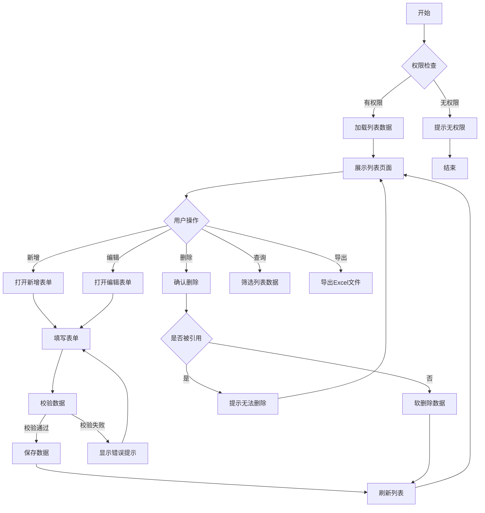
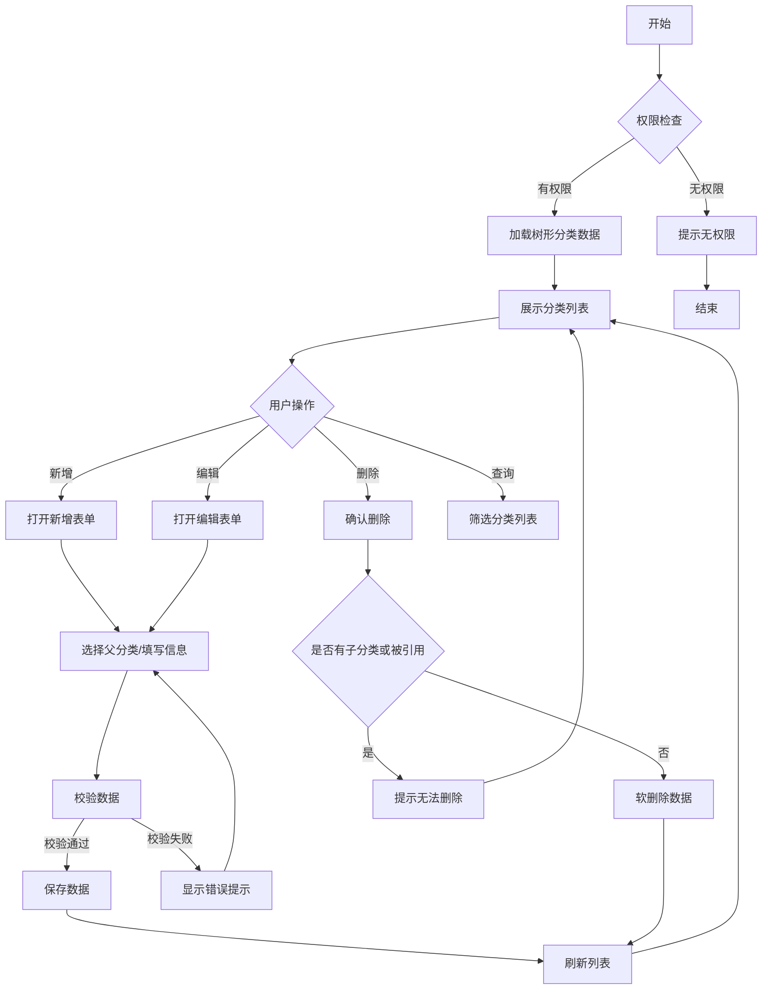
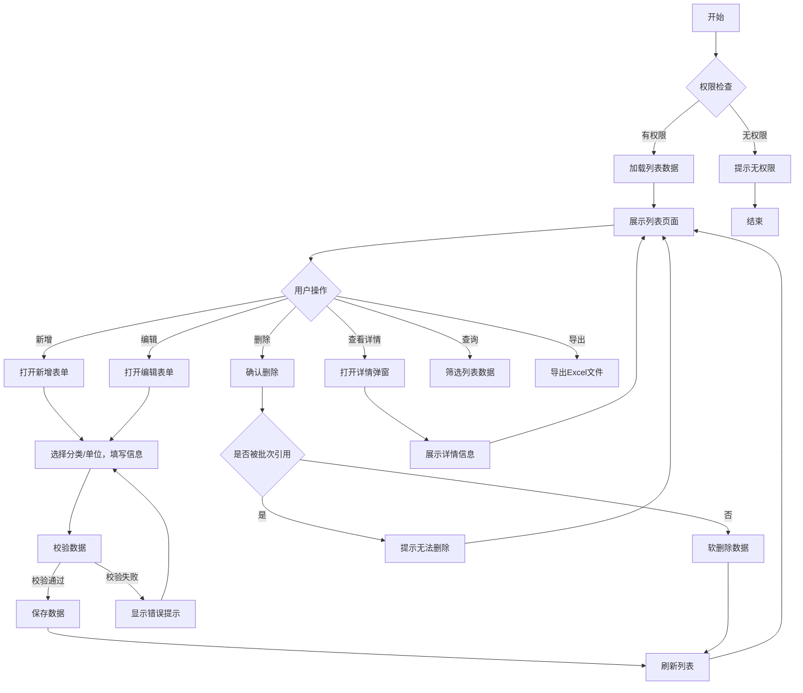
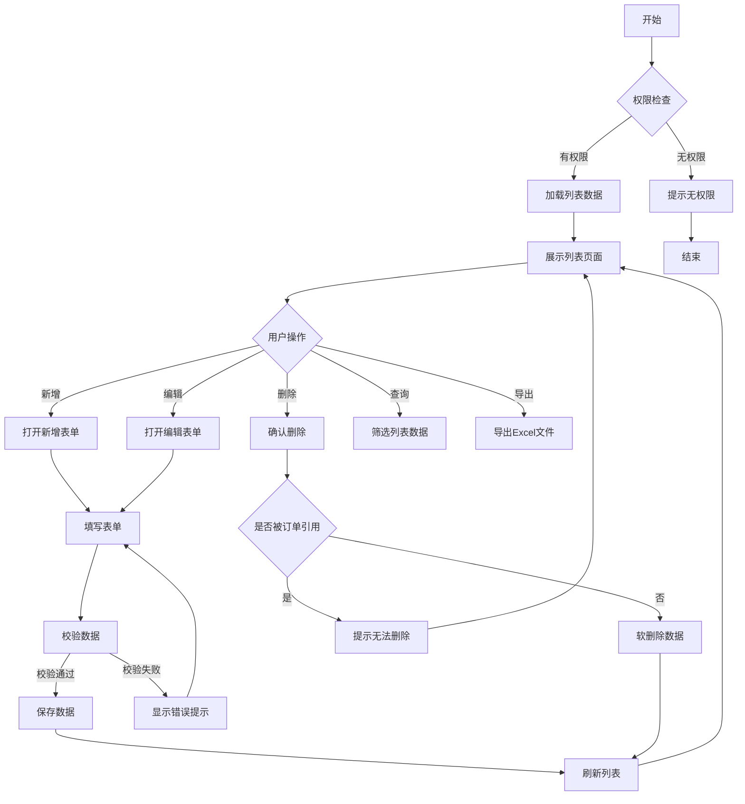

# 古麒绒材溯源管理系统 - PRD需求文档

---

## 文档信息

| 项目 | 内容 |
|------|------|
| 文档名称 | 古麒绒材溯源管理系统PRD |
| 版本号 | v1.0.0 |
| 编写日期 | 2026-04-07 |
| 编写人 | 产品经理 |
| 所属项目 | 古麒绒材数字化升级项目 |
| 最后更新 | 2026-04-07 |

---

## 修订记录

| 版本 | 日期 | 修订人 | 修订内容 |
|------|------|--------|----------|
| v1.0.0 | 2026-04-07 | 产品经理 | 初稿，完成基础功能需求定义 |

---

## 一、需求背景与目标

### 1.1 企业背景

**安徽古麒绒材股份有限公司**（股票代码：001390）是国内羽绒羽毛行业龙头企业，专注于高规格羽绒产品的研发、生产和销售。

**核心产品**：
- 白鹅绒、灰鹅绒、白鸭绒、灰鸭绒四大品类
- 绒子含量：90%、95%等高规格产品
- 蓬松度：可达850-900 in³/30g

### 1.2 业务需求描述

**为什么要做这个需求？**
- 国家出台产品质量追溯相关法规，要求建立追溯体系
- 消费者对羽绒产品质量存疑，需要透明化信息查询渠道
- 市场上存在假冒伪劣产品，损害品牌声誉
- 缺乏数字化手段展示产品品质，影响品牌溢价能力

### 1.3 用户痛点

**用户痛点**：
- 消费者无法验证产品真伪，对产品质量存疑
- 企业无法有效展示产品质检信息，品质优势无法传递
- 产品出现质量问题时，无法快速定位问题批次和流向

**解决价值**：
- 建立消费者信任，提升品牌忠诚度
- 实现产品信息透明化，展示品质优势
- 快速响应质量问题，降低品牌风险

### 1.4 业务目标

| 目标类型 | 具体目标 | 衡量指标 |
|---------|---------|---------|
| 核心业务目标 | 建立完整的产品溯源体系 | 覆盖100%产品批次 |
| 用户价值目标 | 消费者可便捷查询产品信息 | 扫码查询响应时间≤2秒 |
| 品牌提升目标 | 提升品牌数字化形象 | 消费者满意度≥90% |
| 合规目标 | 满足国家质量追溯要求 | 通过相关部门验收 |

---

## 二、用户与场景

### 2.1 目标用户画像

#### 2.1.1 系统管理员

| 属性 | 描述 |
|------|------|
| **角色定义** | 负责系统配置和基础数据维护的技术或运营人员 |
| **工作职责** | 维护计量单位、产品档案等基础数据；配置系统参数和权限 |
| **用户特征** | 年龄25-40岁，大专及以上学历，有ERP或MES系统使用经验 |
| **使用场景** | 在办公电脑上进行系统配置和数据维护 |
| **使用频率** | 每日/每周 |
| **核心诉求** | 操作便捷、数据准确、系统稳定 |

#### 2.1.2 生产操作员

| 属性 | 描述 |
|------|------|
| **角色定义** | 负责产品批次管理和数据录入的生产一线员工 |
| **工作职责** | 根据生产任务生成产品溯源码并下载；录入批次生产和质检信息；将二维码图片送印刷厂印刷 |
| **用户特征** | 年龄20-45岁，高中及以上学历，对电脑操作有一定基础 |
| **使用场景** | 在生产车间或仓库，使用工控电脑或平板操作 |
| **使用频率** | 每日多次 |
| **核心诉求** | 操作简单高效、出错率低、二维码清晰可印刷 |

#### 2.1.3 终端消费者

| 属性 | 描述 |
|------|------|
| **角色定义** | 购买古麒绒材产品后扫码查询的消费者 |
| **用户特征** | 年龄18-60岁，各学历层次，使用手机微信扫码 |
| **使用场景** | 购买产品后，使用微信扫描产品上的溯源码 |
| **使用频率** | 偶尔（购买产品时） |
| **核心诉求** | 快速获取产品信息、验证真伪、了解品质 |

### 2.2 应用场景

#### 2.2.1 场景一：产品批次管理

| 属性 | 描述 |
|------|------|
| **触发情境** | 生产车间完成一批羽绒产品的生产和质检后，需要为该产品批次生成溯源码 |
| **用户行为** | 生产操作员登录系统，选择产品档案，填写批次信息，录入质检数据，生成二维码并下载 |
| **期望目的** | 为该批次产品生成唯一的溯源标识，便于后续追溯和查询 |
| **前置条件** | 产品档案已维护；操作员有创建批次权限 |
| **后置结果** | 成功生成溯源二维码并提供下载，批次信息保存到系统，二维码图片可送印刷厂印刷，消费者可通过二维码查询 |

**操作流程**：
1. 操作员点击"新增批次"按钮，打开批次表单
2. 选择产品档案（系统自动带出产品名称、编号）
3. 填写批次号（系统校验唯一性）、数量、生产日期
4. 录入质检数据：绒子含量、蓬松度、清洁度、耗氧量
5. 点击"生成二维码"预览二维码
6. 确认信息无误后点击"保存并生成二维码"
7. 系统生成高清二维码图片
8. 保存记录，提供下载链接，返回列表
9. 操作员下载二维码图片，送印刷厂进行批量印刷

#### 2.2.2 场景二：扫码溯源查询

| 属性 | 描述 |
|------|------|
| **触发情境** | 消费者购买古麒绒材产品后，想了解产品信息并验证真伪 |
| **用户行为** | 使用微信扫描产品包装上的二维码，进入H5溯源页面查看产品信息 |
| **期望目的** | 快速获取产品真实信息，验证产品真伪，了解产品品质指标 |
| **前置条件** | 产品已生成溯源码并录入系统；消费者手机有微信和网络连接 |
| **后置结果** | 消费者获取产品信息，信任度提升 |

**操作流程**：
1. 消费者使用微信扫描产品包装上的二维码
2. 系统自动解析二维码中的批次号
3. 后台查询批次数据并验证有效性
4. 页面加载完成后首先显示正品验证结果
5. 向下滚动查看产品基本信息（名称、规格、生产日期等）
6. 查看质检指标（绒子含量、蓬松度等，以卡片形式展示）
7. 查看完整的溯源流程时间线

### 2.3 业务价值

| 价值点 | 具体说明 | 可衡量指标 |
|--------|----------|------------|
| 提升消费者信任 | 提供透明的产品信息查询渠道，增强消费者信心 | 消费者满意度≥90% |
| 品牌防伪打假 | 通过唯一溯源码防止假冒伪劣产品 | 假冒投诉减少50% |
| 质量追溯效率 | 出现质量问题时可快速定位批次和流向 | 追溯时间从2小时缩短到5分钟 |
| 数字化形象提升 | 通过数字化手段展示产品品质，支撑高端定位 | 品牌数字化评分提升30% |

---

## 三、功能概述

### 3.1 功能范围

本系统涵盖古麒绒材产品溯源管理的完整业务流程，包括基础数据管理、业务功能实现和消费者端查询三大模块。

### 3.2 功能清单

| 模块 | 功能点 | 功能说明 | 优先级 |
|------|--------|----------|--------|
| 基础数据 | 计量单位管理 | 统一管理重量、长度等计量单位 | P0 |
| 基础数据 | 产品分类管理 | 树形结构管理产品分类体系 | P0 |
| 基础数据 | 产品档案管理 | 维护产品基础信息和技术参数 | P0 |
| 基础数据 | 客户档案管理 | 管理客户信息和合作关系 | P1 |
| 业务功能 | 产品批次管理 | 生成产品溯源码并提供下载 | P0 |
| 业务功能 | 微信扫码溯源 | 消费者扫码查询产品信息 | P0 |

### 3.3 功能边界

**包含功能：**
- 基础数据的增删改查和批量操作
- 产品溯源码的生成、下载和管理
- 消费者扫码验证和信息展示
- 系统主题切换（浅色/深色模式）

**不包含功能：**
- 生产执行系统（MES）的详细排产功能
- 完整的ERP进销存管理
- 财务结算和成本核算
- 多语言国际化支持（首期仅支持中文）

---

## 四、详细功能描述

### 4.1 计量单位管理

#### 4.1.1 功能描述

- **功能名称**：计量单位管理
- **功能目标**：统一系统的计量单位信息，作为采购、销售、生产、库存四个业务模块的数量计量单位数据库
- **功能价值**：确保全系统计量单位一致，避免单位混乱导致的业务错误

#### 4.1.2 页面图片

（请在开发完成后补充截图）

#### 4.1.3 业务流程



#### 4.1.4 角色权限设计

##### 4.1.4.1 角色权限矩阵

| 权限项 | 系统管理员 | 生产操作员 | 企业管理层 |
|--------|------------|------------|------------|
| 查看列表 | ✅ | ✅ | ✅ |
| 新增记录 | ✅ | ❌ | ❌ |
| 编辑记录 | ✅ | ❌ | ❌ |
| 删除记录 | ✅ | ❌ | ❌ |
| 批量导出 | ✅ | ✅ | ✅ |

##### 4.1.4.2 数据权限规则

| 角色 | 数据范围 | 说明 |
|------|----------|------|
| 系统管理员 | 全部数据 | 可查看和操作所有计量单位 |
| 生产操作员 | 全部数据 | 仅可查看，用于选择 |
| 企业管理层 | 全部数据 | 仅可查看和导出 |

#### 4.1.5 列表数据规范

##### 4.1.5.1 数据获取方式

| 属性 | 描述 |
|------|------|
| **数据来源** | MES_jiliangdanwei（计量单位表单） |
| **获取方式** | 实时查询 |
| **分页方式** | 后端分页，每页默认20条 |
| **加载策略** | 首次加载全部，支持前端筛选 |

##### 4.1.5.2 列表排序规则

| 优先级 | 排序字段 | 排序方式 | 说明 |
|--------|----------|----------|------|
| 1 | createTime | 降序(DESC) | 默认按创建时间倒序 |
| 2 | unitName | 升序(ASC) | 单位名称拼音排序 |

**列表字段定义**：

| 序号 | 字段名称 | 字段标识 | 数据类型 | 是否必填 | 规则 |
|------|----------|----------|----------|----------|------|
| 1 | 序号 | index | Number | - | 自动编号 |
| 2 | 单位名称 | unitName | String | 是 | 如：千克、克 |
| 3 | 单位编号 | unitCode | String | 是 | 如：kg、g，全局唯一 |
| 4 | 状态 | status | Enum | 是 | 启用/禁用 |
| 5 | 创建人 | createBy | String | 是 | - |
| 6 | 创建时间 | createTime | DateTime | 是 | 系统自动记录 |
| 7 | 操作 | - | - | - | 编辑/删除 |

**筛选条件**：

| 序号 | 筛选字段 | 控件类型 | 查询方式 |
|------|----------|----------|----------|
| 1 | 单位名称 | 输入框 | 模糊匹配 |
| 2 | 单位编号 | 输入框 | 模糊匹配 |
| 3 | 状态 | 下拉选择 | 精确匹配 |

**筛选条件布局**：一行显示4个筛选项，支持展开/收起

#### 4.1.6 业务模块协同

##### 4.1.6.1 上游模块依赖

无上游模块依赖。计量单位管理是基础数据模块，不依赖其他业务模块。

##### 4.1.6.2 下游模块影响

| 下游模块 | 影响类型 | 影响说明 | 数据流向 |
|---------|---------|---------|---------|
| 产品档案管理 | 数据引用 | 产品档案引用计量单位 | 本模块 → 产品档案管理 |

##### 4.1.6.3 模块协同流程图

```text
[计量单位管理] ──数据引用──> [产品档案管理]
```

##### 4.1.6.4 数据一致性规则

| 规则编号 | 规则描述 | 触发条件 | 处理方式 |
|---------|---------|---------|---------|
| DC1 | 单位被引用时禁止删除 | 删除操作前检查 | 提示"已被产品引用，无法删除" |
| DC2 | 禁用单位不可选 | 产品档案选择单位时 | 筛选条件增加status=启用 |

#### 4.1.7 功能点详述

##### 4.1.7.1 功能点一：新增单位

###### 4.1.7.1.1 功能描述

用于新增计量单位信息，统一系统的计量单位数据标准。

###### 4.1.7.1.2 功能入口

| 属性 | 描述 |
|------|------|
| **入口位置** | 列表页工具栏 |
| **入口形式** | 按钮 |
| **入口文案** | + 新增 |
| **显示条件** | 用户有新增权限时显示 |

###### 4.1.7.1.3 业务规则

| 规则编号 | 规则名称 | 规则描述 | 优先级 |
|---------|---------|---------|--------|
| BR1 | 编码唯一性 | 单位编号全局唯一，重复时提示"单位编号已存在" | 必须 |
| BR2 | 名称唯一性 | 单位名称全局唯一，重复时提示"单位名称已存在" | 必须 |
| BR3 | 编码格式 | 单位编号长度1-10字符，支持字母、数字 | 必须 |
| BR4 | 名称格式 | 单位名称长度2-20字符 | 必须 |
| BR5 | 默认状态 | 新增时状态默认为"启用" | 建议 |

###### 4.1.7.1.4 操作逻辑

| 元素 | 类型 | 触发条件 | 行为描述 | 反馈方式 |
|------|------|---------|---------|---------|
| [新增]按钮 | 按钮(Button) | 点击 | 打开新增表单对话框 | 对话框从中心弹出 |
| [单位编号]输入框 | 输入框(Input) | 失去焦点 | 校验编码是否已存在 | 已存在时红色提示 |
| [单位名称]输入框 | 输入框(Input) | 失去焦点 | 校验名称是否已存在 | 已存在时红色提示 |
| [保存]按钮 | 按钮(Button) | 点击 | 验证表单→提交数据→关闭对话框→刷新列表 | Toast提示"保存成功" |
| [取消]按钮 | 按钮(Button) | 点击 | 关闭对话框，不保存数据 | 如有修改，确认框提示 |

###### 4.1.7.1.5 表单字段

| 序号 | 字段名称 | 字段标识 | 控件类型 | 是否必填 | 验证规则 | 默认值 | 联动规则 |
|------|---------|---------|---------|---------|---------|--------|---------|
| 1 | 单位编号 | unitCode | 输入框(Input) | 是 | 唯一，长度1-10字符 | - | - |
| 2 | 单位名称 | unitName | 输入框(Input) | 是 | 唯一，长度2-20字符 | - | - |
| 3 | 状态 | status | 开关(Switch) | 是 | - | 启用 | - |

##### 4.1.7.2 功能点二：编辑单位

###### 4.1.7.2.1 功能描述

用于修改已有的计量单位信息。

###### 4.1.7.2.2 功能入口

| 属性 | 描述 |
|------|------|
| **入口位置** | 列表页操作列 |
| **入口形式** | 图标按钮 |
| **入口文案** | 编辑 |
| **显示条件** | 用户有编辑权限时显示 |

###### 4.1.7.2.3 业务规则

| 规则编号 | 规则名称 | 规则描述 | 优先级 |
|---------|---------|---------|--------|
| BR1 | 编码唯一性 | 修改时单位编号不可变更 | 必须 |
| BR2 | 名称唯一性 | 单位名称全局唯一，重复时提示 | 必须 |
| BR3 | 数据存在性 | 编辑前校验数据是否存在 | 必须 |

###### 4.1.7.2.4 操作逻辑

| 元素 | 类型 | 触发条件 | 行为描述 | 反馈方式 |
|------|------|---------|---------|---------|
| [编辑]按钮 | 图标按钮 | 点击 | 打开编辑表单对话框，加载当前数据 | 对话框弹出并回填数据 |
| [保存]按钮 | 按钮 | 点击 | 验证表单→更新数据→关闭对话框→刷新列表 | Toast提示"更新成功" |
| [取消]按钮 | 按钮 | 点击 | 关闭对话框 | - |

###### 4.1.7.2.5 表单字段

| 序号 | 字段名称 | 字段标识 | 控件类型 | 是否必填 | 验证规则 | 默认值 | 联动规则 |
|------|---------|---------|---------|---------|---------|--------|---------|
| 1 | 单位编号 | unitCode | 输入框(只读) | 是 | 不可修改 | 当前值 | - |
| 2 | 单位名称 | unitName | 输入框 | 是 | 唯一，长度2-20字符 | 当前值 | - |
| 3 | 状态 | status | 开关 | 是 | - | 当前值 | - |

##### 4.1.7.3 功能点三：删除单位

###### 4.1.7.3.1 功能描述

用于删除不再使用的计量单位，删除前会检查是否被引用。

###### 4.1.7.3.2 功能入口

| 属性 | 描述 |
|------|------|
| **入口位置** | 列表页操作列 |
| **入口形式** | 图标按钮 |
| **入口文案** | 删除 |
| **显示条件** | 用户有删除权限时显示 |

###### 4.1.7.3.3 业务规则

| 规则编号 | 规则名称 | 规则描述 | 优先级 |
|---------|---------|---------|--------|
| BR1 | 引用检查 | 被产品引用的单位不可删除 | 必须 |
| BR2 | 软删除 | 删除时标记delFlag=1，不物理删除 | 必须 |
| BR3 | 二次确认 | 删除前弹出确认对话框 | 建议 |

###### 4.1.7.3.4 操作逻辑

| 元素 | 类型 | 触发条件 | 行为描述 | 反馈方式 |
|------|------|---------|---------|---------|
| [删除]按钮 | 图标按钮 | 点击 | 弹出确认对话框 | 确认框提示"确定删除吗？" |
| [确认]按钮 | 按钮 | 点击 | 检查引用→软删除→刷新列表 | Toast提示"删除成功"或"已被引用，无法删除" |
| [取消]按钮 | 按钮 | 点击 | 关闭确认框 | - |

##### 4.1.7.4 功能点四：查询单位

###### 4.1.7.4.1 功能描述

用于按条件筛选和查找计量单位。

###### 4.1.7.4.2 功能入口

| 属性 | 描述 |
|------|------|
| **入口位置** | 列表页搜索区域 |
| **入口形式** | 输入框+按钮组合 |
| **入口文案** | 搜索、重置 |
| **显示条件** | 始终显示 |

###### 4.1.7.4.3 业务规则

| 规则编号 | 规则名称 | 规则描述 | 优先级 |
|---------|---------|---------|--------|
| BR1 | 模糊匹配 | 单位名称、编号支持模糊查询 | 必须 |
| BR2 | 精确匹配 | 状态下拉选择精确匹配 | 必须 |
| BR3 | 组合查询 | 多个条件组合AND查询 | 必须 |

###### 4.1.7.4.4 操作逻辑

| 元素 | 类型 | 触发条件 | 行为描述 | 反馈方式 |
|------|------|---------|---------|---------|
| [搜索]按钮 | 按钮 | 点击 | 按条件查询并刷新列表 | 列表更新，显示结果数量 |
| [重置]按钮 | 按钮 | 点击 | 清空所有筛选条件，恢复默认查询 | 列表恢复默认数据 |
| [展开/收起]按钮 | 按钮 | 点击 | 展开或收起更多筛选项 | 动画展开/收起筛选区域 |

##### 4.1.7.5 功能点五：批量导出

###### 4.1.7.5.1 功能描述

用于将计量单位数据导出为Excel文件。

###### 4.1.7.5.2 功能入口

| 属性 | 描述 |
|------|------|
| **入口位置** | 列表页工具栏 |
| **入口形式** | 按钮 |
| **入口文案** | 批量导出 |
| **显示条件** | 用户有导出权限时显示 |

###### 4.1.7.5.3 业务规则

| 规则编号 | 规则名称 | 规则描述 | 优先级 |
|---------|---------|---------|--------|
| BR1 | 导出范围 | 导出当前筛选条件下的全部数据 | 必须 |
| BR2 | 文件格式 | 导出为.xlsx格式 | 必须 |
| BR3 | 文件名规范 | 文件名格式：计量单位_YYYYMMDD.xlsx | 建议 |

###### 4.1.7.5.4 操作逻辑

| 元素 | 类型 | 触发条件 | 行为描述 | 反馈方式 |
|------|------|---------|---------|---------|
| [批量导出]按钮 | 按钮 | 点击 | 生成Excel文件并下载 | Toast提示"导出成功"，自动下载文件 |

##### 4.1.7.6 功能点六：批量删除

###### 4.1.7.6.1 功能描述

用于批量删除选中的计量单位数据，支持表格多选后批量操作。

###### 4.1.7.6.2 功能入口

| 属性 | 描述 |
|------|------|
| **入口位置** | 列表页工具栏 |
| **入口形式** | 按钮 |
| **入口文案** | 批量删除 |
| **显示条件** | 用户有删除权限且勾选了表格数据时显示 |

###### 4.1.7.6.3 业务规则

| 规则编号 | 规则名称 | 规则描述 | 优先级 |
|---------|---------|---------|--------|
| BR1 | 引用检查 | 被产品引用的单位不可删除 | 必须 |
| BR2 | 软删除 | 删除时标记delFlag=1，不物理删除 | 必须 |
| BR3 | 二次确认 | 删除前弹出确认对话框，显示选中数量 | 必须 |
| BR4 | 部分失败提示 | 部分删除失败时提示具体失败项 | 建议 |

###### 4.1.7.6.4 操作逻辑

| 元素 | 类型 | 触发条件 | 行为描述 | 反馈方式 |
|------|------|---------|---------|---------|
| 表格复选框 | 复选框 | 勾选 | 选中要删除的数据行 | 行高亮显示，工具栏[批量删除]按钮启用 |
| [批量删除]按钮 | 按钮 | 点击 | 弹出确认对话框，显示"已选中X条数据" | 确认框提示"确定删除选中的X条数据吗？" |
| [确认]按钮 | 按钮 | 点击 | 循环检查引用→批量软删除→刷新列表 | Toast提示"成功删除X条"或"X条已被引用，无法删除" |
| [取消]按钮 | 按钮 | 点击 | 关闭确认框 | - |

##### 4.1.7.7 功能点七：下载模版

###### 4.1.7.7.1 功能描述

用于下载批量导入用的Excel模版文件，包含标准的数据格式和示例。

###### 4.1.7.7.2 功能入口

| 属性 | 描述 |
|------|------|
| **入口位置** | 列表页工具栏 |
| **入口形式** | 按钮 |
| **入口文案** | 下载模版 |
| **显示条件** | 始终显示 |

###### 4.1.7.7.3 业务规则

| 规则编号 | 规则名称 | 规则描述 | 优先级 |
|---------|---------|---------|--------|
| BR1 | 模版格式 | 提供.xlsx格式模版文件 | 必须 |
| BR2 | 字段规范 | 模版包含所有必填字段和数据格式说明 | 必须 |
| BR3 | 示例数据 | 模版包含1-2行示例数据供参考 | 建议 |
| BR4 | 文件名规范 | 文件名格式：计量单位导入模版.xlsx | 建议 |

###### 4.1.7.7.4 操作逻辑

| 元素 | 类型 | 触发条件 | 行为描述 | 反馈方式 |
|------|------|---------|---------|---------|
| [下载模版]按钮 | 按钮 | 点击 | 生成标准模版Excel文件并下载 | Toast提示"模版下载成功"，自动下载文件 |

##### 4.1.7.8 功能点八：批量导入

###### 4.1.7.8.1 功能描述

用于通过Excel文件批量导入计量单位数据，提高数据录入效率。

###### 4.1.7.8.2 功能入口

| 属性 | 描述 |
|------|------|
| **入口位置** | 列表页工具栏 |
| **入口形式** | 按钮 |
| **入口文案** | 批量导入 |
| **显示条件** | 用户有新增权限时显示 |

###### 4.1.7.8.3 业务规则

| 规则编号 | 规则名称 | 规则描述 | 优先级 |
|---------|---------|---------|--------|
| BR1 | 文件格式 | 仅支持.xlsx格式文件 | 必须 |
| BR2 | 文件大小 | 单个文件大小不超过5MB | 必须 |
| BR3 | 数据校验 | 导入前校验数据格式和唯一性 | 必须 |
| BR4 | 错误提示 | 校验失败时返回具体错误行和错误原因 | 必须 |
| BR5 | 重复处理 | 编号重复时跳过并记录，不中断导入 | 建议 |
| BR6 | 最大行数 | 单次导入最多支持1000条数据 | 建议 |

###### 4.1.7.8.4 操作逻辑

| 元素 | 类型 | 触发条件 | 行为描述 | 反馈方式 |
|------|------|---------|---------|---------|
| [批量导入]按钮 | 按钮 | 点击 | 打开文件选择对话框 | 弹出文件选择窗口 |
| 文件选择 | 文件选择 | 选择文件 | 校验文件格式和大小 | 不符合要求时提示"请上传.xlsx格式文件，大小不超过5MB" |
| 上传确认 | 自动 | 文件校验通过 | 上传文件并解析数据 | 显示进度条或加载状态 |
| 数据校验 | 自动 | 解析完成 | 校验每行数据格式和唯一性 | 校验失败时显示错误报告，列出错误行和原因 |
| 导入执行 | 自动 | 校验通过 | 批量插入数据 | Toast提示"成功导入X条数据" |
| 刷新列表 | 自动 | 导入完成 | 自动刷新数据列表 | 列表显示新导入的数据 |

#### 4.1.8 数据模型设计

##### 4.1.8.1 主实体：计量单位

**表单标识**：MES_jiliangdanwei

| 序号 | 字段名称 | 字段标识 | 控件类型 | 是否必填 | 验证规则 |
|------|----------|----------|----------|----------|----------|
| 1 | 单位编号 | unitCode | 输入框 | 是 | 唯一，长度1-10字符 |
| 2 | 单位名称 | unitName | 输入框 | 是 | 唯一，长度2-20字符 |
| 3 | 状态 | status | 开关 | 是 | 默认启用 |

**业务规则**：
1. 单位编号全局唯一，不可重复
2. 已被产品引用的单位不可删除
3. 禁用状态的单位在新增产品时不可选

#### 4.1.9 UI界面设计

##### 4.1.9.1 页面布局结构

```text
页面根节点
├── KaiwuFlexDialog（新增/编辑对话框）
│   └── KaiwuFlexForm（表单）
├── KaiwuFlexDialog（确认对话框）
└── KaiwuFlexLayout（主布局）
    ├── 搜索区域
    │   └── KaiwuFlexForm（筛选表单）
    ├── 工具栏
    │   └── 左侧按钮组（新增、批量删除、下载模版、批量导入、批量导出）
    └── KaiwuFlexTable2（数据列表）
        └── 操作列按钮（编辑/删除）
```

##### 4.1.9.2 列表页面线框图

```text
┌─────────────────────────────────────────────────────────────────────────┐
│  搜索区域                                                                │
│  ┌──────────┐ ┌──────────┐ ┌────────────────┐  [搜索] [重置] [展开↓]   │
│  │ 单位编号  │ │ 单位名称  │ │ 状态 ▼         │                         │
│  └──────────┘ └──────────┘ └────────────────┘                          │
├─────────────────────────────────────────────────────────────────────────┤
│  工具栏                                                                  │
│  [+ 新增] [批量删除] [下载模版] [批量导入] [批量导出]                         │
├─────────────────────────────────────────────────────────────────────────┤
│  数据列表                                                                │
│  ┌──┬──────────┬──────────┬────────┬──────────┬──────────┬──────────┐  │
│  │☐ │ [单位编号]  │ [单位名称]  │ [状态]  │ [创建人]   │ [创建时间] │ 操作     │  │
│  ├──┼──────────┼──────────┼────────┼──────────┼──────────┼──────────┤  │
│  │☐ │ kg       │ 千克     │ 启用   │ 管理员    │ 2024-01-15│编辑 删除│  │
│  │☐ │ g        │ 克       │ 启用   │ 管理员    │ 2024-01-15│编辑 删除│  │
│  └──┴──────────┴──────────┴────────┴──────────┴──────────┴──────────┘  │
│  共 10 条                    分页: [<] 1 2 ... [>]    每页: [20条 ▼]     │
└─────────────────────────────────────────────────────────────────────────┘
```

##### 4.1.9.3 新增/编辑表单对话框

```text
┌────────────────────────────────────────────────────┐
│ 新增计量单位                                    [X] │
├────────────────────────────────────────────────────┤
│                                                    │
│ 基本信息                                           │
│ ┌────────────────────────────────────────────────┐│
│ │ 单位编号: [                  ] *              ││
│ │ 单位名称: [                  ] *              ││
│ │ 状    态: [● 启用]                            ││
│ └────────────────────────────────────────────────┘│
│                                                    │
├────────────────────────────────────────────────────┤
│                         [取消]  [保存]             │
└────────────────────────────────────────────────────┘
```

#### 4.1.10 边界与异常处理

##### 4.1.10.1 网络异常

| 场景 | 检测方式 | 处理方式 | 用户提示 |
|------|---------|---------|---------|
| 请求超时 | 超时时间30s | 自动重试1次 | "网络超时，请稍后重试" |
| 断网 | navigator.onLine | 禁用提交按钮 | "网络已断开，请检查网络连接" |
| 服务器错误 | HTTP状态码5xx | 显示错误页面 | "服务器繁忙，请稍后重试" |

##### 4.1.10.2 数据异常

| 场景 | 检测方式 | 处理方式 | 用户提示 |
|------|---------|---------|---------|
| 列表数据为空 | records.length === 0 | 显示空状态组件 | "暂无数据" |
| 搜索无结果 | 有筛选条件但结果为空 | 显示空状态+重置按钮 | "未找到匹配数据" |
| 详情数据不存在 | 接口返回404 | 返回列表页 | "数据不存在或已被删除" |

##### 4.1.10.3 权限异常

| 场景 | 检测方式 | 处理方式 | 用户提示 |
|------|---------|---------|---------|
| 无页面权限 | 路由守卫校验 | 跳转到403页面 | "您没有权限访问此页面" |
| 无操作权限 | 按钮权限校验 | 隐藏或禁用按钮 | 按钮禁用态 |
| Token过期 | 401响应 | 跳转登录页 | "登录已过期，请重新登录" |

##### 4.1.10.4 操作冲突

| 场景 | 检测方式 | 处理方式 | 用户提示 |
|------|---------|---------|---------|
| 并发编辑 | 乐观锁版本号 | 提示刷新后重试 | "数据已被他人修改" |
| 重复提交 | 按钮loading+防抖 | 禁用按钮直到请求完成 | 按钮显示loading状态 |
| 删除已使用数据 | 业务校验 | 阻止删除 | "该数据已被使用，无法删除" |

##### 4.1.10.5 输入异常

| 场景 | 检测方式 | 处理方式 | 用户提示 |
|------|---------|---------|---------|
| 必填字段为空 | 表单验证 | 阻止提交，高亮字段 | "请输入XXX" |
| 格式不正确 | 正则校验 | 实时提示 | "格式不正确" |
| 编码重复 | 失去焦点校验 | 实时提示 | "该编码已存在" |

#### 4.1.11 数据示例

##### 4.1.11.1 Mock数据

```javascript
const unitData = [
  {
    _id: "unit_001",
    unitCode: "kg",
    unitName: "千克",
    status: "启用",
    delFlag: 0,
    createBy: "管理员",
    createTime: "2024-01-15 10:30:00",
    updateBy: "管理员",
    updateTime: "2024-01-15 10:30:00"
  },
  {
    _id: "unit_002",
    unitCode: "g",
    unitName: "克",
    status: "启用",
    delFlag: 0,
    createBy: "管理员",
    createTime: "2024-01-15 10:31:00",
    updateBy: "管理员",
    updateTime: "2024-01-15 10:31:00"
  },
  {
    _id: "unit_003",
    unitCode: "t",
    unitName: "吨",
    status: "启用",
    delFlag: 0,
    createBy: "管理员",
    createTime: "2024-01-15 10:32:00",
    updateBy: "管理员",
    updateTime: "2024-01-15 10:32:00"
  }
];
```

##### 4.1.11.2 字典数据

```javascript
const dictData = {
  STATUS: [
    { value: "启用", label: "启用", color: "#52c41a" },
    { value: "禁用", label: "禁用", color: "#d9d9d9" }
  ]
};
```

---

### 4.2 产品分类管理

#### 4.2.1 功能描述

- **功能名称**：产品分类管理
- **功能目标**：建立产品分类体系，便于产品归类管理和统计
- **功能价值**：清晰的分类体系，便于产品管理和检索

#### 4.2.2 页面图片

（请在开发完成后补充截图）

#### 4.2.3 业务流程



#### 4.2.4 角色权限设计

##### 4.2.4.1 角色权限矩阵

| 权限项 | 系统管理员 | 生产操作员 | 企业管理层 |
|--------|------------|------------|------------|
| 查看列表 | ✅ | ✅ | ✅ |
| 新增记录 | ✅ | ❌ | ❌ |
| 编辑记录 | ✅ | ❌ | ❌ |
| 删除记录 | ✅ | ❌ | ❌ |

##### 4.2.4.2 数据权限规则

| 角色 | 数据范围 | 说明 |
|------|----------|------|
| 系统管理员 | 全部数据 | 可查看和操作所有分类 |
| 生产操作员 | 全部数据 | 仅可查看，用于选择 |
| 企业管理层 | 全部数据 | 仅可查看 |

#### 4.2.5 列表数据规范

##### 4.2.5.1 数据获取方式

| 属性 | 描述 |
|------|------|
| **数据来源** | MES_chanpinfenlei（产品分类表单） |
| **获取方式** | 实时查询 |
| **分页方式** | 后端分页，每页默认20条 |
| **加载策略** | 树形结构加载，支持展开/收起 |

##### 4.2.5.2 列表排序规则

| 优先级 | 排序字段 | 排序方式 | 说明 |
|--------|----------|----------|------|
| 1 | sortOrder | 升序(ASC) | 按排序号从小到大 |
| 2 | createTime | 降序(DESC) | 其次按创建时间倒序 |

##### 4.2.5.3 列表字段定义

| 序号 | 字段名称 | 字段标识 | 数据类型 | 是否必填 | 规则 |
|------|----------|----------|----------|----------|------|
| 1 | 分类名称 | categoryName | String | 是 | - |
| 2 | 分类编号 | categoryCode | String | 是 | 全局唯一 |
| 3 | 父分类 | parentName | String | 否 | 树形结构显示 |
| 4 | 排序号 | sortOrder | Number | 是 | 用于排序 |
| 5 | 创建人 | createBy | String | 是 | - |
| 6 | 创建时间 | createTime | DateTime | 是 | 系统自动记录 |
| 7 | 操作 | - | - | - | 编辑/删除 |

##### 4.2.5.4 筛选条件

| 序号 | 筛选字段 | 控件类型 | 查询方式 |
|------|----------|----------|----------|
| 1 | 分类名称 | 输入框 | 模糊匹配 |
| 2 | 分类编号 | 输入框 | 模糊匹配 |

**筛选条件布局**: 一行显示2个筛选项

#### 4.2.6 业务模块协同

##### 4.2.6.1 上游模块依赖

无上游模块依赖。产品分类管理是基础数据模块。

##### 4.2.6.2 下游模块影响

| 下游模块 | 影响类型 | 影响说明 | 数据流向 |
|---------|---------|---------|---------|
| 产品档案管理 | 数据引用 | 产品档案引用产品分类 | 本模块 → 产品档案管理 |

##### 4.2.6.3 模块协同流程图

```text
[产品分类管理] ──数据引用──> [产品档案管理]
```

##### 4.2.6.4 数据一致性规则

| 规则编号 | 规则描述 | 触发条件 | 处理方式 |
|---------|---------|---------|---------|
| DC1 | 分类被引用时禁止删除 | 删除操作前检查 | 提示"已被产品引用，无法删除" |
| DC2 | 有子分类时禁止删除 | 删除操作前检查 | 提示"请先删除子分类" |
| DC3 | 层级限制 | 新增/编辑时检查 | 最多支持3级分类 |

#### 4.2.7 功能点详述

##### 4.2.7.1 功能点一：新增分类

###### 4.2.7.1.1 功能描述

用于新增产品分类信息，支持树形层级结构，最多3级。

###### 4.2.7.1.2 功能入口

| 属性 | 描述 |
|------|------|
| **入口位置** | 列表页工具栏 |
| **入口形式** | 按钮 |
| **入口文案** | + 新增 |
| **显示条件** | 用户有新增权限时显示 |

###### 4.2.7.1.3 业务规则

| 规则编号 | 规则名称 | 规则描述 | 优先级 |
|---------|---------|---------|--------|
| BR1 | 编码唯一性 | 分类编号全局唯一 | 必须 |
| BR2 | 名称唯一性 | 分类名称全局唯一 | 必须 |
| BR3 | 层级限制 | 最多支持3级分类 | 必须 |
| BR4 | 父级选择 | 不能选择自己为父级 | 必须 |
| BR5 | 默认排序 | 排序号默认为0 | 建议 |

###### 4.2.7.1.4 操作逻辑

| 元素 | 类型 | 触发条件 | 行为描述 | 反馈方式 |
|------|------|---------|---------|---------|
| [新增]按钮 | 按钮 | 点击 | 打开新增表单对话框 | 对话框弹出 |
| [父分类]下拉 | 树形选择 | 选择 | 加载父分类树 | 显示层级结构 |
| [保存]按钮 | 按钮 | 点击 | 验证→保存→关闭→刷新 | Toast提示成功 |

###### 4.2.7.1.5 表单字段

| 序号 | 字段名称 | 字段标识 | 控件类型 | 是否必填 | 验证规则 | 默认值 | 联动规则 |
|------|---------|---------|---------|---------|---------|--------|---------|
| 1 | 父分类 | parentId | 树形选择 | 否 | - | - | - |
| 2 | 分类编号 | categoryCode | 输入框 | 是 | 唯一，长度2-20 | - | - |
| 3 | 分类名称 | categoryName | 输入框 | 是 | 唯一，长度2-50 | - | - |
| 4 | 排序号 | sortOrder | 数字框 | 是 | 整数 | 0 | - |

##### 4.2.7.2 功能点二：编辑分类

###### 4.2.7.2.1 功能描述

用于修改已有分类信息。

###### 4.2.7.2.2 功能入口

| 属性 | 描述 |
|------|------|
| **入口位置** | 列表页操作列 |
| **入口形式** | 图标按钮 |
| **入口文案** | 编辑 |
| **显示条件** | 有编辑权限时显示 |

###### 4.2.7.2.3 业务规则

| 规则编号 | 规则名称 | 规则描述 | 优先级 |
|---------|---------|---------|--------|
| BR1 | 编码不可改 | 分类编号不可修改 | 必须 |
| BR2 | 不能选自己 | 不能选择自己和自己的子级为父级 | 必须 |

###### 4.2.7.2.4 操作逻辑

| 元素 | 类型 | 触发条件 | 行为描述 | 反馈方式 |
|------|------|---------|---------|---------|
| [编辑]按钮 | 图标按钮 | 点击 | 打开编辑对话框，回填数据 | 对话框弹出 |
| [保存]按钮 | 按钮 | 点击 | 验证→更新→关闭→刷新 | Toast提示更新成功 |

###### 4.2.7.2.5 表单字段

| 序号 | 字段名称 | 字段标识 | 控件类型 | 是否必填 | 验证规则 | 默认值 | 联动规则 |
|------|---------|---------|---------|---------|---------|--------|---------|
| 1 | 分类编号 | categoryCode | 输入框(只读) | 是 | 不可修改 | 当前值 | - |
| 2 | 分类名称 | categoryName | 输入框 | 是 | 唯一，长度2-50 | 当前值 | - |
| 3 | 父分类 | parentId | 树形选择 | 否 | - | 当前值 | - |
| 4 | 排序号 | sortOrder | 数字框 | 是 | 整数 | 当前值 | - |

##### 4.2.7.3 功能点三：删除分类

###### 4.2.7.3.1 功能描述

用于删除分类，删除前检查是否有子分类或被引用。

###### 4.2.7.3.2 功能入口

| 属性 | 描述 |
|------|------|
| **入口位置** | 列表页操作列 |
| **入口形式** | 图标按钮 |
| **入口文案** | 删除 |
| **显示条件** | 有删除权限时显示 |

###### 4.2.7.3.3 业务规则

| 规则编号 | 规则名称 | 规则描述 | 优先级 |
|---------|---------|---------|--------|
| BR1 | 子分类检查 | 有子分类时不可删除 | 必须 |
| BR2 | 引用检查 | 被产品引用时不可删除 | 必须 |
| BR3 | 软删除 | 标记删除而非物理删除 | 必须 |

###### 4.2.7.3.4 操作逻辑

| 元素 | 类型 | 触发条件 | 行为描述 | 反馈方式 |
|------|------|---------|---------|---------|
| [删除]按钮 | 图标按钮 | 点击 | 弹出确认对话框 | 确认框提示 |
| [确认]按钮 | 按钮 | 点击 | 检查→删除→刷新 | Toast提示结果 |

##### 4.2.7.4 功能点四：查询分类

###### 4.2.7.4.1 功能描述

用于按条件筛选查找分类。

###### 4.2.7.4.2 功能入口

| 属性 | 描述 |
|------|------|
| **入口位置** | 列表页搜索区域 |
| **入口形式** | 输入框+按钮 |
| **入口文案** | 搜索、重置 |
| **显示条件** | 始终显示 |

###### 4.2.7.4.3 业务规则

| 规则编号 | 规则名称 | 规则描述 | 优先级 |
|---------|---------|---------|--------|
| BR1 | 模糊匹配 | 分类名称、编号支持模糊查询 | 必须 |
| BR2 | 组合查询 | 多个条件组合AND查询 | 必须 |

###### 4.2.7.4.4 操作逻辑

| 元素 | 类型 | 触发条件 | 行为描述 | 反馈方式 |
|------|------|---------|---------|---------|
| [搜索]按钮 | 按钮 | 点击 | 按条件查询并刷新列表 | 列表更新 |
| [重置]按钮 | 按钮 | 点击 | 清空条件，恢复默认 | 列表恢复默认 |

##### 4.2.7.5 功能点五：批量导出

###### 4.2.7.5.1 功能描述

用于将产品分类数据导出为Excel文件。

###### 4.2.7.5.2 功能入口

| 属性 | 描述 |
|------|------|
| **入口位置** | 列表页工具栏 |
| **入口形式** | 按钮 |
| **入口文案** | 批量导出 |
| **显示条件** | 用户有导出权限时显示 |

###### 4.2.7.5.3 业务规则

| 规则编号 | 规则名称 | 规则描述 | 优先级 |
|---------|---------|---------|--------|
| BR1 | 导出范围 | 导出当前筛选条件下的全部数据 | 必须 |
| BR2 | 文件格式 | 导出为.xlsx格式 | 必须 |
| BR3 | 文件名规范 | 文件名格式：产品分类_YYYYMMDD.xlsx | 建议 |

###### 4.2.7.5.4 操作逻辑

| 元素 | 类型 | 触发条件 | 行为描述 | 反馈方式 |
|------|------|---------|---------|---------|
| [批量导出]按钮 | 按钮 | 点击 | 生成Excel文件并下载 | Toast提示"导出成功"，自动下载文件 |

##### 4.2.7.6 功能点六：批量删除

###### 4.2.7.6.1 功能描述

用于批量删除选中的产品分类数据，支持表格多选后批量操作。

###### 4.2.7.6.2 功能入口

| 属性 | 描述 |
|------|------|
| **入口位置** | 列表页工具栏 |
| **入口形式** | 按钮 |
| **入口文案** | 批量删除 |
| **显示条件** | 用户有删除权限且勾选了表格数据时显示 |

###### 4.2.7.6.3 业务规则

| 规则编号 | 规则名称 | 规则描述 | 优先级 |
|---------|---------|---------|--------|
| BR1 | 引用检查 | 有子分类或被产品引用的分类不可删除 | 必须 |
| BR2 | 软删除 | 删除时标记delFlag=1，不物理删除 | 必须 |
| BR3 | 二次确认 | 删除前弹出确认对话框，显示选中数量 | 必须 |
| BR4 | 部分失败提示 | 部分删除失败时提示具体失败项 | 建议 |

###### 4.2.7.6.4 操作逻辑

| 元素 | 类型 | 触发条件 | 行为描述 | 反馈方式 |
|------|------|---------|---------|---------|
| 表格复选框 | 复选框 | 勾选 | 选中要删除的数据行 | 行高亮显示，工具栏[批量删除]按钮启用 |
| [批量删除]按钮 | 按钮 | 点击 | 弹出确认对话框，显示"已选中X条数据" | 确认框提示"确定删除选中的X条数据吗？" |
| [确认]按钮 | 按钮 | 点击 | 循环检查引用→批量软删除→刷新列表 | Toast提示"成功删除X条"或"X条已被引用，无法删除" |
| [取消]按钮 | 按钮 | 点击 | 关闭确认框 | - |

##### 4.2.7.7 功能点七：下载模版

###### 4.2.7.7.1 功能描述

用于下载批量导入用的Excel模版文件，包含标准的数据格式和示例。

###### 4.2.7.7.2 功能入口

| 属性 | 描述 |
|------|------|
| **入口位置** | 列表页工具栏 |
| **入口形式** | 按钮 |
| **入口文案** | 下载模版 |
| **显示条件** | 始终显示 |

###### 4.2.7.7.3 业务规则

| 规则编号 | 规则名称 | 规则描述 | 优先级 |
|---------|---------|---------|--------|
| BR1 | 模版格式 | 提供.xlsx格式模版文件 | 必须 |
| BR2 | 字段规范 | 模版包含所有必填字段和数据格式说明 | 必须 |
| BR3 | 示例数据 | 模版包含1-2行示例数据供参考 | 建议 |
| BR4 | 文件名规范 | 文件名格式：产品分类导入模版.xlsx | 建议 |

###### 4.2.7.7.4 操作逻辑

| 元素 | 类型 | 触发条件 | 行为描述 | 反馈方式 |
|------|------|---------|---------|---------|
| [下载模版]按钮 | 按钮 | 点击 | 生成标准模版Excel文件并下载 | Toast提示"模版下载成功"，自动下载文件 |

##### 4.2.7.8 功能点八：批量导入

###### 4.2.7.8.1 功能描述

用于通过Excel文件批量导入产品分类数据，提高数据录入效率。

###### 4.2.7.8.2 功能入口

| 属性 | 描述 |
|------|------|
| **入口位置** | 列表页工具栏 |
| **入口形式** | 按钮 |
| **入口文案** | 批量导入 |
| **显示条件** | 用户有新增权限时显示 |

###### 4.2.7.8.3 业务规则

| 规则编号 | 规则名称 | 规则描述 | 优先级 |
|---------|---------|---------|--------|
| BR1 | 文件格式 | 仅支持.xlsx格式文件 | 必须 |
| BR2 | 文件大小 | 单个文件大小不超过5MB | 必须 |
| BR3 | 数据校验 | 导入前校验数据格式、唯一性和父级有效性 | 必须 |
| BR4 | 错误提示 | 校验失败时返回具体错误行和错误原因 | 必须 |
| BR5 | 重复处理 | 编号重复时跳过并记录，不中断导入 | 建议 |
| BR6 | 最大行数 | 单次导入最多支持1000条数据 | 建议 |
| BR7 | 层级校验 | 校验父级分类是否存在，不能选择自己为父级 | 必须 |

###### 4.2.7.8.4 操作逻辑

| 元素 | 类型 | 触发条件 | 行为描述 | 反馈方式 |
|------|------|---------|---------|---------|
| [批量导入]按钮 | 按钮 | 点击 | 打开文件选择对话框 | 弹出文件选择窗口 |
| 文件选择 | 文件选择 | 选择文件 | 校验文件格式和大小 | 不符合要求时提示"请上传.xlsx格式文件，大小不超过5MB" |
| 上传确认 | 自动 | 文件校验通过 | 上传文件并解析数据 | 显示进度条或加载状态 |
| 数据校验 | 自动 | 解析完成 | 校验每行数据格式、唯一性和父级有效性 | 校验失败时显示错误报告，列出错误行和原因 |
| 导入执行 | 自动 | 校验通过 | 批量插入数据 | Toast提示"成功导入X条数据" |
| 刷新列表 | 自动 | 导入完成 | 自动刷新数据列表 | 列表显示新导入的数据 |

#### 4.2.8 数据模型设计

##### 4.2.8.1 主实体：产品分类

**表单标识**：MES_chanpinfenlei

| 序号 | 字段名称 | 字段标识 | 数据类型 | 长度 | 是否必填 | 默认值 | 验证规则 | 备注 |
|------|---------|---------|---------|------|---------|--------|---------|------|
| 1 | 唯一标识 | _id | String | 32 | 系统 | UUID | - | 主键 |
| 2 | 分类编号 | categoryCode | String | 20 | 是 | - | 唯一 | 业务主键 |
| 3 | 分类名称 | categoryName | String | 50 | 是 | - | 唯一 | - |
| 4 | 父分类ID | parentId | String | 32 | 否 | - | 外键 | 关联本表 |
| 5 | 排序号 | sortOrder | Number | - | 是 | 0 | 整数 | - |
| 6 | 删除标记 | delFlag | Number | - | 是 | 0 | 0=正常,1=删除 | - |
| 7 | 创建人 | createBy | String | 32 | 系统 | 当前用户 | - | - |
| 8 | 创建时间 | createTime | DateTime | - | 系统 | 当前时间 | - | - |
| 9 | 更新人 | updateBy | String | 32 | 系统 | 当前用户 | - | - |
| 10 | 更新时间 | updateTime | DateTime | - | 系统 | 当前时间 | - | - |

##### 4.2.8.2 关联实体

| 实体名称 | 表单标识 | 关联类型 | 关联字段 | 说明 |
|---------|---------|---------|---------|------|
| 产品档案 | MES_wuliaodangan | 一对多 | categoryId | 产品引用分类 |

#### 4.2.9 UI界面设计

##### 4.2.9.1 页面布局结构

```text
页面根节点
├── KaiwuFlexDialog（新增/编辑对话框）
│   └── KaiwuFlexForm（表单）
├── KaiwuFlexDialog（确认对话框）
└── KaiwuFlexLayout（主布局）
    ├── 搜索区域
    │   └── KaiwuFlexForm（筛选表单）
    ├── 工具栏
    │   └── 左侧按钮组（新增、批量删除、下载模版、批量导入、批量导出）
    └── KaiwuFlexTable2（数据列表-树形）
        └── 操作列按钮（编辑/删除）
```

##### 4.2.9.2 列表页面线框图

```text
┌─────────────────────────────────────────────────────────────────────────┐
│  搜索区域                                                                │
│  ┌──────────┐ ┌──────────┐  [搜索] [重置]                               │
│  │ 分类编号  │ │ 分类名称  │                                             │
│  └──────────┘ └──────────┘                                             │
├─────────────────────────────────────────────────────────────────────────┤
│  工具栏                                                                  │
│  [+ 新增] [批量删除] [下载模版] [批量导入] [批量导出]                         │
├─────────────────────────────────────────────────────────────────────────┤
│  数据列表（树形结构）                                                      │
│  ┌──┬──────────┬──────────┬────────┬──────────┬──────────┬──────────┐  │
│  │☐ │ [分类编号]  │ [分类名称]  │ [排序]  │ [创建人]   │ [创建时间] │ 操作     │  │
│  ├──┼──────────┼──────────┼────────┼──────────┼──────────┼──────────┤  │
│  │▷ │ FL001    │ 白鹅绒     │ 1     │ 管理员    │ 2024-01-15│编辑 删除│  │
│  │  │ FL001-1  │ ├ 95%白鹅绒 │ 2     │ 管理员    │ 2024-01-15│编辑 删除│  │
│  └──┴──────────┴──────────┴────────┴──────────┴──────────┴──────────┘  │
└─────────────────────────────────────────────────────────────────────────┘
```

#### 4.2.10 边界与异常处理

##### 4.2.10.1 网络异常

| 场景 | 检测方式 | 处理方式 | 用户提示 |
|------|---------|---------|---------|
| 请求超时 | 超时时间30s | 自动重试1次 | "网络超时，请稍后重试" |
| 断网 | navigator.onLine | 禁用提交按钮 | "网络已断开，请检查网络连接" |
| 服务器错误 | HTTP状态码5xx | 显示错误页面 | "服务器繁忙，请稍后重试" |

##### 4.2.10.2 数据异常

| 场景 | 检测方式 | 处理方式 | 用户提示 |
|------|---------|---------|---------|
| 列表数据为空 | records.length === 0 | 显示空状态组件 | "暂无数据" |
| 搜索无结果 | 有筛选条件但结果为空 | 显示空状态+重置按钮 | "未找到匹配数据" |
| 详情数据不存在 | 接口返回404 | 返回列表页 | "数据不存在或已被删除" |

##### 4.2.10.3 权限异常

| 场景 | 检测方式 | 处理方式 | 用户提示 |
|------|---------|---------|---------|
| 无页面权限 | 路由守卫校验 | 跳转到403页面 | "您没有权限访问此页面" |
| 无操作权限 | 按钮权限校验 | 隐藏或禁用按钮 | 按钮禁用态 |
| Token过期 | 401响应 | 跳转登录页 | "登录已过期，请重新登录" |

##### 4.2.10.4 操作冲突

| 场景 | 检测方式 | 处理方式 | 用户提示 |
|------|---------|---------|---------|
| 并发编辑 | 乐观锁版本号 | 提示刷新后重试 | "数据已被他人修改" |
| 重复提交 | 按钮loading+防抖 | 禁用按钮直到请求完成 | 按钮显示loading状态 |
| 删除已使用数据 | 业务校验 | 阻止删除 | "该数据已被使用，无法删除" |
| 删除有子分类 | 业务校验 | 阻止删除 | "请先删除子分类" |

##### 4.2.10.5 输入异常

| 场景 | 检测方式 | 处理方式 | 用户提示 |
|------|---------|---------|---------|
| 必填字段为空 | 表单验证 | 阻止提交，高亮字段 | "请输入XXX" |
| 格式不正确 | 正则校验 | 实时提示 | "格式不正确" |
| 编码重复 | 失去焦点校验 | 实时提示 | "该编码已存在" |
| 层级超限 | 保存前校验 | 阻止保存 | "最多支持3级分类" |

#### 4.2.11 数据示例

##### 4.2.11.1 Mock数据

```javascript
const categoryData = [
  {
    _id: "cat_001",
    categoryCode: "FL001",
    categoryName: "白鹅绒",
    parentId: null,
    sortOrder: 1,
    delFlag: 0,
    createBy: "管理员",
    createTime: "2024-01-15 10:30:00"
  },
  {
    _id: "cat_002",
    categoryCode: "FL001-1",
    categoryName: "95%白鹅绒",
    parentId: "cat_001",
    sortOrder: 1,
    delFlag: 0,
    createBy: "管理员",
    createTime: "2024-01-15 10:31:00"
  },
  {
    _id: "cat_003",
    categoryCode: "FL002",
    categoryName: "灰鹅绒",
    parentId: null,
    sortOrder: 2,
    delFlag: 0,
    createBy: "管理员",
    createTime: "2024-01-15 10:32:00"
  }
];
```

---

### 4.3 产品档案管理

#### 4.3.1 功能描述

- **功能名称**：产品档案管理
- **功能目标**：维护产品基础信息，作为产品批次管理的数据来源
- **功能价值**：统一产品数据标准，确保溯源信息准确

#### 4.3.2 页面图片

（请在开发完成后补充截图）

#### 4.3.3 业务流程



#### 4.3.4 角色权限设计

##### 4.3.4.1 角色权限矩阵

| 权限项 | 系统管理员 | 生产操作员 | 企业管理层 |
|--------|------------|------------|------------|
| 查看列表 | ✅ | ✅ | ✅ |
| 查看详情 | ✅ | ✅ | ✅ |
| 新增记录 | ✅ | ❌ | ❌ |
| 编辑记录 | ✅ | ❌ | ❌ |
| 删除记录 | ✅ | ❌ | ❌ |
| 批量导出 | ✅ | ✅ | ✅ |

##### 4.3.4.2 数据权限规则

| 角色 | 数据范围 | 说明 |
|------|----------|------|
| 系统管理员 | 全部数据 | 可查看和操作所有产品档案 |
| 生产操作员 | 全部数据 | 仅可查看，用于产品批次管理时选择 |
| 企业管理层 | 全部数据 | 仅可查看和导出 |

#### 4.3.5 列表数据规范

##### 4.3.5.1 数据获取方式

| 属性 | 描述 |
|------|------|
| **数据来源** | MES_wuliaodangan（产品档案表单） |
| **获取方式** | 实时查询 |
| **分页方式** | 后端分页，每页默认20条 |
| **加载策略** | 首次加载全部，支持前端筛选 |

##### 4.3.5.2 列表排序规则

| 优先级 | 排序字段 | 排序方式 | 说明 |
|--------|----------|----------|------|
| 1 | createTime | 降序(DESC) | 默认按创建时间倒序 |
| 2 | materialCode | 升序(ASC) | 产品编号排序 |

##### 4.3.5.3 列表字段定义

| 序号 | 字段名称 | 字段标识 | 数据类型 | 是否必填 | 规则 |
|------|----------|----------|----------|----------|------|
| 1 | 序号 | index | Number | - | 自动编号 |
| 2 | 产品编号 | materialCode | String | 是 | 全局唯一，长度4-20 |
| 3 | 产品名称 | materialName | String | 是 | - |
| 4 | 产品分类 | categoryName | String | 是 | 关联产品分类 |
| 5 | 规格型号 | specification | String | 否 | - |
| 6 | 计量单位 | unitName | String | 是 | 关联计量单位 |
| 7 | 状态 | status | Enum | 是 | 启用/禁用 |
| 8 | 创建人 | createBy | String | 是 | - |
| 9 | 创建时间 | createTime | DateTime | 是 | 系统自动记录 |
| 10 | 操作 | - | - | - | 查看/编辑/删除 |

##### 4.3.5.4 筛选条件

| 序号 | 筛选字段 | 控件类型 | 查询方式 |
|------|----------|----------|----------|
| 1 | 产品编号 | 输入框 | 模糊匹配 |
| 2 | 产品名称 | 输入框 | 模糊匹配 |
| 3 | 产品分类 | 下拉选择 | 精确匹配 |
| 4 | 状态 | 下拉选择 | 精确匹配 |

**筛选条件布局**：一行显示4个筛选项，支持展开/收起

#### 4.3.6 业务模块协同

##### 4.3.6.1 上游模块依赖

| 上游模块 | 依赖类型 | 依赖说明 | 数据流向 |
|---------|---------|---------|---------|
| 产品分类管理 | 数据引用 | 依赖产品分类数据进行分类选择 | 产品分类管理 → 本模块 |
| 计量单位管理 | 数据引用 | 依赖计量单位数据进行单位选择 | 计量单位管理 → 本模块 |

##### 4.3.6.2 下游模块影响

| 下游模块 | 影响类型 | 影响说明 | 数据流向 |
|---------|---------|---------|---------|
| 产品批次管理 | 数据引用 | 产品档案数据用于创建产品批次 | 本模块 → 产品批次管理 |

##### 4.3.6.3 模块协同流程图

```text
[产品分类管理] ──数据引用──> [产品档案管理] ──数据引用──> [产品批次管理]
                                  ↑
[计量单位管理] ──数据引用───────┘
```

##### 4.3.6.4 数据一致性规则

| 规则编号 | 规则描述 | 触发条件 | 处理方式 |
|---------|---------|---------|---------|
| DC1 | 档案被批次引用时禁止删除 | 删除操作前检查 | 提示"已被批次引用，无法删除" |
| DC2 | 禁用档案不可选 | 产品批次管理选择档案时 | 筛选条件增加status=启用 |
| DC3 | 分类/单位变更时同步更新名称 | 编辑时更改分类/单位 | 联动更新冗余字段categoryName/unitName |

#### 4.3.7 功能点详述

##### 4.3.7.1 功能点一：新增档案

###### 4.3.7.1.1 功能描述

用于新增产品档案信息，维护产品基础数据。

###### 4.3.7.1.2 功能入口

| 属性 | 描述 |
|------|------|
| **入口位置** | 列表页工具栏 |
| **入口形式** | 按钮 |
| **入口文案** | + 新增 |
| **显示条件** | 用户有新增权限时显示 |

###### 4.3.7.1.3 业务规则

| 规则编号 | 规则名称 | 规则描述 | 优先级 |
|---------|---------|---------|--------|
| BR1 | 编码唯一性 | 产品编号全局唯一，重复时提示"产品编号已存在" | 必须 |
| BR2 | 名称唯一性 | 产品名称全局唯一，重复时提示"产品名称已存在" | 必须 |
| BR3 | 编码格式 | 产品编号长度4-20字符，支持字母、数字 | 必须 |
| BR4 | 名称格式 | 产品名称长度2-50字符 | 必须 |
| BR5 | 分类必填 | 必须选择产品分类 | 必须 |
| BR6 | 单位必填 | 必须选择计量单位 | 必须 |
| BR7 | 默认状态 | 新增时状态默认为"启用" | 建议 |

###### 4.3.7.1.4 操作逻辑

| 元素 | 类型 | 触发条件 | 行为描述 | 反馈方式 |
|------|------|---------|---------|---------|
| [新增]按钮 | 按钮(Button) | 点击 | 打开新增表单对话框 | 对话框从中心弹出 |
| [产品编号]输入框 | 输入框(Input) | 失去焦点 | 校验编码是否已存在 | 已存在时红色提示 |
| [产品名称]输入框 | 输入框(Input) | 失去焦点 | 校验名称是否已存在 | 已存在时红色提示 |
| [产品分类]下拉 | 下拉选择(Select) | 选择 | 自动带出分类名称 | 显示分类名称 |
| [计量单位]下拉 | 下拉选择(Select) | 选择 | 自动带出单位名称 | 显示单位名称 |
| [保存]按钮 | 按钮(Button) | 点击 | 验证表单→提交数据→关闭对话框→刷新列表 | Toast提示"保存成功" |
| [取消]按钮 | 按钮(Button) | 点击 | 关闭对话框，不保存数据 | 如有修改，确认框提示 |

###### 4.3.7.1.5 表单字段

| 序号 | 字段名称 | 字段标识 | 控件类型 | 是否必填 | 验证规则 | 默认值 | 联动规则 |
|------|---------|---------|---------|---------|---------|--------|---------|
| 1 | 产品编号 | materialCode | 输入框(Input) | 是 | 唯一，长度4-20字符 | - | - |
| 2 | 产品名称 | materialName | 输入框(Input) | 是 | 唯一，长度2-50字符 | - | - |
| 3 | 产品分类 | categoryId | 下拉选择(Select) | 是 | - | - | 选择后自动带出categoryName |
| 4 | 规格型号 | specification | 输入框(Input) | 否 | 长度0-100字符 | - | - |
| 5 | 计量单位 | unitId | 下拉选择(Select) | 是 | - | - | 选择后自动带出unitName |
| 6 | 备注说明 | remark | 文本域(TextArea) | 否 | 长度0-500字符 | - | - |
| 7 | 状态 | status | 开关(Switch) | 是 | - | 启用 | - |

##### 4.3.7.2 功能点二：编辑档案

###### 4.3.7.2.1 功能描述

用于修改已有的产品档案信息。

###### 4.3.7.2.2 功能入口

| 属性 | 描述 |
|------|------|
| **入口位置** | 列表页操作列 |
| **入口形式** | 图标按钮 |
| **入口文案** | 编辑 |
| **显示条件** | 用户有编辑权限时显示 |

###### 4.3.7.2.3 业务规则

| 规则编号 | 规则名称 | 规则描述 | 优先级 |
|---------|---------|---------|--------|
| BR1 | 编码不可改 | 产品编号不可修改 | 必须 |
| BR2 | 名称唯一性 | 产品名称全局唯一，重复时提示 | 必须 |
| BR3 | 数据存在性 | 编辑前校验数据是否存在 | 必须 |
| BR4 | 引用检查 | 已被批次引用的档案，产品分类不可修改 | 必须 |

###### 4.3.7.2.4 操作逻辑

| 元素 | 类型 | 触发条件 | 行为描述 | 反馈方式 |
|------|------|---------|---------|---------|
| [编辑]按钮 | 图标按钮 | 点击 | 打开编辑表单对话框，加载当前数据 | 对话框弹出并回填数据 |
| [保存]按钮 | 按钮 | 点击 | 验证表单→更新数据→关闭对话框→刷新列表 | Toast提示"更新成功" |
| [取消]按钮 | 按钮 | 点击 | 关闭对话框 | - |

###### 4.3.7.2.5 表单字段

| 序号 | 字段名称 | 字段标识 | 控件类型 | 是否必填 | 验证规则 | 默认值 | 联动规则 |
|------|---------|---------|---------|---------|---------|--------|---------|
| 1 | 产品编号 | materialCode | 输入框(只读) | 是 | 不可修改 | 当前值 | - |
| 2 | 产品名称 | materialName | 输入框 | 是 | 唯一，长度2-50字符 | 当前值 | - |
| 3 | 产品分类 | categoryId | 下拉选择 | 是 | - | 当前值 | 被引用时禁用 |
| 4 | 规格型号 | specification | 输入框 | 否 | 长度0-100字符 | 当前值 | - |
| 5 | 计量单位 | unitId | 下拉选择 | 是 | - | 当前值 | 选择后自动带出unitName |
| 6 | 备注说明 | remark | 文本域 | 否 | 长度0-500字符 | 当前值 | - |
| 7 | 状态 | status | 开关 | 是 | - | 当前值 | - |

##### 4.3.7.3 功能点三：删除档案

###### 4.3.7.3.1 功能描述

用于删除不再使用的产品档案，删除前会检查是否被批次引用。

###### 4.3.7.3.2 功能入口

| 属性 | 描述 |
|------|------|
| **入口位置** | 列表页操作列 |
| **入口形式** | 图标按钮 |
| **入口文案** | 删除 |
| **显示条件** | 用户有删除权限时显示 |

###### 4.3.7.3.3 业务规则

| 规则编号 | 规则名称 | 规则描述 | 优先级 |
|---------|---------|---------|--------|
| BR1 | 引用检查 | 被批次引用的档案不可删除 | 必须 |
| BR2 | 软删除 | 删除时标记delFlag=1，不物理删除 | 必须 |
| BR3 | 二次确认 | 删除前弹出确认对话框 | 建议 |

###### 4.3.7.3.4 操作逻辑

| 元素 | 类型 | 触发条件 | 行为描述 | 反馈方式 |
|------|------|---------|---------|---------|
| [删除]按钮 | 图标按钮 | 点击 | 弹出确认对话框 | 确认框提示"确定删除吗？" |
| [确认]按钮 | 按钮 | 点击 | 检查引用→软删除→刷新列表 | Toast提示"删除成功"或"已被引用，无法删除" |
| [取消]按钮 | 按钮 | 点击 | 关闭确认框 | - |

##### 4.3.7.4 功能点四：查看详情

###### 4.3.7.4.1 功能描述

用于查看产品档案的完整详细信息。

###### 4.3.7.4.2 功能入口

| 属性 | 描述 |
|------|------|
| **入口位置** | 列表页产品名称或操作列 |
| **入口形式** | 链接/图标按钮 |
| **入口文案** | 产品名称/查看 |
| **显示条件** | 始终显示 |

###### 4.3.7.4.3 业务规则

| 规则编号 | 规则名称 | 规则描述 | 优先级 |
|---------|---------|---------|--------|
| BR1 | 数据存在性 | 查看前校验数据是否存在 | 必须 |
| BR2 | 权限检查 | 无查看权限时隐藏入口 | 必须 |

###### 4.3.7.4.4 操作逻辑

| 元素 | 类型 | 触发条件 | 行为描述 | 反馈方式 |
|------|------|---------|---------|---------|
| [产品名称]链接 | 链接 | 点击 | 打开详情弹窗 | 弹窗显示完整信息 |
| [查看]按钮 | 图标按钮 | 点击 | 打开详情弹窗 | 弹窗显示完整信息 |
| [关闭]按钮 | 按钮 | 点击 | 关闭详情弹窗 | - |

###### 4.3.7.4.5 详情展示字段

| 序号 | 字段名称 | 字段标识 | 说明 |
|------|---------|---------|------|
| 1 | 产品编号 | materialCode | 只读展示 |
| 2 | 产品名称 | materialName | 只读展示 |
| 3 | 产品分类 | categoryName | 只读展示 |
| 4 | 规格型号 | specification | 只读展示 |
| 5 | 计量单位 | unitName | 只读展示 |
| 6 | 备注说明 | remark | 只读展示 |
| 7 | 状态 | status | 只读展示 |
| 8 | 创建人 | createBy | 只读展示 |
| 9 | 创建时间 | createTime | 只读展示 |
| 10 | 更新人 | updateBy | 只读展示 |
| 11 | 更新时间 | updateTime | 只读展示 |

##### 4.3.7.5 功能点五：查询档案

###### 4.3.7.5.1 功能描述

用于按条件筛选和查找产品档案。

###### 4.3.7.5.2 功能入口

| 属性 | 描述 |
|------|------|
| **入口位置** | 列表页搜索区域 |
| **入口形式** | 输入框+按钮组合 |
| **入口文案** | 搜索、重置 |
| **显示条件** | 始终显示 |

###### 4.3.7.5.3 业务规则

| 规则编号 | 规则名称 | 规则描述 | 优先级 |
|---------|---------|---------|--------|
| BR1 | 模糊匹配 | 产品名称、编号支持模糊查询 | 必须 |
| BR2 | 精确匹配 | 产品分类、状态下拉选择精确匹配 | 必须 |
| BR3 | 组合查询 | 多个条件组合AND查询 | 必须 |

###### 4.3.7.5.4 操作逻辑

| 元素 | 类型 | 触发条件 | 行为描述 | 反馈方式 |
|------|------|---------|---------|---------|
| [搜索]按钮 | 按钮 | 点击 | 按条件查询并刷新列表 | 列表更新，显示结果数量 |
| [重置]按钮 | 按钮 | 点击 | 清空所有筛选条件，恢复默认查询 | 列表恢复默认数据 |
| [展开/收起]按钮 | 按钮 | 点击 | 展开或收起更多筛选项 | 动画展开/收起筛选区域 |

##### 4.3.7.6 功能点六：批量导出

###### 4.3.7.6.1 功能描述

用于将产品档案数据导出为Excel文件。

###### 4.3.7.6.2 功能入口

| 属性 | 描述 |
|------|------|
| **入口位置** | 列表页工具栏 |
| **入口形式** | 按钮 |
| **入口文案** | 批量导出 |
| **显示条件** | 用户有导出权限时显示 |

###### 4.3.7.6.3 业务规则

| 规则编号 | 规则名称 | 规则描述 | 优先级 |
|---------|---------|---------|--------|
| BR1 | 导出范围 | 导出当前筛选条件下的全部数据 | 必须 |
| BR2 | 文件格式 | 导出为.xlsx格式 | 必须 |
| BR3 | 文件名规范 | 文件名格式：产品档案_YYYYMMDD.xlsx | 建议 |

###### 4.3.7.6.4 操作逻辑

| 元素 | 类型 | 触发条件 | 行为描述 | 反馈方式 |
|------|------|---------|---------|---------|
| [批量导出]按钮 | 按钮 | 点击 | 生成Excel文件并下载 | Toast提示"导出成功"，自动下载文件 |

##### 4.3.7.7 功能点七：批量删除

###### 4.3.7.7.1 功能描述

用于批量删除选中的产品档案数据，支持表格多选后批量操作。

###### 4.3.7.7.2 功能入口

| 属性 | 描述 |
|------|------|
| **入口位置** | 列表页工具栏 |
| **入口形式** | 按钮 |
| **入口文案** | 批量删除 |
| **显示条件** | 用户有删除权限且勾选了表格数据时显示 |

###### 4.3.7.7.3 业务规则

| 规则编号 | 规则名称 | 规则描述 | 优先级 |
|---------|---------|---------|--------|
| BR1 | 引用检查 | 已被溯源码引用的产品不可删除 | 必须 |
| BR2 | 软删除 | 删除时标记delFlag=1，不物理删除 | 必须 |
| BR3 | 二次确认 | 删除前弹出确认对话框，显示选中数量 | 必须 |
| BR4 | 部分失败提示 | 部分删除失败时提示具体失败项 | 建议 |

###### 4.3.7.7.4 操作逻辑

| 元素 | 类型 | 触发条件 | 行为描述 | 反馈方式 |
|------|------|---------|---------|---------|
| 表格复选框 | 复选框 | 勾选 | 选中要删除的数据行 | 行高亮显示，工具栏[批量删除]按钮启用 |
| [批量删除]按钮 | 按钮 | 点击 | 弹出确认对话框，显示"已选中X条数据" | 确认框提示"确定删除选中的X条数据吗？" |
| [确认]按钮 | 按钮 | 点击 | 循环检查引用→批量软删除→刷新列表 | Toast提示"成功删除X条"或"X条已被引用，无法删除" |
| [取消]按钮 | 按钮 | 点击 | 关闭确认框 | - |

##### 4.3.7.8 功能点八：下载模版

###### 4.3.7.8.1 功能描述

用于下载批量导入用的Excel模版文件，包含标准的数据格式和示例。

###### 4.3.7.8.2 功能入口

| 属性 | 描述 |
|------|------|
| **入口位置** | 列表页工具栏 |
| **入口形式** | 按钮 |
| **入口文案** | 下载模版 |
| **显示条件** | 始终显示 |

###### 4.3.7.8.3 业务规则

| 规则编号 | 规则名称 | 规则描述 | 优先级 |
|---------|---------|---------|--------|
| BR1 | 模版格式 | 提供.xlsx格式模版文件 | 必须 |
| BR2 | 字段规范 | 模版包含所有必填字段和数据格式说明 | 必须 |
| BR3 | 示例数据 | 模版包含1-2行示例数据供参考 | 建议 |
| BR4 | 文件名规范 | 文件名格式：产品档案导入模版.xlsx | 建议 |

###### 4.3.7.8.4 操作逻辑

| 元素 | 类型 | 触发条件 | 行为描述 | 反馈方式 |
|------|------|---------|---------|---------|
| [下载模版]按钮 | 按钮 | 点击 | 生成标准模版Excel文件并下载 | Toast提示"模版下载成功"，自动下载文件 |

##### 4.3.7.9 功能点九：批量导入

###### 4.3.7.9.1 功能描述

用于通过Excel文件批量导入产品档案数据，提高数据录入效率。

###### 4.3.7.9.2 功能入口

| 属性 | 描述 |
|------|------|
| **入口位置** | 列表页工具栏 |
| **入口形式** | 按钮 |
| **入口文案** | 批量导入 |
| **显示条件** | 用户有新增权限时显示 |

###### 4.3.7.9.3 业务规则

| 规则编号 | 规则名称 | 规则描述 | 优先级 |
|---------|---------|---------|--------|
| BR1 | 文件格式 | 仅支持.xlsx格式文件 | 必须 |
| BR2 | 文件大小 | 单个文件大小不超过5MB | 必须 |
| BR3 | 数据校验 | 导入前校验数据格式、唯一性和关联数据有效性 | 必须 |
| BR4 | 错误提示 | 校验失败时返回具体错误行和错误原因 | 必须 |
| BR5 | 重复处理 | 编号重复时跳过并记录，不中断导入 | 建议 |
| BR6 | 最大行数 | 单次导入最多支持1000条数据 | 建议 |
| BR7 | 关联校验 | 校验分类、单位等关联数据是否存在 | 必须 |

###### 4.3.7.9.4 操作逻辑

| 元素 | 类型 | 触发条件 | 行为描述 | 反馈方式 |
|------|------|---------|---------|---------|
| [批量导入]按钮 | 按钮 | 点击 | 打开文件选择对话框 | 弹出文件选择窗口 |
| 文件选择 | 文件选择 | 选择文件 | 校验文件格式和大小 | 不符合要求时提示"请上传.xlsx格式文件，大小不超过5MB" |
| 上传确认 | 自动 | 文件校验通过 | 上传文件并解析数据 | 显示进度条或加载状态 |
| 数据校验 | 自动 | 解析完成 | 校验每行数据格式、唯一性和关联数据有效性 | 校验失败时显示错误报告，列出错误行和原因 |
| 导入执行 | 自动 | 校验通过 | 批量插入数据 | Toast提示"成功导入X条数据" |
| 刷新列表 | 自动 | 导入完成 | 自动刷新数据列表 | 列表显示新导入的数据 |

#### 4.3.8 数据模型设计

##### 4.3.8.1 主实体：产品档案

**表单标识**：MES_wuliaodangan

| 序号 | 字段名称 | 字段标识 | 控件类型 | 数据类型 | 长度 | 是否必填 | 默认值 | 验证规则 | 备注 |
|------|---------|---------|---------|---------|------|---------|--------|---------|------|
| 1 | 唯一标识 | _id | - | String | 32 | 系统 | UUID | - | 主键 |
| 2 | 产品编号 | materialCode | 输入框 | String | 20 | 是 | - | 唯一 | 业务主键 |
| 3 | 产品名称 | materialName | 输入框 | String | 50 | 是 | - | 唯一 | - |
| 4 | 产品分类ID | categoryId | 下拉选择 | String | 32 | 是 | - | 外键 | 关联产品分类 |
| 5 | 产品分类名 | categoryName | - | String | 50 | 是 | - | 冗余字段 | - |
| 6 | 规格型号 | specification | 输入框 | String | 100 | 否 | - | - | - |
| 7 | 计量单位ID | unitId | 下拉选择 | String | 32 | 是 | - | 外键 | 关联计量单位 |
| 8 | 计量单位名 | unitName | - | String | 20 | 是 | - | 冗余字段 | - |
| 9 | 备注说明 | remark | 文本域 | String | 500 | 否 | - | - | - |
| 10 | 状态 | status | 开关 | String | 10 | 是 | 启用 | - | 启用/禁用 |
| 11 | 删除标记 | delFlag | - | Number | - | 是 | 0 | 0=正常,1=删除 | - |
| 12 | 创建人 | createBy | - | String | 32 | 系统 | 当前用户 | - | - |
| 13 | 创建时间 | createTime | - | DateTime | - | 系统 | 当前时间 | - | - |
| 14 | 更新人 | updateBy | - | String | 32 | 系统 | 当前用户 | - | - |
| 15 | 更新时间 | updateTime | - | DateTime | - | 系统 | 当前时间 | - | - |

##### 4.3.8.2 关联实体

| 实体名称 | 表单标识 | 关联类型 | 关联字段 | 说明 |
|---------|---------|---------|---------|------|
| 产品分类 | MES_chanpinfenlei | 多对一 | categoryId | 产品归属的分类 |
| 计量单位 | MES_jiliangdanwei | 多对一 | unitId | 产品的计量单位 |
| 产品批次 | MES_chanpibici | 一对多 | _id → materialId | 该产品的批次记录 |

**业务规则**：
1. 产品编号全局唯一，不可重复
2. 产品名称全局唯一，不可重复
3. 已被批次引用的产品不可删除
4. 禁用状态的产品在产品批次管理时不可选

#### 4.3.9 UI界面设计

##### 4.3.9.1 页面布局结构

```text
页面根节点
├── KaiwuFlexDialog（新增/编辑对话框）
│   └── KaiwuFlexForm（表单）
├── KaiwuFlexDialog（详情对话框）
│   └── 详情展示
├── KaiwuFlexDialog（确认对话框）
└── KaiwuFlexLayout（主布局）
    ├── 搜索区域
    │   └── KaiwuFlexForm（筛选表单）
    ├── 工具栏
    │   └── 左侧按钮组（新增、批量删除、下载模版、批量导入、批量导出）
    └── KaiwuFlexTable2（数据列表）
        └── 操作列按钮（查看/编辑/删除）
```

##### 4.3.9.2 列表页面线框图

```text
┌─────────────────────────────────────────────────────────────────────────┐
│  搜索区域                                                                │
│  ┌──────────┐ ┌──────────┐ ┌────────────────┐ ┌────────────────┐ [搜索] [重置] [展开↓] │
│  │ 产品编号  │ │ 产品名称  │ │ 产品分类 ▼      │ │ 状态 ▼          │                         │
│  └──────────┘ └──────────┘ └────────────────┘ └────────────────┘                          │
├─────────────────────────────────────────────────────────────────────────┤
│  工具栏                                                                  │
│  [+ 新增] [批量删除] [下载模版] [批量导入] [批量导出]                         │
├─────────────────────────────────────────────────────────────────────────┤
│  数据列表                                                                │
│  ┌──┬──────────┬──────────┬──────────┬──────────┬────────┬──────────┬──────────┬──────────┐  │
│  │☐ │ [产品编号]  │ [产品名称]  │ [产品分类]  │ [规格型号]  │ [单位]  │ [创建人]   │ [创建时间] │ 操作     │  │
│  ├──┼──────────┼──────────┼──────────┼──────────┼────────┼──────────┼──────────┼──────────┤  │
│  │☐ │ WL001    │ 95%白鹅绒 │ 白鹅绒     │ 高规格    │ 千克   │ 管理员    │ 2024-01-15│查看编辑删除│  │
│  │☐ │ WL002    │ 90%白鹅绒 │ 白鹅绒     │ 标准      │ 千克   │ 管理员    │ 2024-01-15│查看编辑删除│  │
│  └──┴──────────┴──────────┴──────────┴──────────┴────────┴──────────┴──────────┴──────────┘  │
│  共 10 条                    分页: [<] 1 2 ... [>]    每页: [20条 ▼]                         │
└─────────────────────────────────────────────────────────────────────────┘
```

##### 4.3.9.3 新增/编辑表单对话框

```text
┌────────────────────────────────────────────────────┐
│ 新增产品档案                                    [X] │
├────────────────────────────────────────────────────┤
│                                                    │
│ 基本信息                                           │
│ ┌────────────────────────────────────────────────┐│
│ │ 产品编号: [                  ] *              ││
│ │ 产品名称: [                  ] *              ││
│ │ 产品分类: [              ▼ ] *              ││
│ │ 规格型号: [                  ]                ││
│ │ 计量单位: [              ▼ ] *              ││
│ │ 备注说明: [                  ]                ││
│ │ 状    态: [● 启用]                            ││
│ └────────────────────────────────────────────────┘│
│                                                    │
├────────────────────────────────────────────────────┤
│                         [取消]  [保存]             │
└────────────────────────────────────────────────────┘
```

#### 4.3.10 边界与异常处理

##### 4.3.10.1 网络异常

| 场景 | 检测方式 | 处理方式 | 用户提示 |
|------|---------|---------|---------|
| 请求超时 | 超时时间30s | 自动重试1次 | "网络超时，请稍后重试" |
| 断网 | navigator.onLine | 禁用提交按钮 | "网络已断开，请检查网络连接" |
| 服务器错误 | HTTP状态码5xx | 显示错误页面 | "服务器繁忙，请稍后重试" |

##### 4.3.10.2 数据异常

| 场景 | 检测方式 | 处理方式 | 用户提示 |
|------|---------|---------|---------|
| 列表数据为空 | records.length === 0 | 显示空状态组件 | "暂无数据" |
| 搜索无结果 | 有筛选条件但结果为空 | 显示空状态+重置按钮 | "未找到匹配数据" |
| 详情数据不存在 | 接口返回404 | 返回列表页 | "数据不存在或已被删除" |

##### 4.3.10.3 权限异常

| 场景 | 检测方式 | 处理方式 | 用户提示 |
|------|---------|---------|---------|
| 无页面权限 | 路由守卫校验 | 跳转到403页面 | "您没有权限访问此页面" |
| 无操作权限 | 按钮权限校验 | 隐藏或禁用按钮 | 按钮禁用态 |
| Token过期 | 401响应 | 跳转登录页 | "登录已过期，请重新登录" |

##### 4.3.10.4 操作冲突

| 场景 | 检测方式 | 处理方式 | 用户提示 |
|------|---------|---------|---------|
| 并发编辑 | 乐观锁版本号 | 提示刷新后重试 | "数据已被他人修改" |
| 重复提交 | 按钮loading+防抖 | 禁用按钮直到请求完成 | 按钮显示loading状态 |
| 删除已使用数据 | 业务校验 | 阻止删除 | "该数据已被使用，无法删除" |

##### 4.3.10.5 输入异常

| 场景 | 检测方式 | 处理方式 | 用户提示 |
|------|---------|---------|---------|
| 必填字段为空 | 表单验证 | 阻止提交，高亮字段 | "请输入XXX" |
| 格式不正确 | 正则校验 | 实时提示 | "格式不正确" |
| 编码重复 | 失去焦点校验 | 实时提示 | "该编码已存在" |

#### 4.3.11 数据示例

##### 4.3.11.1 Mock数据

```javascript
const materialData = [
  {
    _id: "mat_001",
    materialCode: "WL001",
    materialName: "95%白鹅绒",
    categoryId: "cat_001",
    categoryName: "白鹅绒",
    specification: "高规格",
    unitId: "unit_001",
    unitName: "千克",
    remark: "优质白鹅绒产品",
    status: "启用",
    delFlag: 0,
    createBy: "管理员",
    createTime: "2024-01-15 10:30:00",
    updateBy: "管理员",
    updateTime: "2024-01-15 10:30:00"
  },
  {
    _id: "mat_002",
    materialCode: "WL002",
    materialName: "90%白鹅绒",
    categoryId: "cat_001",
    categoryName: "白鹅绒",
    specification: "标准规格",
    unitId: "unit_001",
    unitName: "千克",
    remark: "",
    status: "启用",
    delFlag: 0,
    createBy: "管理员",
    createTime: "2024-01-15 10:31:00",
    updateBy: "管理员",
    updateTime: "2024-01-15 10:31:00"
  },
  {
    _id: "mat_003",
    materialCode: "WL003",
    materialName: "95%灰鹅绒",
    categoryId: "cat_002",
    categoryName: "灰鹅绒",
    specification: "高规格",
    unitId: "unit_001",
    unitName: "千克",
    remark: "",
    status: "启用",
    delFlag: 0,
    createBy: "管理员",
    createTime: "2024-01-15 10:32:00",
    updateBy: "管理员",
    updateTime: "2024-01-15 10:32:00"
  }
];
```

##### 4.3.11.2 字典数据

```javascript
const dictData = {
  STATUS: [
    { value: "启用", label: "启用", color: "#52c41a" },
    { value: "禁用", label: "禁用", color: "#d9d9d9" }
  ]
};
```

---

### 4.4 产品批次管理

#### 4.4.1 功能描述

- **功能名称**：产品码管理
- **功能目标**：生成产品溯源二维码并提供下载，为每批次产品生成唯一溯源标识，支持印刷厂批量印刷
- **功能价值**：实现产品批次追溯，为消费者提供扫码查询入口；支持将二维码下载后交由印刷厂进行专业印刷

#### 4.4.2 页面图片

（请在开发完成后补充截图）

#### 4.4.3 业务流程

```mermaid
flowchart TD
    A[开始] --> B{权限检查}
    B -->|有权限| C[加载列表数据]
    B -->|无权限| D[提示无权限]
    C --> E[展示列表页面]
    E --> F{用户操作}
    F -->|新增批次| G[打开批次表单]
    F -->|查看详情| H[打开详情弹窗]
    F -->|下载二维码| I[下载二维码图片]
    F -->|查询| J[筛选列表数据]
    F -->|导出| K[导出Excel文件]
    G --> L[选择产品档案，填写批次信息]
    L --> M[录入质检数据]
    M --> N[生成二维码预览]
    N --> O[校验数据]
    O -->|校验通过| P[保存批次记录]
    O -->|校验失败| Q[显示错误提示]
    Q --> L
    P --> R[生成二维码图片]
    R --> S[提供下载]
    S --> T[刷新列表]
    T --> E
    I --> U[生成高清二维码]
    U --> V[下载到本地]
    V --> W[送印刷厂印刷]
    W --> E
    D --> AA[结束]
```



#### 4.4.4 角色权限设计

##### 4.4.4.1 角色权限矩阵

| 权限项 | 系统管理员 | 生产操作员 | 企业管理层 |
|--------|------------|------------|------------|
| 查看列表 | ✅ | ✅ | ✅ |
| 查看详情 | ✅ | ✅ | ✅ |
| 新增批次 | ✅ | ✅ | ❌ |
| 下载二维码 | ✅ | ✅ | ✅ |
| 批量导出 | ✅ | ✅ | ✅ |

##### 4.4.4.2 数据权限规则

| 角色 | 数据范围 | 说明 |
|------|----------|------|
| 系统管理员 | 全部数据 | 可查看和操作所有批次记录 |
| 生产操作员 | 本人创建的批次记录 | 仅可操作自己创建的批次 |
| 企业管理层 | 全部数据 | 仅可查看和导出 |

#### 4.4.5 列表数据规范

##### 4.4.5.1 数据获取方式

| 属性 | 描述 |
|------|------|
| **数据来源** | MES_chanpibici（产品批次表单） |
| **获取方式** | 实时查询 |
| **分页方式** | 后端分页，每页默认20条 |
| **加载策略** | 首次加载全部，支持前端筛选 |

##### 4.4.5.2 列表排序规则

| 优先级 | 排序字段 | 排序方式 | 说明 |
|--------|----------|----------|------|
| 1 | createTime | 降序(DESC) | 默认按创建时间倒序 |
| 2 | batchNo | 降序(DESC) | 批次号倒序 |

##### 4.4.5.3 列表字段定义

| 序号 | 字段名称 | 字段标识 | 数据类型 | 是否必填 | 规则 |
|------|----------|----------|----------|----------|------|
| 1 | 序号 | index | Number | - | 自动编号 |
| 2 | 批次号 | batchNo | String | 是 | 全局唯一，如BC2024001 |
| 3 | 产品名称 | materialName | String | 是 | 关联产品档案 |
| 4 | 产品编号 | materialCode | String | 是 | - |
| 5 | 数量 | quantity | Number | 是 | 大于0 |
| 6 | 生产日期 | produceDate | Date | 是 | - |
| 7 | 绒子含量 | downContent | String | 是 | 如：95% |
| 8 | 蓬松度 | fluffiness | String | 是 | 如：900+ in³/30g |
| 9 | 二维码状态 | qrCodeStatus | Enum | 是 | 已生成/未生成 |
| 10 | 下载次数 | downloadCount | Number | 是 | 默认为0 |
| 11 | 创建人 | createBy | String | 是 | - |
| 12 | 创建时间 | createTime | DateTime | 是 | 系统自动记录 |
| 13 | 操作 | - | - | - | 查看/下载 |

##### 4.4.5.4 筛选条件

| 序号 | 筛选字段 | 控件类型 | 查询方式 |
|------|----------|----------|----------|
| 1 | 批次号 | 输入框 | 模糊匹配 |
| 2 | 产品名称 | 输入框 | 模糊匹配 |
| 3 | 二维码状态 | 下拉选择 | 精确匹配 |
| 4 | 生产日期 | 日期范围 | 区间查询 |

**筛选条件布局**：一行显示4个筛选项，支持展开/收起

#### 4.4.6 业务模块协同

##### 4.4.6.1 上游模块依赖

| 上游模块 | 依赖类型 | 依赖说明 | 数据流向 |
|---------|---------|---------|---------|
| 产品档案管理 | 数据引用 | 需要选择产品档案才能创建批次 | 产品档案管理 → 本模块 |

##### 4.4.6.2 下游模块影响

| 下游模块 | 影响类型 | 影响说明 | 数据流向 |
|---------|---------|---------|---------|
| 微信扫码溯源 | 数据引用 | 批次数据用于扫码溯源展示 | 本模块 → 微信扫码溯源 |

##### 4.4.6.3 模块协同流程图

```text
[产品档案管理] ──数据引用──> [产品批次管理] ──数据引用──> [微信扫码溯源]
```

##### 4.4.6.4 数据一致性规则

| 规则编号 | 规则描述 | 触发条件 | 处理方式 |
|---------|---------|---------|---------|
| DC1 | 批次号全局唯一 | 保存前校验 | 重复时提示"批次号已存在" |
| DC2 | 二维码生成状态 | 生成后更新状态 | 状态同步更新为"已生成" |
| DC3 | 生产日期约束 | 保存前校验 | 不能晚于今天 |

#### 4.4.7 功能点详述

##### 4.4.7.1 功能点一：新增批次

###### 4.4.7.1.1 功能描述

用于创建新的产品批次，录入质检信息，生成溯源二维码并提供下载，用于印刷厂批量印刷。

###### 4.4.7.1.2 功能入口

| 属性 | 描述 |
|------|------|
| **入口位置** | 列表页工具栏 |
| **入口形式** | 按钮 |
| **入口文案** | + 新增批次 |
| **显示条件** | 用户有新增批次权限时显示 |

###### 4.4.7.1.3 业务规则

| 规则编号 | 规则名称 | 规则描述 | 优先级 |
|---------|---------|---------|--------|
| BR1 | 批次号唯一性 | 批次号全局唯一，重复时提示"批次号已存在" | 必须 |
| BR2 | 批次号格式 | 批次号长度4-30字符，建议格式BC+年月日+流水号 | 建议 |
| BR3 | 数量范围 | 数量必须大于0，最大999999 | 必须 |
| BR4 | 生产日期限制 | 生产日期不能晚于今天 | 必须 |
| BR5 | 质检必填 | 绒子含量、蓬松度、清洁度、耗氧量必须填写 | 必须 |
| BR6 | 二维码生成 | 保存成功后自动生成高清二维码 | 必须 |
| BR7 | 溯源URL | 自动生成溯源URL，格式：https://domain/trace/{batchNo} | 必须 |
| BR8 | 下载格式 | 支持下载PNG格式高清二维码图片，分辨率不低于600dpi | 必须 |

###### 4.4.7.1.4 操作逻辑

| 元素 | 类型 | 触发条件 | 行为描述 | 反馈方式 |
|------|------|---------|---------|---------|
| [新增批次]按钮 | 按钮(Button) | 点击 | 打开批次表单对话框 | 对话框从中心弹出 |
| [产品档案]下拉 | 下拉选择(Select) | 选择 | 自动带出产品编号、计量单位 | 联动填充字段 |
| [批次号]输入框 | 输入框(Input) | 失去焦点 | 校验批次号是否已存在 | 已存在时红色提示 |
| [生成二维码]按钮 | 按钮 | 点击 | 生成二维码预览 | 弹窗展示二维码预览 |
| [保存并生成二维码]按钮 | 按钮 | 点击 | 保存批次→生成二维码→提供预览和下载 | Toast提示结果 |
| [取消]按钮 | 按钮 | 点击 | 关闭对话框 | 如有修改，确认框提示 |

###### 4.4.7.1.5 表单字段

**基本信息区域**：

| 序号 | 字段名称 | 字段标识 | 控件类型 | 是否必填 | 验证规则 | 默认值 | 联动规则 |
|------|---------|---------|---------|---------|---------|--------|---------|
| 1 | 产品档案 | materialId | 下拉选择(Select) | 是 | - | - | 选择后带出编号、单位 |
| 2 | 产品编号 | materialCode | 输入框(只读) | - | - | - | 由产品档案带出 |
| 3 | 计量单位 | unitName | 输入框(只读) | - | - | - | 由产品档案带出 |
| 4 | 批次号 | batchNo | 输入框(Input) | 是 | 唯一，长度4-30 | - | - |
| 5 | 数量 | quantity | 数字框(Number) | 是 | >0，最大999999 | - | - |
| 6 | 生产日期 | produceDate | 日期选择(DatePicker) | 是 | 不能晚于今天 | 当天日期 | - |

**质检信息区域**：

| 序号 | 字段名称 | 字段标识 | 控件类型 | 是否必填 | 验证规则 | 默认值 | 联动规则 |
|------|---------|---------|---------|---------|---------|--------|---------|
| 1 | 绒子含量 | downContent | 输入框 | 是 | 如：90%、95% | - | - |
| 2 | 蓬松度 | fluffiness | 输入框 | 是 | 如：850、900+ | - | - |
| 3 | 清洁度 | cleanliness | 输入框 | 是 | 如：1000+ | - | - |
| 4 | 耗氧量 | oxygenConsumption | 输入框 | 是 | 如：≤4.8 | - | - |

##### 4.4.7.2 功能点二：查看详情

###### 4.4.7.2.1 功能描述

用于查看产品批次的详细信息和溯源二维码。

###### 4.4.7.2.2 功能入口

| 属性 | 描述 |
|------|------|
| **入口位置** | 列表页批次号或操作列 |
| **入口形式** | 链接/图标按钮 |
| **入口文案** | 批次号/查看 |
| **显示条件** | 始终显示 |

###### 4.4.7.2.3 业务规则

| 规则编号 | 规则名称 | 规则描述 | 优先级 |
|---------|---------|---------|--------|
| BR1 | 数据存在性 | 查看前校验数据是否存在 | 必须 |
| BR2 | 二维码展示 | 详情页必须展示可扫描的二维码 | 必须 |

###### 4.4.7.2.4 操作逻辑

| 元素 | 类型 | 触发条件 | 行为描述 | 反馈方式 |
|------|------|---------|---------|---------|
| [批次号]链接 | 链接 | 点击 | 打开详情弹窗 | 弹窗显示完整信息和二维码 |
| [查看]按钮 | 图标按钮 | 点击 | 打开详情弹窗 | 弹窗显示完整信息和二维码 |
| [关闭]按钮 | 按钮 | 点击 | 关闭详情弹窗 | - |

###### 4.4.7.2.5 详情展示字段

| 序号 | 字段名称 | 字段标识 | 说明 |
|------|---------|---------|------|
| 1 | 批次号 | batchNo | 只读展示 |
| 2 | 产品编号 | materialCode | 只读展示 |
| 3 | 产品名称 | materialName | 只读展示 |
| 4 | 数量 | quantity | 只读展示 |
| 5 | 计量单位 | unitName | 只读展示 |
| 6 | 生产日期 | produceDate | 只读展示 |
| 7 | 绒子含量 | downContent | 只读展示 |
| 8 | 蓬松度 | fluffiness | 只读展示 |
| 9 | 清洁度 | cleanliness | 只读展示 |
| 10 | 耗氧量 | oxygenConsumption | 只读展示 |
| 11 | 二维码状态 | qrCodeStatus | 只读展示 |
| 12 | 下载次数 | downloadCount | 只读展示 |
| 13 | 溯源二维码 | qrCode | 展示可扫描的二维码图片 |
| 14 | 创建人 | createBy | 只读展示 |
| 15 | 创建时间 | createTime | 只读展示 |

##### 4.4.7.3 功能点三：下载二维码

###### 4.4.7.3.1 功能描述

用于下载已生成批次的高清二维码图片，支持单批次下载和批量下载，下载后可送印刷厂进行印刷。

###### 4.4.7.3.2 功能入口

| 属性 | 描述 |
|------|------|
| **入口位置** | 列表页操作列、详情弹窗 |
| **入口形式** | 图标按钮 |
| **入口文案** | 下载二维码 |
| **显示条件** | 用户有下载权限时显示 |

###### 4.4.7.3.3 业务规则

| 规则编号 | 规则名称 | 规则描述 | 优先级 |
|---------|---------|---------|--------|
| BR1 | 下载次数限制 | 不限制下载次数，可重复下载 | 必须 |
| BR2 | 图片格式 | 下载PNG格式，分辨率600dpi | 必须 |
| BR3 | 文件命名 | 文件名格式：{批次号}_二维码.png | 建议 |

###### 4.4.7.3.4 操作逻辑

| 元素 | 类型 | 触发条件 | 行为描述 | 反馈方式 |
|------|------|---------|---------|---------|
| [下载二维码]按钮 | 图标按钮 | 点击 | 触发二维码图片下载 | 自动下载文件，Toast提示"下载成功" |
| [批量下载]按钮 | 按钮 | 点击 | 下载选中批次的二维码（ZIP压缩包） | Toast提示"正在打包下载" |

##### 4.4.7.4 功能点四：查询批次

###### 4.4.7.4.1 功能描述

用于按条件筛选和查找产品批次记录。

###### 4.4.7.4.2 功能入口

| 属性 | 描述 |
|------|------|
| **入口位置** | 列表页搜索区域 |
| **入口形式** | 输入框+按钮组合 |
| **入口文案** | 搜索、重置 |
| **显示条件** | 始终显示 |

###### 4.4.7.4.3 业务规则

| 规则编号 | 规则名称 | 规则描述 | 优先级 |
|---------|---------|---------|--------|
| BR1 | 模糊匹配 | 批次号、产品名称支持模糊查询 | 必须 |
| BR2 | 精确匹配 | 二维码状态下拉选择精确匹配 | 必须 |
| BR3 | 区间查询 | 生产日期支持区间查询 | 必须 |
| BR4 | 组合查询 | 多个条件组合AND查询 | 必须 |

###### 4.4.7.4.4 操作逻辑

| 元素 | 类型 | 触发条件 | 行为描述 | 反馈方式 |
|------|------|---------|---------|---------|
| [搜索]按钮 | 按钮 | 点击 | 按条件查询并刷新列表 | 列表更新，显示结果数量 |
| [重置]按钮 | 按钮 | 点击 | 清空所有筛选条件 | 列表恢复默认数据 |
| [展开/收起]按钮 | 按钮 | 点击 | 展开或收起更多筛选项 | 动画展开/收起筛选区域 |

##### 4.4.7.5 功能点五：批量导出

###### 4.4.7.5.1 功能描述

用于将产品批次数据导出为Excel文件。

###### 4.4.7.5.2 功能入口

| 属性 | 描述 |
|------|------|
| **入口位置** | 列表页工具栏 |
| **入口形式** | 按钮 |
| **入口文案** | 批量导出 |
| **显示条件** | 用户有导出权限时显示 |

###### 4.4.7.5.3 业务规则

| 规则编号 | 规则名称 | 规则描述 | 优先级 |
|---------|---------|---------|--------|
| BR1 | 导出范围 | 导出当前筛选条件下的全部数据 | 必须 |
| BR2 | 文件格式 | 导出为.xlsx格式 | 必须 |
| BR3 | 文件名规范 | 文件名格式：产品批次_YYYYMMDD.xlsx | 建议 |

###### 4.4.7.5.4 操作逻辑

| 元素 | 类型 | 触发条件 | 行为描述 | 反馈方式 |
|------|------|---------|---------|---------|
| [批量导出]按钮 | 按钮 | 点击 | 生成Excel文件并下载 | Toast提示"导出成功"，自动下载文件 |

#### 4.4.8 数据模型设计

##### 4.4.8.1 主实体：产品批次

**表单标识**：MES_chanpibici

| 序号 | 字段名称 | 字段标识 | 控件类型 | 数据类型 | 长度 | 是否必填 | 默认值 | 验证规则 | 备注 |
|------|---------|---------|---------|---------|------|---------|--------|---------|------|
| 1 | 唯一标识 | _id | - | String | 32 | 系统 | UUID | - | 主键 |
| 2 | 批次号 | batchNo | 输入框 | String | 30 | 是 | - | 唯一 | 业务主键 |
| 3 | 产品ID | materialId | 下拉选择 | String | 32 | 是 | - | 外键 | 关联产品档案 |
| 4 | 产品编号 | materialCode | - | String | 20 | 是 | - | 冗余字段 | - |
| 5 | 产品名称 | materialName | - | String | 50 | 是 | - | 冗余字段 | - |
| 6 | 数量 | quantity | 数字框 | Number | - | 是 | - | >0，最大999999 | - |
| 7 | 计量单位 | unitName | - | String | 20 | 是 | - | 冗余字段 | - |
| 8 | 生产日期 | produceDate | 日期选择 | Date | - | 是 | - | 不能晚于今天 | - |
| 9 | 绒子含量 | downContent | 输入框 | String | 20 | 是 | - | - | - |
| 10 | 蓬松度 | fluffiness | 输入框 | String | 20 | 是 | - | - | - |
| 11 | 清洁度 | cleanliness | 输入框 | String | 20 | 是 | - | - | - |
| 12 | 耗氧量 | oxygenConsumption | 输入框 | String | 20 | 是 | - | - | - |
| 13 | 二维码状态 | qrCodeStatus | - | String | 10 | 是 | 未生成 | - | 已生成/未生成 |
| 14 | 下载次数 | downloadCount | - | Number | - | 是 | 0 | - | - |
| 15 | 溯源URL | traceUrl | - | String | 200 | 系统 | 自动生成 | - | - |
| 16 | 删除标记 | delFlag | - | Number | - | 是 | 0 | 0=正常,1=删除 | - |
| 17 | 创建人 | createBy | - | String | 32 | 系统 | 当前用户 | - | - |
| 18 | 创建时间 | createTime | - | DateTime | - | 系统 | 当前时间 | - | - |
| 19 | 更新人 | updateBy | - | String | 32 | 系统 | 当前用户 | - | - |
| 20 | 更新时间 | updateTime | - | DateTime | - | 系统 | 当前时间 | - | - |

##### 4.4.8.2 关联实体

| 实体名称 | 表单标识 | 关联类型 | 关联字段 | 说明 |
|---------|---------|---------|---------|------|
| 产品档案 | MES_wuliaodangan | 多对一 | materialId → _id | 批次关联的产品 |
| 二维码下载记录 | MES_xiazaijilu | 一对多 | batchNo → batchNo | 批次的二维码下载历史 |

**业务规则**：
1. 批次号全局唯一，不可重复
2. 批次号长度4-30字符，建议格式BC+年月日+流水号
3. 生产日期不能晚于今天
4. 二维码下载次数不限，可重复下载

#### 4.4.9 UI界面设计

##### 4.4.9.1 页面布局结构

```text
页面根节点
├── KaiwuFlexDialog（批次表单对话框）
│   └── KaiwuFlexForm（表单）
│       ├── 基本信息区域
│       └── 质检信息区域
├── KaiwuFlexDialog（详情对话框）
│   ├── 批次信息展示
│   └── 二维码展示
├── KaiwuFlexDialog（确认对话框）
└── KaiwuFlexLayout（主布局）
    ├── 搜索区域
    │   └── KaiwuFlexForm（筛选表单）
    ├── 工具栏
    │   └── 左侧按钮组（新增批次、批量下载、批量导出）
    └── KaiwuFlexTable2（数据列表）
        └── 操作列按钮（查看/下载）
```

##### 4.4.9.2 列表页面线框图

```text
┌─────────────────────────────────────────────────────────────────────────┐
│  搜索区域                                                                │
│  ┌──────────┐ ┌──────────┐ ┌────────────────┐ ┌────────────────┐ [搜索] [重置] [展开↓] │
│  │ 批次号    │ │ 产品名称  │ │ 二维码状态 ▼      │ │ 生产日期 ▼      │                         │
│  └──────────┘ └──────────┘ └────────────────┘ └────────────────┘                          │
├─────────────────────────────────────────────────────────────────────────┤
│  工具栏                                                                  │
│  [+ 新增批次] [批量下载] [批量导出]                                                     │
├─────────────────────────────────────────────────────────────────────────┤
│  数据列表                                                                │
│  ┌──┬──────────┬──────────┬────────┬──────────┬──────────┬──────────┬──────────┐  │
│  │☐ │ [批次号]    │ [产品名称]  │ [数量]  │ [生产日期]  │ [绒子含量]  │ [二维码状态]  │ 操作     │  │
│  ├──┼──────────┼──────────┼────────┼──────────┼──────────┼──────────┼──────────┤  │
│  │☐ │ BC2024001│ 95%白鹅绒 │ 500    │ 2024-01-15│ 95%      │ 已生成    │查看 下载│  │
│  │☐ │ BC2024002│ 90%白鹅绒 │ 300    │ 2024-01-16│ 90%      │ 已生成    │查看 下载│  │
│  └──┴──────────┴──────────┴────────┴──────────┴──────────┴──────────┴──────────┘  │
│  共 10 条                    分页: [<] 1 2 ... [>]    每页: [20条 ▼]                │
└─────────────────────────────────────────────────────────────────────────┘
```

##### 4.4.9.3 批次表单对话框

```text
┌────────────────────────────────────────────────────┐
│ 新增产品批次                                    [X] │
├────────────────────────────────────────────────────┤
│                                                    │
│ 基本信息                                           │
│ ┌────────────────────────────────────────────────┐│
│ │ 产品档案: [              ▼ ] *              ││
│ │ 产品编号: [                  ] (只读)         ││
│ │ 计量单位: [                  ] (只读)         ││
│ │ 批 次 号: [                  ] *              ││
│ │ 数    量: [                  ] *              ││
│ │ 生产日期: [              ▼ ] *              ││
│ └────────────────────────────────────────────────┘│
│                                                    │
│ 质检信息                                           │
│ ┌────────────────────────────────────────────────┐│
│ │ 绒子含量: [                  ] *              ││
│ │ 蓬 松 度: [                  ] *              ││
│ │ 清 洁 度: [                  ] *              ││
│ │ 耗 氧 量: [                  ] *              ││
│ └────────────────────────────────────────────────┘│
│                                                    │
│ [生成二维码预览]                                   │
│                                                    │
├────────────────────────────────────────────────────┤
│                         [取消]  [保存并生成二维码] │
└────────────────────────────────────────────────────┘
```

#### 4.4.10 边界与异常处理

##### 4.4.10.1 网络异常

| 场景 | 检测方式 | 处理方式 | 用户提示 |
|------|---------|---------|---------|
| 请求超时 | 超时时间30s | 自动重试1次 | "网络超时，请稍后重试" |
| 断网 | navigator.onLine | 禁用提交按钮 | "网络已断开，请检查网络连接" |
| 服务器错误 | HTTP状态码5xx | 显示错误页面 | "服务器繁忙，请稍后重试" |

##### 4.4.10.2 数据异常

| 场景 | 检测方式 | 处理方式 | 用户提示 |
|------|---------|---------|---------|
| 列表数据为空 | records.length === 0 | 显示空状态组件 | "暂无数据" |
| 搜索无结果 | 有筛选条件但结果为空 | 显示空状态+重置按钮 | "未找到匹配数据" |
| 详情数据不存在 | 接口返回404 | 返回列表页 | "数据不存在或已被删除" |

##### 4.4.10.3 权限异常

| 场景 | 检测方式 | 处理方式 | 用户提示 |
|------|---------|---------|---------|
| 无页面权限 | 路由守卫校验 | 跳转到403页面 | "您没有权限访问此页面" |
| 无操作权限 | 按钮权限校验 | 隐藏或禁用按钮 | 按钮禁用态 |
| Token过期 | 401响应 | 跳转登录页 | "登录已过期，请重新登录" |

##### 4.4.10.4 操作冲突

| 场景 | 检测方式 | 处理方式 | 用户提示 |
|------|---------|---------|---------|
| 并发编辑 | 乐观锁版本号 | 提示刷新后重试 | "数据已被他人修改" |
| 重复提交 | 按钮loading+防抖 | 禁用按钮直到请求完成 | 按钮显示loading状态 |
| 批次号重复 | 唯一性校验 | 阻止保存 | "批次号已存在，请更换" |
| 质检数据不完整 | 必填项校验 | 提示补充 | "请填写完整的质检信息" |
| 二维码生成失败 | 生成服务 | 重试或提示 | "二维码生成失败，请重试" |
| 批次号重复 | 提交前校验 | 阻止提交 | "批次号已存在，请更换" |

##### 4.4.10.5 输入异常

| 场景 | 检测方式 | 处理方式 | 用户提示 |
|------|---------|---------|---------|
| 必填字段为空 | 表单验证 | 阻止提交，高亮字段 | "请输入XXX" |
| 格式不正确 | 正则校验 | 实时提示 | "格式不正确" |
| 数量超出范围 | 数值校验 | 阻止提交 | "数量必须在1-999999之间" |
| 日期晚于今天 | 日期校验 | 阻止提交 | "生产日期不能晚于今天" |
| 编码重复 | 失去焦点校验 | 实时提示 | "该批次号已存在" |

#### 4.4.11 数据示例

##### 4.4.11.1 Mock数据

```javascript
const batchData = [
  {
    _id: "batch_001",
    batchNo: "BC202401001",
    materialId: "mat_001",
    materialCode: "WL001",
    materialName: "95%白鹅绒",
    quantity: 500,
    unitName: "千克",
    produceDate: "2024-01-15",
    downContent: "95%",
    fluffiness: "900+",
    cleanliness: "1000+",
    oxygenConsumption: "≤4.8",
    qrCodeStatus: "已生成",
    downloadCount: 1,
    traceUrl: "https://guqi.example.com/trace/BC202401001",
    delFlag: 0,
    createBy: "操作员A",
    createTime: "2024-01-15 10:30:00",
    updateBy: "操作员A",
    updateTime: "2024-01-15 10:30:00"
  },
  {
    _id: "batch_002",
    batchNo: "BC202401002",
    materialId: "mat_002",
    materialCode: "WL002",
    materialName: "90%白鹅绒",
    quantity: 300,
    unitName: "千克",
    produceDate: "2024-01-16",
    downContent: "90%",
    fluffiness: "850+",
    cleanliness: "950+",
    oxygenConsumption: "≤5.0",
    qrCodeStatus: "已生成",
    downloadCount: 2,
    traceUrl: "https://guqi.example.com/trace/BC202401002",
    delFlag: 0,
    createBy: "操作员B",
    createTime: "2024-01-16 14:20:00",
    updateBy: "操作员B",
    updateTime: "2024-01-16 14:25:00"
  }
];
```

##### 4.4.11.2 字典数据

```javascript
const dictData = {
  QRCODE_STATUS: [
    { value: "已生成", label: "已生成", color: "#52c41a" },
    { value: "未生成", label: "未生成", color: "#d9d9d9" }
  ]
};
```

---

### 4.5 微信扫码溯源

#### 4.5.1 功能描述

- **功能名称**：微信扫码溯源
- **功能目标**：为消费者提供便捷的产品溯源查询入口，展示产品完整信息和质检指标
- **功能价值**：提升消费者信任，展示产品品质，实现防伪验证

#### 4.5.2 页面图片

（请在开发完成后补充截图）

#### 4.5.3 业务流程

```mermaid
flowchart TD
    A[微信扫码] --> B[解析URL获取批次号]
    B --> C{批次号有效?}
    C -->|无效| D[显示无效二维码页面]
    C -->|有效| E[检查IP访问频率]
    E -->{频率正常?}
    E -->|超限| F[提示访问过于频繁]
    E -->|正常| G[查询批次数据]
    G --> H{数据存在?}
    H -->|不存在| I[显示批次不存在]
    H -->|存在| J{批次有效?}
    J -->|已失效| K[显示批次已失效]
    J -->|有效| L[加载溯源页面]
    L --> M[显示验证结果]
    M --> N[展示产品信息]
    N --> O[展示质检指标]
    O --> P[展示溯源流程]
    P --> Q[展示企业信息]
    Q --> R[结束]
    D --> R
    F --> R
    I --> R
    K --> R
```

#### 4.5.4 角色权限设计

##### 4.5.4.1 角色权限矩阵

| 权限项 | 系统管理员 | 生产操作员 | 企业管理层 | 终端消费者 |
|--------|------------|------------|------------|------------|
| 扫码访问 | ✅ | ✅ | ✅ | ✅ |
| 查看信息 | ✅ | ✅ | ✅ | ✅ |
| 刷新数据 | ✅ | ✅ | ✅ | ✅ |

##### 4.5.4.2 数据权限规则

| 角色 | 数据范围 | 说明 |
|------|----------|------|
| 所有用户 | 全部有效批次数据 | 扫码溯源页面无需登录，任何人扫码即可查看产品信息 |
| 系统管理员 | 全部数据 | 可查看所有溯源记录和统计数据 |

说明：扫码溯源页面无需登录，任何人扫码即可访问

#### 4.5.5 页面布局

页面结构：
- 头部区域：企业Logo、企业名称
- 验证结果区域：验证图标、验证文字、验证说明
- 产品信息区域：产品名称、规格、质量等级、生产地、生产日期、批次号
- 质检指标区域：四宫格卡片（绒子含量、蓬松度、清洁度、耗氧量）
- 溯源流程区域：时间线（原料采购→原料检验→生产加工→成品检验→包装入库）
- 企业信息区域：企业名称、地址、生产许可证、质检员
- 底部区域：数据来源说明

#### 4.5.6 数据获取与展示

##### 4.5.6.1 数据获取方式

| 属性 | 描述 |
|------|------|
| **数据来源** | MES_chanpibici（产品批次表单） |
| **获取方式** | 通过URL参数batchNo查询 |
| **数据格式** | JSON |
| **缓存策略** | 页面级缓存，刷新时重新获取 |

##### 4.5.6.2 展示字段定义

| 序号 | 字段名称 | 字段标识 | 展示区域 | 说明 |
|------|----------|----------|----------|------|
| 1 | 验证结果 | validationResult | 验证区域 | 正品/无效/已失效 |
| 2 | 产品名称 | materialName | 产品信息区域 | - |
| 3 | 规格型号 | specification | 产品信息区域 | - |
| 4 | 生产日期 | produceDate | 产品信息区域 | - |
| 5 | 批次号 | batchNo | 产品信息区域 | - |
| 6 | 绒子含量 | downContent | 质检指标区域 | 四宫格卡片 |
| 7 | 蓬松度 | fluffiness | 质检指标区域 | 四宫格卡片 |
| 8 | 清洁度 | cleanliness | 质检指标区域 | 四宫格卡片 |
| 9 | 耗氧量 | oxygenConsumption | 质检指标区域 | 四宫格卡片 |
| 10 | 企业名称 | companyName | 企业信息区域 | - |
| 11 | 企业地址 | companyAddress | 企业信息区域 | - |
| 12 | 生产许可证 | licenseNo | 企业信息区域 | - |
| 13 | 质检员 | inspector | 企业信息区域 | - |

#### 4.5.7 业务模块协同

##### 4.5.7.1 上游模块依赖

| 上游模块 | 依赖类型 | 依赖说明 | 数据流向 |
|---------|---------|---------|---------|
| 产品批次管理 | 数据引用 | 依赖产品批次管理产生的批次数据 | 产品批次管理 → 本模块 |

##### 4.5.7.2 下游模块影响

无下游模块影响。扫码溯源是数据消费端，不向其他模块提供数据。

##### 4.5.7.3 模块协同流程图

```text
[产品批次管理] --数据查询--> [微信扫码溯源]
```

##### 4.5.7.4 数据一致性规则

| 规则编号 | 规则描述 | 触发条件 | 处理方式 |
|---------|---------|---------|---------|
| DC1 | 批次号不存在显示无效 | 查询结果为空 | 显示"无效二维码"页面 |
| DC2 | 批次已删除显示失效 | delFlag=1 | 显示"批次已失效"页面 |
| DC3 | 访问频率限制 | 单IP访问次数检查 | 超过30次/分钟提示"访问过于频繁" |

#### 4.5.8 功能点详述

##### 4.5.8.1 功能点一：扫码访问

###### 4.5.8.1.1 功能描述

消费者使用微信扫描产品包装上的二维码，系统自动解析并跳转到溯源页面。

###### 4.5.8.1.2 功能入口

| 属性 | 描述 |
|------|------|
| **入口位置** | 产品包装上的二维码 |
| **入口形式** | 微信扫码 |
| **入口文案** | - |
| **显示条件** | 产品已生成溯源码 |

###### 4.5.8.1.3 业务规则

| 规则编号 | 规则名称 | 规则描述 | 优先级 |
|---------|---------|---------|--------|
| BR1 | URL格式 | 溯源URL格式：https://domain/trace/{batchNo} | 必须 |
| BR2 | 批次号解析 | 从URL中正确解析批次号参数 | 必须 |
| BR3 | 微信环境 | 支持微信内置浏览器访问 | 必须 |
| BR4 | 自动跳转 | 扫码后自动跳转到溯源页面 | 必须 |

###### 4.5.8.1.4 操作逻辑

| 元素 | 类型 | 触发条件 | 行为描述 | 反馈方式 |
|------|------|---------|---------|---------|
| 扫码操作 | 微信扫码 | 用户扫描产品二维码 | 解析URL，跳转溯源页面 | 页面自动跳转 |

###### 4.5.8.1.5 异常处理

| 异常场景 | 检测方式 | 处理方式 | 用户提示 |
|---------|---------|---------|---------|
| 二维码格式错误 | URL解析失败 | 显示错误页面 | "无效二维码，请检查产品真伪" |
| 批次号缺失 | URL参数检查 | 显示错误页面 | "二维码信息不完整" |

##### 4.5.8.2 功能点二：产品验证

###### 4.5.8.2.1 功能描述

系统自动验证批次号的有效性，显示验证结果。

###### 4.5.8.2.2 功能入口

| 属性 | 描述 |
|------|------|
| **入口位置** | 溯源页面加载时自动执行 |
| **入口形式** | 自动验证 |
| **显示条件** | 页面加载时 |

###### 4.5.8.2.3 业务规则

| 规则编号 | 规则名称 | 规则描述 | 优先级 |
|---------|---------|---------|--------|
| BR1 | 批次存在性 | 校验批次号在系统中是否存在 | 必须 |
| BR2 | 批次有效性 | 校验批次是否被删除或禁用 | 必须 |
| BR3 | 验证结果展示 | 验证结果 prominently 展示在页面顶部 | 必须 |
| BR4 | 正品标识 | 验证通过显示绿色勾选图标 | 必须 |

###### 4.5.8.2.4 操作逻辑

| 元素 | 类型 | 触发条件 | 行为描述 | 反馈方式 |
|------|------|---------|---------|---------|
| 自动验证 | 系统逻辑 | 页面加载完成 | 查询批次并校验有效性 | 页面顶部显示验证结果卡片 |

###### 4.5.8.2.5 验证结果展示

| 验证状态 | 图标 | 标题 | 说明文字 | 背景色 |
|---------|------|------|---------|--------|
| 正品 | ✅ | 正品验证通过 | 该产品为古麒绒材正品 | 绿色(#e6f7ff) |
| 无效 | ❌ | 无效二维码 | 该二维码不存在或已被伪造 | 红色(#fff1f0) |
| 已失效 | ⚠️ | 批次已失效 | 该产品批次已过期或作废 | 黄色(#fffbe6) |

##### 4.5.8.3 功能点三：查看产品信息

###### 4.5.8.3.1 功能描述

向下滚动页面查看产品详细信息和质检指标。

###### 4.5.8.3.2 功能入口

| 属性 | 描述 |
|------|------|
| **入口位置** | 溯源页面主体区域 |
| **入口形式** | 滚动浏览 |
| **显示条件** | 验证通过后展示 |

###### 4.5.8.3.3 业务规则

| 规则编号 | 规则名称 | 规则描述 | 优先级 |
|---------|---------|---------|--------|
| BR1 | 信息完整性 | 所有非空字段都需要展示 | 必须 |
| BR2 | 空值处理 | 空字段显示"-" | 必须 |
| BR3 | 信息分组 | 产品信息、质检指标分区展示 | 必须 |
| BR4 | 视觉层次 | 重要信息突出展示 | 建议 |

###### 4.5.8.3.4 操作逻辑

| 元素 | 类型 | 触发条件 | 行为描述 | 反馈方式 |
|------|------|---------|---------|---------|
| 滚动页面 | 手势/触摸 | 用户下滑页面 | 展示更多信息区域 | 平滑滚动 |

###### 4.5.8.3.5 产品信息展示

```
┌─────────────────────────────────────┐
│  产品信息                            │
│  ┌─────────────────────────────┐   │
│  │ 产品名称: 95%白鹅绒           │   │
│  │ 规格型号: 高规格              │   │
│  │ 生产日期: 2024-01-15         │   │
│  │ 批次编号: BC202401001        │   │
│  └─────────────────────────────┘   │
├─────────────────────────────────────┤
│  质检指标                            │
│  ┌──────────┬──────────┐           │
│  │ 绒子含量  │ 蓬松度    │           │
│  │   95%    │  900+    │           │
│  ├──────────┼──────────┤           │
│  │ 清洁度    │ 耗氧量    │           │
│  │  1000+   │  ≤4.8    │           │
│  └──────────┴──────────┘           │
└─────────────────────────────────────┘
```

##### 4.5.8.4 功能点四：刷新数据

###### 4.5.8.4.1 功能描述

用户下拉页面或点击刷新按钮，重新获取最新数据。

###### 4.5.8.4.2 功能入口

| 属性 | 描述 |
|------|------|
| **入口位置** | 页面顶部下拉/刷新按钮 |
| **入口形式** | 下拉手势/按钮点击 |
| **显示条件** | 始终可用 |

###### 4.5.8.4.3 业务规则

| 规则编号 | 规则名称 | 规则描述 | 优先级 |
|---------|---------|---------|--------|
| BR1 | 频率限制 | 单IP每分钟最多访问30次 | 必须 |
| BR2 | 数据更新 | 刷新时重新查询数据库 | 必须 |
| BR3 | 缓存清除 | 刷新时清除页面缓存 | 必须 |

###### 4.5.8.4.4 操作逻辑

| 元素 | 类型 | 触发条件 | 行为描述 | 反馈方式 |
|------|------|---------|---------|---------|
| 下拉刷新 | 手势 | 用户下拉页面 | 重新查询数据 | 显示刷新动画 |
| 刷新按钮 | 按钮 | 点击刷新按钮 | 重新查询数据 | 显示刷新动画 |

###### 4.5.8.4.5 异常处理

| 异常场景 | 检测方式 | 处理方式 | 用户提示 |
|---------|---------|---------|---------|
| 访问过于频繁 | IP访问计数 | 阻止刷新 | "访问过于频繁，请稍后再试" |
| 网络异常 | 请求超时 | 提示重试 | "网络异常，请检查网络后重试" |

##### 4.5.8.5 功能点五：深色模式适配

###### 4.5.8.5.1 功能描述

系统根据设备主题设置自动切换浅色/深色模式。

###### 4.5.8.5.2 功能入口

| 属性 | 描述 |
|------|------|
| **入口位置** | 系统主题设置 |
| **入口形式** | 自动适配 |
| **显示条件** | 系统主题变化时 |

###### 4.5.8.5.3 业务规则

| 规则编号 | 规则名称 | 规则描述 | 优先级 |
|---------|---------|---------|--------|
| BR1 | 自动检测 | 监听prefers-color-scheme | 必须 |
| BR2 | 平滑过渡 | 主题切换时300ms过渡动画 | 建议 |
| BR3 | 颜色对比度 | 深色模式下保证文字可读性 | 必须 |

###### 4.5.8.5.4 操作逻辑

| 元素 | 类型 | 触发条件 | 行为描述 | 反馈方式 |
|------|------|---------|---------|---------|
| 系统主题变化 | 系统事件 | 用户切换系统主题 | 自动切换页面主题 | 平滑过渡动画 |

###### 4.5.8.5.5 深色模式配色

| 元素 | 浅色模式 | 深色模式 |
|------|---------|---------|
| 页面背景 | #ffffff | #1a1a1a |
| 卡片背景 | #ffffff | #2d2d2d |
| 主文字 | #333333 | #e0e0e0 |
| 副文字 | #666666 | #a0a0a0 |
| 边框 | #e8e8e8 | #404040 |
| 验证通过 | #52c41a | #4caf50 |
| 验证失败 | #f5222d | #ef5350 |
| 质检指标卡片 | #f6ffed | #1a2f1a |

#### 4.5.9 数据模型设计

##### 4.5.9.1 主实体：溯源查询

**数据来源**：MES_chanpibici（产品批次表单）

| 序号 | 字段名称 | 字段标识 | 数据类型 | 说明 |
|------|---------|---------|---------|------|
| 1 | 批次号 | batchNo | String | 查询主键 |
| 2 | 产品编号 | materialCode | String | 关联产品档案 |
| 3 | 产品名称 | materialName | String | - |
| 4 | 规格型号 | specification | String | - |
| 5 | 数量 | quantity | Number | - |
| 6 | 计量单位 | unitName | String | - |
| 7 | 生产日期 | produceDate | Date | - |
| 8 | 绒子含量 | downContent | String | - |
| 9 | 蓬松度 | fluffiness | String | - |
| 10 | 清洁度 | cleanliness | String | - |
| 11 | 耗氧量 | oxygenConsumption | String | - |
| 12 | 二维码状态 | qrCodeStatus | String | - |
| 13 | 删除标记 | delFlag | Number | 0=正常 |

##### 4.5.9.2 关联实体

| 实体名称 | 表单标识 | 关联类型 | 关联字段 | 说明 |
|---------|---------|---------|---------|------|
| 产品批次 | MES_chanpibici | 一对一 | batchNo | 主数据源 |
| 产品档案 | MES_wuliaodangan | 多对一 | materialId → _id | 产品详细信息 |

#### 4.5.10 UI界面设计

##### 4.5.10.1 页面布局结构

```text
页面根节点
└── TracePage（溯源页面）
    ├── Header（头部区域）
    │   ├── Logo（企业Logo）
    │   └── CompanyName（企业名称）
    ├── ValidationCard（验证结果卡片）
    │   ├── Icon（验证图标）
    │   ├── Title（验证标题）
    │   └── Description（验证说明）
    ├── ProductInfoCard（产品信息卡片）
    │   ├── ProductName（产品名称）
    │   ├── Specification（规格型号）
    │   ├── ProduceDate（生产日期）
    │   └── BatchNo（批次号）
    ├── QualityCard（质检指标卡片）
    │   ├── GridItem（绒子含量）
    │   ├── GridItem（蓬松度）
    │   ├── GridItem（清洁度）
    │   └── GridItem（耗氧量）
    ├── TimelineCard（溯源流程卡片）
    │   └── Timeline（时间线组件）
    ├── CompanyCard（企业信息卡片）
    │   ├── CompanyName（企业名称）
    │   ├── Address（地址）
    │   ├── License（许可证）
    │   └── Inspector（质检员）
    └── Footer（底部区域）
        └── DataSource（数据来源说明）
```

##### 4.5.10.2 溯源页面线框图（浅色模式）

```text
┌─────────────────────────────────────┐
│         ┌─────┐                      │
│         │ Logo │  古麒绒材            │  ← 头部区域
│         └─────┘                      │
├─────────────────────────────────────┤
│           ┌───┐                      │
│           │ ✓ │   正品验证通过       │  ← 验证结果
│           └───┘   该产品为古麒绒材正品│
├─────────────────────────────────────┤
│  产品信息                            │
│  ┌─────────────────────────────┐   │
│  │ 产品名称: 95%白鹅绒           │   │
│  │ 规格型号: 高规格              │   │
│  │ 生产日期: 2024-01-15         │   │
│  │ 批次编号: BC202401001        │   │
│  └─────────────────────────────┘   │
├─────────────────────────────────────┤
│  质检指标                            │
│  ┌────────────┬────────────┐       │
│  │            │            │       │
│  │  绒子含量   │   蓬松度    │       │
│  │    95%     │   900+     │       │
│  │            │            │       │
│  ├────────────┼────────────┤       │
│  │            │            │       │
│  │   清洁度    │   耗氧量    │       │
│  │   1000+    │   ≤4.8     │       │
│  │            │            │       │
│  └────────────┴────────────┘       │
├─────────────────────────────────────┤
│  溯源流程                            │
│  ○ 原料采购                          │
│  │                                   │
│  ○ 原料检验                          │
│  │                                   │
│  ○ 生产加工                          │
│  │                                   │
│  ○ 成品检验                          │
│  │                                   │
│  ○ 包装入库                          │
├─────────────────────────────────────┤
│  企业信息                            │
│  安徽古麒绒材股份有限公司            │
│  地址：安徽省XX市XX区XX路XX号        │
│  生产许可证：SCXXXXXXX               │
│  质检员：张工                        │
├─────────────────────────────────────┤
│  数据来源：古麒绒材溯源管理系统      │  ← 底部区域
└─────────────────────────────────────┘
```

##### 4.5.10.3 错误页面线框图

```text
┌─────────────────────────────────────┐
│         ┌─────┐                      │
│         │ Logo │  古麒绒材            │
│         └─────┘                      │
├─────────────────────────────────────┤
│                                     │
│           ┌───┐                     │
│           │ ✕ │                     │  ← 错误图标
│           └───┘                     │
│                                     │
│        无效二维码                   │  ← 错误标题
│    该二维码不存在或已被伪造         │  ← 错误说明
│                                     │
│    [返回首页]  [联系客服]           │  ← 操作按钮
│                                     │
└─────────────────────────────────────┘
```

#### 4.5.11 边界与异常处理

##### 4.5.11.1 网络异常

| 场景 | 检测方式 | 处理方式 | 用户提示 |
|------|---------|---------|---------|
| 请求超时 | 超时时间10s | 显示重试按钮 | "网络超时，请检查后重试" |
| 断网 | navigator.onLine | 显示离线提示 | "网络已断开，请检查网络连接" |

##### 4.5.11.2 数据异常

| 场景 | 检测方式 | 处理方式 | 用户提示 |
|------|---------|---------|---------|
| 批次不存在 | 查询结果为空 | 显示无效二维码页面 | "无效二维码，请检查产品真伪" |
| 批次已失效 | delFlag=1 | 显示已失效页面 | "该批次已失效" |
| 数据不完整 | 字段缺失 | 空字段显示"-" | - |

##### 4.5.11.3 访问频率限制

| 场景 | 检测方式 | 处理方式 | 用户提示 |
|------|---------|---------|---------|
| 访问过于频繁 | IP访问计数（Redis） | 阻止请求，提示稍后重试 | "访问过于频繁，请稍后再试" |
| 正常访问 | 计数<30次/分钟 | 正常展示 | - |

##### 4.5.11.4 二维码异常

| 场景 | 检测方式 | 处理方式 | 用户提示 |
|------|---------|---------|---------|
| URL格式错误 | URL解析异常 | 显示无效二维码页面 | "无效二维码" |
| 批次号参数缺失 | 参数检查 | 显示无效二维码页面 | "二维码信息不完整" |
| 二维码被伪造 | 批次号不存在 | 显示无效二维码页面 | "该二维码不存在或已被伪造" |

##### 4.5.11.5 浏览器兼容性

| 场景 | 检测方式 | 处理方式 | 用户提示 |
|------|---------|---------|---------|
| 非微信浏览器 | User-Agent检测 | 提示使用微信扫码 | "请使用微信扫描二维码" |
| 微信内置浏览器 | User-Agent检测 | 正常展示 | - |

#### 4.5.12 数据示例

##### 4.5.12.1 Mock数据

```javascript
const traceData = {
  // 验证结果
  validation: {
    status: "valid", // valid/invalid/expired
    title: "正品验证通过",
    message: "该产品为古麒绒材正品"
  },
  // 产品信息
  product: {
    materialName: "95%白鹅绒",
    specification: "高规格",
    produceDate: "2024-01-15",
    batchNo: "BC202401001"
  },
  // 质检指标
  quality: {
    downContent: "95%",
    fluffiness: "900+",
    cleanliness: "1000+",
    oxygenConsumption: "≤4.8"
  },
  // 溯源流程
  timeline: [
    { step: "原料采购", date: "2024-01-10", status: "completed" },
    { step: "原料检验", date: "2024-01-11", status: "completed" },
    { step: "生产加工", date: "2024-01-12", status: "completed" },
    { step: "成品检验", date: "2024-01-15", status: "completed" },
    { step: "包装入库", date: "2024-01-15", status: "completed" }
  ],
  // 企业信息
  company: {
    name: "安徽古麒绒材股份有限公司",
    address: "安徽省芜湖市繁昌区",
    licenseNo: "SC1234567890123",
    inspector: "张工"
  }
};
```

##### 4.5.12.2 错误数据示例

```javascript
// 无效二维码
const invalidData = {
  validation: {
    status: "invalid",
    title: "无效二维码",
    message: "该二维码不存在或已被伪造"
  }
};

// 批次已失效
const expiredData = {
  validation: {
    status: "expired",
    title: "批次已失效",
    message: "该产品批次已过期或作废"
  }
};
```

---

---

### 4.6 客户档案管理

#### 4.6.1 功能描述

- **功能名称**：客户档案管理
- **功能目标**：维护下游客户（品牌商、经销商）信息，建立客户信息库
- **功能价值**：建立客户信息库，支持后续业务扩展和统计分析

#### 4.6.2 页面图片

（请在开发完成后补充截图）

#### 4.6.3 业务流程



#### 4.6.4 角色权限设计

##### 4.6.4.1 角色权限矩阵

| 权限项 | 系统管理员 | 生产操作员 | 企业管理层 |
|--------|------------|------------|------------|
| 查看列表 | ✅ | ❌ | ✅ |
| 新增记录 | ✅ | ❌ | ❌ |
| 编辑记录 | ✅ | ❌ | ❌ |
| 删除记录 | ✅ | ❌ | ❌ |
| 批量导出 | ✅ | ❌ | ✅ |

##### 4.6.4.2 数据权限规则

| 角色 | 数据范围 | 说明 |
|------|----------|------|
| 系统管理员 | 全部数据 | 可查看和操作所有客户档案 |
| 企业管理层 | 全部数据 | 仅可查看和导出 |
| 生产操作员 | 无权限 | 不可访问客户档案 |

#### 4.6.5 列表数据规范

##### 4.6.5.1 数据获取方式

| 属性 | 描述 |
|------|------|
| **数据来源** | MES_kehudangan（客户档案表单） |
| **获取方式** | 实时查询 |
| **分页方式** | 后端分页，每页默认20条 |
| **加载策略** | 首次加载全部，支持前端筛选 |

##### 4.6.5.2 列表排序规则

| 优先级 | 排序字段 | 排序方式 | 说明 |
|--------|----------|----------|------|
| 1 | createTime | 降序(DESC) | 默认按创建时间倒序 |
| 2 | customerCode | 升序(ASC) | 客户编号排序 |

##### 4.6.5.3 列表字段定义

| 序号 | 字段名称 | 字段标识 | 数据类型 | 是否必填 | 规则 |
|------|----------|----------|----------|----------|------|
| 1 | 序号 | index | Number | - | 自动编号 |
| 2 | 客户编号 | customerCode | String | 是 | 全局唯一，长度4-20 |
| 3 | 客户名称 | customerName | String | 是 | 全局唯一 |
| 4 | 客户类型 | customerType | Enum | 是 | 品牌商/经销商/其他 |
| 5 | 联系人 | contactPerson | String | 否 | - |
| 6 | 联系电话 | contactPhone | String | 否 | 手机号格式 |
| 7 | 状态 | status | Enum | 是 | 启用/禁用 |
| 8 | 创建人 | createBy | String | 是 | - |
| 9 | 创建时间 | createTime | DateTime | 是 | 系统自动记录 |
| 10 | 操作 | - | - | - | 编辑/删除 |

##### 4.6.5.4 筛选条件

| 序号 | 筛选字段 | 控件类型 | 查询方式 |
|------|----------|----------|----------|
| 1 | 客户名称 | 输入框 | 模糊匹配 |
| 2 | 客户类型 | 下拉选择 | 精确匹配 |
| 3 | 状态 | 下拉选择 | 精确匹配 |

**筛选条件布局**：一行显示3个筛选项

#### 4.6.6 业务模块协同

##### 4.6.6.1 上游模块依赖

无上游模块依赖。客户档案管理是独立的业务模块。

##### 4.6.6.2 下游模块影响

| 下游模块 | 影响类型 | 影响说明 | 数据流向 |
|---------|---------|---------|---------|
| 销售订单（未来扩展） | 数据引用 | 销售订单可引用客户档案 | 本模块 → 销售订单 |

##### 4.6.6.3 模块协同流程图

```text
[客户档案管理] --数据引用--> [销售订单（未来扩展）]
```

##### 4.6.6.4 数据一致性规则

| 规则编号 | 规则描述 | 触发条件 | 处理方式 |
|---------|---------|---------|---------|
| DC1 | 客户被订单引用时禁止删除 | 删除操作前检查 | 提示"已被订单引用，无法删除" |
| DC2 | 禁用客户不可选 | 订单选择客户时 | 筛选条件增加status=启用 |

#### 4.6.7 功能点详述

##### 4.6.7.1 功能点一：新增客户

###### 4.6.7.1.1 功能描述

用于新增客户档案信息。

###### 4.6.7.1.2 功能入口

| 属性 | 描述 |
|------|------|
| **入口位置** | 列表页工具栏 |
| **入口形式** | 按钮 |
| **入口文案** | + 新增 |
| **显示条件** | 用户有新增权限时显示 |

###### 4.6.7.1.3 业务规则

| 规则编号 | 规则名称 | 规则描述 | 优先级 |
|---------|---------|---------|--------|
| BR1 | 编码唯一性 | 客户编号全局唯一，重复时提示"客户编号已存在" | 必须 |
| BR2 | 名称唯一性 | 客户名称全局唯一，重复时提示"客户名称已存在" | 必须 |
| BR3 | 编码格式 | 客户编号长度4-20字符，支持字母、数字 | 必须 |
| BR4 | 名称格式 | 客户名称长度2-50字符 | 必须 |
| BR5 | 手机号格式 | 联系电话必须为有效手机号格式 | 必须 |
| BR6 | 默认状态 | 新增时状态默认为"启用" | 建议 |

###### 4.6.7.1.4 操作逻辑

| 元素 | 类型 | 触发条件 | 行为描述 | 反馈方式 |
|------|------|---------|---------|---------|
| [新增]按钮 | 按钮(Button) | 点击 | 打开新增表单对话框 | 对话框从中心弹出 |
| [客户编号]输入框 | 输入框(Input) | 失去焦点 | 校验编码是否已存在 | 已存在时红色提示 |
| [客户名称]输入框 | 输入框(Input) | 失去焦点 | 校验名称是否已存在 | 已存在时红色提示 |
| [联系电话]输入框 | 输入框(Input) | 失去焦点 | 校验手机号格式 | 格式错误时红色提示 |
| [保存]按钮 | 按钮(Button) | 点击 | 验证表单→提交数据→关闭对话框→刷新列表 | Toast提示"保存成功" |
| [取消]按钮 | 按钮(Button) | 点击 | 关闭对话框，不保存数据 | 如有修改，确认框提示 |

###### 4.6.7.1.5 表单字段

| 序号 | 字段名称 | 字段标识 | 控件类型 | 是否必填 | 验证规则 | 默认值 | 联动规则 |
|------|---------|---------|---------|---------|---------|--------|---------|
| 1 | 客户编号 | customerCode | 输入框(Input) | 是 | 唯一，长度4-20字符 | - | - |
| 2 | 客户名称 | customerName | 输入框(Input) | 是 | 唯一，长度2-50字符 | - | - |
| 3 | 客户类型 | customerType | 下拉选择(Select) | 是 | - | - | - |
| 4 | 联系人 | contactPerson | 输入框(Input) | 否 | 长度2-20字符 | - | - |
| 5 | 联系电话 | contactPhone | 输入框(Input) | 否 | 手机号格式 | - | - |
| 6 | 联系地址 | contactAddress | 文本域(TextArea) | 否 | 长度0-200字符 | - | - |
| 7 | 备注说明 | remark | 文本域(TextArea) | 否 | 长度0-500字符 | - | - |
| 8 | 状态 | status | 开关(Switch) | 是 | - | 启用 | - |

##### 4.6.7.2 功能点二：编辑客户

###### 4.6.7.2.1 功能描述

用于修改已有的客户档案信息。

###### 4.6.7.2.2 功能入口

| 属性 | 描述 |
|------|------|
| **入口位置** | 列表页操作列 |
| **入口形式** | 图标按钮 |
| **入口文案** | 编辑 |
| **显示条件** | 用户有编辑权限时显示 |

###### 4.6.7.2.3 业务规则

| 规则编号 | 规则名称 | 规则描述 | 优先级 |
|---------|---------|---------|--------|
| BR1 | 编码不可改 | 客户编号不可修改 | 必须 |
| BR2 | 名称唯一性 | 客户名称全局唯一，重复时提示 | 必须 |
| BR3 | 数据存在性 | 编辑前校验数据是否存在 | 必须 |

###### 4.6.7.2.4 操作逻辑

| 元素 | 类型 | 触发条件 | 行为描述 | 反馈方式 |
|------|------|---------|---------|---------|
| [编辑]按钮 | 图标按钮 | 点击 | 打开编辑表单对话框，加载当前数据 | 对话框弹出并回填数据 |
| [保存]按钮 | 按钮 | 点击 | 验证表单→更新数据→关闭对话框→刷新列表 | Toast提示"更新成功" |
| [取消]按钮 | 按钮 | 点击 | 关闭对话框 | - |

###### 4.6.7.2.5 表单字段

| 序号 | 字段名称 | 字段标识 | 控件类型 | 是否必填 | 验证规则 | 默认值 | 联动规则 |
|------|---------|---------|---------|---------|---------|--------|---------|
| 1 | 客户编号 | customerCode | 输入框(只读) | 是 | 不可修改 | 当前值 | - |
| 2 | 客户名称 | customerName | 输入框 | 是 | 唯一，长度2-50字符 | 当前值 | - |
| 3 | 客户类型 | customerType | 下拉选择 | 是 | - | 当前值 | - |
| 4 | 联系人 | contactPerson | 输入框 | 否 | 长度2-20字符 | 当前值 | - |
| 5 | 联系电话 | contactPhone | 输入框 | 否 | 手机号格式 | 当前值 | - |
| 6 | 联系地址 | contactAddress | 文本域 | 否 | 长度0-200字符 | 当前值 | - |
| 7 | 备注说明 | remark | 文本域 | 否 | 长度0-500字符 | 当前值 | - |
| 8 | 状态 | status | 开关 | 是 | - | 当前值 | - |

##### 4.6.7.3 功能点三：删除客户

###### 4.6.7.3.1 功能描述

用于删除客户档案，删除前会检查是否被订单引用。

###### 4.6.7.3.2 功能入口

| 属性 | 描述 |
|------|------|
| **入口位置** | 列表页操作列 |
| **入口形式** | 图标按钮 |
| **入口文案** | 删除 |
| **显示条件** | 用户有删除权限时显示 |

###### 4.6.7.3.3 业务规则

| 规则编号 | 规则名称 | 规则描述 | 优先级 |
|---------|---------|---------|--------|
| BR1 | 引用检查 | 被订单引用的客户不可删除 | 必须 |
| BR2 | 软删除 | 删除时标记delFlag=1，不物理删除 | 必须 |
| BR3 | 二次确认 | 删除前弹出确认对话框 | 建议 |

###### 4.6.7.3.4 操作逻辑

| 元素 | 类型 | 触发条件 | 行为描述 | 反馈方式 |
|------|------|---------|---------|---------|
| [删除]按钮 | 图标按钮 | 点击 | 弹出确认对话框 | 确认框提示"确定删除吗？" |
| [确认]按钮 | 按钮 | 点击 | 检查引用→软删除→刷新列表 | Toast提示"删除成功"或"已被引用，无法删除" |
| [取消]按钮 | 按钮 | 点击 | 关闭确认框 | - |

##### 4.6.7.4 功能点四：查询客户

###### 4.6.7.4.1 功能描述

用于按条件筛选和查找客户档案。

###### 4.6.7.4.2 功能入口

| 属性 | 描述 |
|------|------|
| **入口位置** | 列表页搜索区域 |
| **入口形式** | 输入框+按钮组合 |
| **入口文案** | 搜索、重置 |
| **显示条件** | 始终显示 |

###### 4.6.7.4.3 业务规则

| 规则编号 | 规则名称 | 规则描述 | 优先级 |
|---------|---------|---------|--------|
| BR1 | 模糊匹配 | 客户名称支持模糊查询 | 必须 |
| BR2 | 精确匹配 | 客户类型、状态下拉选择精确匹配 | 必须 |
| BR3 | 组合查询 | 多个条件组合AND查询 | 必须 |

###### 4.6.7.4.4 操作逻辑

| 元素 | 类型 | 触发条件 | 行为描述 | 反馈方式 |
|------|------|---------|---------|---------|
| [搜索]按钮 | 按钮 | 点击 | 按条件查询并刷新列表 | 列表更新，显示结果数量 |
| [重置]按钮 | 按钮 | 点击 | 清空所有筛选条件，恢复默认查询 | 列表恢复默认数据 |

##### 4.6.7.5 功能点五：批量导出

###### 4.6.7.5.1 功能描述

用于将客户档案数据导出为Excel文件。

###### 4.6.7.5.2 功能入口

| 属性 | 描述 |
|------|------|
| **入口位置** | 列表页工具栏 |
| **入口形式** | 按钮 |
| **入口文案** | 批量导出 |
| **显示条件** | 用户有导出权限时显示 |

###### 4.6.7.5.3 业务规则

| 规则编号 | 规则名称 | 规则描述 | 优先级 |
|---------|---------|---------|--------|
| BR1 | 导出范围 | 导出当前筛选条件下的全部数据 | 必须 |
| BR2 | 文件格式 | 导出为.xlsx格式 | 必须 |
| BR3 | 文件名规范 | 文件名格式：客户档案_YYYYMMDD.xlsx | 建议 |

###### 4.6.7.5.4 操作逻辑

| 元素 | 类型 | 触发条件 | 行为描述 | 反馈方式 |
|------|------|---------|---------|---------|
| [批量导出]按钮 | 按钮 | 点击 | 生成Excel文件并下载 | Toast提示"导出成功"，自动下载文件 |

#### 4.6.8 数据模型设计

##### 4.6.8.1 主实体：客户档案

**表单标识**：MES_kehudangan

| 序号 | 字段名称 | 字段标识 | 控件类型 | 数据类型 | 长度 | 是否必填 | 默认值 | 验证规则 | 备注 |
|------|---------|---------|---------|---------|------|---------|--------|---------|------|
| 1 | 唯一标识 | _id | - | String | 32 | 系统 | UUID | - | 主键 |
| 2 | 客户编号 | customerCode | 输入框 | String | 20 | 是 | - | 唯一 | 业务主键 |
| 3 | 客户名称 | customerName | 输入框 | String | 50 | 是 | - | 唯一 | - |
| 4 | 客户类型 | customerType | 下拉选择 | String | 20 | 是 | - | - | 品牌商/经销商/其他 |
| 5 | 联系人 | contactPerson | 输入框 | String | 20 | 否 | - | - | - |
| 6 | 联系电话 | contactPhone | 输入框 | String | 20 | 否 | - | 手机号格式 | - |
| 7 | 联系地址 | contactAddress | 文本域 | String | 200 | 否 | - | - | - |
| 8 | 备注说明 | remark | 文本域 | String | 500 | 否 | - | - | - |
| 9 | 状态 | status | 开关 | String | 10 | 是 | 启用 | - | 启用/禁用 |
| 10 | 删除标记 | delFlag | - | Number | - | 是 | 0 | 0=正常,1=删除 | - |
| 11 | 创建人 | createBy | - | String | 32 | 系统 | 当前用户 | - | - |
| 12 | 创建时间 | createTime | - | DateTime | - | 系统 | 当前时间 | - | - |
| 13 | 更新人 | updateBy | - | String | 32 | 系统 | 当前用户 | - | - |
| 14 | 更新时间 | updateTime | - | DateTime | - | 系统 | 当前时间 | - | - |

##### 4.6.8.2 关联实体

| 实体名称 | 表单标识 | 关联类型 | 关联字段 | 说明 |
|---------|---------|---------|---------|------|
| 销售订单 | MES_xiaoshoudingdan | 一对多 | _id → customerId | 客户的订单记录（未来扩展） |

**业务规则**：
1. 客户编号全局唯一，不可重复
2. 客户名称全局唯一，不可重复
3. 已被订单引用的客户不可删除

#### 4.6.9 UI界面设计

##### 4.6.9.1 页面布局结构

```text
页面根节点
├── KaiwuFlexDialog（新增/编辑对话框）
│   └── KaiwuFlexForm（表单）
├── KaiwuFlexDialog（确认对话框）
└── KaiwuFlexLayout（主布局）
    ├── 搜索区域
    │   └── KaiwuFlexForm（筛选表单）
    ├── 工具栏
    │   └── 左侧按钮组（新增、批量导出）
    └── KaiwuFlexTable2（数据列表）
        └── 操作列按钮（编辑/删除）
```

##### 4.6.9.2 列表页面线框图

```text
┌─────────────────────────────────────────────────────────────────────────┐
│  搜索区域                                                                │
│  ┌──────────┐ ┌──────────┐ ┌──────────────┐  [搜索] [重置]              │
│  │ 客户名称  │ │ 客户类型 ▼ │ │ 状态 ▼        │                         │
│  └──────────┘ └──────────┘ └──────────────┘                          │
├─────────────────────────────────────────────────────────────────────────┤
│  工具栏                                                                  │
│  [+ 新增] [批量导出]                                                     │
├─────────────────────────────────────────────────────────────────────────┤
│  数据列表                                                                │
│  ┌──┬──────────┬──────────┬──────────┬──────────┬──────────┬──────────┬──────────┐  │
│  │☐ │ [客户编号]  │ [客户名称]  │ [客户类型]  │ [联系人]   │ [联系电话]  │ [创建人]   │ 操作     │  │
│  ├──┼──────────┼──────────┼──────────┼──────────┼──────────┼──────────┼──────────┤  │
│  │☐ │ KH001    │ 海澜之家  │ 品牌商     │ 张经理    │ 138****8888│ 管理员    │编辑 删除│  │
│  │☐ │ KH002    │ 森马服饰  │ 品牌商     │ 李经理    │ 139****9999│ 管理员    │编辑 删除│  │
│  └──┴──────────┴──────────┴──────────┴──────────┴──────────┴──────────┴──────────┘  │
│  共 10 条                    分页: [<] 1 2 ... [>]    每页: [20条 ▼]                    │
└─────────────────────────────────────────────────────────────────────────┘
```

##### 4.6.9.3 新增/编辑表单对话框

```text
┌────────────────────────────────────────────────────┐
│ 新增客户档案                                    [X] │
├────────────────────────────────────────────────────┤
│                                                    │
│ 基本信息                                           │
│ ┌────────────────────────────────────────────────┐│
│ │ 客户编号: [                  ] *              ││
│ │ 客户名称: [                  ] *              ││
│ │ 客户类型: [              ▼ ] *              ││
│ │ 联 系 人: [                  ]                ││
│ │ 联系电话: [                  ]                ││
│ │ 联系地址: [                  ]                ││
│ │ 备注说明: [                  ]                ││
│ │ 状    态: [● 启用]                            ││
│ └────────────────────────────────────────────────┘│
│                                                    │
├────────────────────────────────────────────────────┤
│                         [取消]  [保存]             │
└────────────────────────────────────────────────────┘
```

#### 4.6.10 边界与异常处理

##### 4.6.10.1 网络异常

| 场景 | 检测方式 | 处理方式 | 用户提示 |
|------|---------|---------|---------|
| 请求超时 | 超时时间30s | 自动重试1次 | "网络超时，请稍后重试" |
| 断网 | navigator.onLine | 禁用提交按钮 | "网络已断开，请检查网络连接" |
| 服务器错误 | HTTP状态码5xx | 显示错误页面 | "服务器繁忙，请稍后重试" |

##### 4.6.10.2 数据异常

| 场景 | 检测方式 | 处理方式 | 用户提示 |
|------|---------|---------|---------|
| 列表数据为空 | records.length === 0 | 显示空状态组件 | "暂无数据" |
| 搜索无结果 | 有筛选条件但结果为空 | 显示空状态+重置按钮 | "未找到匹配数据" |
| 详情数据不存在 | 接口返回404 | 返回列表页 | "数据不存在或已被删除" |

##### 4.6.10.3 权限异常

| 场景 | 检测方式 | 处理方式 | 用户提示 |
|------|---------|---------|---------|
| 无页面权限 | 路由守卫校验 | 跳转到403页面 | "您没有权限访问此页面" |
| 无操作权限 | 按钮权限校验 | 隐藏或禁用按钮 | 按钮禁用态 |
| Token过期 | 401响应 | 跳转登录页 | "登录已过期，请重新登录" |

##### 4.6.10.4 操作冲突

| 场景 | 检测方式 | 处理方式 | 用户提示 |
|------|---------|---------|---------|
| 并发编辑 | 乐观锁版本号 | 提示刷新后重试 | "数据已被他人修改" |
| 重复提交 | 按钮loading+防抖 | 禁用按钮直到请求完成 | 按钮显示loading状态 |
| 删除已使用数据 | 业务校验 | 阻止删除 | "该数据已被使用，无法删除" |

##### 4.6.10.5 输入异常

| 场景 | 检测方式 | 处理方式 | 用户提示 |
|------|---------|---------|---------|
| 必填字段为空 | 表单验证 | 阻止提交，高亮字段 | "请输入XXX" |
| 格式不正确 | 正则校验 | 实时提示 | "格式不正确" |
| 编码重复 | 失去焦点校验 | 实时提示 | "该编码已存在" |
| 手机号格式错误 | 正则校验 | 实时提示 | "手机号格式不正确" |

#### 4.6.11 数据示例

##### 4.6.11.1 Mock数据

```javascript
const customerData = [
  {
    _id: "cust_001",
    customerCode: "KH001",
    customerName: "海澜之家",
    customerType: "品牌商",
    contactPerson: "张经理",
    contactPhone: "13800138888",
    contactAddress: "江苏省江阴市",
    remark: "重点客户",
    status: "启用",
    delFlag: 0,
    createBy: "管理员",
    createTime: "2024-01-15 10:30:00",
    updateBy: "管理员",
    updateTime: "2024-01-15 10:30:00"
  },
  {
    _id: "cust_002",
    customerCode: "KH002",
    customerName: "森马服饰",
    customerType: "品牌商",
    contactPerson: "李经理",
    contactPhone: "13900139999",
    contactAddress: "浙江省温州市",
    remark: "",
    status: "启用",
    delFlag: 0,
    createBy: "管理员",
    createTime: "2024-01-15 10:31:00",
    updateBy: "管理员",
    updateTime: "2024-01-15 10:31:00"
  },
  {
    _id: "cust_003",
    customerCode: "KH003",
    customerName: "波司登",
    customerType: "品牌商",
    contactPerson: "王经理",
    contactPhone: "13700137777",
    contactAddress: "江苏省常熟市",
    remark: "",
    status: "启用",
    delFlag: 0,
    createBy: "管理员",
    createTime: "2024-01-15 10:32:00",
    updateBy: "管理员",
    updateTime: "2024-01-15 10:32:00"
  }
];
```

##### 4.6.11.2 字典数据

```javascript
const dictData = {
  CUSTOMER_TYPE: [
    { value: "品牌商", label: "品牌商" },
    { value: "经销商", label: "经销商" },
    { value: "其他", label: "其他" }
  ],
  STATUS: [
    { value: "启用", label: "启用", color: "#52c41a" },
    { value: "禁用", label: "禁用", color: "#d9d9d9" }
  ]
};
```

## 五、非功能性需求

### 5.1 性能要求

| 指标 | 要求 |
|------|------|
| 列表加载时间 | < 2秒 |
| 搜索响应时间 | < 1秒 |
| 表单提交时间 | < 3秒 |
| 分页切换时间 | < 1秒 |
| 扫码响应时间 | < 2秒 |
| H5页面加载时间 | < 3秒 |
| 导出文件大小 | 单次最大10000条 |
| 并发用户数 | 支持1000并发 |

### 5.2 兼容性要求

| 类型 | 支持范围 |
|------|----------|
| 浏览器 | Chrome 90+、Safari 14+、微信内置浏览器 |
| 设备兼容 | iOS 12+、Android 8+ |
| 二维码格式 | 支持PNG格式，分辨率不低于600dpi |
| 分辨率 | PC端最小1280×720，移动端自适应 |

### 5.3 安全要求

| 要求 | 说明 |
|------|------|
| 数据加密 | 敏感数据传输使用HTTPS加密 |
| 访问控制 | 后台管理需要登录认证 |
| 防伪机制 | 溯源码包含校验信息，防止伪造 |
| 限流控制 | 单个IP扫码频率限制，防止恶意刷取 |
| XSS防护 | 所有用户输入进行转义处理 |
| 操作日志 | 关键操作记录审计日志 |

### 5.4 可用性要求

| 需求 | 说明 |
|------|------|
| 系统可用性 | 99.9%（年度停机时间<8.76小时） |
| 数据备份 | 每日自动备份，保留30天 |
| 故障恢复 | RTO<30分钟，RPO<1小时 |
| 灾难恢复 | 支持跨地域容灾切换 |

---

## 六、边界与异常处理

### 6.1 网络异常

| 场景 | 检测方式 | 处理方式 | 用户提示 |
|------|----------|----------|----------|
| 请求超时 | 超时时间30s | 自动重试1次 | "网络超时，请稍后重试" |
| 断网 | navigator.onLine | 禁用提交按钮 | "网络已断开，请检查网络连接" |
| 服务器错误(5xx) | HTTP状态码 | 显示错误页面 | "服务器繁忙，请稍后重试" |
| 接口报错 | 业务错误码 | 显示具体错误信息 | 显示后端返回的错误消息 |

### 6.2 数据异常

| 场景 | 检测方式 | 处理方式 | 用户提示 |
|------|----------|----------|----------|
| 列表数据为空 | records.length === 0 | 显示空状态组件 | "暂无数据" |
| 搜索无结果 | 有筛选条件但结果为空 | 显示空状态+重置按钮 | "未找到匹配数据，试试其他条件" |
| 详情数据不存在 | 接口返回404 | 返回列表页 | "数据不存在或已被删除" |
| 二维码无效 | 批次号不存在 | 显示错误页面 | "无效二维码，请检查产品真伪" |

### 6.3 权限异常

| 场景 | 检测方式 | 处理方式 | 用户提示 |
|------|----------|----------|----------|
| 无页面权限 | 路由守卫校验 | 跳转到403页面 | "您没有权限访问此页面" |
| 无操作权限 | 按钮权限校验 | 隐藏或禁用按钮 | 按钮禁用态，hover提示原因 |
| Token过期 | 401响应 | 跳转登录页 | "登录已过期，请重新登录" |
| 数据权限不足 | 业务校验 | 提示并阻止操作 | "您没有权限操作此数据" |

### 6.4 操作冲突

| 场景 | 检测方式 | 处理方式 | 用户提示 |
|------|----------|----------|----------|
| 并发编辑 | 乐观锁版本号 | 提示刷新后重试 | "数据已被他人修改，请刷新后重试" |
| 重复提交 | 按钮loading+防抖 | 禁用按钮直到请求完成 | 按钮显示loading状态 |
| 删除已使用数据 | 业务校验 | 阻止删除 | "该数据已被使用，无法删除" |
| 批次号重复 | 提交前校验 | 阻止提交 | "批次号已存在，请更换" |
| 二维码生成失败 | 生成服务 | 重试或提示 | "二维码生成失败，请重试" |
| 下载失败 | 网络检测 | 提示检查网络 | "下载失败，请检查网络连接" |

### 6.5 输入异常

| 场景 | 检测方式 | 处理方式 | 用户提示 |
|------|----------|----------|----------|
| 必填字段为空 | 表单验证 | 阻止提交，高亮字段 | "请输入XXX" |
| 格式不正确 | 正则校验 | 实时提示 | "格式不正确" |
| 超出范围 | 数值校验 | 阻止提交 | "数量必须在1-999999之间" |
| 特殊字符 | XSS过滤 | 自动过滤或提示 | "不能包含特殊字符" |
| 日期晚于今天 | 日期校验 | 阻止提交 | "生产日期不能晚于今天" |
| 编码重复 | 失去焦点校验 | 实时提示 | "该编码已存在" |

---

## 七、测试要点

### 7.1 功能测试

| 测试项 | 测试内容 | 优先级 |
|--------|----------|--------|
| 计量单位CRUD | 验证增删改查功能正常，校验规则生效 | P0 |
| 产品分类CRUD | 验证增删改查功能正常，层级限制生效 | P0 |
| 产品档案CRUD | 验证增删改查功能正常，关联数据正确 | P0 |
| 产品批次创建流程 | 验证批次创建流程完整，数据保存正确，二维码生成正常 | P0 |
| 扫码溯源流程 | 验证扫码解析正确，信息展示完整，深色模式适配 | P0 |
| 二维码下载功能 | 验证二维码下载正常，图片格式正确 | P0 |
| 客户档案管理 | 验证增删改查功能正常 | P1 |

### 7.2 兼容性测试

| 测试项 | 测试内容 |
|--------|----------|
| 跨浏览器测试 | Chrome、Safari、微信浏览器 |
| 移动端适配 | iPhone各尺寸、主流Android机型 |
| 二维码下载测试 | 验证下载格式、分辨率符合印刷要求 |
| 深色模式测试 | 自动适配系统主题 |

### 7.3 性能测试

| 测试项 | 测试内容 |
|--------|----------|
| 并发扫码测试 | 模拟1000并发用户扫码 |
| 批量生成测试 | 连续生成100个批次二维码 |
| 页面加载测试 | 弱网环境下H5页面加载 |
| 大数据量测试 | 列表加载10000条数据 |

### 7.4 安全测试

| 测试项 | 测试内容 |
|--------|----------|
| 防伪验证 | 验证伪造二维码无法通过校验 |
| 权限控制 | 验证未授权访问被拦截 |
| 数据加密 | 验证敏感数据加密传输 |
| 频率限制 | 验证IP访问频率限制生效 |

---

## 八、上线方案

### 8.1 上线前准备

| 准备项 | 内容 | 负责人 |
|--------|------|--------|
| 数据准备 | 导入基础数据（计量单位、产品档案） | 运营 |
| 印刷准备 | 与印刷厂对接，确定二维码印刷规格 | 产品 |
| 培训准备 | 操作手册编写，培训操作员 | 产品 |
| 环境准备 | 生产环境部署，域名配置 | 运维 |
| 测试准备 | 完成全部测试用例，通过率100% | 测试 |

### 8.2 上线步骤

| 阶段 | 时间 | 内容 |
|------|------|------|
| 第一阶段 | Day 1 | 基础数据模块上线，完成数据初始化 |
| 第二阶段 | Day 3 | 产品批次管理模块上线，试运行 |
| 第三阶段 | Day 7 | 扫码溯源模块上线，全量开放 |

### 8.3 回滚方案

如遇严重问题，可快速回滚至上一版本：
1. 数据库备份恢复
2. 应用版本回退
3. 预计回滚时间：15分钟

---

## 九、附录

### 9.1 原型文件

| 页面名称 | 文件路径 | 状态 |
|----------|----------|------|
| 计量单位管理 | docs/原型/计量单位管理.jsx | 已完成 |
| 产品分类管理 | docs/原型/产品分类管理.jsx | 已完成 |
| 产品档案管理 | docs/原型/产品档案管理.jsx | 已完成 |
| 客户档案管理 | docs/原型/客户档案管理.jsx | 已完成 |
| 产品批次管理 | docs/原型/产品批次管理.jsx | 已完成 |
| 产品码打印 | docs/原型/产品码打印.jsx | 已移除（改为下载模式） |
| 微信扫码溯源 | docs/原型/微信扫码溯源.jsx | 已完成 |

### 9.2 相关文档

| 文档名称 | 文件路径 |
|----------|----------|
| 功能清单 | docs/Feature List/功能清单.xlsx |
| 业务流程图 | docs/process/业务流程图.md |
| 测试用例 | docs/process/测试用例.xlsx |
| 测试计划 | docs/process/测试计划.md |
| UI设计说明 | docs/PRD document/UI设计说明.md |

### 9.3 参考链接

- [安徽古麒绒材股份有限公司官网](https://www.guqirongcai.com)
- [产品溯源国家标准](http://www.gb688.cn)

---

## 十、数据示例

### 10.1 计量单位Mock数据

```javascript
const unitData = [
  { _id: "unit_001", unitCode: "kg", unitName: "千克", status: "启用" },
  { _id: "unit_002", unitCode: "g", unitName: "克", status: "启用" },
  { _id: "unit_003", unitCode: "t", unitName: "吨", status: "启用" }
];
```

### 10.2 产品分类Mock数据

```javascript
const categoryData = [
  { _id: "cat_001", categoryCode: "F001", categoryName: "白鹅绒" },
  { _id: "cat_002", categoryCode: "F002", categoryName: "灰鹅绒" },
  { _id: "cat_003", categoryCode: "F003", categoryName: "白鸭绒" }
];
```

### 10.3 产品档案Mock数据

```javascript
const materialData = [
  {
    _id: "mat_001",
    materialCode: "WL001",
    materialName: "95%白鹅绒",
    categoryName: "白鹅绒",
    unitName: "千克",
    status: "启用"
  },
  {
    _id: "mat_002",
    materialCode: "WL002",
    materialName: "90%白鹅绒",
    categoryName: "白鹅绒",
    unitName: "千克",
    status: "启用"
  }
];
```

### 10.4 产品批次Mock数据

```javascript
const batchData = [
  {
    _id: "batch_001",
    batchNo: "BC202401001",
    materialName: "95%白鹅绒",
    quantity: 500,
    produceDate: "2024-01-15",
    downContent: "95%",
    fluffiness: "900+",
    cleanliness: "1000+",
    oxygenConsumption: "≤4.8",
    qrCodeStatus: "已生成"
  }
];
```

### 10.5 字典数据

```javascript
const dictData = {
  STATUS: [
    { value: "启用", label: "启用", color: "#52c41a" },
    { value: "禁用", label: "禁用", color: "#d9d9d9" }
  ],
  QRCODE_STATUS: [
    { value: "已生成", label: "已生成", color: "#52c41a" },
    { value: "未生成", label: "未生成", color: "#d9d9d9" }
  ]
};
```

---

## 十一、UI设计说明

### 11.1 设计文档

详细的UI设计说明请参考：[UI设计说明.md](./UI设计说明.md)

### 11.2 设计亮点

- **主题切换**：支持浅色/深色主题切换
- **响应式布局**：适配PC和移动端
- **深色模式**：H5页面自动适配系统主题

### 11.3 主题切换功能

实现方式：
- CSS变量定义颜色系统
- localStorage保存用户主题偏好
- 页面右上角提供切换按钮
- 平滑过渡动画（300ms）

### 11.4 页面截图

（请在开发完成后补充截图）

---

*文档结束*