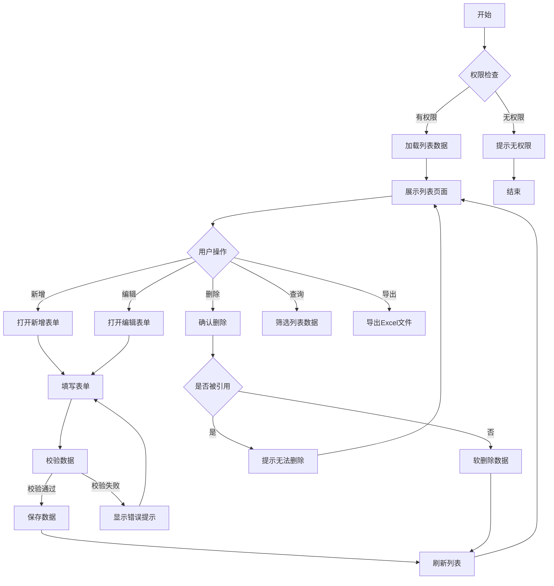
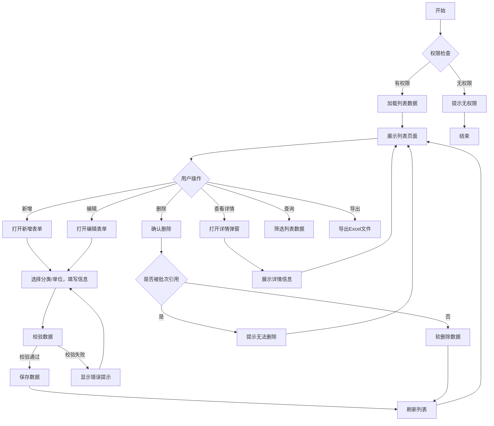
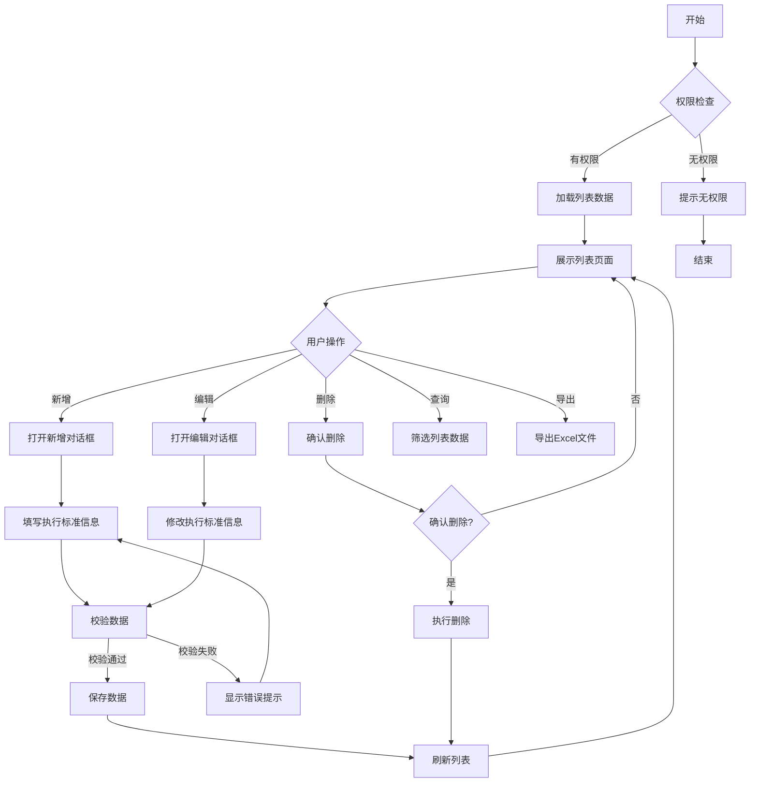
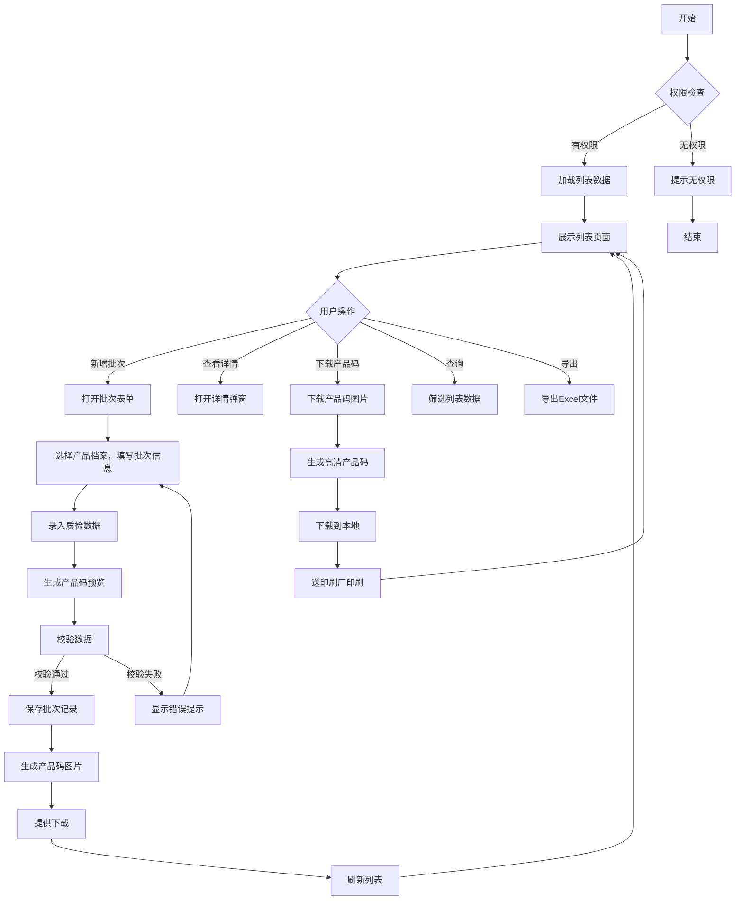

# 古麒绒材溯源管理系统 - PRD需求文档

---

## 文档信息

| 项目 | 内容 |
|------|------|
| 文档名称 | 古麒绒材溯源管理系统PRD |
| 版本号 | v1.0.0 |
| 编写日期 | 2026-04-07 |
| 编写人 | 产品经理 |
| 所属项目 | 古麒绒材数字化升级项目 |
| 最后更新 | 2026-04-07 |

---

## 修订记录

| 版本 | 日期 | 修订人 | 修订内容 |
|------|------|--------|----------|
| v1.0.0 | 2026-04-07 | 产品经理 | 初稿，完成基础功能需求定义 |

---

## 一、需求背景与目标

### 1.1 企业背景

**安徽古麒绒材股份有限公司**（股票代码：001390）是国内羽绒羽毛行业龙头企业，专注于高规格羽绒产品的研发、生产和销售。

**核心产品**：
- 白鹅绒、灰鹅绒、白鸭绒、灰鸭绒四大品类
- 绒子含量：90%、95%等高规格产品
- 蓬松度：可达850-900 in³/30g

### 1.2 业务需求描述

**为什么要做这个需求？**
- 国家出台产品质量追溯相关法规，要求建立追溯体系
- 消费者对羽绒产品质量存疑，需要透明化信息查询渠道
- 市场上存在假冒伪劣产品，损害品牌声誉
- 缺乏数字化手段展示产品品质，影响品牌溢价能力

### 1.3 用户痛点

**用户痛点**：
- 消费者无法验证产品真伪，对产品质量存疑
- 企业无法有效展示产品质检信息，品质优势无法传递

**解决价值**：
- 建立消费者信任，提升品牌忠诚度
- 实现产品信息透明化，展示品质优势
- 快速响应质量问题，降低品牌风险

### 1.4 业务目标

| 目标类型 | 具体目标 | 衡量指标 |
|---------|---------|---------|
| 核心业务目标 | 建立完整的产品溯源体系 | 覆盖100%产品批次 |
| 用户价值目标 | 消费者可便捷查询产品信息 | 扫码查询响应时间≤2秒 |
| 品牌提升目标 | 提升品牌数字化形象 | 消费者满意度≥90% |
| 合规目标 | 满足国家质量追溯要求 | 通过相关部门验收 |

---

## 二、用户与场景

### 2.1 目标用户画像

#### 2.1.1 系统管理员

| 属性 | 描述 |
|------|------|
| **角色定义** | 负责系统配置和基础数据维护的技术或运营人员 |
| **工作职责** | 维护计量单位、产品档案等基础数据；配置系统参数和权限 |
| **用户特征** | 年龄25-40岁，大专及以上学历，有ERP或MES系统使用经验 |
| **使用场景** | 在办公电脑上进行系统配置和数据维护 |
| **使用频率** | 每日/每周 |
| **核心诉求** | 操作便捷、数据准确、系统稳定 |

#### 2.1.2 生产操作员

| 属性 | 描述 |
|------|------|
| **角色定义** | 负责产品码生成和数据录入的生产一线员工 |
| **工作职责** | 根据生产任务生成产品码（产品标签/吊牌）并下载；录入批次生产和质检信息；将产品码图片送印刷厂印刷 |
| **用户特征** | 年龄20-45岁，高中及以上学历，对电脑操作有一定基础 |
| **使用场景** | 在生产车间或仓库，使用工控电脑或平板操作 |
| **使用频率** | 每日多次 |
| **核心诉求** | 操作简单高效、出错率低、产品码清晰可印刷 |

#### 2.1.3 终端消费者

| 属性 | 描述 |
|------|------|
| **角色定义** | 购买古麒绒材产品后扫码查询的消费者 |
| **用户特征** | 年龄18-60岁，各学历层次，使用手机微信扫码 |
| **使用场景** | 购买产品后，使用微信扫描产品上的溯源码 |
| **使用频率** | 偶尔（购买产品时） |
| **核心诉求** | 快速获取产品信息、验证真伪、了解品质 |

### 2.2 应用场景

#### 2.2.1 场景一：产品码生成

| 属性 | 描述 |
|------|------|
| **触发情境** | 生产车间完成一批羽绒产品的生产和质检后，需要为该产品批次生成溯源码 |
| **用户行为** | 生产操作员登录系统，选择产品档案，填写批次信息，录入质检数据，生成产品码并下载 |
| **期望目的** | 为该批次产品生成唯一的溯源标识，便于后续追溯和查询 |
| **前置条件** | 产品档案已维护；操作员有创建批次权限 |
| **后置结果** | 成功生成产品码（产品标签/吊牌）并提供下载，批次信息保存到系统，产品码图片可送印刷厂印刷，消费者可通过扫描产品码上的二维码查询 |

**操作流程**：
1. 操作员点击"新增批次"按钮，打开批次表单
2. 填写批次号、选择产品档案（系统自动带出规格）
3. 选择执行标准（支持选择多个）、通过选择的执行标准后选择产品标准类别
4. 选择生产年度
5. 录入质检数据：绒子含量、蓬松度、浊度、气味
6. 上传产品视频（支持多视频上传）
7. 上传认证信息（图片形式）
8. 上传企业信息：可能会有多个链接、支持上传图片(微信公众号)
9. 点击"生成产品码"预览产品码
10. 确认信息无误后点击"保存并生成产品码"
11. 系统生成高清产品码图片
12. 保存记录，提供下载链接，返回列表
13. 操作员下载产品码图片，送印刷厂进行批量印刷

#### 2.2.2 场景二：扫码溯源查询

| 属性 | 描述 |
|------|------|
| **触发情境** | 消费者购买古麒绒材产品后，想了解产品信息并验证真伪 |
| **用户行为** | 使用微信扫描产品包装上的二维码，进入H5溯源页面查看产品信息 |
| **期望目的** | 快速获取产品真实信息，验证产品真伪，了解产品品质指标 |
| **前置条件** | 产品已生成溯源码并录入系统；消费者手机有微信和网络连接 |
| **后置结果** | 消费者获取产品信息，信任度提升 |

**操作流程**：
1. 消费者使用微信扫描产品上的二维码
2. 系统自动解析二维码中的批次号
3. 后台查询批次数据并验证有效性
4. 页面加载完成后首先显示正品验证结果
5. 向下滚动查看产品基本信息（名称、规格、生产日期等）
6. 查看质检指标（绒子含量、蓬松度等，以卡片形式展示）
7. 其它维护的信息

### 2.3 业务价值

| 价值点 | 具体说明 | 可衡量指标 |
|--------|----------|------------|
| 提升消费者信任 | 提供透明的产品信息查询渠道，增强消费者信心 | 消费者满意度≥90% |
| 品牌防伪打假 | 通过唯一溯源码防止假冒伪劣产品 | 假冒投诉减少50% |
| 质量追溯效率 | 出现质量问题时可快速定位批次和流向 | 追溯时间从2小时缩短到5分钟 |
| 数字化形象提升 | 通过数字化手段展示产品品质，支撑高端定位 | 品牌数字化评分提升30% |

---

## 三、详细功能描述

### 3.1 计量单位管理

#### 3.1.1 功能描述

- **功能名称**：计量单位管理
- **功能目标**：统一系统的计量单位信息，作为采购、销售、生产、库存四个业务模块的数量计量单位数据库
- **功能价值**：确保全系统计量单位一致，避免单位混乱导致的业务错误

#### 3.1.2 页面图片

（请在开发完成后补充截图）

#### 3.1.3 业务流程



#### 3.1.4 角色权限设计

##### 3.1.4.1 角色权限矩阵

| 权限项 | 系统管理员 | 生产操作员 | 企业管理层 |
|--------|------------|------------|------------|
| 查看列表 | ✅ | ✅ | ✅ |
| 新增记录 | ✅ | ❌ | ❌ |
| 编辑记录 | ✅ | ❌ | ❌ |
| 删除记录 | ✅ | ❌ | ❌ |
| 批量删除 | ✅ | ❌ | ❌ |
| 批量导出 | ✅ | ✅ | ✅ |
| 下载模版 | ✅ | ✅ | ✅ |
| 批量导入 | ✅ | ❌ | ❌ |

##### 3.1.4.2 数据权限规则

| 角色 | 数据范围 | 说明 |
|------|----------|------|
| 系统管理员 | 全部数据 | 可查看和操作所有计量单位 |
| 生产操作员 | 全部数据 | 仅可查看，用于选择 |
| 企业管理层 | 全部数据 | 仅可查看和导出 |

#### 3.1.5 列表数据规范

##### 3.1.5.1 数据获取方式

| 属性 | 描述 |
|------|------|
| **数据来源** | MES_jiliangdanwei（计量单位表单） |
| **获取方式** | 实时查询 |
| **分页方式** | 后端分页，每页默认20条 |
| **加载策略** | 首次加载全部，支持前端筛选 |

##### 3.1.5.2 列表排序规则

| 优先级 | 排序字段 | 排序方式 | 说明 |
|--------|----------|----------|------|
| 1 | createTime | 降序(DESC) | 默认按创建时间倒序 |
| 2 | unitName | 升序(ASC) | 单位名称拼音排序 |

**列表字段定义**：

| 序号 | 字段名称 | 字段标识 | 数据类型 | 是否必填 | 规则 |
|------|----------|----------|----------|----------|------|
| 1 | 序号 | index | Number | - | 自动编号 |
| 2 | 单位名称 | unitName | String | 是 | 如：千克、克 |
| 3 | 单位编号 | unitCode | String | 是 | 如：kg、g，全局唯一 |
| 4 | 状态 | status | Enum | 是 | 启用/禁用 |
| 5 | 创建人 | createBy | String | 是 | - |
| 6 | 创建时间 | createTime | DateTime | 是 | 系统自动记录 |
| 7 | 操作 | - | - | - | 编辑/删除 |

**筛选条件**：

| 序号 | 筛选字段 | 控件类型 | 查询方式 |
|------|----------|----------|----------|
| 1 | 单位名称 | 输入框 | 模糊匹配 |
| 2 | 单位编号 | 输入框 | 模糊匹配 |
| 3 | 状态 | 下拉选择 | 精确匹配 |

**筛选条件布局**：一行显示4个筛选项，支持展开/收起

#### 3.1.6 业务模块协同

##### 3.1.6.1 上游模块依赖

无上游模块依赖。计量单位管理是基础数据模块，不依赖其他业务模块。

##### 3.1.6.2 下游模块影响

| 下游模块 | 影响类型 | 影响说明 | 数据流向 |
|---------|---------|---------|---------|
| 产品档案管理 | 数据引用 | 产品档案引用计量单位 | 本模块 → 产品档案管理 |

##### 3.1.6.3 模块协同流程图

```text
[计量单位管理] ──数据引用──> [产品档案管理]
```

##### 3.1.6.4 数据一致性规则

| 规则编号 | 规则描述 | 触发条件 | 处理方式 |
|---------|---------|---------|---------|
| DC1 | 单位被引用时禁止删除 | 删除操作前检查 | 提示"已被产品引用，无法删除" |
| DC2 | 禁用单位不可选 | 产品档案选择单位时 | 筛选条件增加status=启用 |

#### 3.1.7 功能点详述

##### 3.1.7.1 功能点一：新增单位

###### 3.1.7.1.1 功能描述

用于新增计量单位信息，统一系统的计量单位数据标准。

###### 3.1.7.1.2 功能入口

| 属性 | 描述 |
|------|------|
| **入口位置** | 列表页工具栏 |
| **入口形式** | 按钮 |
| **入口文案** | + 新增 |
| **显示条件** | 用户有新增权限时显示 |

###### 3.1.7.1.3 业务规则

| 规则编号 | 规则名称 | 规则描述 | 优先级 |
|---------|---------|---------|--------|
| BR1 | 编码唯一性 | 单位编号全局唯一，重复时提示"单位编号已存在" | 必须 |
| BR2 | 名称唯一性 | 单位名称全局唯一，重复时提示"单位名称已存在" | 必须 |
| BR3 | 编码格式 | 单位编号长度1-10字符，支持字母、数字 | 必须 |
| BR4 | 名称格式 | 单位名称长度2-20字符 | 必须 |
| BR5 | 默认状态 | 新增时状态默认为"启用" | 建议 |

##### 3.1.7.2 功能点二：编辑单位
###### 3.1.7.2.1 功能描述

用于修改已有的计量单位信息。

###### 3.1.7.2.2 功能入口

| 属性 | 描述 |
|------|------|
| **入口位置** | 列表页操作列 |
| **入口形式** | 图标按钮 |
| **入口文案** | 编辑 |
| **显示条件** | 用户有编辑权限时显示 |

###### 3.1.7.2.3 业务规则

| 规则编号 | 规则名称 | 规则描述 | 优先级 |
|---------|---------|---------|--------|
| BR1 | 编码唯一性 | 修改时单位编号不可变更 | 必须 |
| BR2 | 名称唯一性 | 单位名称全局唯一，重复时提示 | 必须 |
| BR3 | 数据存在性 | 编辑前校验数据是否存在 | 必须 |

##### 3.1.7.3 功能点三：删除单位
###### 3.1.7.3.1 功能描述

用于删除不再使用的计量单位，删除前会检查是否被引用。

###### 3.1.7.3.2 功能入口

| 属性 | 描述 |
|------|------|
| **入口位置** | 列表页操作列 |
| **入口形式** | 图标按钮 |
| **入口文案** | 删除 |
| **显示条件** | 用户有删除权限时显示 |

###### 3.1.7.3.3 业务规则

| 规则编号 | 规则名称 | 规则描述 | 优先级 |
|---------|---------|---------|--------|
| BR1 | 引用检查 | 被产品引用的单位不可删除 | 必须 |
| BR2 | 软删除 | 删除时标记delFlag=1，不物理删除 | 必须 |
| BR3 | 二次确认 | 删除前弹出确认对话框 | 建议 |

##### 3.1.7.4 功能点四：查询单位

###### 3.1.7.4.1 功能描述

用于按条件筛选和查找计量单位。

###### 3.1.7.4.2 功能入口

| 属性 | 描述 |
|------|------|
| **入口位置** | 列表页搜索区域 |
| **入口形式** | 输入框+按钮组合 |
| **入口文案** | 搜索、重置 |
| **显示条件** | 始终显示 |

###### 3.1.7.4.3 业务规则

| 规则编号 | 规则名称 | 规则描述 | 优先级 |
|---------|---------|---------|--------|
| BR1 | 模糊匹配 | 单位名称、编号支持模糊查询 | 必须 |
| BR2 | 精确匹配 | 状态下拉选择精确匹配 | 必须 |
| BR3 | 组合查询 | 多个条件组合AND查询 | 必须 |

##### 3.1.7.5 功能点五：批量导出

###### 3.1.7.5.1 功能描述

用于将计量单位数据导出为Excel文件。

###### 3.1.7.5.2 功能入口

| 属性 | 描述 |
|------|------|
| **入口位置** | 列表页工具栏 |
| **入口形式** | 按钮 |
| **入口文案** | 批量导出 |
| **显示条件** | 用户有导出权限时显示 |

###### 3.1.7.5.3 业务规则

| 规则编号 | 规则名称 | 规则描述 | 优先级 |
|---------|---------|---------|--------|
| BR1 | 导出范围 | 导出当前筛选条件下的全部数据 | 必须 |
| BR2 | 文件格式 | 导出为.xlsx格式 | 必须 |
| BR3 | 文件名规范 | 文件名格式：计量单位_YYYYMMDD.xlsx | 建议 |

##### 3.1.7.6 功能点六：批量删除

###### 3.1.7.6.1 功能描述

用于批量删除选中的计量单位数据，支持表格多选后批量操作。

###### 3.1.7.6.2 功能入口

| 属性 | 描述 |
|------|------|
| **入口位置** | 列表页工具栏 |
| **入口形式** | 按钮 |
| **入口文案** | 批量删除 |
| **显示条件** | 用户有删除权限且勾选了表格数据时显示 |

###### 3.1.7.6.3 业务规则

| 规则编号 | 规则名称 | 规则描述 | 优先级 |
|---------|---------|---------|--------|
| BR1 | 引用检查 | 被产品引用的单位不可删除 | 必须 |
| BR2 | 软删除 | 删除时标记delFlag=1，不物理删除 | 必须 |
| BR3 | 二次确认 | 删除前弹出确认对话框，显示选中数量 | 必须 |
| BR4 | 部分失败提示 | 部分删除失败时提示具体失败项 | 建议 |

##### 3.1.7.7 功能点七：下载模版

###### 3.1.7.7.1 功能描述

用于下载批量导入用的Excel模版文件，包含标准的数据格式和示例。

###### 3.1.7.7.2 功能入口

| 属性 | 描述 |
|------|------|
| **入口位置** | 列表页工具栏 |
| **入口形式** | 按钮 |
| **入口文案** | 下载模版 |
| **显示条件** | 始终显示 |

###### 3.1.7.7.3 业务规则

| 规则编号 | 规则名称 | 规则描述 | 优先级 |
|---------|---------|---------|--------|
| BR1 | 模版格式 | 提供.xlsx格式模版文件 | 必须 |
| BR2 | 字段规范 | 模版包含所有必填字段和数据格式说明 | 必须 |
| BR3 | 示例数据 | 模版包含1-2行示例数据供参考 | 建议 |
| BR4 | 文件名规范 | 文件名格式：计量单位导入模版.xlsx | 建议 |

##### 3.1.7.8 功能点八：批量导入

###### 3.1.7.8.1 功能描述

用于通过Excel文件批量导入计量单位数据，提高数据录入效率。

###### 3.1.7.8.2 功能入口

| 属性 | 描述 |
|------|------|
| **入口位置** | 列表页工具栏 |
| **入口形式** | 按钮 |
| **入口文案** | 批量导入 |
| **显示条件** | 用户有新增权限时显示 |

###### 3.1.7.8.3 业务规则

| 规则编号 | 规则名称 | 规则描述 | 优先级 |
|---------|---------|---------|--------|
| BR1 | 文件格式 | 仅支持.xlsx格式文件 | 必须 |
| BR2 | 文件大小 | 单个文件大小不超过5MB | 必须 |
| BR3 | 数据校验 | 导入前校验数据格式和唯一性 | 必须 |
| BR4 | 错误提示 | 校验失败时返回具体错误行和错误原因 | 必须 |
| BR5 | 重复处理 | 编号重复时跳过并记录，不中断导入 | 建议 |
| BR6 | 最大行数 | 单次导入最多支持1000条数据 | 建议 |

#### 3.1.8 数据模型设计

##### 3.1.8.1 主实体：计量单位

**表单标识**：MES_jiliangdanwei

| 序号 | 字段名称 | 字段标识 | 控件类型 | 是否必填 | 验证规则 |
|------|----------|----------|----------|----------|----------|
| 1 | 单位编号 | unitCode | 输入框 | 是 | 唯一，长度1-10字符 |
| 2 | 单位名称 | unitName | 输入框 | 是 | 唯一，长度2-20字符 |
| 3 | 状态 | status | 开关 | 是 | 默认启用 |

**业务规则**：
1. 单位编号全局唯一，不可重复
2. 已被产品引用的单位不可删除
3. 禁用状态的单位在新增产品时不可选

#### 3.1.9 UI界面设计

##### 3.1.9.1 页面布局结构

```text
页面根节点
├── KaiwuFlexDialog（新增/编辑对话框）
│   └── KaiwuFlexForm（表单）
├── KaiwuFlexDialog（确认对话框）
└── KaiwuFlexLayout（主布局）
    ├── 搜索区域
    │   └── KaiwuFlexForm（筛选表单）
    ├── 工具栏
    │   └── 左侧按钮组（新增、批量删除、下载模版、批量导入、批量导出）
    └── KaiwuFlexTable2（数据列表）
        └── 操作列按钮（编辑/删除）
```

##### 3.1.9.2 列表页面线框图

```text
┌─────────────────────────────────────────────────────────────────────────┐
│  搜索区域                                                                │
│  ┌──────────┐ ┌──────────┐ ┌────────────────┐  [搜索] [重置] [展开↓]   │
│  │ 单位编号  │ │ 单位名称  │ │ 状态 ▼         │                         │
│  └──────────┘ └──────────┘ └────────────────┘                          │
├─────────────────────────────────────────────────────────────────────────┤
│  工具栏                                                                  │
│  [+ 新增] [批量删除] [下载模版] [批量导入] [批量导出]                         │
├─────────────────────────────────────────────────────────────────────────┤
│  数据列表                                                                │
│  ┌──┬──────────┬──────────┬────────┬──────────┬──────────┬──────────┐  │
│  │☐ │ [单位编号]  │ [单位名称]  │ [状态]  │ [创建人]   │ [创建时间] │ 操作     │  │
│  ├──┼──────────┼──────────┼────────┼──────────┼──────────┼──────────┤  │
│  │☐ │ kg       │ 千克     │ 启用   │ 管理员    │ 2024-01-15│编辑 删除│  │
│  │☐ │ g        │ 克       │ 启用   │ 管理员    │ 2024-01-15│编辑 删除│  │
│  └──┴──────────┴──────────┴────────┴──────────┴──────────┴──────────┘  │
│  共 10 条                    分页: [<] 1 2 ... [>]    每页: [20条 ▼]     │
└─────────────────────────────────────────────────────────────────────────┘
```

##### 3.1.9.3 新增/编辑表单对话框

```text
┌────────────────────────────────────────────────────┐
│ 新增计量单位                                    [X] │
├────────────────────────────────────────────────────┤
│                                                    │
│ 基本信息                                           │
│ ┌────────────────────────────────────────────────┐│
│ │ 单位编号: [                  ] *              ││
│ │ 单位名称: [                  ] *              ││
│ │ 状    态: [● 启用]                            ││
│ └────────────────────────────────────────────────┘│
│                                                    │
├────────────────────────────────────────────────────┤
│                         [取消]  [保存]             │
└────────────────────────────────────────────────────┘
```

#### 3.1.10 边界与异常处理

##### 3.1.10.1 网络异常

| 场景 | 检测方式 | 处理方式 | 用户提示 |
|------|---------|---------|---------|
| 请求超时 | 超时时间30s | 自动重试1次 | "网络超时，请稍后重试" |
| 断网 | navigator.onLine | 禁用提交按钮 | "网络已断开，请检查网络连接" |
| 服务器错误 | HTTP状态码5xx | 显示错误页面 | "服务器繁忙，请稍后重试" |

##### 3.1.10.2 数据异常

| 场景 | 检测方式 | 处理方式 | 用户提示 |
|------|---------|---------|---------|
| 列表数据为空 | records.length === 0 | 显示空状态组件 | "暂无数据" |
| 搜索无结果 | 有筛选条件但结果为空 | 显示空状态+重置按钮 | "未找到匹配数据" |
| 详情数据不存在 | 接口返回404 | 返回列表页 | "数据不存在或已被删除" |

##### 3.1.10.3 权限异常

| 场景 | 检测方式 | 处理方式 | 用户提示 |
|------|---------|---------|---------|
| 无页面权限 | 路由守卫校验 | 跳转到403页面 | "您没有权限访问此页面" |
| 无操作权限 | 按钮权限校验 | 隐藏或禁用按钮 | 按钮禁用态 |
| Token过期 | 401响应 | 跳转登录页 | "登录已过期，请重新登录" |

##### 3.1.10.4 操作冲突

| 场景 | 检测方式 | 处理方式 | 用户提示 |
|------|---------|---------|---------|
| 并发编辑 | 乐观锁版本号 | 提示刷新后重试 | "数据已被他人修改" |
| 重复提交 | 按钮loading+防抖 | 禁用按钮直到请求完成 | 按钮显示loading状态 |
| 删除已使用数据 | 业务校验 | 阻止删除 | "该数据已被使用，无法删除" |

##### 3.1.10.5 输入异常

| 场景 | 检测方式 | 处理方式 | 用户提示 |
|------|---------|---------|---------|
| 必填字段为空 | 表单验证 | 阻止提交，高亮字段 | "请输入XXX" |
| 格式不正确 | 正则校验 | 实时提示 | "格式不正确" |
| 编码重复 | 失去焦点校验 | 实时提示 | "该编码已存在" |


---


### 3.2 产品档案管理

#### 3.2.1 功能描述

- **功能名称**：产品档案管理
- **功能目标**：维护产品基础信息，作为产品码生成的数据来源
- **功能价值**：统一产品数据标准，确保溯源信息准确

#### 3.2.2 页面图片

（请在开发完成后补充截图）

#### 3.2.3 业务流程



#### 3.2.4 角色权限设计

##### 3.2.4.1 角色权限矩阵

| 权限项 | 系统管理员 | 生产操作员 | 企业管理层 |
|--------|------------|------------|------------|
| 查看列表 | ✅ | ✅ | ✅ |
| 查看详情 | ✅ | ✅ | ✅ |
| 新增记录 | ✅ | ❌ | ❌ |
| 编辑记录 | ✅ | ❌ | ❌ |
| 删除记录 | ✅ | ❌ | ❌ |
| 批量删除 | ✅ | ❌ | ❌ |
| 批量导出 | ✅ | ✅ | ✅ |
| 下载模版 | ✅ | ✅ | ✅ |
| 批量导入 | ✅ | ❌ | ❌ |

##### 3.2.4.2 数据权限规则

| 角色 | 数据范围 | 说明 |
|------|----------|------|
| 系统管理员 | 全部数据 | 可查看和操作所有产品档案 |
| 生产操作员 | 全部数据 | 仅可查看，用于产品码生成时选择 |
| 企业管理层 | 全部数据 | 仅可查看和导出 |

#### 3.2.5 列表数据规范

##### 3.2.5.1 数据获取方式

| 属性 | 描述 |
|------|------|
| **数据来源** | MES_wuliaodangan（产品档案表单） |
| **获取方式** | 实时查询 |
| **分页方式** | 后端分页，每页默认20条 |
| **加载策略** | 首次加载全部，支持前端筛选 |

##### 3.2.5.2 列表排序规则

| 优先级 | 排序字段 | 排序方式 | 说明 |
|--------|----------|----------|------|
| 1 | createTime | 降序(DESC) | 默认按创建时间倒序 |
| 2 | materialCode | 升序(ASC) | 产品编号排序 |

##### 3.2.5.3 列表字段定义

| 序号 | 字段名称 | 字段标识 | 数据类型 | 是否必填 | 规则 |
|------|----------|----------|----------|----------|------|
| 1 | 序号 | index | Number | - | 自动编号 |
| 2 | 产品编号 | materialCode | String | 是 | 全局唯一，长度4-20 |
| 3 | 产品名称 | materialName | String | 是 | - |
| 4 | 规格 | specification | String | 否 | - |
| 5 | 计量单位 | unitName | String | 是 | 关联计量单位 |
| 6 | 状态 | status | Enum | 是 | 启用/禁用 |
| 7 | 创建人 | createBy | String | 是 | - |
| 8 | 创建时间 | createTime | DateTime | 是 | 系统自动记录 |
| 9 | 操作 | - | - | - | 查看/编辑/删除 |

##### 3.2.5.4 筛选条件

| 序号 | 筛选字段 | 控件类型 | 查询方式 |
|------|----------|----------|----------|
| 1 | 产品编号 | 输入框 | 模糊匹配 |
| 2 | 产品名称 | 输入框 | 模糊匹配 |
| 3 | 状态 | 下拉选择 | 精确匹配 |

**筛选条件布局**：一行显示4个筛选项，支持展开/收起

#### 3.2.6 业务模块协同

##### 3.2.6.1 上游模块依赖

| 上游模块 | 依赖类型 | 依赖说明 | 数据流向 |
|---------|---------|---------|---------|
| 计量单位管理 | 数据引用 | 依赖计量单位数据进行单位选择 | 计量单位管理 → 本模块 |

##### 3.2.6.2 下游模块影响

| 下游模块 | 影响类型 | 影响说明 | 数据流向 |
|---------|---------|---------|---------|
| 产品码生成 | 数据引用 | 产品档案数据用于创建产品批次 | 本模块 → 产品码生成 |

##### 3.2.6.3 模块协同流程图

```text
[产品档案管理] ──数据引用──> [产品码生成]
                                  ↑
[计量单位管理] ──数据引用───────┘
```

##### 3.2.6.4 数据一致性规则

| 规则编号 | 规则描述 | 触发条件 | 处理方式 |
|---------|---------|---------|---------|
| DC1 | 档案被批次引用时禁止删除 | 删除操作前检查 | 提示"已被批次引用，无法删除" |
| DC2 | 禁用档案不可选 | 产品码生成选择档案时 | 筛选条件增加status=启用 |
| DC3 | 分类/单位变更时同步更新名称 | 编辑时更改分类/单位 | 联动更新冗余字段categoryName/unitName |

#### 3.2.7 功能点详述

##### 3.2.7.1 功能点一：新增档案

###### 3.2.7.1.1 功能描述

用于新增产品档案信息，维护产品基础数据。

###### 3.2.7.1.2 功能入口

| 属性 | 描述 |
|------|------|
| **入口位置** | 列表页工具栏 |
| **入口形式** | 按钮 |
| **入口文案** | + 新增 |
| **显示条件** | 用户有新增权限时显示 |

###### 3.2.7.1.3 业务规则

| 规则编号 | 规则名称 | 规则描述 | 优先级 |
|---------|---------|---------|--------|
| BR1 | 编码唯一性 | 产品编号全局唯一，重复时提示"产品编号已存在" | 必须 |
| BR2 | 名称唯一性 | 产品名称全局唯一，重复时提示"产品名称已存在" | 必须 |
| BR3 | 编码格式 | 产品编号长度4-20字符，支持字母、数字 | 必须 |
| BR4 | 名称格式 | 产品名称长度2-50字符 | 必须 |
| BR6 | 单位必填 | 必须选择计量单位 | 必须 |
| BR7 | 默认状态 | 新增时状态默认为"启用" | 建议 |

##### 3.2.7.2 功能点二：编辑档案
###### 3.2.7.2.1 功能描述

用于修改已有的产品档案信息。

###### 3.2.7.2.2 功能入口

| 属性 | 描述 |
|------|------|
| **入口位置** | 列表页操作列 |
| **入口形式** | 图标按钮 |
| **入口文案** | 编辑 |
| **显示条件** | 用户有编辑权限时显示 |

###### 3.2.7.2.3 业务规则

| 规则编号 | 规则名称 | 规则描述 | 优先级 |
|---------|---------|---------|--------|
| BR1 | 编码不可改 | 产品编号不可修改 | 必须 |
| BR2 | 名称唯一性 | 产品名称全局唯一，重复时提示 | 必须 |
| BR3 | 数据存在性 | 编辑前校验数据是否存在 | 必须 |

##### 3.2.7.3 功能点三：删除档案
###### 3.2.7.3.1 功能描述

用于删除不再使用的产品档案，删除前会检查是否被批次引用。

###### 3.2.7.3.2 功能入口

| 属性 | 描述 |
|------|------|
| **入口位置** | 列表页操作列 |
| **入口形式** | 图标按钮 |
| **入口文案** | 删除 |
| **显示条件** | 用户有删除权限时显示 |

###### 3.2.7.3.3 业务规则

| 规则编号 | 规则名称 | 规则描述 | 优先级 |
|---------|---------|---------|--------|
| BR1 | 引用检查 | 被批次引用的档案不可删除 | 必须 |
| BR2 | 软删除 | 删除时标记delFlag=1，不物理删除 | 必须 |
| BR3 | 二次确认 | 删除前弹出确认对话框 | 建议 |

##### 3.2.7.4 功能点四：查看详情

###### 3.2.7.4.1 功能描述

用于查看产品档案的完整详细信息。

###### 3.2.7.4.2 功能入口

| 属性 | 描述 |
|------|------|
| **入口位置** | 列表页产品名称或操作列 |
| **入口形式** | 链接/图标按钮 |
| **入口文案** | 产品名称/查看 |
| **显示条件** | 始终显示 |

###### 3.2.7.4.3 业务规则

| 规则编号 | 规则名称 | 规则描述 | 优先级 |
|---------|---------|---------|--------|
| BR1 | 数据存在性 | 查看前校验数据是否存在 | 必须 |
| BR2 | 权限检查 | 无查看权限时隐藏入口 | 必须 |

###### 3.2.7.4.5 详情展示字段

| 序号 | 字段名称 | 字段标识 | 说明 |
|------|---------|---------|------|
| 1 | 产品编号 | materialCode | 只读展示 |
| 2 | 产品名称 | materialName | 只读展示 |
| 3 | 规格型号 | specification | 只读展示 |
| 4 | 计量单位 | unitName | 只读展示 |
| 5 | 备注说明 | remark | 只读展示 |
| 6 | 状态 | status | 只读展示 |
| 7 | 创建人 | createBy | 只读展示 |
| 8 | 创建时间 | createTime | 只读展示 |
| 9 | 更新人 | updateBy | 只读展示 |
| 10 | 更新时间 | updateTime | 只读展示 |

##### 3.2.7.5 功能点五：查询档案

###### 3.2.7.5.1 功能描述

用于按条件筛选和查找产品档案。

###### 3.2.7.5.2 功能入口

| 属性 | 描述 |
|------|------|
| **入口位置** | 列表页搜索区域 |
| **入口形式** | 输入框+按钮组合 |
| **入口文案** | 搜索、重置 |
| **显示条件** | 始终显示 |

###### 3.2.7.5.3 业务规则

| 规则编号 | 规则名称 | 规则描述 | 优先级 |
|---------|---------|---------|--------|
| BR1 | 模糊匹配 | 产品名称、编号支持模糊查询 | 必须 |
| BR3 | 组合查询 | 多个条件组合AND查询 | 必须 |

##### 3.2.7.6 功能点六：批量导出

###### 3.2.7.6.1 功能描述

用于将产品档案数据导出为Excel文件。

###### 3.2.7.6.2 功能入口

| 属性 | 描述 |
|------|------|
| **入口位置** | 列表页工具栏 |
| **入口形式** | 按钮 |
| **入口文案** | 批量导出 |
| **显示条件** | 用户有导出权限时显示 |

###### 3.2.7.6.3 业务规则

| 规则编号 | 规则名称 | 规则描述 | 优先级 |
|---------|---------|---------|--------|
| BR1 | 导出范围 | 导出当前筛选条件下的全部数据 | 必须 |
| BR2 | 文件格式 | 导出为.xlsx格式 | 必须 |
| BR3 | 文件名规范 | 文件名格式：产品档案_YYYYMMDD.xlsx | 建议 |

##### 3.2.7.7 功能点七：批量删除

###### 3.2.7.7.1 功能描述

用于批量删除选中的产品档案数据，支持表格多选后批量操作。

###### 3.2.7.7.2 功能入口

| 属性 | 描述 |
|------|------|
| **入口位置** | 列表页工具栏 |
| **入口形式** | 按钮 |
| **入口文案** | 批量删除 |
| **显示条件** | 用户有删除权限且勾选了表格数据时显示 |

###### 3.2.7.7.3 业务规则

| 规则编号 | 规则名称 | 规则描述 | 优先级 |
|---------|---------|---------|--------|
| BR1 | 引用检查 | 已被溯源码引用的产品不可删除 | 必须 |
| BR2 | 软删除 | 删除时标记delFlag=1，不物理删除 | 必须 |
| BR3 | 二次确认 | 删除前弹出确认对话框，显示选中数量 | 必须 |
| BR4 | 部分失败提示 | 部分删除失败时提示具体失败项 | 建议 |

##### 3.2.7.8 功能点八：下载模版

###### 3.2.7.8.1 功能描述

用于下载批量导入用的Excel模版文件，包含标准的数据格式和示例。

###### 3.2.7.8.2 功能入口

| 属性 | 描述 |
|------|------|
| **入口位置** | 列表页工具栏 |
| **入口形式** | 按钮 |
| **入口文案** | 下载模版 |
| **显示条件** | 始终显示 |

###### 3.2.7.8.3 业务规则

| 规则编号 | 规则名称 | 规则描述 | 优先级 |
|---------|---------|---------|--------|
| BR1 | 模版格式 | 提供.xlsx格式模版文件 | 必须 |
| BR2 | 字段规范 | 模版包含所有必填字段和数据格式说明 | 必须 |
| BR3 | 示例数据 | 模版包含1-2行示例数据供参考 | 建议 |
| BR4 | 文件名规范 | 文件名格式：产品档案导入模版.xlsx | 建议 |

##### 3.2.7.9 功能点九：批量导入

###### 3.2.7.9.1 功能描述

用于通过Excel文件批量导入产品档案数据，提高数据录入效率。

###### 3.2.7.9.2 功能入口

| 属性 | 描述 |
|------|------|
| **入口位置** | 列表页工具栏 |
| **入口形式** | 按钮 |
| **入口文案** | 批量导入 |
| **显示条件** | 用户有新增权限时显示 |

###### 3.2.7.9.3 业务规则

| 规则编号 | 规则名称 | 规则描述 | 优先级 |
|---------|---------|---------|--------|
| BR1 | 文件格式 | 仅支持.xlsx格式文件 | 必须 |
| BR2 | 文件大小 | 单个文件大小不超过5MB | 必须 |
| BR3 | 数据校验 | 导入前校验数据格式、唯一性和关联数据有效性 | 必须 |
| BR4 | 错误提示 | 校验失败时返回具体错误行和错误原因 | 必须 |
| BR5 | 重复处理 | 编号重复时跳过并记录，不中断导入 | 建议 |
| BR6 | 最大行数 | 单次导入最多支持1000条数据 | 建议 |
| BR7 | 关联校验 | 校验分类、单位等关联数据是否存在 | 必须 |

#### 3.2.8 数据模型设计

##### 3.2.8.1 主实体：产品档案

**表单标识**：MES_wuliaodangan

| 序号 | 字段名称 | 字段标识 | 控件类型 | 数据类型 | 长度 | 是否必填 | 默认值 | 验证规则 | 备注 |
|------|---------|---------|---------|---------|------|---------|--------|---------|------|
| 1 | 唯一标识 | _id | - | String | 32 | 系统 | UUID | - | 主键 |
| 2 | 产品编号 | materialCode | 输入框 | String | 20 | 是 | - | 唯一 | 业务主键 |
| 3 | 产品名称 | materialName | 输入框 | String | 50 | 是 | - | 唯一 | - |
| 4 | 规格 | specification | 输入框 | String | 100 | 否 | - | - | - |
| 5 | 计量单位ID | unitId | 下拉选择 | String | 32 | 是 | - | 外键 | 关联计量单位 |
| 6 | 计量单位名 | unitName | - | String | 20 | 是 | - | 冗余字段 | - |
| 7 | 备注说明 | remark | 文本域 | String | 500 | 否 | - | - | - |
| 8 | 状态 | status | 开关 | String | 10 | 是 | 启用 | - | 启用/禁用 |
| 9 | 删除标记 | delFlag | - | Number | - | 是 | 0 | 0=正常,1=删除 | - |
| 10 | 创建人 | createBy | - | String | 32 | 系统 | 当前用户 | - | - |
| 11 | 创建时间 | createTime | - | DateTime | - | 系统 | 当前时间 | - | - |
| 12 | 更新人 | updateBy | - | String | 32 | 系统 | 当前用户 | - | - |
| 13 | 更新时间 | updateTime | - | DateTime | - | 系统 | 当前时间 | - | - |

##### 3.2.8.2 关联实体

| 实体名称 | 表单标识 | 关联类型 | 关联字段 | 说明 |
|---------|---------|---------|---------|------|
| 计量单位 | MES_jiliangdanwei | 多对一 | unitId | 产品的计量单位 |
| 产品批次 | MES_chanpibici | 一对多 | _id → materialId | 该产品的批次记录 |

**业务规则**：
1. 产品编号全局唯一，不可重复
2. 产品名称全局唯一，不可重复
3. 已被批次引用的产品不可删除
4. 禁用状态的产品在产品码生成时不可选

#### 3.2.9 UI界面设计

##### 3.2.9.1 页面布局结构

```text
页面根节点
├── KaiwuFlexDialog（新增/编辑对话框）
│   └── KaiwuFlexForm（表单）
├── KaiwuFlexDialog（详情对话框）
│   └── 详情展示
├── KaiwuFlexDialog（确认对话框）
└── KaiwuFlexLayout（主布局）
    ├── 搜索区域
    │   └── KaiwuFlexForm（筛选表单）
    ├── 工具栏
    │   └── 左侧按钮组（新增、批量删除、下载模版、批量导入、批量导出）
    └── KaiwuFlexTable2（数据列表）
        └── 操作列按钮（查看/编辑/删除）
```

##### 3.2.9.2 列表页面线框图

```text
┌─────────────────────────────────────────────────────────────────────────┐
│  搜索区域                                                                │
│  ┌──────────┐ ┌──────────┐ ┌────────────────┐ ┌────────────────┐ [搜索] [重置] [展开↓] │
│  │ 产品编号  │ │ 产品名称  │ │ 状态 ▼          │                         │
│  └──────────┘ └──────────┘ └────────────────┘ └────────────────┘                          │
├─────────────────────────────────────────────────────────────────────────┤
│  工具栏                                                                  │
│  [+ 新增] [批量删除] [下载模版] [批量导入] [批量导出]                         │
├─────────────────────────────────────────────────────────────────────────┤
│  数据列表                                                                │
│  ┌──┬──────────┬──────────┬──────────┬──────────┬────────┬──────────┬──────────┬──────────┐  │
│  │☐ │ [产品编号]  │ [产品名称]  │ [规格型号]  │ [单位]  │ [创建人]   │ [创建时间] │ 操作     │  │
│  ├──┼──────────┼──────────┼──────────┼──────────┼────────┼──────────┼──────────┼──────────┤  │
│  │☐ │ WL001    │ 95%白鹅绒 │ 白鹅绒     │ 高规格    │ 千克   │ 管理员    │ 2024-01-15│查看编辑删除│  │
│  │☐ │ WL002    │ 90%白鹅绒 │ 白鹅绒     │ 标准      │ 千克   │ 管理员    │ 2024-01-15│查看编辑删除│  │
│  └──┴──────────┴──────────┴──────────┴──────────┴────────┴──────────┴──────────┴──────────┘  │
│  共 10 条                    分页: [<] 1 2 ... [>]    每页: [20条 ▼]                         │
└─────────────────────────────────────────────────────────────────────────┘
```

##### 3.2.9.3 新增/编辑表单对话框

```text
┌────────────────────────────────────────────────────┐
│ 新增产品档案                                    [X] │
├────────────────────────────────────────────────────┤
│                                                    │
│ 基本信息                                           │
│ ┌────────────────────────────────────────────────┐│
│ │ 产品编号: [                  ] *              ││
│ │ 产品名称: [                  ] *              ││

│ │ 规格型号: [                  ]                ││
│ │ 计量单位: [              ▼ ] *              ││
│ │ 备注说明: [                  ]                ││
│ │ 状    态: [● 启用]                            ││
│ └────────────────────────────────────────────────┘│
│                                                    │
├────────────────────────────────────────────────────┤
│                         [取消]  [保存]             │
└────────────────────────────────────────────────────┘
```

#### 3.2.10 边界与异常处理

##### 3.2.10.1 网络异常

| 场景 | 检测方式 | 处理方式 | 用户提示 |
|------|---------|---------|---------|
| 请求超时 | 超时时间30s | 自动重试1次 | "网络超时，请稍后重试" |
| 断网 | navigator.onLine | 禁用提交按钮 | "网络已断开，请检查网络连接" |
| 服务器错误 | HTTP状态码5xx | 显示错误页面 | "服务器繁忙，请稍后重试" |

##### 3.2.10.2 数据异常

| 场景 | 检测方式 | 处理方式 | 用户提示 |
|------|---------|---------|---------|
| 列表数据为空 | records.length === 0 | 显示空状态组件 | "暂无数据" |
| 搜索无结果 | 有筛选条件但结果为空 | 显示空状态+重置按钮 | "未找到匹配数据" |
| 详情数据不存在 | 接口返回404 | 返回列表页 | "数据不存在或已被删除" |

##### 3.2.10.3 权限异常

| 场景 | 检测方式 | 处理方式 | 用户提示 |
|------|---------|---------|---------|
| 无页面权限 | 路由守卫校验 | 跳转到403页面 | "您没有权限访问此页面" |
| 无操作权限 | 按钮权限校验 | 隐藏或禁用按钮 | 按钮禁用态 |
| Token过期 | 401响应 | 跳转登录页 | "登录已过期，请重新登录" |

##### 3.2.10.4 操作冲突

| 场景 | 检测方式 | 处理方式 | 用户提示 |
|------|---------|---------|---------|
| 并发编辑 | 乐观锁版本号 | 提示刷新后重试 | "数据已被他人修改" |
| 重复提交 | 按钮loading+防抖 | 禁用按钮直到请求完成 | 按钮显示loading状态 |
| 删除已使用数据 | 业务校验 | 阻止删除 | "该数据已被使用，无法删除" |

##### 3.2.10.5 输入异常

| 场景 | 检测方式 | 处理方式 | 用户提示 |
|------|---------|---------|---------|
| 必填字段为空 | 表单验证 | 阻止提交，高亮字段 | "请输入XXX" |
| 格式不正确 | 正则校验 | 实时提示 | "格式不正确" |
| 编码重复 | 失去焦点校验 | 实时提示 | "该编码已存在" |


---


### 3.3 执行标准管理

#### 3.3.1 功能描述

- **功能名称**：执行标准管理
- **功能目标**：维护产品执行标准信息，作为产品码生成时的关联数据
- **功能价值**：规范产品标准，便于产品码生成时快速选择，确保产品合规性

#### 3.3.2 页面图片

（请在开发完成后补充截图）

#### 3.3.3 业务流程



#### 3.3.4 角色权限设计

##### 3.3.4.1 角色权限矩阵

| 权限项 | 系统管理员 | 生产操作员 | 企业管理层 |
|--------|------------|------------|------------|
| 查看列表 | ✅ | ✅ | ✅ |
| 新增 | ✅ | ❌ | ❌ |
| 编辑 | ✅ | ❌ | ❌ |
| 删除 | ✅ | ❌ | ❌ |
| 查询 | ✅ | ✅ | ✅ |
| 导出 | ✅ | ✅ | ✅ |

##### 3.3.4.2 数据权限规则

| 角色 | 数据范围 | 说明 |
|------|----------|------|
| 系统管理员 | 全部数据 | 可查看和操作所有执行标准 |
| 生产操作员 | 全部数据 | 仅可查看，用于产品码生成时选择 |
| 企业管理层 | 全部数据 | 仅可查看和导出 |

#### 3.3.5 列表数据规范

##### 3.3.5.1 数据获取方式

| 属性 | 描述 |
|------|------|
| **数据来源** | MES_zhixingbiaozhun（执行标准表单） |
| **获取方式** | 实时查询 |
| **分页方式** | 后端分页，每页默认20条 |
| **加载策略** | 首次加载全部，支持前端筛选 |

##### 3.3.5.2 列表排序规则

| 优先级 | 排序字段 | 排序方式 | 说明 |
|--------|----------|----------|------|
| 1 | createTime | 降序(DESC) | 默认按创建时间倒序 |
| 2 | standardCode | 升序(ASC) | 标准编号升序 |

##### 3.3.5.3 列表字段定义

| 序号 | 字段名称 | 字段标识 | 数据类型 | 是否必填 | 规则 |
|------|----------|----------|----------|----------|------|
| 1 | 序号 | index | Number | - | 自动编号 |
| 2 | 标准编号 | standardCode | String | 是 | 唯一，如GB/T 14272-2021 |
| 3 | 标准类型 | standardType | String | 是 | 国标/行标/企标 |
| 4 | 执行标准编码 | executionCode | String | 是 | 执行标准唯一编码 |
| 5 | 产品标准类别 | productStandardCategory | String | 是 | 多个类别，用逗号分隔 |
| 6 | 状态 | status | Enum | 是 | 启用/禁用 |
| 7 | 创建人 | createBy | String | 是 | - |
| 8 | 创建时间 | createTime | DateTime | 是 | 系统自动记录 |
| 9 | 操作 | - | - | - | 编辑/删除 |

##### 3.3.5.4 筛选条件

| 序号 | 筛选字段 | 控件类型 | 查询方式 |
|------|----------|----------|----------|
| 1 | 标准编号 | 输入框 | 模糊匹配 |
| 2 | 标准类型 | 下拉选择 | 精确匹配 |
| 3 | 产品标准类别 | 下拉选择 | 精确匹配 |
| 4 | 状态 | 下拉选择 | 精确匹配 |

#### 3.3.6 业务模块协同

##### 3.3.6.1 下游模块影响

| 下游模块 | 影响类型 | 影响说明 | 数据流向 |
|---------|---------|---------|---------|
| 产品码生成 | 数据引用 | 创建产品码时选择执行标准 | 本模块 → 产品码生成 |

##### 3.3.6.2 模块协同流程图

```text
[执行标准管理] ──数据引用──> [产品码生成]
```

##### 3.3.6.3 数据一致性规则

| 规则编号 | 规则描述 | 触发条件 | 处理方式 |
|---------|---------|---------|---------|
| DC1 | 标准编号唯一性 | 保存前校验 | 重复时提示"标准编号已存在" |
| DC2 | 禁用标准不可选 | 产品码生成选择时 | 筛选条件增加status=启用 |

#### 3.3.7 功能点详述

##### 3.3.7.1 功能点一：新增执行标准

###### 3.3.7.1.1 功能描述

用于创建新的执行标准信息。

###### 3.3.7.1.2 功能入口

| 属性 | 描述 |
|------|------|
| **入口位置** | 列表页工具栏 |
| **入口形式** | 按钮 |
| **入口文案** | + 新增 |
| **显示条件** | 用户有新增权限时显示 |

###### 3.3.7.1.3 业务规则

| 规则编号 | 规则名称 | 规则描述 | 优先级 |
|---------|---------|---------|--------|
| BR1 | 标准编号唯一性 | 标准编号全局唯一 | 必须 |
| BR2 | 标准类型规范 | 只能选择预定义的标准类型（国标/行标/企标） | 必须 |
| BR3 | 执行标准编码唯一性 | 执行标准编码全局唯一 | 必须 |
| BR4 | 产品标准类别多选 | 一个执行标准可关联多个产品标准类别，用逗号分隔存储 | 必须 |
| BR5 | 类别互斥检查 | 同一执行标准下产品标准类别不能重复 | 必须 |

###### 3.3.7.1.4 操作逻辑

| 元素 | 类型 | 触发条件 | 行为描述 | 反馈方式 |
|------|------|---------|---------|---------|
| [标准编号]输入框 | 输入框 | 失去焦点 | 校验唯一性 | 重复时红色提示 |
| [标准类型]下拉 | 下拉选择 | 选择 | 限制为国标/行标/企标 | 显示选项 |
| [执行标准编码]输入框 | 输入框 | 失去焦点 | 校验唯一性 | 重复时红色提示 |
| [产品标准类别]多选 | 多选下拉 | 选择 | 可多选国标/行标/企标 | 显示已选项标签 |

###### 3.3.7.1.5 表单字段

| 序号 | 字段名称 | 字段标识 | 控件类型 | 是否必填 | 验证规则 | 默认值 | 联动规则 |
|------|---------|---------|---------|---------|---------|--------|---------|
| 1 | 标准编号 | standardCode | 输入框 | 是 | 唯一，长度4-50 | - | - |
| 2 | 标准类型 | standardType | 下拉选择 | 是 | 国标/行标/企标 | - | - |
| 3 | 执行标准编码 | executionCode | 输入框 | 是 | 唯一，长度4-50 | - | - |
| 4 | 产品标准类别 | productStandardCategory | 多选下拉 | 是 | 至少选1个，最多3个 | - | 多选存储为逗号分隔 |
| 5 | 状态 | status | 开关 | 是 | 启用/禁用 | 启用 | - |
| 6 | 备注 | remark | 文本域 | 否 | 长度0-500 | - | - |

##### 3.3.7.2 功能点二：编辑执行标准

用于修改已有的执行标准信息。

###### 3.3.7.2.1 功能入口

| 属性 | 描述 |
|------|------|
| **入口位置** | 列表页操作列 |
| **入口形式** | 图标按钮 |
| **入口文案** | 编辑 |
| **显示条件** | 用户有编辑权限时显示 |

###### 3.3.7.2.2 业务规则

| 规则编号 | 规则名称 | 规则描述 | 优先级 |
|---------|---------|---------|--------|
| BR1 | 标准编号不可改 | 标准编号作为业务主键，编辑时不允许修改 | 必须 |
| BR2 | 执行标准编码不可改 | 执行标准编码唯一标识，编辑时不允许修改 | 必须 |
| BR3 | 引用检查 | 已被产品码生成引用的执行标准，产品标准类别不可减少 | 必须 |

###### 3.3.7.2.3 操作逻辑

| 元素 | 类型 | 触发条件 | 行为描述 | 反馈方式 |
|------|------|---------|---------|---------|
| [标准编号] | 输入框(只读) | - | 显示原值，不可编辑 | - |
| [执行标准编码] | 输入框(只读) | - | 显示原值，不可编辑 | - |
| [产品标准类别]多选 | 多选下拉 | 选择 | 可多选，已引用类别不可取消 | 禁用已引用选项 |

###### 3.3.7.2.4 表单字段

| 序号 | 字段名称 | 字段标识 | 控件类型 | 是否必填 | 验证规则 | 默认值 | 联动规则 |
|------|---------|---------|---------|---------|---------|--------|---------|
| 1 | 标准编号 | standardCode | 输入框(只读) | - | 不可修改 | 原值 | - |
| 2 | 标准类型 | standardType | 下拉选择 | 是 | 国标/行标/企标 | 原值 | - |
| 3 | 执行标准编码 | executionCode | 输入框(只读) | - | 不可修改 | 原值 | - |
| 4 | 产品标准类别 | productStandardCategory | 多选下拉 | 是 | 至少选1个 | 原值 | 已引用类别禁用 |
| 5 | 状态 | status | 开关 | 是 | 启用/禁用 | 原值 | - |
| 6 | 备注 | remark | 文本域 | 否 | 长度0-500 | 原值 | - |

##### 3.3.7.3 功能点三：删除执行标准

用于删除未使用的执行标准（已被产品码生成引用的不允许删除）。

###### 3.3.7.3.1 业务规则

| 规则编号 | 规则名称 | 规则描述 | 优先级 |
|---------|---------|---------|--------|
| BR1 | 引用检查 | 已被产品码生成引用的执行标准不可删除 | 必须 |
| BR2 | 批量删除限制 | 批量删除时自动过滤已引用的执行标准 | 必须 |

##### 3.3.7.4 功能点四：查询导出

用于按条件筛选和导出执行标准数据。

#### 3.3.8 数据模型设计

**表单标识**：MES_zhixingbiaozhun

| 序号 | 字段名称 | 字段标识 | 控件类型 | 数据类型 | 长度 | 是否必填 | 默认值 | 验证规则 |
|------|---------|---------|---------|---------|------|---------|--------|---------|
| 1 | 唯一标识 | _id | - | String | 32 | 系统 | UUID | 主键 |
| 2 | 标准编号 | standardCode | 输入框 | String | 50 | 是 | - | 唯一 |
| 3 | 标准类型 | standardType | 下拉选择 | String | 20 | 是 | - | 国标/行标/企标 |
| 4 | 执行标准编码 | executionCode | 输入框 | String | 50 | 是 | - | 唯一 |
| 5 | 产品标准类别 | productStandardCategory | 多选下拉 | String | 200 | 是 | - | 多选，存储为逗号分隔 |
| 6 | 状态 | status | 开关 | String | 10 | 是 | 启用 | 启用/禁用 |
| 7 | 备注 | remark | 文本域 | String | 500 | 否 | - | - |
| 8 | 删除标记 | delFlag | - | Number | - | 是 | 0 | 0=正常,1=删除 |
| 9 | 创建人 | createBy | - | String | 32 | 系统 | 当前用户 | - |
| 10 | 创建时间 | createTime | - | DateTime | - | 系统 | 当前时间 | - |
| 11 | 更新人 | updateBy | - | String | 32 | 系统 | 当前用户 | - |
| 12 | 更新时间 | updateTime | - | DateTime | - | 系统 | 当前时间 | - |

**业务规则**：
1. 一个执行标准可以关联多个产品标准类别（国标/行标/企标多选）
2. 标准编号和执行标准编码都全局唯一
3. 已被产品码生成引用的执行标准不可删除

---


#### 3.3.10 边界与异常处理

##### 3.3.10.1 网络异常

| 场景 | 检测方式 | 处理方式 | 用户提示 |
|------|---------|---------|---------|
| 请求超时 | 超时时间30s | 自动重试1次，失败后提示 | Toast: "网络超时，请稍后重试" |
| 断网 | navigator.onLine | 禁用提交按钮 | 全局提示: "网络已断开，请检查网络连接" |
| 服务器错误(5xx) | HTTP状态码 | 显示错误页面 | "服务器繁忙，请稍后重试" |

##### 3.3.10.2 数据异常

| 场景 | 检测方式 | 处理方式 | 用户提示 |
|------|---------|---------|---------|
| 列表数据为空 | records.length === 0 | 显示空状态组件 | 图标+文字: "暂无数据" |
| 搜索无结果 | 有筛选条件但结果为空 | 显示空状态+重置按钮 | "未找到匹配数据，试试其他条件" |

##### 3.3.10.3 权限异常

| 场景 | 检测方式 | 处理方式 | 用户提示 |
|------|---------|---------|---------|
| 无页面权限 | 路由守卫校验 | 跳转到403页面 | "您没有权限访问此页面" |
| 无操作权限 | 按钮权限校验 | 隐藏或禁用按钮 | 按钮禁用态，hover提示原因 |

##### 3.3.10.4 操作冲突

| 场景 | 检测方式 | 处理方式 | 用户提示 |
|------|---------|---------|---------|
| 并发编辑 | 乐观锁版本号 | 提示刷新后重试 | "数据已被他人修改，请刷新后重试" |
| 重复提交 | 按钮loading+防抖 | 禁用按钮直到请求完成 | 按钮显示loading状态 |

##### 3.3.10.5 输入异常

| 场景 | 检测方式 | 处理方式 | 用户提示 |
|------|---------|---------|---------|
| 必填字段为空 | 表单验证 | 阻止提交，高亮字段 | 字段下方红字: "请输入XXX" |
| 格式不正确 | 正则校验 | 实时提示 | 字段下方红字: "格式不正确" |


### 3.4 产品码生成

#### 3.4.1 功能描述

- **功能名称**：产品码生成
- **功能目标**：生成产品溯源码（产品标签/吊牌）并提供下载，为每批次产品生成唯一溯源标识，支持印刷厂批量印刷
- **功能价值**：实现产品批次追溯，为消费者提供扫码查询入口；支持将产品码下载后交由印刷厂进行专业印刷

#### 3.4.2 页面图片

（请在开发完成后补充截图）

#### 3.4.3 业务流程



#### 3.4.4 角色权限设计

##### 3.4.4.1 角色权限矩阵

| 权限项 | 系统管理员 | 生产操作员 | 企业管理层 |
|--------|------------|------------|------------|
| 查看列表 | ✅ | ✅ | ✅ |
| 查看详情 | ✅ | ✅ | ✅ |
| 新增批次 | ✅ | ✅ | ❌ |
| 编辑批次 | ✅ | ✅ | ❌ |
| 下载产品码 | ✅ | ✅ | ✅ |
| 批量导出 | ✅ | ✅ | ✅ |

##### 3.4.4.2 数据权限规则

| 角色 | 数据范围 | 说明 |
|------|----------|------|
| 系统管理员 | 全部数据 | 可查看和操作所有批次记录 |
| 生产操作员 | 本人创建的批次记录 | 仅可操作自己创建的批次 |
| 企业管理层 | 全部数据 | 仅可查看和导出 |

#### 3.4.5 列表数据规范

##### 3.4.5.1 数据获取方式

| 属性 | 描述 |
|------|------|
| **数据来源** | MES_chanpibici（产品批次表单） |
| **获取方式** | 实时查询 |
| **分页方式** | 后端分页，每页默认20条 |
| **加载策略** | 首次加载全部，支持前端筛选 |

##### 3.4.5.2 列表排序规则

| 优先级 | 排序字段 | 排序方式 | 说明 |
|--------|----------|----------|------|
| 1 | createTime | 降序(DESC) | 默认按创建时间倒序 |
| 2 | batchNo | 降序(DESC) | 批次号倒序 |

##### 3.4.5.3 列表字段定义

| 序号 | 字段名称 | 字段标识 | 数据类型 | 是否必填 | 规则 |
|------|----------|----------|----------|----------|------|
| 1 | 序号 | index | Number | - | 自动编号 |
| 2 | 批次号 | batchNo | String | 是 | 全局唯一，如BC2024001 |
| 3 | 产品名称 | materialName | String | 是 | 关联产品档案 |
| 4 | 产品编号 | materialCode | String | 是 | - |
| 5 | 规格型号 | specification | String | 是 | - |
| 6 | 数量 | quantity | Number | 是 | 大于0 |
| 7 | 生产日期 | produceDate | Date | 是 | - |
| 8 | 执行标准 | executionStandard | String | 是 | 关联执行标准 |
| 9 | 产品标准类别 | productStandardCategory | String | 是 | 国标/行标/企标 |
| 10 | 生产年度 | productionYear | Number | 是 | 4位年份 |
| 11 | 绒子含量 | downContent | String | 是 | 如：95% |
| 12 | 蓬松度 | fluffiness | String | 是 | 如：900+ in³/30g |
| 13 | 产品码状态 | productCodeStatus | Enum | 是 | 已生成/未生成 |
| 14 | 下载次数 | downloadCount | Number | 是 | 默认为0 |
| 15 | 创建人 | createBy | String | 是 | - |
| 16 | 创建时间 | createTime | DateTime | 是 | 系统自动记录 |
| 17 | 操作 | - | - | - | 查看/下载 |

##### 3.4.5.4 筛选条件

| 序号 | 筛选字段 | 控件类型 | 查询方式 |
|------|----------|----------|----------|
| 1 | 批次号 | 输入框 | 模糊匹配 |
| 2 | 产品名称 | 输入框 | 模糊匹配 |
| 3 | 产品码状态 | 下拉选择 | 精确匹配 |
| 4 | 生产日期 | 日期范围 | 区间查询 |

**筛选条件布局**：一行显示4个筛选项，支持展开/收起

#### 3.4.6 业务模块协同

##### 3.4.6.1 上游模块依赖

| 上游模块 | 依赖类型 | 依赖说明 | 数据流向 |
|---------|---------|---------|---------|
| 产品档案管理 | 数据引用 | 需要选择产品档案才能创建批次 | 产品档案管理 → 本模块 |

##### 3.4.6.2 下游模块影响

| 下游模块 | 影响类型 | 影响说明 | 数据流向 |
|---------|---------|---------|---------|
| 微信扫码溯源 | 数据引用 | 批次数据用于扫码溯源展示 | 本模块 → 微信扫码溯源 |

##### 3.4.6.3 模块协同流程图

```text
[产品档案管理] ──数据引用──> [产品码生成] ──数据引用──> [微信扫码溯源]
```

##### 3.4.6.4 数据一致性规则

| 规则编号 | 规则描述 | 触发条件 | 处理方式 |
|---------|---------|---------|---------|
| DC1 | 批次号全局唯一 | 保存前校验 | 重复时提示"批次号已存在" |
| DC2 | 产品码生成状态 | 生成后更新状态 | 状态同步更新为"已生成" |
| DC3 | 生产日期约束 | 保存前校验 | 不能晚于今天 |

#### 3.4.7 功能点详述

##### 3.4.7.1 功能点一：新增批次

###### 3.4.7.1.1 功能描述

用于创建新的产品批次，录入质检信息，生成产品码（产品标签/吊牌）并提供下载，用于印刷厂批量印刷。

###### 3.4.7.1.2 功能入口

| 属性 | 描述 |
|------|------|
| **入口位置** | 列表页工具栏 |
| **入口形式** | 按钮 |
| **入口文案** | + 新增批次 |
| **显示条件** | 用户有新增批次权限时显示 |

###### 3.4.7.1.3 业务规则

| 规则编号 | 规则名称 | 规则描述 | 优先级 |
|---------|---------|---------|--------|
| BR1 | 批次号唯一性 | 批次号全局唯一，重复时提示"批次号已存在" | 必须 |
| BR2 | 批次号格式 | 批次号长度4-30字符，建议格式BC+年月日+流水号 | 建议 |
| BR3 | 数量范围 | 数量必须大于0，最大999999 | 必须 |
| BR4 | 生产日期限制 | 生产日期不能晚于今天 | 必须 |
| BR5 | 质检必填 | 绒子含量、蓬松度、浊度、气味必须填写 | 必须 |
| BR6 | 产品码生成 | 保存成功后自动生成高清产品码（产品标签/吊牌） | 必须 |
| BR7 | 溯源URL | 自动生成溯源URL，格式：https://domain/trace/{batchNo} | 必须 |
| BR8 | 下载格式 | 支持下载PNG格式高清产品码图片（产品标签/吊牌），分辨率不低于600dpi | 必须 |

##### 3.4.7.2 功能点二：编辑批次
###### 3.4.7.2.1 功能描述

用于修改已有的产品批次信息。仅允许编辑未生成产品码的批次，已生成产品码的批次不可编辑。

###### 3.4.7.2.2 功能入口

| 属性 | 描述 |
|------|------|
| **入口位置** | 列表页操作列 |
| **入口形式** | 图标按钮/文字链接 |
| **入口文案** | 编辑 |
| **显示条件** | 用户有编辑权限且批次状态为"未生成"时显示 |

###### 3.4.7.2.3 业务规则

| 规则编号 | 规则名称 | 规则描述 | 优先级 |
|---------|---------|---------|--------|
| BR1 | 编辑权限 | 仅允许编辑未生成产品码的批次 | 必须 |
| BR2 | 批次号不可改 | 批次号作为业务主键，不允许修改 | 必须 |
| BR3 | 产品档案不可改 | 产品档案关联后不允许修改 | 必须 |
| BR4 | 数据校验 | 修改时重新校验所有必填字段 | 必须 |
| BR5 | 产品码状态 | 保存后保持"未生成"状态，需重新生成产品码 | 必须 |

##### 3.4.7.3 功能点三：查看详情
###### 3.4.7.3.1 功能描述

用于查看产品批次的详细信息和产品码。

###### 3.4.7.3.2 功能入口

| 属性 | 描述 |
|------|------|
| **入口位置** | 列表页批次号或操作列 |
| **入口形式** | 链接/图标按钮 |
| **入口文案** | 批次号/查看 |
| **显示条件** | 始终显示 |

###### 3.4.7.3.3 业务规则

| 规则编号 | 规则名称 | 规则描述 | 优先级 |
|---------|---------|---------|--------|
| BR1 | 数据存在性 | 查看前校验数据是否存在 | 必须 |
| BR2 | 产品码展示 | 详情页必须展示可下载的产品码 | 必须 |

###### 3.4.7.3.5 详情展示字段

| 序号 | 字段名称 | 字段标识 | 说明 |
|------|---------|---------|------|
| 1 | 批次号 | batchNo | 只读展示 |
| 2 | 产品编号 | materialCode | 只读展示 |
| 3 | 产品名称 | materialName | 只读展示 |
| 4 | 数量 | quantity | 只读展示 |
| 5 | 计量单位 | unitName | 只读展示 |
| 6 | 规格型号 | specification | 只读展示 |
| 7 | 生产日期 | produceDate | 只读展示 |
| 8 | 执行标准 | executionStandard | 只读展示 |
| 9 | 产品标准类别 | productStandardCategory | 只读展示 |
| 10 | 生产年度 | productionYear | 只读展示 |
| 11 | 绒子含量 | downContent | 只读展示 |
| 12 | 蓬松度 | fluffiness | 只读展示 |
| 13 | 浊度 | turbidity | 只读展示 |
| 14 | 气味 | odor | 只读展示 |
| 15 | 产品码状态 | productCodeStatus | 只读展示 |
| 16 | 下载次数 | downloadCount | 只读展示 |
| 17 | 产品码图片 | productCodeImage | 展示可下载的产品码图片 |
| 18 | 创建人 | createBy | 只读展示 |
| 19 | 创建时间 | createTime | 只读展示 |
| 20 | 产品视频 | productVideo | 视频播放（如有） |
| 21 | 认证信息 | certificationImages | 图片展示（如有） |

##### 3.4.7.4 功能点四：下载产品码

###### 3.4.7.4.1 功能描述

用于下载已生成批次的产品码图片（产品标签/吊牌），支持单批次下载和批量下载，下载后可送印刷厂进行印刷。

###### 3.4.7.4.2 功能入口

| 属性 | 描述 |
|------|------|
| **入口位置** | 列表页操作列、详情弹窗 |
| **入口形式** | 图标按钮 |
| **入口文案** | 下载产品码 |
| **显示条件** | 用户有下载权限时显示 |

###### 3.4.7.4.3 业务规则

| 规则编号 | 规则名称 | 规则描述 | 优先级 |
|---------|---------|---------|--------|
| BR1 | 下载次数限制 | 不限制下载次数，可重复下载 | 必须 |
| BR2 | 图片格式 | 下载PNG格式产品码图片，分辨率不低于600dpi | 必须 |
| BR3 | 文件命名 | 文件名格式：{批次号}_产品码.png | 建议 |

##### 3.4.7.5 功能点五：查询批次

###### 3.4.7.5.1 功能描述

用于按条件筛选和查找产品批次记录。

###### 3.4.7.5.2 功能入口

| 属性 | 描述 |
|------|------|
| **入口位置** | 列表页搜索区域 |
| **入口形式** | 输入框+按钮组合 |
| **入口文案** | 搜索、重置 |
| **显示条件** | 始终显示 |

###### 3.4.7.5.3 业务规则

| 规则编号 | 规则名称 | 规则描述 | 优先级 |
|---------|---------|---------|--------|
| BR1 | 模糊匹配 | 批次号、产品名称支持模糊查询 | 必须 |
| BR2 | 精确匹配 | 产品码状态下拉选择精确匹配 | 必须 |
| BR3 | 区间查询 | 生产日期支持区间查询 | 必须 |
| BR4 | 组合查询 | 多个条件组合AND查询 | 必须 |

##### 3.4.7.6 功能点六：批量导出

###### 3.4.7.6.1 功能描述

用于将产品批次数据导出为Excel文件。

###### 3.4.7.6.2 功能入口

| 属性 | 描述 |
|------|------|
| **入口位置** | 列表页工具栏 |
| **入口形式** | 按钮 |
| **入口文案** | 批量导出 |
| **显示条件** | 用户有导出权限时显示 |

###### 3.4.7.6.3 业务规则

| 规则编号 | 规则名称 | 规则描述 | 优先级 |
|---------|---------|---------|--------|
| BR1 | 导出范围 | 导出当前筛选条件下的全部数据 | 必须 |
| BR2 | 文件格式 | 导出为.xlsx格式 | 必须 |
| BR3 | 文件名规范 | 文件名格式：产品批次_YYYYMMDD.xlsx | 建议 |

#### 3.4.8 数据模型设计

##### 3.4.8.1 主实体：产品批次

**表单标识**：MES_chanpibici

| 序号 | 字段名称 | 字段标识 | 控件类型 | 数据类型 | 长度 | 是否必填 | 默认值 | 验证规则 | 备注 |
|------|---------|---------|---------|---------|------|---------|--------|---------|------|
| 1 | 唯一标识 | _id | - | String | 32 | 系统 | UUID | - | 主键 |
| 2 | 批次号 | batchNo | 输入框 | String | 30 | 是 | - | 唯一 | 业务主键 |
| 3 | 产品ID | materialId | 下拉选择 | String | 32 | 是 | - | 外键 | 关联产品档案 |
| 4 | 产品编号 | materialCode | - | String | 20 | 是 | - | 冗余字段 | - |
| 5 | 产品名称 | materialName | - | String | 50 | 是 | - | 冗余字段 | - |
| 6 | 规格型号 | specification | - | String | 50 | 是 | - | 冗余字段 | - |
| 7 | 数量 | quantity | 数字框 | Number | - | 是 | - | >0，最大999999 | - |
| 8 | 计量单位 | unitName | - | String | 20 | 是 | - | 冗余字段 | - |
| 9 | 生产日期 | produceDate | 日期选择 | Date | - | 是 | - | 不能晚于今天 | - |
| 10 | 执行标准 | executionStandard | 下拉选择 | String | 32 | 是 | - | 外键 | 关联执行标准，选择后加载其关联的产品标准类别 |
| 11 | 产品标准类别 | productStandardCategory | 下拉选择 | String | 50 | 是 | - | 联动执行标准，从所选标准的类别中选择一个 |
| 12 | 生产年度 | productionYear | 年份选择 | Number | - | 是 | - | 4位年份 | - |
| 13 | 产品视频 | productVideo | 文件上传 | String | 200 | 否 | - | URL | 视频文件地址 |
| 14 | 认证信息图片 | certificationImages | 图片上传 | String | 500 | 否 | - | JSON数组 | 图片URL列表 |
| 15 | 绒子含量 | downContent | 输入框 | String | 20 | 是 | - | - | - |
| 16 | 蓬松度 | fluffiness | 输入框 | String | 20 | 是 | - | - | - |
| 17 | 浊度 | turbidity | 输入框 | String | 20 | 是 | - | - | - |
| 18 | 气味 | odor | 输入框 | String | 20 | 是 | - | - | - |
| 19 | 产品码状态 | productCodeStatus | - | String | 10 | 是 | 未生成 | - | 已生成/未生成 |
| 20 | 下载次数 | downloadCount | - | Number | - | 是 | 0 | - | - |
| 21 | 溯源URL | traceUrl | - | String | 200 | 系统 | 自动生成 | - | - |
| 22 | 删除标记 | delFlag | - | Number | - | 是 | 0 | 0=正常,1=删除 | - |
| 23 | 创建人 | createBy | - | String | 32 | 系统 | 当前用户 | - | - |
| 24 | 创建时间 | createTime | - | DateTime | - | 系统 | 当前时间 | - | - |
| 25 | 更新人 | updateBy | - | String | 32 | 系统 | 当前用户 | - | - |
| 26 | 更新时间 | updateTime | - | DateTime | - | 系统 | 当前时间 | - | - |
| 27 | 企业名称 | companyName | 输入框 | String | 100 | 是 | - | 长度2-100字符 | - |
| 28 | 企业地址 | companyAddress | 输入框 | String | 200 | 是 | - | 长度5-200字符 | - |
| 29 | 生产许可证 | licenseNo | 输入框 | String | 50 | 是 | - | 长度10-50字符 | - |
| 30 | 质检员 | inspector | 输入框 | String | 20 | 是 | - | 长度2-20字符 | - |
| 31 | 微信公众号图片 | wechatQrImage | 图片上传 | String | 200 | 否 | - | URL | 公众号二维码图片 |
| 32 | 企业链接 | companyLinks | 多链接输入 | String | 1000 | 否 | - | JSON数组 | 多链接数组，最多5个 |


##### 3.4.8.2 关联实体

| 实体名称 | 表单标识 | 关联类型 | 关联字段 | 说明 |
|---------|---------|---------|---------|------|
| 产品档案 | MES_wuliaodangan | 多对一 | materialId → _id | 批次关联的产品 |
| 产品码下载记录 | MES_xiazaijilu | 一对多 | batchNo → batchNo | 批次的产品码下载历史 |

**业务规则**：
1. 批次号全局唯一，不可重复
2. 批次号长度4-30字符，建议格式BC+年月日+流水号
3. 生产日期不能晚于今天
4. 产品码下载次数不限，可重复下载

#### 3.4.9 UI界面设计

##### 3.4.9.1 页面布局结构

```text
页面根节点
├── KaiwuFlexDialog（批次表单对话框）
│   └── KaiwuFlexForm（表单）
│       ├── 基本信息区域
│       └── 质检信息区域
├── KaiwuFlexDialog（详情对话框）
│   ├── 批次信息展示
│   └── 产品码展示
├── KaiwuFlexDialog（确认对话框）
└── KaiwuFlexLayout（主布局）
    ├── 搜索区域
    │   └── KaiwuFlexForm（筛选表单）
    ├── 工具栏
    │   └── 左侧按钮组（新增批次、批量下载、批量导出）
    └── KaiwuFlexTable2（数据列表）
        └── 操作列按钮（查看/下载）
```

##### 3.4.9.2 列表页面线框图

```text
┌─────────────────────────────────────────────────────────────────────────┐
│  搜索区域                                                                │
│  ┌──────────┐ ┌──────────┐ ┌────────────────┐ ┌────────────────┐ [搜索] [重置] [展开↓] │
│  │ 批次号    │ │ 产品名称  │ │ 产品码状态 ▼      │ │ 生产日期 ▼      │                         │
│  └──────────┘ └──────────┘ └────────────────┘ └────────────────┘                          │
├─────────────────────────────────────────────────────────────────────────┤
│  工具栏                                                                  │
│  [+ 新增批次] [批量下载] [批量导出]                                                     │
├─────────────────────────────────────────────────────────────────────────┤
│  数据列表                                                                │
│  ┌──┬──────────┬──────────┬────────┬──────────┬──────────┬──────────┬──────────┐  │
│  │☐ │ [批次号]    │ [产品名称]  │ [数量]  │ [生产日期]  │ [绒子含量]  │ [产品码状态]  │ 操作     │  │
│  ├──┼──────────┼──────────┼────────┼──────────┼──────────┼──────────┼──────────┤  │
│  │☐ │ BC2024001│ 95%白鹅绒 │ 500    │ 2024-01-15│ 95%      │ 已生成    │查看 下载│  │
│  │☐ │ BC2024002│ 90%白鹅绒 │ 300    │ 2024-01-16│ 90%      │ 已生成    │查看 下载│  │
│  └──┴──────────┴──────────┴────────┴──────────┴──────────┴──────────┴──────────┘  │
│  共 10 条                    分页: [<] 1 2 ... [>]    每页: [20条 ▼]                │
└─────────────────────────────────────────────────────────────────────────┘
```

##### 3.4.9.3 批次表单对话框

```text
┌────────────────────────────────────────────────────┐
│ 新增产品批次                                    [X] │
├────────────────────────────────────────────────────┤
│                                                    │
│ 基本信息                                           │
│ ┌────────────────────────────────────────────────┐│
│ │ 产品档案: [              ▼ ] *              ││
│ │ 产品名称: [                  ] (只读)         ││
│ │ 产品编号: [                  ] (只读)         ││
│ │ 计量单位: [                  ] (只读)         ││
│ │ 批 次 号: [                  ] *              ││
│ │ 数    量: [                  ] *              ││
│ │ 生产日期: [              ▼ ] *              ││
│ │ 规格型号: [                  ] (只读)         ││
│ │ 执行标准: [              ▼ ] *              ││
│ │ 产品标准类别: [              ▼ ] *              ││
│ │ 生产年度: [              ▼ ] *              ││
│ └────────────────────────────────────────────────┘│
│                                                    │
│ 质检信息                                           │
│ ┌────────────────────────────────────────────────┐│
│ │ 绒子含量: [                  ] *              ││
│ │ 蓬 松 度: [                  ] *              ││
│ │ 浊    度: [                  ] *              ││
│ │ 气    味: [                  ] *              ││
│ └────────────────────────────────────────────────┘│
│                                                    │
│ [生成产品码预览]                                   │
│                                                    │
│                                                    │
│ 媒体信息                                           │
│ ┌────────────────────────────────────────────────┐│
│ │ 产品视频: [      点击上传视频      ]          ││
│ │ 认证信息: [      点击上传图片      ]          ││
│ └────────────────────────────────────────────────┘│
├────────────────────────────────────────────────────┤
│                         [取消]  [保存并生成产品码] │
└────────────────────────────────────────────────────┘
```


| 场景 | 检测方式 | 处理方式 | 用户提示 |
|------|---------|---------|---------|
| 必填字段为空 | 表单验证 | 阻止提交，高亮字段 | "请输入XXX" |
| 格式不正确 | 正则校验 | 实时提示 | "格式不正确" |
| 数量超出范围 | 数值校验 | 阻止提交 | "数量必须在1-999999之间" |
| 日期晚于今天 | 日期校验 | 阻止提交 | "生产日期不能晚于今天" |
| 编码重复 | 失去焦点校验 | 实时提示 | "该批次号已存在" |


```javascript
const dictData = {
  QRCODE_STATUS: [
    { value: "已生成", label: "已生成", color: "#52c41a" },
    { value: "未生成", label: "未生成", color: "#d9d9d9" }
  ]
};
```

---


#### 3.4.10 边界与异常处理

##### 3.4.10.1 网络异常

| 场景 | 检测方式 | 处理方式 | 用户提示 |
|------|---------|---------|---------|
| 请求超时 | 超时时间30s | 自动重试1次，失败后提示 | Toast: "网络超时，请稍后重试" |
| 断网 | navigator.onLine | 禁用提交按钮 | 全局提示: "网络已断开，请检查网络连接" |
| 服务器错误(5xx) | HTTP状态码 | 显示错误页面 | "服务器繁忙，请稍后重试" |

##### 3.4.10.2 数据异常

| 场景 | 检测方式 | 处理方式 | 用户提示 |
|------|---------|---------|---------|
| 列表数据为空 | records.length === 0 | 显示空状态组件 | 图标+文字: "暂无数据" |
| 搜索无结果 | 有筛选条件但结果为空 | 显示空状态+重置按钮 | "未找到匹配数据，试试其他条件" |
| 批次不存在 | 查询batchNo无结果 | 返回错误提示 | "批次信息不存在" |
| 产品码已生成 | 状态校验 | 阻止重复生成 | "该产品码已生成，请勿重复操作" |

##### 3.4.10.3 权限异常

| 场景 | 检测方式 | 处理方式 | 用户提示 |
|------|---------|---------|---------|
| 无页面权限 | 路由守卫校验 | 跳转到403页面 | "您没有权限访问此页面" |
| 无操作权限 | 按钮权限校验 | 隐藏或禁用按钮 | 按钮禁用态，hover提示原因 |
| 编辑已生成批次 | 状态校验 | 禁止编辑操作 | "已生成产品码的批次不可编辑" |

##### 3.4.10.4 操作冲突

| 场景 | 检测方式 | 处理方式 | 用户提示 |
|------|---------|---------|---------|
| 并发编辑 | 乐观锁版本号 | 提示刷新后重试 | "数据已被他人修改，请刷新后重试" |
| 重复提交 | 按钮loading+防抖 | 禁用按钮直到请求完成 | 按钮显示loading状态 |
| 删除已使用批次 | 业务校验 | 阻止删除 | "该批次已生成产品码，无法删除" |

##### 3.4.10.5 输入异常

| 场景 | 检测方式 | 处理方式 | 用户提示 |
|------|---------|---------|---------|
| 必填字段为空 | 表单验证 | 阻止提交，高亮字段 | 字段下方红字: "请输入XXX" |
| 格式不正确 | 正则校验 | 实时提示 | 字段下方红字: "格式不正确" |
| 批次号重复 | 唯一性校验 | 阻止提交 | "批次号已存在，请更换" |
| 数量超出范围 | 数值校验 | 实时提示 | "数量必须在1-999999之间" |


### 3.5 微信扫码溯源

#### 3.5.1 功能描述

- **功能名称**：微信扫码溯源
- **功能目标**：为消费者提供便捷的产品溯源查询入口，展示产品完整信息和质检指标
- **功能价值**：提升消费者信任，展示产品品质，实现防伪验证

#### 3.5.2 页面图片

（请在开发完成后补充截图）

#### 3.5.3 业务流程

```mermaid
flowchart TD
    A[微信扫码] --> B[解析URL获取批次号]
    B --> C{批次号有效?}
    C -->|无效| D[显示无效二维码页面]
    C -->|有效| E[检查IP访问频率]
    E -->{频率正常?}
    E -->|超限| F[提示访问过于频繁]
    E -->|正常| G[查询批次数据]
    G --> H{数据存在?}
    H -->|不存在| I[显示批次不存在]
    H -->|存在| J{批次有效?}
    J -->|已失效| K[显示批次已失效]
    J -->|有效| L[加载溯源页面]
    L --> M[显示验证结果]
    M --> N[展示产品信息]
    N --> O[展示质检指标]
    O --> P[展示溯源流程]
    P --> Q[展示企业信息]
    Q --> R[结束]
    D --> R
    F --> R
    I --> R
    K --> R
```

#### 3.5.4 角色权限设计

##### 3.5.4.1 角色权限矩阵

| 权限项 | 系统管理员 | 生产操作员 | 企业管理层 | 终端消费者 |
|--------|------------|------------|------------|------------|
| 扫码访问 | ✅ | ✅ | ✅ | ✅ |
| 查看信息 | ✅ | ✅ | ✅ | ✅ |
| 刷新数据 | ✅ | ✅ | ✅ | ✅ |

##### 3.5.4.2 数据权限规则

| 角色 | 数据范围 | 说明 |
|------|----------|------|
| 所有用户 | 全部有效批次数据 | 扫码溯源页面无需登录，任何人扫码即可查看产品信息 |
| 系统管理员 | 全部数据 | 可查看所有溯源记录和统计数据 |

说明：扫码溯源页面无需登录，任何人扫码即可访问

#### 3.5.5 页面布局

页面结构：
- 头部区域：企业Logo、企业名称
- 验证结果区域：验证图标、验证文字、验证说明
- 产品信息区域：产品名称、规格、质量等级、生产地、生产日期、批次号、执行标准、产品标准类别、生产年度
- 质检指标区域：四宫格卡片（绒子含量、蓬松度、浊度、气味）
- 溯源流程区域：时间线（原料采购→原料检验→生产加工→成品检验→包装入库）
- 企业信息区域：企业名称、地址、生产许可证、质检员、微信公众号图片、企业链接（多链接）
- 媒体展示区域：产品视频、认证信息图片（如有）
- 底部区域：数据来源说明

#### 3.5.6 数据获取与展示

##### 3.5.6.1 数据获取方式

| 属性 | 描述 |
|------|------|
| **数据来源** | MES_chanpibici（产品批次表单） |
| **获取方式** | 通过URL参数batchNo查询 |
| **数据格式** | JSON |
| **缓存策略** | 页面级缓存，刷新时重新获取 |

##### 3.5.6.2 展示字段定义

| 序号 | 字段名称 | 字段标识 | 展示区域 | 说明 |
|------|----------|----------|----------|------|
| 1 | 验证结果 | validationResult | 验证区域 | 正品/无效/已失效 |
| 2 | 产品名称 | materialName | 产品信息区域 | - |
| 3 | 规格型号 | specification | 产品信息区域 | - |
| 4 | 生产日期 | produceDate | 产品信息区域 | - |
| 5 | 批次号 | batchNo | 产品信息区域 | - |
| 6 | 执行标准 | executionStandard | 产品信息区域 | - |
| 7 | 产品标准类别 | productStandardCategory | 产品信息区域 | 国标/行标/企标 |
| 8 | 生产年度 | productionYear | 产品信息区域 | 4位年份 |
| 9 | 绒子含量 | downContent | 质检指标区域 | 四宫格卡片 |
| 10 | 蓬松度 | fluffiness | 质检指标区域 | 四宫格卡片 |
| 11 | 浊度 | turbidity | 质检指标区域 | 四宫格卡片 |
| 12 | 气味 | odor | 质检指标区域 | 四宫格卡片 |
| 13 | 企业名称 | companyName | 企业信息区域 | - |
| 14 | 企业地址 | companyAddress | 企业信息区域 | - |
| 15 | 生产许可证 | licenseNo | 企业信息区域 | - |
| 16 | 质检员 | inspector | 企业信息区域 | - |
| 17 | 微信公众号图片 | wechatQrImage | 企业信息区域 | 公众号二维码图片URL |
| 18 | 企业链接 | companyLinks | 企业信息区域 | 多链接数组，支持官网、电商平台等 |
| 19 | 产品视频 | productVideo | 媒体展示区域 | 视频播放（如有） |
| 20 | 认证信息 | certificationImages | 媒体展示区域 | 图片展示（如有） |

#### 3.5.7 业务模块协同

##### 3.5.7.1 上游模块依赖

| 上游模块 | 依赖类型 | 依赖说明 | 数据流向 |
|---------|---------|---------|---------|
| 产品码生成 | 数据引用 | 依赖产品码生成产生的批次数据 | 产品码生成 → 本模块 |

##### 3.5.7.2 下游模块影响

无下游模块影响。扫码溯源是数据消费端，不向其他模块提供数据。

##### 3.5.7.3 模块协同流程图

```text
[产品码生成] --数据查询--> [微信扫码溯源]
```

##### 3.5.7.4 数据一致性规则

| 规则编号 | 规则描述 | 触发条件 | 处理方式 |
|---------|---------|---------|---------|
| DC1 | 批次号不存在显示无效 | 查询结果为空 | 显示"无效二维码"页面 |
| DC2 | 批次已删除显示失效 | delFlag=1 | 显示"批次已失效"页面 |
| DC3 | 访问频率限制 | 单IP访问次数检查 | 超过30次/分钟提示"访问过于频繁" |

#### 3.5.8 功能点详述

##### 3.5.8.1 功能点一：扫码访问

###### 3.5.8.1.1 功能描述

消费者使用微信扫描产品包装上的二维码，系统自动解析并跳转到溯源页面。

###### 3.5.8.1.2 功能入口

| 属性 | 描述 |
|------|------|
| **入口位置** | 产品包装上的二维码 |
| **入口形式** | 微信扫码 |
| **入口文案** | - |
| **显示条件** | 产品已生成溯源码 |

###### 3.5.8.1.3 业务规则

| 规则编号 | 规则名称 | 规则描述 | 优先级 |
|---------|---------|---------|--------|
| BR1 | URL格式 | 溯源URL格式：https://domain/trace/{batchNo} | 必须 |
| BR2 | 批次号解析 | 从URL中正确解析批次号参数 | 必须 |
| BR3 | 微信环境 | 支持微信内置浏览器访问 | 必须 |
| BR4 | 自动跳转 | 扫码后自动跳转到溯源页面 | 必须 |

###### 3.5.8.1.5 异常处理

| 异常场景 | 检测方式 | 处理方式 | 用户提示 |
|---------|---------|---------|---------|
| 二维码格式错误 | URL解析失败 | 显示错误页面 | "无效二维码，请检查产品真伪" |
| 批次号缺失 | URL参数检查 | 显示错误页面 | "二维码信息不完整" |

##### 3.5.8.2 功能点二：产品验证

###### 3.5.8.2.1 功能描述

系统自动验证批次号的有效性，显示验证结果。

###### 3.5.8.2.2 功能入口

| 属性 | 描述 |
|------|------|
| **入口位置** | 溯源页面加载时自动执行 |
| **入口形式** | 自动验证 |
| **显示条件** | 页面加载时 |

###### 3.5.8.2.3 业务规则

| 规则编号 | 规则名称 | 规则描述 | 优先级 |
|---------|---------|---------|--------|
| BR1 | 批次存在性 | 校验批次号在系统中是否存在 | 必须 |
| BR2 | 批次有效性 | 校验批次是否被删除或禁用 | 必须 |
| BR3 | 验证结果展示 | 验证结果 prominently 展示在页面顶部 | 必须 |
| BR4 | 正品标识 | 验证通过显示绿色勾选图标 | 必须 |

###### 3.5.8.2.5 验证结果展示

| 验证状态 | 图标 | 标题 | 说明文字 | 背景色 |
|---------|------|------|---------|--------|
| 正品 | ✅ | 正品验证通过 | 该产品为古麒绒材正品 | 绿色(#e6f7ff) |
| 无效 | ❌ | 无效二维码 | 该二维码不存在或已被伪造 | 红色(#fff1f0) |
| 已失效 | ⚠️ | 批次已失效 | 该产品批次已过期或作废 | 黄色(#fffbe6) |

##### 3.5.8.3 功能点三：查看产品信息

###### 3.5.8.3.1 功能描述

向下滚动页面查看产品详细信息和质检指标。

###### 3.5.8.3.2 功能入口

| 属性 | 描述 |
|------|------|
| **入口位置** | 溯源页面主体区域 |
| **入口形式** | 滚动浏览 |
| **显示条件** | 验证通过后展示 |

###### 3.5.8.3.3 业务规则

| 规则编号 | 规则名称 | 规则描述 | 优先级 |
|---------|---------|---------|--------|
| BR1 | 信息完整性 | 所有非空字段都需要展示 | 必须 |
| BR2 | 空值处理 | 空字段显示"-" | 必须 |
| BR3 | 信息分组 | 产品信息、质检指标分区展示 | 必须 |
| BR4 | 视觉层次 | 重要信息突出展示 | 建议 |

###### 3.5.8.3.5 产品信息展示

```
┌─────────────────────────────────────┐
│  产品信息                            │
│  ┌─────────────────────────────┐   │
│  │ 产品名称: 95%白鹅绒           │   │
│  │ 规格型号: 高规格              │   │
│  │ 生产日期: 2024-01-15         │   │
│  │ 批次编号: BC202401001        │   │
│  └─────────────────────────────┘   │
├─────────────────────────────────────┤
│  质检指标                            │
│  ┌──────────┬──────────┐           │
│  │ 绒子含量  │ 蓬松度    │           │
│  │   95%    │  900+    │           │
│  ├──────────┼──────────┤           │
│  │ 浊度    │ 气味    │           │
│  │  1000+   │  ≤4.8    │           │
│  └──────────┴──────────┘           │
└─────────────────────────────────────┘
```

##### 3.5.8.4 功能点四：刷新数据

###### 3.5.8.4.1 功能描述

用户下拉页面或点击刷新按钮，重新获取最新数据。

###### 3.5.8.4.2 功能入口

| 属性 | 描述 |
|------|------|
| **入口位置** | 页面顶部下拉/刷新按钮 |
| **入口形式** | 下拉手势/按钮点击 |
| **显示条件** | 始终可用 |

###### 3.5.8.4.3 业务规则

| 规则编号 | 规则名称 | 规则描述 | 优先级 |
|---------|---------|---------|--------|
| BR1 | 频率限制 | 单IP每分钟最多访问30次 | 必须 |
| BR2 | 数据更新 | 刷新时重新查询数据库 | 必须 |
| BR3 | 缓存清除 | 刷新时清除页面缓存 | 必须 |

###### 3.5.8.4.5 异常处理

| 异常场景 | 检测方式 | 处理方式 | 用户提示 |
|---------|---------|---------|---------|
| 访问过于频繁 | IP访问计数 | 阻止刷新 | "访问过于频繁，请稍后再试" |
| 网络异常 | 请求超时 | 提示重试 | "网络异常，请检查网络后重试" |

##### 3.5.8.5 功能点五：深色模式适配

###### 3.5.8.5.1 功能描述

系统根据设备主题设置自动切换浅色/深色模式。

###### 3.5.8.5.2 功能入口

| 属性 | 描述 |
|------|------|
| **入口位置** | 系统主题设置 |
| **入口形式** | 自动适配 |
| **显示条件** | 系统主题变化时 |

###### 3.5.8.5.3 业务规则

| 规则编号 | 规则名称 | 规则描述 | 优先级 |
|---------|---------|---------|--------|
| BR1 | 自动检测 | 监听prefers-color-scheme | 必须 |
| BR2 | 平滑过渡 | 主题切换时300ms过渡动画 | 建议 |
| BR3 | 颜色对比度 | 深色模式下保证文字可读性 | 必须 |

###### 3.5.8.5.5 深色模式配色

| 元素 | 浅色模式 | 深色模式 |
|------|---------|---------|
| 页面背景 | #ffffff | #1a1a1a |
| 卡片背景 | #ffffff | #2d2d2d |
| 主文字 | #333333 | #e0e0e0 |
| 副文字 | #666666 | #a0a0a0 |
| 边框 | #e8e8e8 | #404040 |
| 验证通过 | #52c41a | #4caf50 |
| 验证失败 | #f5222d | #ef5350 |
| 质检指标卡片 | #f6ffed | #1a2f1a |

#### 3.5.9 数据模型设计

##### 3.5.9.1 主实体：溯源查询

**数据来源**：MES_chanpibici（产品批次表单）

| 序号 | 字段名称 | 字段标识 | 数据类型 | 说明 |
|------|---------|---------|---------|------|
| 1 | 批次号 | batchNo | String | 查询主键 |
| 2 | 产品编号 | materialCode | String | 关联产品档案 |
| 3 | 产品名称 | materialName | String | - |
| 4 | 规格型号 | specification | String | - |
| 5 | 数量 | quantity | Number | - |
| 6 | 计量单位 | unitName | String | - |
| 7 | 生产日期 | produceDate | Date | - |
| 8 | 绒子含量 | downContent | String | - |
| 9 | 蓬松度 | fluffiness | String | - |
| 10 | 浊度 | turbidity | String | - |
| 11 | 气味 | odor | String | - |
| 12 | 二维码状态 | qrCodeStatus | String | - |
| 13 | 删除标记 | delFlag | Number | 0=正常 |

##### 3.5.9.2 关联实体

| 实体名称 | 表单标识 | 关联类型 | 关联字段 | 说明 |
|---------|---------|---------|---------|------|
| 产品批次 | MES_chanpibici | 一对一 | batchNo | 主数据源 |
| 产品档案 | MES_wuliaodangan | 多对一 | materialId → _id | 产品详细信息 |

#### 3.5.10 UI界面设计

##### 3.5.10.1 页面布局结构

```text
页面根节点
└── TracePage（溯源页面）
    ├── Header（头部区域）
    │   ├── Logo（企业Logo）
    │   └── CompanyName（企业名称）
    ├── ValidationCard（验证结果卡片）
    │   ├── Icon（验证图标）
    │   ├── Title（验证标题）
    │   └── Description（验证说明）
    ├── ProductInfoCard（产品信息卡片）
    │   ├── ProductName（产品名称）
    │   ├── Specification（规格型号）
    │   ├── ProduceDate（生产日期）
    │   └── BatchNo（批次号）
    ├── QualityCard（质检指标卡片）
    │   ├── GridItem（绒子含量）
    │   ├── GridItem（蓬松度）
    │   ├── GridItem（浊度）
    │   └── GridItem（气味）
    ├── TimelineCard（溯源流程卡片）
    │   └── Timeline（时间线组件）
    ├── CompanyCard（企业信息卡片）
    │   ├── CompanyName（企业名称）
    │   ├── Address（地址）
    │   ├── License（许可证）
    │   └── Inspector（质检员）
    └── Footer（底部区域）
        └── DataSource（数据来源说明）
```

##### 3.5.10.2 溯源页面线框图（浅色模式）

```text
┌─────────────────────────────────────┐
│         ┌─────┐                      │
│         │ Logo │  古麒绒材            │  ← 头部区域
│         └─────┘                      │
├─────────────────────────────────────┤
│           ┌───┐                      │
│           │ ✓ │   正品验证通过       │  ← 验证结果
│           └───┘   该产品为古麒绒材正品│
├─────────────────────────────────────┤
│  产品信息                            │
│  ┌─────────────────────────────┐   │
│  │ 产品名称: 95%白鹅绒           │   │
│  │ 规格型号: 高规格              │   │
│  │ 生产日期: 2024-01-15         │   │
│  │ 批次编号: BC202401001        │   │
│  └─────────────────────────────┘   │
├─────────────────────────────────────┤
│  质检指标                            │
│  ┌────────────┬────────────┐       │
│  │            │            │       │
│  │  绒子含量   │   蓬松度    │       │
│  │    95%     │   900+     │       │
│  │            │            │       │
│  ├────────────┼────────────┤       │
│  │            │            │       │
│  │   浊度    │   气味    │       │
│  │   1000+    │   ≤4.8     │       │
│  │            │            │       │
│  └────────────┴────────────┘       │
├─────────────────────────────────────┤
│  溯源流程                            │
│  ○ 原料采购                          │
│  │                                   │
│  ○ 原料检验                          │
│  │                                   │
│  ○ 生产加工                          │
│  │                                   │
│  ○ 成品检验                          │
│  │                                   │
│  ○ 包装入库                          │
├─────────────────────────────────────┤
│  企业信息                            │
│  安徽古麒绒材股份有限公司            │
│  地址：安徽省XX市XX区XX路XX号        │
│  生产许可证：SCXXXXXXX               │
│  质检员：张工                        │
├─────────────────────────────────────┤
│  数据来源：古麒绒材溯源管理系统      │  ← 底部区域
└─────────────────────────────────────┘
```

##### 3.5.10.3 错误页面线框图

```text
┌─────────────────────────────────────┐
│         ┌─────┐                      │
│         │ Logo │  古麒绒材            │
│         └─────┘                      │
├─────────────────────────────────────┤
│                                     │
│           ┌───┐                     │
│           │ ✕ │                     │  ← 错误图标
│           └───┘                     │
│                                     │
│        无效二维码                   │  ← 错误标题
│    该二维码不存在或已被伪造         │  ← 错误说明
│                                     │
│    [返回首页]  [联系客服]           │  ← 操作按钮
│                                     │
└─────────────────────────────────────┘
```

#### 3.5.11 边界与异常处理

##### 3.5.11.1 网络异常

| 场景 | 检测方式 | 处理方式 | 用户提示 |
|------|---------|---------|---------|
| 请求超时 | 超时时间10s | 显示重试按钮 | "网络超时，请检查后重试" |
| 断网 | navigator.onLine | 显示离线提示 | "网络已断开，请检查网络连接" |

##### 3.5.11.2 数据异常

| 场景 | 检测方式 | 处理方式 | 用户提示 |
|------|---------|---------|---------|
| 批次不存在 | 查询结果为空 | 显示无效二维码页面 | "无效二维码，请检查产品真伪" |
| 批次已失效 | delFlag=1 | 显示已失效页面 | "该批次已失效" |
| 数据不完整 | 字段缺失 | 空字段显示"-" | - |

##### 3.5.11.3 访问频率限制

| 场景 | 检测方式 | 处理方式 | 用户提示 |
|------|---------|---------|---------|
| 访问过于频繁 | IP访问计数（Redis） | 阻止请求，提示稍后重试 | "访问过于频繁，请稍后再试" |
| 正常访问 | 计数<30次/分钟 | 正常展示 | - |

##### 3.5.11.4 二维码异常

| 场景 | 检测方式 | 处理方式 | 用户提示 |
|------|---------|---------|---------|
| URL格式错误 | URL解析异常 | 显示无效二维码页面 | "无效二维码" |
| 批次号参数缺失 | 参数检查 | 显示无效二维码页面 | "二维码信息不完整" |
| 二维码被伪造 | 批次号不存在 | 显示无效二维码页面 | "该二维码不存在或已被伪造" |

##### 3.5.11.5 浏览器兼容性

| 场景 | 检测方式 | 处理方式 | 用户提示 |
|------|---------|---------|---------|
| 非微信浏览器 | User-Agent检测 | 提示使用微信扫码 | "请使用微信扫描二维码" |
| 微信内置浏览器 | User-Agent检测 | 正常展示 | - |


---

---


## 四、非功能性需求

### 4.1 性能要求

| 指标 | 要求 |
|------|------|
| 列表加载时间 | < 2秒 |
| 搜索响应时间 | < 1秒 |
| 表单提交时间 | < 3秒 |
| 分页切换时间 | < 1秒 |
| 扫码响应时间 | < 2秒 |
| H5页面加载时间 | < 3秒 |
| 导出文件大小 | 单次最大10000条 |
| 并发用户数 | 支持1000并发 |

### 4.2 兼容性要求

| 类型 | 支持范围 |
|------|----------|
| 浏览器 | Chrome 90+、Safari 14+、微信内置浏览器 |
| 设备兼容 | iOS 12+、Android 8+ |
| 产品码格式 | 支持PNG格式，分辨率不低于600dpi |
| 分辨率 | PC端最小1280×720，移动端自适应 |

### 4.3 安全要求

| 要求 | 说明 |
|------|------|
| 数据加密 | 敏感数据传输使用HTTPS加密 |
| 访问控制 | 后台管理需要登录认证 |
| 防伪机制 | 溯源码包含校验信息，防止伪造 |
| 限流控制 | 单个IP扫码频率限制，防止恶意刷取 |
| XSS防护 | 所有用户输入进行转义处理 |
| 操作日志 | 关键操作记录审计日志 |

### 4.4 可用性要求

| 需求 | 说明 |
|------|------|
| 系统可用性 | 99.9%（年度停机时间<8.76小时） |
| 数据备份 | 每日自动备份，保留30天 |
| 故障恢复 | RTO<30分钟，RPO<1小时 |
| 灾难恢复 | 支持跨地域容灾切换 |

---


## 五、测试要点

### 5.1 功能测试

| 测试项 | 测试内容 | 优先级 |
|--------|----------|--------|
| 计量单位CRUD | 验证增删改查功能正常，校验规则生效 | P0 |
| 产品分类CRUD | 验证增删改查功能正常，层级限制生效 | P0 |
| 产品档案CRUD | 验证增删改查功能正常，关联数据正确 | P0 |
| 产品批次创建流程 | 验证批次创建流程完整，数据保存正确，二维码生成正常 | P0 |
| 扫码溯源流程 | 验证扫码解析正确，信息展示完整，深色模式适配 | P0 |
| 二维码下载功能 | 验证二维码下载正常，图片格式正确 | P0 |
| 客户档案管理 | 验证增删改查功能正常 | P1 |

### 5.2 兼容性测试

| 测试项 | 测试内容 |
|--------|----------|
| 跨浏览器测试 | Chrome、Safari、微信浏览器 |
| 移动端适配 | iPhone各尺寸、主流Android机型 |
| 产品码下载测试 | 验证产品码图片格式、分辨率符合印刷要求 |
| 深色模式测试 | 自动适配系统主题 |

### 5.3 性能测试

| 测试项 | 测试内容 |
|--------|----------|
| 并发扫码测试 | 模拟1000并发用户扫码 |
| 批量生成测试 | 连续生成100个批次产品码 |
| 页面加载测试 | 弱网环境下H5页面加载 |
| 大数据量测试 | 列表加载10000条数据 |

### 5.4 安全测试

| 测试项 | 测试内容 |
|--------|----------|
| 防伪验证 | 验证伪造二维码无法通过校验 |
| 权限控制 | 验证未授权访问被拦截 |
| 数据加密 | 验证敏感数据加密传输 |
| 频率限制 | 验证IP访问频率限制生效 |

---


### 5.5 上线方案

### 5.5.1 上线前准备

| 准备项 | 内容 | 负责人 |
|--------|------|--------|
| 数据准备 | 导入基础数据（计量单位、产品档案） | 运营 |
| 印刷准备 | 与印刷厂对接，确定二维码印刷规格 | 产品 |
| 培训准备 | 操作手册编写，培训操作员 | 产品 |
| 环境准备 | 生产环境部署，域名配置 | 运维 |
| 测试准备 | 完成全部测试用例，通过率100% | 测试 |

### 5.5.2 上线步骤

| 阶段 | 时间 | 内容 |
|------|------|------|
| 第一阶段 | Day 1 | 基础数据模块上线，完成数据初始化 |
| 第二阶段 | Day 3 | 产品码生成模块上线，试运行 |
| 第三阶段 | Day 7 | 扫码溯源模块上线，全量开放 |

### 5.5.3 回滚方案

如遇严重问题，可快速回滚至上一版本：
1. 数据库备份恢复
2. 应用版本回退
3. 预计回滚时间：15分钟

---