# 古麒绒材溯源系统 - 业务流程图

## 文档信息

| 项目 | 内容 |
|------|------|
| 文档名称 | 古麒绒材溯源系统业务流程图 |
| 版本号 | v1.0.0 |
| 编写日期 | 2024-01-20 |
| 编写人 | 产品经理 |

---

## 1. 系统整体业务流程

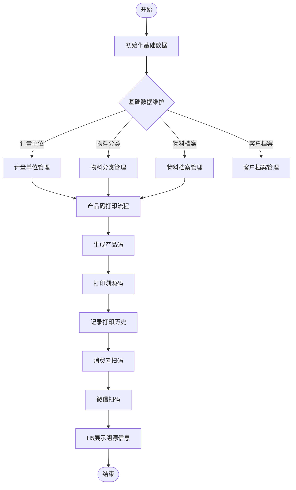

---

## 2. 基础数据管理流程

### 2.1 计量单位管理流程

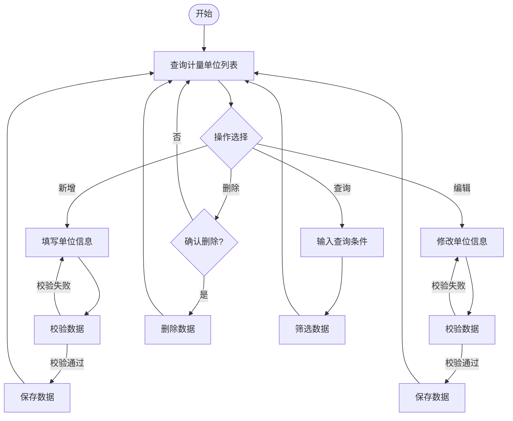

### 2.2 物料档案管理流程

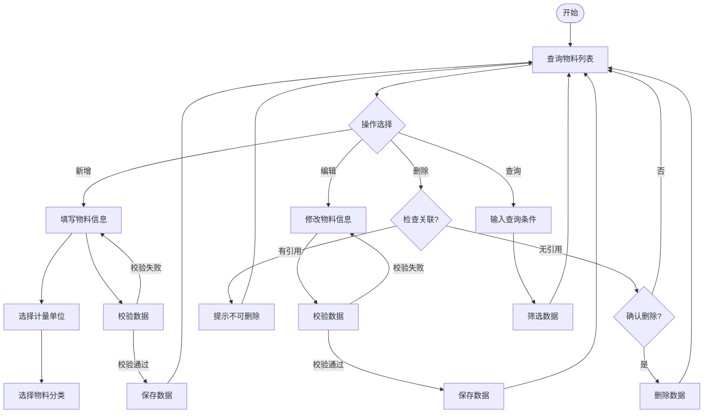

---

## 3. 产品码打印流程

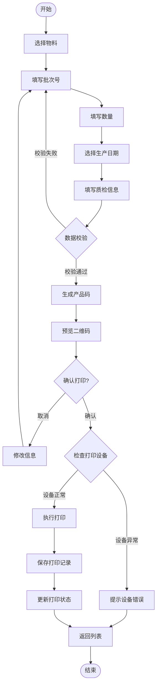

---

## 4. 打印记录管理流程

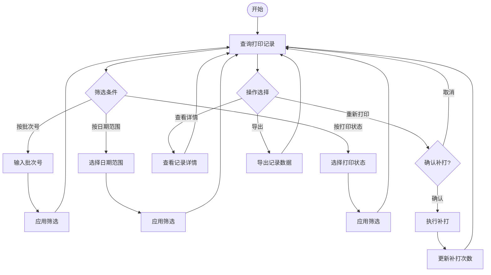

---

## 5. 微信扫码溯源流程

### 5.1 消费者扫码流程

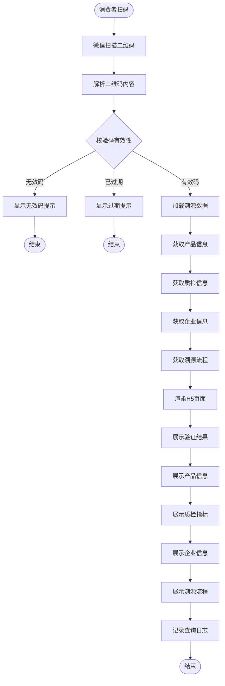

### 5.2 溯源信息展示流程

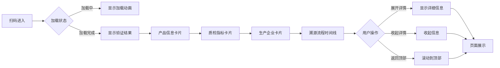

---

## 6. 数据流转关系

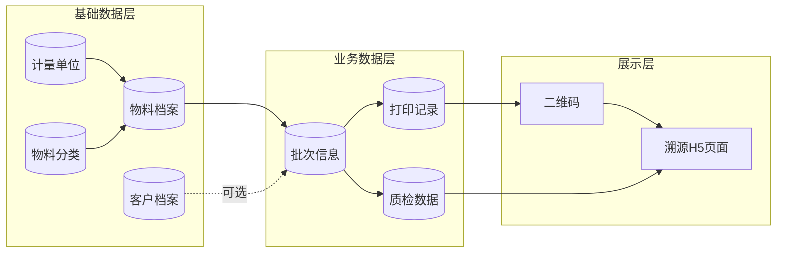

---

## 7. 系统角色与权限

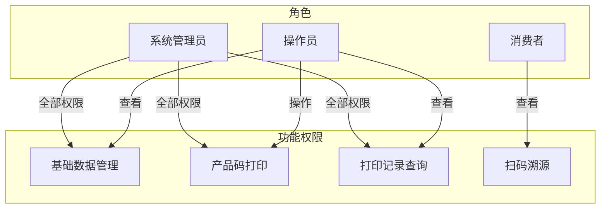

---

## 8. 异常处理流程

### 8.1 打印异常处理

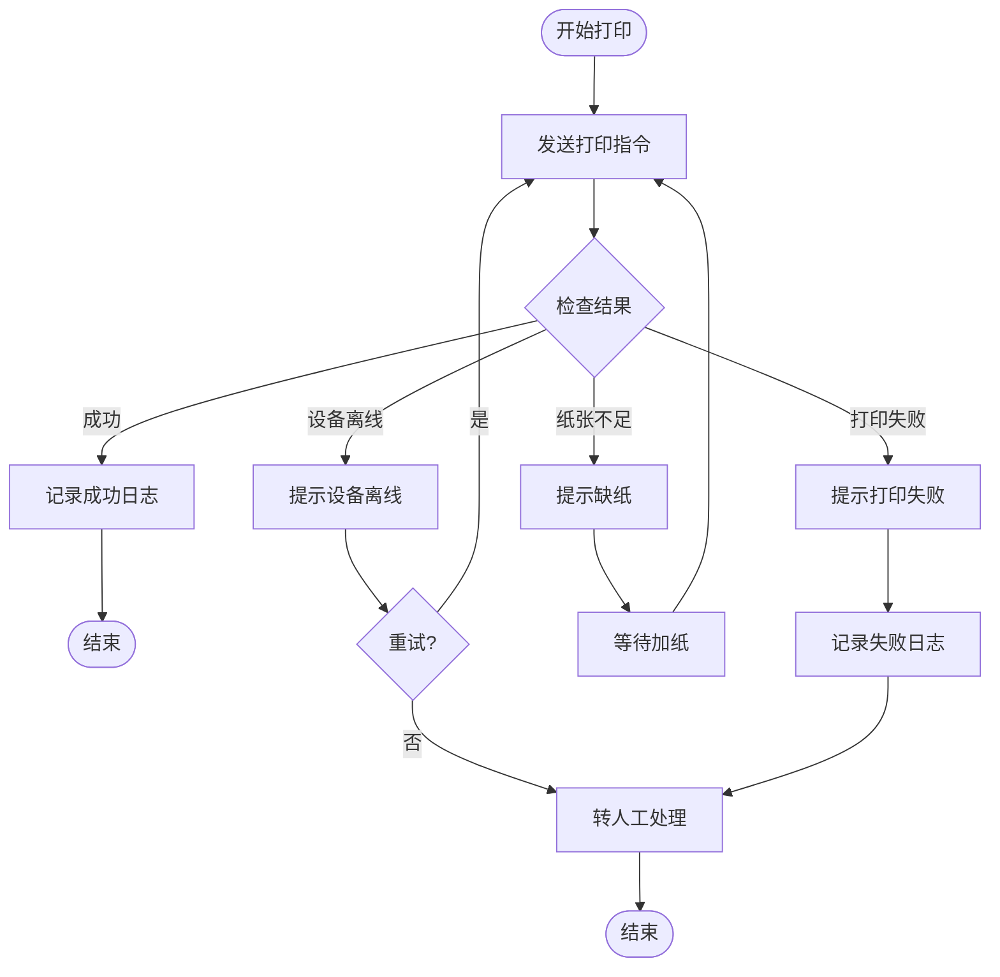

### 8.2 扫码异常处理

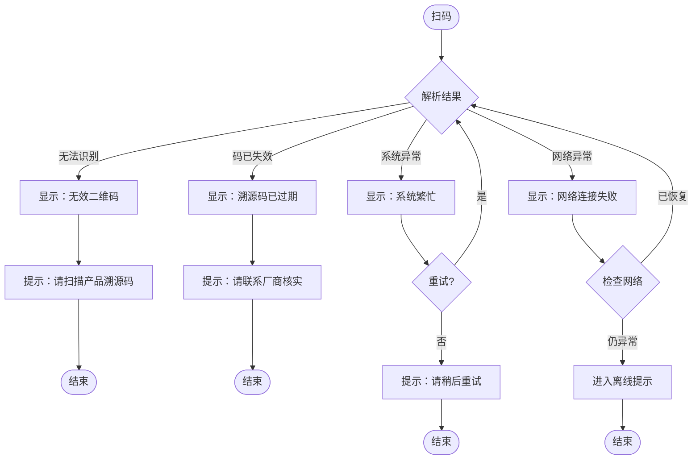

---

*文档结束*
