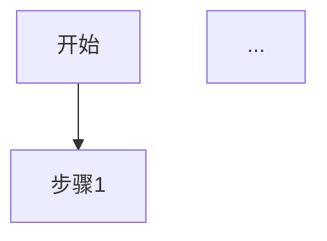

# PRD文档遗漏项检查报告

## 📋 检查说明
对比模板 `/Users/apple/Desktop/文件/kaiwu-project/.trae/skills/pm_skills/template/prd.md`
检查现有PRD文档的完整性

---

## ❌ 严重问题

### 1. 章节顺序错误
**问题描述**：`2.4 业务价值` 章节被错误地放置在了 `3. 详细功能描述` 之后

**当前顺序**：
```
## 2. 功能概述
### 2.1 功能范围
### 2.2 用户画像（角色&使用场景）
### 2.3 使用场景
## 3. 详细功能描述
...（27个功能模块）
## 2.4 业务价值  ← 错误位置
```

**正确顺序**：
```
## 2. 功能概述
### 2.1 功能范围
### 2.2 用户画像（角色&使用场景）
### 2.3 应用场景（核心）← 模板要求，现有是"使用场景"
### 2.4 业务价值
```

---

## ⚠️ 章节内容缺失

### 2. 用户与场景章节内容缺失

#### 2.2 目标用户画像（模板要求）
**缺失内容**：详细的角色定义表格

模板要求的格式：
```markdown
#### [2.2.1] 用户角色一：[角色名称]

| 属性 | 描述 |
|------|------|
| **角色定义** | [一句话定义该角色] |
| **工作职责** | [列出2-3项核心职责] |
| **用户特征** | [年龄、职业、技术水平等] |
| **使用场景** | [在什么场景下使用] |
| **使用频率** | [每日/每周/偶尔] |
| **核心诉求** | [该角色最关心什么] |
| **痛点问题** | [当前工作中遇到的问题] |
```

**现有内容**：仅有简要描述，缺少表格结构

#### 2.3 应用场景（模板要求）
**问题**：现有是"使用场景"，模板要求是"应用场景（核心）"

**缺失内容**：每个场景缺少以下表格

```markdown
#### [2.3.1] 场景一：[场景名称]

| 属性 | 描述 |
|------|------|
| **触发情境** | 在[什么情况/条件]下 |
| **用户行为** | [用户角色]想要[做什么操作] |
| **期望目的** | 以达到[什么目的/结果] |
| **当前痛点** | [现在有什么问题] |
| **解决方案** | [功能如何解决] |
| **前置条件** | [场景发生前需要满足的条件] |
| **后置结果** | [场景完成后的状态变化] |

**业务流程**：


**操作流程**：
1. [第一步操作及预期结果]
2. [第二步操作及预期结果]
...
```

---

## 📑 功能描述详细度不足

### 3. 功能模块缺少的详细内容

每个功能模块（如3.1、3.2等）相比模板缺少以下内容：

#### ❌ 3.1.4 角色权限设计（模板要求）
**完全缺失**

模板要求内容：
- **3.1.4.1 角色权限矩阵**（表格）
  ```markdown
  | 权限项 | [角色1] | [角色2] | 系统管理员 |
  |--------|---------|---------|-----------|
  | [查看列表] | ✅ | ✅ | ✅ |
  | [新增记录] | ✅ | ❌ | ✅ |
  | [编辑记录] | ✅ | ❌ | ✅ |
  | [删除记录] | ❌ | ❌ | ✅ |
  ```

- **3.1.4.2 数据权限规则**（表格）
  ```markdown
  | 角色 | 数据范围 | 说明 |
  |------|---------|------|
  | [角色1] | 本人创建的数据 | [只能查看和操作自己创建的记录] |
  | [角色2] | 本部门数据 | [可查看本部门所有数据] |
  | 系统管理员 | 全部数据 | [可查看和操作所有数据] |
  ```

#### ❌ 3.1.5 列表数据规范（模板要求）
**完全缺失**

模板要求内容：
- **3.1.5.1 数据获取方式**（表格）
  ```markdown
  | 属性 | 描述 |
  |------|------|
  | **数据来源** | [表单名称/API接口] |
  | **获取方式** | [实时查询/定时刷新/手动刷新] |
  | **分页方式** | [前端分页/后端分页]，每页默认[20]条 |
  | **加载策略** | [首次加载全部/懒加载/滚动加载] |
  ```

- **3.1.5.2 列表排序规则**（表格）
  ```markdown
  | 优先级 | 排序字段 | 排序方式 | 说明 |
  |--------|---------|---------|------|
  | 1 | createTime | 降序(DESC) | 默认按创建时间倒序 |
  ```

- **3.1.5.3 列表字段定义**（详细表格）
  ```markdown
  | 序号 | 字段名称 | 数据类型 | 显示格式 | 数据来源 | 是否必填 | 规则 | 错误提示 |
  ```

- **3.1.5.4 筛选条件**（详细表格）
  ```markdown
  | 序号 | 筛选字段 | 字段标识 | 控件类型 | 查询方式 | 默认值 | 是否必填 | 备注 |
  ```

#### ❌ 3.1.6 业务模块协同（模板要求）
**完全缺失**

模板要求内容：
- **3.1.6.1 上游模块依赖**（表格）
- **3.1.6.2 下游模块影响**（表格）
- **3.1.6.3 模块协同流程图**
- **3.1.6.4 数据一致性规则**（表格）

#### ❌ 3.1.7 功能点详述（模板要求）
**完全缺失**

模板要求内容：
- **3.1.7.1 功能点一**：[功能名称]
  - 功能描述
  - **功能入口**（表格：入口位置、入口形式、入口文案、显示条件）
  - **业务规则**（表格：规则编号、规则名称、规则描述、优先级）
  - **操作逻辑**（表格：元素、类型、触发条件、行为描述、反馈方式）
  - **表单字段**（详细表格：序号、字段名称、字段标识、控件类型、是否必填、验证规则、默认值、联动规则）

#### ❌ 3.1.8 数据模型设计（模板要求）
**部分缺失**

现有内容：仅有输入规则和字段数据源
**缺失内容**：
- **3.1.8.1 主实体**：[实体名称]
  - **字段定义**（详细表格：序号、字段名称、字段标识、数据类型、长度、是否必填、默认值、验证规则、备注）
  - **字段关联规则**（表格）
- **3.1.8.2 关联实体**（表格）

#### ❌ 3.1.9 UI界面设计（模板要求）
**完全缺失**

模板要求内容：
- **3.1.9.1 页面局部结构**（文本结构图）
- **3.1.9.2 UI线框图**
  - 主列表页面线框图
  - 新增/编辑表单对话框线框图
  - 详情页抽屉（左侧）线框图

#### ⚠️ 3.1.10 边界与异常处理（模板要求）
**部分存在但格式不完整**

现有内容：仅部分模块有简要异常处理说明
**缺失内容**：标准表格格式

模板要求：
- **网络异常**（表格：场景、检测方式、处理方式、用户提示）
- **数据异常**（表格）
- **权限异常**（表格）
- **操作冲突**（表格）
- **输入异常**（表格）

#### ❌ 3.1.11 数据示例（模板要求）
**完全缺失**

模板要求内容：
- **Mock数据**（JavaScript代码块）
  ```javascript
  const listData = [
    {
      _id: "ck_001",
      billCode: "CK202401150001",
      ...
    }
  ];
  ```

---

## 📊 遗漏统计

| 分类 | 遗漏项数 | 严重程度 |
|------|----------|----------|
| 章节结构 | 1项 | 🔴 严重 |
| 用户与场景 | 2项 | 🟠 重要 |
| 角色权限设计 | 2项 | 🔴 严重 |
| 列表数据规范 | 4项 | 🔴 严重 |
| 业务模块协同 | 4项 | 🟠 重要 |
| 功能点详述 | 5项 | 🔴 严重 |
| 数据模型设计 | 2项 | 🟡 一般 |
| UI界面设计 | 3项 | 🟠 重要 |
| 边界与异常处理 | 5项 | 🟡 一般 |
| 数据示例 | 1项 | 🟢 可选 |
| **总计** | **29项** | - |

---

## ✅ 已有的内容（符合模板）

1. ✅ 文档信息（文档名称、版本号、编写人、日期）
2. ✅ 修订记录
3. ✅ 1.1 业务需求描述
4. ✅ 1.2 用户痛点（表格格式）
5. ✅ 1.3 业务目标（表格格式）
6. ✅ 2.1 功能范围
7. ✅ 2.2 用户画像（简要描述）
8. ✅ 2.3 使用场景（简要描述）
9. ✅ 2.4 业务价值（已补充）
10. ✅ 3.x 功能描述（每个模块的基本功能描述）
11. ✅ 3.x 业务流程（Mermaid流程图）
12. ✅ 3.x 业务规则（输入规则表格）
13. ✅ 3.x 字段数据源
14. ✅ 3.x 业务逻辑
15. ✅ 3.x 状态流转
16. ✅ 3.x 验收标准
17. ✅ 4. 非功能性需求（已补充）
18. ✅ 5. 测试要点（已补充）
19. ✅ 6. 附录（已补充）

---

## 📝 建议处理方案

### 方案一：快速修复（推荐）
1. 修复章节顺序错误
2. 为每个核心功能补充角色权限矩阵
3. 为每个列表页面补充字段定义和筛选条件
4. 补充关键功能的UI线框图

### 方案二：完整补充
按模板要求完整补充所有29项遗漏内容（工作量较大）

### 方案三：仅修复严重问题
1. 修复章节顺序
2. 补充角色权限设计（开发必需）
3. 其他内容保持现状

---

## 🔍 检查日期
2026-04-08

## 👤 检查人
AI助手
