# 4.2 功能模块详细设计（按171个页面重新组织）

> 本文档按功能清单中的171个页面重新组织技术方案说明书的4.2节内容。
> 每个页面包含：功能目标、核心功能点、业务流程、数据结构设计、权限设计。

---

## 4.2.1 海关信息系统-智能卡口控制-设备管理

**功能目标：** 管理智能卡口设备，维护地磅、车牌识别设备、道闸、显示屏等设备信息，实现设备状态实时监控和故障自动报警。

**核心功能点：**
1. **设备档案管理**：设备编码、设备名称、设备类型、安装位置等基础信息维护
2. **设备状态监控**：实时显示设备在线/离线状态、运行状态
3. **设备故障报警**：设备故障自动检测、报警通知、故障记录
4. **设备维护记录**：维护计划、维护记录、维护提醒

**业务流程：**
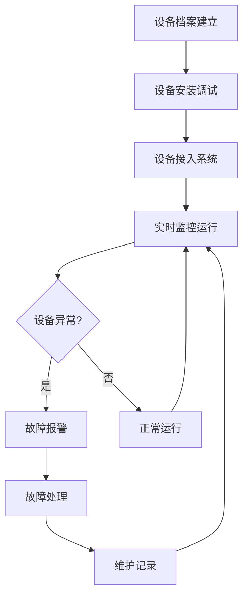

**数据结构设计：**

| 表名 | 说明 |
|------|------|
| gate_device | 卡口设备表，存储设备基础信息 |
| device_status_log | 设备状态日志表，记录设备状态变化 |
| device_alarm | 设备报警表，记录设备故障报警 |
| device_maintenance | 设备维护记录表 |

**权限设计：**

| 权限项 | 货站操作员 | 调度人员 | 海关关员 | 系统管理员 |
|--------|------------|----------|----------|------------|
| 设备信息查询 | ✅ | ✅ | ✅ | ✅ |
| 设备信息录入 | ❌ | ❌ | ❌ | ✅ |
| 设备状态监控 | ✅ | ✅ | ✅ | ✅ |
| 故障处理 | ❌ | ✅ | ❌ | ✅ |

---

## 4.2.2 海关信息系统-智能卡口控制-车辆识别

**功能目标：** 自动识别进出车辆信息，车牌识别准确率>99%，与预约信息比对，黑名单车辆自动拦截。

**核心功能点：**
1. **车牌自动识别**：摄像头自动识别车牌，识别成功率≥95%
2. **车辆信息比对**：与预约信息、白名单、黑名单比对
3. **异常车辆预警**：黑名单车辆、未预约车辆自动预警
4. **识别记录查询**：历史识别记录查询、统计分析

**业务流程：**
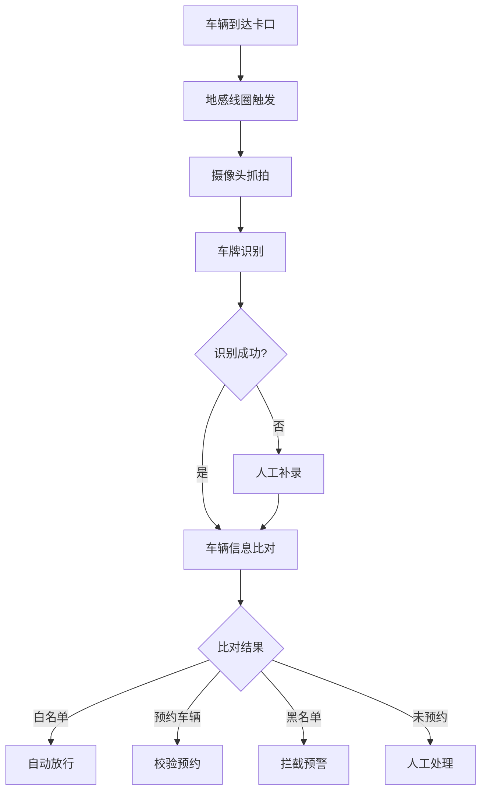

**数据结构设计：**

| 表名 | 说明 |
|------|------|
| vehicle_recognition | 车辆识别记录表 |
| vehicle_white_list | 车辆白名单表 |
| vehicle_black_list | 车辆黑名单表 |

**权限设计：**

| 权限项 | 货站操作员 | 调度人员 | 海关关员 | 系统管理员 |
|--------|------------|----------|----------|------------|
| 识别记录查询 | ✅ | ✅ | ✅ | ✅ |
| 白名单管理 | ❌ | ✅ | ❌ | ✅ |
| 黑名单管理 | ❌ | ❌ | ✅ | ✅ |

---

## 4.2.3 海关信息系统-智能卡口控制-地磅称重

**功能目标：** 自动采集车辆称重数据，超重自动预警，数据防篡改，称重记录追溯。

**核心功能点：**
1. **称重数据采集**：地磅自动采集重量数据，与预报重量差异超过±5%触发预警
2. **超重预警**：超重自动预警，阻止放行
3. **数据防篡改**：称重数据加密存储，防止篡改
4. **称重记录查询**：历史称重记录查询、统计分析

**业务流程：**
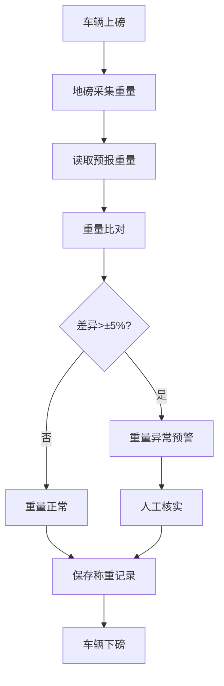

**数据结构设计：**

| 表名 | 说明 |
|------|------|
| weighing_record | 称重记录表 |
| weighing_alarm | 称重异常报警表 |

**权限设计：**

| 权限项 | 货站操作员 | 调度人员 | 海关关员 | 系统管理员 |
|--------|------------|----------|----------|------------|
| 称重记录查询 | ✅ | ✅ | ✅ | ✅ |
| 异常处理 | ❌ | ✅ | ❌ | ✅ |

---

## 4.2.4 海关信息系统-智能卡口控制-金关对接

**功能目标：** 与海关金关二期系统对接，实现申报数据比对、运输工具校验、风险预警、指令触发。

**核心功能点：**
1. **金关二期接口对接**：海关金关二期接口对接
2. **申报数据自动比对**：自动向金关二期发送验核请求，实时接收回执
3. **风险自动预警**：根据海关风控规则自动预警
4. **指令自动触发**：根据验核结果自动控制道闸开启/关闭

**业务流程：**
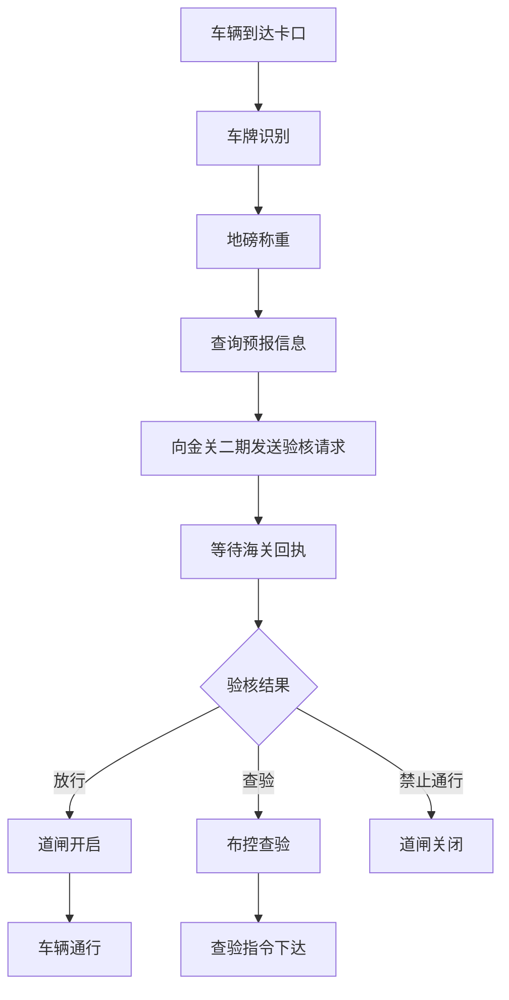

**数据结构设计：**

| 表名 | 说明 |
|------|------|
| customs_check_request | 海关验核请求表 |
| customs_check_response | 海关验核回执表 |
| customs_interface_log | 海关接口调用日志表 |

**权限设计：**

| 权限项 | 货站操作员 | 调度人员 | 海关关员 | 系统管理员 |
|--------|------------|----------|----------|------------|
| 验核记录查询 | ✅ | ✅ | ✅ | ✅ |
| 接口配置 | ❌ | ❌ | ❌ | ✅ |

---

## 4.2.5 海关信息系统-智能卡口控制-安检对接

**功能目标：** 与机场、海关安检系统对接，货物预报后自动向安检系统申报，安检结果实时接收，安检不通过货物禁止入货站。

**核心功能点：**
1. **安检申报自动发送**：货物预报后自动向安检系统申报
2. **安检结果实时接收**：实时接收安检系统回执
3. **安检状态与卡口联动**：安检不通过货物禁止入货站

**业务流程：**
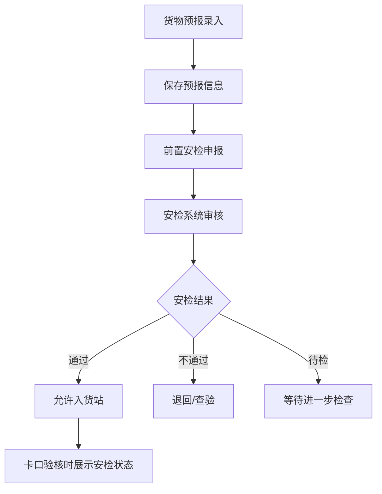

**数据结构设计：**

| 表名 | 说明 |
|------|------|
| security_check_request | 安检申报表 |
| security_check_result | 安检结果表 |

**权限设计：**

| 权限项 | 货站操作员 | 调度人员 | 海关关员 | 系统管理员 |
|--------|------------|----------|----------|------------|
| 安检状态查看 | ✅ | ✅ | ✅ | ✅ |
| 安检申报 | ❌ | ❌ | ❌ | ✅ |

---

## 4.2.6 海关信息系统-查验预警处置-查验筛选

**功能目标：** 智能筛选需要查验的货物，AI风险预警模型、查验对象智能筛选、查验优先级排序。

**核心功能点：**
1. **AI风险预警模型**：基于历史数据和风险模型智能筛选
2. **查验对象智能筛选**：根据海关风控规则自动筛选待查验货物
3. **查验优先级排序**：查验优先级自动计算，查验资源优化分配

**业务流程：**
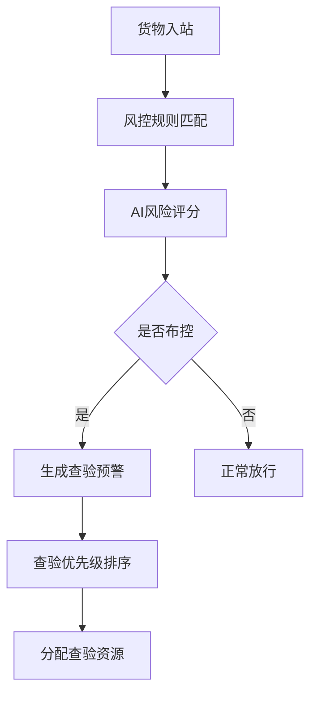

**数据结构设计：**

| 表名 | 说明 |
|------|------|
| inspection_alert | 查验预警表 |
| risk_assessment | 风险评估表 |

**权限设计：**

| 权限项 | 货站操作员 | 调度人员 | 海关关员 | 系统管理员 |
|--------|------------|----------|----------|------------|
| 查验筛选查看 | ❌ | ✅ | ✅ | ✅ |
| 风险模型配置 | ❌ | ❌ | ❌ | ✅ |

---

## 4.2.7 海关信息系统-查验预警处置-指令下发

**功能目标：** 向查验人员下发查验指令，指令实时推送至PDA，查验项目自动提示，查验人员自动分配。

**核心功能点：**
1. **查验指令生成**：根据查验预警生成查验指令
2. **指令实时推送**：查验指令实时推送至现场查验人员PDA
3. **查验项目自动提示**：自动提示查验项目和注意事项
4. **查验人员自动分配**：根据人员位置和负载自动分配

**业务流程：**
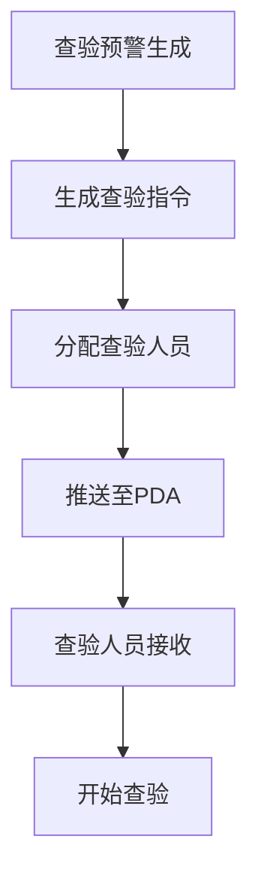

**数据结构设计：**

| 表名 | 说明 |
|------|------|
| inspection_order | 查验指令表 |
| inspection_assignment | 查验人员分配表 |

**权限设计：**

| 权限项 | 货站操作员 | 调度人员 | 海关关员 | 系统管理员 |
|--------|------------|----------|----------|------------|
| 指令查看 | ❌ | ✅ | ✅ | ✅ |
| 指令下发 | ❌ | ❌ | ✅ | ✅ |

---

## 4.2.8 海关信息系统-查验预警处置-结果录入

**功能目标：** 记录查验结果，同步至海关系统，PDA端结果录入，查验过程拍照，结果实时同步。

**核心功能点：**
1. **PDA端结果录入**：查验人员通过PDA录入查验结果
2. **查验过程拍照**：支持拍照留痕
3. **结果实时同步**：查验结果实时同步至海关系统
4. **查验异常标记**：异常情况标记和处理

**业务流程：**
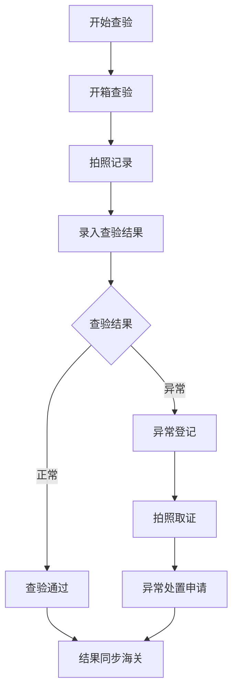

**数据结构设计：**

| 表名 | 说明 |
|------|------|
| inspection_result | 查验结果表 |
| inspection_photo | 查验照片表 |

**权限设计：**

| 权限项 | 查验人员 | 调度人员 | 海关关员 | 系统管理员 |
|--------|----------|----------|----------|------------|
| 结果录入 | ✅ | ❌ | ❌ | ✅ |
| 结果查看 | ✅ | ✅ | ✅ | ✅ |

---

## 4.2.9 海关信息系统-查验预警处置-异常处置

**功能目标：** 处理查验过程中发现的异常情况，异常自动识别，标准化处置流程，处置审核确认。

**核心功能点：**
1. **异常自动识别**：系统自动识别查验异常
2. **标准化处置流程**：退运、销毁、补税等标准化流程
3. **处置审核确认**：多级审核确认机制
4. **异常处置记录完整**：全程记录留痕

**业务流程：**
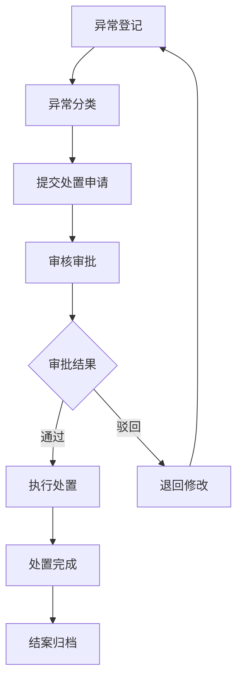

**数据结构设计：**

| 表名 | 说明 |
|------|------|
| inspection_exception | 查验异常表 |
| exception_handling | 异常处置表 |

**权限设计：**

| 权限项 | 查验人员 | 调度人员 | 海关关员 | 系统管理员 |
|--------|----------|----------|----------|------------|
| 异常登记 | ✅ | ❌ | ❌ | ✅ |
| 处置审批 | ❌ | ❌ | ✅ | ✅ |

---

## 4.2.10 海关信息系统-货物预报管理-预报录入

**功能目标：** 提前录入货物信息，实现通关前置化处理，支持手工录入和Excel批量导入。

**核心功能点：**
1. **货物预报录入**：录入货物基础信息、航空运输信息、收发货人信息
2. **Excel批量导入**：支持最多1000条批量导入
3. **数据校验**：格式校验、逻辑校验、关联校验
4. **海关编码库关联**：与海关HS编码库关联

**业务流程：**
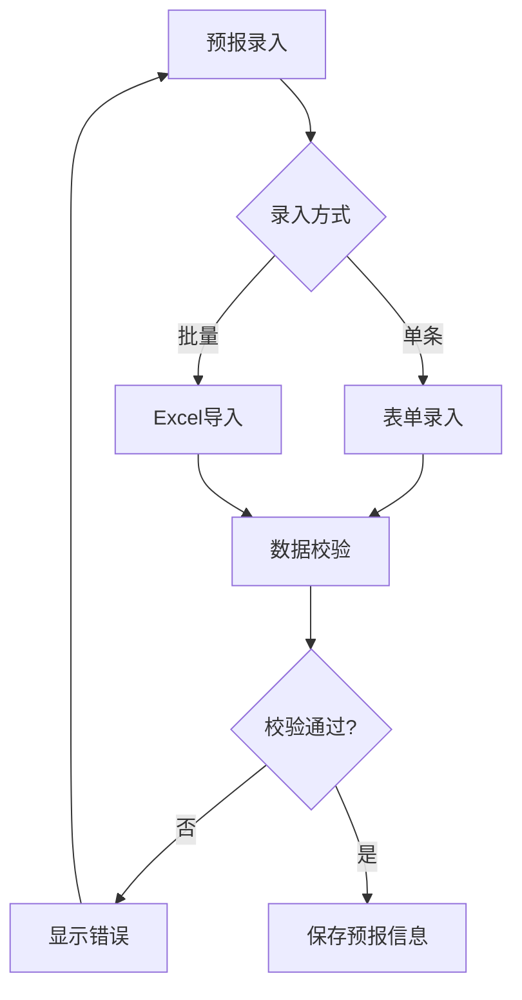

**数据结构设计：**

**货物预报表（cargo_forecast）**

| 字段名 | 数据类型 | 长度 | 是否必填 | 默认值 | 说明 |
|--------|----------|------|----------|--------|------|
| id | bigint | - | 是 | 自增 | 主键 |
| forecast_no | varchar | 32 | 是 | - | 预报单号 |
| waybill_no | varchar | 20 | 是 | - | 运单号 |
| cargo_name | varchar | 200 | 是 | - | 货物品名 |
| piece_count | int | - | 是 | 0 | 货物件数 |
| weight | decimal | 10,2 | 是 | 0 | 货物重量(KG) |
| customs_status | tinyint | - | 是 | 1 | 海关状态 |
| create_time | datetime | - | 是 | 当前时间 | 创建时间 |

**权限设计：**

| 权限项 | 货站操作员 | 调度人员 | 海关关员 | 系统管理员 |
|--------|------------|----------|----------|------------|
| 预报录入 | ✅ | ✅ | ❌ | ✅ |
| 批量导入 | ❌ | ❌ | ❌ | ✅ |

---

## 4.2.11 海关信息系统-货物预报管理-预报审核

**功能目标：** 对货物预报进行审核，确保信息准确完整，审核通过后提交海关预录入。

**核心功能点：**
1. **预报信息审核**：审核货物信息完整性、准确性
2. **审核意见记录**：记录审核意见和结果
3. **审核状态流转**：待审核→审核通过/审核驳回
4. **批量审核**：支持批量审核操作

**业务流程：**
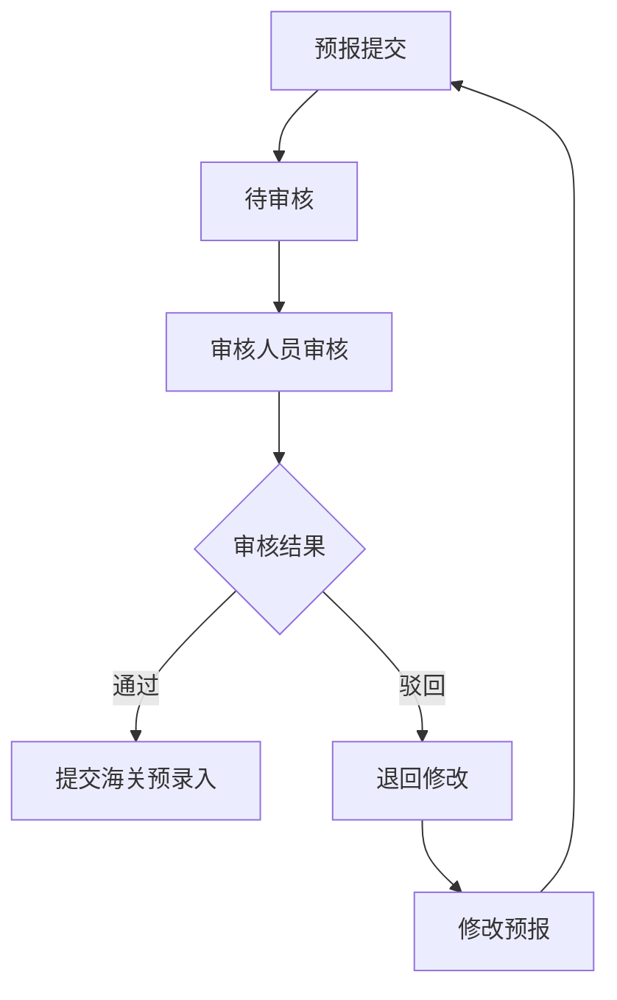

**权限设计：**

| 权限项 | 货站操作员 | 调度人员 | 海关关员 | 系统管理员 |
|--------|------------|----------|----------|------------|
| 预报审核 | ❌ | ✅ | ❌ | ✅ |

---

## 4.2.12 海关信息系统-货物预报管理-预录入回执

**功能目标：** 接收海关预录入回执，处理通过/退单/待审状态，展示回执详情。

**核心功能点：**
1. **回执接收**：自动接收海关预录入回执
2. **状态更新**：根据回执更新预报状态
3. **退单处理**：展示退单原因，支持修改重提
4. **回执查询**：历史回执查询

**状态流转：**

| 当前状态 | 操作 | 下一状态 | 条件 |
|----------|------|----------|------|
| 待提交 | 提交海关 | 审核中 | 提交预录入 |
| 审核中 | 收到回执 | 已通过 | 海关审核通过 |
| 审核中 | 收到回执 | 已退单 | 海关退单 |
| 已退单 | 修改重提 | 审核中 | 修改后重新提交 |

**权限设计：**

| 权限项 | 货站操作员 | 调度人员 | 海关关员 | 系统管理员 |
|--------|------------|----------|----------|------------|
| 回执查看 | ✅ | ✅ | ✅ | ✅ |

---

## 4.2.13 海关信息系统-跨境电商-9610业务管理

**功能目标：** 支持9610零售出口业务，订单抓取/导入、三单对碰、清单生成、海关申报、分拣线集货、查验/放行、汇总申报、退税申请。

**核心功能点：**
1. **订单抓取/导入**：从电商平台抓取或导入订单
2. **三单对碰**：订单、支付单、物流单三单对碰
3. **清单生成**：生成海关清单
4. **海关申报**：向海关申报清单
5. **汇总申报**：离境结关后汇总申报
6. **退税申请**：申请退税

**业务流程：**
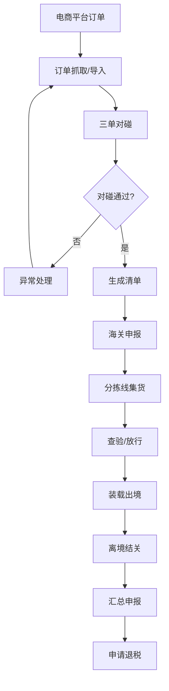

**权限设计：**

| 权限项 | 电商操作员 | 电商审核员 | 海关关员 | 系统管理员 |
|--------|------------|------------|----------|------------|
| 订单查询 | ✅ | ✅ | ✅ | ✅ |
| 订单录入 | ✅ | ❌ | ❌ | ✅ |
| 清单申报 | ✅ | ✅ | ❌ | ✅ |
| 汇总申报 | ❌ | ✅ | ❌ | ✅ |

---

## 4.2.14 海关信息系统-跨境电商-9710业务管理

**功能目标：** 支持9710 B2B直接出口业务，订单备案、报关单生成、海关申报、退税管理、统计分析。

**核心功能点：**
1. **订单备案**：企业订单备案
2. **报关单生成**：生成报关单
3. **海关申报**：向海关申报
4. **退税管理**：退税申请和管理
5. **统计分析**：业务统计分析

**业务流程：**
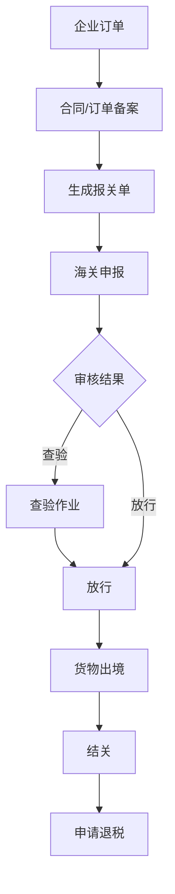

**权限设计：**

| 权限项 | 电商操作员 | 电商审核员 | 海关关员 | 系统管理员 |
|--------|------------|------------|----------|------------|
| 订单备案 | ✅ | ✅ | ❌ | ✅ |
| 报关申报 | ✅ | ✅ | ❌ | ✅ |
| 退税申请 | ❌ | ✅ | ❌ | ✅ |

---

## 4.2.15 海关信息系统-跨境电商-9810业务管理

**功能目标：** 支持9810海外仓出口业务，海外仓备案、备货计划、库存同步、退货管理、退税管理。

**核心功能点：**
1. **海外仓备案**：海外仓信息备案
2. **备货计划**：制定备货计划
3. **库存同步**：海外仓库存同步
4. **退货管理**：退货处理
5. **退税管理**：汇总申报退税

**业务流程：**
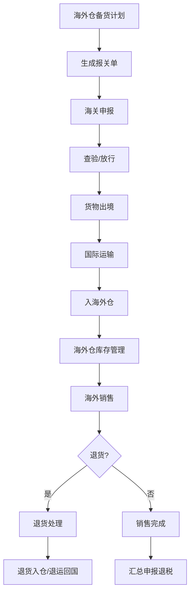

**权限设计：**

| 权限项 | 电商操作员 | 电商审核员 | 海关关员 | 系统管理员 |
|--------|------------|------------|----------|------------|
| 海外仓备案 | ✅ | ✅ | ❌ | ✅ |
| 库存同步 | ✅ | ✅ | ❌ | ✅ |
| 退税管理 | ❌ | ✅ | ❌ | ✅ |

---

## 4.2.16 海关信息系统-跨境电商-跨境电商海关对接

**功能目标：** 与海关跨境电商通关服务平台对接，实现数据自动交换。

**核心功能点：**
1. **订单数据对接**：订单数据自动上传
2. **清单数据对接**：清单数据自动申报
3. **状态回执接收**：接收海关审核回执
4. **退税数据对接**：退税数据申报

**权限设计：**

| 权限项 | 电商操作员 | 电商审核员 | 海关关员 | 系统管理员 |
|--------|------------|------------|----------|------------|
| 对接配置 | ❌ | ❌ | ❌ | ✅ |
| 数据查看 | ✅ | ✅ | ✅ | ✅ |

---

## 4.2.17 海关信息系统-分拣线数据分析-分拣效率分析

**功能目标：** 分析分拣线运行效率，提供效率报表和优化建议。

**核心功能点：**
1. **分拣效率统计**：分拣件数、分拣时长统计
2. **效率趋势分析**：效率变化趋势分析
3. **瓶颈识别**：识别效率瓶颈环节
4. **优化建议**：提供效率优化建议

**权限设计：**

| 权限项 | 货站操作员 | 调度人员 | 管理人员 | 系统管理员 |
|--------|------------|----------|----------|------------|
| 效率分析查看 | ❌ | ✅ | ✅ | ✅ |

---

## 4.2.18 海关信息系统-分拣线数据分析-设备利用率

**功能目标：** 分析分拣设备利用率，优化设备配置。

**核心功能点：**
1. **设备利用率统计**：设备运行时间、空闲时间统计
2. **利用率分析**：设备利用率分析
3. **设备调度优化**：根据利用率优化设备调度
4. **维护计划**：根据利用率制定维护计划

**权限设计：**

| 权限项 | 货站操作员 | 调度人员 | 管理人员 | 系统管理员 |
|--------|------------|----------|----------|------------|
| 利用率查看 | ❌ | ✅ | ✅ | ✅ |

---

## 4.2.19 海关信息系统-海关业务-海关申报

**功能目标：** 实现海关申报业务，支持进出口货物申报。

**核心功能点：**
1. **申报数据录入**：录入申报数据
2. **申报数据审核**：审核申报数据
3. **海关系统对接**：与海关系统对接申报
4. **回执处理**：处理海关回执

**权限设计：**

| 权限项 | 货站操作员 | 调度人员 | 海关关员 | 系统管理员 |
|--------|------------|----------|----------|------------|
| 申报录入 | ✅ | ✅ | ❌ | ✅ |
| 申报审核 | ❌ | ❌ | ✅ | ✅ |

---

## 4.2.20 海关信息系统-海关业务-税费计算

**功能目标：** 计算进出口货物税费，支持多种税费类型。

**核心功能点：**
1. **税费计算**：根据HS编码和货值计算税费
2. **税费预估**：提供税费预估功能
3. **税费查询**：历史税费查询
4. **税费报表**：税费统计报表

**权限设计：**

| 权限项 | 货站操作员 | 调度人员 | 财务人员 | 系统管理员 |
|--------|------------|----------|----------|------------|
| 税费计算 | ❌ | ❌ | ✅ | ✅ |
| 税费查询 | ✅ | ✅ | ✅ | ✅ |

---

## 4.2.21 海关信息系统-可视化展示-业务数据大屏

**功能目标：** 提供货站运营全景视图，实时监控关键运营指标。

**核心功能点：**
1. **货量统计**：实时货量统计展示
2. **航班动态**：航班动态展示
3. **库存状态**：库存状态展示
4. **作业进度**：作业进度展示
5. **异常告警**：异常告警展示

**数据结构设计：**

**看板配置表（dashboard_config）**

| 字段名 | 数据类型 | 长度 | 是否必填 | 默认值 | 说明 |
|--------|----------|------|----------|--------|------|
| id | bigint | - | 是 | 自增 | 主键 |
| dashboard_code | varchar | 50 | 是 | - | 看板编码 |
| dashboard_name | varchar | 100 | 是 | - | 看板名称 |
| layout_config | json | - | 是 | - | 布局配置JSON |
| refresh_interval | int | - | 是 | 5 | 刷新间隔（秒） |

**权限设计：**

| 权限项 | 普通员工 | 部门经理 | 管理人员 | 系统管理员 |
|--------|----------|----------|----------|------------|
| 业务数据大屏查看 | ✅ | ✅ | ✅ | ✅ |

---

## 4.2.22 海关信息系统-可视化展示-监管数据大屏

**功能目标：** 展示海关监管相关数据，辅助海关监管决策。

**核心功能点：**
1. **查验数据统计**：查验数量、查验率统计
2. **异常数据统计**：异常货物统计
3. **通关时效统计**：通关时效分析
4. **风险预警展示**：风险预警信息展示

**权限设计：**

| 权限项 | 货站操作员 | 调度人员 | 海关关员 | 系统管理员 |
|--------|------------|----------|----------|------------|
| 监管数据大屏查看 | ❌ | ❌ | ✅ | ✅ |

---

## 4.2.23 海关信息系统-可视化展示-卡口运行状况大屏

**功能目标：** 实时展示卡口运行状况，包括车辆通行、设备状态等。

**核心功能点：**
1. **车辆通行统计**：实时车辆通行统计
2. **设备状态监控**：卡口设备状态监控
3. **通行效率分析**：通行效率分析
4. **异常事件展示**：异常事件实时展示

**权限设计：**

| 权限项 | 货站操作员 | 调度人员 | 海关关员 | 系统管理员 |
|--------|------------|----------|----------|------------|
| 卡口大屏查看 | ✅ | ✅ | ✅ | ✅ |

---

