# 国际物流航空货站运行平台及海关信息平台 PRD文档

## 文档信息

| 项目 | 内容 |
|------|------|
| 文档名称 | 国际物流航空货站运行平台及海关信息平台 PRD文档 |
| 版本号 | v2.0.0 |
| 编写人 | 孔维康 |
| 编写日期 | 2026-04-03 |
| 最后更新 | 2026-04-03 |

## 修订记录

| 版本 | 日期 | 修订人 | 修订内容 |
|------|------|--------|----------|
| v1.0.0 | 2026-04-03 | 孔维康 | 初始版本 |

---

## 1. 需求背景&目标

### 1.1 业务需求描述

随着国际航空物流业务的快速发展，传统货站管理面临以下业务问题亟待解决：

1. **海关监管合规压力**：手工录入多、数据分散，导致通关效率低、合规风险高
2. **信息孤岛严重**：各系统独立、数据不互通，造成重复录入、数据不一致
3. **业务可视化差**：货物状态不透明，客户体验差、投诉多
4. **作业效率低下**：纸质单据、人工调度，人力成本高、易出错
5. **多式联运协同难**：空运、陆运、铁路运输信息割裂，缺乏统一跟踪平台

### 1.2 用户痛点

| 用户角色 | 用户痛点 | 痛点影响 | 解决价值 |
|----------|----------|----------|----------|
| 海关关员 | 信息分散、查验效率低、异常处置流程不规范 | 查验周期长、监管风险高 | 一站式查验、智能预警、标准化处置流程 |
| 货站操作员 | 手工录入多、纸质单据、库存查询不便 | 易出错、效率低、追溯难 | 扫码作业、实时库存、全程留痕 |
| 调度人员 | 车辆状态不透明、月台分配靠经验、协调困难 | 车辆拥堵、资源利用率低 | 可视化调度、智能推荐、资源优化 |
| 客服人员 | 货物状态查询不便、客户咨询响应慢 | 客户满意度低、投诉多 | 快速查询、状态跟踪、主动通知 |
| 财务人员 | 费用核算复杂、对账困难、账单生成慢 | 回款慢、差错率高 | 自动核算、清晰账单、快速对账 |
| 管理人员 | 运营数据分散、决策缺乏数据支撑 | 决策滞后、响应慢 | 实时监控、数据驱动决策 |

### 1.3 业务目标

**核心目标**：
- 实现海关通关全流程数字化，通关时效提升30%
- 实现货物全程可视化跟踪，客户满意度提升20%
- 实现仓储作业智能化，作业效率提升25%
- 实现多式联运一体化管理，集货准时率达到95%

**量化指标**：

| 指标类别 | 指标名称 | 目标值 | 衡量方式 |
|----------|----------|--------|----------|
| 效率指标 | 平均通关时效 | 压缩30% | 从货物到港到放行平均时间 |
| 效率指标 | 查验作业时效 | 缩短40% | 从布控到查验完成的平均时间 |
| 效率指标 | 仓储作业效率 | 提升25% | 单位时间内处理货物量 |
| 质量指标 | 库存准确率 | ≥99.9% | 系统库存与实际盘点差异率 |
| 质量指标 | 数据录入准确率 | ≥99% | 系统录入错误率 |
| 满意度指标 | 客户满意度 | ≥4.5/5 | 客户满意度调查 |
| 系统指标 | 系统可用性 | ≥99.9% | 年度系统正常运行时间比例 |
| 系统指标 | 接口响应时间 | P99<2s | 接口响应时间第99分位 |

---

## 2. 功能概述

### 2.1 功能范围

**包含功能页面（阶段一 - 基础能力建设）**：
- 基础资料管理（航班信息、货物信息、客户信息、仓库设置、资源管理）
- 智能卡口控制（设备管理、车辆识别、地磅称重、金关对接、安检对接）
- 查验预警处置（查验筛选、指令下发、结果录入、异常处置）
- 货物预报管理（预报录入、预报审核、预录入回执）
- 监管仓管理（入库管理、库内管理、出库管理）
- 分拣线控制管理（分拣调度、设备控制、全流程跟踪、打板位管理）⭐新增
- 货包机集货跟踪（空运跟踪、陆运跟踪、铁路跟踪）
- 订单管理（订单创建、订单拆分、订单变更）
- 运单管理（运单录入、运单跟踪、运单变更）
- 车辆调度（车辆预约、排队调度）
- 月台管理（月台分配、装卸作业）
- 计费管理（计费规则、费用核算、应付核算）
- 客服业务管理（在线客服、工单管理、知识库）⭐新增
- 园区运行中心（综合/交通/安防/能耗/安全/消防/资产/设备设施态势）
- 系统管理（权限管理、日志管理）
- 场站系统对接（机场场站数据同步）⭐新增

**阶段二 - v2.0规划功能**：
- 跨境电商9610/9710/9810业务
- 分拣线联动控制（与PLC深度集成）
- 区区联动（航空港-联运区-综保区）
- 合同中心电子签章
- 航空物流公共信息平台（企业门户）⭐新增
- 移动端完整功能（司机端、员工端）⭐新增
- 设备设施全生命周期管理

### 2.2 用户画像（角色&使用场景）

#### [2.2.1] 用户角色一：海关关员

| 属性 | 描述 |
|------|------|
| **角色定义** | 代表海关行使监管职责的执法人员，负责对进出口货物进行查验、审核和处置 |
| **工作职责** | ①审核货物申报信息 ②执行查验指令 ③记录查验结果 ④处置异常情况 ⑤办理放行手续 |
| **用户特征** | 年龄30-50岁，具备海关专业背景知识，熟悉海关监管法规和业务流程，具备一定计算机操作能力，工作严谨细致 |
| **使用场景** | 在海关监管场所、查验区、审核大厅等场景进行货物查验、单证审核、异常处置、现场监管 |
| **使用频率** | 每日多次（平均8-15次/天） |
| **核心诉求** | ①快速获取查验指令和货物信息 ②便捷记录查验结果和拍照取证 ③规范处置异常情况 ④实时同步查验状态 ⑤高效完成查验任务 |
| **痛点问题** | ①查验信息分散，需要在多个系统间切换 ②手工填写查验单效率低、易出错 ③异常处置流程繁琐，审批周期长 ④查验结果录入不及时，影响通关效率 |

#### [2.2.2] 用户角色二：货站操作员

| 属性 | 描述 |
|------|------|
| **角色定义** | 在货站仓库一线执行货物收发、存储、搬运等操作的作业人员 |
| **工作职责** | ①货物入库接收和上架 ②货物出库拣货和复核 ③库内盘点和移位 ④货物包装和称重 ⑤PDA扫码作业 |
| **用户特征** | 年龄20-45岁，熟悉仓储作业流程和货物特性，能适应体力劳动，需要携带PDA等移动终端，工作时间长、强度大 |
| **使用场景** | 在收货区、仓储区、发货区、月台等仓库各功能区域进行货物收发、上架、拣货、盘点等操作 |
| **使用频率** | 每日持续使用（8-12小时/天） |
| **核心诉求** | ①扫码快速完成作业，减少手工录入 ②实时查看库存位置和数量 ③简化操作流程，降低工作强度 ④及时获取作业指令 ⑤快速上报异常情况 |
| **痛点问题** | ①手工录入单号效率低，容易出错 ②找不到货物存放位置 ③库存信息更新不及时 ④纸质单据易丢失、难追溯 ⑤高峰期作业压力大 |

#### [2.2.3] 用户角色三：调度人员

| 属性 | 描述 |
|------|------|
| **角色定义** | 负责货站车辆、月台、人力等资源调度和任务协调的管理人员 |
| **工作职责** | ①车辆到场预约审核 ②月台分配和调度 ③作业任务派发 ④异常情况协调 ⑤资源利用率优化 |
| **用户特征** | 年龄25-45岁，熟悉货站调度业务和现场情况，具备多任务处理能力，需要长时间盯着监控和调度大屏，工作节奏快 |
| **使用场景** | 在调度中心、监控室通过调度系统进行车辆调度、月台分配、任务派发、异常协调等工作 |
| **使用频率** | 每日持续使用（8-10小时/天） |
| **核心诉求** | ①实时掌握车辆到场时间和货物状态 ②智能推荐最优调度方案 ③快速响应和处理异常 ④可视化展示调度态势 ⑤数据统计和效率分析 |
| **痛点问题** | ①车辆到场时间不确定，调度难度大 ②月台资源紧张，排队等待时间长 ③信息传递不及时，现场混乱 ④缺乏智能调度建议，依赖人工经验 ⑤异常处理响应慢 |

#### [2.2.4] 用户角色四：管理人员

| 属性 | 描述 |
|------|------|
| **角色定义** | 货站运营管理人员，负责整体运营管理、决策分析和团队管理 |
| **工作职责** | ①运营数据监控和分析 ②业务决策和策略制定 ③团队绩效考核 ④成本控制和收益管理 ⑤对外协调和汇报 |
| **用户特征** | 年龄35-55岁，具备丰富的行业经验和管理能力，关注宏观数据和关键指标，工作繁忙，需要移动办公 |
| **使用场景** | 在管理办公室、指挥中心、会议室等场所查看运营数据、审批重要事项、做出管理决策 |
| **使用频率** | 每日多次（2-4小时/天） |
| **核心诉求** | ①实时掌握全局运营态势 ②关键指标一目了然 ③数据驱动决策支持 ④异常自动预警提醒 ⑤移动端随时查看 |
| **痛点问题** | ①数据分散在各系统，难以整合 ②报表生成耗时，时效性差 ③缺乏可视化展示，数据难理解 ④异常情况发现滞后 ⑤决策缺乏数据支撑 |

#### [2.2.5] 用户角色五：客服人员

| 属性 | 描述 |
|------|------|
| **角色定义** | 负责客户咨询、投诉处理、工单跟踪的服务人员 |
| **工作职责** | ①接听客户咨询电话 ②处理客户投诉 ③跟踪工单处理进度 ④回复客户查询 ⑤客户满意度回访 |
| **用户特征** | 年龄22-35岁，熟悉货站业务流程，具备良好的沟通能力和服务意识，工作耐心细致，需要快速查询信息 |
| **使用场景** | 在客服中心、呼叫中心通过电话、在线客服等方式为客户提供服务 |
| **使用频率** | 每日持续使用（8小时/天） |
| **核心诉求** | ①快速查询货物状态和历史记录 ②便捷登记客户问题和工单 ③实时跟踪工单处理进度 ④统一客户信息视图 ⑤工单闭环管理 |
| **痛点问题** | ①需要在多个系统查询客户信息 ②客户咨询响应慢 ③工单流转不透明，客户反复询问 ④历史沟通记录难以追溯 ⑤问题处理周期长 |

#### [2.2.6] 用户角色六：财务人员

| 属性 | 描述 |
|------|------|
| **角色定义** | 负责货站费用核算、账单管理和财务结算的专业人员 |
| **工作职责** | ①费用自动核算 ②账单生成和审核 ③对账和结算 ④发票管理 ⑤财务报表编制 |
| **用户特征** | 年龄25-50岁，具备财务专业知识和经验，工作严谨细致，注重数据准确性 |
| **使用场景** | 在财务室进行费用核算、账单管理、对账结算等财务工作 |
| **使用频率** | 每周多次（3-5天/周） |
| **核心诉求** | ①费用自动核算，减少人工计算 ②账单清晰准确，便于客户理解 ③便捷对账和差异处理 ④财务报表自动生成 ⑤支持多种结算方式 |
| **痛点问题** | ①费用计算规则复杂，易出错 ②手工制作账单效率低 ③对账工作量大 ④费用调整流程繁琐 ⑤财务数据与业务数据不一致 |

#### [2.2.7] 用户角色七：系统管理员

| 属性 | 描述 |
|------|------|
| **角色定义** | 负责系统配置、用户权限管理和系统维护的技术人员 |
| **工作职责** | ①用户账号管理 ②角色权限配置 ③系统参数配置 ④数据备份和恢复 ⑤系统监控和日志审计 |
| **用户特征** | 年龄25-40岁，具备IT技术背景和系统管理经验，熟悉系统架构和配置，工作认真负责 |
| **使用场景** | 在管理后台进行系统配置、用户管理、权限分配、系统监控等工作 |
| **使用频率** | 按需使用（平均每天1-2小时） |
| **核心诉求** | ①集中管理用户和权限 ②灵活配置系统参数 ③操作日志可追溯 ④系统异常自动告警 ⑤便捷的数据备份和恢复 |
| **痛点问题** | ①用户权限管理分散 ②系统配置复杂，缺乏统一入口 ③问题排查缺乏日志支持 ④数据备份不及时 ⑤系统异常发现滞后 |

#### [2.2.8] 用户角色八：司机/访客

| 属性 | 描述 |
|------|------|
| **角色定义** | 到港站送货或提货的司机，以及临时来访的外部人员 |
| **工作职责** | ①提前在线预约 ②到场签到排队 ③按指引完成作业 ④查询货物状态 |
| **用户特征** | 年龄不限，对货站系统不熟悉，流动性大，使用移动端设备，希望快速完成业务 |
| **使用场景** | 通过移动端或自助终端进行预约、签到、查询货物状态、接收通知等 |
| **使用频率** | 按需使用（偶尔使用） |
| **核心诉求** | ①操作简单直观 ②信息准确及时 ③快速进场作业 ④减少等待时间 ⑤问题能及时反馈 |
| **痛点问题** | ①不清楚预约流程 ②到场后不知道去哪里 ③等待时间长，信息不透明 ④无法实时了解货物状态 ⑤异常情况下难以联系相关人员 |

### 2.3 应用场景（核心）

#### [2.3.1] 场景一：货物快速通关

| 属性 | 描述 |
|------|------|
| **触发情境** | 一票进口货物通过航空运输到达货站，海关需要进行监管验核，货站需要完成入库上架 |
| **用户行为** | 货站操作员在系统中录入货物预报信息，海关关员审核申报数据，系统自动比对风控规则，无异常则自动放行，有异常则转入查验流程 |
| **期望目的** | 货物在符合海关监管要求的前提下，快速完成通关流程，及时入库存储，缩短在港停留时间 |
| **当前痛点** | ①手工录入货物信息效率低、易出错 ②查验信息不透明，货主反复询问 ③海关审核等待时间长 ④纸质单据流转慢，易丢失 |
| **解决方案** | ①货物预报提前录入，数据自动校验 ②智能卡口自动识别车辆和货物 ③查验指令实时推送至现场 ④查验结果自动同步，无纸化通关 |
| **前置条件** | ①货物运单已生成 ②海关申报数据已提交 ③车辆已预约登记 ④卡口设备正常运行 |
| **后置结果** | ①货物完成海关验核 ②货物入库上架 ③货主收到通关通知 ④费用开始计费 |

**业务流程**：

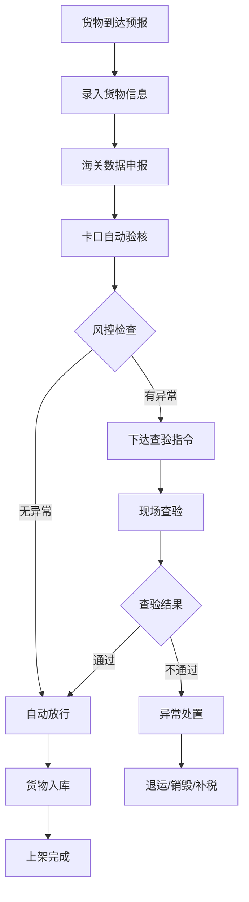

**操作流程**：
1. **货物预报录入**：货站操作员根据运单信息在系统中录入货物预报，包括运单号、件数、重量、货物品名等
2. **海关数据申报**：系统自动向海关金关二期系统申报货物数据，接收海关回执
3. **车辆到场识别**：货车到达卡口，系统自动识别车牌号，匹配预约信息
4. **自动风控检查**：系统根据预设规则进行风控检查，判断是否需要查验
5. **验核结果处理**：无异常货物自动放行，有异常货物转入查验流程
6. **货物入库上架**：放行货物进入仓库，PDA扫码确认库位，完成入库

---

#### [2.3.2] 场景二：查验作业协同

| 属性 | 描述 |
|------|------|
| **触发情境** | 海关风控系统判定某票货物需要查验，需要安排现场查验作业 |
| **用户行为** | 海关关员在系统中下达查验指令，货站操作员通过PDA接收指令并安排查验，查验完成后录入结果和拍照留痕 |
| **期望目的** | 查验指令快速准确传递至现场，查验过程规范记录，查验结果及时反馈，提高查验效率和合规性 |
| **当前痛点** | ①查验指令传递慢，现场等待时间长 ②查验记录不规范，手工填写易出错 ③异常情况处置流程不清晰 ④查验结果录入不及时，影响通关时效 |
| **解决方案** | ①查验指令实时推送至PDA ②查验过程标准化，拍照留痕 ③异常情况分类处置，流程化审批 ④查验结果实时同步，自动更新货物状态 |
| **前置条件** | ①查验指令已下达 ②查验场地可用 ③查验人员到位 ④PDA设备正常 |
| **后置结果** | ①查验完成，结果已记录 ②货物状态更新 ③海关系统同步查验结果 ④货主收到查验通知 |

**业务流程**：

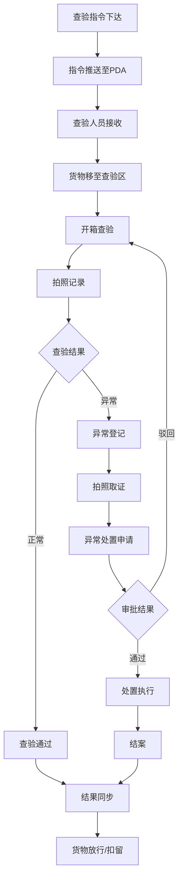

**操作流程**：
1. **指令下达**：海关关员在系统中选择查验方式（机检/人工查验）和查验要求，下达查验指令
2. **指令推送**：系统自动将查验指令推送至现场查验人员的PDA设备
3. **货物移动**：货站操作员根据指令将货物从存储区移至查验区
4. **开箱查验**：查验人员按照查验要求开箱检查货物
5. **拍照留痕**：查验人员对查验过程进行拍照记录，包括货物外观、标签、开箱情况等
6. **结果录入**：查验人员在PDA上录入查验结果，包括查验结论、异常情况说明等
7. **结果同步**：查验结果自动同步至海关系统和货站系统，更新货物状态

---

#### [2.3.3] 场景三：智能车辆调度

| 属性 | 描述 |
|------|------|
| **触发情境** | 多辆货车同时或陆续到达货站，需要进行排队等待和月台分配，完成装卸作业 |
| **用户行为** | 司机通过移动端预约到港时间，到场后自助签到，调度人员通过调度系统查看车辆状态，智能分配月台和作业任务 |
| **期望目的** | 车辆有序进场，减少排队等待时间，月台资源高效利用，装卸作业快速完成 |
| **当前痛点** | ①车辆到场时间不确定，现场混乱 ②月台分配依赖人工经验，利用率低 ③排队信息不透明，司机焦虑等待 ④异常情况响应慢，影响后续车辆 |
| **解决方案** | ①预约制管理，提前规划到港时间 ②智能排队算法，公平有序 ③自动分配最优月台，减少移动距离 ④实时状态推送，信息透明 ⑤异常情况快速响应和重新调度 |
| **前置条件** | ①车辆已预约 ②司机已注册 ③月台资源可用 ④调度人员在线 |
| **后置结果** | ①车辆完成装卸 ②月台释放 ③费用结算完成 ④满意度评价 |

**业务流程**：

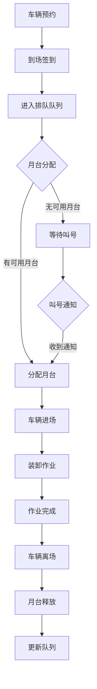

**操作流程**：
1. **在线预约**：司机通过移动端选择到港日期和时间段，提交预约申请
2. **到场签到**：车辆到达货站后，司机通过移动端或自助终端扫码签到
3. **排队叫号**：系统自动将车辆加入排队队列，显示当前排队位置和预计等待时间
4. **月台分配**：根据车辆类型、货物类型、月台状态等因素，智能分配最优月台
5. **叫号通知**：轮到该车辆时，系统通过短信/APP推送通知司机
6. **进场作业**：车辆按指引进入指定月台，开始装卸作业
7. **作业完成**：装卸完成后，司机确认离场，系统自动释放月台资源

---

#### [2.3.4] 场景四：仓储作业管理

| 属性 | 描述 |
|------|------|
| **触发情境** | 货物完成通关后需要入库存储，或根据出库指令需要拣货出库，或定期需要进行库内盘点 |
| **用户行为** | 货站操作员通过PDA接收作业任务，扫描货物条码确认，按照系统指引进行上架、拣货、盘点等作业 |
| **期望目的** | 库内作业高效准确，库存实时可查，库位利用合理，盘点轻松快捷 |
| **当前痛点** | ①库位分配不合理，货物存放混乱 ②拣货路径不优化，效率低 ③盘点耗时耗力，影响正常作业 ④库存数据不准确，账实不符 |
| **解决方案** | ①智能库位推荐，根据货物属性分配最优库位 ②PDA扫码作业，实时确认 ③库存实时更新，账实一致 ④盘点任务化，不影响正常作业 ⑤库龄预警，防止呆滞 |
| **前置条件** | ①货物已放行 ②PDA设备正常 ③库位信息准确 ④作业人员到位 |
| **后置结果** | ①货物上架完成 ②库存更新 ③任务完成确认 ④作业数据统计 |

**业务流程**：

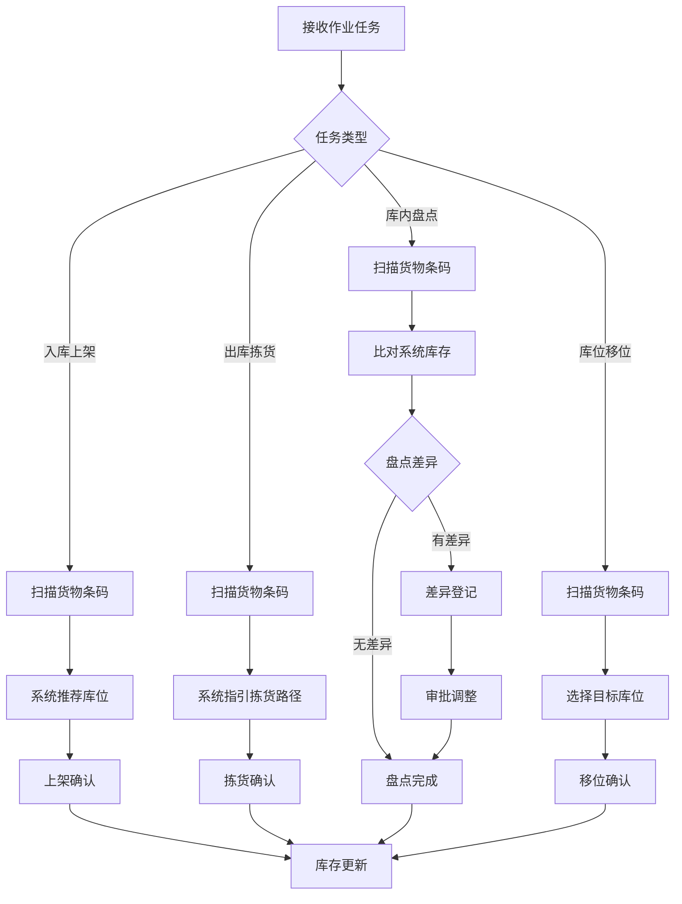

**操作流程**：
1. **任务接收**：货站操作员通过PDA接收入库、出库、盘点或移位任务
2. **扫码确认**：扫描货物条码，系统自动识别货物信息
3. **库位推荐/指引**：
   - 入库：系统根据货物属性（重量、尺寸、温区要求等）推荐最优库位
   - 出库：系统根据订单和库位分布，规划最优拣货路径
   - 盘点：系统显示该货物系统库存，操作员核对实际库存
   - 移位：系统显示当前库位和目标库位
4. **作业执行**：操作员按指引完成上架、拣货、盘点或移位操作
5. **确认提交**：在PDA上确认完成，系统自动更新库存数据

---

## 2.4 业务价值

### 2.4.1 核心价值点

| 价值点 | 具体说明 | 可衡量指标 |
|--------|----------|------------|
| 通关效率提升 | 通过智能卡口、自动验核、无纸化通关，大幅减少货物在港停留时间 | 通关时效提升30%，从平均48小时缩短至34小时 |
| 查验效率提升 | AI智能筛选、PDA移动查验、结果实时同步，提高查验作业效率 | 查验作业时效缩短40%，单票查验时间从2小时降至1.2小时 |
| 仓储作业效率提升 | PDA扫码作业、智能库位推荐、实时库存管理，提高库内作业效率 | 仓储作业效率提升25%，人均日处理货物量从50票提升至62票 |
| 客户满意度提升 | 货物全程可视化跟踪、主动通知、快速响应客户咨询 | 客户满意度从4.0/5提升至4.5/5，客户投诉率降低50% |
| 运营成本降低 | 减少人工录入、纸质单据，提高资源利用率 | 人力成本降低20%，纸质单据使用量减少90% |
| 数据准确性提升 | 系统自动采集、扫码录入、数据校验，减少人为错误 | 数据录入准确率达到99%，库存准确率达到99.9% |

### 2.4.2 ROI分析

| 收益类型 | 年度收益估算 | 说明 |
|----------|-------------|------|
| 人力成本节省 | 约150万元 | 减少人工录入、调度、客服等岗位人员需求 |
| 运营成本节省 | 约80万元 | 减少纸质单据、通讯、差旅等运营支出 |
| 效率提升收益 | 约200万元 | 货物周转加快、仓储利用率提升带来的收益 |
| 客户留存收益 | 约100万元 | 客户满意度提升带来的业务增长 |
| **总计** | **约530万元/年** | 项目投资回收期约18个月 |

---


## 3. 详细功能描述

### 3.1 基础资料管理

#### 3.1.1 航班信息管理

**功能描述**
- **功能名称**：航班信息管理
- **功能目标**：维护航班时刻表、航线信息、航班状态等基础数据
- **功能价值**：为货物跟踪、打板作业、出库计划提供航班数据支撑

**业务流程**
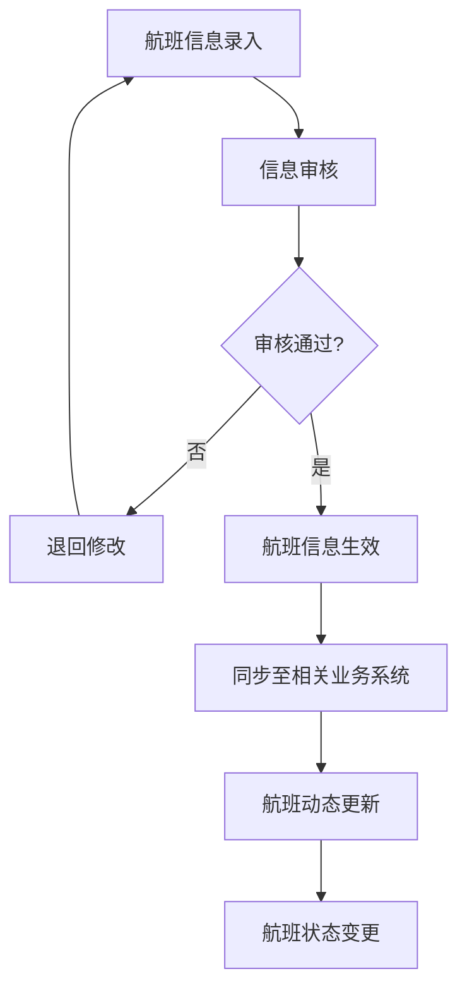

**业务规则**

**输入规则：**
| 字段名 | 类型 | 必填 | 规则 | 错误提示 |
|--------|------|------|------|----------|
| 航班号 | 字符串 | 是 | 格式如CA1234，唯一 | 航班号格式错误或已存在 |
| 航线 | 字符串 | 是 | 出发地-目的地 | 请选择航线 |
| 计划起飞时间 | 日期时间 | 是 | 必须大于当前时间 | 计划时间不能小于当前时间 |
| 计划到达时间 | 日期时间 | 是 | 必须大于起飞时间 | 到达时间必须晚于起飞时间 |
| 机型 | 枚举 | 是 | 波音/空客等机型 | 请选择机型 |
| 货舱容量 | 数字 | 否 | ≥0，单位kg | 请输入有效数值 |
| 最大载重 | 数字 | 否 | ≥0，单位kg | 请输入有效数值 |
| 板位数量 | 整数 | 否 | ≥0 | 请输入有效数值 |

**字段数据源：**
- 航班号：人工录入或从航班平台同步
- 航线信息：上游来自航线基础数据
- 航班动态：上游来自航班信息平台API
- 货物关联：下游用于货物跟踪、打板计划

**业务逻辑：**
1. 航班信息支持手工录入和外部系统同步
2. 航班状态包括：计划中、已起飞、已到达、延误、取消
3. 航班延误或取消时自动触发关联货物预警
4. 支持航班历史数据查询和统计
5. 支持航班与打板位、机位资源关联

**状态流转：**
| 当前状态 | 操作 | 下一状态 | 条件 |
|----------|------|----------|------|
| 待生效 | 审核通过 | 计划中 | 审核确认 |
| 计划中 | 实际起飞 | 已起飞 | 系统确认或人工确认 |
| 已起飞 | 实际到达 | 已到达 | 系统确认或人工确认 |
| 计划中 | 延误通知 | 延误 | 延误时间>30分钟 |
| 计划中 | 取消通知 | 已取消 | 航班取消 |

**验收标准**
- [ ] 航班信息增删改查功能完整
- [ ] 与航班平台数据同步正常
- [ ] 航班状态变更实时更新
- [ ] 支持航班历史数据查询

#### 3.1.4 角色权限设计

##### 3.1.4.1 角色权限矩阵

| 权限项 | 货站操作员 | 调度人员 | 系统管理员 |
|--------|------------|----------|------------|
| 航班信息查询 | ✅ | ✅ | ✅ |
| 航班信息新增 | ❌ | ✅ | ✅ |
| 航班信息编辑 | ❌ | ✅ | ✅ |
| 航班信息删除 | ❌ | ❌ | ✅ |
| 航班信息审核 | ❌ | ❌ | ✅ |
| 航班状态变更 | ❌ | ✅ | ✅ |
| 数据同步配置 | ❌ | ❌ | ✅ |

##### 3.1.4.2 数据权限规则

| 角色 | 数据范围 | 说明 |
|------|----------|------|
| 货站操作员 | 全部航班数据 | 可查询所有航班信息，用于货物关联 |
| 调度人员 | 全部航班数据 | 可管理航班信息，进行调度和状态变更 |
| 系统管理员 | 全部数据 | 可管理所有航班数据，包括删除和配置同步 |

#### 3.1.5 列表数据规范

##### 3.1.5.1 数据获取方式

| 属性 | 描述 |
|------|------|
| **数据来源** | 航班信息表（flight_info）/ 航班平台API |
| **获取方式** | 实时查询，支持分页 |
| **分页方式** | 后端分页，每页默认20条 |
| **加载策略** | 首次加载当前日期前后7天的航班数据 |

##### 3.1.5.2 列表排序规则

| 优先级 | 排序字段 | 排序方式 | 说明 |
|--------|----------|----------|------|
| 1 | planDepartureTime | 升序(ASC) | 默认按计划起飞时间升序 |
| 2 | flightNumber | 升序(ASC) | 同一起飞时间按航班号排序 |

##### 3.1.5.3 列表字段定义

| 序号 | 字段名称 | 数据类型 | 显示格式 | 数据来源 | 是否必填 | 规则 | 错误提示 |
|------|----------|----------|----------|----------|----------|------|----------|
| 1 | 航班号 | string | 文本 | flightNumber | 是 | 唯一 | - |
| 2 | 航线 | string | 文本 | route | 是 | 出发地-目的地 | - |
| 3 | 计划起飞 | datetime | YYYY-MM-DD HH:mm | planDepartureTime | 是 | - | - |
| 4 | 计划到达 | datetime | YYYY-MM-DD HH:mm | planArrivalTime | 是 | - | - |
| 5 | 机型 | enum | 文本 | aircraftType | 是 | - | - |
| 6 | 状态 | enum | 标签 | status | 是 | 计划中/已起飞/已到达/延误/取消 | - |
| 7 | 货舱容量 | number | #,##0 KG | cargoCapacity | 否 | ≥0 | - |
| 8 | 已配载量 | number | #,##0 KG | loadedWeight | 否 | ≥0 | - |
| 9 | 操作 | - | 按钮组 | - | - | 编辑/删除/查看 | - |

##### 3.1.5.4 筛选条件

| 序号 | 筛选字段 | 字段标识 | 控件类型 | 查询方式 | 默认值 | 是否必填 | 备注 |
|------|----------|----------|----------|----------|--------|----------|------|
| 1 | 航班号 | flightNumber | 输入框 | 模糊查询 | - | 否 | 支持模糊匹配 |
| 2 | 航线 | route | 选择框 | 精确匹配 | - | 否 | 下拉选择 |
| 3 | 状态 | status | 多选框 | 多选匹配 | 全部 | 否 | 多选 |
| 4 | 日期范围 | planDate | 日期范围 | 区间查询 | 今天 | 否 | 起飞日期 |
| 5 | 机型 | aircraftType | 多选框 | 多选匹配 | 全部 | 否 | 多选 |

#### 3.1.6 业务模块协同

##### 3.1.6.1 上游模块依赖

| 模块名称 | 依赖内容 | 依赖方式 | 说明 |
|----------|----------|----------|------|
| 航班平台接口 | 航班动态数据 | API实时同步 | 获取实时航班起降信息 |
| 航线基础数据 | 航线信息 | 数据库关联 | 航线代码、出发地、目的地 |

##### 3.1.6.2 下游模块影响

| 模块名称 | 影响内容 | 影响方式 | 说明 |
|----------|----------|----------|------|
| 打板管理 | 打板计划 | 数据关联 | 航班用于打板计划关联 |
| 出库管理 | 出库计划 | 数据关联 | 航班用于货物出库计划 |
| 货物跟踪 | 航班动态 | 数据推送 | 航班状态变更推送给货物 |

##### 3.1.6.3 模块协同流程图

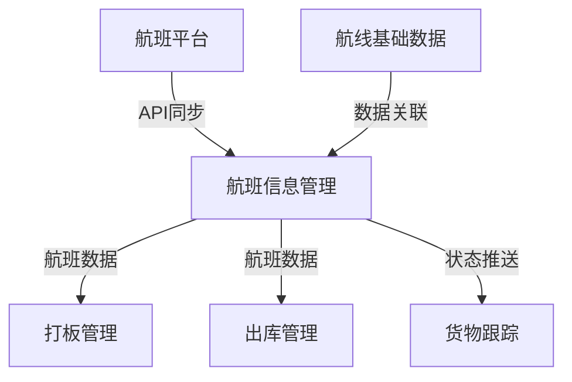

##### 3.1.6.4 数据一致性规则

| 数据项 | 一致性规则 | 触发条件 | 处理方式 |
|--------|------------|----------|----------|
| 航班状态 | 航班平台为准 | 定时同步 | 同步更新本地状态 |
| 航班时刻 | 航班平台为准 | 变更通知 | 同步更新计划时间 |
| 航班取消 | 航班平台为准 | 取消通知 | 同步标记取消，触发货物预警 |

#### 3.1.7 功能点详述

##### 3.1.7.1 功能点一：航班信息查询

**功能描述**：支持多条件查询航班信息，查看航班详情

**功能入口**：

| 入口位置 | 入口形式 | 入口文案 | 显示条件 |
|----------|----------|----------|----------|
| 左侧菜单 | 菜单项 | 航班信息管理 | 有查询权限 |
| 快捷搜索 | 搜索框 | 搜索航班号 | 始终显示 |

**业务规则**：

| 规则编号 | 规则名称 | 规则描述 | 优先级 |
|----------|----------|----------|--------|
| R1 | 默认日期范围 | 默认查询当天及未来7天的航班 | P0 |
| R2 | 状态过滤 | 可选择特定状态进行筛选 | P1 |
| R3 | 排序规则 | 默认按起飞时间升序排列 | P0 |

**操作逻辑**：

| 元素 | 类型 | 触发条件 | 行为描述 | 反馈方式 |
|------|------|----------|----------|----------|
| 查询按钮 | 按钮 | 点击 | 执行查询，刷新列表 | 列表更新 |
| 重置按钮 | 按钮 | 点击 | 清空筛选条件 | 条件重置 |
| 导出按钮 | 按钮 | 点击 | 导出查询结果 | 下载Excel |
| 查看详情 | 链接 | 点击 | 打开详情弹窗 | 弹窗显示 |

##### 3.1.7.2 功能点二：航班信息新增

**功能描述**：录入新的航班信息

**功能入口**：

| 入口位置 | 入口形式 | 入口文案 | 显示条件 |
|----------|----------|----------|----------|
| 列表页 | 按钮 | 新增航班 | 有新增权限 |

**表单字段**：

| 序号 | 字段名称 | 字段标识 | 控件类型 | 是否必填 | 验证规则 | 默认值 | 联动规则 |
|------|----------|----------|----------|----------|----------|--------|----------|
| 1 | 航班号 | flightNumber | 输入框 | 是 | 格式校验，唯一性校验 | - | - |
| 2 | 航线 | route | 选择框 | 是 | - | - | 选择后自动填充出发地、目的地 |
| 3 | 出发地 | departure | 文本 | 是 | 只读 | 根据航线 | - |
| 4 | 目的地 | destination | 文本 | 是 | 只读 | 根据航线 | - |
| 5 | 计划起飞时间 | planDepartureTime | 日期时间 | 是 | 必须大于当前时间 | - | - |
| 6 | 计划到达时间 | planArrivalTime | 日期时间 | 是 | 必须晚于起飞时间 | - | - |
| 7 | 机型 | aircraftType | 选择框 | 是 | - | - | - |
| 8 | 货舱容量 | cargoCapacity | 数字输入 | 否 | ≥0 | 0 | - |
| 9 | 最大载重 | maxPayload | 数字输入 | 否 | ≥0 | 0 | - |
| 10 | 板位数量 | palletCount | 数字输入 | 否 | ≥0 | 0 | - |
| 11 | 备注 | remark | 文本域 | 否 | 最长500字 | - | - |

#### 3.1.8 数据模型设计

##### 3.1.8.1 主实体：航班信息（flight_info）

**字段定义**：

| 序号 | 字段名称 | 字段标识 | 数据类型 | 长度 | 是否必填 | 默认值 | 验证规则 | 备注 |
|------|----------|----------|----------|------|----------|--------|----------|------|
| 1 | 主键ID | id | bigint | - | 是 | 自增 | 唯一 | 主键 |
| 2 | 航班号 | flight_number | varchar | 20 | 是 | - | 唯一，格式校验 | - |
| 3 | 航线代码 | route_code | varchar | 20 | 是 | - | 外键 | - |
| 4 | 出发地 | departure | varchar | 50 | 是 | - | - | - |
| 5 | 目的地 | destination | varchar | 50 | 是 | - | - | - |
| 6 | 计划起飞时间 | plan_departure_time | datetime | - | 是 | - | - | - |
| 7 | 计划到达时间 | plan_arrival_time | datetime | - | 是 | - | - | - |
| 8 | 实际起飞时间 | actual_departure_time | datetime | - | 否 | NULL | - | - |
| 9 | 实际到达时间 | actual_arrival_time | datetime | - | 否 | NULL | - | - |
| 10 | 机型 | aircraft_type | varchar | 20 | 是 | - | - | - |
| 11 | 货舱容量 | cargo_capacity | decimal | 10,2 | 否 | 0 | ≥0 | 单位：KG |
| 12 | 最大载重 | max_payload | decimal | 10,2 | 否 | 0 | ≥0 | 单位：KG |
| 13 | 板位数量 | pallet_count | int | - | 否 | 0 | ≥0 | - |
| 14 | 状态 | status | tinyint | - | 是 | 1 | 枚举值 | 1计划中 2已起飞 3已到达 4延误 5取消 |
| 15 | 延误原因 | delay_reason | varchar | 100 | 否 | NULL | - | - |
| 16 | 备注 | remark | varchar | 500 | 否 | NULL | - | - |
| 17 | 创建人 | create_by | bigint | - | 是 | - | 外键 | - |
| 18 | 创建时间 | create_time | datetime | - | 是 | 当前时间 | - | - |
| 19 | 更新人 | update_by | bigint | - | 否 | NULL | - | - |
| 20 | 更新时间 | update_time | datetime | - | 否 | NULL | - | - |
| 21 | 删除标记 | del_flag | tinyint | - | 是 | 0 | 0正常 1删除 | - |

##### 3.1.8.2 关联实体

| 实体名称 | 关联字段 | 关联类型 | 说明 |
|----------|----------|----------|------|
| 航线基础数据（route_base） | route_code | 多对一 | 航线信息关联 |
| 打板计划（pallet_plan） | flight_id | 一对多 | 一个航班可有多个打板计划 |
| 货物信息（cargo_info） | flight_id | 一对多 | 一个航班可关联多票货物 |

#### 3.1.9 UI界面设计

##### 3.1.9.1 页面布局结构

```
┌─────────────────────────────────────────────────────────────┐
│  航班信息管理                                                │
├─────────────────────────────────────────────────────────────┤
│  筛选条件区                                                   │
│  ┌──────────┐ ┌──────────┐ ┌──────────┐ ┌──────────┐         │
│  │ 航班号    │ │ 航线      │ │ 状态      │ │ 日期范围  │         │
│  └──────────┘ └──────────┘ └──────────┘ └──────────┘         │
│  [查询] [重置] [导出]                           [新增航班]    │
├─────────────────────────────────────────────────────────────┤
│  数据列表区                                                   │
│  ┌─────────────────────────────────────────────────────┐   │
│  │ 航班号 │ 航线   │ 计划起飞 │ 计划到达 │ 状态  │ 操作  │   │
│  ├────────┼────────┼──────────┼──────────┼───────┼───────┤   │
│  │ CA1234 │ PEK-LAX│ 10:00   │ 14:00   │ 计划中│ 编辑  │   │
│  │ CA1235 │ PEK-LHR│ 12:00   │ 18:00   │ 已起飞│ 编辑  │   │
│  └────────┴────────┴──────────┴──────────┴───────┴───────┘   │
│  共100条 [1] [2] [3] ... [10]                               │
└─────────────────────────────────────────────────────────────┘
```

##### 3.1.9.2 UI线框图

**主列表页面线框图**：
- 顶部：页面标题"航班信息管理"
- 筛选区：航班号输入框、航线下拉选择、状态下拉多选、日期范围选择器
- 操作按钮区：查询、重置、导出按钮（左侧），新增航班按钮（右侧）
- 数据表格：展示航班列表，包含航班号、航线、计划起飞、计划到达、状态、操作列
- 分页器：位于表格下方右侧

**新增/编辑表单对话框线框图**：
- 对话框标题：新增航班 / 编辑航班
- 表单区域：两列布局
  - 左列：航班号、航线、出发地、目的地、计划起飞时间
  - 右列：计划到达时间、机型、货舱容量、最大载重、板位数量
- 底部：备注（全宽）
- 底部按钮：取消、确定

**详情页抽屉（右侧）线框图**：
- 抽屉标题：航班详情
- 基础信息区：航班号、航线、出发地、目的地等
- 时间信息区：计划/实际起飞到达时间
- 状态信息区：当前状态、延误原因（如有）
- 关联信息区：已配板位、关联货物数量
- 操作日志区：状态变更历史记录

#### 3.1.10 边界与异常处理

##### 3.1.10.1 网络异常

| 场景 | 检测方式 | 处理方式 | 用户提示 |
|------|----------|----------|----------|
| 列表加载失败 | 请求超时或返回错误 | 重试3次后显示错误 | "网络异常，请检查网络后重试" |
| 保存失败 | 提交超时或返回错误 | 保留表单数据，提示重试 | "保存失败，请检查网络后重试" |
| 同步失败 | 航班平台API调用失败 | 记录失败日志，定时重试 | "航班数据同步失败，已记录待重试" |

##### 3.1.10.2 数据异常

| 场景 | 检测方式 | 处理方式 | 用户提示 |
|------|----------|----------|----------|
| 航班号重复 | 保存前唯一性校验 | 阻止保存，提示修改 | "航班号已存在，请更换" |
| 时间逻辑错误 | 表单提交前校验 | 阻止提交，高亮错误字段 | "到达时间必须晚于起飞时间" |
| 必填项为空 | 表单提交前校验 | 阻止提交，高亮必填项 | "请填写必填项" |

##### 3.1.10.3 权限异常

| 场景 | 检测方式 | 处理方式 | 用户提示 |
|------|----------|----------|----------|
| 无查询权限 | 页面加载时校验 | 跳转无权限页面 | "您没有权限访问此页面" |
| 无新增权限 | 按钮显示条件控制 | 隐藏按钮 | - |
| 无编辑权限 | 操作前校验 | 禁用编辑按钮 | "您没有编辑权限" |

##### 3.1.10.4 操作冲突

| 场景 | 检测方式 | 处理方式 | 用户提示 |
|------|----------|----------|----------|
| 数据被修改 | 保存前校验版本号 | 提示用户刷新查看最新数据 | "数据已被他人修改，请刷新后重试" |
| 航班已关联货物 | 删除前校验 | 阻止删除，提示先解除关联 | "该航班已关联货物，无法删除" |

##### 3.1.10.5 输入异常

| 场景 | 检测方式 | 处理方式 | 用户提示 |
|------|----------|----------|----------|
| 航班号格式错误 | 输入时正则校验 | 实时提示，阻止提交 | "航班号格式错误，应为2位字母+3-4位数字" |
| 数值超出范围 | 输入时校验 | 实时提示，自动修正 | "请输入有效的数值" |
| 特殊字符输入 | 输入时过滤 | 自动过滤或提示 | "不能包含特殊字符" |

#### 3.1.11 数据示例

##### 3.1.11.1 Mock数据

```javascript
const flightListData = [
  {
    id: 1001,
    flightNumber: "CA1234",
    route: "PEK-LAX",
    departure: "北京首都",
    destination: "洛杉矶",
    planDepartureTime: "2026-04-08 10:00:00",
    planArrivalTime: "2026-04-08 14:00:00",
    actualDepartureTime: null,
    actualArrivalTime: null,
    aircraftType: "B777-300ER",
    cargoCapacity: 50000.00,
    maxPayload: 45000.00,
    palletCount: 15,
    status: 1, // 计划中
    statusName: "计划中",
    delayReason: null,
    remark: "正常航班",
    loadedWeight: 12000.00,
    cargoCount: 45,
    createTime: "2026-04-01 09:00:00",
    updateTime: "2026-04-01 09:00:00"
  },
  {
    id: 1002,
    flightNumber: "CA1235",
    route: "PEK-LHR",
    departure: "北京首都",
    destination: "伦敦希思罗",
    planDepartureTime: "2026-04-08 12:00:00",
    planArrivalTime: "2026-04-08 18:00:00",
    actualDepartureTime: "2026-04-08 12:05:00",
    actualArrivalTime: null,
    aircraftType: "A350-900",
    cargoCapacity: 45000.00,
    maxPayload: 40000.00,
    palletCount: 12,
    status: 2, // 已起飞
    statusName: "已起飞",
    delayReason: null,
    remark: "准点起飞",
    loadedWeight: 28000.00,
    cargoCount: 68,
    createTime: "2026-04-01 10:00:00",
    updateTime: "2026-04-08 12:05:00"
  },
  {
    id: 1003,
    flightNumber: "CA1236",
    route: "PEK-NRT",
    departure: "北京首都",
    destination: "东京成田",
    planDepartureTime: "2026-04-08 08:30:00",
    planArrivalTime: "2026-04-08 12:30:00",
    actualDepartureTime: "2026-04-08 09:00:00",
    actualArrivalTime: "2026-04-08 13:00:00",
    aircraftType: "B737-800",
    cargoCapacity: 20000.00,
    maxPayload: 18000.00,
    palletCount: 6,
    status: 3, // 已到达
    statusName: "已到达",
    delayReason: "空中交通管制",
    remark: "延误30分钟",
    loadedWeight: 15000.00,
    cargoCount: 32,
    createTime: "2026-04-01 11:00:00",
    updateTime: "2026-04-08 13:00:00"
  },
  {
    id: 1004,
    flightNumber: "CA1237",
    route: "PEK-SIN",
    departure: "北京首都",
    destination: "新加坡",
    planDepartureTime: "2026-04-08 16:00:00",
    planArrivalTime: "2026-04-08 22:00:00",
    actualDepartureTime: null,
    actualArrivalTime: null,
    aircraftType: "A330-300",
    cargoCapacity: 40000.00,
    maxPayload: 35000.00,
    palletCount: 10,
    status: 4, // 延误
    statusName: "延误",
    delayReason: "机械故障",
    remark: "预计延误2小时",
    loadedWeight: 0,
    cargoCount: 0,
    createTime: "2026-04-01 12:00:00",
    updateTime: "2026-04-08 14:00:00"
  },
  {
    id: 1005,
    flightNumber: "CA1238",
    route: "PEK-FRA",
    departure: "北京首都",
    destination: "法兰克福",
    planDepartureTime: "2026-04-08 14:00:00",
    planArrivalTime: "2026-04-08 20:00:00",
    actualDepartureTime: null,
    actualArrivalTime: null,
    aircraftType: "B747-8F",
    cargoCapacity: 140000.00,
    maxPayload: 130000.00,
    palletCount: 39,
    status: 5, // 取消
    statusName: "已取消",
    delayReason: "天气原因",
    remark: "航班取消，货物转其他航班",
    loadedWeight: 0,
    cargoCount: 0,
    createTime: "2026-04-01 13:00:00",
    updateTime: "2026-04-08 10:00:00"
  }
];
```

#### 3.1.2 物料/货物管理

**功能描述**
- **功能名称**：物料/货物管理
- **功能目标**：维护货物类型、品名、规格、HS编码等基础资料
- **功能价值**：统一货物编码标准，支持海关申报和库存管理

**业务规则**

**输入规则：**
| 字段名 | 类型 | 必填 | 规则 | 错误提示 |
|--------|------|------|------|----------|
| 货物编码 | 字符串 | 是 | 唯一，格式规范 | 货物编码已存在或格式错误 |
| 货物名称 | 字符串 | 是 | 最长100字 | 请输入货物名称 |
| 货物类型 | 枚举 | 是 | 普货/危险品/冷链等 | 请选择货物类型 |
| HS编码 | 字符串 | 否 | 10位数字 | HS编码格式错误 |
| 计量单位 | 枚举 | 是 | 件/KG/立方米等 | 请选择计量单位 |
| 存储要求 | 字符串 | 否 | 常温/冷藏/冷冻/危险品 | 请选择存储要求 |
| 包装类型 | 枚举 | 否 | 纸箱/托盘/木箱/散货 | 请选择包装类型 |
| 危险品等级 | 枚举 | 条件必填 | 货物类型为危险品时必填 | 请选择危险品等级 |

**字段数据源：**
- HS编码：上游来自海关HS编码库
- 货物类型：系统预定义，可扩展
- 货物信息：下游用于预报、入库、报关

**业务逻辑：**
1. 货物编码必须唯一，支持自动生成
2. HS编码与海关编码库关联校验
3. 危险品等特殊货物需标注特殊存储要求
4. 支持货物信息Excel批量导入
5. 货物类型决定分拣路径和存储区域

**验收标准**
- [ ] 货物分类管理功能完整
- [ ] HS编码关联校验正常
- [ ] 支持批量导入
- [ ] 危险品标识明显

#### 3.1.2.1 角色权限设计

##### 3.1.2.2 角色权限矩阵

| 权限项 | 货站操作员 | 客服人员 | 管理人员 | 系统管理员 |
|--------|------------|----------|----------|------------|
| 货物信息查询 | ✅ | ✅ | ✅ | ✅ |
| 货物信息录入 | ❌ | ✅ | ❌ | ✅ |
| 货物信息编辑 | ❌ | ✅ | ❌ | ✅ |
| 货物信息删除 | ❌ | ❌ | ❌ | ✅ |
| 批量导入 | ❌ | ❌ | ❌ | ✅ |
| HS编码同步 | ❌ | ❌ | ❌ | ✅ |

##### 3.1.2.3 数据权限规则

| 角色 | 数据范围 | 说明 |
|------|----------|------|
| 货站操作员 | 全部货物数据 | 可查询货物信息用于业务操作 |
| 客服人员 | 全部货物数据 | 可管理货物基础资料 |
| 管理人员 | 全部货物数据 | 可查看货物统计报表 |
| 系统管理员 | 全部数据 | 可管理全部货物数据 |

#### 3.1.2.4 列表数据规范

##### 3.1.2.5 数据获取方式

| 属性 | 描述 |
|------|------|
| **数据来源** | 货物信息表（cargo_info） |
| **获取方式** | 实时查询，支持分页 |
| **分页方式** | 后端分页，每页默认20条 |
| **加载策略** | 首次加载全部货物数据 |

##### 3.1.2.6 列表字段定义

| 序号 | 字段名称 | 数据类型 | 显示格式 | 数据来源 | 是否必填 |
|------|----------|----------|----------|----------|----------|
| 1 | 货物编码 | string | 文本 | cargoCode | 是 |
| 2 | 货物名称 | string | 文本 | cargoName | 是 |
| 3 | 货物类型 | enum | 标签 | cargoType | 是 |
| 4 | HS编码 | string | 文本 | hsCode | 否 |
| 5 | 计量单位 | enum | 标签 | unit | 是 |
| 6 | 存储要求 | enum | 标签 | storageReq | 否 |
| 7 | 创建时间 | datetime | YYYY-MM-DD | createTime | 是 |
| 8 | 操作 | - | 按钮组 | - | - |

##### 3.1.2.7 筛选条件

| 序号 | 筛选字段 | 字段标识 | 控件类型 | 查询方式 | 默认值 |
|------|----------|----------|----------|----------|--------|
| 1 | 货物编码 | cargoCode | 输入框 | 模糊查询 | - |
| 2 | 货物名称 | cargoName | 输入框 | 模糊查询 | - |
| 3 | 货物类型 | cargoType | 多选框 | 多选匹配 | 全部 |
| 4 | HS编码 | hsCode | 输入框 | 模糊查询 | - |

---

#### 3.1.3 客户管理

**功能描述**
- **功能名称**：客户管理
- **功能目标**：维护货代、航空公司、收发货人等业务往来单位
- **功能价值**：统一管理客户信息，支持业务关联和信用控制

**业务规则**

**输入规则：**
| 字段名 | 类型 | 必填 | 规则 | 错误提示 |
|--------|------|------|------|----------|
| 客户编码 | 字符串 | 是 | 唯一 | 客户编码已存在 |
| 客户名称 | 字符串 | 是 | 最长100字 | 请输入客户名称 |
| 客户类型 | 枚举 | 是 | 货代/航司/收发货人等 | 请选择客户类型 |
| 信用额度 | 数字 | 否 | ≥0 | 请输入有效数值 |
| 联系人 | 字符串 | 是 | 最长50字 | 请输入联系人 |
| 联系电话 | 字符串 | 是 | 手机号格式 | 请输入正确手机号 |
| 结算方式 | 枚举 | 是 | 现结/月结/季结 | 请选择结算方式 |
| 开户银行 | 字符串 | 否 | - | 请输入开户银行 |
| 银行账号 | 字符串 | 否 | - | 请输入银行账号 |

**业务逻辑：**
1. 客户分级别管理：VIP/普通/潜在
2. 信用额度超限时系统预警
3. 客户信息变更记录留痕
4. 支持客户黑名单管理
5. 客户关联合同、订单、账单

**验收标准**
- [ ] 客户分级管理功能完整
- [ ] 信用额度控制有效
- [ ] 客户变更可追溯
- [ ] 黑名单功能正常

#### 3.1.3.1 角色权限设计

##### 3.1.3.2 角色权限矩阵

| 权限项 | 客服人员 | 销售人员 | 财务人员 | 系统管理员 |
|--------|----------|----------|----------|------------|
| 客户查询 | ✅ | ✅ | ✅ | ✅ |
| 客户录入 | ❌ | ✅ | ❌ | ✅ |
| 客户编辑 | ❌ | ✅ | ❌ | ✅ |
| 客户删除 | ❌ | ❌ | ❌ | ✅ |
| 信用额度设置 | ❌ | ❌ | ✅ | ✅ |
| 黑名单管理 | ❌ | ❌ | ❌ | ✅ |

##### 3.1.3.3 数据权限规则

| 角色 | 数据范围 | 说明 |
|------|----------|------|
| 客服人员 | 全部客户数据 | 可查询客户信息用于业务操作 |
| 销售人员 | 本人开发的客户 | 可管理自己开发的客户 |
| 财务人员 | 全部客户数据 | 可设置信用额度和查看账单 |
| 系统管理员 | 全部数据 | 可管理全部客户数据 |

#### 3.1.3.4 列表数据规范

##### 3.1.3.5 数据获取方式

| 属性 | 描述 |
|------|------|
| **数据来源** | 客户信息表（customer_info） |
| **获取方式** | 实时查询，支持分页 |
| **分页方式** | 后端分页，每页默认20条 |
| **加载策略** | 首次加载全部客户数据 |

##### 3.1.3.6 列表字段定义

| 序号 | 字段名称 | 数据类型 | 显示格式 | 数据来源 | 是否必填 |
|------|----------|----------|----------|----------|----------|
| 1 | 客户编码 | string | 文本 | customerCode | 是 |
| 2 | 客户名称 | string | 文本 | customerName | 是 |
| 3 | 客户类型 | enum | 标签 | customerType | 是 |
| 4 | 客户级别 | enum | 标签 | customerLevel | 是 |
| 5 | 信用额度 | number | ¥#,##0.00 | creditLimit | 否 |
| 6 | 已用额度 | number | ¥#,##0.00 | usedCredit | 否 |
| 7 | 状态 | enum | 标签 | status | 是 |
| 8 | 操作 | - | 按钮组 | - | - |

##### 3.1.3.7 筛选条件

| 序号 | 筛选字段 | 字段标识 | 控件类型 | 查询方式 | 默认值 |
|------|----------|----------|----------|----------|--------|
| 1 | 客户编码 | customerCode | 输入框 | 模糊查询 | - |
| 2 | 客户名称 | customerName | 输入框 | 模糊查询 | - |
| 3 | 客户类型 | customerType | 多选框 | 多选匹配 | 全部 |
| 4 | 客户级别 | customerLevel | 多选框 | 多选匹配 | 全部 |
| 5 | 状态 | status | 多选框 | 多选匹配 | 全部 |

---

#### 3.1.4 仓库基础设置 ⭐补充字段

**功能描述**
- **功能名称**：仓库基础设置
- **功能目标**：仓库、库区、库位、容器的创建与管理
- **功能价值**：建立标准化仓储结构，支持精细化库存管理

**业务规则**

**输入规则：**
| 字段名 | 类型 | 必填 | 规则 | 错误提示 |
|--------|------|------|------|----------|
| 仓库编码 | 字符串 | 是 | 唯一 | 仓库编码已存在 |
| 仓库名称 | 字符串 | 是 | 最长50字 | 请输入仓库名称 |
| 仓库类型 | 枚举 | 是 | 海关监管仓/普通仓/冷链仓 | 请选择仓库类型 |
| ERP逻辑仓编码 | 字符串 | 否 | 关联ERP系统 | 请输入ERP逻辑仓编码 |
| 库区编码 | 字符串 | 是 | 仓库内唯一 | 库区编码在该仓库已存在 |
| 库区类型 | 枚举 | 是 | 立体库区/平面库区/缓存区/查验区/异常区 | 请选择库区类型 |
| 库位编码 | 字符串 | 是 | 库区唯一 | 库位编码在该库区已存在 |
| 库位类型 | 枚举 | 是 | 立体库/平面库/缓存区/查验位/打板位 | 请选择库位类型 |
| 承重限制 | 数字 | 否 | ≥0，单位kg | 请输入有效数值 |
| 体积限制 | 数字 | 否 | ≥0，单位m³ | 请输入有效数值 |
| 货物类型限制 | 多选 | 否 | 普货/危险品/冷链等 | 请选择允许存储的货物类型 |
| 状态 | 枚举 | 是 | 空闲/占用/锁定/维修/禁用 | - |

**容器管理**⭐新增

| 字段名 | 类型 | 必填 | 规则 | 说明 |
|--------|------|------|------|------|
| 容器编码 | 字符串 | 是 | 唯一 | 托盘/航空板/ULD编号 |
| 容器类型 | 枚举 | 是 | 托盘/航空板/ULD/料箱 | 请选择容器类型 |
| 容器规格 | 字符串 | 是 | - | 尺寸、载重规格 |
| 所属航空公司 | 字符串 | 条件必填 | ULD类型必填 | 请选择所属航空公司 |
| 当前位置 | 字符串 | 是 | 库位编码 | 容器所在库位 |
| 状态 | 枚举 | 是 | 空闲/占用/维修/报废 | - |

**业务逻辑：**
1. 仓库结构：仓库→库区→库位→容器四级结构
2. 库位状态：空闲/占用/锁定/维修/禁用
3. 支持库位可视化展示（平面图）
4. 库位限制规则：重量、体积、货物类型限制
5. 容器全生命周期管理：采购→使用→维修→报废
6. ERP逻辑仓映射：支持与ERP系统仓库编码映射

**库位限制规则配置**⭐新增
```
规则类型：
- 重量限制：最大承重（kg）
- 体积限制：最大体积（m³）
- 货物类型限制：允许/禁止的货物类型
- 混放规则：是否允许不同批次混放
- 层高限制：最大堆叠层数
```

**验收标准**
- [ ] 仓库四级结构完整
- [ ] 库位可视化展示
- [ ] 库位限制规则生效
- [ ] 库位状态实时更新
- [ ] 容器管理功能完整

#### 3.1.5 资源管理 ⭐新增模块

**功能描述**
- **功能名称**：资源管理
- **功能目标**：管理人力、设备等作业资源
- **功能价值**：合理配置作业资源，提高作业效率

**人力资源**

| 字段名 | 类型 | 必填 | 说明 |
|--------|------|------|------|
| 人员编码 | 字符串 | 是 | 唯一标识 |
| 姓名 | 字符串 | 是 | - |
| 岗位 | 枚举 | 是 | 装卸工/叉车司机/理货员/查验员等 |
| 所属班组 | 字符串 | 是 | 关联班组信息 |
| 技能等级 | 枚举 | 否 | 初级/中级/高级 |
| 作业区域 | 多选 | 否 | 可作业的库区 |
| 状态 | 枚举 | 是 | 在职/离职/休假 |

**设备资源**

| 字段名 | 类型 | 必填 | 说明 |
|--------|------|------|------|
| 设备编码 | 字符串 | 是 | 唯一标识 |
| 设备名称 | 字符串 | 是 | - |
| 设备类型 | 枚举 | 是 | 叉车/堆高机/输送设备等 |
| 所属位置 | 字符串 | 是 | 所在库区 |
| 状态 | 枚举 | 是 | 正常/维修中/报废 |

**验收标准**
- [ ] 人力资源档案完整
- [ ] 设备资源台账清晰
- [ ] 资源与作业任务关联

#### 3.1.6 审批管理配置 ⭐新增模块

**功能描述**
- **功能名称**：审批管理配置
- **功能目标**：配置各类业务流程的审批流程
- **功能价值**：灵活配置审批流程，适应不同业务场景

**业务规则**

| 配置项 | 说明 |
|--------|------|
| 审批类型 | 入库审批/出库审批/费用调整/合同审批等 |
| 审批层级 | 一级/二级/多级审批 |
| 审批人 | 指定人员/角色/部门 |
| 审批条件 | 金额阈值/货物类型等条件分支 |
| 审批时限 | 每个节点的审批时限 |
| 委托审批 | 支持审批人委托他人审批 |

**验收标准**
- [ ] 审批流程可配置
- [ ] 支持条件分支
- [ ] 审批记录可追溯

---

#### 3.1.7 单据类型管理 ⭐新增
**功能描述**
- **功能名称**：单据类型管理
- **功能目标**：配置各类业务单据的编号规则和打印模板
- **功能价值**：单据管理标准化，打印格式统一，编号自动生成

**单据类型列表：**
| 单据编码 | 单据名称 | 编号规则示例 | 用途 |
|----------|----------|--------------|------|
| DJ001 | 入库单 | RK202404010001 | 货物入库凭证 |
| DJ002 | 出库单 | CK202404010001 | 货物出库凭证 |
| DJ003 | 移位单 | YW202404010001 | 库内移位凭证 |
| DJ004 | 盘点单 | PD202404010001 | 库存盘点凭证 |
| DJ005 | 上架单 | SJ202404010001 | 货物上架任务单 |
| DJ006 | 打板清单 | DB202404010001 | 打板作业清单 |
| DJ007 | 交接单 | JJ202404010001 | 货物交接凭证 |
| DJ008 | 查验单 | CY202404010001 | 海关查验记录单 |
| DJ009 | 提货单 | TH202404010001 | 客户提货凭证 |

**编号规则配置：**
| 配置项 | 选项 | 示例 |
|--------|------|------|
| 前缀 | 自定义2-4位字母 | RK、CK、YW |
| 日期格式 | YYYYMMDD/YYMMDD/YYYYMM | 20240401/240401/202404 |
| 流水位数 | 4位/6位/8位 | 0001/000001 |
| 重置周期 | 按日/按月/按年/不重置 | 每日从1开始 |
| 分隔符 | 无/-/· | RK-20240401-0001 |

**编号生成示例：**
```
配置：前缀RK + 日期YYYYMMDD + 4位流水 + 无分隔符
结果：RK202404010001、RK202404010002...

配置：前缀CK + 日期YYMMDD + 6位流水 + 分隔符-
结果：CK-240401-000001、CK-240401-000002...
```

**打印模板配置：**

**模板设计器功能：**
1. **画布设置**：A4/A5/自定义尺寸，横向/纵向
2. **字段拖拽**：从字段库拖拽到模板位置
3. **组件类型**：
   - 文本字段（单据号、日期、商品名等）
   - 表格（商品明细列表）
   - 图片（公司Logo、二维码、条形码）
   - 签名区（手写签名位置）

**模板元素配置：**
| 元素 | 配置项 |
|------|--------|
| 公司Logo | 上传图片、位置、大小 |
| 单据标题 | 字体、字号、对齐方式 |
| 基础信息 | 单据号、日期、部门等字段位置 |
| 商品明细 | 表格列定义（品名、规格、数量、单位） |
| 合计区 | 数量合计、金额合计、大写金额 |
| 签章区 | 制单人、审核人、收货人签名位置 |
| 二维码 | 类型（QR/条形码）、内容、位置 |
| 打印设置 | 边距、页眉页脚、水印 |

**多联打印配置：**
| 联次 | 名称 | 用途 | 颜色标识 |
|------|------|------|----------|
| 第一联 | 存根联 | 发货方留存 | 白色 |
| 第二联 | 客户联 | 交给客户 | 红色 |
| 第三联 | 财务联 | 财务记账 | 黄色 |
| 第四联 | 仓库联 | 仓库留存 | 蓝色 |

**打印触发方式：**
1. **自动打印**：单据审核通过后自动打印
2. **手动打印**：用户点击打印按钮
3. **批量打印**：选择多张单据批量打印
4. **补打**：已打印单据再次打印（标记"补打"字样）

**历史版本管理：**
1. 模板修改保存为新版本
2. 历史版本可恢复
3. 每个单据显示使用的模板版本
4. 模板变更不影响已生成单据的打印

**验收标准**
- [ ] 支持10+种单据类型配置
- [ ] 编号唯一性保障，无重复
- [ ] 打印模板可视化设计器可用
- [ ] 支持多联打印，联次可配置
- [ ] 支持批量打印，100单批量打印时间<30秒
- [ ] 支持补打标记，防止重复

---

**【P2级内容补充完成】**

补充模块：
- ✅ 3.25 跨境电商业务管理（9610/9710/9810详细设计）
- ✅ 3.26 区区联动管理（航空港-联运区-综保区联动）
- ✅ 3.27 单据类型管理（编号规则、打印模板）

---

### 3.2 智能卡口控制

#### 3.2.1 功能描述
- **功能名称**：智能卡口控制
- **功能目标**：实现车辆自动识别、自动称重、自动验核，提升卡口通行效率
- **功能价值**：减少人工干预，通关效率提升50%，24小时不间断运行

#### 3.2.2 业务流程
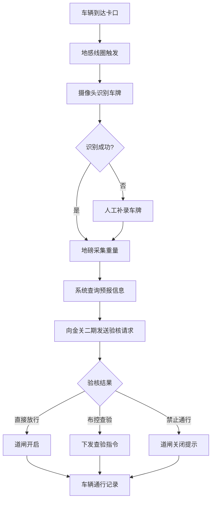

#### 3.2.3 业务规则

**输入规则：**
| 字段名 | 类型 | 必填 | 规则 | 错误提示 |
|--------|------|------|------|----------|
| 车牌号 | 字符串 | 是 | 符合车牌格式规范 | 请输入正确的车牌号 |
| 车辆类型 | 枚举 | 是 | 集卡/厢货/其他 | 请选择车辆类型 |
| 毛重 | 数字 | 是 | 0-100000(kg) | 重量超出范围 |
| 预约单号 | 字符串 | 否 | 关联预约单 | 预约单号不存在 |

**字段数据源：**
- 车牌号：摄像头自动识别或人工补录，上游来自车辆预约系统
- 车辆类型：系统根据车牌匹配或人工选择
- 毛重：地磅设备自动采集
- 预约单号：系统根据车牌关联，上游来自车辆预约系统
- 验核结果：下游发送至金关二期，接收回执后更新

**业务逻辑：**
1. 车牌识别成功率需≥95%，识别失败时允许人工补录
2. 重量与预报重量差异超过±5%时触发预警
3. 布控车辆自动拦截，道闸不开启
4. 通行记录实时保存，包含时间、车牌、重量、结果

**状态流转：**
| 当前状态 | 操作 | 下一状态 | 条件 |
|----------|------|----------|------|
| 待验核 | 验核通过 | 已放行 | 金关回执放行 |
| 待验核 | 布控查验 | 待查验 | 金关回执布控 |
| 待验核 | 禁止通行 | 已拦截 | 金关回执禁止 |
| 待查验 | 查验完成 | 已放行 | 查验结果正常 |

**权限模型：**
- 可见角色：货站操作员、调度人员、系统管理员
- 可操作角色：货站操作员（人工补录、异常处理）
- 数据权限：全部可见

**异常处理：**
- 网络异常：提示"网络连接异常，请检查网络后重试"，保留当前操作状态
- 接口超时：提示"海关接口响应超时，请稍后重试"，记录超时日志
- 设备故障：提示"设备连接异常，请检查设备状态"，切换至手动模式
- 重复提交：防止重复提交，按钮置灰并显示"处理中"
- 数据不存在：提示"未找到该车辆预约信息，请先完成预约"

#### 3.2.4 验收标准

**功能验收：**
- [ ] 车牌识别准确率≥95%
- [ ] 系统响应时间<2秒
- [ ] 与金关二期接口对接成功
- [ ] 通行记录完整保存

#### 3.2.5 角色权限设计

##### 3.2.5.1 角色权限矩阵

| 权限项 | 货站操作员 | 调度人员 | 海关关员 | 系统管理员 |
|--------|------------|----------|----------|------------|
| 卡口监控查看 | ✅ | ✅ | ✅ | ✅ |
| 人工补录车牌 | ✅ | ✅ | ❌ | ✅ |
| 强制开闸 | ❌ | ✅ | ❌ | ✅ |
| 异常处理 | ✅ | ✅ | ❌ | ✅ |
| 卡口配置 | ❌ | ❌ | ❌ | ✅ |
| 通行记录查询 | ✅ | ✅ | ✅ | ✅ |

##### 3.2.5.2 数据权限规则

| 角色 | 数据范围 | 说明 |
|------|----------|------|
| 货站操作员 | 全部卡口数据 | 可查看和操作所有卡口通行记录 |
| 调度人员 | 全部卡口数据 | 可监控卡口状态，进行调度操作 |
| 海关关员 | 全部卡口数据 | 可查看卡口通行情况，用于监管 |
| 系统管理员 | 全部数据 | 可管理卡口配置和全部数据 |

#### 3.2.6 列表数据规范

##### 3.2.6.1 数据获取方式

| 属性 | 描述 |
|------|------|
| **数据来源** | 卡口通行记录表（gate_pass_record） |
| **获取方式** | 实时查询，支持分页 |
| **分页方式** | 后端分页，每页默认20条 |
| **加载策略** | 默认加载当天的通行记录 |

##### 3.2.6.2 列表字段定义

| 序号 | 字段名称 | 数据类型 | 显示格式 | 数据来源 | 是否必填 |
|------|----------|----------|----------|----------|----------|
| 1 | 通行时间 | datetime | HH:mm:ss | passTime | 是 |
| 2 | 车牌号 | string | 文本 | plateNumber | 是 |
| 3 | 车辆类型 | enum | 标签 | vehicleType | 是 |
| 4 | 毛重 | number | #,##0 KG | grossWeight | 是 |
| 5 | 验核结果 | enum | 标签 | checkResult | 是 |
| 6 | 查验类型 | enum | 标签 | inspectType | 否 |
| 7 | 操作员 | string | 文本 | operatorName | 是 |
| 8 | 操作 | - | 按钮组 | - | - |

##### 3.2.6.3 筛选条件

| 序号 | 筛选字段 | 字段标识 | 控件类型 | 查询方式 | 默认值 |
|------|----------|----------|----------|----------|--------|
| 1 | 车牌号 | plateNumber | 输入框 | 模糊查询 | - |
| 2 | 验核结果 | checkResult | 多选框 | 多选匹配 | 全部 |
| 3 | 日期范围 | passDate | 日期范围 | 区间查询 | 今天 |
| 4 | 车辆类型 | vehicleType | 多选框 | 多选匹配 | 全部 |

#### 3.2.7 数据模型设计

##### 3.2.7.1 主实体：卡口通行记录（gate_pass_record）

| 序号 | 字段名称 | 字段标识 | 数据类型 | 长度 | 是否必填 | 默认值 | 备注 |
|------|----------|----------|----------|------|----------|--------|------|
| 1 | 主键ID | id | bigint | - | 是 | 自增 | 主键 |
| 2 | 车牌号 | plate_number | varchar | 20 | 是 | - | - |
| 3 | 车辆类型 | vehicle_type | tinyint | - | 是 | - | 1集卡 2厢货 3其他 |
| 4 | 毛重 | gross_weight | decimal | 10,2 | 是 | 0 | 单位：KG |
| 5 | 皮重 | tare_weight | decimal | 10,2 | 否 | 0 | 单位：KG |
| 6 | 净重 | net_weight | decimal | 10,2 | 否 | 0 | 单位：KG |
| 7 | 验核结果 | check_result | tinyint | - | 是 | - | 1放行 2布控 3禁止 |
| 8 | 查验类型 | inspect_type | tinyint | - | 否 | NULL | 1机检 2人工查验 |
| 9 | 通行方向 | pass_direction | tinyint | - | 是 | - | 1入场 2出场 |
| 10 | 通行时间 | pass_time | datetime | - | 是 | - | - |
| 11 | 设备编号 | device_code | varchar | 50 | 否 | NULL | - |
| 12 | 图片URL | image_url | varchar | 500 | 否 | NULL | - |
| 13 | 操作员ID | operator_id | bigint | - | 否 | NULL | - |
| 14 | 创建时间 | create_time | datetime | - | 是 | 当前时间 | - |
| 15 | 删除标记 | del_flag | tinyint | - | 是 | 0 | 0正常 1删除 |

---

### 3.3 查验预警处置

#### 3.3.1 功能描述
- **功能名称**：查验预警处置
- **功能目标**：实现查验指令实时接收、查验作业便捷执行、异常处置标准化
- **功能价值**：查验效率提升40%，异常处置规范化，合规风险降低

#### 3.3.2 业务流程
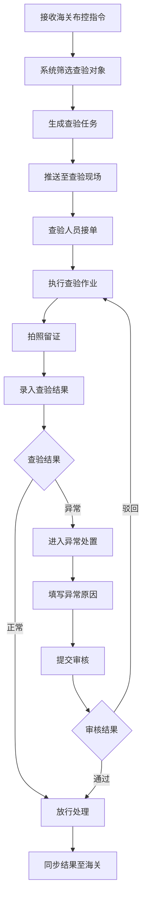

#### 3.3.3 业务规则

**输入规则：**
| 字段名 | 类型 | 必填 | 规则 | 错误提示 |
|--------|------|------|------|----------|
| 查验结果 | 枚举 | 是 | 正常/异常 | 请选择查验结果 |
| 异常原因 | 字符串 | 条件必填 | 结果异常时必填，最长500字 | 请输入异常原因 |
| 查验照片 | 图片数组 | 是 | 至少1张，最多9张 | 请上传查验照片 |
| 备注说明 | 字符串 | 否 | 最长200字 | - |
| 处置方式 | 枚举 | 条件必填 | 结果异常时必填 | 请选择处置方式 |

**处置方式选项：**
- 退运出境
- 转关运输
- 改单申报
- 补税放行
- 移交缉私
- 销毁处理

**字段数据源：**
- 布控指令：上游来自金关二期
- 查验对象信息：上游来自货物预报、库存数据
- 查验结果：下游同步至金关二期、库存系统

**业务逻辑：**
1. 布控指令3秒内推送至查验现场
2. 查验作业必须在2小时内完成（普通）/30分钟内完成（加急）
3. 查验结果必须拍照留证，至少1张照片
4. 异常情况需填写原因并提交审核
5. 支持查验直放模式：查验合格后直接放行出库，不入库

**状态流转：**
| 当前状态 | 操作 | 下一状态 | 条件 |
|----------|------|----------|------|
| 待查验 | 接单 | 查验中 | 查验人员确认接单 |
| 查验中 | 提交结果 | 待审核 | 结果为异常 |
| 查验中 | 提交结果 | 已完成 | 结果为正常 |
| 待审核 | 审核通过 | 已完成 | 审核人确认 |
| 待审核 | 审核驳回 | 查验中 | 需重新查验 |

**权限模型：**
- 可见角色：海关关员、货站操作员、系统管理员
- 可操作角色：海关关员（查验执行、结果录入、异常审核）
- 数据权限：本关区可见

#### 3.3.4 验收标准

**功能验收：**
- [ ] 指令推送实时性<3秒
- [ ] 查验记录完整率100%
- [ ] 异常处置符合海关规范
- [ ] 与金关二期数据同步成功

#### 3.3.5 角色权限设计

##### 3.3.5.1 角色权限矩阵

| 权限项 | 货站操作员 | 调度人员 | 海关关员 | 系统管理员 |
|--------|------------|----------|----------|------------|
| 查验指令查看 | ✅ | ✅ | ✅ | ✅ |
| 查验执行 | ✅ | ❌ | ❌ | ✅ |
| 查验结果录入 | ✅ | ❌ | ✅ | ✅ |
| 异常处置申请 | ✅ | ❌ | ❌ | ✅ |
| 异常处置审批 | ❌ | ❌ | ✅ | ✅ |
| 查验记录查询 | ✅ | ✅ | ✅ | ✅ |

##### 3.3.5.2 数据权限规则

| 角色 | 数据范围 | 说明 |
|------|----------|------|
| 货站操作员 | 本人执行的查验任务 | 只能查看和操作自己执行的查验记录 |
| 调度人员 | 全部查验数据 | 可查看查验进度和统计数据 |
| 海关关员 | 全部查验数据 | 可查看和审核全部查验记录 |
| 系统管理员 | 全部数据 | 可管理全部查验数据 |

#### 3.3.6 列表数据规范

##### 3.3.6.1 数据获取方式

| 属性 | 描述 |
|------|------|
| **数据来源** | 查验记录表（inspect_record） |
| **获取方式** | 实时查询，支持分页 |
| **分页方式** | 后端分页，每页默认20条 |
| **加载策略** | 默认加载待查验和查验中的任务 |

##### 3.3.6.2 列表字段定义

| 序号 | 字段名称 | 数据类型 | 显示格式 | 数据来源 | 是否必填 |
|------|----------|----------|----------|----------|----------|
| 1 | 查验编号 | string | 文本 | inspectNo | 是 |
| 2 | 运单号 | string | 文本 | waybillNo | 是 |
| 3 | 查验类型 | enum | 标签 | inspectType | 是 |
| 4 | 状态 | enum | 标签 | status | 是 |
| 5 | 下达时间 | datetime | MM-DD HH:mm | issueTime | 是 |
| 6 | 执行人 | string | 文本 | executorName | 否 |
| 7 | 完成时间 | datetime | MM-DD HH:mm | completeTime | 否 |
| 8 | 查验结果 | enum | 标签 | result | 否 |
| 9 | 操作 | - | 按钮组 | - | - |

##### 3.3.6.3 筛选条件

| 序号 | 筛选字段 | 字段标识 | 控件类型 | 查询方式 | 默认值 |
|------|----------|----------|----------|----------|--------|
| 1 | 运单号 | waybillNo | 输入框 | 模糊查询 | - |
| 2 | 查验类型 | inspectType | 多选框 | 多选匹配 | 全部 |
| 3 | 状态 | status | 多选框 | 多选匹配 | 待查验,查验中 |
| 4 | 日期范围 | inspectDate | 日期范围 | 区间查询 | 近7天 |

#### 3.3.7 数据模型设计

##### 3.3.7.1 主实体：查验记录（inspect_record）

| 序号 | 字段名称 | 字段标识 | 数据类型 | 长度 | 是否必填 | 默认值 | 备注 |
|------|----------|----------|----------|------|----------|--------|------|
| 1 | 主键ID | id | bigint | - | 是 | 自增 | 主键 |
| 2 | 查验编号 | inspect_no | varchar | 32 | 是 | - | 唯一 |
| 3 | 运单号 | waybill_no | varchar | 32 | 是 | - | - |
| 4 | 查验类型 | inspect_type | tinyint | - | 是 | - | 1机检 2人工 |
| 5 | 状态 | status | tinyint | - | 是 | 1 | 1待查验 2查验中 3已完成 |
| 6 | 下达时间 | issue_time | datetime | - | 是 | - | - |
| 7 | 执行人ID | executor_id | bigint | - | 否 | NULL | - |
| 8 | 开始时间 | start_time | datetime | - | 否 | NULL | - |
| 9 | 完成时间 | complete_time | datetime | - | 否 | NULL | - |
| 10 | 查验结果 | result | tinyint | - | 否 | NULL | 1通过 2不通过 |
| 11 | 异常说明 | abnormal_desc | varchar | 500 | 否 | NULL | - |
| 12 | 图片URL | image_urls | text | - | 否 | NULL | JSON数组 |
| 13 | 创建时间 | create_time | datetime | - | 是 | 当前时间 | - |
| 14 | 删除标记 | del_flag | tinyint | - | 是 | 0 | 0正常 1删除 |

---

### 3.4 货物预报管理

#### 3.4.1 货物预报录入

**功能描述**
- **功能名称**：货物预报录入
- **功能目标**：支持提前录入货物信息，实现通关前置化处理
- **功能价值**：压缩通关时效30%，减少现场录入等待

**业务流程**
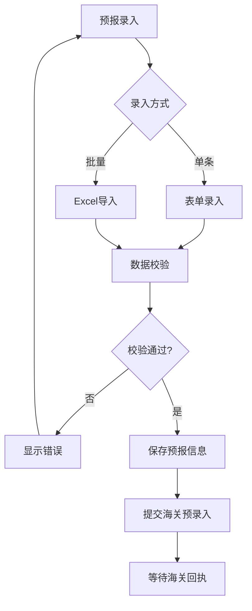

**业务规则**

**输入规则：**
| 字段名 | 类型 | 必填 | 规则 | 错误提示 |
|--------|------|------|------|----------|
| 预报单号 | 字符串 | 是 | 系统生成，唯一 | - |
| 运单号 | 字符串 | 是 | 最长20位 | 请输入运单号 |
| 主单号 | 字符串 | 是 | 11位数字 | 请输入正确的主单号 |
| 分单号 | 字符串 | 否 | - | - |
| 货物品名 | 字符串 | 是 | 最长200字 | 请输入货物品名 |
| 货物件数 | 整数 | 是 | >0 | 件数必须大于0 |
| 货物重量 | 数字 | 是 | ≥0，2位小数 | 请输入有效重量 |
| 收发货人 | 字符串 | 是 | 关联客户档案 | 请选择收发货人 |
| HS编码 | 字符串 | 否 | 10位数字 | HS编码格式错误 |
| 安检申报 | 布尔 | 是 | - | 请选择是否已安检 |

**字段数据源：**
- 收发货人：上游来自客户管理
- HS编码：上游来自海关HS编码库
- 货物信息：下游用于海关申报、入库收货

**业务逻辑：**
1. 预报信息包括：货物信息、运输信息、申报信息
2. 支持单条录入和Excel批量导入（最多1000条）
3. 数据校验包括：格式校验、逻辑校验、关联校验
4. 预录入提交后等待海关回执（通过/退单/待审）

**状态流转：**
| 当前状态 | 操作 | 下一状态 | 条件 |
|----------|------|----------|------|
| 待提交 | 提交海关 | 审核中 | 提交预录入 |
| 审核中 | 收到回执 | 已通过 | 海关审核通过 |
| 审核中 | 收到回执 | 已退单 | 海关退单 |
| 已退单 | 修改重提 | 审核中 | 修改后重新提交 |

#### 3.4.2 安检系统对接 ⭐新增

**功能描述**
- **功能名称**：安检系统对接
- **功能目标**：与机场、海关安检系统对接，前置申报货物信息，接收安检结果
- **功能价值**：提前完成安检，加快通关速度

**业务流程**
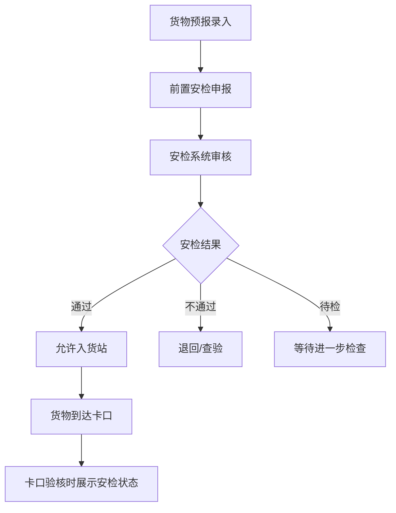

**业务规则**

| 字段名 | 类型 | 必填 | 说明 |
|--------|------|------|------|
| 安检单号 | 字符串 | 是 | 安检系统返回的唯一编号 |
| 安检状态 | 枚举 | 是 | 待检/通过/不通过/需开箱 |
| 安检时间 | 日期时间 | 否 | 安检完成时间 |
| 安检图像 | 文件 | 否 | X光扫描图像 |
| 安检结论 | 字符串 | 否 | 安检详细结论 |

**业务逻辑：**
1. 货物预报录入后自动向安检系统申报
2. 安检结果实时接收并更新货物状态
3. 安检不通过的货物禁止入货站或转入查验区
4. 卡口验核时校验安检状态，未安检或安检不通过自动拦截

**接口清单：**
- 安检申报接口：向安检系统发送货物信息
- 安检结果接收接口：接收安检系统返回的结果

**验收标准**
- [ ] 安检申报自动发送
- [ ] 安检结果实时接收
- [ ] 安检状态与卡口联动
- [ ] 安检图像可查

#### 3.4.3 角色权限设计

##### 3.4.3.1 角色权限矩阵

| 权限项 | 货站操作员 | 调度人员 | 海关关员 | 系统管理员 |
|--------|------------|----------|----------|------------|
| 预报信息查询 | ✅ | ✅ | ✅ | ✅ |
| 预报信息录入 | ✅ | ✅ | ❌ | ✅ |
| 预报信息编辑 | ✅ | ✅ | ❌ | ✅ |
| 预报信息审核 | ❌ | ✅ | ❌ | ✅ |
| 预报信息删除 | ❌ | ❌ | ❌ | ✅ |
| 安检状态查看 | ✅ | ✅ | ✅ | ✅ |

##### 3.4.3.2 数据权限规则

| 角色 | 数据范围 | 说明 |
|------|----------|------|
| 货站操作员 | 本人录入的预报数据 | 可管理自己录入的预报信息 |
| 调度人员 | 全部预报数据 | 可审核和管理全部预报信息 |
| 海关关员 | 全部预报数据 | 可查看预报信息用于监管 |
| 系统管理员 | 全部数据 | 可管理全部预报数据 |

#### 3.4.4 列表数据规范

##### 3.4.4.1 数据获取方式

| 属性 | 描述 |
|------|------|
| **数据来源** | 货物预报表（cargo_forecast） |
| **获取方式** | 实时查询，支持分页 |
| **分页方式** | 后端分页，每页默认20条 |
| **加载策略** | 默认加载近7天的预报数据 |

##### 3.4.4.2 列表字段定义

| 序号 | 字段名称 | 数据类型 | 显示格式 | 数据来源 | 是否必填 |
|------|----------|----------|----------|----------|----------|
| 1 | 预报编号 | string | 文本 | forecastNo | 是 |
| 2 | 运单号 | string | 文本 | waybillNo | 是 |
| 3 | 件数 | number | #,##0 | pieceCount | 是 |
| 4 | 重量 | number | #,##0.00 KG | weight | 是 |
| 5 | 货物品名 | string | 文本 | cargoName | 是 |
| 6 | 安检状态 | enum | 标签 | securityStatus | 是 |
| 7 | 预报时间 | datetime | MM-DD HH:mm | forecastTime | 是 |
| 8 | 操作 | - | 按钮组 | - | - |

##### 3.4.4.3 筛选条件

| 序号 | 筛选字段 | 字段标识 | 控件类型 | 查询方式 | 默认值 |
|------|----------|----------|----------|----------|--------|
| 1 | 运单号 | waybillNo | 输入框 | 模糊查询 | - |
| 2 | 安检状态 | securityStatus | 多选框 | 多选匹配 | 全部 |
| 3 | 日期范围 | forecastDate | 日期范围 | 区间查询 | 近7天 |

---

### 3.5 监管仓管理

#### 3.5.1 入库管理

**功能描述**
- **功能名称**：入库管理
- **功能目标**：实现货物从预报到上架入库的全流程数字化管理
- **功能价值**：入库效率提升30%，库存准确率≥99.9%

**业务流程**
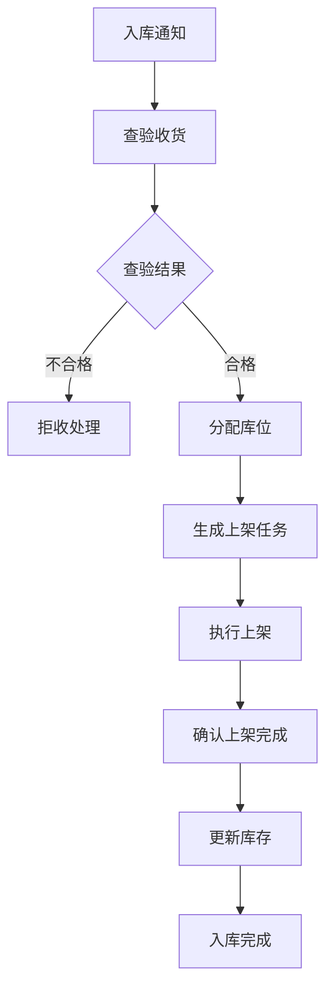

**业务规则**

**输入规则：**
| 字段名 | 类型 | 必填 | 规则 | 错误提示 |
|--------|------|------|------|----------|
| 运单号 | 字符串 | 是 | 最长20位 | 请输入运单号 |
| 货物件数 | 整数 | 是 | >0 | 件数必须大于0 |
| 货物重量 | 数字 | 是 | ≥0，2位小数 | 请输入有效重量 |
| 存放库位 | 字符串 | 条件必填 | 上架后必填 | 请选择存放库位 |
| 使用容器 | 字符串 | 否 | 容器编码 | 请选择使用的托盘/ULD |

**字段数据源：**
- 入库通知：上游来自订单管理、货物预报
- 运单信息：上游来自航空运单系统
- 库位信息：上游来自仓库基础设置
- 库存数据：下游更新至库存中心

**业务逻辑：**
1. 入库前必须完成海关放行
2. 系统根据货物类型、重量、航班自动推荐库位
3. 上架完成后实时更新库存
4. 支持PDA扫码作业
5. 入库货物自动触发分拣线入库流程

**状态流转：**
| 当前状态 | 操作 | 下一状态 | 条件 |
|----------|------|----------|------|
| 待收货 | 收货确认 | 待上架 | 查验合格 |
| 待收货 | 拒收 | 已拒收 | 查验不合格 |
| 待上架 | 上架完成 | 已入库 | 确认上架 |
| 待上架 | 取消 | 已取消 | 特殊情况 |

#### 3.5.2 库内管理

**功能描述**
- **功能名称**：库内管理
- **功能目标**：管理库存查询、移位、盘点等库内作业
- **功能价值**：库存准确率≥99.9%，库内作业效率提升

**库存查询**

**业务规则**

**输入规则：**
| 字段名 | 类型 | 必填 | 规则 | 说明 |
|--------|------|------|------|------|
| 查询条件 | 多选 | 否 | 运单号/库位/客户等 | 支持多维度组合查询 |
| 库存状态 | 枚举 | 否 | 全部/正常/锁定等 | 筛选特定状态库存 |

**功能说明：**
1. 支持多维度库存查询：按运单、货主、库位、货物类型等
2. 库存明细展示：当前数量、锁定数量、可用数量
3. 库存日志查询：入库、出库、移位等所有变动记录
4. 库存预警：低库存、超储、临期预警
5. 二维码查询：扫描货物二维码快速查询库存信息

**移位管理**

**业务流程**
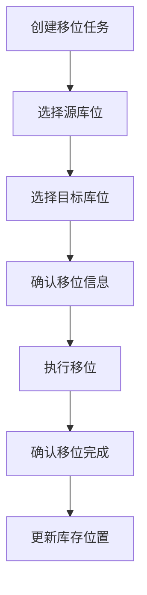

**业务规则：**
1. 移位前需确认目标库位可用
2. 支持PDA扫码执行移位
3. 移位过程库存状态为"移位中"
4. 移位完成后更新库位状态

**盘点管理**

**业务流程**
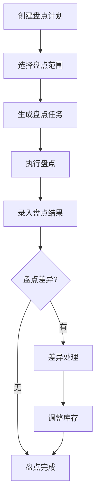

**业务规则：**
1. 支持周期盘点、动碰盘点、全面盘点
2. 盘点差异自动生成差异报告
3. 差异调整需审批后方可执行
4. 盘点记录完整留痕

#### 3.5.3 出库管理

**功能描述**
- **功能名称**：出库管理
- **功能目标**：管理货物打板、出库、装机确认等出库流程
- **功能价值**：出库效率提升，确保航班准时装载

**打板作业**

**业务流程**
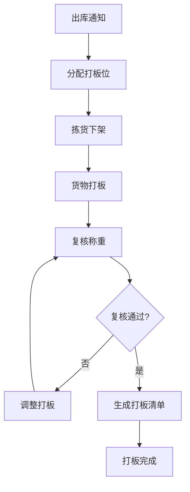

**业务规则**

**输入规则：**
| 字段名 | 类型 | 必填 | 规则 | 错误提示 |
|--------|------|------|------|----------|
| 航班号 | 字符串 | 是 | 关联航班信息 | 请选择航班 |
| 板号 | 字符串 | 是 | 唯一 | 请输入板号 |
| 货物件数 | 整数 | 是 | >0 | 请输入件数 |
| 打板重量 | 数字 | 是 | ≥0 | 请输入重量 |
| 目的港 | 字符串 | 是 | - | 请输入目的港 |
| 打板位 | 字符串 | 是 | 分配的打板位 | 请选择打板位 |

**业务逻辑：**
1. 打板方案智能推荐（按目的港、货物类型）
2. 打板重量体积实时校验（不超航班限额）
3. 打板清单包含：板号、货物明细、重量、体积
4. 支持打板拆板和合并
5. 打板位资源统一调度分配

**出库确认**

**业务流程**
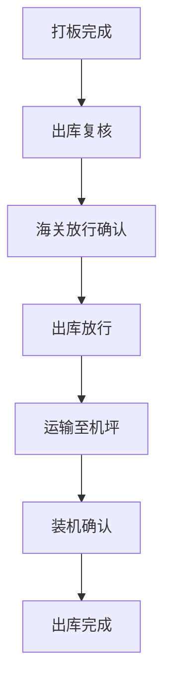

**业务规则：**
1. 出库前必须完成海关放行确认
2. 出库复核核对货物、件数、重量
3. 装机确认后更新航班装载信息
4. 出库完成扣减库存

**验收标准**
- [ ] 入库上架准确率≥99.9%
- [ ] 库存数据实时更新
- [ ] 出库复核准确率100%
- [ ] 库内作业效率提升≥25%

#### 3.5.4 角色权限设计

##### 3.5.4.1 角色权限矩阵

| 权限项 | 货站操作员 | 仓库管理员 | 调度人员 | 海关关员 | 系统管理员 |
|--------|------------|------------|----------|----------|------------|
| 入库作业 | ✅ | ✅ | ❌ | ❌ | ✅ |
| 库内作业 | ✅ | ✅ | ❌ | ❌ | ✅ |
| 出库作业 | ✅ | ✅ | ❌ | ❌ | ✅ |
| 库存查询 | ✅ | ✅ | ✅ | ✅ | ✅ |
| 库存调整 | ❌ | ✅ | ❌ | ❌ | ✅ |
| 盘点管理 | ❌ | ✅ | ❌ | ❌ | ✅ |
| 库位配置 | ❌ | ✅ | ❌ | ❌ | ✅ |
| 打板管理 | ❌ | ✅ | ✅ | ❌ | ✅ |

##### 3.5.4.2 数据权限规则

| 角色 | 数据范围 | 说明 |
|------|----------|------|
| 货站操作员 | 本人负责的库区 | 可操作自己负责库区的货物 |
| 仓库管理员 | 全部仓库数据 | 可管理全部仓储数据和配置 |
| 调度人员 | 全部库存数据 | 可查看库存用于调度决策 |
| 海关关员 | 全部库存数据 | 可查看库存用于监管 |
| 系统管理员 | 全部数据 | 可管理全部仓储数据 |

#### 3.5.5 列表数据规范

##### 3.5.5.1 数据获取方式

| 属性 | 描述 |
|------|------|
| **数据来源** | 库存表（inventory）、入库记录表（inbound_record）、出库记录表（outbound_record） |
| **获取方式** | 实时查询，支持分页 |
| **分页方式** | 后端分页，每页默认20条 |
| **加载策略** | 默认加载当前库存数据 |

##### 3.5.5.2 列表字段定义（库存查询）

| 序号 | 字段名称 | 数据类型 | 显示格式 | 数据来源 | 是否必填 |
|------|----------|----------|----------|----------|----------|
| 1 | 运单号 | string | 文本 | waybillNo | 是 |
| 2 | 货物名称 | string | 文本 | cargoName | 是 |
| 3 | 库位 | string | 文本 | location | 是 |
| 4 | 件数 | number | #,##0 | pieceCount | 是 |
| 5 | 重量 | number | #,##0.00 KG | weight | 是 |
| 6 | 入库时间 | datetime | MM-DD HH:mm | inboundTime | 是 |
| 7 | 状态 | enum | 标签 | status | 是 |
| 8 | 操作 | - | 按钮组 | - | - |

##### 3.5.5.3 筛选条件

| 序号 | 筛选字段 | 字段标识 | 控件类型 | 查询方式 | 默认值 |
|------|----------|----------|----------|----------|--------|
| 1 | 运单号 | waybillNo | 输入框 | 模糊查询 | - |
| 2 | 货物名称 | cargoName | 输入框 | 模糊查询 | - |
| 3 | 库位 | location | 输入框 | 模糊查询 | - |
| 4 | 状态 | status | 多选框 | 多选匹配 | 全部 |
| 5 | 入库日期 | inboundDate | 日期范围 | 区间查询 | 近30天 |

---

### 3.6 货包机集货跟踪

#### 3.6.1 空运集货跟踪

**功能描述**
- **功能名称**：空运集货跟踪
- **功能目标**：实时监控包机航班动态，管理空运单据
- **功能价值**：确保空运货物准时到达，及时掌握航班异常

**业务规则**

**输入规则：**
| 字段名 | 类型 | 必填 | 规则 | 说明 |
|--------|------|------|------|------|
| 航班号 | 字符串 | 是 | 关联航班信息 | 选择或输入航班 |
| 主单号 | 字符串 | 是 | 11位数字 | 航空主运单号 |
| 分单号 | 字符串 | 否 | - | 分运单号 |
| 件数 | 整数 | 是 | >0 | 空运件数 |
| 重量 | 数字 | 是 | ≥0 | 空运重量 |

**业务逻辑：**
1. 对接航班平台获取实时航班动态
2. 航班延误/取消自动触发预警通知
3. 空运单据与包机计划自动关联
4. 支持航班历史数据查询

**状态流转：**
| 当前状态 | 操作 | 下一状态 | 条件 |
|----------|------|----------|------|
| 待起飞 | 航班起飞 | 在途 | 系统确认 |
| 在途 | 航班到达 | 已到达 | 系统确认 |
| 待起飞 | 延误通知 | 延误 | 延误>30分钟 |
| 计划中 | 取消通知 | 已取消 | 航班取消 |

#### 3.6.2 陆运集货跟踪

**功能描述**
- **功能名称**：陆运集货跟踪
- **功能目标**：实现公路运输工具全程可视化跟踪
- **功能价值**：掌握陆运货物实时位置，优化集货调度

**业务规则**

**功能说明：**
1. 对接公路物流平台获取车辆GPS定位
2. 运输节点自动反馈（出发、到达、中转）
3. 异常预警：偏离路线、超时未到、车辆故障
4. 支持电子围栏，进入/离开区域自动通知

#### 3.6.3 铁路集货跟踪

**功能描述**
- **功能名称**：铁路集货跟踪
- **功能目标**：跟踪铁路货物在途位置与状态
- **功能价值**：掌握铁路运输进度，协调多式联运衔接

**业务规则**

**功能说明：**
1. 对接铁路货运平台获取运单状态
2. 铁路节点跟踪：发站、到站、在途、到达
3. 预计到站时间预估
4. 铁路延误预警

**验收标准**
- [ ] 集货跟踪数据实时更新
- [ ] 多式联运节点完整展示
- [ ] 延误预警及时准确
- [ ] 支持大屏可视化展示

#### 3.6.4 角色权限设计

##### 3.6.4.1 角色权限矩阵

| 权限项 | 调度人员 | 管理人员 | 客服 | 系统管理员 |
|--------|----------|----------|------|------------|
| 集货跟踪查询 | ✅ | ✅ | ✅ | ✅ |
| 节点状态更新 | ✅ | ❌ | ❌ | ✅ |
| 延误预警设置 | ❌ | ✅ | ❌ | ✅ |
| 大屏展示查看 | ✅ | ✅ | ✅ | ✅ |
| 数据导出 | ❌ | ✅ | ❌ | ✅ |

##### 3.6.4.2 数据权限规则

| 角色 | 数据范围 | 说明 |
|------|----------|------|
| 调度人员 | 全部集货数据 | 可跟踪和更新集货状态 |
| 管理人员 | 全部集货数据 | 可查看统计数据和报表 |
| 客服 | 客户关联的集货数据 | 只能查看客户委托的货物跟踪 |
| 系统管理员 | 全部数据 | 可管理全部集货数据 |

#### 3.6.5 列表数据规范

##### 3.6.5.1 数据获取方式

| 属性 | 描述 |
|------|------|
| **数据来源** | 集货跟踪表（cargo_tracking） |
| **获取方式** | 实时查询，支持分页 |
| **分页方式** | 后端分页，每页默认20条 |
| **加载策略** | 默认加载在途的集货数据 |

##### 3.6.5.2 列表字段定义

| 序号 | 字段名称 | 数据类型 | 显示格式 | 数据来源 | 是否必填 |
|------|----------|----------|----------|----------|----------|
| 1 | 订单号 | string | 文本 | orderNo | 是 |
| 2 | 运输方式 | enum | 标签 | transportMode | 是 |
| 3 | 当前节点 | string | 文本 | currentNode | 是 |
| 4 | 状态 | enum | 标签 | status | 是 |
| 5 | 预计到达 | datetime | MM-DD HH:mm | eta | 是 |
| 6 | 延误时长 | number | #,##0 分钟 | delayMinutes | 否 |
| 7 | 操作 | - | 按钮组 | - | - |

---

### 3.7 订单管理

#### 3.7.1 功能描述
- **功能名称**：订单管理
- **功能目标**：实现货运订单全生命周期管理
- **功能价值**：订单处理效率提升40%，状态透明可追溯

#### 3.7.2 业务流程
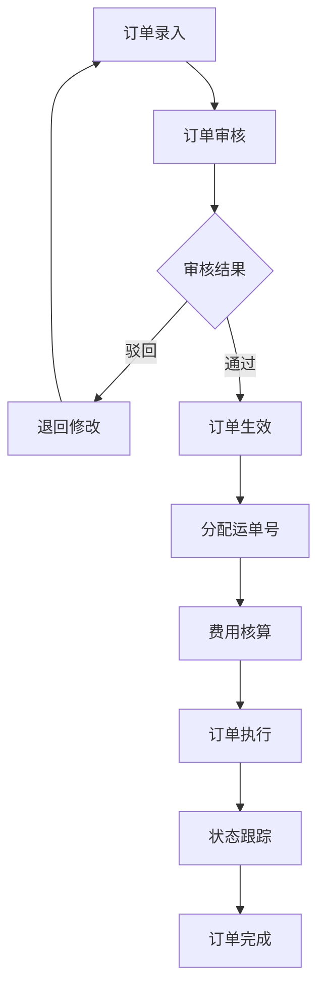

#### 3.7.3 业务规则

**输入规则：**
| 字段名 | 类型 | 必填 | 规则 | 错误提示 |
|--------|------|------|------|----------|
| 委托方 | 字符串 | 是 | 关联客户档案 | 请选择委托方 |
| 货物信息 | 对象 | 是 | 包含品名、件数、重量、体积 | 请填写完整货物信息 |
| 运输方式 | 枚举 | 是 | 空运/陆运/铁路/多式联运 | 请选择运输方式 |
| 要求时效 | 日期时间 | 是 | 必须大于当前时间 | 要求时效不能小于当前时间 |

**业务逻辑：**
1. 订单状态：待审核→已生效→执行中→已完成→已取消
2. 支持订单信息变更，变更记录可追溯
3. 订单与运单、库存、费用关联
4. 支持订单拆分和合并

#### 3.7.4 订单拆分与变更

**订单拆分**

**业务规则：**
1. 支持按货物拆分：选择部分货物生成子订单
2. 支持按运段拆分：空运段、陆运段分别生成子订单
3. 子订单继承主订单信息，可独立执行
4. 支持子订单合并回主订单

**订单变更**

**业务规则：**
1. 支持变更：收货信息、装卸货日期、货物信息
2. 变更申请需审批流程
3. 变更历史完整记录
4. 变更后同步至下游系统

---

#### 3.7.5 订单可视化 ⭐新增
**功能描述**
- **功能名称**：订单可视化
- **功能目标**：以图表形式直观展示订单状态、集货进度、协同信息
- **功能价值**：管理决策效率提升，订单问题及时发现

**可视化图表类型**

**1. 订单状态分布图**
- 图表类型：饼图或环形图
- 展示内容：各状态订单数量占比（待审核/执行中/已完成/异常）
- 交互功能：点击下钻查看明细列表
- 刷新频率：实时

**2. 集货时间甘特图**
- 图表类型：甘特图
- 展示内容：
  - 横向：时间轴（按天/周）
  - 纵向：各运输段（空运/陆运/铁路）
  - 进度条：计划时间vs实际时间
- 异常标识：红色标注延误节点
- 交互功能：拖拽查看详情，缩放时间轴

**3. 时间监控表**
- 表格形式展示关键时间节点
- 监控节点：

| 节点名称 | 计划时间 | 实际时间 | 偏差 | 状态 |
|----------|----------|----------|------|------|
| 订单生效 | 2024-01-01 10:00 | 2024-01-01 10:05 | +5min | 正常 |
| 陆运提货 | 2024-01-01 12:00 | 2024-01-01 12:30 | +30min | 预警 |
| 空运起飞 | 2024-01-01 18:00 | - | - | 待执行 |
| 货物到达 | 2024-01-02 06:00 | - | - | 待执行 |

- 预警规则：偏差>30分钟黄色预警，>1小时红色预警

**4. 跟踪协同看板**
- 看板布局：四象限展示

```
┌─────────────────┬─────────────────┐
│   空运段状态    │   陆运段状态    │
│  [航班动态图]   │  [车辆地图]     │
├─────────────────┼─────────────────┤
│   铁路段状态    │   异常/预警     │
│  [运单进度]     │  [待处理列表]   │
└─────────────────┴─────────────────┘
```

- 空运段：航班号、计划/实际起降时间、货物装载状态
- 陆运段：车辆位置地图、预计到达时间、司机信息
- 铁路段：发站/到站、在途位置、预计到站时间
- 异常区：超时预警、偏离路线、联系不上司机等

**5. 集货进度仪表盘**
- 整体进度百分比
- 各运输段完成度（进度条）
- 距截单时间倒计时
- 预计到货时间

**业务规则**

**数据聚合逻辑：**
1. 多式联运订单聚合展示各运输段状态
2. 单一运输方式订单仅展示对应段
3. 异常状态优先展示，置顶提醒
4. 支持按客户、按航班、按日期筛选

**验收标准**
- [ ] 图表加载时间<3秒
- [ ] 数据更新实时性<30秒
- [ ] 支持大屏展示模式
- [ ] 支持导出为图片/PDF

#### 3.7.6 角色权限设计

##### 3.7.6.1 角色权限矩阵

| 权限项 | 客服人员 | 调度人员 | 管理人员 | 系统管理员 |
|--------|----------|----------|----------|------------|
| 订单查询 | ✅ | ✅ | ✅ | ✅ |
| 订单录入 | ✅ | ✅ | ❌ | ✅ |
| 订单编辑 | ✅ | ✅ | ❌ | ✅ |
| 订单审核 | ❌ | ✅ | ❌ | ✅ |
| 订单删除 | ❌ | ❌ | ❌ | ✅ |
| 订单变更 | ✅ | ✅ | ❌ | ✅ |
| 可视化查看 | ✅ | ✅ | ✅ | ✅ |

##### 3.7.6.2 数据权限规则

| 角色 | 数据范围 | 说明 |
|------|----------|------|
| 客服人员 | 本人跟进的订单 | 只能管理自己跟进的订单 |
| 调度人员 | 全部订单数据 | 可审核和管理全部订单 |
| 管理人员 | 全部订单数据 | 可查看统计数据和报表 |
| 系统管理员 | 全部数据 | 可管理全部订单数据 |

#### 3.7.7 列表数据规范

##### 3.7.7.1 数据获取方式

| 属性 | 描述 |
|------|------|
| **数据来源** | 订单表（order_info） |
| **获取方式** | 实时查询，支持分页 |
| **分页方式** | 后端分页，每页默认20条 |
| **加载策略** | 默认加载近7天的订单数据 |

##### 3.7.7.2 列表字段定义

| 序号 | 字段名称 | 数据类型 | 显示格式 | 数据来源 | 是否必填 |
|------|----------|----------|----------|----------|----------|
| 1 | 订单号 | string | 文本 | orderNo | 是 |
| 2 | 客户名称 | string | 文本 | customerName | 是 |
| 3 | 运输方式 | enum | 标签 | transportMode | 是 |
| 4 | 状态 | enum | 标签 | status | 是 |
| 5 | 下单时间 | datetime | MM-DD HH:mm | orderTime | 是 |
| 6 | 预计到达 | datetime | MM-DD HH:mm | eta | 是 |
| 7 | 跟进人 | string | 文本 | followUpName | 否 |
| 8 | 操作 | - | 按钮组 | - | - |

##### 3.7.7.3 筛选条件

| 序号 | 筛选字段 | 字段标识 | 控件类型 | 查询方式 | 默认值 |
|------|----------|----------|----------|----------|--------|
| 1 | 订单号 | orderNo | 输入框 | 模糊查询 | - |
| 2 | 客户名称 | customerName | 输入框 | 模糊查询 | - |
| 3 | 状态 | status | 多选框 | 多选匹配 | 全部 |
| 4 | 运输方式 | transportMode | 多选框 | 多选匹配 | 全部 |
| 5 | 日期范围 | orderDate | 日期范围 | 区间查询 | 近7天 |

---

### 3.8 运单管理

#### 3.8.1 功能描述
- **功能名称**：运单管理
- **功能目标**：管理航空运单全生命周期，支持运单录入、跟踪、变更
- **功能价值**：运单信息准确，状态实时同步海关

#### 3.8.2 业务流程
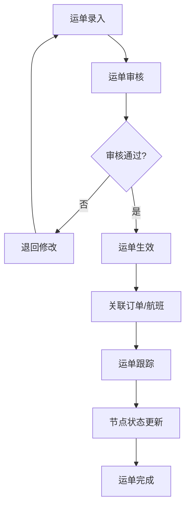

#### 3.8.3 业务规则

**输入规则：**
| 字段名 | 类型 | 必填 | 规则 | 错误提示 |
|--------|------|------|------|----------|
| 运单号 | 字符串 | 是 | 最长20位，唯一 | 运单号已存在或格式错误 |
| 托运人 | 字符串 | 是 | 关联客户 | 请选择托运人 |
| 收货人 | 字符串 | 是 | 关联客户 | 请选择收货人 |
| 起运港 | 字符串 | 是 | - | 请输入起运港 |
| 目的港 | 字符串 | 是 | - | 请输入目的港 |
| 件数/重量 | 数字 | 是 | >0 | 请输入有效数值 |

**业务逻辑：**
1. 运单与订单、航班、库存关联
2. 支持运单拆分、合并
3. 运单状态实时同步海关
4. 运单变更记录留痕

**自动化配置**⭐新增

**业务规则：**
1. 支持运单自动生成规则配置
2. 支持运单与订单自动关联规则
3. 支持运单状态自动更新触发器
4. 支持运单异常自动预警规则

**验收标准**
- [ ] 运单录入准确率≥99%
- [ ] 运单状态实时同步海关
- [ ] 运单变更可追溯
- [ ] 支持运单批量导入导出

#### 3.8.4 角色权限设计

##### 3.8.4.1 角色权限矩阵

| 权限项 | 客服人员 | 调度人员 | 海关关员 | 系统管理员 |
|--------|----------|----------|----------|------------|
| 运单查询 | ✅ | ✅ | ✅ | ✅ |
| 运单录入 | ✅ | ✅ | ❌ | ✅ |
| 运单编辑 | ✅ | ✅ | ❌ | ✅ |
| 运单审核 | ❌ | ✅ | ❌ | ✅ |
| 运单删除 | ❌ | ❌ | ❌ | ✅ |
| 运单变更 | ✅ | ✅ | ❌ | ✅ |

##### 3.8.4.2 数据权限规则

| 角色 | 数据范围 | 说明 |
|------|----------|------|
| 客服人员 | 本人录入的运单 | 可管理自己录入的运单 |
| 调度人员 | 全部运单数据 | 可审核和管理全部运单 |
| 海关关员 | 全部运单数据 | 可查看运单用于监管 |
| 系统管理员 | 全部数据 | 可管理全部运单数据 |

#### 3.8.5 列表数据规范

##### 3.8.5.1 数据获取方式

| 属性 | 描述 |
|------|------|
| **数据来源** | 运单表（waybill_info） |
| **获取方式** | 实时查询，支持分页 |
| **分页方式** | 后端分页，每页默认20条 |
| **加载策略** | 默认加载近7天的运单数据 |

##### 3.8.5.2 列表字段定义

| 序号 | 字段名称 | 数据类型 | 显示格式 | 数据来源 | 是否必填 |
|------|----------|----------|----------|----------|----------|
| 1 | 运单号 | string | 文本 | waybillNo | 是 |
| 2 | 主单号 | string | 文本 | masterWaybillNo | 是 |
| 3 | 托运人 | string | 文本 | shipperName | 是 |
| 4 | 收货人 | string | 文本 | consigneeName | 是 |
| 5 | 件数/重量 | string | #,##0/#,##0.00 | pieceWeight | 是 |
| 6 | 状态 | enum | 标签 | status | 是 |
| 7 | 创建时间 | datetime | MM-DD HH:mm | createTime | 是 |
| 8 | 操作 | - | 按钮组 | - | - |

---

### 3.9 车辆调度

#### 3.9.1 车辆预约

**功能描述**
- **功能名称**：车辆预约
- **功能目标**：司机自助预约到场时间，实现有序进场
- **功能价值**：减少现场等待，提高调度效率

**业务流程**
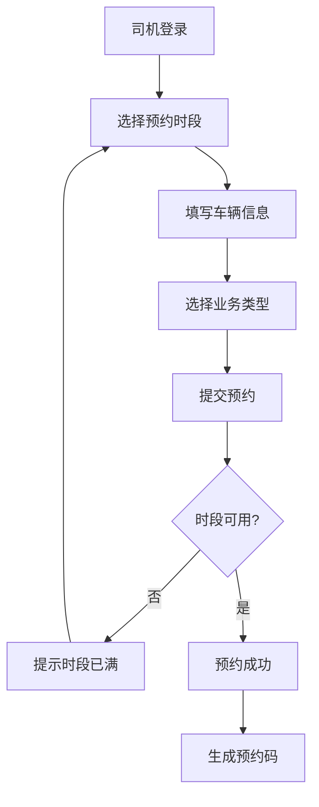

**业务规则**

**输入规则：**
| 字段名 | 类型 | 必填 | 规则 | 错误提示 |
|--------|------|------|------|----------|
| 车牌号 | 字符串 | 是 | 符合车牌格式 | 请输入正确车牌号 |
| 预约日期 | 日期 | 是 | 必须≥当前日期 | 预约日期不能小于今天 |
| 预约时段 | 枚举 | 是 | 系统开放时段 | 请选择预约时段 |
| 业务类型 | 枚举 | 是 | 送货/提货 | 请选择业务类型 |
| 联系电话 | 字符串 | 是 | 手机号格式 | 请输入正确手机号 |
| 预计货物重量 | 数字 | 否 | ≥0 | 请输入预计重量 |

**业务逻辑：**
1. 需提前2小时以上预约
2. 同一时段有预约上限控制
3. 预约成功后发送短信/推送通知
4. 支持预约取消和改期

#### 3.9.2 排队调度

**功能描述**
- **功能名称**：排队调度
- **功能目标**：基于预约和资源状态智能排序调度车辆
- **功能价值**：车辆等待时间减少30%，现场秩序优化

**业务流程**
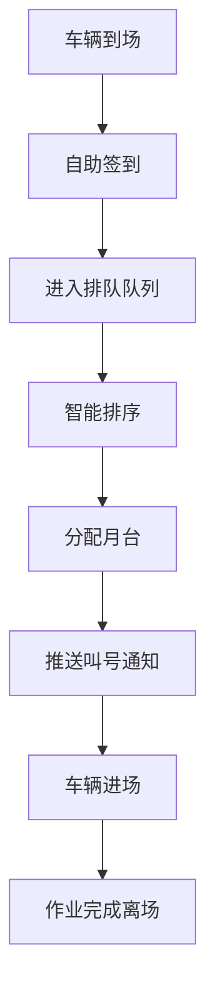

**业务规则**

**业务逻辑：**
1. 预约车辆优先于未预约车辆
2. 同航班货物车辆优先调度
3. 调度算法考虑：预约时间、货物优先级、月台可用性
4. 大屏实时显示排队叫号信息

**调度优先级规则：**
| 优先级 | 条件 | 说明 |
|--------|------|------|
| P0 | 预约+航班紧急 | 最高优先级 |
| P1 | 预约+普通货物 | 次高优先级 |
| P2 | 未预约+航班紧急 | 第三优先级 |
| P3 | 未预约+普通货物 | 最低优先级 |

**验收标准**
- [ ] 预约成功率≥98%
- [ ] 车辆等待时间≤30分钟
- [ ] 大屏显示实时性<5秒
- [ ] 叫号通知到达率≥99%

#### 3.9.4 角色权限设计

##### 3.9.4.1 角色权限矩阵

| 权限项 | 司机 | 调度人员 | 货站操作员 | 系统管理员 |
|--------|------|----------|------------|------------|
| 预约申请 | ✅ | ✅ | ✅ | ✅ |
| 预约审核 | ❌ | ✅ | ❌ | ✅ |
| 签到排队 | ✅ | ✅ | ✅ | ✅ |
| 调度管理 | ❌ | ✅ | ❌ | ✅ |
| 大屏监控 | ❌ | ✅ | ✅ | ✅ |
| 预约配置 | ❌ | ❌ | ❌ | ✅ |

##### 3.9.4.2 数据权限规则

| 角色 | 数据范围 | 说明 |
|------|----------|------|
| 司机 | 本人的预约和排队信息 | 只能查看自己的预约和排队状态 |
| 调度人员 | 全部车辆和预约数据 | 可管理全部调度和预约数据 |
| 货站操作员 | 全部车辆和预约数据 | 可查看调度信息辅助作业 |
| 系统管理员 | 全部数据 | 可管理全部调度数据 |

#### 3.9.5 列表数据规范

##### 3.9.5.1 数据获取方式

| 属性 | 描述 |
|------|------|
| **数据来源** | 车辆预约表（vehicle_appointment）、排队记录表（queue_record） |
| **获取方式** | 实时查询，支持分页 |
| **分页方式** | 后端分页，每页默认20条 |
| **加载策略** | 默认加载当天及未来3天的预约数据 |

##### 3.9.5.2 列表字段定义

| 序号 | 字段名称 | 数据类型 | 显示格式 | 数据来源 | 是否必填 |
|------|----------|----------|----------|----------|----------|
| 1 | 预约号 | string | 文本 | appointmentNo | 是 |
| 2 | 车牌号 | string | 文本 | plateNumber | 是 |
| 3 | 预约日期 | date | YYYY-MM-DD | appointmentDate | 是 |
| 4 | 预约时段 | string | 文本 | timeSlot | 是 |
| 5 | 业务类型 | enum | 标签 | businessType | 是 |
| 6 | 状态 | enum | 标签 | status | 是 |
| 7 | 排队序号 | number | #,##0 | queueNo | 否 |
| 8 | 操作 | - | 按钮组 | - | - |

---

### 3.10 运输执行管理 ⭐新增
**功能描述**
- **功能名称**：运输执行管理
- **功能目标**：管理货物从提货到交付的全程运输执行
- **功能价值**：运输过程可控，交接责任清晰

#### 3.10.1 运输任务管理

**业务规则**

**运输任务状态：**
| 状态 | 说明 |
|------|------|
| 待派车 | 任务创建，等待分配车辆 |
| 已派车 | 车辆已分配，司机已接单 |
| 提货中 | 司机前往提货点 |
| 运输中 | 货物已装车，在途运输 |
| 已到达 | 到达目的地 |
| 已签收 | 收货人签收确认 |
| 异常 | 运输过程中出现异常 |

**任务分配规则：**
1. 根据货物类型、重量、体积匹配合适车型
2. 根据司机位置、工作负荷智能派单
3. 紧急任务支持手动指派
4. 司机可APP接单或拒绝（需说明原因）

#### 3.10.2 交接单管理

**业务流程**
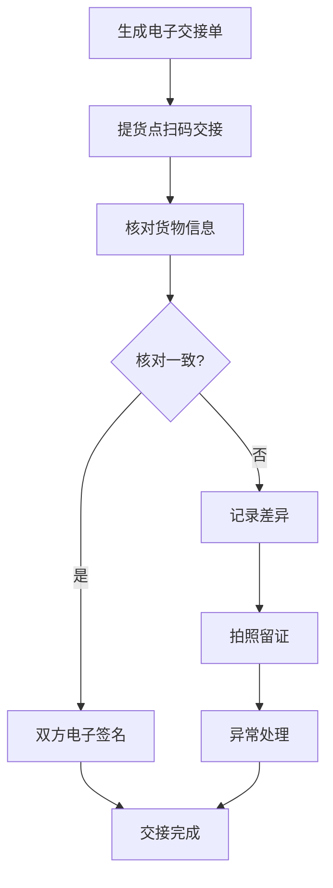

**交接单内容：**
| 项目 | 说明 |
|------|------|
| 交接单号 | 系统生成的唯一编号 |
| 运单信息 | 关联的运单号、货物信息 |
| 交接双方 | 交出方、接收方、司机 |
| 交接时间 | 实际交接时间 |
| 货物状态 | 件数、重量、外包装状况 |
| 电子签名 | 双方手写签名或刷脸确认 |
| 现场照片 | 货物、车辆、封签照片 |

#### 3.10.3 签收管理

**签收方式：**
1. **电子签收**：收货人手机扫码签收，手写签名
2. **刷脸签收**：人脸识别+身份证核验
3. **密码签收**：收货人提供提货密码
4. **代理签收**：提供授权委托书

**签收确认内容：**
- 货物外包装完好性确认
- 件数清点确认
- 货物损坏/短少记录
- 签收时间、地点（GPS定位）
- 签收人身份信息

**异常签收处理：**
- 货损：拍照记录→定损→理赔流程
- 短少：核对交接记录→查找→确认责任
- 拒收：记录原因→退回或暂存

#### 3.10.4 运单图片管理

**图片类型：**
| 类型 | 拍摄时机 | 用途 |
|------|----------|------|
| 提货照片 | 装车前 | 证明货物初始状态 |
| 装车照片 | 装车完成 | 证明装载方式、封签 |
| 在途照片 | 异常时 | 事故、货损证据 |
| 卸货照片 | 卸车时 | 证明交付状态 |
| 单据照片 | 交接时 | 签收单、回单影像 |

**图片管理规则：**
1. 强制拍摄节点：提货、装车、签收
2. 照片自动关联运单
3. 支持按时间、地点水印
4. 云端存储，保留期2年
5. 支持图片检索和导出

#### 3.10.5 回单管理

**回单类型：**
- **纸质回单**：客户签字后的纸质运单回执
- **电子回单**：电子签收确认记录
- **异常回单**：记录异常情况的回单

**回单流转：**
```
签收完成 → 回单上传 → 回单审核 → 归档存储 → 结算依据
```

**回单审核要点：**
1. 签收信息完整性
2. 签收人身份合法性
3. 异常记录是否清晰
4. 照片是否齐全

**验收标准**
- [ ] 运输任务状态更新实时性<1分钟
- [ ] 电子交接单签署成功率≥99%
- [ ] 签收数据与运单关联准确率100%
- [ ] 回单归档及时率≥98%

#### 3.10.6 角色权限设计

##### 3.10.6.1 角色权限矩阵

| 权限项 | 司机 | 调度人员 | 货站操作员 | 系统管理员 |
|--------|------|----------|------------|------------|
| 任务查看 | ✅ | ✅ | ✅ | ✅ |
| 任务执行 | ✅ | ❌ | ❌ | ✅ |
| 交接单签署 | ✅ | ❌ | ❌ | ✅ |
| 签收确认 | ✅ | ❌ | ❌ | ✅ |
| 图片上传 | ✅ | ❌ | ❌ | ✅ |
| 回单管理 | ❌ | ✅ | ❌ | ✅ |

##### 3.10.6.2 数据权限规则

| 角色 | 数据范围 | 说明 |
|------|----------|------|
| 司机 | 本人的运输任务 | 只能查看和执行自己的运输任务 |
| 调度人员 | 全部运输任务 | 可管理和调度全部运输任务 |
| 货站操作员 | 本货站的任务 | 可查看本货站的运输任务 |
| 系统管理员 | 全部数据 | 可管理全部运输数据 |

#### 3.10.7 列表数据规范

##### 3.10.7.1 数据获取方式

| 属性 | 描述 |
|------|------|
| **数据来源** | 运输任务表（transport_task） |
| **获取方式** | 实时查询，支持分页 |
| **分页方式** | 后端分页，每页默认20条 |
| **加载策略** | 默认加载进行中的运输任务 |

##### 3.10.7.2 列表字段定义

| 序号 | 字段名称 | 数据类型 | 显示格式 | 数据来源 | 是否必填 |
|------|----------|----------|----------|----------|----------|
| 1 | 任务编号 | string | 文本 | taskNo | 是 |
| 2 | 运单号 | string | 文本 | waybillNo | 是 |
| 3 | 司机 | string | 文本 | driverName | 是 |
| 4 | 车牌号 | string | 文本 | plateNumber | 是 |
| 5 | 状态 | enum | 标签 | status | 是 |
| 6 | 提货时间 | datetime | MM-DD HH:mm | pickupTime | 否 |
| 7 | 签收时间 | datetime | MM-DD HH:mm | deliveryTime | 否 |
| 8 | 操作 | - | 按钮组 | - | - |

---

### 3.11 月台管理

#### 3.11.1 月台分配

**功能描述**
- **功能名称**：月台分配
- **功能目标**：根据作业计划自动分配最优月台
- **功能价值**：月台利用率提升20%，作业效率优化

**业务规则**

**业务逻辑：**
1. 月台分配考虑因素：
   - 货物类型（重货/轻货/危险品）
   - 车辆类型（集卡/厢货）
   - 月台类型（高台/低台/平台）
   - 距离目标库位距离
   - 月台当前状态
2. 自动推荐最优月台，支持人工调整
3. 月台状态实时更新：空闲/占用/维修/禁用
4. 车辆引导：通过LED屏/APP推送引导至指定月台

#### 3.11.2 装卸作业

**功能描述**
- **功能名称**：装卸作业
- **功能目标**：管理装卸作业执行，记录作业数据
- **功能价值**：装卸数据准确采集，工作量自动统计

**业务流程**
```mermaid
flowchart TD
    A[车辆到达月台] --> B[开始作业]
    B --> C[扫码采集货物]
    C --> D[确认装卸数量]
    D --> E[作业完成确认]
    E --> F[更新库存/订单]
    F --> G[记录工作量]
```

**业务规则**

**输入规则：**
| 字段名 | 类型 | 必填 | 规则 | 说明 |
|--------|------|------|------|------|
| 作业类型 | 枚举 | 是 | 装货/卸货 | - |
| 货物件数 | 整数 | 是 | ≥0 | 实际作业件数 |
| 作业人员 | 字符串 | 是 | - | 记录作业人员 |
| 作业时间 | 日期时间 | 是 | - | 开始/结束时间 |
| 使用设备 | 字符串 | 否 | - | 叉车等设备 |

**业务逻辑：**
1. 支持PDA扫码采集货物信息
2. 装卸数据实时回传系统
3. 作业异常（货损/短缺）及时记录
4. 工作量自动统计，支持按人/按队统计

**装卸队管理**⭐新增

| 字段名 | 类型 | 必填 | 说明 |
|--------|------|------|------|
| 班组编码 | 字符串 | 是 | 唯一标识 |
| 班组名称 | 字符串 | 是 | - |
| 组长 | 字符串 | 是 | 负责人 |
| 成员 | 多选 | 是 | 班组人员 |
| 作业区域 | 多选 | 是 | 负责的库区 |
| 排班规则 | 对象 | 否 | 工作时间配置 |

**验收标准**
- [ ] 月台分配响应时间<2秒
- [ ] 月台利用率≥85%
- [ ] 作业效率提升≥20%
- [ ] 大屏展示实时性<5秒

#### 3.11.5 角色权限设计

##### 3.11.5.1 角色权限矩阵

| 权限项 | 货站操作员 | 调度人员 | 管理人员 | 系统管理员 |
|--------|------------|----------|----------|------------|
| 月台状态查看 | ✅ | ✅ | ✅ | ✅ |
| 月台分配 | ❌ | ✅ | ❌ | ✅ |
| 作业登记 | ✅ | ❌ | ❌ | ✅ |
| 班组管理 | ❌ | ✅ | ❌ | ✅ |
| 月台配置 | ❌ | ❌ | ❌ | ✅ |
| 统计分析 | ❌ | ❌ | ✅ | ✅ |

##### 3.11.5.2 数据权限规则

| 角色 | 数据范围 | 说明 |
|------|----------|------|
| 货站操作员 | 本人负责的月台 | 可操作自己负责的月台作业 |
| 调度人员 | 全部月台数据 | 可管理全部月台分配和调度 |
| 管理人员 | 全部月台数据 | 可查看月台统计数据和报表 |
| 系统管理员 | 全部数据 | 可管理全部月台数据 |

#### 3.11.6 列表数据规范

##### 3.11.6.1 数据获取方式

| 属性 | 描述 |
|------|------|
| **数据来源** | 月台表（platform_info）、作业记录表（operation_record） |
| **获取方式** | 实时查询，支持分页 |
| **分页方式** | 后端分页，每页默认20条 |
| **加载策略** | 默认加载全部月台状态 |

##### 3.11.6.2 列表字段定义

| 序号 | 字段名称 | 数据类型 | 显示格式 | 数据来源 | 是否必填 |
|------|----------|----------|----------|----------|----------|
| 1 | 月台编号 | string | 文本 | platformNo | 是 |
| 2 | 月台类型 | enum | 标签 | platformType | 是 |
| 3 | 状态 | enum | 标签 | status | 是 |
| 4 | 当前车辆 | string | 文本 | currentVehicle | 否 |
| 5 | 作业开始时间 | datetime | HH:mm | operationStart | 否 |
| 6 | 预计完成时间 | datetime | HH:mm | estimatedEnd | 否 |
| 7 | 操作 | - | 按钮组 | - | - |

---

### 3.12 计费管理

#### 3.12.1 计费规则设置 ⭐补充科目

**功能描述**
- **功能名称**：计费规则设置
- **功能目标**：配置计费科目、费率、计价方式
- **功能价值**：灵活配置计费策略，适应不同客户需求

**业务规则**

**输入规则：**
| 字段名 | 类型 | 必填 | 规则 | 说明 |
|--------|------|------|------|------|
| 计费科目 | 字符串 | 是 | 唯一 | 如仓储费、装卸费 |
| 计价方式 | 枚举 | 是 | 按重/按体积/按件等 | - |
| 费率 | 数字 | 是 | ≥0 | 单价 |
| 生效日期 | 日期 | 是 | - | 规则生效时间 |
| 客户组 | 多选 | 否 | - | 适用客户范围 |

**计费科目完整列表**⭐补充

| 科目名称 | 科目编码 | 计价方式 | 费率示例 | 说明 |
|----------|----------|----------|----------|------|
| 仓储费 | FEE001 | 按重量×天数 | 5元/吨/天 | 根据存储重量和时间计费 |
| 仓储超期费 | FEE002 | 按重量×超期天数 | 10元/吨/天 | 超过免费期后的费用 |
| 装卸费 | FEE003 | 按重量 | 20元/吨 | 入库或出库时计费 |
| 操作费 | FEE004 | 按件 | 10元/件 | 分拣、打板等操作 |
| 叉车费 | FEE005 | 按车次 | 50元/车 | 叉车作业费用 |
| 运输费-空运 | FEE006 | 按重量 | 5元/公斤 | 空运段运输费用 |
| 运输费-陆运 | FEE007 | 按重量/距离 | 2元/吨/公里 | 公路运输费用 |
| 运输费-铁路 | FEE008 | 按重量 | 1.5元/公斤 | 铁路运输费用 |
| 报关服务费 | FEE009 | 按票 | 200元/票 | 代理报关服务 |
| 查验服务费 | FEE010 | 按票/工时 | 500元/票 | 海关查验配合服务 |
| 打板费 | FEE011 | 按板 | 300元/板 | 打板作业费用 |
| 集装器租赁费 | FEE012 | 按天 | 100元/天 | ULD等集装器租赁 |
| 危险品附加费 | FEE013 | 按重量×系数 | 基础费×1.5 | 危险品操作附加 |
| 冷链附加费 | FEE014 | 按重量×系数 | 基础费×2.0 | 冷链货物附加 |
| 加班费 | FEE015 | 按工时 | 100元/小时 | 非工作时间作业 |
| 停车费 | FEE016 | 按时 | 5元/小时 | 园区停车费用 |
| 过路费 | FEE017 | 按实报 | 实报实销 | 运输过路费 |

**业务逻辑：**
1. 支持多种计费模式：按重量、体积、件数、托盘、时间等
2. 费率版本管理，支持历史费率查询
3. 客户合同可覆盖默认费率
4. 阶梯计价：如首吨价格、续吨价格不同
5. 特殊货物附加费：危险品、冷链等系数加成

#### 3.12.2 费用核算（应收）

**功能描述**
- **功能名称**：费用核算
- **功能目标**：根据规则自动核算费用，生成账单
- **功能价值**：费用核算准确率100%，账单生成效率提升

**业务流程**
```mermaid
flowchart TD
    A[选择核算期间] --> B[选择客户]
    B --> C[系统计算费用]
    C --> D[生成费用明细]
    D --> E[人工审核]
    E --> F{审核通过?}
    F -->|否| G[调整费用]
    G --> E
    F -->|是| H[生成账单]
    H --> I[账单确认]
```

**业务规则**

**业务逻辑：**
1. 费用自动计算：根据业务数据和计费规则自动计算
2. 费用调整：支持费用补录、减免、调整
3. 账单生成：按月/按批次生成客户账单
4. 账单格式：支持PDF导出、打印

**计费计算公式：**
```
仓储费 = 计费重量 × 存储天数 × 日费率
计费重量 = MAX(实际重量, 体积重量)
体积重量 = 体积(m³) × 167
存储天数 = 出库日期 - 入库日期（不足1天按1天）

运输费 = 运量 × 运价 × 距离系数
危险品附加费 = 基础费用 × 危险品系数(1.5)
冷链附加费 = 基础费用 × 冷链系数(2.0)
```

#### 3.12.3 应付核算 ⭐新增/完善

**功能描述**
- **功能名称**：应付费用核算
- **功能目标**：向承运方/供应商应付费用核算，预付管理
- **功能价值**：成本核算准确，付款流程规范

**业务流程**
```mermaid
flowchart TD
    A[费用数据采集] --> B[费用计算]
    B --> C[生成应付明细]
    C --> D[人工审核]
    D --> E{审核通过?}
    E -->|否| F[调整费用]
    F --> D
    E -->|是| G{是否需要预付?}
    G -->|是| H[预付申请]
    H --> I[预付审批]
    I --> J[财务付款]
    G -->|否| K[生成对账单]
    J --> L[实际结算]
    K --> L
    L --> M[财务核销]
```

**业务规则**

**输入规则：**
| 字段名 | 类型 | 必填 | 规则 | 说明 |
|--------|------|------|------|------|
| 承运商 | 字符串 | 是 | 关联供应商档案 | - |
| 费用类型 | 枚举 | 是 | 运输费/装卸费等 | - |
| 结算周期 | 枚举 | 是 | 月结/季结/现结 | - |
| 应付金额 | 数字 | 是 | ≥0 | - |
| 预付金额 | 数字 | 否 | ≥0 | 如有预付 |

**应付费用类型：**
| 费用类型 | 计算依据 | 说明 |
|----------|----------|------|
| 运输费 | 运量×运价 | 按实际运输量计算 |
| 装卸费 | 作业量×单价 | 按装卸吨数/件数计算 |
| 仓储费 | 存储量×天数×单价 | 按实际存储情况计算 |
| 其他费用 | 按实际发生 | 如停车费、过路费等 |

**预付管理规则：**
1. 预付申请需审批，审批通过后财务付款
2. 预付款项在结算时自动抵扣
3. 预付余额实时查询，不足时预警
4. 支持多笔预付，按先进先出抵扣

---

#### 3.12.4 报价管理 ⭐新增
**功能描述**
- **功能名称**：报价管理
- **功能目标**：管理客户报价单的全生命周期
- **功能价值**：报价流程规范化，快速响应客户需求

**业务流程**
```mermaid
flowchart TD
    A[创建报价单] --> B[选择客户]
    B --> C[填写报价明细]
    C --> D[系统自动计算]
    D --> E[提交审批]
    E --> F{审批通过?}
    F -->|否| G[退回修改]
    G --> A
    F -->|是| H[报价单生效]
    H --> I[发送客户]
    I --> J{客户确认?}
    J -->|接受| K[转入合同]
    J -->|拒绝| L[记录原因]
    J -->|议价| M[修改报价]
    M --> E
```

**业务规则**

**输入规则：**
| 字段名 | 类型 | 必填 | 规则 | 说明 |
|--------|------|------|------|------|
| 报价单号 | 字符串 | 是 | 系统自动生成 | 唯一标识 |
| 客户 | 字符串 | 是 | 关联客户档案 | 报价对象 |
| 报价有效期 | 日期 | 是 | ≥当前日期 | 过期自动失效 |
| 运输方式 | 多选 | 是 | 空运/陆运/铁路 | 影响费率 |
| 预估货量 | 数字 | 否 | ≥0 | 用于计算折扣 |

**报价明细项：**
| 费用项目 | 单价 | 数量 | 小计 | 备注 |
|----------|------|------|------|------|
| 仓储费 | 5元/吨/天 | 100吨×30天 | 15,000元 | 月结 |
| 装卸费 | 20元/吨 | 100吨 | 2,000元 | - |
| 运输费 | 3元/公斤 | 100,000公斤 | 300,000元 | 空运段 |

**业务逻辑：**
1. 报价单基于计费规则自动生成，支持人工调整
2. 报价有效期默认30天，可自定义
3. 审批流程：创建→部门经理→销售总监（超额阈值）
4. 客户接受报价后，可一键转为合同
5. 报价历史版本保存，支持对比
6. 过期报价单自动标记，不可再使用

**折扣规则：**
- 根据客户级别自动应用折扣：VIP 85折/普通 95折
- 根据预估货量阶梯折扣：>100吨 9折/>500吨 85折
- 特殊折扣需审批，记录折扣原因

**报价单状态流转：**
| 当前状态 | 操作 | 下一状态 | 条件 |
|----------|------|----------|------|
| 草稿 | 提交审批 | 审批中 | - |
| 审批中 | 审批通过 | 待发送 | - |
| 审批中 | 审批驳回 | 草稿 | 需修改 |
| 待发送 | 发送客户 | 已发送 | - |
| 已发送 | 客户接受 | 已接受 | 客户确认 |
| 已发送 | 客户拒绝 | 已拒绝 | 记录原因 |
| 已接受 | 转合同 | 已转合同 | 生成合同 |
| 已发送 | 过期 | 已过期 | 超有效期 |

**验收标准**
- [ ] 报价单生成时间<5分钟
- [ ] 支持报价模板快速复制
- [ ] 报价转合同数据不丢失
- [ ] 报价有效期自动提醒（到期前3天）

#### 3.12.5 角色权限设计

##### 3.12.5.1 角色权限矩阵

| 权限项 | 财务人员 | 客服人员 | 管理人员 | 系统管理员 |
|--------|----------|----------|----------|------------|
| 计费规则查看 | ✅ | ❌ | ✅ | ✅ |
| 计费规则配置 | ❌ | ❌ | ❌ | ✅ |
| 应收核算 | ✅ | ❌ | ❌ | ✅ |
| 应付核算 | ✅ | ❌ | ❌ | ✅ |
| 账单管理 | ✅ | ✅ | ✅ | ✅ |
| 报价管理 | ❌ | ✅ | ❌ | ✅ |

##### 3.12.5.2 数据权限规则

| 角色 | 数据范围 | 说明 |
|------|----------|------|
| 财务人员 | 全部计费数据 | 可进行应收应付核算和账单管理 |
| 客服人员 | 本人客户的报价 | 可为负责的客户创建报价 |
| 管理人员 | 全部计费数据 | 可查看统计报表和账单 |
| 系统管理员 | 全部数据 | 可管理全部计费数据 |

#### 3.12.6 列表数据规范

##### 3.12.6.1 数据获取方式

| 属性 | 描述 |
|------|------|
| **数据来源** | 应收明细表（receivable_detail）、账单表（bill_info） |
| **获取方式** | 实时查询，支持分页 |
| **分页方式** | 后端分页，每页默认20条 |
| **加载策略** | 默认加载未结清的应收数据 |

##### 3.12.6.2 列表字段定义

| 序号 | 字段名称 | 数据类型 | 显示格式 | 数据来源 | 是否必填 |
|------|----------|----------|----------|----------|----------|
| 1 | 账单编号 | string | 文本 | billNo | 是 |
| 2 | 客户名称 | string | 文本 | customerName | 是 |
| 3 | 费用类型 | enum | 标签 | feeType | 是 |
| 4 | 金额 | number | ¥#,##0.00 | amount | 是 |
| 5 | 账单月份 | string | YYYY-MM | billMonth | 是 |
| 6 | 状态 | enum | 标签 | status | 是 |
| 7 | 到期日 | date | YYYY-MM-DD | dueDate | 是 |
| 8 | 操作 | - | 按钮组 | - | - |

---

### 3.13 运行中心-综合态势大屏 ⭐完善

#### 3.13.1 功能描述
- **功能名称**：综合态势大屏
- **功能目标**：实现园区综合运营态势的可视化展示
- **功能价值**：管理决策效率提升，运营异常及时发现

#### 3.13.2 展示内容

**核心指标卡片区：**
| 指标名称 | 数据来源 | 刷新频率 |
|----------|----------|----------|
| 当日进港货量 | WMS | 实时 |
| 当日出港货量 | WMS | 实时 |
| 在库货物总量 | WMS | 实时 |
| 平均通关时效 | 海关监管 | 5分钟 |
| 车辆排队数 | 车辆调度 | 实时 |
| 月台占用率 | 月台管理 | 实时 |

**八类态势大屏**⭐补充

**1. 综合态势大屏（已有）**
- 货量统计、通关时效、车辆调度、月台利用率
- 核心KPI展示、趋势图表、实时告警

**2. 交通态势大屏**⭐新增
- 园区车辆实时分布
- 卡口通行流量统计
- 车辆排队时长分析
- 拥堵预警提示

**3. 安防态势大屏**⭐新增
- 视频监控轮巡展示
- 异常事件实时告警
- 门禁出入记录
- 安防设备状态

**4. 能耗态势大屏**⭐新增
- 电力消耗实时监控
- 能耗趋势分析
- 设备能效分析
- 节能预警

**5. 安全态势大屏**⭐新增
- 安全生产指标
- 安全隐患排查
- 安全事件记录
- 应急资源状态

**6. 消防态势大屏**⭐新增
- 消防设备状态监控
- 烟感告警实时展示
- 消防通道占用监控
- 应急疏散指引

**7. 资产态势大屏**⭐新增
- 固定资产分布
- 资产使用率
- 资产维修提醒
- 资产价值统计

**8. 设备设施态势大屏**⭐新增
- 设备运行状态
- 设备故障告警
- 维保计划提醒
- 设备利用率分析

#### 3.13.3 业务规则

**数据刷新规则：**
1. 关键指标（货量、车辆）：实时刷新（<5秒）
2. 时效指标：5分钟刷新
3. 趋势图表：30分钟刷新
4. 告警信息：实时推送

**验收标准**
- [ ] 大屏数据刷新实时性<5秒
- [ ] 关键指标准确率≥99%
- [ ] 支持多屏展示模式
- [ ] 支持数据钻取分析

#### 3.13.4 角色权限设计

##### 3.13.4.1 角色权限矩阵

| 权限项 | 管理人员 | 调度人员 | 客服 | 系统管理员 |
|--------|----------|----------|------|------------|
| 大屏查看 | ✅ | ✅ | ❌ | ✅ |
| 数据钻取 | ✅ | ✅ | ❌ | ✅ |
| 告警配置 | ❌ | ❌ | ❌ | ✅ |
| 报表导出 | ✅ | ✅ | ❌ | ✅ |
| 指标配置 | ❌ | ❌ | ❌ | ✅ |

---

### 3.14 客服业务管理 ⭐新增模块

#### 3.14.1 功能描述
- **功能名称**：客服业务管理
- **功能目标**：提供在线客服、工单管理、知识库功能
- **功能价值**：提升客户满意度，实现客户服务闭环

#### 3.14.2 在线客服

**业务规则**

**功能说明：**
1. 支持网页端、移动端在线客服入口
2. 支持文字、图片、语音多种咨询方式
3. 客服机器人自动回复常见问题
4. 复杂问题转人工客服处理
5. 会话记录完整保存

**输入规则：**
| 字段名 | 类型 | 必填 | 说明 |
|--------|------|------|------|
| 咨询类型 | 枚举 | 是 | 货物查询/业务咨询/投诉建议/其他 |
| 关联单号 | 字符串 | 否 | 运单号/订单号 |
| 咨询内容 | 文本 | 是 | - |
| 联系方式 | 字符串 | 是 | 手机号/邮箱 |

#### 3.14.3 工单管理

**业务流程**
```mermaid
flowchart TD
    A[工单创建] --> B[工单分类]
    B --> C[工单派发]
    C --> D[工单处理]
    D --> E[处理结果反馈]
    E --> F[客户确认]
    F -->|满意| G[工单关闭]
    F -->|不满意| H[重新处理]
    H --> D
```

**业务规则：**
1. 工单来源：在线客服、电话、邮件、自助提交
2. 工单类型：查询类、投诉类、建议类、异常类
3. 工单优先级：紧急/高/中/低
4. 工单时限：根据优先级设定处理时限
5. 工单升级：超时未处理自动升级

**工单状态流转：**
| 当前状态 | 操作 | 下一状态 | 条件 |
|----------|------|----------|------|
| 待派发 | 派发 | 处理中 | 指派处理人 |
| 处理中 | 提交结果 | 待确认 | 处理完成 |
| 待确认 | 客户确认 | 已关闭 | 客户满意 |
| 待确认 | 客户驳回 | 处理中 | 需重新处理 |

#### 3.14.4 知识库

**业务规则：**
1. 知识分类：业务指南、常见问题、操作手册、政策法规
2. 知识检索：支持全文检索、分类筛选
3. 知识维护：支持增删改查、版本管理
4. 知识评价：用户可对知识内容评价

**验收标准**
- [ ] 在线客服响应时间<30秒
- [ ] 工单处理闭环率≥95%
- [ ] 知识库覆盖常见问题的80%
- [ ] 客户满意度≥4.5/5

#### 3.14.5 角色权限设计

##### 3.14.5.1 角色权限矩阵

| 权限项 | 客服人员 | 客服主管 | 管理人员 | 系统管理员 |
|--------|----------|----------|----------|------------|
| 在线客服 | ✅ | ✅ | ❌ | ✅ |
| 工单处理 | ✅ | ✅ | ❌ | ✅ |
| 工单派发 | ❌ | ✅ | ❌ | ✅ |
| 知识库管理 | ❌ | ✅ | ❌ | ✅ |
| 满意度查看 | ❌ | ✅ | ✅ | ✅ |
| 客服统计 | ❌ | ✅ | ✅ | ✅ |

##### 3.14.5.2 列表数据规范

**工单列表字段定义：**

| 序号 | 字段名称 | 数据类型 | 显示格式 | 数据来源 | 是否必填 |
|------|----------|----------|----------|----------|----------|
| 1 | 工单编号 | string | 文本 | ticketNo | 是 |
| 2 | 客户名称 | string | 文本 | customerName | 是 |
| 3 | 工单类型 | enum | 标签 | ticketType | 是 |
| 4 | 优先级 | enum | 标签 | priority | 是 |
| 5 | 状态 | enum | 标签 | status | 是 |
| 6 | 创建时间 | datetime | MM-DD HH:mm | createTime | 是 |
| 7 | 处理人 | string | 文本 | handlerName | 否 |
| 8 | 操作 | - | 按钮组 | - | - |

---

### 3.15 登录功能

#### 3.15.1 功能描述
- **功能名称**：登录功能
- **功能目标**：提供安全可靠的用户身份认证，支持多种登录方式
- **功能价值**：保障系统安全，提供便捷的登录体验

#### 3.15.2 业务流程
```mermaid
flowchart TD
    A[访问系统] --> B{是否已登录?}
    B -->|是| C[进入系统首页]
    B -->|否| D[显示登录页]
    D --> E[输入账号密码]
    E --> F{是否需要验证码?}
    F -->|是| G[输入验证码]
    F -->|否| H[点击登录]
    G --> H
    H --> I{验证通过?}
    I -->|否| J[显示错误提示]
    J --> E
    I -->|是| K[记录登录日志]
    K --> L[进入系统首页]
```

#### 3.15.3 业务规则

**输入规则：**
| 字段名 | 类型 | 必填 | 规则 | 错误提示 |
|--------|------|------|------|----------|
| 用户名 | 字符串 | 是 | 4-20位，字母数字下划线 | 用户名格式错误 |
| 密码 | 字符串 | 是 | 6-20位，必须包含字母和数字 | 密码格式错误 |
| 验证码 | 字符串 | 条件必填 | 5分钟内有效 | 验证码错误或已过期 |
| 记住我 | 布尔 | 否 | - | - |

**业务逻辑：**
1. 支持账号密码登录
2. 验证码机制：连续3次登录失败后需输入验证码
3. 密码加密传输和存储（BCrypt）
4. 登录失败次数限制：5次失败后锁定账号30分钟
5. 支持"记住我"功能（7天有效）
6. 支持数字证书登录（可选）

**安全策略：**
| 策略 | 说明 |
|------|------|
| 密码复杂度 | 必须包含大小写字母、数字，长度8-20位 |
| 密码有效期 | 90天强制更换 |
| 登录IP限制 | 可配置允许登录的IP白名单 |
| 异地登录提醒 | 非常用IP登录时发送提醒 |
| 会话超时 | 30分钟无操作自动退出 |

**验收标准**
- [ ] 登录成功率≥99%
- [ ] 登录响应时间<2秒
- [ ] 密码安全策略生效
- [ ] 登录日志完整记录

#### 3.15.4 角色权限设计

##### 3.15.4.1 角色权限矩阵

| 权限项 | 所有用户 | 系统管理员 |
|--------|----------|------------|
| 账号登录 | ✅ | ✅ |
| 密码修改 | ✅ | ✅ |
| 密码重置 | ❌ | ✅ |
| 登录配置 | ❌ | ✅ |
| 登录日志查看 | ❌ | ✅ |

---

### 3.16 合同管理

#### 3.16.1 功能描述
- **功能名称**：合同管理
- **功能目标**：实现物流合同全生命周期数字化管理，集成电子签章
- **功能价值**：合同管理规范化，具有法律效力的电子签署

#### 3.16.2 业务流程
```mermaid
flowchart TD
    A[合同创建] --> B[填写合同信息]
    B --> C[上传附件]
    C --> D[提交审批]
    D --> E{审批通过?}
    E -->|否| F[退回修改]
    F --> B
    E -->|是| G[合同生效]
    G --> H[电子签章]
    H --> I[合同归档]
    I --> J[合同执行]
    J --> K[到期预警]
    K --> L{是否续签?}
    L -->|是| M[续签合同]
    M --> B
    L -->|否| N[合同终止]
```

#### 3.16.3 业务规则

**输入规则：**
| 字段名 | 类型 | 必填 | 规则 | 错误提示 |
|--------|------|------|------|----------|
| 合同编号 | 字符串 | 是 | 唯一，格式规范 | 合同编号已存在 |
| 合同类型 | 枚举 | 是 | 运输合同/仓储合同/综合服务 | 请选择合同类型 |
| 客户 | 字符串 | 是 | 关联客户档案 | 请选择客户 |
| 合同金额 | 数字 | 否 | ≥0 | 请输入有效金额 |
| 开始日期 | 日期 | 是 | - | 请选择开始日期 |
| 结束日期 | 日期 | 是 | 必须>开始日期 | 结束日期必须晚于开始日期 |

**字段数据源：**
- 客户信息：上游来自客户管理
- 合同模板：系统预定义模板
- 电子签章：第三方电子签章服务

**业务逻辑：**
1. 合同审批流程：创建→部门审批→法务审批→领导审批→生效
2. 电子签章集成：对接第三方电子签章平台（如e签宝、法大大）
3. 合同到期前30天自动预警
4. 支持合同变更、补充协议
5. 合同附件支持PDF、Word格式

**合同状态流转：**
| 当前状态 | 操作 | 下一状态 | 条件 |
|----------|------|----------|------|
| 待审批 | 审批通过 | 待签章 | 各级审批通过 |
| 待审批 | 审批驳回 | 已驳回 | 审批不通过 |
| 待签章 | 签章完成 | 已生效 | 双方电子签章完成 |
| 已生效 | 到期 | 已到期 | 合同到期 |
| 已到期 | 续签 | 待审批 | 发起续签流程 |

**验收标准**
- [ ] 合同审批流程完整
- [ ] 电子签章集成成功
- [ ] 合同到期预警提前30天
- [ ] 合同变更可追溯

#### 3.16.4 角色权限设计

##### 3.16.4.1 角色权限矩阵

| 权限项 | 销售人员 | 法务人员 | 管理人员 | 系统管理员 |
|--------|----------|----------|----------|------------|
| 合同查询 | ✅ | ✅ | ✅ | ✅ |
| 合同创建 | ✅ | ❌ | ❌ | ✅ |
| 合同审批 | ❌ | ✅ | ✅ | ✅ |
| 合同签章 | ❌ | ❌ | ❌ | ✅ |
| 合同变更 | ❌ | ❌ | ❌ | ✅ |
| 合同删除 | ❌ | ❌ | ❌ | ✅ |

---

### 3.17 园区管理

#### 3.17.1 车辆无感通行

**功能描述**
- **功能名称**：车辆无感通行
- **功能目标**：实现车辆快速进出园区，自动识别、自动放行
- **功能价值**：通行效率提升，减少人工干预

**业务流程**
```mermaid
flowchart TD
    A[车辆到达园区入口] --> B[车牌识别]
    B --> C{白名单?}
    C -->|是| D[自动放行]
    C -->|否| E{有预约?}
    E -->|是| F[校验预约]
    F -->|有效| D
    F -->|无效| G[人工处理]
    E -->|否| G
    D --> H[记录通行日志]
    G --> H
```

**业务规则**

**输入规则：**
| 字段名 | 类型 | 必填 | 规则 | 说明 |
|--------|------|------|------|------|
| 车牌号 | 字符串 | 是 | 符合车牌格式 | 自动识别或人工录入 |
| 车辆类型 | 枚举 | 是 | 员工车/访客车/货车 | - |
| 有效期 | 日期 | 条件必填 | 白名单车辆必填 | 白名单有效期 |

**业务逻辑：**
1. 白名单管理：员工车辆、长期合作车辆可加入白名单
2. 预约车辆自动匹配，校验通过后放行
3. 临时车辆需人工登记或扫码预约
4. 停车费用自动计算（如有）
5. 通行记录完整保存，支持查询统计

**费用规则：**
| 车辆类型 | 计费规则 | 说明 |
|----------|----------|------|
| 员工车辆 | 免费 | 白名单内 |
| 送货车辆 | 免费 | 有有效预约 |
| 访客车辆 | 按时计费 | 前30分钟免费，后5元/小时 |
| 过夜车辆 | 封顶计费 | 24小时封顶30元 |

#### 3.17.2 设备台账管理

**功能描述**
- **功能名称**：设备台账管理
- **功能目标**：设施设备全生命周期管理，维保计划管理
- **功能价值**：设备管理规范化，故障率降低

**业务规则**

**输入规则：**
| 字段名 | 类型 | 必填 | 规则 | 说明 |
|--------|------|------|------|------|
| 设备编码 | 字符串 | 是 | 唯一 | 设备唯一标识 |
| 设备名称 | 字符串 | 是 | - | 设备名称 |
| 设备类型 | 枚举 | 是 | 工作站/扫码枪/地磅等 | - |
| 所属位置 | 字符串 | 是 | - | 设备所在位置 |
| 购置日期 | 日期 | 是 | - | - |
| 质保期 | 整数 | 是 | ≥0，单位月 | 质保期限 |

**业务逻辑：**
1. 设备档案：记录设备基本信息、技术参数、说明书
2. 维保计划：定期保养提醒（可按月/季度/年）
3. 故障报修：在线报修，指派维修人员，记录维修过程
4. 设备状态：正常/维修中/报废/闲置
5. 设备盘点：定期盘点，核对账实

**维保提醒规则：**
| 设备类型 | 维保周期 | 提前提醒天数 |
|----------|----------|--------------|
| 工作站 | 每季度 | 7天 |
| 扫码设备 | 每月 | 3天 |
| 地磅 | 每半年 | 15天 |
| 网络设备 | 每月 | 3天 |

---


#### 3.17.3 车位管理与引导 ⭐新增

**功能描述**
- **功能名称**：车位管理与引导
- **功能目标**：实现园区车位资源的数字化管理和智能引导
- **功能价值**：提高车位利用率，减少车辆寻找车位时间

**业务规则**

**车位管理：**

| 字段名 | 类型 | 必填 | 说明 |
|--------|------|------|------|
| 车位编号 | 字符串 | 是 | 唯一标识（如A-01-001） |
| 车位类型 | 枚举 | 是 | 货车位/小车位/装卸位/充电位 |
| 所属区域 | 字符串 | 是 | A区/B区/装卸区等 |
| 状态 | 枚举 | 是 | 空闲/占用/预约/维修 |
| 占用车辆 | 字符串 | 否 | 当前停放车辆车牌 |

**验收标准**
- [ ] 车位状态更新实时性<5秒
- [ ] 引导准确率≥99%

---

#### 3.17.4 巡更巡检管理 ⭐新增

**功能描述**
- **功能名称**：巡更巡检管理
- **功能目标**：规范设备设施巡检流程，确保及时发现和处理问题
- **业务规则**

**验收标准**
- [ ] 巡检完成率≥98%
- [ ] 漏检自动预警准确率100%

---

#### 3.17.5 设备知识库 ⭐新增

**功能描述**
- **功能名称**：设备知识库
- **功能目标**：建立设备相关的知识沉淀和共享平台

**验收标准**
- [ ] 知识检索响应时间<2秒

#### 3.17.6 角色权限设计

##### 3.17.6.1 角色权限矩阵

| 权限项 | 园区管理员 | 安保人员 | 维修人员 | 系统管理员 |
|--------|------------|----------|----------|------------|
| 车辆通行查看 | ✅ | ✅ | ❌ | ✅ |
| 车位管理 | ✅ | ❌ | ❌ | ✅ |
| 巡更巡检 | ❌ | ✅ | ✅ | ✅ |
| 设备知识库 | ❌ | ❌ | ✅ | ✅ |
| 园区配置 | ❌ | ❌ | ❌ | ✅ |

---

### 3.18 接口对接管理 ⭐新增

**功能描述**
- **功能名称**：接口对接管理
- **功能目标**：统一管理外部系统、内部系统的接口配置和监控
- **功能价值**：接口可视化配置，异常及时发现，降低对接成本

**接口分类**

| 接口类型 | 接口名称 | 对接系统 | 协议 | 用途 |
|----------|----------|----------|------|------|
| 外部-海关 | 金关二期验核接口 | 海关 | REST | 车辆货物验核 |
| 外部-海关 | 金关二期回执接口 | 海关 | REST | 接收验核结果 |
| 外部-航班 | 航班动态接口 | 航班平台 | REST/WebSocket | 航班状态同步 |
| 外部-场站 | 场站数据接口 | 机场场站 | REST | 运单舱单同步 |
| 外部-安检 | 安检申报接口 | 安检系统 | REST | 货物安检申报 |
| 外部-物流 | 公路物流平台 | 物流平台 | REST | GPS跟踪 |
| 内部-WMS | 库存同步接口 | WMS | MQ | 库存数据同步 |
| 内部-PLC | 分拣控制接口 | PLC | Modbus TCP | 分拣设备控制 |
| 内部-计费 | 计费数据接口 | 计费系统 | REST | 费用数据传递 |

**接口监控**
| 监控项 | 阈值 | 预警方式 |
|--------|------|----------|
| 接口成功率 | <99% | 系统告警 |
| 平均响应时间 | >2s | 系统告警 |
| 日调用量 | 异常波动 | 报表通知 |
| 失败次数 | 连续5次 | 短信告警 |

**验收标准**
- [ ] 接口配置可视化
- [ ] 接口状态实时监控
- [ ] 接口异常自动告警
- [ ] 接口日志可追溯

#### 3.18.4 角色权限设计

##### 3.18.4.1 角色权限矩阵

| 权限项 | 开发人员 | 运维人员 | 管理人员 | 系统管理员 |
|--------|----------|----------|----------|------------|
| 接口查看 | ✅ | ✅ | ✅ | ✅ |
| 接口配置 | ✅ | ❌ | ❌ | ✅ |
| 接口测试 | ✅ | ❌ | ❌ | ✅ |
| 监控查看 | ❌ | ✅ | ✅ | ✅ |
| 日志查看 | ✅ | ✅ | ❌ | ✅ |
| 告警配置 | ❌ | ✅ | ❌ | ✅ |

---

### 3.19 分拣线控制管理 ⭐新增模块

#### 3.19.1 功能描述
- **功能名称**：分拣线控制管理
- **功能目标**：实现货物从入库到打板的全流程自动化分拣控制
- **功能价值**：分拣效率提升50%，错分率降低至0.1%以下

#### 3.19.2 系统组成

分拣线控制系统包含以下模块：
1. 仓储管理模块（立体库、缓存区管理）
2. 全流程跟踪模块（传送带→打板全链条跟踪）
3. 作业管理模块（打板位调度、打板节奏管理）
4. 分拣控制模块（分拣/输送设备控制、路由）
5. 流程调度模块（业务类型路由配置、查验路径）
6. 海关业务模块（查验放行状态管理）
7. 数据通讯模块（与PLC/设备通讯）

#### 3.19.3 仓储管理（分拣线侧）

**功能描述**
- **功能名称**：分拣线仓储管理
- **功能目标**：统一管理立体库、缓存区及各类货物
- **功能价值**：实现智能化仓储，提高存储密度和出入库效率

**业务规则**

**立体库管理：**
1. 自动分配立体库与缓存区库位
2. 执行大小件分区存储策略
3. 管理航空板、空箱等存储状态与位置
4. 支持库位占用实时监控

**库位分配规则：**
| 货物类型 | 优先库区 | 说明 |
|----------|----------|------|
| 大件货物 | 立体库大件区 | 重量>50kg或体积>0.5m³ |
| 小件货物 | 立体库小件区 | 重量≤50kg且体积≤0.5m³ |
| 快速周转 | 缓存区 | 24小时内出库的货物 |
| 待查验 | 查验缓存区 | 海关待查验货物 |
| 异常货物 | 异常缓存区 | 破损、无主等异常货物 |

#### 3.19.4 全流程跟踪

**功能描述**
- **功能名称**：分拣线全流程跟踪
- **功能目标**：实时追踪单件货物从上传送带到打板的全链条状态与位置
- **功能价值**：确保物流状态透明可控，快速定位货物

**业务流程**
```mermaid
flowchart TD
    A[货物入库扫描] --> B[分配存储库位]
    B --> C[分拣线输送]
    C --> D[入库分拣路由]
    D --> E[立体库存储]
    E --> F[出库指令触发]
    F --> G[出库分拣路由]
    G --> H[输送至打板区]
    H --> I[打板作业]
    I --> J[打板完成确认]
```

**跟踪节点：**
| 节点编码 | 节点名称 | 说明 |
|----------|----------|------|
| NODE01 | 入库扫描点 | 货物信息录入系统 |
| NODE02 | 入库分拣点 | 根据目的地分拣 |
| NODE03 | 立体库入口 | 货物进入立体库 |
| NODE04 | 立体库出口 | 货物出库 |
| NODE05 | 出库分拣点 | 根据航班/目的港分拣 |
| NODE06 | 打板位 | 货物到达打板位 |
| NODE07 | 打板完成点 | 打板作业完成 |

**业务规则：**
1. 每个关键节点扫码/感应记录
2. 货物位置实时更新，精度到具体分拣线/格口
3. 异常停留自动预警（超过设定时间未移动）
4. 支持货物位置查询：输入运单号查询当前位置

#### 3.19.5 分拣控制

**功能描述**
- **功能名称**：分拣控制
- **功能目标**：控制分拣、输送设备，精准执行分拣、路由任务
- **功能价值**：自动分拣准确率≥99.9%

**业务规则**

**分拣控制指令：**
| 指令类型 | 说明 | 参数 |
|----------|------|------|
| 分拣指令 | 将货物分拣至指定出口 | 货物ID、目标出口 |
| 路由指令 | 控制输送线路径 | 货物ID、目标节点 |
| 停止指令 | 紧急停止分拣线 | 设备编码 |
| 速度调节 | 调节输送速度 | 设备编码、速度值 |

**分拣逻辑：**
1. 根据货物目的地、航班、目的港确定分拣路径
2. 优先路径：最短时间/最短距离
3. 拥堵避让：检测到目标出口拥堵时自动切换备用路径
4. 异常处理：无法分拣时转入异常口

#### 3.19.6 流程调度

**功能描述**
- **功能名称**：流程调度
- **功能目标**：灵活定义并驱动各类业务流程，实现智能路由
- **功能价值**：支持多种业务模式，提高分拣线利用率

**业务类型路由配置：**
| 业务类型 | 路由说明 | 分拣规则 |
|----------|----------|----------|
| 陆侧空转 | 陆侧入库→空侧出库 | 按航班/目的港分拣 |
| 空侧直通 | 空侧直接入库→出库 | 快速通道 |
| 国际转国际 | 国际航班转运 | 按目的港分拣 |
| 查验货物 | 转入查验区 | 查验完成后重新分拣 |
| 异常货物 | 转入异常处理区 | 人工处理 |

**查验路径分配：**
1. 接收海关布控指令
2. 自动将布控货物路由至查验区
3. 查验完成后根据结果重新路由
4. 支持查验优先通道

#### 3.19.7 打板位资源调度

**功能描述**
- **功能名称**：打板位资源调度
- **功能目标**：统一调度打板位资源，支持各类货物、业务通用
- **功能价值**：打板位利用率提升，航班准点率提升

**业务规则**

**打板位分配规则：**
| 分配因素 | 权重 | 说明 |
|----------|------|------|
| 航班时间 | 40% | 紧急航班优先 |
| 目的港 | 30% | 相同目的港集中 |
| 货物类型 | 20% | 特殊货物专用区域 |
| 距离 | 10% | 距离出库口近优先 |

**打板节奏管理：**
1. 根据航班起飞时间倒推倒排打板计划
2. 打板位占用时长预警（超时自动提醒）
3. 打板进度实时监控
4. 支持打板位预约锁定

#### 3.19.8 PLC对接与数据通讯

**功能描述**
- **功能名称**：PLC对接与数据通讯
- **功能目标**：负责与分拣线PLC、传感器、执行器等设备数据交换
- **功能价值**：实现系统与设备的实时协同

**通讯接口：**
| 接口类型 | 用途 | 协议 |
|----------|------|------|
| PLC通讯 | 控制分拣设备 | Modbus TCP / OPC UA |
| 扫码设备 | 读取货物条码 | TCP/IP |
| 传感器 | 检测货物位置 | IO信号 / 以太网 |
| 执行器 | 控制分拣动作 | PLC输出 |

**数据交换内容：**
- 下发数据：分拣指令、路由指令、控制指令
- 上传数据：货物位置、设备状态、故障信息
- 心跳检测：设备在线状态检测

**验收标准**
- [ ] 分拣准确率≥99.9%
- [ ] 货物位置更新实时性<3秒
- [ ] 设备控制响应时间<1秒
- [ ] 故障自动检测和告警
- [ ] 支持7×24小时连续运行

---

#### 3.19.9 数据分析模块（分拣线） ⭐新增
**功能描述**
- **功能名称**：分拣线数据分析
- **功能目标**：通过数据分析优化分拣线运营效率
- **功能价值**：数据驱动决策，持续改进分拣效率

**分析报表类型**

**1. 分拣效率分析**
| 指标 | 计算方式 | 目标值 |
|------|----------|--------|
| 分拣吞吐量 | 日分拣件数 | ≥10万件/天 |
| 分拣速度 | 件/小时 | ≥5000件/小时 |
| 错分率 | 错分件数/总件数 | ≤0.1% |
| 设备利用率 | 实际运行时间/计划运行时间 | ≥85% |

**2. 设备性能分析**
- 各分拣口流量分布图
- 设备故障频次排行
- 设备OEE（综合设备效率）分析
- 能耗分析（电耗/件）

**3. 货物流量分析**
- 按时间：小时/日/周流量趋势
- 按目的港：各目的港货量占比
- 按货物类型：普货/冷链/危险品分布
- 峰值分析：识别业务高峰期

**4. 瓶颈识别**
- 拥堵节点热力图
- 分拣口等待时长分析
- 输送线速度瓶颈点
- 优化建议自动生成

**可视化展示：**
```mermaid
flowchart TD
    subgraph 数据看板
        A[实时效率仪表盘] --> B[效率趋势图]
        C[设备状态监控] --> D[故障预警]
        E[货物流量图] --> F[峰值预测]
    end
```

**业务规则：**
1. 数据实时采集，分钟级更新
2. 异常指标自动标红预警
3. 支持同比、环比分析
4. 报表支持导出Excel/PDF

**验收标准**
- [ ] 数据采集完整性100%
- [ ] 报表生成时间<10秒
- [ ] 预测准确率≥85%

#### 3.19.11 角色权限设计

##### 3.19.11.1 角色权限矩阵

| 权限项 | 设备操作员 | 维修人员 | 调度人员 | 管理人员 | 系统管理员 |
|--------|------------|----------|----------|----------|------------|
| 分拣线监控 | ✅ | ✅ | ✅ | ✅ | ✅ |
| 设备控制 | ✅ | ❌ | ❌ | ❌ | ✅ |
| 设备维护 | ❌ | ✅ | ❌ | ❌ | ✅ |
| 流程调度 | ❌ | ❌ | ✅ | ❌ | ✅ |
| 数据分析 | ❌ | ❌ | ❌ | ✅ | ✅ |
| 系统配置 | ❌ | ❌ | ❌ | ❌ | ✅ |

##### 3.19.11.2 列表数据规范

**分拣任务列表字段定义：**

| 序号 | 字段名称 | 数据类型 | 显示格式 | 数据来源 | 是否必填 |
|------|----------|----------|----------|----------|----------|
| 1 | 任务编号 | string | 文本 | taskNo | 是 |
| 2 | 运单号 | string | 文本 | waybillNo | 是 |
| 3 | 货物名称 | string | 文本 | cargoName | 是 |
| 4 | 起始节点 | string | 文本 | startNode | 是 |
| 5 | 目标节点 | string | 文本 | endNode | 是 |
| 6 | 状态 | enum | 标签 | status | 是 |
| 7 | 创建时间 | datetime | HH:mm:ss | createTime | 是 |
| 8 | 操作 | - | 按钮组 | - | - |

---

### 3.20 场站系统对接 ⭐新增模块

#### 3.20.1 功能描述
- **功能名称**：场站系统对接
- **功能目标**：实现与机场场站系统的高效对接，打通双方业务数据通道
- **功能价值**：减少人工重复录入，降低操作差错率，确保数据一致性

#### 3.20.2 对接内容

**数据同步范围：**
| 数据类型 | 同步方向 | 频率 | 说明 |
|----------|----------|------|------|
| 航班信息 | 场站→货站 | 实时 | 航班动态、起降时间 |
| 运单信息 | 双向同步 | 实时 | 主单/分单信息 |
| 货物状态 | 货站→场站 | 实时 | 入库、出库、装机状态 |
| 舱单信息 | 场站→货站 | 航班起飞后 | 实际装载舱单 |
| 异常通知 | 双向 | 实时 | 航班延误、取消等 |

#### 3.20.3 业务流程

**航班信息同步：**
```mermaid
flowchart TD
    A[场站系统航班更新] --> B[数据接口推送]
    B --> C[货站系统接收]
    C --> D[数据解析验证]
    D --> E[更新本地航班信息]
    E --> F[触发关联业务更新]
```

**货物状态回传：**
```mermaid
flowchart TD
    A[货站作业完成] --> B[状态变更]
    B --> C[接口推送场站]
    C --> D[场站系统接收]
    D --> E[更新货物跟踪状态]
```

#### 3.20.4 业务规则

**接口规范：**
1. 接口协议：RESTful API / WebService
2. 数据格式：JSON / XML
3. 字符编码：UTF-8
4. 安全认证：Token + 签名验证
5. 重试机制：失败自动重试3次

**数据一致性保障：**
1. 数据变更实时推送
2. 定期全量数据对账（每日）
3. 差异数据自动识别和告警
4. 支持手动触发数据同步

**异常处理：**
1. 网络中断：数据本地缓存，恢复后批量同步
2. 数据格式错误：记录错误日志，人工介入处理
3. 重复数据：根据唯一标识去重

**验收标准**
- [ ] 数据同步实时性<5秒
- [ ] 数据一致性≥99.9%
- [ ] 接口可用性≥99.5%
- [ ] 异常恢复时间<10分钟

#### 3.20.5 角色权限设计

##### 3.20.5.1 角色权限矩阵

| 权限项 | 开发人员 | 运维人员 | 管理人员 | 系统管理员 |
|--------|----------|----------|----------|------------|
| 接口查看 | ✅ | ✅ | ✅ | ✅ |
| 接口配置 | ✅ | ❌ | ❌ | ✅ |
| 数据同步监控 | ❌ | ✅ | ✅ | ✅ |
| 异常处理 | ❌ | ✅ | ❌ | ✅ |
| 日志查看 | ✅ | ✅ | ❌ | ✅ |

---

### 3.21 航空物流公共信息平台 ⭐新增模块（v2.0）

#### 3.21.1 功能描述
- **功能名称**：航空物流公共信息平台
- **功能目标**：构建"通关+物流"一站式协同服务平台，为企业提供全流程、便捷化的航空物流信息服务
- **功能价值**：压缩货物整体通关时效，提升作业透明度与效率

#### 3.21.2 平台定位

**服务对象：**
- 进出口企业
- 货运代理
- 航空公司
- 报关行
- 物流服务提供商

**核心功能：**
1. 出港服务
2. 进港服务
3. 通关状态查询
4. 物流跟踪
5. 在线业务办理

#### 3.21.3 出港服务

**功能说明：**
1. **货物预报**：在线录入货物预报信息
2. **运单管理**：在线创建、修改运单
3. **预约服务**：预约入库时间、月台
4. **状态查询**：查询货物处理状态
5. **费用查询**：查询应付费用
6. **账单下载**：下载月度账单

**业务流程**
```mermaid
flowchart TD
    A[企业登录平台] --> B[选择出港服务]
    B --> C[录入货物预报]
    C --> D[创建运单]
    D --> E[预约入库时间]
    E --> F[等待审核]
    F --> G[审核通过]
    G --> H[按预约时间送货]
    H --> I[货物状态跟踪]
    I --> J[出库/装机通知]
```

#### 3.21.4 进港服务

**功能说明：**
1. **到港通知**：货物到港主动推送通知
2. **提货预约**：在线预约提货时间
3. **通关跟踪**：查询海关通关进度
4. **提货单管理**：在线申请提货单
5. **费用支付**：在线支付相关费用

#### 3.21.5 全程可视化

**跟踪节点：**
| 节点 | 说明 | 数据来源 |
|------|------|----------|
| 货物预报 | 企业提交预报 | 公共平台 |
| 安检通过 | 安检完成 | 安检系统 |
| 货物入货站 | 入库完成 | WMS |
| 海关放行 | 海关审核通过 | 海关系统 |
| 打板完成 | 打板作业完成 | WMS |
| 货物装机 | 航班装机完成 | 场站系统 |
| 航班起飞 | 航班实际起飞 | 航班平台 |
| 航班到达 | 航班实际到达 | 航班平台 |
| 提货完成 | 企业提货确认 | 公共平台 |

#### 3.21.6 业务规则

**账号管理：**
1. 企业实名认证注册
2. 子账号管理（管理员/操作员/财务）
3. 权限控制：功能权限+数据权限

**安全要求：**
1. 数据传输加密（HTTPS）
2. 敏感数据脱敏展示
3. 操作日志完整记录
4. 异常登录检测

**验收标准**
- [ ] 支持1000+企业同时在线
- [ ] 页面加载时间<3秒
- [ ] 数据查询响应时间<2秒
- [ ] 平台可用性≥99.9%

#### 3.21.7 角色权限设计

##### 3.21.7.1 角色权限矩阵

| 权限项 | 企业管理员 | 企业操作员 | 企业财务 | 平台管理员 |
|--------|------------|------------|----------|------------|
| 运单查询 | ✅ | ✅ | ❌ | ✅ |
| 运单创建 | ❌ | ✅ | ❌ | ✅ |
| 费用查询 | ✅ | ✅ | ✅ | ✅ |
| 账单管理 | ❌ | ❌ | ✅ | ✅ |
| 企业配置 | ✅ | ❌ | ❌ | ✅ |
| 子账号管理 | ✅ | ❌ | ❌ | ✅ |

---

### 3.22 移动端功能 ⭐新增模块

#### 3.22.1 功能描述
- **功能名称**：移动端功能
- **功能目标**：提供司机端、员工端移动应用，支持预约、申请、审批、报修等各类服务
- **功能价值**：随时随地办理业务，提升用户体验

#### 3.22.2 司机端

**功能模块：**

**1. 预约管理**
- 在线预约送货/提货时间
- 查看预约记录
- 取消/改期预约
- 预约码展示

**2. 签到排队**
- GPS定位签到
- 查看排队进度
- 叫号提醒推送
- 月台导航

**3. 货物查询**
- 查询货物状态
- 查看历史记录
- 电子回单签收

**4. 消息通知**
- 预约确认通知
- 叫号通知
- 延误/变更通知

**业务流程**
```mermaid
flowchart TD
    A[司机打开APP] --> B[选择预约服务]
    B --> C[填写预约信息]
    C --> D[提交预约]
    D --> E[收到确认通知]
    E --> F[到场前GPS签到]
    F --> G[进入排队队列]
    G --> H[收到叫号通知]
    H --> I[前往指定月台]
    I --> J[完成作业]
```

#### 3.22.3 员工端

**功能模块：**

**1. 作业任务**
- 查看今日任务
- 扫码作业（入库/出库/移位）
- 任务完成确认
- 异常上报

**2. 审批处理**
- 待办审批列表
- 在线审批
- 审批历史查询

**3. 设备报修**
- 扫描设备码报修
- 拍照上传故障
- 查看维修进度
- 维修结果确认

**4. 库存查询**
- 扫码查询货物
- 库位库存查询
- 库存预警查看

**5. 消息中心**
- 系统通知
- 任务提醒
- 告警信息

#### 3.22.4 技术架构

**移动端技术栈：**
- 跨平台框架：Flutter / React Native
- 扫码功能：原生扫码SDK集成
- 地图导航：高德/百度地图SDK
- 消息推送：极光推送/Firebase
- 离线支持：本地数据缓存

**验收标准**
- [ ] 支持iOS 14+、Android 10+
- [ ] APP启动时间<3秒
- [ ] 扫码响应时间<1秒
- [ ] 离线功能正常
- [ ] 推送到达率≥95%

#### 3.22.6 角色权限设计

##### 3.22.6.1 角色权限矩阵

| 权限项 | 司机 | 货站操作员 | 调度人员 | 管理人员 | 系统管理员 |
|--------|------|------------|----------|----------|------------|
| 预约管理 | ✅ | ❌ | ❌ | ❌ | ✅ |
| 签到排队 | ✅ | ❌ | ❌ | ❌ | ✅ |
| 现场作业 | ❌ | ✅ | ❌ | ❌ | ✅ |
| 审批处理 | ❌ | ❌ | ✅ | ✅ | ✅ |
| 数据查询 | ❌ | ❌ | ✅ | ✅ | ✅ |
| 设备报修 | ❌ | ✅ | ❌ | ❌ | ✅ |

---

### 3.23 统一门户 ⭐新增（v2.0）
**功能描述**
- **功能名称**：统一门户
- **功能目标**：整合各业务系统入口，提供统一工作平台
- **功能价值**：减少系统切换，提升工作效率

**门户功能架构**

**1. 应用集成中心**
- 单点登录（SSO）：一次登录，访问所有子系统
- 应用图标：WMS、TMS、计费、报关等各系统快捷入口
- 应用权限：根据角色显示有权限的应用
- 常用应用：用户自定义常用应用置顶

**2. 业务入口聚合**
- 快捷操作：常用功能一键直达
- 待办事项：审批、异常处理等待办提醒
- 业务日历：预约、任务、会议等日程
- 消息通知：系统消息、业务预警

**3. 消息中心**
| 消息类型 | 来源 | 处理方式 |
|----------|------|----------|
| 系统通知 | 系统公告、升级通知 | 已读/删除 |
| 业务通知 | 订单状态变更、查验布控 | 查看详情 |
| 审批待办 | 需要审批的流程 | 点击审批 |
| 预警提醒 | 超时、异常、库存不足 | 查看处理 |

**4. 个性化工作台**
- 布局自定义：拖拽调整各模块位置
- 主题切换：深色/浅色模式
- 快捷搜索：全局搜索运单、订单、客户等
- 个人中心：个人信息、密码修改、登录日志

**门户界面布局：**
```
┌─────────────────────────────────────────────┐
│  Logo    搜索框                    消息  个人 │
├──────────┬──────────────────────────────────┤
│          │  待办事项  │  业务日历            │
│  应用    │──────────────────────────────────│
│  导航    │  数据看板  │  快捷操作            │
│          │──────────────────────────────────│
│          │  公告通知  │  常用链接            │
└──────────┴──────────────────────────────────┘
```

**验收标准**
- [ ] 单点登录成功率≥99.9%
- [ ] 门户加载时间<3秒
- [ ] 消息推送实时性<5秒
- [ ] 支持个性化配置保存

#### 3.23.4 角色权限设计

##### 3.23.4.1 角色权限矩阵

| 权限项 | 普通员工 | 部门经理 | 系统管理员 |
|--------|----------|----------|------------|
| 门户查看 | ✅ | ✅ | ✅ |
| 快捷操作 | ✅ | ✅ | ✅ |
| 待办处理 | ✅ | ✅ | ✅ |
| 消息查看 | ✅ | ✅ | ✅ |
| 系统配置 | ❌ | ❌ | ✅ |
| 权限管理 | ❌ | ❌ | ✅ |

---

### 3.24 运维服务管理 ⭐新增
**功能描述**
- **功能名称**：运维服务管理
- **功能目标**：规范IT运维和设施运维服务流程
- **功能价值**：运维工作标准化，问题响应及时处理

##

#### 3.24.1 IT运维工单管理

**功能描述**
- **功能名称**：IT运维工单管理
- **功能目标**：规范IT系统故障报修和处理流程
- **功能价值**：IT问题快速响应，系统稳定运行

**工单类型：**
| 类型 | 说明 | 处理时效 |
|------|------|----------|
| 系统故障 | 系统崩溃、功能异常 | 2小时内响应 |
| 权限申请 | 账号开通、权限调整 | 4小时内处理 |
| 数据查询 | 业务数据查询、导出 | 8小时内完成 |
| 优化建议 | 系统优化、功能改进 | 24小时内评估 |

**工单流程：**
```
提交工单 → 工单分派 → 处理中 → 待确认 → 已关闭
            ↓
         转派/退回
```

**功能要点：**
1. 工单提交：选择类型、描述问题、上传截图
2. 自动分派：根据类型自动分派给对应运维人员
3. 处理跟踪：实时查看处理进度，支持催办
4. 满意度评价：工单关闭后进行服务评价

---

#### 3.24.2 设施运维工单管理

**功能描述**
- **功能名称**：设施运维工单管理
- **功能目标**：规范园区设施设备维修流程
- **功能价值**：设施故障及时处理，保障园区正常运营

**设施类型：**
| 类型 | 包含设备 | 维护周期 |
|------|----------|----------|
| 安防设施 | 监控、道闸、门禁 | 月度巡检 |
| 消防设施 | 烟感、喷淋、灭火器 | 季度检测 |
| 机电设备 | 电梯、空调、供电 | 定期保养 |
| 网络设施 | 交换机、AP、布线 | 按需维护 |

**工单流程：**
```
故障发现 → 报修登记 → 维修派工 → 现场维修 → 验收确认 → 工单关闭
              ↓           ↓
           紧急程度     维修调度
```

**功能要点：**
1. 多渠道报修：巡检发现、员工上报、系统自动告警
2. 紧急程度：紧急/重要/一般，紧急工单立即通知
3. 维修调度：根据维修人员位置和技能智能派工
4. 维修记录：维修过程记录，配件更换登记
5. 验收确认：报修人验收签字，满意度评价

---

#### 3.24.3 巡检计划管理

**功能描述**
- **功能名称**：巡检计划管理
- **功能目标**：建立定期巡检机制，预防设施故障
- **功能价值**：从被动维修转向主动预防，降低故障率

**巡检类型：**
| 类型 | 频率 | 内容 | 责任人 |
|------|------|------|--------|
| 日常巡检 | 每日 | 关键设备运行状态 | 值班人员 |
| 周度巡检 | 每周 | 设施设备外观、功能 | 运维人员 |
| 月度巡检 | 每月 | 深度检查、清洁保养 | 专业工程师 |
| 季度巡检 | 每季 | 全面检测、性能评估 | 外部服务商 |

**巡检流程：**
```
制定计划 → 生成任务 → 执行巡检 → 记录结果 → 异常处理 → 归档分析
              ↓           ↓
           定时触发    扫码签到
```

**功能要点：**
1. 计划配置：设置巡检项目、标准、周期、责任人
2. 任务生成：根据计划自动生成巡检任务，推送提醒
3. 扫码巡检：巡检点设置二维码，扫码签到防作弊
4. 结果记录：正常/异常拍照记录，异常情况自动转工单
5. 巡检报表：巡检完成率、异常统计、趋势分析

**验收标准**
- [ ] IT运维工单流转正常
- [ ] 设施运维工单处理时效达标
- [ ] 巡检计划按时生成任务
- [ ] 巡检异常自动转工单

#### 3.24.4 角色权限设计

##### 3.24.4.1 角色权限矩阵

| 权限项 | 运维人员 | 维修人员 | 巡检人员 | 系统管理员 |
|--------|----------|----------|----------|------------|
| 工单查看 | ✅ | ✅ | ❌ | ✅ |
| 工单处理 | ✅ | ✅ | ❌ | ✅ |
| 工单派发 | ✅ | ❌ | ❌ | ✅ |
| 巡检计划 | ❌ | ❌ | ✅ | ✅ |
| 巡检执行 | ❌ | ❌ | ✅ | ✅ |
| 知识库管理 | ✅ | ✅ | ❌ | ✅ |

---

### 3.25 系统管理

#### 3.25.1 权限管理

**功能描述**
- **功能名称**：权限管理
- **功能目标**：管理用户、角色、权限，实现访问控制
- **功能价值**：系统安全可控，操作审计可追溯

**用户管理：**
1. 用户增删改查
2. 用户状态：启用/禁用/锁定
3. 密码策略：复杂度要求、定期更换
4. 登录控制：失败次数限制、IP白名单

**角色管理：**
1. 预定义角色：管理员、操作员、调度员、客服、财务
2. 支持自定义角色
3. 角色权限配置：菜单权限、按钮权限、数据权限

**权限模型（RBAC）：**
```
用户 ← 分配 → 角色 ← 拥有 → 权限

权限类型：
- 功能权限：访问菜单、操作按钮
- 数据权限：本人/本部门/本仓库/全部
```

**数据权限范围：**
| 级别 | 说明 |
|------|------|
| 本人 | 只能查看自己创建的数据 |
| 本部门 | 查看本部门所有人员数据 |
| 本仓库 | 查看指定仓库的数据 |
| 全部 | 查看所有数据 |

#### 3.25.2 日志管理

**功能描述**
- **功能名称**：日志管理
- **功能目标**：记录系统操作日志，支持审计查询
- **功能价值**：操作可追溯，安全审计合规

**日志类型：**
| 类型 | 记录内容 | 保留期限 |
|------|----------|----------|
| 登录日志 | 登录时间、IP、结果 | 1年 |
| 操作日志 | 操作人、操作内容、时间 | 2年 |
| 系统日志 | 系统异常、性能告警 | 6个月 |
| 接口日志 | 接口调用、参数、响应 | 3个月 |

**日志查询：**
1. 多维度筛选：时间、用户、模块、操作类型
2. 日志导出：支持Excel导出
3. 敏感信息脱敏：密码等敏感信息不记录或脱敏

**验收标准**
- [ ] RBAC模型完整
- [ ] 数据权限控制有效
- [ ] 操作审计日志完整
- [ ] 敏感信息脱敏

#### 3.25.5 角色权限设计

##### 3.25.5.1 角色权限矩阵

| 权限项 | 普通用户 | 部门管理员 | 系统管理员 |
|--------|----------|------------|------------|
| 用户管理 | ❌ | ❌ | ✅ |
| 角色管理 | ❌ | ❌ | ✅ |
| 菜单配置 | ❌ | ❌ | ✅ |
| 参数配置 | ❌ | ❌ | ✅ |
| 日志查看 | ❌ | ✅ | ✅ |
| 数据字典 | ❌ | ❌ | ✅ |

---

### 3.26 跨境电商业务管理 ⭐新增（v2.0）
**功能描述**
- **功能名称**：跨境电商业务管理
- **功能目标**：全面支持9610/9710/9810等跨境电商业务模式，对接海关跨境电商通关服务平台
- **功能价值**：提升跨境电商通关效率，降低企业运营成本，实现与一般贸易、保税物流等业务的协同

#### 3.26.1 业务模式说明

| 业务模式 | 代码 | 适用场景 | 核心特点 | 退税政策 |
|----------|------|----------|----------|----------|
| 跨境电商零售出口 | 9610 | B2C小包出口，清单申报 | 清单核放、汇总申报、快速通关 | 按清单汇总退税 |
| 跨境电商B2B直接出口 | 9710 | B2B批量出口，报关单申报 | 报关单申报、批量通关、正常退税 | 正常出口退税 |
| 跨境电商出口海外仓 | 9810 | 海外仓备货模式 | 先出口后销售、海外仓库存管理 | 出口即退税 |

#### 3.26.2 9610零售出口业务

**业务流程**
```mermaid
flowchart TD
    A[电商平台订单] --> B[订单抓取/导入]
    B --> C[三单对碰]
    C --> D{对碰通过?}
    D -->|否| E[异常处理]
    E --> B
    D -->|是| F[生成清单]
    F --> G[海关申报]
    G --> H[分拣线集货]
    H --> I[查验/放行]
    I --> J[装载出境]
    J --> K[离境结关]
    K --> L[汇总申报]
    L --> M[申请退税]
```

**三单对碰机制：**
| 单据类型 | 数据来源 | 关键字段 | 对碰规则 |
|----------|----------|----------|----------|
| 订单单 | 电商平台/ERP | 订单号、商品信息、金额、收发货人 | 订单金额校验 |
| 支付单 | 支付机构（支付宝/微信/银联） | 支付流水号、支付金额、支付时间 | 支付金额=订单金额±5% |
| 物流单 | 物流企业 | 运单号、物流企业、收发货地址 | 收发货人一致性 |

**清单管理：**
| 字段名 | 类型 | 必填 | 说明 |
|--------|------|------|------|
| 清单编号 | 字符串 | 是 | 海关清单唯一编号（海关返回） |
| 电商平台 | 字符串 | 是 | 订单来源平台（淘宝/京东/亚马逊等） |
| 电商企业 | 字符串 | 是 | 海关注册电商企业编码 |
| 清单类型 | 枚举 | 是 | 新增/变更/撤销 |
| 商品明细 | 数组 | 是 | 包含HS编码、品名、数量、单价、总价 |
| 总金额 | 数字 | 是 | 清单商品总金额 |
| 总件数 | 整数 | 是 | 商品总件数 |
| 收发货人 | 对象 | 是 | 姓名、地址、电话、身份证/护照号 |
| 物流信息 | 对象 | 是 | 物流企业、运单号 |

**汇总申报规则：**
1. 每月定期汇总当月离境清单生成报关单
2. 汇总周期：按月/按季度可选
3. 自动计算汇总税款
4. 支持分批汇总，灵活申报

**异常处理：**
- 对碰失败：标记原因（金额不符/信息不一致/重复申报），人工核实
- 海关退单：接收退单原因，修改后重新申报
- 查验异常：按查验结果处理（放行/扣留/退运）

#### 3.26.3 9710 B2B直接出口业务

**业务流程**
```mermaid
flowchart TD
    A[企业订单] --> B[合同/订单备案]
    B --> C[生成报关单]
    C --> D[海关申报]
    D --> E{审核结果}
    E -->|查验| F[查验作业]
    F --> G[放行]
    E -->|放行| G
    G --> H[货物出境]
    H --> I[结关]
    I --> J[申请退税]
```

**核心功能：**
1. **订单备案**：B2B订单事前向海关备案，包括合同、发票、订单信息
2. **报关单生成**：自动生成出口报关单，支持批量生成
3. **退税管理**：出口后自动生成退税申请数据，对接税务系统
4. **统计分析**：B2B出口数据统计，按客户/产品/目的地分析

**报关单字段：**
| 字段名 | 类型 | 必填 | 说明 |
|--------|------|------|------|
| 报关单号 | 字符串 | 是 | 海关报关单号 |
| 贸易方式 | 枚举 | 是 | 9710跨境电商B2B |
| 境外收货人 | 字符串 | 是 | 国外买方信息 |
| 成交方式 | 枚举 | 是 | FOB/CIF/CFR等 |
| 运费 | 数字 | 否 | 运费金额（CIF时必填） |
| 保费 | 数字 | 否 | 保费金额 |
| 商品明细 | 数组 | 是 | HS编码、品名、规格、数量、单价、总价 |

#### 3.26.4 9810海外仓出口业务

**业务流程**
```mermaid
flowchart TD
    A[海外仓备货计划] --> B[生成报关单]
    B --> C[海关申报]
    C --> D[查验/放行]
    D --> E[货物出境]
    E --> F[国际运输]
    F --> G[入海外仓]
    G --> H[海外仓库存管理]
    H --> I[海外销售]
    I --> J{退货?}
    J -->|是| K[退货处理]
    J -->|否| L[销售完成]
    K --> M[退货入仓/退运回国]
    L --> N[汇总申报退税]
```

**核心功能：**
1. **海外仓备案**：海外仓库信息向海关备案，包括仓库地址、面积、类型
2. **备货计划**：制定批量备货出口计划，关联海外销售预测
3. **库存同步**：海外仓库存实时同步，WMS与海关账册联动
4. **退货管理**：处理海外退货，支持退运回国或入海外仓
5. **退税管理**：出口即退税，不依赖实际销售

**海外仓库存管理：**
| 字段名 | 类型 | 说明 |
|--------|------|------|
| 海外仓编码 | 字符串 | 海关备案编码 |
| 商品编码 | 字符串 | SKU/HS编码 |
| 库存数量 | 整数 | 实时库存 |
| 在途数量 | 整数 | 运输途中数量 |
| 冻结数量 | 整数 | 退货/质量问题冻结 |
| 可售数量 | 整数 | 实际可销售数量 |

#### 3.26.5 分拣线联动（跨境电商专用）

**业务规则：**
1. 跨境电商货物在分拣线入口识别，自动贴专用标签
2. 根据海关布控指令自动路由：
   - 放行货物→快速通道→直接打板
   - 查验货物→查验区专用道口
   - 异常货物→异常处理区
3. 查验完成货物根据结果自动分流
4. 跨境电商货物优先装载（通常截关时间更紧）

**分拣线配置：**
| 出口编号 | 类型 | 用途 |
|----------|------|------|
| 01-10 | 快速通道 | 已放行跨境电商货物 |
| 11-15 | 查验区 | 待查验跨境电商货物 |
| 16-20 | 一般货物 | 普通进出口货物 |

#### 3.26.6 数据报送与接口

**海关数据接口：**
| 接口名称 | 方向 | 数据内容 | 频率 |
|----------|------|----------|------|
| 订单申报 | 企业→海关 | 订单信息 | 实时 |
| 清单申报 | 企业→海关 | 清单信息 | 实时 |
| 报关单申报 | 企业→海关 | 报关单信息 | 实时 |
| 汇总申报 | 企业→海关 | 月度汇总数据 | 按月 |
| 回执接收 | 海关→企业 | 审核结果 | 实时 |

**电商平台接口：**
| 平台 | 接口功能 |
|------|----------|
| 亚马逊 | 订单同步、库存同步、物流跟踪 |
| eBay | 订单同步、退货管理 |
| 速卖通 | 订单同步、支付单获取 |
| 自建站 | API对接、Webhook通知 |

**验收标准**
- [ ] 三单对碰准确率≥99%
- [ ] 清单申报成功率≥98%
- [ ] 汇总申报及时率100%
- [ ] 支持三种业务模式并行处理
- [ ] 与海关系统对接延迟<3秒
- [ ] 订单到清单生成时间<5分钟

#### 3.26.7 角色权限设计

##### 3.26.7.1 角色权限矩阵

| 权限项 | 电商操作员 | 电商审核员 | 海关关员 | 系统管理员 |
|--------|------------|------------|----------|------------|
| 订单查询 | ✅ | ✅ | ✅ | ✅ |
| 订单录入 | ✅ | ❌ | ❌ | ✅ |
| 订单审核 | ❌ | ✅ | ❌ | ✅ |
| 清单申报 | ✅ | ✅ | ❌ | ✅ |
| 汇总申报 | ❌ | ✅ | ❌ | ✅ |
| 数据查看 | ✅ | ✅ | ✅ | ✅ |

---

### 3.27 区区联动管理 ⭐新增（v2.0）

#### 3.27.1 航空物流港与联运区联动

**业务场景**
货物从航空物流港转运至铁路/公路联运区，继续通过多式联运出境或入境。

**业务流程**
```mermaid
flowchart TD
    A[货物到达航空港] --> B[海关验核]
    B --> C{是否布控}
    C -->|是| D[查验作业]
    D --> E[放行]
    C -->|否| E
    E --> F[转关申请]
    F --> G[海关审批]
    G --> H[施封/电子关锁]
    H --> I[卡口放行]
    I --> J[运输至联运区]
    J --> K[联运区卡口验核]
    K --> L[运抵确认]
    L --> M[继续运输/入仓]
```

**转关管理：**
| 字段名 | 类型 | 必填 | 说明 |
|--------|------|------|------|
| 转关单号 | 字符串 | 是 | 海关转关申报单编号 |
| 转出地海关 | 字符串 | 是 | 航空物流港海关代码 |
| 转入地海关 | 字符串 | 是 | 联运区海关代码 |
| 运输方式 | 枚举 | 是 | 公路/铁路/内河 |
| 承运车辆 | 字符串 | 是 | 车牌号（公路）/列车号（铁路） |
| 驾驶员/负责人 | 字符串 | 是 | 姓名、身份证号、电话 |
| 封志号 | 字符串 | 是 | 海关封志编号（物理或电子） |
| 预计到达时间 | 日期时间 | 是 | 用于途中监控 |
| 转关货物明细 | 数组 | 是 | 关联原报关单/清单 |

**数据交换机制：**
1. 航空港向海关发送转关申请
2. 海关审批后发送电子关锁指令（施封）
3. 卡口自动验核电子关锁，自动抬杆放行
4. 途中GPS监控，偏离路线预警
5. 联运区接收货物后运抵确认，自动解封
6. 海关数据自动流转，无需重复申报

**途中监控：**
| 监控项 | 阈值 | 预警方式 |
|--------|------|----------|
| 偏离路线 | >500米 | 短信+系统告警 |
| 超时停留 | >30分钟 | 自动提醒 |
| 预计到达偏差 | >1小时 | 通知收发货人 |
| 电子关锁异常 | 非法开启 | 立即告警+查验 |

#### 3.27.2 航空物流港与综保区联动

**业务场景**
保税货物在航空物流港与综保区之间流转，包括出口入区、进口出区、区间流转等。

**业务流程**
```mermaid
flowchart TD
    subgraph 综保区
        A[区内企业备货] --> B[区内申报]
        B --> C[海关审核]
    end
    C --> D[卡口出区]
    D --> E[运输至航空港]
    E --> F[航空港卡口入区]
    F --> G[入港确认]
    G --> H[机场装机出境]
    
    I[进口货物到港] --> J[航空港入区]
    J --> K[转关/一体化申报]
    K --> L[卡口出港]
    L --> M[运输至综保区]
    M --> N[综保区卡口入区]
    N --> O[区内理货入库]
```

**保税货物管理：**
1. **账册管理**：
   - 金关二期账册：记录保税货物进、出、转、存
   - 核注清单：每次货物流转的明细记录
   - 库存核对：系统库存与海关账册实时核对

2. **进出区申报简化**：
   - 先入区后报关：货物先入综保区，后续集中申报
   - 分送集报：分批送货，定期汇总申报
   - 区间流转：综保区与航空港之间直接流转，简化手续

3. **卡口自动验核**：
   - 车牌识别自动关联账册
   - 货物扫描自动核对核注清单
   - 自动抬杆，无需人工干预
   - 异常货物自动拦截

**账册关联字段：**
| 字段名 | 类型 | 说明 |
|--------|------|------|
| 账册编号 | 字符串 | 海关账册唯一编号 |
| 核注清单号 | 字符串 | 每次流转的核注清单 |
| 商品项号 | 字符串 | 账册内商品序号 |
| 申报数量 | 数字 | 本次流转数量 |
| 申报重量 | 数字 | 本次流转重量 |
| 库存结余 | 数字 | 账册剩余数量 |

#### 3.27.3 联动数据展示

**监控指标：**
| 指标 | 计算方式 | 目标值 |
|------|----------|--------|
| 转关单量 | 日/月转关单数量 | - |
| 在途货物 | 正在转运的货物数量 | - |
| 平均转运时效 | 从申请到运抵的平均时间 | <4小时 |
| 异常率 | 转运异常的比例 | <1% |
| 卡口通过率 | 自动验核通过的比例 | >98% |

**数据大屏展示：**
- **货物流向图**：航空港↔联运区↔综保区的实时货物流向
- **在途监控地图**：显示所有在途货物的GPS位置
- **卡口通行状态**：各卡口通行量、排队情况
- **异常预警看板**：超时、偏离、封志异常等预警

**业务协同报表：**
1. 区区流转量统计（按日/周/月）
2. 转运时效分析（路线、时段对比）
3. 异常原因分析（延误、查验、设备故障）
4. 成本分析（运输成本、仓储成本对比）

#### 3.27.4 系统对接与数据交换

**与海关金关二期对接：**
- 转关申报接口
- 账册管理接口
- 卡口验核接口
- 回执接收接口

**与联运区系统对接：**
- 运抵确认接口
- 库存同步接口
- 预约对接接口

**与综保区系统对接：**
- 账册共享接口
- 核注清单接口
- 卡口联动接口

**验收标准**
- [ ] 转关申请成功率≥99%
- [ ] 卡口自动验核成功率≥99%
- [ ] 数据同步实时性<5秒
- [ ] 转运时效压缩30%（对比传统模式）
- [ ] 在途货物监控覆盖率100%
- [ ] 异常预警准确率≥95%

#### 3.27.4 角色权限设计

##### 3.27.4.1 角色权限矩阵

| 权限项 | 港站操作员 | 联运区操作员 | 综保区操作员 | 海关关员 | 系统管理员 |
|--------|------------|--------------|--------------|----------|------------|
| 转关申请 | ✅ | ✅ | ✅ | ❌ | ✅ |
| 转关审核 | ❌ | ❌ | ❌ | ✅ | ✅ |
| 卡口验核 | ✅ | ✅ | ✅ | ❌ | ✅ |
| 在途监控 | ✅ | ✅ | ✅ | ✅ | ✅ |
| 异常处理 | ✅ | ✅ | ✅ | ❌ | ✅ |
| 数据查询 | ✅ | ✅ | ✅ | ✅ | ✅ |

##### 3.27.4.2 列表数据规范

**联动任务列表字段定义：**

| 序号 | 字段名称 | 数据类型 | 显示格式 | 数据来源 | 是否必填 |
|------|----------|----------|----------|----------|----------|
| 1 | 任务编号 | string | 文本 | taskNo | 是 |
| 2 | 转关单号 | string | 文本 | transferNo | 是 |
| 3 | 货物类型 | enum | 标签 | cargoType | 是 |
| 4 | 起始区域 | string | 文本 | startArea | 是 |
| 5 | 目标区域 | string | 文本 | endArea | 是 |
| 6 | 状态 | enum | 标签 | status | 是 |
| 7 | 创建时间 | datetime | MM-DD HH:mm | createTime | 是 |
| 8 | 操作 | - | 按钮组 | - | - |

---

# PRD文档补充章节

## 4. 非功能性需求

### 4.1 性能要求

| 指标 | 要求 | 说明 |
|------|------|------|
| 页面加载时间 | < 2秒 | 首屏数据加载完成 |
| 列表查询响应时间 | < 1秒 | 点击搜索到结果展示 |
| 表单提交时间 | < 3秒 | 包含数据验证和保存 |
| 分页切换时间 | < 1秒 | 切换页码到数据展示 |
| 导出文件大小 | 单次最大10000条 | 超出需分批导出 |
| 接口响应时间 | P99 < 2秒 | 95%接口响应时间<1秒 |
| 并发用户数 | 支持500用户同时在线 | 峰值可达1000用户 |
| 系统吞吐量 | 支持1000 TPS | 高峰期订单处理能力 |

### 4.2 可用性要求

| 指标 | 要求 | 说明 |
|------|------|------|
| 系统可用性 | ≥99.9% | 年度系统正常运行时间比例 |
| 计划停机时间 | < 4小时/月 | 系统维护、升级等计划停机 |
| 故障恢复时间 | < 30分钟 | 从故障发生到恢复服务 |
| 数据备份频率 | 每日全量+每小时增量 | 确保数据可恢复 |
| 灾难恢复能力 | RTO < 4小时, RPO < 1小时 | 灾难恢复目标 |

### 4.3 兼容性要求

| 类型 | 支持范围 |
|------|----------|
| 浏览器 | Chrome 90+, Firefox 88+, Safari 14+, Edge 90+ |
| 分辨率 | 最小支持 1280×720，推荐 1920×1080 |
| 移动端 | iOS 12+, Android 8+ |
| 设备类型 | PC端、平板、手机（响应式适配） |

### 4.4 安全要求

| 要求 | 说明 |
|------|------|
| 身份认证 | 支持用户名/密码、短信验证码、数字证书多种认证方式 |
| 访问控制 | 基于RBAC模型，支持角色、权限、数据范围三级授权 |
| 数据加密 | 敏感数据加密存储，传输采用HTTPS/TLS 1.2+ |
| 安全审计 | 记录登录、操作、数据变更日志，支持追溯查询 |
| 漏洞防护 | 防SQL注入、XSS攻击、CSRF攻击 |
| 等保合规 | 通过等保三级认证 |

### 4.5 可维护性要求

| 要求 | 说明 |
|------|------|
| 代码规范 | 遵循Java/JS编码规范，代码注释率≥30% |
| 日志规范 | 统一的日志格式，支持ELK日志收集分析 |
| 监控告警 | 关键指标实时监控，异常自动告警 |
| 文档完整 | 接口文档、数据库文档、部署文档齐全 |

---

## 5. 测试要点

### 5.1 功能测试

#### 5.1.1 核心业务流程测试

- [ ] **货物入站流程测试**
  - [ ] 车辆预约→卡口识别→地磅称重→安检申报→入库上架全流程
  - [ ] 正常流程、异常流程（超重、黑名单、安检不通过）
  - [ ] 并发场景（多车辆同时到场）

- [ ] **货物出站流程测试**
  - [ ] 出库申请→拣货复核→货物交接→上机确认全流程
  - [ ] 部分出库、整批出库、取消出库场景
  - [ ] 库存不足、货物损坏等异常场景

- [ ] **海关查验流程测试**
  - [ ] AI筛选→指令下发→PDA查验→结果录入→异常处置全流程
  - [ ] 查验通过、查验不通过、异常转处置场景

- [ ] **跨境电商流程测试**
  - [ ] 订单申报→海关审核→货物放行→离境申报→结关反馈全流程
  - [ ] 9610/9710/9810三种业务模式

#### 5.1.2 功能模块测试

- [ ] 基础资料管理（增删改查、导入导出、数据校验）
- [ ] 订单管理（创建、拆分、变更、状态流转）
- [ ] 运单管理（录入、跟踪、变更）
- [ ] 仓储管理（入库、库内、出库、盘点）
- [ ] 计费管理（费率配置、费用核算、账单生成）
- [ ] 系统管理（用户、角色、权限、日志）

#### 5.1.3 接口测试

- [ ] 海关金关二期接口（数据报送、指令接收）
- [ ] 安检系统接口（申报、结果接收）
- [ ] 场站系统接口（航班数据、货物状态）
- [ ] 设备接口（称重、车牌识别、PLC）

### 5.2 性能测试

#### 5.2.1 负载测试

- [ ] 模拟100并发用户，持续运行30分钟
- [ ] 系统资源利用率（CPU、内存、网络）
- [ ] 响应时间是否满足要求

#### 5.2.2 压力测试

- [ ] 模拟500并发用户，持续运行15分钟
- [ ] 系统瓶颈分析
- [ ] 降级策略验证

#### 5.2.3 稳定性测试

- [ ] 7×24小时连续运行
- [ ] 内存泄漏检测
- [ ] 数据库连接池监控

### 5.3 安全测试

#### 5.3.1 渗透测试

- [ ] SQL注入测试
- [ ] XSS攻击测试
- [ ] CSRF攻击测试
- [ ] 越权访问测试

#### 5.3.2 漏洞扫描

- [ ] 系统漏洞扫描
- [ ] 依赖组件漏洞扫描
- [ ] 配置文件安全检查

#### 5.3.3 数据安全测试

- [ ] 敏感数据加密验证
- [ ] 传输加密验证
- [ ] 数据脱敏验证

### 5.4 兼容性测试

- [ ] 浏览器兼容性（Chrome、Firefox、Safari、Edge）
- [ ] 分辨率兼容性测试
- [ ] 移动端适配测试（iOS、Android）

### 5.5 用户验收测试（UAT）

- [ ] 业务场景验证
- [ ] 用户操作便利性
- [ ] 数据准确性验证
- [ ] 培训效果验证

---

## 6. 附录

### 6.1 相关文档

| 文档名称 | 链接/位置 | 说明 |
|---------|----------|------|
| UI设计稿 | [蓝湖链接] | 界面设计原型 |
| 接口文档 | [Swagger链接] | API接口定义 |
| 数据库设计文档 | [Confluence链接] | 数据模型和表结构 |
| 技术方案说明书 | [文档链接] | 技术架构和实现方案 |
| 测试用例 | [TestLink链接] | 详细测试用例 |

### 6.2 术语表

| 术语 | 说明 |
|------|------|
| 9610 | 跨境电商B2C出口监管方式 |
| 9710 | 跨境电商B2B直接出口监管方式 |
| 9810 | 跨境电商出口海外仓监管方式 |
| HS编码 | 海关商品编码 |
| ULD | 集装器（Unit Load Device） |
| TPS | 每秒事务处理量 |
| RTO | 恢复时间目标 |
| RPO | 恢复点目标 |

### 6.3 参考资料

1. 《海关金关二期智能卡口系统接口规范》
2. 《民用机场工程信息弱电系统设计规范》
3. 《信息安全技术网络安全等级保护基本要求》（GB/T 22239-2019）
4. 《软件工程软件开发成本度量规范》（GB/T 36964-2018）

### 6.4 变更记录

| 版本 | 日期 | 修订人 | 修订内容 |
|------|------|--------|----------|
| v1.0.0 | 2026-04-03 | 孔维康 | 初始版本创建 |
| v2.0.0 | 2026-04-08 | 孔维康 | 补充业务价值、非功能性需求、测试要点、附录章节 |
