# 国际物流航空货站运行平台及海关信息平台

## 深化设计技术方案说明书

---

**编制单位：** [编制单位名称]

**编 制 人：** 孔维康

**审 核 人：** [审核人]

**审 批 人：** [审批人]

**编制日期：** 2026年04月08日

---

## 文件变更记录

| 标题 | 内容 |
|------|------|
| 文档名称 | 国际物流航空货站运行平台及海关信息平台深化设计技术方案说明书 |
| 项目名称 | 国际物流航空货站运行平台及海关信息平台 |
| 类别 | □规范文档 ■设计方案 □实施文档 □配置文档 □测试文档 □需求分析 □其他 |
| 摘要 | 本文档用于国际物流航空货站运行平台及海关信息平台深化设计技术方案说明，包含系统总体设计、功能设计、数据结构设计、接口设计等内容 |
| 当前版本 | V3.3.0 |
| 文档作者 | 孔维康 |

| 版本号 | 日期 | 修改人 | 审阅人 | 摘要 |
|--------|------|--------|--------|------|
| V1.0.0 | 2026-04-03 | 孔维康 | - | 初始版本创建 |
| V2.0.0 | 2026-04-08 | 孔维康 | - | 补充技术方案详细设计内容 |
| V3.0.0 | 2026-04-09 | 孔维康 | - | 完整补充所有模块详细设计（共33个模块）、权限矩阵、界面设计、数据结构设计、边界与异常处理 |
| V3.1.0 | 2026-04-09 | 孔维康 | - | 4.2节按页面级重新组织（171个页面）|
| V3.2.0 | 2026-04-09 | 孔维康 | - | 修复内容遗漏，补充第5、7-15章 |
| V3.3.0 | 2026-04-09 | 孔维康 | - | 补充PRD缺失内容，新增3个页面（门户首页、设施运维工单管理、巡检计划管理），修复4.2节编号问题，共174个页面 |
---

## 目 录

1. [引言](#1-引言)
2. [概述](#2-概述)
3. [总体设计](#3-总体设计)
4. [功能及流程设计](#4-功能及流程设计)
5. [数据结构设计](#5-数据结构设计)
6. [中间件设计](#6-中间件设计)
7. [人机界面设计](#7-人机界面设计)
8. [系统安全设计](#8-系统安全设计)
9. [业务连续性设计](#9-业务连续性设计)
10. [系统接口设计](#10-系统接口设计)
11. [工程界面设计](#11-工程界面设计)
12. [软硬件资源需求分析](#12-软硬件资源需求分析)
13. [集成测试设计](#13-集成测试设计)
14. [演练方案设计](#14-演练方案设计)
15. [试运行方案设计](#15-试运行方案设计)

---

# 1. 引言

## 1.1 编写目的

依据国际物流航空货站运行平台及海关信息平台《招标文件》、《用户需求调研分析报告》、《PRD需求文档》进行本系统深化设计，本设计方案将对本系统的各个功能模块及功能点进行设计，是系统建设及项目实施的指导与依据。

## 1.2 范围

**系统名称：** 国际物流航空货站运行平台及海关信息平台

**系统简称：** 航空货站智慧物流平台

**涵盖范围：**
- 海关监管通关业务全流程数字化
- 航空货站仓储作业智能化管理
- 多式联运（空运、陆运、铁路）一体化跟踪
- 车辆调度与月台资源优化配置
- 跨境电商9610/9710/9810业务支持
- 区区联动（航空港-联运区-综保区）协同

## 1.3 编制依据

1. 《海关金关二期智能卡口系统接口规范》
2. 《海关跨境电商进出口统一版系统接口规范》
3. 《民用机场工程信息弱电系统设计规范》
4. 《信息安全技术网络安全等级保护基本要求》（GB/T 22239-2019）
5. 《软件工程软件开发成本度量规范》（GB/T 36964-2018）
6. 项目招标文件及技术规格书
7. 用户需求调研分析报告
8. PRD需求文档 V2.0.0

## 1.4 术语定义

| 术语 | 说明 |
|------|------|
| 9610 | 跨境电商B2C出口监管方式 |
| 9710 | 跨境电商B2B直接出口监管方式 |
| 9810 | 跨境电商出口海外仓监管方式 |
| HS编码 | 海关商品编码（Harmonized System Code） |
| ULD | 集装器（Unit Load Device） |
| TPS | 每秒事务处理量（Transactions Per Second） |
| RTO | 恢复时间目标（Recovery Time Objective） |
| RPO | 恢复点目标（Recovery Point Objective） |
| SLA | 服务等级协议（Service Level Agreement） |
| PLC | 可编程逻辑控制器（Programmable Logic Controller） |
| WMS | 仓库管理系统（Warehouse Management System） |
| OEE | 综合设备效率（Overall Equipment Effectiveness） |
| PDA | 掌上电脑/移动终端（Personal Digital Assistant） |
| RFID | 射频识别技术（Radio Frequency Identification） |

---

# 2. 概述

## 2.1 系统目标

### 2.1.1 业务目标

**核心目标：**
- 实现海关通关全流程数字化，通关时效提升30%
- 实现货物全程可视化跟踪，客户满意度提升20%
- 实现仓储作业智能化，作业效率提升25%
- 实现多式联运一体化管理，集货准时率达到95%

**量化指标：**

| 指标类别 | 指标名称 | 目标值 | 衡量方式 |
|----------|----------|--------|----------|
| 效率指标 | 平均通关时效 | 压缩30% | 从货物到港到放行平均时间 |
| 效率指标 | 查验作业时效 | 缩短40% | 从布控到查验完成的平均时间 |
| 效率指标 | 仓储作业效率 | 提升25% | 单位时间内处理货物量 |
| 质量指标 | 库存准确率 | ≥99.9% | 系统库存与实际盘点差异率 |
| 质量指标 | 数据录入准确率 | ≥99% | 系统录入错误率 |
| 满意度指标 | 客户满意度 | ≥4.5/5 | 客户满意度调查 |
| 系统指标 | 系统可用性 | ≥99.9% | 年度系统正常运行时间比例 |
| 系统指标 | 接口响应时间 | P99<2s | 接口响应时间第99分位 |

### 2.1.2 功能目标

| 功能模块 | 功能目标 |
|----------|----------|
| 智能卡口控制 | 实现车辆自动识别、自动称重、自动验核，提升卡口通行效率，减少人工干预，通关效率提升50%，24小时不间断运行 |
| 查验预警处置 | 实现查验指令实时接收、查验作业便捷执行、异常处置标准化，查验效率提升40%，异常处置规范化，合规风险降低 |
| 监管仓管理 | 实现入库、库内、出库全流程数字化管理，库存准确率≥99.9%，仓储作业效率提升25% |
| 分拣线控制 | 实现货物从入库到打板的全流程自动化分拣控制，分拣吞吐量≥10万件/天，错分率≤0.1% |
| 车辆调度 | 实现车辆预约、排队、调度、月台分配全流程智能化，车辆等待时间减少30%，月台利用率提升20% |
| 多式联运跟踪 | 实现空运、陆运、铁路全程可视化跟踪，集货准时率达到95% |

## 2.2 开发环境

### 2.2.1 技术架构

**前端技术栈：**
- 框架：React 18 + TypeScript
- UI组件库：Ant Design 5.x
- 状态管理：Zustand
- 构建工具：Vite
- 移动端：Flutter / React Native

**后端技术栈：**
- 框架：Spring Boot 2.7.x
- 数据库：PostgreSQL 14 + MongoDB 5.x
- 缓存：Redis 6.x
- 消息队列：RabbitMQ / Kafka
- 搜索引擎：Elasticsearch

**数据技术栈：**
- 实时计算：Flink
- 离线计算：Spark
- 数据仓库：ClickHouse
- BI工具：Apache Superset

### 2.2.2 开发工具

| 工具类型 | 工具名称 | 版本/说明 |
|----------|----------|-----------|
| 代码管理 | Git + GitLab | 版本控制与CI/CD |
| 开发环境 | VSCode / IntelliJ IDEA | 集成开发环境 |
| 接口测试 | Postman / Swagger | API接口文档与测试 |
| 数据库工具 | Navicat / DBeaver | 数据库管理 |
| 项目管理 | Jira + Confluence | 敏捷开发与知识管理 |

## 2.3 运行环境

### 2.3.1 服务器环境

| 环境类型 | 配置要求 |
|----------|----------|
| 应用服务器 | CPU: 8核+，内存: 32GB+，存储: 500GB SSD |
| 数据库服务器 | CPU: 16核+，内存: 64GB+，存储: 2TB SSD |
| 缓存服务器 | CPU: 4核+，内存: 16GB+ |
| 文件服务器 | 存储: 10TB+，支持NAS/SAN |

### 2.3.2 网络环境

| 网络类型 | 要求 |
|----------|------|
| 内网带宽 | ≥1000Mbps |
| 外网带宽 | ≥100Mbps |
| 延迟要求 | 内部服务调用<10ms |
| 可靠性 | 双链路冗余，自动切换 |

### 2.3.3 客户端环境

| 客户端类型 | 支持版本 |
|------------|----------|
| 浏览器 | Chrome 90+, Firefox 88+, Safari 14+, Edge 90+ |
| 分辨率 | 最小1280×720，推荐1920×1080 |
| 移动端 | iOS 12+, Android 8+ |

## 2.4 条件与限制

### 2.4.1 技术约束

1. **海关合规要求：** 所有与海关相关的数据传输必须满足金关二期接口规范，数据加密传输
2. **等保三级要求：** 系统需通过等保三级认证，满足安全审计、访问控制、数据保护等要求
3. **性能要求：** 核心接口响应时间P99<2秒，系统并发支持500用户同时在线
4. **可用性要求：** 系统可用性≥99.9%，故障恢复时间<30分钟

### 2.4.2 业务约束

1. **海关监管要求：** 货物通关必须严格按照海关监管流程执行，查验指令必须实时响应
2. **数据一致性：** 与海关金关二期系统、场站系统、航班平台等外部系统的数据必须保持一致
3. **业务时效性：** 通关业务具有强时效性，系统需支持7×24小时不间断运行

### 2.4.3 集成约束

1. **金关二期接口：** 必须符合海关金关二期智能卡口系统接口规范
2. **场站系统对接：** 需与机场现有场站系统实现数据同步
3. **硬件设备对接：** 需支持地磅、车牌识别、PDA、PLC等硬件设备的对接

---

# 3. 总体设计

## 3.1 技术架构设计

### 3.1.1 架构设计原则

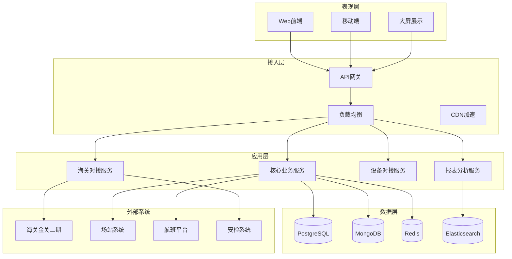

### 3.1.2 微服务架构

| 服务名称 | 功能说明 | 技术栈 |
|----------|----------|--------|
| 基础数据服务 | 航班、货物、客户、仓库等基础数据管理 | Spring Boot + PostgreSQL |
| 海关对接服务 | 与金关二期系统、安检系统的接口对接 | Spring Boot + WebService/REST |
| 设备对接服务 | 地磅、车牌识别、PLC等硬件设备对接 | Spring Boot + MQTT/Modbus |
| 仓储作业服务 | 入库、库内、出库作业管理 | Spring Boot + PostgreSQL |
| 车辆调度服务 | 车辆预约、排队、调度管理 | Spring Boot + Redis |
| 分拣控制服务 | 分拣线PLC控制、分拣逻辑 | Spring Boot + PLC通信 |
| 报表分析服务 | 数据统计、BI分析、大屏展示 | Spring Boot + ClickHouse |
| 消息通知服务 | 短信、推送、邮件通知 | Spring Boot + RabbitMQ |

## 3.2 逻辑架构设计

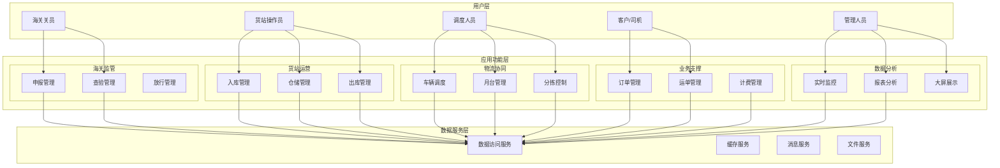

## 3.3 功能架构设计

### 3.3.1 功能模块总览

```
国际物流航空货站运行平台及海关信息平台
├── 1. 基础资料管理
│   ├── 1.1 航班信息管理
│   ├── 1.2 物料/货物管理
│   ├── 1.3 客户管理
│   ├── 1.4 仓库基础设置
│   ├── 1.5 资源管理
│   └── 1.6 审批管理配置
├── 2. 海关监管通关
│   ├── 2.1 智能卡口控制
│   ├── 2.2 查验预警处置
│   ├── 2.3 货物预报管理
│   └── 2.4 安检系统对接
├── 3. 仓储作业管理
│   ├── 3.1 入库管理
│   ├── 3.2 库内管理
│   ├── 3.3 出库管理
│   └── 3.4 打板作业管理
├── 4. 分拣线控制管理
│   ├── 4.1 分拣调度
│   ├── 4.2 设备控制
│   ├── 4.3 流程调度
│   └── 4.4 数据分析
├── 5. 物流协同管理
│   ├── 5.1 货包机集货跟踪
│   ├── 5.2 订单管理
│   ├── 5.3 运单管理
│   ├── 5.4 车辆调度
│   └── 5.5 月台管理
├── 6. 计费财务管理
│   ├── 6.1 计费规则设置
│   ├── 6.2 应收核算
│   ├── 6.3 应付核算
│   └── 6.4 报价管理
├── 7. 客服业务管理
│   ├── 7.1 在线客服
│   ├── 7.2 工单管理
│   └── 7.3 知识库
├── 8. 运行监控中心
│   ├── 8.1 综合态势大屏
│   ├── 8.2 交通态势监控
│   ├── 8.3 安防态势监控
│   └── 8.4 设备设施监控
├── 9. 跨境电商业务
│   ├── 9.1 9610业务管理
│   ├── 9.2 9710业务管理
│   └── 9.3 9810业务管理
├── 10. 区区联动管理
│   ├── 10.1 港站联动
│   ├── 10.2 多区联动
│   └── 10.3 账册管理
└── 11. 系统管理
    ├── 11.1 权限管理
    ├── 11.2 日志审计
    ├── 11.3 系统配置
    └── 11.4 接口对接管理
```

## 3.4 网络架构设计

### 3.4.1 网络拓扑结构

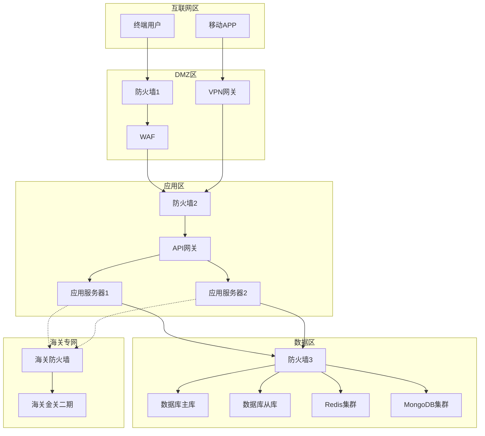

### 3.4.2 网络安全分区

| 区域 | 安全等级 | 主要部署 |
|------|----------|----------|
| 互联网区 | 低 | CDN、DNS、负载均衡 |
| DMZ区 | 中 | WAF、VPN网关、反向代理 |
| 应用区 | 高 | 应用服务器、缓存服务器 |
| 数据区 | 极高 | 数据库服务器、文件存储 |
| 海关专网 | 极高 | 海关接口前置机 |

---

# 4. 功能及流程设计

## 4.1 核心业务流程

### 4.1.1 货物入站流程

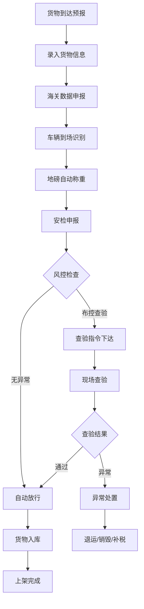

**流程说明：**
1. **货物预报录入**：货站操作员根据运单信息在系统中录入货物预报
2. **海关数据申报**：系统自动向海关金关二期系统申报货物数据
3. **车辆到场识别**：货车到达卡口，系统自动识别车牌号
4. **地磅自动称重**：系统自动采集货物重量
5. **安检申报**：系统自动向安检系统申报
6. **风控检查**：系统根据预设规则进行风控检查
7. **验核结果处理**：无异常货物自动放行，有异常货物转入查验流程
8. **货物入库上架**：放行货物进入仓库，PDA扫码确认库位

### 4.1.2 查验作业流程

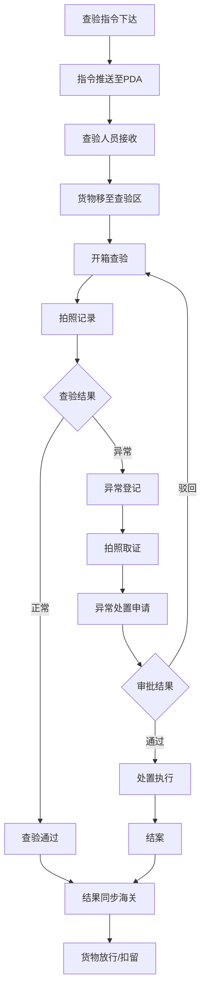

### 4.1.3 货物出站流程

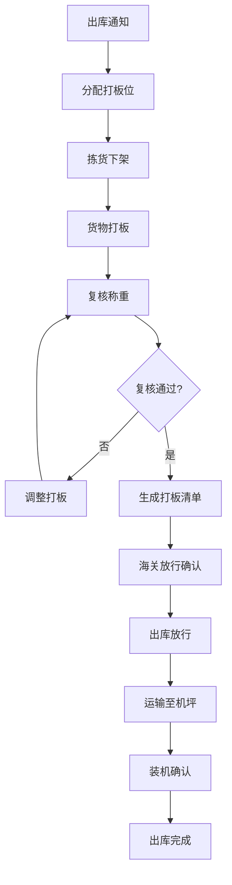

### 4.1.4 车辆调度流程

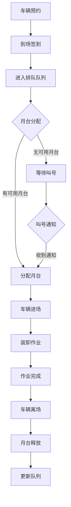

## 4.2 功能模块详细设计

> 本节按功能清单中的171个页面进行详细设计，每个页面包含：功能目标、核心功能点、业务流程、数据结构设计、权限设计。


### 4.2.1 [海关信息系统-智能卡口控制] 设备管理


**功能目标**：实现车辆自动识别、自动称重、自动验核，提升卡口通行效率

**核心功能点：**
1. **车牌识别**：摄像头自动识别车牌，识别成功率≥95%
2. **地磅称重**：自动采集货物重量，与预报重量差异超过±5%触发预警
3. **金关验核**：自动向金关二期发送验核请求，实时接收回执
4. **道闸控制**：根据验核结果自动控制道闸开启/关闭

**业务流程：**
1. 车辆到达卡口，地感线圈触发
2. 摄像头识别车牌，识别失败时允许人工补录
3. 地磅采集重量
4. 系统查询预报信息，向金关二期发送验核请求
5. 根据验核结果控制道闸：直接放行/布控查验/禁止通行
6. 保存通行记录


### 4.2.2 [海关信息系统-智能卡口控制] 车辆识别


**功能目标**：实现车辆自动识别、自动称重、自动验核，提升卡口通行效率

**核心功能点：**
1. **车牌识别**：摄像头自动识别车牌，识别成功率≥95%
2. **地磅称重**：自动采集货物重量，与预报重量差异超过±5%触发预警
3. **金关验核**：自动向金关二期发送验核请求，实时接收回执
4. **道闸控制**：根据验核结果自动控制道闸开启/关闭

**业务流程：**
1. 车辆到达卡口，地感线圈触发
2. 摄像头识别车牌，识别失败时允许人工补录
3. 地磅采集重量
4. 系统查询预报信息，向金关二期发送验核请求
5. 根据验核结果控制道闸：直接放行/布控查验/禁止通行
6. 保存通行记录


### 4.2.3 [海关信息系统-智能卡口控制] 地磅称重


**功能目标**：实现车辆自动识别、自动称重、自动验核，提升卡口通行效率

**核心功能点：**
1. **车牌识别**：摄像头自动识别车牌，识别成功率≥95%
2. **地磅称重**：自动采集货物重量，与预报重量差异超过±5%触发预警
3. **金关验核**：自动向金关二期发送验核请求，实时接收回执
4. **道闸控制**：根据验核结果自动控制道闸开启/关闭

**业务流程：**
1. 车辆到达卡口，地感线圈触发
2. 摄像头识别车牌，识别失败时允许人工补录
3. 地磅采集重量
4. 系统查询预报信息，向金关二期发送验核请求
5. 根据验核结果控制道闸：直接放行/布控查验/禁止通行
6. 保存通行记录


### 4.2.4 [海关信息系统-智能卡口控制] 金关对接


**功能目标**：实现车辆自动识别、自动称重、自动验核，提升卡口通行效率

**核心功能点：**
1. **车牌识别**：摄像头自动识别车牌，识别成功率≥95%
2. **地磅称重**：自动采集货物重量，与预报重量差异超过±5%触发预警
3. **金关验核**：自动向金关二期发送验核请求，实时接收回执
4. **道闸控制**：根据验核结果自动控制道闸开启/关闭

**业务流程：**
1. 车辆到达卡口，地感线圈触发
2. 摄像头识别车牌，识别失败时允许人工补录
3. 地磅采集重量
4. 系统查询预报信息，向金关二期发送验核请求
5. 根据验核结果控制道闸：直接放行/布控查验/禁止通行
6. 保存通行记录


### 4.2.5 [海关信息系统-智能卡口控制] 安检对接


**功能目标**：实现车辆自动识别、自动称重、自动验核，提升卡口通行效率

**核心功能点：**
1. **车牌识别**：摄像头自动识别车牌，识别成功率≥95%
2. **地磅称重**：自动采集货物重量，与预报重量差异超过±5%触发预警
3. **金关验核**：自动向金关二期发送验核请求，实时接收回执
4. **道闸控制**：根据验核结果自动控制道闸开启/关闭

**业务流程：**
1. 车辆到达卡口，地感线圈触发
2. 摄像头识别车牌，识别失败时允许人工补录
3. 地磅采集重量
4. 系统查询预报信息，向金关二期发送验核请求
5. 根据验核结果控制道闸：直接放行/布控查验/禁止通行
6. 保存通行记录


### 4.2.6 [海关信息系统-查验预警处置] 查验筛选


**功能目标**：实现查验指令实时接收、查验作业便捷执行、异常处置标准化

**核心功能点：**
1. **AI智能筛选**：根据海关风控规则自动筛选待查验货物
2. **指令实时推送**：查验指令实时推送至现场查验人员PDA
3. **移动查验**：PDA端查验作业，支持拍照留痕、结果录入
4. **异常处置**：标准化异常处置流程，支持多级审批

**业务流程：**
1. 海关风控系统判定货物需要查验
2. 系统在查验预警池生成查验指令
3. 指令实时推送至现场查验人员PDA
4. 查验人员根据指令进行开箱查验
5. 查验过程拍照记录，录入查验结果
6. 查验结果实时同步至海关系统


### 4.2.7 [海关信息系统-查验预警处置] 指令下发


**功能目标**：实现查验指令实时接收、查验作业便捷执行、异常处置标准化

**核心功能点：**
1. **AI智能筛选**：根据海关风控规则自动筛选待查验货物
2. **指令实时推送**：查验指令实时推送至现场查验人员PDA
3. **移动查验**：PDA端查验作业，支持拍照留痕、结果录入
4. **异常处置**：标准化异常处置流程，支持多级审批

**业务流程：**
1. 海关风控系统判定货物需要查验
2. 系统在查验预警池生成查验指令
3. 指令实时推送至现场查验人员PDA
4. 查验人员根据指令进行开箱查验
5. 查验过程拍照记录，录入查验结果
6. 查验结果实时同步至海关系统


### 4.2.8 [海关信息系统-查验预警处置] 结果录入


**功能目标**：实现查验指令实时接收、查验作业便捷执行、异常处置标准化

**核心功能点：**
1. **AI智能筛选**：根据海关风控规则自动筛选待查验货物
2. **指令实时推送**：查验指令实时推送至现场查验人员PDA
3. **移动查验**：PDA端查验作业，支持拍照留痕、结果录入
4. **异常处置**：标准化异常处置流程，支持多级审批

**业务流程：**
1. 海关风控系统判定货物需要查验
2. 系统在查验预警池生成查验指令
3. 指令实时推送至现场查验人员PDA
4. 查验人员根据指令进行开箱查验
5. 查验过程拍照记录，录入查验结果
6. 查验结果实时同步至海关系统


### 4.2.9 [海关信息系统-查验预警处置] 异常处置


**功能目标**：实现查验指令实时接收、查验作业便捷执行、异常处置标准化

**核心功能点：**
1. **AI智能筛选**：根据海关风控规则自动筛选待查验货物
2. **指令实时推送**：查验指令实时推送至现场查验人员PDA
3. **移动查验**：PDA端查验作业，支持拍照留痕、结果录入
4. **异常处置**：标准化异常处置流程，支持多级审批

**业务流程：**
1. 海关风控系统判定货物需要查验
2. 系统在查验预警池生成查验指令
3. 指令实时推送至现场查验人员PDA
4. 查验人员根据指令进行开箱查验
5. 查验过程拍照记录，录入查验结果
6. 查验结果实时同步至海关系统


### 4.2.10 [海关信息系统-货物预报管理] 预报录入


**功能目标**：支持提前录入货物信息，实现通关前置化处理，压缩通关时效30%，减少现场录入等待

**核心功能点：**
1. **货物预报录入**：支持单条录入和Excel批量导入（最多1000条），包含货物信息、运输信息、申报信息
2. **数据校验**：格式校验、逻辑校验、关联校验（收发货人、HS编码等）
3. **海关预录入**：自动向海关金关二期系统提交预录入，接收回执（通过/退单/待审）
4. **安检系统对接**：与机场、海关安检系统对接，前置申报货物信息，接收安检结果

**业务流程：**

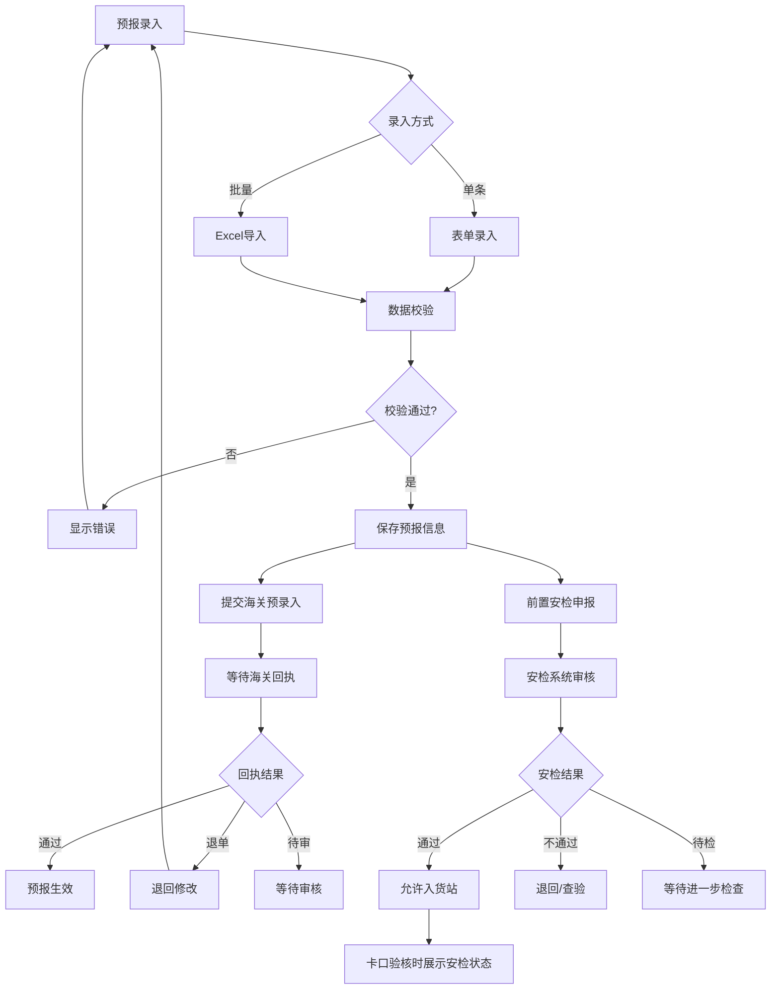

**状态流转：**

| 当前状态 | 操作 | 下一状态 | 条件 |
|----------|------|----------|------|
| 待提交 | 提交海关 | 审核中 | 提交预录入 |
| 审核中 | 收到回执 | 已通过 | 海关审核通过 |
| 审核中 | 收到回执 | 已退单 | 海关退单 |
| 已退单 | 修改重提 | 审核中 | 修改后重新提交 |

**数据结构设计：**

**货物预报表（cargo_forecast）**

| 字段名 | 数据类型 | 长度 | 是否必填 | 默认值 | 说明 |
|--------|----------|------|----------|--------|------|
| id | bigint | - | 是 | 自增 | 主键 |
| forecast_no | varchar | 32 | 是 | - | 预报单号，系统生成 |
| waybill_no | varchar | 20 | 是 | - | 运单号 |
| master_waybill_no | varchar | 11 | 是 | - | 主单号，11位数字 |
| sub_waybill_no | varchar | 20 | 否 | NULL | 分单号 |
| cargo_name | varchar | 200 | 是 | - | 货物品名 |
| piece_count | int | - | 是 | 0 | 货物件数 |
| weight | decimal | 10,2 | 是 | 0 | 货物重量(KG) |
| volume | decimal | 10,3 | 否 | 0 | 货物体积(m³) |
| shipper_id | bigint | - | 是 | - | 发货人ID，关联客户档案 |
| consignee_id | bigint | - | 是 | - | 收货人ID，关联客户档案 |
| hs_code | varchar | 10 | 否 | NULL | HS编码，10位数字 |
| security_status | tinyint | - | 是 | 1 | 安检状态：1待检 2通过 3不通过 4需开箱 |
| security_no | varchar | 32 | 否 | NULL | 安检单号 |
| security_time | datetime | - | 否 | NULL | 安检完成时间 |
| security_image | varchar | 500 | 否 | NULL | 安检图像URL |
| security_result | varchar | 200 | 否 | NULL | 安检详细结论 |
| customs_status | tinyint | - | 是 | 1 | 海关状态：1待提交 2审核中 3已通过 4已退单 |
| customs_return_reason | varchar | 500 | 否 | NULL | 海关退单原因 |
| forecast_time | datetime | - | 是 | 当前时间 | 预报时间 |
| create_by | bigint | - | 是 | - | 创建人 |
| create_time | datetime | - | 是 | 当前时间 | 创建时间 |
| update_by | bigint | - | 否 | NULL | 更新人 |
| update_time | datetime | - | 否 | NULL | 更新时间 |
| del_flag | tinyint | - | 是 | 0 | 删除标记：0正常 1删除 |

**权限设计：**

| 权限项 | 货站操作员 | 调度人员 | 海关关员 | 系统管理员 |
|--------|------------|----------|----------|------------|
| 预报信息查询 | ✅ | ✅ | ✅ | ✅ |
| 预报信息录入 | ✅ | ✅ | ❌ | ✅ |
| 预报信息编辑 | ✅ | ✅ | ❌ | ✅ |
| 预报信息审核 | ❌ | ✅ | ❌ | ✅ |
| 预报信息删除 | ❌ | ❌ | ❌ | ✅ |
| 安检状态查看 | ✅ | ✅ | ✅ | ✅ |


### 4.2.11 [海关信息系统-货物预报管理] 预报审核


**功能目标**：支持提前录入货物信息，实现通关前置化处理，压缩通关时效30%，减少现场录入等待

**核心功能点：**
1. **货物预报录入**：支持单条录入和Excel批量导入（最多1000条），包含货物信息、运输信息、申报信息
2. **数据校验**：格式校验、逻辑校验、关联校验（收发货人、HS编码等）
3. **海关预录入**：自动向海关金关二期系统提交预录入，接收回执（通过/退单/待审）
4. **安检系统对接**：与机场、海关安检系统对接，前置申报货物信息，接收安检结果

**业务流程：**


**状态流转：**

| 当前状态 | 操作 | 下一状态 | 条件 |
|----------|------|----------|------|
| 待提交 | 提交海关 | 审核中 | 提交预录入 |
| 审核中 | 收到回执 | 已通过 | 海关审核通过 |
| 审核中 | 收到回执 | 已退单 | 海关退单 |
| 已退单 | 修改重提 | 审核中 | 修改后重新提交 |

**数据结构设计：**

**货物预报表（cargo_forecast）**

| 字段名 | 数据类型 | 长度 | 是否必填 | 默认值 | 说明 |
|--------|----------|------|----------|--------|------|
| id | bigint | - | 是 | 自增 | 主键 |
| forecast_no | varchar | 32 | 是 | - | 预报单号，系统生成 |
| waybill_no | varchar | 20 | 是 | - | 运单号 |
| master_waybill_no | varchar | 11 | 是 | - | 主单号，11位数字 |
| sub_waybill_no | varchar | 20 | 否 | NULL | 分单号 |
| cargo_name | varchar | 200 | 是 | - | 货物品名 |
| piece_count | int | - | 是 | 0 | 货物件数 |
| weight | decimal | 10,2 | 是 | 0 | 货物重量(KG) |
| volume | decimal | 10,3 | 否 | 0 | 货物体积(m³) |
| shipper_id | bigint | - | 是 | - | 发货人ID，关联客户档案 |
| consignee_id | bigint | - | 是 | - | 收货人ID，关联客户档案 |
| hs_code | varchar | 10 | 否 | NULL | HS编码，10位数字 |
| security_status | tinyint | - | 是 | 1 | 安检状态：1待检 2通过 3不通过 4需开箱 |
| security_no | varchar | 32 | 否 | NULL | 安检单号 |
| security_time | datetime | - | 否 | NULL | 安检完成时间 |
| security_image | varchar | 500 | 否 | NULL | 安检图像URL |
| security_result | varchar | 200 | 否 | NULL | 安检详细结论 |
| customs_status | tinyint | - | 是 | 1 | 海关状态：1待提交 2审核中 3已通过 4已退单 |
| customs_return_reason | varchar | 500 | 否 | NULL | 海关退单原因 |
| forecast_time | datetime | - | 是 | 当前时间 | 预报时间 |
| create_by | bigint | - | 是 | - | 创建人 |
| create_time | datetime | - | 是 | 当前时间 | 创建时间 |
| update_by | bigint | - | 否 | NULL | 更新人 |
| update_time | datetime | - | 否 | NULL | 更新时间 |
| del_flag | tinyint | - | 是 | 0 | 删除标记：0正常 1删除 |

**权限设计：**

| 权限项 | 货站操作员 | 调度人员 | 海关关员 | 系统管理员 |
|--------|------------|----------|----------|------------|
| 预报信息查询 | ✅ | ✅ | ✅ | ✅ |
| 预报信息录入 | ✅ | ✅ | ❌ | ✅ |
| 预报信息编辑 | ✅ | ✅ | ❌ | ✅ |
| 预报信息审核 | ❌ | ✅ | ❌ | ✅ |
| 预报信息删除 | ❌ | ❌ | ❌ | ✅ |
| 安检状态查看 | ✅ | ✅ | ✅ | ✅ |


### 4.2.12 [海关信息系统-货物预报管理] 预录入回执


**功能目标**：支持提前录入货物信息，实现通关前置化处理，压缩通关时效30%，减少现场录入等待

**核心功能点：**
1. **货物预报录入**：支持单条录入和Excel批量导入（最多1000条），包含货物信息、运输信息、申报信息
2. **数据校验**：格式校验、逻辑校验、关联校验（收发货人、HS编码等）
3. **海关预录入**：自动向海关金关二期系统提交预录入，接收回执（通过/退单/待审）
4. **安检系统对接**：与机场、海关安检系统对接，前置申报货物信息，接收安检结果

**业务流程：**


**状态流转：**

| 当前状态 | 操作 | 下一状态 | 条件 |
|----------|------|----------|------|
| 待提交 | 提交海关 | 审核中 | 提交预录入 |
| 审核中 | 收到回执 | 已通过 | 海关审核通过 |
| 审核中 | 收到回执 | 已退单 | 海关退单 |
| 已退单 | 修改重提 | 审核中 | 修改后重新提交 |

**数据结构设计：**

**货物预报表（cargo_forecast）**

| 字段名 | 数据类型 | 长度 | 是否必填 | 默认值 | 说明 |
|--------|----------|------|----------|--------|------|
| id | bigint | - | 是 | 自增 | 主键 |
| forecast_no | varchar | 32 | 是 | - | 预报单号，系统生成 |
| waybill_no | varchar | 20 | 是 | - | 运单号 |
| master_waybill_no | varchar | 11 | 是 | - | 主单号，11位数字 |
| sub_waybill_no | varchar | 20 | 否 | NULL | 分单号 |
| cargo_name | varchar | 200 | 是 | - | 货物品名 |
| piece_count | int | - | 是 | 0 | 货物件数 |
| weight | decimal | 10,2 | 是 | 0 | 货物重量(KG) |
| volume | decimal | 10,3 | 否 | 0 | 货物体积(m³) |
| shipper_id | bigint | - | 是 | - | 发货人ID，关联客户档案 |
| consignee_id | bigint | - | 是 | - | 收货人ID，关联客户档案 |
| hs_code | varchar | 10 | 否 | NULL | HS编码，10位数字 |
| security_status | tinyint | - | 是 | 1 | 安检状态：1待检 2通过 3不通过 4需开箱 |
| security_no | varchar | 32 | 否 | NULL | 安检单号 |
| security_time | datetime | - | 否 | NULL | 安检完成时间 |
| security_image | varchar | 500 | 否 | NULL | 安检图像URL |
| security_result | varchar | 200 | 否 | NULL | 安检详细结论 |
| customs_status | tinyint | - | 是 | 1 | 海关状态：1待提交 2审核中 3已通过 4已退单 |
| customs_return_reason | varchar | 500 | 否 | NULL | 海关退单原因 |
| forecast_time | datetime | - | 是 | 当前时间 | 预报时间 |
| create_by | bigint | - | 是 | - | 创建人 |
| create_time | datetime | - | 是 | 当前时间 | 创建时间 |
| update_by | bigint | - | 否 | NULL | 更新人 |
| update_time | datetime | - | 否 | NULL | 更新时间 |
| del_flag | tinyint | - | 是 | 0 | 删除标记：0正常 1删除 |

**权限设计：**

| 权限项 | 货站操作员 | 调度人员 | 海关关员 | 系统管理员 |
|--------|------------|----------|----------|------------|
| 预报信息查询 | ✅ | ✅ | ✅ | ✅ |
| 预报信息录入 | ✅ | ✅ | ❌ | ✅ |
| 预报信息编辑 | ✅ | ✅ | ❌ | ✅ |
| 预报信息审核 | ❌ | ✅ | ❌ | ✅ |
| 预报信息删除 | ❌ | ❌ | ❌ | ✅ |
| 安检状态查看 | ✅ | ✅ | ✅ | ✅ |


### 4.2.13 [海关信息系统-跨境电商] 9610业务管理


**功能目标**：全面支持9610/9710/9810等跨境电商业务模式，对接海关跨境电商通关服务平台，提升跨境电商通关效率，降低企业运营成本

**核心功能点**：
1. **9610零售出口业务**：订单抓取/导入、三单对碰、清单生成、海关申报、分拣线集货、查验/放行、汇总申报、退税申请
2. **9710 B2B直接出口业务**：订单备案、报关单生成、海关申报、退税管理、统计分析
3. **9810海外仓出口业务**：海外仓备案、备货计划、库存同步、退货管理、退税管理
4. **分拣线联动**：跨境电商货物专用标签、海关布控自动路由、查验分流、优先装载

**业务流程**：

**9610零售出口业务流程**：
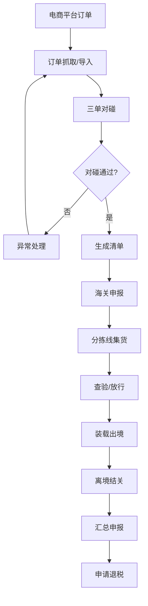

**9710 B2B直接出口业务流程**：
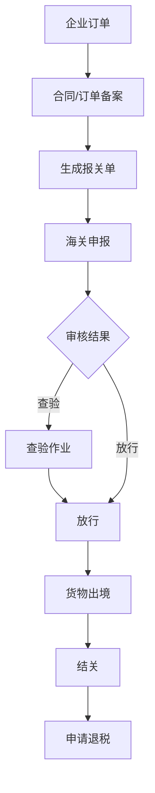

**9810海外仓出口业务流程**：
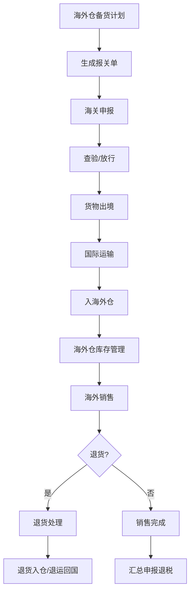

**数据结构设计**：

**跨境电商订单表（cbec_order）**

| 字段名 | 数据类型 | 长度 | 是否必填 | 默认值 | 说明 |
|--------|----------|------|----------|--------|------|
| id | bigint | - | 是 | 自增 | 主键 |
| order_no | varchar | 32 | 是 | - | 订单编号 |
| platform_code | varchar | 20 | 是 | - | 电商平台代码 |
| platform_name | varchar | 50 | 是 | - | 电商平台名称 |
| business_type | tinyint | - | 是 | - | 业务模式：19610 29710 39810 |
| ecommerce_code | varchar | 20 | 是 | - | 电商企业编码 |
| ecommerce_name | varchar | 100 | 是 | - | 电商企业名称 |
| order_amount | decimal | 12,2 | 是 | - | 订单金额 |
| currency | varchar | 3 | 是 | CNY | 币种 |
| receiver_name | varchar | 50 | 是 | - | 收货人姓名 |
| receiver_address | varchar | 200 | 是 | - | 收货人地址 |
| receiver_phone | varchar | 20 | 是 | - | 收货人电话 |
| receiver_idcard | varchar | 18 | 否 | NULL | 收货人身份证号 |
| pay_no | varchar | 32 | 否 | NULL | 支付单号 |
| pay_amount | decimal | 12,2 | 否 | NULL | 支付金额 |
| pay_time | datetime | - | 否 | NULL | 支付时间 |
| logistics_no | varchar | 32 | 否 | NULL | 物流运单号 |
| logistics_company | varchar | 50 | 否 | NULL | 物流企业 |
| match_status | tinyint | - | 是 | 1 | 对碰状态：1待对碰 2对碰中 3通过 4失败 |
| match_result | text | - | 否 | NULL | 对碰结果说明 |
| status | tinyint | - | 是 | 1 | 状态：1待申报 2申报中 3已放行 4查验 5退单 |
| create_time | datetime | - | 是 | 当前时间 | 创建时间 |
| update_time | datetime | - | 是 | 当前时间 | 更新时间 |

**海关清单表（cbec_manifest）**

| 字段名 | 数据类型 | 长度 | 是否必填 | 默认值 | 说明 |
|--------|----------|------|----------|--------|------|
| id | bigint | - | 是 | 自增 | 主键 |
| manifest_no | varchar | 32 | 是 | - | 海关清单编号 |
| pre_manifest_no | varchar | 32 | 是 | - | 预录入编号 |
| business_type | tinyint | - | 是 | - | 业务模式：19610 29710 39810 |
| manifest_type | tinyint | - | 是 | 1 | 清单类型：1新增 2变更 3撤销 |
| ecommerce_code | varchar | 20 | 是 | - | 电商企业编码 |
| total_amount | decimal | 12,2 | 是 | - | 总金额 |
| total_count | int | - | 是 | - | 总件数 |
| total_weight | decimal | 10,2 | 是 | - | 总重量 |
| sender_name | varchar | 50 | 是 | - | 发货人姓名 |
| sender_address | varchar | 200 | 是 | - | 发货人地址 |
| sender_phone | varchar | 20 | 是 | - | 发货人电话 |
| receiver_name | varchar | 50 | 是 | - | 收货人姓名 |
| receiver_address | varchar | 200 | 是 | - | 收货人地址 |
| receiver_phone | varchar | 20 | 是 | - | 收货人电话 |
| logistics_company | varchar | 50 | 是 | - | 物流企业 |
| logistics_no | varchar | 32 | 是 | - | 物流运单号 |
| declare_status | tinyint | - | 是 | 1 | 申报状态：1待申报 2申报中 3已申报 4退单 5放行 |
| customs_return | text | - | 否 | NULL | 海关回执 |
| create_time | datetime | - | 是 | 当前时间 | 创建时间 |
| update_time | datetime | - | 是 | 当前时间 | 更新时间 |

**清单明细表（cbec_manifest_detail）**

| 字段名 | 数据类型 | 长度 | 是否必填 | 默认值 | 说明 |
|--------|----------|------|----------|--------|------|
| id | bigint | - | 是 | 自增 | 主键 |
| manifest_id | bigint | - | 是 | - | 清单ID |
| item_no | int | - | 是 | - | 项号 |
| hs_code | varchar | 10 | 是 | - | HS编码 |
| goods_name | varchar | 100 | 是 | - | 商品名称 |
| goods_spec | varchar | 200 | 否 | NULL | 规格型号 |
| quantity | int | - | 是 | - | 数量 |
| unit | varchar | 10 | 是 | - | 计量单位 |
| unit_price | decimal | 10,2 | 是 | - | 单价 |
| total_price | decimal | 12,2 | 是 | - | 总价 |
| currency | varchar | 3 | 是 | CNY | 币种 |
| origin_country | varchar | 3 | 否 | NULL | 原产国 |

**报关单表（cbec_declaration）**

| 字段名 | 数据类型 | 长度 | 是否必填 | 默认值 | 说明 |
|--------|----------|------|----------|--------|------|
| id | bigint | - | 是 | 自增 | 主键 |
| declaration_no | varchar | 18 | 是 | - | 海关报关单号 |
| pre_entry_no | varchar | 32 | 是 | - | 预录入编号 |
| business_type | tinyint | - | 是 | - | 业务模式：19710 29810 |
| trade_mode | varchar | 4 | 是 | - | 贸易方式：9710/9810 |
| consignee | varchar | 100 | 是 | - | 境外收货人 |
| consignee_country | varchar | 3 | 是 | - | 收货人国别 |
| trade_terms | varchar | 3 | 是 | - | 成交方式：FOB/CIF/CFR |
| freight | decimal | 12,2 | 否 | 0 | 运费 |
| insurance | decimal | 12,2 | 否 | 0 | 保费 |
| total_amount | decimal | 12,2 | 是 | - | 总金额 |
| total_weight | decimal | 10,2 | 是 | - | 总重量 |
| declare_status | tinyint | - | 是 | 1 | 申报状态：1待申报 2申报中 3已申报 4退单 5放行 6结关 |
| customs_return | text | - | 否 | NULL | 海关回执 |
| create_time | datetime | - | 是 | 当前时间 | 创建时间 |
| update_time | datetime | - | 是 | 当前时间 | 更新时间 |

**海外仓库存表（cbec_overseas_inventory）**

| 字段名 | 数据类型 | 长度 | 是否必填 | 默认值 | 说明 |
|--------|----------|------|----------|--------|------|
| id | bigint | - | 是 | 自增 | 主键 |
| warehouse_code | varchar | 20 | 是 | - | 海外仓编码 |
| warehouse_name | varchar | 100 | 是 | - | 海外仓名称 |
| warehouse_country | varchar | 3 | 是 | - | 仓库所在国 |
| sku | varchar | 50 | 是 | - | 商品SKU |
| hs_code | varchar | 10 | 是 | - | HS编码 |
| goods_name | varchar | 100 | 是 | - | 商品名称 |
| stock_qty | int | - | 是 | 0 | 库存数量 |
| in_transit_qty | int | - | 是 | 0 | 在途数量 |
| frozen_qty | int | - | 是 | 0 | 冻结数量 |
| available_qty | int | - | 是 | 0 | 可售数量 |
| last_sync_time | datetime | - | 否 | NULL | 最后同步时间 |
| create_time | datetime | - | 是 | 当前时间 | 创建时间 |
| update_time | datetime | - | 是 | 当前时间 | 更新时间 |

**权限设计**：

| 权限项 | 电商操作员 | 电商审核员 | 海关关员 | 系统管理员 |
|--------|------------|------------|----------|------------|
| 订单查询 | ✅ | ✅ | ✅ | ✅ |
| 订单录入 | ✅ | ❌ | ❌ | ✅ |
| 订单审核 | ❌ | ✅ | ❌ | ✅ |
| 清单申报 | ✅ | ✅ | ❌ | ✅ |
| 汇总申报 | ❌ | ✅ | ❌ | ✅ |
| 数据查看 | ✅ | ✅ | ✅ | ✅ |


### 4.2.14 [海关信息系统-跨境电商] 9710业务管理


**功能目标**：全面支持9610/9710/9810等跨境电商业务模式，对接海关跨境电商通关服务平台，提升跨境电商通关效率，降低企业运营成本

**核心功能点**：
1. **9610零售出口业务**：订单抓取/导入、三单对碰、清单生成、海关申报、分拣线集货、查验/放行、汇总申报、退税申请
2. **9710 B2B直接出口业务**：订单备案、报关单生成、海关申报、退税管理、统计分析
3. **9810海外仓出口业务**：海外仓备案、备货计划、库存同步、退货管理、退税管理
4. **分拣线联动**：跨境电商货物专用标签、海关布控自动路由、查验分流、优先装载

**业务流程**：

**9610零售出口业务流程**：


**9710 B2B直接出口业务流程**：


**9810海外仓出口业务流程**：


**数据结构设计**：

**跨境电商订单表（cbec_order）**

| 字段名 | 数据类型 | 长度 | 是否必填 | 默认值 | 说明 |
|--------|----------|------|----------|--------|------|
| id | bigint | - | 是 | 自增 | 主键 |
| order_no | varchar | 32 | 是 | - | 订单编号 |
| platform_code | varchar | 20 | 是 | - | 电商平台代码 |
| platform_name | varchar | 50 | 是 | - | 电商平台名称 |
| business_type | tinyint | - | 是 | - | 业务模式：19610 29710 39810 |
| ecommerce_code | varchar | 20 | 是 | - | 电商企业编码 |
| ecommerce_name | varchar | 100 | 是 | - | 电商企业名称 |
| order_amount | decimal | 12,2 | 是 | - | 订单金额 |
| currency | varchar | 3 | 是 | CNY | 币种 |
| receiver_name | varchar | 50 | 是 | - | 收货人姓名 |
| receiver_address | varchar | 200 | 是 | - | 收货人地址 |
| receiver_phone | varchar | 20 | 是 | - | 收货人电话 |
| receiver_idcard | varchar | 18 | 否 | NULL | 收货人身份证号 |
| pay_no | varchar | 32 | 否 | NULL | 支付单号 |
| pay_amount | decimal | 12,2 | 否 | NULL | 支付金额 |
| pay_time | datetime | - | 否 | NULL | 支付时间 |
| logistics_no | varchar | 32 | 否 | NULL | 物流运单号 |
| logistics_company | varchar | 50 | 否 | NULL | 物流企业 |
| match_status | tinyint | - | 是 | 1 | 对碰状态：1待对碰 2对碰中 3通过 4失败 |
| match_result | text | - | 否 | NULL | 对碰结果说明 |
| status | tinyint | - | 是 | 1 | 状态：1待申报 2申报中 3已放行 4查验 5退单 |
| create_time | datetime | - | 是 | 当前时间 | 创建时间 |
| update_time | datetime | - | 是 | 当前时间 | 更新时间 |

**海关清单表（cbec_manifest）**

| 字段名 | 数据类型 | 长度 | 是否必填 | 默认值 | 说明 |
|--------|----------|------|----------|--------|------|
| id | bigint | - | 是 | 自增 | 主键 |
| manifest_no | varchar | 32 | 是 | - | 海关清单编号 |
| pre_manifest_no | varchar | 32 | 是 | - | 预录入编号 |
| business_type | tinyint | - | 是 | - | 业务模式：19610 29710 39810 |
| manifest_type | tinyint | - | 是 | 1 | 清单类型：1新增 2变更 3撤销 |
| ecommerce_code | varchar | 20 | 是 | - | 电商企业编码 |
| total_amount | decimal | 12,2 | 是 | - | 总金额 |
| total_count | int | - | 是 | - | 总件数 |
| total_weight | decimal | 10,2 | 是 | - | 总重量 |
| sender_name | varchar | 50 | 是 | - | 发货人姓名 |
| sender_address | varchar | 200 | 是 | - | 发货人地址 |
| sender_phone | varchar | 20 | 是 | - | 发货人电话 |
| receiver_name | varchar | 50 | 是 | - | 收货人姓名 |
| receiver_address | varchar | 200 | 是 | - | 收货人地址 |
| receiver_phone | varchar | 20 | 是 | - | 收货人电话 |
| logistics_company | varchar | 50 | 是 | - | 物流企业 |
| logistics_no | varchar | 32 | 是 | - | 物流运单号 |
| declare_status | tinyint | - | 是 | 1 | 申报状态：1待申报 2申报中 3已申报 4退单 5放行 |
| customs_return | text | - | 否 | NULL | 海关回执 |
| create_time | datetime | - | 是 | 当前时间 | 创建时间 |
| update_time | datetime | - | 是 | 当前时间 | 更新时间 |

**清单明细表（cbec_manifest_detail）**

| 字段名 | 数据类型 | 长度 | 是否必填 | 默认值 | 说明 |
|--------|----------|------|----------|--------|------|
| id | bigint | - | 是 | 自增 | 主键 |
| manifest_id | bigint | - | 是 | - | 清单ID |
| item_no | int | - | 是 | - | 项号 |
| hs_code | varchar | 10 | 是 | - | HS编码 |
| goods_name | varchar | 100 | 是 | - | 商品名称 |
| goods_spec | varchar | 200 | 否 | NULL | 规格型号 |
| quantity | int | - | 是 | - | 数量 |
| unit | varchar | 10 | 是 | - | 计量单位 |
| unit_price | decimal | 10,2 | 是 | - | 单价 |
| total_price | decimal | 12,2 | 是 | - | 总价 |
| currency | varchar | 3 | 是 | CNY | 币种 |
| origin_country | varchar | 3 | 否 | NULL | 原产国 |

**报关单表（cbec_declaration）**

| 字段名 | 数据类型 | 长度 | 是否必填 | 默认值 | 说明 |
|--------|----------|------|----------|--------|------|
| id | bigint | - | 是 | 自增 | 主键 |
| declaration_no | varchar | 18 | 是 | - | 海关报关单号 |
| pre_entry_no | varchar | 32 | 是 | - | 预录入编号 |
| business_type | tinyint | - | 是 | - | 业务模式：19710 29810 |
| trade_mode | varchar | 4 | 是 | - | 贸易方式：9710/9810 |
| consignee | varchar | 100 | 是 | - | 境外收货人 |
| consignee_country | varchar | 3 | 是 | - | 收货人国别 |
| trade_terms | varchar | 3 | 是 | - | 成交方式：FOB/CIF/CFR |
| freight | decimal | 12,2 | 否 | 0 | 运费 |
| insurance | decimal | 12,2 | 否 | 0 | 保费 |
| total_amount | decimal | 12,2 | 是 | - | 总金额 |
| total_weight | decimal | 10,2 | 是 | - | 总重量 |
| declare_status | tinyint | - | 是 | 1 | 申报状态：1待申报 2申报中 3已申报 4退单 5放行 6结关 |
| customs_return | text | - | 否 | NULL | 海关回执 |
| create_time | datetime | - | 是 | 当前时间 | 创建时间 |
| update_time | datetime | - | 是 | 当前时间 | 更新时间 |

**海外仓库存表（cbec_overseas_inventory）**

| 字段名 | 数据类型 | 长度 | 是否必填 | 默认值 | 说明 |
|--------|----------|------|----------|--------|------|
| id | bigint | - | 是 | 自增 | 主键 |
| warehouse_code | varchar | 20 | 是 | - | 海外仓编码 |
| warehouse_name | varchar | 100 | 是 | - | 海外仓名称 |
| warehouse_country | varchar | 3 | 是 | - | 仓库所在国 |
| sku | varchar | 50 | 是 | - | 商品SKU |
| hs_code | varchar | 10 | 是 | - | HS编码 |
| goods_name | varchar | 100 | 是 | - | 商品名称 |
| stock_qty | int | - | 是 | 0 | 库存数量 |
| in_transit_qty | int | - | 是 | 0 | 在途数量 |
| frozen_qty | int | - | 是 | 0 | 冻结数量 |
| available_qty | int | - | 是 | 0 | 可售数量 |
| last_sync_time | datetime | - | 否 | NULL | 最后同步时间 |
| create_time | datetime | - | 是 | 当前时间 | 创建时间 |
| update_time | datetime | - | 是 | 当前时间 | 更新时间 |

**权限设计**：

| 权限项 | 电商操作员 | 电商审核员 | 海关关员 | 系统管理员 |
|--------|------------|------------|----------|------------|
| 订单查询 | ✅ | ✅ | ✅ | ✅ |
| 订单录入 | ✅ | ❌ | ❌ | ✅ |
| 订单审核 | ❌ | ✅ | ❌ | ✅ |
| 清单申报 | ✅ | ✅ | ❌ | ✅ |
| 汇总申报 | ❌ | ✅ | ❌ | ✅ |
| 数据查看 | ✅ | ✅ | ✅ | ✅ |


### 4.2.15 [海关信息系统-跨境电商] 9810业务管理


**功能目标**：全面支持9610/9710/9810等跨境电商业务模式，对接海关跨境电商通关服务平台，提升跨境电商通关效率，降低企业运营成本

**核心功能点**：
1. **9610零售出口业务**：订单抓取/导入、三单对碰、清单生成、海关申报、分拣线集货、查验/放行、汇总申报、退税申请
2. **9710 B2B直接出口业务**：订单备案、报关单生成、海关申报、退税管理、统计分析
3. **9810海外仓出口业务**：海外仓备案、备货计划、库存同步、退货管理、退税管理
4. **分拣线联动**：跨境电商货物专用标签、海关布控自动路由、查验分流、优先装载

**业务流程**：

**9610零售出口业务流程**：


**9710 B2B直接出口业务流程**：


**9810海外仓出口业务流程**：


**数据结构设计**：

**跨境电商订单表（cbec_order）**

| 字段名 | 数据类型 | 长度 | 是否必填 | 默认值 | 说明 |
|--------|----------|------|----------|--------|------|
| id | bigint | - | 是 | 自增 | 主键 |
| order_no | varchar | 32 | 是 | - | 订单编号 |
| platform_code | varchar | 20 | 是 | - | 电商平台代码 |
| platform_name | varchar | 50 | 是 | - | 电商平台名称 |
| business_type | tinyint | - | 是 | - | 业务模式：19610 29710 39810 |
| ecommerce_code | varchar | 20 | 是 | - | 电商企业编码 |
| ecommerce_name | varchar | 100 | 是 | - | 电商企业名称 |
| order_amount | decimal | 12,2 | 是 | - | 订单金额 |
| currency | varchar | 3 | 是 | CNY | 币种 |
| receiver_name | varchar | 50 | 是 | - | 收货人姓名 |
| receiver_address | varchar | 200 | 是 | - | 收货人地址 |
| receiver_phone | varchar | 20 | 是 | - | 收货人电话 |
| receiver_idcard | varchar | 18 | 否 | NULL | 收货人身份证号 |
| pay_no | varchar | 32 | 否 | NULL | 支付单号 |
| pay_amount | decimal | 12,2 | 否 | NULL | 支付金额 |
| pay_time | datetime | - | 否 | NULL | 支付时间 |
| logistics_no | varchar | 32 | 否 | NULL | 物流运单号 |
| logistics_company | varchar | 50 | 否 | NULL | 物流企业 |
| match_status | tinyint | - | 是 | 1 | 对碰状态：1待对碰 2对碰中 3通过 4失败 |
| match_result | text | - | 否 | NULL | 对碰结果说明 |
| status | tinyint | - | 是 | 1 | 状态：1待申报 2申报中 3已放行 4查验 5退单 |
| create_time | datetime | - | 是 | 当前时间 | 创建时间 |
| update_time | datetime | - | 是 | 当前时间 | 更新时间 |

**海关清单表（cbec_manifest）**

| 字段名 | 数据类型 | 长度 | 是否必填 | 默认值 | 说明 |
|--------|----------|------|----------|--------|------|
| id | bigint | - | 是 | 自增 | 主键 |
| manifest_no | varchar | 32 | 是 | - | 海关清单编号 |
| pre_manifest_no | varchar | 32 | 是 | - | 预录入编号 |
| business_type | tinyint | - | 是 | - | 业务模式：19610 29710 39810 |
| manifest_type | tinyint | - | 是 | 1 | 清单类型：1新增 2变更 3撤销 |
| ecommerce_code | varchar | 20 | 是 | - | 电商企业编码 |
| total_amount | decimal | 12,2 | 是 | - | 总金额 |
| total_count | int | - | 是 | - | 总件数 |
| total_weight | decimal | 10,2 | 是 | - | 总重量 |
| sender_name | varchar | 50 | 是 | - | 发货人姓名 |
| sender_address | varchar | 200 | 是 | - | 发货人地址 |
| sender_phone | varchar | 20 | 是 | - | 发货人电话 |
| receiver_name | varchar | 50 | 是 | - | 收货人姓名 |
| receiver_address | varchar | 200 | 是 | - | 收货人地址 |
| receiver_phone | varchar | 20 | 是 | - | 收货人电话 |
| logistics_company | varchar | 50 | 是 | - | 物流企业 |
| logistics_no | varchar | 32 | 是 | - | 物流运单号 |
| declare_status | tinyint | - | 是 | 1 | 申报状态：1待申报 2申报中 3已申报 4退单 5放行 |
| customs_return | text | - | 否 | NULL | 海关回执 |
| create_time | datetime | - | 是 | 当前时间 | 创建时间 |
| update_time | datetime | - | 是 | 当前时间 | 更新时间 |

**清单明细表（cbec_manifest_detail）**

| 字段名 | 数据类型 | 长度 | 是否必填 | 默认值 | 说明 |
|--------|----------|------|----------|--------|------|
| id | bigint | - | 是 | 自增 | 主键 |
| manifest_id | bigint | - | 是 | - | 清单ID |
| item_no | int | - | 是 | - | 项号 |
| hs_code | varchar | 10 | 是 | - | HS编码 |
| goods_name | varchar | 100 | 是 | - | 商品名称 |
| goods_spec | varchar | 200 | 否 | NULL | 规格型号 |
| quantity | int | - | 是 | - | 数量 |
| unit | varchar | 10 | 是 | - | 计量单位 |
| unit_price | decimal | 10,2 | 是 | - | 单价 |
| total_price | decimal | 12,2 | 是 | - | 总价 |
| currency | varchar | 3 | 是 | CNY | 币种 |
| origin_country | varchar | 3 | 否 | NULL | 原产国 |

**报关单表（cbec_declaration）**

| 字段名 | 数据类型 | 长度 | 是否必填 | 默认值 | 说明 |
|--------|----------|------|----------|--------|------|
| id | bigint | - | 是 | 自增 | 主键 |
| declaration_no | varchar | 18 | 是 | - | 海关报关单号 |
| pre_entry_no | varchar | 32 | 是 | - | 预录入编号 |
| business_type | tinyint | - | 是 | - | 业务模式：19710 29810 |
| trade_mode | varchar | 4 | 是 | - | 贸易方式：9710/9810 |
| consignee | varchar | 100 | 是 | - | 境外收货人 |
| consignee_country | varchar | 3 | 是 | - | 收货人国别 |
| trade_terms | varchar | 3 | 是 | - | 成交方式：FOB/CIF/CFR |
| freight | decimal | 12,2 | 否 | 0 | 运费 |
| insurance | decimal | 12,2 | 否 | 0 | 保费 |
| total_amount | decimal | 12,2 | 是 | - | 总金额 |
| total_weight | decimal | 10,2 | 是 | - | 总重量 |
| declare_status | tinyint | - | 是 | 1 | 申报状态：1待申报 2申报中 3已申报 4退单 5放行 6结关 |
| customs_return | text | - | 否 | NULL | 海关回执 |
| create_time | datetime | - | 是 | 当前时间 | 创建时间 |
| update_time | datetime | - | 是 | 当前时间 | 更新时间 |

**海外仓库存表（cbec_overseas_inventory）**

| 字段名 | 数据类型 | 长度 | 是否必填 | 默认值 | 说明 |
|--------|----------|------|----------|--------|------|
| id | bigint | - | 是 | 自增 | 主键 |
| warehouse_code | varchar | 20 | 是 | - | 海外仓编码 |
| warehouse_name | varchar | 100 | 是 | - | 海外仓名称 |
| warehouse_country | varchar | 3 | 是 | - | 仓库所在国 |
| sku | varchar | 50 | 是 | - | 商品SKU |
| hs_code | varchar | 10 | 是 | - | HS编码 |
| goods_name | varchar | 100 | 是 | - | 商品名称 |
| stock_qty | int | - | 是 | 0 | 库存数量 |
| in_transit_qty | int | - | 是 | 0 | 在途数量 |
| frozen_qty | int | - | 是 | 0 | 冻结数量 |
| available_qty | int | - | 是 | 0 | 可售数量 |
| last_sync_time | datetime | - | 否 | NULL | 最后同步时间 |
| create_time | datetime | - | 是 | 当前时间 | 创建时间 |
| update_time | datetime | - | 是 | 当前时间 | 更新时间 |

**权限设计**：

| 权限项 | 电商操作员 | 电商审核员 | 海关关员 | 系统管理员 |
|--------|------------|------------|----------|------------|
| 订单查询 | ✅ | ✅ | ✅ | ✅ |
| 订单录入 | ✅ | ❌ | ❌ | ✅ |
| 订单审核 | ❌ | ✅ | ❌ | ✅ |
| 清单申报 | ✅ | ✅ | ❌ | ✅ |
| 汇总申报 | ❌ | ✅ | ❌ | ✅ |
| 数据查看 | ✅ | ✅ | ✅ | ✅ |


### 4.2.16 [海关信息系统-跨境电商] 跨境电商海关对接


**功能目标**：全面支持9610/9710/9810等跨境电商业务模式，对接海关跨境电商通关服务平台，提升跨境电商通关效率，降低企业运营成本

**核心功能点**：
1. **9610零售出口业务**：订单抓取/导入、三单对碰、清单生成、海关申报、分拣线集货、查验/放行、汇总申报、退税申请
2. **9710 B2B直接出口业务**：订单备案、报关单生成、海关申报、退税管理、统计分析
3. **9810海外仓出口业务**：海外仓备案、备货计划、库存同步、退货管理、退税管理
4. **分拣线联动**：跨境电商货物专用标签、海关布控自动路由、查验分流、优先装载

**业务流程**：

**9610零售出口业务流程**：


**9710 B2B直接出口业务流程**：
```mermaid
flowchart TD
    A[企业订单] --> B[合同/订单备案]
    B --> C[生成报关单]
    C --> D[海关申报]
    D --> E{审核结果}
    E -->|查验| F[查验作业]
    F --> G[放行]
    E -->|放行| G
    G --> H[货物出境]
    H --> I[结关]
    I --> J[申请退税]
```

**9810海外仓出口业务流程**：
```mermaid
flowchart TD
    A[海外仓备货计划] --> B[生成报关单]
    B --> C[海关申报]
    C --> D[查验/放行]
    D --> E[货物出境]
    E --> F[国际运输]
    F --> G[入海外仓]
    G --> H[海外仓库存管理]
    H --> I[海外销售]
    I --> J{退货?}
    J -->|是| K[退货处理]
    J -->|否| L[销售完成]
    K --> M[退货入仓/退运回国]
    L --> N[汇总申报退税]
```

**数据结构设计**：

**跨境电商订单表（cbec_order）**

| 字段名 | 数据类型 | 长度 | 是否必填 | 默认值 | 说明 |
|--------|----------|------|----------|--------|------|
| id | bigint | - | 是 | 自增 | 主键 |
| order_no | varchar | 32 | 是 | - | 订单编号 |
| platform_code | varchar | 20 | 是 | - | 电商平台代码 |
| platform_name | varchar | 50 | 是 | - | 电商平台名称 |
| business_type | tinyint | - | 是 | - | 业务模式：19610 29710 39810 |
| ecommerce_code | varchar | 20 | 是 | - | 电商企业编码 |
| ecommerce_name | varchar | 100 | 是 | - | 电商企业名称 |
| order_amount | decimal | 12,2 | 是 | - | 订单金额 |
| currency | varchar | 3 | 是 | CNY | 币种 |
| receiver_name | varchar | 50 | 是 | - | 收货人姓名 |
| receiver_address | varchar | 200 | 是 | - | 收货人地址 |
| receiver_phone | varchar | 20 | 是 | - | 收货人电话 |
| receiver_idcard | varchar | 18 | 否 | NULL | 收货人身份证号 |
| pay_no | varchar | 32 | 否 | NULL | 支付单号 |
| pay_amount | decimal | 12,2 | 否 | NULL | 支付金额 |
| pay_time | datetime | - | 否 | NULL | 支付时间 |
| logistics_no | varchar | 32 | 否 | NULL | 物流运单号 |
| logistics_company | varchar | 50 | 否 | NULL | 物流企业 |
| match_status | tinyint | - | 是 | 1 | 对碰状态：1待对碰 2对碰中 3通过 4失败 |
| match_result | text | - | 否 | NULL | 对碰结果说明 |
| status | tinyint | - | 是 | 1 | 状态：1待申报 2申报中 3已放行 4查验 5退单 |
| create_time | datetime | - | 是 | 当前时间 | 创建时间 |
| update_time | datetime | - | 是 | 当前时间 | 更新时间 |

**海关清单表（cbec_manifest）**

| 字段名 | 数据类型 | 长度 | 是否必填 | 默认值 | 说明 |
|--------|----------|------|----------|--------|------|
| id | bigint | - | 是 | 自增 | 主键 |
| manifest_no | varchar | 32 | 是 | - | 海关清单编号 |
| pre_manifest_no | varchar | 32 | 是 | - | 预录入编号 |
| business_type | tinyint | - | 是 | - | 业务模式：19610 29710 39810 |
| manifest_type | tinyint | - | 是 | 1 | 清单类型：1新增 2变更 3撤销 |
| ecommerce_code | varchar | 20 | 是 | - | 电商企业编码 |
| total_amount | decimal | 12,2 | 是 | - | 总金额 |
| total_count | int | - | 是 | - | 总件数 |
| total_weight | decimal | 10,2 | 是 | - | 总重量 |
| sender_name | varchar | 50 | 是 | - | 发货人姓名 |
| sender_address | varchar | 200 | 是 | - | 发货人地址 |
| sender_phone | varchar | 20 | 是 | - | 发货人电话 |
| receiver_name | varchar | 50 | 是 | - | 收货人姓名 |
| receiver_address | varchar | 200 | 是 | - | 收货人地址 |
| receiver_phone | varchar | 20 | 是 | - | 收货人电话 |
| logistics_company | varchar | 50 | 是 | - | 物流企业 |
| logistics_no | varchar | 32 | 是 | - | 物流运单号 |
| declare_status | tinyint | - | 是 | 1 | 申报状态：1待申报 2申报中 3已申报 4退单 5放行 |
| customs_return | text | - | 否 | NULL | 海关回执 |
| create_time | datetime | - | 是 | 当前时间 | 创建时间 |
| update_time | datetime | - | 是 | 当前时间 | 更新时间 |

**清单明细表（cbec_manifest_detail）**

| 字段名 | 数据类型 | 长度 | 是否必填 | 默认值 | 说明 |
|--------|----------|------|----------|--------|------|
| id | bigint | - | 是 | 自增 | 主键 |
| manifest_id | bigint | - | 是 | - | 清单ID |
| item_no | int | - | 是 | - | 项号 |
| hs_code | varchar | 10 | 是 | - | HS编码 |
| goods_name | varchar | 100 | 是 | - | 商品名称 |
| goods_spec | varchar | 200 | 否 | NULL | 规格型号 |
| quantity | int | - | 是 | - | 数量 |
| unit | varchar | 10 | 是 | - | 计量单位 |
| unit_price | decimal | 10,2 | 是 | - | 单价 |
| total_price | decimal | 12,2 | 是 | - | 总价 |
| currency | varchar | 3 | 是 | CNY | 币种 |
| origin_country | varchar | 3 | 否 | NULL | 原产国 |

**报关单表（cbec_declaration）**

| 字段名 | 数据类型 | 长度 | 是否必填 | 默认值 | 说明 |
|--------|----------|------|----------|--------|------|
| id | bigint | - | 是 | 自增 | 主键 |
| declaration_no | varchar | 18 | 是 | - | 海关报关单号 |
| pre_entry_no | varchar | 32 | 是 | - | 预录入编号 |
| business_type | tinyint | - | 是 | - | 业务模式：19710 29810 |
| trade_mode | varchar | 4 | 是 | - | 贸易方式：9710/9810 |
| consignee | varchar | 100 | 是 | - | 境外收货人 |
| consignee_country | varchar | 3 | 是 | - | 收货人国别 |
| trade_terms | varchar | 3 | 是 | - | 成交方式：FOB/CIF/CFR |
| freight | decimal | 12,2 | 否 | 0 | 运费 |
| insurance | decimal | 12,2 | 否 | 0 | 保费 |
| total_amount | decimal | 12,2 | 是 | - | 总金额 |
| total_weight | decimal | 10,2 | 是 | - | 总重量 |
| declare_status | tinyint | - | 是 | 1 | 申报状态：1待申报 2申报中 3已申报 4退单 5放行 6结关 |
| customs_return | text | - | 否 | NULL | 海关回执 |
| create_time | datetime | - | 是 | 当前时间 | 创建时间 |
| update_time | datetime | - | 是 | 当前时间 | 更新时间 |

**海外仓库存表（cbec_overseas_inventory）**

| 字段名 | 数据类型 | 长度 | 是否必填 | 默认值 | 说明 |
|--------|----------|------|----------|--------|------|
| id | bigint | - | 是 | 自增 | 主键 |
| warehouse_code | varchar | 20 | 是 | - | 海外仓编码 |
| warehouse_name | varchar | 100 | 是 | - | 海外仓名称 |
| warehouse_country | varchar | 3 | 是 | - | 仓库所在国 |
| sku | varchar | 50 | 是 | - | 商品SKU |
| hs_code | varchar | 10 | 是 | - | HS编码 |
| goods_name | varchar | 100 | 是 | - | 商品名称 |
| stock_qty | int | - | 是 | 0 | 库存数量 |
| in_transit_qty | int | - | 是 | 0 | 在途数量 |
| frozen_qty | int | - | 是 | 0 | 冻结数量 |
| available_qty | int | - | 是 | 0 | 可售数量 |
| last_sync_time | datetime | - | 否 | NULL | 最后同步时间 |
| create_time | datetime | - | 是 | 当前时间 | 创建时间 |
| update_time | datetime | - | 是 | 当前时间 | 更新时间 |

**权限设计**：

| 权限项 | 电商操作员 | 电商审核员 | 海关关员 | 系统管理员 |
|--------|------------|------------|----------|------------|
| 订单查询 | ✅ | ✅ | ✅ | ✅ |
| 订单录入 | ✅ | ❌ | ❌ | ✅ |
| 订单审核 | ❌ | ✅ | ❌ | ✅ |
| 清单申报 | ✅ | ✅ | ❌ | ✅ |
| 汇总申报 | ❌ | ✅ | ❌ | ✅ |
| 数据查看 | ✅ | ✅ | ✅ | ✅ |


### 4.2.17 [海关信息系统-分拣线数据分析] 分拣效率分析


**功能目标**：实现货物从入库到打板的全流程自动化分拣控制

**核心功能点：**
1. **分拣调度**：根据货物目的地、航班、目的港确定分拣路径
2. **PLC控制**：通过PLC指令控制分拣设备
3. **全流程跟踪**：货物在分拣线上的实时位置跟踪
4. **打板位管理**：打板位智能分配、打板进度监控

**分拣逻辑：**
- 优先路径：最短时间/最短距离
- 拥堵避让：检测到目标出口拥堵时自动切换备用路径
- 异常处理：无法分拣时转入异常口


### 4.2.18 [海关信息系统-分拣线数据分析] 设备利用率


**功能目标**：实现货物从入库到打板的全流程自动化分拣控制

**核心功能点：**
1. **分拣调度**：根据货物目的地、航班、目的港确定分拣路径
2. **PLC控制**：通过PLC指令控制分拣设备
3. **全流程跟踪**：货物在分拣线上的实时位置跟踪
4. **打板位管理**：打板位智能分配、打板进度监控

**分拣逻辑：**
- 优先路径：最短时间/最短距离
- 拥堵避让：检测到目标出口拥堵时自动切换备用路径
- 异常处理：无法分拣时转入异常口


### 4.2.19 [海关信息系统-海关业务] 海关申报


**功能目标**：实现入库、库内、出库全流程数字化管理

**入库管理：**
- 收货确认、质检、上架
- PDA扫码作业，实时确认库位
- 智能库位推荐

**库内管理：**
- 库存查询、盘点、移位
- 库龄预警、呆滞预警
- 库存调整审批

**出库管理：**
- 打板方案智能推荐
- 拣货下架、复核称重
- 海关放行确认、装机确认


### 4.2.20 [海关信息系统-海关业务] 税费计算


**功能目标**：实现入库、库内、出库全流程数字化管理

**入库管理：**
- 收货确认、质检、上架
- PDA扫码作业，实时确认库位
- 智能库位推荐

**库内管理：**
- 库存查询、盘点、移位
- 库龄预警、呆滞预警
- 库存调整审批

**出库管理：**
- 打板方案智能推荐
- 拣货下架、复核称重
- 海关放行确认、装机确认


### 4.2.21 [海关信息系统-可视化展示] 业务数据大屏


**功能目标**：提供货站运营全景视图，实时监控关键运营指标，支持多维度数据展示与预警，辅助管理决策

**核心功能点**：
1. **综合态势看板**：货量统计、航班动态、库存状态、作业进度、异常告警
2. **交通态势看板**：车辆进出统计、月台占用率、排队情况、通行效率
3. **安防态势看板**：监控点位状态、告警事件、门禁状态、巡检进度
4. **能源态势看板**：能耗统计、设备运行状态、节能指标、成本分析
5. **安全态势看板**：安全事件、隐患整改、培训记录、应急状态
6. **消防态势看板**：消防设施状态、告警记录、演练计划、检查记录
7. **资产态势看板**：资产分布、使用状态、维保计划、折旧统计
8. **设备态势看板**：设备运行状态、故障统计、维修进度、保养提醒

**业务流程**：

**看板数据刷新流程**：
```mermaid
flowchart TD
    A[用户打开看板页面] --> B[建立WebSocket连接]
    B --> C[请求初始数据]
    C --> D[后端聚合数据]
    D --> E[返回看板数据]
    E --> F[渲染看板组件]
    F --> G{是否开启实时刷新}
    G -->|是| H[定时推送数据]
    H --> I[增量更新视图]
    I --> H
    G -->|否| J[保持静态展示]
    J --> K[用户手动刷新]
    K --> C
```

**数据结构设计**：

**看板配置表（dashboard_config）**

| 字段名 | 数据类型 | 长度 | 是否必填 | 默认值 | 说明 |
|--------|----------|------|----------|--------|------|
| id | bigint | - | 是 | 自增 | 主键 |
| dashboard_code | varchar | 50 | 是 | - | 看板编码 |
| dashboard_name | varchar | 100 | 是 | - | 看板名称 |
| dashboard_type | tinyint | - | 是 | - | 看板类型：1综合 2交通 3安防 4能源 5安全 6消防 7资产 8设备 |
| layout_config | json | - | 是 | - | 布局配置JSON |
| widget_list | json | - | 是 | - | 组件列表JSON |
| refresh_interval | int | - | 是 | 5 | 刷新间隔（秒） |
| status | tinyint | - | 是 | 1 | 状态：1启用 2禁用 |
| create_time | datetime | - | 是 | 当前时间 | 创建时间 |
| update_time | datetime | - | 是 | 当前时间 | 更新时间 |

**看板指标数据表（dashboard_metric）**

| 字段名 | 数据类型 | 长度 | 是否必填 | 默认值 | 说明 |
|--------|----------|------|----------|--------|------|
| id | bigint | - | 是 | 自增 | 主键 |
| metric_code | varchar | 50 | 是 | - | 指标编码 |
| metric_name | varchar | 100 | 是 | - | 指标名称 |
| metric_value | decimal | 18,4 | 是 | 0 | 指标值 |
| metric_unit | varchar | 20 | 否 | NULL | 单位 |
| metric_type | tinyint | - | 是 | - | 指标类型：1实时 2累计 3平均 |
| biz_date | date | - | 否 | NULL | 业务日期 |
| biz_hour | int | - | 否 | NULL | 业务小时 |
| create_time | datetime | - | 是 | 当前时间 | 创建时间 |

**告警记录表（dashboard_alert）**

| 字段名 | 数据类型 | 长度 | 是否必填 | 默认值 | 说明 |
|--------|----------|------|----------|--------|------|
| id | bigint | - | 是 | 自增 | 主键 |
| alert_code | varchar | 50 | 是 | - | 告警编码 |
| alert_level | tinyint | - | 是 | - | 告警级别：1紧急 2重要 3一般 4提示 |
| alert_type | tinyint | - | 是 | - | 告警类型：1设备 2业务 3安全 |
| alert_title | varchar | 200 | 是 | - | 告警标题 |
| alert_content | varchar | 500 | 是 | - | 告警内容 |
| source_type | varchar | 50 | 是 | - | 来源类型 |
| source_id | bigint | - | 否 | NULL | 来源ID |
| status | tinyint | - | 是 | 1 | 状态：1未处理 2处理中 3已处理 4已忽略 |
| handler_id | bigint | - | 否 | NULL | 处理人ID |
| handle_time | datetime | - | 否 | NULL | 处理时间 |
| handle_result | varchar | 500 | 否 | NULL | 处理结果 |
| create_time | datetime | - | 是 | 当前时间 | 创建时间 |

**权限设计**：

| 权限项 | 普通员工 | 部门经理 | 管理人员 | 系统管理员 |
|--------|----------|----------|----------|------------|
| 综合态势查看 | ✅ | ✅ | ✅ | ✅ |
| 交通态势查看 | ❌ | ✅ | ✅ | ✅ |
| 安防态势查看 | ❌ | ✅ | ✅ | ✅ |
| 能源态势查看 | ❌ | ✅ | ✅ | ✅ |
| 安全态势查看 | ❌ | ✅ | ✅ | ✅ |
| 消防态势查看 | ❌ | ✅ | ✅ | ✅ |
| 资产态势查看 | ❌ | ❌ | ✅ | ✅ |
| 设备态势查看 | ❌ | ❌ | ✅ | ✅ |
| 看板配置管理 | ❌ | ❌ | ❌ | ✅ |


### 4.2.22 [海关信息系统-可视化展示] 监管数据大屏


**功能目标**：提供货站运营全景视图，实时监控关键运营指标，支持多维度数据展示与预警，辅助管理决策

**核心功能点**：
1. **综合态势看板**：货量统计、航班动态、库存状态、作业进度、异常告警
2. **交通态势看板**：车辆进出统计、月台占用率、排队情况、通行效率
3. **安防态势看板**：监控点位状态、告警事件、门禁状态、巡检进度
4. **能源态势看板**：能耗统计、设备运行状态、节能指标、成本分析
5. **安全态势看板**：安全事件、隐患整改、培训记录、应急状态
6. **消防态势看板**：消防设施状态、告警记录、演练计划、检查记录
7. **资产态势看板**：资产分布、使用状态、维保计划、折旧统计
8. **设备态势看板**：设备运行状态、故障统计、维修进度、保养提醒

**业务流程**：

**看板数据刷新流程**：
```mermaid
flowchart TD
    A[用户打开看板页面] --> B[建立WebSocket连接]
    B --> C[请求初始数据]
    C --> D[后端聚合数据]
    D --> E[返回看板数据]
    E --> F[渲染看板组件]
    F --> G{是否开启实时刷新}
    G -->|是| H[定时推送数据]
    H --> I[增量更新视图]
    I --> H
    G -->|否| J[保持静态展示]
    J --> K[用户手动刷新]
    K --> C
```

**数据结构设计**：

**看板配置表（dashboard_config）**

| 字段名 | 数据类型 | 长度 | 是否必填 | 默认值 | 说明 |
|--------|----------|------|----------|--------|------|
| id | bigint | - | 是 | 自增 | 主键 |
| dashboard_code | varchar | 50 | 是 | - | 看板编码 |
| dashboard_name | varchar | 100 | 是 | - | 看板名称 |
| dashboard_type | tinyint | - | 是 | - | 看板类型：1综合 2交通 3安防 4能源 5安全 6消防 7资产 8设备 |
| layout_config | json | - | 是 | - | 布局配置JSON |
| widget_list | json | - | 是 | - | 组件列表JSON |
| refresh_interval | int | - | 是 | 5 | 刷新间隔（秒） |
| status | tinyint | - | 是 | 1 | 状态：1启用 2禁用 |
| create_time | datetime | - | 是 | 当前时间 | 创建时间 |
| update_time | datetime | - | 是 | 当前时间 | 更新时间 |

**看板指标数据表（dashboard_metric）**

| 字段名 | 数据类型 | 长度 | 是否必填 | 默认值 | 说明 |
|--------|----------|------|----------|--------|------|
| id | bigint | - | 是 | 自增 | 主键 |
| metric_code | varchar | 50 | 是 | - | 指标编码 |
| metric_name | varchar | 100 | 是 | - | 指标名称 |
| metric_value | decimal | 18,4 | 是 | 0 | 指标值 |
| metric_unit | varchar | 20 | 否 | NULL | 单位 |
| metric_type | tinyint | - | 是 | - | 指标类型：1实时 2累计 3平均 |
| biz_date | date | - | 否 | NULL | 业务日期 |
| biz_hour | int | - | 否 | NULL | 业务小时 |
| create_time | datetime | - | 是 | 当前时间 | 创建时间 |

**告警记录表（dashboard_alert）**

| 字段名 | 数据类型 | 长度 | 是否必填 | 默认值 | 说明 |
|--------|----------|------|----------|--------|------|
| id | bigint | - | 是 | 自增 | 主键 |
| alert_code | varchar | 50 | 是 | - | 告警编码 |
| alert_level | tinyint | - | 是 | - | 告警级别：1紧急 2重要 3一般 4提示 |
| alert_type | tinyint | - | 是 | - | 告警类型：1设备 2业务 3安全 |
| alert_title | varchar | 200 | 是 | - | 告警标题 |
| alert_content | varchar | 500 | 是 | - | 告警内容 |
| source_type | varchar | 50 | 是 | - | 来源类型 |
| source_id | bigint | - | 否 | NULL | 来源ID |
| status | tinyint | - | 是 | 1 | 状态：1未处理 2处理中 3已处理 4已忽略 |
| handler_id | bigint | - | 否 | NULL | 处理人ID |
| handle_time | datetime | - | 否 | NULL | 处理时间 |
| handle_result | varchar | 500 | 否 | NULL | 处理结果 |
| create_time | datetime | - | 是 | 当前时间 | 创建时间 |

**权限设计**：

| 权限项 | 普通员工 | 部门经理 | 管理人员 | 系统管理员 |
|--------|----------|----------|----------|------------|
| 综合态势查看 | ✅ | ✅ | ✅ | ✅ |
| 交通态势查看 | ❌ | ✅ | ✅ | ✅ |
| 安防态势查看 | ❌ | ✅ | ✅ | ✅ |
| 能源态势查看 | ❌ | ✅ | ✅ | ✅ |
| 安全态势查看 | ❌ | ✅ | ✅ | ✅ |
| 消防态势查看 | ❌ | ✅ | ✅ | ✅ |
| 资产态势查看 | ❌ | ❌ | ✅ | ✅ |
| 设备态势查看 | ❌ | ❌ | ✅ | ✅ |
| 看板配置管理 | ❌ | ❌ | ❌ | ✅ |


### 4.2.23 [海关信息系统-可视化展示] 卡口运行状况大屏


**功能目标**：提供货站运营全景视图，实时监控关键运营指标，支持多维度数据展示与预警，辅助管理决策

**核心功能点**：
1. **综合态势看板**：货量统计、航班动态、库存状态、作业进度、异常告警
2. **交通态势看板**：车辆进出统计、月台占用率、排队情况、通行效率
3. **安防态势看板**：监控点位状态、告警事件、门禁状态、巡检进度
4. **能源态势看板**：能耗统计、设备运行状态、节能指标、成本分析
5. **安全态势看板**：安全事件、隐患整改、培训记录、应急状态
6. **消防态势看板**：消防设施状态、告警记录、演练计划、检查记录
7. **资产态势看板**：资产分布、使用状态、维保计划、折旧统计
8. **设备态势看板**：设备运行状态、故障统计、维修进度、保养提醒

**业务流程**：

**看板数据刷新流程**：
```mermaid
flowchart TD
    A[用户打开看板页面] --> B[建立WebSocket连接]
    B --> C[请求初始数据]
    C --> D[后端聚合数据]
    D --> E[返回看板数据]
    E --> F[渲染看板组件]
    F --> G{是否开启实时刷新}
    G -->|是| H[定时推送数据]
    H --> I[增量更新视图]
    I --> H
    G -->|否| J[保持静态展示]
    J --> K[用户手动刷新]
    K --> C
```

**数据结构设计**：

**看板配置表（dashboard_config）**

| 字段名 | 数据类型 | 长度 | 是否必填 | 默认值 | 说明 |
|--------|----------|------|----------|--------|------|
| id | bigint | - | 是 | 自增 | 主键 |
| dashboard_code | varchar | 50 | 是 | - | 看板编码 |
| dashboard_name | varchar | 100 | 是 | - | 看板名称 |
| dashboard_type | tinyint | - | 是 | - | 看板类型：1综合 2交通 3安防 4能源 5安全 6消防 7资产 8设备 |
| layout_config | json | - | 是 | - | 布局配置JSON |
| widget_list | json | - | 是 | - | 组件列表JSON |
| refresh_interval | int | - | 是 | 5 | 刷新间隔（秒） |
| status | tinyint | - | 是 | 1 | 状态：1启用 2禁用 |
| create_time | datetime | - | 是 | 当前时间 | 创建时间 |
| update_time | datetime | - | 是 | 当前时间 | 更新时间 |

**看板指标数据表（dashboard_metric）**

| 字段名 | 数据类型 | 长度 | 是否必填 | 默认值 | 说明 |
|--------|----------|------|----------|--------|------|
| id | bigint | - | 是 | 自增 | 主键 |
| metric_code | varchar | 50 | 是 | - | 指标编码 |
| metric_name | varchar | 100 | 是 | - | 指标名称 |
| metric_value | decimal | 18,4 | 是 | 0 | 指标值 |
| metric_unit | varchar | 20 | 否 | NULL | 单位 |
| metric_type | tinyint | - | 是 | - | 指标类型：1实时 2累计 3平均 |
| biz_date | date | - | 否 | NULL | 业务日期 |
| biz_hour | int | - | 否 | NULL | 业务小时 |
| create_time | datetime | - | 是 | 当前时间 | 创建时间 |

**告警记录表（dashboard_alert）**

| 字段名 | 数据类型 | 长度 | 是否必填 | 默认值 | 说明 |
|--------|----------|------|----------|--------|------|
| id | bigint | - | 是 | 自增 | 主键 |
| alert_code | varchar | 50 | 是 | - | 告警编码 |
| alert_level | tinyint | - | 是 | - | 告警级别：1紧急 2重要 3一般 4提示 |
| alert_type | tinyint | - | 是 | - | 告警类型：1设备 2业务 3安全 |
| alert_title | varchar | 200 | 是 | - | 告警标题 |
| alert_content | varchar | 500 | 是 | - | 告警内容 |
| source_type | varchar | 50 | 是 | - | 来源类型 |
| source_id | bigint | - | 否 | NULL | 来源ID |
| status | tinyint | - | 是 | 1 | 状态：1未处理 2处理中 3已处理 4已忽略 |
| handler_id | bigint | - | 否 | NULL | 处理人ID |
| handle_time | datetime | - | 否 | NULL | 处理时间 |
| handle_result | varchar | 500 | 否 | NULL | 处理结果 |
| create_time | datetime | - | 是 | 当前时间 | 创建时间 |

**权限设计**：

| 权限项 | 普通员工 | 部门经理 | 管理人员 | 系统管理员 |
|--------|----------|----------|----------|------------|
| 综合态势查看 | ✅ | ✅ | ✅ | ✅ |
| 交通态势查看 | ❌ | ✅ | ✅ | ✅ |
| 安防态势查看 | ❌ | ✅ | ✅ | ✅ |
| 能源态势查看 | ❌ | ✅ | ✅ | ✅ |
| 安全态势查看 | ❌ | ✅ | ✅ | ✅ |
| 消防态势查看 | ❌ | ✅ | ✅ | ✅ |
| 资产态势查看 | ❌ | ❌ | ✅ | ✅ |
| 设备态势查看 | ❌ | ❌ | ✅ | ✅ |
| 看板配置管理 | ❌ | ❌ | ❌ | ✅ |


### 4.2.24 [航空货运信息管理系统-基础资料管理-航班信息] 航班信息录入


**功能目标**：维护航班时刻表、航线信息、航班状态等基础数据，为货物跟踪、打板作业、出库计划提供航班数据支撑

**核心功能点：**
1. **航班信息维护**：航班号、航线、计划起降时间、机型、货舱容量等基础信息录入与维护
2. **航班状态管理**：支持计划中、已起飞、已到达、延误、取消等状态流转
3. **航班动态同步**：支持与航班平台API实时同步航班动态数据
4. **航班关联查询**：关联打板计划、出库计划、货物跟踪等业务数据

**业务流程：**

```mermaid
flowchart TD
    A[航班信息录入] --> B[信息审核]
    B --> C{审核通过?}
    C -->|否| D[退回修改]
    D --> A
    C -->|是| E[航班信息生效]
    E --> F[同步至相关业务系统]
    F --> G[航班动态更新]
    G --> H[航班状态变更]
```

**数据结构设计：**

**航班信息表（flight_info）**

| 字段名 | 数据类型 | 长度 | 是否必填 | 默认值 | 说明 |
|--------|----------|------|----------|--------|------|
| id | bigint | - | 是 | 自增 | 主键 |
| flight_number | varchar | 20 | 是 | - | 航班号，唯一 |
| route_code | varchar | 20 | 是 | - | 航线代码 |
| departure | varchar | 50 | 是 | - | 出发地 |
| destination | varchar | 50 | 是 | - | 目的地 |
| plan_departure_time | datetime | - | 是 | - | 计划起飞时间 |
| plan_arrival_time | datetime | - | 是 | - | 计划到达时间 |
| actual_departure_time | datetime | - | 否 | NULL | 实际起飞时间 |
| actual_arrival_time | datetime | - | 否 | NULL | 实际到达时间 |
| aircraft_type | varchar | 20 | 是 | - | 机型 |
| cargo_capacity | decimal | 10,2 | 否 | 0 | 货舱容量(KG) |
| max_payload | decimal | 10,2 | 否 | 0 | 最大载重(KG) |
| pallet_count | int | - | 否 | 0 | 板位数量 |
| status | tinyint | - | 是 | 1 | 状态：1计划中 2已起飞 3已到达 4延误 5取消 |
| delay_reason | varchar | 100 | 否 | NULL | 延误原因 |
| remark | varchar | 500 | 否 | NULL | 备注 |
| create_by | bigint | - | 是 | - | 创建人 |
| create_time | datetime | - | 是 | 当前时间 | 创建时间 |
| update_by | bigint | - | 否 | NULL | 更新人 |
| update_time | datetime | - | 否 | NULL | 更新时间 |
| del_flag | tinyint | - | 是 | 0 | 删除标记：0正常 1删除 |

**权限设计：**

| 权限项 | 货站操作员 | 调度人员 | 系统管理员 |
|--------|------------|----------|------------|
| 航班信息查询 | ✅ | ✅ | ✅ |
| 航班信息新增 | ❌ | ✅ | ✅ |
| 航班信息编辑 | ❌ | ✅ | ✅ |
| 航班信息删除 | ❌ | ❌ | ✅ |
| 航班信息审核 | ❌ | ❌ | ✅ |
| 航班状态变更 | ❌ | ✅ | ✅ |
| 数据同步配置 | ❌ | ❌ | ✅ |


### 4.2.25 [航空货运信息管理系统-基础资料管理-航班信息] 航班信息审核


**功能目标**：维护航班时刻表、航线信息、航班状态等基础数据，为货物跟踪、打板作业、出库计划提供航班数据支撑

**核心功能点：**
1. **航班信息维护**：航班号、航线、计划起降时间、机型、货舱容量等基础信息录入与维护
2. **航班状态管理**：支持计划中、已起飞、已到达、延误、取消等状态流转
3. **航班动态同步**：支持与航班平台API实时同步航班动态数据
4. **航班关联查询**：关联打板计划、出库计划、货物跟踪等业务数据

**业务流程：**

```mermaid
flowchart TD
    A[航班信息录入] --> B[信息审核]
    B --> C{审核通过?}
    C -->|否| D[退回修改]
    D --> A
    C -->|是| E[航班信息生效]
    E --> F[同步至相关业务系统]
    F --> G[航班动态更新]
    G --> H[航班状态变更]
```

**数据结构设计：**

**航班信息表（flight_info）**

| 字段名 | 数据类型 | 长度 | 是否必填 | 默认值 | 说明 |
|--------|----------|------|----------|--------|------|
| id | bigint | - | 是 | 自增 | 主键 |
| flight_number | varchar | 20 | 是 | - | 航班号，唯一 |
| route_code | varchar | 20 | 是 | - | 航线代码 |
| departure | varchar | 50 | 是 | - | 出发地 |
| destination | varchar | 50 | 是 | - | 目的地 |
| plan_departure_time | datetime | - | 是 | - | 计划起飞时间 |
| plan_arrival_time | datetime | - | 是 | - | 计划到达时间 |
| actual_departure_time | datetime | - | 否 | NULL | 实际起飞时间 |
| actual_arrival_time | datetime | - | 否 | NULL | 实际到达时间 |
| aircraft_type | varchar | 20 | 是 | - | 机型 |
| cargo_capacity | decimal | 10,2 | 否 | 0 | 货舱容量(KG) |
| max_payload | decimal | 10,2 | 否 | 0 | 最大载重(KG) |
| pallet_count | int | - | 否 | 0 | 板位数量 |
| status | tinyint | - | 是 | 1 | 状态：1计划中 2已起飞 3已到达 4延误 5取消 |
| delay_reason | varchar | 100 | 否 | NULL | 延误原因 |
| remark | varchar | 500 | 否 | NULL | 备注 |
| create_by | bigint | - | 是 | - | 创建人 |
| create_time | datetime | - | 是 | 当前时间 | 创建时间 |
| update_by | bigint | - | 否 | NULL | 更新人 |
| update_time | datetime | - | 否 | NULL | 更新时间 |
| del_flag | tinyint | - | 是 | 0 | 删除标记：0正常 1删除 |

**权限设计：**

| 权限项 | 货站操作员 | 调度人员 | 系统管理员 |
|--------|------------|----------|------------|
| 航班信息查询 | ✅ | ✅ | ✅ |
| 航班信息新增 | ❌ | ✅ | ✅ |
| 航班信息编辑 | ❌ | ✅ | ✅ |
| 航班信息删除 | ❌ | ❌ | ✅ |
| 航班信息审核 | ❌ | ❌ | ✅ |
| 航班状态变更 | ❌ | ✅ | ✅ |
| 数据同步配置 | ❌ | ❌ | ✅ |


### 4.2.26 [航空货运信息管理系统-基础资料管理-航班信息] 航班状态变更


**功能目标**：维护航班时刻表、航线信息、航班状态等基础数据，为货物跟踪、打板作业、出库计划提供航班数据支撑

**核心功能点：**
1. **航班信息维护**：航班号、航线、计划起降时间、机型、货舱容量等基础信息录入与维护
2. **航班状态管理**：支持计划中、已起飞、已到达、延误、取消等状态流转
3. **航班动态同步**：支持与航班平台API实时同步航班动态数据
4. **航班关联查询**：关联打板计划、出库计划、货物跟踪等业务数据

**业务流程：**

```mermaid
flowchart TD
    A[航班信息录入] --> B[信息审核]
    B --> C{审核通过?}
    C -->|否| D[退回修改]
    D --> A
    C -->|是| E[航班信息生效]
    E --> F[同步至相关业务系统]
    F --> G[航班动态更新]
    G --> H[航班状态变更]
```

**数据结构设计：**

**航班信息表（flight_info）**

| 字段名 | 数据类型 | 长度 | 是否必填 | 默认值 | 说明 |
|--------|----------|------|----------|--------|------|
| id | bigint | - | 是 | 自增 | 主键 |
| flight_number | varchar | 20 | 是 | - | 航班号，唯一 |
| route_code | varchar | 20 | 是 | - | 航线代码 |
| departure | varchar | 50 | 是 | - | 出发地 |
| destination | varchar | 50 | 是 | - | 目的地 |
| plan_departure_time | datetime | - | 是 | - | 计划起飞时间 |
| plan_arrival_time | datetime | - | 是 | - | 计划到达时间 |
| actual_departure_time | datetime | - | 否 | NULL | 实际起飞时间 |
| actual_arrival_time | datetime | - | 否 | NULL | 实际到达时间 |
| aircraft_type | varchar | 20 | 是 | - | 机型 |
| cargo_capacity | decimal | 10,2 | 否 | 0 | 货舱容量(KG) |
| max_payload | decimal | 10,2 | 否 | 0 | 最大载重(KG) |
| pallet_count | int | - | 否 | 0 | 板位数量 |
| status | tinyint | - | 是 | 1 | 状态：1计划中 2已起飞 3已到达 4延误 5取消 |
| delay_reason | varchar | 100 | 否 | NULL | 延误原因 |
| remark | varchar | 500 | 否 | NULL | 备注 |
| create_by | bigint | - | 是 | - | 创建人 |
| create_time | datetime | - | 是 | 当前时间 | 创建时间 |
| update_by | bigint | - | 否 | NULL | 更新人 |
| update_time | datetime | - | 否 | NULL | 更新时间 |
| del_flag | tinyint | - | 是 | 0 | 删除标记：0正常 1删除 |

**权限设计：**

| 权限项 | 货站操作员 | 调度人员 | 系统管理员 |
|--------|------------|----------|------------|
| 航班信息查询 | ✅ | ✅ | ✅ |
| 航班信息新增 | ❌ | ✅ | ✅ |
| 航班信息编辑 | ❌ | ✅ | ✅ |
| 航班信息删除 | ❌ | ❌ | ✅ |
| 航班信息审核 | ❌ | ❌ | ✅ |
| 航班状态变更 | ❌ | ✅ | ✅ |
| 数据同步配置 | ❌ | ❌ | ✅ |


### 4.2.27 [航空货运信息管理系统-基础资料管理-客户信息] 客户信息录入


**功能目标**：维护货代、航空公司、收发货人等业务往来单位信息，统一管理客户信息，支持业务关联和信用控制

**核心功能点：**
1. **客户基础信息管理**：客户编码、客户名称、客户类型、联系人等信息维护
2. **客户分级管理**：VIP/普通/潜在客户分级，差异化服务
3. **信用额度控制**：设置客户信用额度，超限预警提示
4. **黑名单管理**：支持客户黑名单设置，限制业务操作
5. **客户变更追溯**：客户信息变更记录留痕，支持历史查询

**业务流程：**

```mermaid
flowchart TD
    A[客户信息录入] --> B[客户分级]
    B --> C[信用评估]
    C --> D[设置信用额度]
    D --> E[客户信息生效]
    E --> F[业务关联]
    F --> G[信用监控]
    G --> H{信用超限?}
    H -->|是| I[预警提示]
    H -->|否| J[正常业务]
    I --> K[限制业务操作]
```

**数据结构设计：**

**客户信息表（customer_info）**

| 字段名 | 数据类型 | 长度 | 是否必填 | 默认值 | 说明 |
|--------|----------|------|----------|--------|------|
| id | bigint | - | 是 | 自增 | 主键 |
| customer_code | varchar | 50 | 是 | - | 客户编码，唯一 |
| customer_name | varchar | 100 | 是 | - | 客户名称 |
| customer_type | tinyint | - | 是 | - | 客户类型：1货代 2航司 3收发货人 4其他 |
| customer_level | tinyint | - | 是 | 2 | 客户级别：1VIP 2普通 3潜在 |
| credit_limit | decimal | 12,2 | 否 | 0 | 信用额度 |
| used_credit | decimal | 12,2 | 否 | 0 | 已用额度 |
| contact_name | varchar | 50 | 是 | - | 联系人 |
| contact_phone | varchar | 20 | 是 | - | 联系电话 |
| contact_email | varchar | 100 | 否 | NULL | 联系邮箱 |
| settlement_type | tinyint | - | 是 | 1 | 结算方式：1现结 2月结 3季结 |
| bank_name | varchar | 100 | 否 | NULL | 开户银行 |
| bank_account | varchar | 50 | 否 | NULL | 银行账号 |
| status | tinyint | - | 是 | 1 | 状态：1正常 2停用 3黑名单 |
| remark | varchar | 500 | 否 | NULL | 备注 |
| create_by | bigint | - | 是 | - | 创建人 |
| create_time | datetime | - | 是 | 当前时间 | 创建时间 |
| update_by | bigint | - | 否 | NULL | 更新人 |
| update_time | datetime | - | 否 | NULL | 更新时间 |
| del_flag | tinyint | - | 是 | 0 | 删除标记：0正常 1删除 |

**权限设计：**

| 权限项 | 客服人员 | 销售人员 | 财务人员 | 系统管理员 |
|--------|----------|----------|----------|------------|
| 客户查询 | ✅ | ✅ | ✅ | ✅ |
| 客户录入 | ❌ | ✅ | ❌ | ✅ |
| 客户编辑 | ❌ | ✅ | ❌ | ✅ |
| 客户删除 | ❌ | ❌ | ❌ | ✅ |
| 信用额度设置 | ❌ | ❌ | ✅ | ✅ |
| 黑名单管理 | ❌ | ❌ | ❌ | ✅ |


### 4.2.28 [航空货运信息管理系统-基础资料管理-客户信息] 信用额度控制


**功能目标**：维护货代、航空公司、收发货人等业务往来单位信息，统一管理客户信息，支持业务关联和信用控制

**核心功能点：**
1. **客户基础信息管理**：客户编码、客户名称、客户类型、联系人等信息维护
2. **客户分级管理**：VIP/普通/潜在客户分级，差异化服务
3. **信用额度控制**：设置客户信用额度，超限预警提示
4. **黑名单管理**：支持客户黑名单设置，限制业务操作
5. **客户变更追溯**：客户信息变更记录留痕，支持历史查询

**业务流程：**

```mermaid
flowchart TD
    A[客户信息录入] --> B[客户分级]
    B --> C[信用评估]
    C --> D[设置信用额度]
    D --> E[客户信息生效]
    E --> F[业务关联]
    F --> G[信用监控]
    G --> H{信用超限?}
    H -->|是| I[预警提示]
    H -->|否| J[正常业务]
    I --> K[限制业务操作]
```

**数据结构设计：**

**客户信息表（customer_info）**

| 字段名 | 数据类型 | 长度 | 是否必填 | 默认值 | 说明 |
|--------|----------|------|----------|--------|------|
| id | bigint | - | 是 | 自增 | 主键 |
| customer_code | varchar | 50 | 是 | - | 客户编码，唯一 |
| customer_name | varchar | 100 | 是 | - | 客户名称 |
| customer_type | tinyint | - | 是 | - | 客户类型：1货代 2航司 3收发货人 4其他 |
| customer_level | tinyint | - | 是 | 2 | 客户级别：1VIP 2普通 3潜在 |
| credit_limit | decimal | 12,2 | 否 | 0 | 信用额度 |
| used_credit | decimal | 12,2 | 否 | 0 | 已用额度 |
| contact_name | varchar | 50 | 是 | - | 联系人 |
| contact_phone | varchar | 20 | 是 | - | 联系电话 |
| contact_email | varchar | 100 | 否 | NULL | 联系邮箱 |
| settlement_type | tinyint | - | 是 | 1 | 结算方式：1现结 2月结 3季结 |
| bank_name | varchar | 100 | 否 | NULL | 开户银行 |
| bank_account | varchar | 50 | 否 | NULL | 银行账号 |
| status | tinyint | - | 是 | 1 | 状态：1正常 2停用 3黑名单 |
| remark | varchar | 500 | 否 | NULL | 备注 |
| create_by | bigint | - | 是 | - | 创建人 |
| create_time | datetime | - | 是 | 当前时间 | 创建时间 |
| update_by | bigint | - | 否 | NULL | 更新人 |
| update_time | datetime | - | 否 | NULL | 更新时间 |
| del_flag | tinyint | - | 是 | 0 | 删除标记：0正常 1删除 |

**权限设计：**

| 权限项 | 客服人员 | 销售人员 | 财务人员 | 系统管理员 |
|--------|----------|----------|----------|------------|
| 客户查询 | ✅ | ✅ | ✅ | ✅ |
| 客户录入 | ❌ | ✅ | ❌ | ✅ |
| 客户编辑 | ❌ | ✅ | ❌ | ✅ |
| 客户删除 | ❌ | ❌ | ❌ | ✅ |
| 信用额度设置 | ❌ | ❌ | ✅ | ✅ |
| 黑名单管理 | ❌ | ❌ | ❌ | ✅ |


### 4.2.29 [航空货运信息管理系统-订单管理] 订单创建


**功能目标**：实现货运订单全生命周期管理，订单处理效率提升40%，状态透明可追溯，支持订单可视化展示

**核心功能点：**
1. **订单录入与审核**：支持订单录入、审核流程，订单状态：待审核→已生效→执行中→已完成→已取消
2. **订单拆分与合并**：支持按货物拆分、按运段拆分，子订单继承主订单信息，可独立执行
3. **订单变更管理**：支持变更收货信息、装卸货日期、货物信息，变更申请需审批流程
4. **订单可视化**：订单状态分布图、集货时间甘特图、时间监控表、跟踪协同看板、集货进度仪表盘
5. **费用核算**：订单与费用关联，支持应收应付核算

**业务流程：**

```mermaid
flowchart TD
    A[订单录入] --> B[订单审核]
    B --> C{审核结果}
    C -->|驳回| D[退回修改]
    D --> A
    C -->|通过| E[订单生效]
    E --> F{是否需要拆分}
    F -->|是| G[订单拆分]
    G --> H[生成子订单]
    F -->|否| I[分配运单号]
    H --> I
    I --> J[费用核算]
    J --> K[订单执行]
    K --> L[状态跟踪]
    L --> M[订单完成]
    
    K --> N{变更申请}
    N -->|是| O[提交变更]
    O --> P[变更审批]
    P -->|通过| Q[执行变更]
    P -->|驳回| K
    Q --> K
```

**可视化图表类型：**

1. **订单状态分布图**：饼图或环形图，展示各状态订单数量占比（待审核/执行中/已完成/异常）
2. **集货时间甘特图**：横向时间轴，纵向各运输段，进度条展示计划时间vs实际时间
3. **时间监控表**：表格形式展示关键时间节点，偏差>30分钟黄色预警，>1小时红色预警
4. **跟踪协同看板**：四象限展示（空运段状态、陆运段状态、铁路段状态、异常/预警）
5. **集货进度仪表盘**：整体进度百分比、各运输段完成度、距截单时间倒计时

**数据结构设计：**

**订单信息表（order_info）**

| 字段名 | 数据类型 | 长度 | 是否必填 | 默认值 | 说明 |
|--------|----------|------|----------|--------|------|
| id | bigint | - | 是 | 自增 | 主键 |
| order_no | varchar | 32 | 是 | - | 订单号，系统生成 |
| customer_id | bigint | - | 是 | - | 委托方ID，关联客户档案 |
| customer_name | varchar | 100 | 否 | - | 委托方名称（冗余） |
| cargo_name | varchar | 200 | 是 | - | 货物名称 |
| cargo_type | tinyint | - | 是 | - | 货物类型 |
| piece_count | int | - | 是 | 0 | 件数 |
| weight | decimal | 10,2 | 是 | 0 | 重量(KG) |
| volume | decimal | 10,3 | 否 | 0 | 体积(m³) |
| transport_mode | tinyint | - | 是 | - | 运输方式：1空运 2陆运 3铁路 4多式联运 |
| required_eta | datetime | - | 是 | - | 要求时效 |
| shipper_id | bigint | - | 是 | - | 发货人ID |
| consignee_id | bigint | - | 是 | - | 收货人ID |
| pickup_address | varchar | 200 | 是 | - | 提货地址 |
| delivery_address | varchar | 200 | 是 | - | 送货地址 |
| status | tinyint | - | 是 | 1 | 状态：1待审核 2已生效 3执行中 4已完成 5已取消 |
| parent_order_id | bigint | - | 否 | NULL | 父订单ID（子订单） |
| is_split | tinyint | - | 否 | 0 | 是否拆分：0否 1是 |
| follow_up_id | bigint | - | 否 | NULL | 跟进人ID |
| follow_up_name | varchar | 50 | 否 | NULL | 跟进人姓名 |
| total_amount | decimal | 12,2 | 否 | 0 | 订单总金额 |
| order_time | datetime | - | 是 | 当前时间 | 下单时间 |
| create_by | bigint | - | 是 | - | 创建人 |
| create_time | datetime | - | 是 | 当前时间 | 创建时间 |
| update_by | bigint | - | 否 | NULL | 更新人 |
| update_time | datetime | - | 否 | NULL | 更新时间 |
| del_flag | tinyint | - | 是 | 0 | 删除标记 |

**权限设计：**

| 权限项 | 客服人员 | 调度人员 | 管理人员 | 系统管理员 |
|--------|----------|----------|----------|------------|
| 订单查询 | ✅ | ✅ | ✅ | ✅ |
| 订单录入 | ✅ | ✅ | ❌ | ✅ |
| 订单编辑 | ✅ | ✅ | ❌ | ✅ |
| 订单审核 | ❌ | ✅ | ❌ | ✅ |
| 订单删除 | ❌ | ❌ | ❌ | ✅ |
| 订单变更 | ✅ | ✅ | ❌ | ✅ |
| 可视化查看 | ✅ | ✅ | ✅ | ✅ |


### 4.2.30 [航空货运信息管理系统-订单管理] 订单拆分


**功能目标**：实现货运订单全生命周期管理，订单处理效率提升40%，状态透明可追溯，支持订单可视化展示

**核心功能点：**
1. **订单录入与审核**：支持订单录入、审核流程，订单状态：待审核→已生效→执行中→已完成→已取消
2. **订单拆分与合并**：支持按货物拆分、按运段拆分，子订单继承主订单信息，可独立执行
3. **订单变更管理**：支持变更收货信息、装卸货日期、货物信息，变更申请需审批流程
4. **订单可视化**：订单状态分布图、集货时间甘特图、时间监控表、跟踪协同看板、集货进度仪表盘
5. **费用核算**：订单与费用关联，支持应收应付核算

**业务流程：**

```mermaid
flowchart TD
    A[订单录入] --> B[订单审核]
    B --> C{审核结果}
    C -->|驳回| D[退回修改]
    D --> A
    C -->|通过| E[订单生效]
    E --> F{是否需要拆分}
    F -->|是| G[订单拆分]
    G --> H[生成子订单]
    F -->|否| I[分配运单号]
    H --> I
    I --> J[费用核算]
    J --> K[订单执行]
    K --> L[状态跟踪]
    L --> M[订单完成]
    
    K --> N{变更申请}
    N -->|是| O[提交变更]
    O --> P[变更审批]
    P -->|通过| Q[执行变更]
    P -->|驳回| K
    Q --> K
```

**可视化图表类型：**

1. **订单状态分布图**：饼图或环形图，展示各状态订单数量占比（待审核/执行中/已完成/异常）
2. **集货时间甘特图**：横向时间轴，纵向各运输段，进度条展示计划时间vs实际时间
3. **时间监控表**：表格形式展示关键时间节点，偏差>30分钟黄色预警，>1小时红色预警
4. **跟踪协同看板**：四象限展示（空运段状态、陆运段状态、铁路段状态、异常/预警）
5. **集货进度仪表盘**：整体进度百分比、各运输段完成度、距截单时间倒计时

**数据结构设计：**

**订单信息表（order_info）**

| 字段名 | 数据类型 | 长度 | 是否必填 | 默认值 | 说明 |
|--------|----------|------|----------|--------|------|
| id | bigint | - | 是 | 自增 | 主键 |
| order_no | varchar | 32 | 是 | - | 订单号，系统生成 |
| customer_id | bigint | - | 是 | - | 委托方ID，关联客户档案 |
| customer_name | varchar | 100 | 否 | - | 委托方名称（冗余） |
| cargo_name | varchar | 200 | 是 | - | 货物名称 |
| cargo_type | tinyint | - | 是 | - | 货物类型 |
| piece_count | int | - | 是 | 0 | 件数 |
| weight | decimal | 10,2 | 是 | 0 | 重量(KG) |
| volume | decimal | 10,3 | 否 | 0 | 体积(m³) |
| transport_mode | tinyint | - | 是 | - | 运输方式：1空运 2陆运 3铁路 4多式联运 |
| required_eta | datetime | - | 是 | - | 要求时效 |
| shipper_id | bigint | - | 是 | - | 发货人ID |
| consignee_id | bigint | - | 是 | - | 收货人ID |
| pickup_address | varchar | 200 | 是 | - | 提货地址 |
| delivery_address | varchar | 200 | 是 | - | 送货地址 |
| status | tinyint | - | 是 | 1 | 状态：1待审核 2已生效 3执行中 4已完成 5已取消 |
| parent_order_id | bigint | - | 否 | NULL | 父订单ID（子订单） |
| is_split | tinyint | - | 否 | 0 | 是否拆分：0否 1是 |
| follow_up_id | bigint | - | 否 | NULL | 跟进人ID |
| follow_up_name | varchar | 50 | 否 | NULL | 跟进人姓名 |
| total_amount | decimal | 12,2 | 否 | 0 | 订单总金额 |
| order_time | datetime | - | 是 | 当前时间 | 下单时间 |
| create_by | bigint | - | 是 | - | 创建人 |
| create_time | datetime | - | 是 | 当前时间 | 创建时间 |
| update_by | bigint | - | 否 | NULL | 更新人 |
| update_time | datetime | - | 否 | NULL | 更新时间 |
| del_flag | tinyint | - | 是 | 0 | 删除标记 |

**权限设计：**

| 权限项 | 客服人员 | 调度人员 | 管理人员 | 系统管理员 |
|--------|----------|----------|----------|------------|
| 订单查询 | ✅ | ✅ | ✅ | ✅ |
| 订单录入 | ✅ | ✅ | ❌ | ✅ |
| 订单编辑 | ✅ | ✅ | ❌ | ✅ |
| 订单审核 | ❌ | ✅ | ❌ | ✅ |
| 订单删除 | ❌ | ❌ | ❌ | ✅ |
| 订单变更 | ✅ | ✅ | ❌ | ✅ |
| 可视化查看 | ✅ | ✅ | ✅ | ✅ |


### 4.2.31 [航空货运信息管理系统-订单管理] 订单变更


**功能目标**：实现货运订单全生命周期管理，订单处理效率提升40%，状态透明可追溯，支持订单可视化展示

**核心功能点：**
1. **订单录入与审核**：支持订单录入、审核流程，订单状态：待审核→已生效→执行中→已完成→已取消
2. **订单拆分与合并**：支持按货物拆分、按运段拆分，子订单继承主订单信息，可独立执行
3. **订单变更管理**：支持变更收货信息、装卸货日期、货物信息，变更申请需审批流程
4. **订单可视化**：订单状态分布图、集货时间甘特图、时间监控表、跟踪协同看板、集货进度仪表盘
5. **费用核算**：订单与费用关联，支持应收应付核算

**业务流程：**

```mermaid
flowchart TD
    A[订单录入] --> B[订单审核]
    B --> C{审核结果}
    C -->|驳回| D[退回修改]
    D --> A
    C -->|通过| E[订单生效]
    E --> F{是否需要拆分}
    F -->|是| G[订单拆分]
    G --> H[生成子订单]
    F -->|否| I[分配运单号]
    H --> I
    I --> J[费用核算]
    J --> K[订单执行]
    K --> L[状态跟踪]
    L --> M[订单完成]
    
    K --> N{变更申请}
    N -->|是| O[提交变更]
    O --> P[变更审批]
    P -->|通过| Q[执行变更]
    P -->|驳回| K
    Q --> K
```

**可视化图表类型：**

1. **订单状态分布图**：饼图或环形图，展示各状态订单数量占比（待审核/执行中/已完成/异常）
2. **集货时间甘特图**：横向时间轴，纵向各运输段，进度条展示计划时间vs实际时间
3. **时间监控表**：表格形式展示关键时间节点，偏差>30分钟黄色预警，>1小时红色预警
4. **跟踪协同看板**：四象限展示（空运段状态、陆运段状态、铁路段状态、异常/预警）
5. **集货进度仪表盘**：整体进度百分比、各运输段完成度、距截单时间倒计时

**数据结构设计：**

**订单信息表（order_info）**

| 字段名 | 数据类型 | 长度 | 是否必填 | 默认值 | 说明 |
|--------|----------|------|----------|--------|------|
| id | bigint | - | 是 | 自增 | 主键 |
| order_no | varchar | 32 | 是 | - | 订单号，系统生成 |
| customer_id | bigint | - | 是 | - | 委托方ID，关联客户档案 |
| customer_name | varchar | 100 | 否 | - | 委托方名称（冗余） |
| cargo_name | varchar | 200 | 是 | - | 货物名称 |
| cargo_type | tinyint | - | 是 | - | 货物类型 |
| piece_count | int | - | 是 | 0 | 件数 |
| weight | decimal | 10,2 | 是 | 0 | 重量(KG) |
| volume | decimal | 10,3 | 否 | 0 | 体积(m³) |
| transport_mode | tinyint | - | 是 | - | 运输方式：1空运 2陆运 3铁路 4多式联运 |
| required_eta | datetime | - | 是 | - | 要求时效 |
| shipper_id | bigint | - | 是 | - | 发货人ID |
| consignee_id | bigint | - | 是 | - | 收货人ID |
| pickup_address | varchar | 200 | 是 | - | 提货地址 |
| delivery_address | varchar | 200 | 是 | - | 送货地址 |
| status | tinyint | - | 是 | 1 | 状态：1待审核 2已生效 3执行中 4已完成 5已取消 |
| parent_order_id | bigint | - | 否 | NULL | 父订单ID（子订单） |
| is_split | tinyint | - | 否 | 0 | 是否拆分：0否 1是 |
| follow_up_id | bigint | - | 否 | NULL | 跟进人ID |
| follow_up_name | varchar | 50 | 否 | NULL | 跟进人姓名 |
| total_amount | decimal | 12,2 | 否 | 0 | 订单总金额 |
| order_time | datetime | - | 是 | 当前时间 | 下单时间 |
| create_by | bigint | - | 是 | - | 创建人 |
| create_time | datetime | - | 是 | 当前时间 | 创建时间 |
| update_by | bigint | - | 否 | NULL | 更新人 |
| update_time | datetime | - | 否 | NULL | 更新时间 |
| del_flag | tinyint | - | 是 | 0 | 删除标记 |

**权限设计：**

| 权限项 | 客服人员 | 调度人员 | 管理人员 | 系统管理员 |
|--------|----------|----------|----------|------------|
| 订单查询 | ✅ | ✅ | ✅ | ✅ |
| 订单录入 | ✅ | ✅ | ❌ | ✅ |
| 订单编辑 | ✅ | ✅ | ❌ | ✅ |
| 订单审核 | ❌ | ✅ | ❌ | ✅ |
| 订单删除 | ❌ | ❌ | ❌ | ✅ |
| 订单变更 | ✅ | ✅ | ❌ | ✅ |
| 可视化查看 | ✅ | ✅ | ✅ | ✅ |


### 4.2.32 [航空货运信息管理系统-订单管理] 订单可视化


**功能目标**：实现货运订单全生命周期管理，订单处理效率提升40%，状态透明可追溯，支持订单可视化展示

**核心功能点：**
1. **订单录入与审核**：支持订单录入、审核流程，订单状态：待审核→已生效→执行中→已完成→已取消
2. **订单拆分与合并**：支持按货物拆分、按运段拆分，子订单继承主订单信息，可独立执行
3. **订单变更管理**：支持变更收货信息、装卸货日期、货物信息，变更申请需审批流程
4. **订单可视化**：订单状态分布图、集货时间甘特图、时间监控表、跟踪协同看板、集货进度仪表盘
5. **费用核算**：订单与费用关联，支持应收应付核算

**业务流程：**

```mermaid
flowchart TD
    A[订单录入] --> B[订单审核]
    B --> C{审核结果}
    C -->|驳回| D[退回修改]
    D --> A
    C -->|通过| E[订单生效]
    E --> F{是否需要拆分}
    F -->|是| G[订单拆分]
    G --> H[生成子订单]
    F -->|否| I[分配运单号]
    H --> I
    I --> J[费用核算]
    J --> K[订单执行]
    K --> L[状态跟踪]
    L --> M[订单完成]
    
    K --> N{变更申请}
    N -->|是| O[提交变更]
    O --> P[变更审批]
    P -->|通过| Q[执行变更]
    P -->|驳回| K
    Q --> K
```

**可视化图表类型：**

1. **订单状态分布图**：饼图或环形图，展示各状态订单数量占比（待审核/执行中/已完成/异常）
2. **集货时间甘特图**：横向时间轴，纵向各运输段，进度条展示计划时间vs实际时间
3. **时间监控表**：表格形式展示关键时间节点，偏差>30分钟黄色预警，>1小时红色预警
4. **跟踪协同看板**：四象限展示（空运段状态、陆运段状态、铁路段状态、异常/预警）
5. **集货进度仪表盘**：整体进度百分比、各运输段完成度、距截单时间倒计时

**数据结构设计：**

**订单信息表（order_info）**

| 字段名 | 数据类型 | 长度 | 是否必填 | 默认值 | 说明 |
|--------|----------|------|----------|--------|------|
| id | bigint | - | 是 | 自增 | 主键 |
| order_no | varchar | 32 | 是 | - | 订单号，系统生成 |
| customer_id | bigint | - | 是 | - | 委托方ID，关联客户档案 |
| customer_name | varchar | 100 | 否 | - | 委托方名称（冗余） |
| cargo_name | varchar | 200 | 是 | - | 货物名称 |
| cargo_type | tinyint | - | 是 | - | 货物类型 |
| piece_count | int | - | 是 | 0 | 件数 |
| weight | decimal | 10,2 | 是 | 0 | 重量(KG) |
| volume | decimal | 10,3 | 否 | 0 | 体积(m³) |
| transport_mode | tinyint | - | 是 | - | 运输方式：1空运 2陆运 3铁路 4多式联运 |
| required_eta | datetime | - | 是 | - | 要求时效 |
| shipper_id | bigint | - | 是 | - | 发货人ID |
| consignee_id | bigint | - | 是 | - | 收货人ID |
| pickup_address | varchar | 200 | 是 | - | 提货地址 |
| delivery_address | varchar | 200 | 是 | - | 送货地址 |
| status | tinyint | - | 是 | 1 | 状态：1待审核 2已生效 3执行中 4已完成 5已取消 |
| parent_order_id | bigint | - | 否 | NULL | 父订单ID（子订单） |
| is_split | tinyint | - | 否 | 0 | 是否拆分：0否 1是 |
| follow_up_id | bigint | - | 否 | NULL | 跟进人ID |
| follow_up_name | varchar | 50 | 否 | NULL | 跟进人姓名 |
| total_amount | decimal | 12,2 | 否 | 0 | 订单总金额 |
| order_time | datetime | - | 是 | 当前时间 | 下单时间 |
| create_by | bigint | - | 是 | - | 创建人 |
| create_time | datetime | - | 是 | 当前时间 | 创建时间 |
| update_by | bigint | - | 否 | NULL | 更新人 |
| update_time | datetime | - | 否 | NULL | 更新时间 |
| del_flag | tinyint | - | 是 | 0 | 删除标记 |

**权限设计：**

| 权限项 | 客服人员 | 调度人员 | 管理人员 | 系统管理员 |
|--------|----------|----------|----------|------------|
| 订单查询 | ✅ | ✅ | ✅ | ✅ |
| 订单录入 | ✅ | ✅ | ❌ | ✅ |
| 订单编辑 | ✅ | ✅ | ❌ | ✅ |
| 订单审核 | ❌ | ✅ | ❌ | ✅ |
| 订单删除 | ❌ | ❌ | ❌ | ✅ |
| 订单变更 | ✅ | ✅ | ❌ | ✅ |
| 可视化查看 | ✅ | ✅ | ✅ | ✅ |


### 4.2.33 [航空货运信息管理系统-运单管理] 运单录入


**功能目标**：管理航空运单全生命周期，支持运单录入、跟踪、变更，运单信息准确，状态实时同步海关

**核心功能点：**
1. **运单录入与审核**：支持运单录入、审核流程，运单与订单、航班、库存关联
2. **运单拆分与合并**：支持运单拆分、合并操作
3. **运单跟踪**：节点状态更新，运输过程全程跟踪
4. **运单变更管理**：运单变更记录留痕，支持变更审批
5. **自动化配置**：支持运单自动生成规则配置、运单与订单自动关联规则、运单状态自动更新触发器

**业务流程：**

```mermaid
flowchart TD
    A[运单录入] --> B[运单审核]
    B --> C{审核通过?}
    C -->|否| D[退回修改]
    D --> A
    C -->|是| E[运单生效]
    E --> F[关联订单/航班]
    F --> G[运单跟踪]
    G --> H[节点状态更新]
    H --> I{变更申请}
    I -->|是| J[提交变更]
    J --> K[变更审批]
    K -->|通过| L[执行变更]
    K -->|驳回| G
    L --> G
    I -->|否| M[运单完成]
```

**数据结构设计：**

**运单信息表（waybill_info）**

| 字段名 | 数据类型 | 长度 | 是否必填 | 默认值 | 说明 |
|--------|----------|------|----------|--------|------|
| id | bigint | - | 是 | 自增 | 主键 |
| waybill_no | varchar | 20 | 是 | - | 运单号，唯一 |
| master_waybill_no | varchar | 11 | 是 | - | 主单号，11位数字 |
| sub_waybill_no | varchar | 20 | 否 | NULL | 分单号 |
| order_id | bigint | - | 否 | NULL | 关联订单ID |
| flight_id | bigint | - | 否 | NULL | 关联航班ID |
| shipper_id | bigint | - | 是 | - | 托运人ID |
| shipper_name | varchar | 100 | 否 | - | 托运人名称（冗余） |
| consignee_id | bigint | - | 是 | - | 收货人ID |
| consignee_name | varchar | 100 | 否 | - | 收货人名称（冗余） |
| departure | varchar | 50 | 是 | - | 起运港 |
| destination | varchar | 50 | 是 | - | 目的港 |
| cargo_name | varchar | 200 | 是 | - | 货物名称 |
| piece_count | int | - | 是 | 0 | 件数 |
| weight | decimal | 10,2 | 是 | 0 | 重量(KG) |
| volume | decimal | 10,3 | 否 | 0 | 体积(m³) |
| charge_weight | decimal | 10,2 | 否 | 0 | 计费重量 |
| status | tinyint | - | 是 | 1 | 状态：1待审核 2已生效 3运输中 4已完成 5已取消 |
| customs_status | tinyint | - | 否 | NULL | 海关状态 |
| create_by | bigint | - | 是 | - | 创建人 |
| create_time | datetime | - | 是 | 当前时间 | 创建时间 |
| update_by | bigint | - | 否 | NULL | 更新人 |
| update_time | datetime | - | 否 | NULL | 更新时间 |
| del_flag | tinyint | - | 是 | 0 | 删除标记 |

**权限设计：**

| 权限项 | 客服人员 | 调度人员 | 海关关员 | 系统管理员 |
|--------|----------|----------|----------|------------|
| 运单查询 | ✅ | ✅ | ✅ | ✅ |
| 运单录入 | ✅ | ✅ | ❌ | ✅ |
| 运单编辑 | ✅ | ✅ | ❌ | ✅ |
| 运单审核 | ❌ | ✅ | ❌ | ✅ |
| 运单删除 | ❌ | ❌ | ❌ | ✅ |
| 运单变更 | ✅ | ✅ | ❌ | ✅ |


### 4.2.34 [航空货运信息管理系统-运单管理] 运单跟踪


**功能目标**：管理航空运单全生命周期，支持运单录入、跟踪、变更，运单信息准确，状态实时同步海关

**核心功能点：**
1. **运单录入与审核**：支持运单录入、审核流程，运单与订单、航班、库存关联
2. **运单拆分与合并**：支持运单拆分、合并操作
3. **运单跟踪**：节点状态更新，运输过程全程跟踪
4. **运单变更管理**：运单变更记录留痕，支持变更审批
5. **自动化配置**：支持运单自动生成规则配置、运单与订单自动关联规则、运单状态自动更新触发器

**业务流程：**

```mermaid
flowchart TD
    A[运单录入] --> B[运单审核]
    B --> C{审核通过?}
    C -->|否| D[退回修改]
    D --> A
    C -->|是| E[运单生效]
    E --> F[关联订单/航班]
    F --> G[运单跟踪]
    G --> H[节点状态更新]
    H --> I{变更申请}
    I -->|是| J[提交变更]
    J --> K[变更审批]
    K -->|通过| L[执行变更]
    K -->|驳回| G
    L --> G
    I -->|否| M[运单完成]
```

**数据结构设计：**

**运单信息表（waybill_info）**

| 字段名 | 数据类型 | 长度 | 是否必填 | 默认值 | 说明 |
|--------|----------|------|----------|--------|------|
| id | bigint | - | 是 | 自增 | 主键 |
| waybill_no | varchar | 20 | 是 | - | 运单号，唯一 |
| master_waybill_no | varchar | 11 | 是 | - | 主单号，11位数字 |
| sub_waybill_no | varchar | 20 | 否 | NULL | 分单号 |
| order_id | bigint | - | 否 | NULL | 关联订单ID |
| flight_id | bigint | - | 否 | NULL | 关联航班ID |
| shipper_id | bigint | - | 是 | - | 托运人ID |
| shipper_name | varchar | 100 | 否 | - | 托运人名称（冗余） |
| consignee_id | bigint | - | 是 | - | 收货人ID |
| consignee_name | varchar | 100 | 否 | - | 收货人名称（冗余） |
| departure | varchar | 50 | 是 | - | 起运港 |
| destination | varchar | 50 | 是 | - | 目的港 |
| cargo_name | varchar | 200 | 是 | - | 货物名称 |
| piece_count | int | - | 是 | 0 | 件数 |
| weight | decimal | 10,2 | 是 | 0 | 重量(KG) |
| volume | decimal | 10,3 | 否 | 0 | 体积(m³) |
| charge_weight | decimal | 10,2 | 否 | 0 | 计费重量 |
| status | tinyint | - | 是 | 1 | 状态：1待审核 2已生效 3运输中 4已完成 5已取消 |
| customs_status | tinyint | - | 否 | NULL | 海关状态 |
| create_by | bigint | - | 是 | - | 创建人 |
| create_time | datetime | - | 是 | 当前时间 | 创建时间 |
| update_by | bigint | - | 否 | NULL | 更新人 |
| update_time | datetime | - | 否 | NULL | 更新时间 |
| del_flag | tinyint | - | 是 | 0 | 删除标记 |

**权限设计：**

| 权限项 | 客服人员 | 调度人员 | 海关关员 | 系统管理员 |
|--------|----------|----------|----------|------------|
| 运单查询 | ✅ | ✅ | ✅ | ✅ |
| 运单录入 | ✅ | ✅ | ❌ | ✅ |
| 运单编辑 | ✅ | ✅ | ❌ | ✅ |
| 运单审核 | ❌ | ✅ | ❌ | ✅ |
| 运单删除 | ❌ | ❌ | ❌ | ✅ |
| 运单变更 | ✅ | ✅ | ❌ | ✅ |


### 4.2.35 [航空货运信息管理系统-运单管理] 运单变更


**功能目标**：管理航空运单全生命周期，支持运单录入、跟踪、变更，运单信息准确，状态实时同步海关

**核心功能点：**
1. **运单录入与审核**：支持运单录入、审核流程，运单与订单、航班、库存关联
2. **运单拆分与合并**：支持运单拆分、合并操作
3. **运单跟踪**：节点状态更新，运输过程全程跟踪
4. **运单变更管理**：运单变更记录留痕，支持变更审批
5. **自动化配置**：支持运单自动生成规则配置、运单与订单自动关联规则、运单状态自动更新触发器

**业务流程：**

```mermaid
flowchart TD
    A[运单录入] --> B[运单审核]
    B --> C{审核通过?}
    C -->|否| D[退回修改]
    D --> A
    C -->|是| E[运单生效]
    E --> F[关联订单/航班]
    F --> G[运单跟踪]
    G --> H[节点状态更新]
    H --> I{变更申请}
    I -->|是| J[提交变更]
    J --> K[变更审批]
    K -->|通过| L[执行变更]
    K -->|驳回| G
    L --> G
    I -->|否| M[运单完成]
```

**数据结构设计：**

**运单信息表（waybill_info）**

| 字段名 | 数据类型 | 长度 | 是否必填 | 默认值 | 说明 |
|--------|----------|------|----------|--------|------|
| id | bigint | - | 是 | 自增 | 主键 |
| waybill_no | varchar | 20 | 是 | - | 运单号，唯一 |
| master_waybill_no | varchar | 11 | 是 | - | 主单号，11位数字 |
| sub_waybill_no | varchar | 20 | 否 | NULL | 分单号 |
| order_id | bigint | - | 否 | NULL | 关联订单ID |
| flight_id | bigint | - | 否 | NULL | 关联航班ID |
| shipper_id | bigint | - | 是 | - | 托运人ID |
| shipper_name | varchar | 100 | 否 | - | 托运人名称（冗余） |
| consignee_id | bigint | - | 是 | - | 收货人ID |
| consignee_name | varchar | 100 | 否 | - | 收货人名称（冗余） |
| departure | varchar | 50 | 是 | - | 起运港 |
| destination | varchar | 50 | 是 | - | 目的港 |
| cargo_name | varchar | 200 | 是 | - | 货物名称 |
| piece_count | int | - | 是 | 0 | 件数 |
| weight | decimal | 10,2 | 是 | 0 | 重量(KG) |
| volume | decimal | 10,3 | 否 | 0 | 体积(m³) |
| charge_weight | decimal | 10,2 | 否 | 0 | 计费重量 |
| status | tinyint | - | 是 | 1 | 状态：1待审核 2已生效 3运输中 4已完成 5已取消 |
| customs_status | tinyint | - | 否 | NULL | 海关状态 |
| create_by | bigint | - | 是 | - | 创建人 |
| create_time | datetime | - | 是 | 当前时间 | 创建时间 |
| update_by | bigint | - | 否 | NULL | 更新人 |
| update_time | datetime | - | 否 | NULL | 更新时间 |
| del_flag | tinyint | - | 是 | 0 | 删除标记 |

**权限设计：**

| 权限项 | 客服人员 | 调度人员 | 海关关员 | 系统管理员 |
|--------|----------|----------|----------|------------|
| 运单查询 | ✅ | ✅ | ✅ | ✅ |
| 运单录入 | ✅ | ✅ | ❌ | ✅ |
| 运单编辑 | ✅ | ✅ | ❌ | ✅ |
| 运单审核 | ❌ | ✅ | ❌ | ✅ |
| 运单删除 | ❌ | ❌ | ❌ | ✅ |
| 运单变更 | ✅ | ✅ | ❌ | ✅ |


### 4.2.36 [航空货运信息管理系统-运输调度] 调度计划


**功能目标**：管理货物从提货到交付的全程运输执行，运输过程可控，交接责任清晰

**核心功能点：**
1. **运输任务管理**：任务创建、派车、执行、完成全流程管理，支持任务状态实时更新
2. **交接单管理**：电子交接单生成、扫码交接、电子签名、拍照留证
3. **签收管理**：电子签收、刷脸签收、密码签收、代理签收多种方式，签收确认内容完整
4. **运单图片管理**：提货照片、装车照片、在途照片、卸货照片、单据照片分类管理
5. **回单管理**：纸质回单、电子回单、异常回单管理，回单审核、归档

**业务流程：**

```mermaid
flowchart TD
    A[创建运输任务] --> B[任务分配]
    B --> C[司机接单]
    C --> D[前往提货]
    D --> E[提货点扫码交接]
    E --> F[核对货物信息]
    F --> G{核对一致?}
    G -->|是| H[双方电子签名]
    G -->|否| I[记录差异]
    I --> J[拍照留证]
    J --> K[异常处理]
    H --> L[装车运输]
    K --> L
    L --> M[运输在途]
    M --> N[到达目的地]
    N --> O[卸货签收]
    O --> P{签收方式}
    P -->|电子签收| Q[扫码+手写签名]
    P -->|刷脸签收| R[人脸识别核验]
    P -->|密码签收| S[提货密码验证]
    P -->|代理签收| T[授权委托验证]
    Q --> U[签收完成]
    R --> U
    S --> U
    T --> U
    U --> V[回单上传]
    V --> W[回单审核]
    W --> X[归档存储]
    X --> Y[结算依据]
```

**运输任务状态：**

| 状态 | 说明 |
|------|------|
| 待派车 | 任务创建，等待分配车辆 |
| 已派车 | 车辆已分配，司机已接单 |
| 提货中 | 司机前往提货点 |
| 运输中 | 货物已装车，在途运输 |
| 已到达 | 到达目的地 |
| 已签收 | 收货人签收确认 |
| 异常 | 运输过程中出现异常 |

**数据结构设计：**

**运输任务表（transport_task）**

| 字段名 | 数据类型 | 长度 | 是否必填 | 默认值 | 说明 |
|--------|----------|------|----------|--------|------|
| id | bigint | - | 是 | 自增 | 主键 |
| task_no | varchar | 32 | 是 | - | 任务编号，系统生成 |
| waybill_no | varchar | 20 | 是 | - | 运单号 |
| order_id | bigint | - | 是 | - | 订单ID |
| driver_id | bigint | - | 是 | - | 司机ID |
| driver_name | varchar | 50 | 否 | - | 司机姓名（冗余） |
| driver_phone | varchar | 20 | 否 | - | 司机电话（冗余） |
| vehicle_id | bigint | - | 是 | - | 车辆ID |
| plate_number | varchar | 20 | 否 | - | 车牌号（冗余） |
| pickup_address | varchar | 200 | 是 | - | 提货地址 |
| delivery_address | varchar | 200 | 是 | - | 送货地址 |
| plan_pickup_time | datetime | - | 是 | - | 计划提货时间 |
| actual_pickup_time | datetime | - | 否 | NULL | 实际提货时间 |
| plan_delivery_time | datetime | - | 是 | - | 计划送达时间 |
| actual_delivery_time | datetime | - | 否 | NULL | 实际送达时间 |
| status | tinyint | - | 是 | 1 | 状态：1待派车 2已派车 3提货中 4运输中 5已到达 6已签收 7异常 |
| cargo_piece_count | int | - | 是 | 0 | 货物件数 |
| cargo_weight | decimal | 10,2 | 是 | 0 | 货物重量(KG) |
| handover_no | varchar | 32 | 否 | NULL | 交接单号 |
| handover_time | datetime | - | 否 | NULL | 交接时间 |
| sign_type | tinyint | - | 否 | NULL | 签收方式：1电子签收 2刷脸签收 3密码签收 4代理签收 |
| sign_time | datetime | - | 否 | NULL | 签收时间 |
| sign_by | varchar | 50 | 否 | NULL | 签收人 |
| exception_desc | varchar | 500 | 否 | NULL | 异常说明 |
| image_urls | text | - | 否 | NULL | 图片URL列表JSON |
| receipt_status | tinyint | - | 否 | 1 | 回单状态：1待上传 2待审核 3已通过 4已归档 |
| create_time | datetime | - | 是 | 当前时间 | 创建时间 |
| update_time | datetime | - | 是 | 当前时间 | 更新时间 |
| del_flag | tinyint | - | 是 | 0 | 删除标记 |

**交接单表（handover_record）**

| 字段名 | 数据类型 | 长度 | 是否必填 | 默认值 | 说明 |
|--------|----------|------|----------|--------|------|
| id | bigint | - | 是 | 自增 | 主键 |
| handover_no | varchar | 32 | 是 | - | 交接单号 |
| task_id | bigint | - | 是 | - | 任务ID |
| waybill_no | varchar | 20 | 是 | - | 运单号 |
| handover_type | tinyint | - | 是 | - | 交接类型：1提货 2送货 |
| from_party | varchar | 100 | 是 | - | 交出方 |
| to_party | varchar | 100 | 是 | - | 接收方 |
| driver_id | bigint | - | 是 | - | 司机ID |
| piece_count | int | - | 是 | 0 | 交接件数 |
| weight | decimal | 10,2 | 是 | 0 | 交接重量 |
| package_status | tinyint | - | 是 | 1 | 包装状态：1完好 2破损 3短少 |
| handover_time | datetime | - | 是 | - | 交接时间 |
| sign_image | varchar | 500 | 否 | NULL | 电子签名图片URL |
| photo_urls | text | - | 否 | NULL | 现场照片URL列表JSON |
| remark | varchar | 500 | 否 | NULL | 备注 |
| create_time | datetime | - | 是 | 当前时间 | 创建时间 |
| del_flag | tinyint | - | 是 | 0 | 删除标记 |

**权限设计：**

| 权限项 | 司机 | 调度人员 | 货站操作员 | 系统管理员 |
|--------|------|----------|------------|------------|
| 任务查看 | ✅ | ✅ | ✅ | ✅ |
| 任务执行 | ✅ | ❌ | ❌ | ✅ |
| 交接单签署 | ✅ | ❌ | ❌ | ✅ |
| 签收确认 | ✅ | ❌ | ❌ | ✅ |
| 图片上传 | ✅ | ❌ | ❌ | ✅ |
| 回单管理 | ❌ | ✅ | ❌ | ✅ |


### 4.2.37 [航空货运信息管理系统-运输调度] 车辆配载


**功能目标**：管理货物从提货到交付的全程运输执行，运输过程可控，交接责任清晰

**核心功能点：**
1. **运输任务管理**：任务创建、派车、执行、完成全流程管理，支持任务状态实时更新
2. **交接单管理**：电子交接单生成、扫码交接、电子签名、拍照留证
3. **签收管理**：电子签收、刷脸签收、密码签收、代理签收多种方式，签收确认内容完整
4. **运单图片管理**：提货照片、装车照片、在途照片、卸货照片、单据照片分类管理
5. **回单管理**：纸质回单、电子回单、异常回单管理，回单审核、归档

**业务流程：**

```mermaid
flowchart TD
    A[创建运输任务] --> B[任务分配]
    B --> C[司机接单]
    C --> D[前往提货]
    D --> E[提货点扫码交接]
    E --> F[核对货物信息]
    F --> G{核对一致?}
    G -->|是| H[双方电子签名]
    G -->|否| I[记录差异]
    I --> J[拍照留证]
    J --> K[异常处理]
    H --> L[装车运输]
    K --> L
    L --> M[运输在途]
    M --> N[到达目的地]
    N --> O[卸货签收]
    O --> P{签收方式}
    P -->|电子签收| Q[扫码+手写签名]
    P -->|刷脸签收| R[人脸识别核验]
    P -->|密码签收| S[提货密码验证]
    P -->|代理签收| T[授权委托验证]
    Q --> U[签收完成]
    R --> U
    S --> U
    T --> U
    U --> V[回单上传]
    V --> W[回单审核]
    W --> X[归档存储]
    X --> Y[结算依据]
```

**运输任务状态：**

| 状态 | 说明 |
|------|------|
| 待派车 | 任务创建，等待分配车辆 |
| 已派车 | 车辆已分配，司机已接单 |
| 提货中 | 司机前往提货点 |
| 运输中 | 货物已装车，在途运输 |
| 已到达 | 到达目的地 |
| 已签收 | 收货人签收确认 |
| 异常 | 运输过程中出现异常 |

**数据结构设计：**

**运输任务表（transport_task）**

| 字段名 | 数据类型 | 长度 | 是否必填 | 默认值 | 说明 |
|--------|----------|------|----------|--------|------|
| id | bigint | - | 是 | 自增 | 主键 |
| task_no | varchar | 32 | 是 | - | 任务编号，系统生成 |
| waybill_no | varchar | 20 | 是 | - | 运单号 |
| order_id | bigint | - | 是 | - | 订单ID |
| driver_id | bigint | - | 是 | - | 司机ID |
| driver_name | varchar | 50 | 否 | - | 司机姓名（冗余） |
| driver_phone | varchar | 20 | 否 | - | 司机电话（冗余） |
| vehicle_id | bigint | - | 是 | - | 车辆ID |
| plate_number | varchar | 20 | 否 | - | 车牌号（冗余） |
| pickup_address | varchar | 200 | 是 | - | 提货地址 |
| delivery_address | varchar | 200 | 是 | - | 送货地址 |
| plan_pickup_time | datetime | - | 是 | - | 计划提货时间 |
| actual_pickup_time | datetime | - | 否 | NULL | 实际提货时间 |
| plan_delivery_time | datetime | - | 是 | - | 计划送达时间 |
| actual_delivery_time | datetime | - | 否 | NULL | 实际送达时间 |
| status | tinyint | - | 是 | 1 | 状态：1待派车 2已派车 3提货中 4运输中 5已到达 6已签收 7异常 |
| cargo_piece_count | int | - | 是 | 0 | 货物件数 |
| cargo_weight | decimal | 10,2 | 是 | 0 | 货物重量(KG) |
| handover_no | varchar | 32 | 否 | NULL | 交接单号 |
| handover_time | datetime | - | 否 | NULL | 交接时间 |
| sign_type | tinyint | - | 否 | NULL | 签收方式：1电子签收 2刷脸签收 3密码签收 4代理签收 |
| sign_time | datetime | - | 否 | NULL | 签收时间 |
| sign_by | varchar | 50 | 否 | NULL | 签收人 |
| exception_desc | varchar | 500 | 否 | NULL | 异常说明 |
| image_urls | text | - | 否 | NULL | 图片URL列表JSON |
| receipt_status | tinyint | - | 否 | 1 | 回单状态：1待上传 2待审核 3已通过 4已归档 |
| create_time | datetime | - | 是 | 当前时间 | 创建时间 |
| update_time | datetime | - | 是 | 当前时间 | 更新时间 |
| del_flag | tinyint | - | 是 | 0 | 删除标记 |

**交接单表（handover_record）**

| 字段名 | 数据类型 | 长度 | 是否必填 | 默认值 | 说明 |
|--------|----------|------|----------|--------|------|
| id | bigint | - | 是 | 自增 | 主键 |
| handover_no | varchar | 32 | 是 | - | 交接单号 |
| task_id | bigint | - | 是 | - | 任务ID |
| waybill_no | varchar | 20 | 是 | - | 运单号 |
| handover_type | tinyint | - | 是 | - | 交接类型：1提货 2送货 |
| from_party | varchar | 100 | 是 | - | 交出方 |
| to_party | varchar | 100 | 是 | - | 接收方 |
| driver_id | bigint | - | 是 | - | 司机ID |
| piece_count | int | - | 是 | 0 | 交接件数 |
| weight | decimal | 10,2 | 是 | 0 | 交接重量 |
| package_status | tinyint | - | 是 | 1 | 包装状态：1完好 2破损 3短少 |
| handover_time | datetime | - | 是 | - | 交接时间 |
| sign_image | varchar | 500 | 否 | NULL | 电子签名图片URL |
| photo_urls | text | - | 否 | NULL | 现场照片URL列表JSON |
| remark | varchar | 500 | 否 | NULL | 备注 |
| create_time | datetime | - | 是 | 当前时间 | 创建时间 |
| del_flag | tinyint | - | 是 | 0 | 删除标记 |

**权限设计：**

| 权限项 | 司机 | 调度人员 | 货站操作员 | 系统管理员 |
|--------|------|----------|------------|------------|
| 任务查看 | ✅ | ✅ | ✅ | ✅ |
| 任务执行 | ✅ | ❌ | ❌ | ✅ |
| 交接单签署 | ✅ | ❌ | ❌ | ✅ |
| 签收确认 | ✅ | ❌ | ❌ | ✅ |
| 图片上传 | ✅ | ❌ | ❌ | ✅ |
| 回单管理 | ❌ | ✅ | ❌ | ✅ |


### 4.2.38 [航空货运信息管理系统-运输调度] 路线规划


**功能目标**：管理货物从提货到交付的全程运输执行，运输过程可控，交接责任清晰

**核心功能点：**
1. **运输任务管理**：任务创建、派车、执行、完成全流程管理，支持任务状态实时更新
2. **交接单管理**：电子交接单生成、扫码交接、电子签名、拍照留证
3. **签收管理**：电子签收、刷脸签收、密码签收、代理签收多种方式，签收确认内容完整
4. **运单图片管理**：提货照片、装车照片、在途照片、卸货照片、单据照片分类管理
5. **回单管理**：纸质回单、电子回单、异常回单管理，回单审核、归档

**业务流程：**

```mermaid
flowchart TD
    A[创建运输任务] --> B[任务分配]
    B --> C[司机接单]
    C --> D[前往提货]
    D --> E[提货点扫码交接]
    E --> F[核对货物信息]
    F --> G{核对一致?}
    G -->|是| H[双方电子签名]
    G -->|否| I[记录差异]
    I --> J[拍照留证]
    J --> K[异常处理]
    H --> L[装车运输]
    K --> L
    L --> M[运输在途]
    M --> N[到达目的地]
    N --> O[卸货签收]
    O --> P{签收方式}
    P -->|电子签收| Q[扫码+手写签名]
    P -->|刷脸签收| R[人脸识别核验]
    P -->|密码签收| S[提货密码验证]
    P -->|代理签收| T[授权委托验证]
    Q --> U[签收完成]
    R --> U
    S --> U
    T --> U
    U --> V[回单上传]
    V --> W[回单审核]
    W --> X[归档存储]
    X --> Y[结算依据]
```

**运输任务状态：**

| 状态 | 说明 |
|------|------|
| 待派车 | 任务创建，等待分配车辆 |
| 已派车 | 车辆已分配，司机已接单 |
| 提货中 | 司机前往提货点 |
| 运输中 | 货物已装车，在途运输 |
| 已到达 | 到达目的地 |
| 已签收 | 收货人签收确认 |
| 异常 | 运输过程中出现异常 |

**数据结构设计：**

**运输任务表（transport_task）**

| 字段名 | 数据类型 | 长度 | 是否必填 | 默认值 | 说明 |
|--------|----------|------|----------|--------|------|
| id | bigint | - | 是 | 自增 | 主键 |
| task_no | varchar | 32 | 是 | - | 任务编号，系统生成 |
| waybill_no | varchar | 20 | 是 | - | 运单号 |
| order_id | bigint | - | 是 | - | 订单ID |
| driver_id | bigint | - | 是 | - | 司机ID |
| driver_name | varchar | 50 | 否 | - | 司机姓名（冗余） |
| driver_phone | varchar | 20 | 否 | - | 司机电话（冗余） |
| vehicle_id | bigint | - | 是 | - | 车辆ID |
| plate_number | varchar | 20 | 否 | - | 车牌号（冗余） |
| pickup_address | varchar | 200 | 是 | - | 提货地址 |
| delivery_address | varchar | 200 | 是 | - | 送货地址 |
| plan_pickup_time | datetime | - | 是 | - | 计划提货时间 |
| actual_pickup_time | datetime | - | 否 | NULL | 实际提货时间 |
| plan_delivery_time | datetime | - | 是 | - | 计划送达时间 |
| actual_delivery_time | datetime | - | 否 | NULL | 实际送达时间 |
| status | tinyint | - | 是 | 1 | 状态：1待派车 2已派车 3提货中 4运输中 5已到达 6已签收 7异常 |
| cargo_piece_count | int | - | 是 | 0 | 货物件数 |
| cargo_weight | decimal | 10,2 | 是 | 0 | 货物重量(KG) |
| handover_no | varchar | 32 | 否 | NULL | 交接单号 |
| handover_time | datetime | - | 否 | NULL | 交接时间 |
| sign_type | tinyint | - | 否 | NULL | 签收方式：1电子签收 2刷脸签收 3密码签收 4代理签收 |
| sign_time | datetime | - | 否 | NULL | 签收时间 |
| sign_by | varchar | 50 | 否 | NULL | 签收人 |
| exception_desc | varchar | 500 | 否 | NULL | 异常说明 |
| image_urls | text | - | 否 | NULL | 图片URL列表JSON |
| receipt_status | tinyint | - | 否 | 1 | 回单状态：1待上传 2待审核 3已通过 4已归档 |
| create_time | datetime | - | 是 | 当前时间 | 创建时间 |
| update_time | datetime | - | 是 | 当前时间 | 更新时间 |
| del_flag | tinyint | - | 是 | 0 | 删除标记 |

**交接单表（handover_record）**

| 字段名 | 数据类型 | 长度 | 是否必填 | 默认值 | 说明 |
|--------|----------|------|----------|--------|------|
| id | bigint | - | 是 | 自增 | 主键 |
| handover_no | varchar | 32 | 是 | - | 交接单号 |
| task_id | bigint | - | 是 | - | 任务ID |
| waybill_no | varchar | 20 | 是 | - | 运单号 |
| handover_type | tinyint | - | 是 | - | 交接类型：1提货 2送货 |
| from_party | varchar | 100 | 是 | - | 交出方 |
| to_party | varchar | 100 | 是 | - | 接收方 |
| driver_id | bigint | - | 是 | - | 司机ID |
| piece_count | int | - | 是 | 0 | 交接件数 |
| weight | decimal | 10,2 | 是 | 0 | 交接重量 |
| package_status | tinyint | - | 是 | 1 | 包装状态：1完好 2破损 3短少 |
| handover_time | datetime | - | 是 | - | 交接时间 |
| sign_image | varchar | 500 | 否 | NULL | 电子签名图片URL |
| photo_urls | text | - | 否 | NULL | 现场照片URL列表JSON |
| remark | varchar | 500 | 否 | NULL | 备注 |
| create_time | datetime | - | 是 | 当前时间 | 创建时间 |
| del_flag | tinyint | - | 是 | 0 | 删除标记 |

**权限设计：**

| 权限项 | 司机 | 调度人员 | 货站操作员 | 系统管理员 |
|--------|------|----------|------------|------------|
| 任务查看 | ✅ | ✅ | ✅ | ✅ |
| 任务执行 | ✅ | ❌ | ❌ | ✅ |
| 交接单签署 | ✅ | ❌ | ❌ | ✅ |
| 签收确认 | ✅ | ❌ | ❌ | ✅ |
| 图片上传 | ✅ | ❌ | ❌ | ✅ |
| 回单管理 | ❌ | ✅ | ❌ | ✅ |


### 4.2.39 [航空货运信息管理系统-车辆调度] 预约申请


**功能目标**：实现车辆预约、排队调度的全流程数字化管理，优化车辆进场秩序，减少现场等待时间，提高货站作业效率

**核心功能点**：
1. **车辆预约管理**：司机自助预约到场时间，支持预约时段选择、车辆信息录入、业务类型选择，预约成功后生成预约码
2. **排队调度管理**：车辆到场自助签到，进入排队队列，系统基于预约状态、货物优先级、月台可用性智能排序调度
3. **预约审核管理**：对司机提交的预约申请进行审核，支持通过、驳回、改期操作
4. **大屏叫号展示**：实时显示排队叫号信息，支持LED屏展示和APP推送通知

**业务流程**：

```mermaid
flowchart TD
    A[司机登录] --> B[选择预约时段]
    B --> C[填写车辆信息]
    C --> D[选择业务类型]
    D --> E[提交预约]
    E --> F{时段可用?}
    F -->|否| G[提示时段已满]
    G --> B
    F -->|是| H[预约成功]
    H --> I[生成预约码]
    I --> J[车辆到场]
    J --> K[自助签到]
    K --> L[进入排队队列]
    L --> M[智能排序]
    M --> N[分配月台]
    N --> O[推送叫号通知]
    O --> P[车辆进场]
    P --> Q[作业完成离场]
```

**数据结构设计**：

**车辆预约表（vehicle_appointment）**

| 字段名 | 数据类型 | 长度 | 是否必填 | 默认值 | 说明 |
|--------|----------|------|----------|--------|------|
| id | bigint | - | 是 | 自增 | 主键 |
| appointment_no | varchar | 32 | 是 | - | 预约号，系统生成 |
| plate_number | varchar | 20 | 是 | - | 车牌号 |
| driver_name | varchar | 50 | 是 | - | 司机姓名 |
| driver_phone | varchar | 20 | 是 | - | 司机电话 |
| appointment_date | date | - | 是 | - | 预约日期 |
| time_slot | varchar | 20 | 是 | - | 预约时段 |
| business_type | tinyint | - | 是 | - | 业务类型：1送货 2提货 |
| cargo_weight | decimal | 10,2 | 否 | NULL | 预计货物重量(KG) |
| status | tinyint | - | 是 | 1 | 状态：1待审核 2已通过 3已驳回 4已取消 |
| queue_no | int | - | 否 | NULL | 排队序号 |
| checkin_time | datetime | - | 否 | NULL | 签到时间 |
| create_time | datetime | - | 是 | 当前时间 | 创建时间 |
| update_time | datetime | - | 是 | 当前时间 | 更新时间 |
| del_flag | tinyint | - | 是 | 0 | 删除标记 |

**排队记录表（queue_record）**

| 字段名 | 数据类型 | 长度 | 是否必填 | 默认值 | 说明 |
|--------|----------|------|----------|--------|------|
| id | bigint | - | 是 | 自增 | 主键 |
| appointment_id | bigint | - | 是 | - | 预约ID |
| plate_number | varchar | 20 | 是 | - | 车牌号 |
| queue_no | int | - | 是 | - | 排队序号 |
| priority | tinyint | - | 是 | 0 | 优先级：0普通 1紧急 |
| status | tinyint | - | 是 | 1 | 状态：1排队中 2已叫号 3已进场 4已离场 |
| platform_no | varchar | 20 | 否 | NULL | 分配月台编号 |
| call_time | datetime | - | 否 | NULL | 叫号时间 |
| entry_time | datetime | - | 否 | NULL | 进场时间 |
| exit_time | datetime | - | 否 | NULL | 离场时间 |
| create_time | datetime | - | 是 | 当前时间 | 创建时间 |
| del_flag | tinyint | - | 是 | 0 | 删除标记 |

**权限设计**：

| 权限项 | 司机 | 调度人员 | 货站操作员 | 系统管理员 |
|--------|------|----------|------------|------------|
| 预约申请 | ✅ | ✅ | ✅ | ✅ |
| 预约审核 | ❌ | ✅ | ❌ | ✅ |
| 签到排队 | ✅ | ✅ | ✅ | ✅ |
| 调度管理 | ❌ | ✅ | ❌ | ✅ |
| 大屏监控 | ❌ | ✅ | ✅ | ✅ |
| 预约配置 | ❌ | ❌ | ❌ | ✅ |

---


### 4.2.40 [航空货运信息管理系统-车辆调度] 预约审核


**功能目标**：实现车辆预约、排队调度的全流程数字化管理，优化车辆进场秩序，减少现场等待时间，提高货站作业效率

**核心功能点**：
1. **车辆预约管理**：司机自助预约到场时间，支持预约时段选择、车辆信息录入、业务类型选择，预约成功后生成预约码
2. **排队调度管理**：车辆到场自助签到，进入排队队列，系统基于预约状态、货物优先级、月台可用性智能排序调度
3. **预约审核管理**：对司机提交的预约申请进行审核，支持通过、驳回、改期操作
4. **大屏叫号展示**：实时显示排队叫号信息，支持LED屏展示和APP推送通知

**业务流程**：

```mermaid
flowchart TD
    A[司机登录] --> B[选择预约时段]
    B --> C[填写车辆信息]
    C --> D[选择业务类型]
    D --> E[提交预约]
    E --> F{时段可用?}
    F -->|否| G[提示时段已满]
    G --> B
    F -->|是| H[预约成功]
    H --> I[生成预约码]
    I --> J[车辆到场]
    J --> K[自助签到]
    K --> L[进入排队队列]
    L --> M[智能排序]
    M --> N[分配月台]
    N --> O[推送叫号通知]
    O --> P[车辆进场]
    P --> Q[作业完成离场]
```

**数据结构设计**：

**车辆预约表（vehicle_appointment）**

| 字段名 | 数据类型 | 长度 | 是否必填 | 默认值 | 说明 |
|--------|----------|------|----------|--------|------|
| id | bigint | - | 是 | 自增 | 主键 |
| appointment_no | varchar | 32 | 是 | - | 预约号，系统生成 |
| plate_number | varchar | 20 | 是 | - | 车牌号 |
| driver_name | varchar | 50 | 是 | - | 司机姓名 |
| driver_phone | varchar | 20 | 是 | - | 司机电话 |
| appointment_date | date | - | 是 | - | 预约日期 |
| time_slot | varchar | 20 | 是 | - | 预约时段 |
| business_type | tinyint | - | 是 | - | 业务类型：1送货 2提货 |
| cargo_weight | decimal | 10,2 | 否 | NULL | 预计货物重量(KG) |
| status | tinyint | - | 是 | 1 | 状态：1待审核 2已通过 3已驳回 4已取消 |
| queue_no | int | - | 否 | NULL | 排队序号 |
| checkin_time | datetime | - | 否 | NULL | 签到时间 |
| create_time | datetime | - | 是 | 当前时间 | 创建时间 |
| update_time | datetime | - | 是 | 当前时间 | 更新时间 |
| del_flag | tinyint | - | 是 | 0 | 删除标记 |

**排队记录表（queue_record）**

| 字段名 | 数据类型 | 长度 | 是否必填 | 默认值 | 说明 |
|--------|----------|------|----------|--------|------|
| id | bigint | - | 是 | 自增 | 主键 |
| appointment_id | bigint | - | 是 | - | 预约ID |
| plate_number | varchar | 20 | 是 | - | 车牌号 |
| queue_no | int | - | 是 | - | 排队序号 |
| priority | tinyint | - | 是 | 0 | 优先级：0普通 1紧急 |
| status | tinyint | - | 是 | 1 | 状态：1排队中 2已叫号 3已进场 4已离场 |
| platform_no | varchar | 20 | 否 | NULL | 分配月台编号 |
| call_time | datetime | - | 否 | NULL | 叫号时间 |
| entry_time | datetime | - | 否 | NULL | 进场时间 |
| exit_time | datetime | - | 否 | NULL | 离场时间 |
| create_time | datetime | - | 是 | 当前时间 | 创建时间 |
| del_flag | tinyint | - | 是 | 0 | 删除标记 |

**权限设计**：

| 权限项 | 司机 | 调度人员 | 货站操作员 | 系统管理员 |
|--------|------|----------|------------|------------|
| 预约申请 | ✅ | ✅ | ✅ | ✅ |
| 预约审核 | ❌ | ✅ | ❌ | ✅ |
| 签到排队 | ✅ | ✅ | ✅ | ✅ |
| 调度管理 | ❌ | ✅ | ❌ | ✅ |
| 大屏监控 | ❌ | ✅ | ✅ | ✅ |
| 预约配置 | ❌ | ❌ | ❌ | ✅ |

---


### 4.2.41 [航空货运信息管理系统-车辆调度] 智能排队


**功能目标**：实现车辆预约、排队调度的全流程数字化管理，优化车辆进场秩序，减少现场等待时间，提高货站作业效率

**核心功能点**：
1. **车辆预约管理**：司机自助预约到场时间，支持预约时段选择、车辆信息录入、业务类型选择，预约成功后生成预约码
2. **排队调度管理**：车辆到场自助签到，进入排队队列，系统基于预约状态、货物优先级、月台可用性智能排序调度
3. **预约审核管理**：对司机提交的预约申请进行审核，支持通过、驳回、改期操作
4. **大屏叫号展示**：实时显示排队叫号信息，支持LED屏展示和APP推送通知

**业务流程**：

```mermaid
flowchart TD
    A[司机登录] --> B[选择预约时段]
    B --> C[填写车辆信息]
    C --> D[选择业务类型]
    D --> E[提交预约]
    E --> F{时段可用?}
    F -->|否| G[提示时段已满]
    G --> B
    F -->|是| H[预约成功]
    H --> I[生成预约码]
    I --> J[车辆到场]
    J --> K[自助签到]
    K --> L[进入排队队列]
    L --> M[智能排序]
    M --> N[分配月台]
    N --> O[推送叫号通知]
    O --> P[车辆进场]
    P --> Q[作业完成离场]
```

**数据结构设计**：

**车辆预约表（vehicle_appointment）**

| 字段名 | 数据类型 | 长度 | 是否必填 | 默认值 | 说明 |
|--------|----------|------|----------|--------|------|
| id | bigint | - | 是 | 自增 | 主键 |
| appointment_no | varchar | 32 | 是 | - | 预约号，系统生成 |
| plate_number | varchar | 20 | 是 | - | 车牌号 |
| driver_name | varchar | 50 | 是 | - | 司机姓名 |
| driver_phone | varchar | 20 | 是 | - | 司机电话 |
| appointment_date | date | - | 是 | - | 预约日期 |
| time_slot | varchar | 20 | 是 | - | 预约时段 |
| business_type | tinyint | - | 是 | - | 业务类型：1送货 2提货 |
| cargo_weight | decimal | 10,2 | 否 | NULL | 预计货物重量(KG) |
| status | tinyint | - | 是 | 1 | 状态：1待审核 2已通过 3已驳回 4已取消 |
| queue_no | int | - | 否 | NULL | 排队序号 |
| checkin_time | datetime | - | 否 | NULL | 签到时间 |
| create_time | datetime | - | 是 | 当前时间 | 创建时间 |
| update_time | datetime | - | 是 | 当前时间 | 更新时间 |
| del_flag | tinyint | - | 是 | 0 | 删除标记 |

**排队记录表（queue_record）**

| 字段名 | 数据类型 | 长度 | 是否必填 | 默认值 | 说明 |
|--------|----------|------|----------|--------|------|
| id | bigint | - | 是 | 自增 | 主键 |
| appointment_id | bigint | - | 是 | - | 预约ID |
| plate_number | varchar | 20 | 是 | - | 车牌号 |
| queue_no | int | - | 是 | - | 排队序号 |
| priority | tinyint | - | 是 | 0 | 优先级：0普通 1紧急 |
| status | tinyint | - | 是 | 1 | 状态：1排队中 2已叫号 3已进场 4已离场 |
| platform_no | varchar | 20 | 否 | NULL | 分配月台编号 |
| call_time | datetime | - | 否 | NULL | 叫号时间 |
| entry_time | datetime | - | 否 | NULL | 进场时间 |
| exit_time | datetime | - | 否 | NULL | 离场时间 |
| create_time | datetime | - | 是 | 当前时间 | 创建时间 |
| del_flag | tinyint | - | 是 | 0 | 删除标记 |

**权限设计**：

| 权限项 | 司机 | 调度人员 | 货站操作员 | 系统管理员 |
|--------|------|----------|------------|------------|
| 预约申请 | ✅ | ✅ | ✅ | ✅ |
| 预约审核 | ❌ | ✅ | ❌ | ✅ |
| 签到排队 | ✅ | ✅ | ✅ | ✅ |
| 调度管理 | ❌ | ✅ | ❌ | ✅ |
| 大屏监控 | ❌ | ✅ | ✅ | ✅ |
| 预约配置 | ❌ | ❌ | ❌ | ✅ |

---


### 4.2.42 [航空货运信息管理系统-车辆调度] 优先级计算


**功能目标**：实现车辆预约、排队调度的全流程数字化管理，优化车辆进场秩序，减少现场等待时间，提高货站作业效率

**核心功能点**：
1. **车辆预约管理**：司机自助预约到场时间，支持预约时段选择、车辆信息录入、业务类型选择，预约成功后生成预约码
2. **排队调度管理**：车辆到场自助签到，进入排队队列，系统基于预约状态、货物优先级、月台可用性智能排序调度
3. **预约审核管理**：对司机提交的预约申请进行审核，支持通过、驳回、改期操作
4. **大屏叫号展示**：实时显示排队叫号信息，支持LED屏展示和APP推送通知

**业务流程**：

```mermaid
flowchart TD
    A[司机登录] --> B[选择预约时段]
    B --> C[填写车辆信息]
    C --> D[选择业务类型]
    D --> E[提交预约]
    E --> F{时段可用?}
    F -->|否| G[提示时段已满]
    G --> B
    F -->|是| H[预约成功]
    H --> I[生成预约码]
    I --> J[车辆到场]
    J --> K[自助签到]
    K --> L[进入排队队列]
    L --> M[智能排序]
    M --> N[分配月台]
    N --> O[推送叫号通知]
    O --> P[车辆进场]
    P --> Q[作业完成离场]
```

**数据结构设计**：

**车辆预约表（vehicle_appointment）**

| 字段名 | 数据类型 | 长度 | 是否必填 | 默认值 | 说明 |
|--------|----------|------|----------|--------|------|
| id | bigint | - | 是 | 自增 | 主键 |
| appointment_no | varchar | 32 | 是 | - | 预约号，系统生成 |
| plate_number | varchar | 20 | 是 | - | 车牌号 |
| driver_name | varchar | 50 | 是 | - | 司机姓名 |
| driver_phone | varchar | 20 | 是 | - | 司机电话 |
| appointment_date | date | - | 是 | - | 预约日期 |
| time_slot | varchar | 20 | 是 | - | 预约时段 |
| business_type | tinyint | - | 是 | - | 业务类型：1送货 2提货 |
| cargo_weight | decimal | 10,2 | 否 | NULL | 预计货物重量(KG) |
| status | tinyint | - | 是 | 1 | 状态：1待审核 2已通过 3已驳回 4已取消 |
| queue_no | int | - | 否 | NULL | 排队序号 |
| checkin_time | datetime | - | 否 | NULL | 签到时间 |
| create_time | datetime | - | 是 | 当前时间 | 创建时间 |
| update_time | datetime | - | 是 | 当前时间 | 更新时间 |
| del_flag | tinyint | - | 是 | 0 | 删除标记 |

**排队记录表（queue_record）**

| 字段名 | 数据类型 | 长度 | 是否必填 | 默认值 | 说明 |
|--------|----------|------|----------|--------|------|
| id | bigint | - | 是 | 自增 | 主键 |
| appointment_id | bigint | - | 是 | - | 预约ID |
| plate_number | varchar | 20 | 是 | - | 车牌号 |
| queue_no | int | - | 是 | - | 排队序号 |
| priority | tinyint | - | 是 | 0 | 优先级：0普通 1紧急 |
| status | tinyint | - | 是 | 1 | 状态：1排队中 2已叫号 3已进场 4已离场 |
| platform_no | varchar | 20 | 否 | NULL | 分配月台编号 |
| call_time | datetime | - | 否 | NULL | 叫号时间 |
| entry_time | datetime | - | 否 | NULL | 进场时间 |
| exit_time | datetime | - | 否 | NULL | 离场时间 |
| create_time | datetime | - | 是 | 当前时间 | 创建时间 |
| del_flag | tinyint | - | 是 | 0 | 删除标记 |

**权限设计**：

| 权限项 | 司机 | 调度人员 | 货站操作员 | 系统管理员 |
|--------|------|----------|------------|------------|
| 预约申请 | ✅ | ✅ | ✅ | ✅ |
| 预约审核 | ❌ | ✅ | ❌ | ✅ |
| 签到排队 | ✅ | ✅ | ✅ | ✅ |
| 调度管理 | ❌ | ✅ | ❌ | ✅ |
| 大屏监控 | ❌ | ✅ | ✅ | ✅ |
| 预约配置 | ❌ | ❌ | ❌ | ✅ |

---


### 4.2.43 [航空货运信息管理系统-车辆调度] 调度指令


**功能目标**：实现车辆预约、排队调度的全流程数字化管理，优化车辆进场秩序，减少现场等待时间，提高货站作业效率

**核心功能点**：
1. **车辆预约管理**：司机自助预约到场时间，支持预约时段选择、车辆信息录入、业务类型选择，预约成功后生成预约码
2. **排队调度管理**：车辆到场自助签到，进入排队队列，系统基于预约状态、货物优先级、月台可用性智能排序调度
3. **预约审核管理**：对司机提交的预约申请进行审核，支持通过、驳回、改期操作
4. **大屏叫号展示**：实时显示排队叫号信息，支持LED屏展示和APP推送通知

**业务流程**：

```mermaid
flowchart TD
    A[司机登录] --> B[选择预约时段]
    B --> C[填写车辆信息]
    C --> D[选择业务类型]
    D --> E[提交预约]
    E --> F{时段可用?}
    F -->|否| G[提示时段已满]
    G --> B
    F -->|是| H[预约成功]
    H --> I[生成预约码]
    I --> J[车辆到场]
    J --> K[自助签到]
    K --> L[进入排队队列]
    L --> M[智能排序]
    M --> N[分配月台]
    N --> O[推送叫号通知]
    O --> P[车辆进场]
    P --> Q[作业完成离场]
```

**数据结构设计**：

**车辆预约表（vehicle_appointment）**

| 字段名 | 数据类型 | 长度 | 是否必填 | 默认值 | 说明 |
|--------|----------|------|----------|--------|------|
| id | bigint | - | 是 | 自增 | 主键 |
| appointment_no | varchar | 32 | 是 | - | 预约号，系统生成 |
| plate_number | varchar | 20 | 是 | - | 车牌号 |
| driver_name | varchar | 50 | 是 | - | 司机姓名 |
| driver_phone | varchar | 20 | 是 | - | 司机电话 |
| appointment_date | date | - | 是 | - | 预约日期 |
| time_slot | varchar | 20 | 是 | - | 预约时段 |
| business_type | tinyint | - | 是 | - | 业务类型：1送货 2提货 |
| cargo_weight | decimal | 10,2 | 否 | NULL | 预计货物重量(KG) |
| status | tinyint | - | 是 | 1 | 状态：1待审核 2已通过 3已驳回 4已取消 |
| queue_no | int | - | 否 | NULL | 排队序号 |
| checkin_time | datetime | - | 否 | NULL | 签到时间 |
| create_time | datetime | - | 是 | 当前时间 | 创建时间 |
| update_time | datetime | - | 是 | 当前时间 | 更新时间 |
| del_flag | tinyint | - | 是 | 0 | 删除标记 |

**排队记录表（queue_record）**

| 字段名 | 数据类型 | 长度 | 是否必填 | 默认值 | 说明 |
|--------|----------|------|----------|--------|------|
| id | bigint | - | 是 | 自增 | 主键 |
| appointment_id | bigint | - | 是 | - | 预约ID |
| plate_number | varchar | 20 | 是 | - | 车牌号 |
| queue_no | int | - | 是 | - | 排队序号 |
| priority | tinyint | - | 是 | 0 | 优先级：0普通 1紧急 |
| status | tinyint | - | 是 | 1 | 状态：1排队中 2已叫号 3已进场 4已离场 |
| platform_no | varchar | 20 | 否 | NULL | 分配月台编号 |
| call_time | datetime | - | 否 | NULL | 叫号时间 |
| entry_time | datetime | - | 否 | NULL | 进场时间 |
| exit_time | datetime | - | 否 | NULL | 离场时间 |
| create_time | datetime | - | 是 | 当前时间 | 创建时间 |
| del_flag | tinyint | - | 是 | 0 | 删除标记 |

**权限设计**：

| 权限项 | 司机 | 调度人员 | 货站操作员 | 系统管理员 |
|--------|------|----------|------------|------------|
| 预约申请 | ✅ | ✅ | ✅ | ✅ |
| 预约审核 | ❌ | ✅ | ❌ | ✅ |
| 签到排队 | ✅ | ✅ | ✅ | ✅ |
| 调度管理 | ❌ | ✅ | ❌ | ✅ |
| 大屏监控 | ❌ | ✅ | ✅ | ✅ |
| 预约配置 | ❌ | ❌ | ❌ | ✅ |

---


### 4.2.44 [相关模块] 运输任务管理

**功能目标：** 创建、分配和跟踪运输任务，确保货物按时提货和交付

**核心功能点：**
1. 任务创建：根据运单自动生成运输任务
2. 智能派单：根据车辆位置自动分配
3. 状态跟踪：实时跟踪任务执行状态
4. 异常处理：支持任务异常上报


**业务流程：**
```mermaid
flowchart TD
    A[生成电子交接单] --> B[提货点扫码交接]
    B --> C[核对货物信息]
    C --> D{核对一致?}
    D -->|是| E[双方电子签名]
    D -->|否| F[记录差异]
    F --> G[拍照留证]
    G --> H[异常处理]
    E --> I[交接完成]
    H --> I
```

**数据结构设计：**
| 字段名 | 字段类型 | 长度 | 必填 | 说明 |
|--------|----------|------|------|------|
| id | bigint | - | 是 | 主键ID |
| 运输任务管理_no | varchar | 50 | 是 | 编号 |
| status | tinyint | - | 是 | 状态(0-待处理,1-进行中,2-已完成) |
| create_time | datetime | - | 是 | 创建时间 |
| update_time | datetime | - | 是 | 更新时间 |
| create_by | varchar | 50 | 是 | 创建人 |
| update_by | varchar | 50 | 是 | 更新人 |
| remark | varchar | 500 | 否 | 备注 |

**权限设计：**
| 权限项 | 司机 | 调度人员 | 货站操作员 | 系统管理员 |
|--------|------|----------|------------|------------|
| 任务查看 | ✅ | ✅ | ✅ | ✅ |
| 任务执行 | ✅ | ❌ | ❌ | ✅ |
| 交接单签署 | ✅ | ❌ | ❌ | ✅ |
| 签收确认 | ✅ | ❌ | ❌ | ✅ |
| 图片上传 | ✅ | ❌ | ❌ | ✅ |
| 回单管理 | ❌ | ✅ | ❌ | ✅ |

#### 4.2.44.1 功能目标

详见三级标题功能目标。

#### 4.2.44.2 核心功能点

详见三级标题核心功能点。

#### 4.2.44.3 业务流程

详见三级标题业务流程。

#### 4.2.44.4 数据结构设计

详见三级标题数据结构设计。

#### 4.2.44.5 权限设计

详见三级标题权限设计。

---

---


### 4.2.45 [相关模块] 交接单管理

**功能目标：** 管理货物交接过程，确保交接责任清晰

**核心功能点：**
1. 电子交接单生成
2. 扫码交接确认
3. 货物信息核对
4. 双方电子签名
5. 异常记录处理


**业务流程：**
```mermaid
flowchart TD
    A[生成电子交接单] --> B[提货点扫码交接]
    B --> C[核对货物信息]
    C --> D{核对一致?}
    D -->|是| E[双方电子签名]
    D -->|否| F[记录差异]
    F --> G[拍照留证]
    G --> H[异常处理]
    E --> I[交接完成]
    H --> I
```

**数据结构设计：**
| 字段名 | 字段类型 | 长度 | 必填 | 说明 |
|--------|----------|------|------|------|
| id | bigint | - | 是 | 主键ID |
| 交接单管理_no | varchar | 50 | 是 | 编号 |
| status | tinyint | - | 是 | 状态(0-待处理,1-进行中,2-已完成) |
| create_time | datetime | - | 是 | 创建时间 |
| update_time | datetime | - | 是 | 更新时间 |
| create_by | varchar | 50 | 是 | 创建人 |
| update_by | varchar | 50 | 是 | 更新人 |
| remark | varchar | 500 | 否 | 备注 |

**权限设计：**
| 权限项 | 司机 | 调度人员 | 货站操作员 | 系统管理员 |
|--------|------|----------|------------|------------|
| 任务查看 | ✅ | ✅ | ✅ | ✅ |
| 任务执行 | ✅ | ❌ | ❌ | ✅ |
| 交接单签署 | ✅ | ❌ | ❌ | ✅ |
| 签收确认 | ✅ | ❌ | ❌ | ✅ |
| 图片上传 | ✅ | ❌ | ❌ | ✅ |
| 回单管理 | ❌ | ✅ | ❌ | ✅ |

#### 4.2.45.1 功能目标

详见三级标题功能目标。

#### 4.2.45.2 核心功能点

详见三级标题核心功能点。

#### 4.2.45.3 业务流程

详见三级标题业务流程。

#### 4.2.45.4 数据结构设计

详见三级标题数据结构设计。

#### 4.2.45.5 权限设计

详见三级标题权限设计。

---

---


### 4.2.46 [相关模块] 签收管理

**功能目标：** 管理货物签收确认，支持多种签收方式

**核心功能点：**
1. 电子签收：手机扫码+手写签名
2. 刷脸签收：人脸识别核验
3. 密码签收：提货密码验证
4. 代理签收：授权委托确认


**业务流程：**
```mermaid
flowchart TD
    A[生成电子交接单] --> B[提货点扫码交接]
    B --> C[核对货物信息]
    C --> D{核对一致?}
    D -->|是| E[双方电子签名]
    D -->|否| F[记录差异]
    F --> G[拍照留证]
    G --> H[异常处理]
    E --> I[交接完成]
    H --> I
```

**数据结构设计：**
| 字段名 | 字段类型 | 长度 | 必填 | 说明 |
|--------|----------|------|------|------|
| id | bigint | - | 是 | 主键ID |
| 签收管理_no | varchar | 50 | 是 | 编号 |
| status | tinyint | - | 是 | 状态(0-待处理,1-进行中,2-已完成) |
| create_time | datetime | - | 是 | 创建时间 |
| update_time | datetime | - | 是 | 更新时间 |
| create_by | varchar | 50 | 是 | 创建人 |
| update_by | varchar | 50 | 是 | 更新人 |
| remark | varchar | 500 | 否 | 备注 |

**权限设计：**
| 权限项 | 司机 | 调度人员 | 货站操作员 | 系统管理员 |
|--------|------|----------|------------|------------|
| 任务查看 | ✅ | ✅ | ✅ | ✅ |
| 任务执行 | ✅ | ❌ | ❌ | ✅ |
| 交接单签署 | ✅ | ❌ | ❌ | ✅ |
| 签收确认 | ✅ | ❌ | ❌ | ✅ |
| 图片上传 | ✅ | ❌ | ❌ | ✅ |
| 回单管理 | ❌ | ✅ | ❌ | ✅ |

#### 4.2.46.1 功能目标

详见三级标题功能目标。

#### 4.2.46.2 核心功能点

详见三级标题核心功能点。

#### 4.2.46.3 业务流程

详见三级标题业务流程。

#### 4.2.46.4 数据结构设计

详见三级标题数据结构设计。

#### 4.2.46.5 权限设计

详见三级标题权限设计。

---

---


### 4.2.47 [相关模块] 运单图片管理

**功能目标：** 管理运单相关图片资料，支持拍照上传和查看

**核心功能点：**
1. 图片拍摄：提货、运输、签收拍照
2. 图片上传：自动关联运单
3. 图片查看：按运单查询图片
4. 图片归档：历史图片管理


**业务流程：**
```mermaid
flowchart TD
    A[生成电子交接单] --> B[提货点扫码交接]
    B --> C[核对货物信息]
    C --> D{核对一致?}
    D -->|是| E[双方电子签名]
    D -->|否| F[记录差异]
    F --> G[拍照留证]
    G --> H[异常处理]
    E --> I[交接完成]
    H --> I
```

**数据结构设计：**
| 字段名 | 字段类型 | 长度 | 必填 | 说明 |
|--------|----------|------|------|------|
| id | bigint | - | 是 | 主键ID |
| 运单图片管理_no | varchar | 50 | 是 | 编号 |
| status | tinyint | - | 是 | 状态(0-待处理,1-进行中,2-已完成) |
| create_time | datetime | - | 是 | 创建时间 |
| update_time | datetime | - | 是 | 更新时间 |
| create_by | varchar | 50 | 是 | 创建人 |
| update_by | varchar | 50 | 是 | 更新人 |
| remark | varchar | 500 | 否 | 备注 |

**权限设计：**
| 权限项 | 司机 | 调度人员 | 货站操作员 | 系统管理员 |
|--------|------|----------|------------|------------|
| 任务查看 | ✅ | ✅ | ✅ | ✅ |
| 任务执行 | ✅ | ❌ | ❌ | ✅ |
| 交接单签署 | ✅ | ❌ | ❌ | ✅ |
| 签收确认 | ✅ | ❌ | ❌ | ✅ |
| 图片上传 | ✅ | ❌ | ❌ | ✅ |
| 回单管理 | ❌ | ✅ | ❌ | ✅ |

#### 4.2.47.1 功能目标

详见三级标题功能目标。

#### 4.2.47.2 核心功能点

详见三级标题核心功能点。

#### 4.2.47.3 业务流程

详见三级标题业务流程。

#### 4.2.47.4 数据结构设计

详见三级标题数据结构设计。

#### 4.2.47.5 权限设计

详见三级标题权限设计。

---

---


### 4.2.48 [相关模块] 回单管理

**功能目标：** 管理运输回单，确保签收凭证完整

**核心功能点：**
1. 回单生成：签收后自动生成
2. 回单审核：审核回单完整性
3. 回单归档：电子回单存档
4. 回单查询：按条件查询回单


**业务流程：**
```mermaid
flowchart TD
    A[生成电子交接单] --> B[提货点扫码交接]
    B --> C[核对货物信息]
    C --> D{核对一致?}
    D -->|是| E[双方电子签名]
    D -->|否| F[记录差异]
    F --> G[拍照留证]
    G --> H[异常处理]
    E --> I[交接完成]
    H --> I
```

**数据结构设计：**
| 字段名 | 字段类型 | 长度 | 必填 | 说明 |
|--------|----------|------|------|------|
| id | bigint | - | 是 | 主键ID |
| 回单管理_no | varchar | 50 | 是 | 编号 |
| status | tinyint | - | 是 | 状态(0-待处理,1-进行中,2-已完成) |
| create_time | datetime | - | 是 | 创建时间 |
| update_time | datetime | - | 是 | 更新时间 |
| create_by | varchar | 50 | 是 | 创建人 |
| update_by | varchar | 50 | 是 | 更新人 |
| remark | varchar | 500 | 否 | 备注 |

**权限设计：**
| 权限项 | 司机 | 调度人员 | 货站操作员 | 系统管理员 |
|--------|------|----------|------------|------------|
| 任务查看 | ✅ | ✅ | ✅ | ✅ |
| 任务执行 | ✅ | ❌ | ❌ | ✅ |
| 交接单签署 | ✅ | ❌ | ❌ | ✅ |
| 签收确认 | ✅ | ❌ | ❌ | ✅ |
| 图片上传 | ✅ | ❌ | ❌ | ✅ |
| 回单管理 | ❌ | ✅ | ❌ | ✅ |

#### 4.2.48.1 功能目标

详见三级标题功能目标。

#### 4.2.48.2 核心功能点

详见三级标题核心功能点。

#### 4.2.48.3 业务流程

详见三级标题业务流程。

#### 4.2.48.4 数据结构设计

详见三级标题数据结构设计。

#### 4.2.48.5 权限设计

详见三级标题权限设计。

---

---


### 4.2.49 [航空货运信息管理系统-货场作业管理] Excel导入


**功能目标**：实现园区车辆无感通行、设备全生命周期管理、车位智能引导、巡更巡检规范化，提升园区运营效率和安全管理水平

**核心功能点**：
1. **车辆无感通行**：车牌自动识别、白名单管理、预约车辆自动匹配、通行记录完整保存
2. **设备台账管理**：设备档案、维保计划、故障报修、设备状态监控、定期盘点
3. **车位管理与引导**：车位资源数字化管理、实时状态监控、智能引导系统
4. **巡更巡检管理**：巡检计划制定、扫码签到、异常上报、巡检报表分析
5. **设备知识库**：设备资料、维修经验、操作手册的知识沉淀和共享

**业务流程**：

**车辆无感通行流程**：
```mermaid
flowchart TD
    A[车辆到达园区入口] --> B[车牌识别]
    B --> C{白名单?}
    C -->|是| D[自动放行]
    C -->|否| E{有预约?}
    E -->|是| F[校验预约]
    F -->|有效| D
    F -->|无效| G[人工处理]
    E -->|否| G
    D --> H[记录通行日志]
    G --> H
```

**设备维保流程**：
```mermaid
flowchart TD
    A[设备档案建立] --> B[制定维保计划]
    B --> C[维保提醒触发]
    C --> D[执行维保]
    D --> E[记录维保结果]
    E --> F{设备故障?}
    F -->|是| G[故障报修]
    G --> H[维修派工]
    H --> I[维修完成]
    I --> J[验收确认]
    F -->|否| K[更新下次维保时间]
    J --> K
```

**巡更巡检流程**：
```mermaid
flowchart TD
    A[制定巡检计划] --> B[生成巡检任务]
    B --> C[接收任务提醒]
    C --> D[现场扫码签到]
    D --> E[执行巡检]
    E --> F{发现异常?}
    F -->|是| G[拍照记录异常]
    G --> H[自动转工单]
    F -->|否| I[正常打卡]
    H --> J[巡检完成]
    I --> J
    J --> K[生成巡检报告]
```

**数据结构设计**：

**车辆白名单表（vehicle_white_list）**

| 字段名 | 数据类型 | 长度 | 是否必填 | 默认值 | 说明 |
|--------|----------|------|----------|--------|------|
| id | bigint | - | 是 | 自增 | 主键 |
| plate_number | varchar | 20 | 是 | - | 车牌号 |
| vehicle_type | tinyint | - | 是 | - | 车辆类型：1员工车 2访客车 3货车 |
| owner_name | varchar | 50 | 否 | NULL | 车主姓名 |
| owner_phone | varchar | 20 | 否 | NULL | 车主电话 |
| company | varchar | 100 | 否 | NULL | 所属公司 |
| valid_start_date | date | - | 是 | - | 有效期开始 |
| valid_end_date | date | - | 是 | - | 有效期结束 |
| is_free | tinyint | - | 是 | 0 | 是否免费：0否 1是 |
| remark | varchar | 500 | 否 | NULL | 备注 |
| status | tinyint | - | 是 | 1 | 状态：1有效 2过期 3禁用 |
| create_time | datetime | - | 是 | 当前时间 | 创建时间 |
| update_time | datetime | - | 是 | 当前时间 | 更新时间 |
| del_flag | tinyint | - | 是 | 0 | 删除标记 |

**设备台账表（equipment_info）**

| 字段名 | 数据类型 | 长度 | 是否必填 | 默认值 | 说明 |
|--------|----------|------|----------|--------|------|
| id | bigint | - | 是 | 自增 | 主键 |
| equipment_code | varchar | 32 | 是 | - | 设备编码 |
| equipment_name | varchar | 100 | 是 | - | 设备名称 |
| equipment_type | tinyint | - | 是 | - | 设备类型：1工作站 2扫码枪 3地磅 4网络设备 5其他 |
| location | varchar | 100 | 是 | - | 所属位置 |
| manufacturer | varchar | 100 | 否 | NULL | 制造商 |
| model | varchar | 50 | 否 | NULL | 型号规格 |
| serial_number | varchar | 50 | 否 | NULL | 序列号 |
| purchase_date | date | - | 是 | - | 购置日期 |
| warranty_months | int | - | 是 | 12 | 质保期（月） |
| warranty_end_date | date | - | 否 | NULL | 质保到期日 |
| status | tinyint | - | 是 | 1 | 状态：1正常 2维修中 3报废 4闲置 |
| maint_cycle | tinyint | - | 否 | NULL | 维保周期：1每月 2每季度 3每半年 4每年 |
| next_maint_date | date | - | 否 | NULL | 下次维保日期 |
| remark | varchar | 500 | 否 | NULL | 备注 |
| create_time | datetime | - | 是 | 当前时间 | 创建时间 |
| update_time | datetime | - | 是 | 当前时间 | 更新时间 |
| del_flag | tinyint | - | 是 | 0 | 删除标记 |

**车位信息表（parking_space）**

| 字段名 | 数据类型 | 长度 | 是否必填 | 默认值 | 说明 |
|--------|----------|------|----------|--------|------|
| id | bigint | - | 是 | 自增 | 主键 |
| space_code | varchar | 20 | 是 | - | 车位编号（如A-01-001） |
| space_type | tinyint | - | 是 | - | 车位类型：1货车位 2小车位 3装卸位 4充电位 |
| area | varchar | 50 | 是 | - | 所属区域 |
| status | tinyint | - | 是 | 1 | 状态：1空闲 2占用 3预约 4维修 |
| plate_number | varchar | 20 | 否 | NULL | 占用车辆车牌 |
| occupy_time | datetime | - | 否 | NULL | 占用时间 |
| reserved_by | varchar | 50 | 否 | NULL | 预约人 |
| reserved_time | datetime | - | 否 | NULL | 预约时间 |
| sensor_id | varchar | 32 | 否 | NULL | 地磁传感器ID |
| create_time | datetime | - | 是 | 当前时间 | 创建时间 |
| update_time | datetime | - | 是 | 当前时间 | 更新时间 |
| del_flag | tinyint | - | 是 | 0 | 删除标记 |

**巡检计划表（inspection_plan）**

| 字段名 | 数据类型 | 长度 | 是否必填 | 默认值 | 说明 |
|--------|----------|------|----------|--------|------|
| id | bigint | - | 是 | 自增 | 主键 |
| plan_name | varchar | 100 | 是 | - | 计划名称 |
| plan_type | tinyint | - | 是 | - | 计划类型：1日常巡检 2周度巡检 3月度巡检 4季度巡检 |
| cycle_days | int | - | 是 | - | 周期天数 |
| inspector_id | bigint | - | 是 | - | 巡检责任人ID |
| inspector_name | varchar | 50 | 否 | - | 巡检责任人姓名 |
| check_items | text | - | 是 | - | 巡检项目JSON |
| start_date | date | - | 是 | - | 开始日期 |
| end_date | date | - | 否 | NULL | 结束日期 |
| status | tinyint | - | 是 | 1 | 状态：1启用 2停用 |
| create_time | datetime | - | 是 | 当前时间 | 创建时间 |
| update_time | datetime | - | 是 | 当前时间 | 更新时间 |
| del_flag | tinyint | - | 是 | 0 | 删除标记 |

**通行记录表（gate_pass_record_park）**

| 字段名 | 数据类型 | 长度 | 是否必填 | 默认值 | 说明 |
|--------|----------|------|----------|--------|------|
| id | bigint | - | 是 | 自增 | 主键 |
| plate_number | varchar | 20 | 是 | - | 车牌号 |
| vehicle_type | tinyint | - | 是 | - | 车辆类型 |
| pass_type | tinyint | - | 是 | - | 通行类型：1入场 2出场 |
| pass_time | datetime | - | 是 | - | 通行时间 |
| pass_way | tinyint | - | 是 | - | 通行方式：1自动识别 2人工放行 3预约放行 |
| gate_no | varchar | 20 | 否 | NULL | 通道编号 |
| image_url | varchar | 500 | 否 | NULL | 抓拍图片URL |
| fee_amount | decimal | 10,2 | 否 | 0 | 停车费用 |
| is_paid | tinyint | - | 否 | 0 | 是否已缴费 |
| create_time | datetime | - | 是 | 当前时间 | 创建时间 |
| del_flag | tinyint | - | 是 | 0 | 删除标记 |

**权限设计**：

| 权限项 | 园区管理员 | 安保人员 | 维修人员 | 系统管理员 |
|--------|------------|----------|----------|------------|
| 车辆通行查看 | ✅ | ✅ | ❌ | ✅ |
| 白名单管理 | ✅ | ❌ | ❌ | ✅ |
| 车位管理 | ✅ | ❌ | ❌ | ✅ |
| 巡更巡检 | ❌ | ✅ | ✅ | ✅ |
| 设备台账查看 | ✅ | ❌ | ✅ | ✅ |
| 设备维保管理 | ❌ | ❌ | ✅ | ✅ |
| 设备知识库 | ❌ | ❌ | ✅ | ✅ |
| 园区配置 | ❌ | ❌ | ❌ | ✅ |

---


### 4.2.50 [航空货运信息管理系统-货场作业管理] 预约单管理


**功能目标**：实现园区车辆无感通行、设备全生命周期管理、车位智能引导、巡更巡检规范化，提升园区运营效率和安全管理水平

**核心功能点**：
1. **车辆无感通行**：车牌自动识别、白名单管理、预约车辆自动匹配、通行记录完整保存
2. **设备台账管理**：设备档案、维保计划、故障报修、设备状态监控、定期盘点
3. **车位管理与引导**：车位资源数字化管理、实时状态监控、智能引导系统
4. **巡更巡检管理**：巡检计划制定、扫码签到、异常上报、巡检报表分析
5. **设备知识库**：设备资料、维修经验、操作手册的知识沉淀和共享

**业务流程**：

**车辆无感通行流程**：
```mermaid
flowchart TD
    A[车辆到达园区入口] --> B[车牌识别]
    B --> C{白名单?}
    C -->|是| D[自动放行]
    C -->|否| E{有预约?}
    E -->|是| F[校验预约]
    F -->|有效| D
    F -->|无效| G[人工处理]
    E -->|否| G
    D --> H[记录通行日志]
    G --> H
```

**设备维保流程**：
```mermaid
flowchart TD
    A[设备档案建立] --> B[制定维保计划]
    B --> C[维保提醒触发]
    C --> D[执行维保]
    D --> E[记录维保结果]
    E --> F{设备故障?}
    F -->|是| G[故障报修]
    G --> H[维修派工]
    H --> I[维修完成]
    I --> J[验收确认]
    F -->|否| K[更新下次维保时间]
    J --> K
```

**巡更巡检流程**：
```mermaid
flowchart TD
    A[制定巡检计划] --> B[生成巡检任务]
    B --> C[接收任务提醒]
    C --> D[现场扫码签到]
    D --> E[执行巡检]
    E --> F{发现异常?}
    F -->|是| G[拍照记录异常]
    G --> H[自动转工单]
    F -->|否| I[正常打卡]
    H --> J[巡检完成]
    I --> J
    J --> K[生成巡检报告]
```

**数据结构设计**：

**车辆白名单表（vehicle_white_list）**

| 字段名 | 数据类型 | 长度 | 是否必填 | 默认值 | 说明 |
|--------|----------|------|----------|--------|------|
| id | bigint | - | 是 | 自增 | 主键 |
| plate_number | varchar | 20 | 是 | - | 车牌号 |
| vehicle_type | tinyint | - | 是 | - | 车辆类型：1员工车 2访客车 3货车 |
| owner_name | varchar | 50 | 否 | NULL | 车主姓名 |
| owner_phone | varchar | 20 | 否 | NULL | 车主电话 |
| company | varchar | 100 | 否 | NULL | 所属公司 |
| valid_start_date | date | - | 是 | - | 有效期开始 |
| valid_end_date | date | - | 是 | - | 有效期结束 |
| is_free | tinyint | - | 是 | 0 | 是否免费：0否 1是 |
| remark | varchar | 500 | 否 | NULL | 备注 |
| status | tinyint | - | 是 | 1 | 状态：1有效 2过期 3禁用 |
| create_time | datetime | - | 是 | 当前时间 | 创建时间 |
| update_time | datetime | - | 是 | 当前时间 | 更新时间 |
| del_flag | tinyint | - | 是 | 0 | 删除标记 |

**设备台账表（equipment_info）**

| 字段名 | 数据类型 | 长度 | 是否必填 | 默认值 | 说明 |
|--------|----------|------|----------|--------|------|
| id | bigint | - | 是 | 自增 | 主键 |
| equipment_code | varchar | 32 | 是 | - | 设备编码 |
| equipment_name | varchar | 100 | 是 | - | 设备名称 |
| equipment_type | tinyint | - | 是 | - | 设备类型：1工作站 2扫码枪 3地磅 4网络设备 5其他 |
| location | varchar | 100 | 是 | - | 所属位置 |
| manufacturer | varchar | 100 | 否 | NULL | 制造商 |
| model | varchar | 50 | 否 | NULL | 型号规格 |
| serial_number | varchar | 50 | 否 | NULL | 序列号 |
| purchase_date | date | - | 是 | - | 购置日期 |
| warranty_months | int | - | 是 | 12 | 质保期（月） |
| warranty_end_date | date | - | 否 | NULL | 质保到期日 |
| status | tinyint | - | 是 | 1 | 状态：1正常 2维修中 3报废 4闲置 |
| maint_cycle | tinyint | - | 否 | NULL | 维保周期：1每月 2每季度 3每半年 4每年 |
| next_maint_date | date | - | 否 | NULL | 下次维保日期 |
| remark | varchar | 500 | 否 | NULL | 备注 |
| create_time | datetime | - | 是 | 当前时间 | 创建时间 |
| update_time | datetime | - | 是 | 当前时间 | 更新时间 |
| del_flag | tinyint | - | 是 | 0 | 删除标记 |

**车位信息表（parking_space）**

| 字段名 | 数据类型 | 长度 | 是否必填 | 默认值 | 说明 |
|--------|----------|------|----------|--------|------|
| id | bigint | - | 是 | 自增 | 主键 |
| space_code | varchar | 20 | 是 | - | 车位编号（如A-01-001） |
| space_type | tinyint | - | 是 | - | 车位类型：1货车位 2小车位 3装卸位 4充电位 |
| area | varchar | 50 | 是 | - | 所属区域 |
| status | tinyint | - | 是 | 1 | 状态：1空闲 2占用 3预约 4维修 |
| plate_number | varchar | 20 | 否 | NULL | 占用车辆车牌 |
| occupy_time | datetime | - | 否 | NULL | 占用时间 |
| reserved_by | varchar | 50 | 否 | NULL | 预约人 |
| reserved_time | datetime | - | 否 | NULL | 预约时间 |
| sensor_id | varchar | 32 | 否 | NULL | 地磁传感器ID |
| create_time | datetime | - | 是 | 当前时间 | 创建时间 |
| update_time | datetime | - | 是 | 当前时间 | 更新时间 |
| del_flag | tinyint | - | 是 | 0 | 删除标记 |

**巡检计划表（inspection_plan）**

| 字段名 | 数据类型 | 长度 | 是否必填 | 默认值 | 说明 |
|--------|----------|------|----------|--------|------|
| id | bigint | - | 是 | 自增 | 主键 |
| plan_name | varchar | 100 | 是 | - | 计划名称 |
| plan_type | tinyint | - | 是 | - | 计划类型：1日常巡检 2周度巡检 3月度巡检 4季度巡检 |
| cycle_days | int | - | 是 | - | 周期天数 |
| inspector_id | bigint | - | 是 | - | 巡检责任人ID |
| inspector_name | varchar | 50 | 否 | - | 巡检责任人姓名 |
| check_items | text | - | 是 | - | 巡检项目JSON |
| start_date | date | - | 是 | - | 开始日期 |
| end_date | date | - | 否 | NULL | 结束日期 |
| status | tinyint | - | 是 | 1 | 状态：1启用 2停用 |
| create_time | datetime | - | 是 | 当前时间 | 创建时间 |
| update_time | datetime | - | 是 | 当前时间 | 更新时间 |
| del_flag | tinyint | - | 是 | 0 | 删除标记 |

**通行记录表（gate_pass_record_park）**

| 字段名 | 数据类型 | 长度 | 是否必填 | 默认值 | 说明 |
|--------|----------|------|----------|--------|------|
| id | bigint | - | 是 | 自增 | 主键 |
| plate_number | varchar | 20 | 是 | - | 车牌号 |
| vehicle_type | tinyint | - | 是 | - | 车辆类型 |
| pass_type | tinyint | - | 是 | - | 通行类型：1入场 2出场 |
| pass_time | datetime | - | 是 | - | 通行时间 |
| pass_way | tinyint | - | 是 | - | 通行方式：1自动识别 2人工放行 3预约放行 |
| gate_no | varchar | 20 | 否 | NULL | 通道编号 |
| image_url | varchar | 500 | 否 | NULL | 抓拍图片URL |
| fee_amount | decimal | 10,2 | 否 | 0 | 停车费用 |
| is_paid | tinyint | - | 否 | 0 | 是否已缴费 |
| create_time | datetime | - | 是 | 当前时间 | 创建时间 |
| del_flag | tinyint | - | 是 | 0 | 删除标记 |

**权限设计**：

| 权限项 | 园区管理员 | 安保人员 | 维修人员 | 系统管理员 |
|--------|------------|----------|----------|------------|
| 车辆通行查看 | ✅ | ✅ | ❌ | ✅ |
| 白名单管理 | ✅ | ❌ | ❌ | ✅ |
| 车位管理 | ✅ | ❌ | ❌ | ✅ |
| 巡更巡检 | ❌ | ✅ | ✅ | ✅ |
| 设备台账查看 | ✅ | ❌ | ✅ | ✅ |
| 设备维保管理 | ❌ | ❌ | ✅ | ✅ |
| 设备知识库 | ❌ | ❌ | ✅ | ✅ |
| 园区配置 | ❌ | ❌ | ❌ | ✅ |

---


### 4.2.51 [航空货运信息管理系统-货场作业管理] 司机签到


**功能目标**：实现园区车辆无感通行、设备全生命周期管理、车位智能引导、巡更巡检规范化，提升园区运营效率和安全管理水平

**核心功能点**：
1. **车辆无感通行**：车牌自动识别、白名单管理、预约车辆自动匹配、通行记录完整保存
2. **设备台账管理**：设备档案、维保计划、故障报修、设备状态监控、定期盘点
3. **车位管理与引导**：车位资源数字化管理、实时状态监控、智能引导系统
4. **巡更巡检管理**：巡检计划制定、扫码签到、异常上报、巡检报表分析
5. **设备知识库**：设备资料、维修经验、操作手册的知识沉淀和共享

**业务流程**：

**车辆无感通行流程**：
```mermaid
flowchart TD
    A[车辆到达园区入口] --> B[车牌识别]
    B --> C{白名单?}
    C -->|是| D[自动放行]
    C -->|否| E{有预约?}
    E -->|是| F[校验预约]
    F -->|有效| D
    F -->|无效| G[人工处理]
    E -->|否| G
    D --> H[记录通行日志]
    G --> H
```

**设备维保流程**：
```mermaid
flowchart TD
    A[设备档案建立] --> B[制定维保计划]
    B --> C[维保提醒触发]
    C --> D[执行维保]
    D --> E[记录维保结果]
    E --> F{设备故障?}
    F -->|是| G[故障报修]
    G --> H[维修派工]
    H --> I[维修完成]
    I --> J[验收确认]
    F -->|否| K[更新下次维保时间]
    J --> K
```

**巡更巡检流程**：
```mermaid
flowchart TD
    A[制定巡检计划] --> B[生成巡检任务]
    B --> C[接收任务提醒]
    C --> D[现场扫码签到]
    D --> E[执行巡检]
    E --> F{发现异常?}
    F -->|是| G[拍照记录异常]
    G --> H[自动转工单]
    F -->|否| I[正常打卡]
    H --> J[巡检完成]
    I --> J
    J --> K[生成巡检报告]
```

**数据结构设计**：

**车辆白名单表（vehicle_white_list）**

| 字段名 | 数据类型 | 长度 | 是否必填 | 默认值 | 说明 |
|--------|----------|------|----------|--------|------|
| id | bigint | - | 是 | 自增 | 主键 |
| plate_number | varchar | 20 | 是 | - | 车牌号 |
| vehicle_type | tinyint | - | 是 | - | 车辆类型：1员工车 2访客车 3货车 |
| owner_name | varchar | 50 | 否 | NULL | 车主姓名 |
| owner_phone | varchar | 20 | 否 | NULL | 车主电话 |
| company | varchar | 100 | 否 | NULL | 所属公司 |
| valid_start_date | date | - | 是 | - | 有效期开始 |
| valid_end_date | date | - | 是 | - | 有效期结束 |
| is_free | tinyint | - | 是 | 0 | 是否免费：0否 1是 |
| remark | varchar | 500 | 否 | NULL | 备注 |
| status | tinyint | - | 是 | 1 | 状态：1有效 2过期 3禁用 |
| create_time | datetime | - | 是 | 当前时间 | 创建时间 |
| update_time | datetime | - | 是 | 当前时间 | 更新时间 |
| del_flag | tinyint | - | 是 | 0 | 删除标记 |

**设备台账表（equipment_info）**

| 字段名 | 数据类型 | 长度 | 是否必填 | 默认值 | 说明 |
|--------|----------|------|----------|--------|------|
| id | bigint | - | 是 | 自增 | 主键 |
| equipment_code | varchar | 32 | 是 | - | 设备编码 |
| equipment_name | varchar | 100 | 是 | - | 设备名称 |
| equipment_type | tinyint | - | 是 | - | 设备类型：1工作站 2扫码枪 3地磅 4网络设备 5其他 |
| location | varchar | 100 | 是 | - | 所属位置 |
| manufacturer | varchar | 100 | 否 | NULL | 制造商 |
| model | varchar | 50 | 否 | NULL | 型号规格 |
| serial_number | varchar | 50 | 否 | NULL | 序列号 |
| purchase_date | date | - | 是 | - | 购置日期 |
| warranty_months | int | - | 是 | 12 | 质保期（月） |
| warranty_end_date | date | - | 否 | NULL | 质保到期日 |
| status | tinyint | - | 是 | 1 | 状态：1正常 2维修中 3报废 4闲置 |
| maint_cycle | tinyint | - | 否 | NULL | 维保周期：1每月 2每季度 3每半年 4每年 |
| next_maint_date | date | - | 否 | NULL | 下次维保日期 |
| remark | varchar | 500 | 否 | NULL | 备注 |
| create_time | datetime | - | 是 | 当前时间 | 创建时间 |
| update_time | datetime | - | 是 | 当前时间 | 更新时间 |
| del_flag | tinyint | - | 是 | 0 | 删除标记 |

**车位信息表（parking_space）**

| 字段名 | 数据类型 | 长度 | 是否必填 | 默认值 | 说明 |
|--------|----------|------|----------|--------|------|
| id | bigint | - | 是 | 自增 | 主键 |
| space_code | varchar | 20 | 是 | - | 车位编号（如A-01-001） |
| space_type | tinyint | - | 是 | - | 车位类型：1货车位 2小车位 3装卸位 4充电位 |
| area | varchar | 50 | 是 | - | 所属区域 |
| status | tinyint | - | 是 | 1 | 状态：1空闲 2占用 3预约 4维修 |
| plate_number | varchar | 20 | 否 | NULL | 占用车辆车牌 |
| occupy_time | datetime | - | 否 | NULL | 占用时间 |
| reserved_by | varchar | 50 | 否 | NULL | 预约人 |
| reserved_time | datetime | - | 否 | NULL | 预约时间 |
| sensor_id | varchar | 32 | 否 | NULL | 地磁传感器ID |
| create_time | datetime | - | 是 | 当前时间 | 创建时间 |
| update_time | datetime | - | 是 | 当前时间 | 更新时间 |
| del_flag | tinyint | - | 是 | 0 | 删除标记 |

**巡检计划表（inspection_plan）**

| 字段名 | 数据类型 | 长度 | 是否必填 | 默认值 | 说明 |
|--------|----------|------|----------|--------|------|
| id | bigint | - | 是 | 自增 | 主键 |
| plan_name | varchar | 100 | 是 | - | 计划名称 |
| plan_type | tinyint | - | 是 | - | 计划类型：1日常巡检 2周度巡检 3月度巡检 4季度巡检 |
| cycle_days | int | - | 是 | - | 周期天数 |
| inspector_id | bigint | - | 是 | - | 巡检责任人ID |
| inspector_name | varchar | 50 | 否 | - | 巡检责任人姓名 |
| check_items | text | - | 是 | - | 巡检项目JSON |
| start_date | date | - | 是 | - | 开始日期 |
| end_date | date | - | 否 | NULL | 结束日期 |
| status | tinyint | - | 是 | 1 | 状态：1启用 2停用 |
| create_time | datetime | - | 是 | 当前时间 | 创建时间 |
| update_time | datetime | - | 是 | 当前时间 | 更新时间 |
| del_flag | tinyint | - | 是 | 0 | 删除标记 |

**通行记录表（gate_pass_record_park）**

| 字段名 | 数据类型 | 长度 | 是否必填 | 默认值 | 说明 |
|--------|----------|------|----------|--------|------|
| id | bigint | - | 是 | 自增 | 主键 |
| plate_number | varchar | 20 | 是 | - | 车牌号 |
| vehicle_type | tinyint | - | 是 | - | 车辆类型 |
| pass_type | tinyint | - | 是 | - | 通行类型：1入场 2出场 |
| pass_time | datetime | - | 是 | - | 通行时间 |
| pass_way | tinyint | - | 是 | - | 通行方式：1自动识别 2人工放行 3预约放行 |
| gate_no | varchar | 20 | 否 | NULL | 通道编号 |
| image_url | varchar | 500 | 否 | NULL | 抓拍图片URL |
| fee_amount | decimal | 10,2 | 否 | 0 | 停车费用 |
| is_paid | tinyint | - | 否 | 0 | 是否已缴费 |
| create_time | datetime | - | 是 | 当前时间 | 创建时间 |
| del_flag | tinyint | - | 是 | 0 | 删除标记 |

**权限设计**：

| 权限项 | 园区管理员 | 安保人员 | 维修人员 | 系统管理员 |
|--------|------------|----------|----------|------------|
| 车辆通行查看 | ✅ | ✅ | ❌ | ✅ |
| 白名单管理 | ✅ | ❌ | ❌ | ✅ |
| 车位管理 | ✅ | ❌ | ❌ | ✅ |
| 巡更巡检 | ❌ | ✅ | ✅ | ✅ |
| 设备台账查看 | ✅ | ❌ | ✅ | ✅ |
| 设备维保管理 | ❌ | ❌ | ✅ | ✅ |
| 设备知识库 | ❌ | ❌ | ✅ | ✅ |
| 园区配置 | ❌ | ❌ | ❌ | ✅ |

---


### 4.2.52 [航空货运信息管理系统-货场作业管理] 作业指令推送


**功能目标**：实现园区车辆无感通行、设备全生命周期管理、车位智能引导、巡更巡检规范化，提升园区运营效率和安全管理水平

**核心功能点**：
1. **车辆无感通行**：车牌自动识别、白名单管理、预约车辆自动匹配、通行记录完整保存
2. **设备台账管理**：设备档案、维保计划、故障报修、设备状态监控、定期盘点
3. **车位管理与引导**：车位资源数字化管理、实时状态监控、智能引导系统
4. **巡更巡检管理**：巡检计划制定、扫码签到、异常上报、巡检报表分析
5. **设备知识库**：设备资料、维修经验、操作手册的知识沉淀和共享

**业务流程**：

**车辆无感通行流程**：
```mermaid
flowchart TD
    A[车辆到达园区入口] --> B[车牌识别]
    B --> C{白名单?}
    C -->|是| D[自动放行]
    C -->|否| E{有预约?}
    E -->|是| F[校验预约]
    F -->|有效| D
    F -->|无效| G[人工处理]
    E -->|否| G
    D --> H[记录通行日志]
    G --> H
```

**设备维保流程**：
```mermaid
flowchart TD
    A[设备档案建立] --> B[制定维保计划]
    B --> C[维保提醒触发]
    C --> D[执行维保]
    D --> E[记录维保结果]
    E --> F{设备故障?}
    F -->|是| G[故障报修]
    G --> H[维修派工]
    H --> I[维修完成]
    I --> J[验收确认]
    F -->|否| K[更新下次维保时间]
    J --> K
```

**巡更巡检流程**：
```mermaid
flowchart TD
    A[制定巡检计划] --> B[生成巡检任务]
    B --> C[接收任务提醒]
    C --> D[现场扫码签到]
    D --> E[执行巡检]
    E --> F{发现异常?}
    F -->|是| G[拍照记录异常]
    G --> H[自动转工单]
    F -->|否| I[正常打卡]
    H --> J[巡检完成]
    I --> J
    J --> K[生成巡检报告]
```

**数据结构设计**：

**车辆白名单表（vehicle_white_list）**

| 字段名 | 数据类型 | 长度 | 是否必填 | 默认值 | 说明 |
|--------|----------|------|----------|--------|------|
| id | bigint | - | 是 | 自增 | 主键 |
| plate_number | varchar | 20 | 是 | - | 车牌号 |
| vehicle_type | tinyint | - | 是 | - | 车辆类型：1员工车 2访客车 3货车 |
| owner_name | varchar | 50 | 否 | NULL | 车主姓名 |
| owner_phone | varchar | 20 | 否 | NULL | 车主电话 |
| company | varchar | 100 | 否 | NULL | 所属公司 |
| valid_start_date | date | - | 是 | - | 有效期开始 |
| valid_end_date | date | - | 是 | - | 有效期结束 |
| is_free | tinyint | - | 是 | 0 | 是否免费：0否 1是 |
| remark | varchar | 500 | 否 | NULL | 备注 |
| status | tinyint | - | 是 | 1 | 状态：1有效 2过期 3禁用 |
| create_time | datetime | - | 是 | 当前时间 | 创建时间 |
| update_time | datetime | - | 是 | 当前时间 | 更新时间 |
| del_flag | tinyint | - | 是 | 0 | 删除标记 |

**设备台账表（equipment_info）**

| 字段名 | 数据类型 | 长度 | 是否必填 | 默认值 | 说明 |
|--------|----------|------|----------|--------|------|
| id | bigint | - | 是 | 自增 | 主键 |
| equipment_code | varchar | 32 | 是 | - | 设备编码 |
| equipment_name | varchar | 100 | 是 | - | 设备名称 |
| equipment_type | tinyint | - | 是 | - | 设备类型：1工作站 2扫码枪 3地磅 4网络设备 5其他 |
| location | varchar | 100 | 是 | - | 所属位置 |
| manufacturer | varchar | 100 | 否 | NULL | 制造商 |
| model | varchar | 50 | 否 | NULL | 型号规格 |
| serial_number | varchar | 50 | 否 | NULL | 序列号 |
| purchase_date | date | - | 是 | - | 购置日期 |
| warranty_months | int | - | 是 | 12 | 质保期（月） |
| warranty_end_date | date | - | 否 | NULL | 质保到期日 |
| status | tinyint | - | 是 | 1 | 状态：1正常 2维修中 3报废 4闲置 |
| maint_cycle | tinyint | - | 否 | NULL | 维保周期：1每月 2每季度 3每半年 4每年 |
| next_maint_date | date | - | 否 | NULL | 下次维保日期 |
| remark | varchar | 500 | 否 | NULL | 备注 |
| create_time | datetime | - | 是 | 当前时间 | 创建时间 |
| update_time | datetime | - | 是 | 当前时间 | 更新时间 |
| del_flag | tinyint | - | 是 | 0 | 删除标记 |

**车位信息表（parking_space）**

| 字段名 | 数据类型 | 长度 | 是否必填 | 默认值 | 说明 |
|--------|----------|------|----------|--------|------|
| id | bigint | - | 是 | 自增 | 主键 |
| space_code | varchar | 20 | 是 | - | 车位编号（如A-01-001） |
| space_type | tinyint | - | 是 | - | 车位类型：1货车位 2小车位 3装卸位 4充电位 |
| area | varchar | 50 | 是 | - | 所属区域 |
| status | tinyint | - | 是 | 1 | 状态：1空闲 2占用 3预约 4维修 |
| plate_number | varchar | 20 | 否 | NULL | 占用车辆车牌 |
| occupy_time | datetime | - | 否 | NULL | 占用时间 |
| reserved_by | varchar | 50 | 否 | NULL | 预约人 |
| reserved_time | datetime | - | 否 | NULL | 预约时间 |
| sensor_id | varchar | 32 | 否 | NULL | 地磁传感器ID |
| create_time | datetime | - | 是 | 当前时间 | 创建时间 |
| update_time | datetime | - | 是 | 当前时间 | 更新时间 |
| del_flag | tinyint | - | 是 | 0 | 删除标记 |

**巡检计划表（inspection_plan）**

| 字段名 | 数据类型 | 长度 | 是否必填 | 默认值 | 说明 |
|--------|----------|------|----------|--------|------|
| id | bigint | - | 是 | 自增 | 主键 |
| plan_name | varchar | 100 | 是 | - | 计划名称 |
| plan_type | tinyint | - | 是 | - | 计划类型：1日常巡检 2周度巡检 3月度巡检 4季度巡检 |
| cycle_days | int | - | 是 | - | 周期天数 |
| inspector_id | bigint | - | 是 | - | 巡检责任人ID |
| inspector_name | varchar | 50 | 否 | - | 巡检责任人姓名 |
| check_items | text | - | 是 | - | 巡检项目JSON |
| start_date | date | - | 是 | - | 开始日期 |
| end_date | date | - | 否 | NULL | 结束日期 |
| status | tinyint | - | 是 | 1 | 状态：1启用 2停用 |
| create_time | datetime | - | 是 | 当前时间 | 创建时间 |
| update_time | datetime | - | 是 | 当前时间 | 更新时间 |
| del_flag | tinyint | - | 是 | 0 | 删除标记 |

**通行记录表（gate_pass_record_park）**

| 字段名 | 数据类型 | 长度 | 是否必填 | 默认值 | 说明 |
|--------|----------|------|----------|--------|------|
| id | bigint | - | 是 | 自增 | 主键 |
| plate_number | varchar | 20 | 是 | - | 车牌号 |
| vehicle_type | tinyint | - | 是 | - | 车辆类型 |
| pass_type | tinyint | - | 是 | - | 通行类型：1入场 2出场 |
| pass_time | datetime | - | 是 | - | 通行时间 |
| pass_way | tinyint | - | 是 | - | 通行方式：1自动识别 2人工放行 3预约放行 |
| gate_no | varchar | 20 | 否 | NULL | 通道编号 |
| image_url | varchar | 500 | 否 | NULL | 抓拍图片URL |
| fee_amount | decimal | 10,2 | 否 | 0 | 停车费用 |
| is_paid | tinyint | - | 否 | 0 | 是否已缴费 |
| create_time | datetime | - | 是 | 当前时间 | 创建时间 |
| del_flag | tinyint | - | 是 | 0 | 删除标记 |

**权限设计**：

| 权限项 | 园区管理员 | 安保人员 | 维修人员 | 系统管理员 |
|--------|------------|----------|----------|------------|
| 车辆通行查看 | ✅ | ✅ | ❌ | ✅ |
| 白名单管理 | ✅ | ❌ | ❌ | ✅ |
| 车位管理 | ✅ | ❌ | ❌ | ✅ |
| 巡更巡检 | ❌ | ✅ | ✅ | ✅ |
| 设备台账查看 | ✅ | ❌ | ✅ | ✅ |
| 设备维保管理 | ❌ | ❌ | ✅ | ✅ |
| 设备知识库 | ❌ | ❌ | ✅ | ✅ |
| 园区配置 | ❌ | ❌ | ❌ | ✅ |

---


### 4.2.53 [航空货运信息管理系统-月台管理] 月台自动分配


**功能目标**：实现月台资源的智能分配和装卸作业的数字化管理，提升月台利用率，优化作业效率

**核心功能点**：
1. **月台分配管理**：根据货物类型、车辆类型、月台状态自动推荐最优月台，支持人工调整
2. **月台状态监控**：实时更新月台状态（空闲/占用/维修/禁用），支持月台占用率统计
3. **装卸作业管理**：管理装卸作业执行，支持PDA扫码采集货物信息，记录作业数据
4. **装卸队管理**：维护装卸班组信息，支持排班规则配置，按人/按队统计工作量

**业务流程**：

```mermaid
flowchart TD
    A[车辆到达月台] --> B[月台分配]
    B --> C[开始作业]
    C --> D[扫码采集货物]
    D --> E[确认装卸数量]
    E --> F[作业完成确认]
    F --> G[更新库存/订单]
    G --> H[记录工作量]
    H --> I[月台释放]
```

**数据结构设计**：

**月台信息表（platform_info）**

| 字段名 | 数据类型 | 长度 | 是否必填 | 默认值 | 说明 |
|--------|----------|------|----------|--------|------|
| id | bigint | - | 是 | 自增 | 主键 |
| platform_no | varchar | 20 | 是 | - | 月台编号 |
| platform_type | tinyint | - | 是 | - | 月台类型：1高台 2低台 3平台 |
| status | tinyint | - | 是 | 1 | 状态：1空闲 2占用 3维修 4禁用 |
| current_vehicle | varchar | 20 | 否 | NULL | 当前车辆车牌号 |
| operation_start | datetime | - | 否 | NULL | 作业开始时间 |
| estimated_end | datetime | - | 否 | NULL | 预计完成时间 |
| location | varchar | 100 | 是 | - | 所属位置/区域 |
| max_weight | decimal | 10,2 | 是 | 0 | 最大承重(KG) |
| create_time | datetime | - | 是 | 当前时间 | 创建时间 |
| update_time | datetime | - | 是 | 当前时间 | 更新时间 |
| del_flag | tinyint | - | 是 | 0 | 删除标记 |

**装卸作业记录表（operation_record）**

| 字段名 | 数据类型 | 长度 | 是否必填 | 默认值 | 说明 |
|--------|----------|------|----------|--------|------|
| id | bigint | - | 是 | 自增 | 主键 |
| platform_id | bigint | - | 是 | - | 月台ID |
| platform_no | varchar | 20 | 是 | - | 月台编号 |
| plate_number | varchar | 20 | 是 | - | 车牌号 |
| operation_type | tinyint | - | 是 | - | 作业类型：1装货 2卸货 |
| piece_count | int | - | 是 | 0 | 货物件数 |
| weight | decimal | 10,2 | 是 | 0 | 货物重量(KG) |
| operator_id | bigint | - | 是 | - | 作业人员ID |
| operator_name | varchar | 50 | 否 | - | 作业人员姓名 |
| team_id | bigint | - | 否 | NULL | 装卸队ID |
| start_time | datetime | - | 是 | - | 开始时间 |
| end_time | datetime | - | 否 | NULL | 结束时间 |
| equipment | varchar | 100 | 否 | NULL | 使用设备 |
| exception_desc | varchar | 500 | 否 | NULL | 异常说明 |
| create_time | datetime | - | 是 | 当前时间 | 创建时间 |
| del_flag | tinyint | - | 是 | 0 | 删除标记 |

**装卸队表（operation_team）**

| 字段名 | 数据类型 | 长度 | 是否必填 | 默认值 | 说明 |
|--------|----------|------|----------|--------|------|
| id | bigint | - | 是 | 自增 | 主键 |
| team_code | varchar | 20 | 是 | - | 班组编码 |
| team_name | varchar | 50 | 是 | - | 班组名称 |
| leader_id | bigint | - | 是 | - | 组长ID |
| leader_name | varchar | 50 | 否 | - | 组长姓名 |
| members | varchar | 500 | 是 | - | 成员ID列表JSON |
| work_areas | varchar | 200 | 是 | - | 作业区域 |
| schedule_rule | text | - | 否 | NULL | 排班规则JSON |
| status | tinyint | - | 是 | 1 | 状态：1启用 2停用 |
| create_time | datetime | - | 是 | 当前时间 | 创建时间 |
| del_flag | tinyint | - | 是 | 0 | 删除标记 |

**权限设计**：

| 权限项 | 货站操作员 | 调度人员 | 管理人员 | 系统管理员 |
|--------|------------|----------|----------|------------|
| 月台状态查看 | ✅ | ✅ | ✅ | ✅ |
| 月台分配 | ❌ | ✅ | ❌ | ✅ |
| 作业登记 | ✅ | ❌ | ❌ | ✅ |
| 班组管理 | ❌ | ✅ | ❌ | ✅ |
| 月台配置 | ❌ | ❌ | ❌ | ✅ |
| 统计分析 | ❌ | ❌ | ✅ | ✅ |

---


### 4.2.54 [航空货运信息管理系统-月台管理] 冲突检测


**功能目标**：实现月台资源的智能分配和装卸作业的数字化管理，提升月台利用率，优化作业效率

**核心功能点**：
1. **月台分配管理**：根据货物类型、车辆类型、月台状态自动推荐最优月台，支持人工调整
2. **月台状态监控**：实时更新月台状态（空闲/占用/维修/禁用），支持月台占用率统计
3. **装卸作业管理**：管理装卸作业执行，支持PDA扫码采集货物信息，记录作业数据
4. **装卸队管理**：维护装卸班组信息，支持排班规则配置，按人/按队统计工作量

**业务流程**：

```mermaid
flowchart TD
    A[车辆到达月台] --> B[月台分配]
    B --> C[开始作业]
    C --> D[扫码采集货物]
    D --> E[确认装卸数量]
    E --> F[作业完成确认]
    F --> G[更新库存/订单]
    G --> H[记录工作量]
    H --> I[月台释放]
```

**数据结构设计**：

**月台信息表（platform_info）**

| 字段名 | 数据类型 | 长度 | 是否必填 | 默认值 | 说明 |
|--------|----------|------|----------|--------|------|
| id | bigint | - | 是 | 自增 | 主键 |
| platform_no | varchar | 20 | 是 | - | 月台编号 |
| platform_type | tinyint | - | 是 | - | 月台类型：1高台 2低台 3平台 |
| status | tinyint | - | 是 | 1 | 状态：1空闲 2占用 3维修 4禁用 |
| current_vehicle | varchar | 20 | 否 | NULL | 当前车辆车牌号 |
| operation_start | datetime | - | 否 | NULL | 作业开始时间 |
| estimated_end | datetime | - | 否 | NULL | 预计完成时间 |
| location | varchar | 100 | 是 | - | 所属位置/区域 |
| max_weight | decimal | 10,2 | 是 | 0 | 最大承重(KG) |
| create_time | datetime | - | 是 | 当前时间 | 创建时间 |
| update_time | datetime | - | 是 | 当前时间 | 更新时间 |
| del_flag | tinyint | - | 是 | 0 | 删除标记 |

**装卸作业记录表（operation_record）**

| 字段名 | 数据类型 | 长度 | 是否必填 | 默认值 | 说明 |
|--------|----------|------|----------|--------|------|
| id | bigint | - | 是 | 自增 | 主键 |
| platform_id | bigint | - | 是 | - | 月台ID |
| platform_no | varchar | 20 | 是 | - | 月台编号 |
| plate_number | varchar | 20 | 是 | - | 车牌号 |
| operation_type | tinyint | - | 是 | - | 作业类型：1装货 2卸货 |
| piece_count | int | - | 是 | 0 | 货物件数 |
| weight | decimal | 10,2 | 是 | 0 | 货物重量(KG) |
| operator_id | bigint | - | 是 | - | 作业人员ID |
| operator_name | varchar | 50 | 否 | - | 作业人员姓名 |
| team_id | bigint | - | 否 | NULL | 装卸队ID |
| start_time | datetime | - | 是 | - | 开始时间 |
| end_time | datetime | - | 否 | NULL | 结束时间 |
| equipment | varchar | 100 | 否 | NULL | 使用设备 |
| exception_desc | varchar | 500 | 否 | NULL | 异常说明 |
| create_time | datetime | - | 是 | 当前时间 | 创建时间 |
| del_flag | tinyint | - | 是 | 0 | 删除标记 |

**装卸队表（operation_team）**

| 字段名 | 数据类型 | 长度 | 是否必填 | 默认值 | 说明 |
|--------|----------|------|----------|--------|------|
| id | bigint | - | 是 | 自增 | 主键 |
| team_code | varchar | 20 | 是 | - | 班组编码 |
| team_name | varchar | 50 | 是 | - | 班组名称 |
| leader_id | bigint | - | 是 | - | 组长ID |
| leader_name | varchar | 50 | 否 | - | 组长姓名 |
| members | varchar | 500 | 是 | - | 成员ID列表JSON |
| work_areas | varchar | 200 | 是 | - | 作业区域 |
| schedule_rule | text | - | 否 | NULL | 排班规则JSON |
| status | tinyint | - | 是 | 1 | 状态：1启用 2停用 |
| create_time | datetime | - | 是 | 当前时间 | 创建时间 |
| del_flag | tinyint | - | 是 | 0 | 删除标记 |

**权限设计**：

| 权限项 | 货站操作员 | 调度人员 | 管理人员 | 系统管理员 |
|--------|------------|----------|----------|------------|
| 月台状态查看 | ✅ | ✅ | ✅ | ✅ |
| 月台分配 | ❌ | ✅ | ❌ | ✅ |
| 作业登记 | ✅ | ❌ | ❌ | ✅ |
| 班组管理 | ❌ | ✅ | ❌ | ✅ |
| 月台配置 | ❌ | ❌ | ❌ | ✅ |
| 统计分析 | ❌ | ❌ | ✅ | ✅ |

---


### 4.2.55 [航空货运信息管理系统-月台管理] 任务分配


**功能目标**：实现月台资源的智能分配和装卸作业的数字化管理，提升月台利用率，优化作业效率

**核心功能点**：
1. **月台分配管理**：根据货物类型、车辆类型、月台状态自动推荐最优月台，支持人工调整
2. **月台状态监控**：实时更新月台状态（空闲/占用/维修/禁用），支持月台占用率统计
3. **装卸作业管理**：管理装卸作业执行，支持PDA扫码采集货物信息，记录作业数据
4. **装卸队管理**：维护装卸班组信息，支持排班规则配置，按人/按队统计工作量

**业务流程**：

```mermaid
flowchart TD
    A[车辆到达月台] --> B[月台分配]
    B --> C[开始作业]
    C --> D[扫码采集货物]
    D --> E[确认装卸数量]
    E --> F[作业完成确认]
    F --> G[更新库存/订单]
    G --> H[记录工作量]
    H --> I[月台释放]
```

**数据结构设计**：

**月台信息表（platform_info）**

| 字段名 | 数据类型 | 长度 | 是否必填 | 默认值 | 说明 |
|--------|----------|------|----------|--------|------|
| id | bigint | - | 是 | 自增 | 主键 |
| platform_no | varchar | 20 | 是 | - | 月台编号 |
| platform_type | tinyint | - | 是 | - | 月台类型：1高台 2低台 3平台 |
| status | tinyint | - | 是 | 1 | 状态：1空闲 2占用 3维修 4禁用 |
| current_vehicle | varchar | 20 | 否 | NULL | 当前车辆车牌号 |
| operation_start | datetime | - | 否 | NULL | 作业开始时间 |
| estimated_end | datetime | - | 否 | NULL | 预计完成时间 |
| location | varchar | 100 | 是 | - | 所属位置/区域 |
| max_weight | decimal | 10,2 | 是 | 0 | 最大承重(KG) |
| create_time | datetime | - | 是 | 当前时间 | 创建时间 |
| update_time | datetime | - | 是 | 当前时间 | 更新时间 |
| del_flag | tinyint | - | 是 | 0 | 删除标记 |

**装卸作业记录表（operation_record）**

| 字段名 | 数据类型 | 长度 | 是否必填 | 默认值 | 说明 |
|--------|----------|------|----------|--------|------|
| id | bigint | - | 是 | 自增 | 主键 |
| platform_id | bigint | - | 是 | - | 月台ID |
| platform_no | varchar | 20 | 是 | - | 月台编号 |
| plate_number | varchar | 20 | 是 | - | 车牌号 |
| operation_type | tinyint | - | 是 | - | 作业类型：1装货 2卸货 |
| piece_count | int | - | 是 | 0 | 货物件数 |
| weight | decimal | 10,2 | 是 | 0 | 货物重量(KG) |
| operator_id | bigint | - | 是 | - | 作业人员ID |
| operator_name | varchar | 50 | 否 | - | 作业人员姓名 |
| team_id | bigint | - | 否 | NULL | 装卸队ID |
| start_time | datetime | - | 是 | - | 开始时间 |
| end_time | datetime | - | 否 | NULL | 结束时间 |
| equipment | varchar | 100 | 否 | NULL | 使用设备 |
| exception_desc | varchar | 500 | 否 | NULL | 异常说明 |
| create_time | datetime | - | 是 | 当前时间 | 创建时间 |
| del_flag | tinyint | - | 是 | 0 | 删除标记 |

**装卸队表（operation_team）**

| 字段名 | 数据类型 | 长度 | 是否必填 | 默认值 | 说明 |
|--------|----------|------|----------|--------|------|
| id | bigint | - | 是 | 自增 | 主键 |
| team_code | varchar | 20 | 是 | - | 班组编码 |
| team_name | varchar | 50 | 是 | - | 班组名称 |
| leader_id | bigint | - | 是 | - | 组长ID |
| leader_name | varchar | 50 | 否 | - | 组长姓名 |
| members | varchar | 500 | 是 | - | 成员ID列表JSON |
| work_areas | varchar | 200 | 是 | - | 作业区域 |
| schedule_rule | text | - | 否 | NULL | 排班规则JSON |
| status | tinyint | - | 是 | 1 | 状态：1启用 2停用 |
| create_time | datetime | - | 是 | 当前时间 | 创建时间 |
| del_flag | tinyint | - | 是 | 0 | 删除标记 |

**权限设计**：

| 权限项 | 货站操作员 | 调度人员 | 管理人员 | 系统管理员 |
|--------|------------|----------|----------|------------|
| 月台状态查看 | ✅ | ✅ | ✅ | ✅ |
| 月台分配 | ❌ | ✅ | ❌ | ✅ |
| 作业登记 | ✅ | ❌ | ❌ | ✅ |
| 班组管理 | ❌ | ✅ | ❌ | ✅ |
| 月台配置 | ❌ | ❌ | ❌ | ✅ |
| 统计分析 | ❌ | ❌ | ✅ | ✅ |

---


### 4.2.56 [航空货运信息管理系统-月台管理] 进度跟踪


**功能目标**：实现月台资源的智能分配和装卸作业的数字化管理，提升月台利用率，优化作业效率

**核心功能点**：
1. **月台分配管理**：根据货物类型、车辆类型、月台状态自动推荐最优月台，支持人工调整
2. **月台状态监控**：实时更新月台状态（空闲/占用/维修/禁用），支持月台占用率统计
3. **装卸作业管理**：管理装卸作业执行，支持PDA扫码采集货物信息，记录作业数据
4. **装卸队管理**：维护装卸班组信息，支持排班规则配置，按人/按队统计工作量

**业务流程**：

```mermaid
flowchart TD
    A[车辆到达月台] --> B[月台分配]
    B --> C[开始作业]
    C --> D[扫码采集货物]
    D --> E[确认装卸数量]
    E --> F[作业完成确认]
    F --> G[更新库存/订单]
    G --> H[记录工作量]
    H --> I[月台释放]
```

**数据结构设计**：

**月台信息表（platform_info）**

| 字段名 | 数据类型 | 长度 | 是否必填 | 默认值 | 说明 |
|--------|----------|------|----------|--------|------|
| id | bigint | - | 是 | 自增 | 主键 |
| platform_no | varchar | 20 | 是 | - | 月台编号 |
| platform_type | tinyint | - | 是 | - | 月台类型：1高台 2低台 3平台 |
| status | tinyint | - | 是 | 1 | 状态：1空闲 2占用 3维修 4禁用 |
| current_vehicle | varchar | 20 | 否 | NULL | 当前车辆车牌号 |
| operation_start | datetime | - | 否 | NULL | 作业开始时间 |
| estimated_end | datetime | - | 否 | NULL | 预计完成时间 |
| location | varchar | 100 | 是 | - | 所属位置/区域 |
| max_weight | decimal | 10,2 | 是 | 0 | 最大承重(KG) |
| create_time | datetime | - | 是 | 当前时间 | 创建时间 |
| update_time | datetime | - | 是 | 当前时间 | 更新时间 |
| del_flag | tinyint | - | 是 | 0 | 删除标记 |

**装卸作业记录表（operation_record）**

| 字段名 | 数据类型 | 长度 | 是否必填 | 默认值 | 说明 |
|--------|----------|------|----------|--------|------|
| id | bigint | - | 是 | 自增 | 主键 |
| platform_id | bigint | - | 是 | - | 月台ID |
| platform_no | varchar | 20 | 是 | - | 月台编号 |
| plate_number | varchar | 20 | 是 | - | 车牌号 |
| operation_type | tinyint | - | 是 | - | 作业类型：1装货 2卸货 |
| piece_count | int | - | 是 | 0 | 货物件数 |
| weight | decimal | 10,2 | 是 | 0 | 货物重量(KG) |
| operator_id | bigint | - | 是 | - | 作业人员ID |
| operator_name | varchar | 50 | 否 | - | 作业人员姓名 |
| team_id | bigint | - | 否 | NULL | 装卸队ID |
| start_time | datetime | - | 是 | - | 开始时间 |
| end_time | datetime | - | 否 | NULL | 结束时间 |
| equipment | varchar | 100 | 否 | NULL | 使用设备 |
| exception_desc | varchar | 500 | 否 | NULL | 异常说明 |
| create_time | datetime | - | 是 | 当前时间 | 创建时间 |
| del_flag | tinyint | - | 是 | 0 | 删除标记 |

**装卸队表（operation_team）**

| 字段名 | 数据类型 | 长度 | 是否必填 | 默认值 | 说明 |
|--------|----------|------|----------|--------|------|
| id | bigint | - | 是 | 自增 | 主键 |
| team_code | varchar | 20 | 是 | - | 班组编码 |
| team_name | varchar | 50 | 是 | - | 班组名称 |
| leader_id | bigint | - | 是 | - | 组长ID |
| leader_name | varchar | 50 | 否 | - | 组长姓名 |
| members | varchar | 500 | 是 | - | 成员ID列表JSON |
| work_areas | varchar | 200 | 是 | - | 作业区域 |
| schedule_rule | text | - | 否 | NULL | 排班规则JSON |
| status | tinyint | - | 是 | 1 | 状态：1启用 2停用 |
| create_time | datetime | - | 是 | 当前时间 | 创建时间 |
| del_flag | tinyint | - | 是 | 0 | 删除标记 |

**权限设计**：

| 权限项 | 货站操作员 | 调度人员 | 管理人员 | 系统管理员 |
|--------|------------|----------|----------|------------|
| 月台状态查看 | ✅ | ✅ | ✅ | ✅ |
| 月台分配 | ❌ | ✅ | ❌ | ✅ |
| 作业登记 | ✅ | ❌ | ❌ | ✅ |
| 班组管理 | ❌ | ✅ | ❌ | ✅ |
| 月台配置 | ❌ | ❌ | ❌ | ✅ |
| 统计分析 | ❌ | ❌ | ✅ | ✅ |

---


### 4.2.57 [航空货运信息管理系统-月台管理] 信息采集


**功能目标**：实现月台资源的智能分配和装卸作业的数字化管理，提升月台利用率，优化作业效率

**核心功能点**：
1. **月台分配管理**：根据货物类型、车辆类型、月台状态自动推荐最优月台，支持人工调整
2. **月台状态监控**：实时更新月台状态（空闲/占用/维修/禁用），支持月台占用率统计
3. **装卸作业管理**：管理装卸作业执行，支持PDA扫码采集货物信息，记录作业数据
4. **装卸队管理**：维护装卸班组信息，支持排班规则配置，按人/按队统计工作量

**业务流程**：

```mermaid
flowchart TD
    A[车辆到达月台] --> B[月台分配]
    B --> C[开始作业]
    C --> D[扫码采集货物]
    D --> E[确认装卸数量]
    E --> F[作业完成确认]
    F --> G[更新库存/订单]
    G --> H[记录工作量]
    H --> I[月台释放]
```

**数据结构设计**：

**月台信息表（platform_info）**

| 字段名 | 数据类型 | 长度 | 是否必填 | 默认值 | 说明 |
|--------|----------|------|----------|--------|------|
| id | bigint | - | 是 | 自增 | 主键 |
| platform_no | varchar | 20 | 是 | - | 月台编号 |
| platform_type | tinyint | - | 是 | - | 月台类型：1高台 2低台 3平台 |
| status | tinyint | - | 是 | 1 | 状态：1空闲 2占用 3维修 4禁用 |
| current_vehicle | varchar | 20 | 否 | NULL | 当前车辆车牌号 |
| operation_start | datetime | - | 否 | NULL | 作业开始时间 |
| estimated_end | datetime | - | 否 | NULL | 预计完成时间 |
| location | varchar | 100 | 是 | - | 所属位置/区域 |
| max_weight | decimal | 10,2 | 是 | 0 | 最大承重(KG) |
| create_time | datetime | - | 是 | 当前时间 | 创建时间 |
| update_time | datetime | - | 是 | 当前时间 | 更新时间 |
| del_flag | tinyint | - | 是 | 0 | 删除标记 |

**装卸作业记录表（operation_record）**

| 字段名 | 数据类型 | 长度 | 是否必填 | 默认值 | 说明 |
|--------|----------|------|----------|--------|------|
| id | bigint | - | 是 | 自增 | 主键 |
| platform_id | bigint | - | 是 | - | 月台ID |
| platform_no | varchar | 20 | 是 | - | 月台编号 |
| plate_number | varchar | 20 | 是 | - | 车牌号 |
| operation_type | tinyint | - | 是 | - | 作业类型：1装货 2卸货 |
| piece_count | int | - | 是 | 0 | 货物件数 |
| weight | decimal | 10,2 | 是 | 0 | 货物重量(KG) |
| operator_id | bigint | - | 是 | - | 作业人员ID |
| operator_name | varchar | 50 | 否 | - | 作业人员姓名 |
| team_id | bigint | - | 否 | NULL | 装卸队ID |
| start_time | datetime | - | 是 | - | 开始时间 |
| end_time | datetime | - | 否 | NULL | 结束时间 |
| equipment | varchar | 100 | 否 | NULL | 使用设备 |
| exception_desc | varchar | 500 | 否 | NULL | 异常说明 |
| create_time | datetime | - | 是 | 当前时间 | 创建时间 |
| del_flag | tinyint | - | 是 | 0 | 删除标记 |

**装卸队表（operation_team）**

| 字段名 | 数据类型 | 长度 | 是否必填 | 默认值 | 说明 |
|--------|----------|------|----------|--------|------|
| id | bigint | - | 是 | 自增 | 主键 |
| team_code | varchar | 20 | 是 | - | 班组编码 |
| team_name | varchar | 50 | 是 | - | 班组名称 |
| leader_id | bigint | - | 是 | - | 组长ID |
| leader_name | varchar | 50 | 否 | - | 组长姓名 |
| members | varchar | 500 | 是 | - | 成员ID列表JSON |
| work_areas | varchar | 200 | 是 | - | 作业区域 |
| schedule_rule | text | - | 否 | NULL | 排班规则JSON |
| status | tinyint | - | 是 | 1 | 状态：1启用 2停用 |
| create_time | datetime | - | 是 | 当前时间 | 创建时间 |
| del_flag | tinyint | - | 是 | 0 | 删除标记 |

**权限设计**：

| 权限项 | 货站操作员 | 调度人员 | 管理人员 | 系统管理员 |
|--------|------------|----------|----------|------------|
| 月台状态查看 | ✅ | ✅ | ✅ | ✅ |
| 月台分配 | ❌ | ✅ | ❌ | ✅ |
| 作业登记 | ✅ | ❌ | ❌ | ✅ |
| 班组管理 | ❌ | ✅ | ❌ | ✅ |
| 月台配置 | ❌ | ❌ | ❌ | ✅ |
| 统计分析 | ❌ | ❌ | ✅ | ✅ |

---


### 4.2.58 [航空货运信息管理系统-计费管理] 计费科目配置


**功能目标**：实现物流费用的全生命周期管理，包括计费规则配置、应收应付核算、报价管理，确保费用核算准确、账单生成高效

**核心功能点**：
1. **计费规则管理**：配置计费科目、费率、计价方式，支持阶梯计价和特殊货物附加费
2. **应收费用核算**：根据业务数据和计费规则自动计算应收费用，生成账单，支持费用调整和审核
3. **应付费用核算**：向承运方/供应商应付费用核算，支持预付申请、审批、付款、核销全流程
4. **报价管理**：管理客户报价单的全生命周期，支持报价生成、审批、发送、转合同

**业务流程**：

**应收费用核算流程**：
```mermaid
flowchart TD
    A[选择核算期间] --> B[选择客户]
    B --> C[系统计算费用]
    C --> D[生成费用明细]
    D --> E[人工审核]
    E --> F{审核通过?}
    F -->|否| G[调整费用]
    G --> E
    F -->|是| H[生成账单]
    H --> I[账单确认]
```

**应付费用核算流程**：
```mermaid
flowchart TD
    A[费用数据采集] --> B[费用计算]
    B --> C[生成应付明细]
    C --> D[人工审核]
    D --> E{审核通过?}
    E -->|否| F[调整费用]
    F --> D
    E -->|是| G{是否需要预付?}
    G -->|是| H[预付申请]
    H --> I[预付审批]
    I --> J[财务付款]
    G -->|否| K[生成对账单]
    J --> L[实际结算]
    K --> L
    L --> M[财务核销]
```

**报价管理流程**：
```mermaid
flowchart TD
    A[创建报价单] --> B[选择客户]
    B --> C[填写报价明细]
    C --> D[系统自动计算]
    D --> E[提交审批]
    E --> F{审批通过?}
    F -->|否| G[退回修改]
    G --> A
    F -->|是| H[报价单生效]
    H --> I[发送客户]
    I --> J{客户确认?}
    J -->|接受| K[转入合同]
    J -->|拒绝| L[记录原因]
    J -->|议价| M[修改报价]
    M --> E
```

**数据结构设计**：

**计费规则表（billing_rule）**

| 字段名 | 数据类型 | 长度 | 是否必填 | 默认值 | 说明 |
|--------|----------|------|----------|--------|------|
| id | bigint | - | 是 | 自增 | 主键 |
| fee_code | varchar | 20 | 是 | - | 计费科目编码 |
| fee_name | varchar | 50 | 是 | - | 计费科目名称 |
| fee_type | tinyint | - | 是 | - | 费用类型：1仓储费 2装卸费 3运输费 4其他 |
| pricing_mode | tinyint | - | 是 | - | 计价方式：1按重 2按体积 3按件 4按时间 5按车次 |
| unit_price | decimal | 10,2 | 是 | 0 | 单价 |
| unit | varchar | 20 | 是 | - | 计量单位 |
| effective_date | date | - | 是 | - | 生效日期 |
| expiry_date | date | - | 否 | NULL | 失效日期 |
| ladder_pricing | text | - | 否 | NULL | 阶梯计价配置JSON |
| surcharge_rate | decimal | 5,2 | 否 | 1.00 | 附加费率 |
| status | tinyint | - | 是 | 1 | 状态：1启用 2停用 |
| create_time | datetime | - | 是 | 当前时间 | 创建时间 |
| del_flag | tinyint | - | 是 | 0 | 删除标记 |

**应收明细表（receivable_detail）**

| 字段名 | 数据类型 | 长度 | 是否必填 | 默认值 | 说明 |
|--------|----------|------|----------|--------|------|
| id | bigint | - | 是 | 自增 | 主键 |
| bill_no | varchar | 32 | 是 | - | 账单编号 |
| customer_id | bigint | - | 是 | - | 客户ID |
| customer_name | varchar | 100 | 否 | - | 客户名称 |
| fee_code | varchar | 20 | 是 | - | 计费科目编码 |
| fee_name | varchar | 50 | 否 | - | 计费科目名称 |
| amount | decimal | 12,2 | 是 | 0 | 金额 |
| bill_month | varchar | 7 | 是 | - | 账单月份 |
| due_date | date | - | 是 | - | 到期日 |
| status | tinyint | - | 是 | 1 | 状态：1待确认 2已确认 3已收款 4已核销 |
| related_no | varchar | 50 | 否 | NULL | 关联单号 |
| remark | varchar | 500 | 否 | NULL | 备注 |
| create_time | datetime | - | 是 | 当前时间 | 创建时间 |
| del_flag | tinyint | - | 是 | 0 | 删除标记 |

**应付明细表（payable_detail）**

| 字段名 | 数据类型 | 长度 | 是否必填 | 默认值 | 说明 |
|--------|----------|------|----------|--------|------|
| id | bigint | - | 是 | 自增 | 主键 |
| supplier_id | bigint | - | 是 | - | 供应商ID |
| supplier_name | varchar | 100 | 否 | - | 供应商名称 |
| fee_type | tinyint | - | 是 | - | 费用类型 |
| amount | decimal | 12,2 | 是 | 0 | 应付金额 |
| prepaid_amount | decimal | 12,2 | 否 | 0 | 预付金额 |
| settlement_cycle | tinyint | - | 是 | - | 结算周期：1月结 2季结 3现结 |
| status | tinyint | - | 是 | 1 | 状态：1待审核 2待付款 3已付款 4已核销 |
| apply_prepay | tinyint | - | 否 | 0 | 是否申请预付：0否 1是 |
| prepay_status | tinyint | - | 否 | NULL | 预付状态 |
| create_time | datetime | - | 是 | 当前时间 | 创建时间 |
| del_flag | tinyint | - | 是 | 0 | 删除标记 |

**报价单表（quotation）**

| 字段名 | 数据类型 | 长度 | 是否必填 | 默认值 | 说明 |
|--------|----------|------|----------|--------|------|
| id | bigint | - | 是 | 自增 | 主键 |
| quote_no | varchar | 32 | 是 | - | 报价单号 |
| customer_id | bigint | - | 是 | - | 客户ID |
| customer_name | varchar | 100 | 否 | - | 客户名称 |
| valid_until | date | - | 是 | - | 报价有效期 |
| transport_modes | varchar | 50 | 是 | - | 运输方式 |
| estimated_volume | decimal | 10,2 | 否 | NULL | 预估货量 |
| total_amount | decimal | 12,2 | 是 | 0 | 报价总金额 |
| discount_rate | decimal | 5,2 | 否 | 1.00 | 折扣率 |
| status | tinyint | - | 是 | 1 | 状态：1草稿 2审批中 3待发送 4已发送 5已接受 6已拒绝 7已转合同 8已过期 |
| details | text | - | 是 | - | 报价明细JSON |
| create_time | datetime | - | 是 | 当前时间 | 创建时间 |
| del_flag | tinyint | - | 是 | 0 | 删除标记 |

**权限设计**：

| 权限项 | 财务人员 | 客服人员 | 管理人员 | 系统管理员 |
|--------|----------|----------|----------|------------|
| 计费规则查看 | ✅ | ❌ | ✅ | ✅ |
| 计费规则配置 | ❌ | ❌ | ❌ | ✅ |
| 应收核算 | ✅ | ❌ | ❌ | ✅ |
| 应付核算 | ✅ | ❌ | ❌ | ✅ |
| 账单管理 | ✅ | ✅ | ✅ | ✅ |
| 报价管理 | ❌ | ✅ | ❌ | ✅ |

---


### 4.2.59 [航空货运信息管理系统-计费管理] 费率设置


**功能目标**：实现物流费用的全生命周期管理，包括计费规则配置、应收应付核算、报价管理，确保费用核算准确、账单生成高效

**核心功能点**：
1. **计费规则管理**：配置计费科目、费率、计价方式，支持阶梯计价和特殊货物附加费
2. **应收费用核算**：根据业务数据和计费规则自动计算应收费用，生成账单，支持费用调整和审核
3. **应付费用核算**：向承运方/供应商应付费用核算，支持预付申请、审批、付款、核销全流程
4. **报价管理**：管理客户报价单的全生命周期，支持报价生成、审批、发送、转合同

**业务流程**：

**应收费用核算流程**：
```mermaid
flowchart TD
    A[选择核算期间] --> B[选择客户]
    B --> C[系统计算费用]
    C --> D[生成费用明细]
    D --> E[人工审核]
    E --> F{审核通过?}
    F -->|否| G[调整费用]
    G --> E
    F -->|是| H[生成账单]
    H --> I[账单确认]
```

**应付费用核算流程**：
```mermaid
flowchart TD
    A[费用数据采集] --> B[费用计算]
    B --> C[生成应付明细]
    C --> D[人工审核]
    D --> E{审核通过?}
    E -->|否| F[调整费用]
    F --> D
    E -->|是| G{是否需要预付?}
    G -->|是| H[预付申请]
    H --> I[预付审批]
    I --> J[财务付款]
    G -->|否| K[生成对账单]
    J --> L[实际结算]
    K --> L
    L --> M[财务核销]
```

**报价管理流程**：
```mermaid
flowchart TD
    A[创建报价单] --> B[选择客户]
    B --> C[填写报价明细]
    C --> D[系统自动计算]
    D --> E[提交审批]
    E --> F{审批通过?}
    F -->|否| G[退回修改]
    G --> A
    F -->|是| H[报价单生效]
    H --> I[发送客户]
    I --> J{客户确认?}
    J -->|接受| K[转入合同]
    J -->|拒绝| L[记录原因]
    J -->|议价| M[修改报价]
    M --> E
```

**数据结构设计**：

**计费规则表（billing_rule）**

| 字段名 | 数据类型 | 长度 | 是否必填 | 默认值 | 说明 |
|--------|----------|------|----------|--------|------|
| id | bigint | - | 是 | 自增 | 主键 |
| fee_code | varchar | 20 | 是 | - | 计费科目编码 |
| fee_name | varchar | 50 | 是 | - | 计费科目名称 |
| fee_type | tinyint | - | 是 | - | 费用类型：1仓储费 2装卸费 3运输费 4其他 |
| pricing_mode | tinyint | - | 是 | - | 计价方式：1按重 2按体积 3按件 4按时间 5按车次 |
| unit_price | decimal | 10,2 | 是 | 0 | 单价 |
| unit | varchar | 20 | 是 | - | 计量单位 |
| effective_date | date | - | 是 | - | 生效日期 |
| expiry_date | date | - | 否 | NULL | 失效日期 |
| ladder_pricing | text | - | 否 | NULL | 阶梯计价配置JSON |
| surcharge_rate | decimal | 5,2 | 否 | 1.00 | 附加费率 |
| status | tinyint | - | 是 | 1 | 状态：1启用 2停用 |
| create_time | datetime | - | 是 | 当前时间 | 创建时间 |
| del_flag | tinyint | - | 是 | 0 | 删除标记 |

**应收明细表（receivable_detail）**

| 字段名 | 数据类型 | 长度 | 是否必填 | 默认值 | 说明 |
|--------|----------|------|----------|--------|------|
| id | bigint | - | 是 | 自增 | 主键 |
| bill_no | varchar | 32 | 是 | - | 账单编号 |
| customer_id | bigint | - | 是 | - | 客户ID |
| customer_name | varchar | 100 | 否 | - | 客户名称 |
| fee_code | varchar | 20 | 是 | - | 计费科目编码 |
| fee_name | varchar | 50 | 否 | - | 计费科目名称 |
| amount | decimal | 12,2 | 是 | 0 | 金额 |
| bill_month | varchar | 7 | 是 | - | 账单月份 |
| due_date | date | - | 是 | - | 到期日 |
| status | tinyint | - | 是 | 1 | 状态：1待确认 2已确认 3已收款 4已核销 |
| related_no | varchar | 50 | 否 | NULL | 关联单号 |
| remark | varchar | 500 | 否 | NULL | 备注 |
| create_time | datetime | - | 是 | 当前时间 | 创建时间 |
| del_flag | tinyint | - | 是 | 0 | 删除标记 |

**应付明细表（payable_detail）**

| 字段名 | 数据类型 | 长度 | 是否必填 | 默认值 | 说明 |
|--------|----------|------|----------|--------|------|
| id | bigint | - | 是 | 自增 | 主键 |
| supplier_id | bigint | - | 是 | - | 供应商ID |
| supplier_name | varchar | 100 | 否 | - | 供应商名称 |
| fee_type | tinyint | - | 是 | - | 费用类型 |
| amount | decimal | 12,2 | 是 | 0 | 应付金额 |
| prepaid_amount | decimal | 12,2 | 否 | 0 | 预付金额 |
| settlement_cycle | tinyint | - | 是 | - | 结算周期：1月结 2季结 3现结 |
| status | tinyint | - | 是 | 1 | 状态：1待审核 2待付款 3已付款 4已核销 |
| apply_prepay | tinyint | - | 否 | 0 | 是否申请预付：0否 1是 |
| prepay_status | tinyint | - | 否 | NULL | 预付状态 |
| create_time | datetime | - | 是 | 当前时间 | 创建时间 |
| del_flag | tinyint | - | 是 | 0 | 删除标记 |

**报价单表（quotation）**

| 字段名 | 数据类型 | 长度 | 是否必填 | 默认值 | 说明 |
|--------|----------|------|----------|--------|------|
| id | bigint | - | 是 | 自增 | 主键 |
| quote_no | varchar | 32 | 是 | - | 报价单号 |
| customer_id | bigint | - | 是 | - | 客户ID |
| customer_name | varchar | 100 | 否 | - | 客户名称 |
| valid_until | date | - | 是 | - | 报价有效期 |
| transport_modes | varchar | 50 | 是 | - | 运输方式 |
| estimated_volume | decimal | 10,2 | 否 | NULL | 预估货量 |
| total_amount | decimal | 12,2 | 是 | 0 | 报价总金额 |
| discount_rate | decimal | 5,2 | 否 | 1.00 | 折扣率 |
| status | tinyint | - | 是 | 1 | 状态：1草稿 2审批中 3待发送 4已发送 5已接受 6已拒绝 7已转合同 8已过期 |
| details | text | - | 是 | - | 报价明细JSON |
| create_time | datetime | - | 是 | 当前时间 | 创建时间 |
| del_flag | tinyint | - | 是 | 0 | 删除标记 |

**权限设计**：

| 权限项 | 财务人员 | 客服人员 | 管理人员 | 系统管理员 |
|--------|----------|----------|----------|------------|
| 计费规则查看 | ✅ | ❌ | ✅ | ✅ |
| 计费规则配置 | ❌ | ❌ | ❌ | ✅ |
| 应收核算 | ✅ | ❌ | ❌ | ✅ |
| 应付核算 | ✅ | ❌ | ❌ | ✅ |
| 账单管理 | ✅ | ✅ | ✅ | ✅ |
| 报价管理 | ❌ | ✅ | ❌ | ✅ |

---


### 4.2.60 [航空货运信息管理系统-计费管理] 应收费用计算


**功能目标**：实现物流费用的全生命周期管理，包括计费规则配置、应收应付核算、报价管理，确保费用核算准确、账单生成高效

**核心功能点**：
1. **计费规则管理**：配置计费科目、费率、计价方式，支持阶梯计价和特殊货物附加费
2. **应收费用核算**：根据业务数据和计费规则自动计算应收费用，生成账单，支持费用调整和审核
3. **应付费用核算**：向承运方/供应商应付费用核算，支持预付申请、审批、付款、核销全流程
4. **报价管理**：管理客户报价单的全生命周期，支持报价生成、审批、发送、转合同

**业务流程**：

**应收费用核算流程**：
```mermaid
flowchart TD
    A[选择核算期间] --> B[选择客户]
    B --> C[系统计算费用]
    C --> D[生成费用明细]
    D --> E[人工审核]
    E --> F{审核通过?}
    F -->|否| G[调整费用]
    G --> E
    F -->|是| H[生成账单]
    H --> I[账单确认]
```

**应付费用核算流程**：
```mermaid
flowchart TD
    A[费用数据采集] --> B[费用计算]
    B --> C[生成应付明细]
    C --> D[人工审核]
    D --> E{审核通过?}
    E -->|否| F[调整费用]
    F --> D
    E -->|是| G{是否需要预付?}
    G -->|是| H[预付申请]
    H --> I[预付审批]
    I --> J[财务付款]
    G -->|否| K[生成对账单]
    J --> L[实际结算]
    K --> L
    L --> M[财务核销]
```

**报价管理流程**：
```mermaid
flowchart TD
    A[创建报价单] --> B[选择客户]
    B --> C[填写报价明细]
    C --> D[系统自动计算]
    D --> E[提交审批]
    E --> F{审批通过?}
    F -->|否| G[退回修改]
    G --> A
    F -->|是| H[报价单生效]
    H --> I[发送客户]
    I --> J{客户确认?}
    J -->|接受| K[转入合同]
    J -->|拒绝| L[记录原因]
    J -->|议价| M[修改报价]
    M --> E
```

**数据结构设计**：

**计费规则表（billing_rule）**

| 字段名 | 数据类型 | 长度 | 是否必填 | 默认值 | 说明 |
|--------|----------|------|----------|--------|------|
| id | bigint | - | 是 | 自增 | 主键 |
| fee_code | varchar | 20 | 是 | - | 计费科目编码 |
| fee_name | varchar | 50 | 是 | - | 计费科目名称 |
| fee_type | tinyint | - | 是 | - | 费用类型：1仓储费 2装卸费 3运输费 4其他 |
| pricing_mode | tinyint | - | 是 | - | 计价方式：1按重 2按体积 3按件 4按时间 5按车次 |
| unit_price | decimal | 10,2 | 是 | 0 | 单价 |
| unit | varchar | 20 | 是 | - | 计量单位 |
| effective_date | date | - | 是 | - | 生效日期 |
| expiry_date | date | - | 否 | NULL | 失效日期 |
| ladder_pricing | text | - | 否 | NULL | 阶梯计价配置JSON |
| surcharge_rate | decimal | 5,2 | 否 | 1.00 | 附加费率 |
| status | tinyint | - | 是 | 1 | 状态：1启用 2停用 |
| create_time | datetime | - | 是 | 当前时间 | 创建时间 |
| del_flag | tinyint | - | 是 | 0 | 删除标记 |

**应收明细表（receivable_detail）**

| 字段名 | 数据类型 | 长度 | 是否必填 | 默认值 | 说明 |
|--------|----------|------|----------|--------|------|
| id | bigint | - | 是 | 自增 | 主键 |
| bill_no | varchar | 32 | 是 | - | 账单编号 |
| customer_id | bigint | - | 是 | - | 客户ID |
| customer_name | varchar | 100 | 否 | - | 客户名称 |
| fee_code | varchar | 20 | 是 | - | 计费科目编码 |
| fee_name | varchar | 50 | 否 | - | 计费科目名称 |
| amount | decimal | 12,2 | 是 | 0 | 金额 |
| bill_month | varchar | 7 | 是 | - | 账单月份 |
| due_date | date | - | 是 | - | 到期日 |
| status | tinyint | - | 是 | 1 | 状态：1待确认 2已确认 3已收款 4已核销 |
| related_no | varchar | 50 | 否 | NULL | 关联单号 |
| remark | varchar | 500 | 否 | NULL | 备注 |
| create_time | datetime | - | 是 | 当前时间 | 创建时间 |
| del_flag | tinyint | - | 是 | 0 | 删除标记 |

**应付明细表（payable_detail）**

| 字段名 | 数据类型 | 长度 | 是否必填 | 默认值 | 说明 |
|--------|----------|------|----------|--------|------|
| id | bigint | - | 是 | 自增 | 主键 |
| supplier_id | bigint | - | 是 | - | 供应商ID |
| supplier_name | varchar | 100 | 否 | - | 供应商名称 |
| fee_type | tinyint | - | 是 | - | 费用类型 |
| amount | decimal | 12,2 | 是 | 0 | 应付金额 |
| prepaid_amount | decimal | 12,2 | 否 | 0 | 预付金额 |
| settlement_cycle | tinyint | - | 是 | - | 结算周期：1月结 2季结 3现结 |
| status | tinyint | - | 是 | 1 | 状态：1待审核 2待付款 3已付款 4已核销 |
| apply_prepay | tinyint | - | 否 | 0 | 是否申请预付：0否 1是 |
| prepay_status | tinyint | - | 否 | NULL | 预付状态 |
| create_time | datetime | - | 是 | 当前时间 | 创建时间 |
| del_flag | tinyint | - | 是 | 0 | 删除标记 |

**报价单表（quotation）**

| 字段名 | 数据类型 | 长度 | 是否必填 | 默认值 | 说明 |
|--------|----------|------|----------|--------|------|
| id | bigint | - | 是 | 自增 | 主键 |
| quote_no | varchar | 32 | 是 | - | 报价单号 |
| customer_id | bigint | - | 是 | - | 客户ID |
| customer_name | varchar | 100 | 否 | - | 客户名称 |
| valid_until | date | - | 是 | - | 报价有效期 |
| transport_modes | varchar | 50 | 是 | - | 运输方式 |
| estimated_volume | decimal | 10,2 | 否 | NULL | 预估货量 |
| total_amount | decimal | 12,2 | 是 | 0 | 报价总金额 |
| discount_rate | decimal | 5,2 | 否 | 1.00 | 折扣率 |
| status | tinyint | - | 是 | 1 | 状态：1草稿 2审批中 3待发送 4已发送 5已接受 6已拒绝 7已转合同 8已过期 |
| details | text | - | 是 | - | 报价明细JSON |
| create_time | datetime | - | 是 | 当前时间 | 创建时间 |
| del_flag | tinyint | - | 是 | 0 | 删除标记 |

**权限设计**：

| 权限项 | 财务人员 | 客服人员 | 管理人员 | 系统管理员 |
|--------|----------|----------|----------|------------|
| 计费规则查看 | ✅ | ❌ | ✅ | ✅ |
| 计费规则配置 | ❌ | ❌ | ❌ | ✅ |
| 应收核算 | ✅ | ❌ | ❌ | ✅ |
| 应付核算 | ✅ | ❌ | ❌ | ✅ |
| 账单管理 | ✅ | ✅ | ✅ | ✅ |
| 报价管理 | ❌ | ✅ | ❌ | ✅ |

---


### 4.2.61 [航空货运信息管理系统-计费管理] 账单生成


**功能目标**：实现物流费用的全生命周期管理，包括计费规则配置、应收应付核算、报价管理，确保费用核算准确、账单生成高效

**核心功能点**：
1. **计费规则管理**：配置计费科目、费率、计价方式，支持阶梯计价和特殊货物附加费
2. **应收费用核算**：根据业务数据和计费规则自动计算应收费用，生成账单，支持费用调整和审核
3. **应付费用核算**：向承运方/供应商应付费用核算，支持预付申请、审批、付款、核销全流程
4. **报价管理**：管理客户报价单的全生命周期，支持报价生成、审批、发送、转合同

**业务流程**：

**应收费用核算流程**：
```mermaid
flowchart TD
    A[选择核算期间] --> B[选择客户]
    B --> C[系统计算费用]
    C --> D[生成费用明细]
    D --> E[人工审核]
    E --> F{审核通过?}
    F -->|否| G[调整费用]
    G --> E
    F -->|是| H[生成账单]
    H --> I[账单确认]
```

**应付费用核算流程**：
```mermaid
flowchart TD
    A[费用数据采集] --> B[费用计算]
    B --> C[生成应付明细]
    C --> D[人工审核]
    D --> E{审核通过?}
    E -->|否| F[调整费用]
    F --> D
    E -->|是| G{是否需要预付?}
    G -->|是| H[预付申请]
    H --> I[预付审批]
    I --> J[财务付款]
    G -->|否| K[生成对账单]
    J --> L[实际结算]
    K --> L
    L --> M[财务核销]
```

**报价管理流程**：
```mermaid
flowchart TD
    A[创建报价单] --> B[选择客户]
    B --> C[填写报价明细]
    C --> D[系统自动计算]
    D --> E[提交审批]
    E --> F{审批通过?}
    F -->|否| G[退回修改]
    G --> A
    F -->|是| H[报价单生效]
    H --> I[发送客户]
    I --> J{客户确认?}
    J -->|接受| K[转入合同]
    J -->|拒绝| L[记录原因]
    J -->|议价| M[修改报价]
    M --> E
```

**数据结构设计**：

**计费规则表（billing_rule）**

| 字段名 | 数据类型 | 长度 | 是否必填 | 默认值 | 说明 |
|--------|----------|------|----------|--------|------|
| id | bigint | - | 是 | 自增 | 主键 |
| fee_code | varchar | 20 | 是 | - | 计费科目编码 |
| fee_name | varchar | 50 | 是 | - | 计费科目名称 |
| fee_type | tinyint | - | 是 | - | 费用类型：1仓储费 2装卸费 3运输费 4其他 |
| pricing_mode | tinyint | - | 是 | - | 计价方式：1按重 2按体积 3按件 4按时间 5按车次 |
| unit_price | decimal | 10,2 | 是 | 0 | 单价 |
| unit | varchar | 20 | 是 | - | 计量单位 |
| effective_date | date | - | 是 | - | 生效日期 |
| expiry_date | date | - | 否 | NULL | 失效日期 |
| ladder_pricing | text | - | 否 | NULL | 阶梯计价配置JSON |
| surcharge_rate | decimal | 5,2 | 否 | 1.00 | 附加费率 |
| status | tinyint | - | 是 | 1 | 状态：1启用 2停用 |
| create_time | datetime | - | 是 | 当前时间 | 创建时间 |
| del_flag | tinyint | - | 是 | 0 | 删除标记 |

**应收明细表（receivable_detail）**

| 字段名 | 数据类型 | 长度 | 是否必填 | 默认值 | 说明 |
|--------|----------|------|----------|--------|------|
| id | bigint | - | 是 | 自增 | 主键 |
| bill_no | varchar | 32 | 是 | - | 账单编号 |
| customer_id | bigint | - | 是 | - | 客户ID |
| customer_name | varchar | 100 | 否 | - | 客户名称 |
| fee_code | varchar | 20 | 是 | - | 计费科目编码 |
| fee_name | varchar | 50 | 否 | - | 计费科目名称 |
| amount | decimal | 12,2 | 是 | 0 | 金额 |
| bill_month | varchar | 7 | 是 | - | 账单月份 |
| due_date | date | - | 是 | - | 到期日 |
| status | tinyint | - | 是 | 1 | 状态：1待确认 2已确认 3已收款 4已核销 |
| related_no | varchar | 50 | 否 | NULL | 关联单号 |
| remark | varchar | 500 | 否 | NULL | 备注 |
| create_time | datetime | - | 是 | 当前时间 | 创建时间 |
| del_flag | tinyint | - | 是 | 0 | 删除标记 |

**应付明细表（payable_detail）**

| 字段名 | 数据类型 | 长度 | 是否必填 | 默认值 | 说明 |
|--------|----------|------|----------|--------|------|
| id | bigint | - | 是 | 自增 | 主键 |
| supplier_id | bigint | - | 是 | - | 供应商ID |
| supplier_name | varchar | 100 | 否 | - | 供应商名称 |
| fee_type | tinyint | - | 是 | - | 费用类型 |
| amount | decimal | 12,2 | 是 | 0 | 应付金额 |
| prepaid_amount | decimal | 12,2 | 否 | 0 | 预付金额 |
| settlement_cycle | tinyint | - | 是 | - | 结算周期：1月结 2季结 3现结 |
| status | tinyint | - | 是 | 1 | 状态：1待审核 2待付款 3已付款 4已核销 |
| apply_prepay | tinyint | - | 否 | 0 | 是否申请预付：0否 1是 |
| prepay_status | tinyint | - | 否 | NULL | 预付状态 |
| create_time | datetime | - | 是 | 当前时间 | 创建时间 |
| del_flag | tinyint | - | 是 | 0 | 删除标记 |

**报价单表（quotation）**

| 字段名 | 数据类型 | 长度 | 是否必填 | 默认值 | 说明 |
|--------|----------|------|----------|--------|------|
| id | bigint | - | 是 | 自增 | 主键 |
| quote_no | varchar | 32 | 是 | - | 报价单号 |
| customer_id | bigint | - | 是 | - | 客户ID |
| customer_name | varchar | 100 | 否 | - | 客户名称 |
| valid_until | date | - | 是 | - | 报价有效期 |
| transport_modes | varchar | 50 | 是 | - | 运输方式 |
| estimated_volume | decimal | 10,2 | 否 | NULL | 预估货量 |
| total_amount | decimal | 12,2 | 是 | 0 | 报价总金额 |
| discount_rate | decimal | 5,2 | 否 | 1.00 | 折扣率 |
| status | tinyint | - | 是 | 1 | 状态：1草稿 2审批中 3待发送 4已发送 5已接受 6已拒绝 7已转合同 8已过期 |
| details | text | - | 是 | - | 报价明细JSON |
| create_time | datetime | - | 是 | 当前时间 | 创建时间 |
| del_flag | tinyint | - | 是 | 0 | 删除标记 |

**权限设计**：

| 权限项 | 财务人员 | 客服人员 | 管理人员 | 系统管理员 |
|--------|----------|----------|----------|------------|
| 计费规则查看 | ✅ | ❌ | ✅ | ✅ |
| 计费规则配置 | ❌ | ❌ | ❌ | ✅ |
| 应收核算 | ✅ | ❌ | ❌ | ✅ |
| 应付核算 | ✅ | ❌ | ❌ | ✅ |
| 账单管理 | ✅ | ✅ | ✅ | ✅ |
| 报价管理 | ❌ | ✅ | ❌ | ✅ |

---


### 4.2.62 [航空货运信息管理系统-计费管理] 应付费用计算


**功能目标**：实现物流费用的全生命周期管理，包括计费规则配置、应收应付核算、报价管理，确保费用核算准确、账单生成高效

**核心功能点**：
1. **计费规则管理**：配置计费科目、费率、计价方式，支持阶梯计价和特殊货物附加费
2. **应收费用核算**：根据业务数据和计费规则自动计算应收费用，生成账单，支持费用调整和审核
3. **应付费用核算**：向承运方/供应商应付费用核算，支持预付申请、审批、付款、核销全流程
4. **报价管理**：管理客户报价单的全生命周期，支持报价生成、审批、发送、转合同

**业务流程**：

**应收费用核算流程**：
```mermaid
flowchart TD
    A[选择核算期间] --> B[选择客户]
    B --> C[系统计算费用]
    C --> D[生成费用明细]
    D --> E[人工审核]
    E --> F{审核通过?}
    F -->|否| G[调整费用]
    G --> E
    F -->|是| H[生成账单]
    H --> I[账单确认]
```

**应付费用核算流程**：
```mermaid
flowchart TD
    A[费用数据采集] --> B[费用计算]
    B --> C[生成应付明细]
    C --> D[人工审核]
    D --> E{审核通过?}
    E -->|否| F[调整费用]
    F --> D
    E -->|是| G{是否需要预付?}
    G -->|是| H[预付申请]
    H --> I[预付审批]
    I --> J[财务付款]
    G -->|否| K[生成对账单]
    J --> L[实际结算]
    K --> L
    L --> M[财务核销]
```

**报价管理流程**：
```mermaid
flowchart TD
    A[创建报价单] --> B[选择客户]
    B --> C[填写报价明细]
    C --> D[系统自动计算]
    D --> E[提交审批]
    E --> F{审批通过?}
    F -->|否| G[退回修改]
    G --> A
    F -->|是| H[报价单生效]
    H --> I[发送客户]
    I --> J{客户确认?}
    J -->|接受| K[转入合同]
    J -->|拒绝| L[记录原因]
    J -->|议价| M[修改报价]
    M --> E
```

**数据结构设计**：

**计费规则表（billing_rule）**

| 字段名 | 数据类型 | 长度 | 是否必填 | 默认值 | 说明 |
|--------|----------|------|----------|--------|------|
| id | bigint | - | 是 | 自增 | 主键 |
| fee_code | varchar | 20 | 是 | - | 计费科目编码 |
| fee_name | varchar | 50 | 是 | - | 计费科目名称 |
| fee_type | tinyint | - | 是 | - | 费用类型：1仓储费 2装卸费 3运输费 4其他 |
| pricing_mode | tinyint | - | 是 | - | 计价方式：1按重 2按体积 3按件 4按时间 5按车次 |
| unit_price | decimal | 10,2 | 是 | 0 | 单价 |
| unit | varchar | 20 | 是 | - | 计量单位 |
| effective_date | date | - | 是 | - | 生效日期 |
| expiry_date | date | - | 否 | NULL | 失效日期 |
| ladder_pricing | text | - | 否 | NULL | 阶梯计价配置JSON |
| surcharge_rate | decimal | 5,2 | 否 | 1.00 | 附加费率 |
| status | tinyint | - | 是 | 1 | 状态：1启用 2停用 |
| create_time | datetime | - | 是 | 当前时间 | 创建时间 |
| del_flag | tinyint | - | 是 | 0 | 删除标记 |

**应收明细表（receivable_detail）**

| 字段名 | 数据类型 | 长度 | 是否必填 | 默认值 | 说明 |
|--------|----------|------|----------|--------|------|
| id | bigint | - | 是 | 自增 | 主键 |
| bill_no | varchar | 32 | 是 | - | 账单编号 |
| customer_id | bigint | - | 是 | - | 客户ID |
| customer_name | varchar | 100 | 否 | - | 客户名称 |
| fee_code | varchar | 20 | 是 | - | 计费科目编码 |
| fee_name | varchar | 50 | 否 | - | 计费科目名称 |
| amount | decimal | 12,2 | 是 | 0 | 金额 |
| bill_month | varchar | 7 | 是 | - | 账单月份 |
| due_date | date | - | 是 | - | 到期日 |
| status | tinyint | - | 是 | 1 | 状态：1待确认 2已确认 3已收款 4已核销 |
| related_no | varchar | 50 | 否 | NULL | 关联单号 |
| remark | varchar | 500 | 否 | NULL | 备注 |
| create_time | datetime | - | 是 | 当前时间 | 创建时间 |
| del_flag | tinyint | - | 是 | 0 | 删除标记 |

**应付明细表（payable_detail）**

| 字段名 | 数据类型 | 长度 | 是否必填 | 默认值 | 说明 |
|--------|----------|------|----------|--------|------|
| id | bigint | - | 是 | 自增 | 主键 |
| supplier_id | bigint | - | 是 | - | 供应商ID |
| supplier_name | varchar | 100 | 否 | - | 供应商名称 |
| fee_type | tinyint | - | 是 | - | 费用类型 |
| amount | decimal | 12,2 | 是 | 0 | 应付金额 |
| prepaid_amount | decimal | 12,2 | 否 | 0 | 预付金额 |
| settlement_cycle | tinyint | - | 是 | - | 结算周期：1月结 2季结 3现结 |
| status | tinyint | - | 是 | 1 | 状态：1待审核 2待付款 3已付款 4已核销 |
| apply_prepay | tinyint | - | 否 | 0 | 是否申请预付：0否 1是 |
| prepay_status | tinyint | - | 否 | NULL | 预付状态 |
| create_time | datetime | - | 是 | 当前时间 | 创建时间 |
| del_flag | tinyint | - | 是 | 0 | 删除标记 |

**报价单表（quotation）**

| 字段名 | 数据类型 | 长度 | 是否必填 | 默认值 | 说明 |
|--------|----------|------|----------|--------|------|
| id | bigint | - | 是 | 自增 | 主键 |
| quote_no | varchar | 32 | 是 | - | 报价单号 |
| customer_id | bigint | - | 是 | - | 客户ID |
| customer_name | varchar | 100 | 否 | - | 客户名称 |
| valid_until | date | - | 是 | - | 报价有效期 |
| transport_modes | varchar | 50 | 是 | - | 运输方式 |
| estimated_volume | decimal | 10,2 | 否 | NULL | 预估货量 |
| total_amount | decimal | 12,2 | 是 | 0 | 报价总金额 |
| discount_rate | decimal | 5,2 | 否 | 1.00 | 折扣率 |
| status | tinyint | - | 是 | 1 | 状态：1草稿 2审批中 3待发送 4已发送 5已接受 6已拒绝 7已转合同 8已过期 |
| details | text | - | 是 | - | 报价明细JSON |
| create_time | datetime | - | 是 | 当前时间 | 创建时间 |
| del_flag | tinyint | - | 是 | 0 | 删除标记 |

**权限设计**：

| 权限项 | 财务人员 | 客服人员 | 管理人员 | 系统管理员 |
|--------|----------|----------|----------|------------|
| 计费规则查看 | ✅ | ❌ | ✅ | ✅ |
| 计费规则配置 | ❌ | ❌ | ❌ | ✅ |
| 应收核算 | ✅ | ❌ | ❌ | ✅ |
| 应付核算 | ✅ | ❌ | ❌ | ✅ |
| 账单管理 | ✅ | ✅ | ✅ | ✅ |
| 报价管理 | ❌ | ✅ | ❌ | ✅ |

---


### 4.2.63 [航空货运信息管理系统-计费管理] 预付管理


**功能目标**：实现物流费用的全生命周期管理，包括计费规则配置、应收应付核算、报价管理，确保费用核算准确、账单生成高效

**核心功能点**：
1. **计费规则管理**：配置计费科目、费率、计价方式，支持阶梯计价和特殊货物附加费
2. **应收费用核算**：根据业务数据和计费规则自动计算应收费用，生成账单，支持费用调整和审核
3. **应付费用核算**：向承运方/供应商应付费用核算，支持预付申请、审批、付款、核销全流程
4. **报价管理**：管理客户报价单的全生命周期，支持报价生成、审批、发送、转合同

**业务流程**：

**应收费用核算流程**：
```mermaid
flowchart TD
    A[选择核算期间] --> B[选择客户]
    B --> C[系统计算费用]
    C --> D[生成费用明细]
    D --> E[人工审核]
    E --> F{审核通过?}
    F -->|否| G[调整费用]
    G --> E
    F -->|是| H[生成账单]
    H --> I[账单确认]
```

**应付费用核算流程**：
```mermaid
flowchart TD
    A[费用数据采集] --> B[费用计算]
    B --> C[生成应付明细]
    C --> D[人工审核]
    D --> E{审核通过?}
    E -->|否| F[调整费用]
    F --> D
    E -->|是| G{是否需要预付?}
    G -->|是| H[预付申请]
    H --> I[预付审批]
    I --> J[财务付款]
    G -->|否| K[生成对账单]
    J --> L[实际结算]
    K --> L
    L --> M[财务核销]
```

**报价管理流程**：
```mermaid
flowchart TD
    A[创建报价单] --> B[选择客户]
    B --> C[填写报价明细]
    C --> D[系统自动计算]
    D --> E[提交审批]
    E --> F{审批通过?}
    F -->|否| G[退回修改]
    G --> A
    F -->|是| H[报价单生效]
    H --> I[发送客户]
    I --> J{客户确认?}
    J -->|接受| K[转入合同]
    J -->|拒绝| L[记录原因]
    J -->|议价| M[修改报价]
    M --> E
```

**数据结构设计**：

**计费规则表（billing_rule）**

| 字段名 | 数据类型 | 长度 | 是否必填 | 默认值 | 说明 |
|--------|----------|------|----------|--------|------|
| id | bigint | - | 是 | 自增 | 主键 |
| fee_code | varchar | 20 | 是 | - | 计费科目编码 |
| fee_name | varchar | 50 | 是 | - | 计费科目名称 |
| fee_type | tinyint | - | 是 | - | 费用类型：1仓储费 2装卸费 3运输费 4其他 |
| pricing_mode | tinyint | - | 是 | - | 计价方式：1按重 2按体积 3按件 4按时间 5按车次 |
| unit_price | decimal | 10,2 | 是 | 0 | 单价 |
| unit | varchar | 20 | 是 | - | 计量单位 |
| effective_date | date | - | 是 | - | 生效日期 |
| expiry_date | date | - | 否 | NULL | 失效日期 |
| ladder_pricing | text | - | 否 | NULL | 阶梯计价配置JSON |
| surcharge_rate | decimal | 5,2 | 否 | 1.00 | 附加费率 |
| status | tinyint | - | 是 | 1 | 状态：1启用 2停用 |
| create_time | datetime | - | 是 | 当前时间 | 创建时间 |
| del_flag | tinyint | - | 是 | 0 | 删除标记 |

**应收明细表（receivable_detail）**

| 字段名 | 数据类型 | 长度 | 是否必填 | 默认值 | 说明 |
|--------|----------|------|----------|--------|------|
| id | bigint | - | 是 | 自增 | 主键 |
| bill_no | varchar | 32 | 是 | - | 账单编号 |
| customer_id | bigint | - | 是 | - | 客户ID |
| customer_name | varchar | 100 | 否 | - | 客户名称 |
| fee_code | varchar | 20 | 是 | - | 计费科目编码 |
| fee_name | varchar | 50 | 否 | - | 计费科目名称 |
| amount | decimal | 12,2 | 是 | 0 | 金额 |
| bill_month | varchar | 7 | 是 | - | 账单月份 |
| due_date | date | - | 是 | - | 到期日 |
| status | tinyint | - | 是 | 1 | 状态：1待确认 2已确认 3已收款 4已核销 |
| related_no | varchar | 50 | 否 | NULL | 关联单号 |
| remark | varchar | 500 | 否 | NULL | 备注 |
| create_time | datetime | - | 是 | 当前时间 | 创建时间 |
| del_flag | tinyint | - | 是 | 0 | 删除标记 |

**应付明细表（payable_detail）**

| 字段名 | 数据类型 | 长度 | 是否必填 | 默认值 | 说明 |
|--------|----------|------|----------|--------|------|
| id | bigint | - | 是 | 自增 | 主键 |
| supplier_id | bigint | - | 是 | - | 供应商ID |
| supplier_name | varchar | 100 | 否 | - | 供应商名称 |
| fee_type | tinyint | - | 是 | - | 费用类型 |
| amount | decimal | 12,2 | 是 | 0 | 应付金额 |
| prepaid_amount | decimal | 12,2 | 否 | 0 | 预付金额 |
| settlement_cycle | tinyint | - | 是 | - | 结算周期：1月结 2季结 3现结 |
| status | tinyint | - | 是 | 1 | 状态：1待审核 2待付款 3已付款 4已核销 |
| apply_prepay | tinyint | - | 否 | 0 | 是否申请预付：0否 1是 |
| prepay_status | tinyint | - | 否 | NULL | 预付状态 |
| create_time | datetime | - | 是 | 当前时间 | 创建时间 |
| del_flag | tinyint | - | 是 | 0 | 删除标记 |

**报价单表（quotation）**

| 字段名 | 数据类型 | 长度 | 是否必填 | 默认值 | 说明 |
|--------|----------|------|----------|--------|------|
| id | bigint | - | 是 | 自增 | 主键 |
| quote_no | varchar | 32 | 是 | - | 报价单号 |
| customer_id | bigint | - | 是 | - | 客户ID |
| customer_name | varchar | 100 | 否 | - | 客户名称 |
| valid_until | date | - | 是 | - | 报价有效期 |
| transport_modes | varchar | 50 | 是 | - | 运输方式 |
| estimated_volume | decimal | 10,2 | 否 | NULL | 预估货量 |
| total_amount | decimal | 12,2 | 是 | 0 | 报价总金额 |
| discount_rate | decimal | 5,2 | 否 | 1.00 | 折扣率 |
| status | tinyint | - | 是 | 1 | 状态：1草稿 2审批中 3待发送 4已发送 5已接受 6已拒绝 7已转合同 8已过期 |
| details | text | - | 是 | - | 报价明细JSON |
| create_time | datetime | - | 是 | 当前时间 | 创建时间 |
| del_flag | tinyint | - | 是 | 0 | 删除标记 |

**权限设计**：

| 权限项 | 财务人员 | 客服人员 | 管理人员 | 系统管理员 |
|--------|----------|----------|----------|------------|
| 计费规则查看 | ✅ | ❌ | ✅ | ✅ |
| 计费规则配置 | ❌ | ❌ | ❌ | ✅ |
| 应收核算 | ✅ | ❌ | ❌ | ✅ |
| 应付核算 | ✅ | ❌ | ❌ | ✅ |
| 账单管理 | ✅ | ✅ | ✅ | ✅ |
| 报价管理 | ❌ | ✅ | ❌ | ✅ |

---


### 4.2.64 [航空货运信息管理系统-计费管理] 报价单创建


**功能目标**：实现物流费用的全生命周期管理，包括计费规则配置、应收应付核算、报价管理，确保费用核算准确、账单生成高效

**核心功能点**：
1. **计费规则管理**：配置计费科目、费率、计价方式，支持阶梯计价和特殊货物附加费
2. **应收费用核算**：根据业务数据和计费规则自动计算应收费用，生成账单，支持费用调整和审核
3. **应付费用核算**：向承运方/供应商应付费用核算，支持预付申请、审批、付款、核销全流程
4. **报价管理**：管理客户报价单的全生命周期，支持报价生成、审批、发送、转合同

**业务流程**：

**应收费用核算流程**：
```mermaid
flowchart TD
    A[选择核算期间] --> B[选择客户]
    B --> C[系统计算费用]
    C --> D[生成费用明细]
    D --> E[人工审核]
    E --> F{审核通过?}
    F -->|否| G[调整费用]
    G --> E
    F -->|是| H[生成账单]
    H --> I[账单确认]
```

**应付费用核算流程**：
```mermaid
flowchart TD
    A[费用数据采集] --> B[费用计算]
    B --> C[生成应付明细]
    C --> D[人工审核]
    D --> E{审核通过?}
    E -->|否| F[调整费用]
    F --> D
    E -->|是| G{是否需要预付?}
    G -->|是| H[预付申请]
    H --> I[预付审批]
    I --> J[财务付款]
    G -->|否| K[生成对账单]
    J --> L[实际结算]
    K --> L
    L --> M[财务核销]
```

**报价管理流程**：
```mermaid
flowchart TD
    A[创建报价单] --> B[选择客户]
    B --> C[填写报价明细]
    C --> D[系统自动计算]
    D --> E[提交审批]
    E --> F{审批通过?}
    F -->|否| G[退回修改]
    G --> A
    F -->|是| H[报价单生效]
    H --> I[发送客户]
    I --> J{客户确认?}
    J -->|接受| K[转入合同]
    J -->|拒绝| L[记录原因]
    J -->|议价| M[修改报价]
    M --> E
```

**数据结构设计**：

**计费规则表（billing_rule）**

| 字段名 | 数据类型 | 长度 | 是否必填 | 默认值 | 说明 |
|--------|----------|------|----------|--------|------|
| id | bigint | - | 是 | 自增 | 主键 |
| fee_code | varchar | 20 | 是 | - | 计费科目编码 |
| fee_name | varchar | 50 | 是 | - | 计费科目名称 |
| fee_type | tinyint | - | 是 | - | 费用类型：1仓储费 2装卸费 3运输费 4其他 |
| pricing_mode | tinyint | - | 是 | - | 计价方式：1按重 2按体积 3按件 4按时间 5按车次 |
| unit_price | decimal | 10,2 | 是 | 0 | 单价 |
| unit | varchar | 20 | 是 | - | 计量单位 |
| effective_date | date | - | 是 | - | 生效日期 |
| expiry_date | date | - | 否 | NULL | 失效日期 |
| ladder_pricing | text | - | 否 | NULL | 阶梯计价配置JSON |
| surcharge_rate | decimal | 5,2 | 否 | 1.00 | 附加费率 |
| status | tinyint | - | 是 | 1 | 状态：1启用 2停用 |
| create_time | datetime | - | 是 | 当前时间 | 创建时间 |
| del_flag | tinyint | - | 是 | 0 | 删除标记 |

**应收明细表（receivable_detail）**

| 字段名 | 数据类型 | 长度 | 是否必填 | 默认值 | 说明 |
|--------|----------|------|----------|--------|------|
| id | bigint | - | 是 | 自增 | 主键 |
| bill_no | varchar | 32 | 是 | - | 账单编号 |
| customer_id | bigint | - | 是 | - | 客户ID |
| customer_name | varchar | 100 | 否 | - | 客户名称 |
| fee_code | varchar | 20 | 是 | - | 计费科目编码 |
| fee_name | varchar | 50 | 否 | - | 计费科目名称 |
| amount | decimal | 12,2 | 是 | 0 | 金额 |
| bill_month | varchar | 7 | 是 | - | 账单月份 |
| due_date | date | - | 是 | - | 到期日 |
| status | tinyint | - | 是 | 1 | 状态：1待确认 2已确认 3已收款 4已核销 |
| related_no | varchar | 50 | 否 | NULL | 关联单号 |
| remark | varchar | 500 | 否 | NULL | 备注 |
| create_time | datetime | - | 是 | 当前时间 | 创建时间 |
| del_flag | tinyint | - | 是 | 0 | 删除标记 |

**应付明细表（payable_detail）**

| 字段名 | 数据类型 | 长度 | 是否必填 | 默认值 | 说明 |
|--------|----------|------|----------|--------|------|
| id | bigint | - | 是 | 自增 | 主键 |
| supplier_id | bigint | - | 是 | - | 供应商ID |
| supplier_name | varchar | 100 | 否 | - | 供应商名称 |
| fee_type | tinyint | - | 是 | - | 费用类型 |
| amount | decimal | 12,2 | 是 | 0 | 应付金额 |
| prepaid_amount | decimal | 12,2 | 否 | 0 | 预付金额 |
| settlement_cycle | tinyint | - | 是 | - | 结算周期：1月结 2季结 3现结 |
| status | tinyint | - | 是 | 1 | 状态：1待审核 2待付款 3已付款 4已核销 |
| apply_prepay | tinyint | - | 否 | 0 | 是否申请预付：0否 1是 |
| prepay_status | tinyint | - | 否 | NULL | 预付状态 |
| create_time | datetime | - | 是 | 当前时间 | 创建时间 |
| del_flag | tinyint | - | 是 | 0 | 删除标记 |

**报价单表（quotation）**

| 字段名 | 数据类型 | 长度 | 是否必填 | 默认值 | 说明 |
|--------|----------|------|----------|--------|------|
| id | bigint | - | 是 | 自增 | 主键 |
| quote_no | varchar | 32 | 是 | - | 报价单号 |
| customer_id | bigint | - | 是 | - | 客户ID |
| customer_name | varchar | 100 | 否 | - | 客户名称 |
| valid_until | date | - | 是 | - | 报价有效期 |
| transport_modes | varchar | 50 | 是 | - | 运输方式 |
| estimated_volume | decimal | 10,2 | 否 | NULL | 预估货量 |
| total_amount | decimal | 12,2 | 是 | 0 | 报价总金额 |
| discount_rate | decimal | 5,2 | 否 | 1.00 | 折扣率 |
| status | tinyint | - | 是 | 1 | 状态：1草稿 2审批中 3待发送 4已发送 5已接受 6已拒绝 7已转合同 8已过期 |
| details | text | - | 是 | - | 报价明细JSON |
| create_time | datetime | - | 是 | 当前时间 | 创建时间 |
| del_flag | tinyint | - | 是 | 0 | 删除标记 |

**权限设计**：

| 权限项 | 财务人员 | 客服人员 | 管理人员 | 系统管理员 |
|--------|----------|----------|----------|------------|
| 计费规则查看 | ✅ | ❌ | ✅ | ✅ |
| 计费规则配置 | ❌ | ❌ | ❌ | ✅ |
| 应收核算 | ✅ | ❌ | ❌ | ✅ |
| 应付核算 | ✅ | ❌ | ❌ | ✅ |
| 账单管理 | ✅ | ✅ | ✅ | ✅ |
| 报价管理 | ❌ | ✅ | ❌ | ✅ |

---


### 4.2.65 [航空货运信息管理系统-计费管理] 报价审批


**功能目标**：实现物流费用的全生命周期管理，包括计费规则配置、应收应付核算、报价管理，确保费用核算准确、账单生成高效

**核心功能点**：
1. **计费规则管理**：配置计费科目、费率、计价方式，支持阶梯计价和特殊货物附加费
2. **应收费用核算**：根据业务数据和计费规则自动计算应收费用，生成账单，支持费用调整和审核
3. **应付费用核算**：向承运方/供应商应付费用核算，支持预付申请、审批、付款、核销全流程
4. **报价管理**：管理客户报价单的全生命周期，支持报价生成、审批、发送、转合同

**业务流程**：

**应收费用核算流程**：
```mermaid
flowchart TD
    A[选择核算期间] --> B[选择客户]
    B --> C[系统计算费用]
    C --> D[生成费用明细]
    D --> E[人工审核]
    E --> F{审核通过?}
    F -->|否| G[调整费用]
    G --> E
    F -->|是| H[生成账单]
    H --> I[账单确认]
```

**应付费用核算流程**：
```mermaid
flowchart TD
    A[费用数据采集] --> B[费用计算]
    B --> C[生成应付明细]
    C --> D[人工审核]
    D --> E{审核通过?}
    E -->|否| F[调整费用]
    F --> D
    E -->|是| G{是否需要预付?}
    G -->|是| H[预付申请]
    H --> I[预付审批]
    I --> J[财务付款]
    G -->|否| K[生成对账单]
    J --> L[实际结算]
    K --> L
    L --> M[财务核销]
```

**报价管理流程**：
```mermaid
flowchart TD
    A[创建报价单] --> B[选择客户]
    B --> C[填写报价明细]
    C --> D[系统自动计算]
    D --> E[提交审批]
    E --> F{审批通过?}
    F -->|否| G[退回修改]
    G --> A
    F -->|是| H[报价单生效]
    H --> I[发送客户]
    I --> J{客户确认?}
    J -->|接受| K[转入合同]
    J -->|拒绝| L[记录原因]
    J -->|议价| M[修改报价]
    M --> E
```

**数据结构设计**：

**计费规则表（billing_rule）**

| 字段名 | 数据类型 | 长度 | 是否必填 | 默认值 | 说明 |
|--------|----------|------|----------|--------|------|
| id | bigint | - | 是 | 自增 | 主键 |
| fee_code | varchar | 20 | 是 | - | 计费科目编码 |
| fee_name | varchar | 50 | 是 | - | 计费科目名称 |
| fee_type | tinyint | - | 是 | - | 费用类型：1仓储费 2装卸费 3运输费 4其他 |
| pricing_mode | tinyint | - | 是 | - | 计价方式：1按重 2按体积 3按件 4按时间 5按车次 |
| unit_price | decimal | 10,2 | 是 | 0 | 单价 |
| unit | varchar | 20 | 是 | - | 计量单位 |
| effective_date | date | - | 是 | - | 生效日期 |
| expiry_date | date | - | 否 | NULL | 失效日期 |
| ladder_pricing | text | - | 否 | NULL | 阶梯计价配置JSON |
| surcharge_rate | decimal | 5,2 | 否 | 1.00 | 附加费率 |
| status | tinyint | - | 是 | 1 | 状态：1启用 2停用 |
| create_time | datetime | - | 是 | 当前时间 | 创建时间 |
| del_flag | tinyint | - | 是 | 0 | 删除标记 |

**应收明细表（receivable_detail）**

| 字段名 | 数据类型 | 长度 | 是否必填 | 默认值 | 说明 |
|--------|----------|------|----------|--------|------|
| id | bigint | - | 是 | 自增 | 主键 |
| bill_no | varchar | 32 | 是 | - | 账单编号 |
| customer_id | bigint | - | 是 | - | 客户ID |
| customer_name | varchar | 100 | 否 | - | 客户名称 |
| fee_code | varchar | 20 | 是 | - | 计费科目编码 |
| fee_name | varchar | 50 | 否 | - | 计费科目名称 |
| amount | decimal | 12,2 | 是 | 0 | 金额 |
| bill_month | varchar | 7 | 是 | - | 账单月份 |
| due_date | date | - | 是 | - | 到期日 |
| status | tinyint | - | 是 | 1 | 状态：1待确认 2已确认 3已收款 4已核销 |
| related_no | varchar | 50 | 否 | NULL | 关联单号 |
| remark | varchar | 500 | 否 | NULL | 备注 |
| create_time | datetime | - | 是 | 当前时间 | 创建时间 |
| del_flag | tinyint | - | 是 | 0 | 删除标记 |

**应付明细表（payable_detail）**

| 字段名 | 数据类型 | 长度 | 是否必填 | 默认值 | 说明 |
|--------|----------|------|----------|--------|------|
| id | bigint | - | 是 | 自增 | 主键 |
| supplier_id | bigint | - | 是 | - | 供应商ID |
| supplier_name | varchar | 100 | 否 | - | 供应商名称 |
| fee_type | tinyint | - | 是 | - | 费用类型 |
| amount | decimal | 12,2 | 是 | 0 | 应付金额 |
| prepaid_amount | decimal | 12,2 | 否 | 0 | 预付金额 |
| settlement_cycle | tinyint | - | 是 | - | 结算周期：1月结 2季结 3现结 |
| status | tinyint | - | 是 | 1 | 状态：1待审核 2待付款 3已付款 4已核销 |
| apply_prepay | tinyint | - | 否 | 0 | 是否申请预付：0否 1是 |
| prepay_status | tinyint | - | 否 | NULL | 预付状态 |
| create_time | datetime | - | 是 | 当前时间 | 创建时间 |
| del_flag | tinyint | - | 是 | 0 | 删除标记 |

**报价单表（quotation）**

| 字段名 | 数据类型 | 长度 | 是否必填 | 默认值 | 说明 |
|--------|----------|------|----------|--------|------|
| id | bigint | - | 是 | 自增 | 主键 |
| quote_no | varchar | 32 | 是 | - | 报价单号 |
| customer_id | bigint | - | 是 | - | 客户ID |
| customer_name | varchar | 100 | 否 | - | 客户名称 |
| valid_until | date | - | 是 | - | 报价有效期 |
| transport_modes | varchar | 50 | 是 | - | 运输方式 |
| estimated_volume | decimal | 10,2 | 否 | NULL | 预估货量 |
| total_amount | decimal | 12,2 | 是 | 0 | 报价总金额 |
| discount_rate | decimal | 5,2 | 否 | 1.00 | 折扣率 |
| status | tinyint | - | 是 | 1 | 状态：1草稿 2审批中 3待发送 4已发送 5已接受 6已拒绝 7已转合同 8已过期 |
| details | text | - | 是 | - | 报价明细JSON |
| create_time | datetime | - | 是 | 当前时间 | 创建时间 |
| del_flag | tinyint | - | 是 | 0 | 删除标记 |

**权限设计**：

| 权限项 | 财务人员 | 客服人员 | 管理人员 | 系统管理员 |
|--------|----------|----------|----------|------------|
| 计费规则查看 | ✅ | ❌ | ✅ | ✅ |
| 计费规则配置 | ❌ | ❌ | ❌ | ✅ |
| 应收核算 | ✅ | ❌ | ❌ | ✅ |
| 应付核算 | ✅ | ❌ | ❌ | ✅ |
| 账单管理 | ✅ | ✅ | ✅ | ✅ |
| 报价管理 | ❌ | ✅ | ❌ | ✅ |

---


### 4.2.66 [航空货运信息管理系统-计费管理] 客户确认


**功能目标**：实现物流费用的全生命周期管理，包括计费规则配置、应收应付核算、报价管理，确保费用核算准确、账单生成高效

**核心功能点**：
1. **计费规则管理**：配置计费科目、费率、计价方式，支持阶梯计价和特殊货物附加费
2. **应收费用核算**：根据业务数据和计费规则自动计算应收费用，生成账单，支持费用调整和审核
3. **应付费用核算**：向承运方/供应商应付费用核算，支持预付申请、审批、付款、核销全流程
4. **报价管理**：管理客户报价单的全生命周期，支持报价生成、审批、发送、转合同

**业务流程**：

**应收费用核算流程**：
```mermaid
flowchart TD
    A[选择核算期间] --> B[选择客户]
    B --> C[系统计算费用]
    C --> D[生成费用明细]
    D --> E[人工审核]
    E --> F{审核通过?}
    F -->|否| G[调整费用]
    G --> E
    F -->|是| H[生成账单]
    H --> I[账单确认]
```

**应付费用核算流程**：
```mermaid
flowchart TD
    A[费用数据采集] --> B[费用计算]
    B --> C[生成应付明细]
    C --> D[人工审核]
    D --> E{审核通过?}
    E -->|否| F[调整费用]
    F --> D
    E -->|是| G{是否需要预付?}
    G -->|是| H[预付申请]
    H --> I[预付审批]
    I --> J[财务付款]
    G -->|否| K[生成对账单]
    J --> L[实际结算]
    K --> L
    L --> M[财务核销]
```

**报价管理流程**：
```mermaid
flowchart TD
    A[创建报价单] --> B[选择客户]
    B --> C[填写报价明细]
    C --> D[系统自动计算]
    D --> E[提交审批]
    E --> F{审批通过?}
    F -->|否| G[退回修改]
    G --> A
    F -->|是| H[报价单生效]
    H --> I[发送客户]
    I --> J{客户确认?}
    J -->|接受| K[转入合同]
    J -->|拒绝| L[记录原因]
    J -->|议价| M[修改报价]
    M --> E
```

**数据结构设计**：

**计费规则表（billing_rule）**

| 字段名 | 数据类型 | 长度 | 是否必填 | 默认值 | 说明 |
|--------|----------|------|----------|--------|------|
| id | bigint | - | 是 | 自增 | 主键 |
| fee_code | varchar | 20 | 是 | - | 计费科目编码 |
| fee_name | varchar | 50 | 是 | - | 计费科目名称 |
| fee_type | tinyint | - | 是 | - | 费用类型：1仓储费 2装卸费 3运输费 4其他 |
| pricing_mode | tinyint | - | 是 | - | 计价方式：1按重 2按体积 3按件 4按时间 5按车次 |
| unit_price | decimal | 10,2 | 是 | 0 | 单价 |
| unit | varchar | 20 | 是 | - | 计量单位 |
| effective_date | date | - | 是 | - | 生效日期 |
| expiry_date | date | - | 否 | NULL | 失效日期 |
| ladder_pricing | text | - | 否 | NULL | 阶梯计价配置JSON |
| surcharge_rate | decimal | 5,2 | 否 | 1.00 | 附加费率 |
| status | tinyint | - | 是 | 1 | 状态：1启用 2停用 |
| create_time | datetime | - | 是 | 当前时间 | 创建时间 |
| del_flag | tinyint | - | 是 | 0 | 删除标记 |

**应收明细表（receivable_detail）**

| 字段名 | 数据类型 | 长度 | 是否必填 | 默认值 | 说明 |
|--------|----------|------|----------|--------|------|
| id | bigint | - | 是 | 自增 | 主键 |
| bill_no | varchar | 32 | 是 | - | 账单编号 |
| customer_id | bigint | - | 是 | - | 客户ID |
| customer_name | varchar | 100 | 否 | - | 客户名称 |
| fee_code | varchar | 20 | 是 | - | 计费科目编码 |
| fee_name | varchar | 50 | 否 | - | 计费科目名称 |
| amount | decimal | 12,2 | 是 | 0 | 金额 |
| bill_month | varchar | 7 | 是 | - | 账单月份 |
| due_date | date | - | 是 | - | 到期日 |
| status | tinyint | - | 是 | 1 | 状态：1待确认 2已确认 3已收款 4已核销 |
| related_no | varchar | 50 | 否 | NULL | 关联单号 |
| remark | varchar | 500 | 否 | NULL | 备注 |
| create_time | datetime | - | 是 | 当前时间 | 创建时间 |
| del_flag | tinyint | - | 是 | 0 | 删除标记 |

**应付明细表（payable_detail）**

| 字段名 | 数据类型 | 长度 | 是否必填 | 默认值 | 说明 |
|--------|----------|------|----------|--------|------|
| id | bigint | - | 是 | 自增 | 主键 |
| supplier_id | bigint | - | 是 | - | 供应商ID |
| supplier_name | varchar | 100 | 否 | - | 供应商名称 |
| fee_type | tinyint | - | 是 | - | 费用类型 |
| amount | decimal | 12,2 | 是 | 0 | 应付金额 |
| prepaid_amount | decimal | 12,2 | 否 | 0 | 预付金额 |
| settlement_cycle | tinyint | - | 是 | - | 结算周期：1月结 2季结 3现结 |
| status | tinyint | - | 是 | 1 | 状态：1待审核 2待付款 3已付款 4已核销 |
| apply_prepay | tinyint | - | 否 | 0 | 是否申请预付：0否 1是 |
| prepay_status | tinyint | - | 否 | NULL | 预付状态 |
| create_time | datetime | - | 是 | 当前时间 | 创建时间 |
| del_flag | tinyint | - | 是 | 0 | 删除标记 |

**报价单表（quotation）**

| 字段名 | 数据类型 | 长度 | 是否必填 | 默认值 | 说明 |
|--------|----------|------|----------|--------|------|
| id | bigint | - | 是 | 自增 | 主键 |
| quote_no | varchar | 32 | 是 | - | 报价单号 |
| customer_id | bigint | - | 是 | - | 客户ID |
| customer_name | varchar | 100 | 否 | - | 客户名称 |
| valid_until | date | - | 是 | - | 报价有效期 |
| transport_modes | varchar | 50 | 是 | - | 运输方式 |
| estimated_volume | decimal | 10,2 | 否 | NULL | 预估货量 |
| total_amount | decimal | 12,2 | 是 | 0 | 报价总金额 |
| discount_rate | decimal | 5,2 | 否 | 1.00 | 折扣率 |
| status | tinyint | - | 是 | 1 | 状态：1草稿 2审批中 3待发送 4已发送 5已接受 6已拒绝 7已转合同 8已过期 |
| details | text | - | 是 | - | 报价明细JSON |
| create_time | datetime | - | 是 | 当前时间 | 创建时间 |
| del_flag | tinyint | - | 是 | 0 | 删除标记 |

**权限设计**：

| 权限项 | 财务人员 | 客服人员 | 管理人员 | 系统管理员 |
|--------|----------|----------|----------|------------|
| 计费规则查看 | ✅ | ❌ | ✅ | ✅ |
| 计费规则配置 | ❌ | ❌ | ❌ | ✅ |
| 应收核算 | ✅ | ❌ | ❌ | ✅ |
| 应付核算 | ✅ | ❌ | ❌ | ✅ |
| 账单管理 | ✅ | ✅ | ✅ | ✅ |
| 报价管理 | ❌ | ✅ | ❌ | ✅ |

---


### 4.2.67 [相关模块] 库位限制规则

**功能目标：** 设置库位存储限制规则

**核心功能点：**
1. 重量限制：设置库位承重
2. 尺寸限制：设置库位尺寸
3. 品类限制：设置存储品类
4. 混合限制：设置混放规则


**业务流程：**
```mermaid
flowchart TD
    A[入库通知] --> B[查验收货]
    B --> C{查验结果}
    C -->|不合格| D[拒收处理]
    C -->|合格| E[分配库位]
    E --> F[生成上架任务]
    F --> G[执行上架]
    G --> H[确认上架完成]
    H --> I[更新库存]
    I --> J[入库完成]
```

**数据结构设计：**
| 字段名 | 字段类型 | 长度 | 必填 | 说明 |
|--------|----------|------|------|------|
| id | bigint | - | 是 | 主键ID |
| 库位限制规则_no | varchar | 50 | 是 | 编号 |
| status | tinyint | - | 是 | 状态(0-待处理,1-进行中,2-已完成) |
| create_time | datetime | - | 是 | 创建时间 |
| update_time | datetime | - | 是 | 更新时间 |
| create_by | varchar | 50 | 是 | 创建人 |
| update_by | varchar | 50 | 是 | 更新人 |
| remark | varchar | 500 | 否 | 备注 |

**权限设计：**
| 权限项 | 货站操作员 | 仓库管理员 | 调度人员 | 海关关员 | 系统管理员 |
|--------|------------|------------|----------|----------|------------|
| 入库作业 | ✅ | ✅ | ❌ | ❌ | ✅ |
| 库内作业 | ✅ | ✅ | ❌ | ❌ | ✅ |
| 出库作业 | ✅ | ✅ | ❌ | ❌ | ✅ |
| 库存查询 | ✅ | ✅ | ✅ | ✅ | ✅ |
| 库存调整 | ❌ | ✅ | ❌ | ❌ | ✅ |
| 盘点管理 | ❌ | ✅ | ❌ | ❌ | ✅ |
| 库位配置 | ❌ | ✅ | ❌ | ❌ | ✅ |
| 打板管理 | ❌ | ✅ | ✅ | ❌ | ✅ |

#### 4.2.67.1 功能目标

详见三级标题功能目标。

#### 4.2.67.2 核心功能点

详见三级标题核心功能点。

#### 4.2.67.3 业务流程

详见三级标题业务流程。

#### 4.2.67.4 数据结构设计

详见三级标题数据结构设计。

#### 4.2.67.5 权限设计

详见三级标题权限设计。

---

---


### 4.2.68 [相关模块] 单据类型

**功能目标：** 配置仓库单据类型

**核心功能点：**
1. 单据定义：定义单据类型
2. 单据编码：设置编码规则
3. 单据流程：配置审批流程
4. 单据模板：设计打印模板


**业务流程：**
```mermaid
flowchart TD
    A[入库通知] --> B[查验收货]
    B --> C{查验结果}
    C -->|不合格| D[拒收处理]
    C -->|合格| E[分配库位]
    E --> F[生成上架任务]
    F --> G[执行上架]
    G --> H[确认上架完成]
    H --> I[更新库存]
    I --> J[入库完成]
```

**数据结构设计：**
| 字段名 | 字段类型 | 长度 | 必填 | 说明 |
|--------|----------|------|------|------|
| id | bigint | - | 是 | 主键ID |
| 单据类型_no | varchar | 50 | 是 | 编号 |
| status | tinyint | - | 是 | 状态(0-待处理,1-进行中,2-已完成) |
| create_time | datetime | - | 是 | 创建时间 |
| update_time | datetime | - | 是 | 更新时间 |
| create_by | varchar | 50 | 是 | 创建人 |
| update_by | varchar | 50 | 是 | 更新人 |
| remark | varchar | 500 | 否 | 备注 |

**权限设计：**
| 权限项 | 货站操作员 | 仓库管理员 | 调度人员 | 海关关员 | 系统管理员 |
|--------|------------|------------|----------|----------|------------|
| 入库作业 | ✅ | ✅ | ❌ | ❌ | ✅ |
| 库内作业 | ✅ | ✅ | ❌ | ❌ | ✅ |
| 出库作业 | ✅ | ✅ | ❌ | ❌ | ✅ |
| 库存查询 | ✅ | ✅ | ✅ | ✅ | ✅ |
| 库存调整 | ❌ | ✅ | ❌ | ❌ | ✅ |
| 盘点管理 | ❌ | ✅ | ❌ | ❌ | ✅ |
| 库位配置 | ❌ | ✅ | ❌ | ❌ | ✅ |
| 打板管理 | ❌ | ✅ | ✅ | ❌ | ✅ |

#### 4.2.68.1 功能目标

详见三级标题功能目标。

#### 4.2.68.2 核心功能点

详见三级标题核心功能点。

#### 4.2.68.3 业务流程

详见三级标题业务流程。

#### 4.2.68.4 数据结构设计

详见三级标题数据结构设计。

#### 4.2.68.5 权限设计

详见三级标题权限设计。

---

---


### 4.2.69 [相关模块] 查验协同

**功能目标：** 配置海关查验协同规则

**核心功能点：**
1. 查验规则：设置查验流程
2. 协同配置：配置协同部门
3. 消息通知：设置通知规则
4. 异常处理：配置异常流程


**业务流程：**
```mermaid
flowchart TD
    A[入库通知] --> B[查验收货]
    B --> C{查验结果}
    C -->|不合格| D[拒收处理]
    C -->|合格| E[分配库位]
    E --> F[生成上架任务]
    F --> G[执行上架]
    G --> H[确认上架完成]
    H --> I[更新库存]
    I --> J[入库完成]
```

**数据结构设计：**
| 字段名 | 字段类型 | 长度 | 必填 | 说明 |
|--------|----------|------|------|------|
| id | bigint | - | 是 | 主键ID |
| 查验协同_no | varchar | 50 | 是 | 编号 |
| status | tinyint | - | 是 | 状态(0-待处理,1-进行中,2-已完成) |
| create_time | datetime | - | 是 | 创建时间 |
| update_time | datetime | - | 是 | 更新时间 |
| create_by | varchar | 50 | 是 | 创建人 |
| update_by | varchar | 50 | 是 | 更新人 |
| remark | varchar | 500 | 否 | 备注 |

**权限设计：**
| 权限项 | 货站操作员 | 仓库管理员 | 调度人员 | 海关关员 | 系统管理员 |
|--------|------------|------------|----------|----------|------------|
| 入库作业 | ✅ | ✅ | ❌ | ❌ | ✅ |
| 库内作业 | ✅ | ✅ | ❌ | ❌ | ✅ |
| 出库作业 | ✅ | ✅ | ❌ | ❌ | ✅ |
| 库存查询 | ✅ | ✅ | ✅ | ✅ | ✅ |
| 库存调整 | ❌ | ✅ | ❌ | ❌ | ✅ |
| 盘点管理 | ❌ | ✅ | ❌ | ❌ | ✅ |
| 库位配置 | ❌ | ✅ | ❌ | ❌ | ✅ |
| 打板管理 | ❌ | ✅ | ✅ | ❌ | ✅ |

#### 4.2.69.1 功能目标

详见三级标题功能目标。

#### 4.2.69.2 核心功能点

详见三级标题核心功能点。

#### 4.2.69.3 业务流程

详见三级标题业务流程。

#### 4.2.69.4 数据结构设计

详见三级标题数据结构设计。

#### 4.2.69.5 权限设计

详见三级标题权限设计。

---

---


### 4.2.70 [相关模块] 收货预约

**功能目标：** 管理货物入库预约，合理安排收货计划

**核心功能点：**
1. 预约申请：在线提交入库预约
2. 预约审核：仓库审核预约信息
3. 预约排期：自动分配收货时间
4. 预约变更：支持预约修改取消


**业务流程：**
```mermaid
flowchart TD
    A[入库通知] --> B[查验收货]
    B --> C{查验结果}
    C -->|不合格| D[拒收处理]
    C -->|合格| E[分配库位]
    E --> F[生成上架任务]
    F --> G[执行上架]
    G --> H[确认上架完成]
    H --> I[更新库存]
    I --> J[入库完成]
```

**数据结构设计：**
| 字段名 | 字段类型 | 长度 | 必填 | 说明 |
|--------|----------|------|------|------|
| id | bigint | - | 是 | 主键ID |
| 收货预约_no | varchar | 50 | 是 | 编号 |
| status | tinyint | - | 是 | 状态(0-待处理,1-进行中,2-已完成) |
| create_time | datetime | - | 是 | 创建时间 |
| update_time | datetime | - | 是 | 更新时间 |
| create_by | varchar | 50 | 是 | 创建人 |
| update_by | varchar | 50 | 是 | 更新人 |
| remark | varchar | 500 | 否 | 备注 |

**权限设计：**
| 权限项 | 货站操作员 | 仓库管理员 | 调度人员 | 海关关员 | 系统管理员 |
|--------|------------|------------|----------|----------|------------|
| 入库作业 | ✅ | ✅ | ❌ | ❌ | ✅ |
| 库内作业 | ✅ | ✅ | ❌ | ❌ | ✅ |
| 出库作业 | ✅ | ✅ | ❌ | ❌ | ✅ |
| 库存查询 | ✅ | ✅ | ✅ | ✅ | ✅ |
| 库存调整 | ❌ | ✅ | ❌ | ❌ | ✅ |
| 盘点管理 | ❌ | ✅ | ❌ | ❌ | ✅ |
| 库位配置 | ❌ | ✅ | ❌ | ❌ | ✅ |
| 打板管理 | ❌ | ✅ | ✅ | ❌ | ✅ |

#### 4.2.70.1 功能目标

详见三级标题功能目标。

#### 4.2.70.2 核心功能点

详见三级标题核心功能点。

#### 4.2.70.3 业务流程

详见三级标题业务流程。

#### 4.2.70.4 数据结构设计

详见三级标题数据结构设计。

#### 4.2.70.5 权限设计

详见三级标题权限设计。

---

---


### 4.2.71 [相关模块] 到货登记

**功能目标：** 登记货物到达信息，核对货物与预约一致性

**核心功能点：**
1. 到货确认：扫描预约单确认
2. 货物核对：核对件数重量
3. 车辆登记：记录运输车辆信息
4. 排队管理：管理车辆排队顺序


**业务流程：**
```mermaid
flowchart TD
    A[入库通知] --> B[查验收货]
    B --> C{查验结果}
    C -->|不合格| D[拒收处理]
    C -->|合格| E[分配库位]
    E --> F[生成上架任务]
    F --> G[执行上架]
    G --> H[确认上架完成]
    H --> I[更新库存]
    I --> J[入库完成]
```

**数据结构设计：**
| 字段名 | 字段类型 | 长度 | 必填 | 说明 |
|--------|----------|------|------|------|
| id | bigint | - | 是 | 主键ID |
| 到货登记_no | varchar | 50 | 是 | 编号 |
| status | tinyint | - | 是 | 状态(0-待处理,1-进行中,2-已完成) |
| create_time | datetime | - | 是 | 创建时间 |
| update_time | datetime | - | 是 | 更新时间 |
| create_by | varchar | 50 | 是 | 创建人 |
| update_by | varchar | 50 | 是 | 更新人 |
| remark | varchar | 500 | 否 | 备注 |

**权限设计：**
| 权限项 | 货站操作员 | 仓库管理员 | 调度人员 | 海关关员 | 系统管理员 |
|--------|------------|------------|----------|----------|------------|
| 入库作业 | ✅ | ✅ | ❌ | ❌ | ✅ |
| 库内作业 | ✅ | ✅ | ❌ | ❌ | ✅ |
| 出库作业 | ✅ | ✅ | ❌ | ❌ | ✅ |
| 库存查询 | ✅ | ✅ | ✅ | ✅ | ✅ |
| 库存调整 | ❌ | ✅ | ❌ | ❌ | ✅ |
| 盘点管理 | ❌ | ✅ | ❌ | ❌ | ✅ |
| 库位配置 | ❌ | ✅ | ❌ | ❌ | ✅ |
| 打板管理 | ❌ | ✅ | ✅ | ❌ | ✅ |

#### 4.2.71.1 功能目标

详见三级标题功能目标。

#### 4.2.71.2 核心功能点

详见三级标题核心功能点。

#### 4.2.71.3 业务流程

详见三级标题业务流程。

#### 4.2.71.4 数据结构设计

详见三级标题数据结构设计。

#### 4.2.71.5 权限设计

详见三级标题权限设计。

---

---


### 4.2.72 [相关模块] 查验配合

**功能目标：** 配合海关查验作业，确保查验流程顺畅

**核心功能点：**
1. 查验通知：接收查验指令
2. 货物调拨：调拨待查验货物
3. 查验陪同：陪同海关查验
4. 查验结果：记录查验结果


**业务流程：**
```mermaid
flowchart TD
    A[入库通知] --> B[查验收货]
    B --> C{查验结果}
    C -->|不合格| D[拒收处理]
    C -->|合格| E[分配库位]
    E --> F[生成上架任务]
    F --> G[执行上架]
    G --> H[确认上架完成]
    H --> I[更新库存]
    I --> J[入库完成]
```

**数据结构设计：**
| 字段名 | 字段类型 | 长度 | 必填 | 说明 |
|--------|----------|------|------|------|
| id | bigint | - | 是 | 主键ID |
| 查验配合_no | varchar | 50 | 是 | 编号 |
| status | tinyint | - | 是 | 状态(0-待处理,1-进行中,2-已完成) |
| create_time | datetime | - | 是 | 创建时间 |
| update_time | datetime | - | 是 | 更新时间 |
| create_by | varchar | 50 | 是 | 创建人 |
| update_by | varchar | 50 | 是 | 更新人 |
| remark | varchar | 500 | 否 | 备注 |

**权限设计：**
| 权限项 | 货站操作员 | 仓库管理员 | 调度人员 | 海关关员 | 系统管理员 |
|--------|------------|------------|----------|----------|------------|
| 入库作业 | ✅ | ✅ | ❌ | ❌ | ✅ |
| 库内作业 | ✅ | ✅ | ❌ | ❌ | ✅ |
| 出库作业 | ✅ | ✅ | ❌ | ❌ | ✅ |
| 库存查询 | ✅ | ✅ | ✅ | ✅ | ✅ |
| 库存调整 | ❌ | ✅ | ❌ | ❌ | ✅ |
| 盘点管理 | ❌ | ✅ | ❌ | ❌ | ✅ |
| 库位配置 | ❌ | ✅ | ❌ | ❌ | ✅ |
| 打板管理 | ❌ | ✅ | ✅ | ❌ | ✅ |

#### 4.2.72.1 功能目标

详见三级标题功能目标。

#### 4.2.72.2 核心功能点

详见三级标题核心功能点。

#### 4.2.72.3 业务流程

详见三级标题业务流程。

#### 4.2.72.4 数据结构设计

详见三级标题数据结构设计。

#### 4.2.72.5 权限设计

详见三级标题权限设计。

---

---


### 4.2.73 [相关模块] 上架作业

**功能目标：** 执行货物上架操作，优化库位利用

**核心功能点：**
1. 库位分配：智能分配存放库位
2. 上架指引：PDA指引上架路径
3. 上架确认：扫描确认上架完成
4. 库位绑定：货物与库位绑定


**业务流程：**
```mermaid
flowchart TD
    A[入库通知] --> B[查验收货]
    B --> C{查验结果}
    C -->|不合格| D[拒收处理]
    C -->|合格| E[分配库位]
    E --> F[生成上架任务]
    F --> G[执行上架]
    G --> H[确认上架完成]
    H --> I[更新库存]
    I --> J[入库完成]
```

**数据结构设计：**
| 字段名 | 字段类型 | 长度 | 必填 | 说明 |
|--------|----------|------|------|------|
| id | bigint | - | 是 | 主键ID |
| 上架作业_no | varchar | 50 | 是 | 编号 |
| status | tinyint | - | 是 | 状态(0-待处理,1-进行中,2-已完成) |
| create_time | datetime | - | 是 | 创建时间 |
| update_time | datetime | - | 是 | 更新时间 |
| create_by | varchar | 50 | 是 | 创建人 |
| update_by | varchar | 50 | 是 | 更新人 |
| remark | varchar | 500 | 否 | 备注 |

**权限设计：**
| 权限项 | 货站操作员 | 仓库管理员 | 调度人员 | 海关关员 | 系统管理员 |
|--------|------------|------------|----------|----------|------------|
| 入库作业 | ✅ | ✅ | ❌ | ❌ | ✅ |
| 库内作业 | ✅ | ✅ | ❌ | ❌ | ✅ |
| 出库作业 | ✅ | ✅ | ❌ | ❌ | ✅ |
| 库存查询 | ✅ | ✅ | ✅ | ✅ | ✅ |
| 库存调整 | ❌ | ✅ | ❌ | ❌ | ✅ |
| 盘点管理 | ❌ | ✅ | ❌ | ❌ | ✅ |
| 库位配置 | ❌ | ✅ | ❌ | ❌ | ✅ |
| 打板管理 | ❌ | ✅ | ✅ | ❌ | ✅ |

#### 4.2.73.1 功能目标

详见三级标题功能目标。

#### 4.2.73.2 核心功能点

详见三级标题核心功能点。

#### 4.2.73.3 业务流程

详见三级标题业务流程。

#### 4.2.73.4 数据结构设计

详见三级标题数据结构设计。

#### 4.2.73.5 权限设计

详见三级标题权限设计。

---

---


### 4.2.74 [相关模块] 上架单

**功能目标：** 生成和管理上架单，记录上架操作明细

**核心功能点：**
1. 上架单生成：自动生成分拣上架单
2. 上架单打印：打印上架单标签
3. 上架单执行：按单执行上架
4. 上架单归档：上架记录存档


**业务流程：**
```mermaid
flowchart TD
    A[入库通知] --> B[查验收货]
    B --> C{查验结果}
    C -->|不合格| D[拒收处理]
    C -->|合格| E[分配库位]
    E --> F[生成上架任务]
    F --> G[执行上架]
    G --> H[确认上架完成]
    H --> I[更新库存]
    I --> J[入库完成]
```

**数据结构设计：**
| 字段名 | 字段类型 | 长度 | 必填 | 说明 |
|--------|----------|------|------|------|
| id | bigint | - | 是 | 主键ID |
| 上架单_no | varchar | 50 | 是 | 编号 |
| status | tinyint | - | 是 | 状态(0-待处理,1-进行中,2-已完成) |
| create_time | datetime | - | 是 | 创建时间 |
| update_time | datetime | - | 是 | 更新时间 |
| create_by | varchar | 50 | 是 | 创建人 |
| update_by | varchar | 50 | 是 | 更新人 |
| remark | varchar | 500 | 否 | 备注 |

**权限设计：**
| 权限项 | 货站操作员 | 仓库管理员 | 调度人员 | 海关关员 | 系统管理员 |
|--------|------------|------------|----------|----------|------------|
| 入库作业 | ✅ | ✅ | ❌ | ❌ | ✅ |
| 库内作业 | ✅ | ✅ | ❌ | ❌ | ✅ |
| 出库作业 | ✅ | ✅ | ❌ | ❌ | ✅ |
| 库存查询 | ✅ | ✅ | ✅ | ✅ | ✅ |
| 库存调整 | ❌ | ✅ | ❌ | ❌ | ✅ |
| 盘点管理 | ❌ | ✅ | ❌ | ❌ | ✅ |
| 库位配置 | ❌ | ✅ | ❌ | ❌ | ✅ |
| 打板管理 | ❌ | ✅ | ✅ | ❌ | ✅ |

#### 4.2.74.1 功能目标

详见三级标题功能目标。

#### 4.2.74.2 核心功能点

详见三级标题核心功能点。

#### 4.2.74.3 业务流程

详见三级标题业务流程。

#### 4.2.74.4 数据结构设计

详见三级标题数据结构设计。

#### 4.2.74.5 权限设计

详见三级标题权限设计。

---

---


### 4.2.75 [相关模块] 收货记录

**功能目标：** 记录收货全过程，支持追溯查询

**核心功能点：**
1. 收货登记：记录收货信息
2. 异常记录：记录收货异常
3. 照片存档：收货照片保存
4. 记录查询：按条件查询记录


**业务流程：**
```mermaid
flowchart TD
    A[入库通知] --> B[查验收货]
    B --> C{查验结果}
    C -->|不合格| D[拒收处理]
    C -->|合格| E[分配库位]
    E --> F[生成上架任务]
    F --> G[执行上架]
    G --> H[确认上架完成]
    H --> I[更新库存]
    I --> J[入库完成]
```

**数据结构设计：**
| 字段名 | 字段类型 | 长度 | 必填 | 说明 |
|--------|----------|------|------|------|
| id | bigint | - | 是 | 主键ID |
| 收货记录_no | varchar | 50 | 是 | 编号 |
| status | tinyint | - | 是 | 状态(0-待处理,1-进行中,2-已完成) |
| create_time | datetime | - | 是 | 创建时间 |
| update_time | datetime | - | 是 | 更新时间 |
| create_by | varchar | 50 | 是 | 创建人 |
| update_by | varchar | 50 | 是 | 更新人 |
| remark | varchar | 500 | 否 | 备注 |

**权限设计：**
| 权限项 | 货站操作员 | 仓库管理员 | 调度人员 | 海关关员 | 系统管理员 |
|--------|------------|------------|----------|----------|------------|
| 入库作业 | ✅ | ✅ | ❌ | ❌ | ✅ |
| 库内作业 | ✅ | ✅ | ❌ | ❌ | ✅ |
| 出库作业 | ✅ | ✅ | ❌ | ❌ | ✅ |
| 库存查询 | ✅ | ✅ | ✅ | ✅ | ✅ |
| 库存调整 | ❌ | ✅ | ❌ | ❌ | ✅ |
| 盘点管理 | ❌ | ✅ | ❌ | ❌ | ✅ |
| 库位配置 | ❌ | ✅ | ❌ | ❌ | ✅ |
| 打板管理 | ❌ | ✅ | ✅ | ❌ | ✅ |

#### 4.2.75.1 功能目标

详见三级标题功能目标。

#### 4.2.75.2 核心功能点

详见三级标题核心功能点。

#### 4.2.75.3 业务流程

详见三级标题业务流程。

#### 4.2.75.4 数据结构设计

详见三级标题数据结构设计。

#### 4.2.75.5 权限设计

详见三级标题权限设计。

---

---


### 4.2.76 [相关模块] 取消收货

**功能目标：** 处理收货取消业务，更新库存状态

**核心功能点：**
1. 取消申请：提交取消申请
2. 取消审核：审核取消原因
3. 库存回滚：恢复库存状态
4. 取消记录：记录取消操作


**业务流程：**
```mermaid
flowchart TD
    A[入库通知] --> B[查验收货]
    B --> C{查验结果}
    C -->|不合格| D[拒收处理]
    C -->|合格| E[分配库位]
    E --> F[生成上架任务]
    F --> G[执行上架]
    G --> H[确认上架完成]
    H --> I[更新库存]
    I --> J[入库完成]
```

**数据结构设计：**
| 字段名 | 字段类型 | 长度 | 必填 | 说明 |
|--------|----------|------|------|------|
| id | bigint | - | 是 | 主键ID |
| 取消收货_no | varchar | 50 | 是 | 编号 |
| status | tinyint | - | 是 | 状态(0-待处理,1-进行中,2-已完成) |
| create_time | datetime | - | 是 | 创建时间 |
| update_time | datetime | - | 是 | 更新时间 |
| create_by | varchar | 50 | 是 | 创建人 |
| update_by | varchar | 50 | 是 | 更新人 |
| remark | varchar | 500 | 否 | 备注 |

**权限设计：**
| 权限项 | 货站操作员 | 仓库管理员 | 调度人员 | 海关关员 | 系统管理员 |
|--------|------------|------------|----------|----------|------------|
| 入库作业 | ✅ | ✅ | ❌ | ❌ | ✅ |
| 库内作业 | ✅ | ✅ | ❌ | ❌ | ✅ |
| 出库作业 | ✅ | ✅ | ❌ | ❌ | ✅ |
| 库存查询 | ✅ | ✅ | ✅ | ✅ | ✅ |
| 库存调整 | ❌ | ✅ | ❌ | ❌ | ✅ |
| 盘点管理 | ❌ | ✅ | ❌ | ❌ | ✅ |
| 库位配置 | ❌ | ✅ | ❌ | ❌ | ✅ |
| 打板管理 | ❌ | ✅ | ✅ | ❌ | ✅ |

#### 4.2.76.1 功能目标

详见三级标题功能目标。

#### 4.2.76.2 核心功能点

详见三级标题核心功能点。

#### 4.2.76.3 业务流程

详见三级标题业务流程。

#### 4.2.76.4 数据结构设计

详见三级标题数据结构设计。

#### 4.2.76.5 权限设计

详见三级标题权限设计。

---

---


### 4.2.77 [相关模块] 出库申请

**功能目标：** 处理货物出库申请，审核出库合法性

**核心功能点：**
1. 出库申请：提交出库申请
2. 申请审核：审核出库条件
3. 出库排程：安排出库计划
4. 申请变更：修改出库申请


**业务流程：**
```mermaid
flowchart TD
    A[入库通知] --> B[查验收货]
    B --> C{查验结果}
    C -->|不合格| D[拒收处理]
    C -->|合格| E[分配库位]
    E --> F[生成上架任务]
    F --> G[执行上架]
    G --> H[确认上架完成]
    H --> I[更新库存]
    I --> J[入库完成]
```

**数据结构设计：**
| 字段名 | 字段类型 | 长度 | 必填 | 说明 |
|--------|----------|------|------|------|
| id | bigint | - | 是 | 主键ID |
| 出库申请_no | varchar | 50 | 是 | 编号 |
| status | tinyint | - | 是 | 状态(0-待处理,1-进行中,2-已完成) |
| create_time | datetime | - | 是 | 创建时间 |
| update_time | datetime | - | 是 | 更新时间 |
| create_by | varchar | 50 | 是 | 创建人 |
| update_by | varchar | 50 | 是 | 更新人 |
| remark | varchar | 500 | 否 | 备注 |

**权限设计：**
| 权限项 | 货站操作员 | 仓库管理员 | 调度人员 | 海关关员 | 系统管理员 |
|--------|------------|------------|----------|----------|------------|
| 入库作业 | ✅ | ✅ | ❌ | ❌ | ✅ |
| 库内作业 | ✅ | ✅ | ❌ | ❌ | ✅ |
| 出库作业 | ✅ | ✅ | ❌ | ❌ | ✅ |
| 库存查询 | ✅ | ✅ | ✅ | ✅ | ✅ |
| 库存调整 | ❌ | ✅ | ❌ | ❌ | ✅ |
| 盘点管理 | ❌ | ✅ | ❌ | ❌ | ✅ |
| 库位配置 | ❌ | ✅ | ❌ | ❌ | ✅ |
| 打板管理 | ❌ | ✅ | ✅ | ❌ | ✅ |

#### 4.2.77.1 功能目标

详见三级标题功能目标。

#### 4.2.77.2 核心功能点

详见三级标题核心功能点。

#### 4.2.77.3 业务流程

详见三级标题业务流程。

#### 4.2.77.4 数据结构设计

详见三级标题数据结构设计。

#### 4.2.77.5 权限设计

详见三级标题权限设计。

---

---


### 4.2.78 [相关模块] 拣货作业

**功能目标：** 执行拣货操作，准确拣选出库货物

**核心功能点：**
1. 拣货单生成：生成拣货清单
2. 拣货路径优化：优化拣货路线
3. PDA拣货：手持设备指引
4. 拣货确认：扫描确认拣货


**业务流程：**
```mermaid
flowchart TD
    A[入库通知] --> B[查验收货]
    B --> C{查验结果}
    C -->|不合格| D[拒收处理]
    C -->|合格| E[分配库位]
    E --> F[生成上架任务]
    F --> G[执行上架]
    G --> H[确认上架完成]
    H --> I[更新库存]
    I --> J[入库完成]
```

**数据结构设计：**
| 字段名 | 字段类型 | 长度 | 必填 | 说明 |
|--------|----------|------|------|------|
| id | bigint | - | 是 | 主键ID |
| 拣货作业_no | varchar | 50 | 是 | 编号 |
| status | tinyint | - | 是 | 状态(0-待处理,1-进行中,2-已完成) |
| create_time | datetime | - | 是 | 创建时间 |
| update_time | datetime | - | 是 | 更新时间 |
| create_by | varchar | 50 | 是 | 创建人 |
| update_by | varchar | 50 | 是 | 更新人 |
| remark | varchar | 500 | 否 | 备注 |

**权限设计：**
| 权限项 | 货站操作员 | 仓库管理员 | 调度人员 | 海关关员 | 系统管理员 |
|--------|------------|------------|----------|----------|------------|
| 入库作业 | ✅ | ✅ | ❌ | ❌ | ✅ |
| 库内作业 | ✅ | ✅ | ❌ | ❌ | ✅ |
| 出库作业 | ✅ | ✅ | ❌ | ❌ | ✅ |
| 库存查询 | ✅ | ✅ | ✅ | ✅ | ✅ |
| 库存调整 | ❌ | ✅ | ❌ | ❌ | ✅ |
| 盘点管理 | ❌ | ✅ | ❌ | ❌ | ✅ |
| 库位配置 | ❌ | ✅ | ❌ | ❌ | ✅ |
| 打板管理 | ❌ | ✅ | ✅ | ❌ | ✅ |

#### 4.2.78.1 功能目标

详见三级标题功能目标。

#### 4.2.78.2 核心功能点

详见三级标题核心功能点。

#### 4.2.78.3 业务流程

详见三级标题业务流程。

#### 4.2.78.4 数据结构设计

详见三级标题数据结构设计。

#### 4.2.78.5 权限设计

详见三级标题权限设计。

---

---


### 4.2.79 [相关模块] 复核校验

**功能目标：** 复核出库货物，确保出库准确性

**核心功能点：**
1. 复核扫描：扫描货物条码
2. 数量核对：核对出库数量
3. 外观检查：检查包装完好
4. 差异处理：处理复核差异


**业务流程：**
```mermaid
flowchart TD
    A[入库通知] --> B[查验收货]
    B --> C{查验结果}
    C -->|不合格| D[拒收处理]
    C -->|合格| E[分配库位]
    E --> F[生成上架任务]
    F --> G[执行上架]
    G --> H[确认上架完成]
    H --> I[更新库存]
    I --> J[入库完成]
```

**数据结构设计：**
| 字段名 | 字段类型 | 长度 | 必填 | 说明 |
|--------|----------|------|------|------|
| id | bigint | - | 是 | 主键ID |
| 复核校验_no | varchar | 50 | 是 | 编号 |
| status | tinyint | - | 是 | 状态(0-待处理,1-进行中,2-已完成) |
| create_time | datetime | - | 是 | 创建时间 |
| update_time | datetime | - | 是 | 更新时间 |
| create_by | varchar | 50 | 是 | 创建人 |
| update_by | varchar | 50 | 是 | 更新人 |
| remark | varchar | 500 | 否 | 备注 |

**权限设计：**
| 权限项 | 货站操作员 | 仓库管理员 | 调度人员 | 海关关员 | 系统管理员 |
|--------|------------|------------|----------|----------|------------|
| 入库作业 | ✅ | ✅ | ❌ | ❌ | ✅ |
| 库内作业 | ✅ | ✅ | ❌ | ❌ | ✅ |
| 出库作业 | ✅ | ✅ | ❌ | ❌ | ✅ |
| 库存查询 | ✅ | ✅ | ✅ | ✅ | ✅ |
| 库存调整 | ❌ | ✅ | ❌ | ❌ | ✅ |
| 盘点管理 | ❌ | ✅ | ❌ | ❌ | ✅ |
| 库位配置 | ❌ | ✅ | ❌ | ❌ | ✅ |
| 打板管理 | ❌ | ✅ | ✅ | ❌ | ✅ |

#### 4.2.79.1 功能目标

详见三级标题功能目标。

#### 4.2.79.2 核心功能点

详见三级标题核心功能点。

#### 4.2.79.3 业务流程

详见三级标题业务流程。

#### 4.2.79.4 数据结构设计

详见三级标题数据结构设计。

#### 4.2.79.5 权限设计

详见三级标题权限设计。

---

---


### 4.2.80 [相关模块] 货物交接

**功能目标：** 办理货物出库交接，明确责任转移

**核心功能点：**
1. 交接准备：准备交接货物
2. 交接确认：双方确认交接
3. 签字确认：电子签名确认
4. 交接记录：记录交接信息


**业务流程：**
```mermaid
flowchart TD
    A[入库通知] --> B[查验收货]
    B --> C{查验结果}
    C -->|不合格| D[拒收处理]
    C -->|合格| E[分配库位]
    E --> F[生成上架任务]
    F --> G[执行上架]
    G --> H[确认上架完成]
    H --> I[更新库存]
    I --> J[入库完成]
```

**数据结构设计：**
| 字段名 | 字段类型 | 长度 | 必填 | 说明 |
|--------|----------|------|------|------|
| id | bigint | - | 是 | 主键ID |
| 货物交接_no | varchar | 50 | 是 | 编号 |
| status | tinyint | - | 是 | 状态(0-待处理,1-进行中,2-已完成) |
| create_time | datetime | - | 是 | 创建时间 |
| update_time | datetime | - | 是 | 更新时间 |
| create_by | varchar | 50 | 是 | 创建人 |
| update_by | varchar | 50 | 是 | 更新人 |
| remark | varchar | 500 | 否 | 备注 |

**权限设计：**
| 权限项 | 货站操作员 | 仓库管理员 | 调度人员 | 海关关员 | 系统管理员 |
|--------|------------|------------|----------|----------|------------|
| 入库作业 | ✅ | ✅ | ❌ | ❌ | ✅ |
| 库内作业 | ✅ | ✅ | ❌ | ❌ | ✅ |
| 出库作业 | ✅ | ✅ | ❌ | ❌ | ✅ |
| 库存查询 | ✅ | ✅ | ✅ | ✅ | ✅ |
| 库存调整 | ❌ | ✅ | ❌ | ❌ | ✅ |
| 盘点管理 | ❌ | ✅ | ❌ | ❌ | ✅ |
| 库位配置 | ❌ | ✅ | ❌ | ❌ | ✅ |
| 打板管理 | ❌ | ✅ | ✅ | ❌ | ✅ |

#### 4.2.80.1 功能目标

详见三级标题功能目标。

#### 4.2.80.2 核心功能点

详见三级标题核心功能点。

#### 4.2.80.3 业务流程

详见三级标题业务流程。

#### 4.2.80.4 数据结构设计

详见三级标题数据结构设计。

#### 4.2.80.5 权限设计

详见三级标题权限设计。

---

---


### 4.2.81 [相关模块] 发货单

**功能目标：** 生成和管理发货单，作为出库凭证

**核心功能点：**
1. 发货单生成：自动生成发货单
2. 发货单打印：打印发货单据
3. 发货单跟踪：跟踪发货状态
4. 发货单归档：发货单存档


**业务流程：**
```mermaid
flowchart TD
    A[入库通知] --> B[查验收货]
    B --> C{查验结果}
    C -->|不合格| D[拒收处理]
    C -->|合格| E[分配库位]
    E --> F[生成上架任务]
    F --> G[执行上架]
    G --> H[确认上架完成]
    H --> I[更新库存]
    I --> J[入库完成]
```

**数据结构设计：**
| 字段名 | 字段类型 | 长度 | 必填 | 说明 |
|--------|----------|------|------|------|
| id | bigint | - | 是 | 主键ID |
| 发货单_no | varchar | 50 | 是 | 编号 |
| status | tinyint | - | 是 | 状态(0-待处理,1-进行中,2-已完成) |
| create_time | datetime | - | 是 | 创建时间 |
| update_time | datetime | - | 是 | 更新时间 |
| create_by | varchar | 50 | 是 | 创建人 |
| update_by | varchar | 50 | 是 | 更新人 |
| remark | varchar | 500 | 否 | 备注 |

**权限设计：**
| 权限项 | 货站操作员 | 仓库管理员 | 调度人员 | 海关关员 | 系统管理员 |
|--------|------------|------------|----------|----------|------------|
| 入库作业 | ✅ | ✅ | ❌ | ❌ | ✅ |
| 库内作业 | ✅ | ✅ | ❌ | ❌ | ✅ |
| 出库作业 | ✅ | ✅ | ❌ | ❌ | ✅ |
| 库存查询 | ✅ | ✅ | ✅ | ✅ | ✅ |
| 库存调整 | ❌ | ✅ | ❌ | ❌ | ✅ |
| 盘点管理 | ❌ | ✅ | ❌ | ❌ | ✅ |
| 库位配置 | ❌ | ✅ | ❌ | ❌ | ✅ |
| 打板管理 | ❌ | ✅ | ✅ | ❌ | ✅ |

#### 4.2.81.1 功能目标

详见三级标题功能目标。

#### 4.2.81.2 核心功能点

详见三级标题核心功能点。

#### 4.2.81.3 业务流程

详见三级标题业务流程。

#### 4.2.81.4 数据结构设计

详见三级标题数据结构设计。

#### 4.2.81.5 权限设计

详见三级标题权限设计。

---

---


### 4.2.82 [相关模块] 上机确认

**功能目标：** 确认货物装机，完成出库闭环

**核心功能点：**
1. 装机确认：确认货物已装机
2. 装机拍照：拍照留存证据
3. 异常记录：记录装机异常
4. 出库完成：更新出库状态


**业务流程：**
```mermaid
flowchart TD
    A[入库通知] --> B[查验收货]
    B --> C{查验结果}
    C -->|不合格| D[拒收处理]
    C -->|合格| E[分配库位]
    E --> F[生成上架任务]
    F --> G[执行上架]
    G --> H[确认上架完成]
    H --> I[更新库存]
    I --> J[入库完成]
```

**数据结构设计：**
| 字段名 | 字段类型 | 长度 | 必填 | 说明 |
|--------|----------|------|------|------|
| id | bigint | - | 是 | 主键ID |
| 上机确认_no | varchar | 50 | 是 | 编号 |
| status | tinyint | - | 是 | 状态(0-待处理,1-进行中,2-已完成) |
| create_time | datetime | - | 是 | 创建时间 |
| update_time | datetime | - | 是 | 更新时间 |
| create_by | varchar | 50 | 是 | 创建人 |
| update_by | varchar | 50 | 是 | 更新人 |
| remark | varchar | 500 | 否 | 备注 |

**权限设计：**
| 权限项 | 货站操作员 | 仓库管理员 | 调度人员 | 海关关员 | 系统管理员 |
|--------|------------|------------|----------|----------|------------|
| 入库作业 | ✅ | ✅ | ❌ | ❌ | ✅ |
| 库内作业 | ✅ | ✅ | ❌ | ❌ | ✅ |
| 出库作业 | ✅ | ✅ | ❌ | ❌ | ✅ |
| 库存查询 | ✅ | ✅ | ✅ | ✅ | ✅ |
| 库存调整 | ❌ | ✅ | ❌ | ❌ | ✅ |
| 盘点管理 | ❌ | ✅ | ❌ | ❌ | ✅ |
| 库位配置 | ❌ | ✅ | ❌ | ❌ | ✅ |
| 打板管理 | ❌ | ✅ | ✅ | ❌ | ✅ |

#### 4.2.82.1 功能目标

详见三级标题功能目标。

#### 4.2.82.2 核心功能点

详见三级标题核心功能点。

#### 4.2.82.3 业务流程

详见三级标题业务流程。

#### 4.2.82.4 数据结构设计

详见三级标题数据结构设计。

#### 4.2.82.5 权限设计

详见三级标题权限设计。

---

---


### 4.2.83 [相关模块] 盘点管理

**功能目标：** 执行库存盘点，确保账实相符

**核心功能点：**
1. 盘点计划：制定盘点计划
2. 盘点执行：扫描盘点货物
3. 差异处理：处理盘点差异
4. 盘点报告：生成盘点报告


**业务流程：**
```mermaid
flowchart TD
    A[入库通知] --> B[查验收货]
    B --> C{查验结果}
    C -->|不合格| D[拒收处理]
    C -->|合格| E[分配库位]
    E --> F[生成上架任务]
    F --> G[执行上架]
    G --> H[确认上架完成]
    H --> I[更新库存]
    I --> J[入库完成]
```

**数据结构设计：**
| 字段名 | 字段类型 | 长度 | 必填 | 说明 |
|--------|----------|------|------|------|
| id | bigint | - | 是 | 主键ID |
| 盘点管理_no | varchar | 50 | 是 | 编号 |
| status | tinyint | - | 是 | 状态(0-待处理,1-进行中,2-已完成) |
| create_time | datetime | - | 是 | 创建时间 |
| update_time | datetime | - | 是 | 更新时间 |
| create_by | varchar | 50 | 是 | 创建人 |
| update_by | varchar | 50 | 是 | 更新人 |
| remark | varchar | 500 | 否 | 备注 |

**权限设计：**
| 权限项 | 货站操作员 | 仓库管理员 | 调度人员 | 海关关员 | 系统管理员 |
|--------|------------|------------|----------|----------|------------|
| 入库作业 | ✅ | ✅ | ❌ | ❌ | ✅ |
| 库内作业 | ✅ | ✅ | ❌ | ❌ | ✅ |
| 出库作业 | ✅ | ✅ | ❌ | ❌ | ✅ |
| 库存查询 | ✅ | ✅ | ✅ | ✅ | ✅ |
| 库存调整 | ❌ | ✅ | ❌ | ❌ | ✅ |
| 盘点管理 | ❌ | ✅ | ❌ | ❌ | ✅ |
| 库位配置 | ❌ | ✅ | ❌ | ❌ | ✅ |
| 打板管理 | ❌ | ✅ | ✅ | ❌ | ✅ |

#### 4.2.83.1 功能目标

详见三级标题功能目标。

#### 4.2.83.2 核心功能点

详见三级标题核心功能点。

#### 4.2.83.3 业务流程

详见三级标题业务流程。

#### 4.2.83.4 数据结构设计

详见三级标题数据结构设计。

#### 4.2.83.5 权限设计

详见三级标题权限设计。

---

---


### 4.2.84 [相关模块] 移位管理

**功能目标：** 管理库内货物移位，优化库位利用

**核心功能点：**
1. 移位申请：申请库位调整
2. 移位执行：执行货物移位
3. 库位更新：更新货物位置
4. 移位记录：记录移位历史


**业务流程：**
```mermaid
flowchart TD
    A[入库通知] --> B[查验收货]
    B --> C{查验结果}
    C -->|不合格| D[拒收处理]
    C -->|合格| E[分配库位]
    E --> F[生成上架任务]
    F --> G[执行上架]
    G --> H[确认上架完成]
    H --> I[更新库存]
    I --> J[入库完成]
```

**数据结构设计：**
| 字段名 | 字段类型 | 长度 | 必填 | 说明 |
|--------|----------|------|------|------|
| id | bigint | - | 是 | 主键ID |
| 移位管理_no | varchar | 50 | 是 | 编号 |
| status | tinyint | - | 是 | 状态(0-待处理,1-进行中,2-已完成) |
| create_time | datetime | - | 是 | 创建时间 |
| update_time | datetime | - | 是 | 更新时间 |
| create_by | varchar | 50 | 是 | 创建人 |
| update_by | varchar | 50 | 是 | 更新人 |
| remark | varchar | 500 | 否 | 备注 |

**权限设计：**
| 权限项 | 货站操作员 | 仓库管理员 | 调度人员 | 海关关员 | 系统管理员 |
|--------|------------|------------|----------|----------|------------|
| 入库作业 | ✅ | ✅ | ❌ | ❌ | ✅ |
| 库内作业 | ✅ | ✅ | ❌ | ❌ | ✅ |
| 出库作业 | ✅ | ✅ | ❌ | ❌ | ✅ |
| 库存查询 | ✅ | ✅ | ✅ | ✅ | ✅ |
| 库存调整 | ❌ | ✅ | ❌ | ❌ | ✅ |
| 盘点管理 | ❌ | ✅ | ❌ | ❌ | ✅ |
| 库位配置 | ❌ | ✅ | ❌ | ❌ | ✅ |
| 打板管理 | ❌ | ✅ | ✅ | ❌ | ✅ |

#### 4.2.84.1 功能目标

详见三级标题功能目标。

#### 4.2.84.2 核心功能点

详见三级标题核心功能点。

#### 4.2.84.3 业务流程

详见三级标题业务流程。

#### 4.2.84.4 数据结构设计

详见三级标题数据结构设计。

#### 4.2.84.5 权限设计

详见三级标题权限设计。

---

---


### 4.2.85 [相关模块] 差异管理

**功能目标：** 处理库存差异，查明原因并调整

**核心功能点：**
1. 差异发现：发现库存差异
2. 差异调查：调查差异原因
3. 差异调整：调整库存数量
4. 差异分析：分析差异趋势


**业务流程：**
```mermaid
flowchart TD
    A[入库通知] --> B[查验收货]
    B --> C{查验结果}
    C -->|不合格| D[拒收处理]
    C -->|合格| E[分配库位]
    E --> F[生成上架任务]
    F --> G[执行上架]
    G --> H[确认上架完成]
    H --> I[更新库存]
    I --> J[入库完成]
```

**数据结构设计：**
| 字段名 | 字段类型 | 长度 | 必填 | 说明 |
|--------|----------|------|------|------|
| id | bigint | - | 是 | 主键ID |
| 差异管理_no | varchar | 50 | 是 | 编号 |
| status | tinyint | - | 是 | 状态(0-待处理,1-进行中,2-已完成) |
| create_time | datetime | - | 是 | 创建时间 |
| update_time | datetime | - | 是 | 更新时间 |
| create_by | varchar | 50 | 是 | 创建人 |
| update_by | varchar | 50 | 是 | 更新人 |
| remark | varchar | 500 | 否 | 备注 |

**权限设计：**
| 权限项 | 货站操作员 | 仓库管理员 | 调度人员 | 海关关员 | 系统管理员 |
|--------|------------|------------|----------|----------|------------|
| 入库作业 | ✅ | ✅ | ❌ | ❌ | ✅ |
| 库内作业 | ✅ | ✅ | ❌ | ❌ | ✅ |
| 出库作业 | ✅ | ✅ | ❌ | ❌ | ✅ |
| 库存查询 | ✅ | ✅ | ✅ | ✅ | ✅ |
| 库存调整 | ❌ | ✅ | ❌ | ❌ | ✅ |
| 盘点管理 | ❌ | ✅ | ❌ | ❌ | ✅ |
| 库位配置 | ❌ | ✅ | ❌ | ❌ | ✅ |
| 打板管理 | ❌ | ✅ | ✅ | ❌ | ✅ |

#### 4.2.85.1 功能目标

详见三级标题功能目标。

#### 4.2.85.2 核心功能点

详见三级标题核心功能点。

#### 4.2.85.3 业务流程

详见三级标题业务流程。

#### 4.2.85.4 数据结构设计

详见三级标题数据结构设计。

#### 4.2.85.5 权限设计

详见三级标题权限设计。

---

---


### 4.2.86 [相关模块] 二维码查询

**功能目标：** 通过二维码查询货物信息

**核心功能点：**
1. 二维码生成：生成货物二维码
2. 扫码查询：扫描二维码查询
3. 信息展示：展示货物详情
4. 追溯查询：追溯货物流向


**业务流程：**
```mermaid
flowchart TD
    A[入库通知] --> B[查验收货]
    B --> C{查验结果}
    C -->|不合格| D[拒收处理]
    C -->|合格| E[分配库位]
    E --> F[生成上架任务]
    F --> G[执行上架]
    G --> H[确认上架完成]
    H --> I[更新库存]
    I --> J[入库完成]
```

**数据结构设计：**
| 字段名 | 字段类型 | 长度 | 必填 | 说明 |
|--------|----------|------|------|------|
| id | bigint | - | 是 | 主键ID |
| 二维码查询_no | varchar | 50 | 是 | 编号 |
| status | tinyint | - | 是 | 状态(0-待处理,1-进行中,2-已完成) |
| create_time | datetime | - | 是 | 创建时间 |
| update_time | datetime | - | 是 | 更新时间 |
| create_by | varchar | 50 | 是 | 创建人 |
| update_by | varchar | 50 | 是 | 更新人 |
| remark | varchar | 500 | 否 | 备注 |

**权限设计：**
| 权限项 | 货站操作员 | 仓库管理员 | 调度人员 | 海关关员 | 系统管理员 |
|--------|------------|------------|----------|----------|------------|
| 入库作业 | ✅ | ✅ | ❌ | ❌ | ✅ |
| 库内作业 | ✅ | ✅ | ❌ | ❌ | ✅ |
| 出库作业 | ✅ | ✅ | ❌ | ❌ | ✅ |
| 库存查询 | ✅ | ✅ | ✅ | ✅ | ✅ |
| 库存调整 | ❌ | ✅ | ❌ | ❌ | ✅ |
| 盘点管理 | ❌ | ✅ | ❌ | ❌ | ✅ |
| 库位配置 | ❌ | ✅ | ❌ | ❌ | ✅ |
| 打板管理 | ❌ | ✅ | ✅ | ❌ | ✅ |

#### 4.2.86.1 功能目标

详见三级标题功能目标。

#### 4.2.86.2 核心功能点

详见三级标题核心功能点。

#### 4.2.86.3 业务流程

详见三级标题业务流程。

#### 4.2.86.4 数据结构设计

详见三级标题数据结构设计。

#### 4.2.86.5 权限设计

详见三级标题权限设计。

---

---


### 4.2.87 [相关模块] 期初管理

**功能目标：** 管理系统期初库存数据

**核心功能点：**
1. 期初录入：录入期初库存
2. 期初审核：审核期初数据
3. 期初导入：批量导入期初
4. 期初调整：调整期初数据


**业务流程：**
```mermaid
flowchart TD
    A[入库通知] --> B[查验收货]
    B --> C{查验结果}
    C -->|不合格| D[拒收处理]
    C -->|合格| E[分配库位]
    E --> F[生成上架任务]
    F --> G[执行上架]
    G --> H[确认上架完成]
    H --> I[更新库存]
    I --> J[入库完成]
```

**数据结构设计：**
| 字段名 | 字段类型 | 长度 | 必填 | 说明 |
|--------|----------|------|------|------|
| id | bigint | - | 是 | 主键ID |
| 期初管理_no | varchar | 50 | 是 | 编号 |
| status | tinyint | - | 是 | 状态(0-待处理,1-进行中,2-已完成) |
| create_time | datetime | - | 是 | 创建时间 |
| update_time | datetime | - | 是 | 更新时间 |
| create_by | varchar | 50 | 是 | 创建人 |
| update_by | varchar | 50 | 是 | 更新人 |
| remark | varchar | 500 | 否 | 备注 |

**权限设计：**
| 权限项 | 货站操作员 | 仓库管理员 | 调度人员 | 海关关员 | 系统管理员 |
|--------|------------|------------|----------|----------|------------|
| 入库作业 | ✅ | ✅ | ❌ | ❌ | ✅ |
| 库内作业 | ✅ | ✅ | ❌ | ❌ | ✅ |
| 出库作业 | ✅ | ✅ | ❌ | ❌ | ✅ |
| 库存查询 | ✅ | ✅ | ✅ | ✅ | ✅ |
| 库存调整 | ❌ | ✅ | ❌ | ❌ | ✅ |
| 盘点管理 | ❌ | ✅ | ❌ | ❌ | ✅ |
| 库位配置 | ❌ | ✅ | ❌ | ❌ | ✅ |
| 打板管理 | ❌ | ✅ | ✅ | ❌ | ✅ |

#### 4.2.87.1 功能目标

详见三级标题功能目标。

#### 4.2.87.2 核心功能点

详见三级标题核心功能点。

#### 4.2.87.3 业务流程

详见三级标题业务流程。

#### 4.2.87.4 数据结构设计

详见三级标题数据结构设计。

#### 4.2.87.5 权限设计

详见三级标题权限设计。

---

---


### 4.2.88 [相关模块] 库存日志

**功能目标：** 记录库存变动日志，支持审计追溯

**核心功能点：**
1. 日志记录：自动记录变动
2. 日志查询：查询历史记录
3. 日志导出：导出日志数据
4. 日志分析：分析库存变动


**业务流程：**
```mermaid
flowchart TD
    A[入库通知] --> B[查验收货]
    B --> C{查验结果}
    C -->|不合格| D[拒收处理]
    C -->|合格| E[分配库位]
    E --> F[生成上架任务]
    F --> G[执行上架]
    G --> H[确认上架完成]
    H --> I[更新库存]
    I --> J[入库完成]
```

**数据结构设计：**
| 字段名 | 字段类型 | 长度 | 必填 | 说明 |
|--------|----------|------|------|------|
| id | bigint | - | 是 | 主键ID |
| 库存日志_no | varchar | 50 | 是 | 编号 |
| status | tinyint | - | 是 | 状态(0-待处理,1-进行中,2-已完成) |
| create_time | datetime | - | 是 | 创建时间 |
| update_time | datetime | - | 是 | 更新时间 |
| create_by | varchar | 50 | 是 | 创建人 |
| update_by | varchar | 50 | 是 | 更新人 |
| remark | varchar | 500 | 否 | 备注 |

**权限设计：**
| 权限项 | 货站操作员 | 仓库管理员 | 调度人员 | 海关关员 | 系统管理员 |
|--------|------------|------------|----------|----------|------------|
| 入库作业 | ✅ | ✅ | ❌ | ❌ | ✅ |
| 库内作业 | ✅ | ✅ | ❌ | ❌ | ✅ |
| 出库作业 | ✅ | ✅ | ❌ | ❌ | ✅ |
| 库存查询 | ✅ | ✅ | ✅ | ✅ | ✅ |
| 库存调整 | ❌ | ✅ | ❌ | ❌ | ✅ |
| 盘点管理 | ❌ | ✅ | ❌ | ❌ | ✅ |
| 库位配置 | ❌ | ✅ | ❌ | ❌ | ✅ |
| 打板管理 | ❌ | ✅ | ✅ | ❌ | ✅ |

#### 4.2.88.1 功能目标

详见三级标题功能目标。

#### 4.2.88.2 核心功能点

详见三级标题核心功能点。

#### 4.2.88.3 业务流程

详见三级标题业务流程。

#### 4.2.88.4 数据结构设计

详见三级标题数据结构设计。

#### 4.2.88.5 权限设计

详见三级标题权限设计。

---

---


### 4.2.89 [相关模块] 任务中心

**功能目标：** 集中展示仓库作业任务

**核心功能点：**
1. 任务汇总：汇总各类任务
2. 任务分配：分配作业任务
3. 任务跟踪：跟踪任务进度
4. 任务统计：统计任务完成情况


**业务流程：**
```mermaid
flowchart TD
    A[入库通知] --> B[查验收货]
    B --> C{查验结果}
    C -->|不合格| D[拒收处理]
    C -->|合格| E[分配库位]
    E --> F[生成上架任务]
    F --> G[执行上架]
    G --> H[确认上架完成]
    H --> I[更新库存]
    I --> J[入库完成]
```

**数据结构设计：**
| 字段名 | 字段类型 | 长度 | 必填 | 说明 |
|--------|----------|------|------|------|
| id | bigint | - | 是 | 主键ID |
| 任务中心_no | varchar | 50 | 是 | 编号 |
| status | tinyint | - | 是 | 状态(0-待处理,1-进行中,2-已完成) |
| create_time | datetime | - | 是 | 创建时间 |
| update_time | datetime | - | 是 | 更新时间 |
| create_by | varchar | 50 | 是 | 创建人 |
| update_by | varchar | 50 | 是 | 更新人 |
| remark | varchar | 500 | 否 | 备注 |

**权限设计：**
| 权限项 | 货站操作员 | 仓库管理员 | 调度人员 | 海关关员 | 系统管理员 |
|--------|------------|------------|----------|----------|------------|
| 入库作业 | ✅ | ✅ | ❌ | ❌ | ✅ |
| 库内作业 | ✅ | ✅ | ❌ | ❌ | ✅ |
| 出库作业 | ✅ | ✅ | ❌ | ❌ | ✅ |
| 库存查询 | ✅ | ✅ | ✅ | ✅ | ✅ |
| 库存调整 | ❌ | ✅ | ❌ | ❌ | ✅ |
| 盘点管理 | ❌ | ✅ | ❌ | ❌ | ✅ |
| 库位配置 | ❌ | ✅ | ❌ | ❌ | ✅ |
| 打板管理 | ❌ | ✅ | ✅ | ❌ | ✅ |

#### 4.2.89.1 功能目标

详见三级标题功能目标。

#### 4.2.89.2 核心功能点

详见三级标题核心功能点。

#### 4.2.89.3 业务流程

详见三级标题业务流程。

#### 4.2.89.4 数据结构设计

详见三级标题数据结构设计。

#### 4.2.89.5 权限设计

详见三级标题权限设计。

---

---


### 4.2.90 [航空货运信息管理系统-场站系统对接] 场站系统对接


**功能目标**：实现与机场场站系统的高效对接，打通双方业务数据通道，减少人工重复录入，降低操作差错率，确保数据一致性

**核心功能点**：
1. **航班信息同步**：从场站系统实时同步航班动态、起降时间、机型等信息
2. **运单信息同步**：主单/分单信息双向同步，确保数据一致
3. **货物状态回传**：将货站作业状态实时回传至场站系统
4. **舱单信息接收**：接收航班起飞后的实际装载舱单
5. **异常通知处理**：航班延误、取消等异常信息的实时同步
6. **数据对账**：定期全量数据对账，差异数据自动识别和告警

**数据同步范围**：

| 数据类型 | 同步方向 | 频率 | 说明 |
|----------|----------|------|------|
| 航班信息 | 场站→货站 | 实时 | 航班动态、起降时间 |
| 运单信息 | 双向同步 | 实时 | 主单/分单信息 |
| 货物状态 | 货站→场站 | 实时 | 入库、出库、装机状态 |
| 舱单信息 | 场站→货站 | 航班起飞后 | 实际装载舱单 |
| 异常通知 | 双向 | 实时 | 航班延误、取消等 |

**业务流程**：

**航班信息同步流程**：
```mermaid
flowchart TD
    A[场站系统航班更新] --> B[数据接口推送]
    B --> C[货站系统接收]
    C --> D[数据解析验证]
    D --> E{数据有效?}
    E -->|是| F[更新本地航班信息]
    F --> G[触发关联业务更新]
    E -->|否| H[记录错误日志]
    H --> I[告警通知]
```

**货物状态回传流程**：
```mermaid
flowchart TD
    A[货站作业完成] --> B[状态变更]
    B --> C[接口推送场站]
    C --> D{推送成功?}
    D -->|是| E[场站系统接收]
    E --> F[更新货物跟踪状态]
    D -->|否| G[本地缓存]
    G --> H[定时重试]
    H --> C
```

**数据对账流程**：
```mermaid
flowchart TD
    A[定时触发对账] --> B[获取场站数据]
    B --> C[获取本地数据]
    C --> D[数据比对]
    D --> E{存在差异?}
    E -->|是| F[生成差异报告]
    F --> G[自动告警]
    G --> H[人工介入处理]
    E -->|否| I[记录对账结果]
```

**数据结构设计**：

**场站对接配置表（station_config）**

| 字段名 | 数据类型 | 长度 | 是否必填 | 默认值 | 说明 |
|--------|----------|------|----------|--------|------|
| id | bigint | - | 是 | 自增 | 主键 |
| station_code | varchar | 32 | 是 | - | 场站编码 |
| station_name | varchar | 100 | 是 | - | 场站名称 |
| api_url | varchar | 500 | 是 | - | 场站API地址 |
| auth_type | tinyint | - | 是 | - | 认证方式：1Token 2签名 3证书 |
| auth_config | text | - | 是 | - | 认证配置JSON |
| sync_config | text | - | 是 | - | 同步配置JSON |
| status | tinyint | - | 是 | 1 | 状态：1启用 2停用 |
| last_sync_time | datetime | - | 否 | NULL | 最后同步时间 |
| create_time | datetime | - | 是 | 当前时间 | 创建时间 |
| update_time | datetime | - | 是 | 当前时间 | 更新时间 |
| del_flag | tinyint | - | 是 | 0 | 删除标记 |

**数据同步记录表（sync_record）**

| 字段名 | 数据类型 | 长度 | 是否必填 | 默认值 | 说明 |
|--------|----------|------|----------|--------|------|
| id | bigint | - | 是 | 自增 | 主键 |
| sync_type | tinyint | - | 是 | - | 同步类型：1航班 2运单 3货物状态 4舱单 |
| sync_direction | tinyint | - | 是 | - | 同步方向：1接收 2发送 |
| data_id | varchar | 64 | 是 | - | 数据唯一标识 |
| data_content | text | - | 否 | NULL | 数据内容JSON |
| sync_status | tinyint | - | 是 | 0 | 同步状态：0待同步 1同步中 2成功 3失败 |
| retry_times | int | - | 是 | 0 | 重试次数 |
| error_info | text | - | 否 | NULL | 错误信息 |
| sync_time | datetime | - | 否 | NULL | 同步时间 |
| create_time | datetime | - | 是 | 当前时间 | 创建时间 |
| update_time | datetime | - | 是 | 当前时间 | 更新时间 |

**数据对账表（data_reconcile）**

| 字段名 | 数据类型 | 长度 | 是否必填 | 默认值 | 说明 |
|--------|----------|------|----------|--------|------|
| id | bigint | - | 是 | 自增 | 主键 |
| reconcile_date | date | - | 是 | - | 对账日期 |
| data_type | tinyint | - | 是 | - | 数据类型：1航班 2运单 3货物状态 |
| local_count | int | - | 是 | 0 | 本地数据量 |
| remote_count | int | - | 是 | 0 | 场站数据量 |
| match_count | int | - | 是 | 0 | 匹配数量 |
| diff_count | int | - | 是 | 0 | 差异数量 |
| diff_details | text | - | 否 | NULL | 差异详情JSON |
| status | tinyint | - | 是 | 0 | 对账状态：0进行中 1完成 2异常 |
| create_time | datetime | - | 是 | 当前时间 | 创建时间 |
| update_time | datetime | - | 是 | 当前时间 | 更新时间 |

**接口规范**：

1. **接口协议**：RESTful API / WebService
2. **数据格式**：JSON / XML
3. **字符编码**：UTF-8
4. **安全认证**：Token + 签名验证
5. **重试机制**：失败自动重试3次

**异常处理**：

1. **网络中断**：数据本地缓存，恢复后批量同步
2. **数据格式错误**：记录错误日志，人工介入处理
3. **重复数据**：根据唯一标识去重

**权限设计**：

| 权限项 | 开发人员 | 运维人员 | 管理人员 | 系统管理员 |
|--------|----------|----------|----------|------------|
| 接口查看 | ✅ | ✅ | ✅ | ✅ |
| 接口配置 | ✅ | ❌ | ❌ | ✅ |
| 数据同步监控 | ❌ | ✅ | ✅ | ✅ |
| 异常处理 | ❌ | ✅ | ❌ | ✅ |
| 日志查看 | ✅ | ✅ | ❌ | ✅ |
| 数据对账 | ❌ | ✅ | ✅ | ✅ |

---


### 4.2.91 [航空货运信息管理系统-区区联动] 机场物流园联动


**功能目标**：实现航空物流港与联运区、综保区之间的货物高效流转，支持转关申报、途中监控、数据交换，提升多区协同效率

**核心功能点**：
1. **航空物流港与联运区联动**：转关申请、海关审批、施封/电子关锁、卡口放行、途中监控、运抵确认
2. **航空物流港与综保区联动**：账册管理、核注清单、进出区申报、卡口自动验核、保税货物管理
3. **联动数据展示**：货物流向图、在途监控地图、卡口通行状态、异常预警看板、业务协同报表

**业务流程**：

**港站联动业务流程**：
```mermaid
flowchart TD
    A[货物到达航空港] --> B[海关验核]
    B --> C{是否布控}
    C -->|是| D[查验作业]
    D --> E[放行]
    C -->|否| E
    E --> F[转关申请]
    F --> G[海关审批]
    G --> H[施封/电子关锁]
    H --> I[卡口放行]
    I --> J[运输至联运区]
    J --> K[联运区卡口验核]
    K --> L[运抵确认]
    L --> M[继续运输/入仓]
```

**港保联动业务流程**：
```mermaid
flowchart TD
    subgraph 综保区
        A[区内企业备货] --> B[区内申报]
        B --> C[海关审核]
    end
    C --> D[卡口出区]
    D --> E[运输至航空港]
    E --> F[航空港卡口入区]
    F --> G[入港确认]
    G --> H[机场装机出境]

    I[进口货物到港] --> J[航空港入区]
    J --> K[转关/一体化申报]
    K --> L[卡口出港]
    L --> M[运输至综保区]
    M --> N[综保区卡口入区]
    N --> O[区内理货入库]
```

**数据结构设计**：

**转关单表（transfer_declaration）**

| 字段名 | 数据类型 | 长度 | 是否必填 | 默认值 | 说明 |
|--------|----------|------|----------|--------|------|
| id | bigint | - | 是 | 自增 | 主键 |
| transfer_no | varchar | 18 | 是 | - | 转关单号 |
| pre_entry_no | varchar | 32 | 是 | - | 预录入编号 |
| transfer_type | tinyint | - | 是 | - | 转关类型：1港站联动 2港保联动 |
| from_customs | varchar | 4 | 是 | - | 转出地海关代码 |
| from_customs_name | varchar | 50 | 是 | - | 转出地海关名称 |
| to_customs | varchar | 4 | 是 | - | 转入地海关代码 |
| to_customs_name | varchar | 50 | 是 | - | 转入地海关名称 |
| transport_mode | tinyint | - | 是 | - | 运输方式：1公路 2铁路 3内河 |
| vehicle_no | varchar | 20 | 是 | - | 车牌号/列车号 |
| driver_name | varchar | 50 | 是 | - | 驾驶员/负责人姓名 |
| driver_idcard | varchar | 18 | 是 | - | 身份证号 |
| driver_phone | varchar | 20 | 是 | - | 联系电话 |
| seal_no | varchar | 20 | 是 | - | 封志号 |
| seal_type | tinyint | - | 是 | - | 封志类型：1物理 2电子关锁 |
| eta | datetime | - | 是 | - | 预计到达时间 |
| cargo_count | int | - | 是 | - | 货物件数 |
| cargo_weight | decimal | 10,2 | 是 | - | 货物重量 |
| declare_status | tinyint | - | 是 | 1 | 申报状态：1待申报 2申报中 3已审批 4施封 5放行 6运抵 |
| arrival_status | tinyint | - | 是 | 1 | 运抵状态：1在途 2已到达 |
| gps_device_no | varchar | 20 | 否 | NULL | GPS设备号 |
| create_time | datetime | - | 是 | 当前时间 | 创建时间 |
| update_time | datetime | - | 是 | 当前时间 | 更新时间 |

**转关货物明细表（transfer_cargo）**

| 字段名 | 数据类型 | 长度 | 是否必填 | 默认值 | 说明 |
|--------|----------|------|----------|--------|------|
| id | bigint | - | 是 | 自增 | 主键 |
| transfer_id | bigint | - | 是 | - | 转关单ID |
| item_no | int | - | 是 | - | 项号 |
| declaration_no | varchar | 18 | 是 | - | 原报关单号 |
| manifest_no | varchar | 32 | 否 | NULL | 原清单号 |
| hs_code | varchar | 10 | 是 | - | HS编码 |
| goods_name | varchar | 100 | 是 | - | 商品名称 |
| quantity | int | - | 是 | - | 数量 |
| weight | decimal | 10,2 | 是 | - | 重量 |

**途中监控表（transfer_tracking）**

| 字段名 | 数据类型 | 长度 | 是否必填 | 默认值 | 说明 |
|--------|----------|------|----------|--------|------|
| id | bigint | - | 是 | 自增 | 主键 |
| transfer_id | bigint | - | 是 | - | 转关单ID |
| longitude | decimal | 10,6 | 是 | - | 经度 |
| latitude | decimal | 10,6 | 是 | - | 纬度 |
| location | varchar | 200 | 否 | NULL | 位置描述 |
| speed | decimal | 5,2 | 否 | NULL | 速度km/h |
| direction | decimal | 5,2 | 否 | NULL | 方向角度 |
| alert_type | tinyint | - | 否 | NULL | 告警类型：1偏离路线 2超时停留 3关锁异常 |
| alert_desc | varchar | 200 | 否 | NULL | 告警描述 |
| report_time | datetime | - | 是 | - | 上报时间 |
| create_time | datetime | - | 是 | 当前时间 | 创建时间 |

**保税账册表（bonded_ledger）**

| 字段名 | 数据类型 | 长度 | 是否必填 | 默认值 | 说明 |
|--------|----------|------|----------|--------|------|
| id | bigint | - | 是 | 自增 | 主键 |
| ledger_no | varchar | 32 | 是 | - | 账册编号 |
| enterprise_code | varchar | 20 | 是 | - | 企业编码 |
| enterprise_name | varchar | 100 | 是 | - | 企业名称 |
| warehouse_code | varchar | 20 | 是 | - | 仓库编码 |
| warehouse_name | varchar | 100 | 是 | - | 仓库名称 |
| ledger_type | tinyint | - | 是 | - | 账册类型：1金关二期 |
| status | tinyint | - | 是 | 1 | 状态：1正常 2核销 3注销 |
| create_time | datetime | - | 是 | 当前时间 | 创建时间 |
| update_time | datetime | - | 是 | 当前时间 | 更新时间 |

**核注清单表（verification_list）**

| 字段名 | 数据类型 | 长度 | 是否必填 | 默认值 | 说明 |
|--------|----------|------|----------|--------|------|
| id | bigint | - | 是 | 自增 | 主键 |
| list_no | varchar | 32 | 是 | - | 核注清单号 |
| ledger_id | bigint | - | 是 | - | 账册ID |
| list_type | tinyint | - | 是 | - | 清单类型：1进区 2出区 3区间流转 |
| item_no | int | - | 是 | - | 商品项号 |
| hs_code | varchar | 10 | 是 | - | HS编码 |
| goods_name | varchar | 100 | 是 | - | 商品名称 |
| declare_qty | int | - | 是 | - | 申报数量 |
| declare_weight | decimal | 10,2 | 是 | - | 申报重量 |
| stock_balance | int | - | 是 | - | 库存结余 |
| status | tinyint | - | 是 | 1 | 状态：1待申报 2已申报 3已核注 |
| create_time | datetime | - | 是 | 当前时间 | 创建时间 |
| update_time | datetime | - | 是 | 当前时间 | 更新时间 |

**权限设计**：

| 权限项 | 港站操作员 | 联运区操作员 | 综保区操作员 | 海关关员 | 系统管理员 |
|--------|------------|--------------|--------------|----------|------------|
| 转关申请 | ✅ | ✅ | ✅ | ❌ | ✅ |
| 转关审核 | ❌ | ❌ | ❌ | ✅ | ✅ |
| 卡口验核 | ✅ | ✅ | ✅ | ❌ | ✅ |
| 在途监控 | ✅ | ✅ | ✅ | ✅ | ✅ |
| 异常处理 | ✅ | ✅ | ✅ | ❌ | ✅ |
| 数据查询 | ✅ | ✅ | ✅ | ✅ | ✅ |


### 4.2.92 [航空货运信息管理系统-区区联动] 物流园综保区联动


**功能目标**：实现航空物流港与联运区、综保区之间的货物高效流转，支持转关申报、途中监控、数据交换，提升多区协同效率

**核心功能点**：
1. **航空物流港与联运区联动**：转关申请、海关审批、施封/电子关锁、卡口放行、途中监控、运抵确认
2. **航空物流港与综保区联动**：账册管理、核注清单、进出区申报、卡口自动验核、保税货物管理
3. **联动数据展示**：货物流向图、在途监控地图、卡口通行状态、异常预警看板、业务协同报表

**业务流程**：

**港站联动业务流程**：
```mermaid
flowchart TD
    A[货物到达航空港] --> B[海关验核]
    B --> C{是否布控}
    C -->|是| D[查验作业]
    D --> E[放行]
    C -->|否| E
    E --> F[转关申请]
    F --> G[海关审批]
    G --> H[施封/电子关锁]
    H --> I[卡口放行]
    I --> J[运输至联运区]
    J --> K[联运区卡口验核]
    K --> L[运抵确认]
    L --> M[继续运输/入仓]
```

**港保联动业务流程**：
```mermaid
flowchart TD
    subgraph 综保区
        A[区内企业备货] --> B[区内申报]
        B --> C[海关审核]
    end
    C --> D[卡口出区]
    D --> E[运输至航空港]
    E --> F[航空港卡口入区]
    F --> G[入港确认]
    G --> H[机场装机出境]

    I[进口货物到港] --> J[航空港入区]
    J --> K[转关/一体化申报]
    K --> L[卡口出港]
    L --> M[运输至综保区]
    M --> N[综保区卡口入区]
    N --> O[区内理货入库]
```

**数据结构设计**：

**转关单表（transfer_declaration）**

| 字段名 | 数据类型 | 长度 | 是否必填 | 默认值 | 说明 |
|--------|----------|------|----------|--------|------|
| id | bigint | - | 是 | 自增 | 主键 |
| transfer_no | varchar | 18 | 是 | - | 转关单号 |
| pre_entry_no | varchar | 32 | 是 | - | 预录入编号 |
| transfer_type | tinyint | - | 是 | - | 转关类型：1港站联动 2港保联动 |
| from_customs | varchar | 4 | 是 | - | 转出地海关代码 |
| from_customs_name | varchar | 50 | 是 | - | 转出地海关名称 |
| to_customs | varchar | 4 | 是 | - | 转入地海关代码 |
| to_customs_name | varchar | 50 | 是 | - | 转入地海关名称 |
| transport_mode | tinyint | - | 是 | - | 运输方式：1公路 2铁路 3内河 |
| vehicle_no | varchar | 20 | 是 | - | 车牌号/列车号 |
| driver_name | varchar | 50 | 是 | - | 驾驶员/负责人姓名 |
| driver_idcard | varchar | 18 | 是 | - | 身份证号 |
| driver_phone | varchar | 20 | 是 | - | 联系电话 |
| seal_no | varchar | 20 | 是 | - | 封志号 |
| seal_type | tinyint | - | 是 | - | 封志类型：1物理 2电子关锁 |
| eta | datetime | - | 是 | - | 预计到达时间 |
| cargo_count | int | - | 是 | - | 货物件数 |
| cargo_weight | decimal | 10,2 | 是 | - | 货物重量 |
| declare_status | tinyint | - | 是 | 1 | 申报状态：1待申报 2申报中 3已审批 4施封 5放行 6运抵 |
| arrival_status | tinyint | - | 是 | 1 | 运抵状态：1在途 2已到达 |
| gps_device_no | varchar | 20 | 否 | NULL | GPS设备号 |
| create_time | datetime | - | 是 | 当前时间 | 创建时间 |
| update_time | datetime | - | 是 | 当前时间 | 更新时间 |

**转关货物明细表（transfer_cargo）**

| 字段名 | 数据类型 | 长度 | 是否必填 | 默认值 | 说明 |
|--------|----------|------|----------|--------|------|
| id | bigint | - | 是 | 自增 | 主键 |
| transfer_id | bigint | - | 是 | - | 转关单ID |
| item_no | int | - | 是 | - | 项号 |
| declaration_no | varchar | 18 | 是 | - | 原报关单号 |
| manifest_no | varchar | 32 | 否 | NULL | 原清单号 |
| hs_code | varchar | 10 | 是 | - | HS编码 |
| goods_name | varchar | 100 | 是 | - | 商品名称 |
| quantity | int | - | 是 | - | 数量 |
| weight | decimal | 10,2 | 是 | - | 重量 |

**途中监控表（transfer_tracking）**

| 字段名 | 数据类型 | 长度 | 是否必填 | 默认值 | 说明 |
|--------|----------|------|----------|--------|------|
| id | bigint | - | 是 | 自增 | 主键 |
| transfer_id | bigint | - | 是 | - | 转关单ID |
| longitude | decimal | 10,6 | 是 | - | 经度 |
| latitude | decimal | 10,6 | 是 | - | 纬度 |
| location | varchar | 200 | 否 | NULL | 位置描述 |
| speed | decimal | 5,2 | 否 | NULL | 速度km/h |
| direction | decimal | 5,2 | 否 | NULL | 方向角度 |
| alert_type | tinyint | - | 否 | NULL | 告警类型：1偏离路线 2超时停留 3关锁异常 |
| alert_desc | varchar | 200 | 否 | NULL | 告警描述 |
| report_time | datetime | - | 是 | - | 上报时间 |
| create_time | datetime | - | 是 | 当前时间 | 创建时间 |

**保税账册表（bonded_ledger）**

| 字段名 | 数据类型 | 长度 | 是否必填 | 默认值 | 说明 |
|--------|----------|------|----------|--------|------|
| id | bigint | - | 是 | 自增 | 主键 |
| ledger_no | varchar | 32 | 是 | - | 账册编号 |
| enterprise_code | varchar | 20 | 是 | - | 企业编码 |
| enterprise_name | varchar | 100 | 是 | - | 企业名称 |
| warehouse_code | varchar | 20 | 是 | - | 仓库编码 |
| warehouse_name | varchar | 100 | 是 | - | 仓库名称 |
| ledger_type | tinyint | - | 是 | - | 账册类型：1金关二期 |
| status | tinyint | - | 是 | 1 | 状态：1正常 2核销 3注销 |
| create_time | datetime | - | 是 | 当前时间 | 创建时间 |
| update_time | datetime | - | 是 | 当前时间 | 更新时间 |

**核注清单表（verification_list）**

| 字段名 | 数据类型 | 长度 | 是否必填 | 默认值 | 说明 |
|--------|----------|------|----------|--------|------|
| id | bigint | - | 是 | 自增 | 主键 |
| list_no | varchar | 32 | 是 | - | 核注清单号 |
| ledger_id | bigint | - | 是 | - | 账册ID |
| list_type | tinyint | - | 是 | - | 清单类型：1进区 2出区 3区间流转 |
| item_no | int | - | 是 | - | 商品项号 |
| hs_code | varchar | 10 | 是 | - | HS编码 |
| goods_name | varchar | 100 | 是 | - | 商品名称 |
| declare_qty | int | - | 是 | - | 申报数量 |
| declare_weight | decimal | 10,2 | 是 | - | 申报重量 |
| stock_balance | int | - | 是 | - | 库存结余 |
| status | tinyint | - | 是 | 1 | 状态：1待申报 2已申报 3已核注 |
| create_time | datetime | - | 是 | 当前时间 | 创建时间 |
| update_time | datetime | - | 是 | 当前时间 | 更新时间 |

**权限设计**：

| 权限项 | 港站操作员 | 联运区操作员 | 综保区操作员 | 海关关员 | 系统管理员 |
|--------|------------|--------------|--------------|----------|------------|
| 转关申请 | ✅ | ✅ | ✅ | ❌ | ✅ |
| 转关审核 | ❌ | ❌ | ❌ | ✅ | ✅ |
| 卡口验核 | ✅ | ✅ | ✅ | ❌ | ✅ |
| 在途监控 | ✅ | ✅ | ✅ | ✅ | ✅ |
| 异常处理 | ✅ | ✅ | ✅ | ❌ | ✅ |
| 数据查询 | ✅ | ✅ | ✅ | ✅ | ✅ |


### 4.2.93 [航空货运信息管理系统-区区联动] 综保区机场联动


**功能目标**：实现航空物流港与联运区、综保区之间的货物高效流转，支持转关申报、途中监控、数据交换，提升多区协同效率

**核心功能点**：
1. **航空物流港与联运区联动**：转关申请、海关审批、施封/电子关锁、卡口放行、途中监控、运抵确认
2. **航空物流港与综保区联动**：账册管理、核注清单、进出区申报、卡口自动验核、保税货物管理
3. **联动数据展示**：货物流向图、在途监控地图、卡口通行状态、异常预警看板、业务协同报表

**业务流程**：

**港站联动业务流程**：
```mermaid
flowchart TD
    A[货物到达航空港] --> B[海关验核]
    B --> C{是否布控}
    C -->|是| D[查验作业]
    D --> E[放行]
    C -->|否| E
    E --> F[转关申请]
    F --> G[海关审批]
    G --> H[施封/电子关锁]
    H --> I[卡口放行]
    I --> J[运输至联运区]
    J --> K[联运区卡口验核]
    K --> L[运抵确认]
    L --> M[继续运输/入仓]
```

**港保联动业务流程**：
```mermaid
flowchart TD
    subgraph 综保区
        A[区内企业备货] --> B[区内申报]
        B --> C[海关审核]
    end
    C --> D[卡口出区]
    D --> E[运输至航空港]
    E --> F[航空港卡口入区]
    F --> G[入港确认]
    G --> H[机场装机出境]

    I[进口货物到港] --> J[航空港入区]
    J --> K[转关/一体化申报]
    K --> L[卡口出港]
    L --> M[运输至综保区]
    M --> N[综保区卡口入区]
    N --> O[区内理货入库]
```

**数据结构设计**：

**转关单表（transfer_declaration）**

| 字段名 | 数据类型 | 长度 | 是否必填 | 默认值 | 说明 |
|--------|----------|------|----------|--------|------|
| id | bigint | - | 是 | 自增 | 主键 |
| transfer_no | varchar | 18 | 是 | - | 转关单号 |
| pre_entry_no | varchar | 32 | 是 | - | 预录入编号 |
| transfer_type | tinyint | - | 是 | - | 转关类型：1港站联动 2港保联动 |
| from_customs | varchar | 4 | 是 | - | 转出地海关代码 |
| from_customs_name | varchar | 50 | 是 | - | 转出地海关名称 |
| to_customs | varchar | 4 | 是 | - | 转入地海关代码 |
| to_customs_name | varchar | 50 | 是 | - | 转入地海关名称 |
| transport_mode | tinyint | - | 是 | - | 运输方式：1公路 2铁路 3内河 |
| vehicle_no | varchar | 20 | 是 | - | 车牌号/列车号 |
| driver_name | varchar | 50 | 是 | - | 驾驶员/负责人姓名 |
| driver_idcard | varchar | 18 | 是 | - | 身份证号 |
| driver_phone | varchar | 20 | 是 | - | 联系电话 |
| seal_no | varchar | 20 | 是 | - | 封志号 |
| seal_type | tinyint | - | 是 | - | 封志类型：1物理 2电子关锁 |
| eta | datetime | - | 是 | - | 预计到达时间 |
| cargo_count | int | - | 是 | - | 货物件数 |
| cargo_weight | decimal | 10,2 | 是 | - | 货物重量 |
| declare_status | tinyint | - | 是 | 1 | 申报状态：1待申报 2申报中 3已审批 4施封 5放行 6运抵 |
| arrival_status | tinyint | - | 是 | 1 | 运抵状态：1在途 2已到达 |
| gps_device_no | varchar | 20 | 否 | NULL | GPS设备号 |
| create_time | datetime | - | 是 | 当前时间 | 创建时间 |
| update_time | datetime | - | 是 | 当前时间 | 更新时间 |

**转关货物明细表（transfer_cargo）**

| 字段名 | 数据类型 | 长度 | 是否必填 | 默认值 | 说明 |
|--------|----------|------|----------|--------|------|
| id | bigint | - | 是 | 自增 | 主键 |
| transfer_id | bigint | - | 是 | - | 转关单ID |
| item_no | int | - | 是 | - | 项号 |
| declaration_no | varchar | 18 | 是 | - | 原报关单号 |
| manifest_no | varchar | 32 | 否 | NULL | 原清单号 |
| hs_code | varchar | 10 | 是 | - | HS编码 |
| goods_name | varchar | 100 | 是 | - | 商品名称 |
| quantity | int | - | 是 | - | 数量 |
| weight | decimal | 10,2 | 是 | - | 重量 |

**途中监控表（transfer_tracking）**

| 字段名 | 数据类型 | 长度 | 是否必填 | 默认值 | 说明 |
|--------|----------|------|----------|--------|------|
| id | bigint | - | 是 | 自增 | 主键 |
| transfer_id | bigint | - | 是 | - | 转关单ID |
| longitude | decimal | 10,6 | 是 | - | 经度 |
| latitude | decimal | 10,6 | 是 | - | 纬度 |
| location | varchar | 200 | 否 | NULL | 位置描述 |
| speed | decimal | 5,2 | 否 | NULL | 速度km/h |
| direction | decimal | 5,2 | 否 | NULL | 方向角度 |
| alert_type | tinyint | - | 否 | NULL | 告警类型：1偏离路线 2超时停留 3关锁异常 |
| alert_desc | varchar | 200 | 否 | NULL | 告警描述 |
| report_time | datetime | - | 是 | - | 上报时间 |
| create_time | datetime | - | 是 | 当前时间 | 创建时间 |

**保税账册表（bonded_ledger）**

| 字段名 | 数据类型 | 长度 | 是否必填 | 默认值 | 说明 |
|--------|----------|------|----------|--------|------|
| id | bigint | - | 是 | 自增 | 主键 |
| ledger_no | varchar | 32 | 是 | - | 账册编号 |
| enterprise_code | varchar | 20 | 是 | - | 企业编码 |
| enterprise_name | varchar | 100 | 是 | - | 企业名称 |
| warehouse_code | varchar | 20 | 是 | - | 仓库编码 |
| warehouse_name | varchar | 100 | 是 | - | 仓库名称 |
| ledger_type | tinyint | - | 是 | - | 账册类型：1金关二期 |
| status | tinyint | - | 是 | 1 | 状态：1正常 2核销 3注销 |
| create_time | datetime | - | 是 | 当前时间 | 创建时间 |
| update_time | datetime | - | 是 | 当前时间 | 更新时间 |

**核注清单表（verification_list）**

| 字段名 | 数据类型 | 长度 | 是否必填 | 默认值 | 说明 |
|--------|----------|------|----------|--------|------|
| id | bigint | - | 是 | 自增 | 主键 |
| list_no | varchar | 32 | 是 | - | 核注清单号 |
| ledger_id | bigint | - | 是 | - | 账册ID |
| list_type | tinyint | - | 是 | - | 清单类型：1进区 2出区 3区间流转 |
| item_no | int | - | 是 | - | 商品项号 |
| hs_code | varchar | 10 | 是 | - | HS编码 |
| goods_name | varchar | 100 | 是 | - | 商品名称 |
| declare_qty | int | - | 是 | - | 申报数量 |
| declare_weight | decimal | 10,2 | 是 | - | 申报重量 |
| stock_balance | int | - | 是 | - | 库存结余 |
| status | tinyint | - | 是 | 1 | 状态：1待申报 2已申报 3已核注 |
| create_time | datetime | - | 是 | 当前时间 | 创建时间 |
| update_time | datetime | - | 是 | 当前时间 | 更新时间 |

**权限设计**：

| 权限项 | 港站操作员 | 联运区操作员 | 综保区操作员 | 海关关员 | 系统管理员 |
|--------|------------|--------------|--------------|----------|------------|
| 转关申请 | ✅ | ✅ | ✅ | ❌ | ✅ |
| 转关审核 | ❌ | ❌ | ❌ | ✅ | ✅ |
| 卡口验核 | ✅ | ✅ | ✅ | ❌ | ✅ |
| 在途监控 | ✅ | ✅ | ✅ | ✅ | ✅ |
| 异常处理 | ✅ | ✅ | ✅ | ❌ | ✅ |
| 数据查询 | ✅ | ✅ | ✅ | ✅ | ✅ |


### 4.2.94 [航空货运信息管理系统-基础资料管理-货物信息] 货物信息录入


**功能目标**：维护货物类型、品名、规格、HS编码等基础资料，统一货物编码标准，支持海关申报和库存管理

**核心功能点：**
1. **货物基础信息维护**：货物编码、货物名称、货物类型、HS编码等基础资料管理
2. **HS编码关联**：与海关HS编码库关联校验，支持自动匹配
3. **特殊货物标识**：危险品、冷链货物等特殊存储要求标识
4. **批量导入导出**：支持Excel批量导入货物信息

**业务流程：**

```mermaid
flowchart TD
    A[货物信息录入] --> B[HS编码校验]
    B --> C{校验通过?}
    C -->|否| D[提示修正]
    D --> A
    C -->|是| E[保存货物信息]
    E --> F[关联海关编码库]
    F --> G[货物分类归档]
    G --> H[生效可用]
```

**数据结构设计：**

**货物信息表（cargo_info）**

| 字段名 | 数据类型 | 长度 | 是否必填 | 默认值 | 说明 |
|--------|----------|------|----------|--------|------|
| id | bigint | - | 是 | 自增 | 主键 |
| cargo_code | varchar | 50 | 是 | - | 货物编码，唯一 |
| cargo_name | varchar | 100 | 是 | - | 货物名称 |
| cargo_type | tinyint | - | 是 | - | 货物类型：1普货 2危险品 3冷链 4贵重品 |
| hs_code | varchar | 10 | 否 | NULL | HS编码 |
| unit | tinyint | - | 是 | 1 | 计量单位：1件 2KG 3立方米 |
| storage_req | tinyint | - | 否 | 1 | 存储要求：1常温 2冷藏 3冷冻 4危险品 |
| package_type | tinyint | - | 否 | NULL | 包装类型：1纸箱 2托盘 3木箱 4散货 |
| danger_level | tinyint | - | 否 | NULL | 危险品等级：1-9级 |
| remark | varchar | 500 | 否 | NULL | 备注 |
| create_by | bigint | - | 是 | - | 创建人 |
| create_time | datetime | - | 是 | 当前时间 | 创建时间 |
| update_by | bigint | - | 否 | NULL | 更新人 |
| update_time | datetime | - | 否 | NULL | 更新时间 |
| del_flag | tinyint | - | 是 | 0 | 删除标记：0正常 1删除 |

**权限设计：**

| 权限项 | 货站操作员 | 客服人员 | 管理人员 | 系统管理员 |
|--------|------------|----------|----------|------------|
| 货物信息查询 | ✅ | ✅ | ✅ | ✅ |
| 货物信息录入 | ❌ | ✅ | ❌ | ✅ |
| 货物信息编辑 | ❌ | ✅ | ❌ | ✅ |
| 货物信息删除 | ❌ | ❌ | ❌ | ✅ |
| 批量导入 | ❌ | ❌ | ❌ | ✅ |
| HS编码同步 | ❌ | ❌ | ❌ | ✅ |


### 4.2.95 [航空货运信息管理系统-基础资料管理-货物信息] 货物类型维护


**功能目标**：维护货物类型、品名、规格、HS编码等基础资料，统一货物编码标准，支持海关申报和库存管理

**核心功能点：**
1. **货物基础信息维护**：货物编码、货物名称、货物类型、HS编码等基础资料管理
2. **HS编码关联**：与海关HS编码库关联校验，支持自动匹配
3. **特殊货物标识**：危险品、冷链货物等特殊存储要求标识
4. **批量导入导出**：支持Excel批量导入货物信息

**业务流程：**

```mermaid
flowchart TD
    A[货物信息录入] --> B[HS编码校验]
    B --> C{校验通过?}
    C -->|否| D[提示修正]
    D --> A
    C -->|是| E[保存货物信息]
    E --> F[关联海关编码库]
    F --> G[货物分类归档]
    G --> H[生效可用]
```

**数据结构设计：**

**货物信息表（cargo_info）**

| 字段名 | 数据类型 | 长度 | 是否必填 | 默认值 | 说明 |
|--------|----------|------|----------|--------|------|
| id | bigint | - | 是 | 自增 | 主键 |
| cargo_code | varchar | 50 | 是 | - | 货物编码，唯一 |
| cargo_name | varchar | 100 | 是 | - | 货物名称 |
| cargo_type | tinyint | - | 是 | - | 货物类型：1普货 2危险品 3冷链 4贵重品 |
| hs_code | varchar | 10 | 否 | NULL | HS编码 |
| unit | tinyint | - | 是 | 1 | 计量单位：1件 2KG 3立方米 |
| storage_req | tinyint | - | 否 | 1 | 存储要求：1常温 2冷藏 3冷冻 4危险品 |
| package_type | tinyint | - | 否 | NULL | 包装类型：1纸箱 2托盘 3木箱 4散货 |
| danger_level | tinyint | - | 否 | NULL | 危险品等级：1-9级 |
| remark | varchar | 500 | 否 | NULL | 备注 |
| create_by | bigint | - | 是 | - | 创建人 |
| create_time | datetime | - | 是 | 当前时间 | 创建时间 |
| update_by | bigint | - | 否 | NULL | 更新人 |
| update_time | datetime | - | 否 | NULL | 更新时间 |
| del_flag | tinyint | - | 是 | 0 | 删除标记：0正常 1删除 |

**权限设计：**

| 权限项 | 货站操作员 | 客服人员 | 管理人员 | 系统管理员 |
|--------|------------|----------|----------|------------|
| 货物信息查询 | ✅ | ✅ | ✅ | ✅ |
| 货物信息录入 | ❌ | ✅ | ❌ | ✅ |
| 货物信息编辑 | ❌ | ✅ | ❌ | ✅ |
| 货物信息删除 | ❌ | ❌ | ❌ | ✅ |
| 批量导入 | ❌ | ❌ | ❌ | ✅ |
| HS编码同步 | ❌ | ❌ | ❌ | ✅ |


### 4.2.96 [航空货运信息管理系统-基础资料管理-仓库设置] 仓库信息维护


**功能目标**：仓库、库区、库位、容器的创建与管理，建立标准化仓储结构，支持精细化库存管理

**核心功能点：**
1. **仓库管理**：仓库编码、仓库名称、仓库类型、ERP逻辑仓映射
2. **库区管理**：库区编码、库区类型（立体库区/平面库区/缓存区/查验区/异常区）
3. **库位管理**：库位编码、库位类型、承重限制、体积限制、货物类型限制
4. **容器管理**：托盘/航空板/ULD/料箱等容器的全生命周期管理
5. **库位可视化**：支持仓库平面图展示，库位状态直观显示

**业务流程：**

```mermaid
flowchart TD
    A[创建仓库] --> B[划分库区]
    B --> C[定义库位]
    C --> D[配置库位限制]
    D --> E[注册容器]
    E --> F[仓库结构生效]
    F --> G[库位状态管理]
    G --> H[容器流转跟踪]
```

**数据结构设计：**

**仓库信息表（warehouse_info）**

| 字段名 | 数据类型 | 长度 | 是否必填 | 默认值 | 说明 |
|--------|----------|------|----------|--------|------|
| id | bigint | - | 是 | 自增 | 主键 |
| warehouse_code | varchar | 50 | 是 | - | 仓库编码，唯一 |
| warehouse_name | varchar | 50 | 是 | - | 仓库名称 |
| warehouse_type | tinyint | - | 是 | - | 仓库类型：1海关监管仓 2普通仓 3冷链仓 |
| erp_code | varchar | 50 | 否 | NULL | ERP逻辑仓编码 |
| address | varchar | 200 | 否 | NULL | 仓库地址 |
| status | tinyint | - | 是 | 1 | 状态：1正常 2停用 |
| create_by | bigint | - | 是 | - | 创建人 |
| create_time | datetime | - | 是 | 当前时间 | 创建时间 |
| update_by | bigint | - | 否 | NULL | 更新人 |
| update_time | datetime | - | 否 | NULL | 更新时间 |
| del_flag | tinyint | - | 是 | 0 | 删除标记 |

**库区信息表（warehouse_zone）**

| 字段名 | 数据类型 | 长度 | 是否必填 | 默认值 | 说明 |
|--------|----------|------|----------|--------|------|
| id | bigint | - | 是 | 自增 | 主键 |
| zone_code | varchar | 50 | 是 | - | 库区编码 |
| zone_name | varchar | 50 | 是 | - | 库区名称 |
| warehouse_id | bigint | - | 是 | - | 所属仓库ID |
| zone_type | tinyint | - | 是 | - | 库区类型：1立体库区 2平面库区 3缓存区 4查验区 5异常区 |
| status | tinyint | - | 是 | 1 | 状态：1正常 2停用 |
| create_time | datetime | - | 是 | 当前时间 | 创建时间 |
| del_flag | tinyint | - | 是 | 0 | 删除标记 |

**库位信息表（warehouse_location）**

| 字段名 | 数据类型 | 长度 | 是否必填 | 默认值 | 说明 |
|--------|----------|------|----------|--------|------|
| id | bigint | - | 是 | 自增 | 主键 |
| location_code | varchar | 50 | 是 | - | 库位编码 |
| zone_id | bigint | - | 是 | - | 所属库区ID |
| location_type | tinyint | - | 是 | - | 库位类型：1立体库 2平面库 3缓存区 4查验位 5打板位 |
| weight_limit | decimal | 10,2 | 否 | NULL | 承重限制(KG) |
| volume_limit | decimal | 10,3 | 否 | NULL | 体积限制(m³) |
| cargo_type_limit | varchar | 100 | 否 | NULL | 允许货物类型，逗号分隔 |
| status | tinyint | - | 是 | 1 | 状态：1空闲 2占用 3锁定 4维修 5禁用 |
| create_time | datetime | - | 是 | 当前时间 | 创建时间 |
| del_flag | tinyint | - | 是 | 0 | 删除标记 |

**容器信息表（container_info）**

| 字段名 | 数据类型 | 长度 | 是否必填 | 默认值 | 说明 |
|--------|----------|------|----------|--------|------|
| id | bigint | - | 是 | 自增 | 主键 |
| container_code | varchar | 50 | 是 | - | 容器编码，唯一 |
| container_type | tinyint | - | 是 | - | 容器类型：1托盘 2航空板 3ULD 4料箱 |
| container_spec | varchar | 100 | 是 | - | 容器规格 |
| airline_id | bigint | - | 否 | NULL | 所属航空公司ID |
| current_location | varchar | 50 | 是 | - | 当前库位编码 |
| status | tinyint | - | 是 | 1 | 状态：1空闲 2占用 3维修 4报废 |
| create_time | datetime | - | 是 | 当前时间 | 创建时间 |
| del_flag | tinyint | - | 是 | 0 | 删除标记 |

**权限设计：**

| 权限项 | 货站操作员 | 仓库管理员 | 系统管理员 |
|--------|------------|------------|------------|
| 仓库查询 | ✅ | ✅ | ✅ |
| 仓库配置 | ❌ | ✅ | ✅ |
| 库区管理 | ❌ | ✅ | ✅ |
| 库位管理 | ❌ | ✅ | ✅ |
| 容器管理 | ✅ | ✅ | ✅ |
| 可视化查看 | ✅ | ✅ | ✅ |


### 4.2.97 [航空货运信息管理系统-基础资料管理-仓库设置] 库位管理


**功能目标**：仓库、库区、库位、容器的创建与管理，建立标准化仓储结构，支持精细化库存管理

**核心功能点：**
1. **仓库管理**：仓库编码、仓库名称、仓库类型、ERP逻辑仓映射
2. **库区管理**：库区编码、库区类型（立体库区/平面库区/缓存区/查验区/异常区）
3. **库位管理**：库位编码、库位类型、承重限制、体积限制、货物类型限制
4. **容器管理**：托盘/航空板/ULD/料箱等容器的全生命周期管理
5. **库位可视化**：支持仓库平面图展示，库位状态直观显示

**业务流程：**

```mermaid
flowchart TD
    A[创建仓库] --> B[划分库区]
    B --> C[定义库位]
    C --> D[配置库位限制]
    D --> E[注册容器]
    E --> F[仓库结构生效]
    F --> G[库位状态管理]
    G --> H[容器流转跟踪]
```

**数据结构设计：**

**仓库信息表（warehouse_info）**

| 字段名 | 数据类型 | 长度 | 是否必填 | 默认值 | 说明 |
|--------|----------|------|----------|--------|------|
| id | bigint | - | 是 | 自增 | 主键 |
| warehouse_code | varchar | 50 | 是 | - | 仓库编码，唯一 |
| warehouse_name | varchar | 50 | 是 | - | 仓库名称 |
| warehouse_type | tinyint | - | 是 | - | 仓库类型：1海关监管仓 2普通仓 3冷链仓 |
| erp_code | varchar | 50 | 否 | NULL | ERP逻辑仓编码 |
| address | varchar | 200 | 否 | NULL | 仓库地址 |
| status | tinyint | - | 是 | 1 | 状态：1正常 2停用 |
| create_by | bigint | - | 是 | - | 创建人 |
| create_time | datetime | - | 是 | 当前时间 | 创建时间 |
| update_by | bigint | - | 否 | NULL | 更新人 |
| update_time | datetime | - | 否 | NULL | 更新时间 |
| del_flag | tinyint | - | 是 | 0 | 删除标记 |

**库区信息表（warehouse_zone）**

| 字段名 | 数据类型 | 长度 | 是否必填 | 默认值 | 说明 |
|--------|----------|------|----------|--------|------|
| id | bigint | - | 是 | 自增 | 主键 |
| zone_code | varchar | 50 | 是 | - | 库区编码 |
| zone_name | varchar | 50 | 是 | - | 库区名称 |
| warehouse_id | bigint | - | 是 | - | 所属仓库ID |
| zone_type | tinyint | - | 是 | - | 库区类型：1立体库区 2平面库区 3缓存区 4查验区 5异常区 |
| status | tinyint | - | 是 | 1 | 状态：1正常 2停用 |
| create_time | datetime | - | 是 | 当前时间 | 创建时间 |
| del_flag | tinyint | - | 是 | 0 | 删除标记 |

**库位信息表（warehouse_location）**

| 字段名 | 数据类型 | 长度 | 是否必填 | 默认值 | 说明 |
|--------|----------|------|----------|--------|------|
| id | bigint | - | 是 | 自增 | 主键 |
| location_code | varchar | 50 | 是 | - | 库位编码 |
| zone_id | bigint | - | 是 | - | 所属库区ID |
| location_type | tinyint | - | 是 | - | 库位类型：1立体库 2平面库 3缓存区 4查验位 5打板位 |
| weight_limit | decimal | 10,2 | 否 | NULL | 承重限制(KG) |
| volume_limit | decimal | 10,3 | 否 | NULL | 体积限制(m³) |
| cargo_type_limit | varchar | 100 | 否 | NULL | 允许货物类型，逗号分隔 |
| status | tinyint | - | 是 | 1 | 状态：1空闲 2占用 3锁定 4维修 5禁用 |
| create_time | datetime | - | 是 | 当前时间 | 创建时间 |
| del_flag | tinyint | - | 是 | 0 | 删除标记 |

**容器信息表（container_info）**

| 字段名 | 数据类型 | 长度 | 是否必填 | 默认值 | 说明 |
|--------|----------|------|----------|--------|------|
| id | bigint | - | 是 | 自增 | 主键 |
| container_code | varchar | 50 | 是 | - | 容器编码，唯一 |
| container_type | tinyint | - | 是 | - | 容器类型：1托盘 2航空板 3ULD 4料箱 |
| container_spec | varchar | 100 | 是 | - | 容器规格 |
| airline_id | bigint | - | 否 | NULL | 所属航空公司ID |
| current_location | varchar | 50 | 是 | - | 当前库位编码 |
| status | tinyint | - | 是 | 1 | 状态：1空闲 2占用 3维修 4报废 |
| create_time | datetime | - | 是 | 当前时间 | 创建时间 |
| del_flag | tinyint | - | 是 | 0 | 删除标记 |

**权限设计：**

| 权限项 | 货站操作员 | 仓库管理员 | 系统管理员 |
|--------|------------|------------|------------|
| 仓库查询 | ✅ | ✅ | ✅ |
| 仓库配置 | ❌ | ✅ | ✅ |
| 库区管理 | ❌ | ✅ | ✅ |
| 库位管理 | ❌ | ✅ | ✅ |
| 容器管理 | ✅ | ✅ | ✅ |
| 可视化查看 | ✅ | ✅ | ✅ |


### 4.2.98 [航空货运信息管理系统-基础资料管理-仓库设置] 容器管理


**功能目标**：仓库、库区、库位、容器的创建与管理，建立标准化仓储结构，支持精细化库存管理

**核心功能点：**
1. **仓库管理**：仓库编码、仓库名称、仓库类型、ERP逻辑仓映射
2. **库区管理**：库区编码、库区类型（立体库区/平面库区/缓存区/查验区/异常区）
3. **库位管理**：库位编码、库位类型、承重限制、体积限制、货物类型限制
4. **容器管理**：托盘/航空板/ULD/料箱等容器的全生命周期管理
5. **库位可视化**：支持仓库平面图展示，库位状态直观显示

**业务流程：**

```mermaid
flowchart TD
    A[创建仓库] --> B[划分库区]
    B --> C[定义库位]
    C --> D[配置库位限制]
    D --> E[注册容器]
    E --> F[仓库结构生效]
    F --> G[库位状态管理]
    G --> H[容器流转跟踪]
```

**数据结构设计：**

**仓库信息表（warehouse_info）**

| 字段名 | 数据类型 | 长度 | 是否必填 | 默认值 | 说明 |
|--------|----------|------|----------|--------|------|
| id | bigint | - | 是 | 自增 | 主键 |
| warehouse_code | varchar | 50 | 是 | - | 仓库编码，唯一 |
| warehouse_name | varchar | 50 | 是 | - | 仓库名称 |
| warehouse_type | tinyint | - | 是 | - | 仓库类型：1海关监管仓 2普通仓 3冷链仓 |
| erp_code | varchar | 50 | 否 | NULL | ERP逻辑仓编码 |
| address | varchar | 200 | 否 | NULL | 仓库地址 |
| status | tinyint | - | 是 | 1 | 状态：1正常 2停用 |
| create_by | bigint | - | 是 | - | 创建人 |
| create_time | datetime | - | 是 | 当前时间 | 创建时间 |
| update_by | bigint | - | 否 | NULL | 更新人 |
| update_time | datetime | - | 否 | NULL | 更新时间 |
| del_flag | tinyint | - | 是 | 0 | 删除标记 |

**库区信息表（warehouse_zone）**

| 字段名 | 数据类型 | 长度 | 是否必填 | 默认值 | 说明 |
|--------|----------|------|----------|--------|------|
| id | bigint | - | 是 | 自增 | 主键 |
| zone_code | varchar | 50 | 是 | - | 库区编码 |
| zone_name | varchar | 50 | 是 | - | 库区名称 |
| warehouse_id | bigint | - | 是 | - | 所属仓库ID |
| zone_type | tinyint | - | 是 | - | 库区类型：1立体库区 2平面库区 3缓存区 4查验区 5异常区 |
| status | tinyint | - | 是 | 1 | 状态：1正常 2停用 |
| create_time | datetime | - | 是 | 当前时间 | 创建时间 |
| del_flag | tinyint | - | 是 | 0 | 删除标记 |

**库位信息表（warehouse_location）**

| 字段名 | 数据类型 | 长度 | 是否必填 | 默认值 | 说明 |
|--------|----------|------|----------|--------|------|
| id | bigint | - | 是 | 自增 | 主键 |
| location_code | varchar | 50 | 是 | - | 库位编码 |
| zone_id | bigint | - | 是 | - | 所属库区ID |
| location_type | tinyint | - | 是 | - | 库位类型：1立体库 2平面库 3缓存区 4查验位 5打板位 |
| weight_limit | decimal | 10,2 | 否 | NULL | 承重限制(KG) |
| volume_limit | decimal | 10,3 | 否 | NULL | 体积限制(m³) |
| cargo_type_limit | varchar | 100 | 否 | NULL | 允许货物类型，逗号分隔 |
| status | tinyint | - | 是 | 1 | 状态：1空闲 2占用 3锁定 4维修 5禁用 |
| create_time | datetime | - | 是 | 当前时间 | 创建时间 |
| del_flag | tinyint | - | 是 | 0 | 删除标记 |

**容器信息表（container_info）**

| 字段名 | 数据类型 | 长度 | 是否必填 | 默认值 | 说明 |
|--------|----------|------|----------|--------|------|
| id | bigint | - | 是 | 自增 | 主键 |
| container_code | varchar | 50 | 是 | - | 容器编码，唯一 |
| container_type | tinyint | - | 是 | - | 容器类型：1托盘 2航空板 3ULD 4料箱 |
| container_spec | varchar | 100 | 是 | - | 容器规格 |
| airline_id | bigint | - | 否 | NULL | 所属航空公司ID |
| current_location | varchar | 50 | 是 | - | 当前库位编码 |
| status | tinyint | - | 是 | 1 | 状态：1空闲 2占用 3维修 4报废 |
| create_time | datetime | - | 是 | 当前时间 | 创建时间 |
| del_flag | tinyint | - | 是 | 0 | 删除标记 |

**权限设计：**

| 权限项 | 货站操作员 | 仓库管理员 | 系统管理员 |
|--------|------------|------------|------------|
| 仓库查询 | ✅ | ✅ | ✅ |
| 仓库配置 | ❌ | ✅ | ✅ |
| 库区管理 | ❌ | ✅ | ✅ |
| 库位管理 | ❌ | ✅ | ✅ |
| 容器管理 | ✅ | ✅ | ✅ |
| 可视化查看 | ✅ | ✅ | ✅ |


### 4.2.99 [航空货运信息管理系统-基础资料管理-资源管理] 人力资源档案管理


**功能目标**：管理人力、设备等作业资源，合理配置作业资源，提高作业效率

**核心功能点：**
1. **人力资源档案**：人员编码、姓名、岗位、所属班组、技能等级、作业区域
2. **设备资源台账**：设备编码、设备名称、设备类型、所属位置、状态管理
3. **资源调度关联**：资源与作业任务的关联分配
4. **资源状态监控**：实时显示人员和设备的当前状态

**业务流程：**

```mermaid
flowchart TD
    A[资源档案建立] --> B[资源状态维护]
    B --> C[作业任务分配]
    C --> D[资源占用]
    D --> E[作业执行]
    E --> F[作业完成]
    F --> G[资源释放]
    G --> H[资源状态更新]
```

**数据结构设计：**

**人力资源表（hr_resource）**

| 字段名 | 数据类型 | 长度 | 是否必填 | 默认值 | 说明 |
|--------|----------|------|----------|--------|------|
| id | bigint | - | 是 | 自增 | 主键 |
| employee_code | varchar | 50 | 是 | - | 人员编码，唯一 |
| employee_name | varchar | 50 | 是 | - | 姓名 |
| position | tinyint | - | 是 | - | 岗位：1装卸工 2叉车司机 3理货员 4查验员 5其他 |
| team_id | bigint | - | 是 | - | 所属班组ID |
| skill_level | tinyint | - | 否 | 1 | 技能等级：1初级 2中级 3高级 |
| work_zones | varchar | 200 | 否 | NULL | 可作业库区，逗号分隔 |
| status | tinyint | - | 是 | 1 | 状态：1在职 2离职 3休假 |
| create_time | datetime | - | 是 | 当前时间 | 创建时间 |
| del_flag | tinyint | - | 是 | 0 | 删除标记 |

**设备资源表（equipment_resource）**

| 字段名 | 数据类型 | 长度 | 是否必填 | 默认值 | 说明 |
|--------|----------|------|----------|--------|------|
| id | bigint | - | 是 | 自增 | 主键 |
| equipment_code | varchar | 50 | 是 | - | 设备编码，唯一 |
| equipment_name | varchar | 50 | 是 | - | 设备名称 |
| equipment_type | tinyint | - | 是 | - | 设备类型：1叉车 2堆高机 3输送设备 4其他 |
| zone_id | bigint | - | 是 | - | 所属库区ID |
| status | tinyint | - | 是 | 1 | 状态：1正常 2维修中 3报废 |
| purchase_date | date | - | 否 | NULL | 采购日期 |
| maintenance_date | date | - | 否 | NULL | 下次保养日期 |
| create_time | datetime | - | 是 | 当前时间 | 创建时间 |
| del_flag | tinyint | - | 是 | 0 | 删除标记 |

**权限设计：**

| 权限项 | 调度人员 | 仓库管理员 | 系统管理员 |
|--------|----------|------------|------------|
| 资源查询 | ✅ | ✅ | ✅ |
| 人力资源维护 | ❌ | ✅ | ✅ |
| 设备资源维护 | ❌ | ✅ | ✅ |
| 资源调度分配 | ✅ | ✅ | ✅ |


### 4.2.100 [航空货运信息管理系统-基础资料管理-资源管理] 设备台账管理


**功能目标**：管理人力、设备等作业资源，合理配置作业资源，提高作业效率

**核心功能点：**
1. **人力资源档案**：人员编码、姓名、岗位、所属班组、技能等级、作业区域
2. **设备资源台账**：设备编码、设备名称、设备类型、所属位置、状态管理
3. **资源调度关联**：资源与作业任务的关联分配
4. **资源状态监控**：实时显示人员和设备的当前状态

**业务流程：**

```mermaid
flowchart TD
    A[资源档案建立] --> B[资源状态维护]
    B --> C[作业任务分配]
    C --> D[资源占用]
    D --> E[作业执行]
    E --> F[作业完成]
    F --> G[资源释放]
    G --> H[资源状态更新]
```

**数据结构设计：**

**人力资源表（hr_resource）**

| 字段名 | 数据类型 | 长度 | 是否必填 | 默认值 | 说明 |
|--------|----------|------|----------|--------|------|
| id | bigint | - | 是 | 自增 | 主键 |
| employee_code | varchar | 50 | 是 | - | 人员编码，唯一 |
| employee_name | varchar | 50 | 是 | - | 姓名 |
| position | tinyint | - | 是 | - | 岗位：1装卸工 2叉车司机 3理货员 4查验员 5其他 |
| team_id | bigint | - | 是 | - | 所属班组ID |
| skill_level | tinyint | - | 否 | 1 | 技能等级：1初级 2中级 3高级 |
| work_zones | varchar | 200 | 否 | NULL | 可作业库区，逗号分隔 |
| status | tinyint | - | 是 | 1 | 状态：1在职 2离职 3休假 |
| create_time | datetime | - | 是 | 当前时间 | 创建时间 |
| del_flag | tinyint | - | 是 | 0 | 删除标记 |

**设备资源表（equipment_resource）**

| 字段名 | 数据类型 | 长度 | 是否必填 | 默认值 | 说明 |
|--------|----------|------|----------|--------|------|
| id | bigint | - | 是 | 自增 | 主键 |
| equipment_code | varchar | 50 | 是 | - | 设备编码，唯一 |
| equipment_name | varchar | 50 | 是 | - | 设备名称 |
| equipment_type | tinyint | - | 是 | - | 设备类型：1叉车 2堆高机 3输送设备 4其他 |
| zone_id | bigint | - | 是 | - | 所属库区ID |
| status | tinyint | - | 是 | 1 | 状态：1正常 2维修中 3报废 |
| purchase_date | date | - | 否 | NULL | 采购日期 |
| maintenance_date | date | - | 否 | NULL | 下次保养日期 |
| create_time | datetime | - | 是 | 当前时间 | 创建时间 |
| del_flag | tinyint | - | 是 | 0 | 删除标记 |

**权限设计：**

| 权限项 | 调度人员 | 仓库管理员 | 系统管理员 |
|--------|----------|------------|------------|
| 资源查询 | ✅ | ✅ | ✅ |
| 人力资源维护 | ❌ | ✅ | ✅ |
| 设备资源维护 | ❌ | ✅ | ✅ |
| 资源调度分配 | ✅ | ✅ | ✅ |


### 4.2.101 [航空货运信息管理系统-基础资料管理-审批配置] 审批流程配置


**功能目标**：配置各类业务流程的审批流程，灵活配置审批流程，适应不同业务场景

**核心功能点：**
1. **审批类型配置**：入库审批、出库审批、费用调整、合同审批等审批类型定义
2. **审批流程设计**：支持一级、二级、多级审批流程配置
3. **审批人设置**：支持指定人员、角色、部门作为审批人
4. **审批条件分支**：根据金额阈值、货物类型等条件设置不同审批路径
5. **审批时限设置**：每个审批节点的审批时限配置
6. **委托审批**：支持审批人委托他人代为审批

**业务流程：**

```mermaid
flowchart TD
    A[提交审批申请] --> B{条件判断}
    B -->|条件1| C[一级审批]
    B -->|条件2| D[二级审批]
    C --> E{审批结果}
    D --> E
    E -->|通过| F[下一节点/结束]
    E -->|驳回| G[退回申请人]
    E -->|转办| H[转给其他审批人]
    F --> I[审批完成]
    G --> J[申请修改]
    J --> A
```

**数据结构设计：**

**审批流程配置表（approval_flow_config）**

| 字段名 | 数据类型 | 长度 | 是否必填 | 默认值 | 说明 |
|--------|----------|------|----------|--------|------|
| id | bigint | - | 是 | 自增 | 主键 |
| flow_code | varchar | 50 | 是 | - | 流程编码，唯一 |
| flow_name | varchar | 100 | 是 | - | 流程名称 |
| biz_type | tinyint | - | 是 | - | 业务类型：1入库 2出库 3费用调整 4合同审批 |
| status | tinyint | - | 是 | 1 | 状态：1启用 2停用 |
| create_time | datetime | - | 是 | 当前时间 | 创建时间 |
| del_flag | tinyint | - | 是 | 0 | 删除标记 |

**审批节点配置表（approval_node_config）**

| 字段名 | 数据类型 | 长度 | 是否必填 | 默认值 | 说明 |
|--------|----------|------|----------|--------|------|
| id | bigint | - | 是 | 自增 | 主键 |
| flow_id | bigint | - | 是 | - | 所属流程ID |
| node_name | varchar | 50 | 是 | - | 节点名称 |
| node_order | int | - | 是 | - | 节点顺序 |
| approver_type | tinyint | - | 是 | - | 审批人类型：1指定人 2角色 3部门 |
| approver_id | bigint | - | 否 | NULL | 审批人ID/角色ID/部门ID |
| time_limit | int | - | 否 | 24 | 审批时限(小时) |
| condition_expr | varchar | 500 | 否 | NULL | 条件表达式 |

**权限设计：**

| 权限项 | 部门主管 | 管理人员 | 系统管理员 |
|--------|----------|----------|------------|
| 审批流程查询 | ✅ | ✅ | ✅ |
| 审批流程配置 | ❌ | ✅ | ✅ |
| 审批节点维护 | ❌ | ✅ | ✅ |
| 审批记录查看 | ✅ | ✅ | ✅ |


### 4.2.102 [航空货运信息管理系统-基础资料管理-单据配置] 单据编号规则配置


**功能目标**：配置各类业务单据的编号规则和打印模板，实现单据管理标准化，打印格式统一，编号自动生成

**核心功能点：**
1. **单据类型定义**：入库单、出库单、移位单、盘点单、打板清单等业务单据类型配置
2. **编号规则配置**：支持前缀、日期格式、流水位数、重置周期、分隔符等自定义配置
3. **打印模板设计**：可视化模板设计器，支持文本、表格、图片、二维码等元素
4. **多联打印配置**：支持存根联、客户联、财务联、仓库联等多联打印
5. **打印触发方式**：自动打印、手动打印、批量打印、补打等多种触发方式
6. **历史版本管理**：模板修改保存为新版本，历史版本可恢复

**业务流程：**

```mermaid
flowchart TD
    A[定义单据类型] --> B[配置编号规则]
    B --> C[设计打印模板]
    C --> D[配置多联打印]
    D --> E[单据类型生效]
    E --> F[业务单据生成]
    F --> G[自动生成编号]
    G --> H[触发打印]
    H --> I{打印方式}
    I -->|自动| J[审核通过后自动打印]
    I -->|手动| K[用户点击打印]
    I -->|批量| L[选择多张批量打印]
    I -->|补打| M[标记补打字样]
```

**数据结构设计：**

**单据类型表（document_type）**

| 字段名 | 数据类型 | 长度 | 是否必填 | 默认值 | 说明 |
|--------|----------|------|----------|--------|------|
| id | bigint | - | 是 | 自增 | 主键 |
| doc_code | varchar | 50 | 是 | - | 单据编码，唯一 |
| doc_name | varchar | 100 | 是 | - | 单据名称 |
| biz_type | tinyint | - | 是 | - | 业务类型：1入库 2出库 3库内 4查验 |
| status | tinyint | - | 是 | 1 | 状态：1启用 2停用 |
| create_time | datetime | - | 是 | 当前时间 | 创建时间 |
| del_flag | tinyint | - | 是 | 0 | 删除标记 |

**编号规则配置表（doc_number_rule）**

| 字段名 | 数据类型 | 长度 | 是否必填 | 默认值 | 说明 |
|--------|----------|------|----------|--------|------|
| id | bigint | - | 是 | 自增 | 主键 |
| doc_type_id | bigint | - | 是 | - | 单据类型ID |
| prefix | varchar | 10 | 是 | - | 前缀 |
| date_format | varchar | 20 | 是 | YYYYMMDD | 日期格式 |
| serial_length | int | - | 是 | 4 | 流水位数 |
| reset_period | tinyint | - | 是 | 1 | 重置周期：1按日 2按月 3按年 4不重置 |
| separator | varchar | 5 | 否 | NULL | 分隔符 |

**打印模板表（print_template）**

| 字段名 | 数据类型 | 长度 | 是否必填 | 默认值 | 说明 |
|--------|----------|------|----------|--------|------|
| id | bigint | - | 是 | 自增 | 主键 |
| doc_type_id | bigint | - | 是 | - | 单据类型ID |
| template_name | varchar | 100 | 是 | - | 模板名称 |
| template_content | text | - | 是 | - | 模板内容JSON |
| paper_size | varchar | 20 | 是 | A4 | 纸张尺寸 |
| orientation | tinyint | - | 是 | 1 | 方向：1纵向 2横向 |
| version | int | - | 是 | 1 | 版本号 |
| status | tinyint | - | 是 | 1 | 状态：1启用 2停用 |
| create_time | datetime | - | 是 | 当前时间 | 创建时间 |

**权限设计：**

| 权限项 | 货站操作员 | 仓库管理员 | 财务人员 | 系统管理员 |
|--------|------------|------------|----------|------------|
| 单据类型查询 | ✅ | ✅ | ✅ | ✅ |
| 编号规则配置 | ❌ | ❌ | ❌ | ✅ |
| 打印模板设计 | ❌ | ✅ | ❌ | ✅ |
| 多联打印配置 | ❌ | ✅ | ❌ | ✅ |
| 模板版本管理 | ❌ | ❌ | ❌ | ✅ |


### 4.2.103 [航空货运信息管理系统-基础资料管理-单据配置] 打印模板配置


**功能目标**：配置各类业务单据的编号规则和打印模板，实现单据管理标准化，打印格式统一，编号自动生成

**核心功能点：**
1. **单据类型定义**：入库单、出库单、移位单、盘点单、打板清单等业务单据类型配置
2. **编号规则配置**：支持前缀、日期格式、流水位数、重置周期、分隔符等自定义配置
3. **打印模板设计**：可视化模板设计器，支持文本、表格、图片、二维码等元素
4. **多联打印配置**：支持存根联、客户联、财务联、仓库联等多联打印
5. **打印触发方式**：自动打印、手动打印、批量打印、补打等多种触发方式
6. **历史版本管理**：模板修改保存为新版本，历史版本可恢复

**业务流程：**

```mermaid
flowchart TD
    A[定义单据类型] --> B[配置编号规则]
    B --> C[设计打印模板]
    C --> D[配置多联打印]
    D --> E[单据类型生效]
    E --> F[业务单据生成]
    F --> G[自动生成编号]
    G --> H[触发打印]
    H --> I{打印方式}
    I -->|自动| J[审核通过后自动打印]
    I -->|手动| K[用户点击打印]
    I -->|批量| L[选择多张批量打印]
    I -->|补打| M[标记补打字样]
```

**数据结构设计：**

**单据类型表（document_type）**

| 字段名 | 数据类型 | 长度 | 是否必填 | 默认值 | 说明 |
|--------|----------|------|----------|--------|------|
| id | bigint | - | 是 | 自增 | 主键 |
| doc_code | varchar | 50 | 是 | - | 单据编码，唯一 |
| doc_name | varchar | 100 | 是 | - | 单据名称 |
| biz_type | tinyint | - | 是 | - | 业务类型：1入库 2出库 3库内 4查验 |
| status | tinyint | - | 是 | 1 | 状态：1启用 2停用 |
| create_time | datetime | - | 是 | 当前时间 | 创建时间 |
| del_flag | tinyint | - | 是 | 0 | 删除标记 |

**编号规则配置表（doc_number_rule）**

| 字段名 | 数据类型 | 长度 | 是否必填 | 默认值 | 说明 |
|--------|----------|------|----------|--------|------|
| id | bigint | - | 是 | 自增 | 主键 |
| doc_type_id | bigint | - | 是 | - | 单据类型ID |
| prefix | varchar | 10 | 是 | - | 前缀 |
| date_format | varchar | 20 | 是 | YYYYMMDD | 日期格式 |
| serial_length | int | - | 是 | 4 | 流水位数 |
| reset_period | tinyint | - | 是 | 1 | 重置周期：1按日 2按月 3按年 4不重置 |
| separator | varchar | 5 | 否 | NULL | 分隔符 |

**打印模板表（print_template）**

| 字段名 | 数据类型 | 长度 | 是否必填 | 默认值 | 说明 |
|--------|----------|------|----------|--------|------|
| id | bigint | - | 是 | 自增 | 主键 |
| doc_type_id | bigint | - | 是 | - | 单据类型ID |
| template_name | varchar | 100 | 是 | - | 模板名称 |
| template_content | text | - | 是 | - | 模板内容JSON |
| paper_size | varchar | 20 | 是 | A4 | 纸张尺寸 |
| orientation | tinyint | - | 是 | 1 | 方向：1纵向 2横向 |
| version | int | - | 是 | 1 | 版本号 |
| status | tinyint | - | 是 | 1 | 状态：1启用 2停用 |
| create_time | datetime | - | 是 | 当前时间 | 创建时间 |

**权限设计：**

| 权限项 | 货站操作员 | 仓库管理员 | 财务人员 | 系统管理员 |
|--------|------------|------------|----------|------------|
| 单据类型查询 | ✅ | ✅ | ✅ | ✅ |
| 编号规则配置 | ❌ | ❌ | ❌ | ✅ |
| 打印模板设计 | ❌ | ✅ | ❌ | ✅ |
| 多联打印配置 | ❌ | ✅ | ❌ | ✅ |
| 模板版本管理 | ❌ | ❌ | ❌ | ✅ |


### 4.2.104 [航空货运信息管理系统-货包机集货跟踪-空运] 航班动态监控


**功能目标**：实现空运、陆运、铁路多式联运全程可视化跟踪，集货准时率达到95%，确保空运货物准时到达，及时掌握航班异常

**核心功能点：**
1. **空运集货跟踪**：对接航班平台获取实时航班动态，航班延误/取消自动触发预警通知
2. **陆运集货跟踪**：对接公路物流平台获取车辆GPS定位，运输节点自动反馈，异常预警（偏离路线、超时未到、车辆故障）
3. **铁路集货跟踪**：对接铁路货运平台获取运单状态，铁路节点跟踪（发站、到站、在途、到达）
4. **多式联运协同**：空运、陆运、铁路全程可视化跟踪，集货节点完整展示

**业务流程：**

```mermaid
flowchart TD
    A[订单创建] --> B{运输方式}
    B -->|空运| C[空运集货]
    B -->|陆运| D[陆运集货]
    B -->|铁路| E[铁路集货]
    B -->|多式联运| F[分段集货]
    
    C --> G[对接航班平台]
    G --> H[获取航班动态]
    H --> I{航班状态}
    I -->|正常| J[正常跟踪]
    I -->|延误| K[延误预警]
    I -->|取消| L[取消预警]
    
    D --> M[对接公路物流平台]
    M --> N[获取GPS定位]
    N --> O[节点自动反馈]
    O --> P{异常检测}
    P -->|偏离路线| Q[偏离预警]
    P -->|超时未到| R[超时预警]
    P -->|车辆故障| S[故障预警]
    
    E --> T[对接铁路货运平台]
    T --> U[获取运单状态]
    U --> V[节点跟踪]
    
    F --> W[空运段跟踪]
    F --> X[陆运段跟踪]
    F --> Y[铁路段跟踪]
    
    J --> Z[集货完成]
    K --> Z
    L --> Z
    O --> Z
    V --> Z
    W --> Z
    X --> Z
    Y --> Z
```

**状态流转（空运）：**

| 当前状态 | 操作 | 下一状态 | 条件 |
|----------|------|----------|------|
| 待起飞 | 航班起飞 | 在途 | 系统确认 |
| 在途 | 航班到达 | 已到达 | 系统确认 |
| 待起飞 | 延误通知 | 延误 | 延误>30分钟 |
| 计划中 | 取消通知 | 已取消 | 航班取消 |

**数据结构设计：**

**集货跟踪表（cargo_tracking）**

| 字段名 | 数据类型 | 长度 | 是否必填 | 默认值 | 说明 |
|--------|----------|------|----------|--------|------|
| id | bigint | - | 是 | 自增 | 主键 |
| order_no | varchar | 32 | 是 | - | 订单号 |
| waybill_no | varchar | 20 | 是 | - | 运单号 |
| transport_mode | tinyint | - | 是 | - | 运输方式：1空运 2陆运 3铁路 4多式联运 |
| current_node | varchar | 50 | 是 | - | 当前节点 |
| status | tinyint | - | 是 | 1 | 状态：1待执行 2执行中 3已完成 4异常 |
| eta | datetime | - | 是 | - | 预计到达时间 |
| ata | datetime | - | 否 | NULL | 实际到达时间 |
| delay_minutes | int | - | 否 | 0 | 延误时长(分钟) |
| flight_no | varchar | 20 | 否 | NULL | 航班号（空运） |
| vehicle_no | varchar | 20 | 否 | NULL | 车牌号（陆运） |
| railway_bill_no | varchar | 20 | 否 | NULL | 铁路运单号（铁路） |
| gps_lat | decimal | 10,6 | 否 | NULL | GPS纬度（陆运） |
| gps_lng | decimal | 10,6 | 否 | NULL | GPS经度（陆运） |
| node_history | text | - | 否 | NULL | 节点历史JSON |
| exception_desc | varchar | 500 | 否 | NULL | 异常说明 |
| create_time | datetime | - | 是 | 当前时间 | 创建时间 |
| update_time | datetime | - | 是 | 当前时间 | 更新时间 |
| del_flag | tinyint | - | 是 | 0 | 删除标记 |

**权限设计：**

| 权限项 | 调度人员 | 管理人员 | 客服人员 | 系统管理员 |
|--------|----------|----------|----------|------------|
| 集货跟踪查询 | ✅ | ✅ | ✅ | ✅ |
| 节点状态更新 | ✅ | ❌ | ❌ | ✅ |
| 延误预警设置 | ❌ | ✅ | ❌ | ✅ |
| 大屏展示查看 | ✅ | ✅ | ✅ | ✅ |
| 数据导出 | ❌ | ✅ | ❌ | ✅ |


### 4.2.105 [航空货运信息管理系统-货包机集货跟踪-空运] 货物装机确认


**功能目标**：实现空运、陆运、铁路多式联运全程可视化跟踪，集货准时率达到95%，确保空运货物准时到达，及时掌握航班异常

**核心功能点：**
1. **空运集货跟踪**：对接航班平台获取实时航班动态，航班延误/取消自动触发预警通知
2. **陆运集货跟踪**：对接公路物流平台获取车辆GPS定位，运输节点自动反馈，异常预警（偏离路线、超时未到、车辆故障）
3. **铁路集货跟踪**：对接铁路货运平台获取运单状态，铁路节点跟踪（发站、到站、在途、到达）
4. **多式联运协同**：空运、陆运、铁路全程可视化跟踪，集货节点完整展示

**业务流程：**

```mermaid
flowchart TD
    A[订单创建] --> B{运输方式}
    B -->|空运| C[空运集货]
    B -->|陆运| D[陆运集货]
    B -->|铁路| E[铁路集货]
    B -->|多式联运| F[分段集货]
    
    C --> G[对接航班平台]
    G --> H[获取航班动态]
    H --> I{航班状态}
    I -->|正常| J[正常跟踪]
    I -->|延误| K[延误预警]
    I -->|取消| L[取消预警]
    
    D --> M[对接公路物流平台]
    M --> N[获取GPS定位]
    N --> O[节点自动反馈]
    O --> P{异常检测}
    P -->|偏离路线| Q[偏离预警]
    P -->|超时未到| R[超时预警]
    P -->|车辆故障| S[故障预警]
    
    E --> T[对接铁路货运平台]
    T --> U[获取运单状态]
    U --> V[节点跟踪]
    
    F --> W[空运段跟踪]
    F --> X[陆运段跟踪]
    F --> Y[铁路段跟踪]
    
    J --> Z[集货完成]
    K --> Z
    L --> Z
    O --> Z
    V --> Z
    W --> Z
    X --> Z
    Y --> Z
```

**状态流转（空运）：**

| 当前状态 | 操作 | 下一状态 | 条件 |
|----------|------|----------|------|
| 待起飞 | 航班起飞 | 在途 | 系统确认 |
| 在途 | 航班到达 | 已到达 | 系统确认 |
| 待起飞 | 延误通知 | 延误 | 延误>30分钟 |
| 计划中 | 取消通知 | 已取消 | 航班取消 |

**数据结构设计：**

**集货跟踪表（cargo_tracking）**

| 字段名 | 数据类型 | 长度 | 是否必填 | 默认值 | 说明 |
|--------|----------|------|----------|--------|------|
| id | bigint | - | 是 | 自增 | 主键 |
| order_no | varchar | 32 | 是 | - | 订单号 |
| waybill_no | varchar | 20 | 是 | - | 运单号 |
| transport_mode | tinyint | - | 是 | - | 运输方式：1空运 2陆运 3铁路 4多式联运 |
| current_node | varchar | 50 | 是 | - | 当前节点 |
| status | tinyint | - | 是 | 1 | 状态：1待执行 2执行中 3已完成 4异常 |
| eta | datetime | - | 是 | - | 预计到达时间 |
| ata | datetime | - | 否 | NULL | 实际到达时间 |
| delay_minutes | int | - | 否 | 0 | 延误时长(分钟) |
| flight_no | varchar | 20 | 否 | NULL | 航班号（空运） |
| vehicle_no | varchar | 20 | 否 | NULL | 车牌号（陆运） |
| railway_bill_no | varchar | 20 | 否 | NULL | 铁路运单号（铁路） |
| gps_lat | decimal | 10,6 | 否 | NULL | GPS纬度（陆运） |
| gps_lng | decimal | 10,6 | 否 | NULL | GPS经度（陆运） |
| node_history | text | - | 否 | NULL | 节点历史JSON |
| exception_desc | varchar | 500 | 否 | NULL | 异常说明 |
| create_time | datetime | - | 是 | 当前时间 | 创建时间 |
| update_time | datetime | - | 是 | 当前时间 | 更新时间 |
| del_flag | tinyint | - | 是 | 0 | 删除标记 |

**权限设计：**

| 权限项 | 调度人员 | 管理人员 | 客服人员 | 系统管理员 |
|--------|----------|----------|----------|------------|
| 集货跟踪查询 | ✅ | ✅ | ✅ | ✅ |
| 节点状态更新 | ✅ | ❌ | ❌ | ✅ |
| 延误预警设置 | ❌ | ✅ | ❌ | ✅ |
| 大屏展示查看 | ✅ | ✅ | ✅ | ✅ |
| 数据导出 | ❌ | ✅ | ❌ | ✅ |


### 4.2.106 [航空货运信息管理系统-货包机集货跟踪-空运] 在途跟踪


**功能目标**：实现空运、陆运、铁路多式联运全程可视化跟踪，集货准时率达到95%，确保空运货物准时到达，及时掌握航班异常

**核心功能点：**
1. **空运集货跟踪**：对接航班平台获取实时航班动态，航班延误/取消自动触发预警通知
2. **陆运集货跟踪**：对接公路物流平台获取车辆GPS定位，运输节点自动反馈，异常预警（偏离路线、超时未到、车辆故障）
3. **铁路集货跟踪**：对接铁路货运平台获取运单状态，铁路节点跟踪（发站、到站、在途、到达）
4. **多式联运协同**：空运、陆运、铁路全程可视化跟踪，集货节点完整展示

**业务流程：**

```mermaid
flowchart TD
    A[订单创建] --> B{运输方式}
    B -->|空运| C[空运集货]
    B -->|陆运| D[陆运集货]
    B -->|铁路| E[铁路集货]
    B -->|多式联运| F[分段集货]
    
    C --> G[对接航班平台]
    G --> H[获取航班动态]
    H --> I{航班状态}
    I -->|正常| J[正常跟踪]
    I -->|延误| K[延误预警]
    I -->|取消| L[取消预警]
    
    D --> M[对接公路物流平台]
    M --> N[获取GPS定位]
    N --> O[节点自动反馈]
    O --> P{异常检测}
    P -->|偏离路线| Q[偏离预警]
    P -->|超时未到| R[超时预警]
    P -->|车辆故障| S[故障预警]
    
    E --> T[对接铁路货运平台]
    T --> U[获取运单状态]
    U --> V[节点跟踪]
    
    F --> W[空运段跟踪]
    F --> X[陆运段跟踪]
    F --> Y[铁路段跟踪]
    
    J --> Z[集货完成]
    K --> Z
    L --> Z
    O --> Z
    V --> Z
    W --> Z
    X --> Z
    Y --> Z
```

**状态流转（空运）：**

| 当前状态 | 操作 | 下一状态 | 条件 |
|----------|------|----------|------|
| 待起飞 | 航班起飞 | 在途 | 系统确认 |
| 在途 | 航班到达 | 已到达 | 系统确认 |
| 待起飞 | 延误通知 | 延误 | 延误>30分钟 |
| 计划中 | 取消通知 | 已取消 | 航班取消 |

**数据结构设计：**

**集货跟踪表（cargo_tracking）**

| 字段名 | 数据类型 | 长度 | 是否必填 | 默认值 | 说明 |
|--------|----------|------|----------|--------|------|
| id | bigint | - | 是 | 自增 | 主键 |
| order_no | varchar | 32 | 是 | - | 订单号 |
| waybill_no | varchar | 20 | 是 | - | 运单号 |
| transport_mode | tinyint | - | 是 | - | 运输方式：1空运 2陆运 3铁路 4多式联运 |
| current_node | varchar | 50 | 是 | - | 当前节点 |
| status | tinyint | - | 是 | 1 | 状态：1待执行 2执行中 3已完成 4异常 |
| eta | datetime | - | 是 | - | 预计到达时间 |
| ata | datetime | - | 否 | NULL | 实际到达时间 |
| delay_minutes | int | - | 否 | 0 | 延误时长(分钟) |
| flight_no | varchar | 20 | 否 | NULL | 航班号（空运） |
| vehicle_no | varchar | 20 | 否 | NULL | 车牌号（陆运） |
| railway_bill_no | varchar | 20 | 否 | NULL | 铁路运单号（铁路） |
| gps_lat | decimal | 10,6 | 否 | NULL | GPS纬度（陆运） |
| gps_lng | decimal | 10,6 | 否 | NULL | GPS经度（陆运） |
| node_history | text | - | 否 | NULL | 节点历史JSON |
| exception_desc | varchar | 500 | 否 | NULL | 异常说明 |
| create_time | datetime | - | 是 | 当前时间 | 创建时间 |
| update_time | datetime | - | 是 | 当前时间 | 更新时间 |
| del_flag | tinyint | - | 是 | 0 | 删除标记 |

**权限设计：**

| 权限项 | 调度人员 | 管理人员 | 客服人员 | 系统管理员 |
|--------|----------|----------|----------|------------|
| 集货跟踪查询 | ✅ | ✅ | ✅ | ✅ |
| 节点状态更新 | ✅ | ❌ | ❌ | ✅ |
| 延误预警设置 | ❌ | ✅ | ❌ | ✅ |
| 大屏展示查看 | ✅ | ✅ | ✅ | ✅ |
| 数据导出 | ❌ | ✅ | ❌ | ✅ |


### 4.2.107 [相关模块] GPS定位跟踪

**功能目标：** 通过GPS实时跟踪运输车辆位置，掌握货物运输状态

**核心功能点：**
1. 实时定位：GPS设备实时上报位置
2. 地图展示：在地图上展示车辆位置
3. 轨迹记录：记录完整运输轨迹
4. 超速报警：超速自动报警提醒


**业务流程：**
业务流程详见功能描述。

**数据结构设计：**
| 字段名 | 字段类型 | 长度 | 必填 | 说明 |
|--------|----------|------|------|------|
| id | bigint | - | 是 | 主键ID |
| GPS定位跟踪_no | varchar | 50 | 是 | 编号 |
| status | tinyint | - | 是 | 状态(0-待处理,1-进行中,2-已完成) |
| create_time | datetime | - | 是 | 创建时间 |
| update_time | datetime | - | 是 | 更新时间 |
| create_by | varchar | 50 | 是 | 创建人 |
| update_by | varchar | 50 | 是 | 更新人 |
| remark | varchar | 500 | 否 | 备注 |

**权限设计：**
| 权限项 | 调度人员 | 管理人员 | 客服 | 系统管理员 |
|--------|----------|----------|------|------------|
| 集货跟踪查询 | ✅ | ✅ | ✅ | ✅ |
| 节点状态更新 | ✅ | ❌ | ❌ | ✅ |
| 延误预警设置 | ❌ | ✅ | ❌ | ✅ |
| 大屏展示查看 | ✅ | ✅ | ✅ | ✅ |
| 数据导出 | ❌ | ✅ | ❌ | ✅ |

#### 4.2.107.1 功能目标

详见三级标题功能目标。

#### 4.2.107.2 核心功能点

详见三级标题核心功能点。

#### 4.2.107.3 业务流程

详见三级标题业务流程。

#### 4.2.107.4 数据结构设计

详见三级标题数据结构设计。

#### 4.2.107.5 权限设计

详见三级标题权限设计。

---

---


### 4.2.108 [相关模块] 轨迹回放

**功能目标：** 回放车辆历史轨迹，追溯运输过程

**核心功能点：**
1. 轨迹查询：按时间段查询轨迹
2. 轨迹播放：动态播放行驶轨迹
3. 轨迹分析：分析行驶路线
4. 停留点标记：标记停留位置


**业务流程：**
业务流程详见功能描述。

**数据结构设计：**
| 字段名 | 字段类型 | 长度 | 必填 | 说明 |
|--------|----------|------|------|------|
| id | bigint | - | 是 | 主键ID |
| 轨迹回放_no | varchar | 50 | 是 | 编号 |
| status | tinyint | - | 是 | 状态(0-待处理,1-进行中,2-已完成) |
| create_time | datetime | - | 是 | 创建时间 |
| update_time | datetime | - | 是 | 更新时间 |
| create_by | varchar | 50 | 是 | 创建人 |
| update_by | varchar | 50 | 是 | 更新人 |
| remark | varchar | 500 | 否 | 备注 |

**权限设计：**
| 权限项 | 调度人员 | 管理人员 | 客服 | 系统管理员 |
|--------|----------|----------|------|------------|
| 集货跟踪查询 | ✅ | ✅ | ✅ | ✅ |
| 节点状态更新 | ✅ | ❌ | ❌ | ✅ |
| 延误预警设置 | ❌ | ✅ | ❌ | ✅ |
| 大屏展示查看 | ✅ | ✅ | ✅ | ✅ |
| 数据导出 | ❌ | ✅ | ❌ | ✅ |

#### 4.2.108.1 功能目标

详见三级标题功能目标。

#### 4.2.108.2 核心功能点

详见三级标题核心功能点。

#### 4.2.108.3 业务流程

详见三级标题业务流程。

#### 4.2.108.4 数据结构设计

详见三级标题数据结构设计。

#### 4.2.108.5 权限设计

详见三级标题权限设计。

---

---


### 4.2.109 [相关模块] 在途监控

**功能目标：** 监控货物在途状态，及时发现异常

**核心功能点：**
1. 状态监控：监控运输状态变化
2. 异常检测：自动检测异常情况
3. 预警推送：推送预警消息
4. 应急处置：启动应急处理流程


**业务流程：**
业务流程详见功能描述。

**数据结构设计：**
| 字段名 | 字段类型 | 长度 | 必填 | 说明 |
|--------|----------|------|------|------|
| id | bigint | - | 是 | 主键ID |
| 在途监控_no | varchar | 50 | 是 | 编号 |
| status | tinyint | - | 是 | 状态(0-待处理,1-进行中,2-已完成) |
| create_time | datetime | - | 是 | 创建时间 |
| update_time | datetime | - | 是 | 更新时间 |
| create_by | varchar | 50 | 是 | 创建人 |
| update_by | varchar | 50 | 是 | 更新人 |
| remark | varchar | 500 | 否 | 备注 |

**权限设计：**
| 权限项 | 调度人员 | 管理人员 | 客服 | 系统管理员 |
|--------|----------|----------|------|------------|
| 集货跟踪查询 | ✅ | ✅ | ✅ | ✅ |
| 节点状态更新 | ✅ | ❌ | ❌ | ✅ |
| 延误预警设置 | ❌ | ✅ | ❌ | ✅ |
| 大屏展示查看 | ✅ | ✅ | ✅ | ✅ |
| 数据导出 | ❌ | ✅ | ❌ | ✅ |

#### 4.2.109.1 功能目标

详见三级标题功能目标。

#### 4.2.109.2 核心功能点

详见三级标题核心功能点。

#### 4.2.109.3 业务流程

详见三级标题业务流程。

#### 4.2.109.4 数据结构设计

详见三级标题数据结构设计。

#### 4.2.109.5 权限设计

详见三级标题权限设计。

---

---


### 4.2.110 [相关模块] 运单跟踪

**功能目标：** 跟踪铁路运输运单状态

**核心功能点：**
1. 运单录入：录入铁路运单信息
2. 节点跟踪：跟踪运输节点
3. 状态同步：同步铁路系统状态
4. 到达通知：到达自动通知


**业务流程：**
业务流程详见功能描述。

**数据结构设计：**
| 字段名 | 字段类型 | 长度 | 必填 | 说明 |
|--------|----------|------|------|------|
| id | bigint | - | 是 | 主键ID |
| 运单跟踪_no | varchar | 50 | 是 | 编号 |
| status | tinyint | - | 是 | 状态(0-待处理,1-进行中,2-已完成) |
| create_time | datetime | - | 是 | 创建时间 |
| update_time | datetime | - | 是 | 更新时间 |
| create_by | varchar | 50 | 是 | 创建人 |
| update_by | varchar | 50 | 是 | 更新人 |
| remark | varchar | 500 | 否 | 备注 |

**权限设计：**
| 权限项 | 调度人员 | 管理人员 | 客服 | 系统管理员 |
|--------|----------|----------|------|------------|
| 集货跟踪查询 | ✅ | ✅ | ✅ | ✅ |
| 节点状态更新 | ✅ | ❌ | ❌ | ✅ |
| 延误预警设置 | ❌ | ✅ | ❌ | ✅ |
| 大屏展示查看 | ✅ | ✅ | ✅ | ✅ |
| 数据导出 | ❌ | ✅ | ❌ | ✅ |

#### 4.2.110.1 功能目标

详见三级标题功能目标。

#### 4.2.110.2 核心功能点

详见三级标题核心功能点。

#### 4.2.110.3 业务流程

详见三级标题业务流程。

#### 4.2.110.4 数据结构设计

详见三级标题数据结构设计。

#### 4.2.110.5 权限设计

详见三级标题权限设计。

---

---


### 4.2.111 [相关模块] 节点状态同步

**功能目标：** 同步各运输节点状态信息

**核心功能点：**
1. 节点定义：定义运输节点
2. 状态采集：采集节点状态
3. 状态同步：自动同步状态
4. 延迟预警：节点延迟预警


**业务流程：**
业务流程详见功能描述。

**数据结构设计：**
| 字段名 | 字段类型 | 长度 | 必填 | 说明 |
|--------|----------|------|------|------|
| id | bigint | - | 是 | 主键ID |
| 节点状态同步_no | varchar | 50 | 是 | 编号 |
| status | tinyint | - | 是 | 状态(0-待处理,1-进行中,2-已完成) |
| create_time | datetime | - | 是 | 创建时间 |
| update_time | datetime | - | 是 | 更新时间 |
| create_by | varchar | 50 | 是 | 创建人 |
| update_by | varchar | 50 | 是 | 更新人 |
| remark | varchar | 500 | 否 | 备注 |

**权限设计：**
| 权限项 | 调度人员 | 管理人员 | 客服 | 系统管理员 |
|--------|----------|----------|------|------------|
| 集货跟踪查询 | ✅ | ✅ | ✅ | ✅ |
| 节点状态更新 | ✅ | ❌ | ❌ | ✅ |
| 延误预警设置 | ❌ | ✅ | ❌ | ✅ |
| 大屏展示查看 | ✅ | ✅ | ✅ | ✅ |
| 数据导出 | ❌ | ✅ | ❌ | ✅ |

#### 4.2.111.1 功能目标

详见三级标题功能目标。

#### 4.2.111.2 核心功能点

详见三级标题核心功能点。

#### 4.2.111.3 业务流程

详见三级标题业务流程。

#### 4.2.111.4 数据结构设计

详见三级标题数据结构设计。

#### 4.2.111.5 权限设计

详见三级标题权限设计。

---

---


### 4.2.112 [相关模块] 分拣线仓储管理

**功能目标：** 管理分拣线仓储作业

**核心功能点：**
1. 入库分拣：管理入库分拣流程
2. 库存管理：管理分拣线库存
3. 出库分拣：管理出库分拣
4. 库存同步：同步库存数据


**业务流程：**
```mermaid
flowchart TD
    A[货物入库扫描] --> B[分配存储库位]
    B --> C[分拣线输送]
    C --> D[入库分拣路由]
    D --> E[立体库存储]
    E --> F[出库指令触发]
    F --> G[出库分拣路由]
    G --> H[输送至打板区]
    H --> I[打板作业]
    I --> J[打板完成确认]
```

**数据结构设计：**
| 字段名 | 字段类型 | 长度 | 必填 | 说明 |
|--------|----------|------|------|------|
| id | bigint | - | 是 | 主键ID |
| 分拣线仓储管理_no | varchar | 50 | 是 | 编号 |
| status | tinyint | - | 是 | 状态(0-待处理,1-进行中,2-已完成) |
| create_time | datetime | - | 是 | 创建时间 |
| update_time | datetime | - | 是 | 更新时间 |
| create_by | varchar | 50 | 是 | 创建人 |
| update_by | varchar | 50 | 是 | 更新人 |
| remark | varchar | 500 | 否 | 备注 |

**权限设计：**
| 权限项 | 设备操作员 | 维修人员 | 调度人员 | 管理人员 | 系统管理员 |
|--------|------------|----------|----------|----------|------------|
| 分拣线监控 | ✅ | ✅ | ✅ | ✅ | ✅ |
| 设备控制 | ✅ | ❌ | ❌ | ❌ | ✅ |
| 设备维护 | ❌ | ✅ | ❌ | ❌ | ✅ |
| 流程调度 | ❌ | ❌ | ✅ | ❌ | ✅ |
| 数据分析 | ❌ | ❌ | ❌ | ✅ | ✅ |
| 系统配置 | ❌ | ❌ | ❌ | ❌ | ✅ |

#### 4.2.112.1 功能目标

详见三级标题功能目标。

#### 4.2.112.2 核心功能点

详见三级标题核心功能点。

#### 4.2.112.3 业务流程

详见三级标题业务流程。

#### 4.2.112.4 数据结构设计

详见三级标题数据结构设计。

#### 4.2.112.5 权限设计

详见三级标题权限设计。

---

---


### 4.2.113 [相关模块] 分拣线全流程跟踪

**功能目标：** 跟踪货物在分拣线的全流程

**核心功能点：**
1. 流程定义：定义分拣流程
2. 节点跟踪：跟踪分拣节点
3. 状态监控：监控分拣状态
4. 效率分析：分析分拣效率


**业务流程：**
```mermaid
flowchart TD
    A[货物入库扫描] --> B[分配存储库位]
    B --> C[分拣线输送]
    C --> D[入库分拣路由]
    D --> E[立体库存储]
    E --> F[出库指令触发]
    F --> G[出库分拣路由]
    G --> H[输送至打板区]
    H --> I[打板作业]
    I --> J[打板完成确认]
```

**数据结构设计：**
| 字段名 | 字段类型 | 长度 | 必填 | 说明 |
|--------|----------|------|------|------|
| id | bigint | - | 是 | 主键ID |
| 分拣线全流程跟踪_no | varchar | 50 | 是 | 编号 |
| status | tinyint | - | 是 | 状态(0-待处理,1-进行中,2-已完成) |
| create_time | datetime | - | 是 | 创建时间 |
| update_time | datetime | - | 是 | 更新时间 |
| create_by | varchar | 50 | 是 | 创建人 |
| update_by | varchar | 50 | 是 | 更新人 |
| remark | varchar | 500 | 否 | 备注 |

**权限设计：**
| 权限项 | 设备操作员 | 维修人员 | 调度人员 | 管理人员 | 系统管理员 |
|--------|------------|----------|----------|----------|------------|
| 分拣线监控 | ✅ | ✅ | ✅ | ✅ | ✅ |
| 设备控制 | ✅ | ❌ | ❌ | ❌ | ✅ |
| 设备维护 | ❌ | ✅ | ❌ | ❌ | ✅ |
| 流程调度 | ❌ | ❌ | ✅ | ❌ | ✅ |
| 数据分析 | ❌ | ❌ | ❌ | ✅ | ✅ |
| 系统配置 | ❌ | ❌ | ❌ | ❌ | ✅ |

#### 4.2.113.1 功能目标

详见三级标题功能目标。

#### 4.2.113.2 核心功能点

详见三级标题核心功能点。

#### 4.2.113.3 业务流程

详见三级标题业务流程。

#### 4.2.113.4 数据结构设计

详见三级标题数据结构设计。

#### 4.2.113.5 权限设计

详见三级标题权限设计。

---

---


### 4.2.114 [相关模块] 分拣控制

**功能目标：** 控制分拣设备执行分拣操作

**核心功能点：**
1. 分拣指令：生成分拣指令
2. 设备控制：控制分拣设备
3. 异常处理：处理分拣异常
4. 模式切换：切换分拣模式


**业务流程：**
```mermaid
flowchart TD
    A[货物入库扫描] --> B[分配存储库位]
    B --> C[分拣线输送]
    C --> D[入库分拣路由]
    D --> E[立体库存储]
    E --> F[出库指令触发]
    F --> G[出库分拣路由]
    G --> H[输送至打板区]
    H --> I[打板作业]
    I --> J[打板完成确认]
```

**数据结构设计：**
| 字段名 | 字段类型 | 长度 | 必填 | 说明 |
|--------|----------|------|------|------|
| id | bigint | - | 是 | 主键ID |
| 分拣控制_no | varchar | 50 | 是 | 编号 |
| status | tinyint | - | 是 | 状态(0-待处理,1-进行中,2-已完成) |
| create_time | datetime | - | 是 | 创建时间 |
| update_time | datetime | - | 是 | 更新时间 |
| create_by | varchar | 50 | 是 | 创建人 |
| update_by | varchar | 50 | 是 | 更新人 |
| remark | varchar | 500 | 否 | 备注 |

**权限设计：**
| 权限项 | 设备操作员 | 维修人员 | 调度人员 | 管理人员 | 系统管理员 |
|--------|------------|----------|----------|----------|------------|
| 分拣线监控 | ✅ | ✅ | ✅ | ✅ | ✅ |
| 设备控制 | ✅ | ❌ | ❌ | ❌ | ✅ |
| 设备维护 | ❌ | ✅ | ❌ | ❌ | ✅ |
| 流程调度 | ❌ | ❌ | ✅ | ❌ | ✅ |
| 数据分析 | ❌ | ❌ | ❌ | ✅ | ✅ |
| 系统配置 | ❌ | ❌ | ❌ | ❌ | ✅ |

#### 4.2.114.1 功能目标

详见三级标题功能目标。

#### 4.2.114.2 核心功能点

详见三级标题核心功能点。

#### 4.2.114.3 业务流程

详见三级标题业务流程。

#### 4.2.114.4 数据结构设计

详见三级标题数据结构设计。

#### 4.2.114.5 权限设计

详见三级标题权限设计。

---

---


### 4.2.115 [相关模块] 流程调度

**功能目标：** 调度分拣流程，优化分拣效率

**核心功能点：**
1. 任务调度：调度分拣任务
2. 资源分配：分配分拣资源
3. 优先级管理：管理任务优先级
4. 负载均衡：均衡设备负载


**业务流程：**
```mermaid
flowchart TD
    A[货物入库扫描] --> B[分配存储库位]
    B --> C[分拣线输送]
    C --> D[入库分拣路由]
    D --> E[立体库存储]
    E --> F[出库指令触发]
    F --> G[出库分拣路由]
    G --> H[输送至打板区]
    H --> I[打板作业]
    I --> J[打板完成确认]
```

**数据结构设计：**
| 字段名 | 字段类型 | 长度 | 必填 | 说明 |
|--------|----------|------|------|------|
| id | bigint | - | 是 | 主键ID |
| 流程调度_no | varchar | 50 | 是 | 编号 |
| status | tinyint | - | 是 | 状态(0-待处理,1-进行中,2-已完成) |
| create_time | datetime | - | 是 | 创建时间 |
| update_time | datetime | - | 是 | 更新时间 |
| create_by | varchar | 50 | 是 | 创建人 |
| update_by | varchar | 50 | 是 | 更新人 |
| remark | varchar | 500 | 否 | 备注 |

**权限设计：**
| 权限项 | 设备操作员 | 维修人员 | 调度人员 | 管理人员 | 系统管理员 |
|--------|------------|----------|----------|----------|------------|
| 分拣线监控 | ✅ | ✅ | ✅ | ✅ | ✅ |
| 设备控制 | ✅ | ❌ | ❌ | ❌ | ✅ |
| 设备维护 | ❌ | ✅ | ❌ | ❌ | ✅ |
| 流程调度 | ❌ | ❌ | ✅ | ❌ | ✅ |
| 数据分析 | ❌ | ❌ | ❌ | ✅ | ✅ |
| 系统配置 | ❌ | ❌ | ❌ | ❌ | ✅ |

#### 4.2.115.1 功能目标

详见三级标题功能目标。

#### 4.2.115.2 核心功能点

详见三级标题核心功能点。

#### 4.2.115.3 业务流程

详见三级标题业务流程。

#### 4.2.115.4 数据结构设计

详见三级标题数据结构设计。

#### 4.2.115.5 权限设计

详见三级标题权限设计。

---

---


### 4.2.116 [相关模块] 打板位资源调度

**功能目标：** 调度打板位资源，提高打板效率

**核心功能点：**
1. 资源管理：管理打板位资源
2. 任务分配：分配打板任务
3. 状态监控：监控打板进度
4. 效率优化：优化资源配置


**业务流程：**
```mermaid
flowchart TD
    A[货物入库扫描] --> B[分配存储库位]
    B --> C[分拣线输送]
    C --> D[入库分拣路由]
    D --> E[立体库存储]
    E --> F[出库指令触发]
    F --> G[出库分拣路由]
    G --> H[输送至打板区]
    H --> I[打板作业]
    I --> J[打板完成确认]
```

**数据结构设计：**
| 字段名 | 字段类型 | 长度 | 必填 | 说明 |
|--------|----------|------|------|------|
| id | bigint | - | 是 | 主键ID |
| 打板位资源调度_no | varchar | 50 | 是 | 编号 |
| status | tinyint | - | 是 | 状态(0-待处理,1-进行中,2-已完成) |
| create_time | datetime | - | 是 | 创建时间 |
| update_time | datetime | - | 是 | 更新时间 |
| create_by | varchar | 50 | 是 | 创建人 |
| update_by | varchar | 50 | 是 | 更新人 |
| remark | varchar | 500 | 否 | 备注 |

**权限设计：**
| 权限项 | 设备操作员 | 维修人员 | 调度人员 | 管理人员 | 系统管理员 |
|--------|------------|----------|----------|----------|------------|
| 分拣线监控 | ✅ | ✅ | ✅ | ✅ | ✅ |
| 设备控制 | ✅ | ❌ | ❌ | ❌ | ✅ |
| 设备维护 | ❌ | ✅ | ❌ | ❌ | ✅ |
| 流程调度 | ❌ | ❌ | ✅ | ❌ | ✅ |
| 数据分析 | ❌ | ❌ | ❌ | ✅ | ✅ |
| 系统配置 | ❌ | ❌ | ❌ | ❌ | ✅ |

#### 4.2.116.1 功能目标

详见三级标题功能目标。

#### 4.2.116.2 核心功能点

详见三级标题核心功能点。

#### 4.2.116.3 业务流程

详见三级标题业务流程。

#### 4.2.116.4 数据结构设计

详见三级标题数据结构设计。

#### 4.2.116.5 权限设计

详见三级标题权限设计。

---

---


### 4.2.117 [相关模块] PLC对接与数据通讯

**功能目标：** 对接PLC设备，实现数据通讯

**核心功能点：**
1. PLC连接：建立PLC连接
2. 数据采集：采集设备数据
3. 指令下发：下发控制指令
4. 状态监控：监控通讯状态


**业务流程：**
```mermaid
flowchart TD
    A[货物入库扫描] --> B[分配存储库位]
    B --> C[分拣线输送]
    C --> D[入库分拣路由]
    D --> E[立体库存储]
    E --> F[出库指令触发]
    F --> G[出库分拣路由]
    G --> H[输送至打板区]
    H --> I[打板作业]
    I --> J[打板完成确认]
```

**数据结构设计：**
| 字段名 | 字段类型 | 长度 | 必填 | 说明 |
|--------|----------|------|------|------|
| id | bigint | - | 是 | 主键ID |
| PLC对接与数据通讯_no | varchar | 50 | 是 | 编号 |
| status | tinyint | - | 是 | 状态(0-待处理,1-进行中,2-已完成) |
| create_time | datetime | - | 是 | 创建时间 |
| update_time | datetime | - | 是 | 更新时间 |
| create_by | varchar | 50 | 是 | 创建人 |
| update_by | varchar | 50 | 是 | 更新人 |
| remark | varchar | 500 | 否 | 备注 |

**权限设计：**
| 权限项 | 设备操作员 | 维修人员 | 调度人员 | 管理人员 | 系统管理员 |
|--------|------------|----------|----------|----------|------------|
| 分拣线监控 | ✅ | ✅ | ✅ | ✅ | ✅ |
| 设备控制 | ✅ | ❌ | ❌ | ❌ | ✅ |
| 设备维护 | ❌ | ✅ | ❌ | ❌ | ✅ |
| 流程调度 | ❌ | ❌ | ✅ | ❌ | ✅ |
| 数据分析 | ❌ | ❌ | ❌ | ✅ | ✅ |
| 系统配置 | ❌ | ❌ | ❌ | ❌ | ✅ |

#### 4.2.117.1 功能目标

详见三级标题功能目标。

#### 4.2.117.2 核心功能点

详见三级标题核心功能点。

#### 4.2.117.3 业务流程

详见三级标题业务流程。

#### 4.2.117.4 数据结构设计

详见三级标题数据结构设计。

#### 4.2.117.5 权限设计

详见三级标题权限设计。

---

---


### 4.2.118 [航空货运信息管理系统-合同中心] 合同创建


**功能目标**：实现物流合同全生命周期数字化管理，集成电子签章，确保合同管理规范化、具有法律效力

**核心功能点**：
1. **合同创建管理**：合同信息录入、附件上传、合同模板选择，支持运输合同、仓储合同、综合服务合同等多种类型
2. **合同审批流程**：创建→部门审批→法务审批→领导审批→生效的多级审批流程
3. **电子签章集成**：对接第三方电子签章平台（如e签宝、法大），实现双方在线签署
4. **合同执行管理**：合同到期前30天自动预警，支持合同续签、变更、终止

**业务流程**：

```mermaid
flowchart TD
    A[合同创建] --> B[填写合同信息]
    B --> C[上传附件]
    C --> D[提交审批]
    D --> E{审批通过?}
    E -->|否| F[退回修改]
    F --> B
    E -->|是| G[合同生效]
    G --> H[电子签章]
    H --> I[合同归档]
    I --> J[合同执行]
    J --> K[到期预警]
    K --> L{是否续签?}
    L -->|是| M[续签合同]
    M --> B
    L -->|否| N[合同终止]
```

**数据结构设计**：

**合同信息表（contract_info）**

| 字段名 | 数据类型 | 长度 | 是否必填 | 默认值 | 说明 |
|--------|----------|------|----------|--------|------|
| id | bigint | - | 是 | 自增 | 主键 |
| contract_no | varchar | 32 | 是 | - | 合同编号 |
| contract_type | tinyint | - | 是 | - | 合同类型：1运输合同 2仓储合同 3综合服务合同 |
| customer_id | bigint | - | 是 | - | 客户ID |
| customer_name | varchar | 100 | 否 | - | 客户名称 |
| contract_amount | decimal | 12,2 | 否 | NULL | 合同金额 |
| start_date | date | - | 是 | - | 开始日期 |
| end_date | date | - | 是 | - | 结束日期 |
| sign_date | date | - | 否 | NULL | 签署日期 |
| status | tinyint | - | 是 | 1 | 状态：1待审批 2审批中 3待签章 4已生效 5已到期 6已终止 7已驳回 |
| template_id | bigint | - | 否 | NULL | 合同模板ID |
| attachments | text | - | 否 | NULL | 附件URL列表JSON |
| sign_image | varchar | 500 | 否 | NULL | 电子签章图片URL |
| is_renewal | tinyint | - | 是 | 0 | 是否续签合同：0否 1是 |
| parent_id | bigint | - | 否 | NULL | 原合同ID（续签时） |
| remark | varchar | 500 | 否 | NULL | 备注 |
| create_time | datetime | - | 是 | 当前时间 | 创建时间 |
| update_time | datetime | - | 是 | 当前时间 | 更新时间 |
| del_flag | tinyint | - | 是 | 0 | 删除标记 |

**合同审批记录表（contract_approval）**

| 字段名 | 数据类型 | 长度 | 是否必填 | 默认值 | 说明 |
|--------|----------|------|----------|--------|------|
| id | bigint | - | 是 | 自增 | 主键 |
| contract_id | bigint | - | 是 | - | 合同ID |
| approval_level | tinyint | - | 是 | - | 审批级别：1部门 2法务 3领导 |
| approver_id | bigint | - | 是 | - | 审批人ID |
| approver_name | varchar | 50 | 否 | - | 审批人姓名 |
| approval_result | tinyint | - | 是 | - | 审批结果：1通过 2驳回 |
| approval_opinion | varchar | 500 | 否 | NULL | 审批意见 |
| approval_time | datetime | - | 是 | - | 审批时间 |
| create_time | datetime | - | 是 | 当前时间 | 创建时间 |
| del_flag | tinyint | - | 是 | 0 | 删除标记 |

**合同变更记录表（contract_change）**

| 字段名 | 数据类型 | 长度 | 是否必填 | 默认值 | 说明 |
|--------|----------|------|----------|--------|------|
| id | bigint | - | 是 | 自增 | 主键 |
| contract_id | bigint | - | 是 | - | 合同ID |
| change_type | tinyint | - | 是 | - | 变更类型：1金额变更 2期限变更 3条款变更 4补充协议 |
| change_content | text | - | 是 | - | 变更内容 |
| old_value | text | - | 否 | NULL | 变更前值 |
| new_value | text | - | 否 | NULL | 变更后值 |
| status | tinyint | - | 是 | 1 | 状态：1待审批 2已通过 3已驳回 |
| create_time | datetime | - | 是 | 当前时间 | 创建时间 |
| del_flag | tinyint | - | 是 | 0 | 删除标记 |

**权限设计**：

| 权限项 | 销售人员 | 法务人员 | 管理人员 | 系统管理员 |
|--------|----------|----------|----------|------------|
| 合同查询 | ✅ | ✅ | ✅ | ✅ |
| 合同创建 | ✅ | ❌ | ❌ | ✅ |
| 合同审批 | ❌ | ✅ | ✅ | ✅ |
| 合同签章 | ❌ | ❌ | ❌ | ✅ |
| 合同变更 | ❌ | ❌ | ❌ | ✅ |
| 合同删除 | ❌ | ❌ | ❌ | ✅ |


### 4.2.119 [航空货运信息管理系统-合同中心] 合同审批


**功能目标**：实现物流合同全生命周期数字化管理，集成电子签章，确保合同管理规范化、具有法律效力

**核心功能点**：
1. **合同创建管理**：合同信息录入、附件上传、合同模板选择，支持运输合同、仓储合同、综合服务合同等多种类型
2. **合同审批流程**：创建→部门审批→法务审批→领导审批→生效的多级审批流程
3. **电子签章集成**：对接第三方电子签章平台（如e签宝、法大），实现双方在线签署
4. **合同执行管理**：合同到期前30天自动预警，支持合同续签、变更、终止

**业务流程**：

```mermaid
flowchart TD
    A[合同创建] --> B[填写合同信息]
    B --> C[上传附件]
    C --> D[提交审批]
    D --> E{审批通过?}
    E -->|否| F[退回修改]
    F --> B
    E -->|是| G[合同生效]
    G --> H[电子签章]
    H --> I[合同归档]
    I --> J[合同执行]
    J --> K[到期预警]
    K --> L{是否续签?}
    L -->|是| M[续签合同]
    M --> B
    L -->|否| N[合同终止]
```

**数据结构设计**：

**合同信息表（contract_info）**

| 字段名 | 数据类型 | 长度 | 是否必填 | 默认值 | 说明 |
|--------|----------|------|----------|--------|------|
| id | bigint | - | 是 | 自增 | 主键 |
| contract_no | varchar | 32 | 是 | - | 合同编号 |
| contract_type | tinyint | - | 是 | - | 合同类型：1运输合同 2仓储合同 3综合服务合同 |
| customer_id | bigint | - | 是 | - | 客户ID |
| customer_name | varchar | 100 | 否 | - | 客户名称 |
| contract_amount | decimal | 12,2 | 否 | NULL | 合同金额 |
| start_date | date | - | 是 | - | 开始日期 |
| end_date | date | - | 是 | - | 结束日期 |
| sign_date | date | - | 否 | NULL | 签署日期 |
| status | tinyint | - | 是 | 1 | 状态：1待审批 2审批中 3待签章 4已生效 5已到期 6已终止 7已驳回 |
| template_id | bigint | - | 否 | NULL | 合同模板ID |
| attachments | text | - | 否 | NULL | 附件URL列表JSON |
| sign_image | varchar | 500 | 否 | NULL | 电子签章图片URL |
| is_renewal | tinyint | - | 是 | 0 | 是否续签合同：0否 1是 |
| parent_id | bigint | - | 否 | NULL | 原合同ID（续签时） |
| remark | varchar | 500 | 否 | NULL | 备注 |
| create_time | datetime | - | 是 | 当前时间 | 创建时间 |
| update_time | datetime | - | 是 | 当前时间 | 更新时间 |
| del_flag | tinyint | - | 是 | 0 | 删除标记 |

**合同审批记录表（contract_approval）**

| 字段名 | 数据类型 | 长度 | 是否必填 | 默认值 | 说明 |
|--------|----------|------|----------|--------|------|
| id | bigint | - | 是 | 自增 | 主键 |
| contract_id | bigint | - | 是 | - | 合同ID |
| approval_level | tinyint | - | 是 | - | 审批级别：1部门 2法务 3领导 |
| approver_id | bigint | - | 是 | - | 审批人ID |
| approver_name | varchar | 50 | 否 | - | 审批人姓名 |
| approval_result | tinyint | - | 是 | - | 审批结果：1通过 2驳回 |
| approval_opinion | varchar | 500 | 否 | NULL | 审批意见 |
| approval_time | datetime | - | 是 | - | 审批时间 |
| create_time | datetime | - | 是 | 当前时间 | 创建时间 |
| del_flag | tinyint | - | 是 | 0 | 删除标记 |

**合同变更记录表（contract_change）**

| 字段名 | 数据类型 | 长度 | 是否必填 | 默认值 | 说明 |
|--------|----------|------|----------|--------|------|
| id | bigint | - | 是 | 自增 | 主键 |
| contract_id | bigint | - | 是 | - | 合同ID |
| change_type | tinyint | - | 是 | - | 变更类型：1金额变更 2期限变更 3条款变更 4补充协议 |
| change_content | text | - | 是 | - | 变更内容 |
| old_value | text | - | 否 | NULL | 变更前值 |
| new_value | text | - | 否 | NULL | 变更后值 |
| status | tinyint | - | 是 | 1 | 状态：1待审批 2已通过 3已驳回 |
| create_time | datetime | - | 是 | 当前时间 | 创建时间 |
| del_flag | tinyint | - | 是 | 0 | 删除标记 |

**权限设计**：

| 权限项 | 销售人员 | 法务人员 | 管理人员 | 系统管理员 |
|--------|----------|----------|----------|------------|
| 合同查询 | ✅ | ✅ | ✅ | ✅ |
| 合同创建 | ✅ | ❌ | ❌ | ✅ |
| 合同审批 | ❌ | ✅ | ✅ | ✅ |
| 合同签章 | ❌ | ❌ | ❌ | ✅ |
| 合同变更 | ❌ | ❌ | ❌ | ✅ |
| 合同删除 | ❌ | ❌ | ❌ | ✅ |


### 4.2.120 [航空货运信息管理系统-合同中心] 合同执行


**功能目标**：实现物流合同全生命周期数字化管理，集成电子签章，确保合同管理规范化、具有法律效力

**核心功能点**：
1. **合同创建管理**：合同信息录入、附件上传、合同模板选择，支持运输合同、仓储合同、综合服务合同等多种类型
2. **合同审批流程**：创建→部门审批→法务审批→领导审批→生效的多级审批流程
3. **电子签章集成**：对接第三方电子签章平台（如e签宝、法大），实现双方在线签署
4. **合同执行管理**：合同到期前30天自动预警，支持合同续签、变更、终止

**业务流程**：

```mermaid
flowchart TD
    A[合同创建] --> B[填写合同信息]
    B --> C[上传附件]
    C --> D[提交审批]
    D --> E{审批通过?}
    E -->|否| F[退回修改]
    F --> B
    E -->|是| G[合同生效]
    G --> H[电子签章]
    H --> I[合同归档]
    I --> J[合同执行]
    J --> K[到期预警]
    K --> L{是否续签?}
    L -->|是| M[续签合同]
    M --> B
    L -->|否| N[合同终止]
```

**数据结构设计**：

**合同信息表（contract_info）**

| 字段名 | 数据类型 | 长度 | 是否必填 | 默认值 | 说明 |
|--------|----------|------|----------|--------|------|
| id | bigint | - | 是 | 自增 | 主键 |
| contract_no | varchar | 32 | 是 | - | 合同编号 |
| contract_type | tinyint | - | 是 | - | 合同类型：1运输合同 2仓储合同 3综合服务合同 |
| customer_id | bigint | - | 是 | - | 客户ID |
| customer_name | varchar | 100 | 否 | - | 客户名称 |
| contract_amount | decimal | 12,2 | 否 | NULL | 合同金额 |
| start_date | date | - | 是 | - | 开始日期 |
| end_date | date | - | 是 | - | 结束日期 |
| sign_date | date | - | 否 | NULL | 签署日期 |
| status | tinyint | - | 是 | 1 | 状态：1待审批 2审批中 3待签章 4已生效 5已到期 6已终止 7已驳回 |
| template_id | bigint | - | 否 | NULL | 合同模板ID |
| attachments | text | - | 否 | NULL | 附件URL列表JSON |
| sign_image | varchar | 500 | 否 | NULL | 电子签章图片URL |
| is_renewal | tinyint | - | 是 | 0 | 是否续签合同：0否 1是 |
| parent_id | bigint | - | 否 | NULL | 原合同ID（续签时） |
| remark | varchar | 500 | 否 | NULL | 备注 |
| create_time | datetime | - | 是 | 当前时间 | 创建时间 |
| update_time | datetime | - | 是 | 当前时间 | 更新时间 |
| del_flag | tinyint | - | 是 | 0 | 删除标记 |

**合同审批记录表（contract_approval）**

| 字段名 | 数据类型 | 长度 | 是否必填 | 默认值 | 说明 |
|--------|----------|------|----------|--------|------|
| id | bigint | - | 是 | 自增 | 主键 |
| contract_id | bigint | - | 是 | - | 合同ID |
| approval_level | tinyint | - | 是 | - | 审批级别：1部门 2法务 3领导 |
| approver_id | bigint | - | 是 | - | 审批人ID |
| approver_name | varchar | 50 | 否 | - | 审批人姓名 |
| approval_result | tinyint | - | 是 | - | 审批结果：1通过 2驳回 |
| approval_opinion | varchar | 500 | 否 | NULL | 审批意见 |
| approval_time | datetime | - | 是 | - | 审批时间 |
| create_time | datetime | - | 是 | 当前时间 | 创建时间 |
| del_flag | tinyint | - | 是 | 0 | 删除标记 |

**合同变更记录表（contract_change）**

| 字段名 | 数据类型 | 长度 | 是否必填 | 默认值 | 说明 |
|--------|----------|------|----------|--------|------|
| id | bigint | - | 是 | 自增 | 主键 |
| contract_id | bigint | - | 是 | - | 合同ID |
| change_type | tinyint | - | 是 | - | 变更类型：1金额变更 2期限变更 3条款变更 4补充协议 |
| change_content | text | - | 是 | - | 变更内容 |
| old_value | text | - | 否 | NULL | 变更前值 |
| new_value | text | - | 否 | NULL | 变更后值 |
| status | tinyint | - | 是 | 1 | 状态：1待审批 2已通过 3已驳回 |
| create_time | datetime | - | 是 | 当前时间 | 创建时间 |
| del_flag | tinyint | - | 是 | 0 | 删除标记 |

**权限设计**：

| 权限项 | 销售人员 | 法务人员 | 管理人员 | 系统管理员 |
|--------|----------|----------|----------|------------|
| 合同查询 | ✅ | ✅ | ✅ | ✅ |
| 合同创建 | ✅ | ❌ | ❌ | ✅ |
| 合同审批 | ❌ | ✅ | ✅ | ✅ |
| 合同签章 | ❌ | ❌ | ❌ | ✅ |
| 合同变更 | ❌ | ❌ | ❌ | ✅ |
| 合同删除 | ❌ | ❌ | ❌ | ✅ |


### 4.2.121 [相关模块] 设备采购

**功能目标：** 管理设备采购流程，确保设备采购合规高效

**核心功能点：**
1. 采购申请：提交设备采购申请
2. 供应商选择：选择合适供应商
3. 采购审批：审批采购申请
4. 合同签订：签订采购合同
5. 验收入库：设备验收入库


**业务流程：**
```mermaid
flowchart TD
    A[航班信息录入] --> B[信息审核]
    B --> C{审核通过?}
    C -->|否| D[退回修改]
    D --> A
    C -->|是| E[航班信息生效]
    E --> F[同步至相关业务系统]
    F --> G[航班动态更新]
    G --> H[航班状态变更]
```

**数据结构设计：**
| 字段名 | 字段类型 | 长度 | 必填 | 说明 |
|--------|----------|------|------|------|
| id | bigint | - | 是 | 主键ID |
| 设备采购_no | varchar | 50 | 是 | 编号 |
| status | tinyint | - | 是 | 状态(0-待处理,1-进行中,2-已完成) |
| create_time | datetime | - | 是 | 创建时间 |
| update_time | datetime | - | 是 | 更新时间 |
| create_by | varchar | 50 | 是 | 创建人 |
| update_by | varchar | 50 | 是 | 更新人 |
| remark | varchar | 500 | 否 | 备注 |

**权限设计：**
| 权限项 | 货站操作员 | 调度人员 | 系统管理员 |
|--------|------------|----------|------------|
| 航班信息查询 | ✅ | ✅ | ✅ |
| 航班信息新增 | ❌ | ✅ | ✅ |
| 航班信息编辑 | ❌ | ✅ | ✅ |
| 航班信息删除 | ❌ | ❌ | ✅ |
| 航班信息审核 | ❌ | ❌ | ✅ |
| 航班状态变更 | ❌ | ✅ | ✅ |
| 数据同步配置 | ❌ | ❌ | ✅ |

#### 4.2.121.1 功能目标

详见三级标题功能目标。

#### 4.2.121.2 核心功能点

详见三级标题核心功能点。

#### 4.2.121.3 业务流程

详见三级标题业务流程。

#### 4.2.121.4 数据结构设计

详见三级标题数据结构设计。

#### 4.2.121.5 权限设计

详见三级标题权限设计。

---

---


### 4.2.122 [相关模块] 设备使用

**功能目标：** 管理设备使用过程，确保设备正常运行

**核心功能点：**
1. 设备领用：登记设备领用
2. 使用登记：记录使用情况
3. 状态监控：监控设备状态
4. 使用分析：分析使用效率


**业务流程：**
```mermaid
flowchart TD
    A[航班信息录入] --> B[信息审核]
    B --> C{审核通过?}
    C -->|否| D[退回修改]
    D --> A
    C -->|是| E[航班信息生效]
    E --> F[同步至相关业务系统]
    F --> G[航班动态更新]
    G --> H[航班状态变更]
```

**数据结构设计：**
| 字段名 | 字段类型 | 长度 | 必填 | 说明 |
|--------|----------|------|------|------|
| id | bigint | - | 是 | 主键ID |
| 设备使用_no | varchar | 50 | 是 | 编号 |
| status | tinyint | - | 是 | 状态(0-待处理,1-进行中,2-已完成) |
| create_time | datetime | - | 是 | 创建时间 |
| update_time | datetime | - | 是 | 更新时间 |
| create_by | varchar | 50 | 是 | 创建人 |
| update_by | varchar | 50 | 是 | 更新人 |
| remark | varchar | 500 | 否 | 备注 |

**权限设计：**
| 权限项 | 货站操作员 | 调度人员 | 系统管理员 |
|--------|------------|----------|------------|
| 航班信息查询 | ✅ | ✅ | ✅ |
| 航班信息新增 | ❌ | ✅ | ✅ |
| 航班信息编辑 | ❌ | ✅ | ✅ |
| 航班信息删除 | ❌ | ❌ | ✅ |
| 航班信息审核 | ❌ | ❌ | ✅ |
| 航班状态变更 | ❌ | ✅ | ✅ |
| 数据同步配置 | ❌ | ❌ | ✅ |

#### 4.2.122.1 功能目标

详见三级标题功能目标。

#### 4.2.122.2 核心功能点

详见三级标题核心功能点。

#### 4.2.122.3 业务流程

详见三级标题业务流程。

#### 4.2.122.4 数据结构设计

详见三级标题数据结构设计。

#### 4.2.122.5 权限设计

详见三级标题权限设计。

---

---


### 4.2.123 [相关模块] 设备维修

**功能目标：** 管理设备维修保养，延长设备使用寿命

**核心功能点：**
1. 故障报修：提交维修申请
2. 维修派工：分配维修任务
3. 维修执行：执行维修作业
4. 维修验收：验收维修结果
5. 维修记录：保存维修记录


**业务流程：**
```mermaid
flowchart TD
    A[航班信息录入] --> B[信息审核]
    B --> C{审核通过?}
    C -->|否| D[退回修改]
    D --> A
    C -->|是| E[航班信息生效]
    E --> F[同步至相关业务系统]
    F --> G[航班动态更新]
    G --> H[航班状态变更]
```

**数据结构设计：**
| 字段名 | 字段类型 | 长度 | 必填 | 说明 |
|--------|----------|------|------|------|
| id | bigint | - | 是 | 主键ID |
| 设备维修_no | varchar | 50 | 是 | 编号 |
| status | tinyint | - | 是 | 状态(0-待处理,1-进行中,2-已完成) |
| create_time | datetime | - | 是 | 创建时间 |
| update_time | datetime | - | 是 | 更新时间 |
| create_by | varchar | 50 | 是 | 创建人 |
| update_by | varchar | 50 | 是 | 更新人 |
| remark | varchar | 500 | 否 | 备注 |

**权限设计：**
| 权限项 | 货站操作员 | 调度人员 | 系统管理员 |
|--------|------------|----------|------------|
| 航班信息查询 | ✅ | ✅ | ✅ |
| 航班信息新增 | ❌ | ✅ | ✅ |
| 航班信息编辑 | ❌ | ✅ | ✅ |
| 航班信息删除 | ❌ | ❌ | ✅ |
| 航班信息审核 | ❌ | ❌ | ✅ |
| 航班状态变更 | ❌ | ✅ | ✅ |
| 数据同步配置 | ❌ | ❌ | ✅ |

#### 4.2.123.1 功能目标

详见三级标题功能目标。

#### 4.2.123.2 核心功能点

详见三级标题核心功能点。

#### 4.2.123.3 业务流程

详见三级标题业务流程。

#### 4.2.123.4 数据结构设计

详见三级标题数据结构设计。

#### 4.2.123.5 权限设计

详见三级标题权限设计。

---

---


### 4.2.124 [相关模块] 设备报废

**功能目标：** 管理设备报废流程，规范资产处置

**核心功能点：**
1. 报废申请：提交报废申请
2. 报废评估：评估设备残值
3. 报废审批：审批报废申请
4. 资产处置：处置报废设备
5. 账务处理：更新资产账务


**业务流程：**
```mermaid
flowchart TD
    A[航班信息录入] --> B[信息审核]
    B --> C{审核通过?}
    C -->|否| D[退回修改]
    D --> A
    C -->|是| E[航班信息生效]
    E --> F[同步至相关业务系统]
    F --> G[航班动态更新]
    G --> H[航班状态变更]
```

**数据结构设计：**
| 字段名 | 字段类型 | 长度 | 必填 | 说明 |
|--------|----------|------|------|------|
| id | bigint | - | 是 | 主键ID |
| 设备报废_no | varchar | 50 | 是 | 编号 |
| status | tinyint | - | 是 | 状态(0-待处理,1-进行中,2-已完成) |
| create_time | datetime | - | 是 | 创建时间 |
| update_time | datetime | - | 是 | 更新时间 |
| create_by | varchar | 50 | 是 | 创建人 |
| update_by | varchar | 50 | 是 | 更新人 |
| remark | varchar | 500 | 否 | 备注 |

**权限设计：**
| 权限项 | 货站操作员 | 调度人员 | 系统管理员 |
|--------|------------|----------|------------|
| 航班信息查询 | ✅ | ✅ | ✅ |
| 航班信息新增 | ❌ | ✅ | ✅ |
| 航班信息编辑 | ❌ | ✅ | ✅ |
| 航班信息删除 | ❌ | ❌ | ✅ |
| 航班信息审核 | ❌ | ❌ | ✅ |
| 航班状态变更 | ❌ | ✅ | ✅ |
| 数据同步配置 | ❌ | ❌ | ✅ |

#### 4.2.124.1 功能目标

详见三级标题功能目标。

#### 4.2.124.2 核心功能点

详见三级标题核心功能点。

#### 4.2.124.3 业务流程

详见三级标题业务流程。

#### 4.2.124.4 数据结构设计

详见三级标题数据结构设计。

#### 4.2.124.5 权限设计

详见三级标题权限设计。

---

---


### 4.2.125 [航空货运信息管理系统-接口对接管理] 接口配置管理


**功能目标**：统一管理外部系统、内部系统的接口配置和监控，实现接口可视化配置、异常及时发现，降低系统对接成本

**核心功能点**：
1. **接口配置管理**：接口基本信息配置、请求参数配置、响应参数配置、接口分类管理
2. **接口监控**：接口调用成功率监控、响应时间监控、日调用量统计、异常告警
3. **接口测试**：在线接口测试、测试用例管理、批量测试执行
4. **接口日志**：接口调用日志记录、日志查询分析、日志导出
5. **告警配置**：告警阈值设置、告警方式配置、告警历史查询

**接口分类**：

| 接口类型 | 接口名称 | 对接系统 | 协议 | 用途 |
|----------|----------|----------|------|------|
| 外部-海关 | 金关二期验核接口 | 海关 | REST | 车辆货物验核 |
| 外部-海关 | 金关二期回执接口 | 海关 | REST | 接收验核结果 |
| 外部-航班 | 航班动态接口 | 航班平台 | REST/WebSocket | 航班状态同步 |
| 外部-场站 | 场站数据接口 | 机场场站 | REST | 运单舱单同步 |
| 外部-安检 | 安检申报接口 | 安检系统 | REST | 货物安检申报 |
| 外部-物流 | 公路物流平台 | 物流平台 | REST | GPS跟踪 |
| 内部-WMS | 库存同步接口 | WMS | MQ | 库存数据同步 |
| 内部-PLC | 分拣控制接口 | PLC | Modbus TCP | 分拣设备控制 |
| 内部-计费 | 计费数据接口 | 计费系统 | REST | 费用数据传递 |

**业务流程**：

**接口配置流程**：
```mermaid
flowchart TD
    A[接口需求分析] --> B[创建接口配置]
    B --> C[配置请求参数]
    C --> D[配置响应参数]
    D --> E[设置监控告警]
    E --> F[接口测试验证]
    F --> G{测试通过?}
    G -->|是| H[接口上线]
    G -->|否| I[问题修复]
    I --> F
    H --> J[持续监控]
```

**接口监控告警流程**：
```mermaid
flowchart TD
    A[接口调用] --> B[采集监控指标]
    B --> C{异常检测}
    C -->|成功率<阈值| D[触发告警]
    C -->|响应时间>阈值| D
    C -->|连续失败| D
    C -->|正常| E[记录日志]
    D --> F[发送告警通知]
    F --> G[运维人员处理]
    G --> H[问题修复]
    H --> I[告警关闭]
```

**数据结构设计**：

**接口配置表（interface_config）**

| 字段名 | 数据类型 | 长度 | 是否必填 | 默认值 | 说明 |
|--------|----------|------|----------|--------|------|
| id | bigint | - | 是 | 自增 | 主键 |
| interface_code | varchar | 32 | 是 | - | 接口编码 |
| interface_name | varchar | 100 | 是 | - | 接口名称 |
| interface_type | tinyint | - | 是 | - | 接口类型：1外部-海关 2外部-航班 3外部-场站 4外部-安检 5外部-物流 6内部-WMS 7内部-PLC 8内部-计费 |
| target_system | varchar | 50 | 是 | - | 对接系统名称 |
| protocol | varchar | 20 | 是 | - | 协议：REST/WebService/MQ/Modbus |
| request_method | varchar | 10 | 否 | NULL | 请求方法：GET/POST/PUT/DELETE |
| request_url | varchar | 500 | 是 | - | 请求地址 |
| timeout | int | - | 是 | 30 | 超时时间（秒） |
| retry_times | int | - | 是 | 3 | 重试次数 |
| auth_type | tinyint | - | 否 | NULL | 认证方式：1Token 2签名 3证书 |
| auth_config | text | - | 否 | NULL | 认证配置JSON |
| status | tinyint | - | 是 | 1 | 状态：1启用 2停用 |
| remark | varchar | 500 | 否 | NULL | 备注 |
| create_time | datetime | - | 是 | 当前时间 | 创建时间 |
| update_time | datetime | - | 是 | 当前时间 | 更新时间 |
| del_flag | tinyint | - | 是 | 0 | 删除标记 |

**接口监控记录表（interface_monitor）**

| 字段名 | 数据类型 | 长度 | 是否必填 | 默认值 | 说明 |
|--------|----------|------|----------|--------|------|
| id | bigint | - | 是 | 自增 | 主键 |
| interface_id | bigint | - | 是 | - | 接口ID |
| call_date | date | - | 是 | - | 调用日期 |
| total_calls | int | - | 是 | 0 | 总调用次数 |
| success_calls | int | - | 是 | 0 | 成功次数 |
| fail_calls | int | - | 是 | 0 | 失败次数 |
| avg_response_time | decimal | 10,2 | 否 | 0 | 平均响应时间（ms） |
| max_response_time | decimal | 10,2 | 否 | 0 | 最大响应时间（ms） |
| success_rate | decimal | 5,2 | 否 | 100 | 成功率（%） |
| create_time | datetime | - | 是 | 当前时间 | 创建时间 |
| update_time | datetime | - | 是 | 当前时间 | 更新时间 |

**接口调用日志表（interface_log）**

| 字段名 | 数据类型 | 长度 | 是否必填 | 默认值 | 说明 |
|--------|----------|------|----------|--------|------|
| id | bigint | - | 是 | 自增 | 主键 |
| interface_id | bigint | - | 是 | - | 接口ID |
| request_id | varchar | 64 | 是 | - | 请求唯一标识 |
| request_time | datetime | - | 是 | - | 请求时间 |
| request_params | text | - | 否 | NULL | 请求参数 |
| response_time | datetime | - | 否 | NULL | 响应时间 |
| response_data | text | - | 否 | NULL | 响应数据 |
| result_code | varchar | 20 | 否 | NULL | 结果代码 |
| result_message | varchar | 500 | 否 | NULL | 结果消息 |
| is_success | tinyint | - | 是 | 0 | 是否成功：0否 1是 |
| error_info | text | - | 否 | NULL | 错误信息 |
| duration | int | - | 否 | 0 | 耗时（ms） |
| create_time | datetime | - | 是 | 当前时间 | 创建时间 |

**告警配置表（alarm_config）**

| 字段名 | 数据类型 | 长度 | 是否必填 | 默认值 | 说明 |
|--------|----------|------|----------|--------|------|
| id | bigint | - | 是 | 自增 | 主键 |
| interface_id | bigint | - | 是 | - | 接口ID |
| alarm_type | tinyint | - | 是 | - | 告警类型：1成功率低 2响应慢 3调用量异常 4连续失败 |
| threshold | decimal | 10,2 | 是 | - | 阈值 |
| alarm_way | tinyint | - | 是 | - | 告警方式：1系统告警 2短信 3邮件 |
| alarm_level | tinyint | - | 是 | 1 | 告警级别：1一般 2严重 3紧急 |
| status | tinyint | - | 是 | 1 | 状态：1启用 2停用 |
| create_time | datetime | - | 是 | 当前时间 | 创建时间 |
| update_time | datetime | - | 是 | 当前时间 | 更新时间 |
| del_flag | tinyint | - | 是 | 0 | 删除标记 |

**权限设计**：

| 权限项 | 开发人员 | 运维人员 | 管理人员 | 系统管理员 |
|--------|----------|----------|----------|------------|
| 接口查看 | ✅ | ✅ | ✅ | ✅ |
| 接口配置 | ✅ | ❌ | ❌ | ✅ |
| 接口测试 | ✅ | ❌ | ❌ | ✅ |
| 监控查看 | ❌ | ✅ | ✅ | ✅ |
| 日志查看 | ✅ | ✅ | ❌ | ✅ |
| 告警配置 | ❌ | ✅ | ❌ | ✅ |

---


### 4.2.126 [航空货运信息管理系统-接口对接管理] 接口监控


**功能目标**：统一管理外部系统、内部系统的接口配置和监控，实现接口可视化配置、异常及时发现，降低系统对接成本

**核心功能点**：
1. **接口配置管理**：接口基本信息配置、请求参数配置、响应参数配置、接口分类管理
2. **接口监控**：接口调用成功率监控、响应时间监控、日调用量统计、异常告警
3. **接口测试**：在线接口测试、测试用例管理、批量测试执行
4. **接口日志**：接口调用日志记录、日志查询分析、日志导出
5. **告警配置**：告警阈值设置、告警方式配置、告警历史查询

**接口分类**：

| 接口类型 | 接口名称 | 对接系统 | 协议 | 用途 |
|----------|----------|----------|------|------|
| 外部-海关 | 金关二期验核接口 | 海关 | REST | 车辆货物验核 |
| 外部-海关 | 金关二期回执接口 | 海关 | REST | 接收验核结果 |
| 外部-航班 | 航班动态接口 | 航班平台 | REST/WebSocket | 航班状态同步 |
| 外部-场站 | 场站数据接口 | 机场场站 | REST | 运单舱单同步 |
| 外部-安检 | 安检申报接口 | 安检系统 | REST | 货物安检申报 |
| 外部-物流 | 公路物流平台 | 物流平台 | REST | GPS跟踪 |
| 内部-WMS | 库存同步接口 | WMS | MQ | 库存数据同步 |
| 内部-PLC | 分拣控制接口 | PLC | Modbus TCP | 分拣设备控制 |
| 内部-计费 | 计费数据接口 | 计费系统 | REST | 费用数据传递 |

**业务流程**：

**接口配置流程**：
```mermaid
flowchart TD
    A[接口需求分析] --> B[创建接口配置]
    B --> C[配置请求参数]
    C --> D[配置响应参数]
    D --> E[设置监控告警]
    E --> F[接口测试验证]
    F --> G{测试通过?}
    G -->|是| H[接口上线]
    G -->|否| I[问题修复]
    I --> F
    H --> J[持续监控]
```

**接口监控告警流程**：
```mermaid
flowchart TD
    A[接口调用] --> B[采集监控指标]
    B --> C{异常检测}
    C -->|成功率<阈值| D[触发告警]
    C -->|响应时间>阈值| D
    C -->|连续失败| D
    C -->|正常| E[记录日志]
    D --> F[发送告警通知]
    F --> G[运维人员处理]
    G --> H[问题修复]
    H --> I[告警关闭]
```

**数据结构设计**：

**接口配置表（interface_config）**

| 字段名 | 数据类型 | 长度 | 是否必填 | 默认值 | 说明 |
|--------|----------|------|----------|--------|------|
| id | bigint | - | 是 | 自增 | 主键 |
| interface_code | varchar | 32 | 是 | - | 接口编码 |
| interface_name | varchar | 100 | 是 | - | 接口名称 |
| interface_type | tinyint | - | 是 | - | 接口类型：1外部-海关 2外部-航班 3外部-场站 4外部-安检 5外部-物流 6内部-WMS 7内部-PLC 8内部-计费 |
| target_system | varchar | 50 | 是 | - | 对接系统名称 |
| protocol | varchar | 20 | 是 | - | 协议：REST/WebService/MQ/Modbus |
| request_method | varchar | 10 | 否 | NULL | 请求方法：GET/POST/PUT/DELETE |
| request_url | varchar | 500 | 是 | - | 请求地址 |
| timeout | int | - | 是 | 30 | 超时时间（秒） |
| retry_times | int | - | 是 | 3 | 重试次数 |
| auth_type | tinyint | - | 否 | NULL | 认证方式：1Token 2签名 3证书 |
| auth_config | text | - | 否 | NULL | 认证配置JSON |
| status | tinyint | - | 是 | 1 | 状态：1启用 2停用 |
| remark | varchar | 500 | 否 | NULL | 备注 |
| create_time | datetime | - | 是 | 当前时间 | 创建时间 |
| update_time | datetime | - | 是 | 当前时间 | 更新时间 |
| del_flag | tinyint | - | 是 | 0 | 删除标记 |

**接口监控记录表（interface_monitor）**

| 字段名 | 数据类型 | 长度 | 是否必填 | 默认值 | 说明 |
|--------|----------|------|----------|--------|------|
| id | bigint | - | 是 | 自增 | 主键 |
| interface_id | bigint | - | 是 | - | 接口ID |
| call_date | date | - | 是 | - | 调用日期 |
| total_calls | int | - | 是 | 0 | 总调用次数 |
| success_calls | int | - | 是 | 0 | 成功次数 |
| fail_calls | int | - | 是 | 0 | 失败次数 |
| avg_response_time | decimal | 10,2 | 否 | 0 | 平均响应时间（ms） |
| max_response_time | decimal | 10,2 | 否 | 0 | 最大响应时间（ms） |
| success_rate | decimal | 5,2 | 否 | 100 | 成功率（%） |
| create_time | datetime | - | 是 | 当前时间 | 创建时间 |
| update_time | datetime | - | 是 | 当前时间 | 更新时间 |

**接口调用日志表（interface_log）**

| 字段名 | 数据类型 | 长度 | 是否必填 | 默认值 | 说明 |
|--------|----------|------|----------|--------|------|
| id | bigint | - | 是 | 自增 | 主键 |
| interface_id | bigint | - | 是 | - | 接口ID |
| request_id | varchar | 64 | 是 | - | 请求唯一标识 |
| request_time | datetime | - | 是 | - | 请求时间 |
| request_params | text | - | 否 | NULL | 请求参数 |
| response_time | datetime | - | 否 | NULL | 响应时间 |
| response_data | text | - | 否 | NULL | 响应数据 |
| result_code | varchar | 20 | 否 | NULL | 结果代码 |
| result_message | varchar | 500 | 否 | NULL | 结果消息 |
| is_success | tinyint | - | 是 | 0 | 是否成功：0否 1是 |
| error_info | text | - | 否 | NULL | 错误信息 |
| duration | int | - | 否 | 0 | 耗时（ms） |
| create_time | datetime | - | 是 | 当前时间 | 创建时间 |

**告警配置表（alarm_config）**

| 字段名 | 数据类型 | 长度 | 是否必填 | 默认值 | 说明 |
|--------|----------|------|----------|--------|------|
| id | bigint | - | 是 | 自增 | 主键 |
| interface_id | bigint | - | 是 | - | 接口ID |
| alarm_type | tinyint | - | 是 | - | 告警类型：1成功率低 2响应慢 3调用量异常 4连续失败 |
| threshold | decimal | 10,2 | 是 | - | 阈值 |
| alarm_way | tinyint | - | 是 | - | 告警方式：1系统告警 2短信 3邮件 |
| alarm_level | tinyint | - | 是 | 1 | 告警级别：1一般 2严重 3紧急 |
| status | tinyint | - | 是 | 1 | 状态：1启用 2停用 |
| create_time | datetime | - | 是 | 当前时间 | 创建时间 |
| update_time | datetime | - | 是 | 当前时间 | 更新时间 |
| del_flag | tinyint | - | 是 | 0 | 删除标记 |

**权限设计**：

| 权限项 | 开发人员 | 运维人员 | 管理人员 | 系统管理员 |
|--------|----------|----------|----------|------------|
| 接口查看 | ✅ | ✅ | ✅ | ✅ |
| 接口配置 | ✅ | ❌ | ❌ | ✅ |
| 接口测试 | ✅ | ❌ | ❌ | ✅ |
| 监控查看 | ❌ | ✅ | ✅ | ✅ |
| 日志查看 | ✅ | ✅ | ❌ | ✅ |
| 告警配置 | ❌ | ✅ | ❌ | ✅ |

---


### 4.2.127 [航空货运信息管理系统-接口对接管理] 接口日志管理


**功能目标**：统一管理外部系统、内部系统的接口配置和监控，实现接口可视化配置、异常及时发现，降低系统对接成本

**核心功能点**：
1. **接口配置管理**：接口基本信息配置、请求参数配置、响应参数配置、接口分类管理
2. **接口监控**：接口调用成功率监控、响应时间监控、日调用量统计、异常告警
3. **接口测试**：在线接口测试、测试用例管理、批量测试执行
4. **接口日志**：接口调用日志记录、日志查询分析、日志导出
5. **告警配置**：告警阈值设置、告警方式配置、告警历史查询

**接口分类**：

| 接口类型 | 接口名称 | 对接系统 | 协议 | 用途 |
|----------|----------|----------|------|------|
| 外部-海关 | 金关二期验核接口 | 海关 | REST | 车辆货物验核 |
| 外部-海关 | 金关二期回执接口 | 海关 | REST | 接收验核结果 |
| 外部-航班 | 航班动态接口 | 航班平台 | REST/WebSocket | 航班状态同步 |
| 外部-场站 | 场站数据接口 | 机场场站 | REST | 运单舱单同步 |
| 外部-安检 | 安检申报接口 | 安检系统 | REST | 货物安检申报 |
| 外部-物流 | 公路物流平台 | 物流平台 | REST | GPS跟踪 |
| 内部-WMS | 库存同步接口 | WMS | MQ | 库存数据同步 |
| 内部-PLC | 分拣控制接口 | PLC | Modbus TCP | 分拣设备控制 |
| 内部-计费 | 计费数据接口 | 计费系统 | REST | 费用数据传递 |

**业务流程**：

**接口配置流程**：
```mermaid
flowchart TD
    A[接口需求分析] --> B[创建接口配置]
    B --> C[配置请求参数]
    C --> D[配置响应参数]
    D --> E[设置监控告警]
    E --> F[接口测试验证]
    F --> G{测试通过?}
    G -->|是| H[接口上线]
    G -->|否| I[问题修复]
    I --> F
    H --> J[持续监控]
```

**接口监控告警流程**：
```mermaid
flowchart TD
    A[接口调用] --> B[采集监控指标]
    B --> C{异常检测}
    C -->|成功率<阈值| D[触发告警]
    C -->|响应时间>阈值| D
    C -->|连续失败| D
    C -->|正常| E[记录日志]
    D --> F[发送告警通知]
    F --> G[运维人员处理]
    G --> H[问题修复]
    H --> I[告警关闭]
```

**数据结构设计**：

**接口配置表（interface_config）**

| 字段名 | 数据类型 | 长度 | 是否必填 | 默认值 | 说明 |
|--------|----------|------|----------|--------|------|
| id | bigint | - | 是 | 自增 | 主键 |
| interface_code | varchar | 32 | 是 | - | 接口编码 |
| interface_name | varchar | 100 | 是 | - | 接口名称 |
| interface_type | tinyint | - | 是 | - | 接口类型：1外部-海关 2外部-航班 3外部-场站 4外部-安检 5外部-物流 6内部-WMS 7内部-PLC 8内部-计费 |
| target_system | varchar | 50 | 是 | - | 对接系统名称 |
| protocol | varchar | 20 | 是 | - | 协议：REST/WebService/MQ/Modbus |
| request_method | varchar | 10 | 否 | NULL | 请求方法：GET/POST/PUT/DELETE |
| request_url | varchar | 500 | 是 | - | 请求地址 |
| timeout | int | - | 是 | 30 | 超时时间（秒） |
| retry_times | int | - | 是 | 3 | 重试次数 |
| auth_type | tinyint | - | 否 | NULL | 认证方式：1Token 2签名 3证书 |
| auth_config | text | - | 否 | NULL | 认证配置JSON |
| status | tinyint | - | 是 | 1 | 状态：1启用 2停用 |
| remark | varchar | 500 | 否 | NULL | 备注 |
| create_time | datetime | - | 是 | 当前时间 | 创建时间 |
| update_time | datetime | - | 是 | 当前时间 | 更新时间 |
| del_flag | tinyint | - | 是 | 0 | 删除标记 |

**接口监控记录表（interface_monitor）**

| 字段名 | 数据类型 | 长度 | 是否必填 | 默认值 | 说明 |
|--------|----------|------|----------|--------|------|
| id | bigint | - | 是 | 自增 | 主键 |
| interface_id | bigint | - | 是 | - | 接口ID |
| call_date | date | - | 是 | - | 调用日期 |
| total_calls | int | - | 是 | 0 | 总调用次数 |
| success_calls | int | - | 是 | 0 | 成功次数 |
| fail_calls | int | - | 是 | 0 | 失败次数 |
| avg_response_time | decimal | 10,2 | 否 | 0 | 平均响应时间（ms） |
| max_response_time | decimal | 10,2 | 否 | 0 | 最大响应时间（ms） |
| success_rate | decimal | 5,2 | 否 | 100 | 成功率（%） |
| create_time | datetime | - | 是 | 当前时间 | 创建时间 |
| update_time | datetime | - | 是 | 当前时间 | 更新时间 |

**接口调用日志表（interface_log）**

| 字段名 | 数据类型 | 长度 | 是否必填 | 默认值 | 说明 |
|--------|----------|------|----------|--------|------|
| id | bigint | - | 是 | 自增 | 主键 |
| interface_id | bigint | - | 是 | - | 接口ID |
| request_id | varchar | 64 | 是 | - | 请求唯一标识 |
| request_time | datetime | - | 是 | - | 请求时间 |
| request_params | text | - | 否 | NULL | 请求参数 |
| response_time | datetime | - | 否 | NULL | 响应时间 |
| response_data | text | - | 否 | NULL | 响应数据 |
| result_code | varchar | 20 | 否 | NULL | 结果代码 |
| result_message | varchar | 500 | 否 | NULL | 结果消息 |
| is_success | tinyint | - | 是 | 0 | 是否成功：0否 1是 |
| error_info | text | - | 否 | NULL | 错误信息 |
| duration | int | - | 否 | 0 | 耗时（ms） |
| create_time | datetime | - | 是 | 当前时间 | 创建时间 |

**告警配置表（alarm_config）**

| 字段名 | 数据类型 | 长度 | 是否必填 | 默认值 | 说明 |
|--------|----------|------|----------|--------|------|
| id | bigint | - | 是 | 自增 | 主键 |
| interface_id | bigint | - | 是 | - | 接口ID |
| alarm_type | tinyint | - | 是 | - | 告警类型：1成功率低 2响应慢 3调用量异常 4连续失败 |
| threshold | decimal | 10,2 | 是 | - | 阈值 |
| alarm_way | tinyint | - | 是 | - | 告警方式：1系统告警 2短信 3邮件 |
| alarm_level | tinyint | - | 是 | 1 | 告警级别：1一般 2严重 3紧急 |
| status | tinyint | - | 是 | 1 | 状态：1启用 2停用 |
| create_time | datetime | - | 是 | 当前时间 | 创建时间 |
| update_time | datetime | - | 是 | 当前时间 | 更新时间 |
| del_flag | tinyint | - | 是 | 0 | 删除标记 |

**权限设计**：

| 权限项 | 开发人员 | 运维人员 | 管理人员 | 系统管理员 |
|--------|----------|----------|----------|------------|
| 接口查看 | ✅ | ✅ | ✅ | ✅ |
| 接口配置 | ✅ | ❌ | ❌ | ✅ |
| 接口测试 | ✅ | ❌ | ❌ | ✅ |
| 监控查看 | ❌ | ✅ | ✅ | ✅ |
| 日志查看 | ✅ | ✅ | ❌ | ✅ |
| 告警配置 | ❌ | ✅ | ❌ | ✅ |

---


### 4.2.128 [相关模块] 园区态势监控

**功能目标：** 监控园区整体运营态势

**核心功能点：**
1. 综合态势：展示园区综合态势
2. 关键指标：展示关键运营指标
3. 异常预警：异常情况预警
4. 数据分析：分析运营数据


**业务流程：**
业务流程详见功能描述。

**数据结构设计：**
| 字段名 | 字段类型 | 长度 | 必填 | 说明 |
|--------|----------|------|------|------|
| id | bigint | - | 是 | 主键ID |
| 园区态势监控_no | varchar | 50 | 是 | 编号 |
| status | tinyint | - | 是 | 状态(0-待处理,1-进行中,2-已完成) |
| create_time | datetime | - | 是 | 创建时间 |
| update_time | datetime | - | 是 | 更新时间 |
| create_by | varchar | 50 | 是 | 创建人 |
| update_by | varchar | 50 | 是 | 更新人 |
| remark | varchar | 500 | 否 | 备注 |

**权限设计：**
| 权限项 | 管理人员 | 调度人员 | 客服 | 系统管理员 |
|--------|----------|----------|------|------------|
| 大屏查看 | ✅ | ✅ | ❌ | ✅ |
| 数据钻取 | ✅ | ✅ | ❌ | ✅ |
| 告警配置 | ❌ | ❌ | ❌ | ✅ |
| 报表导出 | ✅ | ✅ | ❌ | ✅ |
| 指标配置 | ❌ | ❌ | ❌ | ✅ |

#### 4.2.128.1 功能目标

详见三级标题功能目标。

#### 4.2.128.2 核心功能点

详见三级标题核心功能点。

#### 4.2.128.3 业务流程

详见三级标题业务流程。

#### 4.2.128.4 数据结构设计

详见三级标题数据结构设计。

#### 4.2.128.5 权限设计

详见三级标题权限设计。

---

---


### 4.2.129 [相关模块] 交通态势监控

**功能目标：** 监控园区交通状况

**核心功能点：**
1. 车辆分布：展示车辆实时分布
2. 流量统计：统计交通流量
3. 拥堵监测：监测道路拥堵
4. 通行分析：分析通行效率


**业务流程：**
业务流程详见功能描述。

**数据结构设计：**
| 字段名 | 字段类型 | 长度 | 必填 | 说明 |
|--------|----------|------|------|------|
| id | bigint | - | 是 | 主键ID |
| 交通态势监控_no | varchar | 50 | 是 | 编号 |
| status | tinyint | - | 是 | 状态(0-待处理,1-进行中,2-已完成) |
| create_time | datetime | - | 是 | 创建时间 |
| update_time | datetime | - | 是 | 更新时间 |
| create_by | varchar | 50 | 是 | 创建人 |
| update_by | varchar | 50 | 是 | 更新人 |
| remark | varchar | 500 | 否 | 备注 |

**权限设计：**
| 权限项 | 管理人员 | 调度人员 | 客服 | 系统管理员 |
|--------|----------|----------|------|------------|
| 大屏查看 | ✅ | ✅ | ❌ | ✅ |
| 数据钻取 | ✅ | ✅ | ❌ | ✅ |
| 告警配置 | ❌ | ❌ | ❌ | ✅ |
| 报表导出 | ✅ | ✅ | ❌ | ✅ |
| 指标配置 | ❌ | ❌ | ❌ | ✅ |

#### 4.2.129.1 功能目标

详见三级标题功能目标。

#### 4.2.129.2 核心功能点

详见三级标题核心功能点。

#### 4.2.129.3 业务流程

详见三级标题业务流程。

#### 4.2.129.4 数据结构设计

详见三级标题数据结构设计。

#### 4.2.129.5 权限设计

详见三级标题权限设计。

---

---


### 4.2.130 [相关模块] 消防态势监控

**功能目标：** 监控园区消防安全

**核心功能点：**
1. 消防设备：监控消防设备状态
2. 烟感监测：监测烟感报警
3. 通道监控：监控消防通道
4. 应急预案：展示应急预案


**业务流程：**
业务流程详见功能描述。

**数据结构设计：**
| 字段名 | 字段类型 | 长度 | 必填 | 说明 |
|--------|----------|------|------|------|
| id | bigint | - | 是 | 主键ID |
| 消防态势监控_no | varchar | 50 | 是 | 编号 |
| status | tinyint | - | 是 | 状态(0-待处理,1-进行中,2-已完成) |
| create_time | datetime | - | 是 | 创建时间 |
| update_time | datetime | - | 是 | 更新时间 |
| create_by | varchar | 50 | 是 | 创建人 |
| update_by | varchar | 50 | 是 | 更新人 |
| remark | varchar | 500 | 否 | 备注 |

**权限设计：**
| 权限项 | 管理人员 | 调度人员 | 客服 | 系统管理员 |
|--------|----------|----------|------|------------|
| 大屏查看 | ✅ | ✅ | ❌ | ✅ |
| 数据钻取 | ✅ | ✅ | ❌ | ✅ |
| 告警配置 | ❌ | ❌ | ❌ | ✅ |
| 报表导出 | ✅ | ✅ | ❌ | ✅ |
| 指标配置 | ❌ | ❌ | ❌ | ✅ |

#### 4.2.130.1 功能目标

详见三级标题功能目标。

#### 4.2.130.2 核心功能点

详见三级标题核心功能点。

#### 4.2.130.3 业务流程

详见三级标题业务流程。

#### 4.2.130.4 数据结构设计

详见三级标题数据结构设计。

#### 4.2.130.5 权限设计

详见三级标题权限设计。

---

---


### 4.2.131 [相关模块] 资产态势监控

**功能目标：** 监控园区资产状况

**核心功能点：**
1. 资产分布：展示资产分布
2. 使用状态：监控资产使用
3. 维修提醒：提醒设备维修
4. 价值统计：统计资产价值


**业务流程：**
业务流程详见功能描述。

**数据结构设计：**
| 字段名 | 字段类型 | 长度 | 必填 | 说明 |
|--------|----------|------|------|------|
| id | bigint | - | 是 | 主键ID |
| 资产态势监控_no | varchar | 50 | 是 | 编号 |
| status | tinyint | - | 是 | 状态(0-待处理,1-进行中,2-已完成) |
| create_time | datetime | - | 是 | 创建时间 |
| update_time | datetime | - | 是 | 更新时间 |
| create_by | varchar | 50 | 是 | 创建人 |
| update_by | varchar | 50 | 是 | 更新人 |
| remark | varchar | 500 | 否 | 备注 |

**权限设计：**
| 权限项 | 管理人员 | 调度人员 | 客服 | 系统管理员 |
|--------|----------|----------|------|------------|
| 大屏查看 | ✅ | ✅ | ❌ | ✅ |
| 数据钻取 | ✅ | ✅ | ❌ | ✅ |
| 告警配置 | ❌ | ❌ | ❌ | ✅ |
| 报表导出 | ✅ | ✅ | ❌ | ✅ |
| 指标配置 | ❌ | ❌ | ❌ | ✅ |

#### 4.2.131.1 功能目标

详见三级标题功能目标。

#### 4.2.131.2 核心功能点

详见三级标题核心功能点。

#### 4.2.131.3 业务流程

详见三级标题业务流程。

#### 4.2.131.4 数据结构设计

详见三级标题数据结构设计。

#### 4.2.131.5 权限设计

详见三级标题权限设计。

---

---


### 4.2.132 [相关模块] 车辆无感通行

**功能目标：** 实现车辆无感通行，提高通行效率

**核心功能点：**
1. 自动识别：车牌自动识别
2. 快速通行：抬杆快速通行
3. 费用计算：自动计算费用
4. 记录保存：保存通行记录


**业务流程：**
```mermaid
flowchart TD
    A[车辆到达园区入口] --> B[车牌识别]
    B --> C{白名单?}
    C -->|是| D[自动放行]
    C -->|否| E{有预约?}
    E -->|是| F[校验预约]
    F -->|有效| D
    F -->|无效| G[人工处理]
    E -->|否| G
    D --> H[记录通行日志]
    G --> H
```

**数据结构设计：**
| 字段名 | 字段类型 | 长度 | 必填 | 说明 |
|--------|----------|------|------|------|
| id | bigint | - | 是 | 主键ID |
| 车辆无感通行_no | varchar | 50 | 是 | 编号 |
| status | tinyint | - | 是 | 状态(0-待处理,1-进行中,2-已完成) |
| create_time | datetime | - | 是 | 创建时间 |
| update_time | datetime | - | 是 | 更新时间 |
| create_by | varchar | 50 | 是 | 创建人 |
| update_by | varchar | 50 | 是 | 更新人 |
| remark | varchar | 500 | 否 | 备注 |

**权限设计：**
| 权限项 | 园区管理员 | 安保人员 | 维修人员 | 系统管理员 |
|--------|------------|----------|----------|------------|
| 车辆通行查看 | ✅ | ✅ | ❌ | ✅ |
| 车位管理 | ✅ | ❌ | ❌ | ✅ |
| 巡更巡检 | ❌ | ✅ | ✅ | ✅ |
| 设备知识库 | ❌ | ❌ | ✅ | ✅ |
| 园区配置 | ❌ | ❌ | ❌ | ✅ |

#### 4.2.132.1 功能目标

详见三级标题功能目标。

#### 4.2.132.2 核心功能点

详见三级标题核心功能点。

#### 4.2.132.3 业务流程

详见三级标题业务流程。

#### 4.2.132.4 数据结构设计

详见三级标题数据结构设计。

#### 4.2.132.5 权限设计

详见三级标题权限设计。

---

---


### 4.2.133 [相关模块] 车位管理与引导

**功能目标：** 管理园区车位，引导车辆停车

**核心功能点：**
1. 车位检测：实时检测车位
2. 车位引导：引导车辆停车
3. 预约停车：支持车位预约
4. 停车统计：统计停车数据


**业务流程：**
```mermaid
flowchart TD
    A[车辆到达园区入口] --> B[车牌识别]
    B --> C{白名单?}
    C -->|是| D[自动放行]
    C -->|否| E{有预约?}
    E -->|是| F[校验预约]
    F -->|有效| D
    F -->|无效| G[人工处理]
    E -->|否| G
    D --> H[记录通行日志]
    G --> H
```

**数据结构设计：**
| 字段名 | 字段类型 | 长度 | 必填 | 说明 |
|--------|----------|------|------|------|
| id | bigint | - | 是 | 主键ID |
| 车位管理与引导_no | varchar | 50 | 是 | 编号 |
| status | tinyint | - | 是 | 状态(0-待处理,1-进行中,2-已完成) |
| create_time | datetime | - | 是 | 创建时间 |
| update_time | datetime | - | 是 | 更新时间 |
| create_by | varchar | 50 | 是 | 创建人 |
| update_by | varchar | 50 | 是 | 更新人 |
| remark | varchar | 500 | 否 | 备注 |

**权限设计：**
| 权限项 | 园区管理员 | 安保人员 | 维修人员 | 系统管理员 |
|--------|------------|----------|----------|------------|
| 车辆通行查看 | ✅ | ✅ | ❌ | ✅ |
| 车位管理 | ✅ | ❌ | ❌ | ✅ |
| 巡更巡检 | ❌ | ✅ | ✅ | ✅ |
| 设备知识库 | ❌ | ❌ | ✅ | ✅ |
| 园区配置 | ❌ | ❌ | ❌ | ✅ |

#### 4.2.133.1 功能目标

详见三级标题功能目标。

#### 4.2.133.2 核心功能点

详见三级标题核心功能点。

#### 4.2.133.3 业务流程

详见三级标题业务流程。

#### 4.2.133.4 数据结构设计

详见三级标题数据结构设计。

#### 4.2.133.5 权限设计

详见三级标题权限设计。

---

---


### 4.2.134 [相关模块] 巡更巡检管理

**功能目标：** 管理园区巡更巡检工作

**核心功能点：**
1. 巡更计划：制定巡更计划
2. 巡更执行：记录巡更执行
3. 异常上报：上报巡更异常
4. 巡更统计：统计巡更情况


**业务流程：**
```mermaid
flowchart TD
    A[车辆到达园区入口] --> B[车牌识别]
    B --> C{白名单?}
    C -->|是| D[自动放行]
    C -->|否| E{有预约?}
    E -->|是| F[校验预约]
    F -->|有效| D
    F -->|无效| G[人工处理]
    E -->|否| G
    D --> H[记录通行日志]
    G --> H
```

**数据结构设计：**
| 字段名 | 字段类型 | 长度 | 必填 | 说明 |
|--------|----------|------|------|------|
| id | bigint | - | 是 | 主键ID |
| 巡更巡检管理_no | varchar | 50 | 是 | 编号 |
| status | tinyint | - | 是 | 状态(0-待处理,1-进行中,2-已完成) |
| create_time | datetime | - | 是 | 创建时间 |
| update_time | datetime | - | 是 | 更新时间 |
| create_by | varchar | 50 | 是 | 创建人 |
| update_by | varchar | 50 | 是 | 更新人 |
| remark | varchar | 500 | 否 | 备注 |

**权限设计：**
| 权限项 | 园区管理员 | 安保人员 | 维修人员 | 系统管理员 |
|--------|------------|----------|----------|------------|
| 车辆通行查看 | ✅ | ✅ | ❌ | ✅ |
| 车位管理 | ✅ | ❌ | ❌ | ✅ |
| 巡更巡检 | ❌ | ✅ | ✅ | ✅ |
| 设备知识库 | ❌ | ❌ | ✅ | ✅ |
| 园区配置 | ❌ | ❌ | ❌ | ✅ |

#### 4.2.134.1 功能目标

详见三级标题功能目标。

#### 4.2.134.2 核心功能点

详见三级标题核心功能点。

#### 4.2.134.3 业务流程

详见三级标题业务流程。

#### 4.2.134.4 数据结构设计

详见三级标题数据结构设计。

#### 4.2.134.5 权限设计

详见三级标题权限设计。

---

---


### 4.2.135 [相关模块] 设备知识库

**功能目标：** 管理园区设备知识信息

**核心功能点：**
1. 知识录入：录入设备知识
2. 知识查询：查询设备资料
3. 故障案例：管理故障案例
4. 维修指南：提供维修指导


**业务流程：**
```mermaid
flowchart TD
    A[车辆到达园区入口] --> B[车牌识别]
    B --> C{白名单?}
    C -->|是| D[自动放行]
    C -->|否| E{有预约?}
    E -->|是| F[校验预约]
    F -->|有效| D
    F -->|无效| G[人工处理]
    E -->|否| G
    D --> H[记录通行日志]
    G --> H
```

**数据结构设计：**
| 字段名 | 字段类型 | 长度 | 必填 | 说明 |
|--------|----------|------|------|------|
| id | bigint | - | 是 | 主键ID |
| 设备知识库_no | varchar | 50 | 是 | 编号 |
| status | tinyint | - | 是 | 状态(0-待处理,1-进行中,2-已完成) |
| create_time | datetime | - | 是 | 创建时间 |
| update_time | datetime | - | 是 | 更新时间 |
| create_by | varchar | 50 | 是 | 创建人 |
| update_by | varchar | 50 | 是 | 更新人 |
| remark | varchar | 500 | 否 | 备注 |

**权限设计：**
| 权限项 | 园区管理员 | 安保人员 | 维修人员 | 系统管理员 |
|--------|------------|----------|----------|------------|
| 车辆通行查看 | ✅ | ✅ | ❌ | ✅ |
| 车位管理 | ✅ | ❌ | ❌ | ✅ |
| 巡更巡检 | ❌ | ✅ | ✅ | ✅ |
| 设备知识库 | ❌ | ❌ | ✅ | ✅ |
| 园区配置 | ❌ | ❌ | ❌ | ✅ |

#### 4.2.135.1 功能目标

详见三级标题功能目标。

#### 4.2.135.2 核心功能点

详见三级标题核心功能点。

#### 4.2.135.3 业务流程

详见三级标题业务流程。

#### 4.2.135.4 数据结构设计

详见三级标题数据结构设计。

#### 4.2.135.5 权限设计

详见三级标题权限设计。

---

---


### 4.2.136 [相关模块] 停车缴费

**功能目标：** 管理停车缴费业务

**核心功能点：**
1. 费用计算：计算停车费用
2. 在线支付：支持在线支付
3. 缴费记录：保存缴费记录
4. 发票管理：管理电子发票


**业务流程：**
```mermaid
flowchart TD
    A[车辆到达园区入口] --> B[车牌识别]
    B --> C{白名单?}
    C -->|是| D[自动放行]
    C -->|否| E{有预约?}
    E -->|是| F[校验预约]
    F -->|有效| D
    F -->|无效| G[人工处理]
    E -->|否| G
    D --> H[记录通行日志]
    G --> H
```

**数据结构设计：**
| 字段名 | 字段类型 | 长度 | 必填 | 说明 |
|--------|----------|------|------|------|
| id | bigint | - | 是 | 主键ID |
| 停车缴费_no | varchar | 50 | 是 | 编号 |
| status | tinyint | - | 是 | 状态(0-待处理,1-进行中,2-已完成) |
| create_time | datetime | - | 是 | 创建时间 |
| update_time | datetime | - | 是 | 更新时间 |
| create_by | varchar | 50 | 是 | 创建人 |
| update_by | varchar | 50 | 是 | 更新人 |
| remark | varchar | 500 | 否 | 备注 |

**权限设计：**
| 权限项 | 园区管理员 | 安保人员 | 维修人员 | 系统管理员 |
|--------|------------|----------|----------|------------|
| 车辆通行查看 | ✅ | ✅ | ❌ | ✅ |
| 车位管理 | ✅ | ❌ | ❌ | ✅ |
| 巡更巡检 | ❌ | ✅ | ✅ | ✅ |
| 设备知识库 | ❌ | ❌ | ✅ | ✅ |
| 园区配置 | ❌ | ❌ | ❌ | ✅ |

#### 4.2.136.1 功能目标

详见三级标题功能目标。

#### 4.2.136.2 核心功能点

详见三级标题核心功能点。

#### 4.2.136.3 业务流程

详见三级标题业务流程。

#### 4.2.136.4 数据结构设计

详见三级标题数据结构设计。

#### 4.2.136.5 权限设计

详见三级标题权限设计。

---

---


### 4.2.137 [相关模块] 紧急放行

**功能目标：** 处理紧急情况下的快速放行

**核心功能点：**
1. 紧急识别：识别紧急情况
2. 快速放行：执行快速放行
3. 记录保存：保存放行记录
4. 事后追溯：支持事后追溯


**业务流程：**
```mermaid
flowchart TD
    A[车辆到达园区入口] --> B[车牌识别]
    B --> C{白名单?}
    C -->|是| D[自动放行]
    C -->|否| E{有预约?}
    E -->|是| F[校验预约]
    F -->|有效| D
    F -->|无效| G[人工处理]
    E -->|否| G
    D --> H[记录通行日志]
    G --> H
```

**数据结构设计：**
| 字段名 | 字段类型 | 长度 | 必填 | 说明 |
|--------|----------|------|------|------|
| id | bigint | - | 是 | 主键ID |
| 紧急放行_no | varchar | 50 | 是 | 编号 |
| status | tinyint | - | 是 | 状态(0-待处理,1-进行中,2-已完成) |
| create_time | datetime | - | 是 | 创建时间 |
| update_time | datetime | - | 是 | 更新时间 |
| create_by | varchar | 50 | 是 | 创建人 |
| update_by | varchar | 50 | 是 | 更新人 |
| remark | varchar | 500 | 否 | 备注 |

**权限设计：**
| 权限项 | 园区管理员 | 安保人员 | 维修人员 | 系统管理员 |
|--------|------------|----------|----------|------------|
| 车辆通行查看 | ✅ | ✅ | ❌ | ✅ |
| 车位管理 | ✅ | ❌ | ❌ | ✅ |
| 巡更巡检 | ❌ | ✅ | ✅ | ✅ |
| 设备知识库 | ❌ | ❌ | ✅ | ✅ |
| 园区配置 | ❌ | ❌ | ❌ | ✅ |

#### 4.2.137.1 功能目标

详见三级标题功能目标。

#### 4.2.137.2 核心功能点

详见三级标题核心功能点。

#### 4.2.137.3 业务流程

详见三级标题业务流程。

#### 4.2.137.4 数据结构设计

详见三级标题数据结构设计。

#### 4.2.137.5 权限设计

详见三级标题权限设计。

---

---


### 4.2.138 [园区运行中心-数字平台] 物联网平台


**功能目标**：整合各业务系统入口，提供统一工作平台，减少系统切换，提升工作效率

**核心功能点**：
1. **应用集成中心**：单点登录（SSO），一次登录访问所有子系统；应用图标快捷入口；根据角色显示有权限的应用；用户自定义常用应用置顶
2. **业务入口聚合**：常用功能一键直达；审批、异常处理等待办提醒；预约、任务、会议等日程管理；系统消息、业务预警通知
3. **消息中心**：系统通知（公告、升级通知）、业务通知（订单状态变更、查验布控）、审批待办、预警提醒（超时、异常、库存不足）
4. **个性化工作台**：拖拽调整各模块位置；深色/浅色主题切换；全局搜索运单、订单、客户等；个人信息、密码修改、登录日志

**门户界面布局**：
```
┌─────────────────────────────────────────────┐
│  Logo    搜索框                    消息  个人 │
├──────────┬──────────────────────────────────┤
│          │  待办事项  │  业务日历            │
│  应用    │──────────────────────────────────│
│  导航    │  数据看板  │  快捷操作            │
│          │──────────────────────────────────│
│          │  公告通知  │  常用链接            │
└──────────┴──────────────────────────────────┘
```

**业务流程**：

```mermaid
flowchart TD
    A[用户登录] --> B{SSO认证}
    B -->|失败| C[返回登录页]
    B -->|成功| D[加载门户首页]
    D --> E[获取用户权限]
    E --> F[渲染应用菜单]
    F --> G[加载待办事项]
    G --> H[加载消息通知]
    H --> I[展示个性化工作台]
    I --> J{用户操作}
    J -->|点击应用| K[跳转子系统]
    J -->|处理待办| L[打开审批页面]
    J -->|查看消息| M[消息详情页]
    J -->|搜索| N[全局搜索结果]
```

**数据结构设计**：

**门户配置表（portal_config）**

| 字段名 | 数据类型 | 长度 | 是否必填 | 默认值 | 说明 |
|--------|----------|------|----------|--------|------|
| id | bigint | - | 是 | 自增 | 主键 |
| user_id | bigint | - | 是 | - | 用户ID |
| layout_config | text | - | 否 | NULL | 布局配置JSON |
| theme | tinyint | - | 是 | 1 | 主题：1浅色 2深色 |
| quick_apps | varchar | 500 | 否 | NULL | 快捷应用ID列表 |
| create_time | datetime | - | 是 | 当前时间 | 创建时间 |
| update_time | datetime | - | 是 | 当前时间 | 更新时间 |

**消息通知表（portal_message）**

| 字段名 | 数据类型 | 长度 | 是否必填 | 默认值 | 说明 |
|--------|----------|------|----------|--------|------|
| id | bigint | - | 是 | 自增 | 主键 |
| msg_type | tinyint | - | 是 | - | 消息类型：1系统 2业务 3审批 4预警 |
| title | varchar | 100 | 是 | - | 消息标题 |
| content | text | - | 是 | - | 消息内容 |
| receiver_id | bigint | - | 是 | - | 接收人ID |
| sender_id | bigint | - | 否 | NULL | 发送人ID |
| biz_type | varchar | 20 | 否 | NULL | 业务类型 |
| biz_id | bigint | - | 否 | NULL | 业务ID |
| is_read | tinyint | - | 是 | 0 | 是否已读：0否 1是 |
| read_time | datetime | - | 否 | NULL | 阅读时间 |
| create_time | datetime | - | 是 | 当前时间 | 创建时间 |

**待办事项表（portal_todo）**

| 字段名 | 数据类型 | 长度 | 是否必填 | 默认值 | 说明 |
|--------|----------|------|----------|--------|------|
| id | bigint | - | 是 | 自增 | 主键 |
| todo_type | tinyint | - | 是 | - | 待办类型：1审批 2异常 3任务 |
| title | varchar | 100 | 是 | - | 待办标题 |
| biz_type | varchar | 20 | 是 | - | 业务类型 |
| biz_id | bigint | - | 是 | - | 业务ID |
| handler_id | bigint | - | 是 | - | 处理人ID |
| status | tinyint | - | 是 | 1 | 状态：1待处理 2已处理 |
| priority | tinyint | - | 是 | 2 | 优先级：1高 2中 3低 |
| deadline | datetime | - | 否 | NULL | 截止时间 |
| create_time | datetime | - | 是 | 当前时间 | 创建时间 |
| handle_time | datetime | - | 否 | NULL | 处理时间 |

**权限设计**：

| 权限项 | 普通员工 | 部门经理 | 系统管理员 |
|--------|----------|----------|------------|
| 门户查看 | ✅ | ✅ | ✅ |
| 快捷操作 | ✅ | ✅ | ✅ |
| 待办处理 | ✅ | ✅ | ✅ |
| 消息查看 | ✅ | ✅ | ✅ |
| 系统配置 | ❌ | ❌ | ✅ |
| 权限管理 | ❌ | ❌ | ✅ |


### 4.2.139 [园区运行中心-数字平台] 数据治理平台


**功能目标**：整合各业务系统入口，提供统一工作平台，减少系统切换，提升工作效率

**核心功能点**：
1. **应用集成中心**：单点登录（SSO），一次登录访问所有子系统；应用图标快捷入口；根据角色显示有权限的应用；用户自定义常用应用置顶
2. **业务入口聚合**：常用功能一键直达；审批、异常处理等待办提醒；预约、任务、会议等日程管理；系统消息、业务预警通知
3. **消息中心**：系统通知（公告、升级通知）、业务通知（订单状态变更、查验布控）、审批待办、预警提醒（超时、异常、库存不足）
4. **个性化工作台**：拖拽调整各模块位置；深色/浅色主题切换；全局搜索运单、订单、客户等；个人信息、密码修改、登录日志

**门户界面布局**：
```
┌─────────────────────────────────────────────┐
│  Logo    搜索框                    消息  个人 │
├──────────┬──────────────────────────────────┤
│          │  待办事项  │  业务日历            │
│  应用    │──────────────────────────────────│
│  导航    │  数据看板  │  快捷操作            │
│          │──────────────────────────────────│
│          │  公告通知  │  常用链接            │
└──────────┴──────────────────────────────────┘
```

**业务流程**：

```mermaid
flowchart TD
    A[用户登录] --> B{SSO认证}
    B -->|失败| C[返回登录页]
    B -->|成功| D[加载门户首页]
    D --> E[获取用户权限]
    E --> F[渲染应用菜单]
    F --> G[加载待办事项]
    G --> H[加载消息通知]
    H --> I[展示个性化工作台]
    I --> J{用户操作}
    J -->|点击应用| K[跳转子系统]
    J -->|处理待办| L[打开审批页面]
    J -->|查看消息| M[消息详情页]
    J -->|搜索| N[全局搜索结果]
```

**数据结构设计**：

**门户配置表（portal_config）**

| 字段名 | 数据类型 | 长度 | 是否必填 | 默认值 | 说明 |
|--------|----------|------|----------|--------|------|
| id | bigint | - | 是 | 自增 | 主键 |
| user_id | bigint | - | 是 | - | 用户ID |
| layout_config | text | - | 否 | NULL | 布局配置JSON |
| theme | tinyint | - | 是 | 1 | 主题：1浅色 2深色 |
| quick_apps | varchar | 500 | 否 | NULL | 快捷应用ID列表 |
| create_time | datetime | - | 是 | 当前时间 | 创建时间 |
| update_time | datetime | - | 是 | 当前时间 | 更新时间 |

**消息通知表（portal_message）**

| 字段名 | 数据类型 | 长度 | 是否必填 | 默认值 | 说明 |
|--------|----------|------|----------|--------|------|
| id | bigint | - | 是 | 自增 | 主键 |
| msg_type | tinyint | - | 是 | - | 消息类型：1系统 2业务 3审批 4预警 |
| title | varchar | 100 | 是 | - | 消息标题 |
| content | text | - | 是 | - | 消息内容 |
| receiver_id | bigint | - | 是 | - | 接收人ID |
| sender_id | bigint | - | 否 | NULL | 发送人ID |
| biz_type | varchar | 20 | 否 | NULL | 业务类型 |
| biz_id | bigint | - | 否 | NULL | 业务ID |
| is_read | tinyint | - | 是 | 0 | 是否已读：0否 1是 |
| read_time | datetime | - | 否 | NULL | 阅读时间 |
| create_time | datetime | - | 是 | 当前时间 | 创建时间 |

**待办事项表（portal_todo）**

| 字段名 | 数据类型 | 长度 | 是否必填 | 默认值 | 说明 |
|--------|----------|------|----------|--------|------|
| id | bigint | - | 是 | 自增 | 主键 |
| todo_type | tinyint | - | 是 | - | 待办类型：1审批 2异常 3任务 |
| title | varchar | 100 | 是 | - | 待办标题 |
| biz_type | varchar | 20 | 是 | - | 业务类型 |
| biz_id | bigint | - | 是 | - | 业务ID |
| handler_id | bigint | - | 是 | - | 处理人ID |
| status | tinyint | - | 是 | 1 | 状态：1待处理 2已处理 |
| priority | tinyint | - | 是 | 2 | 优先级：1高 2中 3低 |
| deadline | datetime | - | 否 | NULL | 截止时间 |
| create_time | datetime | - | 是 | 当前时间 | 创建时间 |
| handle_time | datetime | - | 否 | NULL | 处理时间 |

**权限设计**：

| 权限项 | 普通员工 | 部门经理 | 系统管理员 |
|--------|----------|----------|------------|
| 门户查看 | ✅ | ✅ | ✅ |
| 快捷操作 | ✅ | ✅ | ✅ |
| 待办处理 | ✅ | ✅ | ✅ |
| 消息查看 | ✅ | ✅ | ✅ |
| 系统配置 | ❌ | ❌ | ✅ |
| 权限管理 | ❌ | ❌ | ✅ |


### 4.2.140 [园区运行中心-数字平台] 视频转码平台


**功能目标**：整合各业务系统入口，提供统一工作平台，减少系统切换，提升工作效率

**核心功能点**：
1. **应用集成中心**：单点登录（SSO），一次登录访问所有子系统；应用图标快捷入口；根据角色显示有权限的应用；用户自定义常用应用置顶
2. **业务入口聚合**：常用功能一键直达；审批、异常处理等待办提醒；预约、任务、会议等日程管理；系统消息、业务预警通知
3. **消息中心**：系统通知（公告、升级通知）、业务通知（订单状态变更、查验布控）、审批待办、预警提醒（超时、异常、库存不足）
4. **个性化工作台**：拖拽调整各模块位置；深色/浅色主题切换；全局搜索运单、订单、客户等；个人信息、密码修改、登录日志

**门户界面布局**：
```
┌─────────────────────────────────────────────┐
│  Logo    搜索框                    消息  个人 │
├──────────┬──────────────────────────────────┤
│          │  待办事项  │  业务日历            │
│  应用    │──────────────────────────────────│
│  导航    │  数据看板  │  快捷操作            │
│          │──────────────────────────────────│
│          │  公告通知  │  常用链接            │
└──────────┴──────────────────────────────────┘
```

**业务流程**：

```mermaid
flowchart TD
    A[用户登录] --> B{SSO认证}
    B -->|失败| C[返回登录页]
    B -->|成功| D[加载门户首页]
    D --> E[获取用户权限]
    E --> F[渲染应用菜单]
    F --> G[加载待办事项]
    G --> H[加载消息通知]
    H --> I[展示个性化工作台]
    I --> J{用户操作}
    J -->|点击应用| K[跳转子系统]
    J -->|处理待办| L[打开审批页面]
    J -->|查看消息| M[消息详情页]
    J -->|搜索| N[全局搜索结果]
```

**数据结构设计**：

**门户配置表（portal_config）**

| 字段名 | 数据类型 | 长度 | 是否必填 | 默认值 | 说明 |
|--------|----------|------|----------|--------|------|
| id | bigint | - | 是 | 自增 | 主键 |
| user_id | bigint | - | 是 | - | 用户ID |
| layout_config | text | - | 否 | NULL | 布局配置JSON |
| theme | tinyint | - | 是 | 1 | 主题：1浅色 2深色 |
| quick_apps | varchar | 500 | 否 | NULL | 快捷应用ID列表 |
| create_time | datetime | - | 是 | 当前时间 | 创建时间 |
| update_time | datetime | - | 是 | 当前时间 | 更新时间 |

**消息通知表（portal_message）**

| 字段名 | 数据类型 | 长度 | 是否必填 | 默认值 | 说明 |
|--------|----------|------|----------|--------|------|
| id | bigint | - | 是 | 自增 | 主键 |
| msg_type | tinyint | - | 是 | - | 消息类型：1系统 2业务 3审批 4预警 |
| title | varchar | 100 | 是 | - | 消息标题 |
| content | text | - | 是 | - | 消息内容 |
| receiver_id | bigint | - | 是 | - | 接收人ID |
| sender_id | bigint | - | 否 | NULL | 发送人ID |
| biz_type | varchar | 20 | 否 | NULL | 业务类型 |
| biz_id | bigint | - | 否 | NULL | 业务ID |
| is_read | tinyint | - | 是 | 0 | 是否已读：0否 1是 |
| read_time | datetime | - | 否 | NULL | 阅读时间 |
| create_time | datetime | - | 是 | 当前时间 | 创建时间 |

**待办事项表（portal_todo）**

| 字段名 | 数据类型 | 长度 | 是否必填 | 默认值 | 说明 |
|--------|----------|------|----------|--------|------|
| id | bigint | - | 是 | 自增 | 主键 |
| todo_type | tinyint | - | 是 | - | 待办类型：1审批 2异常 3任务 |
| title | varchar | 100 | 是 | - | 待办标题 |
| biz_type | varchar | 20 | 是 | - | 业务类型 |
| biz_id | bigint | - | 是 | - | 业务ID |
| handler_id | bigint | - | 是 | - | 处理人ID |
| status | tinyint | - | 是 | 1 | 状态：1待处理 2已处理 |
| priority | tinyint | - | 是 | 2 | 优先级：1高 2中 3低 |
| deadline | datetime | - | 否 | NULL | 截止时间 |
| create_time | datetime | - | 是 | 当前时间 | 创建时间 |
| handle_time | datetime | - | 否 | NULL | 处理时间 |

**权限设计**：

| 权限项 | 普通员工 | 部门经理 | 系统管理员 |
|--------|----------|----------|------------|
| 门户查看 | ✅ | ✅ | ✅ |
| 快捷操作 | ✅ | ✅ | ✅ |
| 待办处理 | ✅ | ✅ | ✅ |
| 消息查看 | ✅ | ✅ | ✅ |
| 系统配置 | ❌ | ❌ | ✅ |
| 权限管理 | ❌ | ❌ | ✅ |


### 4.2.141 [航空物流公共信息平台-统一门户] 门户首页

**功能目标**：整合各业务系统入口，提供统一工作平台，减少系统切换，提升工作效率

**核心功能点：**
1. **应用集成中心**：单点登录（SSO）、应用图标快捷入口、应用权限控制、常用应用自定义置顶
2. **业务入口聚合**：快捷操作一键直达、待办事项提醒、业务日历、消息通知
3. **消息中心**：系统通知、业务通知、审批待办、预警提醒的分类处理
4. **个性化工作台**：布局自定义、主题切换、快捷搜索、个人中心

**业务流程：**
```mermaid
flowchart TD
    A[用户登录门户] --> B[加载个人工作台]
    B --> C[显示待办事项]
    B --> D[显示消息通知]
    B --> E[显示快捷应用]
    C --> F[处理待办]
    D --> G[查看消息]
    E --> H[进入子系统]
```

**数据结构设计：**

| 表名 | 说明 |
|------|------|
| portal_config | 门户配置表（布局、主题等） |
| portal_app | 应用配置表（应用名称、图标、链接、权限） |
| portal_todo | 待办事项表（待办类型、内容、链接、状态） |
| portal_message | 消息通知表（消息类型、标题、内容、已读状态） |
| user_favorite_app | 用户常用应用表 |

**权限设计：**

| 权限项 | 普通员工 | 部门经理 | 系统管理员 |
|--------|----------|----------|------------|
| 门户查看 | ✅ | ✅ | ✅ |
| 快捷操作 | ✅ | ✅ | ✅ |
| 待办处理 | ✅ | ✅ | ✅ |
| 消息查看 | ✅ | ✅ | ✅ |
| 系统配置 | ❌ | ❌ | ✅ |
| 权限管理 | ❌ | ❌ | ✅ |

---

### 4.2.142 [园区运行中心-数字平台] 统一认证平台


**功能目标**：整合各业务系统入口，提供统一工作平台，减少系统切换，提升工作效率

**核心功能点**：
1. **应用集成中心**：单点登录（SSO），一次登录访问所有子系统；应用图标快捷入口；根据角色显示有权限的应用；用户自定义常用应用置顶
2. **业务入口聚合**：常用功能一键直达；审批、异常处理等待办提醒；预约、任务、会议等日程管理；系统消息、业务预警通知
3. **消息中心**：系统通知（公告、升级通知）、业务通知（订单状态变更、查验布控）、审批待办、预警提醒（超时、异常、库存不足）
4. **个性化工作台**：拖拽调整各模块位置；深色/浅色主题切换；全局搜索运单、订单、客户等；个人信息、密码修改、登录日志

**门户界面布局**：
```
┌─────────────────────────────────────────────┐
│  Logo    搜索框                    消息  个人 │
├──────────┬──────────────────────────────────┤
│          │  待办事项  │  业务日历            │
│  应用    │──────────────────────────────────│
│  导航    │  数据看板  │  快捷操作            │
│          │──────────────────────────────────│
│          │  公告通知  │  常用链接            │
└──────────┴──────────────────────────────────┘
```

**业务流程**：

```mermaid
flowchart TD
    A[用户登录] --> B{SSO认证}
    B -->|失败| C[返回登录页]
    B -->|成功| D[加载门户首页]
    D --> E[获取用户权限]
    E --> F[渲染应用菜单]
    F --> G[加载待办事项]
    G --> H[加载消息通知]
    H --> I[展示个性化工作台]
    I --> J{用户操作}
    J -->|点击应用| K[跳转子系统]
    J -->|处理待办| L[打开审批页面]
    J -->|查看消息| M[消息详情页]
    J -->|搜索| N[全局搜索结果]
```

**数据结构设计**：

**门户配置表（portal_config）**

| 字段名 | 数据类型 | 长度 | 是否必填 | 默认值 | 说明 |
|--------|----------|------|----------|--------|------|
| id | bigint | - | 是 | 自增 | 主键 |
| user_id | bigint | - | 是 | - | 用户ID |
| layout_config | text | - | 否 | NULL | 布局配置JSON |
| theme | tinyint | - | 是 | 1 | 主题：1浅色 2深色 |
| quick_apps | varchar | 500 | 否 | NULL | 快捷应用ID列表 |
| create_time | datetime | - | 是 | 当前时间 | 创建时间 |
| update_time | datetime | - | 是 | 当前时间 | 更新时间 |

**消息通知表（portal_message）**

| 字段名 | 数据类型 | 长度 | 是否必填 | 默认值 | 说明 |
|--------|----------|------|----------|--------|------|
| id | bigint | - | 是 | 自增 | 主键 |
| msg_type | tinyint | - | 是 | - | 消息类型：1系统 2业务 3审批 4预警 |
| title | varchar | 100 | 是 | - | 消息标题 |
| content | text | - | 是 | - | 消息内容 |
| receiver_id | bigint | - | 是 | - | 接收人ID |
| sender_id | bigint | - | 否 | NULL | 发送人ID |
| biz_type | varchar | 20 | 否 | NULL | 业务类型 |
| biz_id | bigint | - | 否 | NULL | 业务ID |
| is_read | tinyint | - | 是 | 0 | 是否已读：0否 1是 |
| read_time | datetime | - | 否 | NULL | 阅读时间 |
| create_time | datetime | - | 是 | 当前时间 | 创建时间 |

**待办事项表（portal_todo）**

| 字段名 | 数据类型 | 长度 | 是否必填 | 默认值 | 说明 |
|--------|----------|------|----------|--------|------|
| id | bigint | - | 是 | 自增 | 主键 |
| todo_type | tinyint | - | 是 | - | 待办类型：1审批 2异常 3任务 |
| title | varchar | 100 | 是 | - | 待办标题 |
| biz_type | varchar | 20 | 是 | - | 业务类型 |
| biz_id | bigint | - | 是 | - | 业务ID |
| handler_id | bigint | - | 是 | - | 处理人ID |
| status | tinyint | - | 是 | 1 | 状态：1待处理 2已处理 |
| priority | tinyint | - | 是 | 2 | 优先级：1高 2中 3低 |
| deadline | datetime | - | 否 | NULL | 截止时间 |
| create_time | datetime | - | 是 | 当前时间 | 创建时间 |
| handle_time | datetime | - | 否 | NULL | 处理时间 |

**权限设计**：

| 权限项 | 普通员工 | 部门经理 | 系统管理员 |
|--------|----------|----------|------------|
| 门户查看 | ✅ | ✅ | ✅ |
| 快捷操作 | ✅ | ✅ | ✅ |
| 待办处理 | ✅ | ✅ | ✅ |
| 消息查看 | ✅ | ✅ | ✅ |
| 系统配置 | ❌ | ❌ | ✅ |
| 权限管理 | ❌ | ❌ | ✅ |


### 4.2.143 [相关模块] 综合态势展示

**功能目标：** 综合展示园区各类态势

**核心功能点：**
1. 多屏展示：支持多屏展示
2. 数据钻取：支持数据钻取
3. 趋势分析：展示趋势图表
4. 实时告警：实时告警展示


**业务流程：**
业务流程详见功能描述。

**数据结构设计：**
| 字段名 | 字段类型 | 长度 | 必填 | 说明 |
|--------|----------|------|------|------|
| id | bigint | - | 是 | 主键ID |
| 综合态势展示_no | varchar | 50 | 是 | 编号 |
| status | tinyint | - | 是 | 状态(0-待处理,1-进行中,2-已完成) |
| create_time | datetime | - | 是 | 创建时间 |
| update_time | datetime | - | 是 | 更新时间 |
| create_by | varchar | 50 | 是 | 创建人 |
| update_by | varchar | 50 | 是 | 更新人 |
| remark | varchar | 500 | 否 | 备注 |

**权限设计：**
| 权限项 | 管理人员 | 调度人员 | 客服 | 系统管理员 |
|--------|----------|----------|------|------------|
| 大屏查看 | ✅ | ✅ | ❌ | ✅ |
| 数据钻取 | ✅ | ✅ | ❌ | ✅ |
| 告警配置 | ❌ | ❌ | ❌ | ✅ |
| 报表导出 | ✅ | ✅ | ❌ | ✅ |
| 指标配置 | ❌ | ❌ | ❌ | ✅ |

#### 4.2.143.1 功能目标

详见三级标题功能目标。

#### 4.2.143.2 核心功能点

详见三级标题核心功能点。

#### 4.2.143.3 业务流程

详见三级标题业务流程。

#### 4.2.143.4 数据结构设计

详见三级标题数据结构设计。

#### 4.2.143.5 权限设计

详见三级标题权限设计。

---

---


### 4.2.144 [相关模块] 货物态势监控

**功能目标：** 监控园区货物状态

**核心功能点：**
1. 货量统计：统计货量数据
2. 库存监控：监控库存状态
3. 周转分析：分析货物周转
4. 预警提示：库存预警提示


**业务流程：**
业务流程详见功能描述。

**数据结构设计：**
| 字段名 | 字段类型 | 长度 | 必填 | 说明 |
|--------|----------|------|------|------|
| id | bigint | - | 是 | 主键ID |
| 货物态势监控_no | varchar | 50 | 是 | 编号 |
| status | tinyint | - | 是 | 状态(0-待处理,1-进行中,2-已完成) |
| create_time | datetime | - | 是 | 创建时间 |
| update_time | datetime | - | 是 | 更新时间 |
| create_by | varchar | 50 | 是 | 创建人 |
| update_by | varchar | 50 | 是 | 更新人 |
| remark | varchar | 500 | 否 | 备注 |

**权限设计：**
| 权限项 | 管理人员 | 调度人员 | 客服 | 系统管理员 |
|--------|----------|----------|------|------------|
| 大屏查看 | ✅ | ✅ | ❌ | ✅ |
| 数据钻取 | ✅ | ✅ | ❌ | ✅ |
| 告警配置 | ❌ | ❌ | ❌ | ✅ |
| 报表导出 | ✅ | ✅ | ❌ | ✅ |
| 指标配置 | ❌ | ❌ | ❌ | ✅ |

#### 4.2.144.1 功能目标

详见三级标题功能目标。

#### 4.2.144.2 核心功能点

详见三级标题核心功能点。

#### 4.2.144.3 业务流程

详见三级标题业务流程。

#### 4.2.144.4 数据结构设计

详见三级标题数据结构设计。

#### 4.2.144.5 权限设计

详见三级标题权限设计。

---

---


### 4.2.145 [相关模块] 车辆态势监控

**功能目标：** 监控园区车辆状态

**核心功能点：**
1. 车辆分布：展示车辆位置
2. 作业状态：监控作业状态
3. 排队情况：展示排队情况
4. 效率分析：分析作业效率


**业务流程：**
业务流程详见功能描述。

**数据结构设计：**
| 字段名 | 字段类型 | 长度 | 必填 | 说明 |
|--------|----------|------|------|------|
| id | bigint | - | 是 | 主键ID |
| 车辆态势监控_no | varchar | 50 | 是 | 编号 |
| status | tinyint | - | 是 | 状态(0-待处理,1-进行中,2-已完成) |
| create_time | datetime | - | 是 | 创建时间 |
| update_time | datetime | - | 是 | 更新时间 |
| create_by | varchar | 50 | 是 | 创建人 |
| update_by | varchar | 50 | 是 | 更新人 |
| remark | varchar | 500 | 否 | 备注 |

**权限设计：**
| 权限项 | 管理人员 | 调度人员 | 客服 | 系统管理员 |
|--------|----------|----------|------|------------|
| 大屏查看 | ✅ | ✅ | ❌ | ✅ |
| 数据钻取 | ✅ | ✅ | ❌ | ✅ |
| 告警配置 | ❌ | ❌ | ❌ | ✅ |
| 报表导出 | ✅ | ✅ | ❌ | ✅ |
| 指标配置 | ❌ | ❌ | ❌ | ✅ |

#### 4.2.145.1 功能目标

详见三级标题功能目标。

#### 4.2.145.2 核心功能点

详见三级标题核心功能点。

#### 4.2.145.3 业务流程

详见三级标题业务流程。

#### 4.2.145.4 数据结构设计

详见三级标题数据结构设计。

#### 4.2.145.5 权限设计

详见三级标题权限设计。

---

---


### 4.2.146 [相关模块] 仓储态势监控

**功能目标：** 监控仓库运营状态

**核心功能点：**
1. 库位利用：展示库位利用率
2. 出入库量：统计出入库量
3. 作业进度：监控作业进度
4. 设备状态：监控设备状态


**业务流程：**
业务流程详见功能描述。

**数据结构设计：**
| 字段名 | 字段类型 | 长度 | 必填 | 说明 |
|--------|----------|------|------|------|
| id | bigint | - | 是 | 主键ID |
| 仓储态势监控_no | varchar | 50 | 是 | 编号 |
| status | tinyint | - | 是 | 状态(0-待处理,1-进行中,2-已完成) |
| create_time | datetime | - | 是 | 创建时间 |
| update_time | datetime | - | 是 | 更新时间 |
| create_by | varchar | 50 | 是 | 创建人 |
| update_by | varchar | 50 | 是 | 更新人 |
| remark | varchar | 500 | 否 | 备注 |

**权限设计：**
| 权限项 | 管理人员 | 调度人员 | 客服 | 系统管理员 |
|--------|----------|----------|------|------------|
| 大屏查看 | ✅ | ✅ | ❌ | ✅ |
| 数据钻取 | ✅ | ✅ | ❌ | ✅ |
| 告警配置 | ❌ | ❌ | ❌ | ✅ |
| 报表导出 | ✅ | ✅ | ❌ | ✅ |
| 指标配置 | ❌ | ❌ | ❌ | ✅ |

#### 4.2.146.1 功能目标

详见三级标题功能目标。

#### 4.2.146.2 核心功能点

详见三级标题核心功能点。

#### 4.2.146.3 业务流程

详见三级标题业务流程。

#### 4.2.146.4 数据结构设计

详见三级标题数据结构设计。

#### 4.2.146.5 权限设计

详见三级标题权限设计。

---

---


### 4.2.147 [相关模块] 月台态势监控

**功能目标：** 监控月台作业状态

**核心功能点：**
1. 占用情况：展示月台占用
2. 作业进度：监控装卸进度
3. 预约情况：展示预约信息
4. 效率分析：分析月台效率


**业务流程：**
业务流程详见功能描述。

**数据结构设计：**
| 字段名 | 字段类型 | 长度 | 必填 | 说明 |
|--------|----------|------|------|------|
| id | bigint | - | 是 | 主键ID |
| 月台态势监控_no | varchar | 50 | 是 | 编号 |
| status | tinyint | - | 是 | 状态(0-待处理,1-进行中,2-已完成) |
| create_time | datetime | - | 是 | 创建时间 |
| update_time | datetime | - | 是 | 更新时间 |
| create_by | varchar | 50 | 是 | 创建人 |
| update_by | varchar | 50 | 是 | 更新人 |
| remark | varchar | 500 | 否 | 备注 |

**权限设计：**
| 权限项 | 管理人员 | 调度人员 | 客服 | 系统管理员 |
|--------|----------|----------|------|------------|
| 大屏查看 | ✅ | ✅ | ❌ | ✅ |
| 数据钻取 | ✅ | ✅ | ❌ | ✅ |
| 告警配置 | ❌ | ❌ | ❌ | ✅ |
| 报表导出 | ✅ | ✅ | ❌ | ✅ |
| 指标配置 | ❌ | ❌ | ❌ | ✅ |

#### 4.2.147.1 功能目标

详见三级标题功能目标。

#### 4.2.147.2 核心功能点

详见三级标题核心功能点。

#### 4.2.147.3 业务流程

详见三级标题业务流程。

#### 4.2.147.4 数据结构设计

详见三级标题数据结构设计。

#### 4.2.147.5 权限设计

详见三级标题权限设计。

---

---


### 4.2.148 [园区运行中心-客服态势] 客服态势监控


**功能目标**：建立完善的客户服务体系，提供在线客服、工单管理、知识库功能，实现客户服务闭环，提升客户满意度

**核心功能点**：
1. **在线客服**：支持网页端、移动端在线客服入口，支持文字、图片、语音多种咨询方式，客服机器人自动回复常见问题
2. **工单管理**：工单创建、分类、派发、处理、反馈、关闭全流程管理，支持超时自动升级
3. **知识库管理**：业务指南、常见问题、操作手册、政策法规分类管理，支持全文检索和版本管理
4. **满意度管理**：客户满意度调查、统计分析、服务改进建议

**业务流程**：

```mermaid
flowchart TD
    A[工单创建] --> B[工单分类]
    B --> C[工单派发]
    C --> D[工单处理]
    D --> E[处理结果反馈]
    E --> F[客户确认]
    F -->|满意| G[工单关闭]
    F -->|不满意| H[重新处理]
    H --> D
```

**数据结构设计**：

**工单表（service_ticket）**

| 字段名 | 数据类型 | 长度 | 是否必填 | 默认值 | 说明 |
|--------|----------|------|----------|--------|------|
| id | bigint | - | 是 | 自增 | 主键 |
| ticket_no | varchar | 32 | 是 | - | 工单编号 |
| customer_id | bigint | - | 是 | - | 客户ID |
| customer_name | varchar | 100 | 否 | - | 客户名称 |
| ticket_type | tinyint | - | 是 | - | 工单类型：1查询类 2投诉类 3建议类 4异常类 |
| priority | tinyint | - | 是 | 2 | 优先级：1紧急 2高 3中 4低 |
| status | tinyint | - | 是 | 1 | 状态：1待派发 2处理中 3待确认 4已关闭 |
| source | tinyint | - | 是 | - | 来源：1在线客服 2电话 3邮件 4自助提交 |
| related_no | varchar | 50 | 否 | NULL | 关联单号 |
| handler_id | bigint | - | 否 | NULL | 处理人ID |
| handler_name | varchar | 50 | 否 | NULL | 处理人姓名 |
| description | text | - | 是 | - | 问题描述 |
| solution | text | - | 否 | NULL | 解决方案 |
| sla_hours | int | - | 是 | 24 | SLA时限(小时) |
| deadline | datetime | - | 否 | NULL | 处理截止时间 |
| satisfaction | tinyint | - | 否 | NULL | 满意度：1-5分 |
| create_time | datetime | - | 是 | 当前时间 | 创建时间 |
| close_time | datetime | - | 否 | NULL | 关闭时间 |
| del_flag | tinyint | - | 是 | 0 | 删除标记 |

**知识库表（knowledge_base）**

| 字段名 | 数据类型 | 长度 | 是否必填 | 默认值 | 说明 |
|--------|----------|------|----------|--------|------|
| id | bigint | - | 是 | 自增 | 主键 |
| title | varchar | 200 | 是 | - | 知识标题 |
| category | tinyint | - | 是 | - | 分类：1业务指南 2常见问题 3操作手册 4政策法规 |
| content | text | - | 是 | - | 知识内容 |
| keywords | varchar | 200 | 否 | NULL | 关键词 |
| attachments | text | - | 否 | NULL | 附件URL列表JSON |
| version | int | - | 是 | 1 | 版本号 |
| view_count | int | - | 是 | 0 | 浏览次数 |
| rating | decimal | 3,2 | 否 | NULL | 评分 |
| status | tinyint | - | 是 | 1 | 状态：1启用 2停用 |
| create_time | datetime | - | 是 | 当前时间 | 创建时间 |
| update_time | datetime | - | 是 | 当前时间 | 更新时间 |
| del_flag | tinyint | - | 是 | 0 | 删除标记 |

**在线会话表（chat_session）**

| 字段名 | 数据类型 | 长度 | 是否必填 | 默认值 | 说明 |
|--------|----------|------|----------|--------|------|
| id | bigint | - | 是 | 自增 | 主键 |
| session_id | varchar | 32 | 是 | - | 会话ID |
| customer_id | bigint | - | 是 | - | 客户ID |
| consult_type | tinyint | - | 是 | - | 咨询类型：1货物查询 2业务咨询 3投诉建议 4其他 |
| related_no | varchar | 50 | 否 | NULL | 关联单号 |
| content | text | - | 是 | - | 咨询内容 |
| contact_info | varchar | 50 | 是 | - | 联系方式 |
| is_robot | tinyint | - | 是 | 0 | 是否机器人回复：0否 1是 |
| is_transferred | tinyint | - | 是 | 0 | 是否转人工：0否 1是 |
| agent_id | bigint | - | 否 | NULL | 客服ID |
| status | tinyint | - | 是 | 1 | 状态：1进行中 2已结束 |
| create_time | datetime | - | 是 | 当前时间 | 创建时间 |
| end_time | datetime | - | 否 | NULL | 结束时间 |
| del_flag | tinyint | - | 是 | 0 | 删除标记 |

**权限设计**：

| 权限项 | 客服人员 | 客服主管 | 管理人员 | 系统管理员 |
|--------|----------|----------|----------|------------|
| 在线客服 | ✅ | ✅ | ❌ | ✅ |
| 工单处理 | ✅ | ✅ | ❌ | ✅ |
| 工单派发 | ❌ | ✅ | ❌ | ✅ |
| 知识库管理 | ❌ | ✅ | ❌ | ✅ |
| 满意度查看 | ❌ | ✅ | ✅ | ✅ |
| 客服统计 | ❌ | ✅ | ✅ | ✅ |

---


### 4.2.149 [相关模块] 安防态势监控

**功能目标：** 监控园区安防状态

**核心功能点：**
1. 视频监控：展示监控视频
2. 门禁状态：监控门禁状态
3. 告警信息：展示告警信息
4. 巡逻轨迹：展示巡逻轨迹


**业务流程：**
业务流程详见功能描述。

**数据结构设计：**
| 字段名 | 字段类型 | 长度 | 必填 | 说明 |
|--------|----------|------|------|------|
| id | bigint | - | 是 | 主键ID |
| 安防态势监控_no | varchar | 50 | 是 | 编号 |
| status | tinyint | - | 是 | 状态(0-待处理,1-进行中,2-已完成) |
| create_time | datetime | - | 是 | 创建时间 |
| update_time | datetime | - | 是 | 更新时间 |
| create_by | varchar | 50 | 是 | 创建人 |
| update_by | varchar | 50 | 是 | 更新人 |
| remark | varchar | 500 | 否 | 备注 |

**权限设计：**
| 权限项 | 管理人员 | 调度人员 | 客服 | 系统管理员 |
|--------|----------|----------|------|------------|
| 大屏查看 | ✅ | ✅ | ❌ | ✅ |
| 数据钻取 | ✅ | ✅ | ❌ | ✅ |
| 告警配置 | ❌ | ❌ | ❌ | ✅ |
| 报表导出 | ✅ | ✅ | ❌ | ✅ |
| 指标配置 | ❌ | ❌ | ❌ | ✅ |

#### 4.2.149.1 功能目标

详见三级标题功能目标。

#### 4.2.149.2 核心功能点

详见三级标题核心功能点。

#### 4.2.149.3 业务流程

详见三级标题业务流程。

#### 4.2.149.4 数据结构设计

详见三级标题数据结构设计。

#### 4.2.149.5 权限设计

详见三级标题权限设计。

---

---


### 4.2.150 [相关模块] 能耗态势监控

**功能目标：** 监控园区能耗状态

**核心功能点：**
1. 能耗统计：统计能耗数据
2. 趋势分析：分析能耗趋势
3. 设备能效：分析设备能效
4. 节能提醒：提供节能建议


**业务流程：**
业务流程详见功能描述。

**数据结构设计：**
| 字段名 | 字段类型 | 长度 | 必填 | 说明 |
|--------|----------|------|------|------|
| id | bigint | - | 是 | 主键ID |
| 能耗态势监控_no | varchar | 50 | 是 | 编号 |
| status | tinyint | - | 是 | 状态(0-待处理,1-进行中,2-已完成) |
| create_time | datetime | - | 是 | 创建时间 |
| update_time | datetime | - | 是 | 更新时间 |
| create_by | varchar | 50 | 是 | 创建人 |
| update_by | varchar | 50 | 是 | 更新人 |
| remark | varchar | 500 | 否 | 备注 |

**权限设计：**
| 权限项 | 管理人员 | 调度人员 | 客服 | 系统管理员 |
|--------|----------|----------|------|------------|
| 大屏查看 | ✅ | ✅ | ❌ | ✅ |
| 数据钻取 | ✅ | ✅ | ❌ | ✅ |
| 告警配置 | ❌ | ❌ | ❌ | ✅ |
| 报表导出 | ✅ | ✅ | ❌ | ✅ |
| 指标配置 | ❌ | ❌ | ❌ | ✅ |

#### 4.2.150.1 功能目标

详见三级标题功能目标。

#### 4.2.150.2 核心功能点

详见三级标题核心功能点。

#### 4.2.150.3 业务流程

详见三级标题业务流程。

#### 4.2.150.4 数据结构设计

详见三级标题数据结构设计。

#### 4.2.150.5 权限设计

详见三级标题权限设计。

---

---


### 4.2.151 [航空物流公共信息平台-移动端] 司机APP


**功能目标**：提供司机端、员工端移动应用，支持预约、申请、审批、报修等各类服务，实现随时随地办理业务

**核心功能点**：
1. **司机端-预约管理**：在线预约送货/提货时间、查看预约记录、取消/改期预约、预约码展示
2. **司机端-签到排队**：GPS定位签到、查看排队进度、叫号提醒推送、月台导航
3. **司机端-货物查询**：查询货物状态、查看历史记录、电子回单签收
4. **司机端-消息通知**：预约确认通知、叫号通知、延误/变更通知
5. **员工端-作业任务**：查看今日任务、扫码作业（入库/出库/移位）、任务完成确认、异常上报
6. **员工端-审批处理**：待办审批列表、在线审批、审批历史查询
7. **员工端-设备报修**：扫描设备码报修、拍照上传故障、查看维修进度、维修结果确认
8. **员工端-库存查询**：扫码查询货物、库位库存查询、库存预警查看
9. **员工端-消息中心**：系统通知、任务提醒、告警信息

**业务流程**：

**司机端业务流程**：
```mermaid
flowchart TD
    A[司机打开APP] --> B[选择预约服务]
    B --> C[填写预约信息]
    C --> D[提交预约]
    D --> E[收到确认通知]
    E --> F[到场前GPS签到]
    F --> G[进入排队队列]
    G --> H[收到叫号通知]
    H --> I[前往指定月台]
    I --> J[完成作业]
```

**员工端作业流程**：
```mermaid
flowchart TD
    A[员工打开APP] --> B[查看今日任务]
    B --> C{任务类型}
    C -->|入库| D[扫描货物码]
    C -->|出库| E[扫描库位码]
    C -->|移位| F[扫描源库位]
    D --> G[确认货物信息]
    E --> H[确认出库信息]
    F --> I[确认移位信息]
    G --> J[完成作业确认]
    H --> J
    I --> J
    J --> K[同步作业结果]
```

**数据结构设计**：

**移动端用户表（mobile_user）**

| 字段名 | 数据类型 | 长度 | 是否必填 | 默认值 | 说明 |
|--------|----------|------|----------|--------|------|
| id | bigint | - | 是 | 自增 | 主键 |
| user_type | tinyint | - | 是 | - | 用户类型：1司机 2员工 |
| user_id | bigint | - | 是 | - | 关联系统用户ID |
| phone | varchar | 20 | 是 | - | 手机号 |
| device_id | varchar | 100 | 否 | NULL | 设备ID |
| device_type | tinyint | - | 否 | NULL | 设备类型：1iOS 2Android |
| push_token | varchar | 200 | 否 | NULL | 推送Token |
| app_version | varchar | 20 | 否 | NULL | APP版本 |
| last_login_time | datetime | - | 否 | NULL | 最后登录时间 |
| status | tinyint | - | 是 | 1 | 状态：1启用 2禁用 |
| create_time | datetime | - | 是 | 当前时间 | 创建时间 |
| update_time | datetime | - | 是 | 当前时间 | 更新时间 |

**司机预约表（driver_appointment）**

| 字段名 | 数据类型 | 长度 | 是否必填 | 默认值 | 说明 |
|--------|----------|------|----------|--------|------|
| id | bigint | - | 是 | 自增 | 主键 |
| appointment_no | varchar | 20 | 是 | - | 预约单号 |
| driver_id | bigint | - | 是 | - | 司机ID |
| driver_name | varchar | 50 | 是 | - | 司机姓名 |
| driver_phone | varchar | 20 | 是 | - | 司机电话 |
| plate_number | varchar | 20 | 是 | - | 车牌号 |
| appointment_type | tinyint | - | 是 | - | 预约类型：1送货 2提货 |
| appointment_date | date | - | 是 | - | 预约日期 |
| appointment_time | time | - | 是 | - | 预约时段 |
| cargo_type | varchar | 50 | 否 | NULL | 货物类型 |
| cargo_count | int | - | 否 | NULL | 货物件数 |
| cargo_weight | decimal | 10,2 | 否 | NULL | 货物重量 |
| waybill_no | varchar | 32 | 否 | NULL | 运单号 |
| status | tinyint | - | 是 | 1 | 状态：1待确认 2已确认 3已签到 4已完成 5已取消 |
| checkin_time | datetime | - | 否 | NULL | 签到时间 |
| checkin_location | varchar | 200 | 否 | NULL | 签到位置 |
| queue_no | int | - | 否 | NULL | 排队序号 |
| call_time | datetime | - | 否 | NULL | 叫号时间 |
| complete_time | datetime | - | 否 | NULL | 完成时间 |
| create_time | datetime | - | 是 | 当前时间 | 创建时间 |
| update_time | datetime | - | 是 | 当前时间 | 更新时间 |

**移动端消息表（mobile_message）**

| 字段名 | 数据类型 | 长度 | 是否必填 | 默认值 | 说明 |
|--------|----------|------|----------|--------|------|
| id | bigint | - | 是 | 自增 | 主键 |
| user_id | bigint | - | 是 | - | 用户ID |
| msg_type | tinyint | - | 是 | - | 消息类型：1系统 2业务 3告警 |
| msg_title | varchar | 100 | 是 | - | 消息标题 |
| msg_content | varchar | 500 | 是 | - | 消息内容 |
| biz_type | varchar | 50 | 否 | NULL | 业务类型 |
| biz_id | bigint | - | 否 | NULL | 业务ID |
| is_read | tinyint | - | 是 | 0 | 是否已读：0否 1是 |
| read_time | datetime | - | 否 | NULL | 阅读时间 |
| create_time | datetime | - | 是 | 当前时间 | 创建时间 |

**权限设计**：

| 权限项 | 司机 | 货站操作员 | 调度人员 | 管理人员 | 系统管理员 |
|--------|------|------------|----------|----------|------------|
| 预约管理 | ✅ | ❌ | ❌ | ❌ | ✅ |
| 签到排队 | ✅ | ❌ | ❌ | ❌ | ✅ |
| 现场作业 | ❌ | ✅ | ❌ | ❌ | ✅ |
| 审批处理 | ❌ | ❌ | ✅ | ✅ | ✅ |
| 数据查询 | ❌ | ❌ | ✅ | ✅ | ✅ |
| 设备报修 | ❌ | ✅ | ❌ | ❌ | ✅ |


### 4.2.152 [航空物流公共信息平台-移动端] 作业PDA


**功能目标**：提供司机端、员工端移动应用，支持预约、申请、审批、报修等各类服务，实现随时随地办理业务

**核心功能点**：
1. **司机端-预约管理**：在线预约送货/提货时间、查看预约记录、取消/改期预约、预约码展示
2. **司机端-签到排队**：GPS定位签到、查看排队进度、叫号提醒推送、月台导航
3. **司机端-货物查询**：查询货物状态、查看历史记录、电子回单签收
4. **司机端-消息通知**：预约确认通知、叫号通知、延误/变更通知
5. **员工端-作业任务**：查看今日任务、扫码作业（入库/出库/移位）、任务完成确认、异常上报
6. **员工端-审批处理**：待办审批列表、在线审批、审批历史查询
7. **员工端-设备报修**：扫描设备码报修、拍照上传故障、查看维修进度、维修结果确认
8. **员工端-库存查询**：扫码查询货物、库位库存查询、库存预警查看
9. **员工端-消息中心**：系统通知、任务提醒、告警信息

**业务流程**：

**司机端业务流程**：
```mermaid
flowchart TD
    A[司机打开APP] --> B[选择预约服务]
    B --> C[填写预约信息]
    C --> D[提交预约]
    D --> E[收到确认通知]
    E --> F[到场前GPS签到]
    F --> G[进入排队队列]
    G --> H[收到叫号通知]
    H --> I[前往指定月台]
    I --> J[完成作业]
```

**员工端作业流程**：
```mermaid
flowchart TD
    A[员工打开APP] --> B[查看今日任务]
    B --> C{任务类型}
    C -->|入库| D[扫描货物码]
    C -->|出库| E[扫描库位码]
    C -->|移位| F[扫描源库位]
    D --> G[确认货物信息]
    E --> H[确认出库信息]
    F --> I[确认移位信息]
    G --> J[完成作业确认]
    H --> J
    I --> J
    J --> K[同步作业结果]
```

**数据结构设计**：

**移动端用户表（mobile_user）**

| 字段名 | 数据类型 | 长度 | 是否必填 | 默认值 | 说明 |
|--------|----------|------|----------|--------|------|
| id | bigint | - | 是 | 自增 | 主键 |
| user_type | tinyint | - | 是 | - | 用户类型：1司机 2员工 |
| user_id | bigint | - | 是 | - | 关联系统用户ID |
| phone | varchar | 20 | 是 | - | 手机号 |
| device_id | varchar | 100 | 否 | NULL | 设备ID |
| device_type | tinyint | - | 否 | NULL | 设备类型：1iOS 2Android |
| push_token | varchar | 200 | 否 | NULL | 推送Token |
| app_version | varchar | 20 | 否 | NULL | APP版本 |
| last_login_time | datetime | - | 否 | NULL | 最后登录时间 |
| status | tinyint | - | 是 | 1 | 状态：1启用 2禁用 |
| create_time | datetime | - | 是 | 当前时间 | 创建时间 |
| update_time | datetime | - | 是 | 当前时间 | 更新时间 |

**司机预约表（driver_appointment）**

| 字段名 | 数据类型 | 长度 | 是否必填 | 默认值 | 说明 |
|--------|----------|------|----------|--------|------|
| id | bigint | - | 是 | 自增 | 主键 |
| appointment_no | varchar | 20 | 是 | - | 预约单号 |
| driver_id | bigint | - | 是 | - | 司机ID |
| driver_name | varchar | 50 | 是 | - | 司机姓名 |
| driver_phone | varchar | 20 | 是 | - | 司机电话 |
| plate_number | varchar | 20 | 是 | - | 车牌号 |
| appointment_type | tinyint | - | 是 | - | 预约类型：1送货 2提货 |
| appointment_date | date | - | 是 | - | 预约日期 |
| appointment_time | time | - | 是 | - | 预约时段 |
| cargo_type | varchar | 50 | 否 | NULL | 货物类型 |
| cargo_count | int | - | 否 | NULL | 货物件数 |
| cargo_weight | decimal | 10,2 | 否 | NULL | 货物重量 |
| waybill_no | varchar | 32 | 否 | NULL | 运单号 |
| status | tinyint | - | 是 | 1 | 状态：1待确认 2已确认 3已签到 4已完成 5已取消 |
| checkin_time | datetime | - | 否 | NULL | 签到时间 |
| checkin_location | varchar | 200 | 否 | NULL | 签到位置 |
| queue_no | int | - | 否 | NULL | 排队序号 |
| call_time | datetime | - | 否 | NULL | 叫号时间 |
| complete_time | datetime | - | 否 | NULL | 完成时间 |
| create_time | datetime | - | 是 | 当前时间 | 创建时间 |
| update_time | datetime | - | 是 | 当前时间 | 更新时间 |

**移动端消息表（mobile_message）**

| 字段名 | 数据类型 | 长度 | 是否必填 | 默认值 | 说明 |
|--------|----------|------|----------|--------|------|
| id | bigint | - | 是 | 自增 | 主键 |
| user_id | bigint | - | 是 | - | 用户ID |
| msg_type | tinyint | - | 是 | - | 消息类型：1系统 2业务 3告警 |
| msg_title | varchar | 100 | 是 | - | 消息标题 |
| msg_content | varchar | 500 | 是 | - | 消息内容 |
| biz_type | varchar | 50 | 否 | NULL | 业务类型 |
| biz_id | bigint | - | 否 | NULL | 业务ID |
| is_read | tinyint | - | 是 | 0 | 是否已读：0否 1是 |
| read_time | datetime | - | 否 | NULL | 阅读时间 |
| create_time | datetime | - | 是 | 当前时间 | 创建时间 |

**权限设计**：

| 权限项 | 司机 | 货站操作员 | 调度人员 | 管理人员 | 系统管理员 |
|--------|------|------------|----------|----------|------------|
| 预约管理 | ✅ | ❌ | ❌ | ❌ | ✅ |
| 签到排队 | ✅ | ❌ | ❌ | ❌ | ✅ |
| 现场作业 | ❌ | ✅ | ❌ | ❌ | ✅ |
| 审批处理 | ❌ | ❌ | ✅ | ✅ | ✅ |
| 数据查询 | ❌ | ❌ | ✅ | ✅ | ✅ |
| 设备报修 | ❌ | ✅ | ❌ | ❌ | ✅ |


### 4.2.153 [航空物流公共信息平台-移动端] 管理小程序


**功能目标**：提供司机端、员工端移动应用，支持预约、申请、审批、报修等各类服务，实现随时随地办理业务

**核心功能点**：
1. **司机端-预约管理**：在线预约送货/提货时间、查看预约记录、取消/改期预约、预约码展示
2. **司机端-签到排队**：GPS定位签到、查看排队进度、叫号提醒推送、月台导航
3. **司机端-货物查询**：查询货物状态、查看历史记录、电子回单签收
4. **司机端-消息通知**：预约确认通知、叫号通知、延误/变更通知
5. **员工端-作业任务**：查看今日任务、扫码作业（入库/出库/移位）、任务完成确认、异常上报
6. **员工端-审批处理**：待办审批列表、在线审批、审批历史查询
7. **员工端-设备报修**：扫描设备码报修、拍照上传故障、查看维修进度、维修结果确认
8. **员工端-库存查询**：扫码查询货物、库位库存查询、库存预警查看
9. **员工端-消息中心**：系统通知、任务提醒、告警信息

**业务流程**：

**司机端业务流程**：
```mermaid
flowchart TD
    A[司机打开APP] --> B[选择预约服务]
    B --> C[填写预约信息]
    C --> D[提交预约]
    D --> E[收到确认通知]
    E --> F[到场前GPS签到]
    F --> G[进入排队队列]
    G --> H[收到叫号通知]
    H --> I[前往指定月台]
    I --> J[完成作业]
```

**员工端作业流程**：
```mermaid
flowchart TD
    A[员工打开APP] --> B[查看今日任务]
    B --> C{任务类型}
    C -->|入库| D[扫描货物码]
    C -->|出库| E[扫描库位码]
    C -->|移位| F[扫描源库位]
    D --> G[确认货物信息]
    E --> H[确认出库信息]
    F --> I[确认移位信息]
    G --> J[完成作业确认]
    H --> J
    I --> J
    J --> K[同步作业结果]
```

**数据结构设计**：

**移动端用户表（mobile_user）**

| 字段名 | 数据类型 | 长度 | 是否必填 | 默认值 | 说明 |
|--------|----------|------|----------|--------|------|
| id | bigint | - | 是 | 自增 | 主键 |
| user_type | tinyint | - | 是 | - | 用户类型：1司机 2员工 |
| user_id | bigint | - | 是 | - | 关联系统用户ID |
| phone | varchar | 20 | 是 | - | 手机号 |
| device_id | varchar | 100 | 否 | NULL | 设备ID |
| device_type | tinyint | - | 否 | NULL | 设备类型：1iOS 2Android |
| push_token | varchar | 200 | 否 | NULL | 推送Token |
| app_version | varchar | 20 | 否 | NULL | APP版本 |
| last_login_time | datetime | - | 否 | NULL | 最后登录时间 |
| status | tinyint | - | 是 | 1 | 状态：1启用 2禁用 |
| create_time | datetime | - | 是 | 当前时间 | 创建时间 |
| update_time | datetime | - | 是 | 当前时间 | 更新时间 |

**司机预约表（driver_appointment）**

| 字段名 | 数据类型 | 长度 | 是否必填 | 默认值 | 说明 |
|--------|----------|------|----------|--------|------|
| id | bigint | - | 是 | 自增 | 主键 |
| appointment_no | varchar | 20 | 是 | - | 预约单号 |
| driver_id | bigint | - | 是 | - | 司机ID |
| driver_name | varchar | 50 | 是 | - | 司机姓名 |
| driver_phone | varchar | 20 | 是 | - | 司机电话 |
| plate_number | varchar | 20 | 是 | - | 车牌号 |
| appointment_type | tinyint | - | 是 | - | 预约类型：1送货 2提货 |
| appointment_date | date | - | 是 | - | 预约日期 |
| appointment_time | time | - | 是 | - | 预约时段 |
| cargo_type | varchar | 50 | 否 | NULL | 货物类型 |
| cargo_count | int | - | 否 | NULL | 货物件数 |
| cargo_weight | decimal | 10,2 | 否 | NULL | 货物重量 |
| waybill_no | varchar | 32 | 否 | NULL | 运单号 |
| status | tinyint | - | 是 | 1 | 状态：1待确认 2已确认 3已签到 4已完成 5已取消 |
| checkin_time | datetime | - | 否 | NULL | 签到时间 |
| checkin_location | varchar | 200 | 否 | NULL | 签到位置 |
| queue_no | int | - | 否 | NULL | 排队序号 |
| call_time | datetime | - | 否 | NULL | 叫号时间 |
| complete_time | datetime | - | 否 | NULL | 完成时间 |
| create_time | datetime | - | 是 | 当前时间 | 创建时间 |
| update_time | datetime | - | 是 | 当前时间 | 更新时间 |

**移动端消息表（mobile_message）**

| 字段名 | 数据类型 | 长度 | 是否必填 | 默认值 | 说明 |
|--------|----------|------|----------|--------|------|
| id | bigint | - | 是 | 自增 | 主键 |
| user_id | bigint | - | 是 | - | 用户ID |
| msg_type | tinyint | - | 是 | - | 消息类型：1系统 2业务 3告警 |
| msg_title | varchar | 100 | 是 | - | 消息标题 |
| msg_content | varchar | 500 | 是 | - | 消息内容 |
| biz_type | varchar | 50 | 否 | NULL | 业务类型 |
| biz_id | bigint | - | 否 | NULL | 业务ID |
| is_read | tinyint | - | 是 | 0 | 是否已读：0否 1是 |
| read_time | datetime | - | 否 | NULL | 阅读时间 |
| create_time | datetime | - | 是 | 当前时间 | 创建时间 |

**权限设计**：

| 权限项 | 司机 | 货站操作员 | 调度人员 | 管理人员 | 系统管理员 |
|--------|------|------------|----------|----------|------------|
| 预约管理 | ✅ | ❌ | ❌ | ❌ | ✅ |
| 签到排队 | ✅ | ❌ | ❌ | ❌ | ✅ |
| 现场作业 | ❌ | ✅ | ❌ | ❌ | ✅ |
| 审批处理 | ❌ | ❌ | ✅ | ✅ | ✅ |
| 数据查询 | ❌ | ❌ | ✅ | ✅ | ✅ |
| 设备报修 | ❌ | ✅ | ❌ | ❌ | ✅ |


### 4.2.154 [航空物流公共信息平台-移动端] 客户小程序


**功能目标**：提供司机端、员工端移动应用，支持预约、申请、审批、报修等各类服务，实现随时随地办理业务

**核心功能点**：
1. **司机端-预约管理**：在线预约送货/提货时间、查看预约记录、取消/改期预约、预约码展示
2. **司机端-签到排队**：GPS定位签到、查看排队进度、叫号提醒推送、月台导航
3. **司机端-货物查询**：查询货物状态、查看历史记录、电子回单签收
4. **司机端-消息通知**：预约确认通知、叫号通知、延误/变更通知
5. **员工端-作业任务**：查看今日任务、扫码作业（入库/出库/移位）、任务完成确认、异常上报
6. **员工端-审批处理**：待办审批列表、在线审批、审批历史查询
7. **员工端-设备报修**：扫描设备码报修、拍照上传故障、查看维修进度、维修结果确认
8. **员工端-库存查询**：扫码查询货物、库位库存查询、库存预警查看
9. **员工端-消息中心**：系统通知、任务提醒、告警信息

**业务流程**：

**司机端业务流程**：
```mermaid
flowchart TD
    A[司机打开APP] --> B[选择预约服务]
    B --> C[填写预约信息]
    C --> D[提交预约]
    D --> E[收到确认通知]
    E --> F[到场前GPS签到]
    F --> G[进入排队队列]
    G --> H[收到叫号通知]
    H --> I[前往指定月台]
    I --> J[完成作业]
```

**员工端作业流程**：
```mermaid
flowchart TD
    A[员工打开APP] --> B[查看今日任务]
    B --> C{任务类型}
    C -->|入库| D[扫描货物码]
    C -->|出库| E[扫描库位码]
    C -->|移位| F[扫描源库位]
    D --> G[确认货物信息]
    E --> H[确认出库信息]
    F --> I[确认移位信息]
    G --> J[完成作业确认]
    H --> J
    I --> J
    J --> K[同步作业结果]
```

**数据结构设计**：

**移动端用户表（mobile_user）**

| 字段名 | 数据类型 | 长度 | 是否必填 | 默认值 | 说明 |
|--------|----------|------|----------|--------|------|
| id | bigint | - | 是 | 自增 | 主键 |
| user_type | tinyint | - | 是 | - | 用户类型：1司机 2员工 |
| user_id | bigint | - | 是 | - | 关联系统用户ID |
| phone | varchar | 20 | 是 | - | 手机号 |
| device_id | varchar | 100 | 否 | NULL | 设备ID |
| device_type | tinyint | - | 否 | NULL | 设备类型：1iOS 2Android |
| push_token | varchar | 200 | 否 | NULL | 推送Token |
| app_version | varchar | 20 | 否 | NULL | APP版本 |
| last_login_time | datetime | - | 否 | NULL | 最后登录时间 |
| status | tinyint | - | 是 | 1 | 状态：1启用 2禁用 |
| create_time | datetime | - | 是 | 当前时间 | 创建时间 |
| update_time | datetime | - | 是 | 当前时间 | 更新时间 |

**司机预约表（driver_appointment）**

| 字段名 | 数据类型 | 长度 | 是否必填 | 默认值 | 说明 |
|--------|----------|------|----------|--------|------|
| id | bigint | - | 是 | 自增 | 主键 |
| appointment_no | varchar | 20 | 是 | - | 预约单号 |
| driver_id | bigint | - | 是 | - | 司机ID |
| driver_name | varchar | 50 | 是 | - | 司机姓名 |
| driver_phone | varchar | 20 | 是 | - | 司机电话 |
| plate_number | varchar | 20 | 是 | - | 车牌号 |
| appointment_type | tinyint | - | 是 | - | 预约类型：1送货 2提货 |
| appointment_date | date | - | 是 | - | 预约日期 |
| appointment_time | time | - | 是 | - | 预约时段 |
| cargo_type | varchar | 50 | 否 | NULL | 货物类型 |
| cargo_count | int | - | 否 | NULL | 货物件数 |
| cargo_weight | decimal | 10,2 | 否 | NULL | 货物重量 |
| waybill_no | varchar | 32 | 否 | NULL | 运单号 |
| status | tinyint | - | 是 | 1 | 状态：1待确认 2已确认 3已签到 4已完成 5已取消 |
| checkin_time | datetime | - | 否 | NULL | 签到时间 |
| checkin_location | varchar | 200 | 否 | NULL | 签到位置 |
| queue_no | int | - | 否 | NULL | 排队序号 |
| call_time | datetime | - | 否 | NULL | 叫号时间 |
| complete_time | datetime | - | 否 | NULL | 完成时间 |
| create_time | datetime | - | 是 | 当前时间 | 创建时间 |
| update_time | datetime | - | 是 | 当前时间 | 更新时间 |

**移动端消息表（mobile_message）**

| 字段名 | 数据类型 | 长度 | 是否必填 | 默认值 | 说明 |
|--------|----------|------|----------|--------|------|
| id | bigint | - | 是 | 自增 | 主键 |
| user_id | bigint | - | 是 | - | 用户ID |
| msg_type | tinyint | - | 是 | - | 消息类型：1系统 2业务 3告警 |
| msg_title | varchar | 100 | 是 | - | 消息标题 |
| msg_content | varchar | 500 | 是 | - | 消息内容 |
| biz_type | varchar | 50 | 否 | NULL | 业务类型 |
| biz_id | bigint | - | 否 | NULL | 业务ID |
| is_read | tinyint | - | 是 | 0 | 是否已读：0否 1是 |
| read_time | datetime | - | 否 | NULL | 阅读时间 |
| create_time | datetime | - | 是 | 当前时间 | 创建时间 |

**权限设计**：

| 权限项 | 司机 | 货站操作员 | 调度人员 | 管理人员 | 系统管理员 |
|--------|------|------------|----------|----------|------------|
| 预约管理 | ✅ | ❌ | ❌ | ❌ | ✅ |
| 签到排队 | ✅ | ❌ | ❌ | ❌ | ✅ |
| 现场作业 | ❌ | ✅ | ❌ | ❌ | ✅ |
| 审批处理 | ❌ | ❌ | ✅ | ✅ | ✅ |
| 数据查询 | ❌ | ❌ | ✅ | ✅ | ✅ |
| 设备报修 | ❌ | ✅ | ❌ | ❌ | ✅ |


### 4.2.155 [航空物流公共信息平台-移动端] 查验PDA


**功能目标**：提供司机端、员工端移动应用，支持预约、申请、审批、报修等各类服务，实现随时随地办理业务

**核心功能点**：
1. **司机端-预约管理**：在线预约送货/提货时间、查看预约记录、取消/改期预约、预约码展示
2. **司机端-签到排队**：GPS定位签到、查看排队进度、叫号提醒推送、月台导航
3. **司机端-货物查询**：查询货物状态、查看历史记录、电子回单签收
4. **司机端-消息通知**：预约确认通知、叫号通知、延误/变更通知
5. **员工端-作业任务**：查看今日任务、扫码作业（入库/出库/移位）、任务完成确认、异常上报
6. **员工端-审批处理**：待办审批列表、在线审批、审批历史查询
7. **员工端-设备报修**：扫描设备码报修、拍照上传故障、查看维修进度、维修结果确认
8. **员工端-库存查询**：扫码查询货物、库位库存查询、库存预警查看
9. **员工端-消息中心**：系统通知、任务提醒、告警信息

**业务流程**：

**司机端业务流程**：
```mermaid
flowchart TD
    A[司机打开APP] --> B[选择预约服务]
    B --> C[填写预约信息]
    C --> D[提交预约]
    D --> E[收到确认通知]
    E --> F[到场前GPS签到]
    F --> G[进入排队队列]
    G --> H[收到叫号通知]
    H --> I[前往指定月台]
    I --> J[完成作业]
```

**员工端作业流程**：
```mermaid
flowchart TD
    A[员工打开APP] --> B[查看今日任务]
    B --> C{任务类型}
    C -->|入库| D[扫描货物码]
    C -->|出库| E[扫描库位码]
    C -->|移位| F[扫描源库位]
    D --> G[确认货物信息]
    E --> H[确认出库信息]
    F --> I[确认移位信息]
    G --> J[完成作业确认]
    H --> J
    I --> J
    J --> K[同步作业结果]
```

**数据结构设计**：

**移动端用户表（mobile_user）**

| 字段名 | 数据类型 | 长度 | 是否必填 | 默认值 | 说明 |
|--------|----------|------|----------|--------|------|
| id | bigint | - | 是 | 自增 | 主键 |
| user_type | tinyint | - | 是 | - | 用户类型：1司机 2员工 |
| user_id | bigint | - | 是 | - | 关联系统用户ID |
| phone | varchar | 20 | 是 | - | 手机号 |
| device_id | varchar | 100 | 否 | NULL | 设备ID |
| device_type | tinyint | - | 否 | NULL | 设备类型：1iOS 2Android |
| push_token | varchar | 200 | 否 | NULL | 推送Token |
| app_version | varchar | 20 | 否 | NULL | APP版本 |
| last_login_time | datetime | - | 否 | NULL | 最后登录时间 |
| status | tinyint | - | 是 | 1 | 状态：1启用 2禁用 |
| create_time | datetime | - | 是 | 当前时间 | 创建时间 |
| update_time | datetime | - | 是 | 当前时间 | 更新时间 |

**司机预约表（driver_appointment）**

| 字段名 | 数据类型 | 长度 | 是否必填 | 默认值 | 说明 |
|--------|----------|------|----------|--------|------|
| id | bigint | - | 是 | 自增 | 主键 |
| appointment_no | varchar | 20 | 是 | - | 预约单号 |
| driver_id | bigint | - | 是 | - | 司机ID |
| driver_name | varchar | 50 | 是 | - | 司机姓名 |
| driver_phone | varchar | 20 | 是 | - | 司机电话 |
| plate_number | varchar | 20 | 是 | - | 车牌号 |
| appointment_type | tinyint | - | 是 | - | 预约类型：1送货 2提货 |
| appointment_date | date | - | 是 | - | 预约日期 |
| appointment_time | time | - | 是 | - | 预约时段 |
| cargo_type | varchar | 50 | 否 | NULL | 货物类型 |
| cargo_count | int | - | 否 | NULL | 货物件数 |
| cargo_weight | decimal | 10,2 | 否 | NULL | 货物重量 |
| waybill_no | varchar | 32 | 否 | NULL | 运单号 |
| status | tinyint | - | 是 | 1 | 状态：1待确认 2已确认 3已签到 4已完成 5已取消 |
| checkin_time | datetime | - | 否 | NULL | 签到时间 |
| checkin_location | varchar | 200 | 否 | NULL | 签到位置 |
| queue_no | int | - | 否 | NULL | 排队序号 |
| call_time | datetime | - | 否 | NULL | 叫号时间 |
| complete_time | datetime | - | 否 | NULL | 完成时间 |
| create_time | datetime | - | 是 | 当前时间 | 创建时间 |
| update_time | datetime | - | 是 | 当前时间 | 更新时间 |

**移动端消息表（mobile_message）**

| 字段名 | 数据类型 | 长度 | 是否必填 | 默认值 | 说明 |
|--------|----------|------|----------|--------|------|
| id | bigint | - | 是 | 自增 | 主键 |
| user_id | bigint | - | 是 | - | 用户ID |
| msg_type | tinyint | - | 是 | - | 消息类型：1系统 2业务 3告警 |
| msg_title | varchar | 100 | 是 | - | 消息标题 |
| msg_content | varchar | 500 | 是 | - | 消息内容 |
| biz_type | varchar | 50 | 否 | NULL | 业务类型 |
| biz_id | bigint | - | 否 | NULL | 业务ID |
| is_read | tinyint | - | 是 | 0 | 是否已读：0否 1是 |
| read_time | datetime | - | 否 | NULL | 阅读时间 |
| create_time | datetime | - | 是 | 当前时间 | 创建时间 |

**权限设计**：

| 权限项 | 司机 | 货站操作员 | 调度人员 | 管理人员 | 系统管理员 |
|--------|------|------------|----------|----------|------------|
| 预约管理 | ✅ | ❌ | ❌ | ❌ | ✅ |
| 签到排队 | ✅ | ❌ | ❌ | ❌ | ✅ |
| 现场作业 | ❌ | ✅ | ❌ | ❌ | ✅ |
| 审批处理 | ❌ | ❌ | ✅ | ✅ | ✅ |
| 数据查询 | ❌ | ❌ | ✅ | ✅ | ✅ |
| 设备报修 | ❌ | ✅ | ❌ | ❌ | ✅ |


### 4.2.156 [航空物流公共信息平台-运维服务] 系统监控


**功能目标**：规范IT运维和设施运维服务流程，实现运维工作标准化，问题响应及时处理

**核心功能点**：
1. **IT运维工单管理**：系统故障、权限申请、数据查询、优化建议等工单类型；自动分派、处理跟踪、满意度评价
2. **设施运维工单管理**：安防设施、消防设施、机电设备、网络设施维护；多渠道报修、紧急程度分级、维修调度、验收确认
3. **巡检计划管理**：日常/周度/月度/季度巡检；计划配置、任务生成、扫码巡检、结果记录、巡检报表

**业务流程**：

**IT运维工单流程**：
```mermaid
flowchart TD
    A[提交工单] --> B[选择类型]
    B --> C[描述问题]
    C --> D[上传截图]
    D --> E[自动分派]
    E --> F[处理中]
    F --> G[处理完成]
    G --> H[待确认]
    H --> I{确认结果}
    I -->|通过| J[已关闭]
    I -->|不通过| F
    E -->|转派| K[重新分派]
    K --> F
```

**设施运维工单流程**：
```mermaid
flowchart TD
    A[故障发现] --> B[报修登记]
    B --> C{紧急程度}
    C -->|紧急| D[立即通知]
    C -->|重要| E[优先处理]
    C -->|一般| F[排队处理]
    D --> G[维修派工]
    E --> G
    F --> G
    G --> H[现场维修]
    H --> I[维修记录]
    I --> J[验收确认]
    J --> K[满意度评价]
    K --> L[工单关闭]
```

**巡检计划流程**：
```mermaid
flowchart TD
    A[制定计划] --> B[设置巡检项目]
    B --> C[设置标准周期]
    C --> D[设置责任人]
    D --> E[定时生成任务]
    E --> F[推送提醒]
    F --> G[执行巡检]
    G --> H[扫码签到]
    H --> I[记录结果]
    I --> J{是否异常}
    J -->|是| K[自动转工单]
    J -->|否| L[正常归档]
    K --> M[异常处理]
    M --> L
```

**数据结构设计**：

**IT运维工单表（it_workorder）**

| 字段名 | 数据类型 | 长度 | 是否必填 | 默认值 | 说明 |
|--------|----------|------|----------|--------|------|
| id | bigint | - | 是 | 自增 | 主键 |
| order_no | varchar | 32 | 是 | - | 工单编号 |
| order_type | tinyint | - | 是 | - | 工单类型：1系统故障 2权限申请 3数据查询 4优化建议 |
| title | varchar | 100 | 是 | - | 工单标题 |
| description | text | - | 是 | - | 问题描述 |
| attachments | text | - | 否 | NULL | 附件URL列表JSON |
| submitter_id | bigint | - | 是 | - | 提交人ID |
| handler_id | bigint | - | 否 | NULL | 处理人ID |
| status | tinyint | - | 是 | 1 | 状态：1待分派 2处理中 3待确认 4已关闭 |
| priority | tinyint | - | 是 | 2 | 优先级：1紧急 2高 3中 4低 |
| response_time | datetime | - | 否 | NULL | 响应时间 |
| complete_time | datetime | - | 否 | NULL | 完成时间 |
| satisfaction | tinyint | - | 否 | NULL | 满意度：1-5分 |
| create_time | datetime | - | 是 | 当前时间 | 创建时间 |
| update_time | datetime | - | 是 | 当前时间 | 更新时间 |

**设施运维工单表（facility_workorder）**

| 字段名 | 数据类型 | 长度 | 是否必填 | 默认值 | 说明 |
|--------|----------|------|----------|--------|------|
| id | bigint | - | 是 | 自增 | 主键 |
| order_no | varchar | 32 | 是 | - | 工单编号 |
| facility_type | tinyint | - | 是 | - | 设施类型：1安防 2消防 3机电 4网络 |
| facility_name | varchar | 50 | 是 | - | 设施名称 |
| location | varchar | 100 | 是 | - | 设施位置 |
| fault_desc | text | - | 是 | - | 故障描述 |
| report_channel | tinyint | - | 是 | - | 报修渠道：1巡检发现 2员工上报 3系统告警 |
| reporter_id | bigint | - | 是 | - | 报修人ID |
| handler_id | bigint | - | 否 | NULL | 维修人ID |
| status | tinyint | - | 是 | 1 | 状态：1待派工 2维修中 3待验收 4已关闭 |
| urgency | tinyint | - | 是 | 2 | 紧急程度：1紧急 2重要 3一般 |
| repair_content | text | - | 否 | NULL | 维修内容 |
| parts_used | text | - | 否 | NULL | 使用配件JSON |
| acceptor_id | bigint | - | 否 | NULL | 验收人ID |
| accept_time | datetime | - | 否 | NULL | 验收时间 |
| create_time | datetime | - | 是 | 当前时间 | 创建时间 |
| update_time | datetime | - | 是 | 当前时间 | 更新时间 |

**巡检计划表（inspection_plan）**

| 字段名 | 数据类型 | 长度 | 是否必填 | 默认值 | 说明 |
|--------|----------|------|----------|--------|------|
| id | bigint | - | 是 | 自增 | 主键 |
| plan_name | varchar | 50 | 是 | - | 计划名称 |
| plan_type | tinyint | - | 是 | - | 巡检类型：1日常 2周度 3月度 4季度 |
| inspection_items | text | - | 是 | - | 巡检项目JSON |
| inspection_standard | text | - | 是 | - | 巡检标准 |
| responsible_id | bigint | - | 是 | - | 责任人ID |
| frequency | tinyint | - | 是 | - | 频率：1每日 2每周 3每月 4每季度 |
| status | tinyint | - | 是 | 1 | 状态：1启用 2停用 |
| create_time | datetime | - | 是 | 当前时间 | 创建时间 |
| update_time | datetime | - | 是 | 当前时间 | 更新时间 |

**巡检任务表（inspection_task）**

| 字段名 | 数据类型 | 长度 | 是否必填 | 默认值 | 说明 |
|--------|----------|------|----------|--------|------|
| id | bigint | - | 是 | 自增 | 主键 |
| task_no | varchar | 32 | 是 | - | 任务编号 |
| plan_id | bigint | - | 是 | - | 关联计划ID |
| inspector_id | bigint | - | 是 | - | 巡检人ID |
| inspection_point | varchar | 100 | 是 | - | 巡检点 |
| qr_code | varchar | 50 | 是 | - | 巡检点二维码 |
| status | tinyint | - | 是 | 1 | 状态：1待执行 2执行中 3已完成 |
| check_in_time | datetime | - | 否 | NULL | 签到时间 |
| result | tinyint | - | 否 | NULL | 结果：1正常 2异常 |
| abnormal_desc | text | - | 否 | NULL | 异常描述 |
| photos | text | - | 否 | NULL | 照片URL列表 |
| workorder_id | bigint | - | 否 | NULL | 关联工单ID |
| create_time | datetime | - | 是 | 当前时间 | 创建时间 |
| complete_time | datetime | - | 否 | NULL | 完成时间 |

**权限设计**：

| 权限项 | 运维人员 | 维修人员 | 巡检人员 | 系统管理员 |
|--------|----------|----------|----------|------------|
| 工单查看 | ✅ | ✅ | ❌ | ✅ |
| 工单处理 | ✅ | ✅ | ❌ | ✅ |
| 工单派发 | ✅ | ❌ | ❌ | ✅ |
| 巡检计划 | ❌ | ❌ | ✅ | ✅ |
| 巡检执行 | ❌ | ❌ | ✅ | ✅ |
| 知识库管理 | ✅ | ✅ | ❌ | ✅ |


### 4.2.157 [航空物流公共信息平台-运维服务] 日志管理


**功能目标**：规范IT运维和设施运维服务流程，实现运维工作标准化，问题响应及时处理

**核心功能点**：
1. **IT运维工单管理**：系统故障、权限申请、数据查询、优化建议等工单类型；自动分派、处理跟踪、满意度评价
2. **设施运维工单管理**：安防设施、消防设施、机电设备、网络设施维护；多渠道报修、紧急程度分级、维修调度、验收确认
3. **巡检计划管理**：日常/周度/月度/季度巡检；计划配置、任务生成、扫码巡检、结果记录、巡检报表

**业务流程**：

**IT运维工单流程**：
```mermaid
flowchart TD
    A[提交工单] --> B[选择类型]
    B --> C[描述问题]
    C --> D[上传截图]
    D --> E[自动分派]
    E --> F[处理中]
    F --> G[处理完成]
    G --> H[待确认]
    H --> I{确认结果}
    I -->|通过| J[已关闭]
    I -->|不通过| F
    E -->|转派| K[重新分派]
    K --> F
```

**设施运维工单流程**：
```mermaid
flowchart TD
    A[故障发现] --> B[报修登记]
    B --> C{紧急程度}
    C -->|紧急| D[立即通知]
    C -->|重要| E[优先处理]
    C -->|一般| F[排队处理]
    D --> G[维修派工]
    E --> G
    F --> G
    G --> H[现场维修]
    H --> I[维修记录]
    I --> J[验收确认]
    J --> K[满意度评价]
    K --> L[工单关闭]
```

**巡检计划流程**：
```mermaid
flowchart TD
    A[制定计划] --> B[设置巡检项目]
    B --> C[设置标准周期]
    C --> D[设置责任人]
    D --> E[定时生成任务]
    E --> F[推送提醒]
    F --> G[执行巡检]
    G --> H[扫码签到]
    H --> I[记录结果]
    I --> J{是否异常}
    J -->|是| K[自动转工单]
    J -->|否| L[正常归档]
    K --> M[异常处理]
    M --> L
```

**数据结构设计**：

**IT运维工单表（it_workorder）**

| 字段名 | 数据类型 | 长度 | 是否必填 | 默认值 | 说明 |
|--------|----------|------|----------|--------|------|
| id | bigint | - | 是 | 自增 | 主键 |
| order_no | varchar | 32 | 是 | - | 工单编号 |
| order_type | tinyint | - | 是 | - | 工单类型：1系统故障 2权限申请 3数据查询 4优化建议 |
| title | varchar | 100 | 是 | - | 工单标题 |
| description | text | - | 是 | - | 问题描述 |
| attachments | text | - | 否 | NULL | 附件URL列表JSON |
| submitter_id | bigint | - | 是 | - | 提交人ID |
| handler_id | bigint | - | 否 | NULL | 处理人ID |
| status | tinyint | - | 是 | 1 | 状态：1待分派 2处理中 3待确认 4已关闭 |
| priority | tinyint | - | 是 | 2 | 优先级：1紧急 2高 3中 4低 |
| response_time | datetime | - | 否 | NULL | 响应时间 |
| complete_time | datetime | - | 否 | NULL | 完成时间 |
| satisfaction | tinyint | - | 否 | NULL | 满意度：1-5分 |
| create_time | datetime | - | 是 | 当前时间 | 创建时间 |
| update_time | datetime | - | 是 | 当前时间 | 更新时间 |

**设施运维工单表（facility_workorder）**

| 字段名 | 数据类型 | 长度 | 是否必填 | 默认值 | 说明 |
|--------|----------|------|----------|--------|------|
| id | bigint | - | 是 | 自增 | 主键 |
| order_no | varchar | 32 | 是 | - | 工单编号 |
| facility_type | tinyint | - | 是 | - | 设施类型：1安防 2消防 3机电 4网络 |
| facility_name | varchar | 50 | 是 | - | 设施名称 |
| location | varchar | 100 | 是 | - | 设施位置 |
| fault_desc | text | - | 是 | - | 故障描述 |
| report_channel | tinyint | - | 是 | - | 报修渠道：1巡检发现 2员工上报 3系统告警 |
| reporter_id | bigint | - | 是 | - | 报修人ID |
| handler_id | bigint | - | 否 | NULL | 维修人ID |
| status | tinyint | - | 是 | 1 | 状态：1待派工 2维修中 3待验收 4已关闭 |
| urgency | tinyint | - | 是 | 2 | 紧急程度：1紧急 2重要 3一般 |
| repair_content | text | - | 否 | NULL | 维修内容 |
| parts_used | text | - | 否 | NULL | 使用配件JSON |
| acceptor_id | bigint | - | 否 | NULL | 验收人ID |
| accept_time | datetime | - | 否 | NULL | 验收时间 |
| create_time | datetime | - | 是 | 当前时间 | 创建时间 |
| update_time | datetime | - | 是 | 当前时间 | 更新时间 |

**巡检计划表（inspection_plan）**

| 字段名 | 数据类型 | 长度 | 是否必填 | 默认值 | 说明 |
|--------|----------|------|----------|--------|------|
| id | bigint | - | 是 | 自增 | 主键 |
| plan_name | varchar | 50 | 是 | - | 计划名称 |
| plan_type | tinyint | - | 是 | - | 巡检类型：1日常 2周度 3月度 4季度 |
| inspection_items | text | - | 是 | - | 巡检项目JSON |
| inspection_standard | text | - | 是 | - | 巡检标准 |
| responsible_id | bigint | - | 是 | - | 责任人ID |
| frequency | tinyint | - | 是 | - | 频率：1每日 2每周 3每月 4每季度 |
| status | tinyint | - | 是 | 1 | 状态：1启用 2停用 |
| create_time | datetime | - | 是 | 当前时间 | 创建时间 |
| update_time | datetime | - | 是 | 当前时间 | 更新时间 |

**巡检任务表（inspection_task）**

| 字段名 | 数据类型 | 长度 | 是否必填 | 默认值 | 说明 |
|--------|----------|------|----------|--------|------|
| id | bigint | - | 是 | 自增 | 主键 |
| task_no | varchar | 32 | 是 | - | 任务编号 |
| plan_id | bigint | - | 是 | - | 关联计划ID |
| inspector_id | bigint | - | 是 | - | 巡检人ID |
| inspection_point | varchar | 100 | 是 | - | 巡检点 |
| qr_code | varchar | 50 | 是 | - | 巡检点二维码 |
| status | tinyint | - | 是 | 1 | 状态：1待执行 2执行中 3已完成 |
| check_in_time | datetime | - | 否 | NULL | 签到时间 |
| result | tinyint | - | 否 | NULL | 结果：1正常 2异常 |
| abnormal_desc | text | - | 否 | NULL | 异常描述 |
| photos | text | - | 否 | NULL | 照片URL列表 |
| workorder_id | bigint | - | 否 | NULL | 关联工单ID |
| create_time | datetime | - | 是 | 当前时间 | 创建时间 |
| complete_time | datetime | - | 否 | NULL | 完成时间 |

**权限设计**：

| 权限项 | 运维人员 | 维修人员 | 巡检人员 | 系统管理员 |
|--------|----------|----------|----------|------------|
| 工单查看 | ✅ | ✅ | ❌ | ✅ |
| 工单处理 | ✅ | ✅ | ❌ | ✅ |
| 工单派发 | ✅ | ❌ | ❌ | ✅ |
| 巡检计划 | ❌ | ❌ | ✅ | ✅ |
| 巡检执行 | ❌ | ❌ | ✅ | ✅ |
| 知识库管理 | ✅ | ✅ | ❌ | ✅ |


### 4.2.158 [航空物流公共信息平台-运维服务] 备份恢复


**功能目标**：规范IT运维和设施运维服务流程，实现运维工作标准化，问题响应及时处理

**核心功能点**：
1. **IT运维工单管理**：系统故障、权限申请、数据查询、优化建议等工单类型；自动分派、处理跟踪、满意度评价
2. **设施运维工单管理**：安防设施、消防设施、机电设备、网络设施维护；多渠道报修、紧急程度分级、维修调度、验收确认
3. **巡检计划管理**：日常/周度/月度/季度巡检；计划配置、任务生成、扫码巡检、结果记录、巡检报表

**业务流程**：

**IT运维工单流程**：
```mermaid
flowchart TD
    A[提交工单] --> B[选择类型]
    B --> C[描述问题]
    C --> D[上传截图]
    D --> E[自动分派]
    E --> F[处理中]
    F --> G[处理完成]
    G --> H[待确认]
    H --> I{确认结果}
    I -->|通过| J[已关闭]
    I -->|不通过| F
    E -->|转派| K[重新分派]
    K --> F
```

**设施运维工单流程**：
```mermaid
flowchart TD
    A[故障发现] --> B[报修登记]
    B --> C{紧急程度}
    C -->|紧急| D[立即通知]
    C -->|重要| E[优先处理]
    C -->|一般| F[排队处理]
    D --> G[维修派工]
    E --> G
    F --> G
    G --> H[现场维修]
    H --> I[维修记录]
    I --> J[验收确认]
    J --> K[满意度评价]
    K --> L[工单关闭]
```

**巡检计划流程**：
```mermaid
flowchart TD
    A[制定计划] --> B[设置巡检项目]
    B --> C[设置标准周期]
    C --> D[设置责任人]
    D --> E[定时生成任务]
    E --> F[推送提醒]
    F --> G[执行巡检]
    G --> H[扫码签到]
    H --> I[记录结果]
    I --> J{是否异常}
    J -->|是| K[自动转工单]
    J -->|否| L[正常归档]
    K --> M[异常处理]
    M --> L
```

**数据结构设计**：

**IT运维工单表（it_workorder）**

| 字段名 | 数据类型 | 长度 | 是否必填 | 默认值 | 说明 |
|--------|----------|------|----------|--------|------|
| id | bigint | - | 是 | 自增 | 主键 |
| order_no | varchar | 32 | 是 | - | 工单编号 |
| order_type | tinyint | - | 是 | - | 工单类型：1系统故障 2权限申请 3数据查询 4优化建议 |
| title | varchar | 100 | 是 | - | 工单标题 |
| description | text | - | 是 | - | 问题描述 |
| attachments | text | - | 否 | NULL | 附件URL列表JSON |
| submitter_id | bigint | - | 是 | - | 提交人ID |
| handler_id | bigint | - | 否 | NULL | 处理人ID |
| status | tinyint | - | 是 | 1 | 状态：1待分派 2处理中 3待确认 4已关闭 |
| priority | tinyint | - | 是 | 2 | 优先级：1紧急 2高 3中 4低 |
| response_time | datetime | - | 否 | NULL | 响应时间 |
| complete_time | datetime | - | 否 | NULL | 完成时间 |
| satisfaction | tinyint | - | 否 | NULL | 满意度：1-5分 |
| create_time | datetime | - | 是 | 当前时间 | 创建时间 |
| update_time | datetime | - | 是 | 当前时间 | 更新时间 |

**设施运维工单表（facility_workorder）**

| 字段名 | 数据类型 | 长度 | 是否必填 | 默认值 | 说明 |
|--------|----------|------|----------|--------|------|
| id | bigint | - | 是 | 自增 | 主键 |
| order_no | varchar | 32 | 是 | - | 工单编号 |
| facility_type | tinyint | - | 是 | - | 设施类型：1安防 2消防 3机电 4网络 |
| facility_name | varchar | 50 | 是 | - | 设施名称 |
| location | varchar | 100 | 是 | - | 设施位置 |
| fault_desc | text | - | 是 | - | 故障描述 |
| report_channel | tinyint | - | 是 | - | 报修渠道：1巡检发现 2员工上报 3系统告警 |
| reporter_id | bigint | - | 是 | - | 报修人ID |
| handler_id | bigint | - | 否 | NULL | 维修人ID |
| status | tinyint | - | 是 | 1 | 状态：1待派工 2维修中 3待验收 4已关闭 |
| urgency | tinyint | - | 是 | 2 | 紧急程度：1紧急 2重要 3一般 |
| repair_content | text | - | 否 | NULL | 维修内容 |
| parts_used | text | - | 否 | NULL | 使用配件JSON |
| acceptor_id | bigint | - | 否 | NULL | 验收人ID |
| accept_time | datetime | - | 否 | NULL | 验收时间 |
| create_time | datetime | - | 是 | 当前时间 | 创建时间 |
| update_time | datetime | - | 是 | 当前时间 | 更新时间 |

**巡检计划表（inspection_plan）**

| 字段名 | 数据类型 | 长度 | 是否必填 | 默认值 | 说明 |
|--------|----------|------|----------|--------|------|
| id | bigint | - | 是 | 自增 | 主键 |
| plan_name | varchar | 50 | 是 | - | 计划名称 |
| plan_type | tinyint | - | 是 | - | 巡检类型：1日常 2周度 3月度 4季度 |
| inspection_items | text | - | 是 | - | 巡检项目JSON |
| inspection_standard | text | - | 是 | - | 巡检标准 |
| responsible_id | bigint | - | 是 | - | 责任人ID |
| frequency | tinyint | - | 是 | - | 频率：1每日 2每周 3每月 4每季度 |
| status | tinyint | - | 是 | 1 | 状态：1启用 2停用 |
| create_time | datetime | - | 是 | 当前时间 | 创建时间 |
| update_time | datetime | - | 是 | 当前时间 | 更新时间 |

**巡检任务表（inspection_task）**

| 字段名 | 数据类型 | 长度 | 是否必填 | 默认值 | 说明 |
|--------|----------|------|----------|--------|------|
| id | bigint | - | 是 | 自增 | 主键 |
| task_no | varchar | 32 | 是 | - | 任务编号 |
| plan_id | bigint | - | 是 | - | 关联计划ID |
| inspector_id | bigint | - | 是 | - | 巡检人ID |
| inspection_point | varchar | 100 | 是 | - | 巡检点 |
| qr_code | varchar | 50 | 是 | - | 巡检点二维码 |
| status | tinyint | - | 是 | 1 | 状态：1待执行 2执行中 3已完成 |
| check_in_time | datetime | - | 否 | NULL | 签到时间 |
| result | tinyint | - | 否 | NULL | 结果：1正常 2异常 |
| abnormal_desc | text | - | 否 | NULL | 异常描述 |
| photos | text | - | 否 | NULL | 照片URL列表 |
| workorder_id | bigint | - | 否 | NULL | 关联工单ID |
| create_time | datetime | - | 是 | 当前时间 | 创建时间 |
| complete_time | datetime | - | 否 | NULL | 完成时间 |

**权限设计**：

| 权限项 | 运维人员 | 维修人员 | 巡检人员 | 系统管理员 |
|--------|----------|----------|----------|------------|
| 工单查看 | ✅ | ✅ | ❌ | ✅ |
| 工单处理 | ✅ | ✅ | ❌ | ✅ |
| 工单派发 | ✅ | ❌ | ❌ | ✅ |
| 巡检计划 | ❌ | ❌ | ✅ | ✅ |
| 巡检执行 | ❌ | ❌ | ✅ | ✅ |
| 知识库管理 | ✅ | ✅ | ❌ | ✅ |


### 4.2.159 [航空物流公共信息平台-运维服务] 设施运维工单管理


**功能目标**：规范园区设施设备维修流程，设施故障及时处理，保障园区正常运营

**核心功能点：**
1. **多渠道报修**：巡检发现、员工上报、系统自动告警
2. **紧急程度分级**：紧急/重要/一般，紧急工单立即通知
3. **维修调度**：根据维修人员位置和技能智能派工
4. **维修记录**：维修过程记录，配件更换登记
5. **验收确认**：报修人验收签字，满意度评价

**设施类型：**
| 类型 | 包含设备 | 维护周期 |
|

---

### 4.2.160 [航空物流公共信息平台-运维服务] 巡检计划管理


**功能目标**：建立定期巡检机制，预防设施故障，从被动维修转向主动预防，降低故障率

**核心功能点：**
1. **计划配置**：设置巡检项目、标准、周期、责任人
2. **任务生成**：根据计划自动生成巡检任务，推送提醒
3. **扫码巡检**：巡检点设置二维码，扫码签到防作弊
4. **结果记录**：正常/异常拍照记录，异常情况自动转工单
5. **巡检报表**：巡检完成率、异常统计、趋势分析

**巡检类型：**
| 类型 | 频率 | 内容 | 责任人 |
|------|------|------|--------|
| 日常巡检 | 每日 | 关键设备运行状态 | 值班人员 |
| 周度巡检 | 每周 | 设施设备外观、功能 | 运维人员 |
| 月度巡检 | 每月 | 深度检查、清洁保养 | 专业工程师 |
| 季度巡检 | 每季 | 全面检测、性能评估 | 外部服务商 |

**业务流程：**
```mermaid
flowchart TD
    A[制定计划] --> B[生成任务]
    B --> C[推送提醒]
    C --> D[执行巡检]
    D --> E[扫码签到]
    E --> F[记录结果]
    F --> G{是否异常}
    G -->|正常| H[归档分析]
    G -->|异常| I[自动转工单]
    I --> J[设施维修]
    J --> H
```

**数据结构设计：**

| 表名 | 说明 |
|------|------|
| inspection_plan | 巡检计划表 |
| inspection_task | 巡检任务表 |
| inspection_point | 巡检点表 |
| inspection_record | 巡检记录表 |
| inspection_item | 巡检项目表 |
| inspection_abnormal | 巡检异常记录表 |

**inspection_plan 字段定义：**
| 字段名 | 数据类型 | 说明 |
|--------|----------|------|
| plan_id | String | 计划ID |
| plan_name | String | 计划名称 |
| plan_type | Enum | 巡检类型（日常/周度/月度/季度） |
| frequency | String | 频率描述 |
| inspection_items | Array | 巡检项目列表 |
| responsible | String | 责任人 |
| start_date | Date | 开始日期 |
| end_date | Date | 结束日期 |
| status | Enum | 状态（启用/停用） |

**inspection_task 字段定义：**
| 字段名 | 数据类型 | 说明 |
|--------|----------|------|
| task_id | String | 任务ID |
| plan_id | String | 关联计划ID |
| task_date | Date | 任务日期 |
| responsible | String | 执行人 |
| status | Enum | 状态（待执行/执行中/已完成/逾期） |
| start_time | DateTime | 开始时间 |
| end_time | DateTime | 结束时间 |
| result | Enum | 结果（正常/异常） |

**权限设计：**

| 权限项 | 巡检人员 | 运维人员 | 系统管理员 |
|--------|----------|----------|------------|
| 计划查看 | ❌ | ✅ | ✅ |
| 计划配置 | ❌ | ✅ | ✅ |
| 任务查看 | ✅ | ✅ | ✅ |
| 任务执行 | ✅ | ❌ | ✅ |
| 记录查看 | ✅ | ✅ | ✅ |
| 报表查看 | ❌ | ✅ | ✅ |

---

### 4.2.161 [航空物流公共信息平台-系统管理] 用户权限管理


**功能目标**：管理系统用户、角色、权限，实现访问控制，记录系统操作日志，支持审计查询，保障系统安全可控

**核心功能点**：
1. **用户管理**：用户增删改查、用户状态管理（启用/禁用/锁定）、密码策略管理、登录控制
2. **角色管理**：预定义角色管理、自定义角色创建、角色权限配置、数据权限范围设置
3. **权限管理**：菜单权限管理、按钮权限管理、数据权限管理、权限分配
4. **日志管理**：登录日志查询、操作日志查询、系统日志查询、接口日志查询、日志导出
5. **参数配置**：系统参数配置、业务参数配置、参数版本管理
6. **数据字典**：字典类型管理、字典项管理、字典数据维护

**业务流程**：

**RBAC权限管理流程**：
```mermaid
flowchart TD
    A[创建角色] --> B[分配菜单权限]
    B --> C[分配按钮权限]
    C --> D[设置数据权限范围]
    D --> E[创建用户]
    E --> F[分配角色]
    F --> G[用户登录]
    G --> H[加载权限列表]
    H --> I[权限验证]
    I --> J{是否有权限}
    J -->|是| K[允许访问]
    J -->|否| L[拒绝访问]
```

**数据结构设计**：

**角色表（sys_role）**

| 字段名 | 数据类型 | 长度 | 是否必填 | 默认值 | 说明 |
|--------|----------|------|----------|--------|------|
| id | bigint | - | 是 | 自增 | 主键 |
| role_code | varchar | 50 | 是 | - | 角色编码 |
| role_name | varchar | 100 | 是 | - | 角色名称 |
| role_type | tinyint | - | 是 | - | 角色类型：1系统预置 2自定义 |
| data_scope | tinyint | - | 是 | 1 | 数据范围：1本人 2本部门 3本仓库 4全部 |
| status | tinyint | - | 是 | 1 | 状态：1启用 2禁用 |
| remark | varchar | 500 | 否 | NULL | 备注 |
| create_by | bigint | - | 否 | NULL | 创建人 |
| create_time | datetime | - | 是 | 当前时间 | 创建时间 |
| update_by | bigint | - | 否 | NULL | 更新人 |
| update_time | datetime | - | 是 | 当前时间 | 更新时间 |
| del_flag | tinyint | - | 是 | 0 | 删除标记：0正常 1删除 |

**用户角色关联表（sys_user_role）**

| 字段名 | 数据类型 | 长度 | 是否必填 | 默认值 | 说明 |
|--------|----------|------|----------|--------|------|
| id | bigint | - | 是 | 自增 | 主键 |
| user_id | bigint | - | 是 | - | 用户ID |
| role_id | bigint | - | 是 | - | 角色ID |

**菜单权限表（sys_menu）**

| 字段名 | 数据类型 | 长度 | 是否必填 | 默认值 | 说明 |
|--------|----------|------|----------|--------|------|
| id | bigint | - | 是 | 自增 | 主键 |
| parent_id | bigint | - | 是 | 0 | 父菜单ID，0为顶级 |
| menu_name | varchar | 100 | 是 | - | 菜单名称 |
| menu_code | varchar | 50 | 是 | - | 菜单编码 |
| menu_type | tinyint | - | 是 | - | 菜单类型：1目录 2菜单 3按钮 |
| icon | varchar | 50 | 否 | NULL | 菜单图标 |
| path | varchar | 200 | 否 | NULL | 路由路径 |
| component | varchar | 200 | 否 | NULL | 组件路径 |
| permission | varchar | 100 | 否 | NULL | 权限标识 |
| sort_order | int | - | 是 | 0 | 显示排序 |
| status | tinyint | - | 是 | 1 | 状态：1启用 2禁用 |
| create_time | datetime | - | 是 | 当前时间 | 创建时间 |
| update_time | datetime | - | 是 | 当前时间 | 更新时间 |

**角色菜单关联表（sys_role_menu）**

| 字段名 | 数据类型 | 长度 | 是否必填 | 默认值 | 说明 |
|--------|----------|------|----------|--------|------|
| id | bigint | - | 是 | 自增 | 主键 |
| role_id | bigint | - | 是 | - | 角色ID |
| menu_id | bigint | - | 是 | - | 菜单ID |

**操作日志表（sys_operation_log）**

| 字段名 | 数据类型 | 长度 | 是否必填 | 默认值 | 说明 |
|--------|----------|------|----------|--------|------|
| id | bigint | - | 是 | 自增 | 主键 |
| log_type | tinyint | - | 是 | - | 日志类型：1新增 2修改 3删除 4查询 5其他 |
| title | varchar | 100 | 是 | - | 操作标题 |
| module | varchar | 50 | 是 | - | 操作模块 |
| method | varchar | 200 | 否 | NULL | 请求方法 |
| request_url | varchar | 500 | 否 | NULL | 请求URL |
| request_method | varchar | 10 | 否 | NULL | 请求方式 |
| request_params | text | - | 否 | NULL | 请求参数 |
| response_data | text | - | 否 | NULL | 响应数据 |
| user_id | bigint | - | 否 | NULL | 操作用户ID |
| username | varchar | 50 | 否 | NULL | 操作用户名 |
| ip_address | varchar | 50 | 否 | NULL | IP地址 |
| execute_time | int | - | 否 | NULL | 执行时长（ms） |
| status | tinyint | - | 是 | - | 操作状态：1成功 2失败 |
| error_msg | varchar | 500 | 否 | NULL | 错误信息 |
| operation_time | datetime | - | 是 | - | 操作时间 |

**系统参数表（sys_config）**

| 字段名 | 数据类型 | 长度 | 是否必填 | 默认值 | 说明 |
|--------|----------|------|----------|--------|------|
| id | bigint | - | 是 | 自增 | 主键 |
| config_key | varchar | 100 | 是 | - | 参数键名 |
| config_value | varchar | 500 | 是 | - | 参数键值 |
| config_type | tinyint | - | 是 | 1 | 参数类型：1系统 2业务 |
| description | varchar | 200 | 否 | NULL | 参数说明 |
| status | tinyint | - | 是 | 1 | 状态：1启用 2禁用 |
| create_by | bigint | - | 否 | NULL | 创建人 |
| create_time | datetime | - | 是 | 当前时间 | 创建时间 |
| update_by | bigint | - | 否 | NULL | 更新人 |
| update_time | datetime | - | 是 | 当前时间 | 更新时间 |

**数据字典表（sys_dict）**

| 字段名 | 数据类型 | 长度 | 是否必填 | 默认值 | 说明 |
|--------|----------|------|----------|--------|------|
| id | bigint | - | 是 | 自增 | 主键 |
| dict_type | varchar | 50 | 是 | - | 字典类型 |
| dict_code | varchar | 50 | 是 | - | 字典编码 |
| dict_name | varchar | 100 | 是 | - | 字典名称 |
| dict_value | varchar | 100 | 是 | - | 字典值 |
| sort_order | int | - | 是 | 0 | 显示排序 |
| status | tinyint | - | 是 | 1 | 状态：1启用 2禁用 |
| remark | varchar | 500 | 否 | NULL | 备注 |
| create_time | datetime | - | 是 | 当前时间 | 创建时间 |
| update_time | datetime | - | 是 | 当前时间 | 更新时间 |

**权限设计**：

| 权限项 | 普通用户 | 部门管理员 | 系统管理员 |
|--------|----------|------------|------------|
| 用户管理 | ❌ | ❌ | ✅ |
| 角色管理 | ❌ | ❌ | ✅ |
| 菜单配置 | ❌ | ❌ | ✅ |
| 参数配置 | ❌ | ❌ | ✅ |
| 日志查看 | ❌ | ✅ | ✅ |
| 数据字典 | ❌ | ❌ | ✅ |

### 4.2.162 [航空物流公共信息平台-系统管理] 系统参数配置


**功能目标**：管理系统用户、角色、权限，实现访问控制，记录系统操作日志，支持审计查询，保障系统安全可控

**核心功能点**：
1. **用户管理**：用户增删改查、用户状态管理（启用/禁用/锁定）、密码策略管理、登录控制
2. **角色管理**：预定义角色管理、自定义角色创建、角色权限配置、数据权限范围设置
3. **权限管理**：菜单权限管理、按钮权限管理、数据权限管理、权限分配
4. **日志管理**：登录日志查询、操作日志查询、系统日志查询、接口日志查询、日志导出
5. **参数配置**：系统参数配置、业务参数配置、参数版本管理
6. **数据字典**：字典类型管理、字典项管理、字典数据维护

**业务流程**：

**RBAC权限管理流程**：
```mermaid
flowchart TD
    A[创建角色] --> B[分配菜单权限]
    B --> C[分配按钮权限]
    C --> D[设置数据权限范围]
    D --> E[创建用户]
    E --> F[分配角色]
    F --> G[用户登录]
    G --> H[加载权限列表]
    H --> I[权限验证]
    I --> J{是否有权限}
    J -->|是| K[允许访问]
    J -->|否| L[拒绝访问]
```

**数据结构设计**：

**角色表（sys_role）**

| 字段名 | 数据类型 | 长度 | 是否必填 | 默认值 | 说明 |
|--------|----------|------|----------|--------|------|
| id | bigint | - | 是 | 自增 | 主键 |
| role_code | varchar | 50 | 是 | - | 角色编码 |
| role_name | varchar | 100 | 是 | - | 角色名称 |
| role_type | tinyint | - | 是 | - | 角色类型：1系统预置 2自定义 |
| data_scope | tinyint | - | 是 | 1 | 数据范围：1本人 2本部门 3本仓库 4全部 |
| status | tinyint | - | 是 | 1 | 状态：1启用 2禁用 |
| remark | varchar | 500 | 否 | NULL | 备注 |
| create_by | bigint | - | 否 | NULL | 创建人 |
| create_time | datetime | - | 是 | 当前时间 | 创建时间 |
| update_by | bigint | - | 否 | NULL | 更新人 |
| update_time | datetime | - | 是 | 当前时间 | 更新时间 |
| del_flag | tinyint | - | 是 | 0 | 删除标记：0正常 1删除 |

**用户角色关联表（sys_user_role）**

| 字段名 | 数据类型 | 长度 | 是否必填 | 默认值 | 说明 |
|--------|----------|------|----------|--------|------|
| id | bigint | - | 是 | 自增 | 主键 |
| user_id | bigint | - | 是 | - | 用户ID |
| role_id | bigint | - | 是 | - | 角色ID |

**菜单权限表（sys_menu）**

| 字段名 | 数据类型 | 长度 | 是否必填 | 默认值 | 说明 |
|--------|----------|------|----------|--------|------|
| id | bigint | - | 是 | 自增 | 主键 |
| parent_id | bigint | - | 是 | 0 | 父菜单ID，0为顶级 |
| menu_name | varchar | 100 | 是 | - | 菜单名称 |
| menu_code | varchar | 50 | 是 | - | 菜单编码 |
| menu_type | tinyint | - | 是 | - | 菜单类型：1目录 2菜单 3按钮 |
| icon | varchar | 50 | 否 | NULL | 菜单图标 |
| path | varchar | 200 | 否 | NULL | 路由路径 |
| component | varchar | 200 | 否 | NULL | 组件路径 |
| permission | varchar | 100 | 否 | NULL | 权限标识 |
| sort_order | int | - | 是 | 0 | 显示排序 |
| status | tinyint | - | 是 | 1 | 状态：1启用 2禁用 |
| create_time | datetime | - | 是 | 当前时间 | 创建时间 |
| update_time | datetime | - | 是 | 当前时间 | 更新时间 |

**角色菜单关联表（sys_role_menu）**

| 字段名 | 数据类型 | 长度 | 是否必填 | 默认值 | 说明 |
|--------|----------|------|----------|--------|------|
| id | bigint | - | 是 | 自增 | 主键 |
| role_id | bigint | - | 是 | - | 角色ID |
| menu_id | bigint | - | 是 | - | 菜单ID |

**操作日志表（sys_operation_log）**

| 字段名 | 数据类型 | 长度 | 是否必填 | 默认值 | 说明 |
|--------|----------|------|----------|--------|------|
| id | bigint | - | 是 | 自增 | 主键 |
| log_type | tinyint | - | 是 | - | 日志类型：1新增 2修改 3删除 4查询 5其他 |
| title | varchar | 100 | 是 | - | 操作标题 |
| module | varchar | 50 | 是 | - | 操作模块 |
| method | varchar | 200 | 否 | NULL | 请求方法 |
| request_url | varchar | 500 | 否 | NULL | 请求URL |
| request_method | varchar | 10 | 否 | NULL | 请求方式 |
| request_params | text | - | 否 | NULL | 请求参数 |
| response_data | text | - | 否 | NULL | 响应数据 |
| user_id | bigint | - | 否 | NULL | 操作用户ID |
| username | varchar | 50 | 否 | NULL | 操作用户名 |
| ip_address | varchar | 50 | 否 | NULL | IP地址 |
| execute_time | int | - | 否 | NULL | 执行时长（ms） |
| status | tinyint | - | 是 | - | 操作状态：1成功 2失败 |
| error_msg | varchar | 500 | 否 | NULL | 错误信息 |
| operation_time | datetime | - | 是 | - | 操作时间 |

**系统参数表（sys_config）**

| 字段名 | 数据类型 | 长度 | 是否必填 | 默认值 | 说明 |
|--------|----------|------|----------|--------|------|
| id | bigint | - | 是 | 自增 | 主键 |
| config_key | varchar | 100 | 是 | - | 参数键名 |
| config_value | varchar | 500 | 是 | - | 参数键值 |
| config_type | tinyint | - | 是 | 1 | 参数类型：1系统 2业务 |
| description | varchar | 200 | 否 | NULL | 参数说明 |
| status | tinyint | - | 是 | 1 | 状态：1启用 2禁用 |
| create_by | bigint | - | 否 | NULL | 创建人 |
| create_time | datetime | - | 是 | 当前时间 | 创建时间 |
| update_by | bigint | - | 否 | NULL | 更新人 |
| update_time | datetime | - | 是 | 当前时间 | 更新时间 |

**数据字典表（sys_dict）**

| 字段名 | 数据类型 | 长度 | 是否必填 | 默认值 | 说明 |
|--------|----------|------|----------|--------|------|
| id | bigint | - | 是 | 自增 | 主键 |
| dict_type | varchar | 50 | 是 | - | 字典类型 |
| dict_code | varchar | 50 | 是 | - | 字典编码 |
| dict_name | varchar | 100 | 是 | - | 字典名称 |
| dict_value | varchar | 100 | 是 | - | 字典值 |
| sort_order | int | - | 是 | 0 | 显示排序 |
| status | tinyint | - | 是 | 1 | 状态：1启用 2禁用 |
| remark | varchar | 500 | 否 | NULL | 备注 |
| create_time | datetime | - | 是 | 当前时间 | 创建时间 |
| update_time | datetime | - | 是 | 当前时间 | 更新时间 |

**权限设计**：

| 权限项 | 普通用户 | 部门管理员 | 系统管理员 |
|--------|----------|------------|------------|
| 用户管理 | ❌ | ❌ | ✅ |
| 角色管理 | ❌ | ❌ | ✅ |
| 菜单配置 | ❌ | ❌ | ✅ |
| 参数配置 | ❌ | ❌ | ✅ |
| 日志查看 | ❌ | ✅ | ✅ |
| 数据字典 | ❌ | ❌ | ✅ |

### 4.2.163 [航空物流公共信息平台-系统管理] 用户登录


**功能目标**：管理系统用户、角色、权限，实现访问控制，记录系统操作日志，支持审计查询，保障系统安全可控

**核心功能点**：
1. **用户管理**：用户增删改查、用户状态管理（启用/禁用/锁定）、密码策略管理、登录控制
2. **角色管理**：预定义角色管理、自定义角色创建、角色权限配置、数据权限范围设置
3. **权限管理**：菜单权限管理、按钮权限管理、数据权限管理、权限分配
4. **日志管理**：登录日志查询、操作日志查询、系统日志查询、接口日志查询、日志导出
5. **参数配置**：系统参数配置、业务参数配置、参数版本管理
6. **数据字典**：字典类型管理、字典项管理、字典数据维护

**业务流程**：

**RBAC权限管理流程**：
```mermaid
flowchart TD
    A[创建角色] --> B[分配菜单权限]
    B --> C[分配按钮权限]
    C --> D[设置数据权限范围]
    D --> E[创建用户]
    E --> F[分配角色]
    F --> G[用户登录]
    G --> H[加载权限列表]
    H --> I[权限验证]
    I --> J{是否有权限}
    J -->|是| K[允许访问]
    J -->|否| L[拒绝访问]
```

**数据结构设计**：

**角色表（sys_role）**

| 字段名 | 数据类型 | 长度 | 是否必填 | 默认值 | 说明 |
|--------|----------|------|----------|--------|------|
| id | bigint | - | 是 | 自增 | 主键 |
| role_code | varchar | 50 | 是 | - | 角色编码 |
| role_name | varchar | 100 | 是 | - | 角色名称 |
| role_type | tinyint | - | 是 | - | 角色类型：1系统预置 2自定义 |
| data_scope | tinyint | - | 是 | 1 | 数据范围：1本人 2本部门 3本仓库 4全部 |
| status | tinyint | - | 是 | 1 | 状态：1启用 2禁用 |
| remark | varchar | 500 | 否 | NULL | 备注 |
| create_by | bigint | - | 否 | NULL | 创建人 |
| create_time | datetime | - | 是 | 当前时间 | 创建时间 |
| update_by | bigint | - | 否 | NULL | 更新人 |
| update_time | datetime | - | 是 | 当前时间 | 更新时间 |
| del_flag | tinyint | - | 是 | 0 | 删除标记：0正常 1删除 |

**用户角色关联表（sys_user_role）**

| 字段名 | 数据类型 | 长度 | 是否必填 | 默认值 | 说明 |
|--------|----------|------|----------|--------|------|
| id | bigint | - | 是 | 自增 | 主键 |
| user_id | bigint | - | 是 | - | 用户ID |
| role_id | bigint | - | 是 | - | 角色ID |

**菜单权限表（sys_menu）**

| 字段名 | 数据类型 | 长度 | 是否必填 | 默认值 | 说明 |
|--------|----------|------|----------|--------|------|
| id | bigint | - | 是 | 自增 | 主键 |
| parent_id | bigint | - | 是 | 0 | 父菜单ID，0为顶级 |
| menu_name | varchar | 100 | 是 | - | 菜单名称 |
| menu_code | varchar | 50 | 是 | - | 菜单编码 |
| menu_type | tinyint | - | 是 | - | 菜单类型：1目录 2菜单 3按钮 |
| icon | varchar | 50 | 否 | NULL | 菜单图标 |
| path | varchar | 200 | 否 | NULL | 路由路径 |
| component | varchar | 200 | 否 | NULL | 组件路径 |
| permission | varchar | 100 | 否 | NULL | 权限标识 |
| sort_order | int | - | 是 | 0 | 显示排序 |
| status | tinyint | - | 是 | 1 | 状态：1启用 2禁用 |
| create_time | datetime | - | 是 | 当前时间 | 创建时间 |
| update_time | datetime | - | 是 | 当前时间 | 更新时间 |

**角色菜单关联表（sys_role_menu）**

| 字段名 | 数据类型 | 长度 | 是否必填 | 默认值 | 说明 |
|--------|----------|------|----------|--------|------|
| id | bigint | - | 是 | 自增 | 主键 |
| role_id | bigint | - | 是 | - | 角色ID |
| menu_id | bigint | - | 是 | - | 菜单ID |

**操作日志表（sys_operation_log）**

| 字段名 | 数据类型 | 长度 | 是否必填 | 默认值 | 说明 |
|--------|----------|------|----------|--------|------|
| id | bigint | - | 是 | 自增 | 主键 |
| log_type | tinyint | - | 是 | - | 日志类型：1新增 2修改 3删除 4查询 5其他 |
| title | varchar | 100 | 是 | - | 操作标题 |
| module | varchar | 50 | 是 | - | 操作模块 |
| method | varchar | 200 | 否 | NULL | 请求方法 |
| request_url | varchar | 500 | 否 | NULL | 请求URL |
| request_method | varchar | 10 | 否 | NULL | 请求方式 |
| request_params | text | - | 否 | NULL | 请求参数 |
| response_data | text | - | 否 | NULL | 响应数据 |
| user_id | bigint | - | 否 | NULL | 操作用户ID |
| username | varchar | 50 | 否 | NULL | 操作用户名 |
| ip_address | varchar | 50 | 否 | NULL | IP地址 |
| execute_time | int | - | 否 | NULL | 执行时长（ms） |
| status | tinyint | - | 是 | - | 操作状态：1成功 2失败 |
| error_msg | varchar | 500 | 否 | NULL | 错误信息 |
| operation_time | datetime | - | 是 | - | 操作时间 |

**系统参数表（sys_config）**

| 字段名 | 数据类型 | 长度 | 是否必填 | 默认值 | 说明 |
|--------|----------|------|----------|--------|------|
| id | bigint | - | 是 | 自增 | 主键 |
| config_key | varchar | 100 | 是 | - | 参数键名 |
| config_value | varchar | 500 | 是 | - | 参数键值 |
| config_type | tinyint | - | 是 | 1 | 参数类型：1系统 2业务 |
| description | varchar | 200 | 否 | NULL | 参数说明 |
| status | tinyint | - | 是 | 1 | 状态：1启用 2禁用 |
| create_by | bigint | - | 否 | NULL | 创建人 |
| create_time | datetime | - | 是 | 当前时间 | 创建时间 |
| update_by | bigint | - | 否 | NULL | 更新人 |
| update_time | datetime | - | 是 | 当前时间 | 更新时间 |

**数据字典表（sys_dict）**

| 字段名 | 数据类型 | 长度 | 是否必填 | 默认值 | 说明 |
|--------|----------|------|----------|--------|------|
| id | bigint | - | 是 | 自增 | 主键 |
| dict_type | varchar | 50 | 是 | - | 字典类型 |
| dict_code | varchar | 50 | 是 | - | 字典编码 |
| dict_name | varchar | 100 | 是 | - | 字典名称 |
| dict_value | varchar | 100 | 是 | - | 字典值 |
| sort_order | int | - | 是 | 0 | 显示排序 |
| status | tinyint | - | 是 | 1 | 状态：1启用 2禁用 |
| remark | varchar | 500 | 否 | NULL | 备注 |
| create_time | datetime | - | 是 | 当前时间 | 创建时间 |
| update_time | datetime | - | 是 | 当前时间 | 更新时间 |

**权限设计**：

| 权限项 | 普通用户 | 部门管理员 | 系统管理员 |
|--------|----------|------------|------------|
| 用户管理 | ❌ | ❌ | ✅ |
| 角色管理 | ❌ | ❌ | ✅ |
| 菜单配置 | ❌ | ❌ | ✅ |
| 参数配置 | ❌ | ❌ | ✅ |
| 日志查看 | ❌ | ✅ | ✅ |
| 数据字典 | ❌ | ❌ | ✅ |

### 4.2.164 [航空物流公共信息平台-公共信息服务] 航班动态查询


**功能目标**：构建"通关+物流"一站式协同服务平台，为企业提供全流程、便捷化的航空物流信息服务，压缩货物整体通关时效，提升作业透明度与效率

**核心功能点**：
1. **出港服务**：货物预报、运单管理、预约服务、状态查询、费用查询、账单下载
2. **进港服务**：到港通知、提货预约、通关跟踪、提货单管理、费用支付
3. **全程可视化**：货物从预报到提货的全链条跟踪节点展示
4. **在线业务办理**：支持企业在线办理各类业务，减少线下跑动
5. **企业账号管理**：企业实名认证、子账号管理、权限控制

**服务对象**：

| 服务对象 | 说明 |
|----------|------|
| 进出口企业 | 货物的实际收发货人 |
| 货运代理 | 代理进出口企业办理货运业务 |
| 航空公司 | 航班运营方 |
| 报关行 | 代理报关业务 |
| 物流服务提供商 | 提供物流服务的第三方企业 |

**跟踪节点**：

| 节点 | 说明 | 数据来源 |
|------|------|----------|
| 货物预报 | 企业提交预报 | 公共平台 |
| 安检通过 | 安检完成 | 安检系统 |
| 货物入货站 | 入库完成 | WMS |
| 海关放行 | 海关审核通过 | 海关系统 |
| 打板完成 | 打板作业完成 | WMS |
| 货物装机 | 航班装机完成 | 场站系统 |
| 航班起飞 | 航班实际起飞 | 航班平台 |
| 航班到达 | 航班实际到达 | 航班平台 |
| 提货完成 | 企业提货确认 | 公共平台 |

**业务流程**：

**出港服务流程**：
```mermaid
flowchart TD
    A[企业登录平台] --> B[选择出港服务]
    B --> C[录入货物预报]
    C --> D[创建运单]
    D --> E[预约入库时间]
    E --> F[等待审核]
    F --> G{审核通过?}
    G -->|是| H[审核通过]
    H --> I[按预约时间送货]
    I --> J[货物状态跟踪]
    J --> K[出库/装机通知]
    G -->|否| L[审核驳回]
    L --> M[修改重新提交]
    M --> F
```

**进港服务流程**：
```mermaid
flowchart TD
    A[航班到达] --> B[货物到港通知]
    B --> C[企业登录平台]
    C --> D[查询货物状态]
    D --> E{海关放行?}
    E -->|是| F[在线申请提货单]
    F --> G[预约提货时间]
    G --> H[在线支付费用]
    H --> I[到场提货]
    E -->|否| J[查看通关进度]
    J --> K[等待海关放行]
    K --> E
```

**全程可视化流程**：
```mermaid
flowchart TD
    A[货物预报] --> B[安检通过]
    B --> C[货物入货站]
    C --> D[海关放行]
    D --> E[打板完成]
    E --> F[货物装机]
    F --> G[航班起飞]
    G --> H[航班到达]
    H --> I[提货完成]
    
    subgraph 状态推送
        J[实时状态更新]
        K[消息通知]
    end
    
    B -.-> J
    J -.-> K
```

**数据结构设计**：

**企业信息表（enterprise_info）**

| 字段名 | 数据类型 | 长度 | 是否必填 | 默认值 | 说明 |
|--------|----------|------|----------|--------|------|
| id | bigint | - | 是 | 自增 | 主键 |
| enterprise_code | varchar | 32 | 是 | - | 企业编码 |
| enterprise_name | varchar | 100 | 是 | - | 企业名称 |
| enterprise_type | tinyint | - | 是 | - | 企业类型：1进出口企业 2货运代理 3航空公司 4报关行 5物流服务商 |
| credit_code | varchar | 18 | 是 | - | 统一社会信用代码 |
| legal_person | varchar | 50 | 否 | NULL | 法人姓名 |
| contact_phone | varchar | 20 | 否 | NULL | 联系电话 |
| contact_email | varchar | 100 | 否 | NULL | 联系邮箱 |
| address | varchar | 200 | 否 | NULL | 企业地址 |
| auth_status | tinyint | - | 是 | 0 | 认证状态：0未认证 1认证中 2已认证 3认证失败 |
| status | tinyint | - | 是 | 1 | 状态：1启用 2禁用 |
| create_time | datetime | - | 是 | 当前时间 | 创建时间 |
| update_time | datetime | - | 是 | 当前时间 | 更新时间 |
| del_flag | tinyint | - | 是 | 0 | 删除标记 |

**企业子账号表（enterprise_account）**

| 字段名 | 数据类型 | 长度 | 是否必填 | 默认值 | 说明 |
|--------|----------|------|----------|--------|------|
| id | bigint | - | 是 | 自增 | 主键 |
| enterprise_id | bigint | - | 是 | - | 企业ID |
| account_name | varchar | 50 | 是 | - | 账号名称 |
| login_name | varchar | 50 | 是 | - | 登录名 |
| password | varchar | 100 | 是 | - | 密码 |
| role_type | tinyint | - | 是 | - | 角色类型：1管理员 2操作员 3财务 |
| phone | varchar | 20 | 否 | NULL | 手机号 |
| email | varchar | 100 | 否 | NULL | 邮箱 |
| last_login_time | datetime | - | 否 | NULL | 最后登录时间 |
| status | tinyint | - | 是 | 1 | 状态：1启用 2禁用 |
| create_time | datetime | - | 是 | 当前时间 | 创建时间 |
| update_time | datetime | - | 是 | 当前时间 | 更新时间 |
| del_flag | tinyint | - | 是 | 0 | 删除标记 |

**货物预报表（cargo_forecast）**

| 字段名 | 数据类型 | 长度 | 是否必填 | 默认值 | 说明 |
|--------|----------|------|----------|--------|------|
| id | bigint | - | 是 | 自增 | 主键 |
| forecast_no | varchar | 32 | 是 | - | 预报单号 |
| enterprise_id | bigint | - | 是 | - | 企业ID |
| waybill_no | varchar | 32 | 是 | - | 运单号 |
| cargo_name | varchar | 100 | 是 | - | 货物名称 |
| cargo_type | tinyint | - | 是 | - | 货物类型 |
| piece_count | int | - | 是 | 0 | 件数 |
| weight | decimal | 10,2 | 是 | 0 | 重量(KG) |
| volume | decimal | 10,3 | 否 | 0 | 体积(m³) |
| flight_no | varchar | 20 | 否 | NULL | 航班号 |
| destination | varchar | 50 | 否 | NULL | 目的港 |
| storage_req | tinyint | - | 否 | 1 | 存储要求 |
| forecast_time | datetime | - | 是 | - | 预报时间 |
| status | tinyint | - | 是 | 1 | 状态：1待审核 2已通过 3已驳回 |
| remark | varchar | 500 | 否 | NULL | 备注 |
| create_time | datetime | - | 是 | 当前时间 | 创建时间 |
| update_time | datetime | - | 是 | 当前时间 | 更新时间 |
| del_flag | tinyint | - | 是 | 0 | 删除标记 |

**提货预约表（pickup_appointment）**

| 字段名 | 数据类型 | 长度 | 是否必填 | 默认值 | 说明 |
|--------|----------|------|----------|--------|------|
| id | bigint | - | 是 | 自增 | 主键 |
| appointment_no | varchar | 32 | 是 | - | 预约单号 |
| enterprise_id | bigint | - | 是 | - | 企业ID |
| waybill_no | varchar | 32 | 是 | - | 运单号 |
| pickup_date | date | - | 是 | - | 提货日期 |
| pickup_time_slot | varchar | 20 | 是 | - | 提货时间段 |
| driver_name | varchar | 50 | 否 | NULL | 司机姓名 |
| driver_phone | varchar | 20 | 否 | NULL | 司机电话 |
| plate_number | varchar | 20 | 否 | NULL | 车牌号 |
| id_card | varchar | 18 | 否 | NULL | 身份证号 |
| status | tinyint | - | 是 | 1 | 状态：1待确认 2已确认 3已完成 4已取消 |
| create_time | datetime | - | 是 | 当前时间 | 创建时间 |
| update_time | datetime | - | 是 | 当前时间 | 更新时间 |
| del_flag | tinyint | - | 是 | 0 | 删除标记 |

**货物跟踪记录表（cargo_tracking）**

| 字段名 | 数据类型 | 长度 | 是否必填 | 默认值 | 说明 |
|--------|----------|------|----------|--------|------|
| id | bigint | - | 是 | 自增 | 主键 |
| waybill_no | varchar | 32 | 是 | - | 运单号 |
| node_code | varchar | 20 | 是 | - | 节点编码 |
| node_name | varchar | 50 | 是 | - | 节点名称 |
| node_time | datetime | - | 是 | - | 节点时间 |
| node_status | tinyint | - | 是 | - | 节点状态 |
| operator | varchar | 50 | 否 | NULL | 操作人 |
| remark | varchar | 500 | 否 | NULL | 备注 |
| create_time | datetime | - | 是 | 当前时间 | 创建时间 |

**业务规则**：

**账号管理**：
1. 企业实名认证注册
2. 子账号管理（管理员/操作员/财务）
3. 权限控制：功能权限+数据权限

**安全要求**：
1. 数据传输加密（HTTPS）
2. 敏感数据脱敏展示
3. 操作日志完整记录
4. 异常登录检测

**权限设计**：

| 权限项 | 企业管理员 | 企业操作员 | 企业财务 | 平台管理员 |
|--------|------------|------------|----------|------------|
| 运单查询 | ✅ | ✅ | ❌ | ✅ |
| 运单创建 | ❌ | ✅ | ❌ | ✅ |
| 货物预报 | ❌ | ✅ | ❌ | ✅ |
| 提货预约 | ❌ | ✅ | ❌ | ✅ |
| 费用查询 | ✅ | ✅ | ✅ | ✅ |
| 账单管理 | ❌ | ❌ | ✅ | ✅ |
| 在线支付 | ❌ | ❌ | ✅ | ✅ |
| 企业配置 | ✅ | ❌ | ❌ | ✅ |
| 子账号管理 | ✅ | ❌ | ❌ | ✅ |

---


### 4.2.165 [航空物流公共信息平台-公共信息服务] 货物跟踪查询


**功能目标**：构建"通关+物流"一站式协同服务平台，为企业提供全流程、便捷化的航空物流信息服务，压缩货物整体通关时效，提升作业透明度与效率

**核心功能点**：
1. **出港服务**：货物预报、运单管理、预约服务、状态查询、费用查询、账单下载
2. **进港服务**：到港通知、提货预约、通关跟踪、提货单管理、费用支付
3. **全程可视化**：货物从预报到提货的全链条跟踪节点展示
4. **在线业务办理**：支持企业在线办理各类业务，减少线下跑动
5. **企业账号管理**：企业实名认证、子账号管理、权限控制

**服务对象**：

| 服务对象 | 说明 |
|----------|------|
| 进出口企业 | 货物的实际收发货人 |
| 货运代理 | 代理进出口企业办理货运业务 |
| 航空公司 | 航班运营方 |
| 报关行 | 代理报关业务 |
| 物流服务提供商 | 提供物流服务的第三方企业 |

**跟踪节点**：

| 节点 | 说明 | 数据来源 |
|------|------|----------|
| 货物预报 | 企业提交预报 | 公共平台 |
| 安检通过 | 安检完成 | 安检系统 |
| 货物入货站 | 入库完成 | WMS |
| 海关放行 | 海关审核通过 | 海关系统 |
| 打板完成 | 打板作业完成 | WMS |
| 货物装机 | 航班装机完成 | 场站系统 |
| 航班起飞 | 航班实际起飞 | 航班平台 |
| 航班到达 | 航班实际到达 | 航班平台 |
| 提货完成 | 企业提货确认 | 公共平台 |

**业务流程**：

**出港服务流程**：
```mermaid
flowchart TD
    A[企业登录平台] --> B[选择出港服务]
    B --> C[录入货物预报]
    C --> D[创建运单]
    D --> E[预约入库时间]
    E --> F[等待审核]
    F --> G{审核通过?}
    G -->|是| H[审核通过]
    H --> I[按预约时间送货]
    I --> J[货物状态跟踪]
    J --> K[出库/装机通知]
    G -->|否| L[审核驳回]
    L --> M[修改重新提交]
    M --> F
```

**进港服务流程**：
```mermaid
flowchart TD
    A[航班到达] --> B[货物到港通知]
    B --> C[企业登录平台]
    C --> D[查询货物状态]
    D --> E{海关放行?}
    E -->|是| F[在线申请提货单]
    F --> G[预约提货时间]
    G --> H[在线支付费用]
    H --> I[到场提货]
    E -->|否| J[查看通关进度]
    J --> K[等待海关放行]
    K --> E
```

**全程可视化流程**：
```mermaid
flowchart TD
    A[货物预报] --> B[安检通过]
    B --> C[货物入货站]
    C --> D[海关放行]
    D --> E[打板完成]
    E --> F[货物装机]
    F --> G[航班起飞]
    G --> H[航班到达]
    H --> I[提货完成]
    
    subgraph 状态推送
        J[实时状态更新]
        K[消息通知]
    end
    
    B -.-> J
    J -.-> K
```

**数据结构设计**：

**企业信息表（enterprise_info）**

| 字段名 | 数据类型 | 长度 | 是否必填 | 默认值 | 说明 |
|--------|----------|------|----------|--------|------|
| id | bigint | - | 是 | 自增 | 主键 |
| enterprise_code | varchar | 32 | 是 | - | 企业编码 |
| enterprise_name | varchar | 100 | 是 | - | 企业名称 |
| enterprise_type | tinyint | - | 是 | - | 企业类型：1进出口企业 2货运代理 3航空公司 4报关行 5物流服务商 |
| credit_code | varchar | 18 | 是 | - | 统一社会信用代码 |
| legal_person | varchar | 50 | 否 | NULL | 法人姓名 |
| contact_phone | varchar | 20 | 否 | NULL | 联系电话 |
| contact_email | varchar | 100 | 否 | NULL | 联系邮箱 |
| address | varchar | 200 | 否 | NULL | 企业地址 |
| auth_status | tinyint | - | 是 | 0 | 认证状态：0未认证 1认证中 2已认证 3认证失败 |
| status | tinyint | - | 是 | 1 | 状态：1启用 2禁用 |
| create_time | datetime | - | 是 | 当前时间 | 创建时间 |
| update_time | datetime | - | 是 | 当前时间 | 更新时间 |
| del_flag | tinyint | - | 是 | 0 | 删除标记 |

**企业子账号表（enterprise_account）**

| 字段名 | 数据类型 | 长度 | 是否必填 | 默认值 | 说明 |
|--------|----------|------|----------|--------|------|
| id | bigint | - | 是 | 自增 | 主键 |
| enterprise_id | bigint | - | 是 | - | 企业ID |
| account_name | varchar | 50 | 是 | - | 账号名称 |
| login_name | varchar | 50 | 是 | - | 登录名 |
| password | varchar | 100 | 是 | - | 密码 |
| role_type | tinyint | - | 是 | - | 角色类型：1管理员 2操作员 3财务 |
| phone | varchar | 20 | 否 | NULL | 手机号 |
| email | varchar | 100 | 否 | NULL | 邮箱 |
| last_login_time | datetime | - | 否 | NULL | 最后登录时间 |
| status | tinyint | - | 是 | 1 | 状态：1启用 2禁用 |
| create_time | datetime | - | 是 | 当前时间 | 创建时间 |
| update_time | datetime | - | 是 | 当前时间 | 更新时间 |
| del_flag | tinyint | - | 是 | 0 | 删除标记 |

**货物预报表（cargo_forecast）**

| 字段名 | 数据类型 | 长度 | 是否必填 | 默认值 | 说明 |
|--------|----------|------|----------|--------|------|
| id | bigint | - | 是 | 自增 | 主键 |
| forecast_no | varchar | 32 | 是 | - | 预报单号 |
| enterprise_id | bigint | - | 是 | - | 企业ID |
| waybill_no | varchar | 32 | 是 | - | 运单号 |
| cargo_name | varchar | 100 | 是 | - | 货物名称 |
| cargo_type | tinyint | - | 是 | - | 货物类型 |
| piece_count | int | - | 是 | 0 | 件数 |
| weight | decimal | 10,2 | 是 | 0 | 重量(KG) |
| volume | decimal | 10,3 | 否 | 0 | 体积(m³) |
| flight_no | varchar | 20 | 否 | NULL | 航班号 |
| destination | varchar | 50 | 否 | NULL | 目的港 |
| storage_req | tinyint | - | 否 | 1 | 存储要求 |
| forecast_time | datetime | - | 是 | - | 预报时间 |
| status | tinyint | - | 是 | 1 | 状态：1待审核 2已通过 3已驳回 |
| remark | varchar | 500 | 否 | NULL | 备注 |
| create_time | datetime | - | 是 | 当前时间 | 创建时间 |
| update_time | datetime | - | 是 | 当前时间 | 更新时间 |
| del_flag | tinyint | - | 是 | 0 | 删除标记 |

**提货预约表（pickup_appointment）**

| 字段名 | 数据类型 | 长度 | 是否必填 | 默认值 | 说明 |
|--------|----------|------|----------|--------|------|
| id | bigint | - | 是 | 自增 | 主键 |
| appointment_no | varchar | 32 | 是 | - | 预约单号 |
| enterprise_id | bigint | - | 是 | - | 企业ID |
| waybill_no | varchar | 32 | 是 | - | 运单号 |
| pickup_date | date | - | 是 | - | 提货日期 |
| pickup_time_slot | varchar | 20 | 是 | - | 提货时间段 |
| driver_name | varchar | 50 | 否 | NULL | 司机姓名 |
| driver_phone | varchar | 20 | 否 | NULL | 司机电话 |
| plate_number | varchar | 20 | 否 | NULL | 车牌号 |
| id_card | varchar | 18 | 否 | NULL | 身份证号 |
| status | tinyint | - | 是 | 1 | 状态：1待确认 2已确认 3已完成 4已取消 |
| create_time | datetime | - | 是 | 当前时间 | 创建时间 |
| update_time | datetime | - | 是 | 当前时间 | 更新时间 |
| del_flag | tinyint | - | 是 | 0 | 删除标记 |

**货物跟踪记录表（cargo_tracking）**

| 字段名 | 数据类型 | 长度 | 是否必填 | 默认值 | 说明 |
|--------|----------|------|----------|--------|------|
| id | bigint | - | 是 | 自增 | 主键 |
| waybill_no | varchar | 32 | 是 | - | 运单号 |
| node_code | varchar | 20 | 是 | - | 节点编码 |
| node_name | varchar | 50 | 是 | - | 节点名称 |
| node_time | datetime | - | 是 | - | 节点时间 |
| node_status | tinyint | - | 是 | - | 节点状态 |
| operator | varchar | 50 | 否 | NULL | 操作人 |
| remark | varchar | 500 | 否 | NULL | 备注 |
| create_time | datetime | - | 是 | 当前时间 | 创建时间 |

**业务规则**：

**账号管理**：
1. 企业实名认证注册
2. 子账号管理（管理员/操作员/财务）
3. 权限控制：功能权限+数据权限

**安全要求**：
1. 数据传输加密（HTTPS）
2. 敏感数据脱敏展示
3. 操作日志完整记录
4. 异常登录检测

**权限设计**：

| 权限项 | 企业管理员 | 企业操作员 | 企业财务 | 平台管理员 |
|--------|------------|------------|----------|------------|
| 运单查询 | ✅ | ✅ | ❌ | ✅ |
| 运单创建 | ❌ | ✅ | ❌ | ✅ |
| 货物预报 | ❌ | ✅ | ❌ | ✅ |
| 提货预约 | ❌ | ✅ | ❌ | ✅ |
| 费用查询 | ✅ | ✅ | ✅ | ✅ |
| 账单管理 | ❌ | ❌ | ✅ | ✅ |
| 在线支付 | ❌ | ❌ | ✅ | ✅ |
| 企业配置 | ✅ | ❌ | ❌ | ✅ |
| 子账号管理 | ✅ | ❌ | ❌ | ✅ |

---


### 4.2.166 [航空物流公共信息平台-公共信息服务] 物流资讯发布


**功能目标**：构建"通关+物流"一站式协同服务平台，为企业提供全流程、便捷化的航空物流信息服务，压缩货物整体通关时效，提升作业透明度与效率

**核心功能点**：
1. **出港服务**：货物预报、运单管理、预约服务、状态查询、费用查询、账单下载
2. **进港服务**：到港通知、提货预约、通关跟踪、提货单管理、费用支付
3. **全程可视化**：货物从预报到提货的全链条跟踪节点展示
4. **在线业务办理**：支持企业在线办理各类业务，减少线下跑动
5. **企业账号管理**：企业实名认证、子账号管理、权限控制

**服务对象**：

| 服务对象 | 说明 |
|----------|------|
| 进出口企业 | 货物的实际收发货人 |
| 货运代理 | 代理进出口企业办理货运业务 |
| 航空公司 | 航班运营方 |
| 报关行 | 代理报关业务 |
| 物流服务提供商 | 提供物流服务的第三方企业 |

**跟踪节点**：

| 节点 | 说明 | 数据来源 |
|------|------|----------|
| 货物预报 | 企业提交预报 | 公共平台 |
| 安检通过 | 安检完成 | 安检系统 |
| 货物入货站 | 入库完成 | WMS |
| 海关放行 | 海关审核通过 | 海关系统 |
| 打板完成 | 打板作业完成 | WMS |
| 货物装机 | 航班装机完成 | 场站系统 |
| 航班起飞 | 航班实际起飞 | 航班平台 |
| 航班到达 | 航班实际到达 | 航班平台 |
| 提货完成 | 企业提货确认 | 公共平台 |

**业务流程**：

**出港服务流程**：
```mermaid
flowchart TD
    A[企业登录平台] --> B[选择出港服务]
    B --> C[录入货物预报]
    C --> D[创建运单]
    D --> E[预约入库时间]
    E --> F[等待审核]
    F --> G{审核通过?}
    G -->|是| H[审核通过]
    H --> I[按预约时间送货]
    I --> J[货物状态跟踪]
    J --> K[出库/装机通知]
    G -->|否| L[审核驳回]
    L --> M[修改重新提交]
    M --> F
```

**进港服务流程**：
```mermaid
flowchart TD
    A[航班到达] --> B[货物到港通知]
    B --> C[企业登录平台]
    C --> D[查询货物状态]
    D --> E{海关放行?}
    E -->|是| F[在线申请提货单]
    F --> G[预约提货时间]
    G --> H[在线支付费用]
    H --> I[到场提货]
    E -->|否| J[查看通关进度]
    J --> K[等待海关放行]
    K --> E
```

**全程可视化流程**：
```mermaid
flowchart TD
    A[货物预报] --> B[安检通过]
    B --> C[货物入货站]
    C --> D[海关放行]
    D --> E[打板完成]
    E --> F[货物装机]
    F --> G[航班起飞]
    G --> H[航班到达]
    H --> I[提货完成]
    
    subgraph 状态推送
        J[实时状态更新]
        K[消息通知]
    end
    
    B -.-> J
    J -.-> K
```

**数据结构设计**：

**企业信息表（enterprise_info）**

| 字段名 | 数据类型 | 长度 | 是否必填 | 默认值 | 说明 |
|--------|----------|------|----------|--------|------|
| id | bigint | - | 是 | 自增 | 主键 |
| enterprise_code | varchar | 32 | 是 | - | 企业编码 |
| enterprise_name | varchar | 100 | 是 | - | 企业名称 |
| enterprise_type | tinyint | - | 是 | - | 企业类型：1进出口企业 2货运代理 3航空公司 4报关行 5物流服务商 |
| credit_code | varchar | 18 | 是 | - | 统一社会信用代码 |
| legal_person | varchar | 50 | 否 | NULL | 法人姓名 |
| contact_phone | varchar | 20 | 否 | NULL | 联系电话 |
| contact_email | varchar | 100 | 否 | NULL | 联系邮箱 |
| address | varchar | 200 | 否 | NULL | 企业地址 |
| auth_status | tinyint | - | 是 | 0 | 认证状态：0未认证 1认证中 2已认证 3认证失败 |
| status | tinyint | - | 是 | 1 | 状态：1启用 2禁用 |
| create_time | datetime | - | 是 | 当前时间 | 创建时间 |
| update_time | datetime | - | 是 | 当前时间 | 更新时间 |
| del_flag | tinyint | - | 是 | 0 | 删除标记 |

**企业子账号表（enterprise_account）**

| 字段名 | 数据类型 | 长度 | 是否必填 | 默认值 | 说明 |
|--------|----------|------|----------|--------|------|
| id | bigint | - | 是 | 自增 | 主键 |
| enterprise_id | bigint | - | 是 | - | 企业ID |
| account_name | varchar | 50 | 是 | - | 账号名称 |
| login_name | varchar | 50 | 是 | - | 登录名 |
| password | varchar | 100 | 是 | - | 密码 |
| role_type | tinyint | - | 是 | - | 角色类型：1管理员 2操作员 3财务 |
| phone | varchar | 20 | 否 | NULL | 手机号 |
| email | varchar | 100 | 否 | NULL | 邮箱 |
| last_login_time | datetime | - | 否 | NULL | 最后登录时间 |
| status | tinyint | - | 是 | 1 | 状态：1启用 2禁用 |
| create_time | datetime | - | 是 | 当前时间 | 创建时间 |
| update_time | datetime | - | 是 | 当前时间 | 更新时间 |
| del_flag | tinyint | - | 是 | 0 | 删除标记 |

**货物预报表（cargo_forecast）**

| 字段名 | 数据类型 | 长度 | 是否必填 | 默认值 | 说明 |
|--------|----------|------|----------|--------|------|
| id | bigint | - | 是 | 自增 | 主键 |
| forecast_no | varchar | 32 | 是 | - | 预报单号 |
| enterprise_id | bigint | - | 是 | - | 企业ID |
| waybill_no | varchar | 32 | 是 | - | 运单号 |
| cargo_name | varchar | 100 | 是 | - | 货物名称 |
| cargo_type | tinyint | - | 是 | - | 货物类型 |
| piece_count | int | - | 是 | 0 | 件数 |
| weight | decimal | 10,2 | 是 | 0 | 重量(KG) |
| volume | decimal | 10,3 | 否 | 0 | 体积(m³) |
| flight_no | varchar | 20 | 否 | NULL | 航班号 |
| destination | varchar | 50 | 否 | NULL | 目的港 |
| storage_req | tinyint | - | 否 | 1 | 存储要求 |
| forecast_time | datetime | - | 是 | - | 预报时间 |
| status | tinyint | - | 是 | 1 | 状态：1待审核 2已通过 3已驳回 |
| remark | varchar | 500 | 否 | NULL | 备注 |
| create_time | datetime | - | 是 | 当前时间 | 创建时间 |
| update_time | datetime | - | 是 | 当前时间 | 更新时间 |
| del_flag | tinyint | - | 是 | 0 | 删除标记 |

**提货预约表（pickup_appointment）**

| 字段名 | 数据类型 | 长度 | 是否必填 | 默认值 | 说明 |
|--------|----------|------|----------|--------|------|
| id | bigint | - | 是 | 自增 | 主键 |
| appointment_no | varchar | 32 | 是 | - | 预约单号 |
| enterprise_id | bigint | - | 是 | - | 企业ID |
| waybill_no | varchar | 32 | 是 | - | 运单号 |
| pickup_date | date | - | 是 | - | 提货日期 |
| pickup_time_slot | varchar | 20 | 是 | - | 提货时间段 |
| driver_name | varchar | 50 | 否 | NULL | 司机姓名 |
| driver_phone | varchar | 20 | 否 | NULL | 司机电话 |
| plate_number | varchar | 20 | 否 | NULL | 车牌号 |
| id_card | varchar | 18 | 否 | NULL | 身份证号 |
| status | tinyint | - | 是 | 1 | 状态：1待确认 2已确认 3已完成 4已取消 |
| create_time | datetime | - | 是 | 当前时间 | 创建时间 |
| update_time | datetime | - | 是 | 当前时间 | 更新时间 |
| del_flag | tinyint | - | 是 | 0 | 删除标记 |

**货物跟踪记录表（cargo_tracking）**

| 字段名 | 数据类型 | 长度 | 是否必填 | 默认值 | 说明 |
|--------|----------|------|----------|--------|------|
| id | bigint | - | 是 | 自增 | 主键 |
| waybill_no | varchar | 32 | 是 | - | 运单号 |
| node_code | varchar | 20 | 是 | - | 节点编码 |
| node_name | varchar | 50 | 是 | - | 节点名称 |
| node_time | datetime | - | 是 | - | 节点时间 |
| node_status | tinyint | - | 是 | - | 节点状态 |
| operator | varchar | 50 | 否 | NULL | 操作人 |
| remark | varchar | 500 | 否 | NULL | 备注 |
| create_time | datetime | - | 是 | 当前时间 | 创建时间 |

**业务规则**：

**账号管理**：
1. 企业实名认证注册
2. 子账号管理（管理员/操作员/财务）
3. 权限控制：功能权限+数据权限

**安全要求**：
1. 数据传输加密（HTTPS）
2. 敏感数据脱敏展示
3. 操作日志完整记录
4. 异常登录检测

**权限设计**：

| 权限项 | 企业管理员 | 企业操作员 | 企业财务 | 平台管理员 |
|--------|------------|------------|----------|------------|
| 运单查询 | ✅ | ✅ | ❌ | ✅ |
| 运单创建 | ❌ | ✅ | ❌ | ✅ |
| 货物预报 | ❌ | ✅ | ❌ | ✅ |
| 提货预约 | ❌ | ✅ | ❌ | ✅ |
| 费用查询 | ✅ | ✅ | ✅ | ✅ |
| 账单管理 | ❌ | ❌ | ✅ | ✅ |
| 在线支付 | ❌ | ❌ | ✅ | ✅ |
| 企业配置 | ✅ | ❌ | ❌ | ✅ |
| 子账号管理 | ✅ | ❌ | ❌ | ✅ |

---


### 4.2.167 [航空物流公共信息平台-公共信息服务] 在线服务申请


**功能目标**：构建"通关+物流"一站式协同服务平台，为企业提供全流程、便捷化的航空物流信息服务，压缩货物整体通关时效，提升作业透明度与效率

**核心功能点**：
1. **出港服务**：货物预报、运单管理、预约服务、状态查询、费用查询、账单下载
2. **进港服务**：到港通知、提货预约、通关跟踪、提货单管理、费用支付
3. **全程可视化**：货物从预报到提货的全链条跟踪节点展示
4. **在线业务办理**：支持企业在线办理各类业务，减少线下跑动
5. **企业账号管理**：企业实名认证、子账号管理、权限控制

**服务对象**：

| 服务对象 | 说明 |
|----------|------|
| 进出口企业 | 货物的实际收发货人 |
| 货运代理 | 代理进出口企业办理货运业务 |
| 航空公司 | 航班运营方 |
| 报关行 | 代理报关业务 |
| 物流服务提供商 | 提供物流服务的第三方企业 |

**跟踪节点**：

| 节点 | 说明 | 数据来源 |
|------|------|----------|
| 货物预报 | 企业提交预报 | 公共平台 |
| 安检通过 | 安检完成 | 安检系统 |
| 货物入货站 | 入库完成 | WMS |
| 海关放行 | 海关审核通过 | 海关系统 |
| 打板完成 | 打板作业完成 | WMS |
| 货物装机 | 航班装机完成 | 场站系统 |
| 航班起飞 | 航班实际起飞 | 航班平台 |
| 航班到达 | 航班实际到达 | 航班平台 |
| 提货完成 | 企业提货确认 | 公共平台 |

**业务流程**：

**出港服务流程**：
```mermaid
flowchart TD
    A[企业登录平台] --> B[选择出港服务]
    B --> C[录入货物预报]
    C --> D[创建运单]
    D --> E[预约入库时间]
    E --> F[等待审核]
    F --> G{审核通过?}
    G -->|是| H[审核通过]
    H --> I[按预约时间送货]
    I --> J[货物状态跟踪]
    J --> K[出库/装机通知]
    G -->|否| L[审核驳回]
    L --> M[修改重新提交]
    M --> F
```

**进港服务流程**：
```mermaid
flowchart TD
    A[航班到达] --> B[货物到港通知]
    B --> C[企业登录平台]
    C --> D[查询货物状态]
    D --> E{海关放行?}
    E -->|是| F[在线申请提货单]
    F --> G[预约提货时间]
    G --> H[在线支付费用]
    H --> I[到场提货]
    E -->|否| J[查看通关进度]
    J --> K[等待海关放行]
    K --> E
```

**全程可视化流程**：
```mermaid
flowchart TD
    A[货物预报] --> B[安检通过]
    B --> C[货物入货站]
    C --> D[海关放行]
    D --> E[打板完成]
    E --> F[货物装机]
    F --> G[航班起飞]
    G --> H[航班到达]
    H --> I[提货完成]
    
    subgraph 状态推送
        J[实时状态更新]
        K[消息通知]
    end
    
    B -.-> J
    J -.-> K
```

**数据结构设计**：

**企业信息表（enterprise_info）**

| 字段名 | 数据类型 | 长度 | 是否必填 | 默认值 | 说明 |
|--------|----------|------|----------|--------|------|
| id | bigint | - | 是 | 自增 | 主键 |
| enterprise_code | varchar | 32 | 是 | - | 企业编码 |
| enterprise_name | varchar | 100 | 是 | - | 企业名称 |
| enterprise_type | tinyint | - | 是 | - | 企业类型：1进出口企业 2货运代理 3航空公司 4报关行 5物流服务商 |
| credit_code | varchar | 18 | 是 | - | 统一社会信用代码 |
| legal_person | varchar | 50 | 否 | NULL | 法人姓名 |
| contact_phone | varchar | 20 | 否 | NULL | 联系电话 |
| contact_email | varchar | 100 | 否 | NULL | 联系邮箱 |
| address | varchar | 200 | 否 | NULL | 企业地址 |
| auth_status | tinyint | - | 是 | 0 | 认证状态：0未认证 1认证中 2已认证 3认证失败 |
| status | tinyint | - | 是 | 1 | 状态：1启用 2禁用 |
| create_time | datetime | - | 是 | 当前时间 | 创建时间 |
| update_time | datetime | - | 是 | 当前时间 | 更新时间 |
| del_flag | tinyint | - | 是 | 0 | 删除标记 |

**企业子账号表（enterprise_account）**

| 字段名 | 数据类型 | 长度 | 是否必填 | 默认值 | 说明 |
|--------|----------|------|----------|--------|------|
| id | bigint | - | 是 | 自增 | 主键 |
| enterprise_id | bigint | - | 是 | - | 企业ID |
| account_name | varchar | 50 | 是 | - | 账号名称 |
| login_name | varchar | 50 | 是 | - | 登录名 |
| password | varchar | 100 | 是 | - | 密码 |
| role_type | tinyint | - | 是 | - | 角色类型：1管理员 2操作员 3财务 |
| phone | varchar | 20 | 否 | NULL | 手机号 |
| email | varchar | 100 | 否 | NULL | 邮箱 |
| last_login_time | datetime | - | 否 | NULL | 最后登录时间 |
| status | tinyint | - | 是 | 1 | 状态：1启用 2禁用 |
| create_time | datetime | - | 是 | 当前时间 | 创建时间 |
| update_time | datetime | - | 是 | 当前时间 | 更新时间 |
| del_flag | tinyint | - | 是 | 0 | 删除标记 |

**货物预报表（cargo_forecast）**

| 字段名 | 数据类型 | 长度 | 是否必填 | 默认值 | 说明 |
|--------|----------|------|----------|--------|------|
| id | bigint | - | 是 | 自增 | 主键 |
| forecast_no | varchar | 32 | 是 | - | 预报单号 |
| enterprise_id | bigint | - | 是 | - | 企业ID |
| waybill_no | varchar | 32 | 是 | - | 运单号 |
| cargo_name | varchar | 100 | 是 | - | 货物名称 |
| cargo_type | tinyint | - | 是 | - | 货物类型 |
| piece_count | int | - | 是 | 0 | 件数 |
| weight | decimal | 10,2 | 是 | 0 | 重量(KG) |
| volume | decimal | 10,3 | 否 | 0 | 体积(m³) |
| flight_no | varchar | 20 | 否 | NULL | 航班号 |
| destination | varchar | 50 | 否 | NULL | 目的港 |
| storage_req | tinyint | - | 否 | 1 | 存储要求 |
| forecast_time | datetime | - | 是 | - | 预报时间 |
| status | tinyint | - | 是 | 1 | 状态：1待审核 2已通过 3已驳回 |
| remark | varchar | 500 | 否 | NULL | 备注 |
| create_time | datetime | - | 是 | 当前时间 | 创建时间 |
| update_time | datetime | - | 是 | 当前时间 | 更新时间 |
| del_flag | tinyint | - | 是 | 0 | 删除标记 |

**提货预约表（pickup_appointment）**

| 字段名 | 数据类型 | 长度 | 是否必填 | 默认值 | 说明 |
|--------|----------|------|----------|--------|------|
| id | bigint | - | 是 | 自增 | 主键 |
| appointment_no | varchar | 32 | 是 | - | 预约单号 |
| enterprise_id | bigint | - | 是 | - | 企业ID |
| waybill_no | varchar | 32 | 是 | - | 运单号 |
| pickup_date | date | - | 是 | - | 提货日期 |
| pickup_time_slot | varchar | 20 | 是 | - | 提货时间段 |
| driver_name | varchar | 50 | 否 | NULL | 司机姓名 |
| driver_phone | varchar | 20 | 否 | NULL | 司机电话 |
| plate_number | varchar | 20 | 否 | NULL | 车牌号 |
| id_card | varchar | 18 | 否 | NULL | 身份证号 |
| status | tinyint | - | 是 | 1 | 状态：1待确认 2已确认 3已完成 4已取消 |
| create_time | datetime | - | 是 | 当前时间 | 创建时间 |
| update_time | datetime | - | 是 | 当前时间 | 更新时间 |
| del_flag | tinyint | - | 是 | 0 | 删除标记 |

**货物跟踪记录表（cargo_tracking）**

| 字段名 | 数据类型 | 长度 | 是否必填 | 默认值 | 说明 |
|--------|----------|------|----------|--------|------|
| id | bigint | - | 是 | 自增 | 主键 |
| waybill_no | varchar | 32 | 是 | - | 运单号 |
| node_code | varchar | 20 | 是 | - | 节点编码 |
| node_name | varchar | 50 | 是 | - | 节点名称 |
| node_time | datetime | - | 是 | - | 节点时间 |
| node_status | tinyint | - | 是 | - | 节点状态 |
| operator | varchar | 50 | 否 | NULL | 操作人 |
| remark | varchar | 500 | 否 | NULL | 备注 |
| create_time | datetime | - | 是 | 当前时间 | 创建时间 |

**业务规则**：

**账号管理**：
1. 企业实名认证注册
2. 子账号管理（管理员/操作员/财务）
3. 权限控制：功能权限+数据权限

**安全要求**：
1. 数据传输加密（HTTPS）
2. 敏感数据脱敏展示
3. 操作日志完整记录
4. 异常登录检测

**权限设计**：

| 权限项 | 企业管理员 | 企业操作员 | 企业财务 | 平台管理员 |
|--------|------------|------------|----------|------------|
| 运单查询 | ✅ | ✅ | ❌ | ✅ |
| 运单创建 | ❌ | ✅ | ❌ | ✅ |
| 货物预报 | ❌ | ✅ | ❌ | ✅ |
| 提货预约 | ❌ | ✅ | ❌ | ✅ |
| 费用查询 | ✅ | ✅ | ✅ | ✅ |
| 账单管理 | ❌ | ❌ | ✅ | ✅ |
| 在线支付 | ❌ | ❌ | ✅ | ✅ |
| 企业配置 | ✅ | ❌ | ❌ | ✅ |
| 子账号管理 | ✅ | ❌ | ❌ | ✅ |

---


### 4.2.168 [相关模块] 在线客服

**功能目标：** 提供在线客服咨询服务

**核心功能点：**
1. 在线咨询：支持在线交流
2. 问题解答：解答客户问题
3. 工单转派：转派复杂问题
4. 满意度评价：收集满意度


**业务流程：**
```mermaid
flowchart TD
    A[工单创建] --> B[工单分类]
    B --> C[工单派发]
    C --> D[工单处理]
    D --> E[处理结果反馈]
    E --> F[客户确认]
    F -->|满意| G[工单关闭]
    F -->|不满意| H[重新处理]
    H --> D
```

**数据结构设计：**
| 字段名 | 字段类型 | 长度 | 必填 | 说明 |
|--------|----------|------|------|------|
| id | bigint | - | 是 | 主键ID |
| 在线客服_no | varchar | 50 | 是 | 编号 |
| status | tinyint | - | 是 | 状态(0-待处理,1-进行中,2-已完成) |
| create_time | datetime | - | 是 | 创建时间 |
| update_time | datetime | - | 是 | 更新时间 |
| create_by | varchar | 50 | 是 | 创建人 |
| update_by | varchar | 50 | 是 | 更新人 |
| remark | varchar | 500 | 否 | 备注 |

**权限设计：**
| 权限项 | 客服人员 | 客服主管 | 管理人员 | 系统管理员 |
|--------|----------|----------|----------|------------|
| 在线客服 | ✅ | ✅ | ❌ | ✅ |
| 工单处理 | ✅ | ✅ | ❌ | ✅ |
| 工单派发 | ❌ | ✅ | ❌ | ✅ |
| 知识库管理 | ❌ | ✅ | ❌ | ✅ |
| 满意度查看 | ❌ | ✅ | ✅ | ✅ |
| 客服统计 | ❌ | ✅ | ✅ | ✅ |

#### 4.2.168.1 功能目标

详见三级标题功能目标。

#### 4.2.168.2 核心功能点

详见三级标题核心功能点。

#### 4.2.168.3 业务流程

详见三级标题业务流程。

#### 4.2.168.4 数据结构设计

详见三级标题数据结构设计。

#### 4.2.168.5 权限设计

详见三级标题权限设计。

---

---


### 4.2.169 [相关模块] 投诉建议管理

**功能目标：** 管理客户投诉和建议

**核心功能点：**
1. 投诉受理：受理客户投诉
2. 投诉处理：处理投诉问题
3. 建议收集：收集客户建议
4. 反馈跟踪：跟踪处理结果


**业务流程：**
```mermaid
flowchart TD
    A[工单创建] --> B[工单分类]
    B --> C[工单派发]
    C --> D[工单处理]
    D --> E[处理结果反馈]
    E --> F[客户确认]
    F -->|满意| G[工单关闭]
    F -->|不满意| H[重新处理]
    H --> D
```

**数据结构设计：**
| 字段名 | 字段类型 | 长度 | 必填 | 说明 |
|--------|----------|------|------|------|
| id | bigint | - | 是 | 主键ID |
| 投诉建议管理_no | varchar | 50 | 是 | 编号 |
| status | tinyint | - | 是 | 状态(0-待处理,1-进行中,2-已完成) |
| create_time | datetime | - | 是 | 创建时间 |
| update_time | datetime | - | 是 | 更新时间 |
| create_by | varchar | 50 | 是 | 创建人 |
| update_by | varchar | 50 | 是 | 更新人 |
| remark | varchar | 500 | 否 | 备注 |

**权限设计：**
| 权限项 | 客服人员 | 客服主管 | 管理人员 | 系统管理员 |
|--------|----------|----------|----------|------------|
| 在线客服 | ✅ | ✅ | ❌ | ✅ |
| 工单处理 | ✅ | ✅ | ❌ | ✅ |
| 工单派发 | ❌ | ✅ | ❌ | ✅ |
| 知识库管理 | ❌ | ✅ | ❌ | ✅ |
| 满意度查看 | ❌ | ✅ | ✅ | ✅ |
| 客服统计 | ❌ | ✅ | ✅ | ✅ |

#### 4.2.169.1 功能目标

详见三级标题功能目标。

#### 4.2.169.2 核心功能点

详见三级标题核心功能点。

#### 4.2.169.3 业务流程

详见三级标题业务流程。

#### 4.2.169.4 数据结构设计

详见三级标题数据结构设计。

#### 4.2.169.5 权限设计

详见三级标题权限设计。

---

---


### 4.2.170 [相关模块] 工单管理

**功能目标：** 管理客服工单全流程

**核心功能点：**
1. 工单创建：创建客服工单
2. 工单分配：分配处理人员
3. 工单跟踪：跟踪处理进度
4. 工单归档：归档处理记录


**业务流程：**
```mermaid
flowchart TD
    A[工单创建] --> B[工单分类]
    B --> C[工单派发]
    C --> D[工单处理]
    D --> E[处理结果反馈]
    E --> F[客户确认]
    F -->|满意| G[工单关闭]
    F -->|不满意| H[重新处理]
    H --> D
```

**数据结构设计：**
| 字段名 | 字段类型 | 长度 | 必填 | 说明 |
|--------|----------|------|------|------|
| id | bigint | - | 是 | 主键ID |
| 工单管理_no | varchar | 50 | 是 | 编号 |
| status | tinyint | - | 是 | 状态(0-待处理,1-进行中,2-已完成) |
| create_time | datetime | - | 是 | 创建时间 |
| update_time | datetime | - | 是 | 更新时间 |
| create_by | varchar | 50 | 是 | 创建人 |
| update_by | varchar | 50 | 是 | 更新人 |
| remark | varchar | 500 | 否 | 备注 |

**权限设计：**
| 权限项 | 客服人员 | 客服主管 | 管理人员 | 系统管理员 |
|--------|----------|----------|----------|------------|
| 在线客服 | ✅ | ✅ | ❌ | ✅ |
| 工单处理 | ✅ | ✅ | ❌ | ✅ |
| 工单派发 | ❌ | ✅ | ❌ | ✅ |
| 知识库管理 | ❌ | ✅ | ❌ | ✅ |
| 满意度查看 | ❌ | ✅ | ✅ | ✅ |
| 客服统计 | ❌ | ✅ | ✅ | ✅ |

#### 4.2.170.1 功能目标

详见三级标题功能目标。

#### 4.2.170.2 核心功能点

详见三级标题核心功能点。

#### 4.2.170.3 业务流程

详见三级标题业务流程。

#### 4.2.170.4 数据结构设计

详见三级标题数据结构设计。

#### 4.2.170.5 权限设计

详见三级标题权限设计。

---

---


### 4.2.171 [相关模块] 客服知识库

**功能目标：** 管理客服知识库内容

**核心功能点：**
1. 知识录入：录入FAQ知识
2. 知识检索：快速检索答案
3. 知识更新：更新知识内容
4. 知识统计：统计知识使用


**业务流程：**
```mermaid
flowchart TD
    A[工单创建] --> B[工单分类]
    B --> C[工单派发]
    C --> D[工单处理]
    D --> E[处理结果反馈]
    E --> F[客户确认]
    F -->|满意| G[工单关闭]
    F -->|不满意| H[重新处理]
    H --> D
```

**数据结构设计：**
| 字段名 | 字段类型 | 长度 | 必填 | 说明 |
|--------|----------|------|------|------|
| id | bigint | - | 是 | 主键ID |
| 客服知识库_no | varchar | 50 | 是 | 编号 |
| status | tinyint | - | 是 | 状态(0-待处理,1-进行中,2-已完成) |
| create_time | datetime | - | 是 | 创建时间 |
| update_time | datetime | - | 是 | 更新时间 |
| create_by | varchar | 50 | 是 | 创建人 |
| update_by | varchar | 50 | 是 | 更新人 |
| remark | varchar | 500 | 否 | 备注 |

**权限设计：**
| 权限项 | 客服人员 | 客服主管 | 管理人员 | 系统管理员 |
|--------|----------|----------|----------|------------|
| 在线客服 | ✅ | ✅ | ❌ | ✅ |
| 工单处理 | ✅ | ✅ | ❌ | ✅ |
| 工单派发 | ❌ | ✅ | ❌ | ✅ |
| 知识库管理 | ❌ | ✅ | ❌ | ✅ |
| 满意度查看 | ❌ | ✅ | ✅ | ✅ |
| 客服统计 | ❌ | ✅ | ✅ | ✅ |

#### 4.2.171.1 功能目标

详见三级标题功能目标。

#### 4.2.171.2 核心功能点

详见三级标题核心功能点。

#### 4.2.171.3 业务流程

详见三级标题业务流程。

#### 4.2.171.4 数据结构设计

详见三级标题数据结构设计。

#### 4.2.171.5 权限设计

详见三级标题权限设计。

---

---


### 4.2.172 [航空物流公共信息平台-公共信息服务] 物流跟踪服务


**功能目标**：构建"通关+物流"一站式协同服务平台，为企业提供全流程、便捷化的航空物流信息服务，压缩货物整体通关时效，提升作业透明度与效率

**核心功能点**：
1. **出港服务**：货物预报、运单管理、预约服务、状态查询、费用查询、账单下载
2. **进港服务**：到港通知、提货预约、通关跟踪、提货单管理、费用支付
3. **全程可视化**：货物从预报到提货的全链条跟踪节点展示
4. **在线业务办理**：支持企业在线办理各类业务，减少线下跑动
5. **企业账号管理**：企业实名认证、子账号管理、权限控制

**服务对象**：

| 服务对象 | 说明 |
|----------|------|
| 进出口企业 | 货物的实际收发货人 |
| 货运代理 | 代理进出口企业办理货运业务 |
| 航空公司 | 航班运营方 |
| 报关行 | 代理报关业务 |
| 物流服务提供商 | 提供物流服务的第三方企业 |

**跟踪节点**：

| 节点 | 说明 | 数据来源 |
|------|------|----------|
| 货物预报 | 企业提交预报 | 公共平台 |
| 安检通过 | 安检完成 | 安检系统 |
| 货物入货站 | 入库完成 | WMS |
| 海关放行 | 海关审核通过 | 海关系统 |
| 打板完成 | 打板作业完成 | WMS |
| 货物装机 | 航班装机完成 | 场站系统 |
| 航班起飞 | 航班实际起飞 | 航班平台 |
| 航班到达 | 航班实际到达 | 航班平台 |
| 提货完成 | 企业提货确认 | 公共平台 |

**业务流程**：

**出港服务流程**：
```mermaid
flowchart TD
    A[企业登录平台] --> B[选择出港服务]
    B --> C[录入货物预报]
    C --> D[创建运单]
    D --> E[预约入库时间]
    E --> F[等待审核]
    F --> G{审核通过?}
    G -->|是| H[审核通过]
    H --> I[按预约时间送货]
    I --> J[货物状态跟踪]
    J --> K[出库/装机通知]
    G -->|否| L[审核驳回]
    L --> M[修改重新提交]
    M --> F
```

**进港服务流程**：
```mermaid
flowchart TD
    A[航班到达] --> B[货物到港通知]
    B --> C[企业登录平台]
    C --> D[查询货物状态]
    D --> E{海关放行?}
    E -->|是| F[在线申请提货单]
    F --> G[预约提货时间]
    G --> H[在线支付费用]
    H --> I[到场提货]
    E -->|否| J[查看通关进度]
    J --> K[等待海关放行]
    K --> E
```

**全程可视化流程**：
```mermaid
flowchart TD
    A[货物预报] --> B[安检通过]
    B --> C[货物入货站]
    C --> D[海关放行]
    D --> E[打板完成]
    E --> F[货物装机]
    F --> G[航班起飞]
    G --> H[航班到达]
    H --> I[提货完成]
    
    subgraph 状态推送
        J[实时状态更新]
        K[消息通知]
    end
    
    B -.-> J
    J -.-> K
```

**数据结构设计**：

**企业信息表（enterprise_info）**

| 字段名 | 数据类型 | 长度 | 是否必填 | 默认值 | 说明 |
|--------|----------|------|----------|--------|------|
| id | bigint | - | 是 | 自增 | 主键 |
| enterprise_code | varchar | 32 | 是 | - | 企业编码 |
| enterprise_name | varchar | 100 | 是 | - | 企业名称 |
| enterprise_type | tinyint | - | 是 | - | 企业类型：1进出口企业 2货运代理 3航空公司 4报关行 5物流服务商 |
| credit_code | varchar | 18 | 是 | - | 统一社会信用代码 |
| legal_person | varchar | 50 | 否 | NULL | 法人姓名 |
| contact_phone | varchar | 20 | 否 | NULL | 联系电话 |
| contact_email | varchar | 100 | 否 | NULL | 联系邮箱 |
| address | varchar | 200 | 否 | NULL | 企业地址 |
| auth_status | tinyint | - | 是 | 0 | 认证状态：0未认证 1认证中 2已认证 3认证失败 |
| status | tinyint | - | 是 | 1 | 状态：1启用 2禁用 |
| create_time | datetime | - | 是 | 当前时间 | 创建时间 |
| update_time | datetime | - | 是 | 当前时间 | 更新时间 |
| del_flag | tinyint | - | 是 | 0 | 删除标记 |

**企业子账号表（enterprise_account）**

| 字段名 | 数据类型 | 长度 | 是否必填 | 默认值 | 说明 |
|--------|----------|------|----------|--------|------|
| id | bigint | - | 是 | 自增 | 主键 |
| enterprise_id | bigint | - | 是 | - | 企业ID |
| account_name | varchar | 50 | 是 | - | 账号名称 |
| login_name | varchar | 50 | 是 | - | 登录名 |
| password | varchar | 100 | 是 | - | 密码 |
| role_type | tinyint | - | 是 | - | 角色类型：1管理员 2操作员 3财务 |
| phone | varchar | 20 | 否 | NULL | 手机号 |
| email | varchar | 100 | 否 | NULL | 邮箱 |
| last_login_time | datetime | - | 否 | NULL | 最后登录时间 |
| status | tinyint | - | 是 | 1 | 状态：1启用 2禁用 |
| create_time | datetime | - | 是 | 当前时间 | 创建时间 |
| update_time | datetime | - | 是 | 当前时间 | 更新时间 |
| del_flag | tinyint | - | 是 | 0 | 删除标记 |

**货物预报表（cargo_forecast）**

| 字段名 | 数据类型 | 长度 | 是否必填 | 默认值 | 说明 |
|--------|----------|------|----------|--------|------|
| id | bigint | - | 是 | 自增 | 主键 |
| forecast_no | varchar | 32 | 是 | - | 预报单号 |
| enterprise_id | bigint | - | 是 | - | 企业ID |
| waybill_no | varchar | 32 | 是 | - | 运单号 |
| cargo_name | varchar | 100 | 是 | - | 货物名称 |
| cargo_type | tinyint | - | 是 | - | 货物类型 |
| piece_count | int | - | 是 | 0 | 件数 |
| weight | decimal | 10,2 | 是 | 0 | 重量(KG) |
| volume | decimal | 10,3 | 否 | 0 | 体积(m³) |
| flight_no | varchar | 20 | 否 | NULL | 航班号 |
| destination | varchar | 50 | 否 | NULL | 目的港 |
| storage_req | tinyint | - | 否 | 1 | 存储要求 |
| forecast_time | datetime | - | 是 | - | 预报时间 |
| status | tinyint | - | 是 | 1 | 状态：1待审核 2已通过 3已驳回 |
| remark | varchar | 500 | 否 | NULL | 备注 |
| create_time | datetime | - | 是 | 当前时间 | 创建时间 |
| update_time | datetime | - | 是 | 当前时间 | 更新时间 |
| del_flag | tinyint | - | 是 | 0 | 删除标记 |

**提货预约表（pickup_appointment）**

| 字段名 | 数据类型 | 长度 | 是否必填 | 默认值 | 说明 |
|--------|----------|------|----------|--------|------|
| id | bigint | - | 是 | 自增 | 主键 |
| appointment_no | varchar | 32 | 是 | - | 预约单号 |
| enterprise_id | bigint | - | 是 | - | 企业ID |
| waybill_no | varchar | 32 | 是 | - | 运单号 |
| pickup_date | date | - | 是 | - | 提货日期 |
| pickup_time_slot | varchar | 20 | 是 | - | 提货时间段 |
| driver_name | varchar | 50 | 否 | NULL | 司机姓名 |
| driver_phone | varchar | 20 | 否 | NULL | 司机电话 |
| plate_number | varchar | 20 | 否 | NULL | 车牌号 |
| id_card | varchar | 18 | 否 | NULL | 身份证号 |
| status | tinyint | - | 是 | 1 | 状态：1待确认 2已确认 3已完成 4已取消 |
| create_time | datetime | - | 是 | 当前时间 | 创建时间 |
| update_time | datetime | - | 是 | 当前时间 | 更新时间 |
| del_flag | tinyint | - | 是 | 0 | 删除标记 |

**货物跟踪记录表（cargo_tracking）**

| 字段名 | 数据类型 | 长度 | 是否必填 | 默认值 | 说明 |
|--------|----------|------|----------|--------|------|
| id | bigint | - | 是 | 自增 | 主键 |
| waybill_no | varchar | 32 | 是 | - | 运单号 |
| node_code | varchar | 20 | 是 | - | 节点编码 |
| node_name | varchar | 50 | 是 | - | 节点名称 |
| node_time | datetime | - | 是 | - | 节点时间 |
| node_status | tinyint | - | 是 | - | 节点状态 |
| operator | varchar | 50 | 否 | NULL | 操作人 |
| remark | varchar | 500 | 否 | NULL | 备注 |
| create_time | datetime | - | 是 | 当前时间 | 创建时间 |

**业务规则**：

**账号管理**：
1. 企业实名认证注册
2. 子账号管理（管理员/操作员/财务）
3. 权限控制：功能权限+数据权限

**安全要求**：
1. 数据传输加密（HTTPS）
2. 敏感数据脱敏展示
3. 操作日志完整记录
4. 异常登录检测

**权限设计**：

| 权限项 | 企业管理员 | 企业操作员 | 企业财务 | 平台管理员 |
|--------|------------|------------|----------|------------|
| 运单查询 | ✅ | ✅ | ❌ | ✅ |
| 运单创建 | ❌ | ✅ | ❌ | ✅ |
| 货物预报 | ❌ | ✅ | ❌ | ✅ |
| 提货预约 | ❌ | ✅ | ❌ | ✅ |
| 费用查询 | ✅ | ✅ | ✅ | ✅ |
| 账单管理 | ❌ | ❌ | ✅ | ✅ |
| 在线支付 | ❌ | ❌ | ✅ | ✅ |
| 企业配置 | ✅ | ❌ | ❌ | ✅ |
| 子账号管理 | ✅ | ❌ | ❌ | ✅ |

---


### 4.2.173 [航空物流公共信息平台-公共信息服务] 航班动态服务


**功能目标**：构建"通关+物流"一站式协同服务平台，为企业提供全流程、便捷化的航空物流信息服务，压缩货物整体通关时效，提升作业透明度与效率

**核心功能点**：
1. **出港服务**：货物预报、运单管理、预约服务、状态查询、费用查询、账单下载
2. **进港服务**：到港通知、提货预约、通关跟踪、提货单管理、费用支付
3. **全程可视化**：货物从预报到提货的全链条跟踪节点展示
4. **在线业务办理**：支持企业在线办理各类业务，减少线下跑动
5. **企业账号管理**：企业实名认证、子账号管理、权限控制

**服务对象**：

| 服务对象 | 说明 |
|----------|------|
| 进出口企业 | 货物的实际收发货人 |
| 货运代理 | 代理进出口企业办理货运业务 |
| 航空公司 | 航班运营方 |
| 报关行 | 代理报关业务 |
| 物流服务提供商 | 提供物流服务的第三方企业 |

**跟踪节点**：

| 节点 | 说明 | 数据来源 |
|------|------|----------|
| 货物预报 | 企业提交预报 | 公共平台 |
| 安检通过 | 安检完成 | 安检系统 |
| 货物入货站 | 入库完成 | WMS |
| 海关放行 | 海关审核通过 | 海关系统 |
| 打板完成 | 打板作业完成 | WMS |
| 货物装机 | 航班装机完成 | 场站系统 |
| 航班起飞 | 航班实际起飞 | 航班平台 |
| 航班到达 | 航班实际到达 | 航班平台 |
| 提货完成 | 企业提货确认 | 公共平台 |

**业务流程**：

**出港服务流程**：
```mermaid
flowchart TD
    A[企业登录平台] --> B[选择出港服务]
    B --> C[录入货物预报]
    C --> D[创建运单]
    D --> E[预约入库时间]
    E --> F[等待审核]
    F --> G{审核通过?}
    G -->|是| H[审核通过]
    H --> I[按预约时间送货]
    I --> J[货物状态跟踪]
    J --> K[出库/装机通知]
    G -->|否| L[审核驳回]
    L --> M[修改重新提交]
    M --> F
```

**进港服务流程**：
```mermaid
flowchart TD
    A[航班到达] --> B[货物到港通知]
    B --> C[企业登录平台]
    C --> D[查询货物状态]
    D --> E{海关放行?}
    E -->|是| F[在线申请提货单]
    F --> G[预约提货时间]
    G --> H[在线支付费用]
    H --> I[到场提货]
    E -->|否| J[查看通关进度]
    J --> K[等待海关放行]
    K --> E
```

**全程可视化流程**：
```mermaid
flowchart TD
    A[货物预报] --> B[安检通过]
    B --> C[货物入货站]
    C --> D[海关放行]
    D --> E[打板完成]
    E --> F[货物装机]
    F --> G[航班起飞]
    G --> H[航班到达]
    H --> I[提货完成]
    
    subgraph 状态推送
        J[实时状态更新]
        K[消息通知]
    end
    
    B -.-> J
    J -.-> K
```

**数据结构设计**：

**企业信息表（enterprise_info）**

| 字段名 | 数据类型 | 长度 | 是否必填 | 默认值 | 说明 |
|--------|----------|------|----------|--------|------|
| id | bigint | - | 是 | 自增 | 主键 |
| enterprise_code | varchar | 32 | 是 | - | 企业编码 |
| enterprise_name | varchar | 100 | 是 | - | 企业名称 |
| enterprise_type | tinyint | - | 是 | - | 企业类型：1进出口企业 2货运代理 3航空公司 4报关行 5物流服务商 |
| credit_code | varchar | 18 | 是 | - | 统一社会信用代码 |
| legal_person | varchar | 50 | 否 | NULL | 法人姓名 |
| contact_phone | varchar | 20 | 否 | NULL | 联系电话 |
| contact_email | varchar | 100 | 否 | NULL | 联系邮箱 |
| address | varchar | 200 | 否 | NULL | 企业地址 |
| auth_status | tinyint | - | 是 | 0 | 认证状态：0未认证 1认证中 2已认证 3认证失败 |
| status | tinyint | - | 是 | 1 | 状态：1启用 2禁用 |
| create_time | datetime | - | 是 | 当前时间 | 创建时间 |
| update_time | datetime | - | 是 | 当前时间 | 更新时间 |
| del_flag | tinyint | - | 是 | 0 | 删除标记 |

**企业子账号表（enterprise_account）**

| 字段名 | 数据类型 | 长度 | 是否必填 | 默认值 | 说明 |
|--------|----------|------|----------|--------|------|
| id | bigint | - | 是 | 自增 | 主键 |
| enterprise_id | bigint | - | 是 | - | 企业ID |
| account_name | varchar | 50 | 是 | - | 账号名称 |
| login_name | varchar | 50 | 是 | - | 登录名 |
| password | varchar | 100 | 是 | - | 密码 |
| role_type | tinyint | - | 是 | - | 角色类型：1管理员 2操作员 3财务 |
| phone | varchar | 20 | 否 | NULL | 手机号 |
| email | varchar | 100 | 否 | NULL | 邮箱 |
| last_login_time | datetime | - | 否 | NULL | 最后登录时间 |
| status | tinyint | - | 是 | 1 | 状态：1启用 2禁用 |
| create_time | datetime | - | 是 | 当前时间 | 创建时间 |
| update_time | datetime | - | 是 | 当前时间 | 更新时间 |
| del_flag | tinyint | - | 是 | 0 | 删除标记 |

**货物预报表（cargo_forecast）**

| 字段名 | 数据类型 | 长度 | 是否必填 | 默认值 | 说明 |
|--------|----------|------|----------|--------|------|
| id | bigint | - | 是 | 自增 | 主键 |
| forecast_no | varchar | 32 | 是 | - | 预报单号 |
| enterprise_id | bigint | - | 是 | - | 企业ID |
| waybill_no | varchar | 32 | 是 | - | 运单号 |
| cargo_name | varchar | 100 | 是 | - | 货物名称 |
| cargo_type | tinyint | - | 是 | - | 货物类型 |
| piece_count | int | - | 是 | 0 | 件数 |
| weight | decimal | 10,2 | 是 | 0 | 重量(KG) |
| volume | decimal | 10,3 | 否 | 0 | 体积(m³) |
| flight_no | varchar | 20 | 否 | NULL | 航班号 |
| destination | varchar | 50 | 否 | NULL | 目的港 |
| storage_req | tinyint | - | 否 | 1 | 存储要求 |
| forecast_time | datetime | - | 是 | - | 预报时间 |
| status | tinyint | - | 是 | 1 | 状态：1待审核 2已通过 3已驳回 |
| remark | varchar | 500 | 否 | NULL | 备注 |
| create_time | datetime | - | 是 | 当前时间 | 创建时间 |
| update_time | datetime | - | 是 | 当前时间 | 更新时间 |
| del_flag | tinyint | - | 是 | 0 | 删除标记 |

**提货预约表（pickup_appointment）**

| 字段名 | 数据类型 | 长度 | 是否必填 | 默认值 | 说明 |
|--------|----------|------|----------|--------|------|
| id | bigint | - | 是 | 自增 | 主键 |
| appointment_no | varchar | 32 | 是 | - | 预约单号 |
| enterprise_id | bigint | - | 是 | - | 企业ID |
| waybill_no | varchar | 32 | 是 | - | 运单号 |
| pickup_date | date | - | 是 | - | 提货日期 |
| pickup_time_slot | varchar | 20 | 是 | - | 提货时间段 |
| driver_name | varchar | 50 | 否 | NULL | 司机姓名 |
| driver_phone | varchar | 20 | 否 | NULL | 司机电话 |
| plate_number | varchar | 20 | 否 | NULL | 车牌号 |
| id_card | varchar | 18 | 否 | NULL | 身份证号 |
| status | tinyint | - | 是 | 1 | 状态：1待确认 2已确认 3已完成 4已取消 |
| create_time | datetime | - | 是 | 当前时间 | 创建时间 |
| update_time | datetime | - | 是 | 当前时间 | 更新时间 |
| del_flag | tinyint | - | 是 | 0 | 删除标记 |

**货物跟踪记录表（cargo_tracking）**

| 字段名 | 数据类型 | 长度 | 是否必填 | 默认值 | 说明 |
|--------|----------|------|----------|--------|------|
| id | bigint | - | 是 | 自增 | 主键 |
| waybill_no | varchar | 32 | 是 | - | 运单号 |
| node_code | varchar | 20 | 是 | - | 节点编码 |
| node_name | varchar | 50 | 是 | - | 节点名称 |
| node_time | datetime | - | 是 | - | 节点时间 |
| node_status | tinyint | - | 是 | - | 节点状态 |
| operator | varchar | 50 | 否 | NULL | 操作人 |
| remark | varchar | 500 | 否 | NULL | 备注 |
| create_time | datetime | - | 是 | 当前时间 | 创建时间 |

**业务规则**：

**账号管理**：
1. 企业实名认证注册
2. 子账号管理（管理员/操作员/财务）
3. 权限控制：功能权限+数据权限

**安全要求**：
1. 数据传输加密（HTTPS）
2. 敏感数据脱敏展示
3. 操作日志完整记录
4. 异常登录检测

**权限设计**：

| 权限项 | 企业管理员 | 企业操作员 | 企业财务 | 平台管理员 |
|--------|------------|------------|----------|------------|
| 运单查询 | ✅ | ✅ | ❌ | ✅ |
| 运单创建 | ❌ | ✅ | ❌ | ✅ |
| 货物预报 | ❌ | ✅ | ❌ | ✅ |
| 提货预约 | ❌ | ✅ | ❌ | ✅ |
| 费用查询 | ✅ | ✅ | ✅ | ✅ |
| 账单管理 | ❌ | ❌ | ✅ | ✅ |
| 在线支付 | ❌ | ❌ | ✅ | ✅ |
| 企业配置 | ✅ | ❌ | ❌ | ✅ |
| 子账号管理 | ✅ | ❌ | ❌ | ✅ |

---


### 4.2.174 [航空物流公共信息平台-公共信息服务] 在线下单服务


**功能目标**：构建"通关+物流"一站式协同服务平台，为企业提供全流程、便捷化的航空物流信息服务，压缩货物整体通关时效，提升作业透明度与效率

**核心功能点**：
1. **出港服务**：货物预报、运单管理、预约服务、状态查询、费用查询、账单下载
2. **进港服务**：到港通知、提货预约、通关跟踪、提货单管理、费用支付
3. **全程可视化**：货物从预报到提货的全链条跟踪节点展示
4. **在线业务办理**：支持企业在线办理各类业务，减少线下跑动
5. **企业账号管理**：企业实名认证、子账号管理、权限控制

**服务对象**：

| 服务对象 | 说明 |
|----------|------|
| 进出口企业 | 货物的实际收发货人 |
| 货运代理 | 代理进出口企业办理货运业务 |
| 航空公司 | 航班运营方 |
| 报关行 | 代理报关业务 |
| 物流服务提供商 | 提供物流服务的第三方企业 |

**跟踪节点**：

| 节点 | 说明 | 数据来源 |
|------|------|----------|
| 货物预报 | 企业提交预报 | 公共平台 |
| 安检通过 | 安检完成 | 安检系统 |
| 货物入货站 | 入库完成 | WMS |
| 海关放行 | 海关审核通过 | 海关系统 |
| 打板完成 | 打板作业完成 | WMS |
| 货物装机 | 航班装机完成 | 场站系统 |
| 航班起飞 | 航班实际起飞 | 航班平台 |
| 航班到达 | 航班实际到达 | 航班平台 |
| 提货完成 | 企业提货确认 | 公共平台 |

**业务流程**：

**出港服务流程**：
```mermaid
flowchart TD
    A[企业登录平台] --> B[选择出港服务]
    B --> C[录入货物预报]
    C --> D[创建运单]
    D --> E[预约入库时间]
    E --> F[等待审核]
    F --> G{审核通过?}
    G -->|是| H[审核通过]
    H --> I[按预约时间送货]
    I --> J[货物状态跟踪]
    J --> K[出库/装机通知]
    G -->|否| L[审核驳回]
    L --> M[修改重新提交]
    M --> F
```

**进港服务流程**：
```mermaid
flowchart TD
    A[航班到达] --> B[货物到港通知]
    B --> C[企业登录平台]
    C --> D[查询货物状态]
    D --> E{海关放行?}
    E -->|是| F[在线申请提货单]
    F --> G[预约提货时间]
    G --> H[在线支付费用]
    H --> I[到场提货]
    E -->|否| J[查看通关进度]
    J --> K[等待海关放行]
    K --> E
```

**全程可视化流程**：
```mermaid
flowchart TD
    A[货物预报] --> B[安检通过]
    B --> C[货物入货站]
    C --> D[海关放行]
    D --> E[打板完成]
    E --> F[货物装机]
    F --> G[航班起飞]
    G --> H[航班到达]
    H --> I[提货完成]
    
    subgraph 状态推送
        J[实时状态更新]
        K[消息通知]
    end
    
    B -.-> J
    J -.-> K
```

**数据结构设计**：

**企业信息表（enterprise_info）**

| 字段名 | 数据类型 | 长度 | 是否必填 | 默认值 | 说明 |
|--------|----------|------|----------|--------|------|
| id | bigint | - | 是 | 自增 | 主键 |
| enterprise_code | varchar | 32 | 是 | - | 企业编码 |
| enterprise_name | varchar | 100 | 是 | - | 企业名称 |
| enterprise_type | tinyint | - | 是 | - | 企业类型：1进出口企业 2货运代理 3航空公司 4报关行 5物流服务商 |
| credit_code | varchar | 18 | 是 | - | 统一社会信用代码 |
| legal_person | varchar | 50 | 否 | NULL | 法人姓名 |
| contact_phone | varchar | 20 | 否 | NULL | 联系电话 |
| contact_email | varchar | 100 | 否 | NULL | 联系邮箱 |
| address | varchar | 200 | 否 | NULL | 企业地址 |
| auth_status | tinyint | - | 是 | 0 | 认证状态：0未认证 1认证中 2已认证 3认证失败 |
| status | tinyint | - | 是 | 1 | 状态：1启用 2禁用 |
| create_time | datetime | - | 是 | 当前时间 | 创建时间 |
| update_time | datetime | - | 是 | 当前时间 | 更新时间 |
| del_flag | tinyint | - | 是 | 0 | 删除标记 |

**企业子账号表（enterprise_account）**

| 字段名 | 数据类型 | 长度 | 是否必填 | 默认值 | 说明 |
|--------|----------|------|----------|--------|------|
| id | bigint | - | 是 | 自增 | 主键 |
| enterprise_id | bigint | - | 是 | - | 企业ID |
| account_name | varchar | 50 | 是 | - | 账号名称 |
| login_name | varchar | 50 | 是 | - | 登录名 |
| password | varchar | 100 | 是 | - | 密码 |
| role_type | tinyint | - | 是 | - | 角色类型：1管理员 2操作员 3财务 |
| phone | varchar | 20 | 否 | NULL | 手机号 |
| email | varchar | 100 | 否 | NULL | 邮箱 |
| last_login_time | datetime | - | 否 | NULL | 最后登录时间 |
| status | tinyint | - | 是 | 1 | 状态：1启用 2禁用 |
| create_time | datetime | - | 是 | 当前时间 | 创建时间 |
| update_time | datetime | - | 是 | 当前时间 | 更新时间 |
| del_flag | tinyint | - | 是 | 0 | 删除标记 |

**货物预报表（cargo_forecast）**

| 字段名 | 数据类型 | 长度 | 是否必填 | 默认值 | 说明 |
|--------|----------|------|----------|--------|------|
| id | bigint | - | 是 | 自增 | 主键 |
| forecast_no | varchar | 32 | 是 | - | 预报单号 |
| enterprise_id | bigint | - | 是 | - | 企业ID |
| waybill_no | varchar | 32 | 是 | - | 运单号 |
| cargo_name | varchar | 100 | 是 | - | 货物名称 |
| cargo_type | tinyint | - | 是 | - | 货物类型 |
| piece_count | int | - | 是 | 0 | 件数 |
| weight | decimal | 10,2 | 是 | 0 | 重量(KG) |
| volume | decimal | 10,3 | 否 | 0 | 体积(m³) |
| flight_no | varchar | 20 | 否 | NULL | 航班号 |
| destination | varchar | 50 | 否 | NULL | 目的港 |
| storage_req | tinyint | - | 否 | 1 | 存储要求 |
| forecast_time | datetime | - | 是 | - | 预报时间 |
| status | tinyint | - | 是 | 1 | 状态：1待审核 2已通过 3已驳回 |
| remark | varchar | 500 | 否 | NULL | 备注 |
| create_time | datetime | - | 是 | 当前时间 | 创建时间 |
| update_time | datetime | - | 是 | 当前时间 | 更新时间 |
| del_flag | tinyint | - | 是 | 0 | 删除标记 |

**提货预约表（pickup_appointment）**

| 字段名 | 数据类型 | 长度 | 是否必填 | 默认值 | 说明 |
|--------|----------|------|----------|--------|------|
| id | bigint | - | 是 | 自增 | 主键 |
| appointment_no | varchar | 32 | 是 | - | 预约单号 |
| enterprise_id | bigint | - | 是 | - | 企业ID |
| waybill_no | varchar | 32 | 是 | - | 运单号 |
| pickup_date | date | - | 是 | - | 提货日期 |
| pickup_time_slot | varchar | 20 | 是 | - | 提货时间段 |
| driver_name | varchar | 50 | 否 | NULL | 司机姓名 |
| driver_phone | varchar | 20 | 否 | NULL | 司机电话 |
| plate_number | varchar | 20 | 否 | NULL | 车牌号 |
| id_card | varchar | 18 | 否 | NULL | 身份证号 |
| status | tinyint | - | 是 | 1 | 状态：1待确认 2已确认 3已完成 4已取消 |
| create_time | datetime | - | 是 | 当前时间 | 创建时间 |
| update_time | datetime | - | 是 | 当前时间 | 更新时间 |
| del_flag | tinyint | - | 是 | 0 | 删除标记 |

**货物跟踪记录表（cargo_tracking）**

| 字段名 | 数据类型 | 长度 | 是否必填 | 默认值 | 说明 |
|--------|----------|------|----------|--------|------|
| id | bigint | - | 是 | 自增 | 主键 |
| waybill_no | varchar | 32 | 是 | - | 运单号 |
| node_code | varchar | 20 | 是 | - | 节点编码 |
| node_name | varchar | 50 | 是 | - | 节点名称 |
| node_time | datetime | - | 是 | - | 节点时间 |
| node_status | tinyint | - | 是 | - | 节点状态 |
| operator | varchar | 50 | 否 | NULL | 操作人 |
| remark | varchar | 500 | 否 | NULL | 备注 |
| create_time | datetime | - | 是 | 当前时间 | 创建时间 |

**业务规则**：

**账号管理**：
1. 企业实名认证注册
2. 子账号管理（管理员/操作员/财务）
3. 权限控制：功能权限+数据权限

**安全要求**：
1. 数据传输加密（HTTPS）
2. 敏感数据脱敏展示
3. 操作日志完整记录
4. 异常登录检测

**权限设计**：

| 权限项 | 企业管理员 | 企业操作员 | 企业财务 | 平台管理员 |
|--------|------------|------------|----------|------------|
| 运单查询 | ✅ | ✅ | ❌ | ✅ |
| 运单创建 | ❌ | ✅ | ❌ | ✅ |
| 货物预报 | ❌ | ✅ | ❌ | ✅ |
| 提货预约 | ❌ | ✅ | ❌ | ✅ |
| 费用查询 | ✅ | ✅ | ✅ | ✅ |
| 账单管理 | ❌ | ❌ | ✅ | ✅ |
| 在线支付 | ❌ | ❌ | ✅ | ✅ |
| 企业配置 | ✅ | ❌ | ❌ | ✅ |
| 子账号管理 | ✅ | ❌ | ❌ | ✅ |

---


## 4.3 功能权限设计

# 5. 数据结构设计

## 4.5 边界与异常处理设计

### 4.5.1 网络异常处理

#### 4.5.1.1 网络超时处理

| 异常场景 | 检测机制 | 处理策略 | 用户提示信息 | 日志记录要求 |
|----------|----------|----------|--------------|--------------|
| 列表加载超时 | 请求超时定时器（默认30秒） | 自动重试3次，失败后显示缓存数据或错误页 | "网络请求超时，请检查网络连接后重试" | 记录超时时间、请求URL、用户ID |
| 表单提交超时 | 提交请求超时监控 | 保留表单数据，提示用户重试，支持离线草稿保存 | "保存失败，网络连接超时，请稍后重试" | 记录表单数据快照、超时详情 |
| 文件上传超时 | 上传进度监控+超时检测 | 断点续传，支持分片上传和自动重试 | "文件上传超时，正在尝试重新上传..." | 记录文件大小、上传进度、失败原因 |
| 接口调用超时 | API响应时间监控 | 熔断降级，返回默认值或缓存数据 | "服务响应较慢，请耐心等待或稍后重试" | 记录接口名称、请求参数、耗时 |

#### 4.5.1.2 网络中断恢复

| 异常场景 | 检测机制 | 处理策略 | 用户提示信息 | 日志记录要求 |
|----------|----------|----------|--------------|--------------|
| 网络断开检测 | 心跳包检测+浏览器在线状态API | 暂停数据同步，进入离线模式，本地缓存操作 | "网络已断开，已切换至离线模式" | 记录断网时间、当前页面、用户操作 |
| 网络恢复检测 | 网络状态变化监听 | 自动恢复在线模式，同步离线期间数据 | "网络已恢复，正在同步数据..." | 记录恢复时间、待同步数据量 |
| 数据同步冲突 | 离线数据与服务器数据版本比对 | 展示冲突数据，提供合并或覆盖选项 | "检测到数据冲突，请选择保留版本" | 记录冲突字段、双方数据版本 |
| 断网期间操作 | 本地IndexedDB缓存 | 支持离线查看缓存数据，操作队列待联网后执行 | "当前处于离线状态，操作将在联网后自动同步" | 记录离线操作类型、时间戳 |

#### 4.5.1.3 弱网环境适配

| 异常场景 | 检测机制 | 处理策略 | 用户提示信息 | 日志记录要求 |
|----------|----------|----------|--------------|--------------|
| 弱网检测 | 请求响应时间+丢包率统计 | 自动降级：降低图片质量、减少数据量、简化页面 | "当前网络较慢，已自动优化加载速度" | 记录网络质量评分、降级措施 |
| 数据压缩传输 | 网络质量评估 | 启用GZIP压缩，减少数据传输量 | - | 记录压缩前后数据大小对比 |
| 增量数据加载 | 网络状态监控 | 优先加载关键数据，非关键数据延迟加载 | "核心数据已加载，其他内容正在加载中..." | 记录分阶段加载耗时 |
| 请求合并优化 | 请求队列管理 | 合并多个小请求为批量请求 | - | 记录合并请求数量、节省开销 |

### 4.5.2 数据异常处理

#### 4.5.2.1 数据校验失败

| 异常场景 | 检测机制 | 处理策略 | 用户提示信息 | 日志记录要求 |
|----------|----------|----------|--------------|--------------|
| 必填项为空 | 表单提交前前端校验+后端二次校验 | 阻止提交，高亮空值字段，滚动定位到首个错误 | "请填写必填项：{字段名}" | 记录校验失败字段、用户输入值 |
| 数据格式错误 | 正则表达式校验+类型检查 | 实时提示格式要求，阻止提交 | "{字段名}格式错误，应为{格式要求}" | 记录错误格式类型、期望格式 |
| 数据范围超限 | 数值范围校验+长度校验 | 实时提示有效范围，自动截断或提示修正 | "{字段名}超出有效范围，应为{范围}" | 记录超限值、允许范围 |
| 业务规则冲突 | 业务逻辑校验 | 阻止操作，提示冲突原因和解决方案 | "{业务规则描述}，请调整后重试" | 记录冲突规则、相关数据 |
| 唯一性校验失败 | 数据库唯一索引+前置查询 | 阻止保存，提示已存在记录 | "{字段名}已存在，请更换" | 记录重复值、已存在记录ID |

#### 4.5.2.2 数据冲突处理

| 异常场景 | 检测机制 | 处理策略 | 用户提示信息 | 日志记录要求 |
|----------|----------|----------|--------------|--------------|
| 并发修改冲突 | 乐观锁版本号比对 | 展示双方修改内容，提供合并或强制覆盖选项 | "数据已被他人修改，请刷新查看最新数据或强制保存" | 记录双方版本号、修改字段、用户ID |
| 数据状态冲突 | 状态机校验 | 阻止非法状态流转，提示当前允许的操作 | "当前状态为{状态}，不允许执行{操作}" | 记录当前状态、尝试操作、操作用户 |
| 关联数据冲突 | 外键约束检查+业务关联校验 | 阻止删除或修改，提示关联数据信息 | "该数据已被{关联数据}引用，无法{操作}" | 记录关联数据类型、数量、ID列表 |
| 时间戳冲突 | 最后修改时间比对 | 提示数据过期，建议刷新后重试 | "您查看的数据版本较旧，请刷新后重试" | 记录本地时间戳、服务器时间戳 |

#### 4.5.2.3 数据丢失恢复

| 异常场景 | 检测机制 | 处理策略 | 用户提示信息 | 日志记录要求 |
|----------|----------|----------|--------------|--------------|
| 表单数据丢失 | 页面关闭/刷新监听+本地存储 | 自动保存草稿至本地存储，恢复时提示还原 | "检测到未保存的草稿，是否恢复？" | 记录草稿保存时间、数据大小 |
| 操作中断恢复 | 操作日志记录+事务状态追踪 | 支持操作回滚或继续执行 | "上次操作未完成，是否继续？" | 记录中断点、已完成步骤 |
| 缓存数据失效 | 缓存过期检测+数据完整性校验 | 自动从服务器重新加载，保持用户当前视图 | "数据已更新，正在刷新..." | 记录缓存失效原因、重新加载耗时 |
| 数据库写入失败 | 写入结果确认+异常捕获 | 事务回滚，保留数据供重试，记录失败原因 | "数据保存失败，请重试或联系管理员" | 记录异常堆栈、SQL语句、参数 |

### 4.5.3 权限异常处理

#### 4.5.3.1 未授权访问

| 异常场景 | 检测机制 | 处理策略 | 用户提示信息 | 日志记录要求 |
|----------|----------|----------|--------------|--------------|
| 未登录访问 | Session/Token有效性校验 | 跳转登录页，记录原始访问地址以便登录后重定向 | "请先登录系统" | 记录访问URL、IP地址、时间戳 |
| 无页面访问权限 | 角色权限矩阵校验 | 跳转403无权限页面，提供返回首页或联系管理员选项 | "您没有权限访问此页面，请联系管理员" | 记录用户角色、尝试访问资源、权限矩阵 |
| 无操作权限 | 操作前权限校验 | 禁用或隐藏操作按钮，操作拦截后提示 | "您没有执行此操作的权限" | 记录用户ID、操作类型、所需权限 |
| 越权数据访问 | 数据范围权限校验 | 返回空数据或错误提示，记录安全日志 | "无权查看此数据" | 记录用户ID、尝试访问数据ID、数据范围 |

#### 4.5.3.2 权限变更处理

| 异常场景 | 检测机制 | 处理策略 | 用户提示信息 | 日志记录要求 |
|----------|----------|----------|--------------|--------------|
| 权限实时变更 | 定期权限刷新+操作前校验 | 权限收回后立即生效，已打开页面下次操作时校验 | "您的权限已变更，部分功能可能无法使用" | 记录权限变更前后对比、变更时间 |
| 角色切换处理 | 角色变更事件监听 | 刷新用户会话，重新加载权限配置 | "角色已切换，正在重新加载权限..." | 记录原角色、新角色、切换时间 |
| 数据权限变更 | 数据范围权限刷新 | 重新计算数据可见范围，更新列表和查询条件 | "数据可见范围已更新" | 记录权限变更详情、影响数据量 |
| 功能权限降级 | 权限版本比对 |  gracefully降级，保留基础功能可用 | "部分高级功能权限已收回" | 记录降级功能列表、降级原因 |

#### 4.5.3.3 会话超时处理

| 异常场景 | 检测机制 | 处理策略 | 用户提示信息 | 日志记录要求 |
|----------|----------|----------|--------------|--------------|
| 会话即将过期 | Token过期时间监控（提前5分钟） | 弹出续期提示，用户确认后自动续期 | "会话即将过期，是否保持登录状态？" | 记录续期时间、用户选择 |
| 会话已过期 | Token过期校验 | 跳转登录页，保留当前页面状态以便恢复 | "会话已过期，请重新登录" | 记录过期时间、用户最后操作时间 |
| 多点登录冲突 | 单点登录会话管理 | 提示账号在其他地方登录，强制下线或保留当前会话 | "您的账号已在其他设备登录，是否继续？" | 记录登录设备、IP、时间 |
| 长时间无操作 | 用户活动监听+定时器 | 自动锁定屏幕或登出，保护数据安全 | "长时间未操作，系统已自动登出" | 记录最后活动时间、锁定时间 |

### 4.5.4 操作冲突处理

#### 4.5.4.1 并发操作冲突

| 异常场景 | 检测机制 | 处理策略 | 用户提示信息 | 日志记录要求 |
|----------|----------|----------|--------------|--------------|
| 多用户同时编辑 | 编辑锁机制+版本号校验 | 第一个用户获得编辑权，其他用户只读或等待 | "该数据正在被{用户名}编辑，请稍后重试" | 记录编辑用户、开始时间、尝试用户 |
| 并发提交冲突 | 数据库唯一约束+事务隔离 | 事务回滚，提示数据已变更，建议刷新后重试 | "数据已被他人更新，请刷新后重试" | 记录提交时间、冲突字段、双方数据 |
| 批量操作冲突 | 操作队列管理+资源锁定 | 串行执行批量操作，避免资源竞争 | "批量操作正在执行中，请等待..." | 记录队列长度、预计等待时间 |
| 定时任务冲突 | 分布式锁+任务状态标记 | 跳过重复执行或排队等待 | "该任务正在执行中，已跳过本次调度" | 记录任务ID、执行节点、调度时间 |

#### 4.5.4.2 资源占用冲突

| 异常场景 | 检测机制 | 处理策略 | 用户提示信息 | 日志记录要求 |
|----------|----------|----------|--------------|--------------|
| 月台/库位占用 | 资源状态实时查询 | 提示资源已被占用，推荐其他可用资源 | "该月台已被{车辆}占用，推荐：{其他月台}" | 记录占用资源、占用者、占用时间 |
| 设备使用中 | 设备状态监控 | 排队等待或选择其他设备 | "该设备正在使用中，预计{时间}后空闲" | 记录设备ID、当前使用者、预计完成时间 |
| 库存锁定冲突 | 库存预占机制 | 提示库存不足或已被锁定，建议分批处理 | "库存已被其他订单锁定，可用库存：{数量}" | 记录锁定订单、锁定数量、可用库存 |
| 文件编辑锁定 | 文件锁机制 | 提示文件被占用，提供只读模式或等待 | "文件正在被{用户}编辑，您可只读查看或稍后重试" | 记录文件路径、锁定用户、锁定时间 |

#### 4.5.4.3 状态流转冲突

| 异常场景 | 检测机制 | 处理策略 | 用户提示信息 | 日志记录要求 |
|----------|----------|----------|--------------|--------------|
| 非法状态流转 | 状态机定义校验 | 阻止非法操作，提示当前允许的操作列表 | "当前状态为{状态}，无法执行{操作}，允许操作：{列表}" | 记录当前状态、尝试操作、状态机定义 |
| 前置条件未满足 | 业务规则校验 | 提示缺少的前置条件，引导用户完成 | "执行{操作}前，请先完成：{前置条件}" | 记录缺失条件、当前已完成条件 |
| 依赖操作未完成 | 依赖关系检查 | 阻止当前操作，提示依赖任务状态 | "请先完成{依赖任务}后再执行此操作" | 记录依赖任务、任务状态、阻塞原因 |
| 批量状态不一致 | 批量操作状态校验 | 筛选可操作的记录，提示不可操作的记录及原因 | "已选择{N}条记录，其中{M}条无法执行，原因：{原因}" | 记录成功数、失败数、失败原因分布 |

### 4.5.5 输入异常处理

#### 4.5.5.1 非法输入拦截

| 异常场景 | 检测机制 | 处理策略 | 用户提示信息 | 日志记录要求 |
|----------|----------|----------|--------------|--------------|
| SQL注入攻击 | 参数化查询+输入过滤 | 拦截请求，记录安全日志，返回错误提示 | "输入包含非法字符，请检查后重试" | 记录攻击类型、攻击payload、来源IP |
| XSS攻击输入 | HTML标签过滤+转义处理 | 过滤危险标签，转义特殊字符 | "输入内容包含不支持的HTML标签" | 记录攻击payload、处理结果 |
| 特殊字符输入 | 白名单/黑名单字符校验 | 实时过滤或提示不允许的字符 | "不能包含以下特殊字符：{字符列表}" | 记录输入内容、被拦截字符 |
| 超长输入 | 长度限制校验 | 截断超长内容或提示超出限制 | "输入内容超出最大长度限制（{最大长度}字符）" | 记录实际长度、限制长度、输入来源 |
| 文件类型不符 | MIME类型+文件头校验 | 拒绝上传，提示允许的文件类型 | "不支持的文件类型，请上传：{允许类型}" | 记录文件原名、实际类型、尝试上传用户 |

#### 4.5.5.2 恶意输入防护

| 异常场景 | 检测机制 | 处理策略 | 用户提示信息 | 日志记录要求 |
|----------|----------|----------|--------------|--------------|
| 高频请求攻击 | 请求频率监控+限流算法 | 触发限流，拒绝请求，封禁IP（可选） | "请求过于频繁，请稍后再试" | 记录请求频率、限流阈值、封禁时长 |
| 批量注册/登录 | 行为模式分析+验证码挑战 | 要求验证码验证，增加行为验证 | "请完成安全验证后继续" | 记录行为特征、触发规则、验证结果 |
| 敏感信息泄露 | 敏感词库匹配+正则检测 | 拦截包含敏感信息的内容，提示修改 | "输入内容可能包含敏感信息，请检查后重试" | 记录敏感类型、检测模式、处理动作 |
| 异常行为模式 | 用户行为基线+异常检测 | 增加二次确认或临时限制操作 | "检测到异常操作，请确认是否继续" | 记录行为偏离度、基线值、触发时间 |
| 爬虫/自动化工具 | User-Agent分析+行为检测 | 要求验证码或拒绝服务 | "请使用正常浏览器访问" | 记录UA特征、访问模式、拦截策略 |

#### 4.5.5.3 输入超时处理

| 异常场景 | 检测机制 | 处理策略 | 用户提示信息 | 日志记录要求 |
|----------|----------|----------|--------------|--------------|
| 表单填写超时 | 页面停留时间监控 | 提示保存草稿或自动保存 | "您已长时间未操作，建议保存草稿" | 记录停留时长、表单完成度 |
| 验证码超时 | 验证码有效期倒计时 | 提示验证码已过期，提供刷新按钮 | "验证码已过期，请重新获取" | 记录验证码生成时间、过期时间 |
| 会话输入超时 | 用户活动监听+会话计时 | 保存已输入内容，提示会话状态 | "会话即将过期，请尽快完成操作或保存草稿" | 记录输入进度、剩余时间 |
| 文件选择超时 | 文件选择对话框状态监控 | 关闭无效对话框，恢复可操作状态 | "文件选择超时，请重新选择" | 记录选择开始时间、超时时间 |
| 扫描设备超时 | 扫码/PDA设备响应监控 | 提示检查设备连接，支持手动输入备用 | "设备响应超时，请检查连接或手动输入" | 记录设备类型、超时次数、备用方式使用 |

## 5.1 逻辑结构设计

### 5.1.1 实体关系图

```mermaid
erDiagram
    FLIGHT_INFO ||--o{ CARGO_INFO : "关联"
    CARGO_INFO ||--o{ INVENTORY : "入库"
    CUSTOMER_INFO ||--o{ ORDER_INFO : "下单"
    ORDER_INFO ||--o{ WAYBILL_INFO : "生成"
    WAYBILL_INFO ||--o{ CARGO_INFO : "包含"
    VEHICLE_INFO ||--o{ GATE_PASS_RECORD : "通行"
    CARGO_INFO ||--o{ INSPECT_RECORD : "查验"
    
    FLIGHT_INFO {
        bigint id PK
        varchar flight_number
        varchar route_code
        datetime plan_departure_time
        datetime plan_arrival_time
        varchar aircraft_type
        tinyint status
    }
    
    CARGO_INFO {
        bigint id PK
        varchar waybill_no
        varchar cargo_code
        varchar cargo_name
        varchar cargo_type
        decimal weight
        int piece_count
        bigint flight_id FK
    }
    
    CUSTOMER_INFO {
        bigint id PK
        varchar customer_code
        varchar customer_name
        varchar customer_type
        decimal credit_limit
        tinyint status
    }
    
    INVENTORY {
        bigint id PK
        varchar waybill_no
        varchar location
        int piece_count
        decimal weight
        datetime inbound_time
        tinyint status
    }
    
    GATE_PASS_RECORD {
        bigint id PK
        varchar plate_number
        varchar vehicle_type
        decimal gross_weight
        tinyint check_result
        datetime pass_time
    }
    
    INSPECT_RECORD {
        bigint id PK
        varchar inspect_no
        varchar waybill_no
        tinyint inspect_type
        tinyint status
        datetime issue_time
        tinyint result
    }
```

### 5.2.3 完整数据表清单

本系统共设计约45张数据表，按业务模块分类如下：

#### 5.2.3.1 基础资料模块（8张表）

| 序号 | 表名 | 中文名 | 用途说明 |
|------|------|--------|----------|
| 1 | flight_info | 航班信息表 | 存储航班基础信息、计划/实际时间、状态等 |
| 2 | cargo_info | 货物信息表 | 存储货物基础资料、HS编码、存储要求等 |
| 3 | customer_info | 客户信息表 | 存储客户/货主基础资料、信用额度等 |
| 4 | route_base | 航线基础表 | 存储航线代码、出发地、目的地等基础数据 |
| 5 | warehouse_info | 仓库信息表 | 存储仓库基础资料、容量、状态等 |
| 6 | warehouse_zone | 库区信息表 | 存储库区划分、类型、容量等 |
| 7 | warehouse_location | 库位信息表 | 存储具体库位信息、状态、容量等 |
| 8 | container_info | 容器信息表 | 存储ULD集装器、托盘等容器信息 |

#### 5.2.3.2 资源管理模块（4张表）

| 序号 | 表名 | 中文名 | 用途说明 |
|------|------|--------|----------|
| 9 | hr_resource | 人力资源表 | 存储员工信息、岗位、技能、状态等 |
| 10 | equipment_resource | 设备资源表 | 存储设备台账、类型、状态、位置等 |
| 11 | vehicle_info | 车辆信息表 | 存储车辆基础资料、类型、状态等 |
| 12 | platform_info | 月台信息表 | 存储月台基础资料、类型、状态等 |

#### 5.2.3.3 业务流程模块（15张表）

| 序号 | 表名 | 中文名 | 用途说明 |
|------|------|--------|----------|
| 13 | cargo_forecast | 货物预报表 | 存储货物预报信息、预录入状态等 |
| 14 | cargo_tracking | 集货跟踪表 | 存储集货点收货、运输跟踪信息 |
| 15 | order_info | 订单信息表 | 存储业务订单信息、客户、货物、状态等 |
| 16 | waybill_info | 运单信息表 | 存储航空运单信息、航班、货物明细等 |
| 17 | gate_pass_record | 卡口通行记录表 | 存储车辆卡口通行记录、称重、验核结果等 |
| 18 | vehicle_appointment | 车辆预约表 | 存储车辆预约信息、时间段、状态等 |
| 19 | queue_record | 排队记录表 | 存储车辆排队信息、优先级、状态等 |
| 20 | transport_task | 运输任务表 | 存储运输任务信息、车辆、路线、状态等 |
| 21 | handover_record | 交接单表 | 存储货物交接记录、双方确认信息等 |
| 22 | inspect_record | 查验记录表 | 存储海关查验记录、结果、照片等 |
| 23 | inbound_record | 入库记录表 | 存储货物入库记录、库位、操作人等 |
| 24 | outbound_record | 出库记录表 | 存储货物出库记录、复核信息等 |
| 25 | inventory | 库存表 | 存储实时库存信息、库位、数量、状态等 |
| 26 | operation_record | 装卸作业记录表 | 存储装卸作业记录、人员、工时等 |
| 27 | pallet_plan | 打板计划表 | 存储航班打板计划、ULD分配、状态等 |

#### 5.2.3.4 计费财务模块（6张表）

| 序号 | 表名 | 中文名 | 用途说明 |
|------|------|--------|----------|
| 28 | billing_rule | 计费规则表 | 存储费率规则、计费方式、有效期等 |
| 29 | receivable_detail | 应收明细表 | 存储应收费用明细、计费依据、状态等 |
| 30 | payable_detail | 应付明细表 | 存储应付费用明细、供应商、状态等 |
| 31 | bill_info | 账单表 | 存储客户账单信息、金额、账期、状态等 |
| 32 | quotation | 报价单表 | 存储客户报价信息、有效期、状态等 |
| 33 | settlement_record | 结算记录表 | 存储收付款结算记录、方式、凭证等 |

#### 5.2.3.5 系统管理模块（8张表）

| 序号 | 表名 | 中文名 | 用途说明 |
|------|------|--------|----------|
| 34 | sys_user | 系统用户表 | 存储系统用户账号、密码、状态等 |
| 35 | sys_role | 系统角色表 | 存储角色定义、权限范围等 |
| 36 | sys_user_role | 用户角色关联表 | 存储用户与角色多对多关系 |
| 37 | sys_menu | 系统菜单表 | 存储菜单定义、权限标识等 |
| 38 | sys_role_menu | 角色菜单关联表 | 存储角色与菜单权限关系 |
| 39 | sys_dept | 部门表 | 存储组织架构、部门层级等 |
| 40 | sys_dict | 数据字典表 | 存储系统枚举值、字典项等 |
| 41 | sys_config | 系统配置表 | 存储系统参数配置、开关等 |

#### 5.2.3.6 审批流程模块（3张表）

| 序号 | 表名 | 中文名 | 用途说明 |
|------|------|--------|----------|
| 42 | approval_flow_config | 审批流程配置表 | 存储审批流程定义、节点配置等 |
| 43 | approval_node_config | 审批节点配置表 | 存储审批节点、审批人、条件等 |
| 44 | approval_record | 审批记录表 | 存储审批历史记录、意见、时间等 |

#### 5.2.3.7 接口监控模块（4张表）

| 序号 | 表名 | 中文名 | 用途说明 |
|------|------|--------|----------|
| 45 | interface_config | 接口配置表 | 存储外部接口配置、参数、状态等 |
| 46 | interface_monitor | 接口监控记录表 | 存储接口调用监控、成功率、耗时等 |
| 47 | interface_log | 接口调用日志表 | 存储接口请求/响应日志 |
| 48 | alarm_config | 告警配置表 | 存储告警规则、通知方式等 |

---

## 5.2.4 基础资料模块表结构

### 5.2.4.1 航班信息表（flight_info）

| 字段名 | 数据类型 | 长度 | 是否必填 | 默认值 | 说明 |
|--------|----------|------|----------|--------|------|
| id | bigint | - | 是 | 自增 | 主键 |
| flight_number | varchar | 20 | 是 | - | 航班号，如CA1234 |
| route_code | varchar | 20 | 是 | - | 航线代码 |
| departure | varchar | 50 | 是 | - | 出发地 |
| destination | varchar | 50 | 是 | - | 目的地 |
| plan_departure_time | datetime | - | 是 | - | 计划起飞时间 |
| plan_arrival_time | datetime | - | 是 | - | 计划到达时间 |
| actual_departure_time | datetime | - | 否 | NULL | 实际起飞时间 |
| actual_arrival_time | datetime | - | 否 | NULL | 实际到达时间 |
| aircraft_type | varchar | 20 | 是 | - | 机型，如B777-300ER |
| cargo_capacity | decimal | 10,2 | 否 | 0 | 货舱容量(KG) |
| max_payload | decimal | 10,2 | 否 | 0 | 最大载重(KG) |
| pallet_count | int | - | 否 | 0 | 板位数量 |
| status | tinyint | - | 是 | 1 | 状态：1计划中 2已起飞 3已到达 4延误 5取消 |
| delay_reason | varchar | 100 | 否 | NULL | 延误原因 |
| remark | varchar | 500 | 否 | NULL | 备注 |
| create_by | bigint | - | 是 | - | 创建人ID |
| create_time | datetime | - | 是 | 当前时间 | 创建时间 |
| update_by | bigint | - | 否 | NULL | 更新人ID |
| update_time | datetime | - | 否 | NULL | 更新时间 |
| del_flag | tinyint | - | 是 | 0 | 删除标记：0正常 1删除 |

### 5.2.4.2 货物信息表（cargo_info）

| 字段名 | 数据类型 | 长度 | 是否必填 | 默认值 | 说明 |
|--------|----------|------|----------|--------|------|
| id | bigint | - | 是 | 自增 | 主键 |
| cargo_code | varchar | 50 | 是 | - | 货物编码 |
| cargo_name | varchar | 100 | 是 | - | 货物名称 |
| cargo_type | tinyint | - | 是 | - | 货物类型：1普货 2危险品 3冷链 4活体 5贵重品 |
| hs_code | varchar | 10 | 否 | NULL | HS编码 |
| piece_count | int | - | 是 | 0 | 件数 |
| weight | decimal | 10,2 | 是 | 0 | 重量(KG) |
| volume | decimal | 10,3 | 否 | 0 | 体积(m³) |
| storage_req | tinyint | - | 否 | 1 | 存储要求：1常温 2冷藏 3冷冻 4危险品 |
| package_type | tinyint | - | 否 | NULL | 包装类型：1纸箱 2托盘 3木箱 4散货 |
| unit | varchar | 20 | 是 | - | 计量单位 |
| remark | varchar | 500 | 否 | NULL | 备注 |
| status | tinyint | - | 是 | 1 | 状态：1启用 2停用 |
| create_by | bigint | - | 是 | - | 创建人ID |
| create_time | datetime | - | 是 | 当前时间 | 创建时间 |
| update_by | bigint | - | 否 | NULL | 更新人ID |
| update_time | datetime | - | 否 | NULL | 更新时间 |
| del_flag | tinyint | - | 是 | 0 | 删除标记：0正常 1删除 |

### 5.2.4.3 客户信息表（customer_info）

| 字段名 | 数据类型 | 长度 | 是否必填 | 默认值 | 说明 |
|--------|----------|------|----------|--------|------|
| id | bigint | - | 是 | 自增 | 主键 |
| customer_code | varchar | 20 | 是 | - | 客户编码 |
| customer_name | varchar | 100 | 是 | - | 客户名称 |
| customer_type | tinyint | - | 是 | - | 客户类型：1货主 2货代 3航空公司 4其他 |
| customer_level | tinyint | - | 是 | 1 | 客户级别：1普通 2VIP 3战略客户 |
| credit_limit | decimal | 15,2 | 否 | 0 | 信用额度 |
| credit_used | decimal | 15,2 | 否 | 0 | 已用额度 |
| contact_name | varchar | 50 | 否 | NULL | 联系人 |
| contact_phone | varchar | 20 | 否 | NULL | 联系电话 |
| contact_email | varchar | 100 | 否 | NULL | 联系邮箱 |
| address | varchar | 200 | 否 | NULL | 地址 |
| business_license | varchar | 50 | 否 | NULL | 营业执照号 |
| tax_no | varchar | 50 | 否 | NULL | 税务登记号 |
| bank_name | varchar | 100 | 否 | NULL | 开户银行 |
| bank_account | varchar | 50 | 否 | NULL | 银行账号 |
| status | tinyint | - | 是 | 1 | 状态：1启用 2停用 |
| create_by | bigint | - | 是 | - | 创建人ID |
| create_time | datetime | - | 是 | 当前时间 | 创建时间 |
| update_by | bigint | - | 否 | NULL | 更新人ID |
| update_time | datetime | - | 否 | NULL | 更新时间 |
| del_flag | tinyint | - | 是 | 0 | 删除标记：0正常 1删除 |

### 5.2.4.4 航线基础表（route_base）

| 字段名 | 数据类型 | 长度 | 是否必填 | 默认值 | 说明 |
|--------|----------|------|----------|--------|------|
| id | bigint | - | 是 | 自增 | 主键 |
| route_code | varchar | 20 | 是 | - | 航线代码，如PEK-LAX |
| route_name | varchar | 50 | 是 | - | 航线名称 |
| departure | varchar | 50 | 是 | - | 出发地 |
| departure_code | varchar | 10 | 是 | - | 出发地代码 |
| destination | varchar | 50 | 是 | - | 目的地 |
| destination_code | varchar | 10 | 是 | - | 目的地代码 |
| distance | int | - | 否 | NULL | 距离(KM) |
| flight_hours | decimal | 4,1 | 否 | NULL | 飞行时长(小时) |
| status | tinyint | - | 是 | 1 | 状态：1启用 2停用 |
| create_time | datetime | - | 是 | 当前时间 | 创建时间 |
| del_flag | tinyint | - | 是 | 0 | 删除标记：0正常 1删除 |

### 5.2.4.5 仓库信息表（warehouse_info）

| 字段名 | 数据类型 | 长度 | 是否必填 | 默认值 | 说明 |
|--------|----------|------|----------|--------|------|
| id | bigint | - | 是 | 自增 | 主键 |
| warehouse_code | varchar | 20 | 是 | - | 仓库编码 |
| warehouse_name | varchar | 50 | 是 | - | 仓库名称 |
| warehouse_type | tinyint | - | 是 | - | 仓库类型：1普通仓 2冷链仓 3危险品仓 |
| area | decimal | 10,2 | 否 | 0 | 面积(m²) |
| capacity | decimal | 10,2 | 否 | 0 | 容量(KG) |
| address | varchar | 200 | 否 | NULL | 地址 |
| manager_name | varchar | 50 | 否 | NULL | 负责人 |
| manager_phone | varchar | 20 | 否 | NULL | 负责人电话 |
| status | tinyint | - | 是 | 1 | 状态：1启用 2停用 |
| create_time | datetime | - | 是 | 当前时间 | 创建时间 |
| del_flag | tinyint | - | 是 | 0 | 删除标记：0正常 1删除 |

### 5.2.4.6 库区信息表（warehouse_zone）

| 字段名 | 数据类型 | 长度 | 是否必填 | 默认值 | 说明 |
|--------|----------|------|----------|--------|------|
| id | bigint | - | 是 | 自增 | 主键 |
| zone_code | varchar | 20 | 是 | - | 库区编码 |
| zone_name | varchar | 50 | 是 | - | 库区名称 |
| warehouse_id | bigint | - | 是 | - | 所属仓库ID |
| zone_type | tinyint | - | 是 | - | 库区类型：1收货区 2存储区 3拣货区 4发货区 5特殊区 |
| area | decimal | 10,2 | 否 | 0 | 面积(m²) |
| capacity | decimal | 10,2 | 否 | 0 | 容量(KG) |
| status | tinyint | - | 是 | 1 | 状态：1启用 2停用 |
| create_time | datetime | - | 是 | 当前时间 | 创建时间 |
| del_flag | tinyint | - | 是 | 0 | 删除标记：0正常 1删除 |

### 5.2.4.7 库位信息表（warehouse_location）

| 字段名 | 数据类型 | 长度 | 是否必填 | 默认值 | 说明 |
|--------|----------|------|----------|--------|------|
| id | bigint | - | 是 | 自增 | 主键 |
| location_code | varchar | 20 | 是 | - | 库位编码 |
| zone_id | bigint | - | 是 | - | 所属库区ID |
| location_type | tinyint | - | 是 | - | 库位类型：1货架 2地面 3冷藏 4危险品 |
| max_weight | decimal | 10,2 | 否 | 0 | 最大承重(KG) |
| length | decimal | 5,2 | 否 | 0 | 长(m) |
| width | decimal | 5,2 | 否 | 0 | 宽(m) |
| height | decimal | 5,2 | 否 | 0 | 高(m) |
| status | tinyint | - | 是 | 1 | 状态：1空闲 2占用 3冻结 4禁用 |
| create_time | datetime | - | 是 | 当前时间 | 创建时间 |
| del_flag | tinyint | - | 是 | 0 | 删除标记：0正常 1删除 |

### 5.2.4.8 容器信息表（container_info）

| 字段名 | 数据类型 | 长度 | 是否必填 | 默认值 | 说明 |
|--------|----------|------|----------|--------|------|
| id | bigint | - | 是 | 自增 | 主键 |
| container_no | varchar | 20 | 是 | - | 容器编号 |
| container_type | tinyint | - | 是 | - | 容器类型：1ULD 2托盘 3集装箱 4其他 |
| uld_type | varchar | 10 | 否 | NULL | ULD类型，如AKE、PMC等 |
| max_weight | decimal | 10,2 | 否 | 0 | 最大承重(KG) |
| volume | decimal | 10,3 | 否 | 0 | 容积(m³) |
| owner | varchar | 50 | 否 | NULL | 所属航空公司 |
| current_location | varchar | 50 | 否 | NULL | 当前位置 |
| status | tinyint | - | 是 | 1 | 状态：1可用 2使用中 3维修中 4报废 |
| create_time | datetime | - | 是 | 当前时间 | 创建时间 |
| del_flag | tinyint | - | 是 | 0 | 删除标记：0正常 1删除 |

---

## 5.2.5 资源管理模块表结构

### 5.2.5.1 人力资源表（hr_resource）

| 字段名 | 数据类型 | 长度 | 是否必填 | 默认值 | 说明 |
|--------|----------|------|----------|--------|------|
| id | bigint | - | 是 | 自增 | 主键 |
| employee_no | varchar | 20 | 是 | - | 员工编号 |
| employee_name | varchar | 50 | 是 | - | 员工姓名 |
| gender | tinyint | - | 是 | - | 性别：1男 2女 |
| phone | varchar | 20 | 否 | NULL | 手机号 |
| email | varchar | 100 | 否 | NULL | 邮箱 |
| dept_id | bigint | - | 是 | - | 部门ID |
| position | varchar | 50 | 是 | - | 岗位 |
| job_type | tinyint | - | 是 | - | 工种：1叉车司机 2搬运工 3理货员 4其他 |
| skill_cert | varchar | 200 | 否 | NULL | 技能证书，JSON格式 |
| entry_date | date | - | 否 | NULL | 入职日期 |
| status | tinyint | - | 是 | 1 | 状态：1在职 2离职 3休假 |
| create_time | datetime | - | 是 | 当前时间 | 创建时间 |
| del_flag | tinyint | - | 是 | 0 | 删除标记：0正常 1删除 |

### 5.2.5.2 设备资源表（equipment_resource）

| 字段名 | 数据类型 | 长度 | 是否必填 | 默认值 | 说明 |
|--------|----------|------|----------|--------|------|
| id | bigint | - | 是 | 自增 | 主键 |
| equipment_no | varchar | 20 | 是 | - | 设备编号 |
| equipment_name | varchar | 50 | 是 | - | 设备名称 |
| equipment_type | tinyint | - | 是 | - | 设备类型：1叉车 2拖车 3传送带 4地磅 5X光机 6其他 |
| brand | varchar | 50 | 否 | NULL | 品牌 |
| model | varchar | 50 | 否 | NULL | 型号 |
| purchase_date | date | - | 否 | NULL | 购置日期 |
| location | varchar | 50 | 否 | NULL | 存放位置 |
| status | tinyint | - | 是 | 1 | 状态：1正常 2维修中 3报废 |
| create_time | datetime | - | 是 | 当前时间 | 创建时间 |
| del_flag | tinyint | - | 是 | 0 | 删除标记：0正常 1删除 |

### 5.2.5.3 车辆信息表（vehicle_info）

| 字段名 | 数据类型 | 长度 | 是否必填 | 默认值 | 说明 |
|--------|----------|------|----------|--------|------|
| id | bigint | - | 是 | 自增 | 主键 |
| plate_number | varchar | 20 | 是 | - | 车牌号 |
| vehicle_type | tinyint | - | 是 | - | 车辆类型：1集卡 2厢货 3平板车 4其他 |
| owner_type | tinyint | - | 是 | - | 所有类型：1自有 2外协 3临时 |
| owner_name | varchar | 100 | 否 | NULL | 车主/公司名称 |
| driver_name | varchar | 50 | 否 | NULL | 司机姓名 |
| driver_phone | varchar | 20 | 否 | NULL | 司机电话 |
| max_load | decimal | 10,2 | 否 | 0 | 最大载重(KG) |
| status | tinyint | - | 是 | 1 | 状态：1可用 2使用中 3维修中 4报废 |
| create_time | datetime | - | 是 | 当前时间 | 创建时间 |
| del_flag | tinyint | - | 是 | 0 | 删除标记：0正常 1删除 |

### 5.2.5.4 月台信息表（platform_info）

| 字段名 | 数据类型 | 长度 | 是否必填 | 默认值 | 说明 |
|--------|----------|------|----------|--------|------|
| id | bigint | - | 是 | 自增 | 主键 |
| platform_code | varchar | 20 | 是 | - | 月台编码 |
| platform_name | varchar | 50 | 是 | - | 月台名称 |
| platform_type | tinyint | - | 是 | - | 月台类型：1收货月台 2发货月台 3双向月台 |
| warehouse_id | bigint | - | 是 | - | 所属仓库ID |
| max_load | decimal | 10,2 | 否 | 0 | 最大承重(KG) |
| has_dock | tinyint | - | 否 | 0 | 是否有升降平台：0否 1是 |
| status | tinyint | - | 是 | 1 | 状态：1空闲 2占用 3维修中 4禁用 |
| create_time | datetime | - | 是 | 当前时间 | 创建时间 |
| del_flag | tinyint | - | 是 | 0 | 删除标记：0正常 1删除 |

---

## 5.2.6 业务流程模块表结构

### 5.2.6.1 货物预报表（cargo_forecast）

| 字段名 | 数据类型 | 长度 | 是否必填 | 默认值 | 说明 |
|--------|----------|------|----------|--------|------|
| id | bigint | - | 是 | 自增 | 主键 |
| forecast_no | varchar | 32 | 是 | - | 预报单号 |
| waybill_no | varchar | 32 | 是 | - | 运单号 |
| customer_id | bigint | - | 是 | - | 客户ID |
| cargo_name | varchar | 100 | 是 | - | 货物名称 |
| cargo_type | tinyint | - | 是 | - | 货物类型 |
| hs_code | varchar | 10 | 否 | NULL | HS编码 |
| piece_count | int | - | 是 | 0 | 件数 |
| weight | decimal | 10,2 | 是 | 0 | 重量(KG) |
| volume | decimal | 10,3 | 否 | 0 | 体积(m³) |
| flight_id | bigint | - | 否 | NULL | 关联航班ID |
| storage_req | tinyint | - | 否 | 1 | 存储要求 |
| pre_entry_status | tinyint | - | 是 | 1 | 预录入状态：1待提交 2已提交 3通过 4驳回 |
| customs_feedback | varchar | 500 | 否 | NULL | 海关回执信息 |
| remark | varchar | 500 | 否 | NULL | 备注 |
| create_by | bigint | - | 是 | - | 创建人ID |
| create_time | datetime | - | 是 | 当前时间 | 创建时间 |
| update_by | bigint | - | 否 | NULL | 更新人ID |
| update_time | datetime | - | 否 | NULL | 更新时间 |
| del_flag | tinyint | - | 是 | 0 | 删除标记：0正常 1删除 |

### 5.2.6.2 集货跟踪表（cargo_tracking）

| 字段名 | 数据类型 | 长度 | 是否必填 | 默认值 | 说明 |
|--------|----------|------|----------|--------|------|
| id | bigint | - | 是 | 自增 | 主键 |
| tracking_no | varchar | 32 | 是 | - | 跟踪单号 |
| waybill_no | varchar | 32 | 是 | - | 运单号 |
| pickup_point | varchar | 100 | 是 | - | 集货点 |
| pickup_address | varchar | 200 | 否 | NULL | 集货地址 |
| pickup_time | datetime | - | 否 | NULL | 集货时间 |
| expected_arrival | datetime | - | 是 | - | 预计到达时间 |
| actual_arrival | datetime | - | 否 | NULL | 实际到达时间 |
| vehicle_id | bigint | - | 否 | NULL | 运输车辆ID |
| driver_name | varchar | 50 | 否 | NULL | 司机姓名 |
| driver_phone | varchar | 20 | 否 | NULL | 司机电话 |
| status | tinyint | - | 是 | 1 | 状态：1待提货 2运输中 3已到达 4异常 |
| location | varchar | 100 | 否 | NULL | 当前位置 |
| remark | varchar | 500 | 否 | NULL | 备注 |
| create_time | datetime | - | 是 | 当前时间 | 创建时间 |
| del_flag | tinyint | - | 是 | 0 | 删除标记：0正常 1删除 |

### 5.2.6.3 订单信息表（order_info）

| 字段名 | 数据类型 | 长度 | 是否必填 | 默认值 | 说明 |
|--------|----------|------|----------|--------|------|
| id | bigint | - | 是 | 自增 | 主键 |
| order_no | varchar | 32 | 是 | - | 订单编号 |
| customer_id | bigint | - | 是 | - | 客户ID |
| order_type | tinyint | - | 是 | - | 订单类型：1普通 2电商9610 3电商9710 4电商9810 |
| business_type | tinyint | - | 是 | - | 业务类型：1出口 2进口 3转关 |
| cargo_name | varchar | 100 | 是 | - | 货物名称 |
| cargo_type | tinyint | - | 是 | - | 货物类型 |
| piece_count | int | - | 是 | 0 | 件数 |
| weight | decimal | 10,2 | 是 | 0 | 重量(KG) |
| volume | decimal | 10,3 | 否 | 0 | 体积(m³) |
| flight_id | bigint | - | 否 | NULL | 指定航班ID |
| departure | varchar | 50 | 是 | - | 出发地 |
| destination | varchar | 50 | 是 | - | 目的地 |
| service_items | varchar | 200 | 否 | NULL | 服务项目，JSON数组 |
| total_amount | decimal | 15,2 | 否 | 0 | 订单总金额 |
| status | tinyint | - | 是 | 1 | 状态：1待确认 2已确认 3处理中 4已完成 5已取消 |
| remark | varchar | 500 | 否 | NULL | 备注 |
| create_by | bigint | - | 是 | - | 创建人ID |
| create_time | datetime | - | 是 | 当前时间 | 创建时间 |
| update_by | bigint | - | 否 | NULL | 更新人ID |
| update_time | datetime | - | 否 | NULL | 更新时间 |
| del_flag | tinyint | - | 是 | 0 | 删除标记：0正常 1删除 |

### 5.2.6.4 运单信息表（waybill_info）

| 字段名 | 数据类型 | 长度 | 是否必填 | 默认值 | 说明 |
|--------|----------|------|----------|--------|------|
| id | bigint | - | 是 | 自增 | 主键 |
| waybill_no | varchar | 32 | 是 | - | 运单号 |
| order_id | bigint | - | 否 | NULL | 关联订单ID |
| customer_id | bigint | - | 是 | - | 客户ID |
| flight_id | bigint | - | 否 | NULL | 关联航班ID |
| cargo_name | varchar | 100 | 是 | - | 货物名称 |
| cargo_type | tinyint | - | 是 | - | 货物类型 |
| hs_code | varchar | 10 | 否 | NULL | HS编码 |
| piece_count | int | - | 是 | 0 | 件数 |
| weight | decimal | 10,2 | 是 | 0 | 重量(KG) |
| volume | decimal | 10,3 | 否 | 0 | 体积(m³) |
| shipper_name | varchar | 100 | 是 | - | 发货人 |
| shipper_address | varchar | 200 | 否 | NULL | 发货人地址 |
| consignee_name | varchar | 100 | 是 | - | 收货人 |
| consignee_address | varchar | 200 | 否 | NULL | 收货人地址 |
| customs_status | tinyint | - | 是 | 1 | 海关状态：1待申报 2已申报 3放行 4查验 5结关 |
| inspect_status | tinyint | - | 否 | 0 | 查验状态：0未查验 1待查验 2查验中 3已通过 4不通过 |
| storage_status | tinyint | - | 是 | 1 | 仓储状态：1待入库 2已入库 3部分出库 4已出库 |
| status | tinyint | - | 是 | 1 | 状态：1正常 2异常 3已删除 |
| create_time | datetime | - | 是 | 当前时间 | 创建时间 |
| del_flag | tinyint | - | 是 | 0 | 删除标记：0正常 1删除 |

### 5.2.6.5 卡口通行记录表（gate_pass_record）

| 字段名 | 数据类型 | 长度 | 是否必填 | 默认值 | 说明 |
|--------|----------|------|----------|--------|------|
| id | bigint | - | 是 | 自增 | 主键 |
| plate_number | varchar | 20 | 是 | - | 车牌号 |
| vehicle_type | tinyint | - | 是 | - | 车辆类型：1集卡 2厢货 3其他 |
| gross_weight | decimal | 10,2 | 是 | 0 | 毛重(KG) |
| tare_weight | decimal | 10,2 | 否 | 0 | 皮重(KG) |
| net_weight | decimal | 10,2 | 否 | 0 | 净重(KG) |
| check_result | tinyint | - | 是 | - | 验核结果：1放行 2布控 3禁止 |
| inspect_type | tinyint | - | 否 | NULL | 查验类型：1机检 2人工查验 |
| pass_direction | tinyint | - | 是 | - | 通行方向：1入场 2出场 |
| pass_time | datetime | - | 是 | - | 通行时间 |
| device_code | varchar | 50 | 否 | NULL | 设备编号 |
| image_url | varchar | 500 | 否 | NULL | 图片URL |
| operator_id | bigint | - | 否 | NULL | 操作员ID |
| create_time | datetime | - | 是 | 当前时间 | 创建时间 |
| del_flag | tinyint | - | 是 | 0 | 删除标记：0正常 1删除 |

### 5.2.6.6 车辆预约表（vehicle_appointment）

| 字段名 | 数据类型 | 长度 | 是否必填 | 默认值 | 说明 |
|--------|----------|------|----------|--------|------|
| id | bigint | - | 是 | 自增 | 主键 |
| appointment_no | varchar | 32 | 是 | - | 预约单号 |
| plate_number | varchar | 20 | 是 | - | 车牌号 |
| vehicle_type | tinyint | - | 是 | - | 车辆类型 |
| driver_name | varchar | 50 | 否 | NULL | 司机姓名 |
| driver_phone | varchar | 20 | 否 | NULL | 司机电话 |
| business_type | tinyint | - | 是 | - | 业务类型：1送货 2提货 3其他 |
| waybill_no | varchar | 32 | 否 | NULL | 关联运单号 |
| appointment_date | date | - | 是 | - | 预约日期 |
| appointment_time | varchar | 20 | 是 | - | 预约时段 |
| cargo_desc | varchar | 200 | 否 | NULL | 货物描述 |
| status | tinyint | - | 是 | 1 | 状态：1待确认 2已确认 3已到场 4已取消 |
| remark | varchar | 500 | 否 | NULL | 备注 |
| create_by | bigint | - | 是 | - | 创建人ID |
| create_time | datetime | - | 是 | 当前时间 | 创建时间 |
| del_flag | tinyint | - | 是 | 0 | 删除标记：0正常 1删除 |

### 5.2.6.7 排队记录表（queue_record）

| 字段名 | 数据类型 | 长度 | 是否必填 | 默认值 | 说明 |
|--------|----------|------|----------|--------|------|
| id | bigint | - | 是 | 自增 | 主键 |
| appointment_id | bigint | - | 否 | NULL | 关联预约ID |
| plate_number | varchar | 20 | 是 | - | 车牌号 |
| queue_type | tinyint | - | 是 | - | 排队类型：1入场 2出场 |
| queue_no | int | - | 是 | - | 排队序号 |
| priority | tinyint | - | 是 | 1 | 优先级：1普通 2VIP 3加急 |
| call_time | datetime | - | 否 | NULL | 叫号时间 |
| arrive_time | datetime | - | 否 | NULL | 到达时间 |
| complete_time | datetime | - | 否 | NULL | 完成时间 |
| status | tinyint | - | 是 | 1 | 状态：1排队中 2已叫号 3已完成 4已过号 |
| create_time | datetime | - | 是 | 当前时间 | 创建时间 |
| del_flag | tinyint | - | 是 | 0 | 删除标记：0正常 1删除 |

### 5.2.6.8 运输任务表（transport_task）

| 字段名 | 数据类型 | 长度 | 是否必填 | 默认值 | 说明 |
|--------|----------|------|----------|--------|------|
| id | bigint | - | 是 | 自增 | 主键 |
| task_no | varchar | 32 | 是 | - | 任务单号 |
| task_type | tinyint | - | 是 | - | 任务类型：1提货 2送货 3调拨 |
| vehicle_id | bigint | - | 是 | - | 车辆ID |
| driver_id | bigint | - | 否 | NULL | 司机ID |
| start_point | varchar | 100 | 是 | - | 起点 |
| end_point | varchar | 100 | 是 | - | 终点 |
| plan_start_time | datetime | - | 是 | - | 计划出发时间 |
| plan_end_time | datetime | - | 是 | - | 计划到达时间 |
| actual_start_time | datetime | - | 否 | NULL | 实际出发时间 |
| actual_end_time | datetime | - | 否 | NULL | 实际到达时间 |
| cargo_desc | varchar | 200 | 否 | NULL | 货物描述 |
| status | tinyint | - | 是 | 1 | 状态：1待执行 2执行中 3已完成 4已取消 |
| remark | varchar | 500 | 否 | NULL | 备注 |
| create_time | datetime | - | 是 | 当前时间 | 创建时间 |
| del_flag | tinyint | - | 是 | 0 | 删除标记：0正常 1删除 |

### 5.2.6.9 查验记录表（inspect_record）

| 字段名 | 数据类型 | 长度 | 是否必填 | 默认值 | 说明 |
|--------|----------|------|----------|--------|------|
| id | bigint | - | 是 | 自增 | 主键 |
| inspect_no | varchar | 32 | 是 | - | 查验编号 |
| waybill_no | varchar | 32 | 是 | - | 运单号 |
| inspect_type | tinyint | - | 是 | - | 查验类型：1机检 2人工 |
| status | tinyint | - | 是 | 1 | 状态：1待查验 2查验中 3已完成 |
| issue_time | datetime | - | 是 | - | 下达时间 |
| executor_id | bigint | - | 否 | NULL | 执行人ID |
| start_time | datetime | - | 否 | NULL | 开始时间 |
| complete_time | datetime | - | 否 | NULL | 完成时间 |
| result | tinyint | - | 否 | NULL | 查验结果：1通过 2不通过 |
| abnormal_desc | varchar | 500 | 否 | NULL | 异常说明 |
| image_urls | text | - | 否 | NULL | 图片URL，JSON数组 |
| create_time | datetime | - | 是 | 当前时间 | 创建时间 |
| del_flag | tinyint | - | 是 | 0 | 删除标记：0正常 1删除 |

### 5.2.6.10 入库记录表（inbound_record）

| 字段名 | 数据类型 | 长度 | 是否必填 | 默认值 | 说明 |
|--------|----------|------|----------|--------|------|
| id | bigint | - | 是 | 自增 | 主键 |
| inbound_no | varchar | 32 | 是 | - | 入库单号 |
| waybill_no | varchar | 32 | 是 | - | 运单号 |
| cargo_name | varchar | 100 | 是 | - | 货物名称 |
| piece_count | int | - | 是 | 0 | 件数 |
| weight | decimal | 10,2 | 是 | 0 | 重量(KG) |
| location_id | bigint | - | 否 | NULL | 存放库位ID |
| inbound_type | tinyint | - | 是 | - | 入库类型：1正常入库 2退货入库 3调拨入库 |
| inbound_time | datetime | - | 是 | - | 入库时间 |
| operator_id | bigint | - | 是 | - | 操作人ID |
| remark | varchar | 500 | 否 | NULL | 备注 |
| create_time | datetime | - | 是 | 当前时间 | 创建时间 |
| del_flag | tinyint | - | 是 | 0 | 删除标记：0正常 1删除 |

### 5.2.6.11 出库记录表（outbound_record）

| 字段名 | 数据类型 | 长度 | 是否必填 | 默认值 | 说明 |
|--------|----------|------|----------|--------|------|
| id | bigint | - | 是 | 自增 | 主键 |
| outbound_no | varchar | 32 | 是 | - | 出库单号 |
| waybill_no | varchar | 32 | 是 | - | 运单号 |
| cargo_name | varchar | 100 | 是 | - | 货物名称 |
| piece_count | int | - | 是 | 0 | 件数 |
| weight | decimal | 10,2 | 是 | 0 | 重量(KG) |
| location_id | bigint | - | 否 | NULL | 出库库位ID |
| outbound_type | tinyint | - | 是 | - | 出库类型：1正常出库 2调拨出库 3退货出库 |
| outbound_time | datetime | - | 是 | - | 出库时间 |
| operator_id | bigint | - | 是 | - | 操作人ID |
| remark | varchar | 500 | 否 | NULL | 备注 |
| create_time | datetime | - | 是 | 当前时间 | 创建时间 |
| del_flag | tinyint | - | 是 | 0 | 删除标记：0正常 1删除 |

### 5.2.6.12 库存表（inventory）

| 字段名 | 数据类型 | 长度 | 是否必填 | 默认值 | 说明 |
|--------|----------|------|----------|--------|------|
| id | bigint | - | 是 | 自增 | 主键 |
| waybill_no | varchar | 32 | 是 | - | 运单号 |
| cargo_name | varchar | 100 | 是 | - | 货物名称 |
| location_id | bigint | - | 是 | - | 库位ID |
| total_qty | int | - | 是 | 0 | 总数量 |
| locked_qty | int | - | 是 | 0 | 锁定数量 |
| available_qty | int | - | 是 | 0 | 可用数量 |
| weight | decimal | 10,2 | 是 | 0 | 重量(KG) |
| volume | decimal | 10,3 | 否 | 0 | 体积(m³) |
| inbound_time | datetime | - | 是 | - | 入库时间 |
| status | tinyint | - | 是 | 1 | 状态：1正常 2冻结 3待出库 |
| create_time | datetime | - | 是 | 当前时间 | 创建时间 |
| update_time | datetime | - | 否 | NULL | 更新时间 |
| del_flag | tinyint | - | 是 | 0 | 删除标记：0正常 1删除 |

### 5.2.6.13 装卸作业记录表（operation_record）

| 字段名 | 数据类型 | 长度 | 是否必填 | 默认值 | 说明 |
|--------|----------|------|----------|--------|------|
| id | bigint | - | 是 | 自增 | 主键 |
| operation_no | varchar | 32 | 是 | - | 作业单号 |
| operation_type | tinyint | - | 是 | - | 作业类型：1装货 2卸货 3搬运 |
| platform_id | bigint | - | 否 | NULL | 月台ID |
| vehicle_id | bigint | - | 否 | NULL | 车辆ID |
| waybill_no | varchar | 32 | 否 | NULL | 运单号 |
| piece_count | int | - | 是 | 0 | 件数 |
| weight | decimal | 10,2 | 是 | 0 | 重量(KG) |
| team_id | bigint | - | 否 | NULL | 作业班组ID |
| worker_ids | varchar | 200 | 否 | NULL | 作业人员ID列表，JSON |
| start_time | datetime | - | 否 | NULL | 开始时间 |
| end_time | datetime | - | 否 | NULL | 结束时间 |
| work_hours | decimal | 4,1 | 否 | 0 | 工时(小时) |
| status | tinyint | - | 是 | 1 | 状态：1待作业 2作业中 3已完成 |
| create_time | datetime | - | 是 | 当前时间 | 创建时间 |
| del_flag | tinyint | - | 是 | 0 | 删除标记：0正常 1删除 |

### 5.2.6.14 打板计划表（pallet_plan）

| 字段名 | 数据类型 | 长度 | 是否必填 | 默认值 | 说明 |
|--------|----------|------|----------|--------|------|
| id | bigint | - | 是 | 自增 | 主键 |
| plan_no | varchar | 32 | 是 | - | 计划单号 |
| flight_id | bigint | - | 是 | - | 航班ID |
| container_id | bigint | - | 否 | NULL | 容器ID |
| container_no | varchar | 20 | 否 | NULL | 容器编号 |
| total_weight | decimal | 10,2 | 否 | 0 | 总重量(KG) |
| total_volume | decimal | 10,3 | 否 | 0 | 总体积(m³) |
| piece_count | int | - | 否 | 0 | 总件数 |
| cargo_list | text | - | 否 | NULL | 货物清单，JSON |
| status | tinyint | - | 是 | 1 | 状态：1计划中 2打板中 3已完成 4已装机 |
| plan_time | datetime | - | 是 | - | 计划时间 |
| complete_time | datetime | - | 否 | NULL | 完成时间 |
| create_by | bigint | - | 是 | - | 创建人ID |
| create_time | datetime | - | 是 | 当前时间 | 创建时间 |
| del_flag | tinyint | - | 是 | 0 | 删除标记：0正常 1删除 |

---

## 5.2.7 计费财务模块表结构

### 5.2.7.1 计费规则表（billing_rule）

| 字段名 | 数据类型 | 长度 | 是否必填 | 默认值 | 说明 |
|--------|----------|------|----------|--------|------|
| id | bigint | - | 是 | 自增 | 主键 |
| rule_code | varchar | 20 | 是 | - | 规则编码 |
| rule_name | varchar | 50 | 是 | - | 规则名称 |
| fee_type | tinyint | - | 是 | - | 费用类型：1仓储费 2装卸费 3操作费 4运输费 5其他 |
| calc_method | tinyint | - | 是 | - | 计费方式：1按重量 2按体积 3按件数 4按票 5固定价 |
| unit_price | decimal | 10,4 | 是 | 0 | 单价 |
| min_fee | decimal | 10,2 | 否 | 0 | 最低收费 |
| max_fee | decimal | 10,2 | 否 | NULL | 最高收费 |
| currency | varchar | 10 | 是 | CNY | 币种 |
| effective_date | date | - | 是 | - | 生效日期 |
| expiry_date | date | - | 否 | NULL | 失效日期 |
| customer_id | bigint | - | 否 | NULL | 指定客户ID，NULL表示通用 |
| status | tinyint | - | 是 | 1 | 状态：1启用 2停用 |
| create_time | datetime | - | 是 | 当前时间 | 创建时间 |
| del_flag | tinyint | - | 是 | 0 | 删除标记：0正常 1删除 |

### 5.2.7.2 应收明细表（receivable_detail）

| 字段名 | 数据类型 | 长度 | 是否必填 | 默认值 | 说明 |
|--------|----------|------|----------|--------|------|
| id | bigint | - | 是 | 自增 | 主键 |
| detail_no | varchar | 32 | 是 | - | 明细单号 |
| bill_id | bigint | - | 否 | NULL | 关联账单ID |
| customer_id | bigint | - | 是 | - | 客户ID |
| order_id | bigint | - | 否 | NULL | 关联订单ID |
| waybill_no | varchar | 32 | 否 | NULL | 运单号 |
| fee_type | tinyint | - | 是 | - | 费用类型 |
| fee_name | varchar | 50 | 是 | - | 费用名称 |
| calc_basis | varchar | 200 | 否 | NULL | 计费依据 |
| quantity | decimal | 10,2 | 是 | 0 | 计费数量 |
| unit_price | decimal | 10,4 | 是 | 0 | 单价 |
| amount | decimal | 10,2 | 是 | 0 | 金额 |
| tax_rate | decimal | 4,2 | 否 | 0 | 税率 |
| tax_amount | decimal | 10,2 | 否 | 0 | 税额 |
| total_amount | decimal | 10,2 | 是 | 0 | 含税总额 |
| status | tinyint | - | 是 | 1 | 状态：1待结算 2已结算 3已核销 |
| create_time | datetime | - | 是 | 当前时间 | 创建时间 |
| del_flag | tinyint | - | 是 | 0 | 删除标记：0正常 1删除 |

### 5.2.7.3 应付明细表（payable_detail）

| 字段名 | 数据类型 | 长度 | 是否必填 | 默认值 | 说明 |
|--------|----------|------|----------|--------|------|
| id | bigint | - | 是 | 自增 | 主键 |
| detail_no | varchar | 32 | 是 | - | 明细单号 |
| supplier_id | bigint | - | 是 | - | 供应商ID |
| supplier_name | varchar | 100 | 是 | - | 供应商名称 |
| order_id | bigint | - | 否 | NULL | 关联订单ID |
| waybill_no | varchar | 32 | 否 | NULL | 运单号 |
| fee_type | tinyint | - | 是 | - | 费用类型 |
| fee_name | varchar | 50 | 是 | - | 费用名称 |
| amount | decimal | 10,2 | 是 | 0 | 金额 |
| tax_rate | decimal | 4,2 | 否 | 0 | 税率 |
| tax_amount | decimal | 10,2 | 否 | 0 | 税额 |
| total_amount | decimal | 10,2 | 是 | 0 | 含税总额 |
| status | tinyint | - | 是 | 1 | 状态：1待结算 2已结算 3已核销 |
| create_time | datetime | - | 是 | 当前时间 | 创建时间 |
| del_flag | tinyint | - | 是 | 0 | 删除标记：0正常 1删除 |

### 5.2.7.4 账单表（bill_info）

| 字段名 | 数据类型 | 长度 | 是否必填 | 默认值 | 说明 |
|--------|----------|------|----------|--------|------|
| id | bigint | - | 是 | 自增 | 主键 |
| bill_no | varchar | 32 | 是 | - | 账单编号 |
| customer_id | bigint | - | 是 | - | 客户ID |
| bill_period | varchar | 20 | 是 | - | 账期，如2026-04 |
| start_date | date | - | 是 | - | 账期开始日期 |
| end_date | date | - | 是 | - | 账期结束日期 |
| total_amount | decimal | 15,2 | 是 | 0 | 账单总金额 |
| paid_amount | decimal | 15,2 | 否 | 0 | 已付金额 |
| unpaid_amount | decimal | 15,2 | 否 | 0 | 未付金额 |
| due_date | date | - | 是 | - | 到期日期 |
| status | tinyint | - | 是 | 1 | 状态：1待确认 2已确认 3部分收款 4已结清 |
| confirm_time | datetime | - | 否 | NULL | 确认时间 |
| create_time | datetime | - | 是 | 当前时间 | 创建时间 |
| del_flag | tinyint | - | 是 | 0 | 删除标记：0正常 1删除 |

### 5.2.7.5 报价单表（quotation）

| 字段名 | 数据类型 | 长度 | 是否必填 | 默认值 | 说明 |
|--------|----------|------|----------|--------|------|
| id | bigint | - | 是 | 自增 | 主键 |
| quotation_no | varchar | 32 | 是 | - | 报价单号 |
| customer_id | bigint | - | 是 | - | 客户ID |
| quotation_date | date | - | 是 | - | 报价日期 |
| effective_date | date | - | 是 | - | 生效日期 |
| expiry_date | date | - | 是 | - | 失效日期 |
| total_amount | decimal | 15,2 | 否 | 0 | 报价总额 |
| currency | varchar | 10 | 是 | CNY | 币种 |
| status | tinyint | - | 是 | 1 | 状态：1草稿 2已发送 3已确认 4已过期 5已作废 |
| remark | varchar | 500 | 否 | NULL | 备注 |
| create_by | bigint | - | 是 | - | 创建人ID |
| create_time | datetime | - | 是 | 当前时间 | 创建时间 |
| del_flag | tinyint | - | 是 | 0 | 删除标记：0正常 1删除 |

---

## 5.2.8 系统管理模块表结构

### 5.2.8.1 系统用户表（sys_user）

| 字段名 | 数据类型 | 长度 | 是否必填 | 默认值 | 说明 |
|--------|----------|------|----------|--------|------|
| id | bigint | - | 是 | 自增 | 主键 |
| username | varchar | 50 | 是 | - | 用户名 |
| password | varchar | 100 | 是 | - | 密码，BCrypt加密 |
| real_name | varchar | 50 | 否 | NULL | 真实姓名 |
| phone | varchar | 20 | 否 | NULL | 手机号 |
| email | varchar | 100 | 否 | NULL | 邮箱 |
| avatar | varchar | 200 | 否 | NULL | 头像URL |
| dept_id | bigint | - | 否 | NULL | 部门ID |
| status | tinyint | - | 是 | 1 | 状态：1启用 2停用 |
| last_login_time | datetime | - | 否 | NULL | 最后登录时间 |
| last_login_ip | varchar | 50 | 否 | NULL | 最后登录IP |
| create_by | bigint | - | 是 | - | 创建人ID |
| create_time | datetime | - | 是 | 当前时间 | 创建时间 |
| update_by | bigint | - | 否 | NULL | 更新人ID |
| update_time | datetime | - | 否 | NULL | 更新时间 |
| del_flag | tinyint | - | 是 | 0 | 删除标记：0正常 1删除 |

### 5.2.8.2 系统角色表（sys_role）

| 字段名 | 数据类型 | 长度 | 是否必填 | 默认值 | 说明 |
|--------|----------|------|----------|--------|------|
| id | bigint | - | 是 | 自增 | 主键 |
| role_code | varchar | 50 | 是 | - | 角色编码 |
| role_name | varchar | 50 | 是 | - | 角色名称 |
| role_desc | varchar | 200 | 否 | NULL | 角色描述 |
| data_scope | tinyint | - | 是 | 1 | 数据范围：1全部 2本部门 3本人 |
| status | tinyint | - | 是 | 1 | 状态：1启用 2停用 |
| create_time | datetime | - | 是 | 当前时间 | 创建时间 |
| del_flag | tinyint | - | 是 | 0 | 删除标记：0正常 1删除 |

### 5.2.8.3 用户角色关联表（sys_user_role）

| 字段名 | 数据类型 | 长度 | 是否必填 | 默认值 | 说明 |
|--------|----------|------|----------|--------|------|
| id | bigint | - | 是 | 自增 | 主键 |
| user_id | bigint | - | 是 | - | 用户ID |
| role_id | bigint | - | 是 | - | 角色ID |
| create_time | datetime | - | 是 | 当前时间 | 创建时间 |

### 5.2.8.4 系统菜单表（sys_menu）

| 字段名 | 数据类型 | 长度 | 是否必填 | 默认值 | 说明 |
|--------|----------|------|----------|--------|------|
| id | bigint | - | 是 | 自增 | 主键 |
| parent_id | bigint | - | 是 | 0 | 父菜单ID，0为顶级 |
| menu_name | varchar | 50 | 是 | - | 菜单名称 |
| menu_type | tinyint | - | 是 | - | 菜单类型：1目录 2菜单 3按钮 |
| icon | varchar | 50 | 否 | NULL | 菜单图标 |
| path | varchar | 200 | 否 | NULL | 路由路径 |
| component | varchar | 200 | 否 | NULL | 组件路径 |
| permission | varchar | 100 | 否 | NULL | 权限标识 |
| sort_order | int | - | 是 | 0 | 排序号 |
| status | tinyint | - | 是 | 1 | 状态：1显示 2隐藏 |
| create_time | datetime | - | 是 | 当前时间 | 创建时间 |
| del_flag | tinyint | - | 是 | 0 | 删除标记：0正常 1删除 |

### 5.2.8.5 角色菜单关联表（sys_role_menu）

| 字段名 | 数据类型 | 长度 | 是否必填 | 默认值 | 说明 |
|--------|----------|------|----------|--------|------|
| id | bigint | - | 是 | 自增 | 主键 |
| role_id | bigint | - | 是 | - | 角色ID |
| menu_id | bigint | - | 是 | - | 菜单ID |
| create_time | datetime | - | 是 | 当前时间 | 创建时间 |

### 5.2.8.6 部门表（sys_dept）

| 字段名 | 数据类型 | 长度 | 是否必填 | 默认值 | 说明 |
|--------|----------|------|----------|--------|------|
| id | bigint | - | 是 | 自增 | 主键 |
| parent_id | bigint | - | 是 | 0 | 父部门ID，0为顶级 |
| dept_name | varchar | 50 | 是 | - | 部门名称 |
| dept_code | varchar | 20 | 是 | - | 部门编码 |
| sort_order | int | - | 是 | 0 | 排序号 |
| leader | varchar | 50 | 否 | NULL | 负责人 |
| phone | varchar | 20 | 否 | NULL | 联系电话 |
| email | varchar | 100 | 否 | NULL | 邮箱 |
| status | tinyint | - | 是 | 1 | 状态：1正常 2停用 |
| create_time | datetime | - | 是 | 当前时间 | 创建时间 |
| del_flag | tinyint | - | 是 | 0 | 删除标记：0正常 1删除 |

### 5.2.8.7 数据字典表（sys_dict）

| 字段名 | 数据类型 | 长度 | 是否必填 | 默认值 | 说明 |
|--------|----------|------|----------|--------|------|
| id | bigint | - | 是 | 自增 | 主键 |
| dict_type | varchar | 50 | 是 | - | 字典类型 |
| dict_code | varchar | 50 | 是 | - | 字典编码 |
| dict_name | varchar | 50 | 是 | - | 字典名称 |
| dict_value | varchar | 100 | 是 | - | 字典值 |
| sort_order | int | - | 是 | 0 | 排序号 |
| status | tinyint | - | 是 | 1 | 状态：1启用 2停用 |
| remark | varchar | 200 | 否 | NULL | 备注 |
| create_time | datetime | - | 是 | 当前时间 | 创建时间 |
| del_flag | tinyint | - | 是 | 0 | 删除标记：0正常 1删除 |

### 5.2.8.8 系统配置表（sys_config）

| 字段名 | 数据类型 | 长度 | 是否必填 | 默认值 | 说明 |
|--------|----------|------|----------|--------|------|
| id | bigint | - | 是 | 自增 | 主键 |
| config_key | varchar | 50 | 是 | - | 配置键 |
| config_value | varchar | 500 | 是 | - | 配置值 |
| config_desc | varchar | 200 | 否 | NULL | 配置说明 |
| create_time | datetime | - | 是 | 当前时间 | 创建时间 |
| update_time | datetime | - | 否 | NULL | 更新时间 |
| del_flag | tinyint | - | 是 | 0 | 删除标记：0正常 1删除 |

---

## 5.2.9 审批流程模块表结构

### 5.2.9.1 审批流程配置表（approval_flow_config）

| 字段名 | 数据类型 | 长度 | 是否必填 | 默认值 | 说明 |
|--------|----------|------|----------|--------|------|
| id | bigint | - | 是 | 自增 | 主键 |
| flow_code | varchar | 50 | 是 | - | 流程编码 |
| flow_name | varchar | 50 | 是 | - | 流程名称 |
| business_type | tinyint | - | 是 | - | 业务类型：1订单审批 2费用审批 3其他 |
| node_count | int | - | 是 | 0 | 节点数量 |
| status | tinyint | - | 是 | 1 | 状态：1启用 2停用 |
| create_time | datetime | - | 是 | 当前时间 | 创建时间 |
| del_flag | tinyint | - | 是 | 0 | 删除标记：0正常 1删除 |

### 5.2.9.2 审批节点配置表（approval_node_config）

| 字段名 | 数据类型 | 长度 | 是否必填 | 默认值 | 说明 |
|--------|----------|------|----------|--------|------|
| id | bigint | - | 是 | 自增 | 主键 |
| flow_id | bigint | - | 是 | - | 流程ID |
| node_code | varchar | 20 | 是 | - | 节点编码 |
| node_name | varchar | 50 | 是 | - | 节点名称 |
| node_order | int | - | 是 | - | 节点顺序 |
| approver_type | tinyint | - | 是 | - | 审批人类型：1指定人 2角色 3部门负责人 |
| approver_id | bigint | - | 否 | NULL | 审批人ID |
| approver_role_id | bigint | - | 否 | NULL | 审批角色ID |
| condition_expr | varchar | 500 | 否 | NULL | 条件表达式 |
| create_time | datetime | - | 是 | 当前时间 | 创建时间 |
| del_flag | tinyint | - | 是 | 0 | 删除标记：0正常 1删除 |

### 5.2.9.3 审批记录表（approval_record）

| 字段名 | 数据类型 | 长度 | 是否必填 | 默认值 | 说明 |
|--------|----------|------|----------|--------|------|
| id | bigint | - | 是 | 自增 | 主键 |
| business_type | tinyint | - | 是 | - | 业务类型 |
| business_id | bigint | - | 是 | - | 业务ID |
| flow_id | bigint | - | 是 | - | 流程ID |
| node_id | bigint | - | 是 | - | 节点ID |
| approver_id | bigint | - | 是 | - | 审批人ID |
| approval_result | tinyint | - | 是 | - | 审批结果：1通过 2驳回 3转办 |
| approval_opinion | varchar | 500 | 否 | NULL | 审批意见 |
| approval_time | datetime | - | 是 | - | 审批时间 |
| create_time | datetime | - | 是 | 当前时间 | 创建时间 |
| del_flag | tinyint | - | 是 | 0 | 删除标记：0正常 1删除 |

---

## 5.2.10 接口监控模块表结构

### 5.2.10.1 接口配置表（interface_config）

| 字段名 | 数据类型 | 长度 | 是否必填 | 默认值 | 说明 |
|--------|----------|------|----------|--------|------|
| id | bigint | - | 是 | 自增 | 主键 |
| interface_code | varchar | 50 | 是 | - | 接口编码 |
| interface_name | varchar | 100 | 是 | - | 接口名称 |
| interface_type | tinyint | - | 是 | - | 接口类型：1海关 2场站 3航班 4安检 5电商 |
| protocol | tinyint | - | 是 | - | 协议：1REST 2SOAP 3MQ |
| url | varchar | 500 | 是 | - | 接口地址 |
| method | varchar | 10 | 否 | NULL | 请求方法：GET/POST |
| auth_type | tinyint | - | 否 | 0 | 认证方式：0无 1Basic 2Token 3证书 |
| timeout | int | - | 否 | 30 | 超时时间(秒) |
| retry_count | int | - | 否 | 3 | 重试次数 |
| status | tinyint | - | 是 | 1 | 状态：1启用 2停用 |
| create_time | datetime | - | 是 | 当前时间 | 创建时间 |
| del_flag | tinyint | - | 是 | 0 | 删除标记：0正常 1删除 |

### 5.2.10.2 接口监控记录表（interface_monitor）

| 字段名 | 数据类型 | 长度 | 是否必填 | 默认值 | 说明 |
|--------|----------|------|----------|--------|------|
| id | bigint | - | 是 | 自增 | 主键 |
| interface_id | bigint | - | 是 | - | 接口ID |
| monitor_date | date | - | 是 | - | 监控日期 |
| total_count | int | - | 是 | 0 | 总调用次数 |
| success_count | int | - | 是 | 0 | 成功次数 |
| fail_count | int | - | 是 | 0 | 失败次数 |
| avg_time | int | - | 否 | 0 | 平均响应时间(ms) |
| max_time | int | - | 否 | 0 | 最大响应时间(ms) |
| min_time | int | - | 否 | 0 | 最小响应时间(ms) |
| success_rate | decimal | 5,2 | 否 | 100 | 成功率(%) |
| create_time | datetime | - | 是 | 当前时间 | 创建时间 |
| del_flag | tinyint | - | 是 | 0 | 删除标记：0正常 1删除 |

### 5.2.10.3 接口调用日志表（interface_log）

| 字段名 | 数据类型 | 长度 | 是否必填 | 默认值 | 说明 |
|--------|----------|------|----------|--------|------|
| id | bigint | - | 是 | 自增 | 主键 |
| interface_id | bigint | - | 是 | - | 接口ID |
| request_id | varchar | 64 | 是 | - | 请求ID |
| request_time | datetime | - | 是 | - | 请求时间 |
| request_data | text | - | 否 | NULL | 请求数据 |
| response_time | datetime | - | 否 | NULL | 响应时间 |
| response_data | text | - | 否 | NULL | 响应数据 |
| duration | int | - | 否 | 0 | 耗时(ms) |
| result | tinyint | - | 是 | - | 结果：1成功 2失败 |
| error_msg | varchar | 500 | 否 | NULL | 错误信息 |
| create_time | datetime | - | 是 | 当前时间 | 创建时间 |
| del_flag | tinyint | - | 是 | 0 | 删除标记：0正常 1删除 |

### 5.2.10.4 告警配置表（alarm_config）

| 字段名 | 数据类型 | 长度 | 是否必填 | 默认值 | 说明 |
|--------|----------|------|----------|--------|------|
| id | bigint | - | 是 | 自增 | 主键 |
| alarm_name | varchar | 50 | 是 | - | 告警名称 |
| alarm_type | tinyint | - | 是 | - | 告警类型：1接口失败率 2响应时间 3系统异常 |
| target_id | bigint | - | 否 | NULL | 监控目标ID |
| threshold | decimal | 10,2 | 是 | - | 阈值 |
| compare_type | tinyint | - | 是 | - | 比较方式：1大于 2小于 3等于 |
| notify_type | tinyint | - | 是 | - | 通知方式：1短信 2邮件 3系统消息 |
| notify_target | varchar | 200 | 是 | - | 通知目标 |
| status | tinyint | - | 是 | 1 | 状态：1启用 2停用 |
| create_time | datetime | - | 是 | 当前时间 | 创建时间 |
| del_flag | tinyint | - | 是 | 0 | 删除标记：0正常 1删除 |

---

## 5.3 索引设计

### 5.3.1 主键索引

所有表均以`id`字段作为主键，采用自增bigint类型，数据库自动创建主键索引。

### 5.3.2 唯一索引

| 表名 | 索引名 | 索引字段 | 说明 |
|------|--------|----------|------|
| flight_info | uk_flight_number | flight_number | 航班号唯一 |
| cargo_info | uk_cargo_code | cargo_code | 货物编码唯一 |
| customer_info | uk_customer_code | customer_code | 客户编码唯一 |
| route_base | uk_route_code | route_code | 航线代码唯一 |
| warehouse_info | uk_warehouse_code | warehouse_code | 仓库编码唯一 |
| warehouse_zone | uk_zone_code | zone_code | 库区编码唯一 |
| warehouse_location | uk_location_code | location_code | 库位编码唯一 |
| container_info | uk_container_no | container_no | 容器编号唯一 |
| hr_resource | uk_employee_no | employee_no | 员工编号唯一 |
| equipment_resource | uk_equipment_no | equipment_no | 设备编号唯一 |
| vehicle_info | uk_plate_number | plate_number | 车牌号唯一 |
| platform_info | uk_platform_code | platform_code | 月台编码唯一 |
| cargo_forecast | uk_forecast_no | forecast_no | 预报单号唯一 |
| cargo_tracking | uk_tracking_no | tracking_no | 跟踪单号唯一 |
| order_info | uk_order_no | order_no | 订单编号唯一 |
| waybill_info | uk_waybill_no | waybill_no | 运单号唯一 |
| vehicle_appointment | uk_appointment_no | appointment_no | 预约单号唯一 |
| transport_task | uk_task_no | task_no | 任务单号唯一 |
| inspect_record | uk_inspect_no | inspect_no | 查验编号唯一 |
| inbound_record | uk_inbound_no | inbound_no | 入库单号唯一 |
| outbound_record | uk_outbound_no | outbound_no | 出库单号唯一 |
| operation_record | uk_operation_no | operation_no | 作业单号唯一 |
| pallet_plan | uk_plan_no | plan_no | 计划单号唯一 |
| billing_rule | uk_rule_code | rule_code | 规则编码唯一 |
| receivable_detail | uk_detail_no | detail_no | 明细单号唯一 |
| payable_detail | uk_detail_no | detail_no | 明细单号唯一 |
| bill_info | uk_bill_no | bill_no | 账单编号唯一 |
| quotation | uk_quotation_no | quotation_no | 报价单号唯一 |
| sys_user | uk_username | username | 用户名唯一 |
| sys_role | uk_role_code | role_code | 角色编码唯一 |
| sys_dept | uk_dept_code | dept_code | 部门编码唯一 |
| approval_flow_config | uk_flow_code | flow_code | 流程编码唯一 |
| interface_config | uk_interface_code | interface_code | 接口编码唯一 |

### 5.3.3 普通索引

| 表名 | 索引名 | 索引字段 | 说明 |
|------|--------|----------|------|
| flight_info | idx_status | status | 状态索引 |
| flight_info | idx_plan_time | plan_departure_time | 计划时间索引 |
| cargo_info | idx_cargo_type | cargo_type | 货物类型索引 |
| cargo_info | idx_status | status | 状态索引 |
| customer_info | idx_customer_type | customer_type | 客户类型索引 |
| customer_info | idx_status | status | 状态索引 |
| gate_pass_record | idx_plate_number | plate_number | 车牌号索引 |
| gate_pass_record | idx_pass_time | pass_time | 通行时间索引 |
| gate_pass_record | idx_check_result | check_result | 验核结果索引 |
| inspect_record | idx_waybill_no | waybill_no | 运单号索引 |
| inspect_record | idx_status | status | 状态索引 |
| inspect_record | idx_inspect_type | inspect_type | 查验类型索引 |
| order_info | idx_customer_id | customer_id | 客户ID索引 |
| order_info | idx_status | status | 状态索引 |
| order_info | idx_order_type | order_type | 订单类型索引 |
| waybill_info | idx_order_id | order_id | 订单ID索引 |
| waybill_info | idx_flight_id | flight_id | 航班ID索引 |
| waybill_info | idx_customs_status | customs_status | 海关状态索引 |
| waybill_info | idx_storage_status | storage_status | 仓储状态索引 |
| inventory | idx_waybill_no | waybill_no | 运单号索引 |
| inventory | idx_location_id | location_id | 库位ID索引 |
| inventory | idx_status | status | 状态索引 |
| inbound_record | idx_waybill_no | waybill_no | 运单号索引 |
| inbound_record | idx_inbound_time | inbound_time | 入库时间索引 |
| outbound_record | idx_waybill_no | waybill_no | 运单号索引 |
| outbound_record | idx_outbound_time | outbound_time | 出库时间索引 |
| receivable_detail | idx_customer_id | customer_id | 客户ID索引 |
| receivable_detail | idx_bill_id | bill_id | 账单ID索引 |
| receivable_detail | idx_status | status | 状态索引 |
| bill_info | idx_customer_id | customer_id | 客户ID索引 |
| bill_info | idx_bill_period | bill_period | 账期索引 |
| bill_info | idx_status | status | 状态索引 |
| sys_user | idx_dept_id | dept_id | 部门ID索引 |
| sys_user | idx_status | status | 状态索引 |
| interface_log | idx_interface_id | interface_id | 接口ID索引 |
| interface_log | idx_request_time | request_time | 请求时间索引 |
| interface_log | idx_result | result | 结果索引 |

### 5.3.4 组合索引

| 表名 | 索引名 | 索引字段 | 说明 |
|------|--------|----------|------|
| flight_info | idx_route_status | route_code, status | 航线+状态查询 |
| flight_info | idx_time_status | plan_departure_time, status | 时间+状态查询 |
| gate_pass_record | idx_plate_time | plate_number, pass_time | 车牌+时间查询 |
| gate_pass_record | idx_direction_time | pass_direction, pass_time | 方向+时间查询 |
| waybill_info | idx_customer_status | customer_id, status | 客户+状态查询 |
| waybill_info | idx_flight_status | flight_id, customs_status | 航班+海关状态查询 |
| inventory | idx_waybill_location | waybill_no, location_id | 运单+库位查询 |
| receivable_detail | idx_customer_type | customer_id, fee_type | 客户+费用类型查询 |
| bill_info | idx_customer_period | customer_id, bill_period | 客户+账期查询 |
| interface_log | idx_interface_result | interface_id, result, request_time | 接口+结果+时间查询 |

---

## 5.4 表关联关系

### 5.4.1 外键定义

| 主表 | 从表 | 外键字段 | 关联类型 | 说明 |
|------|------|----------|----------|------|
| route_base | flight_info | route_code | 一对多 | 航线-航班 |
| flight_info | cargo_info | flight_id | 一对多 | 航班-货物 |
| flight_info | waybill_info | flight_id | 一对多 | 航班-运单 |
| flight_info | pallet_plan | flight_id | 一对多 | 航班-打板计划 |
| customer_info | order_info | customer_id | 一对多 | 客户-订单 |
| customer_info | waybill_info | customer_id | 一对多 | 客户-运单 |
| customer_info | cargo_forecast | customer_id | 一对多 | 客户-货物预报 |
| customer_info | receivable_detail | customer_id | 一对多 | 客户-应收明细 |
| customer_info | bill_info | customer_id | 一对多 | 客户-账单 |
| customer_info | quotation | customer_id | 一对多 | 客户-报价单 |
| order_info | waybill_info | order_id | 一对多 | 订单-运单 |
| waybill_info | cargo_forecast | waybill_no | 一对一 | 运单-货物预报 |
| waybill_info | cargo_tracking | waybill_no | 一对多 | 运单-集货跟踪 |
| waybill_info | gate_pass_record | waybill_no | 一对多 | 运单-卡口记录 |
| waybill_info | inspect_record | waybill_no | 一对多 | 运单-查验记录 |
| waybill_info | inbound_record | waybill_no | 一对多 | 运单-入库记录 |
| waybill_info | outbound_record | waybill_no | 一对多 | 运单-出库记录 |
| waybill_info | inventory | waybill_no | 一对多 | 运单-库存 |
| warehouse_info | warehouse_zone | warehouse_id | 一对多 | 仓库-库区 |
| warehouse_zone | warehouse_location | zone_id | 一对多 | 库区-库位 |
| warehouse_location | inventory | location_id | 一对多 | 库位-库存 |
| warehouse_location | inbound_record | location_id | 一对多 | 库位-入库记录 |
| warehouse_location | outbound_record | location_id | 一对多 | 库位-出库记录 |
| platform_info | operation_record | platform_id | 一对多 | 月台-作业记录 |
| vehicle_info | transport_task | vehicle_id | 一对多 | 车辆-运输任务 |
| vehicle_info | gate_pass_record | plate_number | 一对多 | 车辆-卡口记录 |
| container_info | pallet_plan | container_id | 一对多 | 容器-打板计划 |
| bill_info | receivable_detail | bill_id | 一对多 | 账单-应收明细 |
| sys_dept | sys_user | dept_id | 一对多 | 部门-用户 |
| sys_dept | hr_resource | dept_id | 一对多 | 部门-员工 |
| sys_role | sys_user_role | role_id | 一对多 | 角色-用户角色关联 |
| sys_user | sys_user_role | user_id | 一对多 | 用户-用户角色关联 |
| sys_menu | sys_role_menu | menu_id | 一对多 | 菜单-角色菜单关联 |
| sys_role | sys_role_menu | role_id | 一对多 | 角色-角色菜单关联 |
| approval_flow_config | approval_node_config | flow_id | 一对多 | 流程-节点配置 |
| interface_config | interface_monitor | interface_id | 一对多 | 接口-监控记录 |
| interface_config | interface_log | interface_id | 一对多 | 接口-调用日志 |

### 5.4.2 关联关系图

```mermaid
erDiagram
    ROUTE_BASE ||--o{ FLIGHT_INFO : "航线-航班"
    FLIGHT_INFO ||--o{ WAYBILL_INFO : "航班-运单"
    FLIGHT_INFO ||--o{ PALLET_PLAN : "航班-打板计划"
    CUSTOMER_INFO ||--o{ ORDER_INFO : "客户-订单"
    CUSTOMER_INFO ||--o{ WAYBILL_INFO : "客户-运单"
    CUSTOMER_INFO ||--o{ RECEIVABLE_DETAIL : "客户-应收"
    CUSTOMER_INFO ||--o{ BILL_INFO : "客户-账单"
    ORDER_INFO ||--o{ WAYBILL_INFO : "订单-运单"
    WAYBILL_INFO ||--o{ GATE_PASS_RECORD : "运单-卡口"
    WAYBILL_INFO ||--o{ INSPECT_RECORD : "运单-查验"
    WAYBILL_INFO ||--o{ INBOUND_RECORD : "运单-入库"
    WAYBILL_INFO ||--o{ OUTBOUND_RECORD : "运单-出库"
    WAYBILL_INFO ||--o{ INVENTORY : "运单-库存"
    WAREHOUSE_INFO ||--o{ WAREHOUSE_ZONE : "仓库-库区"
    WAREHOUSE_ZONE ||--o{ WAREHOUSE_LOCATION : "库区-库位"
    WAREHOUSE_LOCATION ||--o{ INVENTORY : "库位-库存"
    WAREHOUSE_LOCATION ||--o{ INBOUND_RECORD : "库位-入库"
    WAREHOUSE_LOCATION ||--o{ OUTBOUND_RECORD : "库位-出库"
    BILL_INFO ||--o{ RECEIVABLE_DETAIL : "账单-应收明细"
    SYS_DEPT ||--o{ SYS_USER : "部门-用户"
    SYS_ROLE ||--o{ SYS_USER_ROLE : "角色-用户关联"
    SYS_USER ||--o{ SYS_USER_ROLE : "用户-角色关联"
    APPROVAL_FLOW_CONFIG ||--o{ APPROVAL_NODE_CONFIG : "流程-节点"
    INTERFACE_CONFIG ||--o{ INTERFACE_LOG : "接口-日志"
```

---

## 5.5 数据归档策略

### 5.5.1 归档规则

| 数据类型 | 归档条件 | 归档方式 | 存储位置 |
|----------|----------|----------|----------|
| 历史订单数据 | 订单完成超过2年 | 按年度归档 | 归档库/冷存储 |
| 历史运单数据 | 运单结关超过2年 | 按年度归档 | 归档库/冷存储 |
| 卡口通行记录 | 记录产生超过1年 | 按月度归档 | 归档库 |
| 接口调用日志 | 日志产生超过3个月 | 按月度归档 | 日志存储/对象存储 |
| 库存历史记录 | 记录产生超过1年 | 按季度归档 | 归档库 |
| 计费明细数据 | 账单结清超过3年 | 按年度归档 | 归档库/冷存储 |
| 系统操作日志 | 日志产生超过6个月 | 按月度归档 | 日志存储 |
| 审批历史记录 | 记录产生超过3年 | 按年度归档 | 归档库 |

### 5.5.2 保留期限

| 数据表 | 生产库保留期限 | 归档库保留期限 | 总保留期限 |
|--------|----------------|----------------|------------|
| order_info | 2年 | 5年 | 7年 |
| waybill_info | 2年 | 5年 | 7年 |
| gate_pass_record | 1年 | 2年 | 3年 |
| inspect_record | 2年 | 5年 | 7年 |
| inbound_record | 1年 | 2年 | 3年 |
| outbound_record | 1年 | 2年 | 3年 |
| inventory | 实时 | 1年 | 1年 |
| interface_log | 3个月 | 1年 | 15个月 |
| receivable_detail | 3年 | 4年 | 7年 |
| payable_detail | 3年 | 4年 | 7年 |
| bill_info | 3年 | 4年 | 7年 |
| approval_record | 2年 | 3年 | 5年 |
| sys_log | 6个月 | 1年 | 18个月 |

### 5.5.3 归档执行策略

1. **定时任务归档**
   - 每日凌晨2:00执行归档任务
   - 采用批量迁移方式，每次迁移10000条记录
   - 归档前进行数据完整性校验

2. **归档数据访问**
   - 归档数据提供只读查询接口
   - 历史数据查询需要指定时间范围
   - 支持按年度/月度快速定位归档数据

3. **数据清理策略**
   - 归档成功后删除生产库数据
   - 删除前进行数据备份
   - 支持归档数据恢复（24小时内）

4. **存储优化**
   - 归档数据采用压缩存储
   - 历史数据迁移至低成本存储介质
   - 定期评估归档策略效果

---

        App2[应用服务2]
        App3[应用服务3]
    end
    
    App1 --> MQ
    App1 --> Redis
    App1 --> ES
    App1 --> Nacos
    App2 --> MQ
    App2 --> Redis
    App2 --> ES
    App2 --> Nacos
    App3 --> MQ
    App3 --> Redis
    App3 --> ES
    App3 --> Nacos
```

---


# 7. 人机界面设计

## 7.1 界面风格规范

### 7.1.1 色彩规范

| 类型 | 色值 | 用途 |
|------|------|------|
| 主色 | #1890ff | 按钮、链接、重点 |
| 成功色 | #52c41a | 成功状态、通过 |
| 警告色 | #fa8c16 | 警告、提醒 |
| 错误色 | #f5222d | 错误、失败 |
| 信息色 | #13c2c2 | 信息提示 |

### 7.1.2 字体规范

| 层级 | 字号 | 字重 | 用途 |
|------|------|------|------|
| 页面标题 | 38px | 600 | 页面大标题 |
| 模块标题 | 30px | 600 | 模块标题 |
| 卡片标题 | 24px | 600 | 卡片标题 |
| 小标题 | 20px | 600 | 小标题 |
| 正文 | 14px | 400 | 正文内容 |
| 辅助文字 | 12px | 400 | 说明文字 |

## 7.2 界面原型

### 7.2.1 登录界面

```
┌─────────────────────────────────────────┐
│                                         │
│           系统Logo                       │
│                                         │
│      国际物流航空货站运行平台            │
│      海关信息平台                        │
│                                         │
│  ┌─────────────────────────────────┐   │
│  │ 用户名                          │   │
│  └─────────────────────────────────┘   │
│  ┌─────────────────────────────────┐   │
│  │ 密码                            │   │
│  └─────────────────────────────────┘   │
│  ┌─────────────────────────────────┐   │
│  │ 验证码 [      ] [图片]          │   │
│  └─────────────────────────────────┘   │
│                                         │
│  [        登 录        ]                │
│                                         │
│  □ 记住密码      忘记密码？             │
│                                         │
└─────────────────────────────────────────┘
```

### 7.2.2 主界面布局

```
┌─────────────────────────────────────────────────────────────┐
│  Logo      系统名称                           用户 通知 退出 │
├──────────┬──────────────────────────────────────────────────┤
│          │  面包屑：首页 > 航班信息管理                     │
│          ├──────────────────────────────────────────────────┤
│   导航   │                                                  │
│   菜单   │  筛选条件区                                       │
│          │  ┌────────┐ ┌────────┐ ┌────────┐ [查询][重置]  │
│          │  └────────┘ └────────┘ └────────┘               │
│          │                                                  │
│          │  [新增]                          [导出]          │
│          │                                                  │
│          │  ┌──────────────────────────────────────────┐   │
│          │  │ 列1 │ 列2 │ 列3 │ 列4 │ 列5 │ 操作      │   │
│          │  ├─────┼─────┼─────┼─────┼─────┼───────────┤   │
│          │  │     │     │     │     │     │ [编辑][删]│   │
│          │  └─────┴─────┴─────┴─────┴─────┴───────────┘   │
│          │  共100条 [1] [2] [3] ... [10]                   │
│          │                                                  │
└──────────┴──────────────────────────────────────────────────┘
```

---


# 8. 系统安全设计

## 8.1 安全架构

### 8.1.1 安全分层设计

| 安全层次 | 安全措施 |
|----------|----------|
| 网络层 | 防火墙、WAF、IDS/IPS、VPN |
| 应用层 | 身份认证、访问控制、输入校验、防SQL注入、防XSS |
| 数据层 | 数据加密、访问审计、备份恢复 |
| 物理层 | 机房安全、设备安全、介质安全 |

## 8.2 身份认证与访问控制

### 8.2.1 认证方式

1. **用户名密码认证**：支持强密码策略
2. **短信验证码**：手机号+短信验证码
3. **数字证书**：支持USBKey证书认证
4. **双因素认证**：密码+短信/密码+证书

### 8.2.2 权限控制模型

采用RBAC（基于角色的访问控制）模型：
- 用户-角色-权限三级授权
- 支持数据范围权限控制
- 支持功能权限和数据权限分离

## 8.3 数据安全

### 8.3.1 数据加密

| 数据类型 | 加密方式 |
|----------|----------|
| 传输加密 | HTTPS/TLS 1.2+ |
| 存储加密 | AES-256 |
| 敏感字段 | 脱敏展示 |
| 密码 | BCrypt哈希 |

### 8.3.2 数据备份

| 备份类型 | 频率 | 保留周期 |
|----------|------|----------|
| 全量备份 | 每日 | 30天 |
| 增量备份 | 每小时 | 7天 |
| 日志备份 | 实时 | 6个月 |

## 8.4 安全审计

### 8.4.1 审计内容

1. **登录审计**：记录用户登录时间、IP、结果
2. **操作审计**：记录用户关键操作
3. **数据变更审计**：记录数据修改前后的值
4. **异常审计**：记录系统异常和安全事件

### 8.4.2 审计日志保存

- 审计日志保存6个月
- 支持按时间、用户、模块查询
- 支持日志导出

---


# 9. 业务连续性设计

## 9.1 高可用设计

### 9.1.1 应用层高可用

- 应用服务集群部署，支持水平扩展
- 负载均衡器自动故障转移
- 无状态设计，支持快速扩容

### 9.1.2 数据层高可用

- 数据库主从复制，自动故障切换
- Redis哨兵模式，自动主备切换
- 数据定时备份，支持快速恢复

## 9.2 灾难恢复

### 9.2.1 恢复目标

| 指标 | 目标值 |
|------|--------|
| RTO | < 4小时 |
| RPO | < 1小时 |
| 数据恢复成功率 | 100% |

### 9.2.2 灾难恢复方案

1. **同城灾备**：数据库实时同步，应用服务双活
2. **异地灾备**：数据定时备份，应用服务冷备
3. **故障切换**：自动检测故障，自动切换至备用系统

## 9.3 备份策略

| 备份对象 | 备份方式 | 备份频率 | 保留期限 |
|----------|----------|----------|----------|
| 数据库 | 全量+增量 | 每日全量+每小时增量 | 30天 |
| 文件存储 | 增量同步 | 实时 | 90天 |
| 配置文件 | 版本控制 | 变更时 | 永久 |
| 日志文件 | 归档压缩 | 每日 | 6个月 |

---


# 10. 系统接口设计

## 10.1 接口总体设计

### 10.1.1 接口分类

| 接口类型 | 说明 |
|----------|------|
| 海关接口 | 与海关金关二期系统的对接 |
| 场站接口 | 与机场场站系统的对接 |
| 航班接口 | 与航班信息平台的对接 |
| 安检接口 | 与安检系统的对接 |
| 电商接口 | 与电商平台的对接 |
| 设备接口 | 与PLC、地磅等设备的对接 |

### 10.1.2 接口协议

| 接口类型 | 协议 | 数据格式 |
|----------|------|----------|
| 外部系统 | HTTPS/RESTful | JSON |
| 海关系统 | WebService/SOAP | XML |
| 设备对接 | MQTT/Modbus | 二进制 |

## 10.2 海关金关二期接口

### 10.2.1 卡口验核接口

**接口说明：** 向海关金关二期系统发送货物验核请求，接收验核结果

**接口协议：** WebService

**请求报文：**
```xml
<?xml version="1.0" encoding="UTF-8"?>
<CheckRequest>
    <PlateNumber>京A12345</PlateNumber>
    <WaybillNo>999-12345678</WaybillNo>
    <Weight>1250.50</Weight>
    <PassTime>2026-04-08T10:30:00</PassTime>
    <CheckType>1</CheckType>
</CheckRequest>
```

**响应报文：**
```xml
<?xml version="1.0" encoding="UTF-8"?>
<CheckResponse>
    <ResultCode>0</ResultCode>
    <ResultMessage>success</ResultMessage>
    <CheckResult>1</CheckResult>
    <InspectType>2</InspectType>
</CheckResponse>
```

**字段说明：**

| 字段名 | 类型 | 说明 |
|--------|------|------|
| PlateNumber | string | 车牌号 |
| WaybillNo | string | 运单号 |
| Weight | decimal | 货物重量 |
| PassTime | datetime | 通行时间 |
| CheckType | int | 验核类型：1入场 2出场 |
| ResultCode | int | 结果代码：0成功 其他失败 |
| ResultMessage | string | 结果消息 |
| CheckResult | int | 验核结果：1放行 2布控 3禁止 |
| InspectType | int | 查验类型：1机检 2人工 |

### 10.2.2 查验结果回传接口

**接口说明：** 将现场查验结果回传至海关金关二期系统

**请求报文：**
```xml
<?xml version="1.0" encoding="UTF-8"?>
<InspectResultRequest>
    <InspectNo>YC202404080001</InspectNo>
    <WaybillNo>999-12345678</WaybillNo>
    <Result>1</Result>
    <Description>货物与申报相符</Description>
    <Images>
        <ImageUrl>http://xxx/image1.jpg</ImageUrl>
        <ImageUrl>http://xxx/image2.jpg</ImageUrl>
    </Images>
    <InspectorId>1001</InspectorId>
    <CompleteTime>2026-04-08T11:30:00</CompleteTime>
</InspectResultRequest>
```

## 10.3 场站系统对接接口

### 10.3.1 航班信息同步接口

**接口说明：** 从场站系统同步航班信息

**接口协议：** RESTful API

**请求示例：**
```
GET /api/flight/sync?startDate=2026-04-08&endDate=2026-04-15
```

**响应示例：**
```json
{
    "code": 200,
    "message": "success",
    "data": [
        {
            "flightNumber": "CA1234",
            "route": "PEK-LAX",
            "planDepartureTime": "2026-04-08T10:00:00",
            "planArrivalTime": "2026-04-08T14:00:00",
            "aircraftType": "B777-300ER",
            "status": 1
        }
    ]
}
```

## 10.4 设备对接接口

### 10.4.1 地磅数据采集接口

**接口说明：** 通过串口/网络接收地磅重量数据

**通信协议：** TCP/Modbus

**数据格式：**
```
STX + 设备编号(4字节) + 重量(8字节) + 单位(2字节) + ETX
```

---


# 11. 工程界面设计

## 11.1 与海关系统的工程界面

### 11.1.1 网络连接

- 通过海关专网连接
- 部署海关接口前置机
- 防火墙策略配置

### 11.1.2 数据交换

- 报文格式遵循海关规范
- 数据加密传输
- 数字签名验证

## 11.2 与场站系统的工程界面

### 11.2.1 网络连接

- 机场内网连接
- 防火墙白名单配置
- VPN备用通道

### 11.2.2 数据同步

- 航班信息实时同步
- 货物状态双向同步
- 异常处理机制

---


# 12. 软硬件资源需求分析

## 12.1 硬件资源需求

### 12.1.1 服务器配置

| 服务器类型 | 数量 | CPU | 内存 | 存储 | 网络 |
|------------|------|-----|------|------|------|
| 应用服务器 | 4台 | 16核 | 64GB | 1TB SSD | 千兆网卡×2 |
| 数据库服务器 | 2台 | 32核 | 128GB | 2TB SSD | 万兆网卡×2 |
| 缓存服务器 | 3台 | 8核 | 32GB | 500GB SSD | 千兆网卡×2 |
| 文件服务器 | 2台 | 8核 | 32GB | 10TB HDD | 万兆网卡×2 |

### 12.1.2 网络设备

| 设备类型 | 数量 | 规格 |
|----------|------|------|
| 核心交换机 | 2台 | 48口万兆 |
| 接入交换机 | 4台 | 48口千兆 |
| 防火墙 | 2台 | 吞吐率10Gbps |
| 负载均衡 | 2台 | 支持L4/L7 |

## 12.2 软件资源需求

### 12.2.1 系统软件

| 软件类型 | 产品名称 | 版本 | 许可数量 |
|----------|----------|------|----------|
| 操作系统 | CentOS / Ubuntu | 7.x / 20.04 | 15套 |
| 数据库 | PostgreSQL | 14.x | 企业版 |
| 中间件 | RabbitMQ | 3.11.x | 开源版 |
| 监控 | Prometheus + Grafana | - | 开源版 |

### 12.2.2 开发工具

| 工具类型 | 产品名称 | 用途 |
|----------|----------|------|
| IDE | IntelliJ IDEA | Java开发 |
| IDE | VSCode | 前端开发 |
| 版本控制 | GitLab | 代码管理 |
| CI/CD | Jenkins | 持续集成 |

---


# 13. 集成测试设计

## 13.1 测试策略

### 13.1.1 测试阶段

| 测试阶段 | 测试内容 | 目标 |
|----------|----------|------|
| 单元测试 | 各模块功能测试 | 代码覆盖率≥80% |
| 集成测试 | 模块间接口测试 | 接口通过率100% |
| 系统测试 | 全系统功能测试 | 功能覆盖率100% |
| 性能测试 | 并发、压力测试 | 满足性能指标 |
| 安全测试 | 渗透、漏洞扫描 | 高危漏洞0个 |
| UAT测试 | 用户验收测试 | 用户确认通过 |

### 13.1.2 测试环境

- 独立测试环境，与生产环境隔离
- 测试数据与生产数据隔离
- 测试环境配置与生产环境一致

## 13.2 接口测试

### 13.2.1 海关接口测试

| 测试项 | 测试内容 | 预期结果 |
|--------|----------|----------|
| 卡口验核 | 模拟车辆通行，发送验核请求 | 正确接收验核回执 |
| 查验回传 | 模拟查验完成，回传结果 | 海关系统正确接收 |
| 异常处理 | 模拟网络中断、超时 | 正确重试和告警 |

### 13.2.2 场站接口测试

| 测试项 | 测试内容 | 预期结果 |
|--------|----------|----------|
| 航班同步 | 模拟航班数据推送 | 正确同步航班信息 |
| 状态同步 | 模拟货物状态变更 | 双向同步正确 |

## 13.3 性能测试

### 13.3.1 测试场景

| 场景 | 并发数 | 响应时间要求 |
|------|--------|--------------|
| 卡口通行 | 50 TPS | < 2秒 |
| 库存查询 | 100并发 | < 1秒 |
| 报表统计 | 20并发 | < 5秒 |
| 大屏展示 | 50并发 | < 3秒 |

### 13.3.2 压力测试

- 模拟峰值负载500并发用户
- 持续运行24小时
- 监控系统资源使用情况

---


# 14. 演练方案设计

## 14.1 演练目标

验证系统在各种异常情况下的恢复能力和业务连续性。

## 14.2 演练场景

### 14.2.1 故障演练

| 演练场景 | 演练内容 | 恢复目标 |
|----------|----------|----------|
| 应用故障 | 模拟应用服务器宕机 | 自动切换< 5分钟 |
| 数据库故障 | 模拟数据库主库宕机 | 自动切换< 3分钟 |
| 网络故障 | 模拟网络中断 | 自动恢复< 10分钟 |
| 海关接口故障 | 模拟海关接口不可用 | 本地缓存，恢复后重传 |

### 14.2.2 灾难演练

| 演练场景 | 演练内容 | 恢复目标 |
|----------|----------|----------|
| 机房故障 | 模拟主机房不可用 | 切换灾备机房< 4小时 |
| 数据丢失 | 模拟数据损坏 | 恢复最近备份< 1小时 |

## 14.3 演练计划

- 季度演练：每季度进行一次故障演练
- 年度演练：每年进行一次灾难恢复演练
- 演练总结：演练后形成总结报告，优化应急预案

---


# 15. 试运行方案设计

## 15.1 试运行目标

- 验证系统功能符合需求
- 验证系统性能满足要求
- 验证系统稳定性
- 培训用户熟练使用系统

## 15.2 试运行阶段

### 15.2.1 第一阶段：单模块试运行（2周）

- 选择单个功能模块（如基础资料管理）
- 小规模用户试用
- 收集问题并修复

### 15.2.2 第二阶段：业务流程试运行（2周）

- 完整业务流程试运行（入站→仓储→出站）
- 扩大用户范围
- 验证业务数据准确性

### 15.2.3 第三阶段：全系统试运行（4周）

- 全功能上线试运行
- 正式业务数据导入
- 并行运行（新旧系统）

## 15.3 试运行保障

### 15.3.1 人员保障

| 角色 | 数量 | 职责 |
|------|------|------|
| 项目经理 | 1人 | 总体协调 |
| 技术专家 | 2人 | 技术问题处理 |
| 业务专家 | 2人 | 业务问题解答 |
| 运维人员 | 2人 | 系统监控维护 |

### 15.3.2 问题处理

- 建立试运行问题跟踪机制
- 紧急问题2小时内响应
- 一般问题24小时内处理

### 15.3.3 验收标准

| 验收项 | 标准 |
|--------|------|
| 功能正确率 | ≥99% |
| 系统可用性 | ≥99.5% |
| 用户培训通过率 | ≥95% |
| 用户满意度 | ≥4.0/5 |

---

**文档结束**
