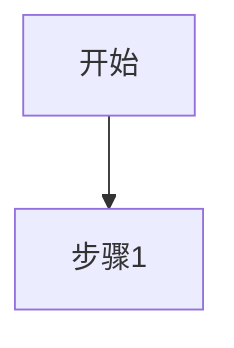

# 技术方案说明书V3.1格式检查报告

**检查日期：** 2026年04月09日  
**检查人员：** 孔维康  
**检查对象：** 技术方案说明书_国际物流航空货站运行平台及海关信息平台_V3.1.md  
**参照模板：** PRD文档模板（/Users/apple/Desktop/文件/kaiwu-project/.trae/skills/pm_skills/template/prd.md）

---

## 一、检查结论

### ❌ 不符合PRD模板格式

技术方案说明书V3.1是**技术方案文档**，而非**PRD需求文档**，两者在文档定位、结构和内容深度上有本质区别。

---

## 二、文档类型对比

| 维度 | PRD文档模板 | 技术方案说明书V3.1 |
|------|------------|-------------------|
| **文档定位** | 产品需求文档，描述"做什么" | 技术方案文档，描述"怎么做" |
| **目标读者** | 产品经理、开发团队、测试团队 | 技术团队、实施团队、架构师 |
| **内容深度** | 功能需求、业务流程、用户场景 | 系统设计、技术架构、数据结构 |
| **章节结构** | 需求背景→用户场景→功能描述→测试要点 | 引言→总体设计→功能设计→数据结构设计→接口设计 |

---

## 三、结构对比分析

### 3.1 PRD模板章节结构

```
一、需求背景&目标
  1.1 业务需求描述
  1.2 用户痛点
  1.3 业务目标

二、用户与场景
  2.2 目标用户画像
  2.3 应用场景（核心）
  2.4 业务价值

三、详细功能描述
  3.1 功能页面1名称
    3.1.1 功能描述
    3.1.2 页面图片
    3.1.3 业务流程
    3.1.4 角色权限设计
    3.1.5 列表数据规范
    3.1.6 业务模块协同
    3.1.7 功能点详述
    3.1.8 数据模型设计
    3.1.9 UI界面设计
    3.1.10 边界与异常处理

四、非功能性需求

五、测试要点

六、附录
```

### 3.2 技术方案说明书V3.1章节结构

```
1. 引言
  1.1 编写目的
  1.2 范围
  1.3 编制依据
  1.4 术语定义

2. 概述

3. 总体设计
  3.1 设计原则
  3.2 总体架构
  3.3 技术架构
  3.4 数据架构
  3.5 部署架构

4. 功能及流程设计
  4.1 系统功能结构
  4.2 功能模块详细设计（171个页面）
  4.3 功能权限设计
  4.4 界面设计
  4.5 边界与异常处理

5. 数据结构设计
  5.1 逻辑结构设计
  5.2 物理结构设计
  5.3 索引设计
  5.4 表关联关系
  5.5 数据归档策略

6. 中间件设计

7. 人机界面设计

8. 系统安全设计

9. 业务连续性设计

10. 系统接口设计

11. 工程界面设计

12. 软硬件资源需求分析

13. 集成测试设计

14. 演练方案设计

15. 试运行方案设计
```

---

## 四、详细差异分析

### 4.1 缺失的PRD关键章节

| PRD章节 | 技术方案对应情况 | 差异说明 |
|---------|-----------------|---------|
| **一、需求背景&目标** | ❌ 完全缺失 | 无业务需求描述、用户痛点、业务目标章节 |
| **二、用户与场景** | ⚠️ 部分缺失 | 无用户画像、应用场景详细描述 |
| **2.2 目标用户画像** | ❌ 缺失 | 未描述各角色的工作职责、用户特征、核心诉求 |
| **2.3 应用场景** | ⚠️ 简化为业务流程 | 无触发情境、期望目的、前置条件等详细描述 |
| **2.4 业务价值** | ❌ 缺失 | 无量化的业务收益指标 |
| **3.1.2 页面图片** | ❌ 缺失 | 无页面截图 |
| **3.1.5 列表数据规范** | ⚠️ 简化 | 无数据获取方式、排序规则、筛选条件详细定义 |
| **3.1.6 业务模块协同** | ⚠️ 简化 | 无上游/下游模块依赖详细分析 |
| **3.1.7 功能点详述** | ⚠️ 简化为功能点列表 | 无功能点入口、操作逻辑的详细描述 |
| **3.1.9 UI界面设计** | ⚠️ 简化 | 无页面局部结构、UI线框图 ASCII 艺术 |
| **四、非功能性需求** | ⚠️ 分散在各章 | 性能、兼容性、安全要求分散在不同章节 |
| **五、测试要点** | ⚠️ 简化为集成测试设计 | 无功能测试、性能测试、安全测试详细要点 |
| **六、附录** | ❌ 缺失 | 无相关文档链接 |

### 4.2 技术方案特有的章节（PRD模板中无）

| 章节 | 说明 |
|------|------|
| 3. 总体设计 | 技术方案核心，PRD中不需要 |
| 3.3 技术架构 | 技术实现细节，PRD中不需要 |
| 3.4 数据架构 | 技术实现细节，PRD中不需要 |
| 3.5 部署架构 | 技术实现细节，PRD中不需要 |
| 5. 数据结构设计 | 技术方案核心，PRD中仅需要3.1.8数据模型设计 |
| 6. 中间件设计 | 技术实现细节，PRD中不需要 |
| 8. 系统安全设计 | 技术实现细节，PRD中仅需要4.3安全要求 |
| 9. 业务连续性设计 | 技术实现细节，PRD中不需要 |
| 10. 系统接口设计 | 技术实现细节，PRD中仅需要接口定义 |
| 11. 工程界面设计 | 技术实现细节，PRD中不需要 |
| 12. 软硬件资源需求分析 | 技术实现细节，PRD中不需要 |
| 14. 演练方案设计 | 技术实现细节，PRD中不需要 |
| 15. 试运行方案设计 | 技术实现细节，PRD中不需要 |

---

## 五、4.2节页面格式对比

### 5.1 技术方案当前格式

```markdown
### 4.2.X [一级目录-二级目录] 页面名称

**功能目标：** 简述

**核心功能点：**
1. 功能点1
2. 功能点2

**业务流程：**
1. 步骤1
2. 步骤2
```

### 5.2 PRD模板要求的格式

```markdown
### 3.1.X 功能页面X名称

#### 3.1.X.1 功能描述
- **功能名称**：
- **功能目标**：
- **功能价值**：

#### 3.1.X.2 页面图片
- [页面截图]

#### 3.1.X.3 业务流程


#### 3.1.X.4 角色权限设计
##### 3.1.X.4.1 角色权限矩阵
| 权限项 | 角色1 | 角色2 | 系统管理员 |
|--------|-------|-------|-----------|
| [查看列表] | ✅ | ✅ | ✅ |

##### 3.1.X.4.2 数据权限规则
| 角色 | 数据范围 | 说明 |

#### 3.1.X.5 列表数据规范
##### 3.1.X.5.1 数据获取方式
| 属性 | 描述 |
|------|------|
| **数据来源** | |
| **获取方式** | |

##### 3.1.X.5.2 列表排序规则
| 优先级 | 排序字段 | 排序方式 |

##### 3.1.X.5.3 列表字段定义
| 序号 | 字段名称 | 数据类型 | 显示格式 | ... |

##### 3.1.X.5.4 筛选条件
| 序号 | 筛选字段 | 控件类型 | 查询方式 |

#### 3.1.X.6 业务模块协同
##### 3.1.X.6.1 上游模块依赖
| 上游模块 | 依赖类型 | 依赖说明 |

##### 3.1.X.6.2 下游模块影响
| 下游模块 | 影响类型 | 影响说明 |

##### 3.1.X.6.3 模块协同流程图
```text
[上游模块] --> [本模块] --> [下游模块]
```

##### 3.1.X.6.4 数据一致性规则
| 规则编号 | 规则描述 | 触发条件 |

#### 3.1.X.7 功能点详述
##### 3.1.X.7.1 功能点一
###### 3.1.X.7.1.1 功能点描述
###### 3.1.X.7.1.2 功能点入口
| 属性 | 描述 |
|------|------|
| **入口位置** | |
| **入口形式** | |

###### 3.1.X.7.1.3 功能点业务规则
| 规则编号 | 规则名称 | 规则描述 | 优先级 |

###### 3.1.X.7.1.4 功能点操作逻辑
| 元素 | 类型 | 触发条件 | 行为描述 | 反馈方式 |

#### 3.1.X.8 数据模型设计
##### 3.1.X.8.1 主实体
**表单标识**：
| 序号 | 字段名称 | 字段标识 | 数据类型 | ... |

##### 3.1.X.8.2 关联实体
| 实体名称 | 表单标识 | 关联类型 |

#### 3.1.X.9 UI界面设计
##### 3.1.X.9.1 页面局部结构
```text
页面根节点
├── KaiwuFlexDrawer
└── KaiwuFlexLayout
```

##### 3.1.X.9.2 UI线框图
###### 3.1.X.9.2.1 主列表页面
```text
┌─────────────────────┐
│  搜索区域            │
├─────────────────────┤
│  工具栏              │
├─────────────────────┤
│  数据列表            │
└─────────────────────┘
```

###### 3.1.X.9.2.2 新增/编辑表单对话框
###### 3.1.X.9.2.3 详情页抽屉

#### 3.1.X.10 边界与异常处理
##### 3.1.X.10.1 网络异常
| 场景 | 检测方式 | 处理方式 | 用户提示 |

##### 3.1.X.10.2 数据异常
| 场景 | 检测方式 | 处理方式 | 用户提示 |

##### 3.1.X.10.3 权限异常
| 场景 | 检测方式 | 处理方式 | 用户提示 |

##### 3.1.X.10.4 操作冲突
| 场景 | 检测方式 | 处理方式 | 用户提示 |

##### 3.1.X.10.5 输入异常
| 场景 | 检测方式 | 处理方式 | 用户提示 |
```

---

## 六、格式符合度评估

### 6.1 总体符合度

| 检查项 | 符合度 | 说明 |
|--------|-------|------|
| **文档结构** | 30% | 技术方案结构与PRD模板差异较大 |
| **章节命名** | 20% | 章节命名方式与PRD模板不一致 |
| **内容深度** | 40% | 功能描述较简化，缺少详细设计 |
| **表格格式** | 50% | 部分使用表格，但格式不统一 |
| **流程图** | 30% | 有业务流程，但缺少Mermaid格式规范 |
| **UI设计** | 10% | 缺少详细的UI线框图 |
| **异常处理** | 60% | 有异常处理章节，但粒度不够细 |

### 6.2 综合评分

| 评分项 | 权重 | 得分 | 加权得分 |
|--------|------|------|---------|
| 文档结构规范性 | 20% | 3/10 | 0.6 |
| 章节完整性 | 20% | 4/10 | 0.8 |
| 内容详细程度 | 25% | 4/10 | 1.0 |
| 格式统一性 | 15% | 5/10 | 0.75 |
| 流程图规范性 | 10% | 3/10 | 0.3 |
| UI设计详细度 | 10% | 1/10 | 0.1 |
| **总分** | 100% | - | **3.55/10** |

---

## 七、问题汇总

### 7.1 严重问题（P0）

| 问题编号 | 问题描述 | 影响 |
|---------|---------|------|
| P0-001 | 文档类型不匹配：技术方案≠PRD | 文档定位错误，无法满足产品经理需求 |
| P0-002 | 缺少需求背景&目标章节 | 无法说明"为什么做" |
| P0-003 | 缺少用户画像章节 | 无法描述目标用户特征 |
| P0-004 | 4.2节章节命名格式不一致 | 使用"4.2.X"而非"3.1.X"格式 |

### 7.2 中等问题（P1）

| 问题编号 | 问题描述 | 影响 |
|---------|---------|------|
| P1-001 | 业务流程缺少Mermaid格式规范 | 流程图不够规范 |
| P1-002 | 缺少列表数据规范详细定义 | 无法指导开发实现 |
| P1-003 | 缺少功能点详述 | 功能细节描述不足 |
| P1-004 | 缺少UI线框图 | 界面设计不清晰 |
| P1-005 | 数据模型设计过于简化 | 数据结构定义不完整 |

### 7.3 轻微问题（P2）

| 问题编号 | 问题描述 | 影响 |
|---------|---------|------|
| P2-001 | 页面图片缺失 | 可视化不足 |
| P2-002 | 业务价值未量化 | 无法评估收益 |
| P2-003 | 附录缺失 | 缺少相关文档链接 |

---

## 八、建议措施

### 8.1 方案一：转换为PRD格式（推荐）

**工作量：** 约5-7天

**步骤：**
1. 新增"一、需求背景&目标"章节
2. 新增"二、用户与场景"章节
3. 将4.2节171个页面按PRD模板3.1节格式重构
4. 每个页面补充：功能描述、页面图片、角色权限设计、列表数据规范、业务模块协同、功能点详述、数据模型设计、UI界面设计、边界与异常处理
5. 新增"四、非功能性需求"章节
6. 新增"五、测试要点"章节
7. 新增"六、附录"章节

### 8.2 方案二：保持技术方案格式（折中）

**工作量：** 约2-3天

**步骤：**
1. 在4.2节每个页面中补充缺失的关键内容：
   - 列表数据规范（数据来源、字段定义、筛选条件）
   - 功能点详述（入口、业务规则、操作逻辑）
   - UI线框图（ASCII艺术格式）
   - 边界与异常处理（按场景细化）
2. 保持技术方案的其他章节不变
3. 添加说明：本文档为技术方案，与PRD配套使用

### 8.3 方案三：维持现状

**说明：** 技术方案说明书V3.1作为技术实现文档，与独立的PRD文档配合使用。

---

## 九、结论

### 9.1 核心结论

**技术方案说明书V3.1不符合PRD模板格式要求。**

原因：
1. 文档类型不同：技术方案关注"怎么做"，PRD关注"做什么"
2. 目标读者不同：技术方案面向技术人员，PRD面向产品、开发、测试
3. 章节结构不同：技术方案有15章，PRD有6章
4. 内容深度不同：技术方案在系统架构层面，PRD在功能需求层面

### 9.2 建议

1. **如需要PRD文档**：建议按方案一重新编写，或参考技术方案内容独立编写PRD
2. **如保持技术方案**：建议按方案二补充关键缺失内容，提升文档质量
3. **文档定位**：明确区分技术方案和PRD的使用场景，避免混淆

---

**报告编制：** 孔维康  
**日期：** 2026年04月09日
